# 				反爬虫项目介绍


### 项目阶段介绍

目标：了解反爬虫项目的阶段划分，以及每个阶段要学习的内容

第一阶段

​         反爬虫项目总体介绍，主要包括（背景、需求、流程、架构、openresty介绍、lua语法学习）

第二阶段

​         Lua采集数据写入kafka,搭建项目框架、Streaming读取kafka数据、链路统计功能实现

第三阶段

​         实现数据预处理的数据清洗、脱敏、拆分、分类（飞行类型/操作类型，单程/往返）、解析等功能

第四阶段

​         实现数据预处理的数据历史爬虫、结构化、数据推送、数据预处理监控、前端读取后端数据等功能

第五阶段

​         读取预处理后的数据、进行封装、分别统计八个指标的数据

 第六阶段

​         根据已经算出的八项指标结果，进行爬虫识别、剔除非爬虫数据、写入Redis，写入HDFS,Redis数据恢复等

第七阶段

​         爬虫分析性能的计算与监控、离线指标分析


### 知识点1：项目背景

 **目标：了解反爬虫项目的背景**

​	各大售票网网站对外提供了购票，查票门户，吸引正常用户的同时，也吸引了大量的爬虫用户，爬虫会造成企业内的服务器负载较高，但是转化率极低，企业为了解决这个问题，需要一个反爬虫系统，进行爬虫的识别最终屏蔽爬虫。​	

### 知识点2：项目概述

 **目标：了解企业端有哪些模块**

| 数据管理模块化     | 1、支持对数据采集和分类的配置和管理   <br />2、支持对数据各种处理的配置和管理 |
| ------------------ | ------------------------------------------------------------ |
| 流程管理模块       | 1、支持流程定义和可配置管理   <br />2、根据监控模块反馈的情况，系统自动执行相应的策略  <br />3、支持人工执行相应的策略 |
| 策略管理模块       | 1、支持策略的定义和配置管理  <br />2、配置爬虫和占座行为匹配成功后的系统或人工应对方法   <br />3、关联爬虫和占座行为与机器学习算法的选择和算法参数的阈值 |
| 规则管理模块       | 1、支持规则定义和可配置管理   <br />2、支持人工制定爬虫和占座过滤规则  <br />3、支持定制规则参数阈值 |
| 实时监控模块       | 1、对系统所采集的各种数据和特征进行实时监控和深度分析   <br />2、通过模型分析和预测，智能识别和判断爬虫活动与性质   <br />3、通过监控系统反馈的稳定性和负载情况，间接反映可能的爬虫活动情况 |
| 数据可视化管理模块 | 1、将人工难以识别的数据制定图表或图形化，利于从中发现规律和价值  <br />2、提供各种内置标准报表（转化率、爬取规律、占座规律、爬虫对查定比及系统稳定性的影响等） |

### 知识点3：数据处理的总体流程

**目标：掌握反爬虫项目数据处理的总体流程**

 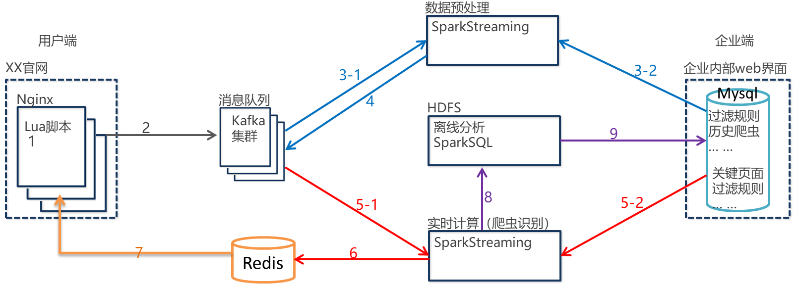

数据采集

 ​	1、通过Lua采集收集反爬虫需要的数据

 ​	2、将收集的数据打入Kafka

 数据预处理

 ​	3-1、在Kafka中读取数据到数据预处理的程序中

 ​	3-2、在数据库中读取相关的规则到程序，准备对数据进行计算。

 ​	4、   将预处理完毕的数据发送回Kafka

 实时计算（爬虫识别）

 ​      5-1、在Kafka中读取预处理后的数据到爬虫识别的程序中

 ​      5-2、在数据库中读取数据到程序

 ​      6、   将识别到的爬虫写入

 离线计算

 ​      8、将预处理后的数据写入HDFS

 ​      9、计算离线指标数据并写入Mysql

 前段展现 

### 知识点4：逻辑架构

 **目标：掌握反爬虫项目的总体逻辑架构**

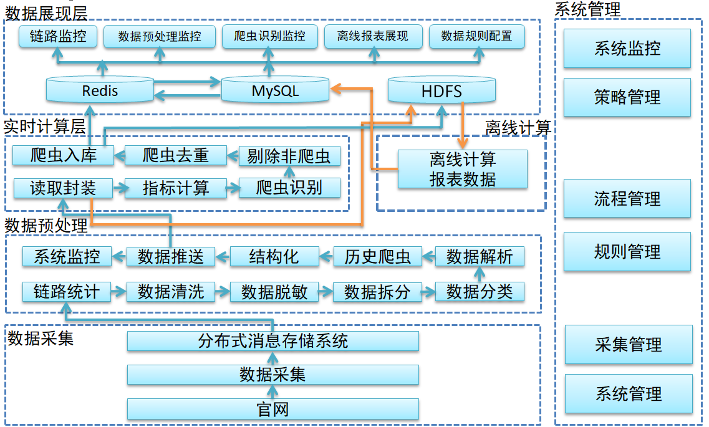


数据采集层：使用数据采集器（lua）将数据采集到分布式消息系统（kafka）

数据处理层：

​			1、读取kafka当中的数据（两种方式）

​			2、进行数据清洗、数据脱敏、数据分类、数据解析、历史爬虫判断、数据结构化

​			3、将结构化数据推送回kafka

实时计算层：

​			1、读取web中配置的规则

​			2、通过规则进行反爬虫实时计算

​			3、将计算结果（爬虫）推送到redis

​			4、将计算当中指标推送到hdfs

离线/准实时计算层：

​			1、读取hdfs中的计算指标

​			2、通过指标进行数据的报表统计

​			3、统计完的数据推送到mysql中

数据展示层：

​			1、mysql通过web报表进行展示

### 知识点5：功能描述

 **目标：详细了解企业端需要那些模块**

数据采集模块：

​			展示：展示了数据采集的数量（多链路），昨天、前天、前三天

​			监控：通过采集数量来监控lua采集脚本是否正常工作

数据分类和处理模块：

​			读取规则：

​					1、规则起始的时候是在mysql数据库中的，是通过web端动态配置的。

​					2、将mysql中的数据读取到redis中使用，提高性能，并提供动态更新功能

​					3、将redis中的规则同步到广播变量中，达到每个节点都能使用的效果。

​			数据处理：

​					1、拿到规则进行数据的清洗、分类等功能

​					2、设计到了部分的指标：cookie、agent、高频ip

报表模块：

​			1、报表是通过离线进行统计的，离线的数据来源是通过流式处理打到hdfs的

​			2、报表的指标包含：购票的转化率、查定比、爬虫的规律、系统稳定性

数据采集


| Requst            | 请求的连接                  |
| ----------------- | --------------------------- |
| Request Method    | 请求的方法                  |
| Remote Address    | 客户端地址                  |
| Request parameter | 请求参数（包括Form 表单）   |
| Content-Type      | "Content-Type"   请求头字段 |
| Cookie            | 请求cookie                  |
| Server Address    | 服务器地址                  |
| Referer           | 跳转来源                    |
| User-Agent        | 用户终端浏览器信息          |
| Time-Iso8601      | 访问时间ISO格式             |
| Time_local        | 访问时间                    |

### 知识点6：系统架构

 **目标：了解本项目的总体技术架构**

 设计策略：

		粗略的技术设计：
		
					1、web端的架构采用的是B/S
		
					2、数据处理采用的是nginx（lua）+kafka+sparkstreaming+spark


 技术选型

		web层：ssh（4以上）
		
		数据处理：hadoop2.7  kafka0.10.1 spark2.1  scala2.11.5 nginx+lua1.8以上

### 知识点7：非功能描述（性能要求）

 **目标：掌握反爬虫项目面试时可能会问的一些问题。这些问题以及效率是反爬虫识别功能、性能之外的知识点。**

kafka的吞吐量：

​				1、每一条日志的大小约为1-2k

​				2、每天大概有2700万条数据

​				3、经计算，吞吐量大概为50G

​				4、假如我们kafka设置的日志超时时间30天，50乘以30乘以备份引子>=1500*n。

sparkstreaming计算量：

​				1、每天计算50G的数据

​				2、计算峰值每天计算100G的数据

页面的响应时间和并发数：

​				1、不超过5s

​				2、并发数为50

数据库的响应和外部接口：

​				1、sql不超过5秒

​				2、保证连接数有20%可用的

​				3、如果提供外部接口，响应时间不能超过5s

### 知识点8：模块分解策略和浏览器兼容性

模块分解策略：

​	数据采集（lua+nginx+kafka）

​	数据预处理（sparkstreaming） 

​	实时计算-爬虫识别（sparkstreaming）

​	数据可视化-展现（ssh）

浏览器的兼容性：

​	支持IE8以上、火狐、谷歌

### 知识点9：数据库ER图

 **目标：了解反爬虫项目使用到的关系型数据库数据表**

--用户

​	account  用户表

​	user_info用户明细表

​	permission权限表

​	system_role角色表

​	ref_user_role用户角色关联表

​	ref_role_permission角色权限关联表

--规则（重点）

​	nh_filter_rule 过滤规则表

​	analyzerrule 分类解析规则表

​	nh_classify_rule分类规则表

​	nh_book_critical_pages预定关键页面表

​	nh_query_critical_pages查询关键页面表

--流程策略配置规则（重点）

​	nh_process_info流程表

​	nh_process_num流程明细数量表

​	nh_rule规则表

​	nh_strategy策略表

--流式计算结果表

​	nh_ip_blacklist ip黑名单
​	nh_ip_whitelist ip白名单
​	climb_monitor 反爬监控表
​	datacollect数据采集
​	datahandle结构化数据
​	real_time_comput_data实时计算监控数据
​	system_data_analysis系统数据分析速度
​	system_function_info系统功能运行情况
​	nh_performancemonitor_offlinespeed 离线分析时间表	

--报表结果

​	nh_link_traffic_information链路流量信息（TPS）
​	nh_agency_customer_analysis 代购客户分析
​	nh_crawler_curday_info爬虫识别情况
​	nh_crawler_query_routes_rank爬虫查询航线排行
​	nh_domestic_inter_conversion_rate国内、国际转化率
​	nh_flight_query_conversion_rate爬虫航班转化率
​	nh_flight_query_rule航班查询爬取规律
​	nh_flow_info流量情况
​	nh_flow_query_rate流量查订比
​	nh_four_flow_num四类用户流量值
​	nh_hit_user_detail命中用户详情
​	nh_illegal_occ_flight_rank爬虫非法占座航班排行
​	nh_user_conversion_rate用户转化率	


### 知识点10：防爬规则

 **目标：了解反爬虫识别的八项指标**

 1、数据源：

 ​	头信息（来源url、访问的url、ip地址、UA、cookie、时间等），

 ​	body信息（用户的信息）

 2、防爬规则：

 ​	 按IP段聚合 -  5 分钟内的 IP 段（IP 前两位）访问量

 ​	 按IP地址聚合 - 某个 IP，5 分钟内总访问量

 ​	 按IP地址聚合 - 某个 IP，5 分钟内的关键页面访问总量

 ​	 按IP地址聚合 - 某个 IP，5 分钟内的 UA 种类数统计

 ​	 按IP地址聚合 - 某个 IP，5 分钟内查询不同行程的次数	

 ​	 按IP地址聚合 -某个 IP，5 分钟内关键页面的访问 的 Cookie 数

 ​	 按IP地址聚合 -某个 IP，5 分钟内的关键页面最短访问间隔

 ​	 按IP地址聚合 -某个 IP， 5 分钟内小于最短访问间隔（自设）的关键页面查询次数

 ​	 按单次看UA等数据浏览器痕迹；按照ip进行统计，并打分，然后计算总分，和阈值进行比较

 3、规律：节假日、会员日、热门航线

 4、特点：一次命中、短期流量高、UA和ip频繁切换、访问频次比较均衡（白天黑天）

### 知识点11：数据采集流程

 **目标：详细了解数据采集的全部过程**

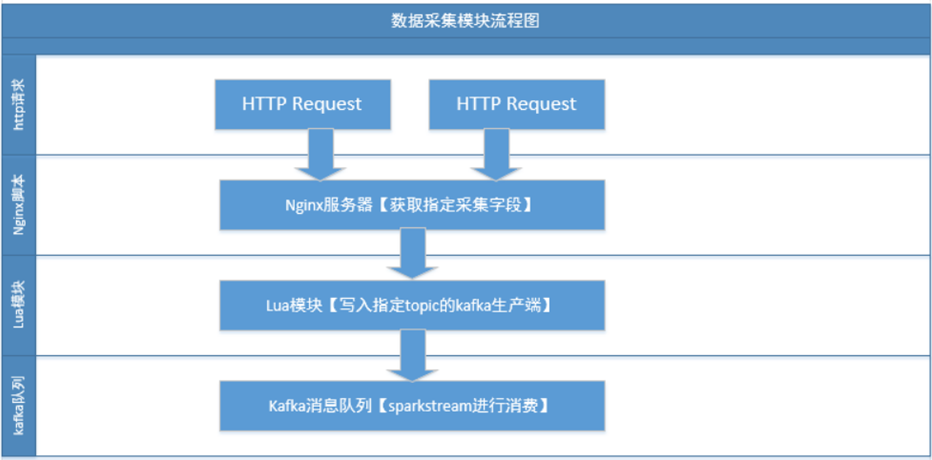

 1、使用openresty搭建官方网站

 ​	nginx：1、在nginx.conf模拟多个url（正常访问的url、js的url、css的url）

 ​			2、在nginx.conf中还要写一个引入lua脚本的操作

 2、lua脚本

 ​	1、读取request数据进行封装，然后创建producer写到kafka中

 ​	2 ​、条数统计：跟随request一起封装，传到kafka

 3、数据源

 ​	1、浏览器：可以通过浏览器模拟真实用户

 ​	2、爬虫：写爬虫程序，生产测试数据（正常访问的url、js的url、css的url）

 4、测试数据是否成功

 ​	1、写一个kafka的消费者，消费数据，看生产步骤是否成功

### 知识点12：Openresty的简介

 **目标：了解Openresty的组成与优势**

 1、openresty=nginx+lua

 2、openresty中的组件包含了mysql、redis、memcached，说明了在openresty里面通过lua就可以访问当redis。

3、	openresty特性 :占用内存小、并发能力强、速度快

### 知识点13：常用的openresty架构

 **目标：了解Openresty的常用架构**

 1、负载均衡：LVS(HA)+核心nginx+业务nginx

  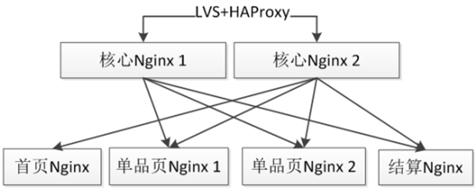

 2、单机闭环（测试环境）：在一个nginx中将数据库和业务进行了隔离，不和别的nginx和数据库进行交互

 ​	问题1：性能瓶颈，单机的nginx内存和硬盘存储会出现瓶颈

 ​	问题2：数据的不一致，每个单机闭环的nginx访问自己的存储系统，导致相互之间数据出现了隔离。从而导致数据不一致。

  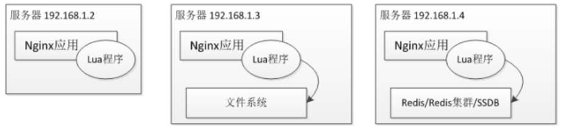

 3、分布式闭环

 ​	分布式闭环解决了单机闭环的两个瓶颈问题，将数据库进行集群或者主从操作，将nginx做成集群。

  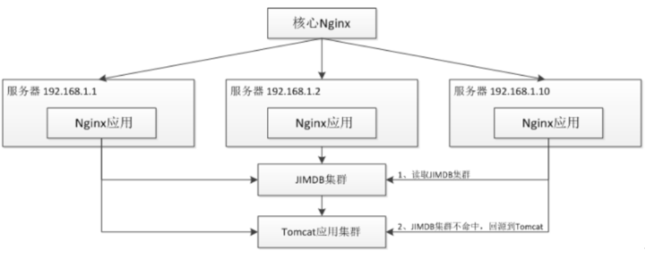

 4、接入网关

 ​	将nginx作为流量入口，后面接入tomcat集群

  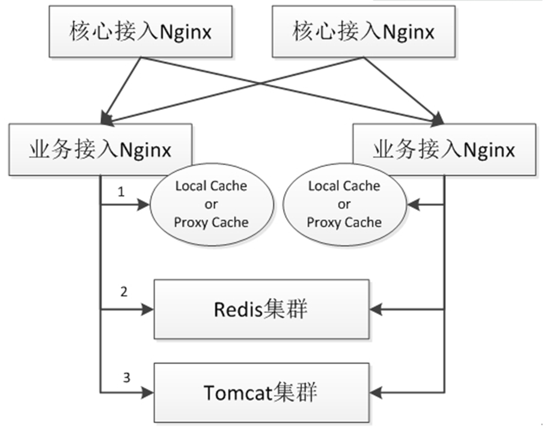

 

### 知识点14：安装openresty

 **目标：实现Openresty的安装部署**

 下载地址：（https://openresty.org/cn/）

 window版本：

 ​			1、解压

 ​			2、执行nginx.exe

 ​			3、访问：http://localhost:80

 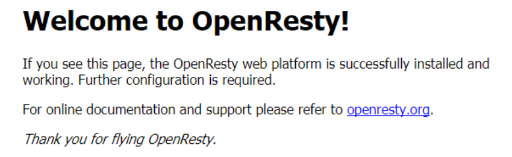


 linux版本：

 ​		1、上传安装包

 ​		2、解压安装包

 ​		3、安装依赖：yum -y install readline-devel pcre-devel openssl-devel perl gcc

 ​		4、配置（安装目录和依赖模块）：

 ​				进入openresty的加压目录内（configure在这个目录下）

 ​				./configure --prefix=/usr/local/openresty --with-http_stub_status_module

 ​		5、安装：make && make install

 ​		6、启动：/usr/local/openresty/nginx/sbin/nginx

​		 7、如果端口占用： netstat -ntlp|grep 80   然后  kill -9  ***

 ​		8、查看页面：http://ip:80

 ​	

### 知识点15：lua的快速入门

 **目标：学习Lua语言的相关语法**

 注意点：openresty本身集成了lua，可以使用，但是如果你不满意版本之类的，那么可以自己安装lua。

 lua交互的两种方式

 ​	1、命令行

 ​		1、输入`lua`命令开启交互窗口

 ​		2、执行打印：print（“hello world”）

 ​	2、脚本：

 ​		1、书写一个lua脚本，扩展名为.lua;helloworld.lua

 ​		2、在脚本中书写：print("hello world")

 ​		3、执行脚本：lua helloworld.lua

#### 变量和数据类型

 1、数据类型（8种）：

 ​	nil：表示的是空值

 ​	number：数值类型

 ​	string：字符串，用单引号或者双引号表示

 ​	boolean：表示的是true或者false

 ​	function：函数类型

 ​	table：表的结构相当于我们之前学的map类型

 2、变量：

 ​	全局变量：所有的变量都为全局变量，除非用local声明的变量

 ​	局部变量：用local声明的变量，局部变量的作用域是从变量声明开始到语句块结束

 ​				比如：声明在函数里面的局部变量，出了函数就不能用了

 ​						声明在整个脚本中的local变量，出了脚本就不能用了

 ​	表中的域：声明在表中的变量

#### 运算符操作

 1、赋值运算符：用“=”表示

 2、算数运算符：+  -  *  /  %   ^  -

 3、关系运算符:  >   <   >=   <=    ~=

 4、逻辑运算符:  and  or  not

 5、其他运算符:    ..     #

#### lua流程控制

 1、条件

 语法：

 1、简单的if

 ```linux
 if(条件) 
 	then
 	 执行体
 	end
 
 ```

 2、if else

 ```linux
 if(条件)
 	then
 	 执行体
 	else
 	 执行体
 	end
 ```

 3、if嵌套

 ```
 if(条件)
 	then
 	if（条件）then
 		执行体
 	end
 else
 	执行体
 end
 ```

 2、while和repeat的循环语句

 while语法

 ```linux
 while(条件)
 do
 	执行体
 end
 ```

 ​	先做条件判断，后执行循环体

 ​	当条件满足，执行循环体

 repeat语法

 ```linux
 repeat
 执行体
 until（条件）
 ```

 ​	先执行循环体，后进行条件判断
 ​	当条件满足，退出循环体

 3、for循环

 ```linu
 for i=exp1,exp2,exp3
 do
 	执行体
 end
 ```

 exp1：开始的值

 exp2：结束的值

 exp3：步长​		

#### 数组和泛型for循环

 数组：数组的角标是从1开始的，并且长度不固定

 ​	arr={"string"，number}

 泛型for循环

 ```
 for 角标，值 in ipairs(arr)
 do
 执行体
 end
 ```

#### 数据类型转换

 1、tostring：将数值或者boolean类型的值转换为字符串

 2、tonumber：将字符串类型的数值转换为真正的数值

#### 函数的定义

 ```
 全局或者局部 function 函数名f1（参数1，参数2.......）
 
 函数体
 
 return 返回值1，返回值2......
 
 end
 ```

 调用：

 local x,y,z = f1(a,b,c,d)

#### lua的table

 1、创建table：mytable={ip="192.168.56.111",port=9092}

 2、取值：mytable.ip

### lua的模块

 1、lua的moudle其实就是lua中的工具类的概念，也类似于js中的jquery这样的包

 2、使用的方式

 ​	1、定义一个模块

 ​	2、自己写一个脚本，如果使用到某一个模块，通过require这个关键字引入模块，然后就可以使用模块中的变量和方法

### 知识点16：nginx集成lua

 **目标：掌握Nginx集成Lua的两种方式**

 1、第一种方式：通过代码块的方式集成

 ```lua
 	content_by_lua_block{
 	ngx.say("hello world")
 }
 ```

 2、第二种方式：通过引入脚本的方式

 ```lua
 content_by_lua_file /usr/local/openresty/test/mytest.lua
 ```

### 知识点17：获取http请求参数

 **目标：掌握Lua获取http请求参数的用法**

 1、获取url的请求参数

 ​	get方式的请求参数：ngx.req.get_uri_args()，返回值是数组，需要遍历

 ​	post方式的请求参数：

 ​			1、解析body：ngx.req.read_body()

 ​			2、获取：ngx.req.get_post_args()

 2、获取header的信息

 ​	ngx.req.get_headers()

 3、获取body的信息

 ​		 1、解析body：ngx.req.read_body()

 ​		2、获取：ngx.req.get_body_data()

### 知识点18：openresty连接redis

 **目标：掌握Openresty连接Redis的用法**

 1、引入redis的模块：

​	local importRedis= require "resty.redis"

 2、实例对象：

​	local redis=importRedis:new()

 3、创建连接：

​	local ok,err=redis:connect("192.168.100.160",7002)

 4、调用命令：

​	local ok,err=redis:get("heima")

=======================================================================================


# 									  数据采集


### 知识点19：kafkaAPI回顾

 **目标：回顾Kafka 生产者的API**

 	1、	创建kafka 生产者

​		KafkaProducer<String,String> kafkaProducer=new KafkaProducer<String, String>(props);

​	2、	创建数据的载体

​		ProducerRecord<String,String> record=new ProducerRecord<String,String>("test","123456");

​	3、	发送数据

​		kafkaProducer.send(record);

​	4 、	关闭生产者 

​		kafkaProducer.close();


### 知识点20：lua集成kafka的配置文件

 **目标：掌握Lua集成kafka采集数据时的相关配置**

 说明：在lua采集request数据生产到kafka之前，需要对nginx.conf进行配置，以满足收集的要求

 1、开启了一个共享字典，供每个nginx进行消费，这个变量是用来记录消息数（count），然后用来均衡数据

 2、开启了nginx的监控和加载lua的配置文件

 3、将Lua集成kafka的第三方依赖包上传至集群


### 知识点21：lua脚本书写

 **目标：编写Lua采集数据并发送至Kafka的脚本**

​	1	导入依赖包

​	2	创建kafka 生产者 

​	3 	创建数据的载体 

​	4	发送数据


 自定义分区数

 ​	1、在nginx中设置共享内存

 ​	2、在lua的脚本中取出共享内存，然后在内存中获取count

 	3、获取到count对topicpartitions进行取余操作，确定分区

 	4、将count进行自增操作

收集数据到kafka

 	1、采集request、 time_local等支撑反爬虫项目的数据

 ​	2、将数据使用“#CS#”进行拼接

 ​	3、发送数据到kafka

 

### 知识点22：Streaming消费kafka的两种方式

 **目标：掌握Streaming消费kafka的两种方式**

 方式：KafkaUtils.createStream()和KafkaUtils.createDirectStream() 

 ​	KafkaUtils.createDirectStream

 ​		调用的是低层次（最原始的）的API

 ​		kafka的offset 是由程序员自己或者DirectStream维护的

 ​		只写数据，写一次数据

 ​		创建的rdd数量与kafka topic 的partition数量相同（有关系）

 ​	KafkaUtils.createStream

 ​		调用的是高层（经过二次封装）次的API

 ​		kafka的offset 是由zookeeper维护的

 ​		需要写WAL 日志，再写数据，实际上是写了两次数据

 ​		创建的rdd数量与kafka topic 的partition没有关系

 

### 知识点23：CreateDirectStream消费数据的步骤

 **目标：掌握CreateDirectStream消费数据的步骤**

​	1、	创建Spark conf

```
val conf=new SparkConf().setMaster("local[2]").setAppName("TestCreateDirectStream")
```

​	2、	创建SparkContext

```
val  sc=new SparkContext(conf)
```

​	3 、	创建Streaming Context

```
val ssc=new StreamingContext(sc,Seconds(2))
```

​	4 、	读取kafka内的数据ssc,kafkaParams,topics)

```
 val kafkaDatas=KafkaUtils.createDirectStream[String,String,StringDecoder,StringDecoder](ssc,kafkaParams,topics)
```

​	5 、	消费数据

```
kafkaValue.foreachRDD(rdd=>rdd.foreach(println))
```

​	6、	开启Streaming任务+开启循环

```
ssc.start()
ssc.awaitTermination()
```

=======================================================================================


# 				数据预处理

### 知识点24：DataProcess数据处理

 **目标：编写数据预处理程序的主程序入口代码**

 1、创建项目

 2、引入pom的文件

 3、引入工具类、bean、枚举类

 4、写dataprocess的驱动类（DataProcessLauncher），在dataprocess中步骤如下

 ​	1、定义日志级别和批处理完成后任务结束的设置

 ​	2、在main方法中定义conf、SparkContext

 ​	3、读取kafka的参数，定义方法，设置sparkStreaming的业务处理

 5、创建setupSsc方法

 ​	1、创建streamingcontext

 ​	2、创建kafka消费的DirectStream

 - ​	3、打印消息

 ​	4、返回ssc


### 知识点25：链路统计功能

 **目标：企业需要实时了解每个链路的运行情况、数据采集量、活跃链接数等信息。需在数据在采集时实时展现相关的信息在前台界面（管理界面）**

 思路与关键代码：

​	1 、	统计每个批次每台服务器访问的总量

​			获取到一条数据，使用“#CS#”对数据进行切割，

​			获取切分后的第十个数据（角标是9），将第十个数据和1，进行输出

​			调用reducebykey（下划线_+_下划线）求去除这个批次每台服务器的放总量

```
val serverCount=rdd.map(message=>{
  //2 抽取出服务器的IP
  var ip=""

  if (message.split("#CS#",-1).length>9){
    ip=message.split("#CS#",-1)(9)
  }

  //3  将ip和1返回
  (ip,1)
}).reduceByKey(_+_)//4 调用reducebykey  计算出ip和总数
```

​	2、	统计每个批次每台服务器当前活跃链接数的量

​			获取到一条数据，使用“#CS#”对数据进行切割， 

​			获取切分后的第十二个数据（角标是11）和第十个数据（角标是9），

​			将第十个数据和第十二个数据，进行输出

​			调用reducebykey（(k,v)=>v）求去每个服务器多个数据中的最后一个数据

```
//1获取到一条数据，使用“#CS#”对数据进行切割
 val activeUserCount= rdd.map(message=>{
    var ip =""
    var activeUserCount=""
    //切分数据
    if (message.split("#CS#").length>11){
      //2获取切分后的第十二个数据（角标是11）和第十个数据（角标是9）
      //截取当前活跃连接数
      activeUserCount=message.split("#CS#")(11)
      //截取IP
      ip=message.split("#CS#")(9)
    }
    //3将第十个数据和第十二个数据，进行输出
    (ip,activeUserCount)

  }).reduceByKey((k,v)=>v)//4调用reducebykey（(k,v)=>v）求去每个服务器多个数据中的最后一个数据
```


​	3、 	将两批数据写入redis

​		在两个数据不为空的前提下，将两个数据转换成两个小的map 

```
if (!serverCount.isEmpty()  && !activeUserCount.isEmpty()){
  //将两个数据转换成两个小的map
  val serverCountMap=serverCount.collectAsMap()
  val activeUserCountMap=activeUserCount.collectAsMap()
  }
```

​		封装最终要写入redis的数据(将两个小的MAP封装成一个大的MAP)

```
val Maps=Map(
  "serversCountMap"->serverCountMap,
  "activeNumMap"->activeUserCountMap
)
```

​		在配置文件中读取出数据key的前缀，+时间戳（redis中对数据的key）

```
val key=PropertiesUtil.getStringByKey("cluster.key.monitor.linkProcess","jedisConfig.properties")+System.currentTimeMillis().toString
```

​		在配置文件中读取出数据的有效存储时间

```
val time=PropertiesUtil.getStringByKey("cluster.exptime.monitor","jedisConfig.properties").toInt
```

​		将数据写入redis

```
redis.setex(key,time,Json(DefaultFormats).write(Maps))
```


### 知识点26：数据清洗

 **目标： 数据中含有html、css、 js、 jpg、 png等无用的数据，为使预处理更高效需将无用的数据过滤掉，只保留有效的数据**

 思路与关键代码：

 ​	1、	读取Kafka中的数据到预处理程序中

 ​	2 、	读取mysql数据库中的数据过滤规则到预处理程序

```
var filterRuleList: ArrayBuffer[String]=AnalyzeRuleDB.queryFilterRule()
```

 ​	3、	将数据过滤规则加载到广播变量，可以让所有的executer都能访问到

```
@volatile  var broadcastFilterRuleList= sc.broadcast(filterRuleList)
```

 ​	4、	在redis 内添加是否需要更新数据过滤规则的标识，每批次都从redis中读取这个标识，判断是否需要更新数据过滤规则

```
val NeedUpDateFilterRule=redis.get("NeedUpDateFilterRule")
```

 ​	5.1、	若不需要更新，那么直接过滤数据

 ​	5.2、	若需要更新，那么在数据库中重新读取新的过滤规则到程序中

```
filterRuleList=AnalyzeRuleDB.queryFilterRule()
```

 ​		5.2.1将广播变量清空

```
broadcastFilterRuleList.unpersist()
```

 ​		5.2.2将新的规则重新加载到广播变量

```
broadcastFilterRuleList= sc.broadcast(filterRuleList)
```

 ​		5.2.3将redis内是否需要更新规则的标识改为“false”

```
redis.set("NeedUpDateFilterRule","false")
```

 ​	6、	进行数据的过滤

 ​		6.1  	定义方法，参数为一条数据和广播变量

```
URLFilter.filterURL（）
```

 ​		6.2	截取出数据中的url 


 ​		6.3	遍历数据过滤的规则，拿url 与过滤规则进行匹配，

```
val request= if(message.split("#CS#").length>1) message.split("#CS#")(1) else ""
```

 ​		6.4	若匹配成功表示，需要删除，返回false

 ​		6.5	若匹配不成功表示，表示不需要删除，返回true

```
var save=true

for(rule<-FilterRuleList){
  //若匹配成功表示，需要删除，返回false
  if (request.matches(rule)){
    //将标记改为false
    save=false
  }
}
```

 ​		6.6	调用RDD的filter进行数据的过滤

```
val filteredData=rdd.filter(message=>URLFilter.filterURL(message,broadcastFilterRuleList.value))
```


### 知识点27：数据脱敏

 **目标： 数据中含有身份证号码、手机号码等敏感信息，为防止数据泄露，需将敏感进行进行加密操作。**

 思路与关键代码：

  手机证号码脱敏

 ​	1、	获取kafka 的数据

 ​	2、	获取手机号和身份证号码的正则表达式

```
val phonePattern = Pattern.compile("((13[0-9])|(14[5|7])|(15([0-3]|[5-9]))|(17[0-9])|(18[0,5-9]))\\d{8}")
```

 ​	3、	使用正则匹配数据获取出有可能是手机号的数据

```
val phones=phonePattern.matcher(encryptedData)
```

 ​	4、	判断出一定是手机号的数据

 ​	4.1、	手机号码前一个位置不是数字，并且后一位也不是数字，那么表示这个一定是手机号

 ​	4.2、	手机号码前一个位置不是数字，并且手机号码是一条数据中的最后一个数据，那么表示这个一定是手机号

​	5、	确定出是手机号后，将手机号加密，替换原始的数据

```
//3 判断出一定是手机号的数据
//3-1手机号码前一个位置不是数字，并且手机号码是一条数据中的最后一个数据，那么表示这个一定是手机号
if (!befLetter.matches("^[0-9]$")){
  //若手机号的最后一位后面的角标大于数据的总长度  那么表示这个手机号是数据的最后一位
  if (aftIndex>encryptedData.length){
    //确定出是手机号后，将手机号加密，替换原始的数据
    encryptedData=encryptedData.replace(phone,md5.getMD5ofStr(phone))
  }else{//表示数据不是最后一位
    //3-2手机号码前一个位置不是数字，并且后一位也不是数字，那么表示这个一定是手机号
    //获取到手机号码最后一位数字  后面一位的字符
    val aftLetter=encryptedData.charAt(aftIndex).toString
    if(!aftLetter.matches("^[0-9]$")){
      //确定出是手机号后，将手机号加密，替换原始的数据
      encryptedData=encryptedData.replace(phone,md5.getMD5ofStr(phone))
    }
  }
}
```

 ​

  身份证号码脱敏

 ​	与手机号码脱敏实现基本相同

 ​	不同之处在于，这里使用身份证的正则，号码的长度是18位


### 知识点28：数据拆分

 **目标： 此时数据为使用“#CS#”进行拼接的一条数据，后续的计算中会频繁使用数据内的各个组成部分。为便于后续预处理的使用，需在此处将数据进行拆分，拆分成一个个独立的数据，最终封装成Tuple，以便后续使用。**

 思路与关键代码：

​	1、	在数据脱敏的数据基础之上，使用#CS#对数据进行拆分

​	2、	获取纯url 数据，requestMethod、contentType等等

​	3、	将拆分出来的每个数据转换成Tuple返回	


### 知识点29-1：数据分类（飞行类型-操作类型）

 **目标：**确定一条数据的业务场景。**根据数据库中配置的规则（四种），与解析出的url进行匹配，这个url匹配上哪个匹配成功，表示这个数据就是这个规则类型的数据。**

 ​规则类型

 ​				国内查询（0-0）   国内预定（0-1）   国际查询（1-0）  国际预定（1-1）

 思路与关键代码： 

 ​	1、	读取数据分类规则（四种规则，每种单独读取）到预处理程序

```
var RuleMaps=AnalyzeRuleDB.queryRuleMap()
```

 ​	2、	将数据分类规则加载到广播变量

```
@volatile  var broadcastRuleMaps=sc.broadcast(RuleMaps)
```

 ​	3、	在redis 内添加是否需要更新数据分类规则的标识，每批次都从redis中读取这个标识，判断是否需要更新数据分类规则

 ​	4.1、	若不需要更新，那么直接执行分类操作

 ​	4.2、	若需要更新，那么在数据库中重新读取新的分类规则到程序中

```
RuleMaps=AnalyzeRuleDB.queryRuleMap()
```

 ​		4.2.1将广播变量清空

```
broadcastRuleMaps.unpersist()
```

 ​		4.2.2将新的分类规则重新加载到广播变量

```
broadcastRuleMaps=sc.broadcast(RuleMaps)
```

 ​		4.2.3将redis内是否需要更新规则的标识改为“false”

```
redis.set("NeedUpDateClassifyRule","false")
```

 ​	5、	进行数据的分类

 ​		5.1  	定义方法，参数为经过拆分后的URL 和分类的广播变量

```
val requestType: RequestType= RequestTypeClassifier.classifyByRequest(requestUrl,broadcastRuleMaps.value)
```

 ​		5.2	先在分类的广播变量中获取四种业务场景的规则

```
//1先在分类的广播变量中获取四种业务场景的规则
//国内查询规则
val nqRuleList=RuleMaps.get("nqRuleList")
//国际查询规则
val iqRuleList=RuleMaps.get("iqRuleList")
//国内预定规则
val nbRuleList=RuleMaps.get("nbRuleList")
//国际预定规则
val ibRuleList=RuleMaps.get("ibRuleList")
```

 ​		5.3	遍历四种规则与数据进行匹配

 ​			数据与哪种匹配成功，表示这个数据就是这种类型，最终返回类型 ​

```
//遍历国内查询规则
for(nqRule<-nqRuleList  if flag){
  //使用数据匹配国内查询的规则   若匹配成功表示  这个url 所在的数据就是“国内查询”
  if (requestUrl.matches(nqRule)){
    flag=false
    //到了这一步就可以断定这个数据的业务类型
    requestType=RequestType(FlightTypeEnum.National,BehaviorTypeEnum.Query)
  }
}
```

​			最终返回类型(国内查询    国内预定    国际查询   国际预定 )


### 知识点29-2：数据分类（单程/往返）

 **目标：根据数据 httpReferrer内日期格式数据出现的次数，判断此条数据的单程、往返、其他。**

 ​	0个日期表示“其他” Unknown，      1个日期表示“单程” OneWay，      2个日期表示“往返” RoundTrip

 思路与关键代码： 

​	1、	使用问号“？”对数据进行切割，获取切割后的第二个数据

```
httpReferrer.contains("?") && httpReferrer.split("\\?").length>1
```

​	2、	在第一步的基础上，对数据使用“&”进行切割，获取切割后的所有数据

```
val params=httpReferrer.split("\\?")(1).split("&")
```

​	3、	遍历每一个数据，在使用“=” 进行切割，获取切割后的第二个数据

```
val keyAndValue=param.split("=")
```

​	4、 	用第三步的数据匹配日期的正则

​	5、 	匹配成功计数器加一（计数器用于记录日期格式的数据出现的次数）

```
if (keyAndValue.length>1 && keyAndValue(1).matches(regex)){
  //5匹配成功计数器加一（计数器用于记录日期格式的数据出现的次数）
  dateCounts+=1
}
```

​	6、	根据计数器的值返回数据（OneWay，RoundTrip，Unknown）

```
if(dateCounts==0){//一个日期格式的数据都没有   其他
  travelType=TravelTypeEnum.Unknown
}else if (dateCounts==1){//出现1个日期格式的数据   单程
  travelType=TravelTypeEnum.OneWay
}else if (dateCounts==2){//出现2个日期格式的数据   往返
  travelType=TravelTypeEnum.RoundTrip
}
```


### 知识点30-1:  查询类数据的解析

 **目标：解析出查询数据中的“出发地、目的地、起飞时间”等数据** 

 思路与关键代码： 

​	解析出requestType （requestType  标记了这个数据的业务场景）和 travelType （单程，往返）

​	1、 	读取数据库内的数据解析规则到预处理程序（将表内的所有查询规则数据全部读取到程序内）

```
var  queryRule=AnalyzeRuleDB.queryRule(0)
```

​	2、 	将规则加载到广播变量，并循环判断是否需要更新（内含多个步骤，此处省略）

```
@volatile  var broadcastQueryRules=sc.broadcast(queryRule)
```

​	3、 	对数据进行解析（在多种解析规则的情况下，确定最终使用哪一个规则进行解析）

​		解析过程需要使用到数据和规则

```
val queryRequestData = AnalyzeRequest.analyzeQueryRequest( requestType, requestMethod, contentType,requestUrl, requestBody, travelType, broadcastQueryRules.value)
```


### 知识点30-2:预定类数据的解析

 **目标：解析出预定数据中的“出发地、目的地、起飞时间”等数据** 

 思路与关键代码：

​		数据解析规则不同，其他逻辑与查询类数据的解析相同


### 知识点31：历史爬虫判断

 **目标：结合历史出现过的爬虫数据，判断当前批次的每一条数据是否在历史爬虫中出现过。若出现过，返回True,  反之返回False** 

 思路与关键代码：

​	1、	读取数据库内历史出现过的黑名单数据到预处理程序中

```
var blackIpList=AnalyzeRuleDB.getBiackIpDB()
```

​	2、	 将历史爬虫添加到广播变量、并循环判断是否需要更新（内含多个步骤，此处省略）

```
@volatile var  broadcastBlackIpList= sc.broadcast(blackIpList)
```

```
val NeedUpDateBlackIPList= redis.get("NeedUpDateBlackIPList")
 if(!NeedUpDateBlackIPList.isEmpty && NeedUpDateBlackIPList.toBoolean){
   blackIpList=AnalyzeRuleDB.getBiackIpDB()
   broadcastBlackIpList.unpersist()
   broadcastBlackIpList= sc.broadcast(blackIpList)
   redis.set("NeedUpDateBlackIPList","false")
 }
```

​	3、	将数据中的ip与历史出现过的黑名单IP数据进行对比，判断是否相等

```
val isFreIP= IpOperation.isFreIP(remoteAddr,broadcastBlackIpList.value)
```

​	4、	若有任意一个是相等的返回true  ,反之返回false

```
var isFreIP=false
//遍历每一个历史出现过的IP
for(blackIp<-blackIpList){
  //表示出现过
  if (remoteAddr.equals(blackIp)){
    isFreIP=true
  }
}
```

### 知识点32：数据结构化

 **目标：将经过拆分的数据和与前面计算出来的各个指标（国内查询、国际预定、单程、往返、解析出的数据、是否是历史爬虫）封装成ProcessedData**

 思路与关键代码：

 ​	1、	根据ProcessedData所需的参数，准备数据

 ​	2、	参数中缺少requestParams: CoreRequestParams，此参数需要使用经过解析后的数据(出发地、目的地、起飞时间)进行封装	

```
var depcity=""
var arrcity =""
var flightDate=""
//在查询解析后的数据中抽取出出发地、目的地、起飞时间
queryRequestData match {
  case Some(datas)=>
    depcity=datas.depCity
    arrcity=datas.arrCity
    flightDate=datas.flightDate
  case None=>
}
```

```
val requestParams: CoreRequestParams=CoreRequestParams(flightDate,depcity,arrcity)
```

 ​	3、	封装好CoreRequestParams后所有参数就绪，封装ProcessedData，并返回

```
ProcessedData("", requestMethod, requestUrl,remoteAddr, httpUserAgent, timeIso8601,serverAddr, isFreIP,
  requestType, travelType,requestParams,cookieValue_JSESSIONID, cookieValue_USERID,queryRequestData,
  bookRequestData,httpReferrer)
```

 ​	4、	ProcessedData内的toKafkaString方法将每个属性之间使用“#CS#”进行拼接，最终形成一个字符串

```
processedData.toKafkaString()
```


### 知识点33-1：数据推送（查询类）

 **目标：根据业务场景，将相应的数据推送到相应的topic内。**

 ​	查询的数据推送到查询的Topic内，预定的数据推送到预定的Topic内

 思路与关键代码： 

​	1、	获取到结构化后数据数据，过滤掉预定的数据,只保留查询的数据

```
val queryDatas = DataProcess.filter(message=>message.requestType.behaviorType==BehaviorTypeEnum.Query).map(message=>message.toKafkaString())
```

​	2、	在配置文件中读取查询类的Topic到程序中

```
val queryTopic= PropertiesUtil.getStringByKey("target.query.topic","kafkaConfig.properties")
```

​	3、	创建kafka生产者 

​	4、	数据的载体 

​	5、	数据的发送

​	6、	关闭生成者

```
//遍历数据的分区
queryDatas.foreachPartition(partition=>{
  //2创建kafka生产者
  val kafkaProducer=new KafkaProducer[String,String](props)
  //遍历partition 内的数据
  partition.foreach(message=>{
    //3数据的载体
    val record=new ProducerRecord[String,String](queryTopic,message)
    //4数据的发送
    kafkaProducer.send(record)
  })
  //5关闭生成者
  kafkaProducer.close()
})
```

### 知识点33-2：数据推送（预定类）

 **目标：根据业务场景，将相应的数据推送到相应的topic内。**

​	查询的数据推送到查询的Topic内，预定的数据推送到预定的Topic内

 思路与关键代码： 

​	1、	获取到结构化后数据数据，过滤掉查询的数据,只保留预定的数据

```
val bookDatas = DataProcess.filter(message=>message.requestType.behaviorType==BehaviorTypeEnum.Book).map(message=>message.toKafkaString())
```

​	2、  在配置文件中读取预定类的Topic到程序中

```
val bookTopic= PropertiesUtil.getStringByKey("target.book.topic","kafkaConfig.properties")
```

​	3、	创建kafka生产者 

​	4、	数据的载体 

​	5、	数据的发送

​	6、	关闭生成者

```
   bookDatas.foreachPartition(partition=>{
      //2创建kafka生产者
      val kafkaProducer=new KafkaProducer[String,String](props)
      //遍历partition 内的数据
      partition.foreach(message=>{
        //3数据的载体
      val record=new ProducerRecord[String,String](bookTopic,message)
      //4数据的发送
      kafkaProducer.send(record)

    })
    //5关闭生成者
    kafkaProducer.close()
    })
```

### 知识点34：任务监控

 **目标：监控每个链路，一个批次内采集的数据量、数据预处理程序的健康状况、预处理的速度等信息，最终以图表的形式直观的展示**

 思路与关键代码：

​	1、开启任务监控功能（SparkConf）

```
.set("spark.metrics.conf.executor.source.jvm.class", "org.apache.spark.metrics.source.JvmSource")//开启集群监控功能
```

​	2、通过	http://localhost:4040/metrics/json/  url获取json数据

```
val url = "http://localhost:4040/metrics/json/"
val jsonData = SparkMetricsUtils.getMetricsJson(url)
```

​	3、获取“gauges”对应的数据

```
val gaugesJson = jsonData.getJSONObject("gauges")
```

​	4、拼接结束时间的path

```
val endTimePath = appId + ".driver." + appName + ".StreamingMetrics.streaming.lastCompletedBatch_processingEndTime"
```

​	5、拼接开始时间的path

```
val startTimePath = appId + ".driver." + appName + ".StreamingMetrics.streaming.lastCompletedBatch_processingStartTime"
```

​	6、获取出开始时间和结束时间 

```
val tmpStartTime = gaugesJson.getJSONObject(startTimePath)
//后去最终的开始时间戳
var startTime: Long = 0
if (tmpStartTime != null) {
  startTime = tmpStartTime.getLong("value")
}

//获取出结束时间
val tmpEndTime = gaugesJson.getJSONObject(endTimePath)
//后去最终的开始时间戳
var endTime: Long = 0
if (tmpEndTime != null) {
  endTime = tmpEndTime.getLong("value")
}
```

​	7、求出时间差（结束时间-开始时间）

```
val runTime = endTime - startTime
```

​	8、计算任务运行的速度（数据总量/时间）

```
val dataCount = rdd.count()
```

```
val runSpeed = dataCount.toFloat / runTime.toFloat
```

​	

​	9、封装展现需要的数据

```
val Maps = Map(
  "costTime" -> runTime.toString,
  "serversCountMap" -> serverCount,
  "applicationId" -> appId.toString,
  "countPerMillis" -> runSpeed.toString,
  "applicationUniqueName" -> appName.toString,
  "endTime" -> endTimeS,
  "sourceCount" -> dataCount.toString
)
```

​	10、将数据写入redis

```
val key = PropertiesUtil.getStringByKey("cluster.key.monitor.dataProcess", "jedisConfig.properties") + System.currentTimeMillis().toString
val time = PropertiesUtil.getStringByKey("cluster.exptime.monitor", "jedisConfig.properties").toInt

redis.setex(key, time, Json(DefaultFormats).write(Maps))
```

=======================================================================================


# 							实时计算-爬虫识别


### 知识点35：爬虫识别总体思路

 **目标：熟悉反爬虫识别的总体流程**

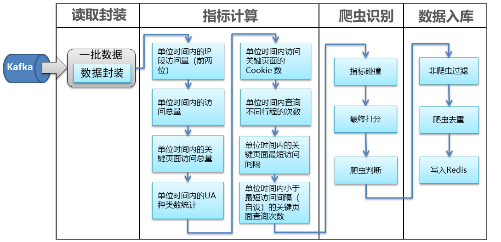


​	1、	计算每批数据的八种指标，计算完毕后将结果映射成Map

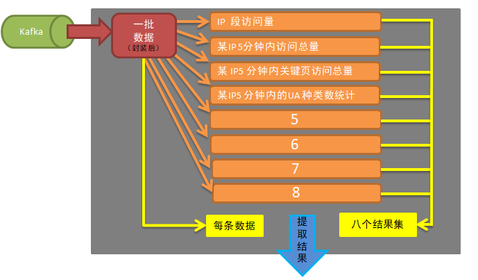

​	2、	再取出每个批次中的每条数据内的IP，在计算后的八个结果集中提取出IP对应的值。

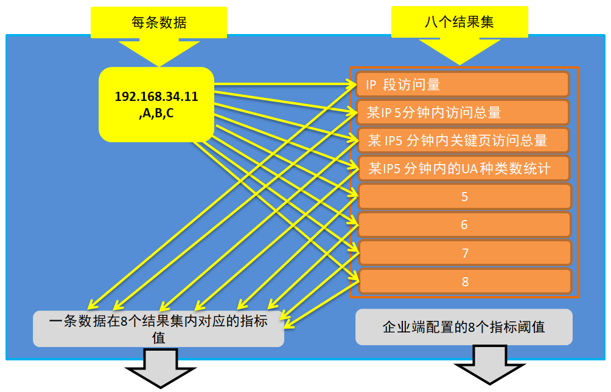

​	3、	将数据计算的八个结果值与企业配置的八个结果阈值及逆行碰撞，计算出一个与选定与否无关的结果集，和一个必须是选的，并且是超过阈值的集合。

​	4、	将两个集合传递给打分算法，打分算法会返回一个最终的分数

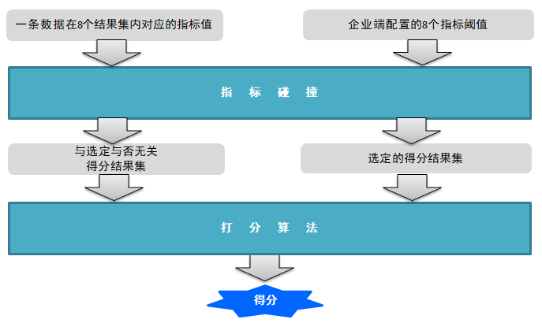

​	5、	用计算后的分数与系统设置的最终阈值进行对比，若计算的得分大于最终阈值，表示这个数据是爬虫数据，返回True。若计算的得分小于最终阈值，表示这个数据不是爬虫数据，返回False。

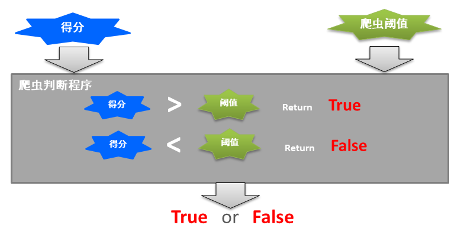

​	6、确定那些数据是爬虫，哪些数据不是爬虫后，过滤掉不是哦啊从的数据，只保留爬虫数据。在对爬虫数据进行去重，去重后将数据写入Redis

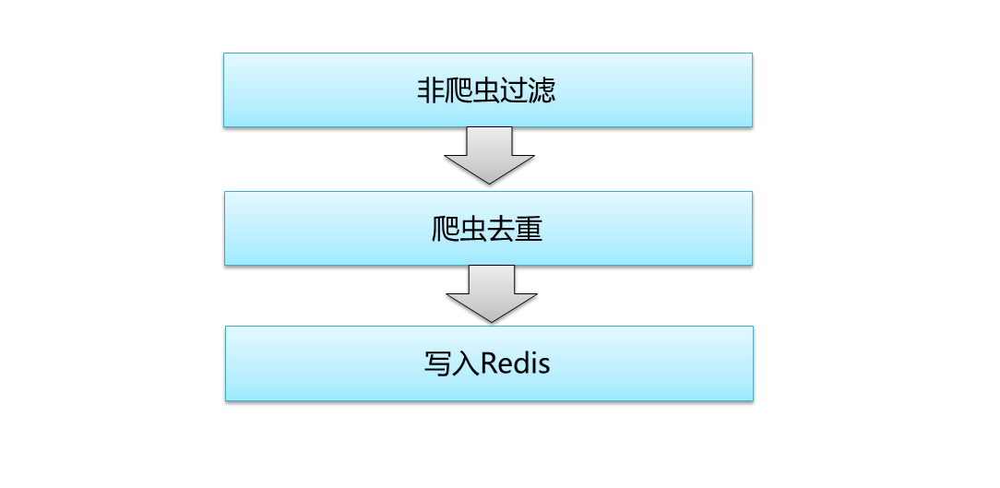


### 知识点36：RuleComput实时计算（爬虫实时识别）

 **目标：编写爬虫识别程序的主程序入口代码**

 写RuleComput的驱动类（RuleComputLauncher），在RuleComput中步骤如下

 ​	1、定义日志级别和批处理完成后任务结束的设置

```
LoggerLevels.setStreamingLogLevels()
System.setProperty("spark.streaming.stopGracefullyOnShutdown", "true")
```

 ​	2、在main方法中定义conf、SparkContext

```
val conf=new SparkConf().setAppName("RuleCompute").setMaster("local[2]")
  .set("spark.metrics.conf.executor.source.jvm.class", "org.apache.spark.metrics.source.JvmSource")//开启集群监控功能
 
val sc=new SparkContext(conf)
```

 ​	3、读取kafka的参数

```
val kafkaParams=Map("bootstrap.servers"->PropertiesUtil.getStringByKey("default.brokers","kafkaConfig.properties"))
val topics=Set(PropertiesUtil.getStringByKey("source.query.topic","kafkaConfig.properties"))
```

 	4、创建setupRuleComputSsc方法

```
val ssc=setupRuleComputeSsc(sc,kafkaParams,topics)
```

 ​	5、创建streamingcontext

```
val ssc=new StreamingContext(sc,Seconds(2))
```

 ​	6、创建kafka消费的DirectStream

```
val kafkaDatas= KafkaUtils.createDirectStream[String,String,StringDecoder,StringDecoder](ssc,kafkaParams,topics) 

val kafkaValues= kafkaDatas.map(_._2)
```

 ​	7、消费数据

```
 kafkaValues.foreachRDD(rdd=>rdd.foreach(println))
```

 ​	8、返回ssc 


### 知识点37：将数据封装为ProcessedData

 **目标：经过预处理的数据存储在Kafka内，多个数据使用“#CS#”分割，后续计算会使用到各个数据，临时切分使用不便。为方便后续使用需将数据切分后封装成ProcessedData。**

 思路与关键代码：

​	1、	获取到kafka内的数据后，使用#CS#对数据进行切分。

```
kafkaValues.mapPartitions { partitionsIterator =>
  partitionsIterator.map { sourceLine =>
    //分割数据
    val dataArray = sourceLine.split("#CS#", -1)
   ...  ...
   ...  ...
  }
}
```

​	2、	将切分后的数据封装成ProcessedData并返回。

```
ProcessedData("", requestMethod, request,
  remoteAddr, httpUserAgent, timeIso8601,
  serverAddr,  highFrqIPGroup,
  requestType, travelType, requestParams,
  cookieValue_JSESSIONID, cookieValue_USERID,
  queryRequestData, bookRequestData, httpReferrer)
```


### 知识点38：流程规则数据格式

 **目标：通过SQL获取数据库内的流程数据到爬虫识别程序中为识别爬虫准备必要的数据**

 思路与关键代码：

**流程可能有多个**

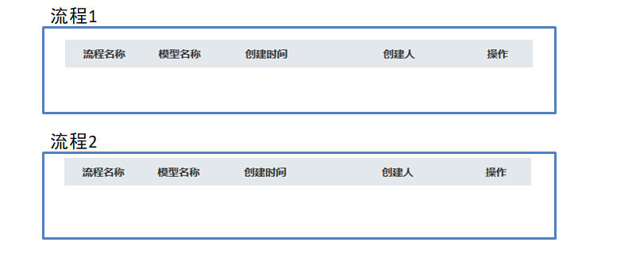


​    **一个流程内的详细数据**

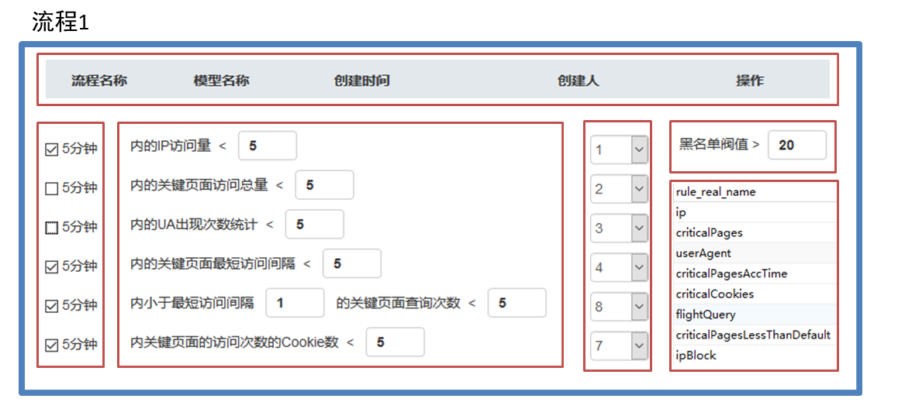


### 知识点39：5 分钟内的 IP 段（IP 前两位）访问量

 **目标：计算出5 分钟内的 IP 段（IP 前两位）访问量**

 思路与关键代码：

​	1、	抽取出数据中的IP

```
val ip= message.remoteAddr
```

​	2、	截取出ip的前两位

```
//获得到第一个.的位置
val one =ip.indexOf(".")
//获得到第二个.的位置
val two =ip.indexOf(".",one+1)
//ip段的截取
val ipblock= ip.substring(0,two)
```

​	3、	将前两位作为key, 1作为value,输出

```
(ipblock,1)
```

​	4、	调用reduceByKeyAndWindow计算最终每个ip段的总量

```
.reduceByKeyAndWindow((a:Int,b:Int)=>a+b,Seconds(6),Seconds(2))
```

​	5、	将最终数据转换为Map,便于后续提取、使用。

```
var ipBlockCountsMap  : collection.Map[String, Int] =null
ipBlockCounts.foreachRDD(rdd=>{
  ipBlockCountsMap=rdd.collectAsMap()
})
```

​	

### 知识点40：某个 IP，5 分钟内总访问量

 **目标：计算出某个 IP，5 分钟内总访问量**

 思路与关键代码：

​	1、	抽取出数据中的IP 

```
val ip =message.remoteAddr
```

​	2、	将ip作为key, 1作为value,输出

```
(ip,1)
```

​	3、	调用reduceByKeyAndWindow计算最终每个ip的总量

```
.reduceByKeyAndWindow((a:Int,b:Int)=>a+b,Seconds(6),Seconds(2))
```

​	4、	将最终数据转换为Map,便于后续提取、使用。

```
var ipCountsMap: collection.Map[String, Int] =null
ipCounts.foreachRDD(rdd=>{
  ipCountsMap=rdd.collectAsMap()
})
```


### 知识点41：某个 IP，5 分钟内的关键页面访问总量

 **目标：计算出某个 IP，5 分钟内的关键页面访问总量**

 思路与关键代码：

​	1、	抽取出数据中的IP 和数据中的url

```
//获取ip
val ip =message.remoteAddr
//获取url
val url=message.request
```

​	2、	遍历数据库中的关键页面的规则。

```
for(criticalPages<-criticalPagesList){
  //使用url与规则进行匹配，
  if (url.matches(criticalPages)){//匹配成功  表示数据是关键页面
    flag=true
  }else{//匹配不成功  表示数据不是关键页面
  }
}
```

​	3、	使用url与规则进行匹配，		

​		若数据的url能够与规则的任意一个匹配成功，那么表示这个url就是关键页面，将ip和1返回

​		若数据的url能够与规则的任意一个没有匹配成功，那么表示这个url不是关键页面，将ip和0返回

```
if (flag){   
  (ip,1)
}else{      
  (ip,0)
}
```

​	4、	调用reduceByKeyAndWindow计算最终每个ip段的总量

```
.reduceByKeyAndWindow((a:Int,b:Int)=>a+b,Seconds(6),Seconds(2))
```

​	5、	将最终数据转换为Map,便于后续提取、使用。

```
var criticalPagesCountsMap: collection.Map[String, Int]=null
criticalPagesCounts.foreachRDD(rdd=>{
  criticalPagesCountsMap=rdd.collectAsMap()
})
```


### 知识点42：某个 IP，5 分钟内的 UA 种类数统计

 **目标：计算出某个 IP，5 分钟内的 UA 种类数统计**

 思路与关键代码：

​	1、	抽取出数据中的IP 和数据中的ua

```
//获取ip
val ip =message.remoteAddr
//获取ua
val ua =message.httpUserAgent
```

​	2、	使用ip 作为key ,ua作为value,将其输出

```
(ip,ua)
```

​	3、	调用groupByKeyAndWindow，或得到的结果是key(IP)    和  value的list(ua的list)

```
.groupByKeyAndWindow(Seconds(6),Seconds(2)) 
```

​	4、	获取出ip ,和value的list(ua的list)，将value的list去重再求大小。

```
//获取ip
val ip=message._1
//获取ua的list
val uaList=message._2
//将value的list去重再求大小。
val uaCounts= uaList.toList.distinct.size
```

​	5、	将ip 和这个值大小返回

```
(ip,uaCounts)
```

​	6、	将最终数据转换为Map,便于后续提取、使用。

​	

```
var userAgentCountsMap: collection.Map[String, Int]=null
userAgentCounts.foreachRDD(rdd=>{
  userAgentCountsMap=rdd.collectAsMap()
})
```

### 知识点43：某个 IP，5 分钟内查询不同行程的次数

 **目标：计算出某个 IP，5 分钟内查询不同行程的次数**

 思路与关键代码：

​	1、	抽取出数据中的IP 和数据中的出发地和目的地

```
val ip =message.remoteAddr
//抽取出数据中的IP 和数据中的出发地和目的地
//获取出发地
val depCity=message.requestParams.depcity
//获取目的地
val arrCity=message.requestParams.arrcity
//拼接出发地和目的地
val deparrCity=depCity+arrCity
```

​	2、	使用ip 作为key ,将出发地拼接目的地，以拼接的结果作为value,将其输出

```
(ip,deparrCity)
```

​	3、	调用groupByKeyAndWindow，或得到的结果是key(IP)    和  value的list(出发地拼接目的地的list)

```
.groupByKeyAndWindow(Seconds(6),Seconds(2))  
```

​	4、	获取出ip ,和value的list(出发地拼接目的地的list)，将value的list去重再求大小。

```
 val deparrCity=message._2
 //将value的list去重再求大小。
val  deparrSize=deparrCity.toList.distinct.size
```

​	5、	将ip 和这个值大小返回

```
(ip,deparrSize)
```

​	6、	将最终数据转换为Map,便于后续提取、使用。

```
var differentJourneysCountsMap: collection.Map[String, Int]=null
differentJourneysCounts.foreachRDD(rdd=>{
  differentJourneysCountsMap=rdd.collectAsMap()
})
```


### 知识点44： 某个IP，5分钟内关键页面的访问次数的Cookie数

 **目标：计算出某个IP，5分钟内关键页面的访问次数的Cookie数**

 思路与关键代码：

​	1、	抽取出数据中的IP，数据中的url 和数据中的Cookie

```
//获取ip
val ip =message.remoteAddr
//获取url
val url=message.request
//获取cook
val cook=message.cookieValue_JSESSIONID
```

​	2、遍历数据库中的关键页面的规则。

```
for(criticalPages<-criticalPagesList){
  //3使用url与规则进行匹配，
  if (url.matches(criticalPages)){//匹配成功  表示数据是关键页面
    flag=true
  }else{//匹配不成功  表示数据不是关键页面
  }
}
```

​	3、使用url与规则进行匹配，		

​		若数据的url能够与规则的任意一个匹配成功，那么表示这个url就是关键页面，将ip和Cookie返回

​		若数据的url能够与规则的任意一个没有匹配成功，那么表示这个url不是关键页面，将“”和“”返回

```
if (flag){   
  (ip,cook)
}else{  
  ("","")
}
```

​	4、	调用groupByKeyAndWindow，或得到的结果是key(IP)    和  value的list(Cookie的list)

```
.groupByKeyAndWindow(Seconds(6),Seconds(2)) 
```

​	5、	获取出ip ,和value的list(Cookie的list)，将value的list去重再求大小。

```
//获取Cookie的list
val cookList=message._2
//将value的list去重再求大小。
val  cookSize=cookList.toList.distinct.size
```

​	6、	将ip 和这个值大小返回

```
(ip,cookSize)
```

​	7、	将最终数据转换为Map,便于后续提取、使用。

```
var ipCookCountMap: collection.Map[String, Int]=null
ipCookCount.foreachRDD(rdd=>{
  ipCookCountMap=rdd.collectAsMap()
})
```


### 知识点45：某个 IP，5 分钟内的关键页面最短访问 间隔

 **目标：计算出某个 IP，5 分钟内的关键页面最短访问 间隔**

 思路与关键代码：

​	1、	抽取出数据中的IP 和数据的访问时间及url

```
val ip =message.remoteAddr
//获取url
val url=message.request
//获取time
val time=message.timeIso8601
```

​	2、	遍历数据库中的关键页面的规则。

​	3、	使用url与规则进行匹配，	

```
for(criticalPages<-criticalPagesList){
  //3使用url与规则进行匹配
  if (url.matches(criticalPages)){//若数据的url能够与规则的任意一个匹配成功，那么表示这个url就是关键页面
    flag=true
  }else{//若数据的url能够与规则的任意一个没有匹配成功，那么表示这个url不是关键页面
  }
}
```

​		若数据的url能够与规则的任意一个匹配成功，那么表示这个url就是关键页面，将ip和时间返回

​		若数据的url能够与规则的任意一个没有匹配成功，那么表示这个url不是关键页面，将“”和“”返回

```
if (flag){  //是关键页面，将ip和时间返回
  (ip,time)
}else{      //不是关键页面，将“”和“”返回
  ("","")
}
```

​	4、	调用groupByKeyAndWindow，或得到的结果是key(IP)    和  value的list(时间的list)

```
.groupByKeyAndWindow(Seconds(6),Seconds(2)) 
```

​	5、	 获取到ip 和时间的list

```
//获取ip
val ip=message._1
//获取时间的list
val timeList=message._2
```

​	6、	遍历时间的list ,将这个字符串类型国际时间转换成普通时间（时间戳）


​	7、	将多个时间戳添加到一个list

```
       val simple =new SimpleDateFormat("yyyy-MM-dd HH:mm:ss")
        for(time<-timeList){
          //2019-05-14T09:08:50+08:00
          //2019-05-14 09:08:50
         val timeString= time.substring(0,time.indexOf("+")).replace("T"," ")
          //将String类型的时间转换成时间戳
          val longTime=simple.parse(timeString).getTime
          //7 将多个时间戳添加到一个list
          longTimeList.add(longTime)

        }
```

​	8、	对这个时间戳的list进行排序

```
val longTimeListArray= longTimeList.toArray()
util.Arrays.sort(longTimeListArray)
```

​	9、	遍历每两个时间戳，求取两个时间戳的时间差

​	10、	将这个时间差添加到一个时间差的list

```
for(i<-1 until(longTimeListArray.length)){
  val timeDiff= longTimeListArray(i).toString.toLong-longTimeListArray(i-1).toString.toLong 
  timeDiffList.add(timeDiff)
}
```

​	11、	最时间差的list进行排序

```
val timeDiffListArray= timeDiffList.toArray()
 util.Arrays.sort(timeDiffListArray)
```

​	12、	获取排序后的第一个值就是最小时间差

​	13、	将IP,和最小时间差返回

```
(ip, timeDiffListArray(0).toString.toInt)
```

​	14、	将最终数据转换为Map,便于后续提取、使用。

```
 var minTimeDiffMap: collection.Map[String, Int]=null
minTimeDiff.foreachRDD(rdd=>{
  minTimeDiffMap= rdd.collectAsMap()
})
```


### 知识点46：某个 IP， 5 分钟内小于最短访问间隔（自设）的关键页面查询次数

 **目标：计算出某个 IP， 5 分钟内小于最短访问间隔（自设）的关键页面查询次数**

 思路与关键代码：

​	1、	获取企业系统内的自定义的最小时间间隔

​		遍历流程，获取流程内的规则

​		找到规则中ruleName等于"criticalPagesLessThanDefault"的规则（有两个参数，第一个是默认的最小时间，第二个是阈值）

​		获取出规则种的第一个参数

```
for(flow<-flowList){
  //遍历流程，获取流程内的规则
  val rules=flow.rules
  //找到规则中ruleName等于"criticalPagesLessThanDefault"的规则（有两个参数，第一个是默认的最小时间，第二个是阈值）
    for(rule<-rules){
        if (rule.ruleName.equals("criticalPagesLessThanDefault")){
          //获取出规则种的第一个参数
          defaultTime= rule.ruleValue0*1000  //数据库配置的数据单位是秒    这里需要将其装换成毫秒
        }
    }

}
```


​	2、	设置一个计数器（记录小于自设值数据出现的次数）

```
var lessDefaultTime=0
```

​	3、	抽取出数据中的IP 和数据的访问时间url 

```
//获取ip
val ip =message.remoteAddr
//获取url
val url=message.request
//获取time
val time=message.timeIso8601
```

​	4、	遍历数据库中的关键页面的规则。

```
for(criticalPages<-criticalPagesList){
  //5 使用url与规则进行匹配，
  if (url.matches(criticalPages)){//若数据的url能够与规则的任意一个匹配成功，那么表示这个url就是关键页面
    flag=true
  }else{//若数据的url能够与规则的任意一个没有匹配成功，那么表示这个url不是关键页面
  }
}
```

​	5、	使用url与规则进行匹配，		

​		若数据的url能够与规则的任意一个匹配成功，那么表示这个url就是关键页面，将ip和时间返回

​		若数据的url能够与规则的任意一个没有匹配成功，那么表示这个url不是关键页面，将“”和“”返回

```
if (flag){  //是关键页面，将ip和时间返回
  (ip,time)
}else{      //不是关键页面，将“”和“”返回
  ("","")
}
```


​	6、	调用groupByKeyAndWindow，或得到的结果是key(IP)    和  value的list(时间的list)

```
.groupByKeyAndWindow(Seconds(6),Seconds(2)) 
```

​	7、	获取到ip 和时间的list

```
//获取ip
val ip=message._1
//获取时间的list
val timeList=message._2
```

​	8、	遍历时间的list ,将这个字符串类型国际时间转换成普通时间（时间戳）

​	9、	将多个时间戳添加到一个list

```
for(time<-timeList){
  //2019-05-14T09:08:50+08:00
  //2019-05-14 09:08:50
  val timeString= time.substring(0,time.indexOf("+")).replace("T"," ")
  //将String类型的时间转换成时间戳
  val longTime=simple.parse(timeString).getTime
  //9 将多个时间戳添加到一个list
  longTimeList.add(longTime)

}
```

​	10、对这个时间戳的list进行排序

```
val longTimeListArray= longTimeList.toArray()
util.Arrays.sort(longTimeListArray)
```

​	11、遍历每两个时间戳，求取两个时间戳的时间差

​	12、用时间差与自设值进行对比，

​		若时间差小于自设值，那么计数器加1

​		若时间差大于自设值,跳过（什么都不做）

```
for(i<-1 until(longTimeListArray.length)){
  val timeDiff= longTimeListArray(i).toString.toLong-longTimeListArray(i-1).toString.toLong
  //12 用时间差与自设值进行对比，
  //若时间差小于自设值，那么计数器加1
  if(timeDiff<defaultTime){
    lessDefaultTime+=1
  }
  //若时间差大于自设值,跳过（什么都不做）
}
```

​	13、将ip和计数器的值返回

```
(ip,lessDefaultTime)
```

​	14、将最终数据转换为Map,便于后续提取、使用。

```
var lessDefaultTimesMap: collection.Map[String, Int]=null
lessDefaultTimes.foreachRDD(rdd=>{
  lessDefaultTimesMap= rdd.collectAsMap()
})
```


-----------------

### 知识点47：爬虫识别

#### 	知识点47-1：指标碰撞

​	**目标：为打分算法准备数据**

​	思路与关键代码：

​	**准备数据**

​		1、提取一个ip在八个结果集内对应的数据，

```
val  ipBlockCounts=ipBlockCountsMap.getOrElse(ipBlock,0)
val  ipCounts=ipCountsMap.getOrElse(ip,0)
val  criticalPagesCounts=criticalPagesCountsMap.getOrElse(ip,0)
val  userAgentCounts=userAgentCountsMap.getOrElse(ip,0)
val  differentJourneysCounts=differentJourneysCountsMap.getOrElse(ip,0)
val  ipCookCount=ipCookCountMap.getOrElse(ip,0)
val  minTimeDiff=minTimeDiffMap.getOrElse(ip,0)
val  lessDefaultTimes=lessDefaultTimesMap.getOrElse(ip,0)
```

​		2、将取出的数据封装为Map,将次Map与流程数据传入碰撞方法

```
val dataParams=Map(
  "ipBlock"->ipBlockCounts,
  "ip"->ipCounts,
  "criticalPages"->criticalPagesCounts,
  "userAgent"->userAgentCounts,
  "criticalCookies"->ipCookCount,
  "flightQuery"->differentJourneysCounts,
  "criticalPagesAccTime"->minTimeDiff,
  "criticalPagesLessThanDefault"->lessDefaultTimes
)
```

​	**指标碰撞**

​		1、根据算法需求实例两个ArrayBuffer

​			// 一个选定与否无关的数据分数，若数据的值大于设置的阈值那么返回数据的分数，反之返回0
 			// 结果集的大小一直是8

```
val allRuleScoreList=new ArrayBuffer[Double]()
```

​			 // 一个必须是选定状态的并且数据的结果大于配置的阈值返回分数,反之不做返回
​			 //结果集的大小不定

```
val selectRuleScoreList=new ArrayBuffer[Double]()
```

​		2、遍历流程数据，获取流程内的规则

```
for(flow<-flowList){
  //获取流程内的规则（8个）
  val rules=flow.rules
  }
```

​		3、获取规则内的阈值

```
val databaseValue=if (rule.ruleName.equals("criticalPagesLessThanDefault")) rule.ruleValue1 else rule.ruleValue0
```

​		4、获取数据计算出的结果

```
val dataValue= dataParams.getOrElse(rule.ruleName,0)
```

​		5、数据对比

​			数据计算的结果大于阈值，根据需求将分数写入相应的ArrayBuffer内

​			数据计算的结果小于阈值，根据需求填入ArrayBuffer（是否需要填写）

```
if (dataValue>databaseValue){
  allRuleScoreList.append(rule.ruleScore)
  //判断规则是否选中
  if(rule.ruleStatus==0){
    selectRuleScoreList.append(rule.ruleScore)
  }
}else{//反之  数据计算的结果小于阈值
  allRuleScoreList.append(0)
}
```


#### 	知识点47-2：最终打分

​	**目标：根据已有数据计算最终分数，并返回分值**

​	思路与关键代码：

​	1、将两个结果集传入算法，算法自动返回一个分值

```
val flowScore= computeScore(allRuleScoreList.toArray,selectRuleScoreList.toArray)
```


#### 	知识点47-3：爬虫判断

​	**目标：得出是否是爬虫的结论。“True”或”False“**

​	思路与关键代码：

​	1、将获取流程中最终的阈值（爬虫与非爬虫的分界点）

```
val flowLimitScore= flow.flowLimitScore
```

​	2、用数据得分与最终阈值对比

​		若数据得分大于最终阈值，那么次数据是爬虫，返回True

​		若数据得分小于最终阈值，那么次数据不是爬虫，返回False

```
val isUpLimited=if(flowScore>flowLimitScore)true else false
```

###  


### 知识点48：踢除黑名单数据

**目标：经过计算的数据含有非黑名单数据，需要将其剔除掉**

思路与关键代码：

​	1、打分后的数据的rdd调用filter对数据进行过滤

```
val allBlackDatas=  antiCalculateResults.filter(message=>{
... ...
}
```

​	2、添加此数据是否是爬虫的标记

```
var isspider=false
```

​	3、遍历经过打分后的数据（已经得出结论：这个数据是爬虫/不是爬虫）

​	4、遍历每一个经过计算的数据，获取出每个数据的flowsScore,遍历flowsScore内的

isUpLimited(true/false)

```
val flowsScores= message.flowsScore
for(flowsScore<-flowsScores){
... ...
}
```

​	5、若数据内的isUpLimited是true那么表述这个数据是爬虫，将标记改为true

```
if (flowsScore.isUpLimited){
  isspider=true
}
```

​	6、若数据内的isUpLimited是false那么表述这个数据不是爬虫，标记不做任何改动（默认标记就是false）

​	没有操作（默认标记就是false）


### 知识点49：黑名单数据的去重

**目标：经过计算后的黑名单数据含有重复数据，在写入redis前，需要对这批数据进行去重**

思路与关键代码：

​	1、遍历每一个黑名单数据，将数据的ip作为key,flowsScore作为value获取出来

​	2、将两个数据返回

​	3、调用reducebykey((k,v)=>v)取出相同的数据中的最后一个

           val blackDatas= allBlackDatas.map(message=>{
              //获取数据的IP
              val ip=message.ip
              //获取数据的flowsScore
              val flowsScore=message.flowsScore
              (ip,flowsScore)
    
            }).reduceByKey((k,v)=>v)  


### 知识点50：将数据写入Redis

**目标：将识别到的爬虫数据写入Redis,为剔除爬虫准备数据**

​	1、遍历数据中的RDD，将其序列化（collect () ）（不序列化汇报错：Task not serializable）

```
blackDatas.foreachRDD(rdd=>{
 val blackDatas: Array[(String, Array[FlowScoreResult])] = rdd.collect()
 ... ...
 })
```

​	2、遍历序列后的每一个数据，获取出数据中的ip和flowsScore

```
for(blackData<-blackDatas){
  //获取数据中的IP
  val ip=blackData._1
  //获取数据中的flowsScore
  val flowsScores: Array[FlowScoreResult]=blackData._2
  ... ...
  }
```

​	3、遍历flowsScore，为写入Redis准备数据

​	4、准备写入redis的key

​			在配置文件中读取出key的前缀+数据的IP+流程id+时间戳（？？？？这个key怎么设计？）

```
val key=PropertiesUtil.getStringByKey("cluster.key.anti_black_list","jedisConfig.properties")+
  "|"+ip+"|"+flowsScore.flowId+"|"+System.currentTimeMillis().toString
```

​	5、准备写入redis的time

​			在配置文件中读取出数据的保留时间

```
val time =PropertiesUtil.getStringByKey("cluster.exptime.anti_black_list","jedisConfig.properties").toInt
```

​	6、准备写入redis的value

​			value包括计算的最终分数+命中的规则+命中的时间（？？？？这个value怎么设计？）

```
val value=flowsScore.flowScore+"|"+flowsScore.hitRules+"|"+flowsScore.hitTime
```

​	7、将数据写入redis

```
jedis.setex(key,time,value)
```


### 知识点51： redis黑名单数据备份

**目标：由于Redis是基于内存的，爬虫数据写入Redis有数据丢失的风险，所以需要将爬虫数据写入redis的同时也写入HDFS一份，用于当redis丢失数据时的回复**

 	1、在kv存储到redis的过程中，将ArrayBuffer[Row]()填满，封装的是（time、key、value）

 	2、调用BlackListToHDFS.saveAntiBlackList存储数据

 	3、在saveAntiBlackList创建schema、dataFrame，然后调用HdfsSaveUtil.save存储

 	4、在save方法里，先将路径加上时间年月日时，然后将数据存储为序列化（parquet）的文件


### 知识点52： redis黑名单数据恢复

**目标：当Redis发生数据丢失时，实现数据的回复功能（在备份的HDFS上进行数据的回复）**

​	 1、 根据redis标记（dang）进行是否恢复数据判断

​	 2、如果要恢复数据，那么拿出当前时间和当前时间之前的3600秒的序列化（parquet）数据

​	 3、找到最贴近当前时间的黑名单数据

​	 4、恢复到redis


### 知识点53:kafka结构化数据备份hdfs

**目标：将经过预处理的数据写入HDFS，为离线分析准备数据**

​	 1、在HDFS文件系统内生成带有时间的路径

​	2、取出历史数据，进行合并操作，重分区为1

​	3、存储到hdfs


### 知识点54：离线指标统计

**目标：实现离线指标的计算过程**

​	  1、数据源：

​		 kafka通过数据处理后写到hdfs的结构化数据

​		 通过rulecompute计算后的爬虫数据，数据写了redis

​	  2、数据加载

​		 每天的23:59分的定时任务开始

​		 加载kafka写到hdfs的数据，数据是以yyyyMMddHH这样的文件夹保存的，我们需要读取yyyyMMdd下面的所有小时的数据

​	 	加载redis的黑名单数据

 	 3、任务流程

​		 创建sparkcontext

​		 获取当前时间的年月日，拼凑成：hdfs://192.168.56.151:9000/csair/data/rule-black-ist/yyyyMMdd

​		 通过redis加载黑名单数据

 		进行报表质变的计算，计算的结果写到数据库