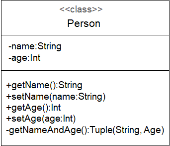
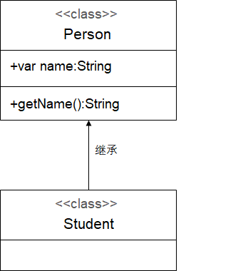
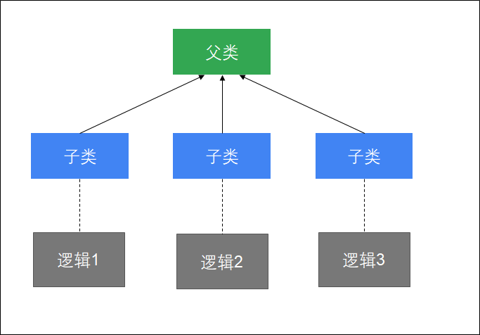
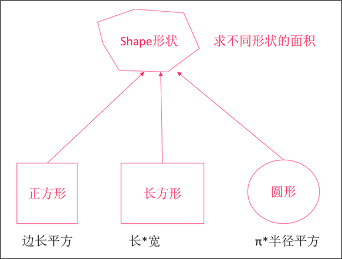
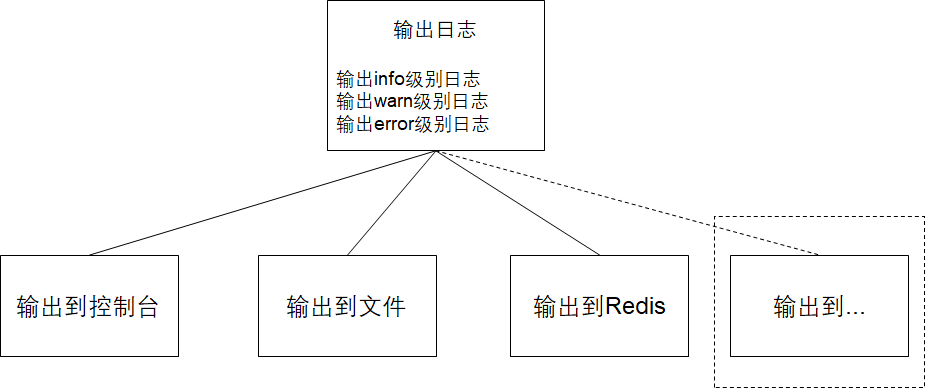
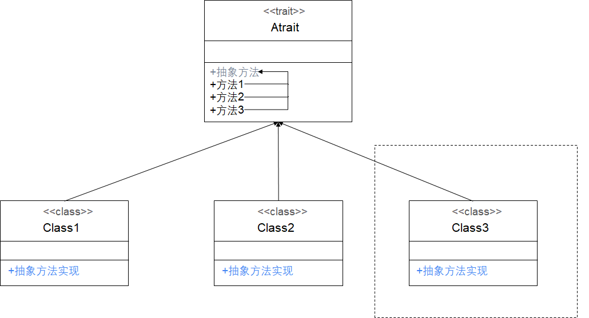
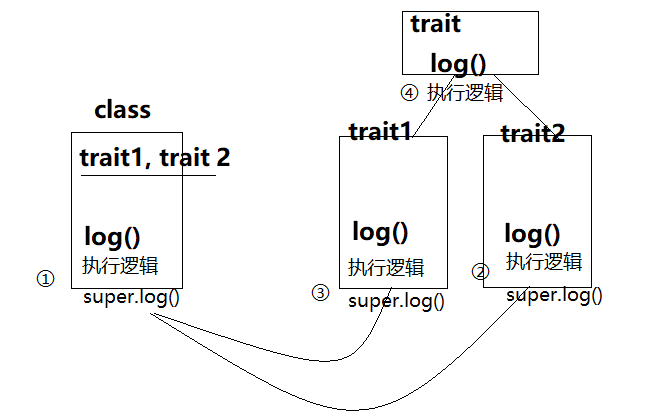
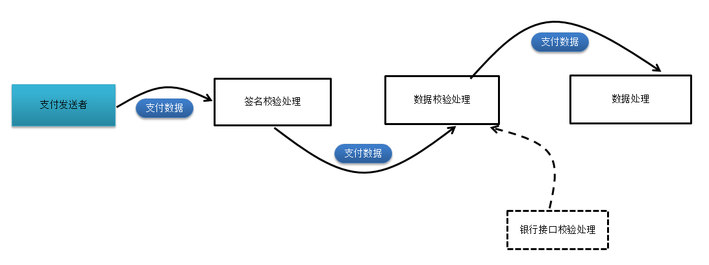

# scala第二天学习计划

**学习目标**

- 掌握scala类与object的用法
- 掌握继承的用法
- 掌握trait（特质）的用法

## 01. 类和对象

scala是支持面向对象的，也有类和对象的概念。我们依然可以基于scala语言来开发面向对象的应用程序。

### 01.01. 创建类和对象

**用法**

- 使用`class`来定义一个类
- 使用`new`来创建对象

**示例**

创建一个Person类，并创建它的对象

**步骤**

1. 创建一个scala项目，并创建一个Object
2. 添加main方法
3. 创建类和对象

**实现**

1. 在IDEA中创建项目，并创建一个Object（main方法必须放在Object中）
2. 添加main方法
3. 创建一个Person类
4. 在main方法中创建Person类对象

**参考代码**

```scala
object _01ClassDemo {
  // 创建类
  class Person{}

  def main(args: Array[String]): Unit = {
    // 创建对象
    val p = new Person()
    println(p)
  }
}

```

**简写方式**

**用法**

- 如果类是空的，没有任何成员，可以省略`{}`
- 如果构造器的参数为空，可以省略`()`

**示例**

使用简写方法重新创建Person类和对象

**参考代码**

```scala
object _02ClassDemo {

  // 创建类，省略花括号
  class Person

  def main(args: Array[String]): Unit = {
    // 创建对象，如果构造器的参数为空,省略括号
    val person = new Person
     println(person) 
  }
}
```

### 01.02. 类和对象-定义和访问成员变量

一个类会有自己的属性，例如：人这样一个类，有自己的姓名和年龄。我们接下来学习在类中定义、和访问成员变量。

**用法**

- 在类中使用`var/val`来定义成员变量
- 对象直接使用成员变量名称来访问成员变量

**示例**

1. 定义一个Person类，包含一个姓名和年龄字段
2. 创建一个名为"张三"、年龄为20岁的对象
3. 打印对象的名字和年龄

**步骤**

1. 创建一个Object，添加main方法
2. 创建Person类，添加姓名字段和年龄字段，并对字段进行初始化，让scala自动进行类型推断
3. 在main方法中创建Person类对象，设置成员变量为"张三"、20
4. 打印对象的名字和年龄

**参考代码**

```scala
object _03ClassDemo {
  class Person {
    // 定义成员变量
    var name = ""
    var age = 0
  }

  def main(args: Array[String]): Unit = {
    // 创建Person对象
    val person = new Person
    person.name = "zhangsan"
    person.age = 20

    // 获取变量值
    println(person.name)
    println(person.age)
  }
}
```

### 01.03. 类和对象-使用下划线初始化成员变量

scala中有一个更简洁的初始化成员变量的方式，可以让代码看起来更加简洁。

**用法**

- 在定义`var`类型的成员变量时，可以使用`_`来初始化成员变量
  - String => null
  - Int => 0
  - Boolean => false
  - Double => 0.0
  - ...
- `val`类型的成员变量，必须要自己手动初始化

**示例**

1. 定义一个Person类，包含一个姓名和年龄字段
2. 创建一个名为"张三"、年龄为20岁的对象
3. 打印对象的名字和年龄

**步骤**

1. 创建一个Object，添加main方法
2. 创建Person类，添加姓名字段和年龄字段，指定数据类型，使用下划线初始化
3. 在main方法中创建Person类对象，设置成员变量为"张三"、20
4. 打印对象的名字和年龄

**参考代码**

```scala
object _04ClassDemo {

  class Person{
    // 使用下划线进行初始化
    var name:String = _
    var age:Int = _
  }

  def main(args: Array[String]): Unit = {
    val person = new Person
    
    println(person.name)
    println(person.age)
  }
}
```

### 01.04. 类和对象-定义成员方法

类可以有自己的行为，scala中也可以通过定义成员方法来定义类的行为。

**定义**

在scala的类中，也是使用`def`来定义成员方法

**示例**

1. 创建一个Customer类

   

2. 创建一个该类的对象，并调用printHello方法

**步骤**

1. 创建一个Object，添加main方法
2. 创建Customer类，添加成员变量、成员方法
3. 在main方法中创建Customer类对象，设置成员变量值(张三、男)
4. 调用成员方法

**参考代码**

```scala
object _05ClassDemo {

  class Customer {
    var name:String = _
    var sex:String = _

    // 定义成员方法
    def sayHi(msg:String) = {
      println(msg)
    }
  }

  def main(args: Array[String]): Unit = {
    val customer = new Customer
    customer.name = "张三"
    customer.sex = "男"
    customer.sayHi("你好")
  }
}
```

### 01.05. 类和对象-访问修饰符

和Java一样，scala也可以通过访问修饰符，来控制成员变量和成员方法是否可以被访问。

**定义**

Java中的访问控制，同样适用于scala，可以在成员前面添加private/protected关键字来控制成员的可见性。但在scala中，**`没有public关键字`**，任何没有被标为private或protected的成员都是公共的

**案例**

- 定义一个Person类

  

- 在main方法中创建该类的对象，测试是否能够访问到私有成员

**参考代码**

```scala
object _02AccessDemo {

  class Person {
    // 定义私有成员变量
    //private var name:String = _
   // private var age:Int = _
    //定义成员变量也可以类似定义变量一样
      //使用类型推断来定义
      private var name =""
      private var age =0

    def getName() = name
    def setName(name:String) = this.name = name
    def getAge() = age
    def setAge(age:Int) = this.age = age

    // 定义私有成员方法
    private def getNameAndAge = {
      name -> age
    }
  }

  def main(args: Array[String]): Unit = {
    val person = new Person
    person.setName("张三")
    person.setAge(10)

    println(person.getName())
    println(person.getAge())
  }
}                                              
```

## 02. 类的构造器

当创建类对象的时候，会自动调用类的构造器。之前使用的都是默认构造器，我们接下来要学习如何自定义构造器。

### 02.01. **主构造器**

我们学习过，Java的构造器，有构造列表和构造代码块

```java
class Person {
    // 成员变量
    private String name;
    private Integer age;

    // Java构造器
    public Person(String name, Integer age) {
        // 初始化成员变量
        this.name = name;
        this.age = age;
    }
}
```

在scala中，我们可以使用更简洁的语法来实现。

**语法**

```scala
class 类名(var/val 参数名:类型 = 默认值, var/val 参数名:类型 = 默认值){
    // 构造代码块
}
```

> [!NOTE]
>
> - 主构造器的参数列表是直接定义在类名后面，添加了val/var表示直接通过主构造器定义成员变量
> - 构造器参数列表可以指定默认值
> - 创建实例，调用构造器可以指定字段进行初始化
> - 整个class中除了字段定义和方法定义的代码都是构造代码

**示例**

1. 定义一个Person类，通过主构造器参数列表定义姓名和年龄字段，并且设置它们的默认值
2. 在主构造器中输出"调用主构造器"
3. 创建"张三"对象（姓名为张三，年龄为20），打印对象的姓名和年龄
4. 创建"空"对象，不给构造器传入任何的参数，打印对象的姓名和年龄
5. 创建"man40"对象，不传入姓名参数，指定年龄为40，打印对象的姓名和年龄

**参考代码**

```scala
object _06ConstructorDemo {

  // 定义类的主构造器
  // 指定默认值
  class Person(var name:String = "", var age:Int = 0) {
    println("调用主构造器")
  }

  def main(args: Array[String]): Unit = {
    // 给构造器传入参数
    val zhangsan = new Person("张三", 20)
    println(zhangsan.name)
    println(zhangsan.age)

    println("---")

    // 不传入任何参数
    val empty = new Person
    println(empty.name)
    println(empty.age)

    println("---")

    // 指定字段进行初始化
    val man40 = new Person(age = 40)
    println(man40.name)
    println(man40.age)
  }
}
```

### 02.02. 辅助构造器

在scala中，除了定义主构造器外，还可以根据需要来定义辅助构造器。例如：允许通过多种方式，来创建对象，这时候就可以定义其他更多的构造器。我们把除了主构造器之外的构造器称为**辅助构造器**。

**语法**

- 定义辅助构造器与定义方法一样，也使用`def`关键字来定义
- 这个方法的名字为`this`

```scala
def this(参数名:类型, 参数名:类型) {
    // 第一行需要调用主构造器或者其他构造器
    // 构造器代码
}
```

> [!DANGER]
>
> 辅助构造器的第一行代码，必须要**调用主构造器或者其他辅助构造器**

**示例**

**示例说明**

- 定义一个Customer类，包含一个姓名和地址字段
- 定义Customer类的主构造器（初始化姓名和地址）
- 定义Customer类的辅助构造器，该辅助构造器接收一个数组参数，使用数组参数来初始化成员变量
- 使用Person类的辅助构造器来创建一个"zhangsan"对象
  - 姓名为张三
  - 地址为北京
- 打印对象的姓名、地址

**参考代码**

```scala
object _07ConstructorDemo {

  class Customer(var name:String = "", var address:String = "") {
    // 定义辅助构造器
    def this(arr:Array[String]) = {
      // 辅助构造器必须要调用主构造器或者其他辅助构造器
      this(arr(0), arr(1))
    }
  }

  def main(args: Array[String]): Unit = {
    val zhangsan = new Customer(Array("张三", "北京"))

    println(zhangsan.name)
    println(zhangsan.address)
  }
}
```

## 03. 单例对象

scala中没有Java中的静态成员，我们想要定义类似于Java的static变量、static方法，就要使用到**scala中的单例对象——object.**

### **定义单例对象**

单例对象表示全局仅有一个对象（类似于Java static概念）

- 定义单例对象和定义类很像，就是把class换成object
- 在object中定义的成员变量类似于Java的静态变量
- 可以使用object直接引用成员变量

**示例**

**示例说明**

- 定义一个Dog单例对象，保存狗有几条腿
- 在main方法中打印狗腿的数量

**参考代码**

```scala
object _08ObjectDemo {

  // 定义一个单例对象
  object Dog {
    //定义单例对象的成员,类似java中是static变量
    // 定义腿的数量
    val LEG_NUM = 4
  }

  def main(args: Array[String]): Unit = {
    println(Dog.LEG_NUM)
  }
}

```

### 在单例对象中定义成员方法

- 在object中定义的成员方法类似于Java的静态方法

**示例**

**示例说明**

- 设计一个单例对象，定义一个能够打印分割线（15个减号）的方法
- 在main方法调用该方法，打印分割线

**参考代码**

```scala
object _09ObjectDemo {
    
  //创建单例对象,定义成员方法
  object PrintUtil {

    // 打印分割线
    def printSpliter() = {
      // 字符串乘法，表示返回多少个字符串
      println("-" * 10)
    }
  }

  def main(args: Array[String]): Unit = {
    PrintUtil.printSpliter()
  }
}
```

## 04. 工具类案例

**需求**

- 编写一个DateUtil工具类专门用来格式化日期时间
- 定义一个方法，用于将日期（Date）转换为年月日字符串，例如：2030-10-05

**步骤**

- 定义一个DateUtil单例对象，定义日期格式化方法（format）
- 使用SimpleDateFormat将日期转换为字符串

**参考代码**

```scala
object _10ObjectDemo {
//创建一个DateUtil工具类
  object DateUtils {
    // 在object中定义的成员变量，相当于Java中定义一个静态变量
    // 定义一个SimpleDateFormat日期时间格式化对象
    val simpleDateFormat = new SimpleDateFormat("yyyy-MM-dd HH:mm")

    // 相当于Java中定义一个静态方法
    def format(date: Date) = simpleDateFormat.format(date)
  }

  // main是一个静态方法，所以必须要写在object中
  def main(args: Array[String]): Unit = {
    println(DateUtils.format(new Date()))
  }
}
```

**案例:日期的加减法**

```scala
object _10ObjectDemo {
    def getDay(date:Date,num:Int)={
        var formatter =new SimpleDateFormat(""yyyyMMdd")
        var calendar = Calendar.getInstance()
        calendar.setTime(data)
        calendar.add(Calendar.DAY_OF_YEAY,num)
        formatter.format(calendar.getTime)
    }
  // main是一个静态方法，所以必须要写在object中
  def main(args: Array[String]): Unit = {
  /**
  	*/path/dd/aa/20190830
  	*/path/dd/aa/20190829
    */
    for(i <- 1 to 7){
    	println(getDat(new Date(),-i)
    }
}
```

## 05. main方法

scala和Java一样，如果要运行一个程序，必须有一个main方法。而在Java中main方法是静态的，而在scala中没有静态方法。在scala中，这个main方法必须放在一个单例对象中。

**定义main方法**

main方法

```scala
def main(args:Array[String]):Unit = {
    // 方法体
}
```

**示例**

**示例说明**

- 创建一个单例对象，在该单例对象中打印"hello, scala"

**参考代码**

```scala
object Main5 {
  def main(args:Array[String]) = {
    println("hello, scala")
  }
}
```

**实现App Trait来定义入口**

创建一个object，继承自App Trait（特质），然后将需要编写在main方法中的代码，写在object的构造方法体内。

```scala
object 单例对象名 extends App {
    // 方法体
}
```

**示例**

**示例说明**

- 继承App特质，来实现一个入口。同样输出"hello, scala"

**参考代码**

```scala
object Main5 extends App {
  println("hello, scala")
}
```

### 05.01. 伴生对象

在Java中，经常会有一些类，同时有实例成员又有静态成员。例如：

```java
public class CustomerService {

    private static String SERVICE_NAME = "CustomerService";

    public void save() {
        // 保存客户
        System.out.println(SERVICE_NAME + ":保存客户");
    }

    public static void main(String[] args) {
        new CustomerService().save();
    }
}
```

在scala中，要实现类似的效果，可以使用伴生对象来实现。

我们还可以使用伴生对象来实现快速创建对象，例如：

```scala
// 无需使用new就可以快速来创建对象
val a = Array(1,2,3)
val b = Set(1,2,3)
```

#### **定义伴生对象**

一个class和object具有同样的名字。这个object称为**伴生对象**，这个class称为**伴生类**

- 伴生对象**必须要和伴生类一样的名字**
- 伴生对象和伴生类在**同一个scala源文件中**
- 伴生对象和伴生类可以**互相访问private属性**

**示例**

**示例说明**

- 编写一个CustomerService类，有一个save方法，打印

  ```scala
  服务类名称:保存客户
  ```

- 编写一个CustomerService伴生对象，定义一个私有变量，用于保存服务类名称

- 创建CustomerService对象，调用save方法

**参考代码**

```scala
object _11ObjectDemo {
  //1.创建一个拌生类
  class CustomerService {
    def save() = {
      println(s"${CustomerService.SERVICE_NAME}:保存客户")
    }
  }

  // 2.CustomerService的伴生对象
  object CustomerService {
    //定义一个私有变量
      //服务类的名称
    private val SERVICE_NAME = "CustomerService"
  }
//3.创建对象,调用方法
  def main(args: Array[String]): Unit = {
      
    val customerService = new CustomerService()
    customerService.save()
  }
}
```

#### private[this]访问权限

如果某个成员的权限设置为**private[this]**，表示**只能在当前类中访问**。**伴生对象也不可以访问**

**示例**

**示例说明**

- 定义一个Person类，包含一个name字段
- 定义Person类的伴生对象，定义printPerson方法
- 测试伴生对象是否能访问private[this]权限的成员

**示例代码**

```scala
//1.创建person类,定义一个private[this]成员变量  
class Person(private[this] var name:String)
  //创建person伴生对象,在伴生对象中测试访问成员变量
  object Person {
    def printPerson(person:Person): Unit = {
      println(person.name)
    }
  }
  //定义main方法,调用伴生对象的方法
  def main(args: Array[String]): Unit = {
    val person = new Person("张三")
    Person.printPerson(person)
  }
```

上述代码，会编译报错。**移除掉[this]**就可以访问了

### 05.02. 伴生对象 | apply方法

我们之前使用过这种方式来创建一个Array对象。

```scala
// 创建一个Array对象
val a = Array(1,2,3,4)
```

这种写法非常简便，**不需要再写一个new，然后敲一个空格，再写类名**。我们可以通过伴生对象的apply方法来实现。

**定义**

**定义apply方法**

```scala
object 伴生对象名 {
	def apply(参数名:参数类型, 参数名:参数类型...) = new 类(...)
}
```

**创建对象**

```scala
伴生对象名(参数1, 参数2...)
```

**示例**

**示例说明**

- 定义一个Person类，它包含两个字段：姓名和年龄
- 重写apply方法，使用Person类名就可以创建对象
- 在main方法中创建该类的对象，并打印姓名和年龄

**参考代码**

```scala
object _12ApplyDemo {
    //创建person类
  class Person(var name:String = "", var age:Int = 0)
//创建person伴生对象
  object Person {
    // 定义apply方法，接收两个参数
    def apply(name:String, age:Int) = new Person(name, age)
  }
//使用类名来快速创建对象
  def main(args: Array[String]): Unit = {
    // 使用伴生对象名称来创建对象
    val zhangsan = Person("张三", 20)
    println(zhangsan.name)
    println(zhangsan.age)
  }
}
```

## 06. 继承

scala语言是支持面向对象编程的，我们也可以使用scala来实现继承，通过继承来减少重复代码。

**定义语法**

- scala和Java一样，使用**extends**关键字来实现继承
- 可以在子类中定义父类中没有的字段和方法，或者重写父类的方法
- 类和单例对象都可以从某个父类继承

**语法**

```scala
class/object 子类 extends 父类 {
    ..
}
```

### **示例 | 类继承**

- 定义一个Person类，再定义一个Student类，继承自Person类

  

- 创建一个Student类对象实例，并设置name为“张三”

- 打印姓名

**参考代码**

```scala
//创建一个Person类,定义成员变量/方法
class Person {
  var name = "super"

  def getName = this.name =name
}
//创建一个student类,继承person类
class Student extends Person
//创建student类对象,访问成员

  def main(args: Array[String]): Unit = {
    val p1 = new Person()
    val p2 = new Student()

    p2.name = "张三"
    println(p2.name)    

    println(p2.getName)

}
```

### 示例 | 单例对象继承

**示例说明**

- 创建一个Student单例对象，让单例对象继承示例1中的Person类
- 设置单例对象的名字为"张三"，调用Student单例对象的getName方法

```scala
//创建一个Person类,定义成员变量/方法
class Person {
  var name = "super"

  def getName = this.name
}
//创建一个student类,继承person类
object Student extends Person


  def main(args: Array[String]): Unit = {
	Student.name="张三"
    println(Student.getName)
  
}
```

### override和super

类似于Java语言，我们在子类中使用override需要来重写父类的成员，可以使用super来引用父类

**用法**

- 子类要覆盖父类中的一个方法，必须要使用**override关键字**
- 使用**override来重写一个val字段**
- 使用**super关键字来访问父类的成员方法**

**示例**

**示例说明**

- 定义一个Person类，包含
  - 姓名字段（不可重新赋值）
  - 获取姓名方法
- 定义一个Student类
  - 重写姓名字段
  - 重写获取姓名方法，返回"hello, "  + 姓名
- 创建Student对象示例，调用它的getName方法

**参考代码**

```scala
object Main13 {
//创建person父类,定义成员字段,成员方法
class Person {
  val name = "super"

  def getName = this.name=name
}
//创建student子类,重写成员/重写方法
class Student extends Person {
  // 重写val字段
  override val name: String = "child"

  // 重写getName方法
  override def getName: String = "hello, " + super.getName
}
//创建子类对象,访问重写的成员

  def main(args: Array[String]): Unit = {
    println(new Student().getName)
    println(new Student().name)
  }
}
```

## 07. 类型判断

有时候，我们设计的程序，要根据变量的类型来执行对应的逻辑。



在scala中，如何来进行类型判断呢？

有两种方式：

- isInstanceOf
- getClass/classOf

### `isInstanceOf/asInstanceOf`

在Java中，我们可以使用instanceof关键字来判断类型、以及(类型)object来进行类型转换，在scala中如何实现呢？

scala中对象提供isInstanceOf和asInstanceOf方法。

- `isInstanceOf`判断**对象是否为指定类的对象**
- `asInstanceOf`将**对象转换为指定类型**


**用法**

```scala
// 判断对象是否为指定类型
val trueOrFalse:Boolean = 对象.isInstanceOf[类型]
// 将对象转换为指定类型
val 变量 = 对象.asInstanceOf[类型]
```

**示例**

**示例说明**

- 定义一个Person类
- 定义一个Student类继承自Person类
- 创建一个Student类对象
- 判断该对象是否为Student类型，如果是，将其转换为Student类型并打印该对象

**参考代码**

```scala
object Main3 {
    
class Person3
class Student3 extends Person3


  def main(args: Array[String]): Unit = {
    val student = new Student3

    // 判断s1是否为Student3类型
    if(student.isInstanceOf[Student3]) {
      // 将s1转换为Student3类型
      val student1 =  student.asInstanceOf[Student3]
      println(student1)
    }else{
        println("不是一种类型")
    }

  }
}

```

### `getClass和classOf`

isInstanceOf 只能判断对象是否为**指定类以及其子类**的对象，而不能精确的判断出，对象就是指定类的对象。如果要求精确地判断出对象就是指定类的对象，那么就只能使用 getClass 和 classOf 。

**用法**

- p.getClass可以**精确获取对象的类型**
- classOf[x]可以**精确获取类型**
- 使用==操作符可以直接比较类型

**示例**

**示例说明**

- 定义一个Person类
- 定义一个Student类继承自Person类
- 创建一个Student类对象，并指定它的类型为Person类型
- 测试使用isInstance判断该对象是否为Person类型
- 测试使用getClass/classOf判断该对象是否为Person类型
- 测试使用getClass/classOf判断该对象是否为Student类型

**参考代码**

```scala
object Student4{
//创建类和子类
class Person
class Student extends Person

  def main(args: Array[String]) {
      
    val p:Person=new Student
    //判断p是否为Person类的实例
    println(p.isInstanceOf[Person])//true

    //判断p的类型是否为Person类
    println(p.isInstanceOf[Student])//true
	println("-"*10)
    //判断p的类型是否为Student类
    println(p.getClass == classOf[Student])//true
      
    println(p.getClass == classOf[Person])//false
  }
}
```

## 08. 抽象类

和Java语言一样，scala中也可以定义抽象类

**定义**

如果类的某个成员在当前类中的定义是不包含完整的，它就是一个**抽象类**

不完整定义有两种情况：

1. 方法没有方法体（**抽象方法**）
2. 变量没有初始化（**抽象字段**）

定义抽象类和Java一样，在类前面加上**abstract**关键字

```scala
// 定义抽象类
abstract class 抽象类名 {
  // 定义抽象字段
  val 抽象字段名:类型
  // 定义抽象方法
  def 方法名(参数:参数类型,参数:参数类型...):返回类型
}
```

**抽象方法**

**示例**



- 设计4个类，表示上述图中的继承关系
- 每一个形状都有自己求面积的方法，但是不同的形状计算面积的方法不同

**步骤**

1. 创建一个Shape抽象类，添加一个area抽象方法，用于计算面积
2. 创建一个Square正方形类，继承自Shape，它有一个边长的主构造器，并实现计算面积方法
3. 创建一个长方形类，继承自Shape，它有一个长、宽的主构造器，实现计算面积方法
4. 创建一个圆形类，继承自Shape，它有一个半径的主构造器，并实现计算面积方法
5. 编写main方法，分别创建正方形、长方形、圆形对象，并打印它们的面积

**参考代码**

```scala
object Main6 {
// 创建形状抽象类
abstract class Shape {
  //定义抽象方法,返回值是Double
  //抽象方法没有方法体
  def area:Double
}

// 创建正方形类
class Square(var edge:Double /*边长*/) extends Shape {
  // 实现父类计算面积的方法
  override def area: Double = edge * edge
}

// 创建长方形类
class Rectangle(var length:Double /*长*/, var width:Double /*宽*/) extends Shape {
  override def area: Double = length * width
}

// 创建圆形类
class Cirle(var radius:Double /*半径*/) extends Shape {
  override def area: Double = Math.PI * radius * radius
}

  def main(args: Array[String]): Unit = {
    val s1:Shape = new Square(2.0)
    val s2:Shape = new Rectangle(2.0,3.0)
    val s3:Shape = new Cirle(2.0)

    println(s1.area)
    println(s2.area)
    println(s3.area)
  }
}
```

### 08.01. 抽象字段

在scala中，也可以定义抽象的字段。如果一个成员变量是没有初始化，我们就认为它是抽象的。

**定义**

**语法**

```scala
abstract class 抽象类 {
    val/var 抽象字段:类型
}
```

**示例**

**示例说明**

1. 创建一个Person抽象类，它有一个String抽象字段WHO_AM_I
2. 创建一个Student类，继承自Person类，重写WHO_AM_I字段，初始化为学生
3. 创建一个Policeman类，继承自Person类，重写WHO_AM_I字段，初始化警察
4. 添加main方法，分别创建Student/Policeman的实例，然后分别打印WHO_AM_I

**参考代码**

```scala
// 定义一个人的抽象类
abstract class Person6 {
  // 没有初始化的val字段就是抽象字段
  val WHO_AM_I:String
}

class Student6 extends Person6 {
  override val WHO_AM_I: String = "学生"
}

class Policeman6 extends Person6 {
  override val WHO_AM_I: String = "警察"
}

object Main6 {
  def main(args: Array[String]): Unit = {
    val p1 = new Student6
    val p2 = new Policeman6

    println(p1.WHO_AM_I)
    println(p2.WHO_AM_I)
  }
}
```

## 09. 匿名内部类

匿名内部类是没有名称的子类，直接用来创建实例对象。Spark的源代码中有大量使用到匿名内部类。

scala中的匿名内部类使用与Java一致。

**定义**

**语法**

```scala
val/var 变量名 = new 类/抽象类 {
    // 重写方法
}
```

**示例说明**

1. 创建一个Person抽象类，并添加一个sayHello抽象方法
2. 添加main方法，通过创建匿名内部类的方式来实现Person
3. 调用匿名内部类对象的sayHello方法

**参考代码**

```scala
object AnonymousDemo {
abstract class Person7 {
  def sayHello:Unit
}

  def main(args: Array[String]): Unit = {
    // 直接用new来创建一个匿名内部类对象
    val p1 = new Person7 {
      override def sayHello: Unit = println("我是一个匿名内部类")
    }
    p1.sayHello
  }
}
```

## 10. 特质(trait)

scala中没有Java中的接口（interface），替代的概念是——特质

**定义**

- 特质是scala中代码复用的基础单元
- 它可以将方法和字段定义封装起来，然后添加到类中
- 与类继承不一样的是，类继承要求每个类都只能继承`一个`超类，而一个类可以添加`任意数量`的特质。
- 特质的定义和抽象类的定义很像，但它是使用`trait`关键字

**语法**

定义特质

```scala
trait 名称 {
    // 抽象字段
    // 抽象方法
}
```

继承特质

```scala
class 类 extends 特质1 with 特质2 {
    // 字段实现
    // 方法实现
}
```

- 使用`extends`来继承trait（scala不论是类还是特质，都是使用extends关键字）
- 如果要继承多个trait，则使用`with`关键字

### trait作为接口使用

trait作为接口使用，与java的接口使用方法一样。

#### 示例 | 继承单个trait

------

**示例说明**

1. 创建一个Logger特质，添加一个接受一个String类型参数的log抽象方法
2. 创建一个ConsoleLogger类，继承Logger特质，实现log方法，打印消息
3. 添加main方法，创建ConsoleLogger对象，调用log方法

**参考代码**

```scala
object TraitDemo{
//创建 一个特质  
trait Logger {
    // 抽象方法
    def log(message:String)
  }
//创建一个实现类,继承特质
  class ConsoleLogger extends Logger {
    override def log(message: String): Unit = println("控制台日志:" + message)
  }

  def main(args: Array[String]): Unit = {
    val logger = new ConsoleLogger
    logger.log("这是一条日志")
  }
}
```

#### 示例 | 继承多个trait

------

**示例说明**

1. 创建一个MessageSender特质，添加send方法
2. 创建一个MessageReceiver特质，添加receive方法
3. 创建一个MessageWorker实现这两个特质
4. 在main中调用，分别调用send方法、receive方法

**参考代码**

```scala
//1.创建两个特质,分别定义抽象方法
trait MessageSender {
    def send(msg:String)
}

trait MessageReceive {
    def receive():String
}
//2.定义一个实现类,实现中两个特质
class MessageWorker extends MessageSender with MessageReceive {
    override def send(msg: String): Unit = println(s"发送消息:${msg}")

    override def receive(): String = "你好！我叫一个好人！"
}

def main(args: Array[String]): Unit = {
    //3.创建实现类对象,调用两个方法
    val worker = new MessageWorker
    worker.send("hello")
    println(worker.receive())
}
```

#### 示例 | object继承trait

------

**示例说明**

1. 创建一个Logger特质，添加一个log抽象方法
2. 创建一个ConsoleLogger的object，实现LoggerForObject特质，实现log方法，打印消息
3. 编写main方法，调用ConsoleLogger的log方法

**参考代码**

```scala
//创建特质,定义抽象方法
trait Logger {
    def log(message:String)
}
//定义单例对象,实现特质
object ConsoleLogger extends Logger {
    override def log(message: String): Unit = println("控制台消息:" + message)
}

def main(args: Array[String]): Unit = {
    ConsoleLogger.log("程序退出!")
}
```

### 特质 | 定义具体的方法

和类一样，**trait中还可以定义具体的方法**

**示例说明**

1. 定义一个Logger特质，添加log实现方法
2. 定义一个UserService类，实现Logger特质

- 添加add方法，打印"添加用户"

3. 添加main方法

- 创建UserService对象实例
- 调用add方法

**参考代码**

```scala
object TraitMethod {
//1.定义一个特质,定义具体的实现方法
trait LoggerDetail {
  // 在trait中定义具体方法
  def log(msg:String) = println(msg)
}
//定义一个类,继承特质
class UserService extends LoggerDetail {
  def add() = log("添加用户")
}


  def main(args: Array[String]): Unit = {
    val userService = new UserService
    userService.add()
  }
}
```

## 11. trait中定义具体的字段和抽象的字段

**定义**

- 在`trait`中**可以定义具体字段和抽象字段**
- 继承trait的子类自动拥有trait中定义的字段
- 字段直接被添加到子类中

**示例**

------

**示例说明**

通过trait来实现一个日志输出工具，该日志工具可以自动添加日志的日期

**步骤**

1. 创建Logger特质
   - 定义一个SimpleDateFormat字段，用来格式化日期（显示到时间）
   - 定义一个TYPE抽象字段，用于定义输出的信息
   - 创建一个log抽象方法，用于输出日志
2. 创建ConsoleLogger类，实现TYPE抽象字段和log方法
3. 添加main方法

- 创建ConsoleLogger类对象
- 调用log方法

**参考代码**

```scala
//定义一个特质Logger  
trait Logger {
    //具体的字段simpleDateFormat
    val sdf = new SimpleDateFormat("yyyy-MM-dd HH:mm")
    //抽象字段,TYPE输出信息
    val TYPE:String
    //抽象方法log
    def log(msg:String)
  }
//2.定义一个实现类
  class ConsoleLogger extends Logger {
    override val TPYE:String ="控制台消息"
      
    override def log(msg: String): Unit = {
      val info = s"${TPYE}:${sdf.format(new Date())}:${msg}"
      println(info)
    }
  }

  def main(args: Array[String]): Unit = {
    val logger = new ConsoleLogger()
    logger.log("NullPointerException")
  }
```

## 12. 使用trait实现模板模式

要实现以下需求：

- 实现一个输出日志的功能
- 目前要求输出到控制台
- 将来可能会输出到文件、输出到Redis、或者更多的需求

如何实现将来不修改之前的代码，来扩展现有功能呢？




**定义**

在一个特质中，具体方法依赖于抽象方法，而抽象方法可以放到继承trait的子类中实现，这种设计方式也称为**模板模式**



在scala中，**trait是可以定义抽象方法，也可以定义具体方法的**

- trait中定义了一个抽象方法
- trait中定义了其他的几个具体方法，会调用抽象方法
- 其他实现类可以来实现抽象方法
- 真正调用trait中具体方法的时候，其实会调用实现类的抽象方法实现

**示例**

**示例说明**

- 编写一个日志输出工具，分别有info、warn、error三个级别的日志输出
- 日志输出的方式要求设计为可扩展的，例如：可以输出到控制台、将来也可以扩展输出到文件、数据库等

**实现步骤**

1. 添加一个Logger特质
   - 添加一个log抽象方法
   - 添加一个info、warn、error具体方法，这几个方法调用log抽象方法
2. 创建ConsoleLogger类，实现Logger特质
3. 添加main方法
   - 创建ConsoleLogger类对象
   - 分别调用info、warn、error方法输出日志

**参考代码**

```scala
object TraitDemo{
//定义一个trait,  
trait Logger {
    //具体的方法调用抽象方法,输出不同的级别的日志
    def log(msg:String)
    //具体方法定义,调用抽象方法
    def info(msg:String) = log("INFO:" + msg)
    def warn(msg:String) = log("WARN:" + msg)
    def error(msg:String) = log("ERROR:" + msg)
  }
//定义一个实现类
  class ConsoleLogger extends Logger {
    override def log(msg: String): Unit = {
      println(msg)
    }
  }

  def main(args: Array[String]): Unit = {
   //创建实现类对象,调用不同级别的日志输出
    val logger = new ConsoleLogger
    logger.info("信息日志call Action method")
    logger.warn("警告日志person变量没有被使用")
    logger.error("错误日志NullErrorException")
  }
}
```

## 13. 对象混入trait

scala中可以将trait混入到对象中，就是**将trait中定义的方法、字段添加到一个对象中**

**定义**

**语法**

```scala
val/var 对象名 = new 类 with 特质
```

**示例**

- 给一个**对象**添加一些额外的行为

**步骤**

1. 创建一个Logger特质
   - 添加一个log实现方法，打印参数
2. 创建一个UserService类
3. 添加main方法
   - 创建UserService对象，混入Logger特质
   - 调用log方法

**参考代码**

```scala
object TraitDemo{ 
  //创建一个带有具体方法的特质
    trait Logger {
    def log(msg:String) = println(msg)
  }
//创建一个没有任何方法的类
  class UserService
//创建一个类的对象,使用混入方法将特质的具体方法添加到对象中
  def main(args: Array[String]): Unit = {
    val service1 = new UserService with Logger
    val service2 = new UserService 
    service1.log("混入的方法")
    //没有混入特质的对象,是没有特质的具体方法
      //service2.log
  }
}
```

## 14. trait实现调用链模式

我们如果要开发一个支付功能，往往需要执行一系列的验证才能完成支付。例如：

1. 进行支付签名校验
2. 数据合法性校验
3. ...

如果将来因为第三方接口支付的调整，需要增加更多的校验规则，此时如何不修改之前的校验代码，来实现扩展呢？

#### 责任链模式


#### trait调用链



类继承了多个trait后，可以依次调用多个trait中的同一个方法，只要让多个trait中的同一个方法在最后都依次执行super关键字即可。类中调用多个tait中都有这个方法时，**首先会从最右边的trait方法开始执行，然后依次往左执行，形成一个调用链条。**

**示例**

------

实现一个模拟支付过程的调用链



**步骤**

1. 定义一个HandlerTrait特质
   - 定义一个具体的handler方法，打印"处理数据..."
2. 定义一个DataValidHandlerTrait，继承HandlerTrait特质
   - 重写handler方法，打印"验证数据"
   - 调用父特质的handler方法
3. 定义一个SignatureValidHandlerTrait，继承HandlerTrait特质
   - 重写Handler方法
   - 打印"检查签名"
   - 调用父特质的handler方法
4. 创建一个PaymentService类
   - 继承DataValidHandlerTrait
   - 继承SignatureValidHandlerTrait
   - 定义pay方法
     - 打印"准备支付"
     - 调用父特质的handler方法
5. 添加main方法
   - 创建PaymentService对象实例
   - 调用pay方法

**参考代码**

```scala
object TraitDemo{
//1.定义一个trait,HandlerTrait
trait HandlerTrait {
    def handle(data:String) = println("处理数据...")
}
//2.定义两个trait(数据校验,签名校验)
trait DataValidHanlderTrait extends HandlerTrait {
    override def handle(data:String): Unit = {
        println("验证数据...")
        super.handle(data)
    }
}

trait SignatureValidHandlerTrait extends HandlerTrait {
    override def handle(data: String): Unit = {
        println("校验签名...")
        super.handle(data)
    }
}
//3.定义一个支付服务类,继续数据校验,签名校验的trait
class PayService extends DataValidHanlderTrait with SignatureValidHandlerTrait {
    override def handle(data: String): Unit = {
        println("准备支付...")
        super.handle(data)
    }
}

def main(args: Array[String]): Unit = {
    val service = new PayService
    service.handle("支付参数")

}
}
// 程序运行输出如下：
// 准备支付...
// 检查签名...
// 验证数据...
// 处理数据...
    
```

## 15. trait的构造机制

如果一个类实现了多个trait，那这些trait是如何构造的呢？

**定义:**

- **trait也有构造代码，但和类不一样，特质不能有构造器参数**
- 每个特质只有**`一个无参数`**的构造器。
- 一个类继承另一个类、以及多个trait，当创建该类的实例时，它的构造顺序如下：
  1. 执行父类的构造器
  2. `从左到右`依次执行trait的构造器
  3. 如果trait有父trait，先构造父trait，如果多个trait有同样的父trait，则只初始化一次
  4. 执行子类构造器

**示例**

------

**示例说明**

- 定义多个特质，然后用一个类去实现它们
- 测试trait的构造顺序

**步骤**

2. 创建一个Logger特质，在构造器中打印"执行Logger构造器!"
3. 创建一个MyLogger特质，继承自Logger特质，，在构造器中打印"执行MyLogger构造器!"
4. 创建一个TimeLogger特质，继承自Logger特质，在构造器中打印"执行TimeLogger构造器!"
5. 创建一个Person类，在构造器中打印"执行Person构造器!"
6. 创建一个Student类，继承自Person、MyLogger、TimeLogge特质，在构造器中打印"执行Student构造器!"
7. 添加main方法，实例化Student_One类，观察输出。

**参考代码**

```scala
object TraitDemo{
    //1.创建一个父特质,在构造器中打印一句话
    trait Logger {
        println("执行Logger构造器")
    }
	//2.创建一个特质,继承父特质,在构造器中打印一句话
    trait MyLogger extends Logger {
        println("执行MyLogger构造器")
    }
	
    trait TimeLogger extends Logger {
        println("执行TimeLogger构造器")
    }
	//3.定义一个父类
    class Person{
        println("执行Person构造器")
    }
	//4.定义一个子类,继承父类,继续特质
    class Student extends Person with TimeLogger with MyLogger {
        println("执行Student构造器")
    }
	//5.创建子类对象,查看构造器的顺序
    def main(args: Array[String]): Unit = {
        new Student
    }
}

// 程序运行输出如下：
// 执行Person构造器
// 执行Logger构造器
// 执行TimeLogger构造器
// 执行MyLogger构造器
// 执行Student构造器
```

## 16. trait继承class

**定义**

trait也可以继承class类。特质会将class中的成员都继承下来。

**示例说明**

- 定义一个特质，继承自一个class

**步骤**

1. 创建一个MyUtils类，定义printMsg方法
2. 创建一个Logger特质，继承自MyUtils，定义log方法
3. 创建一个Person类，添加name字段
   - 继承Logger特质
   - 实现sayHello方法，调用log方法
4. 添加main方法，创建一个Person对象，调用sayHello方法

**参考代码**

```scala
object TraitDemo{
    //1.创建实现类
    class MyUtil {
        def printMsg(msg:String) = println(msg)
    }
	//2.创建trait,从类中继续
    trait Logger extends MyUtil {
        def log(msg:String) = printMsg("Logger:" + msg)
    }
	//3.创建实现类,继续trait
    class Person(var name:String="") extends Logger {
        def sayHello() = log("你好"+name)
    }
	//4.创建实现类对象,调用方法测试
    def main(args: Array[String]): Unit = {
        val person = new Person("张三")
        person.sayHello()
    }
}
```

