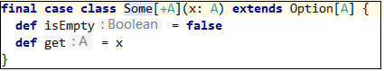
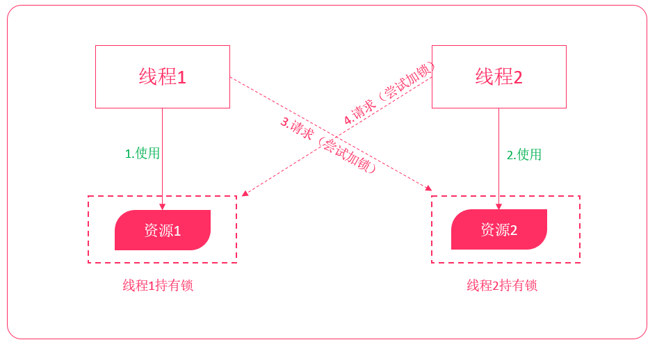
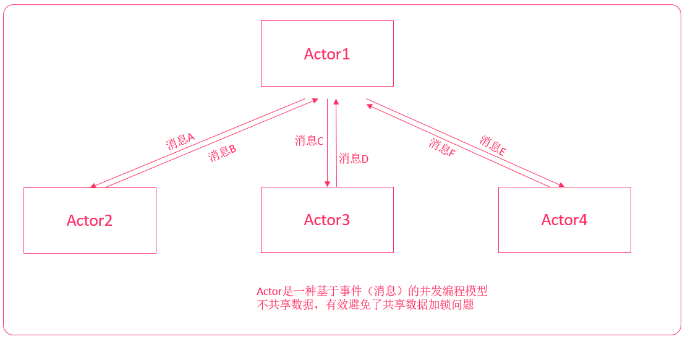
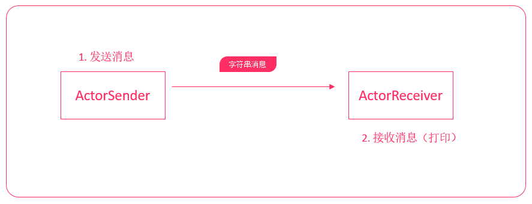
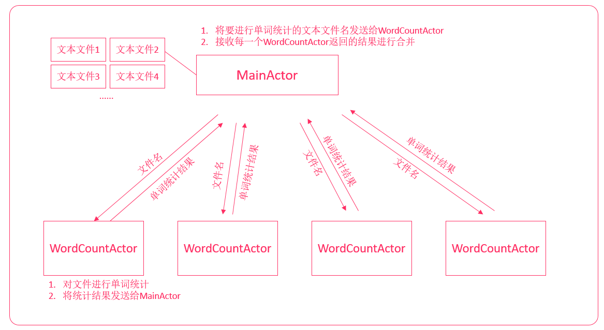

# scala第三天

**课程目标**

- 掌握样例类的使用
- 掌握模式匹配的使用
- 掌握Actor并发编程模型

## 01. 样例类

样例类是一种特殊类，它可以用来快速定义一个用于**保存数据**的类（类似于Java POJO类），在后续要学习并发编程和spark、flink这些框架也都会经常使用它。

**定义样例类**

**语法格式**

```scala
case class 样例类名([var/val] 成员变量名1:类型1, 成员变量名2:类型2, 成员变量名3:类型3)
```

- 如果要实现某个成员变量可以被修改，可以添加var
- **默认为val，可以省略**

### 示例 | 定义一个样例类

**需求**

- 定义一个Person样例类
- ，包含姓名和年龄成员变量
- 创建样例类的对象实例（"张三"、20），并打印它

**参考代码**

```scala
object _01CaseClassDemo {
  //1.定义样例类,定义成员变量
  case class Person(name:String, age:Int)
 //2.创建样例类对象
  def main(args: Array[String]): Unit = {
    val zhangsan = Person("张三", 20)
      println(zhangsan)
  }
}
```

### 示例 | 可变成员变量

**需求**

- 定义一个Person样例类，包含姓名和年龄成员变量
- 创建样例类的对象实例（"张三"、20）
- **修改张三的年龄为23岁**，并打印

**参考代码**

```scala
object _02CaseClassDemo {
  //1.创建样例类,添加可变成员
  case class Person(var name:String, var age:Int)
  //2.创建对象,修改年龄
  def main(args: Array[String]): Unit = {
    val zhangsan = Person("张三", 20)
    zhangsan.age = 23
    println(zhangsan)
  }
}
```

## 02. 样例类的方法

当我们定义一个样例类，编译器自动帮助我们实现了以下几个有用的方法：

- apply方法
- toString方法
- equals方法
- hashCode方法
- copy方法

### `apply方法`

apply方法可以让我们快速地使用类名来创建对象。参考以下代码：

```scala
case class CasePerson(name:String, age:Int)

object CaseClassDemo {
  def main(args: Array[String]): Unit = {
    val lisi = CasePerson("李四", 21)
    println(lisi.toString)
  }
}
```

### `toString方法`

toString返回**样例类名称(成员变量1, 成员变量2, 成员变量3....)**，我们可以更方面查看样例类的成员

```scala
case class CasePerson(name:String, age:Int)

object CaseClassDemo {
  def main(args: Array[String]): Unit = {
    val lisi = CasePerson("李四", 21)
    println(lisi.toString)
    // 输出：CasePerson(李四,21)
  }
}
```

### `equals方法`

样例类自动实现了equals方法，可以**直接使用==比较两个样例类是否相等，即所有的成员变量是否相等**

**示例**

- 创建一个样例类Person，包含姓名、年龄
- 创建名字年龄分别为"李四", 21的两个对象
- 比较它们是否相等

```scala
val lisi1 = CasePerson("李四", 21)
val lisi2 = CasePerson("李四", 21)
println(lisi1 == lisi2)
// 输出：true
```

### `hashCode方法`

样例类自动实现了hashCode方法，**如果所有成员变量的值相同，则hash值相同**，只要有一个不一样，则hash值不一样。

**示例**

- 创建名字年龄分别为"李四", 21的对象
- 再创建一个名字年龄分别为"李四", **22**的对象
- 分别打印这两个对象的哈希值

```scala
val lisi1 = CasePerson("李四", 21)
val lisi2 = CasePerson("李四", 22)

println(lisi1.hashCode())
println(lisi2.hashCode())
```

### `copy方法`

样例类实现了copy方法，**可以快速创建一个相同的实例对象，可以使用带名参数指定给成员进行重新赋值**

**示例**

- 创建名字年龄分别为"李四", 21的对象
- 通过copy拷贝，名字为"王五"的对象

```scala
val lisi1 = CasePerson("李四", 21)

val wangwu = lisi1.copy(name="王五")
println(wangwu)
```

## 03. 样例对象

它主要用在两个地方：

1. 定义枚举
2. 作为没有任何参数的消息传递（后面Akka编程会讲到）

**定义**

使用case object可以创建样例对象。样例对象是单例的，而且它**没有主构造器**

**语法格式**

```scala
case object 样例对象名
```

**示例 | 定义枚举**

**需求说明**

- 定义一个性别Sex枚举，它只有两个实例（男性——Male、女性——Female）
- 创建一个Person类，它有两个成员（姓名、性别）
- 创建两个Person对象（"张三"、男性）、（"李四"、"女"）

**参考代码**

```scala
trait Sex /*定义一个性别特质*/

case object Male extends Sex		// 定义一个样例对象并实现了Sex特质
case object Female extends Sex		

case class Person(name:String, sex:Sex)

object CaseClassDemo {
  def main(args: Array[String]): Unit = {
    val zhangsan = Person("张三", Male)
	val lisi = Person("李四", Female)
    println(zhangsan)
    println(lisi)
  }
}
```

## 04. 模式匹配

scala中有一个非常强大的模式匹配机制，可以应用在很多场景：

- switch语句
- 类型查询
- 使用模式匹配快速获取数据

### 简单模式匹配

在Java中，有switch关键字，可以简化if条件判断语句。在scala中，可以使用match表达式替代。

**语法格式**

```scala
变量 match {
    case "常量1" => 表达式1
    case "常量2" => 表达式2
    case "常量3" => 表达式3
    case _ => 表达式4		// 默认匹配
}
```

**示例**

**需求说明**

1. 从控制台输入一个单词（使用StdIn.readLine方法）
2. 判断该单词是否能够匹配以下单词，如果能匹配，返回一句话
3. 打印这句话

| 单词      | 返回                       |
| --------- | -------------------------- |
| hadoop    | 大数据分布式存储和计算框架 |
| zookeeper | 大数据分布式协调服务框架   |
| spark     | 大数据分布式内存计算框架   |
| 未匹配    | 未匹配                     |

**参考代码**

```scala
println("请输出一个词：")
// StdIn.readLine表示从控制台读取一行文本
val name = StdIn.readLine()

val result = name match {
    case "hadoop" => "大数据分布式存储和计算框架"
    case "zookeeper" => "大数据分布式协调服务框架"
    case "spark" => "大数据分布式内存计算框架"
    case _ => "未匹配"
}

println(result)
```

## 05. 匹配类型

除了像Java中的switch匹配数据之外，match表达式还可以进行类型匹配。如果我们要根据不同的数据类型，来执行不同的逻辑，也可以使用match表达式来实现。

**定义**

**语法格式**

```scala
变量 match {
    case 类型1变量名: 类型1 => 表达式1
    case 类型2变量名: 类型2 => 表达式2
    case 类型3变量名: 类型3 => 表达式3
    ...
    case _ => 表达式4
}
```

**示例**

**需求说明**

- 定义一个变量为Any类型，然后分别给其赋值为"hadoop"、1、1.0
- 定义模式匹配，然后分别打印类型的名称

**参考代码**

```scala
val a:Any = "hadoop"

val result = a match {
    case x:String => println(s"${x}是String类型")
    case x:Int => println(s"${x}是Int类型")
    case x:Double =>  println(s"${x}是Double类型")
    case _ => "未匹配"
}

println(result)
```


> [!NOTE]
>
> 如果case表达式中无需使用到匹配到的变量，可以使用下划线代代替

​                                                                                                                                                                                                                                                                                                                                                                                                                                                                                                                                                                                                                                                                                                                                                                                                                                                                                                                                                                                                                                                                                                                                                                                                                                                                                                                                                                                                                                                                                                                                                                                                                                                                                                                                                                                                                                                                                                                                                                                                                                                                                                                                                                                                                                                                                                                                                                                                                                                                                                                                                                                                                                                                                                                                                                                                                                                                                                                                                                                                                                                                                                                                                                                                                                                                                                                                                                                                                                                                                                                                                                                                                                                                                                                                                                                                                                                                                                                                                                                                                                                                                                                                                                                                                                                                                                                                                                                                                                                                                                                                                                                                                                                                                                                                                                                                                                                                                                                                                                                                                                                                                                                                                                                                                                                                                                                                                                                                                                                                                                                                                                                                                                                                                                                                                                                                                                                                                                                                                                                                                                                                                                                                                                                                                                                                                                                                                                                                                                                                                                                                                                                                                                                                                                                                                                                                                                                                                                                                                                                                                                                                                                                                                                                                                                                                                                                                                                                                                                                                                                                                                                                                                                                                                                                                                                                                                                                                                                                                                                                                                                                                                                                                                                                                                                                                                                                                                                                                                                                                                                                                                                                                                                                                                                                                                                                                                                                                                                                                                                                                                                                                                                                                                                                                                                                                                                                                                                                                                                                                                                                                                                                                                                                                                                                                                                                                                                                                                                                                                                                                                                                                                                                                                                                                                                                                                                                                                                                                                                                                                                                                                                                                                                                                                                                                                                                                                                                                                                                                                                                                                                                                                                                                                                                                                                                                                                                                                                                                                                                                                                                                                                                                                                                                                                                                                                                                                                                                                                                                                                                                                                                                                                                                                                                                                                                                                                                                                                                                                                                                                                                                                                                                                                                                                                                                                                                                                                                                                                                                                                                                                                                                                                                                                                                                                                                                                                                                                                                                                                                                                                                                                                                                                                                                                                                                                                                                                                                                                                                                                                                                                                                                                                                                                                                                                                                                                                                                                                                                                                                                                                                                                                                                                                                                                                                                                                                                                                                                                                                                                                                                                                                                                                                                                                                                                                                                                                                                                                                                                                                                                                                                                                                                                                                                                                                                                                                                                                                                                                                                                                                                                                                                                                                                                                                                                                                                                                                                                                                                                                                                                                                                                                                                                                                                                                                                                                                                                                                                                                                                                                                                                                                                                                                                                                                                                                                                                                                                                                                                                                                                                                                                                                                                                                                                                                                                                                                                                                                                                                                                                                                                                                                                                                                                                                                                                                                                                                                                                                                                                                                                                                                                                                                                                                                                                                                                                                                                                                                                                                                                                                                                                                                                                                                                                                                                                                                                                                                                                                                                                                                                                                                                                                                                                                                                                                                                                                                                                                                                                                                                                                                                                                                                                                                                                                                                                                                                                                                                                                                                                                                                                                                                                                                                                                                                                                                                                                                                                                                                                                                                                                                                                                                                                                                                                                                                                                                                                                                                                                                                                                                                                                                                                                                                                                                                                                                                                                                                                                                                                                                                                                                                                                                                                                                                                                                                                                                                                                                                                                                                                                                                                                                                                                                                                                                                                                                                                                                                                                                                                                                                                                                                                                                                                                                                                                                                                                                                                                                                                                                                                                                                                                                                                                                                                                                                                                                                                                                                                                                                                                                                                                                                                                                                                                                                                                                                                                                                                                                                                                                                                                                                                                                                                                                                                                                                                                                                                                                                                                                                                                                                                                                                                                                                                                                                                                                                                                                                                                                                                                                                                                                                                                                                                                                                                                                                                                                                                                                                                                                                                                                                                                                                                                                                                                                                                                                                                                                                                                                                                                                                                                                                                                                                                                                                                                                                                                                                                                                                                                                                                                                                                                                                                                                                                                                                                                                                                                                                                                                                                                                                                                                                                                                                                                                                                                                                                                                                                                                                                                                                                                                                                                                                                                                                                                                                                                                                                                                                                                                                                                                                                                                                                                                                                                                                                                                                                                                                                                                                                                                                                                                                                                                                                                                                                                                                                                                                                                                                                                                                                                                                                                                                                                                                                                                                                                                                                                                                                                                                                                                                                                                                                                                                                                                                                                                                                                                                                                                                                                                                                                                                                                                                                                                                                                                                                                                                                                                                                                                                                                                                                                                                                                                                                                                                                                                                                                                                                                                                                                                                                                                                                                                                                                                                                                                                                                                                                                                                                                                                                                                                                                                                                                                                                                                                                                                                                                                                                                                                                                                                                                                                                                                                                                                                                                                                                                                                                                                                                                                                                                                                                                                                                                                                                           

## 06. 匹配样例类

scala可以使用模式匹配来匹配样例类，从而可以快速获取样例类中的成员数据。后续，我们在开发Akka案例时，还会用到。

**示例**

**需求说明**

- 创建两个样例类Customer、Order
  - Customer包含姓名、年龄字段
  - Order包含id字段
- 分别定义两个案例类的对象，并指定为Any类型
- 使用模式匹配这两个对象，并分别打印它们的成员变量值

**参考代码**

```scala
// 1. 创建两个样例类
case class Person(name:String, age:Int)
case class Order(id:String)

def main(args: Array[String]): Unit = {
    // 2. 创建样例类对象，并赋值为Any类型
    val zhangsan:Any = Person("张三", 20)
    val order1:Any = Order("001")

    // 3. 使用match...case表达式来进行模式匹配
    // 获取样例类中成员变量
    order1 match {
        case Person(name, age) => println(s"姓名：${name} 年龄：${age}")
        case Order(id1) => println(s"ID为：${id1}")
        case _ => println("未匹配")
    }
}
```

## 06-01. 守卫

在Java中，只能简单地添加多个case标签，例如：要匹配0-7，就需要写出来8个case语句。例如：

```java
int a = 0;
switch(a) {
    case 0: a += 1;
    case 1: a += 1;
    case 2: a += 1;
    case 3: a += 1;
    case 4: a += 2;
    case 5: a += 2;
    case 6: a += 2;
    case 7: a += 2;
    default: a = 0;
}
```

在scala中，可以使用守卫来简化上述代码——也就是在**case语句中添加if条件判断**。

**示例**

**需求说明**

- 从控制台读入一个数字a（使用StdIn.readInt）
- 如果 a >= 0 而且 a <= 3，打印[0-3]
- 如果 a >= 4 而且 a <= 8，打印[3,8]
- 否则，打印未匹配

**参考代码**

```scala
val a = StdIn.readInt()

a match {
    case _ if a >= 0 && a <= 3 => println("[0-3]")
    case _ if a >= 4 && a <= 8 => println("[3-8]")
    case _ => println("未匹配")
}
```

## 07. 匹配集合

scala中的模式匹配，还能用来匹配集合。

### 匹配数组

**示例说明**

- 依次修改代码定义以下三个数组

  ```scala
  Array(1,x,y)   // 以1开头，后续的两个元素不固定
  Array(0)	   // 只匹配一个0元素的元素
  Array(0, ...)  // 可以任意数量，但是以0开头
  ```

- 使用模式匹配上述数组

**参考代码**

```scala
val arr1 = Array(1, 3, 5)
val arr2 = Array(0)
val arr3 = Array(0,1,2,3,4,5,6,7)
arr1 match {
    case Array(1, x, y) => println(s"匹配三个元素的数组,第一个元素为1,${x},${y}")
    case Array(0) => println("only 0")
    case Array(0, _*) => println("0 ...")
    case _ => println("something else")
}
```

### 匹配列表

**示例说明**

- 依次修改代码定义以下三个列表

  ```scala
  List(0)				// 只保存0一个元素的列表
  List(0,...)   		// 以0开头的列表，数量不固定
  List(x,y)	   		// 只包含两个元素的列表  
  ```

- 使用模式匹配上述列表

**参考代码**

```scala
val list1 = List(0)
val list2 = List(0, 1, 2)
val list3 = List(11,12)
list1 match {
    case 0 :: Nil => println("只有0的列表")
    case 0 :: tail => println("0开头的列表")
    case x :: y :: Nil => println(s"只有另两个元素${x}, ${y}的列表")
    case _ => println("未匹配")
}
//::表示拼接
//tail表示元素数据不固定的列表
```

### 匹配元组

**示例说明**

- 依次修改代码定义以下两个元组

  ```scala
  (1, x, y)		// 以1开头的、一共三个元素的元组
  (x, y, 5)   // 一共有三个元素，最后一个元素为5的元组
  ```

- 使用模式匹配上述元素

**参考代码**

```scala
val tuple1 = (2, 2, 5)
val tuple2 = (3, 4, 5)
tuple1 match {
    case (1, x, y) => println(s"三个元素，1开头的元组：1, ${x}, ${y}")
    case (x, y, 5) => println(s"三个元素，5结尾的元组：${x}, ${y}, 5")
    case _ => println("未匹配")
}
```

## 08. 变量声明中的模式匹配

在定义变量的时候，可以使用模式匹配快速获取数据

**示例 | 获取数组中的元素**

**需求说明**

- 生成包含0-10数字的数组，使用模式匹配分别获取第二个、第三个、第四个元素

**参考代码**

```scala
val array = (1 to 10).toArray
val Array(_, x, y, z, _*) = array

println(x, y, z)
```

**示例 | 获取List中的数据**

**需求说明**

- 生成包含0-10数字的列表，使用模式匹配分别获取第一个、第二个元素

**参考代码**

```scala
val list = (1 to 10).toList
val x :: y :: tail = list

println(x, y)
```

## 09. Option类型

使用Option类型，可以用来有效避免空引用(null)异常。也就是说，将来我们返回某些数据时，可以返回一个Option类型来替代。

**定义**

scala中，Option类型来表示可选值。这种类型的数据有两种形式：

- Some(x)：表示实际的值

  

- None：表示没有值

  

- 使用getOrElse方法，当值为None是可以指定一个默认值

**示例一**

**示例说明**

- 定义一个两个数相除的方法，使用Option类型来封装结果
- 然后使用模式匹配来打印结果
  - 不是除零，打印结果
  - 除零打印异常错误

**参考代码**

```scala
  /**
    * 定义除法操作
    * @param a 参数1
    * @param b 参数2
    * @return Option包装Double类型
    */
  def dvi(a:Double, b:Double):Option[Double] = {
    if(b != 0) {
      //表示有数据
      Some(a / b)
    }
    else {
      None
    }
  }

  def main(args: Array[String]): Unit = {
    val result1 = dvi(10.0, 5)
	val result2 = dvi(10.0, 0)
    result1 match {
      case Some(x) => println(x)
      case None => println("除零异常")
    }
  }
```

**示例二**

**示例说明**

- 重写上述案例，使用getOrElse方法，当除零时，或者默认值为0

**参考代码**

```scala
def dvi(a:Double, b:Double) = {
    if(b != 0) {
        Some(a / b)
    }
    else {
        None
    }
}

def main(args: Array[String]): Unit = {
    val result1 = dvi(10.0, 2).getOrElse(0)
    val result2 = dvi(1, 0).getOrElse(0)

    println(result1)
    println(result2)
}
```

## 10. 偏函数

偏函数可以提供了简洁的语法，可以简化函数的定义。配合集合的函数式编程，可以让代码更加优雅。

**定义**

- 偏函数**被包在花括号内没有match的一组case语句是一个偏函数**
- 偏函数是PartialFunction[A, B]的一个实例
  - A代表输**入参数类型**
  - B代表**返回结果类型**

**示例一**

**示例说明**

定义一个偏函数，根据以下方式返回

| 输入 | 返回值 |
| ---- | ------ |
| 1    | 一     |
| 2    | 二     |
| 3    | 三     |
| 其他 | 其他   |

**参考代码**

```scala
// func1是一个输入参数为Int类型，返回值为String类型的偏函数
val func1: PartialFunction[Int, String] = {
    case 1 => "一"
    case 2 => "二"
    case 3 => "三"
    case _ => "其他"
}
println(func1(1))
println(func1(2))
println(func1(3))
println(func1(4))
```

**示例二**

**示例说明**

- 定义一个列表，包含1-10的数字
- 请将1-3的数字都转换为[1-3]
- 请将4-8的数字都转换为[4-8]
- 将其他的数字转换为(8-*]

**参考代码**

```scala
//定义列表1-10
val list = (1 to 10).toList

//使用集合函数操作来进行数据转换
val list2 = list.map{
    case x if x >= 1 && x <= 3 => "[1-3]"
    case x if x >= 4 && x <= 8 => "[4-8]"
    case x if x > 8 => "(8-*]"
}

println(list2)
```

## 11. 正则表达式

在scala中，可以很方便地使用正则表达式来匹配数据。

**定义**

------

**Regex类**

- scala中提供了**Regex类来定义正则表达式**

- 要构造一个RegEx对象，直接使用String类的`r`方法即可

- **建议使用三个双引号来表示正则表达式**，不然就得对正则中的反斜杠来进行转义

  ```scala
  val regEx = """正则表达式""".r
  ```

**findAllMatchIn方法**

- 使用findAllMatchIn方法可以获取到所有正则匹配到的字符串

### 示例一匹配邮箱

**示例说明**

- 定义一个正则表达式，来匹配邮箱是否合法
- 合法邮箱测试：qq12344@163.com
- 不合法邮箱测试：qq12344@.com

**参考代码**

```scala
val r = """.+@.+\..+""".r
//.表示匹配任意单个字符
//+表示前面的字符出现一次或多个
//\表示转义字符,\.表示一个.
val eml1 = "qq12344@163.com"
val eml2 = "qq12344@.com"

//匹配第一个邮箱
if(r.findAllMatchIn(eml1).size > 0) {
    println(eml1 + "邮箱合法")
}
else {
    println(eml1 + "邮箱不合法")
}
//匹配第二个邮箱
if(r.findAllMatchIn(eml2).size > 0) {
    println(eml2 + "邮箱合法")
}
else {
    println(eml2 + "邮箱不合法")
}
```

### 示例二

**示例说明**

找出以下列表中的所有不合法的邮箱

```html
"38123845@qq.com", "a1da88123f@gmail.com", "zhansan@163.com", "123afadff.com"
```

**参考代码**

```scala
//定义邮箱列表
val emlList =
List("38123845@qq.com", "a1da88123f@gmail.com", "zhansan@163.com", "123afadff.com")
//定义正则表达式
val regex = """.+@.+\..+""".r
//过滤不合法邮箱
val invalidEmlList = emlList.filter {
    case emlList if regex.findAllMatchIn(emlList).size == 0 => true
    case _ => false
   // x =>
   // if (regex.findAllMatchIn(x).size == 0) true else false
}

println(invalidEmlList)
```

### 示例三

**示例说明**

- 有以下邮箱列表

  ```scala
  "38123845@qq.com", "a1da88123f@gmail.com", "zhansan@163.com", "123afadff.com"
  ```

- 使用正则表达式进行模式匹配，匹配出来邮箱运营商的名字。例如：邮箱zhansan@163.com，需要将163匹配出来

  - 使用括号来匹配分组

- 打印匹配到的邮箱以及运营商

**参考代码**

```scala
// 使用括号表示一个分组
val regex = """.+@(.+)\..+""".r

val emlList =
List("38123845@qq.com", "a1da88123f@gmail.com", "zhansan@163.com", "123afadff.com")

//使用集合的函数式操作来进行转换
val emlCmpList = emlList.map {
    case x @ regex(company) => s"${x} -> ${company}"
    case x => s"${x} -> 未知"
}

println(emlCmpList)
```


## 12. 异常处理

来看看下面一段代码。

```scala
  def main(args: Array[String]): Unit = {
   val i = 10 / 0
    
    println("你好！")
  }

Exception in thread "main" java.lang.ArithmeticException: / by zero
	at ForDemo$.main(ForDemo.scala:3)
	at ForDemo.main(ForDemo.scala)
```

执行程序，可以看到scala抛出了异常，而且没有打印出来"你好"。说明程序出现错误后就终止了。

那怎么解决该问题呢？

在scala中，可以使用异常处理来解决这个问题


### 捕获异常

**语法格式**

```scala
try {
    // 代码
}
catch {
    case ex:异常类型1 => // 代码
    case ex:异常类型2 => // 代码
}
finally {
    // 代码
}
```

- `try中的代码是我们编写的业务处理代码`
- 在`catch中表示当出现某个异常时`，需要执行的代码
- 在finally中，`是不管是否出现异常都会执行的代码`


**示例说明**

- 使用try..catch来捕获除零异常

**参考代码**

```scala
try {
    val i = 10 / 0

    println("你好！")
} catch {
    case ex: Exception => println(ex.getMessage)
}finally{
	println("异常案例")
}

```


## 13. 抛出异常

我们也可以在一个方法中，抛出异常。语法格式和Java类似，使用`throw new Exception...`

**示例 | 抛出异常**

**示例说明**

- 在main方法中抛出一个异常

**参考代码**

```scala
  def main(args: Array[String]): Unit = {
    throw new Exception("这是一个异常")
  }

Exception in thread "main" java.lang.Exception: 这是一个异常
	at ForDemo$.main(ForDemo.scala:3)
	at ForDemo.main(ForDemo.scala)
```

- scala不需要在方法上声明要抛出的异常，它已经解决了再Java中被认为是设计失败的检查型异常。

下面是Java代码

```java
public static void main(String[] args) throws Exception {
    throw new Exception("这是一个异常");
}
```

- 工作中经常遇到的格式

```
Try(Parse("id")).getOrElse("")

.filter("id!=''")
```


## 14. 提取器(Extractor)

我们之前已经使用过scala中非常强大的模式匹配功能了，通过模式匹配，我们可以快速匹配样例类中的成员变量。例如：

```scala
// 1. 创建两个样例类
case class Person(name:String, age:Int)
case class Order(id:String)

def main(args: Array[String]): Unit = {
    // 2. 创建样例类对象，并赋值为Any类型
    val zhangsan:Any = Person("张三", 20)
    val order1:Any = Order("001")

    // 3. 使用match...case表达式来进行模式匹配
    // 获取样例类中成员变量
    order1 match {
        case Person(name, age) => println(s"姓名：${name} 年龄：${age}")
        case Order(id1) => println(s"ID为：${id1}")
        case _ => println("未匹配")
    }
}
```

那是不是所有的类都可以进行这样的模式匹配呢？答案是：

`不可以`的。要支持模式匹配，必须要实现一个**提取器**。

> [!NOTE]
>
> **样例类自动实现了apply、unapply方法**


### 定义提取器

之前我们学习过了，实现一个类的伴生对象中的apply方法，可以用类名来快速构建一个对象。伴生对象中，还有一个unapply方法。与apply相反，unapply是将该类的对象，拆解为一个个的元素。


要实现一个类的提取器，只需要在该类的伴生对象中实现一个unapply方法即可。

**语法格式**

```scala
def unapply(stu:Student):Option[(类型1, 类型2, 类型3...)] = {
    if(stu != null) {
        Some((变量1, 变量2, 变量3...))
    }
    else {
        None
    }
}
```

**示例说明**

- 创建一个Student类，包含姓名年龄两个字段
- 实现一个类的解构器，并使用match表达式进行模式匹配，提取类中的字段。

**参考代码**

```scala
class Student(var name:String, var age:Int)

object Student {
    def apply(name:String, age:Int) = {
        new Student(name, age)
    }
	//定义到伴生对象里面
    def unapply(student:Student) = {
        val tuple = (student.name, student.age)

        Some(tuple)
    }
}

def main(args: Array[String]): Unit = {
    val zhangsan = Student("张三", 20)

    zhangsan match {
        case Student(name, age) => println(s"${name} => ${age}")
    }
}
```

## 15. 泛型

scala和Java一样，类和特质、方法都可以支持泛型。我们在学习集合的时候，一般都会涉及到泛型。

```scala
scala> val list1:List[String] = List("1", "2", "3")
list1: List[String] = List(1, 2, 3)
```

那如何自己定义泛型呢？

### 定义一个泛型方法

在scala中，使用方括号来定义类型参数。

**语法格式**

```scala
def 方法名[泛型名称](..) = {
    //...
}
```

**示例说明**

- 用一个方法来获取任意类型数组的中间的元素
  - 不考虑泛型直接实现（基于Array[Int]实现）
  - 加入泛型支持

**参考代码**

- 不考虑泛型的实现


```scala
//定义一个方法获取数组中间元素  
def getMiddle(arr:Array[Int]) = arr(arr.length / 2)

  def main(args: Array[String]): Unit = {
    val arr1 = Array(1,2,3,4,5)

    println(getMiddle(arr1))
  }
```

- 加入泛型支持


```scala
//定义一个方法获取数组中间元素 
def getMiddleElement[T](array:Array[T]) =
array(array.length / 2)

def main(args: Array[String]): Unit = {
    println(getMiddleElement(Array(1, 2, 3, 4, 5)))
    println(getMiddleElement(Array("a", "b", "c", "d", "e")))
    println(getMiddleElement(Array(1.0, 4.0, 2.0, 3.0, 6.0)))
}
```


## 16. 泛型类

scala的类也可以定义泛型。接下来，我们来学习如何定义scala的泛型类

### 定义

**语法格式**

```scala
class 类[T](val 变量名: T)
```

- 定义一个泛型类，直接在类名后面加上方括号，指定要使用的泛型参数
- 指定类对应的泛型参数后，就使用这些类型参数来定义变量了

**示例说明**

- 实现一个Pair泛型类 
- Pair类包含两个字段，而且两个字段的类型不固定
- 创建不同类型泛型类对象，并打印

**参考代码**

```scala
//创建泛型类,包括两个字段
case class Pair[T](var a:T, var b:T)

def main(args: Array[String]): Unit = {
    val pairList = List(
        Pair("Hadoop", "Storm"),
        Pair("Hadoop", 2008),
        Pair(1.0, 2.0),
        Pair("Hadoop", Some(1.9))
    )
    
   val pair[String]= Pair("Hadoop", "Storm"),

    println(pairList)
}
```


```scala
//定义多个泛型
def m1[U,T](x:U,y:T):String={
	s"${x}${y}"
}
def main(args: Array[String]): Unit = {
	val str = m1 ("hello",1)
    
    println(str)
}
```


## 17. 上下界

需求：

我们在定义方法/类的泛型时，限定必须从哪个类继承、或者必须是哪个类的父类。此时，就需要使用到上下界。

### 上界定义

使用`<: 类型名`表示给类型添加一个**上界**，表示泛型参数**必须要从该类（或本身）继承**

**语法格式**

```scala
[T <: 类型]
```

**示例说明**

- 定义一个Person类
- 定义一个Student类，继承Person类
- 定义一个demo泛型方法，该方法接收一个Array参数，
- 限定demo方法的Array元素类型只能是Person或者Person的子类
- 测试调用demo，传入不同元素类型的Array

**参考代码**

```scala

//创建一个类和它的子类
class Person
class Student extends Person
//创建一个泛型方法,并且给泛型方法指定一个上界
def demo[T <: Person](a:Array[T]) = println(a)

def main(args: Array[String]): Unit = {
    //使用不同的类型来调用泛型方法
    demo(Array(new Person))
    demo(Array(new Student))
    // 编译出错，必须是Person的子类
    // demo(Array("hadoop"))
}
```


### 下界

上界是要求必须是某个类的子类，或者必须从某个类继承，而下界是必须是**某个类的父类**（或本身）

**语法格式**

```scala
[T >: 类型]
```


> [!NOTE]
>
> 如果类既有上界、又有下界。下界写在前面，上界写在后面


**示例说明**

- 定义一个Person类
- 定义一个Policeman类，继承Person类
- 定义一个Superman类，继承Policeman类
- 定义一个demo泛型方法，该方法接收一个Array参数，
- 限定demo方法的Array元素类型只能是Person、Policeman
- 测试调用demo，传入不同元素类型的Array

**参考代码**

```scala
//定义类和子类
class Person
class Policeman extends Person
class Superman extends Policeman
//定义泛型方法,指定泛型的类型上下界:先写下界
def demo[T >: Policeman<:Person](array:Array[T]) = println(array)

def main(args: Array[String]): Unit = {
    demo(Array(new Person))
    demo(Array(new Policeman))
    // 编译出错：Superman是Policeman的子类
    // demo(Array(new Superman))
}
```


## 18. 协变、逆变、非变

spark的源代码中大量使用到了协变、逆变、非变，学习该知识点对我们将来阅读spark源代码很有帮助。

来看一个类型转换的问题：

```scala
class Pair[T]//泛型类

object Pair {
  def main(args: Array[String]): Unit = {
    val p1 = Pair("hello")
    // 编译报错，无法将p1转换为p2
    val p2:Pair[AnyRef] = p1

    println(p2)
  }
}
```

如何让带有泛型的类支持类型转换呢？

### 非变

**语法格式**

```scala
class Pair[T]{}
```

- 默认泛型类是非变的
- 类型B是A的子类型，Pair[A]和Pair[B]没有任何从属关系
- Java是一样的


### 协变

**语法格式**

```scala
class Pair[+T]
```

- 类型B是A的子类型，Pair[B]可以认为是Pair[A]的子类型
- 参数化类型的方向和类型的方向是一致的。

### 逆变

**语法格式**

```scala
class Pair[-T]
```

- 类型B是A的子类型，Pair[A]反过来可以认为是Pair[B]的子类型
- 参数化类型的方向和类型的方向是相反的

**示例说明**

- 定义一个Super类、以及一个Sub类继承自Super类
- 使用协变、逆变、非变分别定义三个泛型类
- 分别创建泛型类来演示协变、逆变、非变

**参考代码**

```scala
class Super
class Sub extends Super

//创建泛型类
class Temp1[T]//非变
class Temp2[+T]//协变
class Temp3[-T]//逆变

def main(args: Array[String]): Unit = {
    val a:Temp1[Sub] = new Temp1[Sub]
    // 编译报错
    // 非变:不允许任何的转变
    //val b:Temp1[Super] = a

    // 协变:允许将一个子类转换成父类
    val c: Temp2[Sub] = new Temp2[Sub]
    val d: Temp2[Super] = c

    // 逆变:参数化类型的方向和类型的方向是相反的
    val e: Temp3[Super] = new Temp3[Super]
    val f: Temp3[Sub] = e
}
```


## 19. Actor介绍

scala的Actor并发编程模型可以用来开发比Java线程效率更高的并发程序。我们学习scala Actor的目的主要是为后续学习Akka做准备。

### Java并发编程的问题

在Java并发编程中，每个对象都有一个逻辑监视器（monitor），可以用来控制对象的多线程访问。我们添加`sychronized`关键字来标记，需要进行同步加锁访问。这样，通过加锁的机制来确保同一时间只有一个线程访问共享数据。但这种方式存在资源争夺、以及死锁问题，程序越大问题越麻烦。


**线程死锁**




### Actor并发编程模型

Actor并发编程模型，是scala提供给程序员的一种与Java并发编程完全不一样的并发编程模型，是一种基于事件模型的并发机制。Actor并发编程模型是一种不共享数据，依赖消息传递的一种并发编程模式，有效避免资源争夺、死锁等情况。




### Java并发编程对比Actor并发编程

| Java内置线程模型                                  | scala Actor模型                      |
| ------------------------------------------------- | ------------------------------------ |
| "共享数据-锁"模型 (share data and lock)           | share nothing                        |
| 每个object有一个monitor，监视线程对共享数据的访问 | 不共享数据，Actor之间通过Message通讯 |
| 加锁代码使用synchronized标识                      |                                      |
| 死锁问题                                          |                                      |
| 每个线程内部是顺序执行的                          | 每个Actor内部是顺序执行的            |


> [!NOTE]
>
> scala在2.11.x版本中加入了Akka并发编程框架，老版本已经废弃。Actor的编程模型和Akka很像，我们这里学习Actor的目的是为学习Akka做准备。


## 20. 创建Actor

创建Actor的方式和Java中创建线程很类似，也是通过继承来创建。

使用方式

1. 定义class或object继承Actor特质
2. 重写act方法
3. 调用Actor的start方法执行Actor

> [!NOTE]
>
> 类似于Java线程，这里的每个Actor是并行执行的

**示例说明**

创建两个Actor，一个Actor打印1-10，另一个Actor打印11-20

- 使用class继承Actor创建（如果需要在程序中创建多个相同的Actor）
- 使用object继承Actor创建（如果在程序中只创建一个Actor）

**参考代码**

使用class继承Actor创建

```scala
object _05ActorDemo {
	//创建两个actor,使用class继承方式创建
    class Actor1 extends Actor {
    override def act(): Unit = (1 to 10).foreach(println(_))
  }
	
  class Actor2 extends Actor {
    override def act(): Unit = (11 to 20).foreach(println(_))
  }
//创建actor的对象,启动start()
  def main(args: Array[String]): Unit = {
    new Actor1().start()
    new Actor2().start()
  }
}
```

使用object继承Actor创建

```scala
//创建两个actor,使用object继承actor来实现 
object Actor1 extends Actor {
    override def act(): Unit =
      for(i <- 1 to 10) {
        println(i)
      }
  }

  object Actor2 extends Actor {
    override def act(): Unit =
      for(i <- 11 to 20) {
        println(i)
      }
  }

  def main(args: Array[String]): Unit = {
   	  //启动actor
      Actor1.start()
      Actor2.start()
  }
```


### 20-01.Actor程序运行流程

1. 必须调用start()方法启动Actor
2. 自动执行**act**()方法
3. 向Actor发送消息
4. act方法执行完成后，程序会调用**exit()**方法

### 20-02. 发送消息/接收消息

我们之前介绍Actor的时候，说过Actor是基于事件（消息）的并发编程模型，那么Actor是如何发送消息和接收消息的呢？

**使用方式**

**发送消息**

我们可以使用三种方式来发送消息：

| **！** | **发送异步消息，没有返回值**          |
| ------ | ------------------------------------- |
| **!?** | **发送同步消息，等待返回值**          |
| **!!** | **发送异步消息，返回值是Future[Any]** |

例如：

要给actor1发送一个异步字符串消息，使用以下代码：

```scala
actor1 ! "你好!"
```

**接收消息**

Actor中使用`receive`方法来接收消息，需要给receive方法传入一个偏函数

```scala
{
    case 变量名1:消息类型1 => 业务处理1,
    case 变量名2:消息类型2 => 业务处理2,
    ...
}
```


> [!NOTE]
>
> receive方法只接收一次消息，接收完后继续执行act方法

**示例说明**

- 创建两个Actor（ActorSender、ActorReceiver）
- ActorSender发送一个异步字符串消息给ActorReceiver
- ActorReceive接收到该消息后，打印出来



**参考代码**

```scala
//创建两个actor(ActorSender,ActorReceiver 
object ActorSender extends Actor {
    override def act(): Unit = {
      // 发送消息
      while(true) {
        ActorReceiver ! "hello!"
        TimeUnit.SECONDS.sleep(3)
      }
    }
  }

  object ActorReceiver extends Actor {
    override def act(): Unit = {
      // 持续接收消息
      while(true) {
        receive {//只接收一个消息
          case msg:String => println("接收到消息：" + msg)
        }
      }
    }
  }

  def main(args: Array[String]): Unit = {
    //先启动receiver
    ActorReceiver.start()
    ActorSender.start()
  }
```

### 20-02. 持续接收消息

通过上一个案例，ActorReceiver调用receive来接收消息，但接收一次后，Actor就退出了。


```scala
object ActorSender extends Actor {
  override def act(): Unit = {
    // 发送字符串消息给Actor2
    val msg =  "你好，ActorSender"
    println(s"ActorSender: 发送消息$msg")
    
    ActorReceiver ! msg
    // 再次发送一条消息，ActorReceiver无法接收到
    ActorReceiver ! "你叫什么名字？"
  }
}

object ActorReceiver extends Actor {
  override def act(): Unit =
    receive {
      case msg: String => println(s"接收Actor: 接收到$msg")
    }

}

object ActorMsgDemo {
  def main(args: Array[String]): Unit = {
    ActorSender.start()
    ActorReceiver.start()
  }
}
```

上述代码，ActorReceiver无法接收到ActorSender发送的第二条消息。


我们希望ActorReceiver能够一直接收消息，怎么实现呢？

——我们只需要使用一个while(true)循环，不停地调用receive来接收消息就可以啦。

**示例说明**

- 在上一个案例的基础上，让ActorReceiver能够一直接收消息

```scala
  object ActorSender extends Actor {
    override def act(): Unit = {
      // 发送消息
      while(true) {
        ActorReceiver ! "hello!"
        TimeUnit.SECONDS.sleep(3)
      }
    }
  }

  object ActorReceiver extends Actor {
    override def act(): Unit = {
      // 持续接收消息
      while(true) {
        receive {
          case msg:String => println("接收到消息：" + msg)
        }
      }
    }
  }

  def main(args: Array[String]): Unit = {
    ActorReceiver.start()
    ActorSender.start()
  }
```

### 20-03. 使用loop和react优化接收消息

上述代码，使用while循环来不断接收消息。

- 如果当前Actor没有接收到消息，线程就会处于阻塞状态
- 如果有很多的Actor，就有可能会导致很多线程都是处于阻塞状态
- 每次有新的消息来时，重新创建线程来处理
- 频繁的线程创建、销毁和切换，会影响运行效率

在scala中，可以使用loop + react来复用线程。比while + receive更高效

**示例说明**

使用loop + react重写上述案例

**参考代码**

```scala
// 持续接收消息
loop {
    react {
        case msg:String => println("接收到消息：" + msg)
    }
}
```

### 20-04. 发送和接收(loop)自定义消息

我们前面发送的消息是字符串类型，Actor中也支持发送自定义消息，常见的如：使用样例类封装消息，然后进行发送处理。

**示例一**

**示例说明**

- 创建一个MsgActor，并向它发送一个同步消息，该消息包含两个字段（id、message）
- MsgActor回复一个消息，该消息包含两个字段（message、name）
- 打印回复消息

> [!TIP]
>
> - 使用`!?`来发送同步消息
> - 在Actor的act方法中，可以使用sender获取发送者的Actor引用

**参考代码**

```scala
// 自定义消息类型
case class Message(id:Int, msg:String)
//自定义回复消息类型
  case class ReplyMessage(msg:String, name:String)
//创建actor 接收消息,回复消息
  object MsgActor extends Actor {
    override def act(): Unit = {
      loop {
        react {
          case Message(id, msg) => {
            println(s"接收到消息:${id}/${msg}")
            sender ! ReplyMessage("不太好", "Tom")
          }
        }
      }
    }
  }

  def main(args: Array[String]): Unit = {
   //启动发送消息
      MsgActor.start()
	
    val replyMessage: Any = MsgActor !? Message(1, "你好")
      if(replyMessage.isIntanceOf(ReplyMessage){
    println("回复消息:" + replyMessage.asInstanceOf[ReplyMessage])
      }
  }
```

**示例二**

**示例说明**

- 创建一个MsgActor，并向它发送一个异步无返回消息，该消息包含两个字段（message, company）


> [!TIP]
>
> 使用`!`发送异步无返回消息


**参考代码**

```scala
//创建样例类封装消息
case class Mesasge(message:String, company:String)
//1.创建actor,打印接收消息
object MsgActor extends Actor {
    override def act(): Unit = {
        loop {
            react {
                case Mesasge(message, company) =>
                println(s"MsgActor接收到消息:${message}/${company}")
            }
        }
    }
}

//2.启动actor,给actor发送异步无返回消息
def main(args: Array[String]): Unit = {
    
    MsgActor.start()
	//发送异步无返回消息
    MsgActor ! Mesasge("中国联通", "大爷，快交话费！")
}
```

**示例三**

**示例说明**

- 创建一个MsgActor，并向它发送一个异步有返回消息，该消息包含两个字段（id、message）
- MsgActor回复一个消息，该消息包含两个字段（message、name）
- 打印回复消息


> [!TIP]
>
> - 使用`!!`发送异步有返回消息
> - 发送后，返回类型为Future[Any]的对象
> - Future表示异步返回数据的封装，虽获取到Future的返回值，但不一定有值，可能在将来某一时刻才会返回消息
> - Future的isSet()可检查是否已经收到返回消息，apply()方法可获取返回数据

**参考代码**

```scala
//定义样例类封装数据
case class Message(id:Int, message:String)
case class ReplyMessage(message:String, name:String)
//2.创建actor,接收消息,回复消息
object MsgActor extends Actor {
    override def act(): Unit = {
        loop {
            react {
                case Message(id, message) =>
                println(s"MsgActor接收到消息：${id}/${message}")
                //回复一个reply消息
                sender ! ReplyMessage("收到消息！", "JIm")
            }
        }
    }
}
//2.启动actor,发送异步有返回消息
def main(args: Array[String]): Unit = {
    MsgActor.start()
	//Future表示将来会返回一个数据
    val future: Future[Any] = MsgActor !! Message(1, "你好！")
	//3.获取打印返回消息
    //3.1提前通过一个循环等到future中有数据,在执行
    //3.2调用future.isSet方法就可以判断,数据是否已经被接收到,如果接收到消息,跳出循环
    while(!future.isSet) {}
    
	//3.3使用future的apply方法获取数据
    val replyMessage = future.apply().asInstanceOf[ReplyMessage]
    println(replyMessage)
}
```

## 21. WordCount案例

接下来，我们要使用Actor并发编程模型实现多文件的单词统计。

**案例介绍**

给定几个文本文件（文本文件都是以空格分隔的），使用Actor并发编程来统计单词的数量

**思路分析**



**实现思路**

1. MainActor获取要进行单词统计的文件
2. 根据文件数量创建对应的WordCountActor
3. 将文件名封装为消息发送给WordCountActor
4. WordCountActor接收消息，并统计单个文件的单词计数
5. 将单词计数结果发送给MainActor
6. MainActor等待所有的WordCountActor都已经成功返回消息，然后进行结果合并

### 步骤1 | 获取文件列表

**实现思路**

在main方法中读取指定目录(${project_root_dir}/data/)下的所有文件，并打印所有的文件名

**实现步骤**

1. 创建用于测试的数据文件
2. 加载工程根目录，获取到所有文件
3. 将每一个文件名，添加目录路径
4. 打印所有文件名

**参考代码**

```scala
object MainActor{
    def main(args:Array[String]:Unit={
    // 1. MainActor获取要进行单词统计的文件
    val DIR_PATH = "./data/"
    //获取指定目录下的所有数据文件名
    val dataDir = new File(DIR_PATH)

    // 读取所有data目录下的所有文件
    println("对以下文件进行单词统计:")
    //2. 构建文件列表
    val fileList = dataDir.list().toList.map(DIR_PATH + _)
    //3.打印所有的文件名
    println(fileList)
    }
}
```

### 步骤2 | 创建WordCountActor

**实现思路**

根据文件数量创建WordCountActor，为了方便后续发送消息给Actor，将每个Actor与文件名关联在一起

**实现步骤**

1. 创建WordCountActor
2. 将文件列表转换为WordCountActor
3. 为了后续方便发送消息给Actor，将Actor列表和文件列表拉链到一起
4. 打印测试

**参考代码**

MainActor.scala

```scala

// 2. 根据文件数量创建对应的WordCountActor
//2.1创建Actor
val actorList = fileList.map {
    x => new WordCountActor
}

//2.2将Actor和文件名列表建立为元组
val actorWithFileList: List[(WordCountActor, String)] = actorList.zip(fileList)
//2.3打印所有的文件名
println(actorWithFileList)
```

WordCountActor.scala

```scala
class WordCountActor extends Actor{
  override def act(): Unit = {
  }
}
```

### 步骤3 | 启动Actor/发送/接收任务消息

**实现思路**

启动所有WordCountActor，并发送单词统计任务消息给每个WordCountActor

> [!NOTE]
>
> 此处应发送异步有返回消息

**实现步骤**

1. 创建一个WordCountTask样例类消息，封装要进行单词计数的文件名
2. 启动所有WordCountTask，并发送异步有返回消息
3. 获取到所有的WordCount中获取到的消息（封装到一个Future列表中）
4. 在WordCountActor中接收并打印消息

**参考代码**

MainActor.scala

```scala
// 3. 将文件名封装为消息发送给WordCountActor，并获取到异步返回结果
val futureList = actorWithFileList.map {
    // tuple为Actor和文件名
    tuple =>
    // 启动actor
    tuple._1.start()
    // 发送任务消息到Actor中,发送的是异步又返回值的消息
 val future=tuple._1 !! WordCountTask(tuple._2)
}
```

MessagePackage.scala

```scala
/**
  * 单词统计任务消息
  * @param fileName 文件名
  */
case class WordCountTask(fileName:String)
```

WordCountActor.scala

```scala
loop {
    react {
        // 接收单词统计任务消息
        case WordCountTask(fileName) => {
            println("接收到消息:" + fileName)
        }
    }
}
```

### 步骤4 | 消息统计文件单词计数

**实现思路**

读取文件文本，并统计出来单词的数量。例如：

```html
(hadoop, 3), (spark, 1)...
```

**实现步骤**

1. 读取文件内容，并转换为列表
2. 按照空格切割文本，并转换为一个一个的单词
3. 为了方便进行计数，将单词转换为元组
4. 按照单词进行分组，然后再进行聚合统计
5. 打印聚合统计结果

**参考代码**

WordCountActor.scala

```scala
// 4. 统计单个文件的单词计数
val iter: Iterator[String] = Source.fromFile(fileName).getLines()
// [第一行] hadoop hadoop
// [第二行] hadoop spark
val lineList = iter.toList
//切割字符串, [单词列表] hadoop, hadoop, hadoop, spark
val wordList: List[String] = lineList.flatMap(_.split(" "))
// 将单词转换为元组
// [元组列表] (hadoop, 1), (hadoop, 1), (hadoop, 1), (spark, 1)
val tupleList = wordList.map(_ -> 1)

// 按照单词进行分组
// [单词分组] = {hadoop->List(hadoop->1, hadoop->1, hadoop->1), spark->List(spark ->1)}
val grouped: Map[String, List[(String, Int)]] = tupleList.groupBy(_._1)

// 将分组内的数据进行聚合
// [单词计数] = (hadoop, 3), (spark, 1)
val wordCount: Map[String, Int] = grouped.map {
    tuple =>
    // 单词
    val word = tuple._1
    // 进行计数
    // 获取到所有的单词数量，然后进行累加
    val total = tuple._2.map(_._2).sum
    word -> total
}
println(wordCount)
```

### 步骤5 | 封装单词计数结果回复给MainActor

**实现思路**

- 将单词计数的结果封装为一个样例类消息，并发送给MainActor
- MainActor等待所有WordCount均已返回后获取到每个WordCountActor单词计算后的结果


**实现步骤**

1. 定义一个样例类封装单词计数结果
2. 将单词计数结果发送给MainActor
3. MainActor中检测所有WordActor是否均已返回，如果均已返回，则获取并转换结果
4. 打印结果

**参考代码**

MessagePackage.scala

```scala
/**
  * 单词统计结果
  * @param wordCount 单词计数
  */
case class WordCountResult(wordCount: Map[String, Int])
```

WordCountActor.scala

```scala
// 5. 将单词计数结果回复给MainActor
sender ! WordCountResult(wordCount)
```

MainActor.scala

```scala
// 等待所有Actor都已经返回
while(futureList.filter(_.isSet).size != fileList.size){}
// MainActor等待所有的WordCountActor都已经成功返回消息，然后进行结果合并
val resultList: List[Map[String, Int]] = futureList.map(_.apply.asInstanceOf[WordCountResult].wordCount)
println("接收到所有统计结果：" + resultList)
```

### 步骤6 | 结果合并

**实现思路**

对接收到的所有单词计数进行合并。因为该部分已经在WordCountActor已经编写过，所以抽取这部分一样的代码到一个工具类中，再调用合并得到最终结果

**实现步骤**

1. 创建一个用于单词合并的工具类
2. 抽取重复代码为一个方法
3. 在MainActor调用该合并方法，计算得到最终结果，并打印

**参考代码**

WordCountUtil.scala

```scala
object WordCountUtil{

/**
    * 单词分组统计
    * @param wordCountList 单词计数列表
    * @return 分组聚合结果
    */
  def reduce(wordCountList:List[(String, Int)]) = {
    // 按照单词进行分组
    // [单词分组] = {hadoop->List(hadoop->1, hadoop->1, hadoop->1), spark->List(spark ->1)}
    val grouped: Map[String, List[(String, Int)]] = wordCountList.groupBy(_._1)
    // 将分组内的数据进行聚合
    // [单词计数] = (hadoop, 3), (spark, 1)
    val wordCount: Map[String, Int] = grouped.map {
      tuple =>
        // 单词
        val word = tuple._1
        // 进行计数
        // 获取到所有的单词数量，然后进行累加
        val total = tuple._2.map(_._2).sum
        word -> total
    }
    wordCount
  }
}
```

MainActor.scala

```scala
// 扁平化后再聚合计算
val result: Map[String, Int] = WordCountUtil.reduce(resultList.flatten)

println("最终结果:" + result)
```

