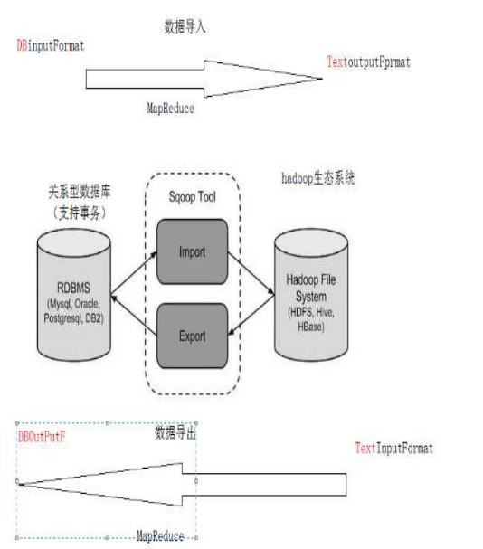
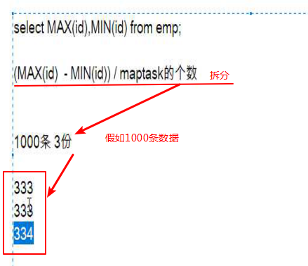

# 一、 课程计划

目录

[一、 课程计划	2](#_Toc10648361)

[二、 Apache Sqoop	4](#_Toc10648362)

[1． sqoop介绍	4](#_Toc10648363)

[2． sqoop安装	5](#_Toc10648364)

[三、 Sqoop导入	6](#_Toc10648365)

[1． 全量导入mysql表数据到HDFS	7](#_Toc10648366)

[2． 全量导入mysql表数据到HIVE	8](#_Toc10648367)

[2.1． 方式一：先复制表结构到hive中再导入数据	8](#_Toc10648368)

[2.2． 方式二：直接复制表结构数据到hive中	9](#_Toc10648369)

[3． 导入表数据子集(where过滤)	10](#_Toc10648370)

[4． 导入表数据子集(query查询)	11](#_Toc10648371)

[5． 增量导入	12](#_Toc10648372)

[5.1． Append模式增量导入	13](#_Toc10648373)

[5.2． Lastmodified模式增量导入	14](#_Toc10648374)

[5.3． Lastmodified模式:append、merge-key	16](#_Toc10648375)

[四、 Sqoop导出	17](#_Toc10648376)

[1． 默认模式导出HDFS数据到mysql	18](#_Toc10648377)

[1.1． 准备HDFS数据	18](#_Toc10648378)

[1.2． 手动创建mysql中的目标表	18](#_Toc10648379)

[1.3． 执行导出命令	18](#_Toc10648380)

[1.4． 相关配置参数	19](#_Toc10648381)

[2． 更新导出（updateonly模式）	20](#_Toc10648382)

[2.1． 参数说明	20](#_Toc10648383)

[2.2． 准备HDFS数据	20](#_Toc10648384)

[2.3． 手动创建mysql中的目标表	20](#_Toc10648385)

[2.4． 先执行全部导出操作	20](#_Toc10648386)

[2.5． 查看此时mysql中的数据	21](#_Toc10648387)

[2.6． 新增一个文件	21](#_Toc10648388)

[2.7． 执行更新导出	21](#_Toc10648389)

[2.8． 查看最终结果	21](#_Toc10648390)

[3． 更新导出（allowinsert模式）	22](#_Toc10648391)

[3.1． 参数说明	22](#_Toc10648392)

[3.2． 准备HDFS数据	22](#_Toc10648393)

[3.3． 手动创建mysql中的目标表	22](#_Toc10648394)

[3.4． 先执行全部导出操作	22](#_Toc10648395)

[3.5． 查看此时mysql中的数据	23](#_Toc10648396)

[3.6． 新增一个文件	23](#_Toc10648397)

[3.7． 执行更新导出	23](#_Toc10648398)

[3.8． 查看最终结果	23](#_Toc10648399)

[五、 Sqoop job作业	24](#_Toc10648400)

[1． job 语法	24](#_Toc10648401)

[2． 创建job	24](#_Toc10648402)

[3． 验证job	25](#_Toc10648403)

[4． 检查job	25](#_Toc10648404)

[5． 执行job	25](#_Toc10648405)

[6． 免密执行job	26](#_Toc10648406)

# 二、 Apache Sqoop

## 1． sqoop介绍 

Apache Sqoop是在Hadoop生态体系和RDBMS体系之间传送数据的一种工具。来自于Apache软件基金会提供。

Sqoop工作机制是将导入或导出命令翻译成[mapreduce程序来实现]()。在翻译出的mapreduce中主要是对inputformat和outputformat进行定制。

Hadoop生态系统包括：HDFS、Hive、Hbase等

RDBMS体系包括：Mysql、Oracle、DB2等

Sqoop可以理解为：“SQL 到 Hadoop 和 Hadoop 到SQL”。

 

​	站在Apache立场看待数据流转问题，可以分为数据的导入导出:

Import：数据导入。RDBMS----->Hadoop

Export：数据导出。Hadoop---->RDBMS



## 2． sqoop安装(node03)

安装sqoop的前提是已经具备java和hadoop的环境。

最新稳定版： 1.4.6

- 将文件上传到/export/software/目录下

  ```
  tar -zxvf sqoop-1.4.6.bin__hadoop-2.0.4-alpha.tar.gz -C /export/servers/
  cd /export/servers/
  mv sqoop-1.4.7.bin__hadoop-2.6.0 sqoop
  ```

- 配置文件修改：

  ```shell
  cd $SQOOP_HOME/conf
  
  mv sqoop-env-template.sh sqoop-env.sh
  
  vi sqoop-env.sh
  
  export HADOOP_COMMON_HOME=/export/servers/hadoop-2.7.5
  
  export HADOOP_MAPRED_HOME=/export/servers/hadoop-2.7.5
  
  export HIVE_HOME=/export/servers/apache-hive-2.1.1-bin
  ```

- 加入mysql的jdbc驱动包

cp /hive/lib/mysql-connector-java-5.1.32.jar $SQOOP_HOME/lib/

- 验证启动

```shell
cd $SQOOP_HOME/

bin/sqoop list-databases \
 --connect jdbc:mysql://localhost:3306/ \
 --username root --password 123456
```

本命令会列出所有mysql的数据库。

到这里，整个Sqoop安装工作完成。

# 三、 Sqoop导入

“导入工具”导入单个表从RDBMS到HDFS。表中的每一行被视为HDFS的记录。所有记录都存储为文本文件的文本数据

下面的语法

用于将数据导入HDFS。

$ sqoop import (generic-args) (import-args)

Sqoop测试表数据

在mysql中创建数据库userdb，然后执行参考资料中的sql脚本：

创建三张表: emp雇员表、 emp_add雇员地址表、emp_conn雇员 

联系表。

## 1．全量导入mysql表数据到HDFS

下面的命令用于从MySQL数据库服务器中的emp表导入HDFS。

```shell
bin/sqoop import \
--connect jdbc:mysql://node03:3306/userdb \
--username root \
--password 123456 \
--delete-target-dir \
--target-dir /sqoopresult \
--table emp \
--m 1
```

其中--target-dir可以用来指定导出数据存放至HDFS的目录；

mysql jdbc url 请使用 ip 地址。

为了验证在HDFS导入的数据，请使用以下命令查看导入的数据：

hdfs dfs -cat /sqoopresult/part-m-00000

可以看出它会在HDFS上默认用[逗号(\0001)](),分隔emp表的数据和字段。可以通过

--fields-terminated-by '\t'来指定分隔符。

 ```
1201,gopal,manager,50000,TP
1202,manisha,Proof reader,50000,TP
1203,khalil,php dev,30000,AC
1204,prasanth,php dev,30000,AC
1205,kranthi,admin,20000,TP
 ```

- 全量导入数据到hdfs

- mysql的地址尽量不要使用localhost,请使用ip或者host

- [如果不指定,导入hdfs默认分隔符是","]()

- 可以通过--fields-terminated-by "\t"指定分隔符

  - 如果指定多个maptask,则表文件的划分方式是[max(拆分字段)-min(拆分字段)/maptask个数]()

- 如果表的数据比较大,可以起到多个matesk执行导入操作,如没有主键,可以通过--split-by 那个指定进行切分

  ```shell
  bin/sqoop import \
  --connect jdbc:mysql://node03:3306/userdb \
  --username root \
  --password 123456 \
  --target-dir /sqoopresult2 \
  --fields-terminated-by '\t' \
  --split-by id \
  --table emp \
  --m 2
  ```

- maptask拆分流程

  

## 2．全量导入mysql表数据到HIVE

### 2.1． 方式一：先复制表结构到hive中再导入数据

- 将关系型数据的表结构复制到hive中

- 首先创建数据库,登录到hive

  ```
  create database test;
  ```

  

```shell
bin/sqoop create-hive-table \
--connect jdbc:mysql://node03:3306/userdb \
--table emp_add \
--username root \
--password 123456 \
--hive-table test.emp_add_sp
```

其中：

 --table emp_add为mysql中的数据库userdb中的表。   

 --hive-table emp_add_sp 为hive中新建的表名称。

- 从关系数据库导入文件到hive中


```shell
bin/sqoop import \
--connect jdbc:mysql://node03:3306/userdb \
--username root \
--password 123456 \
--table emp_add \
--hive-table test.emp_add_sp \
--hive-import \
--m 1
```

--m 1	:表示使用一个mapreduce   

```shell
bin/sqoop import \
--connect jdbc:mysql://node03:3306/userdb \
--username root \
--password 123456 \
--table emp_add \
--hive-table emp_add_sp2 \
--hive-import \
--split-by id \
--m 2
```

### 2.2．方式二：直接复制表结构数据到hive中

 ```shell
bin/sqoop import \
--connect jdbc:mysql://node03:3306/userdb \
--username root \
--password 123456 \
--table emp_conn \
--hive-import \
--m 1 \
--hive-database test
 ```

 

- 全量导入hive
  - 默认的分隔符是'\001'

## 3． 导入表数据子集(where过滤)

--where可以指定从关系数据库导入数据时的查询条件。它执行在数据库服务器相应的SQL查询，并将结果存储在HDFS的目标目录。

```shell
bin/sqoop import \
--connect jdbc:mysql://node03:3306/userdb \
--username root \
--password 123456 \
--where "city ='sec-bad'" \
--target-dir /wherequery \
--table emp_add --m 1
```

 

## 4． 导入表数据子集(query查询)

注意事项：

- 使用query sql语句来进行查找不能加参数--table ;


- 并且必须要添加where条件;


- 并且where条件后面[必须带一个$CONDITIONS]() 这个字符串;


- 并且这个sql语句必须用单引号，不能用双引号;
- $CONDITIONS是sqoop内置的条件必须添加到where条件后面

```shell
bin/sqoop import \
--connect jdbc:mysql://node03:3306/userdb \
--username root \
--password 123456 \
--target-dir /wherequery12 \
--query 'select id,name,deg from emp WHERE  id>1203 and $CONDITIONS' \
--split-by id \
--fields-terminated-by '\t' \
--m 2
```

sqoop命令中，--split-by id通常配合-m 10参数使用。用于指定根据哪个字段进行划分并启动多少个maptask。

## 5． 增量导入

在实际工作当中，数据的导入，很多时候都是只需要导入增量数据即可，并不需要将表中的数据每次都全部导入到hive或者hdfs当中去，这样会造成数据重复的问题。因此一般都是选用一些字段进行增量的导入， sqoop支持增量的导入数据。

**增量导入**是**仅导入新添加的表中的行的技术**。

--check-column (col)		

用来指定一些列，这些列在增量导入时用来检查这些数据是否作为增量数据进行导入，和关系型数据库中的**自增字段及时间戳类似**。 

注意:这些被指定的列的类型不能使任意字符类型，如char、varchar等类型都是不可以的，同时-- check-column可以去指定多个列。

--incremental (mode)	

append：追加，比如对大于last-value指定的值之后的记录进行追加导入。

lastmodified：最后的修改时间，追加last-value指定的日期之后的记录

--last-value (value)

指定自从上次导入后列的最大值（大于该指定的值），也可以自己设定某一值

### 5.1． Append模式增量导入

Ø 执行以下指令先将我们之前的数据导入：

```shell
bin/sqoop import \
--connect jdbc:mysql://node03:3306/userdb \
--username root \
--password 123456 \
--target-dir /appendresult \
--table emp  \
--m 1
```

Ø 使用hadoop fs -cat查看生成的数据文件，发现数据已经导入到hdfs中。

Ø 然后在mysql的emp中插入2条增量数据:

```mysql
insert into `userdb`.`emp` (`id`, `name`, `deg`, `salary`, `dept`) values ('1206', 'allen', 'admin', '30000', 'tp');
insert into `userdb`.`emp` (`id`, `name`, `deg`, `salary`, `dept`) values ('1207', 'woon', 'admin', '40000', 'tp');
```

Ø 执行如下的指令，实现增量的导入:

```shell
bin/sqoop import \
--connect jdbc:mysql://node03:3306/userdb \
--username root \
--password hadoop \
--table emp \
--m 1 \
--target-dir /appendresult \
--incremental append \
--check-column id \
--last-value  1205
```

 

Ø 最后验证导入数据目录 可以发现多了一个文件 里面就是增量数据

 

### 5.2． Lastmodified模式增量导入

Ø 首先创建一个customer表，指定一个时间戳字段：

```mysql
create table customertest(id int,name varchar(20),last_mod timestamp default current_timestamp on update current_timestamp);
```

此处的时间戳设置为在数据的产生和更新时都会发生改变.

Ø 分别插入如下记录:

```mysql
insert into customertest(id,name) values(1,'neil');
insert into customertest(id,name) values(2,'jack');
insert into customertest(id,name) values(3,'martin');
insert into customertest(id,name) values(4,'tony');
insert into customertest(id,name) values(5,'eric');
```

Ø 执行sqoop指令将数据全部导入hdfs:

```shell
bin/sqoop import \
--connect jdbc:mysql://node03:3306/userdb \
--username root \
--password hadoop \
--target-dir /lastmodifiedresult \
--table customertest --m 1
```

Ø 查看此时导出的结果数据：

 

Ø 再次插入一条数据进入customertest表

```mysql
insert into customertest(id,name) values(6,'james');
```

Ø 使用incremental的方式进行增量的导入:

```shell
bin/sqoop import \
--connect jdbc:mysql://node03:3306/userdb \
--username root \
--password 123456 \
--table customertest \
--target-dir /lastmodifiedresult \
--check-column last_mod \
--incremental lastmodified \
--last-value "2019-05-28 18:42:06" \
--m 1 \
--append
```

 

 

此处已经会导入我们最后插入的一条记录,但是我们却发现此处插入了2条数据，这是为什么呢？ 

这是因为采用lastmodified模式去处理增量时，会将大于等于last-value值的数据当做增量插入。

**总结:**

- 增量数据的导入
  - 所谓的增量数据指的是上次至今中间新增加的数据
  - sqoop支持两种模式的增量导入
    - append追加根据数值类型字段追加导入大于指定last-value
    - lastmodified根据时间戳类型字段进行追加大于等于指定的last-value
      - 注意在lastmodified模式下还分为两种情景:append	merge-key

### 5.3． Lastmodified模式:append、merge-key

使用lastmodified模式进行增量处理要指定增量数据是以append模式(附加)还是merge-key(合并)模式添加

下面演示使用merge-by的模式进行增量更新,我们去更新 id为1的name字段。

```mysql
update customertest set name = 'Neil' where id = 1;
```

更新之后，这条数据的时间戳会更新为更新数据时的系统时间.

执行如下指令，把id字段作为merge-key:

```shell
bin/sqoop import \
--connect jdbc:mysql://node03:3306/userdb \
--username root \
--password 123456 \
--table customertest \
--target-dir /lastmodifiedresult \
--check-column last_mod \
--incremental lastmodified \
--last-value "2019-05-28 18:42:06" \
--m 1 \
--merge-key id
```

由于merge-key模式是进行了一次完整的mapreduce操作，

因此最终我们在lastmodifiedresult文件夹下可以看到生成的为part-r-00000这样的文件，会发现id=1的name已经得到修改，同时新增了id=6的数据。

 

**总结**

- append只会追加增量数据到一个新的文件中,并且会产生数据的重复问题

  因为默认是指定的last-value大于等于其值的数据开始导入

- merge-key把增量的数据合并到一个文件中,处理追加数据数据之外,如果之前的数据有变化修改也可以进行修改操作,底层相当于进行了一次完整的mr作业,数据不会重复

# 四、 Sqoop导出

将数据从Hadoop生态体系导出到RDBMS数据库导出前，目标表必须存在于目标数据库中。

export有三种模式：

1. 默认操作是从将文件中的数据使用INSERT语句插入到表中。
2. 更新模式：Sqoop将生成UPDATE替换数据库中现有记录的语句。
3. 调用模式：Sqoop将为每条记录创建一个存储过程调用。

以下是export命令语法：

$ sqoop export (generic-args) (export-args)

## 1． 默认模式导出HDFS数据到mysql

默认情况下，sqoop export将每行输入记录转换成一条INSERT语句，添加到目标数据库表中。如果数据库中的表具有约束条件（例如，其值必须唯一的主键列）并且已有数据存在，则必须注意避免插入违反这些约束条件的记录。如果INSERT语句失败，导出过程将失败。**此模式主要用于将记录导出到可以接收这些结果的空表中**。通常用于全表数据导出。

导出时可以是将Hive表中的全部记录或者HDFS数据（可以是全部字段也可以部分字段）导出到Mysql目标表。

### 1.1． 准备HDFS数据

 在HDFS文件系统中“/emp/”目录的下创建一个文件emp_data.txt：

```
hdfs dfs -mkdir -p /emp/emp_data
hdfs dfs -put emp_data.txt /emp/emp_data

1201,gopal,manager,50000,TP
1202,manisha,preader,50000,TP
1203,kalil,php dev,30000,AC
1204,prasanth,php dev,30000,AC
1205,kranthi,admin,20000,TP
1206,satishp,grpdes,20000,GR
```

### 1.2． 手动创建mysql中的目标表

```mysql
USE userdb;

CREATE TABLE employee ( 
   id INT NOT NULL PRIMARY KEY, 
   name VARCHAR(20), 
   deg VARCHAR(20),
   salary INT,
   dept VARCHAR(10));
```

### 1.3． 执行导出命令

```shell
bin/sqoop export \
--connect jdbc:mysql://node03:3306/userdb \
--username root \
--password 123456 \
--table employee \
--export-dir /emp/emp_data
```

 

### 1.4． 相关配置参数

`--input-fields-terminated-by '\t'  `

指定文件中的分隔符

`--columns `

选择列并控制它们的排序。当导出数据文件和目标表字段列顺序完全一致的时候可以不写。**否则以逗号为间隔选择和排列各个列(列为hdfs字段类型)**。没有被包含在–columns后面列名或字段要么具备默认值，要么就允许插入空值。否则数据库会拒绝接受sqoop导出的数据，导致Sqoop作业失败

`--export-dir` 导出目录，在执行导出的时候，必须指定这个参数，同时需要具备--table或--call参数两者之一，--table是指的导出数据库当中对应的表，

--call是指的某个存储过程。

`--input-null-string ` `--input-null-non-string`

如果没有指定第一个参数，对于字符串类型的列来说，“NULL”这个字符串就回被翻译成空值，如果没有使用第二个参数，无论是“NULL”字符串还是说空字符串也好，对于非字符串类型的字段来说，这两个类型的空串都会被翻译成空值。比如：

--input-null-string "\\N" --input-null-non-string "\\N"

## 2． 更新导出（updateonly模式）

### 2.1． 参数说明

`-- update-key`，更新标识，即根据某个字段进行更新，例如id，可以指定多个更新标识的字段，多个字段之间用逗号分隔。

`-- updatemod`，指定updateonly（默认模式），仅仅更新已存在的数据记录，不会插入新纪录。

### 2.2． 准备HDFS数据

在HDFS “/updateonly_1/”目录的下创建一个文件updateonly_1.txt：

```shell
hdfs dfs -mkdir -p /updateonly_1/
hdfs dfs -put updateonly_1.txt /updateonly_1/
1201,gopal,manager,50000
1202,manisha,preader,50000
1203,kalil,php dev,30000
```

### 2.3． 手动创建mysql中的目标表

```mysql
USE userdb;

CREATE TABLE updateonly ( 
   id INT NOT NULL PRIMARY KEY, 
   name VARCHAR(20), 
   deg VARCHAR(20),
   salary INT);
```

### 2.4． 先执行全部导出操作

```shell
bin/sqoop export \
--connect jdbc:mysql://node03:3306/userdb \
--username root \
--password 123456 \
--table updateonly \
--export-dir /updateonly_1/
```

### 2.5． 查看此时mysql中的数据

可以发现是全量导出，全部的数据

 

### 2.6． 新增一个文件

updateonly_2.txt。修改了前三条数据并且新增了一条记录。上传至/updateonly_2/目录下：

```shell
hdfs dfs -mkdir -p /updateonly_2/
hdfs dfs -put updateonly_2.txt /updateonly_2/
1201,gopal,manager,1212
1202,manisha,preader,1313
1203,kalil,php dev,1414
1204,allen,java,1515
```

### 2.7． 执行更新导出

```shell
bin/sqoop export \
--connect jdbc:mysql://node03:3306/userdb \
--username root 
--password 123456 \
--table updateonly \
--export-dir /updateonly_2/ \
--update-key id \
--update-mode updateonly
```

### 2.8． 查看最终结果

虽然导出时候的日志显示导出4条记录：

 

但最终只进行了更新操作

 

## 3．更新导出（allowinsert模式）

### 3.1．参数说明

-- update-key，更新标识，即根据某个字段进行更新，例如id，可以指定多个更新标识的字段，多个字段之间用逗号分隔。

-- updatemod，指定allowinsert，更新已存在的数据记录，同时插入新纪录。实质上是一个insert & update的操作。

### 3.2． 准备HDFS数据

在HDFS “/allowinsert_1/”目录的下创建一个文件allowinsert_1.txt：

```shell
hdfs dfs -mkdir /allowinsert_1/
hdfs dfs -put allowinsert_1.txt /allowinsert_1/
1201,gopal,manager,50000
1202,manisha,preader,50000
1203,kalil,php dev,30000
```

### 3.3． 手动创建mysql中的目标表

```mysql
USE userdb;

CREATE TABLE allowinsert ( 
   id INT NOT NULL PRIMARY KEY, 
   name VARCHAR(20), 
   deg VARCHAR(20),
   salary INT);
```

### 3.4． 先执行全部导出操作

```shell
bin/sqoop export \
--connect jdbc:mysql://node03:3306/userdb \
--username root \
--password 123456 \
--table allowinsert \
--export-dir /allowinsert_1/
```

### 3.5． 查看此时mysql中的数据

可以发现是全量导出，全部的数据

 

### 3.6． 新增一个文件

allowinsert_2.txt。修改了前三条数据并且新增了一条记录。上传至/ allowinsert_2/目录下：

```shell
hdfs dfs -mkdir /allowinsert_2/
hdfs dfs -put allowinsert_2.txt /allowinsert_2/

1201,gopal,manager,1212
1202,manisha,preader,1313
1203,kalil,php dev,1414
1204,allen,java,1515
```

### 3.7． 执行更新导出

```shell
bin/sqoop export \
--connect jdbc:mysql://node03:3306/userdb \
--username root 
--password 123456 \
--table allowinsert \
--export-dir /allowinsert_2/ \
--update-key id \
--update-mode allowinsert
```

### 3.8． 查看最终结果

导出时候的日志显示导出4条记录：

 

数据进行更新操作的同时也进行了新增的操作

 

**总结**

- 注意:导出的目标表需要自己手动提前创建,也就是sqoop并不会帮我们创建复制表结构
- 导出有三种模式:
  - 默认模式:目标表是空表,底层把数据一条条数据insert进去
  - 更新模式:底层是update语句
  - 调用模式:调用存储过程
- 相关配置参数
  - 导出文件的分隔符,如果不指定默认以",",去切割读取文件,--input-fields-terminated-by
  - 如果文件的字段顺序和表中不一致,需要--columns指定多个字段之间以","分隔
  - 导出的时候需要指定导出数据的目录expor-dir和导出到目标的表名或者存储过程名
  - 针对空字符串类型和分字符串类型的转换"\n"
- 更新导出
  - updateonly只更新已存在的数据,不会执行insert增加新的数据
  - allowinsert更新已有的数据,插入新的数据,底层相当于update+insert

# 五、Sqoop job作业

## 1． job 语法

```shell
$ sqoop job (generic-args) (job-args)   [-- [subtool-name] (subtool-args)] 

$ sqoop-job (generic-args) (job-args)   [-- [subtool-name] (subtool-args)]
```

## 2． 创建job(--create)

在这里，我们创建一个名为itcastjob，这可以从RDBMS表的数据导入到HDFS作业。

下面的命令用于创建一个从DB数据库的emp表导入到HDFS文件的作业。

```shell
bin/sqoop job --create itcastjob -- import --connect jdbc:mysql://node03:3306/userdb \
--username root \
--password 123456 \
--target-dir /sqoopresult333 \
--table emp --m 1 

--注意import前要有空格
```

## 3．验证job(--list)

‘--list’ 参数是用来验证保存的作业。下面的命令用来验证保存Sqoop作业的列表。

```shell
bin/sqoop job --list
```

 

## 4． 检查job(--show)

‘--show’ 参数用于检查或验证特定的工作，及其详细信息。以下命令和样本输出用来验证一个名为itcastjob的作业。

```shell
bin/sqoop job --show itcastjob

#sqoop需要输入mysql密码
```

 

## 5． 执行job(--exec)

‘--exec’ 选项用于执行保存的作业。下面的命令用于执行保存的作业称为itcastjob。

```shell
bin/sqoop job --exec itcastjob 

#sqoop需要输入mysql密码
```

## 6．免密执行job

sqoop在创建job时，使用--password-file参数，可以避免输入mysql密码，如果使用--password将出现警告，并且每次都要手动输入密码才能执行job，**sqoop规定密码文件必须存放在HDFS上，并且权限必须是400。**

```
echo -n "hadoop" > itcastmysql.pwd
hadoop fs -mkdir -p /input/sqoop/pwd/
hadoop fs -put itcastmysql.pwd /input/sqoop/pwd/
hadoop fs -chmod 400 /input/sqoop/pwd/itcastmysql.pwd
```

**并且检查sqoop的sqoop-site.xml是否存在如下配置：**

cd $sqoop-home/conf

```properties
<property>
    <name>sqoop.metastore.client.record.password</name>
    <value>true</value>
    <description>If true, allow saved passwords in the metastore.
    </description>
</property>
```

- 创建sqoop job

  在创建job时，使用--password-file参数

```shell

bin/sqoop job --create itcastjob1 -- import --connect jdbc:mysql://node03:3306/userdb \
--username root \
--password-file /input/sqoop/pwd/itcastmysql.pwd \
--target-dir /sqoopresult333 \
--table emp --m 1
```

- 执行job

  通过命令

  ```
  sqoop job -exec itcastjob1
  ```

  如果password文件格式错误会有如下提示：
   ERROR manager.SqlManager: Error executing statement: java.sql.SQLException: Access denied for user 'root'@'spark220' (using password: YES)

  ERROR tool.ImportTool: Encountered IOException running import job: java.io.IOException: No columns to generate for ClassWriter at org.apache.sqoop.orm.ClassWriter.generate(ClassWriter.java:1652)

  