Spark core Insight

目标

1. 深入理解 RDD 的内在逻辑
2. 能够使用 RDD 的算子
3. 理解 RDD 算子的 Shuffle 和缓存
4. 理解 RDD 整体的使用流程
5. 理解 RDD 的调度原理
6. 理解 Spark 中常见的分布式变量共享方式

Table of Contents

- 1. 深入 RDD

  - [1.1. 案例](#_1_1_案例)
  - [1.2. 再谈 RDD](#_1_2_再谈_rdd)

- 2. RDD 的算子

  - [2.1. Transformations 算子](#_2_1_transformations_算子)
  - [2.2. Action 算子](#_2_2_action_算子)
  - [2.3. RDD 对不同类型数据的支持](#_2_3_rdd_对不同类型数据的支持)

- 3. RDD 的 Shuffle 和分区

  - [3.1. RDD 的分区操作](#_3_1_rdd_的分区操作)
  - [3.2. RDD 的 Shuffle 是什么](#_3_2_rdd_的_shuffle_是什么)
  - [3.3. RDD 的 Shuffle 原理](#_3_3_rdd_的_shuffle_原理)

- 4. 缓存

  - [4.1. 缓存的意义](#_4_1_缓存的意义)
  - [4.2. 缓存相关的 API](#_4_2_缓存相关的_api)
  - [4.3. 缓存级别](#_4_3_缓存级别)

- 5. Checkpoint

  - [5.1. Checkpoint 的作用](#_5_1_checkpoint_的作用)
  - [5.2. 使用 Checkpoint](#_5_2_使用_checkpoint)

## 1. 深入 RDD

目标

1. 深入理解 RDD 的内在逻辑, 以及 RDD 的内部属性(RDD 由什么组成)

   **RDD:弹性分布式数据集**

### 1.1. 案例

需要:

- 求取网站访问日志的TOP10

```scala
object AccessLogAgg{
	def main(args:Array[String]:Unit={
        //1.创建sparkContext
        val sc = new SparkContext(new SparkConf().setMaster("local[2]").setAppName("test"))
        //2.读取文件
        val rdd1=sc.textFile("data/access_log_sample.txt")
        //3.获取ip
        val rdd2=rdd1.map(line=>{
            val arr=line.split(" ")
            arr(0)
        })
        //4.简单清洗(去null,去非法数据,根据业务需求规整数据)
        val rdd3=rdd2.filter(x=>StringUtils.isNotBlank(x))
        //1.能不能过滤
        //2.能不能去重
        val result =rdd3.map(_,1)
        .reduceByKey((cur,agg)=>cur+agg)
        .take(10)
        
        result.foreach(println(_))
    }
}
```

针对这个小案例, 我们问出互相关联但是又方向不同的五个问题

1. 假设要针对整个网站的历史数据进行处理, 量有 1T, 如何处理?

   **放在集群中, 利用集群多台计算机来并行处理**

2. 如何放在集群中运行?

   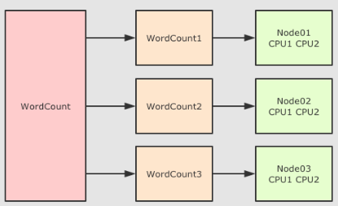

   - 简单来讲, 并行计算就是同时使用多个计算资源解决一个问题, 有如下四个要点
     - 要解决的问题必须可以分解为多个可以并发计算的部分
     - 每个部分要可以在不同处理器上被同时执行
     - **需要一个共享内存的机制**
     - 需要一个总体上的协作机制来进行调度

3. 如果放在集群中的话, 可能要对整个计算任务进行分解, 如何分解?

   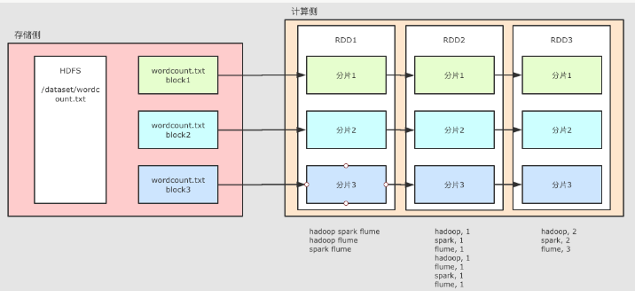

   - 概述
     - 对于 HDFS 中的文件, 是分为不同的 Block 的
     - 在进行计算的时候, 就可以按照 Block 来划分, 每一个 Block 对应一个不同的计算单元
   - 扩展
     - `RDD` 并没有真实的存放数据, 数据是从 HDFS 中读取的, 在计算的过程中读取即可
     - `RDD` 至少是需要可以 **分片** 的, 因为HDFS中的文件就是分片的, `RDD` 分片的意义在于表示对源数据集每个分片的计算, `RDD`可以分片也意味着 **可以并行计算**

4. 移动数据不如移动计算是一个基础的优化, 如何做到???

   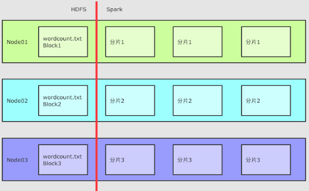

   每一个计算单元需要记录其存储单元的位置, 尽量调度过去

5. 在集群中运行, 需要很多节点之间配合, 出错的概率也更高, 出错了怎么办???

   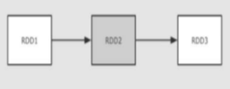

   - RDD1 → RDD2 → RDD3 这个过程中, RDD2 出错了, 有两种办法可以解决
     1. 缓存 RDD2 的数据, 直接恢复 RDD2, 类似 HDFS 的备份机制
     2. 记录 RDD2 的依赖关系, 通过其父级的 RDD 来恢复 RDD2, 这种方式会少很多数据的交互和保存
   - 如何通过父级 RDD 来恢复?
     1. 记录 RDD2 的父亲是 RDD1
     2. 记录 RDD2 的计算函数, 例如记录 `RDD2 = RDD1.map(…)`, `map(…)` 就是计算函数
     3. 当 RDD2 计算出错的时候, 可以通过父级 RDD 和计算函数来恢复 RDD2

6. 假如任务特别复杂, 流程特别长, 有很多 RDD 之间有依赖关系, 如何优化???

   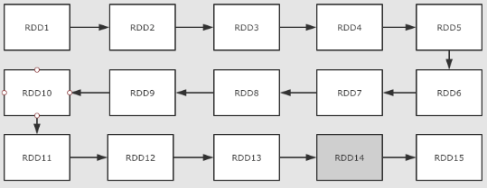

   上面提到了可以使用依赖关系来进行容错, 但是如果依赖关系特别长的时候, 这种方式其实也比较低效, 这个时候就应该使用另外一种方式, 也就是记录数据集的状态

   - 在 Spark 中有两个手段可以做到
     - 缓存
     - Checkpoint

### 1.2. 再谈 RDD

目标

1. 理解 RDD 为什么会出现
2. 理解 RDD 的主要特点
3. 理解 RDD 的五大属性

#### 1.2.1. RDD 为什么会出现?

- 在 RDD 出现之前, 当时 MapReduce 是比较主流的, 而 MapReduce 如何执行迭代计算的任务呢?

  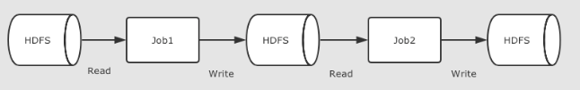

  多个 MapReduce 任务之间没有基于内存的数据共享方式, 只能通过磁盘来进行共享这种方式明显比较低效

- RDD 如何解决迭代计算非常低效的问题呢?

  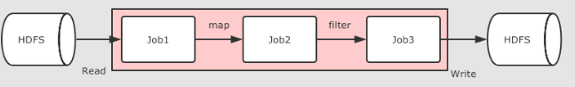

  在 Spark 中, 其实最终 Job3 从逻辑上的计算过程是: `Job3 = (Job1.map).filter`, 整个过程是共享内存的, 而不需要将中间结果存放在可靠的分布式文件系统中

  这种方式可以在保证容错的前提下, 提供更多的灵活, 更快的执行速度, RDD 在执行迭代型任务时候的表现可以通过下面代码体现

  ````scala
  // 线性回归
  val points = sc.textFile(...)
  	.map(...)
  	.persist(...)
  val w = randomValue
  for (i <- 1 to 10000) {
      val gradient = points.map(p => p.x * (1 / (1 + exp(-p.y * (w dot p.x))) - 1) * p.y)
      	.reduce(_ + _)
      w -= gradient
  }
  ````

  在这个例子中, 进行了大致 10000 次迭代, 如果在 MapReduce 中实现, 可能需要运行很多 Job, 每个 Job 之间都要通过 HDFS 共享结果, 熟快熟慢一窥便知

#### 1.2.2. RDD 的特点

- RDD 不仅是数据集, 也是编程模型

  RDD 即是一种数据结构, 同时也提供了上层 API, 同时 RDD 的 API 和 Scala 中对集合运算的 API 非常类似, 同样也都是各种算子

  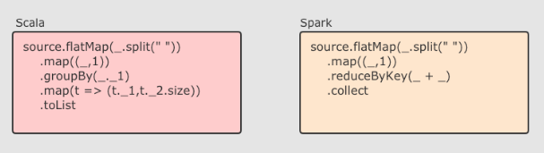

  RDD 的算子大致分为两类:

  - Transformation 转换操作, 例如 `map` `flatMap` `filter` 等
  - Action 动作操作, 例如 `reduce` `collect` `show` 等

  执行 RDD 的时候, 在执行到转换操作的时候, 并不会立刻执行, 直到遇见了 Action 操作, 才会触发真正的执行, 这个特点叫做 **惰性求值**

- RDD 可以分区

  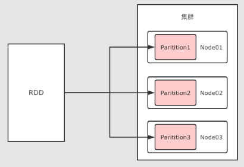

  !RDD 是一个分布式计算框架, 所以, 一定是要能够进行分区计算的, 只有分区了, 才能利用集群的并行计算能力

  同时, RDD 不需要始终被具体化, 也就是说: RDD 中可以没有数据, 只要有足够的信息知道自己是从谁计算得来的就可以, 这是一种非常高效的容错方式

- **RDD 是只读的**

  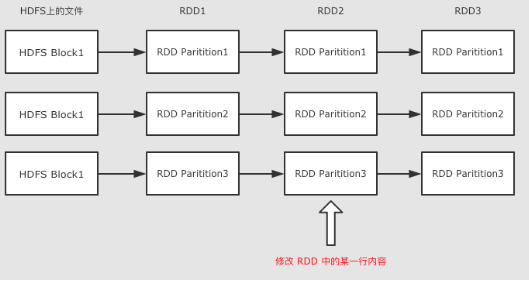

  RDD 是只读的, 不允许任何形式的修改. 虽说不能因为 RDD 和 HDFS 是只读的, 就认为分布式存储系统必须设计为只读的. 但是设计为只读的, 会显著降低问题的复杂度, 因为 RDD 需要可以容错, 可以惰性求值, 可以移动计算, 所以很难支持修改.

  - RDD2 中可能没有数据, 只是保留了依赖关系和计算函数, 那修改啥?
  - 如果因为支持修改, 而必须保存数据的话, 怎么容错?
  - 如果允许修改, 如何定位要修改的那一行? RDD 的转换是粗粒度的, 也就是说, RDD 并不感知具体每一行在哪.

- RDD 是可以容错的

  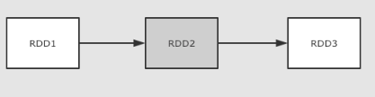

  RDD 的容错有两种方式保存 

  1. RDD 之间的依赖关系, 以及计算函数, 出现错误重新计算
  2. 直接将 RDD 的数据存放在外部存储系统, 出现错误直接读取, Checkpoint

#### 1.2.3. 什么叫做弹性分布式数据集

- 分布式

  RDD 支持分区, 可以运行在集群中

- 弹性

  - RDD 支持高效的容错
  - RDD 中的数据即可以缓存在内存中, 也可以缓存在磁盘中, 也可以缓存在外部存储中

- 数据集

  - RDD 可以不保存具体数据, 只保留创建自己的必备信息, 例如依赖和计算函数
  - RDD 也可以缓存起来, 相当于存储具体数据

总结: RDD 的五大属性

1. 有一种分区列表
2. 作用在每个分区上的计算函数
3. rdd与rdd直接存在依赖关系
4. 可选项,针对k-v型的数据,分区函数
5. 可选项,数据本地

首先整理一下上面所提到的 RDD 所要实现的功能:

1. RDD 有分区
2. RDD 要可以通过依赖关系和计算函数进行容错
3. RDD 要针对数据本地性进行优化
4. RDD 支持 MapReduce 形式的计算, 所以要能够对数据进行 Shuffled

对于 RDD 来说, 其中应该有什么内容呢? 如果站在 RDD 设计者的角度上, 这个类中, 至少需要什么属性?

- `Partition List` 分片列表, 记录 RDD 的分片, 可以在创建 RDD 的时候指定分区数目, 也可以通过算子来生成新的 RDD 从而改变分区数目
- `Compute Function` 为了实现容错, 需要记录 RDD 之间转换所执行的计算函数
- `RDD Dependencies` RDD 之间的依赖关系, 要在 RDD 中记录其上级 RDD 是谁, 从而实现容错和计算
- `Partitioner` 为了执行 Shuffled 操作, 必须要有一个函数用来计算数据应该发往哪个分区(存在key-value的数据中)
- `Preferred Location` 优先位置, 为了实现数据本地性操作, 从而移动计算而不是移动存储, 需要记录每个 RDD 分区最好应该放置在什么位置

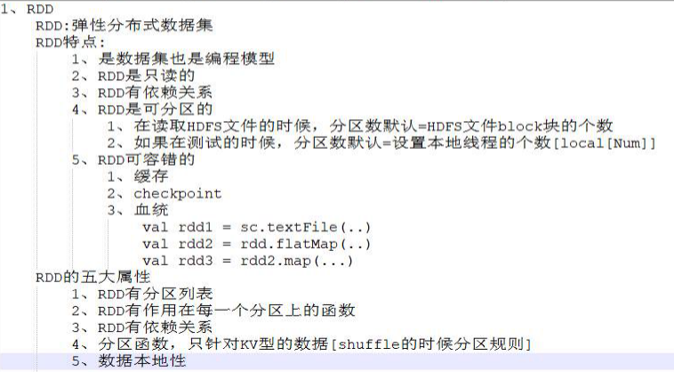

## 2. RDD 的算子

目标

1. 理解 RDD 的算子分类, 以及其特性
2. 理解常见算子的使用

- 分类

  RDD 中的算子从功能上分为两大类

  1. Transformation(转换) 它会在一个已经存在的 RDD 上创建一个新的 RDD, 将旧的 RDD 的数据转换为另外一种形式后放入新的 RDD
  2. Action(动作) 执行各个分区的计算任务, 将的到的结果返回到 Driver 中

  RDD 中可以存放各种类型的数据, 那么对于不同类型的数据, RDD 又可以分为三类

  - 针对基础类型(例如 String)处理的普通算子
  - 针对 `Key-Value` 数据处理的 `byKey` 算子
  - 针对数字类型数据处理的计算算子

- 特点

  - Spark 中所有的 Transformations 是 Lazy(惰性) 的, 它们不会立即执行获得结果. 相反, 它们只会记录在数据集上要应用的操作. 只有当需要返回结果给 Driver 时, 才会执行这些操作, 通过 DAGScheduler 和 TaskScheduler 分发到集群中运行, 这个特性叫做 **惰性求值**
  - 默认情况下, 每一个 Action 运行的时候, 其所关联的所有 Transformation RDD 都会重新计算, 但是也可以使用 `presist` 方法将 RDD 持久化到磁盘或者内存中. 这个时候为了下次可以更快的访问, 会把数据保存到集群上.

### 2.1. Transformations 算子

| Transformation function                   | 解释                                                         |
| :---------------------------------------- | ------------------------------------------------------------ |
| `map(T ⇒ U)`                              | `sc.parallelize(Seq(1, 2, 3)).map( num => num * 10 )   .collect()`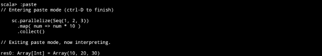作用                                                                                                                      1. 把 RDD 中的数据 一对一 的转为另一种形式                                 签名                                                                                                                   `def map[U: ClassTag](f: T ⇒ U): RDD[U]`                                  参数                                                                                                            `f` → Map 算子是 `原RDD → 新RDD` 的过程, 传入函数的参数是原 RDD 数据, 返回值是经过函数转换的新 RDD 的数据                                      注意点                                                                                                                 Map 是一对一, 如果函数是 `String → Array[String]` 则新的 RDD 中每条数据就是一个数组 |
| `flatMap(T ⇒ List[U])`                    | `sc.parallelize(Seq("Hello lily", "Hello lucy", "Hello tim")).flatMap( line => line.split(" ") )   .collect()`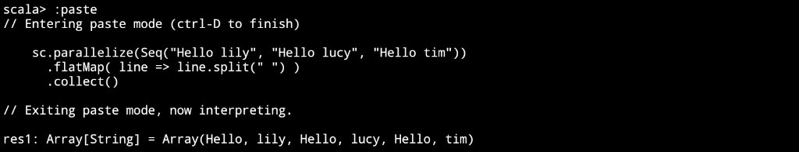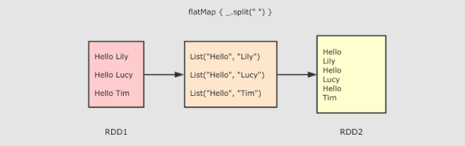作用:FlatMap 算子和 Map 算子类似, 但是 FlatMap 是一对多,                      调用:`def flatMap[U: ClassTag](f: T ⇒ List[U]): RDD[U]`,参数:`f` → 参数是原 RDD 数据, 返回值是经过函数转换的新 RDD 的数据, 需要注意的是返回值是一个集合, 集合中的数据会被展平后再放入新的 RDD                                                                                                         注意点:flatMap 其实是两个操作, 是 `map + flatten`, 也就是先转换, 后把转换而来的 List 展开,Spark 中并没有直接展平 RDD 中数组的算子, 可以使用 `flatMap` 做这件事 |
| `filter(T ⇒ Boolean)`                     | `sc.parallelize(Seq(1, 2, 3))   .filter( value => value >= 3 ).collect()`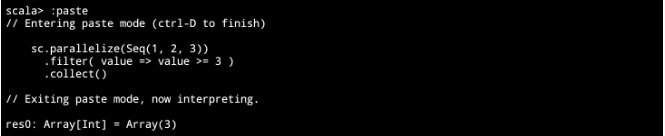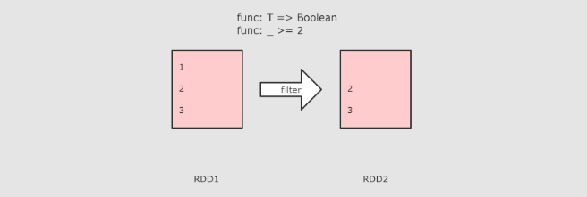作用:`Filter` 算子的主要作用是过滤掉不需要的内容,函数返回值为true的数据保留 |
| `mapPartitions(List[T] ⇒ List[U])`        | **RDD[T] ⇒ RDD[U]** 和 map 类似,map的粒子针对的每一条数据, 但是mapPartitions的粒子针对整个分区的数据转换 |
| `mapPartitionsWithIndex`                  | 和 mapPartitions 类似, 只是在函数中增加了分区的 Index        |
| `mapValues`                               | `sc.parallelize(Seq(("a", 1), ("b", 2), ("c", 3)))   .mapValues( value => value * 10 ).collect()`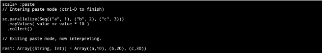作用:MapValues 只能作用于 Key-Value 型数据, 和 Map 类似, 也是使用函数按照转换数据, 不同点是 MapValues 只转换 Key-Value 中的 Value |
| `sample(withReplacement, fraction, seed)` | `sc.parallelize(Seq(1, 2, 3, 4, 5, 6, 7, 8, 9, 10))   .sample(withReplacement = true, 0.6, 2).collect()`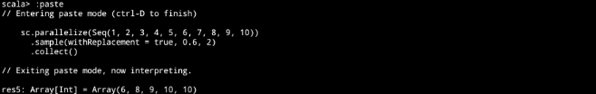作用:Sample 算子可以从一个数据集中抽样出来一部分, 常用作于减小数据集以保证运行速度, 并且尽可能少规律的损失                   参数:Sample 接受第一个参数为`withReplacement`, 意为是否取样以后是否还放回原数据集供下次使用, 简单的说, 如果这个参数的值为 true, 则抽样出来的数据集中可能会有重复,Sample 接受第二个参数为`fraction`, 意为抽样的比例Sample 接受第三个参数为`seed`, 随机数种子, 用于 Sample 内部随机生成下标, 一般不指定, 使用默认值 |
| `union(other)`                            | `val rdd1 = sc.parallelize(Seq(1, 2, 3)) val rdd2 = sc.parallelize(Seq(4, 5, 6)) rdd1.union(rdd2)   .collect()`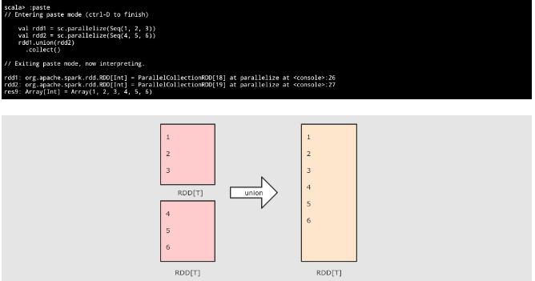 |
| `intersection(other)`                     | `val rdd1 = sc.parallelize(Seq(1, 2, 3, 4, 5)) val rdd2 = sc.parallelize(Seq(4, 5, 6, 7, 8)) rdd1.intersection(rdd2)   .collect()`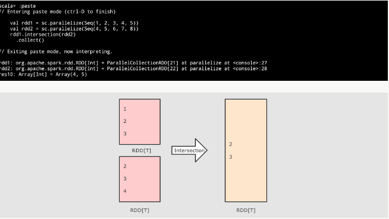作用:Intersection 算子是一个集合操作, 用于求得 左侧集合 和 右侧集合 的交集, 换句话说, 就是左侧集合和右侧集合都有的元素, 并生成一个新的 RDD |
| `subtract(other, numPartitions)`          | **(RDD[T], RDD[T]) ⇒ RDD[T]** 差集, 可以设置分区数           |
| `distinct(numPartitions)`                 | `sc.parallelize(Seq(1, 1, 2, 2, 3)).distinct()   .collect()`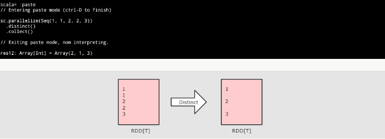作用:Distinct 算子用于去重,注意点:Distinct 是一个需要 Shuffled 的操作本质上 Distinct 就是一个 reductByKey, 把重复的合并为一个 |
| `reduceByKey((V, V) ⇒ V, numPartition)`   | `sc.parallelize(Seq(("a", 1), ("a", 1), ("b", 1)))   .reduceByKey( (curr, agg) => curr + agg )   .collect()`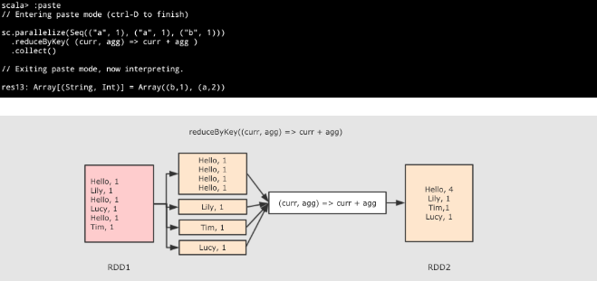作用:首先按照 Key 分组生成一个 Tuple, 然后针对每个组执行 `reduce` 算子,                                                                                      调用:`def reduceByKey(func: (V, V) ⇒ V): RDD[(K, V)]`    ,                                                                                                          参数:func → 执行数据处理的函数, 传入两个参数, 一个是当前值, 一个是局部汇总, 这个函数需要有一个输出, 输出就是这个 Key 的汇总结果  ,                                                                                                       注意点:ReduceByKey 只能作用于 Key-Value 型数据, Key-Value 型数据在当前语境中特指 Tuple2  ,ReduceByKey 是一个需要 Shuffled 的操作  ,和其它的 Shuffled 相比, ReduceByKey是高效的, 因为类似 MapReduce 的, 在 Map 端有一个 Cominer, 这样 I/O 的数据便会减少 |
| `groupByKey()`                            | `sc.parallelize(Seq(("a", 1), ("a", 1), ("b", 1)))   .groupByKey()   .collect()`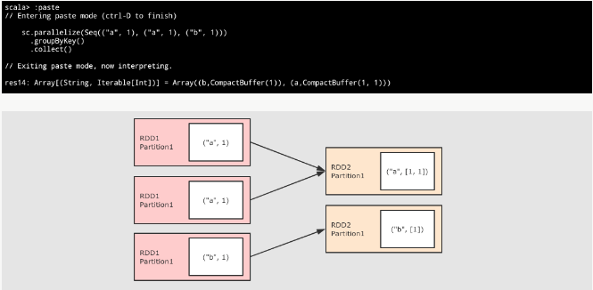作用:GroupByKey 算子的主要作用是按照 Key 分组, 和 ReduceByKey 有点类似, 但是 GroupByKey 并不求聚合, 只是列举 Key 对应的所有 Value  .                                                                      注意点:GroupByKey 是一个 Shuffled  ,GroupByKey 和 ReduceByKey 不同, 因为需要列举 Key 对应的所有数据, 所以无法在 Map 端做 Combine, 所以 GroupByKey 的性能并没有 ReduceByKey 好 |
| `combineByKey()`                          | `val rdd = sc.parallelize(Seq(   ("zhangsan", 99.0),   ("zhangsan", 96.0),   ("lisi", 97.0),   ("lisi", 98.0),   ("zhangsan", 97.0)) )  val combineRdd = rdd.combineByKey(   score => (score, 1),   (scoreCount: (Double, Int),newScore) => (scoreCount._1 + newScore, scoreCount._2 + 1),   (scoreCount1: (Double, Int), scoreCount2: (Double, Int)) =>     (scoreCount1._1 + scoreCount2._1, scoreCount1._2 + scoreCount2._2) )  val meanRdd = combineRdd.map(score => (score._1, score._2._1 / score._2._2))  meanRdd.collect()`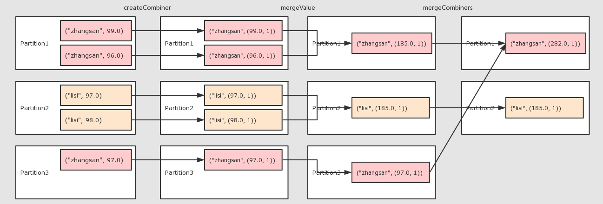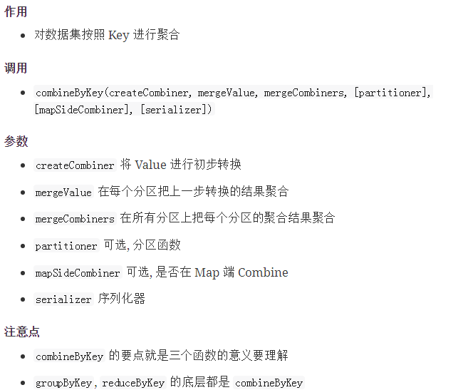 |
| `aggregateByKey()`                        | 需求:求打0.8折之后的总价格                                                               val rdd = sc.parallelize(Seq(("手机", 10.0), ("手机", 15.0), ("电脑", 20.0)))                                                                                                                val result = rdd.aggregateByKey(0.8)(   seqOp = (zero, price) => price * zero,   combOp = (curr, agg) => curr + agg ).collect() println(result)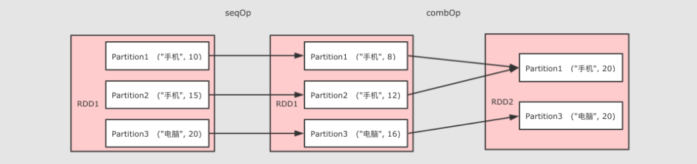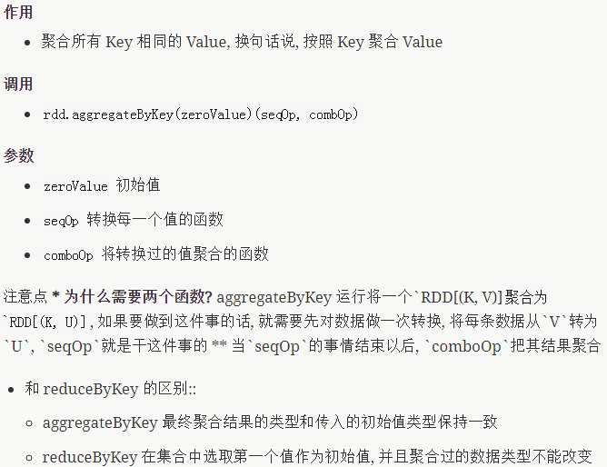 |
| `foldByKey(zeroValue)((V, V) ⇒ V)`        | `sc.parallelize(Seq(("a", 1), ("a", 1), ("b", 1)))   .foldByKey(zeroValue = 10)( (curr, agg) => curr + agg )   .collect()`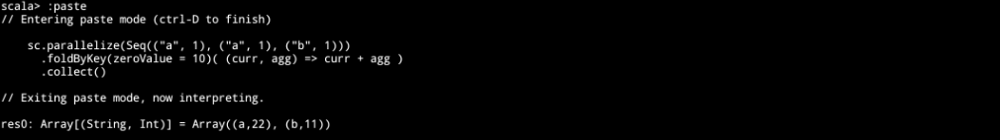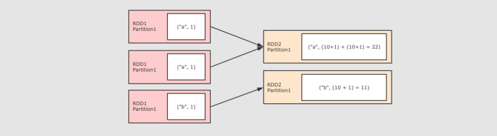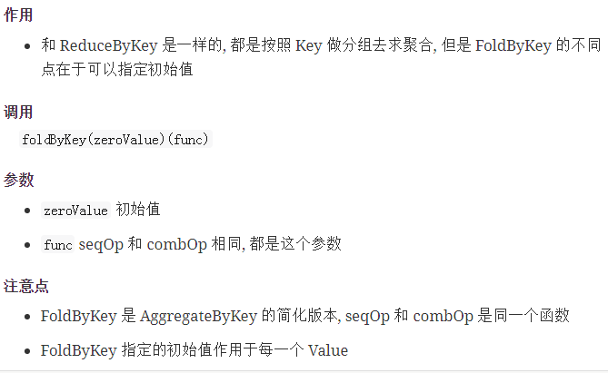 |
| `join(other, numPartitions)`              | `val rdd1 = sc.parallelize(Seq(("a", 1), ("a", 2), ("b", 1))) val rdd2 = sc.parallelize(Seq(("a", 10), ("a", 11), ("a", 12)))  rdd1.join(rdd2).collect()`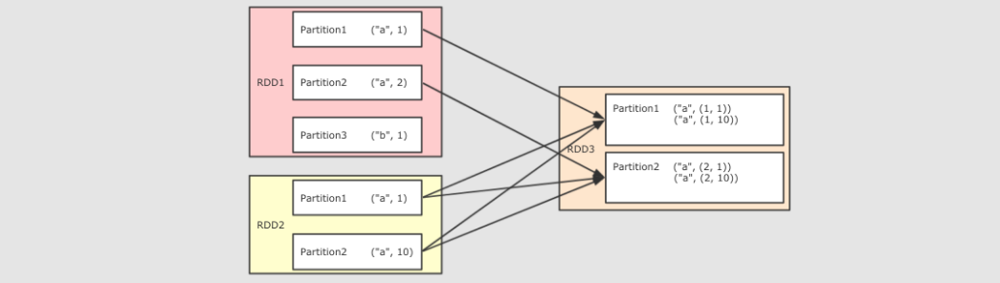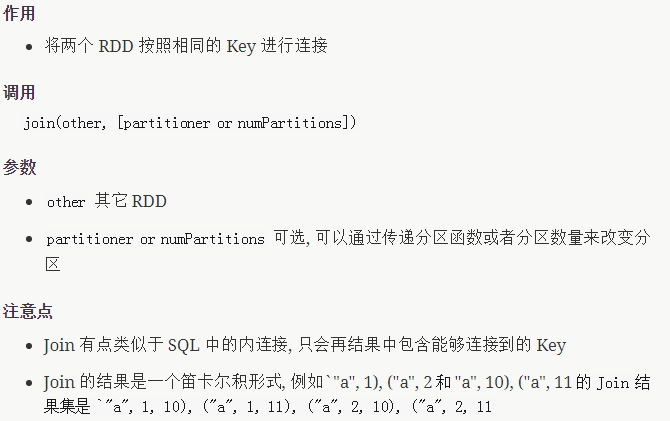 |
| `cogroup(other, numPartitions)`           | `val rdd1 = sc.parallelize(Seq(("a", 1), ("a", 2), ("a", 5), ("b", 2), ("b", 6), ("c", 3), ("d", 2))) val rdd2 = sc.parallelize(Seq(("a", 10), ("b", 1), ("d", 3))) val rdd3 = sc.parallelize(Seq(("b", 10), ("a", 1)))  val result1 = rdd1.cogroup(rdd2).collect() val result2 = rdd1.cogroup(rdd2, rdd3).collect()  /* 执行结果: Array(   (d,(CompactBuffer(2),CompactBuffer(3))),   (a,(CompactBuffer(1, 2, 5),CompactBuffer(10))),   (b,(CompactBuffer(2, 6),CompactBuffer(1))),   (c,(CompactBuffer(3),CompactBuffer())) )  */ println(result1)  /* 执行结果: Array(   (d,(CompactBuffer(2),CompactBuffer(3),CompactBuffer())),   (a,(CompactBuffer(1, 2, 5),CompactBuffer(10),CompactBuffer(1))),   (b,(CompactBuffer(2, 6),CompactBuffer(1),Co...  */ println(result2)`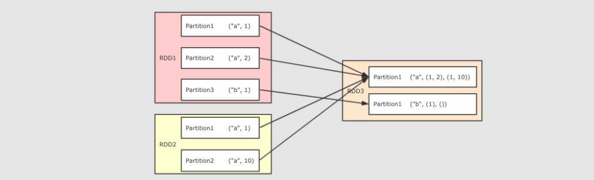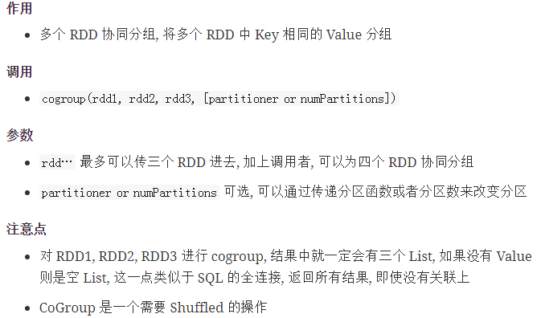 |
| `cartesian(other)`                        | **(RDD[T], RDD[U]) ⇒ RDD[(T, U)]** 生成两个 RDD 的笛卡尔积   |
| `sortBy(ascending, numPartitions)`        | `val rdd1 = sc.parallelize(Seq(("a", 3), ("b", 2), ("c", 1))) val sortByResult = rdd1.sortBy( item => item._2 ).collect() val sortByKeyResult = rdd1.sortByKey().collect()  println(sortByResult) println(sortByKeyResult)` |
| `partitionBy(partitioner)`                | 使用用传入的 partitioner 重新分区, 如果和当前分区函数相同, 则忽略操作 |
| `coalesce(numPartitions)`                 | 减少分区数`val rdd = sc.parallelize(Seq(("a", 3), ("b", 2), ("c", 1))) val oldNum = rdd.partitions.length  val coalesceRdd = rdd.coalesce(4, shuffle = true) val coalesceNum = coalesceRdd.partitions.length  val repartitionRdd = rdd.repartition(4) val repartitionNum = repartitionRdd.partitions.length  print(oldNum, coalesceNum, repartitionNum)`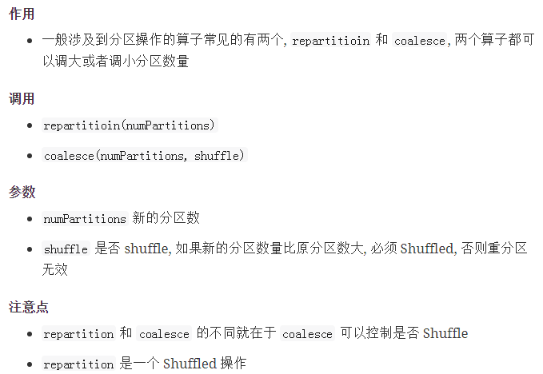 |
| `repartition(numPartitions)`              | 重新分区,默认sheffle=true,所有即可以增大分区数,也可以减小分区数 |
| `repartitionAndSortWithinPartitions`      | 重新分区的同时升序排序, 在partitioner中排序, 比先重分区再排序要效率高, 建议使用在需要分区后再排序的场景使用 |

### 2.2. Action 算子

| Action function                      | 解释                                                         |
| :----------------------------------- | :----------------------------------------------------------- |
| `reduce( (T, T) ⇒ U )`               | `val rdd = sc.parallelize(Seq(("手机", 10.0), ("手机", 15.0), ("电脑", 20.0))) val result = rdd.reduce((curr, agg) => ("总价", curr._2 + agg._2)) println(result)`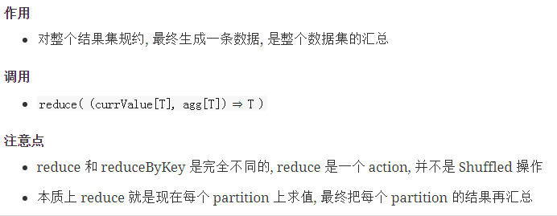 |
| `collect()`                          | 以数组的形式返回数据集中所有元素,是异步收集的过程            |
| `count()`                            | 返回元素个数                                                 |
| `first()`                            | 返回第一个元素,第一个分区,第一个元素                         |
| `take( N )`                          | 返回前 N 个元素                                              |
| `takeSample(withReplacement, fract)` | 类似于 sample采样获取, 区别在这是一个Action, 直接返回结果    |
| `fold(zeroValue)( (T, T) ⇒ U )`      | 指定初始值和计算函数, 折叠聚合整个数据集                     |
| `saveAsTextFile(path)`               | 将结果存入 path 对应的文件中                                 |
| `saveAsSequenceFile(path)`           | 将结果存入 path 对应的 Sequence 文件中                       |
| `countByKey()`                       | `val rdd = sc.parallelize(Seq(("手机", 10.0), ("手机", 15.0), ("电脑", 20.0))) val result = rdd.countByKey() println(result)`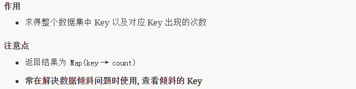 |
| `foreach( T ⇒ … )`                   | 遍历每一个元素,并行打印                                      |

- 应用

  ```scala
  val rdd = sc.parallelize(Seq(("手机", 10.0), ("手机", 15.0), ("电脑", 20.0)))
  // 结果: Array((手机,10.0), (手机,15.0), (电脑,20.0))
  println(rdd.collect())
  // 结果: Array((手机,10.0), (手机,15.0))
  println(rdd.take(2))
  // 结果: (手机,10.0)
  println(rdd.first())
  ```

总结

- RDD 的算子大部分都会生成一些专用的 RDD

  - `map`, `flatMap`, `filter` 等算子会生成 `MapPartitionsRDD``coalesce`, `repartition` 等算子会生成 
  - `CoalescedRDD`

- 常见的 RDD 有两种类型

  - 转换型的 RDD, Transformation
  - 动作型的 RDD, Action

- 常见的 Transformation 类型的 RDD

  - map
  - flatMap
  - filter
  - groupBy
  - reduceByKey

- 常见的 Action 类型的 RDD

  - collect
  - countByKey
  - reduce

### 2.3. RDD 对不同类型数据的支持

目标

1. 理解 RDD 对 Key-Value 类型的数据是有专门支持的
2. 理解 RDD 对数字类型也有专门的支持

- 一般情况下 RDD 要处理的数据有三类

  - 字符串
  - 键值对
  - 数字型

- RDD 的算子设计对这三类不同的数据分别都有支持

  - 对于以字符串为代表的基本数据类型是比较基础的一些的操作, 诸如 map, flatMap, filter 等基础的算子
  - 对于键值对类型的数据, 有额外的支持, 诸如 reduceByKey, groupByKey 等 byKey 的算子
  - 同样对于数字型的数据也有额外的支持, 诸如 max, min 等

- RDD 对键值对数据的额外支持

  键值型数据本质上就是一个二元元组, 键值对类型的 RDD 表示为 `RDD[(K, V)]`

  RDD 对键值对的额外支持是通过隐式支持来完成的, 一个 `RDD[(K, V)]`, 可以被隐式转换为一个 `PairRDDFunctions` 对象, 从而调用其中的方法.

  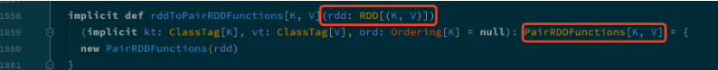

  - 既然对键值对的支持是通过 `PairRDDFunctions` 提供的, 那么从 `PairRDDFunctions` 中就可以看到这些支持有什么

  | 类别     | 算子             |
  | :------- | :--------------- |
  | 聚合操作 | `reduceByKey`    |
  |          | `foldByKey`      |
  |          | `combineByKey`   |
  | 分组操作 | `cogroup`        |
  |          | `groupByKey`     |
  | 连接操作 | `join`           |
  |          | `leftOuterJoin`  |
  |          | `rightOuterJoin` |
  | 排序操作 | `sortBy`         |
  |          | `sortByKey`      |
  | Action   | `countByKey`     |
  |          | `take`           |
  |          | `collect`        |

- RDD 对数字型数据的额外支持

  对于数字型数据的额外支持基本上都是 Action 操作, 而不是转换操作
  
  | 算子             | 含义             |
  | :--------------- | :--------------- |
  | `count`          | 个数             |
  | `mean`           | 均值             |
  | `sum`            | 求和             |
  | `max`            | 最大值           |
  | `min`            | 最小值           |
  | `variance`       | 方差             |
  | `sampleVariance` | 从采样中计算方差 |
  | `stdev`          | 标准差           |
  | `sampleStdev`    | 采样的标准差     |
  
  ```scala
  val rdd = sc.parallelize(Seq(1, 2, 3))
  // 结果: 3
  println(rdd.max())
  ```


## 3. RDD 的 Shuffle 和分区

目标

1. RDD 的分区操作
2. Shuffle 的原理

- 分区的作用

  1. RDD经常需要通过读取外部数据来创建,外部存储系统往往支持分片的,RDD需要支持分区,来和外部系统的分片一一对应
  2. RDD的分区是一个并进行计算的实现手段

  RDD 使用分区来分布式并行处理数据, 并且要做到尽量少的在不同的 Executor 之间使用网络交换数据, 所以当使用 RDD 读取数据的时候, 会尽量的在物理上靠近数据源, 比如说在读取 Cassandra 或者 HDFS 中数据的时候, 会尽量的保持 RDD 的分区和数据源的分区数, 分区模式等一一对应

- 分区和 Shuffle 的关系

  分区的主要作用是用来实现并行计算, 本质上和 Shuffle 没什么关系, 但是往往在进行数据处理的时候, 例如`reduceByKey`, `groupByKey`等聚合操作, 需要把 Key 相同的 Value 拉取到一起进行计算, 这个时候因为这些 Key 相同的 Value 可能会坐落于不同的分区, 于是理解分区才能理解 Shuffle 的根本原理

- Spark 中的 Shuffle 操作的特点

  - 只有 `Key-Value` 型的 RDD 才会有 Shuffle 操作, 例如 `RDD[(K, V)]`, 但是有一个特例, 就是 `repartition` 算子可以对任何数据类型 Shuffle
  - 早期版本 Spark 的 Shuffle 算法是 `Hash base shuffle`, 后来改为 `Sort base shuffle`, 更适合大吞吐量的场景

### 3.1. RDD 的分区操作

- 查看分区

  ```scala
  scala> sc.parallelize(1 to 100).count
  res0: Long = 100
  ```
  
  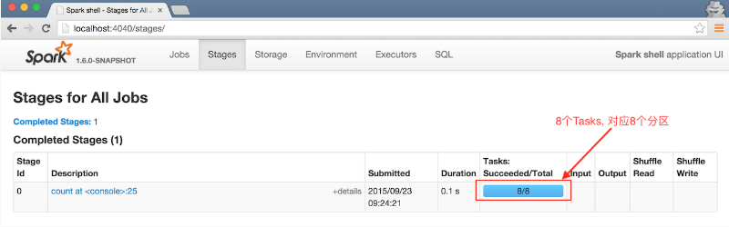
  
  之所以会有 8 个 Tasks, 是因为在启动的时候指定的命令是 `spark-shell --master local[8]`, 这样会生成 1 个 Executors, 这个 Executors 有 8 个 Cores, 所以默认会有 8 个 Tasks, 每个 Cores 对应一个分区, 每个分区对应一个 Tasks, 可以通过 `rdd.partitions.size` 来查看分区数量同时也可以通过 spark-shell 的 WebUI 来查看 Executors 的情况
  
  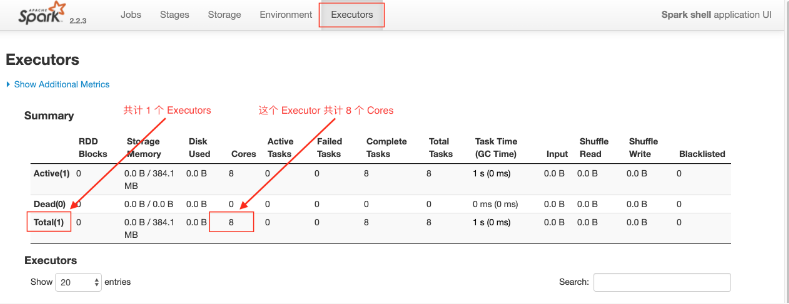

默认的分区数量是和 Cores 的数量有关的, 也可以通过如下三种方式修改或者重新指定分区数量

- 创建 RDD 时指定分区数

  ````scala
  scala> val rdd1 = sc.parallelize(1 to 100, 6)
  rdd1: org.apache.spark.rdd.RDD[Int] = ParallelCollectionRDD[1] at parallelize at <console>:24
  
  scala> rdd1.partitions.size
  res1: Int = 6
  
  scala> val rdd2 = sc.textFile("hdfs:///dataset/wordcount.txt", 6)
  rdd2: org.apache.spark.rdd.RDD[String] = hdfs:///dataset/wordcount.txt MapPartitionsRDD[3] at textFile at <console>:24
  
  scala> rdd2.partitions.size
  res2: Int = 7
  ````

  rdd1 是通过本地集合创建的, 创建的时候通过第二个参数指定了分区数量. rdd2 是通过读取 HDFS 中文件创建的, 同样通过第二个参数指定了分区数, 因为是从 HDFS 中读取文件, 所以最终的分区数是由 Hadoop 的 InputFormat 来指定的, 所以比指定的分区数大了一个.

- 通过`coalesce` 算子指定

  ```scala
  coalesce(numPartitions: Int, shuffle: Boolean = false)(implicit ord: Ordering[T] = null): RDD[T]
  ```

  - numPartitions

    新生成的 RDD 的分区数

  - shuffle

    是否 Shuffle,默认是false

  ```scala
  scala> val source = sc.parallelize(1 to 100, 6)
  source: org.apache.spark.rdd.RDD[Int] = ParallelCollectionRDD[0] at parallelize at <console>:24
  
  scala> source.partitions.size
  res0: Int = 6
  
  scala> val noShuffleRdd = source.coalesce(numPartitions=8, shuffle=false)
  noShuffleRdd: org.apache.spark.rdd.RDD[Int] = CoalescedRDD[1] at coalesce at <console>:26
  
  scala> noShuffleRdd.toDebugString 
  res1: String =
  (6) CoalescedRDD[1] at coalesce at <console>:26 []
   |  ParallelCollectionRDD[0] at parallelize at <console>:24 []
  
   scala> val noShuffleRdd = source.coalesce(numPartitions=8, shuffle=false)
   noShuffleRdd: org.apache.spark.rdd.RDD[Int] = CoalescedRDD[1] at coalesce at <console>:26
  
  scala> shuffleRdd.toDebugString 
  res3: String =
  (8) MapPartitionsRDD[5] at coalesce at <console>:26 []
   |  CoalescedRDD[4] at coalesce at <console>:26 []
   |  ShuffledRDD[3] at coalesce at <console>:26 []
   +-(6) MapPartitionsRDD[2] at coalesce at <console>:26 []
      |  ParallelCollectionRDD[0] at parallelize at <console>:24 []
  
  scala> noShuffleRdd.partitions.size     
  res4: Int = 6
  
  scala> shuffleRdd.partitions.size
  res5: Int = 8
  ```

  1. 如果 `shuffle` 参数指定为 `false`, 运行计划中确实没有 `ShuffledRDD`, 没有 `shuffled` 这个过程
  2. 如果 `shuffle` 参数指定为 `true`, 运行计划中有一个 `ShuffledRDD`, 有一个明确的显式的 `shuffled` 过程
  3. 如果 `shuffle` 参数指定为 `false` 却增加了分区数, 分区数并不会发生改变, 这是因为增加分区是一个宽依赖, 没有 `shuffled` 过程无法做到, 后续会详细解释宽依赖的概念

- 通过 `repartition` 算子指定

  ```
  repartition(numPartitions: Int)(implicit ord: Ordering[T] = null): RDD[T]
  ```
  
  算子本质上就是 `coalesce(numPartitions, shuffle = true)`
  
  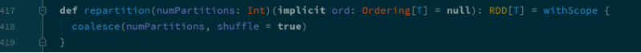
  
   ```scala
  scala> val source = sc.parallelize(1 to 100, 6)
  source: org.apache.spark.rdd.RDD[Int] = ParallelCollectionRDD[7] at parallelize at <console>:24
  
  scala> source.partitions.size
  res7: Int = 6
  
  scala> source.repartition(100).partitions.size 
  res8: Int = 100
  
  scala> source.repartition(1).partitions.size 
   ```
  
  1. 增加分区有效
  2. 减少分区有效
  
  `repartition` 算子无论是增加还是减少分区都是有效的, 因为本质上 `repartition` 会通过 `shuffle` 操作把数据分发给新的 RDD 的不同的分区, 只有 `shuffle` 操作才可能做到增大分区数, 默认情况下, 分区函数是 `RoundRobin`, 如果希望改变分区函数, 也就是数据分布的方式, 可以通过自定义分区函数来实现
  
  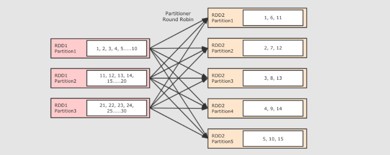

### 3.2. RDD 的 Shuffle 是什么

```scala
val sourceRdd = sc.textFile("hdfs://node01:9020/dataset/wordcount.txt")
val flattenCountRdd = sourceRdd.flatMap(_.split(" ")).map((_, 1))
val aggCountRdd = flattenCountRdd.reduceByKey(_ + _)
val result = aggCountRdd.collect
```

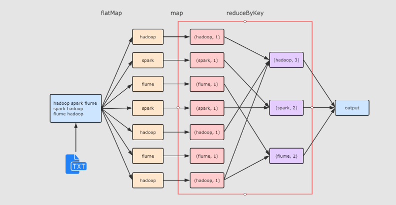

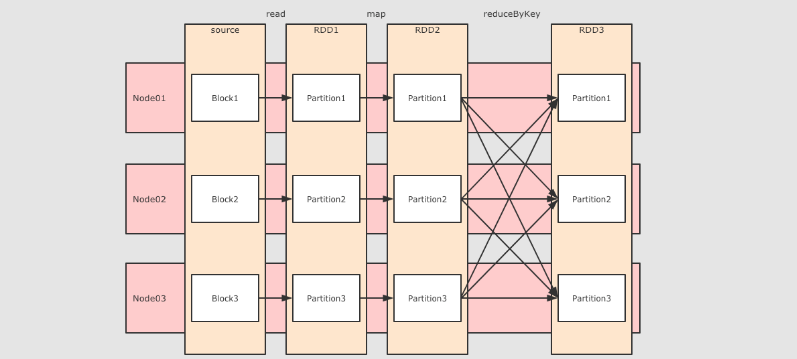

`reduceByKey` 这个算子本质上就是先按照 Key 分组, 后对每一组数据进行 `reduce`, 所面临的挑战就是 Key 相同的所有数据可能分布在不同的 Partition 分区中, 甚至可能在不同的节点中, 但是它们必须被共同计算.

为了让来自相同 Key 的所有数据都在 `reduceByKey` 的同一个 `reduce` 中处理, 需要执行一个 `all-to-all` 的操作, 需要在不同的节点(不同的分区)之间拷贝数据, 必须跨分区聚集相同 Key 的所有数据, 这个过程叫做 `Shuffle`.

### 3.3. RDD 的 Shuffle 原理

Spark 的 Shuffle 发展大致有两个阶段: `Hash base shuffle` 和 `Sort base shuffle`

- Hash base shuffle

  

  大致的原理是分桶, 假设 Reducer 的个数为 R, 那么每个 Mapper 有 R 个桶, 按照 Key 的 Hash 将数据映射到不同的桶中, Reduce 找到每一个 Mapper 中对应自己的桶拉取数据.

  假设 Mapper 的个数为 M, 整个集群的文件数量是 `M * R`, 如果有 1,000 个 Mapper 和 Reducer, 则会生成 1,000,000 个文件, 这个量非常大了.

  过多的文件会导致文件系统打开过多的文件描述符, 占用系统资源. 所以这种方式并不适合大规模数据的处理, 只适合中等规模和小规模的数据处理, 在 Spark 1.2 版本中废弃了这种方式.

- Sort base shuffle

  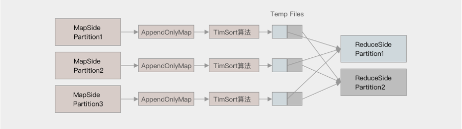
  
  对于 Sort base shuffle 来说, 每个 Map 侧的分区只有一个输出文件, Reduce 侧的 Task 来拉取, 大致流程如下
  
  1. Map 侧将数据全部放入一个叫做 AppendOnlyMap 的组件中, 同时可以在这个特殊的数据结构中做聚合操作
  2. 然后通过一个类似于 MergeSort 的排序算法 TimSort 对 AppendOnlyMap 底层的 Array 排序
     - 先按照 Partition ID 排序, 后按照 Key 的 HashCode 排序
  3. 最终每个 Map Task 生成一个 输出文件, Reduce Task 来拉取自己对应的数据
  
  从上面可以得到结论, Sort base shuffle 确实可以大幅度减少所产生的中间文件, 从而能够更好的应对大吞吐量的场景, 在 Spark 1.2 以后, 已经默认采用这种方式.
  
  但是需要大家知道的是, Spark 的 Shuffle 算法并不只是这一种, 即使是在最新版本, 也有三种 Shuffle 算法, 这三种算法对每个 Map 都只产生一个临时文件, 但是产生文件的方式不同, 一种是类似 Hash 的方式, 一种是刚才所说的 Sort, 一种是对 Sort 的一种优化(使用 Unsafe API 直接申请堆外内存)

## 4. 缓存

概要

1. 缓存的意义
2. 缓存相关的 API
3. 缓存级别以及最佳实践

### 4.1. 缓存的意义

- 使用缓存的原因 - 多次使用 RDD

  需求: 在日志文件中找到访问次数最少的 IP 和访问次数最多的 IP

  ```scala
  val conf = new SparkConf().setMaster("local[6]").setAppName("debug_string")
  val sc = new SparkContext(conf)
  
  val interimRDD = sc.textFile("dataset/access_log_sample.txt")
    .map(item => (item.split(" ")(0), 1))
    .filter(item => StringUtils.isNotBlank(item._1))
    .reduceByKey((curr, agg) => curr + agg) 
  
  val resultLess = interimRDD.sortBy(item => item._2, ascending = true).first()
  val resultMore = interimRDD.sortBy(item => item._2, ascending = false).first()
  
  println(s"出现次数最少的 IP : $resultLess, 出现次数最多的 IP : $resultMore")
  
  sc.stop()
  ```

  1. 这是一个 Shuffle 操作, Shuffle 操作会在集群内进行数据拷贝

     在上述代码中, 多次使用到了 `interimRDD`, 导致文件读取两次, 计算两次, 有没有什么办法增进上述代码的性能?

- 使用缓存的原因 - 容错

  
  
  当在计算 RDD3 的时候如果出错了, 会怎么进行容错?
  
  会再次计算 RDD1 和 RDD2 的整个链条, 假设 RDD1 和 RDD2 是通过比较昂贵的操作得来的, 有没有什么办法减少这种开销?

上述两个问题的解决方案其实都是 `缓存`, 除此之外, 使用缓存的理由还有很多, 但是总结一句, 就是缓存能够帮助开发者在进行一些昂贵操作后, 将其结果保存下来, 以便下次使用无需再次执行, 缓存能够显著的提升性能.

所以, 缓存适合在一个 RDD 需要重复多次利用, 并且还不是特别大的情况下使用, 例如迭代计算等场景.

### 4.2. 缓存相关的 API

- 可以使用 `cache` 方法进行缓

  ```scala
  val conf = new SparkConf().setMaster("local[6]").setAppName("debug_string")
  val sc = new SparkContext(conf)
  
  val interimRDD = sc.textFile("dataset/access_log_sample.txt")
    .map(item => (item.split(" ")(0), 1))
    .filter(item => StringUtils.isNotBlank(item._1))
    .reduceByKey((curr, agg) => curr + agg)
    .cache() 
  
  val resultLess = interimRDD.sortBy(item => item._2, ascending = true).first()
  val resultMore = interimRDD.sortBy(item => item._2, ascending = false).first()
  
  println(s"出现次数最少的 IP : $resultLess, 出现次数最多的 IP : $resultMore")
  
  sc.stop()
  ```

  1. 缓存

     方法签名如下

     ```scala
     cache(): this.type = persist()
     ```

     cache 方法其实是 `persist` 方法的一个别名


- 也可以使用 persist 方法进行缓存

  ```scala
  val conf = new SparkConf().setMaster("local[6]").setAppName("debug_string")
  val sc = new SparkContext(conf)
  
  val interimRDD = sc.textFile("dataset/access_log_sample.txt")
    .map(item => (item.split(" ")(0), 1))
    .filter(item => StringUtils.isNotBlank(item._1))
    .reduceByKey((curr, agg) => curr + agg)
    .persist(StorageLevel.MEMORY_ONLY) 
  
  val resultLess = interimRDD.sortBy(item => item._2, ascending = true).first()
  val resultMore = interimRDD.sortBy(item => item._2, ascending = false).first()
  
  println(s"出现次数最少的 IP : $resultLess, 出现次数最多的 IP : $resultMore")
  
  sc.stop()
  ```

  1.   缓存

     方法签名如下

     ```scala
     persist(): this.type
     persist(newLevel: StorageLevel): this.type
     
     //`persist` 方法其实有两种形式, `persist()` 是 `persist(newLevel: StorageLevel)` 的一个别名, `persist(newLevel: StorageLevel)` 能够指定缓存的级别
     ```

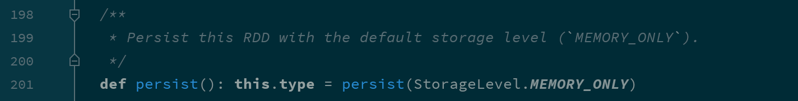

- 缓存其实是一种空间换时间的做法, 会占用额外的存储资源, 如何清理?

  ```scala
  val conf = new SparkConf().setMaster("local[6]").setAppName("debug_string")
  val sc = new SparkContext(conf)
  
  val interimRDD = sc.textFile("dataset/access_log_sample.txt")
    .map(item => (item.split(" ")(0), 1))
    .filter(item => StringUtils.isNotBlank(item._1))
    .reduceByKey((curr, agg) => curr + agg)
    .persist()
  
  interimRDD.unpersist() 
  
  val resultLess = interimRDD.sortBy(item => item._2, ascending = true).first()
  val resultMore = interimRDD.sortBy(item => item._2, ascending = false).first()
  
  println(s"出现次数最少的 IP : $resultLess, 出现次数最多的 IP : $resultMore")
  
  sc.stop()
  ```

  1.   清理缓存

     根据缓存级别的不同, 缓存存储的位置也不同, 但是使用 `unpersist` 可以指定删除 RDD 对应的缓存信息, 并指定缓存级别为 `NONE`

### 4.3. 缓存级别

其实如何缓存是一个技术活, 有很多细节需要思考, 如下

- 是否使用磁盘缓存?
- 是否使用内存缓存?
- 是否使用堆外内存?
- 缓存前是否先序列化?
- 是否需要有副本?

如果要回答这些信息的话, 可以先查看一下 RDD 的缓存级别对象

```scala
val conf = new SparkConf().setMaster("local[6]").setAppName("debug_string")
val sc = new SparkContext(conf)

val interimRDD = sc.textFile("dataset/access_log_sample.txt")
  .map(item => (item.split(" ")(0), 1))
  .filter(item => StringUtils.isNotBlank(item._1))
  .reduceByKey((curr, agg) => curr + agg)
  .persist()

println(interimRDD.getStorageLevel)

sc.stop()
```

打印出来的对象是 `StorageLevel`, 其中有如下几个构造参数

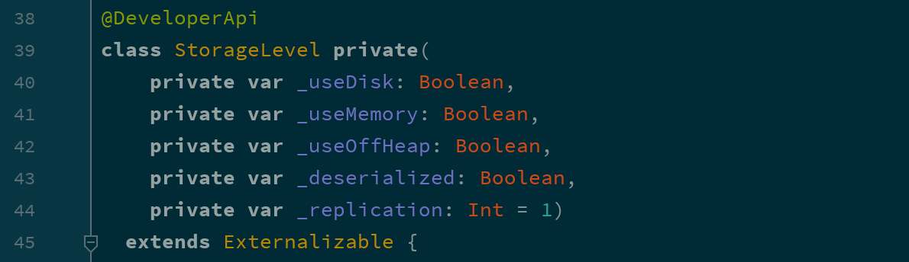

根据这几个参数的不同, `StorageLevel` 有如下几个枚举对象

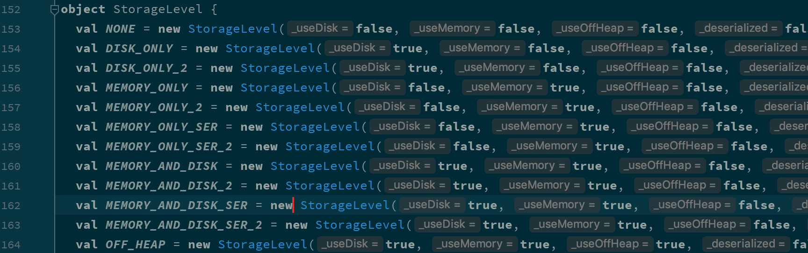

| 缓存级别                | `userDisk` 是否使用磁盘 | `useMemory` 是否使用内存 | `useOffHeap` 是否使用堆外内存 | `deserialized` 是否以反序列化形式存储 | `replication` 副本数 |
| :---------------------- | :---------------------- | :----------------------- | :---------------------------- | :------------------------------------ | :------------------- |
| `NONE`                  | false                   | false                    | false                         | false                                 | 1                    |
| `DISK_ONLY`             | true                    | false                    | false                         | false                                 | 1                    |
| `DISK_ONLY_2`           | true                    | false                    | false                         | false                                 | 2                    |
| `MEMORY_ONLY`           | false                   | true                     | false                         | true                                  | 1                    |
| `MEMORY_ONLY_2`         | false                   | true                     | false                         | true                                  | 2                    |
| `MEMORY_ONLY_SER`       | false                   | true                     | false                         | false                                 | 1                    |
| `MEMORY_ONLY_SER_2`     | false                   | true                     | false                         | false                                 | 2                    |
| `MEMORY_AND_DISK`       | true                    | true                     | false                         | true                                  | 1                    |
| `MEMORY_AND_DISK`       | true                    | true                     | false                         | true                                  | 2                    |
| `MEMORY_AND_DISK_SER`   | true                    | true                     | false                         | false                                 | 1                    |
| `MEMORY_AND_DISK_SER_2` | true                    | true                     | false                         | false                                 | 2                    |
| `OFF_HEAP`              | true                    | true                     | true                          | false                                 | 1                    |

如何选择分区级别

​		Spark 的存储级别的选择，核心问题是在 memory 内存使用率和 CPU 效率之间进行权衡。建议按下面的过程进行存储级别的选择:

​		如果您的 RDD 适合于默认存储级别（MEMORY_ONLY），leave them that way。这是 CPU 效率最高的选项，允许 RDD 上的操作尽可能快地运行.

​		如果不是，试着使用 MEMORY_ONLY_SER 和 selecting a fast serialization library 以使对象更加节省空间，但仍然能够快速访问。(Java和Scala)

​		不要溢出到磁盘，除非计算您的数据集的函数是昂贵的，或者它们过滤大量的数据。否则，重新计算分区可能与从磁盘读取分区一样快.

​		如果需要快速故障恢复，请使用复制的存储级别（例如，如果使用 Spark 来服务 来自网络应用程序的请求）。All 存储级别通过重新计算丢失的数据来提供完整的容错能力，但复制的数据可让您继续在 RDD 上运行任务，而无需等待重新计算一个丢失的分区.

## 5. Checkpoint

目标

1. Checkpoint 的作用
2. Checkpoint 的使用

### 5.1. Checkpoint 的作用

Checkpoint 的主要作用是斩断 RDD 的依赖链, 并且将数据存储在可靠的存储引擎中, 例如支持分布式存储和副本机制的 HDFS.

- Checkpoint 的方式

  - **可靠的** 将数据存储在可靠的存储引擎中, 例如 HDFS
  - **本地的** 将数据存储在本地

- 什么是斩断依赖链

  斩断依赖链是一个非常重要的操作, 接下来以 HDFS 的 NameNode 的原理来举例说明

  HDFS 的 NameNode 中主要职责就是维护两个文件, 一个叫做 `edits`, 另外一个叫做 `fsimage`. `edits` 中主要存放 `EditLog`, `FsImage` 保存了当前系统中所有目录和文件的信息. 这个 `FsImage` 其实就是一个 `Checkpoint`.

  HDFS 的 NameNode 维护这两个文件的主要过程是, 首先, 会由 `fsimage` 文件记录当前系统某个时间点的完整数据, 自此之后的数据并不是时刻写入 `fsimage`, 而是将操作记录存储在 `edits` 文件中. 其次, 在一定的触发条件下, `edits` 会将自身合并进入 `fsimage`. 最后生成新的 `fsimage` 文件, `edits` 重置, 从新记录这次 `fsimage` 以后的操作日志.

  如果不合并 `edits` 进入 `fsimage` 会怎样? 会导致 `edits` 中记录的日志过长, 容易出错.

  所以当 Spark 的一个 Job 执行流程过长的时候, 也需要这样的一个斩断依赖链的过程, 使得接下来的计算轻装上阵.

- Checkpoint 和 Cache 的区别

  Cache 可以把 RDD 计算出来然后放在内存中, 但是 RDD 的依赖链(相当于 NameNode 中的 Edits 日志)是不能丢掉的, 因为这种缓存是不可靠的, 如果出现了一些错误(例如 Executor 宕机), 这个 RDD 的容错就只能通过回溯依赖链, 重放计算出来.

  但是 Checkpoint 把结果保存在 HDFS 这类存储中, 就是可靠的了, 所以可以斩断依赖, 如果出错了, 则通过复制 HDFS 中的文件来实现容错.

  所以他们的区别主要在以下两点

  - Checkpoint 可以保存数据到 HDFS 这类可靠的存储上, Persist 和 Cache 只能保存在本地的磁盘和内存中
  - Checkpoint 可以斩断 RDD 的依赖链, 而 Persist 和 Cache 不行
  - 因为 CheckpointRDD 没有向上的依赖链, 所以程序结束后依然存在, 不会被删除. 而 Cache 和 Persist 会在程序结束后立刻被清除.

### 5.2. 使用 Checkpoint

```scala
val conf = new SparkConf().setMaster("local[6]").setAppName("debug_string")
val sc = new SparkContext(conf)
sc.setCheckpointDir("checkpoint") 

val interimRDD = sc.textFile("dataset/access_log_sample.txt")
  .map(item => (item.split(" ")(0), 1))
  .filter(item => StringUtils.isNotBlank(item._1))
  .reduceByKey((curr, agg) => curr + agg)

interimRDD.checkpoint() 

interimRDD.collect().foreach(println(_))

sc.stop()
```

1. 在使用 Checkpoint 之前需要先设置 Checkpoint 的存储路径, 而且如果任务在集群中运行的话, 这个路径必须是 HDFS 上的路径

2. 开启 Checkpoint

   一个小细节

   ```scala
   val interimRDD = sc.textFile("dataset/access_log_sample.txt")
     .map(item => (item.split(" ")(0), 1))
     .filter(item => StringUtils.isNotBlank(item._1))
     .reduceByKey((curr, agg) => curr + agg)
     .cache() 
   
   interimRDD.checkpoint()
   interimRDD.collect().foreach(println(_))
   ```

   1. `checkpoint` 之前先 `cache` 一下, 准没错

   应该在 `checkpoint` 之前先 `cache` 一下, 因为 `checkpoint` 会重新计算整个 RDD 的数据然后再存入 HDFS 等地方.

   所以上述代码中如果 `checkpoint` 之前没有 `cache`, 则整个流程会被计算两次, 一次是 `checkpoint`, 另外一次是 `collect`

end