Spark core Insight

Table of Contents

- 1. 深入 RDD
  
  - [1.1. 案例](#_1_1_案例)
  - [1.2. 再谈 RDD](#_1_2_再谈_rdd)
- 2. RDD 的算子
  
  - [2.1. Transformations 算子](#_2_1_transformations_算子)
  - [2.2. Action 算子](#_2_2_action_算子)
  - [2.3. RDD 对不同类型数据的支持](#_2_3_rdd_对不同类型数据的支持)
  - [2.4. 阶段练习和总结](#_2_4_阶段练习和总结)
- 3. RDD 的 Shuffle 和分区
  
  - [3.1. RDD 的分区操作](#_3_1_rdd_的分区操作)
  - [3.2. RDD 的 Shuffle 是什么](#_3_2_rdd_的_shuffle_是什么)
  - [3.3. RDD 的 Shuffle 原理](#_3_3_rdd_的_shuffle_原理)
- 4. 缓存
  
  - [4.1. 缓存的意义](#_4_1_缓存的意义)
  - [4.2. 缓存相关的 API](#_4_2_缓存相关的_api)
  - [4.3. 缓存级别](#_4_3_缓存级别)
- 5. Checkpoint
  
  - [5.1. Checkpoint 的作用](#_5_1_checkpoint_的作用)
  - [5.2. 使用 Checkpoint](#_5_2_使用_checkpoint)
- 6. Spark 底层逻辑
  
  - [6.1. 逻辑执行图生成](#_6_1_逻辑执行图生成)
  - [6.2. 物理执行图生成](#_6_2_物理执行图生成)
  - [6.3. 调度过程](#_6_3_调度过程)
  - [6.3. Shuffle 过程](#_6_3_shuffle_过程)
- 7. RDD 的分布式共享变量
  
  - [7.1. 累加器](#_7_1_累加器)
  - [7.2. 广播变量](#_7_2_广播变量)

目标

1. 深入理解 RDD 的内在逻辑
2. 能够使用 RDD 的算子
3. 理解 RDD 算子的 Shuffle 和缓存
4. 理解 RDD 整体的使用流程
5. 理解 RDD 的调度原理
6. 理解 Spark 中常见的分布式变量共享方式

## 1. 深入 RDD

目标

1. 深入理解 RDD 的内在逻辑, 以及 RDD 的内部属性(RDD 由什么组成)

### 1.1. 案例

需求

- 给定一个网站的访问记录, 俗称 Access log
- 计算其中出现的独立 IP, 以及其访问的次数

```scala
val config = new SparkConf().setAppName("ip_ana").setMaster("local[6]")
val sc = new SparkContext(config)

val result = sc.textFile("dataset/access_log_sample.txt")
  .map(item => (item.split(" ")(0), 1))
  .filter(item => StringUtils.isNotBlank(item._1))
  .reduceByKey((curr, agg) => curr + agg)
  .sortBy(item => item._2, false)
  .take(10)

result.foreach(item => println(item))
```

针对这个小案例, 我们问出互相关联但是又方向不同的五个问题

1. *假设要针对整个网站的历史数据进行处理, 量有 1T, 如何处理?*

   放在集群中, 利用集群多台计算机来并行处理

2. *如何放在集群中运行?*

   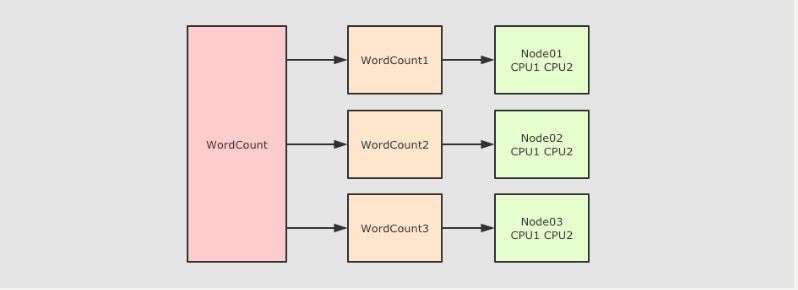

   - 简单来讲, 并行计算就是同时使用多个计算资源解决一个问题, 有如下四个要点

     - 要解决的问题必须可以分解为多个可以并发计算的部分
     - 每个部分要可以在不同处理器上被同时执行
     - **需要一个共享内存的机制**
     - 需要一个总体上的协作机制来进行调度

3. *如果放在集群中的话, 可能要对整个计算任务进行分解, 如何分解?*

   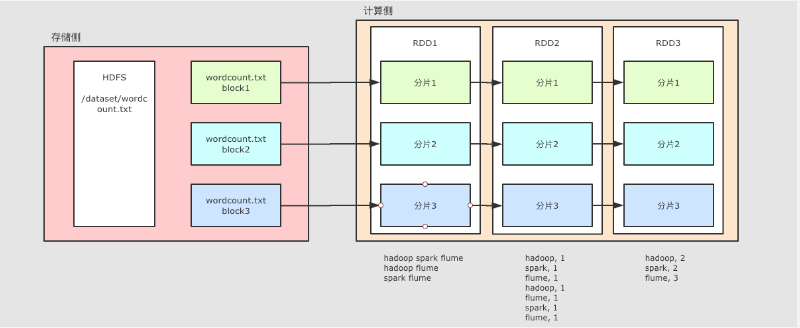

   - 概述

     - 对于 HDFS 中的文件, 是分为不同的 Block 的
     - 在进行计算的时候, 就可以按照 Block 来划分, 每一个 Block 对应一个不同的计算单元

   - 扩展

     - `RDD` 并没有真实的存放数据, 数据是从 HDFS 中读取的, 在计算的过程中读取即可
     - `RDD` 至少是需要可以 **分片** 的, 因为HDFS中的文件就是分片的, `RDD` 分片的意义在于表示对源数据集每个分片的计算, `RDD` 可以分片也意味着 **可以并行计算**

4. *移动数据不如移动计算是一个基础的优化, 如何做到?*

   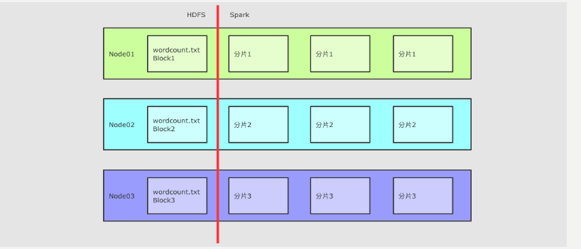

   每一个计算单元需要记录其存储单元的位置, 尽量调度过去

5. *在集群中运行, 需要很多节点之间配合, 出错的概率也更高, 出错了怎么办?*

   

   - RDD1 → RDD2 → RDD3 这个过程中, RDD2 出错了, 有两种办法可以解决

     1. 缓存 RDD2 的数据, 直接恢复 RDD2, 类似 HDFS 的备份机制
     2. 记录 RDD2 的依赖关系, 通过其父级的 RDD 来恢复 RDD2, 这种方式会少很多数据的交互和保存

   - 如何通过父级 RDD 来恢复?

     1. 记录 RDD2 的父亲是 RDD1
     2. 记录 RDD2 的计算函数, 例如记录 `RDD2 = RDD1.map(…)`, `map(…)` 就是计算函数
     3. 当 RDD2 计算出错的时候, 可以通过父级 RDD 和计算函数来恢复 RDD2

6. *假如任务特别复杂, 流程特别长, 有很多 RDD 之间有依赖关系, 如何优化?*

   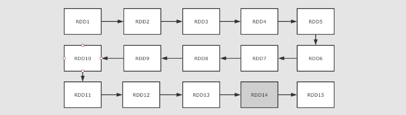

   上面提到了可以使用依赖关系来进行容错, 但是如果依赖关系特别长的时候, 这种方式其实也比较低效, 这个时候就应该使用另外一种方式, 也就是记录数据集的状态

   - 在 Spark 中有两个手段可以做到

     1. 缓存
     2. Checkpoint

### 1.2. 再谈 RDD

目标

1. 理解 RDD 为什么会出现
2. 理解 RDD 的主要特点
3. 理解 RDD 的五大属性

#### 1.2.1. RDD 为什么会出现?11

- 在 RDD 出现之前, 当时 MapReduce 是比较主流的, 而 MapReduce 如何执行迭代计算的任务呢?

  

  多个 MapReduce 任务之间没有基于内存的数据共享方式, 只能通过磁盘来进行共享

  这种方式明显比较低效

- RDD 如何解决迭代计算非常低效的问题呢?

  
  
  在 Spark 中, 其实最终 Job3 从逻辑上的计算过程是: `Job3 = (Job1.map).filter`, 整个过程是共享内存的, 而不需要将中间结果存放在可靠的分布式文件系统中
  
  这种方式可以在保证容错的前提下, 提供更多的灵活, 更快的执行速度, RDD 在执行迭代型任务时候的表现可以通过下面代码体现
  
  ````scala
  // 线性回归
  val points = sc.textFile(...)
  	.map(...)
  	.persist(...)
  val w = randomValue
  for (i <- 1 to 10000) {
      val gradient = points.map(p => p.x * (1 / (1 + exp(-p.y * (w dot p.x))) - 1) * p.y)
      	.reduce(_ + _)
      w -= gradient
  }
  ````
  
  在这个例子中, 进行了大致 10000 次迭代, 如果在 MapReduce 中实现, 可能需要运行很多 Job, 每个 Job 之间都要通过 HDFS 共享结果, 熟快熟慢一窥便知

#### 1.2.2. RDD 的特点

- RDD 不仅是数据集, 也是编程模型

  RDD 即是一种数据结构, 同时也提供了上层 API, 同时 RDD 的 API 和 Scala 中对集合运算的 API 非常类似, 同样也都是各种算子

  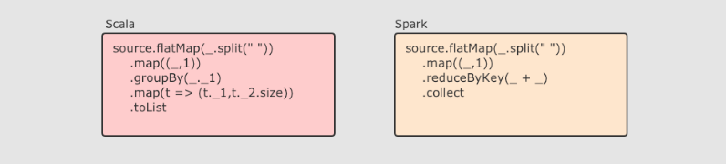

  RDD 的算子大致分为两类:

  - Transformation 转换操作, 例如 `map` `flatMap` `filter` 等
  - Action 动作操作, 例如 `reduce` `collect` `show` 等

  执行 RDD 的时候, 在执行到转换操作的时候, 并不会立刻执行, 直到遇见了 Action 操作, 才会触发真正的执行, 这个特点叫做 **惰性求值**

- RDD 可以分区

  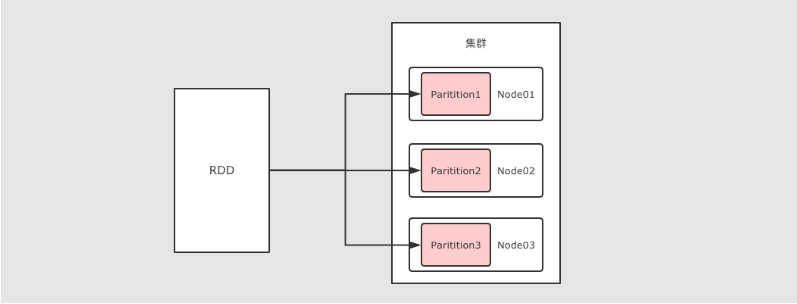

  RDD 是一个分布式计算框架, 所以, 一定是要能够进行分区计算的, 只有分区了, 才能利用集群的并行计算能力

  同时, RDD 不需要始终被具体化, 也就是说: RDD 中可以没有数据, 只要有足够的信息知道自己是从谁计算得来的就可以, 这是一种非常高效的容错方式

- RDD 是只读的

  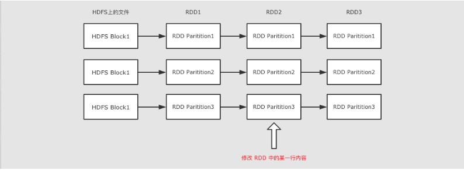

  RDD 是只读的, 不允许任何形式的修改. 虽说不能因为 RDD 和 HDFS 是只读的, 就认为分布式存储系统必须设计为只读的. 但是设计为只读的, 会显著降低问题的复杂度, 因为 RDD 需要可以容错, 可以惰性求值, 可以移动计算, 所以很难支持修改.

  - RDD2 中可能没有数据, 只是保留了依赖关系和计算函数, 那修改啥?
  - 如果因为支持修改, 而必须保存数据的话, 怎么容错?
  - 如果允许修改, 如何定位要修改的那一行? RDD 的转换是粗粒度的, 也就是说, RDD 并不感知具体每一行在哪.

- RDD 是可以容错的

  
  
  RDD 的容错有两种方式
  
  - 保存 RDD 之间的依赖关系, 以及计算函数, 出现错误重新计算
  - 直接将 RDD 的数据存放在外部存储系统, 出现错误直接读取, Checkpoint

#### 1.2.3. 什么叫做弹性分布式数据集

- 分布式

  RDD 支持分区, 可以运行在集群中

- 弹性

  - RDD 支持高效的容错
  - RDD 中的数据即可以缓存在内存中, 也可以缓存在磁盘中, 也可以缓存在外部存储中

- 数据集

  - RDD 可以不保存具体数据, 只保留创建自己的必备信息, 例如依赖和计算函数
  - RDD 也可以缓存起来, 相当于存储具体数据

总结: RDD 的五大属性

首先整理一下上面所提到的 RDD 所要实现的功能:

1. RDD 有分区
2. RDD 要可以通过依赖关系和计算函数进行容错
3. RDD 要针对数据本地性进行优化
4. RDD 支持 MapReduce 形式的计算, 所以要能够对数据进行 Shuffled

对于 RDD 来说, 其中应该有什么内容呢? 如果站在 RDD 设计者的角度上, 这个类中, 至少需要什么属性?

- `Partition List` 分片列表, 记录 RDD 的分片, 可以在创建 RDD 的时候指定分区数目, 也可以通过算子来生成新的 RDD 从而改变分区数目
- `Compute Function` 为了实现容错, 需要记录 RDD 之间转换所执行的计算函数
- `RDD Dependencies` RDD 之间的依赖关系, 要在 RDD 中记录其上级 RDD 是谁, 从而实现容错和计算
- `Partitioner` 为了执行 Shuffled 操作, 必须要有一个函数用来计算数据应该发往哪个分区
- `Preferred Location` 优先位置, 为了实现数据本地性操作, 从而移动计算而不是移动存储, 需要记录每个 RDD 分区最好应该放置在什么位置

## 2. RDD 的算子

目标

1. 理解 RDD 的算子分类, 以及其特性
2. 理解常见算子的使用

- 分类

  RDD 中的算子从功能上分为两大类

  1. Transformation(转换) 它会在一个已经存在的 RDD 上创建一个新的 RDD, 将旧的 RDD 的数据转换为另外一种形式后放入新的 RDD
  2. Action(动作) 执行各个分区的计算任务, 将的到的结果返回到 Driver 中

  RDD 中可以存放各种类型的数据, 那么对于不同类型的数据, RDD 又可以分为三类

  - 针对基础类型(例如 String)处理的普通算子
  - 针对 `Key-Value` 数据处理的 `byKey` 算子
  - 针对数字类型数据处理的计算算子

- 特点

  - Spark 中所有的 Transformations 是 Lazy(惰性) 的, 它们不会立即执行获得结果. 相反, 它们只会记录在数据集上要应用的操作. 只有当需要返回结果给 Driver 时, 才会执行这些操作, 通过 DAGScheduler 和 TaskScheduler 分发到集群中运行, 这个特性叫做 **惰性求值**
  - 默认情况下, 每一个 Action 运行的时候, 其所关联的所有 Transformation RDD 都会重新计算, 但是也可以使用 `presist` 方法将 RDD 持久化到磁盘或者内存中. 这个时候为了下次可以更快的访问, 会把数据保存到集群上.

### 2.1. Transformations 算子

| Transformation function                   | 解释                                                         |
| :---------------------------------------- | ------------------------------------------------------------ |
| `map(T ⇒ U)`                              | `sc.parallelize(Seq(1, 2, 3)).map( num => num * 10 )   .collect()`作用                                                                                                                      1. 把 RDD 中的数据 一对一 的转为另一种形式                                 签名                                                                                                                   `def map[U: ClassTag](f: T ⇒ U): RDD[U]`                                  参数                                                                                                            `f` → Map 算子是 `原RDD → 新RDD` 的过程, 传入函数的参数是原 RDD 数据, 返回值是经过函数转换的新 RDD 的数据                                      注意点                                                                                                                 Map 是一对一, 如果函数是 `String → Array[String]` 则新的 RDD 中每条数据就是一个数组 |
| `flatMap(T ⇒ List[U])`                    | `sc.parallelize(Seq("Hello lily", "Hello lucy", "Hello tim")).flatMap( line => line.split(" ") )   .collect()`作用:FlatMap 算子和 Map 算子类似, 但是 FlatMap 是一对多,                      调用:`def flatMap[U: ClassTag](f: T ⇒ List[U]): RDD[U]`,参数:`f` → 参数是原 RDD 数据, 返回值是经过函数转换的新 RDD 的数据, 需要注意的是返回值是一个集合, 集合中的数据会被展平后再放入新的 RDD                                                                                                         注意点:flatMap 其实是两个操作, 是 `map + flatten`, 也就是先转换, 后把转换而来的 List 展开,Spark 中并没有直接展平 RDD 中数组的算子, 可以使用 `flatMap` 做这件事 |
| `filter(T ⇒ Boolean)`                     | `sc.parallelize(Seq(1, 2, 3))   .filter( value => value >= 3 ).collect()`作用:`Filter` 算子的主要作用是过滤掉不需要的内容,函数返回值为true的数据保留 |
| `mapPartitions(List[T] ⇒ List[U])`        | **RDD[T] ⇒ RDD[U]** 和 map 类似,map的粒子针对的每一条数据, 但是mapPartitions的粒子针对整个分区的数据转换 |
| `mapPartitionsWithIndex`                  | 和 mapPartitions 类似, 只是在函数中增加了分区的 Index        |
| `mapValues`                               | `sc.parallelize(Seq(("a", 1), ("b", 2), ("c", 3)))   .mapValues( value => value * 10 ).collect()`作用:MapValues 只能作用于 Key-Value 型数据, 和 Map 类似, 也是使用函数按照转换数据, 不同点是 MapValues 只转换 Key-Value 中的 Value |
| `sample(withReplacement, fraction, seed)` | `sc.parallelize(Seq(1, 2, 3, 4, 5, 6, 7, 8, 9, 10))   .sample(withReplacement = true, 0.6, 2).collect()`作用:Sample 算子可以从一个数据集中抽样出来一部分, 常用作于减小数据集以保证运行速度, 并且尽可能少规律的损失                   参数:Sample 接受第一个参数为`withReplacement`, 意为是否取样以后是否还放回原数据集供下次使用, 简单的说, 如果这个参数的值为 true, 则抽样出来的数据集中可能会有重复,Sample 接受第二个参数为`fraction`, 意为抽样的比例Sample 接受第三个参数为`seed`, 随机数种子, 用于 Sample 内部随机生成下标, 一般不指定, 使用默认值 |
| `union(other)`                            | `val rdd1 = sc.parallelize(Seq(1, 2, 3)) val rdd2 = sc.parallelize(Seq(4, 5, 6)) rdd1.union(rdd2)   .collect()` |
| `intersection(other)`                     | `val rdd1 = sc.parallelize(Seq(1, 2, 3, 4, 5)) val rdd2 = sc.parallelize(Seq(4, 5, 6, 7, 8)) rdd1.intersection(rdd2)   .collect()`作用:Intersection 算子是一个集合操作, 用于求得 左侧集合 和 右侧集合 的交集, 换句话说, 就是左侧集合和右侧集合都有的元素, 并生成一个新的 RDD |
| `subtract(other, numPartitions)`          | **(RDD[T], RDD[T]) ⇒ RDD[T]** 差集, 可以设置分区数           |
| `distinct(numPartitions)`                 | `sc.parallelize(Seq(1, 1, 2, 2, 3)).distinct()   .collect()`作用:Distinct 算子用于去重,注意点:Distinct 是一个需要 Shuffled 的操作本质上 Distinct 就是一个 reductByKey, 把重复的合并为一个 |
| `reduceByKey((V, V) ⇒ V, numPartition)`   | `sc.parallelize(Seq(("a", 1), ("a", 1), ("b", 1)))   .reduceByKey( (curr, agg) => curr + agg )   .collect()`作用:首先按照 Key 分组生成一个 Tuple, 然后针对每个组执行 `reduce` 算子,                                                                                      调用:`def reduceByKey(func: (V, V) ⇒ V): RDD[(K, V)]`    ,                                                                                                          参数:func → 执行数据处理的函数, 传入两个参数, 一个是当前值, 一个是局部汇总, 这个函数需要有一个输出, 输出就是这个 Key 的汇总结果  ,                                                                                                       注意点:ReduceByKey 只能作用于 Key-Value 型数据, Key-Value 型数据在当前语境中特指 Tuple2  ,ReduceByKey 是一个需要 Shuffled 的操作  ,和其它的 Shuffled 相比, ReduceByKey是高效的, 因为类似 MapReduce 的, 在 Map 端有一个 Cominer, 这样 I/O 的数据便会减少 |
| `groupByKey()`                            | `sc.parallelize(Seq(("a", 1), ("a", 1), ("b", 1)))   .groupByKey()   .collect()`作用:GroupByKey 算子的主要作用是按照 Key 分组, 和 ReduceByKey 有点类似, 但是 GroupByKey 并不求聚合, 只是列举 Key 对应的所有 Value  .                                                                      注意点:GroupByKey 是一个 Shuffled  ,GroupByKey 和 ReduceByKey 不同, 因为需要列举 Key 对应的所有数据, 所以无法在 Map 端做 Combine, 所以 GroupByKey 的性能并没有 ReduceByKey 好 |
| `combineByKey()`                          | `val rdd = sc.parallelize(Seq(   ("zhangsan", 99.0),   ("zhangsan", 96.0),   ("lisi", 97.0),   ("lisi", 98.0),   ("zhangsan", 97.0)) )  val combineRdd = rdd.combineByKey(   score => (score, 1),   (scoreCount: (Double, Int),newScore) => (scoreCount._1 + newScore, scoreCount._2 + 1),   (scoreCount1: (Double, Int), scoreCount2: (Double, Int)) =>     (scoreCount1._1 + scoreCount2._1, scoreCount1._2 + scoreCount2._2) )  val meanRdd = combineRdd.map(score => (score._1, score._2._1 / score._2._2))  meanRdd.collect()` |
| `aggregateByKey()`                        | 需求:求打0.8折之后的总价格                                                               val rdd = sc.parallelize(Seq(("手机", 10.0), ("手机", 15.0), ("电脑", 20.0)))                                                                                                                val result = rdd.aggregateByKey(0.8)(   seqOp = (zero, price) => price * zero,   combOp = (curr, agg) => curr + agg ).collect() println(result) |
| `foldByKey(zeroValue)((V, V) ⇒ V)`        | `sc.parallelize(Seq(("a", 1), ("a", 1), ("b", 1)))   .foldByKey(zeroValue = 10)( (curr, agg) => curr + agg )   .collect()` |
| `join(other, numPartitions)`              | `val rdd1 = sc.parallelize(Seq(("a", 1), ("a", 2), ("b", 1))) val rdd2 = sc.parallelize(Seq(("a", 10), ("a", 11), ("a", 12)))  rdd1.join(rdd2).collect()` |
| `cogroup(other, numPartitions)`           | `val rdd1 = sc.parallelize(Seq(("a", 1), ("a", 2), ("a", 5), ("b", 2), ("b", 6), ("c", 3), ("d", 2))) val rdd2 = sc.parallelize(Seq(("a", 10), ("b", 1), ("d", 3))) val rdd3 = sc.parallelize(Seq(("b", 10), ("a", 1)))  val result1 = rdd1.cogroup(rdd2).collect() val result2 = rdd1.cogroup(rdd2, rdd3).collect()  /* 执行结果: Array(   (d,(CompactBuffer(2),CompactBuffer(3))),   (a,(CompactBuffer(1, 2, 5),CompactBuffer(10))),   (b,(CompactBuffer(2, 6),CompactBuffer(1))),   (c,(CompactBuffer(3),CompactBuffer())) )  */ println(result1)  /* 执行结果: Array(   (d,(CompactBuffer(2),CompactBuffer(3),CompactBuffer())),   (a,(CompactBuffer(1, 2, 5),CompactBuffer(10),CompactBuffer(1))),   (b,(CompactBuffer(2, 6),CompactBuffer(1),Co...  */ println(result2)` |
| `cartesian(other)`                        | **(RDD[T], RDD[U]) ⇒ RDD[(T, U)]** 生成两个 RDD 的笛卡尔积   |
| `sortBy(ascending, numPartitions)`        | `val rdd1 = sc.parallelize(Seq(("a", 3), ("b", 2), ("c", 1))) val sortByResult = rdd1.sortBy( item => item._2 ).collect() val sortByKeyResult = rdd1.sortByKey().collect()  println(sortByResult) println(sortByKeyResult)` |
| `partitionBy(partitioner)`                | 使用用传入的 partitioner 重新分区, 如果和当前分区函数相同, 则忽略操作 |
| `coalesce(numPartitions)`                 | 减少分区数`val rdd = sc.parallelize(Seq(("a", 3), ("b", 2), ("c", 1))) val oldNum = rdd.partitions.length  val coalesceRdd = rdd.coalesce(4, shuffle = true) val coalesceNum = coalesceRdd.partitions.length  val repartitionRdd = rdd.repartition(4) val repartitionNum = repartitionRdd.partitions.length  print(oldNum, coalesceNum, repartitionNum)` |
| `repartition(numPartitions)`              | 重新分区,默认sheffle=true,所有即可以增大分区数,也可以减小分区数 |
| `repartitionAndSortWithinPartitions`      | 重新分区的同时升序排序, 在partitioner中排序, 比先重分区再排序要效率高, 建议使用在需要分区后再排序的场景使用 |

### 2.2. Action 算子

| Action function                      | 解释                                                         |
| :----------------------------------- | :----------------------------------------------------------- |
| `reduce( (T, T) ⇒ U )`               | `val rdd = sc.parallelize(Seq(("手机", 10.0), ("手机", 15.0), ("电脑", 20.0))) val result = rdd.reduce((curr, agg) => ("总价", curr._2 + agg._2)) println(result)`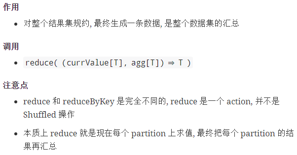 |
| `collect()`                          | 以数组的形式返回数据集中所有元素                             |
| `count()`                            | 返回元素个数                                                 |
| `first()`                            | 返回第一个元素                                               |
| `take( N )`                          | 返回前 N 个元素                                              |
| `takeSample(withReplacement, fract)` | 类似于 sample, 区别在这是一个Action, 直接返回结果            |
| `fold(zeroValue)( (T, T) ⇒ U )`      | 指定初始值和计算函数, 折叠聚合整个数据集                     |
| `saveAsTextFile(path)`               | 将结果存入 path 对应的文件中                                 |
| `saveAsSequenceFile(path)`           | 将结果存入 path 对应的 Sequence 文件中                       |
| `countByKey()`                       | `val rdd = sc.parallelize(Seq(("手机", 10.0), ("手机", 15.0), ("电脑", 20.0))) val result = rdd.countByKey() println(result)`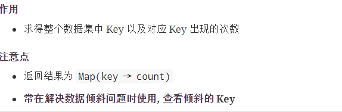 |
| `foreach( T ⇒ … )`                   | 遍历每一个元素                                               |

- 应用

  ```scala
  val rdd = sc.parallelize(Seq(("手机", 10.0), ("手机", 15.0), ("电脑", 20.0)))
  // 结果: Array((手机,10.0), (手机,15.0), (电脑,20.0))
  println(rdd.collect())
  // 结果: Array((手机,10.0), (手机,15.0))
  println(rdd.take(2))
  // 结果: (手机,10.0)
  println(rdd.first())
  ```

总结

- RDD 的算子大部分都会生成一些专用的 RDD

  - `map`, `flatMap`, `filter` 等算子会生成 `MapPartitionsRDD`
  - `coalesce`, `repartition` 等算子会生成 `CoalescedRDD`
- 常见的 RDD 有两种类型

  - 转换型的 RDD, Transformation
  - 动作型的 RDD, Action
- 常见的 Transformation 类型的 RDD

  - map
  - flatMap
  - filter
  - groupBy
  - reduceByKey
- 常见的 Action 类型的 RDD

  - collect
  - countByKey
  - reduce

### 2.3. RDD 对不同类型数据的支持

目标

1. 理解 RDD 对 Key-Value 类型的数据是有专门支持的
2. 理解 RDD 对数字类型也有专门的支持

- 一般情况下 RDD 要处理的数据有三类

  - 字符串
  - 键值对
  - 数字型

- RDD 的算子设计对这三类不同的数据分别都有支持

  - 对于以字符串为代表的基本数据类型是比较基础的一些的操作, 诸如 map, flatMap, filter 等基础的算子
  - 对于键值对类型的数据, 有额外的支持, 诸如 reduceByKey, groupByKey 等 byKey 的算子
  - 同样对于数字型的数据也有额外的支持, 诸如 max, min 等

- RDD 对键值对数据的额外支持

  键值型数据本质上就是一个二元元组, 键值对类型的 RDD 表示为 `RDD[(K, V)]`

  RDD 对键值对的额外支持是通过隐式支持来完成的, 一个 `RDD[(K, V)]`, 可以被隐式转换为一个 `PairRDDFunctions` 对象, 从而调用其中的方法.

  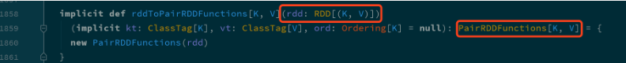

  **既然对键值对的支持是通过** `PairRDDFunctions` **提供的, 那么从** `PairRDDFunctions` **中就可以看到这些支持有什么**

  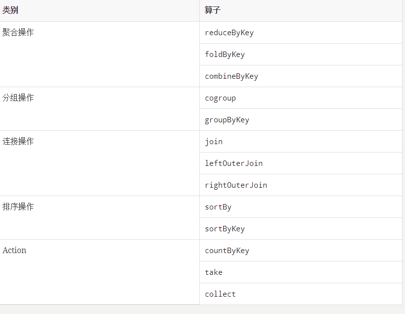

- RDD 对数字型数据的额外支持

  对于数字型数据的额外支持基本上都是 Action 操作, 而不是转换操作
  
  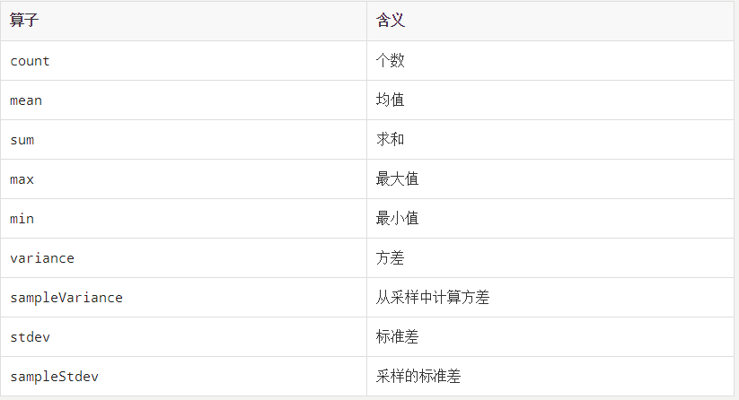
  
  ```scala
  val rdd = sc.parallelize(Seq(1, 2, 3))
  // 结果: 3
  println(rdd.max())
  ```

### 2.4. 阶段练习和总结

导读

1. 通过本节, 希望大家能够理解 RDD 的一般使用步骤

```scala
// 1. 创建 SparkContext
val conf = new SparkConf().setMaster("local[6]").setAppName("stage_practice1")
val sc = new SparkContext(conf)

// 2. 创建 RDD
val rdd1 = sc.textFile("dataset/BeijingPM20100101_20151231_noheader.csv")

// 3. 处理 RDD
val rdd2 = rdd1.map { item =>
  val fields = item.split(",")
  ((fields(1), fields(2)), fields(6))
}
val rdd3 = rdd2.filter { item => !item._2.equalsIgnoreCase("NA") }
val rdd4 = rdd3.map { item => (item._1, item._2.toInt) }
val rdd5 = rdd4.reduceByKey { (curr, agg) => curr + agg }
val rdd6 = rdd5.sortByKey(ascending = false)

// 4. 行动, 得到结果
println(rdd6.first())
```

通过上述代码可以看到, 其实 RDD 的整体使用步骤如下


## 3. RDD 的 Shuffle 和分区

目标

1. RDD 的分区操作
2. Shuffle 的原理

分区的作用

​		RDD 使用分区来分布式并行处理数据, 并且要做到尽量少的在不同的 Executor 之间使用网络交换数据, 所以当使用 RDD 读取数据的时候, 会尽量的在物理上靠近数据源, 比如说在读取 Cassandra 或者 HDFS 中数据的时候, 会尽量的保持 RDD 的分区和数据源的分区数, 分区模式等一一对应

分区和 Shuffle 的关系

​		分区的主要作用是用来实现并行计算, 本质上和 Shuffle 没什么关系, 但是往往在进行数据处理的时候, 例如 `reduceByKey`, `groupByKey` 等聚合操作, 需要把 Key 相同的 Value 拉取到一起进行计算, 这个时候因为这些 Key 相同的 Value 可能会坐落于不同的分区, 于是理解分区才能理解 Shuffle 的根本原理

Spark 中的 Shuffle 操作的特点

- 只有 `Key-Value` 型的 RDD 才会有 Shuffle 操作, 例如 `RDD[(K, V)]`, 但是有一个特例, 就是 `repartition` 算子可以对任何数据类型 Shuffle
- 早期版本 Spark 的 Shuffle 算法是 `Hash base shuffle`, 后来改为 `Sort base shuffle`, 更适合大吞吐量的场景

### 3.1. RDD 的分区操作

- 查看分区数

  ```scala
  scala> sc.parallelize(1 to 100).count
  res0: Long = 100
  ```
  
  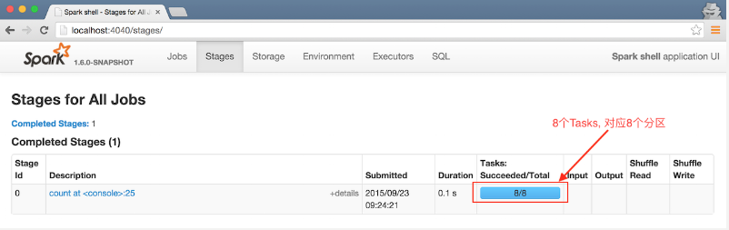
  
  之所以会有 8 个 Tasks, 是因为在启动的时候指定的命令是 `spark-shell --master local[8]`, 这样会生成 1 个 Executors, 这个 Executors 有 8 个 Cores, 所以默认会有 8 个 Tasks, 每个 Cores 对应一个分区, 每个分区对应一个 Tasks, 可以通过 `rdd.partitions.size` 来查看分区数量
  
  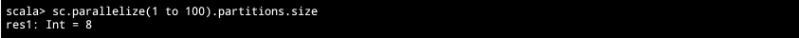
  
  同时也可以通过 spark-shell 的 WebUI 来查看 Executors 的情况
  
  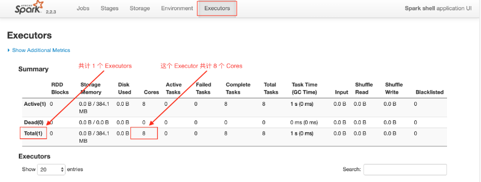

默认的分区数量是和 Cores 的数量有关的, 也可以通过如下三种方式修改或者重新指定分区数量

- 创建 RDD 时指定分区数

  ```scala
  scala> val rdd1 = sc.parallelize(1 to 100, 6)
  rdd1: org.apache.spark.rdd.RDD[Int] = ParallelCollectionRDD[1] at parallelize at <console>:24
  
  scala> rdd1.partitions.size
  res1: Int = 6
  
  scala> val rdd2 = sc.textFile("hdfs:///dataset/wordcount.txt", 6)
  rdd2: org.apache.spark.rdd.RDD[String] = hdfs:///dataset/wordcount.txt MapPartitionsRDD[3] at textFile at <console>:24
  
  scala> rdd2.partitions.size
  res2: Int = 7
  ```

  rdd1 是通过本地集合创建的, 创建的时候通过第二个参数指定了分区数量. rdd2 是通过读取 HDFS 中文件创建的, 同样通过第二个参数指定了分区数, 因为是从 HDFS 中读取文件, 所以最终的分区数是由 Hadoop 的 InputFormat 来指定的, 所以比指定的分区数大了一个.

- 通过 `coalesce` 算子指定

  ````scala
  coalesce(numPartitions: Int, shuffle: Boolean = false)(implicit ord: Ordering[T] = null): RDD[T]
  
  numPartitions
  //新生成的 RDD 的分区数
  
  shuffle
  //是否 Shuffle
  
  scala> val source = sc.parallelize(1 to 100, 6)
  source: org.apache.spark.rdd.RDD[Int] = ParallelCollectionRDD[0] at parallelize at <console>:24
  
  scala> source.partitions.size
  res0: Int = 6
  
  scala> val noShuffleRdd = source.coalesce(numPartitions=8, shuffle=false)
  noShuffleRdd: org.apache.spark.rdd.RDD[Int] = CoalescedRDD[1] at coalesce at <console>:26
  
  scala> noShuffleRdd.toDebugString 
  res1: String =
  (6) CoalescedRDD[1] at coalesce at <console>:26 []
   |  ParallelCollectionRDD[0] at parallelize at <console>:24 []
  
   scala> val noShuffleRdd = source.coalesce(numPartitions=8, shuffle=false)
   noShuffleRdd: org.apache.spark.rdd.RDD[Int] = CoalescedRDD[1] at coalesce at <console>:26
  
  scala> shuffleRdd.toDebugString 
  res3: String =
  (8) MapPartitionsRDD[5] at coalesce at <console>:26 []
   |  CoalescedRDD[4] at coalesce at <console>:26 []
   |  ShuffledRDD[3] at coalesce at <console>:26 []
   +-(6) MapPartitionsRDD[2] at coalesce at <console>:26 []
      |  ParallelCollectionRDD[0] at parallelize at <console>:24 []
  
  scala> noShuffleRdd.partitions.size     
  res4: Int = 6
  
  scala> shuffleRdd.partitions.size
  res5: Int = 8
  ````

  1. 如果 `shuffle` 参数指定为 `false`, 运行计划中确实没有 `ShuffledRDD`, 没有 `shuffled` 这个过程
  2. 如果 `shuffle` 参数指定为 `true`, 运行计划中有一个 `ShuffledRDD`, 有一个明确的显式的 `shuffled` 过程
  3. 如果 `shuffle` 参数指定为 `false` 却增加了分区数, 分区数并不会发生改变, 这是因为增加分区是一个宽依赖, 没有 `shuffled` 过程无法做到, 后续会详细解释宽依赖的概念

- 通过 `repartition` 算子指定

  ```scala
  repartition(numPartitions: Int)(implicit ord: Ordering[T] = null): RDD[T]
  ```
  
  算子本质上就是 `coalesce(numPartitions, shuffle = true)`
  
  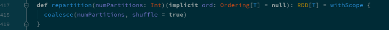
  
  ```scala
  scala> val source = sc.parallelize(1 to 100, 6)
  source: org.apache.spark.rdd.RDD[Int] = ParallelCollectionRDD[7] at parallelize at <console>:24
  
  scala> source.partitions.size
  res7: Int = 6
  
  scala> source.repartition(100).partitions.size 
  res8: Int = 100
  
  scala> source.repartition(1).partitions.size 
  res9: Int = 1
  ```
  
  1. 增加分区有效
  2. 减少分区有效
  
  `repartition` 算子无论是增加还是减少分区都是有效的, 因为本质上 `repartition` 会通过 `shuffle` 操作把数据分发给新的 RDD 的不同的分区, 只有 `shuffle` 操作才可能做到增大分区数, 默认情况下, 分区函数是 `RoundRobin`, 如果希望改变分区函数, 也就是数据分布的方式, 可以通过自定义分区函数来实现
  
  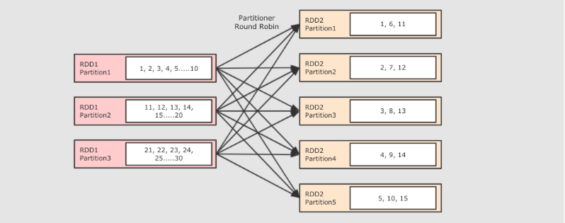

### 3.2. RDD 的 Shuffle 是什么

```scala
val sourceRdd = sc.textFile("hdfs://node01:9020/dataset/wordcount.txt")
val flattenCountRdd = sourceRdd.flatMap(_.split(" ")).map((_, 1))
val aggCountRdd = flattenCountRdd.reduceByKey(_ + _)
val result = aggCountRdd.collect
```

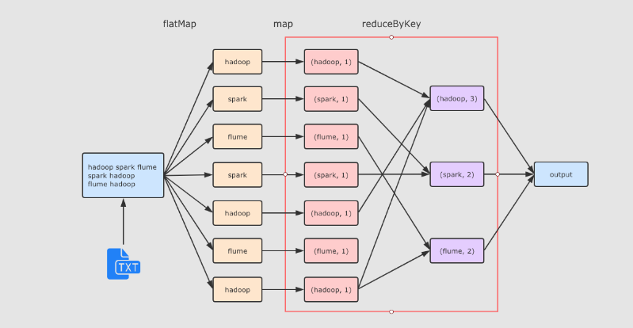

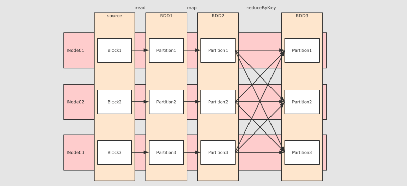

`reduceByKey` 这个算子本质上就是先按照 Key 分组, 后对每一组数据进行 `reduce`, 所面临的挑战就是 Key 相同的所有数据可能分布在不同的 Partition 分区中, 甚至可能在不同的节点中, 但是它们必须被共同计算.

为了让来自相同 Key 的所有数据都在 `reduceByKey` 的同一个 `reduce` 中处理, 需要执行一个 `all-to-all` 的操作, 需要在不同的节点(不同的分区)之间拷贝数据, 必须跨分区聚集相同 Key 的所有数据, 这个过程叫做 `Shuffle`.

### 3.3. RDD 的 Shuffle 原理

Spark 的 Shuffle 发展大致有两个阶段: `Hash base shuffle` 和 `Sort base shuffle`

- Hash base shuffle

  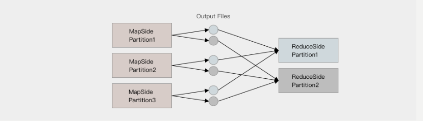

  大致的原理是分桶, 假设 Reducer 的个数为 R, 那么每个 Mapper 有 R 个桶, 按照 Key 的 Hash 将数据映射到不同的桶中, Reduce 找到每一个 Mapper 中对应自己的桶拉取数据.

  假设 Mapper 的个数为 M, 整个集群的文件数量是 `M * R`, 如果有 1,000 个 Mapper 和 Reducer, 则会生成 1,000,000 个文件, 这个量非常大了.

  过多的文件会导致文件系统打开过多的文件描述符, 占用系统资源. 所以这种方式并不适合大规模数据的处理, 只适合中等规模和小规模的数据处理, 在 Spark 1.2 版本中废弃了这种方式.

- Sort base shuffle

  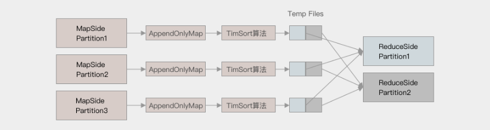
  
  对于 Sort base shuffle 来说, 每个 Map 侧的分区只有一个输出文件, Reduce 侧的 Task 来拉取, 大致流程如下
  
  1. Map 侧将数据全部放入一个叫做 AppendOnlyMap 的组件中, 同时可以在这个特殊的数据结构中做聚合操作
  2. 然后通过一个类似于 MergeSort 的排序算法 TimSort 对 AppendOnlyMap 底层的 Array 排序
     - 先按照 Partition ID 排序, 后按照 Key 的 HashCode 排序
  3. 最终每个 Map Task 生成一个 输出文件, Reduce Task 来拉取自己对应的数据
  
  从上面可以得到结论, Sort base shuffle 确实可以大幅度减少所产生的中间文件, 从而能够更好的应对大吞吐量的场景, 在 Spark 1.2 以后, 已经默认采用这种方式.
  
  但是需要大家知道的是, Spark 的 Shuffle 算法并不只是这一种, 即使是在最新版本, 也有三种 Shuffle 算法, 这三种算法对每个 Map 都只产生一个临时文件, 但是产生文件的方式不同, 一种是类似 Hash 的方式, 一种是刚才所说的 Sort, 一种是对 Sort 的一种优化(使用 Unsafe API 直接申请堆外内存)

## 4. 缓存

概要

1. 缓存的意义
2. 缓存相关的 API
3. 缓存级别以及最佳实践

### 4.1. 缓存的意义

- 使用缓存的原因 - 多次使用 RDD
  - 需求: 在日志文件中找到访问次数最少的 IP 和访问次数最多的 IP

```scala
val conf = new SparkConf().setMaster("local[6]").setAppName("debug_string")
val sc = new SparkContext(conf)

val interimRDD = sc.textFile("dataset/access_log_sample.txt")
  .map(item => (item.split(" ")(0), 1))
  .filter(item => StringUtils.isNotBlank(item._1))
  .reduceByKey((curr, agg) => curr + agg) 

val resultLess = interimRDD.sortBy(item => item._2, ascending = true).first()
val resultMore = interimRDD.sortBy(item => item._2, ascending = false).first()

println(s"出现次数最少的 IP : $resultLess, 出现次数最多的 IP : $resultMore")

sc.stop()
```

​			1. 这是一个 Shuffle 操作, Shuffle 操作会在集群内进行数据拷贝

在上述代码中, 多次使用到了 `interimRDD`, 导致文件读取两次, 计算两次, 有没有什么办法增进上述代码的性能?

- 使用缓存的原因 - 容错

  
  
  当在计算 RDD3 的时候如果出错了, 会怎么进行容错?
  
  会再次计算 RDD1 和 RDD2 的整个链条, 假设 RDD1 和 RDD2 是通过比较昂贵的操作得来的, 有没有什么办法减少这种开销?

上述两个问题的解决方案其实都是 `缓存`, 除此之外, 使用缓存的理由还有很多, 但是总结一句, 就是缓存能够帮助开发者在进行一些昂贵操作后, 将其结果保存下来, 以便下次使用无需再次执行, 缓存能够显著的提升性能.

所以, 缓存适合在一个 RDD 需要重复多次利用, 并且还不是特别大的情况下使用, 例如迭代计算等场景.

### 4.2. 缓存相关的 API

- 可以使用 `cache` 方法进行缓存

  ```scala
  val conf = new SparkConf().setMaster("local[6]").setAppName("debug_string")
  val sc = new SparkContext(conf)
  
  val interimRDD = sc.textFile("dataset/access_log_sample.txt")
    .map(item => (item.split(" ")(0), 1))
    .filter(item => StringUtils.isNotBlank(item._1))
    .reduceByKey((curr, agg) => curr + agg)
    .cache() 
  
  val resultLess = interimRDD.sortBy(item => item._2, ascending = true).first()
  val resultMore = interimRDD.sortBy(item => item._2, ascending = false).first()
  
  println(s"出现次数最少的 IP : $resultLess, 出现次数最多的 IP : $resultMore")
  
  sc.stop()
  ```

  1. 缓存

     方法签名如下

     ```scala
     cache(): this.type = persist()
     ```

- 也可以使用 persist 方法进行缓存

  ````scala
  val conf = new SparkConf().setMaster("local[6]").setAppName("debug_string")
  val sc = new SparkContext(conf)
  
  val interimRDD = sc.textFile("dataset/access_log_sample.txt")
    .map(item => (item.split(" ")(0), 1))
    .filter(item => StringUtils.isNotBlank(item._1))
    .reduceByKey((curr, agg) => curr + agg)
    .persist(StorageLevel.MEMORY_ONLY) 
  
  val resultLess = interimRDD.sortBy(item => item._2, ascending = true).first()
  val resultMore = interimRDD.sortBy(item => item._2, ascending = false).first()
  
  println(s"出现次数最少的 IP : $resultLess, 出现次数最多的 IP : $resultMore")
  
  sc.stop()
  ````

  1. 缓存

     方法签名如下

     ```scala
     persist(): this.type
     persist(newLevel: StorageLevel): this.type
     ```

     `persist` 方法其实有两种形式, `persist()` 是 `persist(newLevel: StorageLevel)` 的一个别名, `persist(newLevel: StorageLevel)` 能够指定缓存的级别

     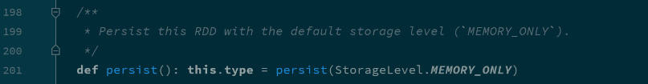

- 缓存其实是一种空间换时间的做法, 会占用额外的存储资源, 如何清理?

  ```scala
  val conf = new SparkConf().setMaster("local[6]").setAppName("debug_string")
  val sc = new SparkContext(conf)
  
  val interimRDD = sc.textFile("dataset/access_log_sample.txt")
    .map(item => (item.split(" ")(0), 1))
    .filter(item => StringUtils.isNotBlank(item._1))
    .reduceByKey((curr, agg) => curr + agg)
    .persist()
  
  interimRDD.unpersist() 
  
  val resultLess = interimRDD.sortBy(item => item._2, ascending = true).first()
  val resultMore = interimRDD.sortBy(item => item._2, ascending = false).first()
  
  println(s"出现次数最少的 IP : $resultLess, 出现次数最多的 IP : $resultMore")
  
  sc.stop()
  ```
  
  1. 清理缓存
  
     根据缓存级别的不同, 缓存存储的位置也不同, 但是使用 `unpersist` 可以指定删除 RDD 对应的缓存信息, 并指定缓存级别为 `NONE`

### 4.3. 缓存级别

其实如何缓存是一个技术活, 有很多细节需要思考, 如下

- 是否使用磁盘缓存?
- 是否使用内存缓存?
- 是否使用堆外内存?
- 缓存前是否先序列化?
- 是否需要有副本?

如果要回答这些信息的话, 可以先查看一下 RDD 的缓存级别对象

```scala
val conf = new SparkConf().setMaster("local[6]").setAppName("debug_string")
val sc = new SparkContext(conf)

val interimRDD = sc.textFile("dataset/access_log_sample.txt")
  .map(item => (item.split(" ")(0), 1))
  .filter(item => StringUtils.isNotBlank(item._1))
  .reduceByKey((curr, agg) => curr + agg)
  .persist()

println(interimRDD.getStorageLevel)

sc.stop()
```

打印出来的对象是 `StorageLevel`, 其中有如下几个构造参数

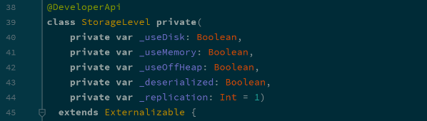

根据这几个参数的不同, `StorageLevel` 有如下几个枚举对象

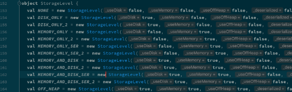

| 缓存级别                | `userDisk`是否使用磁盘 | `useMemory`是否使用内存 | `useOffHeap`是否使用堆外内存 | `deserialized`是否以反序列化形式存储 | `replication`副本数 |
| :---------------------- | :--------------------- | :---------------------- | :--------------------------- | :----------------------------------- | :------------------ |
| `NONE`                  | false                  | false                   | false                        | false                                | 1                   |
| `DISK_ONLY`             | true                   | false                   | false                        | false                                | 1                   |
| `DISK_ONLY_2`           | true                   | false                   | false                        | false                                | 2                   |
| `MEMORY_ONLY`           | false                  | true                    | false                        | true                                 | 1                   |
| `MEMORY_ONLY_2`         | false                  | true                    | false                        | true                                 | 2                   |
| `MEMORY_ONLY_SER`       | false                  | true                    | false                        | false                                | 1                   |
| `MEMORY_ONLY_SER_2`     | false                  | true                    | false                        | false                                | 2                   |
| `MEMORY_AND_DISK`       | true                   | true                    | false                        | true                                 | 1                   |
| `MEMORY_AND_DISK`       | true                   | true                    | false                        | true                                 | 2                   |
| `MEMORY_AND_DISK_SER`   | true                   | true                    | false                        | false                                | 1                   |
| `MEMORY_AND_DISK_SER_2` | true                   | true                    | false                        | false                                | 2                   |
| `OFF_HEAP`              | true                   | true                    | true                         | false                                | 1                   |

如何选择分区级别

Spark 的存储级别的选择，核心问题是在 memory 内存使用率和 CPU 效率之间进行权衡。建议按下面的过程进行存储级别的选择:

如果您的 RDD 适合于默认存储级别（MEMORY_ONLY），leave them that way。这是 CPU 效率最高的选项，允许 RDD 上的操作尽可能快地运行.

如果不是，试着使用 MEMORY_ONLY_SER 和 selecting a fast serialization library 以使对象更加节省空间，但仍然能够快速访问。(Java和Scala)

不要溢出到磁盘，除非计算您的数据集的函数是昂贵的，或者它们过滤大量的数据。否则，重新计算分区可能与从磁盘读取分区一样快.

如果需要快速故障恢复，请使用复制的存储级别（例如，如果使用 Spark 来服务 来自网络应用程序的请求）。All 存储级别通过重新计算丢失的数据来提供完整的容错能力，但复制的数据可让您继续在 RDD 上运行任务，而无需等待重新计算一个丢失的分区.

## 5. Checkpoint

目标

1. Checkpoint 的作用
2. Checkpoint 的使用

### 5.1. Checkpoint 的作用

Checkpoint 的主要作用是斩断 RDD 的依赖链, 并且将数据存储在可靠的存储引擎中, 例如支持分布式存储和副本机制的 HDFS.

- Checkpoint 的方式

  - **可靠的** 将数据存储在可靠的存储引擎中, 例如 HDFS
  - **本地的** 将数据存储在本地

- 什么是斩断依赖链

  斩断依赖链是一个非常重要的操作, 接下来以 HDFS 的 NameNode 的原理来举例说明

  HDFS 的 NameNode 中主要职责就是维护两个文件, 一个叫做 `edits`, 另外一个叫做 `fsimage`. `edits` 中主要存放 `EditLog`, `FsImage` 保存了当前系统中所有目录和文件的信息. 这个 `FsImage` 其实就是一个 `Checkpoint`.

  HDFS 的 NameNode 维护这两个文件的主要过程是, 首先, 会由 `fsimage` 文件记录当前系统某个时间点的完整数据, 自此之后的数据并不是时刻写入 `fsimage`, 而是将操作记录存储在 `edits` 文件中. 其次, 在一定的触发条件下, `edits` 会将自身合并进入 `fsimage`. 最后生成新的 `fsimage` 文件, `edits` 重置, 从新记录这次 `fsimage` 以后的操作日志.

  如果不合并 `edits` 进入 `fsimage` 会怎样? 会导致 `edits` 中记录的日志过长, 容易出错.

  所以当 Spark 的一个 Job 执行流程过长的时候, 也需要这样的一个斩断依赖链的过程, 使得接下来的计算轻装上阵.

- Checkpoint 和 Cache 的区别

  Cache 可以把 RDD 计算出来然后放在内存中, 但是 RDD 的依赖链(相当于 NameNode 中的 Edits 日志)是不能丢掉的, 因为这种缓存是不可靠的, 如果出现了一些错误(例如 Executor 宕机), 这个 RDD 的容错就只能通过回溯依赖链, 重放计算出来.
  
  但是 Checkpoint 把结果保存在 HDFS 这类存储中, 就是可靠的了, 所以可以斩断依赖, 如果出错了, 则通过复制 HDFS 中的文件来实现容错.
  
  所以他们的区别主要在以下两点
  
  - Checkpoint 可以保存数据到 HDFS 这类可靠的存储上, Persist 和 Cache 只能保存在本地的磁盘和内存中
  - Checkpoint 可以斩断 RDD 的依赖链, 而 Persist 和 Cache 不行
  - 因为 CheckpointRDD 没有向上的依赖链, 所以程序结束后依然存在, 不会被删除. 而 Cache 和 Persist 会在程序结束后立刻被清除.

### 5.2. 使用 Checkpoint

```scala
val conf = new SparkConf().setMaster("local[6]").setAppName("debug_string")
val sc = new SparkContext(conf)
sc.setCheckpointDir("checkpoint") 

val interimRDD = sc.textFile("dataset/access_log_sample.txt")
  .map(item => (item.split(" ")(0), 1))
  .filter(item => StringUtils.isNotBlank(item._1))
  .reduceByKey((curr, agg) => curr + agg)

interimRDD.checkpoint() 

interimRDD.collect().foreach(println(_))

sc.stop()
```

1. 在使用 Checkpoint 之前需要先设置 Checkpoint 的存储路径, 而且如果任务在集群中运行的话, 这个路径必须是 HDFS 上的路径

2. 开启 Checkpoint

   > ! [NITE]
   >
   > 一个小细节
   >
   > ```scala
   > val interimRDD = sc.textFile("dataset/access_log_sample.txt")
   >   .map(item => (item.split(" ")(0), 1))
   >   .filter(item => StringUtils.isNotBlank(item._1))
   >   .reduceByKey((curr, agg) => curr + agg)
   >   .cache() 
   > 
   > interimRDD.checkpoint()
   > interimRDD.collect().foreach(println(_))
   > ```
   >
   > 1. `checkpoint` 之前先 `cache` 一下, 准没错
   >
   > 应该在 `checkpoint` 之前先 `cache` 一下, 因为 `checkpoint` 会重新计算整个 RDD 的数据然后再存入 HDFS 等地方.
   >
   > 所以上述代码中如果 `checkpoint` 之前没有 `cache`, 则整个流程会被计算两次, 一次是 `checkpoint`, 另外一次是 `collect`

## 6. Spark 底层逻辑

导读

1. 从部署图了解 `Spark` 部署了什么, 有什么组件运行在集群中

2. 通过对 `WordCount` 案例的解剖, 来理解执行逻辑计划的生成

3. 通过对逻辑执行计划的细化, 理解如何生成物理计划

   > 如无特殊说明, 以下部分均针对于 `Spark Standalone` 进行介绍

- 部署情况

  在 `Spark` 部分的底层执行逻辑开始之前, 还是要先认识一下 `Spark` 的部署情况, 根据部署情况, 从而理解如何调度.

  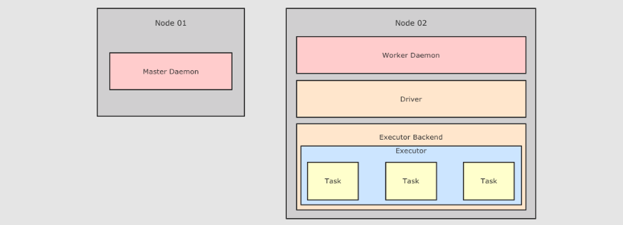

  针对于上图, 首先可以看到整体上在集群中运行的角色有如下几个:

  - `Master Daemon`

    负责管理 `Master` 节点, 协调资源的获取, 以及连接 `Worker` 节点来运行 `Executor`, 是 Spark 集群中的协调节点

  - `Worker Daemon`

    `Workers` 也称之为叫 `Slaves`, 是 Spark 集群中的计算节点, 用于和 Master 交互并管理 `Executor`.

    当一个 `Spark Job` 提交后, 会创建 `SparkContext`, 后 `Worker` 会启动对应的 `Executor`.

  - `Executor Backend`

    上面有提到 `Worker` 用于控制 `Executor` 的启停, 其实 `Worker` 是通过 `Executor Backend` 来进行控制的, `Executor Backend` 是一个进程(是一个 `JVM` 实例), 持有一个 `Executor` 对象

  另外在启动程序的时候, 有三种程序需要运行在集群上:

  - `Driver`

    `Driver` 是一个 `JVM` 实例, 是一个进程, 是 `Spark Application` 运行时候的领导者, 其中运行了 `SparkContext`.

    `Driver` 控制 `Job` 和 `Task`, 并且提供 `WebUI`.

  - `Executor`

    `Executor` 对象中通过线程池来运行 `Task`, 一个 `Executor` 中只会运行一个 `Spark Application` 的 `Task`, 不同的 `Spark Application` 的 `Task` 会由不同的 `Executor` 来运行

- 案例

  因为要理解执行计划, 重点不在案例, 所以本节以一个非常简单的案例作为入门, 就是我们第一个案例 WordCount

  ````scala
  val sc = ...
  
  val textRDD = sc.parallelize(Seq("Hadoop Spark", "Hadoop Flume", "Spark Sqoop"))
  val splitRDD = textRDD.flatMap(_.split(" "))
  val tupleRDD = splitRDD.map((_, 1))
  val reduceRDD = tupleRDD.reduceByKey(_ + _)
  val strRDD = reduceRDD.map(item => s"${item._1}, ${item._2}")
  
  println(strRDD.toDebugString)
  strRDD.collect.foreach(item => println(item))
  ````

  整个案例的运行过程大致如下:

  1. 通过代码的运行, 生成对应的 `RDD` 逻辑执行图
  2. 通过 `Action` 操作, 根据逻辑执行图生成对应的物理执行图, 也就是 `Stage` 和 `Task`
  3. 将物理执行图运行在集群中

- 逻辑执行图

  对于上面代码中的 `reduceRDD` 如果使用 `toDebugString` 打印调试信息的话, 会显式如下内容

  ```TEXT
  (6) MapPartitionsRDD[4] at map at WordCount.scala:20 []
   |  ShuffledRDD[3] at reduceByKey at WordCount.scala:19 []
   +-(6) MapPartitionsRDD[2] at map at WordCount.scala:18 []
      |  MapPartitionsRDD[1] at flatMap at WordCount.scala:17 []
      |  ParallelCollectionRDD[0] at parallelize at WordCount.scala:16 []
  ```

  根据这段内容, 大致能得到这样的一张逻辑执行图

  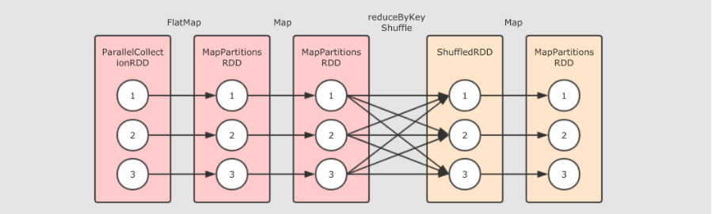

  其实 RDD 并没有什么严格的逻辑执行图和物理执行图的概念, 这里也只是借用这个概念, 从而让整个 RDD 的原理可以解释, 好理解.

  对于 RDD 的逻辑执行图, 起始于第一个入口 RDD 的创建, 结束于 Action 算子执行之前, 主要的过程就是生成一组互相有依赖关系的 RDD, 其并不会真的执行, 只是表示 RDD 之间的关系, 数据的流转过程.

- 物理执行图

  当触发 Action 执行的时候, 这一组互相依赖的 RDD 要被处理, 所以要转化为可运行的物理执行图, 调度到集群中执行.
  
  因为大部分 RDD 是不真正存放数据的, 只是数据从中流转, 所以, 不能直接在集群中运行 RDD, 要有一种 Pipeline 的思想, 需要将这组 RDD 转为 Stage 和 Task, 从而运行 Task, 优化整体执行速度.
  
  以上的逻辑执行图会生成如下的物理执行图, 这一切发生在 Action 操作被执行时.从上图可以总结如下几个点
  
  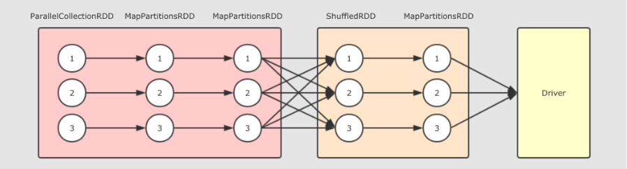
  
  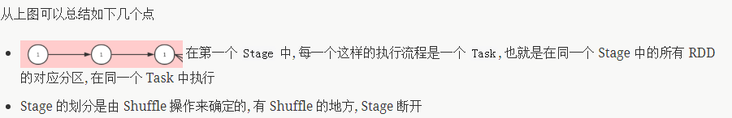

### 6.1. 逻辑执行图生成

导读

1. 如何生成 RDD
2. 如何控制 RDD 之间的关系

#### 6.1.1. RDD 的生成

重点内容

本章要回答如下三个问题

- 如何生成 RDD
- 生成什么 RDD
- 如何计算 RDD 中的数据

```scala
val sc = ...

val textRDD = sc.parallelize(Seq("Hadoop Spark", "Hadoop Flume", "Spark Sqoop"))
val splitRDD = textRDD.flatMap(_.split(" "))
val tupleRDD = splitRDD.map((_, 1))
val reduceRDD = tupleRDD.reduceByKey(_ + _)
val strRDD = reduceRDD.map(item => s"${item._1}, ${item._2}")

println(strRDD.toDebugString)
strRDD.collect.foreach(item => println(item))
```

- 明确逻辑计划的边界

  在 `Action` 调用之前, 会生成一系列的 `RDD`, 这些 `RDD` 之间的关系, 其实就是整个逻辑计划

  例如上述代码, 如果生成逻辑计划的, 会生成如下一些 `RDD`, 这些 `RDD` 是相互关联的, 这些 `RDD` 之间, 其实本质上生成的就是一个 **计算链**

  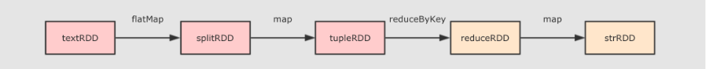

  接下来, 采用迭代渐进式的方式, 一步一步的查看一下整体上的生成过程

- `textFile` 算子的背后

  研究 `RDD` 的功能或者表现的时候, 其实本质上研究的就是 `RDD` 中的五大属性, 因为 `RDD` 透过五大属性来提供功能和表现, 所以如果要研究 `textFile` 这个算子, 应该从五大属性着手, 那么第一步就要看看生成的 `RDD` 是什么类型的 `RDD`

  1. `textFile` 生成的是 `HadoopRDD`

     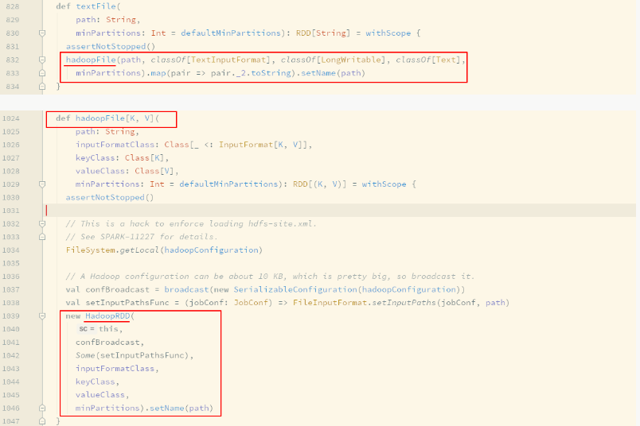

     除了上面这一个步骤以外, 后续步骤将不再直接基于代码进行讲解, 因为从代码的角度着手容易迷失逻辑, 这个章节的初心有两个, 一个是希望大家了解 Spark 的内部逻辑和原理, 另外一个是希望大家能够通过本章学习具有代码分析的能力

  2. `HadoopRDD` 的 `Partitions` 对应了 `HDFS` 的 `Blocks`

     

     其实本质上每个 `HadoopRDD` 的 `Partition` 都是对应了一个 `Hadoop` 的 `Block`, 通过 `InputFormat` 来确定 `Hadoop` 中的 `Block` 的位置和边界, 从而可以供一些算子使用

  3. `HadoopRDD` 的 `compute` 函数就是在读取 `HDFS` 中的 `Block`本质上, `compute` 还是依然使用 `InputFormat` 来读取 `HDFS` 中对应分区的 `Block`

  4. `textFile` 这个算子生成的其实是一个 `MapPartitionsRDD`

     `textFile` 这个算子的作用是读取 `HDFS` 上的文件, 但是 `HadoopRDD` 中存放是一个元组, 其 `Key` 是行号, 其 `Value` 是 `Hadoop` 中定义的 `Text` 对象, 这一点和 `MapReduce` 程序中的行为是一致的

     但是并不适合 `Spark` 的场景, 所以最终会通过一个 `map` 算子, 将 `(LineNum, Text)` 转为 `String` 形式的一行一行的数据, 所以最终 `textFile` 这个算子生成的 `RDD` 并不是 `HadoopRDD`, 而是一个 `MapPartitionsRDD`

- `map` 算子的背后

  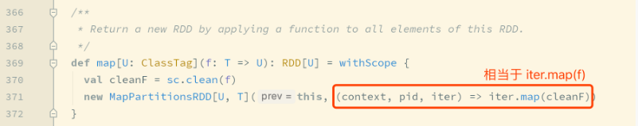

  - `map` 算子生成了 `MapPartitionsRDD`

    由源码可知, 当 `val rdd2 = rdd1.map()` 的时候, 其实生成的新 `RDD` 是 `rdd2`, `rdd2` 的类型是 `MapPartitionsRDD`, 每个 `RDD` 中的五大属性都会有一些不同, 由 `map` 算子生成的 `RDD` 中的计算函数, 本质上就是遍历对应分区的数据, 将每一个数据转成另外的形式

  - `MapPartitionsRDD` 的计算函数是 `collection.map( function )`

    真正运行的集群中的处理单元是 `Task`, 每个 `Task` 对应一个 `RDD` 的分区, 所以 `collection` 对应一个 `RDD` 分区的所有数据, 而这个计算的含义就是将一个 `RDD` 的分区上所有数据当作一个集合, 通过这个 `Scala` 集合的 `map` 算子, 来执行一个转换操作, 其转换操作的函数就是传入 `map` 算子的 `function`

  - 传入 `map` 算子的函数会被清理

    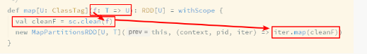

  这个清理主要是处理闭包中的依赖, 使得这个闭包可以被序列化发往不同的集群节点运行

- `flatMap` 算子的背后

  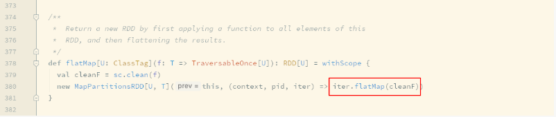

  `flatMap` 和 `map` 算子其实本质上是一样的, 其步骤和生成的 `RDD` 都是一样, 只是对于传入函数的处理不同, `map` 是 `collect.map( function )` 而 `flatMap` 是 `collect.flatMap( function )`

  从侧面印证了, 其实 `Spark` 中的 `flatMap` 和 `Scala` 基础中的 `flatMap` 其实是一样的

- `textRDD` → `splitRDD` → `tupleRDD`

  由 `textRDD` 到 `splitRDD` 再到 `tupleRDD` 的过程, 其实就是调用 `map` 和 `flatMap`算子生成新的 `RDD` 的过程, 所以如下图所示, 就是这个阶段所生成的逻辑计划
  
  

总结

- 如何生成 `RDD` ?

  生成 `RDD` 的常见方式有三种

  - 从本地集合创建
  - 从外部数据集创建
  - 从其它 `RDD` 衍生

  通过外部数据集创建 `RDD`, 是通过 `Hadoop` 或者其它外部数据源的 `SDK` 来进行数据读取, 同时如果外部数据源是有分片的话, `RDD` 会将分区与其分片进行对照

  通过其它 `RDD` 衍生的话, 其实本质上就是通过不同的算子生成不同的 `RDD` 的子类对象, 从而控制 `compute` 函数的行为来实现算子功能

- 生成哪些 `RDD` ?

  不同的算子生成不同的 `RDD`, 生成 `RDD` 的类型取决于算子, 例如 `map` 和 `flatMap` 都会生成 `RDD` 的子类 `MapPartitions` 的对象

- 如何计算 `RDD` 中的数据 ?

  虽然前面我们提到过 `RDD` 是偏向计算的, 但是其实 `RDD` 还只是表示数据, 纵观 `RDD` 的五大属性中有三个是必须的, 分别如下
  
  - `Partitions List` 分区列表
  - `Compute function` 计算函数
  - `Dependencies` 依赖
  
  虽然计算函数是和计算有关的, 但是只有调用了这个函数才会进行计算, `RDD` 显然不会自己调用自己的 `Compute` 函数, 一定是由外部调用的, 所以 `RDD` 更多的意义是用于表示数据集以及其来源, 和针对于数据的计算
  
  所以如何计算 `RDD` 中的数据呢? 一定是通过其它的组件来计算的, 而计算的规则, 由 `RDD` 中的 `Compute` 函数来指定, 不同类型的 `RDD` 子类有不同的 `Compute` 函数

#### 6.1.2. RDD 之间的依赖关系

导读

1. 讨论什么是 RDD 之间的依赖关系
2. 继而讨论 RDD 分区之间的关系
3. 最后确定 RDD 之间的依赖关系分类
4. 完善案例的逻辑关系图

- 什么是 `RDD` 之间的依赖关系?

  

  - 什么是关系(依赖关系) ?

    从算子视角上来看, `splitRDD` 通过 `map` 算子得到了 `tupleRDD`, 所以 `splitRDD` 和 `tupleRDD` 之间的关系是 `map`

    但是仅仅这样说, 会不够全面, 从细节上来看, `RDD` 只是数据和关于数据的计算, 而具体执行这种计算得出结果的是一个神秘的其它组件, 所以, 这两个 `RDD` 的关系可以表示为 `splitRDD` 的数据通过 `map` 操作, 被传入 `tupleRDD`, 这是它们之间更细化的关系

    但是 `RDD` 这个概念本身并不是数据容器, 数据真正应该存放的地方是 `RDD` 的分区, 所以如果把视角放在数据这一层面上的话, 直接讲这两个 RDD 之间有关系是不科学的, 应该从这两个 RDD 的分区之间的关系来讨论它们之间的关系

  - 那这些分区之间是什么关系?

    如果仅仅说 `splitRDD` 和 `tupleRDD` 之间的话, 那它们的分区之间就是一对一的关系

    但是 `tupleRDD` 到 `reduceRDD` 呢? `tupleRDD` 通过算子 `reduceByKey` 生成 `reduceRDD`, 而这个算子是一个 `Shuffle` 操作, `Shuffle`操作的两个 `RDD` 的分区之间并不是一对一, `reduceByKey` 的一个分区对应 `tupleRDD` 的多个分区

- `reduceByKey` 算子会生成 `ShuffledRDD`

  `reduceByKey` 是由算子 `combineByKey` 来实现的, `combineByKey` 内部会创建 `ShuffledRDD` 返回, 具体的代码请大家通过 `IDEA` 来进行查看, 此处不再截图, 而整个 `reduceByKey` 操作大致如下过程去掉两个 `reducer` 端的分区, 只留下一个的话, 如下所以, 对于 `reduceByKey` 这个 `Shuffle` 操作来说, `reducer` 端的一个分区, 会从多个 `mapper` 端的分区拿取数据, 是一个多对一的关系至此为止, 出现了两种分区见的关系了, 一种是一对一, 一种是多对一

- 整体上的流程图

  

#### 6.1.3. RDD 之间的依赖关系详解

导读

上个小节通过例子演示了 RDD 的分区间的关系有两种形式

- 一对一, 一般是直接转换
- 多对一, 一般是 Shuffle

本小节会说明如下问题:

1. 如果分区间得关系是一对一或者多对一, 那么这种情况下的 RDD 之间的关系的正式命名是什么呢?
2. RDD 之间的依赖关系, 具体有几种情况呢?

- 窄依赖

  假如 `rddB = rddA.transform(…)`, 如果 `rddB` 中一个分区依赖 `rddA` 也就是其父 `RDD` 的少量分区, 这种 `RDD` 之间的依赖关系称之为窄依赖换句话说, 子 RDD 的每个分区依赖父 RDD 的少量个数的分区, 这种依赖关系称之为窄依赖举个栗子`val sc = ...  val rddA = sc.parallelize(Seq(1, 2, 3)) val rddB = sc.parallelize(Seq("a", "b"))  /**   * 运行结果: (1,a), (1,b), (2,a), (2,b), (3,a), (3,b)   */ rddA.cartesian(rddB).collect().foreach(println(_))`上述代码的 `cartesian` 是求得两个集合的笛卡尔积上述代码的运行结果是 `rddA` 中每个元素和 `rddB` 中的所有元素结合, 最终的结果数量是两个 `RDD` 数量之和`rddC` 有两个父 `RDD`, 分别为 `rddA` 和 `rddB`对于 `cartesian` 来说, 依赖关系如下上述图形中清晰展示如下现象`rddC` 中的分区数量是两个父 `RDD` 的分区数量之乘积`rddA` 中每个分区对应 `rddC` 中的两个分区 (因为 `rddB` 中有两个分区), `rddB` 中的每个分区对应 `rddC` 中的三个分区 (因为 `rddA` 有三个分区)它们之间是窄依赖, 事实上在 `cartesian` 中也是 `NarrowDependency` 这个所有窄依赖的父类的唯一一次直接使用, 为什么呢?**因为所有的分区之间是拷贝关系, 并不是 Shuffle 关系**`rddC` 中的每个分区并不是依赖多个父 `RDD` 中的多个分区`rddC` 中每个分区的数量来自一个父 `RDD` 分区中的所有数据, 是一个 `FullDependence`, 所以数据可以直接从父 `RDD` 流动到子 `RDD`不存在一个父 `RDD` 中一部分数据分发过去, 另一部分分发给其它的 `RDD`

- 宽依赖

  并没有所谓的宽依赖, 宽依赖应该称作为 `ShuffleDependency`在 `ShuffleDependency` 的类声明上如下写到`Represents a dependency on the output of a shuffle stage.`上面非常清楚的说道, 宽依赖就是 `Shuffle` 中的依赖关系, 换句话说, 只有 `Shuffle`产生的地方才是宽依赖那么宽窄依赖的判断依据就非常简单明确了, **是否有 Shuffle ?**举个 `reduceByKey` 的例子, `rddB = rddA.reduceByKey( (curr, agg) ⇒ curr + agg )` 会产生如下的依赖关系`rddB` 的每个分区都几乎依赖 `rddA` 的所有分区对于 `rddA` 中的一个分区来说, 其将一部分分发给 `rddB` 的 `p1`, 另外一部分分发给 `rddB` 的 `p2`, 这不是数据流动, 而是分发

- 如何分辨宽窄依赖 ?

  其实分辨宽窄依赖的本身就是在分辨父子 `RDD` 之间是否有 `Shuffle`, 大致有以下的方法如果是 `Shuffle`, 两个 `RDD` 的分区之间不是单纯的数据流动, 而是分发和复制一般 `Shuffle` 的子 `RDD` 的每个分区会依赖父 `RDD` 的多个分区但是这样判断其实不准确, 如果想分辨某个算子是否是窄依赖, 或者是否是宽依赖, 则还是要取决于具体的算子, 例如想看 `cartesian` 生成的是宽依赖还是窄依赖, 可以通过如下步骤查看 `map` 算子生成的 `RDD`进去 `RDD` 查看 `getDependence` 方法

总结

- RDD 的逻辑图本质上是对于计算过程的表达, 例如数据从哪来, 经历了哪些步骤的计算
- 每一个步骤都对应一个 RDD, 因为数据处理的情况不同, RDD 之间的依赖关系又分为窄依赖和宽依赖 

#### 6.1.4. 常见的窄依赖类型

导读

常见的窄依赖其实也是有分类的, 而且宽窄以来不太容易分辨, 所以通过本章, 帮助同学明确窄依赖的类型

- 一对一窄依赖

  其实 `RDD` 中默认的是 `OneToOneDependency`, 后被不同的 `RDD` 子类指定为其它的依赖类型, 常见的一对一依赖是 `map` 算子所产生的依赖, 例如 `rddB = rddA.map(…)`

  

  每个分区之间一一对应, 所以叫做一对一窄依赖

- Range 窄依赖

  `Range` 窄依赖其实也是一对一窄依赖, 但是保留了中间的分隔信息, 可以通过某个分区获取其父分区, 目前只有一个算子生成这种窄依赖, 就是 `union` 算子, 例如 `rddC = rddA.union(rddB)`

  

  - `rddC` 其实就是 `rddA` 拼接 `rddB` 生成的, 所以 `rddC` 的 `p5` 和 `p6` 就是 `rddB` 的 `p1` 和 `p2`
  - 所以需要有方式获取到 `rddC` 的 `p5` 其父分区是谁, 于是就需要记录一下边界, 其它部分和一对一窄依赖一样

- 多对一窄依赖

  多对一窄依赖其图形和 `Shuffle` 依赖非常相似, 所以在遇到的时候, 要注意其 `RDD` 之间是否有 `Shuffle` 过程, 比较容易让人困惑, 常见的多对一依赖就是重分区算子 `coalesce`, 例如 `rddB = rddA.coalesce(2, shuffle = false)`, 但同时也要注意, 如果 `shuffle = true` 那就是完全不同的情况了因为没有 `Shuffle`, 所以这是一个窄依赖

- 再谈宽窄依赖的区别

  宽窄依赖的区别非常重要, 因为涉及了一件非常重要的事情: **如何计算 RDD ?**
  
  宽窄以来的核心区别是: **窄依赖的 RDD 可以放在一个 Task 中运行**

### 6.2. 物理执行图生成

1. 物理图的意义
2. 如何划分 Task
3. 如何划分 Stage

- 物理图的作用是什么?

  问题一: 物理图的意义是什么?

  物理图解决的其实就是 `RDD` 流程生成以后, 如何计算和运行的问题, 也就是如何把 RDD 放在集群中执行的问题

  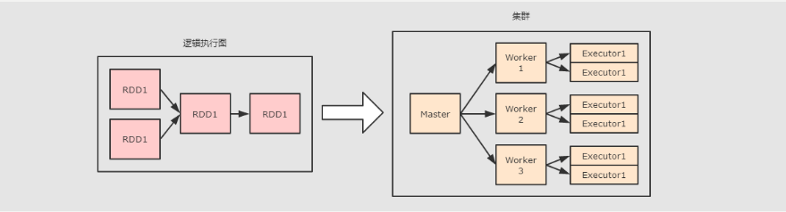

  问题二: 如果要确定如何运行的问题, 则需要先确定集群中有什么组件

  - 首先集群中物理元件就是一台一台的机器
  - 其次这些机器上跑的守护进程有两种: `Master`, `Worker`
    - 每个守护进程其实就代表了一台机器, 代表这台机器的角色, 代表这台机器和外界通信
    - 例如我们常说一台机器是 `Master`, 其含义是这台机器中运行了一个 `Master` 守护进程, 如果一台机器运行了 `Master` 的同时又运行了 `Worker`, 则说这台机器是 `Master` 也可以, 说它是 `Worker` 也行
  - 真正能运行 `RDD` 的组件是: `Executor`, 也就是说其实 `RDD` 最终是运行在 `Executor` 中的, 也就是说, 无论是 `Master` 还是 `Worker` 其实都是用于管理 `Executor` 和调度程序的

  结论是 `RDD` 一定在 `Executor` 中计算, 而 `Master` 和 `Worker` 负责调度和管理 `Executor`

  问题三: 物理图的生成需要考虑什么问题?

  - 要计算 `RDD`, 不仅要计算, 还要很快的计算 → 优化性能
  - 要考虑容错, 容错的常见手段是缓存 → `RDD` 要可以缓存

  结论是在生成物理图的时候, 不仅要考虑效率问题, 还要考虑一种更合适的方式, 让 `RDD` 运行的更好

- 谁来计算 RDD ?

  问题一: RDD 是什么, 用来做什么 ?

  回顾一下 `RDD` 的五个属性

  - `A list of partitions`
  - `A function for computing each split`
  - `A list of dependencies on other RDDs`
  - `Optionally, a Partitioner for key-value RDDs (e.g. to say that the RDD is hash-partitioned)`
  - `Optionally, a list of preferred locations to compute each split on (e.g. block locations for an HDFS file)`

  简单的说就是: 分区列表, 计算函数, 依赖关系, 分区函数, 最佳位置

  - 分区列表, 分区函数, 最佳位置, 这三个属性其实说的就是数据集在哪, 在哪更合适, 如何分区
  - 计算函数和依赖关系, 这两个属性其实说的是数据集从哪来

  所以结论是 `RDD` 是一个数据集的表示, 不仅表示了数据集, 还表示了这个数据集从哪来, 如何计算

  但是问题是, 谁来计算 ? 如果为一台汽车设计了一个设计图, 那么设计图自己生产汽车吗 ?

  问题二: 谁来计算 ?

  前面我们明确了两件事, `RDD` 在哪被计算? 在 `Executor` 中. `RDD` 是什么? 是一个数据集以及其如何计算的图纸.

  直接使用 `Executor` 也是不合适的, 因为一个计算的执行总是需要一个容器, 例如 `JVM` 是一个进程, 只有进程中才能有线程, 所以这个计算 `RDD` 的线程应该运行在一个进程中, 这个进程就是 `Exeutor`, `Executor` 有如下两个职责

  - 和 `Driver` 保持交互从而认领属于自己的任务

    

  - 接受任务后, 运行任务

  所以, 应该由一个线程来执行 `RDD` 的计算任务, 而 `Executor` 作为执行这个任务的容器, 也就是一个进程, 用于创建和执行线程, 这个执行具体计算任务的线程叫做 `Task`

- 问题三: Task 该如何设计 ?

  第一个想法是每个 `RDD` 都由一个 `Task` 来计算 第二个想法是一整个逻辑执行图中所有的 `RDD` 都由一组 `Task` 来执行 第三个想法是分阶段执行

  - 第一个想法: 为每个 RDD 的分区设置一组 Task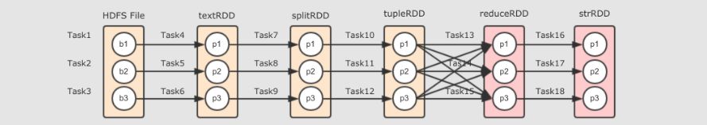大概就是每个 `RDD` 都有三个 `Task`, 每个 `Task` 对应一个 `RDD` 的分区, 执行一个分区的数据的计算

    但是这么做有一个非常难以解决的问题, 就是数据存储的问题, 例如 `Task 1, 4, 7, 10, 13, 16` 在同一个流程上, 但是这些 `Task` 之间需要交换数据, 因为这些 `Task` 可能被调度到不同的机器上上, 所以 `Task1` 执行完了数据以后需要暂存, 后交给 `Task4` 来获取

    这只是一个简单的逻辑图, 如果是一个复杂的逻辑图, 会有什么表现? 要存储多少数据? 无论是放在磁盘还是放在内存中, 是不是都是一种极大的负担?

  - **第二个想法: 让数据流动**

    很自然的, 第一个想法的问题是数据需要存储和交换, 那不存储不就好了吗? 对, 可以让数据流动起来

    第一个要解决的问题就是, 要为数据创建管道(`Pipeline`), 有了管道, 就可以流动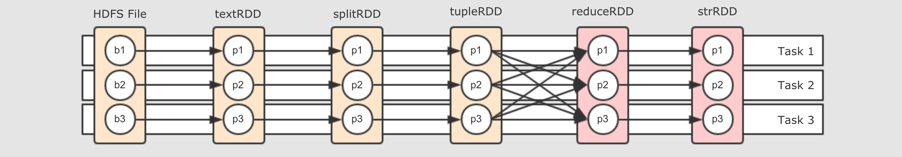简单来说, 就是为所有的 `RDD` 有关联的分区使用同一个 `Task`, 但是就没问题了吗? 请关注红框部分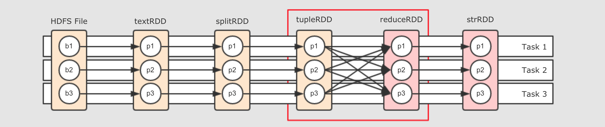这两个 `RDD` 之间是 `Shuffle` 关系, 也就是说, 右边的 `RDD` 的一个分区可能依赖左边 `RDD` 的所有分区, 这样的话, 数据在这个地方流不动了, 怎么办?

  - 第三个想法: 划分阶段既然在 `Shuffle` 处数据流不动了, 那就可以在这个地方中断一下, 后面 `Stage` 部分详解

- 如何划分阶段 ?

  为了减少执行任务, 减少数据暂存和交换的机会, 所以需要创建管道, 让数据沿着管道流动, 其实也就是原先每个 `RDD` 都有一组 `Task`, 现在改为所有的 `RDD` 共用一组 `Task`, 但是也有问题, 问题如下

  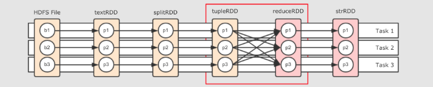

  就是说, 在 `Shuffle` 处, 必须断开管道, 进行数据交换, 交换过后, 继续流动, 所以整个流程可以变为如下样子

  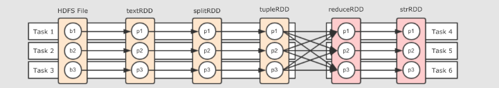

  把 `Task` 断开成两个部分, `Task4` 可以从 `Task 1, 2, 3` 中获取数据, 后 `Task4` 又作为管道, 继续让数据在其中流动

  但是还有一个问题, 说断开就直接断开吗? 不用打个招呼的呀? 这个断开即没有道理, 也没有规则, 所以可以为这个断开增加一个概念叫做阶段, 按照阶段断开, 阶段的英文叫做 `Stage`, 如下

  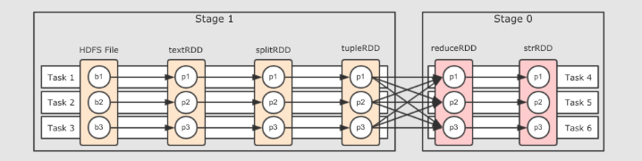

  所以划分阶段的本身就是设置断开点的规则, 那么该如何划分阶段呢?

  1. 第一步, 从最后一个 `RDD`, 也就是逻辑图中最右边的 `RDD` 开始, 向前滑动 `Stage` 的范围, 为 `Stage0`
  2. 第二步, 遇到 `ShuffleDependency` 断开 `Stage`, 从下一个 `RDD` 开始创建新的 `Stage`, 为 `Stage1`
  3. 第三步, 新的 `Stage` 按照同样的规则继续滑动, 直到包裹所有的 `RDD`

  总结来看, 就是针对于宽窄依赖来判断, 一个 `Stage` 中只有窄依赖, 因为只有窄依赖才能形成数据的 `Pipeline`.

  如果要进行 `Shuffle` 的话, 数据是流不过去的, 必须要拷贝和拉取. 所以遇到 `RDD` 宽依赖的两个 `RDD`时, 要切断这两个 `RDD` 的 `Stage`.

  > ![NOTE]
  >
  > 这样一个 RDD 依赖的链条, 我们称之为 RDD 的血统, 其中有宽依赖也有窄依赖

- 数据怎么流动 ?

  ```scala
  val sc = ...
  
  val textRDD = sc.parallelize(Seq("Hadoop Spark", "Hadoop Flume", "Spark Sqoop"))
  val splitRDD = textRDD.flatMap(_.split(" "))
  val tupleRDD = splitRDD.map((_, 1))
  val reduceRDD = tupleRDD.reduceByKey(_ + _)
  val strRDD = reduceRDD.map(item => s"${item._1}, ${item._2}")
  
  strRDD.collect.foreach(item => println(item))
  ```
  
  上述代码是这个章节我们一直使用的代码流程, 如下是其完整的逻辑执行图
  
  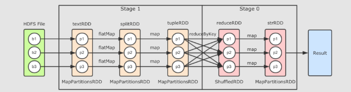
  
  如果放在集群中运行, 通过 `WebUI` 可以查看到如下 `DAG` 结构
  
  
  
  - Step 1: 从 `ResultStage` 开始执行
  
    最接近 `Result` 部分的 `Stage id` 为 0, 这个 `Stage` 被称之为 `ResultStage`
  
    由代码可以知道, 最终调用 `Action` 促使整个流程执行的是最后一个 `RDD`, `strRDD.collect`, 所以当执行 `RDD` 的计算时候, 先计算的也是这个 `RDD`
  
  - Step 2: `RDD` 之间是有关联的
  
    前面已经知道, 最后一个 `RDD` 先得到执行机会, 先从这个 `RDD` 开始执行, 但是这个 `RDD` 中有数据吗 ? 如果没有数据, 它的计算是什么? 它的计算是从父 `RDD` 中获取数据, 并执行传入的算子的函数
  
    简单来说, 从产生 `Result` 的地方开始计算, 但是其 `RDD` 中是没数据的, 所以会找到父 `RDD` 来要数据, 父 `RDD` 也没有数据, 继续向上要, 所以, 计算从 `Result` 处调用, 但是从整个逻辑图中的最左边 `RDD` 开始, 类似一个递归的过程
  
    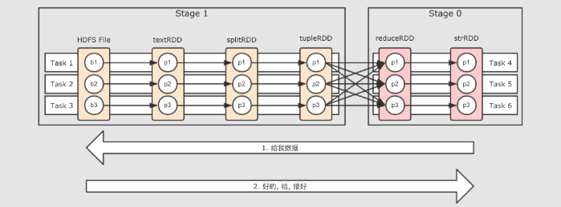

### 6.3. 调度过程

导读

1. 生成逻辑图和物理图的系统组件
2. `Job` 和 `Stage`, `Task` 之间的关系
3. 如何调度 `Job`

- 逻辑图

  是什么 怎么生成 具体怎么生成

  ```scala
  val textRDD = sc.parallelize(Seq("Hadoop Spark", "Hadoop Flume", "Spark Sqoop"))
  val splitRDD = textRDD.flatMap(_.split(" "))
  val tupleRDD = splitRDD.map((_, 1))
  val reduceRDD = tupleRDD.reduceByKey(_ + _)
  val strRDD = reduceRDD.map(item => s"${item._1}, ${item._2}")
  ```

  - 逻辑图如何生成

    上述代码在 `Spark Application` 的 `main` 方法中执行, 而 `Spark Application` 在 `Driver` 中执行, 所以上述代码在 `Driver` 中被执行, 那么这段代码执行的结果是什么呢?

    一段 `Scala` 代码的执行结果就是最后一行的执行结果, 所以上述的代码, 从逻辑上执行结果就是最后一个 `RDD`, 最后一个 `RDD` 也可以认为就是逻辑执行图, 为什么呢?

    例如 `rdd2 = rdd1.map(…)` 中, 其实本质上 `rdd2` 是一个类型为 `MapPartitionsRDD` 的对象, 而创建这个对象的时候, 会通过构造函数传入当前 `RDD` 对象, 也就是父 `RDD`, 也就是调用 `map` 算子的 `rdd1`, `rdd1` 是 `rdd2` 的父 `RDD`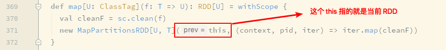一个 `RDD` 依赖另外一个 `RDD`, 这个 `RDD` 又依赖另外的 `RDD`, 一个 `RDD` 可以通过 `getDependency`获得其父 `RDD`, 这种环环相扣的关系, 最终从最后一个 `RDD` 就可以推演出前面所有的 `RDD`

  - **逻辑图是什么, 干啥用**

    逻辑图其实本质上描述的就是数据的计算过程, 数据从哪来, 经过什么样的计算, 得到什么样的结果, 再执行什么计算, 得到什么结果

  可是数据的计算是描述好了, 这种计算该如何执行呢?

- 物理图

  数据的计算表示好了, 该正式执行了, 但是如何执行? 如何执行更快更好更酷? 就需要为其执行做一个规划, 所以需要生成物理执行图

  ```scala
  strRDD.collect.foreach(item => println(item))
  ```

  上述代码其实就是最后的一个 `RDD` 调用了 `Action` 方法, 调用 `Action` 方法的时候, 会请求一个叫做 `DAGScheduler` 的组件, `DAGScheduler` 会创建用于执行 `RDD` 的 `Stage` 和 `Task`

  `DAGScheduler` 是一个由 `SparkContext` 创建, 运行在 `Driver` 上的组件, 其作用就是将由 `RDD` 构建出来的逻辑计划, 构建成为由真正在集群中运行的 `Task` 组成的物理执行计划, `DAGScheduler` 主要做如下三件事

  1. 帮助每个 `Job` 计算 `DAG` 并发给 `TaskSheduler` 调度
  2. 确定每个 `Task` 的最佳位置
  3. 跟踪 `RDD` 的缓存状态, 避免重新计算

  从字面意思上来看, `DAGScheduler` 是调度 `DAG` 去运行的, `DAG` 被称作为有向无环图, 其实可以将 `DAG` 理解为就是 `RDD` 的逻辑图, 其呈现两个特点: `RDD` 的计算是有方向的, `RDD` 的计算是无环的, 所以 `DAGScheduler` 也可以称之为 `RDD Scheduler`, 但是真正运行在集群中的并不是 `RDD`, 而是 `Task` 和 `Stage`, `DAGScheduler` 负责这种转换

- `Job` 是什么 ?

  - `Job` 什么时候生成 ?

    当一个 `RDD` 调用了 `Action` 算子的时候, 在 `Action` 算子内部, 会使用 `sc.runJob()` 调用 `SparkContext` 中的 `runJob` 方法, 这个方法又会调用 `DAGScheduler` 中的 `runJob`, 后在 `DAGScheduler` 中使用消息驱动的形式创建 `Job`

    简而言之, `Job` 在 `RDD` 调用 `Action` 算子的时候生成, 而且调用一次 `Action` 算子, 就会生成一个 `Job`, 如果一个 `SparkApplication` 中调用了多次 `Action` 算子, 会生成多个 `Job` 串行执行, 每个 `Job` 独立运作, 被独立调度, 所以 `RDD` 的计算也会被执行多次

  - `Job` 是什么 ?

    如果要将 `Spark` 的程序调度到集群中运行, `Job` 是粒度最大的单位, 调度以 `Job` 为最大单位, 将 `Job` 拆分为 `Stage` 和 `Task` 去调度分发和运行, 一个 `Job` 就是一个 `Spark` 程序从 `读取 → 计算 → 运行` 的过程

    一个 `Spark Application` 可以包含多个 `Job`, 这些 `Job` 之间是串行的, 也就是第二个 `Job` 需要等待第一个 `Job` 的执行结束后才会开始执行

- `Job` 和 `Stage` 的关系

  `Job` 是一个最大的调度单位, 也就是说 `DAGScheduler` 会首先创建一个 `Job` 的相关信息, 后去调度 `Job`, 但是没办法直接调度 `Job`, 比如说现在要做一盘手撕包菜, 不可能直接去炒一整颗包菜, 要切好撕碎, 再去炒

  - 为什么 `Job` 需要切分 ?

    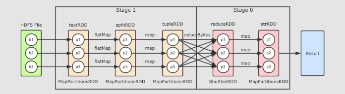

    - 因为 `Job` 的含义是对整个 `RDD` 血统求值, 但是 `RDD` 之间可能会有一些宽依赖

    - 如果遇到宽依赖的话, 两个 `RDD` 之间需要进行数据拉取和复制

      如果要进行拉取和复制的话, 那么一个 `RDD` 就必须等待它所依赖的 `RDD` 所有分区先计算完成, 然后再进行拉取

    - 由上得知, 一个 `Job` 是无法计算完整个 `RDD` 血统的

  - 如何切分 ?

    创建一个 `Stage`, 从后向前回溯 `RDD`, 遇到 `Shuffle` 依赖就结束 `Stage`, 后创建新的 `Stage` 继续回溯. 这个过程上面已经详细的讲解过, 但是问题是切分以后如何执行呢, 从后向前还是从前向后, 是串行执行多个 `Stage`, 还是并行执行多个 `Stage`

  - 问题一: 执行顺序

    在图中, `Stage 0` 的计算需要依赖 `Stage 1` 的数据, 因为 `reduceRDD` 中一个分区可能需要多个 `tupleRDD` 分区的数据, 所以 `tupleRDD` 必须先计算完, 所以, 应该在逻辑图中自左向右执行 `Stage`

  - 问题二: 串行还是并行

    还是同样的原因, `Stage 0` 如果想计算, `Stage 1` 必须先计算完, 因为 `Stage 0` 中每个分区都依赖 `Stage 1` 中的所有分区, 所以 `Stage 1` 不仅需要先执行, 而且 `Stage 1` 执行完之前 `Stage 0` 无法执行, 它们只能串行执行

  - 总结

    - 一个 `Stage` 就是物理执行计划中的一个步骤, 一个 `Spark Job` 就是划分到不同 `Stage` 的计算过程
    - `Stage` 之间的边界由 `Shuffle` 操作来确定
      - `Stage` 内的 `RDD` 之间都是窄依赖, 可以放在一个管道中执行
      - 而 `Shuffle` 后的 `Stage` 需要等待前面 `Stage` 的执行

    `Stage` 有两种

    - `ShuffMapStage`, 其中存放窄依赖的 `RDD`
    - `ResultStage`, 每个 `Job` 只有一个, 负责计算结果, 一个 `ResultStage` 执行完成标志着整个 `Job` 执行完毕

- `Stage` 和 `Task` 的关系

  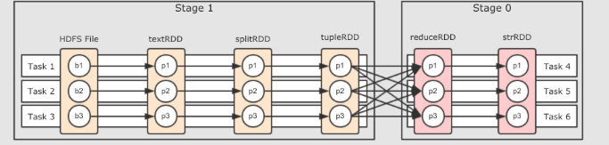

  前面我们说到 `Job` 无法直接执行, 需要先划分为多个 `Stage`, 去执行 `Stage`, 那么 `Stage` 可以直接执行吗?

  - 第一点: `Stage` 中的 `RDD` 之间是窄依赖

    因为 `Stage` 中的所有 `RDD` 之间都是窄依赖, 窄依赖 `RDD` 理论上是可以放在同一个 `Pipeline(管道, 流水线)` 中执行的, 似乎可以直接调度 `Stage` 了? 其实不行, 看第二点

  - 第二点: 别忘了 `RDD` 还有分区

    一个 `RDD` 只是一个概念, 而真正存放和处理数据时, 都是以分区作为单位的

    `Stage` 对应的是多个整体上的 `RDD`, 而真正的运行是需要针对 `RDD` 的分区来进行的

  - 第三点: 一个 `Task` 对应一个 `RDD` 的分区

    一个比 `Stage` 粒度更细的单元叫做 `Task`, `Stage` 是由 `Task` 组成的, 之所以有 `Task` 这个概念, 是因为 `Stage` 针对整个 `RDD`, 而计算的时候, 要针对 `RDD` 的分区

    假设一个 `Stage` 中有 10 个 `RDD`, 这些 `RDD` 中的分区各不相同, 但是分区最多的 `RDD` 有 30 个分区, 而且很显然, 它们之间是窄依赖关系

    那么, 这个 `Stage` 中应该有多少 `Task` 呢? 应该有 30 个 `Task`, 因为一个 `Task` 计算一个 `RDD` 的分区. 这个 `Stage` 至多有 30 个分区需要计算

  - 总结

    - 一个 `Stage` 就是一组并行的 `Task` 集合
    - Task 是 Spark 中最小的独立执行单元, 其作用是处理一个 RDD 分区
    - 一个 Task 只可能存在于一个 Stage 中, 并且只能计算一个 RDD 的分区

- TaskSet

  梳理一下这几个概念, `Job > Stage > Task`, `Job 中包含 Stage 中包含 Task`
  
  而 `Stage` 中经常会有一组 `Task` 需要同时执行, 所以针对于每一个 `Task` 来进行调度太过繁琐, 而且没有意义, 所以每个 `Stage` 中的 `Task` 们会被收集起来, 放入一个 `TaskSet` 集合中
  
  - 一个 `Stage` 对应一个 `TaskSet`
  - `TaskSet` 中 `Task` 的个数由 `Stage` 中的最大分区数决定

**整体执行流程**

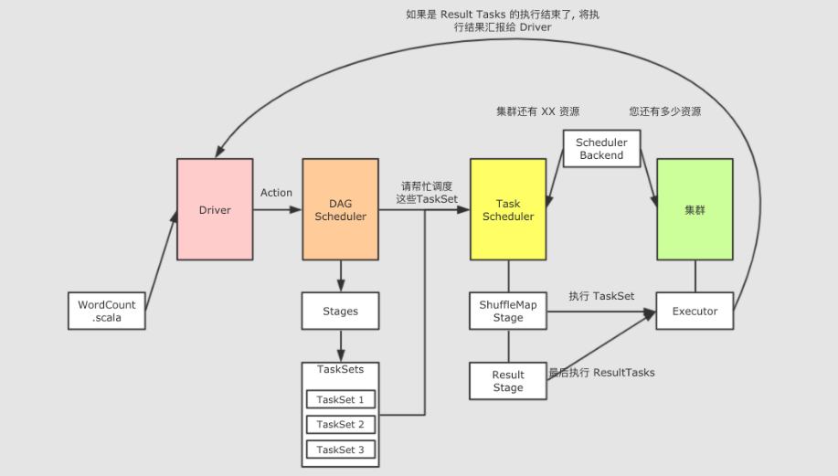

### 6.4. Shuffle 过程

导读

本章节重点是介绍 `Shuffle` 的流程, 因为根据 `ShuffleWriter` 的实现不同, 其过程也不同, 所以前半部分根据默认的存储引擎 `SortShuffleWriter` 来讲解

后半部分简要介绍一下其它的 `ShuffleWriter`

- `Shuffle` 过程的组件结构

  从整体视角上来看, `Shuffle` 发生在两个 `Stage` 之间, 一个 `Stage` 把数据计算好, 整理好, 等待另外一个 `Stage` 来拉取

  

  放大视角, 会发现, 其实 `Shuffle` 发生在 `Task` 之间, 一个 `Task` 把数据整理好, 等待 `Reducer` 端的 `Task` 来拉取

  

  如果更细化一下, `Task` 之间如何进行数据拷贝的呢? 其实就是一方 `Task` 把文件生成好, 然后另一方 `Task` 来拉取

  

  现在是一个 `Reducer` 的情况, 如果有多个 `Reducer` 呢? 如果有多个 `Reducer` 的话, 就可以在每个 `Mapper` 为所有的 `Reducer` 生成各一个文件, 这种叫做 `Hash base shuffle`, 这种 `Shuffle` 的方式问题大家也知道, 就是生成中间文件过多, 而且生成文件的话需要缓冲区, 占用内存过大

  

  那么可以把这些文件合并起来, 生成一个文件返回, 这种 `Shuffle` 方式叫做 `Sort base shuffle`, 每个 `Reducer` 去文件的不同位置拿取数据

  

  如果再细化一下, 把参与这件事的组件也放置进去, 就会是如下这样

  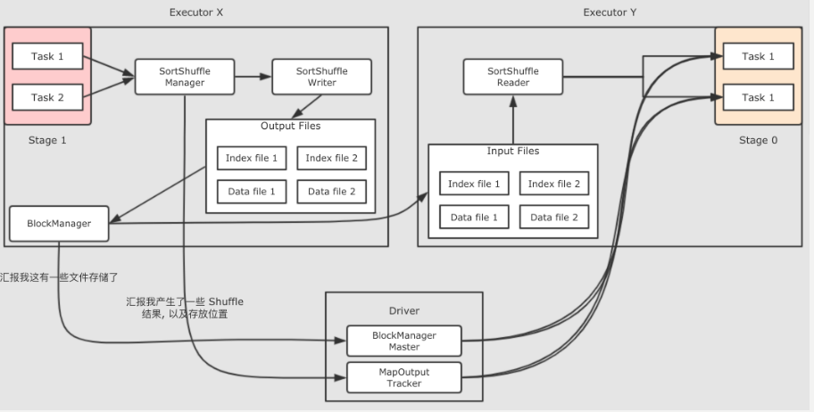

- 有哪些 `ShuffleWriter` ?

  大致上有三个 `ShufflWriter`, `Spark` 会按照一定的规则去使用这三种不同的 `Writer`

  - `BypassMergeSortShuffleWriter`

    这种 `Shuffle Writer` 也依然有 `Hash base shuffle` 的问题, 它会在每一个 `Mapper` 端对所有的 `Reducer` 生成一个文件, 然后再合并这个文件生成一个统一的输出文件, 这个过程中依然是有很多文件产生的, 所以只适合在小量数据的场景下使用

    `Spark` 有考虑去掉这种 `Writer`, 但是因为结构中有一些依赖, 所以一直没去掉

    当 `Reducer` 个数小于 `spark.shuffle.sort.bypassMergeThreshold`, 并且没有 `Mapper` 端聚合的时候启用这种方式

  - `SortShuffleWriter`

    这种 `ShuffleWriter` 写文件的方式非常像 `MapReduce` 了, 后面详说

    当其它两种 `Shuffle` 不符合开启条件时, 这种 `Shuffle` 方式是默认的

  - `UnsafeShuffleWriter`

    这种 `ShuffWriter` 会将数据序列化, 然后放入缓冲区进行排序, 排序结束后 `Spill` 到磁盘, 最终合并 `Spill` 文件为一个大文件, 同时在进行内存存储的时候使用了 `Java` 得 `Unsafe API`, 也就是使用堆外内存, 是钨丝计划的一部分

    也不是很常用, 只有在满足如下三个条件时候才会启用

    - 序列化器序列化后的数据, 必须支持排序
    - 没有 `Mapper` 端的聚合
    - `Reducer` 的个数不能超过支持的上限 (2 ^ 24)

- `SortShuffleWriter` 的执行过程

  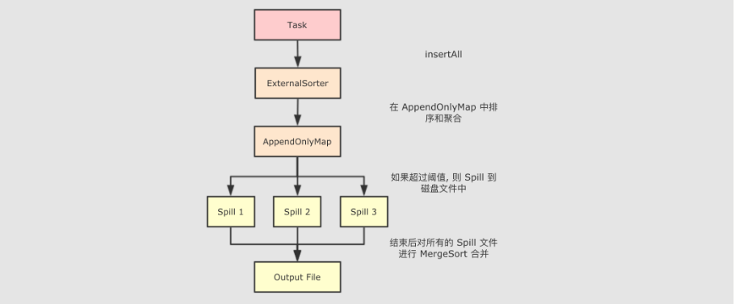
  
  整个 `SortShuffleWriter` 如上述所说, 大致有如下几步
  
  1. 首先 `SortShuffleWriter` 在 `write` 方法中回去写文件, 这个方法中创建了 `ExternalSorter`
  2. `write` 中将数据 `insertAll` 到 `ExternalSorter` 中
  3. 在 `ExternalSorter` 中排序
     1. 如果要聚合, 放入 `AppendOnlyMap` 中, 如果不聚合, 放入 `PartitionedPairBuffer` 中
     2. 在数据结构中进行排序, 排序过程中如果内存数据大于阈值则溢写到磁盘
  4. 使用 `ExternalSorter` 的 `writePartitionedFile` 写入输入文件
     1. 将所有的溢写文件通过类似 `MergeSort` 的算法合并
     2. 将数据写入最终的目标文件中

## 7. RDD 的分布式共享变量

目标

1. 理解闭包以及 Spark 分布式运行代码的根本原理
2. 理解累加变量的使用场景
3. 理解广播的使用场景

什么是闭包

闭包是一个必须要理解, 但是又不太好理解的知识点, 先看一个小例子

```scala
//编写一个高价函数,在这个函数内要有一个变量,返回一个函数,通过这个变量完成一个计算
@Test
def test(): Unit = {
  val areaFunction = closure()
  val area = areaFunction(2)
  println(area)
}
//返回一个新的函数
def closure(): Int => Double = {
  val factor = 3.14
  val areaFunction = (r: Int) => math.pow(r, 2) * factor
  areaFunction
}
```

上述例子中, `closure`方法返回的一个函数的引用, 其实就是一个闭包, 闭包本质上就是一个封闭的作用域, 要理解闭包, 是一定要和作用域联系起来的.

- 能否在 `test` 方法中访问 `closure` 定义的变量?

  ```scala
  @Test
  def test(): Unit = {
    println(factor)
  }
  
  def closure(): Int => Double = {
    val factor = 3.14
  }
  ```

- 有没有什么间接的方式?

  ````scala
  
  @Test
  def test(): Unit = {
    val areaFunction = closure()
      
    areaFunction(5)
      
  }
  
  def closure(): () => Unit = {
    val factor = 3.14
    val areaFunction = () => println(factor)
    areaFunction
  }
  ````

- 什么是闭包?

  ```scala
  val areaFunction = closure()
  areaFunction()
  ```
  
  通过 `closure` 返回的函数 `areaFunction` 就是一个闭包, 其函数内部的作用域并不是 `test` 函数的作用域, 这种连带作用域一起打包的方式, 我们称之为闭包, 在 Scala 中
  
  - Scala 中的闭包本质上就是一个对象, 是 FunctionX 的实例

分发闭包

```scala
sc.textFile("dataset/access_log_sample.txt")
  .flatMap(item => item.split(""))
  .collect()
```

上述这段代码中, `flatMap` 中传入的是另外一个函数, 传入的这个函数就是一个闭包, 这个闭包会被序列化运行在不同的 Executor 中


```scala
class MyClass {
  val field = "Hello"

  def doStuff(rdd: RDD[String]): RDD[String] = {
      //闭包就是:调用不属于自己作用域的参数的函数
    rdd.map(x => field + x)
  }
    
    //使用广播变量之后, field的个数=executor的个数
    //不使用广播变量之后,field个数=task的个数
}
```

这段代码中的闭包就有了一个依赖, 依赖于外部的一个类, 因为传递给算子的函数最终要在 Executor 中运行, 所以需要 **序列化** `MyClass` 发给每一个 `Executor`, 从而在 `Executor`访问 `MyClass` 对象的属性


总结

1. 闭包就是一个封闭的作用域, 闭包的本质就是一个函数,也是一个对象(在scala中函数是一个特殊的类型,FunctionX)
2. Spark 算子所接受的函数, 本质上是一个闭包, 因为其需要封闭作用域, 并且序列化自身和依赖, 分发到不同的节点中运行

### 7.1. 累加器

- 一个小问题

  ```scala
  var count = 0
  
  val config = new SparkConf().setAppName("ip_ana").setMaster("local[6]")
  val sc = new SparkContext(config)
  
  sc.parallelize(Seq(1, 2, 3, 4, 5))
    .foreach(count += _)
  
  println(count) //0
  ```

  上面这段代码是一个非常错误的使用, 请不要仿照, 这段代码只是为了证明一些事情

  先明确两件事, `var count = 0` 是在 Driver 中定义的, `foreach(count += _)` 这个算子以及传递进去的闭包运行在 Executor 中

  这段代码整体想做的事情是累加一个变量, 但是这段代码的写法却做不到这件事, 原因也很简单, 因为具体的算子是闭包, 被分发给不同的节点运行, 所以这个闭包中累加的并不是 Driver 中的这个变量

- 全局累加器

  Accumulators(累加器) 是一个只支持 `added`(添加) 的分布式变量, 可以在分布式环境下保持一致性, 并且能够做到高效的并发.

  原生 Spark 支持数值型的累加器, 可以用于实现计数或者求和, 开发者也可以使用自定义累加器以实现更高级的需求

  ```scala
  val config = new SparkConf().setAppName("ip_ana").setMaster("local[6]")
  val sc = new SparkContext(config)
  
  val counter = sc.longAccumulator("counter")
  
  sc.parallelize(Seq(1, 2, 3, 4, 5))
    .foreach(counter.add(_))
  
  // 运行结果: 15
  println(counter.value)
  ```

  注意点:

  - Accumulator 是支持并发并行的, 在任何地方都可以通过 `add` 来修改数值, 无论是 Driver 还是 Executor
  - 只能在 Driver 中才能调用 `value` 来获取数值

  在 WebUI 中关于 Job 部分也可以看到 Accumulator 的信息, 以及其运行的情况

  

  累计器件还有两个小特性,

   第一, 累加器能保证在 Spark 任务出现问题被重启的时候不会出现重复计算. 

  第二, 累加器只有在 Action 执行的时候才会被触发.

  ```scala
  val config = new SparkConf().setAppName("ip_ana").setMaster("local[6]")
  val sc = new SparkContext(config)
  
  val counter = sc.longAccumulator("counter")
  
  sc.parallelize(Seq(1, 2, 3, 4, 5))
    .map(counter.add(_)) // 这个地方不是 Action, 而是一个 Transformation
  
  // 运行结果是 0
  println(counter.value)
  ```

- 自定义累加器

  开发者可以通过自定义累加器来实现更多类型的累加器, 累加器的作用远远不只是累加, 比如可以实现一个累加器, 用于向里面添加一些运行信息
  
  ```scala
  class InfoAccumulator extends AccumulatorV2[String, Set[String]] {
    //定义一个类型
      private val infos: mutable.Set[String] = mutable.Set()
  
    //告诉spark框架,这个累加器对象是否为空的
    override def isZero: Boolean = {
      infos.isEmpty
    }
    //提供给spark框架一个拷贝的累加器
    override def copy(): AccumulatorV2[String, Set[String]] = {
      //创建新的累加器
      val newAccumulator = new InfoAccumulator()
      //保证线程安全,加锁
        infos.synchronized {
        newAccumulator.infos ++= this.infos
      }
      newAccumulator
    }
    //提供清理内容的功能,帮助spark框架,清理累加器的内容
    override def reset(): Unit = {
      infos.clear()
    }
    //外部传入要累加的内容,在这个方法中进行累加
    override def add(v: String): Unit = {
      infos += v
    }
    //累加器在进行累加的时候,可能每个分布式节点都有一个实例
      //在最后Driver进行一次合并,把所有的实例的内容合并起来,会调用这个merge方法进行合并
    override def merge(other: AccumulatorV2[String, Set[String]]): Unit = {
      infos ++= other.value
    }
      
  //提供给外部累加结果
      //为什么要给不可变的(val),因为外部有可能再进行修改,如果是可变的集合,其外部的修改会影响的内部的值
    override def value: Set[String] = {
      infos.toSet
    }
  }
  
  @Test
  def accumulator2(): Unit = {
    val config = new SparkConf().setAppName("ip_ana").setMaster("local[6]")
    val sc = new SparkContext(config)
  
    val infoAccumulator = new InfoAccumulator()
      //注册累加器给spark,
    sc.register(infoAccumulator, "infos")
  
    sc.parallelize(Seq("1", "2", "3"))
      .foreach(item => infoAccumulator.add(item))
  
    // 运行结果: Set(3, 1, 2)
    println(infoAccumulator.value)
  
    sc.stop()
  }
  ```
  
  注意点:
  
  - 可以通过继承 `AccumulatorV2` 来创建新的累加器
  - 有几个方法需要重写
    - reset 方法用于把累加器重置为 0
    - add 方法用于把其它值添加到累加器中
    - merge 方法用于指定如何合并其他的累加器
  - `value` 需要返回一个不可变的集合, 因为不能因为外部的修改而影响自身的值

### 7.2. 广播变量

目标

1. 理解为什么需要广播变量, 以及其应用场景
2. 能够通过代码使用广播变量

- 广播变量的作用

  广播变量允许开发者将一个 `Read-Only` 的变量缓存到集群中每个节点中, 而不是传递给每一个 Task 一个副本.

  - 集群中每个节点, 指的是一个机器
  - 每一个 Task, 一个 Task 是一个 Stage 中的最小处理单元, 一个 Executor 中可以有多个 Stage, 每个 Stage 有多个 Task

  所以在需要跨多个 Stage 的多个 Task 中使用相同数据的情况下, 广播特别的有用

  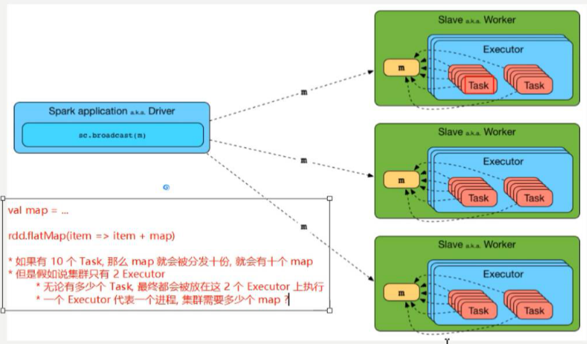

- 广播变量的API

  | 方法名      | 描述                                   |
  | :---------- | :------------------------------------- |
  | `id`        | 唯一标识                               |
  | `value`     | 广播变量的值                           |
  | `unpersist` | 在 Executor 中异步的删除缓存副本       |
  | `destroy`   | 销毁所有此广播变量所关联的数据和元数据 |
  | `toString`  | 字符串表示                             |

  - 使用广播变量的一般套路

    可以通过如下方式创建广播变量

    ```scala
    val b = sc.broadcast(1)
    ```

    如果 Log 级别为 DEBUG 的时候, 会打印如下信息

    ````text
    DEBUG BlockManager: Put block broadcast_0 locally took  430 ms
    DEBUG BlockManager: Putting block broadcast_0 without replication took  431 ms
    DEBUG BlockManager: Told master about block broadcast_0_piece0
    DEBUG BlockManager: Put block broadcast_0_piece0 locally took  4 ms
    DEBUG BlockManager: Putting block broadcast_0_piece0 without replication took  4 ms
    ````

    创建后可以使用 `value` 获取数据

    ```scala
    b.value
    ```

    获取数据的时候会打印如下信息

    ````text
    DEBUG BlockManager: Getting local block broadcast_0
    DEBUG BlockManager: Level for block broadcast_0 is StorageLevel(disk, memory, deserialized, 1 replicas)
    ````

    广播变量使用完了以后, 可以使用 `unpersist` 删除数据

    ```scala
    b.unpersist
    ```

    删除数据以后, 可以使用 `destroy` 销毁变量, 释放内存空间

    ```scala
    b.destroy
    ```

    销毁以后, 会打印如下信息

    ````text
    DEBUG BlockManager: Removing broadcast 0
    DEBUG BlockManager: Removing block broadcast_0_piece0
    DEBUG BlockManager: Told master about block broadcast_0_piece0
    DEBUG BlockManager: Removing block broadcast_0
    ````

  - **使用** `value` **方法的注意点**

    方法签名 `value: T`

    在 `value` 方法内部会确保使用获取数据的时候, 变量必须是可用状态, 所以必须在变量被 `destroy`之前使用 `value` 方法, 如果使用 `value` 时变量已经失效, 则会爆出以下错误

    ````text
    org.apache.spark.SparkException: Attempted to use Broadcast(0) after it was destroyed (destroy at <console>:27)
      at org.apache.spark.broadcast.Broadcast.assertValid(Broadcast.scala:144)
      at org.apache.spark.broadcast.Broadcast.value(Broadcast.scala:69)
      ... 48 elided
    ````

  - 使用 `destroy` 方法的注意点

    方法签名 `destroy(): Unit`

    `destroy` 方法会移除广播变量, 彻底销毁掉, 但是如果你试图多次 `destroy` 广播变量, 则会爆出以下错误

    ```text
    org.apache.spark.SparkException: Attempted to use Broadcast(0) after it was destroyed (destroy at <console>:27)
      at org.apache.spark.broadcast.Broadcast.assertValid(Broadcast.scala:144)
      at org.apache.spark.broadcast.Broadcast.destroy(Broadcast.scala:107)
      at org.apache.spark.broadcast.Broadcast.destroy(Broadcast.scala:98)
      ... 48 elided
    ```

  - 案例

    ```scala
    class Broadcast{
        /*
         *资源内存占用比较大,有十个对应的value
         */
        @Test
        def bc1(){
    	
            //数据,假装数量很大,大概一百兆
            val v = Map("spark"->"http://spark.apache.cn","scala"->"http://www.scala-lang.org")
            
            val config = new SparkConf().setMaster("local[6]").setAppName("bc")
            
            val sc = new SparkContext(config)
            //将其中的spark和scala转换为对应的网址
            val r = sc.parallelize(Seq("spark","scala"))
            val result = r.map(item=>v(item)).collect()
            
            println(result)
        }
    
        
        /**
          *使用广播,大幅度减少value的复制
          */
        @Test
        def bc2(){
    	
            //数据,假装数量很大,大概一百兆
            val v = Map("spark"->"http://spark.apache.cn","scala"->"http://www.scala-lang.org")
            
            val config = new SparkConf().setMaster("local[6]").setAppName("bc")
            
            val sc = new SparkContext(config)
            //创建广播
            val bc =sc.broadcast(v)
            
            //将其中的spark和scala转换为对应的网址
            val r = sc.parallelize(Seq("spark","scala"))
            //在算子中使用广播变量代替直接引用集合,只会复制和executor一样的数量
            val result = r.map(item=>bc.value(item)).collect()
            
            println(result)
        }
        
        //学生表,班级表sql操作
        @Test
        def broadcast(){
             val config = new SparkConf().setMaster("local[6]").setAppName("jion")
            
            val sc = new SparkContext(config)
            
            //学生表:(id,name,classid)
            //班级表:(id,name)
            val studentRDD = sc.parallelize(Seq((1,"张三","class_01"),(2,"李四","class_02"),(3,"王五","class_02")))
            
            val classRDD = sc.paralleize(Seq(("class_01","python"),("class_02","java")))
            
            //select s.id,s.name,c.name from student s left join class c on s.classid=c.id
            val sRDD = studentRDD.map(item=>(item._3,item))
            val studentAndClassRdd = sRDD.leftOuterJoin(classRDD)
            
            val result = studentAndClassRdd.map{
                case (classId,((id,name,sClassId),className))=>{
                    (id,name,className.getOrElse(""))
                }
            }.collect()
            println(result.toBuffer)
        }
    }
    ```

    未使用广播变量操作的DAG图片结果:

    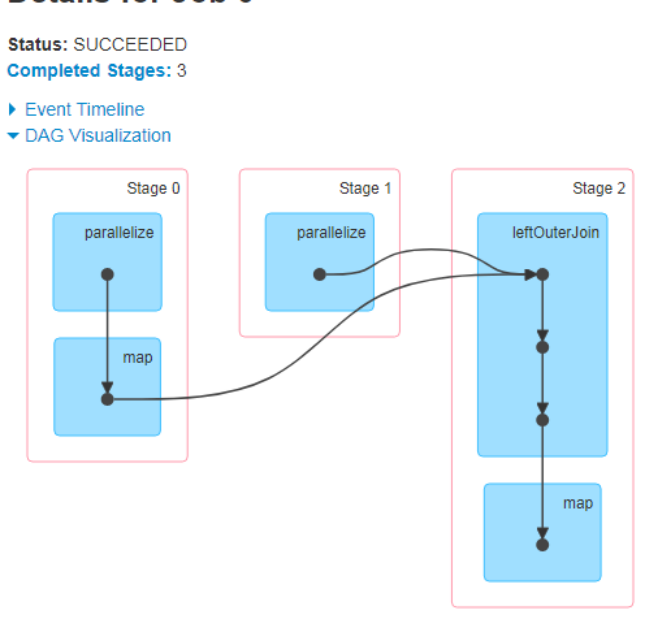

    使用广播变量的方法

  ````
   //学生表,班级表sql操作
      @Test
      def broadcast(){
           val config = new SparkConf().setMaster("local[6]").setAppName("jion")
          
          val sc = new SparkContext(config)
          
          //学生表:(id,name,classid)
          //班级表:(id,name)
          val studentRDD = sc.parallelize(Seq((1,"张三","class_01"),(2,"李四","class_02"),(3,"王五","class_02")))
          
          val classRDD = sc.paralleize(Seq(("class_01","python"),("class_02","java")))
          
          val classData = classRDD.collect()
          
          val classBc = sc.broadcast(classData)
          
          studentRDD.map(item=>{
              val className=classBc.value.toMap.getOrElse(item._3,"")
              (item._1,item._2,className)
          }).collect().foreach(println_)
          Thread.sleep(1000000000000000000)
      }
  ````

- 广播变量的使用场景

  假设我们在某个算子中需要使用一个保存了项目和项目的网址关系的 `Map[String, String]` 静态集合, 如下

  ```scala
  val pws = Map("Apache Spark" -> "http://spark.apache.org/", "Scala" -> "http://www.scala-lang.org/")
  
  val websites = sc.parallelize(Seq("Apache Spark", "Scala")).map(pws).collect
  ```

  上面这段代码是没有问题的, 可以正常运行的, 但是非常的低效, 因为虽然可能 `pws` 已经存在于某个 `Executor` 中了, 但是在需要的时候还是会继续发往这个 `Executor`, 如果想要优化这段代码, 则需要尽可能的降低网络开销

  可以使用广播变量进行优化, 因为广播变量会缓存在集群中的机器中, 比 `Executor` 在逻辑上更 "大"

  ```scala
  val pwsB = sc.broadcast(pws)
  val websites = sc.parallelize(Seq("Apache Spark", "Scala")).map(pwsB.value).collect
  ```

  上面两段代码所做的事情其实是一样的, 但是当需要运行多个 `Executor` (以及多个 `Task`) 的时候, 后者的效率更高

- 扩展

  正常情况下使用 Task 拉取数据的时候, 会将数据拷贝到 Executor 中多次, 但是使用广播变量的时候只会复制一份数据到 Executor 中, 所以在两种情况下特别适合使用广播变量

  - 一个 Executor 中有多个 Task 的时候
  - 一个变量比较大的时候

  而且在 Spark 中还有一个约定俗称的做法, 当一个 RDD 很大并且还需要和另外一个 RDD 执行 `join` 的时候, 可以将较小的 RDD 广播出去, 然后使用大的 RDD 在算子 `map` 中直接 `join`, 从而实现在 Map 端 `join`

  ```scala
  val acMap = sc.broadcast(myRDD.map { case (a,b,c,b) => (a, c) }.collectAsMap)
  val otherMap = sc.broadcast(myOtherRDD.collectAsMap)
  
  myBigRDD.map { case (a, b, c, d) =>
    (acMap.value.get(a).get, otherMap.value.get(c).get)
  }.collect
  ```

  一般情况下在这种场景下, 会广播 Map 类型的数据, 而不是数组, 因为这样容易使用 Key 找到对应的 Value 简化使用

总结

1. 广播变量用于将变量缓存在集群中的机器中, 避免机器内的 Executors 多次使用网络拉取数据
2. 广播变量的使用步骤: (1) 创建 (2) 在 Task 中获取值 (3) 销毁