SparkSQL
========

Table of Contents

*   [1\. SparkSQL 是什么](#_1_sparksql_是什么)
    *   [1.1. SparkSQL 的出现契机](#_1_1_sparksql_的出现契机)
    *   [1.2. SparkSQL 的适用场景](#_1_2_sparksql_的适用场景)
*   [2\. SparkSQL 初体验](#_2_sparksql_初体验)
    *   [2.3. RDD 版本的 WordCount](#_2_3_rdd_版本的_wordcount)
    *   [2.2. 命令式 API 的入门案例](#_2_2_命令式_api_的入门案例)
    *   [2.2. SQL 版本 WordCount](#_2_2_sql_版本_wordcount)
*   [3\. \[扩展\] Catalyst 优化器](#_3_扩展_catalyst_优化器)
    *   [3.1. RDD 和 SparkSQL 运行时的区别](#_3_1_rdd_和_sparksql_运行时的区别)
    *   [3.2. Catalyst](#_3_2_catalyst)
*   [4\. Dataset 的特点](#_4_dataset_的特点)
*   [5\. DataFrame 的作用和常见操作](#_5_dataframe_的作用和常见操作)
*   [6\. Dataset 和 DataFrame 的异同](#_6_dataset_和_dataframe_的异同)
*   [7\. 数据读写](#_7_数据读写)
    *   [7.1. 初识 DataFrameReader](#_7_1_初识_dataframereader)
    *   [7.2. 初识 DataFrameWriter](#_7_2_初识_dataframewriter)
    *   [7.3. 读写 Parquet 格式文件](#_7_3_读写_parquet_格式文件)
    *   [7.4. 读写 JSON 格式文件](#_7_4_读写_json_格式文件)
    *   [7.5. 访问 Hive](#_7_5_访问_hive)
    *   [7.6. JDBC](#_7_6_jdbc)
*   [8\. Dataset (DataFrame) 的基础操作](#_8_dataset_dataframe_的基础操作)
    *   [8.1. 有类型操作](#_8_1_有类型操作)
    *   [8.2. 无类型转换](#_8_2_无类型转换)
    *   [8.5. Column 对象](#_8_5_column_对象)
*   [9\. 缺失值处理](#_9_缺失值处理)
*   [10\. 聚合](#_10_聚合)
*   [11\. 连接](#_11_连接)
*   [12\. 窗口函数](#_12_窗口函数)
    *   [12.1. 第一名和第二名案例](#_12_1_第一名和第二名案例)
    *   [12.2. 窗口函数](#_12_2_窗口函数)
    *   [12.3. 最优差值案例](#_12_3_最优差值案例)

目标

1.  `SparkSQL` 是什么
    
2.  `SparkSQL` 如何使用
    

1\. SparkSQL 是什么
----------------

目标

对于一件事的理解, 应该分为两个大部分, 第一, 它是什么, 第二, 它解决了什么问题

1.  理解为什么会有 `SparkSQL`
    
2.  理解 `SparkSQL` 所解决的问题, 以及它的使命
    

### 1.1. SparkSQL 的出现契机

目标

理解 `SparkSQL` 是什么

主线

1.  历史前提
    
2.  发展过程
    
3.  重要性
    

数据分析的方式

数据分析的方式大致上可以划分为 `SQL` 和 命令式两种

命令式

在前面的 `RDD` 部分, 非常明显可以感觉的到是命令式的, 主要特征是通过一个算子, 可以得到一个结果, 通过结果再进行后续计算.

    sc.textFile("...")
      .flatMap(_.split(" "))
      .map((_, 1))
      .reduceByKey(_ + _)
      .collect()

命令式的优点

*   操作粒度更细, 能够控制数据的每一个处理环节
    
*   操作更明确, 步骤更清晰, 容易维护
    
*   支持非结构化数据的操作
    

命令式的缺点

*   需要一定的代码功底
    
*   写起来比较麻烦
    

SQL

对于一些数据科学家, 要求他们为了做一个非常简单的查询, 写一大堆代码, 明显是一件非常残忍的事情, 所以 `SQL on Hadoop` 是一个非常重要的方向.

    SELECT
    	name,
    	age,
    	school
    FROM students
    WHERE age > 10

SQL 的优点

*   表达非常清晰, 比如说这段 `SQL` 明显就是为了查询三个字段, 又比如说这段 `SQL` 明显能看到是想查询年龄大于 10 岁的条目
    

SQL 的缺点

*   想想一下 3 层嵌套的 `SQL`, 维护起来应该挺力不从心的吧
    
*   试想一下, 如果使用 `SQL` 来实现机器学习算法, 也挺为难的吧
    

`SQL` 擅长数据分析和通过简单的语法表示查询, 命令式操作适合过程式处理和算法性的处理. 在 `Spark` 出现之前, 对于结构化数据的查询和处理, 一个工具一向只能支持 `SQL` 或者命令式, 使用者被迫要使用多个工具来适应两种场景, 并且多个工具配合起来比较费劲.

而 `Spark` 出现了以后, 统一了两种数据处理范式, 是一种革新性的进步.

因为 `SQL` 是数据分析领域一个非常重要的范式, 所以 `Spark` 一直想要支持这种范式, 而伴随着一些决策失误, 这个过程其实还是非常曲折的


Hive

解决的问题

*   `Hive` 实现了 `SQL on Hadoop`, 使用 `MapReduce` 执行任务
    
*   简化了 `MapReduce` 任务
    

新的问题

*   `Hive` 的查询延迟比较高, 原因是**使用 `MapReduce` 做调度**
    

Shark

解决的问题

*   `Shark` 改写 `Hive` 的物理执行计划, 使**用 `Spark` 作业代替 `MapReduce` 执行物理计划**
    
*   使用列式内存存储
    
*   以上两点使得 `Shark` 的查询效率很高
    

新的问题

*   `Shark` 重用了 `Hive` 的 `SQL` 解析, 逻辑计划生成以及优化, 所以其实可以认为 `Shark` 只是把 `Hive` 的物理执行替换为了 `Spark` 作业
    
*   执行计划的生成严重依赖 `Hive`, 想要增加新的优化非常困难
    
*   `Hive` 使用 `MapReduce` 执行作业, **所以 `Hive` 是进程级别的并行**, 而 `Spark` 是线程级别的并行, 所以 `Hive` 中很多线程不安全的代码不适用于 `Spark`
    

由于以上问题, `Shark` 维护了 `Hive` 的一个分支, 并且无法合并进主线, 难以为继

`SparkSQL`

解决的问题

*   `Spark SQL` 使用 `Hive` 解析 `SQL` 生成 `AST` 语法树, 将其后的逻辑计划生成, 优化, 物理计划都自己完成, 而不依赖 `Hive`
    
*   执行计划和优化交给优化器 `Catalyst`
    
*   内建了一套简单的 `SQL` 解析器, 可以不使用 `HQL`, 此外, 还引入和 `DataFrame` 这样的 `DSL API`, 完全可以不依赖任何 `Hive` 的组件
    
*   `Shark` 只能查询文件, `Spark SQL` 可以直接降查询作用于 `RDD`, 这一点是一个大进步
    

新的问题

对于初期版本的 `SparkSQL`, 依然有挺多问题, 例如只能支持 `SQL` 的使用, 不能很好的兼容命令式, 入口不够统一等

`Dataset`

`SparkSQL` 在 2.0 时代, 增加了一个新的 `API`, 叫做 `Dataset`, `Dataset` 统一和结合了 `SQL` 的访问和命令式 `API` 的使用, 这是一个划时代的进步

在 `Dataset` 中可以轻易的做到使用 `SQL` 查询并且筛选数据, 然后使用命令式 `API` 进行探索式分析

重要性


`SparkSQL` 不只是一个 `SQL` 引擎, `SparkSQL` 也包含了一套对 **结构化数据的命令式 `API`**, 事实上, 所有 `Spark` 中常见的工具, 都是依赖和依照于 `SparkSQL` 的 `API` 设计的

总结: `SparkSQL` 是什么

`SparkSQL` 是一个为了支持 `SQL` 而设计的工具, 但同时也支持命令式的 `API`

### 1.2. SparkSQL 的适用场景

目标

理解 `SparkSQL` 的适用场景

  

定义

特点

举例

**结构化数据**

有固定的 `Schema`

有预定义的 `Schema`

关系型数据库的表

**半结构化数据**

没有固定的 `Schema`, 但是有结构

没有固定的 `Schema`, 有结构信息, 数据一般是自描述的

指一些有结构的文件格式, 例如 `JSON`

**非结构化数据**

没有固定 `Schema`, 也没有结构

没有固定 `Schema`, 也没有结构

指文档图片之类的格式

结构化数据

一般指数据有固定的 `Schema`, 例如在用户表中, `name` 字段是 `String` 型, 那么每一条数据的 `name` 字段值都可以当作 `String` 来使用

    +----+--------------+---------------------------+-------+---------+
    | id | name         | url                       | alexa | country |
    +----+--------------+---------------------------+-------+---------+
    | 1  | Google       | https://www.google.cm/    | 1     | USA     |
    | 2  | 淘宝          | https://www.taobao.com/   | 13    | CN      |
    | 3  | 菜鸟教程      | http://www.runoob.com/    | 4689  | CN      |
    | 4  | 微博          | http://weibo.com/         | 20    | CN      |
    | 5  | Facebook     | https://www.facebook.com/ | 3     | USA     |
    +----+--------------+---------------------------+-------+---------+

半结构化数据

一般指的是数据没有固定的 `Schema`, 但是数据本身是有结构的

    {
         "firstName": "John",
         "lastName": "Smith",
         "age": 25,
         "phoneNumber":
         [
             {
               "type": "home",
               "number": "212 555-1234"
             },
             {
               "type": "fax",
               "number": "646 555-4567"
             }
         ]
     }

没有固定 `Schema`

指的是半结构化数据是没有固定的 `Schema` 的, 可以理解为没有显式指定 `Schema`  
比如说一个用户信息的 `JSON` 文件, 第一条数据的 `phone_num` 有可能是 `String`, 第二条数据虽说应该也是 `String`, 但是如果硬要指定为 `BigInt`, 也是有可能的  
因为没有指定 `Schema`, 没有显式的强制的约束

有结构

虽说半结构化数据是没有显式指定 `Schema` 的, 也没有约束, 但是半结构化数据本身是有有隐式的结构的, 也就是数据自身可以描述自身  
例如 `JSON` 文件, 其中的某一条数据是有字段这个概念的, 每个字段也有类型的概念, 所以说 `JSON` 是可以描述自身的, 也就是数据本身携带有元信息

`SparkSQL` 处理什么数据的问题?

*   `Spark` 的 `RDD` 主要用于处理 **非结构化数据** 和 **半结构化数据**
    
*   `SparkSQL` 主要用于处理 **结构化数据**
    

`SparkSQL` 相较于 `RDD` 的优势在哪?

*   `SparkSQL` 提供了更好的外部数据源读写支持
    
    *   因为大部分外部数据源是有结构化的, 需要在 `RDD` 之外有一个新的解决方案, 来整合这些结构化数据源
        
    
*   `SparkSQL` 提供了直接访问列的能力
    
    *   因为 `SparkSQL` 主要用做于处理结构化数据, 所以其提供的 `API` 具有一些普通数据库的能力
        
    

总结: `SparkSQL` 适用于什么场景?

`SparkSQL` 适用于处理结构化数据的场景

本章总结

*   `SparkSQL` 是一个即支持 `SQL` 又支持命令式数据处理的工具
    
*   `SparkSQL` 的主要适用场景是处理结构化数据
    

2\. SparkSQL 初体验
----------------

目标

1.  了解 `SparkSQL` 的 `API` 由哪些部分组成
    

### 2.3. RDD 版本的 WordCount

    val config = new SparkConf().setAppName("ip_ana").setMaster("local[6]")
    val sc = new SparkContext(config)
    
    sc.textFile("hdfs://node01:8020/dataset/wordcount.txt")
      .flatMap(_.split(" "))
      .map((_, 1))
      .reduceByKey(_ + _)
      .collect

*   `RDD` 版本的代码有一个非常明显的特点, 就是它所处理的数据是基本类型的, 在算子中对整个数据进行处理
    

### 2.2. 命令式 API 的入门案例

    case class People(name: String, age: Int)
    
    val spark: SparkSession = new sql.SparkSession.Builder()       (1)
      .appName("hello")
      .master("local[6]")
      .getOrCreate()
    
    import spark.implicits._
    
    val peopleRDD: RDD[People] = spark.sparkContext.parallelize(Seq(People("zhangsan", 9), People("lisi", 15)))
    val peopleDS: Dataset[People] = peopleRDD.toDS()               (2)
    val teenagers: Dataset[String] = peopleDS.where('age > 10)     (3)
      .where('age < 20)
      .select('name)
      .as[String]
    
    /*
    +----+
    |name|
    +----+
    |lisi|
    +----+
    */
    teenagers.show()

**1**

SparkSQL 中有一个新的入口点, 叫做 SparkSession

**2**

SparkSQL 中有一个新的类型叫做 Dataset

**3**

SparkSQL 有能力直接通过字段名访问数据集, 说明 SparkSQL 的 API 中是携带 Schema 信息的

SparkSession

`SparkContext` 作为 `RDD` 的创建者和入口, 其主要作用有如下两点

*   创建 `RDD`, 主要是通过读取文件创建 `RDD`
    
*   监控和调度任务, 包含了一系列组件, 例如 `DAGScheduler`, `TaskSheduler`
    

为什么无法使用 `SparkContext` 作为 `SparkSQL` 的入口?

*   `SparkContext` 在读取文件的时候, 是不包含 `Schema` 信息的, 因为读取出来的是 `RDD`
    
*   `SparkContext` 在整合数据源如 `Cassandra`, `JSON`, `Parquet` 等的时候是不灵活的, 而 `DataFrame` 和 `Dataset` 一开始的设计目标就是要支持更多的数据源
    
*   `SparkContext` 的调度方式是直接调度 `RDD`, 但是一般情况下针对结构化数据的访问, 会先通过优化器优化一下
    

所以 `SparkContext` 确实已经不适合作为 `SparkSQL` 的入口, 所以刚开始的时候 `Spark` 团队为 `SparkSQL` 设计了两个入口点, 一个是 `SQLContext` 对应 `Spark` 标准的 `SQL` 执行, 另外一个是 `HiveContext` 对应 `HiveSQL` 的执行和 `Hive` 的支持.

在 `Spark 2.0` 的时候, 为了解决入口点不统一的问题, 创建了一个新的入口点 `SparkSession`, 作为整个 `Spark` 生态工具的统一入口点, 包括了 `SQLContext`, `HiveContext`, `SparkContext` 等组件的功能

新的入口应该有什么特性?

*   能够整合 `SQLContext`, `HiveContext`, `SparkContext`, `StreamingContext` 等不同的入口点
    
*   为了支持更多的数据源, 应该完善读取和写入体系
    
*   同时对于原来的入口点也不能放弃, 要向下兼容
    

DataFrame & Dataset

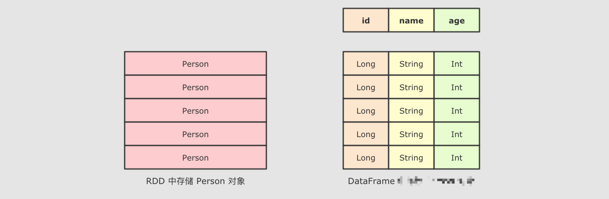

`SparkSQL` 最大的特点就是它针对于结构化数据设计, 所以 `SparkSQL` 应该是能支持针对某一个字段的访问的, 而这种访问方式有一个前提, 就是 `SparkSQL` 的数据集中, 要 **包含结构化信息**, 也就是俗称的 `Schema`

而 `SparkSQL` 对外提供的 `API` 有两类, 一类是直接执行 `SQL`, 另外一类就是命令式. `SparkSQL` 提供的命令式 `API` 就是 `DataFrame` 和 `Dataset`, 暂时也可以认为 `DataFrame` 就是 `Dataset`, 只是在不同的 `API` 中返回的是 `Dataset` 的不同表现形式

    // RDD
    rdd.map { case Person(id, name, age) => (age, 1) }
      .reduceByKey {case ((age, count), (totalAge, totalCount)) => (age, count + totalCount)}
    
    // DataFrame
    df.groupBy("age").count("age")

通过上面的代码, 可以清晰的看到, `SparkSQL` 的命令式操作相比于 `RDD` 来说, 可以直接通过 `Schema` 信息来访问其中某个字段, 非常的方便

### 2.2. SQL 版本 WordCount

    val spark: SparkSession = new sql.SparkSession.Builder()
      .appName("hello")
      .master("local[6]")
      .getOrCreate()
    
    import spark.implicits._
    
    val peopleRDD: RDD[People] = spark.sparkContext.parallelize(Seq(People("zhangsan", 9), People("lisi", 15)))
    val peopleDS: Dataset[People] = peopleRDD.toDS()
    peopleDS.createOrReplaceTempView("people")
    
    val teenagers: DataFrame = spark.sql("select name from people where age > 10 and age < 20")
    
    /*
    +----+
    |name|
    +----+
    |lisi|
    +----+
     */
    teenagers.show()

以往使用 `SQL` 肯定是要有一个表的, 在 `Spark` 中, 并不存在表的概念, 但是有一个近似的概念, 叫做 `DataFrame`, 所以一般情况下要先通过 `DataFrame` 或者 `Dataset` 注册一张临时表, 然后使用 `SQL` 操作这张临时表

总结

`SparkSQL` 提供了 `SQL` 和 命令式 `API` 两种不同的访问结构化数据的形式, 并且它们之间可以无缝的衔接

命令式 `API` 由一个叫做 `Dataset` 的组件提供, 其还有一个变形, 叫做 `DataFrame`

3\. \[扩展\] Catalyst 优化器
-----------------------

目标

1.  理解 `SparkSQL` 和以 `RDD` 为代表的 `SparkCore` 最大的区别
    
2.  理解优化器的运行原理和作用
    

### 3.1. RDD 和 SparkSQL 运行时的区别

`RDD` 的运行流程


大致运行步骤

先将 `RDD` 解析为由 `Stage` 组成的 `DAG`, 后将 `Stage` 转为 `Task` 直接运行

问题

任务会按照代码所示运行, 依赖开发者的优化, 开发者的会在很大程度上影响运行效率

解决办法

创建一个组件, 帮助开发者修改和优化代码, 但是这在 `RDD` 上是无法实现的

为什么 `RDD` 无法自我优化?

*   `RDD` 没有 `Schema` 信息
    
*   `RDD` 可以同时处理结构化和非结构化的数据
    

`SparkSQL` 提供了什么?


和 `RDD` 不同, `SparkSQL` 的 `Dataset` 和 `SQL` 并不是直接生成计划交给集群执行, 而是经过了一个叫做 `Catalyst` 的优化器, 这个优化器能够自动帮助开发者优化代码

也就是说, 在 `SparkSQL` 中, 开发者的代码即使不够优化, 也会被优化为相对较好的形式去执行

为什么 `SparkSQL` 提供了这种能力?

首先, `SparkSQL` 大部分情况用于处理结构化数据和半结构化数据, 所以 `SparkSQL` 可以获知数据的 `Schema`, 从而根据其 `Schema` 来进行优化

### 3.2. Catalyst

为了解决过多依赖 `Hive` 的问题, `SparkSQL` 使用了一个新的 `SQL` 优化器替代 `Hive` 中的优化器, 这个优化器就是 `Catalyst`, 整个 `SparkSQL` 的架构大致如下


1.  `API` 层简单的说就是 `Spark` 会通过一些 `API` 接受 `SQL` 语句
    
2.  收到 `SQL` 语句以后, 将其交给 `Catalyst`, `Catalyst` 负责解析 `SQL`, 生成执行计划等
    
3.  `Catalyst` 的输出应该是 `RDD` 的执行计划
    
4.  最终交由集群运行
    


Step 1 : 解析 `SQL`, 并且生成 `AST` (抽象语法树)

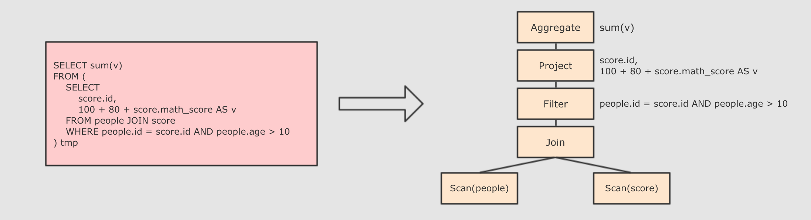

Step 2 : 在 `AST` 中加入元数据信息, 做这一步主要是为了一些优化, 例如 `col = col` 这样的条件, 下图是一个简略图, 便于理解

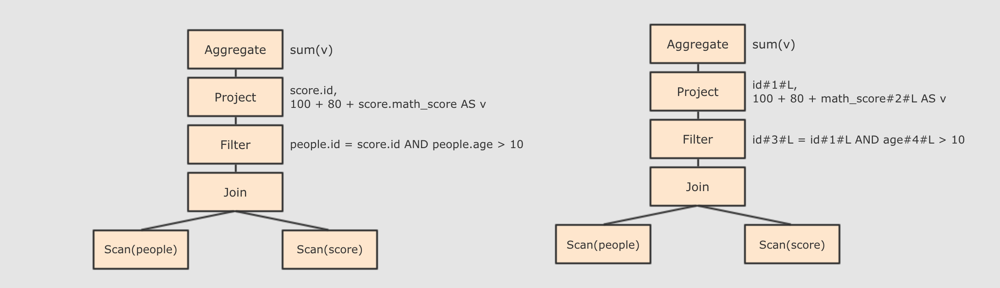

*   `score.id → id#1#L` 为 `score.id` 生成 `id` 为 1, 类型是 `Long`
    
*   `score.math_score → math_score#2#L` 为 `score.math_score` 生成 `id` 为 2, 类型为 `Long`
    
*   `people.id → id#3#L` 为 `people.id` 生成 `id` 为 3, 类型为 `Long`
    
*   `people.age → age#4#L` 为 `people.age` 生成 `id` 为 4, 类型为 `Long`
    

Step 3 : 对已经加入元数据的 `AST`, 输入优化器, 进行优化, 从两种常见的优化开始, 简单介绍

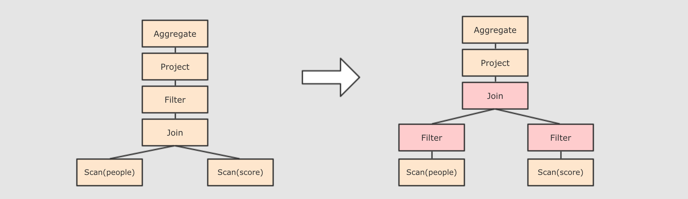

*   谓词下推 `Predicate Pushdown`, 将 `Filter` 这种可以减小数据集的操作下推, 放在 `Scan` 的位置, 这样可以减少操作时候的数据量
    

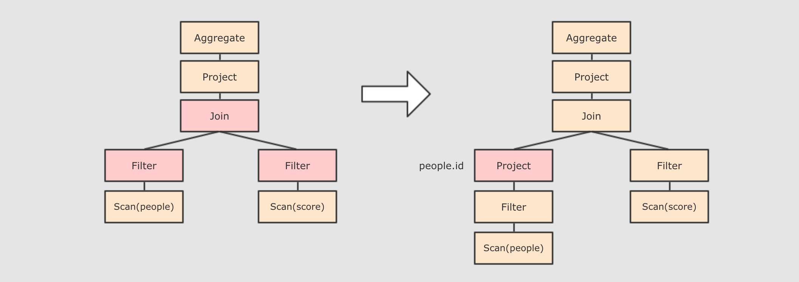

*   列值裁剪 `Column Pruning`, 在谓词下推后, `people` 表之上的操作只用到了 `id` 列, 所以可以把其它列裁剪掉, 这样可以减少处理的数据量, 从而优化处理速度
    
*   还有其余很多优化点, 大概一共有一二百种, 随着 `SparkSQL` 的发展, 还会越来越多, 感兴趣的同学可以继续通过源码了解, 源码在 `org.apache.spark.sql.catalyst.optimizer.Optimizer`
    

Step 4 : 上面的过程生成的 `AST` 其实最终还没办法直接运行, 这个 `AST` 叫做 `逻辑计划`, 结束后, 需要生成 `物理计划`, 从而生成 `RDD` 来运行

*   在生成\`物理计划\`的时候, 会经过\`成本模型\`对整棵树再次执行优化, 选择一个更好的计划
    
*   在生成\`物理计划\`以后, 因为考虑到性能, 所以会使用代码生成, 在机器中运行
    

可以使用 `queryExecution` 方法查看逻辑执行计划, 使用 `explain` 方法查看物理执行计划

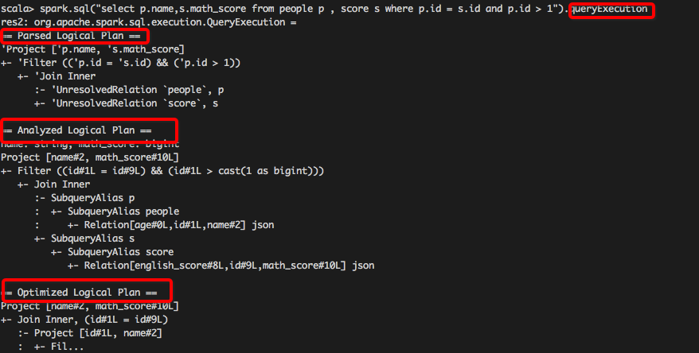

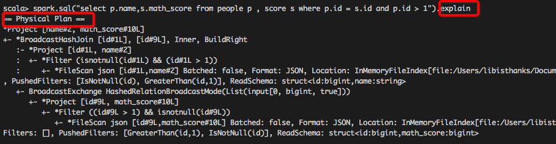

也可以使用 `Spark WebUI` 进行查看

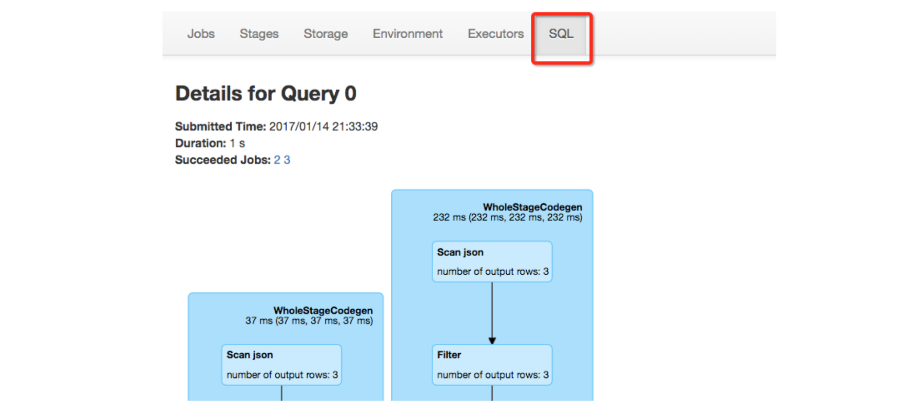

总结

`SparkSQL` 和 `RDD` 不同的主要点是在于其所操作的数据是结构化的, 提供了对数据更强的感知和分析能力, 能够对代码进行更深层的优化, 而这种能力是由一个叫做 `Catalyst` 的优化器所提供的

`Catalyst` 的主要运作原理是分为三步, 先对 `SQL` 或者 `Dataset` 的代码解析, 生成逻辑计划, 后对逻辑计划进行优化, 再生成物理计划, 最后生成代码到集群中以 `RDD` 的形式运行

4\. Dataset 的特点
---------------

目标

1.  理解 `Dataset` 是什么
    
2.  理解 `Dataset` 的特性
    

`Dataset` 是什么?

    val spark: SparkSession = new sql.SparkSession.Builder()
      .appName("hello")
      .master("local[6]")
      .getOrCreate()
    
    import spark.implicits._
    
    val dataset: Dataset[People] = spark.createDataset(Seq(People("zhangsan", 9), People("lisi", 15)))
    // 方式1: 通过对象来处理
    dataset.filter(item => item.age > 10).show()
    // 方式2: 通过字段来处理
    dataset.filter('age > 10).show()
    // 方式3: 通过类似SQL的表达式来处理
    dataset.filter("age > 10").show()

问题1: `People` 是什么?

`People` 是一个强类型的类

问题2: 这个 `Dataset` 中是结构化的数据吗?

非常明显是的, 因为 `People` 对象中有结构信息, 例如字段名和字段类型

问题3: 这个 `Dataset` 能够使用类似 `SQL` 这样声明式结构化查询语句的形式来查询吗?

当然可以, 已经演示过了

问题4: `Dataset` 是什么?

`Dataset` 是一个强类型, 并且类型安全的数据容器, 并且提供了结构化查询 `API` 和类似 `RDD` 一样的命令式 `API`

即使使用 `Dataset` 的命令式 `API`, 执行计划也依然会被优化

`Dataset` 具有 `RDD` 的方便, 同时也具有 `DataFrame` 的性能优势, 并且 `Dataset` 还是强类型的, 能做到类型安全.

    scala> spark.range(1).filter('id === 0).explain(true)
    
    == Parsed Logical Plan ==
    'Filter ('id = 0)
    +- Range (0, 1, splits=8)
    
    == Analyzed Logical Plan ==
    id: bigint
    Filter (id#51L = cast(0 as bigint))
    +- Range (0, 1, splits=8)
    
    == Optimized Logical Plan ==
    Filter (id#51L = 0)
    +- Range (0, 1, splits=8)
    
    == Physical Plan ==
    *Filter (id#51L = 0)
    +- *Range (0, 1, splits=8)

`Dataset` 的底层是什么?

`Dataset` 最底层处理的是对象的序列化形式, 通过查看 `Dataset` 生成的物理执行计划, 也就是最终所处理的 `RDD`, 就可以判定 `Dataset` 底层处理的是什么形式的数据

    val dataset: Dataset[People] = spark.createDataset(Seq(People("zhangsan", 9), People("lisi", 15)))
    val internalRDD: RDD[InternalRow] = dataset.queryExecution.toRdd

`dataset.queryExecution.toRdd` 这个 `API` 可以看到 `Dataset` 底层执行的 `RDD`, 这个 `RDD` 中的范型是 `InternalRow`, `InternalRow` 又称之为 `Catalyst Row`, 是 `Dataset` 底层的数据结构, 也就是说, 无论 `Dataset` 的范型是什么, 无论是 `Dataset[Person]` 还是其它的, 其最底层进行处理的数据结构都是 `InternalRow`

所以, `Dataset` 的范型对象在执行之前, 需要通过 `Encoder` 转换为 `InternalRow`, 在输入之前, 需要把 `InternalRow` 通过 `Decoder` 转换为范型对象

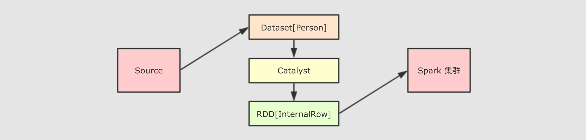

可以获取 `Dataset` 对应的 `RDD` 表示

在 `Dataset` 中, 可以使用一个属性 `rdd` 来得到它的 `RDD` 表示, 例如 `Dataset[T] → RDD[T]`

    val dataset: Dataset[People] = spark.createDataset(Seq(People("zhangsan", 9), People("lisi", 15)))
    
    /*
    (2) MapPartitionsRDD[3] at rdd at Testing.scala:159 []
     |  MapPartitionsRDD[2] at rdd at Testing.scala:159 []
     |  MapPartitionsRDD[1] at rdd at Testing.scala:159 []
     |  ParallelCollectionRDD[0] at rdd at Testing.scala:159 []
     */
    (1)
    println(dataset.rdd.toDebugString) // 这段代码的执行计划为什么多了两个步骤?
    
    /*
    (2) MapPartitionsRDD[5] at toRdd at Testing.scala:160 []
     |  ParallelCollectionRDD[4] at toRdd at Testing.scala:160 []
     */
    (2)
    println(dataset.queryExecution.toRdd.toDebugString)

**1**

使用 `Dataset.rdd` 将 `Dataset` 转为 `RDD` 的形式

**2**

`Dataset` 的执行计划底层的 `RDD`

可以看到 `(1)` 对比 `(2)` 对了两个步骤, 这两个步骤的本质就是将 `Dataset` 底层的 `InternalRow` 转为 `RDD` 中的对象形式, 这个操作还是会有点重的, 所以慎重使用 `rdd` 属性来转换 `Dataset` 为 `RDD`

总结

1.  `Dataset` 是一个新的 `Spark` 组件, 其底层还是 `RDD`
    
2.  `Dataset` 提供了访问对象中某个特定字段的能力, 不用像 `RDD` 一样每次都要针对整个对象做操作
    
3.  `Dataset` 和 `RDD` 不同, 如果想把 `Dataset[T]` 转为 `RDD[T]`, 则需要对 `Dataset` 底层的 `InternalRow` 做转换, 是一个比价重量级的操作
    

5\. DataFrame 的作用和常见操作
----------------------

目标

1.  理解 `DataFrame` 是什么
    
2.  理解 `DataFrame` 的常见操作
    

`DataFrame` 是什么?

`DataFrame` 是 `SparkSQL` 中一个表示关系型数据库中 `表` 的函数式抽象, 其作用是让 `Spark` 处理大规模结构化数据的时候更加容易. 一般 `DataFrame` 可以处理结构化的数据, 或者是半结构化的数据, 因为这两类数据中都可以获取到 `Schema` 信息. 也就是说 `DataFrame` 中有 `Schema` 信息, 可以像操作表一样操作 `DataFrame`.


`DataFrame` 由两部分构成, 一是 `row` 的集合, 每个 `row` 对象表示一个行, 二是描述 `DataFrame` 结构的 `Schema`.


`DataFrame` 支持 `SQL` 中常见的操作, 例如: `select`, `filter`, `join`, `group`, `sort`, `join` 等

    val spark: SparkSession = new sql.SparkSession.Builder()
      .appName("hello")
      .master("local[6]")
      .getOrCreate()
    
    import spark.implicits._
    
    val peopleDF: DataFrame = Seq(People("zhangsan", 15), People("lisi", 15)).toDF()
    
    /*
    +---+-----+
    |age|count|
    +---+-----+
    | 15|    2|
    +---+-----+
     */
    peopleDF.groupBy('age)
      .count()
      .show()

通过隐式转换创建 `DataFrame`

这种方式本质上是使用 `SparkSession` 中的隐式转换来进行的

    val spark: SparkSession = new sql.SparkSession.Builder()
      .appName("hello")
      .master("local[6]")
      .getOrCreate()
    
    // 必须要导入隐式转换
    // 注意: spark 在此处不是包, 而是 SparkSession 对象
    import spark.implicits._
    
    val peopleDF: DataFrame = Seq(People("zhangsan", 15), People("lisi", 15)).toDF()

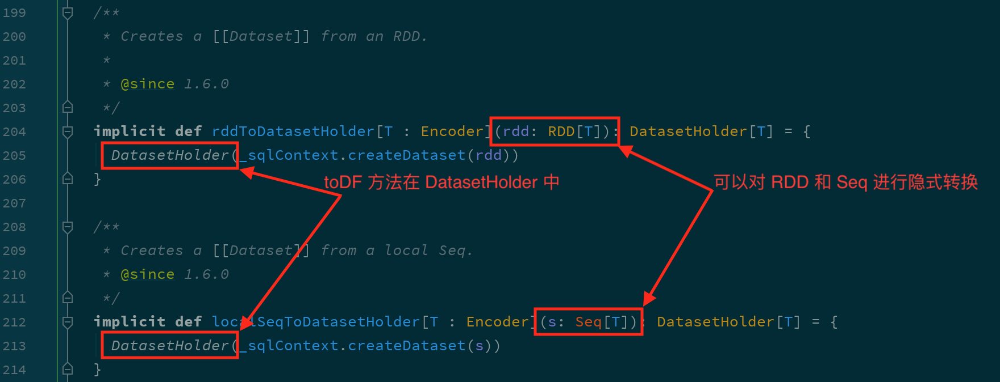

根据源码可以知道, `toDF` 方法可以在 `RDD` 和 `Seq` 中使用

通过集合创建 `DataFrame` 的时候, 集合中不仅可以包含样例类, 也可以只有普通数据类型, 后通过指定列名来创建

    val spark: SparkSession = new sql.SparkSession.Builder()
      .appName("hello")
      .master("local[6]")
      .getOrCreate()
    
    import spark.implicits._
    
    val df1: DataFrame = Seq("nihao", "hello").toDF("text")
    
    /*
    +-----+
    | text|
    +-----+
    |nihao|
    |hello|
    +-----+
     */
    df1.show()
    
    val df2: DataFrame = Seq(("a", 1), ("b", 1)).toDF("word", "count")
    
    /*
    +----+-----+
    |word|count|
    +----+-----+
    |   a|    1|
    |   b|    1|
    +----+-----+
     */
    df2.show()

通过外部集合创建 `DataFrame`

    val spark: SparkSession = new sql.SparkSession.Builder()
      .appName("hello")
      .master("local[6]")
      .getOrCreate()
    
    val df = spark.read
      .option("header", true)
      .csv("dataset/BeijingPM20100101_20151231.csv")
    df.show(10)
    df.printSchema()

不仅可以从 `csv` 文件创建 `DataFrame`, 还可以从 `Table`, `JSON`, `Parquet` 等中创建 `DataFrame`, 后续会有单独的章节来介绍

在 `DataFrame` 上可以使用的常规操作

需求: 查看每个月的统计数量

Step 1: 首先可以打印 `DataFrame` 的 `Schema`, 查看其中所包含的列, 以及列的类型

    val spark: SparkSession = new sql.SparkSession.Builder()
      .appName("hello")
      .master("local[6]")
      .getOrCreate()
    
    val df = spark.read
      .option("header", true)
      .csv("dataset/BeijingPM20100101_20151231.csv")
    
    df.printSchema()

Step 2: 对于大部分计算来说, 可能不会使用所有的列, 所以可以选择其中某些重要的列

    ...
    
    df.select('year, 'month, 'PM_Dongsi)

Step 3: 可以针对某些列进行分组, 后对每组数据通过函数做聚合

    ...
    
    df.select('year, 'month, 'PM_Dongsi)
      .where('PM_Dongsi =!= "Na")
      .groupBy('year, 'month)
      .count()
      .show()

使用 `SQL` 操作 `DataFrame`

使用 `SQL` 来操作某个 `DataFrame` 的话, `SQL` 中必须要有一个 `from` 子句, 所以需要先将 `DataFrame` 注册为一张临时表

    val spark: SparkSession = new sql.SparkSession.Builder()
      .appName("hello")
      .master("local[6]")
      .getOrCreate()
    
    val df = spark.read
      .option("header", true)
      .csv("dataset/BeijingPM20100101_20151231.csv")
    
    df.createOrReplaceTempView("temp_table")
    
    spark.sql("select year, month, count(*) from temp_table where PM_Dongsi != 'NA' group by year, month")
      .show()

总结

1.  `DataFrame` 是一个类似于关系型数据库表的函数式组件
    
2.  `DataFrame` 一般处理结构化数据和半结构化数据
    
3.  `DataFrame` 具有数据对象的 Schema 信息
    
4.  可以使用命令式的 `API` 操作 `DataFrame`, 同时也可以使用 `SQL` 操作 `DataFrame`
    
5.  `DataFrame` 可以由一个已经存在的集合直接创建, 也可以读取外部的数据源来创建
    

6\. Dataset 和 DataFrame 的异同
---------------------------

目标

1.  理解 `Dataset` 和 `DataFrame` 之间的关系
    

`DataFrame` 就是 `Dataset`

根据前面的内容, 可以得到如下信息

1.  `Dataset` 中可以使用列来访问数据, `DataFrame` 也可以
    
2.  `Dataset` 的执行是优化的, `DataFrame` 也是
    
3.  `Dataset` 具有命令式 `API`, 同时也可以使用 `SQL` 来访问, `DataFrame` 也可以使用这两种不同的方式访问
    

所以这件事就比较蹊跷了, 两个这么相近的东西为什么会同时出现在 `SparkSQL` 中呢?

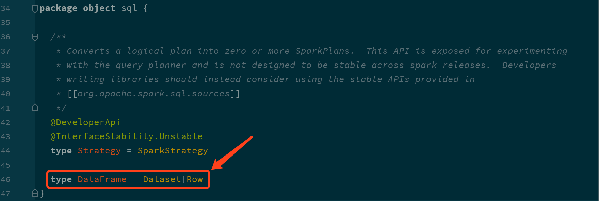

确实, 这两个组件是同一个东西, `DataFrame` 是 `Dataset` 的一种特殊情况, 也就是说 `DataFrame` 是 `Dataset[Row]` 的别名

`DataFrame` 和 `Dataset` 所表达的语义不同

**第一点: `DataFrame` 表达的含义是一个支持函数式操作的 `表`, 而 `Dataset` 表达是是一个类似 `RDD` 的东西, `Dataset` 可以处理任何对象**

第二点: `DataFrame` 中所存放的是 `Row` 对象, 而 `Dataset` 中可以存放任何类型的对象

    val spark: SparkSession = new sql.SparkSession.Builder()
      .appName("hello")
      .master("local[6]")
      .getOrCreate()
    
    import spark.implicits._
    
    val df: DataFrame = Seq(People("zhangsan", 15), People("lisi", 15)).toDF()       (1)
    
    val ds: Dataset[People] = Seq(People("zhangsan", 15), People("lisi", 15)).toDS() (2)

**1**

DataFrame 就是 Dataset\[Row\]

**2**

Dataset 的范型可以是任意类型

第三点: `DataFrame` 的操作方式和 `Dataset` 是一样的, 但是对于强类型操作而言, 它们处理的类型不同

`DataFrame` 在进行强类型操作时候, 例如 `map` 算子, 其所处理的数据类型永远是 `Row`

    df.map( (row: Row) => Row(row.get(0), row.getAs[Int](1) * 10) )(RowEncoder.apply(df.schema)).show()

但是对于 `Dataset` 来讲, 其中是什么类型, 它就处理什么类型

    ds.map( (item: People) => People(item.name, item.age * 10) ).show()

第三点: `DataFrame` 只能做到运行时类型检查, `Dataset` 能做到编译和运行时都有类型检查

1.  `DataFrame` 中存放的数据以 `Row` 表示, 一个 `Row` 代表一行数据, 这和关系型数据库类似
    
2.  `DataFrame` 在进行 `map` 等操作的时候, `DataFrame` 不能直接使用 `Person` 这样的 `Scala` 对象, 所以无法做到编译时检查
    
3.  `Dataset` 表示的具体的某一类对象, 例如 `Person`, 所以再进行 `map` 等操作的时候, 传入的是具体的某个 `Scala` 对象, 如果调用错了方法, 编译时就会被检查出来
    

    val ds: Dataset[People] = Seq(People("zhangsan", 15), People("lisi", 15)).toDS()
    ds.map(person => person.hello) (1)

**1**

这行代码明显报错, 无法通过编译

`Row` 是什么?

`Row` 对象表示的是一个 `行`

`Row` 的操作类似于 `Scala` 中的 `Map` 数据类型

    // 一个对象就是一个对象
    val p = People(name = "zhangsan", age = 10)
    
    // 同样一个对象, 还可以通过一个 Row 对象来表示
    val row = Row("zhangsan", 10)
    
    // 获取 Row 中的内容
    println(row.get(1))
    println(row(1))
    
    // 获取时可以指定类型
    println(row.getAs[Int](1))
    
    // 同时 Row 也是一个样例类, 可以进行 match
    row match {
      case Row(name, age) => println(name, age)
    }

`DataFrame` 和 `Dataset` 之间可以非常简单的相互转换

    val spark: SparkSession = new sql.SparkSession.Builder()
      .appName("hello")
      .master("local[6]")
      .getOrCreate()
    
    import spark.implicits._
    
    val df: DataFrame = Seq(People("zhangsan", 15), People("lisi", 15)).toDF()
    val ds_fdf: Dataset[People] = df.as[People]
    
    val ds: Dataset[People] = Seq(People("zhangsan", 15), People("lisi", 15)).toDS()
    val df_fds: DataFrame = ds.toDF()

总结

1.  `DataFrame` 就是 `Dataset`, 他们的方式是一样的, 也都支持 `API` 和 `SQL` 两种操作方式
    
2.  `DataFrame` 只能通过表达式的形式, 或者列的形式来访问数据, 只有 `Dataset` 支持针对于整个对象的操作
    
3.  `DataFrame` 中的数据表示为 `Row`, 是一个行的概念
    

7\. 数据读写
--------

目标

1.  理解外部数据源的访问框架
    
2.  掌握常见的数据源读写方式
    

### 7.1. 初识 DataFrameReader

目标

*   理解 `DataFrameReader` 的整体结构和组成
    

`SparkSQL` 的一个非常重要的目标就是完善数据读取, 所以 `SparkSQL` 中增加了一个新的框架, 专门用于读取外部数据源, 叫做 `DataFrameReader`

    import org.apache.spark.sql.SparkSession
    import org.apache.spark.sql.DataFrameReader
    
    val spark: SparkSession = ...
    
    val reader: DataFrameReader = spark.read

`DataFrameReader` 由如下几个组件组成

  

组件

解释

`schema`

结构信息, 因为 `Dataset` 是有结构的, 所以在读取数据的时候, 就需要有 `Schema` 信息, 有可能是从外部数据源获取的, 也有可能是指定的

`option`

连接外部数据源的参数, 例如 `JDBC` 的 `URL`, 或者读取 `CSV` 文件是否引入 `Header` 等

`format`

外部数据源的格式, 例如 `csv`, `jdbc`, `json` 等

`DataFrameReader` 有两种访问方式, 一种是使用 `load` 方法加载, 使用 `format` 指定加载格式, 还有一种是使用封装方法, 类似 `csv`, `json`, `jdbc` 等

    import org.apache.spark.sql.SparkSession
    import org.apache.spark.sql.DataFrame
    
    val spark: SparkSession = ...
    
    // 使用 load 方法
    val fromLoad: DataFrame = spark
      .read
      .format("csv")
      .option("header", true)
      .option("inferSchema", true)
      .load("dataset/BeijingPM20100101_20151231.csv")
    
    // Using format-specific load operator
    val fromCSV: DataFrame = spark
      .read
      .option("header", true)
      .option("inferSchema", true)
      .csv("dataset/BeijingPM20100101_20151231.csv")

但是其实这两种方式本质上一样, 因为类似 `csv` 这样的方式只是 `load` 的封装

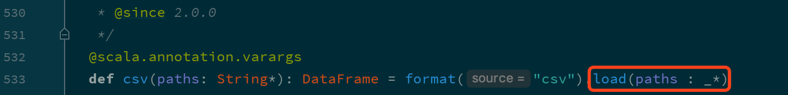

如果使用 `load` 方法加载数据, 但是没有指定 `format` 的话, 默认是按照 `Parquet` 文件格式读取

也就是说, `SparkSQL` 默认的读取格式是 `Parquet`

总结

1.  使用 `spark.read` 可以获取 SparkSQL 中的外部数据源访问框架 `DataFrameReader`
    
2.  `DataFrameReader` 有三个组件 `format`, `schema`, `option`
    
3.  `DataFrameReader` 有两种使用方式, 一种是使用 `load` 加 `format` 指定格式, 还有一种是使用封装方法 `csv`, `json` 等
    

### 7.2. 初识 DataFrameWriter

目标

1.  理解 `DataFrameWriter` 的结构
    

对于 `ETL` 来说, 数据保存和数据读取一样重要, 所以 `SparkSQL` 中增加了一个新的数据写入框架, 叫做 `DataFrameWriter`

    val spark: SparkSession = ...
    
    val df = spark.read
          .option("header", true)
          .csv("dataset/BeijingPM20100101_20151231.csv")
    
    val writer: DataFrameWriter[Row] = df.write

`DataFrameWriter` 中由如下几个部分组成

  

组件

解释

`source`

写入目标, 文件格式等, 通过 `format` 方法设定

`mode`

写入模式, 例如一张表已经存在, 如果通过 `DataFrameWriter` 向这张表中写入数据, 是覆盖表呢, 还是向表中追加呢? 通过 `mode` 方法设定

`extraOptions`

外部参数, 例如 `JDBC` 的 `URL`, 通过 `options`, `option` 设定

`partitioningColumns`

类似 `Hive` 的分区, 保存表的时候使用, 这个地方的分区不是 `RDD` 的分区, 而是文件的分区, 或者表的分区, 通过 `partitionBy` 设定

`bucketColumnNames`

类似 `Hive` 的分桶, 保存表的时候使用, 通过 `bucketBy` 设定

`sortColumnNames`

用于排序的列, 通过 `sortBy` 设定

`mode` 指定了写入模式, 例如覆盖原数据集, 或者向原数据集合中尾部添加等

  

`Scala` 对象表示

字符串表示

解释

`SaveMode.ErrorIfExists`

`"error"`

将 `DataFrame` 保存到 `source` 时, 如果目标已经存在, 则报错

`SaveMode.Append`

`"append"`

将 `DataFrame` 保存到 `source` 时, 如果目标已经存在, 则添加到文件或者 `Table` 中

`SaveMode.Overwrite`

`"overwrite"`

将 `DataFrame` 保存到 `source` 时, 如果目标已经存在, 则使用 `DataFrame` 中的数据完全覆盖目标

`SaveMode.Ignore`

`"ignore"`

将 `DataFrame` 保存到 `source` 时, 如果目标已经存在, 则不会保存 `DataFrame` 数据, 并且也不修改目标数据集, 类似于 `CREATE TABLE IF NOT EXISTS`

`DataFrameWriter` 也有两种使用方式, 一种是使用 `format` 配合 `save`, 还有一种是使用封装方法, 例如 `csv`, `json`, `saveAsTable` 等

    val spark: SparkSession = ...
    
    val df = spark.read
      .option("header", true)
      .csv("dataset/BeijingPM20100101_20151231.csv")
    
    // 使用 save 保存, 使用 format 设置文件格式
    df.write.format("json").save("dataset/beijingPM")
    
    // 使用 json 保存, 因为方法是 json, 所以隐含的 format 是 json
    df.write.json("dataset/beijingPM1")

默认没有指定 `format`, 默认的 `format` 是 `Parquet`

总结

1.  类似 `DataFrameReader`, `Writer` 中也有 `format`, `options`, 另外 `schema` 是包含在 `DataFrame` 中的
    
2.  `DataFrameWriter` 中还有一个很重要的概念叫做 `mode`, 指定写入模式, 如果目标集合已经存在时的行为
    
3.  `DataFrameWriter` 可以将数据保存到 `Hive` 表中, 所以也可以指定分区和分桶信息
    

### 7.3. 读写 Parquet 格式文件

目标

1.  理解 `Spark` 读写 `Parquet` 文件的语法
    
2.  理解 `Spark` 读写 `Parquet` 文件的时候对于分区的处理
    

什么时候会用到 `Parquet` ?


在 `ETL` 中, `Spark` 经常扮演 `T` 的职务, 也就是进行数据清洗和数据转换.

为了能够保存比较复杂的数据, 并且保证性能和压缩率, 通常使用 `Parquet` 是一个比较不错的选择.

所以外部系统收集过来的数据, 有可能会使用 `Parquet`, 而 `Spark` 进行读取和转换的时候, 就需要支持对 `Parquet` 格式的文件的支持.

使用代码读写 `Parquet` 文件

默认不指定 `format` 的时候, 默认就是读写 `Parquet` 格式的文件

    val spark: SparkSession = new sql.SparkSession.Builder()
      .appName("hello")
      .master("local[6]")
      .getOrCreate()
    
    val df = spark.read
      .option("header", value = true)
      .csv("dataset/911.csv")
    
    // 保存 Parquet 文件
    df.write.mode("override").save("dataset/911.parquet")
    
    // 读取 Parquet 文件
    val dfFromParquet = spark.read.parquet("dataset/911.parquet")
    dfFromParquet.createOrReplaceTempView("911")
    
    spark.sql("select * from 911 where zip > 19000 and zip < 19400").show()

写入 `Parquet` 的时候可以指定分区

`Spark` 在写入文件的时候是支持分区的, 可以像 `Hive` 一样设置某个列为分区列

    val spark: SparkSession = new sql.SparkSession.Builder()
      .appName("hello")
      .master("local[6]")
      .getOrCreate()
    
    // 从 CSV 中读取内容
    val dfFromParquet = spark.read.option("header", value = true).csv("dataset/BeijingPM20100101_20151231.csv")
    
    // 保存为 Parquet 格式文件, 不指定 format 默认就是 Parquet
    dfFromParquet.write.partitionBy("year", "month").save("dataset/beijing_pm")

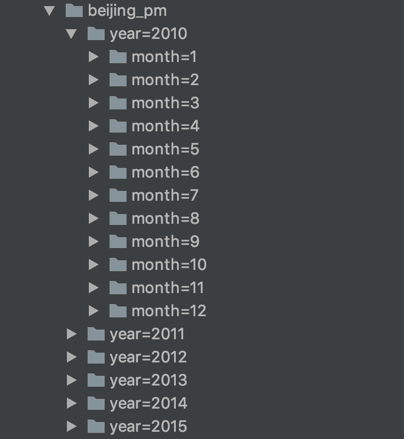

这个地方指的分区是类似 `Hive` 中表分区的概念, 而不是 `RDD` 分布式分区的含义

分区发现

在读取常见文件格式的时候, `Spark` 会自动的进行分区发现, 分区自动发现的时候, 会将文件名中的分区信息当作一列. 例如 如果按照性别分区, 那么一般会生成两个文件夹 `gender=male` 和 `gender=female`, 那么在使用 `Spark` 读取的时候, 会自动发现这个分区信息, 并且当作列放入创建的 `DataFrame` 中

使用代码证明这件事可以有两个步骤, 第一步先读取某个分区的单独一个文件并打印其 `Schema` 信息, 第二步读取整个数据集所有分区并打印 `Schema` 信息, 和第一步做比较就可以确定

    val spark = ...
    
    val partDF = spark.read.load("dataset/beijing_pm/year=2010/month=1") (1)
    partDF.printSchema()

**1**

把分区的数据集中的某一个区单做一整个数据集读取, 没有分区信息, 自然也不会进行分区发现

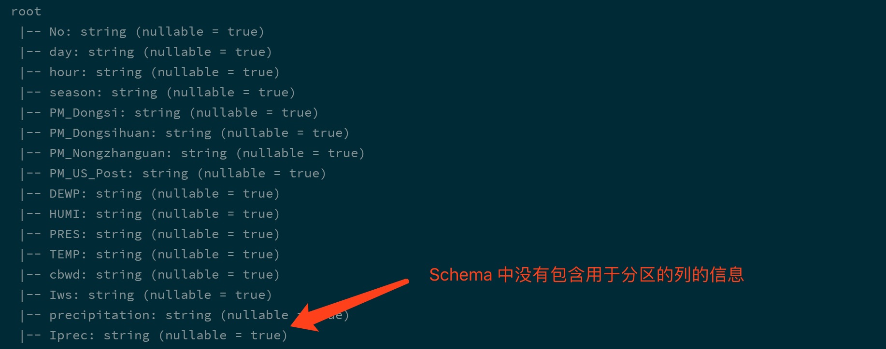

    val df = spark.read.load("dataset/beijing_pm") (1)
    df.printSchema()

**1**

此处读取的是整个数据集, 会进行分区发现, DataFrame 中会包含分去列

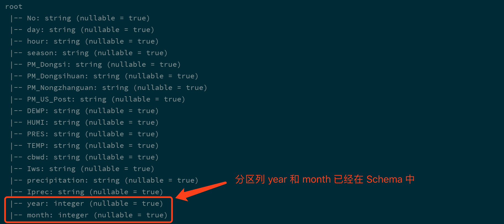

Table 1. `SparkSession` 中有关 `Parquet` 的配置  

配置

默认值

含义

`spark.sql.parquet.binaryAsString`

`false`

一些其他 `Parquet` 生产系统, 不区分字符串类型和二进制类型, 该配置告诉 `SparkSQL` 将二进制数据解释为字符串以提供与这些系统的兼容性

`spark.sql.parquet.int96AsTimestamp`

`true`

一些其他 `Parquet` 生产系统, 将 `Timestamp` 存为 `INT96`, 该配置告诉 `SparkSQL` 将 `INT96` 解析为 `Timestamp`

`spark.sql.parquet.cacheMetadata`

`true`

打开 Parquet 元数据的缓存, 可以加快查询静态数据

`spark.sql.parquet.compression.codec`

`snappy`

压缩方式, 可选 `uncompressed`, `snappy`, `gzip`, `lzo`

`spark.sql.parquet.mergeSchema`

`false`

当为 true 时, Parquet 数据源会合并从所有数据文件收集的 Schemas 和数据, 因为这个操作开销比较大, 所以默认关闭

`spark.sql.optimizer.metadataOnly`

`true`

如果为 `true`, 会通过原信息来生成分区列, 如果为 `false` 则就是通过扫描整个数据集来确定

总结

1.  `Spark` 不指定 `format` 的时候默认就是按照 `Parquet` 的格式解析文件
    
2.  `Spark` 在读取 `Parquet` 文件的时候会自动的发现 `Parquet` 的分区和分区字段
    
3.  `Spark` 在写入 `Parquet` 文件的时候如果设置了分区字段, 会自动的按照分区存储
    

### 7.4. 读写 JSON 格式文件

目标

1.  理解 `JSON` 的使用场景
    
2.  能够使用 `Spark` 读取处理 `JSON` 格式文件
    

什么时候会用到 `JSON` ?


在 `ETL` 中, `Spark` 经常扮演 `T` 的职务, 也就是进行数据清洗和数据转换.

在业务系统中, `JSON` 是一个非常常见的数据格式, 在前后端交互的时候也往往会使用 `JSON`, 所以从业务系统获取的数据很大可能性是使用 `JSON` 格式, 所以就需要 `Spark` 能够支持 JSON 格式文件的读取

读写 `JSON` 文件

将要 `Dataset` 保存为 `JSON` 格式的文件比较简单, 是 `DataFrameWriter` 的一个常规使用

    val spark: SparkSession = new sql.SparkSession.Builder()
      .appName("hello")
      .master("local[6]")
      .getOrCreate()
    
    val dfFromParquet = spark.read.load("dataset/beijing_pm")
    
    // 将 DataFrame 保存为 JSON 格式的文件
    dfFromParquet.repartition(1)        (1)
      .write.format("json")
      .save("dataset/beijing_pm_json")

**1**

如果不重新分区, 则会为 `DataFrame` 底层的 `RDD` 的每个分区生成一个文件, 为了保持只有一个输出文件, 所以重新分区

保存为 `JSON` 格式的文件有一个细节需要注意, 这个 `JSON` 格式的文件中, 每一行是一个独立的 `JSON`, 但是整个文件并不只是一个 `JSON` 字符串, 所以这种文件格式很多时候被成为 `JSON Line` 文件, 有时候后缀名也会变为 `jsonl`

beijing\_pm.jsonl

    {"day":"1","hour":"0","season":"1","year":2013,"month":3}
    {"day":"1","hour":"1","season":"1","year":2013,"month":3}
    {"day":"1","hour":"2","season":"1","year":2013,"month":3}

也可以通过 `DataFrameReader` 读取一个 `JSON Line` 文件

    val spark: SparkSession = ...
    
    val dfFromJSON = spark.read.json("dataset/beijing_pm_json")
    dfFromJSON.show()

`JSON` 格式的文件是有结构信息的, 也就是 `JSON` 中的字段是有类型的, 例如 `"name": "zhangsan"` 这样由双引号包裹的 `Value`, 就是字符串类型, 而 `"age": 10` 这种没有双引号包裹的就是数字类型, 当然, 也可以是布尔型 `"has_wife": true`

`Spark` 读取 `JSON Line` 文件的时候, 会自动的推断类型信息

    val spark: SparkSession = ...
    
    val dfFromJSON = spark.read.json("dataset/beijing_pm_json")
    
    dfFromJSON.printSchema()

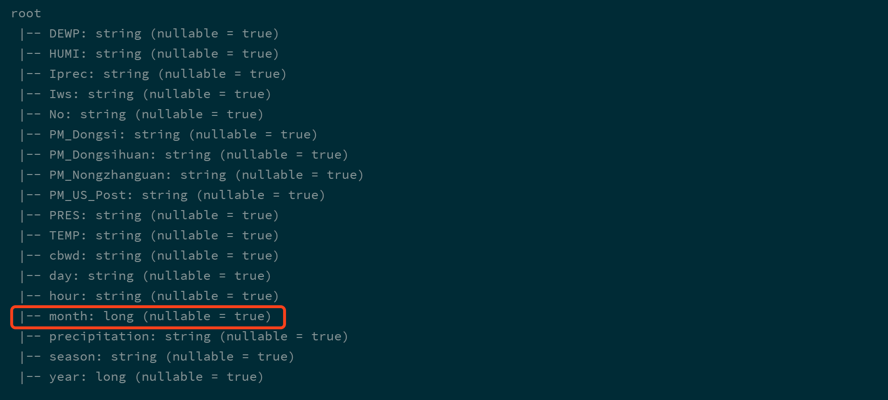

`Spark` 可以从一个保存了 `JSON` 格式字符串的 `Dataset[String]` 中读取 `JSON` 信息, 转为 `DataFrame`

这种情况其实还是比较常见的, 例如如下的流程


假设业务系统通过 `Kafka` 将数据流转进入大数据平台, 这个时候可能需要使用 `RDD` 或者 `Dataset` 来读取其中的内容, 这个时候一条数据就是一个 `JSON` 格式的字符串, 如何将其转为 `DataFrame` 或者 `Dataset[Object]` 这样具有 `Schema` 的数据集呢? 使用如下代码就可以

    val spark: SparkSession = ...
    
    import spark.implicits._
    
    val peopleDataset = spark.createDataset(
      """{"name":"Yin","address":{"city":"Columbus","state":"Ohio"}}""" :: Nil)
    
    spark.read.json(peopleDataset).show()

总结

1.  `JSON` 通常用于系统间的交互, `Spark` 经常要读取 `JSON` 格式文件, 处理, 放在另外一处
    
2.  使用 `DataFrameReader` 和 `DataFrameWriter` 可以轻易的读取和写入 `JSON`, 并且会自动处理数据类型信息
    

### 7.5. 访问 Hive

导读

1.  整合 `SparkSQL` 和 `Hive`, 使用 `Hive` 的 `MetaStore` 元信息库
    
2.  使用 `SparkSQL` 查询 `Hive` 表
    
3.  案例, 使用常见 `HiveSQL`
    
4.  写入内容到 `Hive` 表
    

#### 7.5.1. SparkSQL 整合 Hive

导读

1.  开启 `Hive` 的 `MetaStore` 独立进程
    
2.  整合 `SparkSQL` 和 `Hive` 的 `MetaStore`
    

和一个文件格式不同, `Hive` 是一个外部的数据存储和查询引擎, 所以如果 `Spark` 要访问 `Hive` 的话, 就需要先整合 `Hive`

整合什么 ?

如果要讨论 `SparkSQL` 如何和 `Hive` 进行整合, 首要考虑的事应该是 `Hive` 有什么, 有什么就整合什么就可以

*   `MetaStore`, 元数据存储
    
    `SparkSQL` 内置的有一个 `MetaStore`, 通过嵌入式数据库 `Derby` 保存元信息, 但是对于生产环境来说, 还是应该使用 `Hive` 的 `MetaStore`, 一是更成熟, 功能更强, 二是可以使用 `Hive` 的元信息
    
*   查询引擎
    
    `SparkSQL` 内置了 `HiveSQL` 的支持, 所以无需整合
    

为什么要开启 `Hive` 的 `MetaStore`

`Hive` 的 `MetaStore` 是一个 `Hive` 的组件, 一个 `Hive` 提供的程序, 用以保存和访问表的元数据, 整个 `Hive` 的结构大致如下

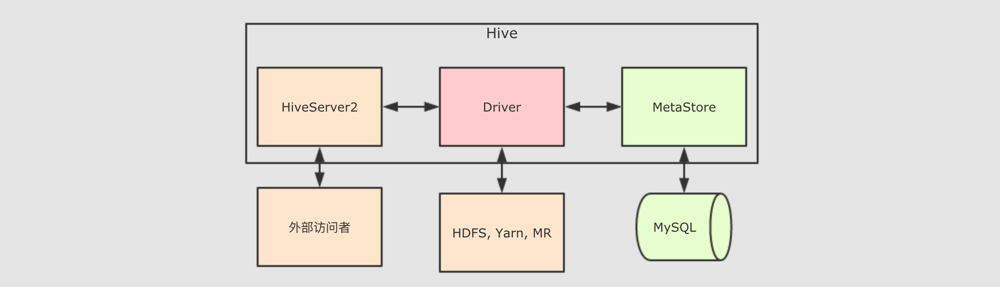

由上图可知道, 其实 `Hive` 中主要的组件就三个, `HiveServer2` 负责接受外部系统的查询请求, 例如 `JDBC`, `HiveServer2` 接收到查询请求后, 交给 `Driver` 处理, `Driver` 会首先去询问 `MetaStore` 表在哪存, 后 `Driver` 程序通过 `MR` 程序来访问 `HDFS` 从而获取结果返回给查询请求者

而 `Hive` 的 `MetaStore` 对 `SparkSQL` 的意义非常重大, 如果 `SparkSQL` 可以直接访问 `Hive` 的 `MetaStore`, 则理论上可以做到和 `Hive` 一样的事情, 例如通过 `Hive` 表查询数据

而 Hive 的 MetaStore 的运行模式有三种

*   内嵌 `Derby` 数据库模式
    
    这种模式不必说了, 自然是在测试的时候使用, 生产环境不太可能使用嵌入式数据库, 一是不稳定, 二是这个 `Derby` 是单连接的, 不支持并发
    
*   `Local` 模式
    
    `Local` 和 `Remote` 都是访问 `MySQL` 数据库作为存储元数据的地方, 但是 `Local` 模式的 `MetaStore` 没有独立进程, 依附于 `HiveServer2` 的进程
    
*   `Remote` 模式
    
    和 `Loca` 模式一样, 访问 `MySQL` 数据库存放元数据, 但是 `Remote` 的 `MetaStore` 运行在独立的进程中
    

我们显然要选择 `Remote` 模式, 因为要让其独立运行, 这样才能让 `SparkSQL` 一直可以访问

`Hive` 开启 `MetaStore`

`Step 1`: 修改 `hive-site.xml`

```xml
<property>
  <name>hive.metastore.warehouse.dir</name>
  <value>/user/hive/warehouse</value>
</property>

<property>
  <name>javax.jdo.option.ConnectionURL</name>
  <value>jdbc:mysql://node01:3306/hive?createDatabaseIfNotExist=true</value>
</property>

<property>
  <name>javax.jdo.option.ConnectionDriverName</name>
  <value>com.mysql.jdbc.Driver</value>
</property>

<property>
  <name>javax.jdo.option.ConnectionUserName</name>
  <value>username</value>
</property>

<property>
  <name>javax.jdo.option.ConnectionPassword</name>
  <value>password</value>
</property>

<property>
  <name>hive.metastore.local</name>
  <value>false</value>
</property>

<property>
  <name>hive.metastore.uris</name>
  <value>thrift://node01:9083</value>  //当前服务器
</property>
```

`Step 2`: 启动 `Hive MetaStore`

```shell
nohup /export/servers/hive/bin/hive --service metastore 2>&1 >> /var/log.log &
```

`SparkSQL` 整合 `Hive` 的 `MetaStore`

即使不去整合 `MetaStore`, `Spark` 也有一个内置的 `MateStore`, 使用 `Derby` 嵌入式数据库保存数据, 但是这种方式不适合生产环境, 因为这种模式同一时间只能有一个 `SparkSession` 使用, 所以生产环境更推荐使用 `Hive` 的 `MetaStore`

`SparkSQL` 整合 `Hive` 的 `MetaStore` 主要思路就是要通过配置能够访问它, 并且能够使用 `HDFS` 保存 `WareHouse`, 这些配置信息一般存在于 `Hadoop` 和 `HDFS` 的配置文件中, 所以可以直接拷贝 `Hadoop` 和 `Hive` 的配置文件到 `Spark` 的配置目录

```shell
cd /export/servers/hadoop/etc/hadoop
cp hive-site.xml core-site.xml hdfs-site.xml /export/servers/spark/conf/ (1) (2) (3)

scp -r /export/servers/spark/conf node02:/export/servers/spark/conf
scp -r /export/servers/spark/conf node03:/export/servers/spark/conf
```

**1**

`Spark` 需要 `hive-site.xml` 的原因是, 要读取 `Hive` 的配置信息, 主要是元数据仓库的位置等信息

**2**

`Spark` 需要 `core-site.xml` 的原因是, 要读取安全有关的配置

**3**

`Spark` 需要 `hdfs-site.xml` 的原因是, 有可能需要在 `HDFS` 中放置表文件, 所以需要 `HDFS` 的配置

如果不希望通过拷贝文件的方式整合 Hive, 也可以在 SparkSession 启动的时候, 通过指定 Hive 的 MetaStore 的位置来访问, 但是更推荐整合的方式

#### 7.5.2. 访问 Hive 表

导读

1.  在 `Hive` 中创建表
    
2.  使用 `SparkSQL` 访问 `Hive` 中已经存在的表
    
3.  使用 `SparkSQL` 创建 `Hive` 表
    
4.  使用 `SparkSQL` 修改 `Hive` 表中的数据
    

在 `Hive` 中创建表

第一步, 需要先将文件上传到集群中, 使用如下命令上传到 `HDFS` 中

    hdfs dfs -mkdir -p /dataset
    hdfs dfs -put studenttabl10k /dataset/

第二步, 使用 `Hive` 或者 `Beeline` 执行如下 `SQL`

```sql
CREATE DATABASE IF NOT EXISTS spark_integrition;

USE spark_integrition;

CREATE EXTERNAL TABLE student
(
  name  STRING,
  age   INT,
  gpa   string
)
ROW FORMAT DELIMITED
  FIELDS TERMINATED BY '\t'
  LINES TERMINATED BY '\n'
STORED AS TEXTFILE
LOCATION '/dataset/hive';

LOAD DATA INPATH '/dataset/studenttab10k' OVERWRITE INTO TABLE student;
```

通过 `SparkSQL` 查询 `Hive` 的表

查询 `Hive` 中的表可以直接通过 `spark.sql(…)` 来进行, 可以直接在其中访问 `Hive` 的 `MetaStore`, 前提是一定要将 `Hive` 的配置文件拷贝到 `Spark` 的 `conf` 目录

```scala
scala> spark.sql("use spark_integrition")
scala> val resultDF = spark.sql("select * from student limit 10")
scala> resultDF.show()
```

通过 `SparkSQL` 创建 `Hive` 表

通过 `SparkSQL` 可以直接创建 `Hive` 表, 并且使用 `LOAD DATA` 加载数据

```scala
val createTableStr =
  """
    |CREATE EXTERNAL TABLE student
    |(
    |  name  STRING,
    |  age   INT,
    |  gpa   string
    |)
    |ROW FORMAT DELIMITED
    |  FIELDS TERMINATED BY '\t'
    |  LINES TERMINATED BY '\n'
    |STORED AS TEXTFILE
    |LOCATION '/dataset/hive'
  """.stripMargin

spark.sql("CREATE DATABASE IF NOT EXISTS spark_integrition1")
spark.sql("USE spark_integrition1")
spark.sql(createTableStr)
spark.sql("LOAD DATA INPATH '/dataset/studenttab10k' OVERWRITE INTO TABLE student")
spark.sql("select * from student limit").show()
```

目前 `SparkSQL` 支持的文件格式有 `sequencefile`, `rcfile`, `orc`, `parquet`, `textfile`, `avro`, 并且也可以指定 `serde` 的名称

使用 `SparkSQL` 处理数据并保存进 Hive 表

前面都在使用 `SparkShell` 的方式来访问 `Hive`, 编写 `SQL`, 通过 `Spark` 独立应用的形式也可以做到同样的事, 但是需要一些前置的步骤, 如下

Step 1: 导入 `Maven` 依赖

    <dependency>
        <groupId>org.apache.spark</groupId>
        <artifactId>spark-hive_2.11</artifactId>
        <version>${spark.version}</version>
    </dependency>

Step 2: 配置 `SparkSession`

如果希望使用 `SparkSQL` 访问 `Hive` 的话, 需要做两件事

1.  开启 `SparkSession` 的 `Hive` 支持
    
    经过这一步配置, `SparkSQL` 才会把 `SQL` 语句当作 `HiveSQL` 来进行解析
    
2.  设置 `WareHouse` 的位置
    
    虽然 `hive-stie.xml` 中已经配置了 `WareHouse` 的位置, 但是在 `Spark 2.0.0` 后已经废弃了 `hive-site.xml` 中设置的 `hive.metastore.warehouse.dir`, 需要在 `SparkSession` 中设置 `WareHouse` 的位置
    
3.  设置 `MetaStore` 的位置
    
```scala
    1. val spark = SparkSession
         .builder()
         .appName("hive example")
         .config("spark.sql.warehouse.dir", "hdfs://node01:8020/dataset/hive")  
         .config("hive.metastore.uris", "thrift://node01:9083")               
         .enableHiveSupport()                                                  
         .getOrCreate()
    
    
```

**1**

设置 `WareHouse` 的位置

**2**

设置 `MetaStore` 的位置

**3**

开启 `Hive` 支持

配置好了以后, 就可以通过 `DataFrame` 处理数据, 后将数据结果推入 `Hive` 表中了, 在将结果保存到 `Hive` 表的时候, 可以指定保存模式

```scala
val schema = StructType(
  List(
    StructField("name", StringType),
    StructField("age", IntegerType),
    StructField("gpa", FloatType)
  )
)

val studentDF = spark.read
  .option("delimiter", "\t")
  .schema(schema)
  .csv("dataset/studenttab10k")

val resultDF = studentDF.where("age < 50")

resultDF.write.mode(SaveMode.Overwrite).saveAsTable("spark_integrition1.student") (1)
```

**1**. 通过 `mode` 指定保存模式, 通过 `saveAsTable` 保存数据到 `Hive`

### 7.6. JDBC

导读

1.  通过 `SQL` 操作 `MySQL` 的表
    
2.  将数据写入 `MySQL` 的表中
    

准备 `MySQL` 环境

在使用 `SparkSQL` 访问 `MySQL` 之前, 要对 `MySQL` 进行一些操作, 例如说创建用户, 表和库等

*   Step 1: 连接 `MySQL` 数据库
    
    在 `MySQL` 所在的主机上执行如下命令
    
    ```shell
    mysql -u root -p
    ```
    
*   Step 2: 创建 `Spark` 使用的用户
    
    登进 `MySQL` 后, 需要先创建用户
    
    ```shell
    CREATE USER 'spark'@'%' IDENTIFIED BY 'Spark123!';
    GRANT ALL ON spark_test.* TO 'spark'@'%';
    ```
    
*   Step 3: 创建库和表
    
        CREATE DATABASE spark_test;
        
        USE spark_test;
        
        CREATE TABLE IF NOT EXISTS `student`(
        `id` INT AUTO_INCREMENT,
        `name` VARCHAR(100) NOT NULL,
        `age` INT NOT NULL,
        `gpa` FLOAT,
        PRIMARY KEY ( `id` )
        )ENGINE=InnoDB DEFAULT CHARSET=utf8;
    

使用 `SparkSQL` 向 `MySQL` 中写入数据

其实在使用 `SparkSQL` 访问 `MySQL` 是通过 `JDBC`, 那么其实所有支持 `JDBC` 的数据库理论上都可以通过这种方式进行访问

在使用 `JDBC` 访问关系型数据的时候, 其实也是使用 `DataFrameReader`, 对 `DataFrameReader` 提供一些配置, 就可以使用 `Spark` 访问 `JDBC`, 有如下几个配置可用

  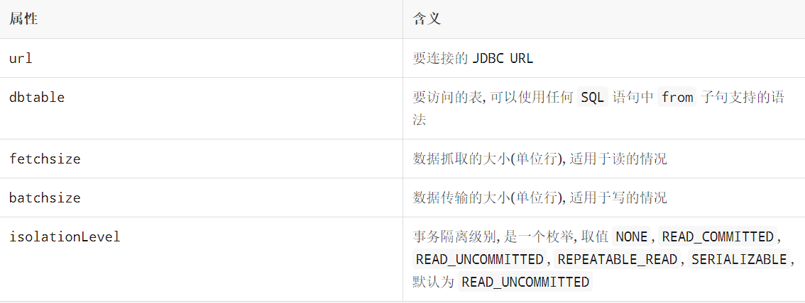

读取数据集, 处理过后存往 `MySQL` 中的代码如下

```scala
val spark = SparkSession
  .builder()
  .appName("hive example")
  .master("local[6]")
  .getOrCreate()

val schema = StructType(
  List(
    StructField("name", StringType),
    StructField("age", IntegerType),
    StructField("gpa", FloatType)
  )
)

val studentDF = spark.read
  .option("delimiter", "\t")
  .schema(schema)
  .csv("dataset/studenttab10k")

studentDF.write.format("jdbc").mode(SaveMode.Overwrite)
  .option("url", "jdbc:mysql://node01:3306/spark_test")
  .option("dbtable", "student")
  .option("user", "spark")
  .option("password", "Spark123!")
  .save()
```

运行程序

如果是在本地运行, 需要导入 `Maven` 依赖

```xml
<dependency>
    <groupId>mysql</groupId>
    <artifactId>mysql-connector-java</artifactId>
    <version>5.1.47</version>
</dependency>
```

如果使用 `Spark submit` 或者 `Spark shell` 来运行任务, 需要通过 `--jars` 参数提交 `MySQL` 的 `Jar` 包, 或者指定 `--packages` 从 `Maven` 库中读取

```shell
bin/spark-shell --packages  mysql:mysql-connector-java:5.1.47 --repositories http://maven.aliyun.com/nexus/content/groups/public/
```

从 `MySQL` 中读取数据

读取 `MySQL` 的方式也非常的简单, 只是使用 `SparkSQL` 的 `DataFrameReader` 加上参数配置即可访问

```scala
spark.read.format("jdbc")
  .option("url", "jdbc:mysql://node01:3306/spark_test")
  .option("dbtable", "student")
  .option("user", "spark")
  .option("password", "Spark123!")
  .load()
  .show()
```

  默认情况下读取 `MySQL` 表时, 从 `MySQL` 表中读取的数据放入了一个分区, 拉取后可以使用 `DataFrame` 重分区来保证并行计算和内存占用不会太高, 但是如果感觉 `MySQL` 中数据过多的时候, 读取时可能就会产生 `OOM`, 所以在数据量比较大的场景, 就需要在读取的时候就将其分发到不同的 `RDD` 分区

| 属性                       | 含义                                                         |
| :------------------------- | :----------------------------------------------------------- |
| `partitionColumn`          | 指定按照哪一列进行分区, 只能设置类型为数字的列, 一般指定为 `ID` |
| `lowerBound`, `upperBound` | 确定步长的参数, `lowerBound - upperBound` 之间的数据均分给每一个分区, 小于 `lowerBound` 的数据分给第一个分区, 大于 `upperBound` 的数据分给最后一个分区 |
| `numPartitions`            | 分区数量                                                     |

    spark.read.format("jdbc")
      .option("url", "jdbc:mysql://node01:3306/spark_test")
      .option("dbtable", "student")
      .option("user", "spark")
      .option("password", "Spark123!")
      .option("partitionColumn", "age")
      .option("lowerBound", 1)
      .option("upperBound", 60)
      .option("numPartitions", 10)
      .load()
      .show()

有时候可能要使用非数字列来作为分区依据, `Spark` 也提供了针对任意类型的列作为分区依据的方法

    val predicates = Array(
      "age < 20",
      "age >= 20, age < 30",
      "age >= 30"
    )
    
    val connectionProperties = new Properties()
    connectionProperties.setProperty("user", "spark")
    connectionProperties.setProperty("password", "Spark123!")
    
    spark.read
      .jdbc(
        url = "jdbc:mysql://node01:3306/spark_test",
        table = "student",
        predicates = predicates,
        connectionProperties = connectionProperties
      )
      .show()

`SparkSQL` 中并没有直接提供按照 `SQL` 进行筛选读取数据的 `API` 和参数, 但是可以通过 `dbtable` 来曲线救国, `dbtable` 指定目标表的名称, 但是因为 `dbtable` 中可以编写 `SQL`, 所以使用子查询即可做到

    spark.read.format("jdbc")
      .option("url", "jdbc:mysql://node01:3306/spark_test")
      .option("dbtable", "(select name, age from student where age > 10 and age < 20) as stu")
      .option("user", "spark")
      .option("password", "Spark123!")
      .option("partitionColumn", "age")
      .option("lowerBound", 1)
      .option("upperBound", 60)
      .option("numPartitions", 10)
      .load()
      .show()

8\. Dataset (DataFrame) 的基础操作
-----------------------------

导读

这一章节主要目的是介绍 `Dataset` 的基础操作, 当然, `DataFrame` 就是 `Dataset`, 所以这些操作大部分也适用于 `DataFrame`

1.  有类型的转换操作
    
2.  无类型的转换操作
    
3.  基础 `Action`
    
4.  空值如何处理
    
5.  统计操作
    

### 8.1. 有类型操作

| 分类            | 算子                                                         | 解释                                                         |
| :-------------- | :----------------------------------------------------------- | :----------------------------------------------------------- |
| 转换            | `flatMap`                                                    | 通过 `flatMap` 可以将一条数据转为一个数组, 后再展开这个数组放入 `Dataset``import spark.implicits._ val ds = Seq("hello world", "hello pc").toDS() ds.flatMap( _.split(" ") ).show()` |
| `map`           | `map` 可以将数据集中每条数据转为另一种形式`import spark.implicits._ val ds = Seq(Person("zhangsan", 15), Person("lisi", 15)).toDS() ds.map( person => Person(person.name, person.age * 2) ).show()` |                                                              |
| `mapPartitions` | `mapPartitions` 和 `map` 一样, 但是 `map` 的处理单位是每条数据, `mapPartitions` 的处理单位是每个分区`import spark.implicits._ val ds = Seq(Person("zhangsan", 15), Person("lisi", 15)).toDS() ds.mapPartitions( iter => {     val returnValue = iter.map(       item => Person(item.name, item.age * 2)     )     returnValue   } )   .show()` |                                                              |
| `transform`     | `map` 和 `mapPartitions` 以及 `transform` 都是转换, `map` 和 `mapPartitions` 是针对数据, 而 `transform` 是针对整个数据集, 这种方式最大的区别就是 `transform` 可以直接拿到 `Dataset` 进行操作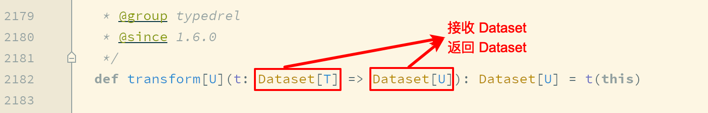`import spark.implicits._ val ds = spark.range(5) ds.transform( dataset => dataset.withColumn("doubled", 'id * 2) )` |                                                              |
| `as`            | `as[Type]` 算子的主要作用是将弱类型的 `Dataset`转为强类型的 `Dataset`, 它有很多适用场景, 但是最常见的还是在读取数据的时候, 因为 `DataFrameReader` 体系大部分情况下是将读出来的数据转换为 `DataFrame` 的形式, 如果后续需要使用 `Dataset` 的强类型 `API`, 则需要将 `DataFrame` 转为 `Dataset`. 可以使用 `as[Type]` 算子完成这种操作```import spark.implicits._  val structType = StructType(   Seq(     StructField("name", StringType),     StructField("age", IntegerType),     StructField("gpa", FloatType)   ) )  val sourceDF = spark.read   .schema(structType)   .option("delimiter", "\t")   .csv("dataset/studenttab10k")  val dataset = sourceDF.as[Student] dataset.show()``` |                                                              |
| 过滤            | `filter`                                                     | `filter` 用来按照条件过滤数据集`import spark.implicits._ val ds = Seq(Person("zhangsan", 15), Person("lisi", 15)).toDS() ds.filter( person => person.name == "lisi" ).show()` |
| 聚合            | `groupByKey`                                                 | `grouByKey` 算子的返回结果是 `KeyValueGroupedDataset`, 而不是一个 `Dataset`, 所以必须要先经过 `KeyValueGroupedDataset` 中的方法进行聚合, 再转回 `Dataset`, 才能使用 `Action` 得出结果其实这也印证了分组后必须聚合的道理`import spark.implicits._ val ds = Seq(Person("zhangsan", 15), Person("zhangsan", 15), Person("lisi", 15)).toDS() ds.groupByKey( person => person.name ).count().show()` |
| 切分            | `randomSplit`                                                | `randomSplit` 会按照传入的权重随机将一个 `Dataset` 分为多个 `Dataset`, 传入 `randomSplit`的数组有多少个权重, 最终就会生成多少个 `Dataset`, 这些权重的加倍和应该为 1, 否则将被标准化`val ds = spark.range(15) val datasets: Array[Dataset[lang.Long]] = ds.randomSplit(Array[Double](2, 3)) datasets.foreach(dataset => dataset.show())` |
| `sample`        | `sample` 会随机在 `Dataset` 中抽样`val ds = spark.range(15) ds.sample(withReplacement = false, fraction = 0.4).show()` |                                                              |
| 排序            | `orderBy`                                                    | `orderBy` 配合 `Column` 的 `API`, 可以实现正反序排列`import spark.implicits._ val ds = Seq(Person("zhangsan", 12), Person("zhangsan", 8), Person("lisi", 15)).toDS() ds.orderBy("age").show() ds.orderBy('age.desc).show()` |
| `sort`          | 其实 `orderBy` 是 `sort` 的别名, 所以它们所实现的功能是一样的`import spark.implicits._ val ds = Seq(Person("zhangsan", 12), Person("zhangsan", 8), Person("lisi", 15)).toDS() ds.sort('age.desc).show()` |                                                              |
| 分区            | `coalesce`                                                   | 减少分区, 此算子和 `RDD` 中的 `coalesce` 不同, `Dataset` 中的 `coalesce` 只能减少分区数, `coalesce` 会直接创建一个逻辑操作, 并且设置 `Shuffle` 为 `false``val ds = spark.range(15) ds.coalesce(1).explain(true)` |
| `repartitions`  | `repartitions` 有两个作用, 一个是重分区到特定的分区数, 另一个是按照某一列来分区, 类似于 `SQL` 中的 `DISTRIBUTE BY``val ds = Seq(Person("zhangsan", 12), Person("zhangsan", 8), Person("lisi", 15)).toDS() ds.repartition(4) ds.repartition('name)` |                                                              |
| 去重            | `dropDuplicates`                                             | 使用 `dropDuplicates` 可以去掉某一些列中重复的行`import spark.implicits._ val ds = spark.createDataset(Seq(Person("zhangsan", 15), Person("zhangsan", 15), Person("lisi", 15))) ds.dropDuplicates("age").show()` |
| `distinct`      | 当 `dropDuplicates` 中没有传入列名的时候, 其含义是根据所有列去重, `dropDuplicates()` 方法还有一个别名, 叫做 `distinct`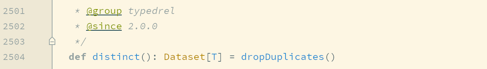所以, 使用 `distinct` 也可以去重, 并且只能根据所有的列来去重`import spark.implicits._ val ds = spark.createDataset(Seq(Person("zhangsan", 15), Person("zhangsan", 15), Person("lisi", 15))) ds.distinct().show()` |                                                              |
| 集合操作        | `except`                                                     | `except` 和 `SQL` 语句中的 `except` 一个意思, 是求得 `ds1` 中不存在于 `ds2` 中的数据, 其实就是差集`val ds1 = spark.range(1, 10) val ds2 = spark.range(5, 15)  ds1.except(ds2).show()` |
| `intersect`     | 求得两个集合的交集`val ds1 = spark.range(1, 10) val ds2 = spark.range(5, 15)  ds1.intersect(ds2).show()` |                                                              |
| `union`         | 求得两个集合的并集`val ds1 = spark.range(1, 10) val ds2 = spark.range(5, 15)  ds1.union(ds2).show()` |                                                              |
| `limit`         | 限制结果集数量`val ds = spark.range(1, 10) ds.limit(3).show()` |                                                              |

### 8.2. 无类型转换

  

分类

算子

解释

选择

`select`

`select` 用来选择某些列出现在结果集中

    import spark.implicits._
    val ds = Seq(Person("zhangsan", 12), Person("zhangsan", 8), Person("lisi", 15)).toDS()
    ds.select($"name").show()

`selectExpr`

在 `SQL` 语句中, 经常可以在 `select` 子句中使用 `count(age)`, `rand()` 等函数, 在 `selectExpr` 中就可以使用这样的 `SQL` 表达式, 同时使用 `select` 配合 `expr` 函数也可以做到类似的效果

    import spark.implicits._
    import org.apache.spark.sql.functions._
    val ds = Seq(Person("zhangsan", 12), Person("zhangsan", 8), Person("lisi", 15)).toDS()
    ds.selectExpr("count(age) as count").show()
    ds.selectExpr("rand() as random").show()
    ds.select(expr("count(age) as count")).show()

`withColumn`

通过 `Column` 对象在 `Dataset` 中创建一个新的列或者修改原来的列

    import spark.implicits._
    import org.apache.spark.sql.functions._
    val ds = Seq(Person("zhangsan", 12), Person("zhangsan", 8), Person("lisi", 15)).toDS()
    ds.withColumn("random", expr("rand()")).show()

`withColumnRenamed`

修改列名

    import spark.implicits._
    val ds = Seq(Person("zhangsan", 12), Person("zhangsan", 8), Person("lisi", 15)).toDS()
    ds.withColumnRenamed("name", "new_name").show()

剪除

drop

剪掉某个列

    import spark.implicits._
    val ds = Seq(Person("zhangsan", 12), Person("zhangsan", 8), Person("lisi", 15)).toDS()
    ds.drop('age).show()

聚合

groupBy

按照给定的行进行分组

    import spark.implicits._
    val ds = Seq(Person("zhangsan", 12), Person("zhangsan", 8), Person("lisi", 15)).toDS()
    ds.groupBy('name).count().show()

### 8.5. Column 对象

导读

Column 表示了 Dataset 中的一个列, 并且可以持有一个表达式, 这个表达式作用于每一条数据, 对每条数据都生成一个值, 之所以有单独这样的一个章节是因为列的操作属于细节, 但是又比较常见, 会在很多算子中配合出现

1. 创建:`'`

   解释:单引号 `'` 在 Scala 中是一个特殊的符号, 通过 `'` 会生成一个 `Symbol` 对象, `Symbol` 对象可以理解为是一个字符串的变种, 但是比字符串的效率高很多, 在 `Spark` 中, 对 `Scala` 中的 `Symbol` 对象做了隐式转换, 转换为一个 `ColumnName` 对象, `ColumnName` 是 `Column` 的子类, 所以在 `Spark` 中可以如下去选中一个列

    val spark = SparkSession.builder().appName("column").master("local[6]").getOrCreate()
    import spark.implicits._
    val personDF = Seq(Person("zhangsan", 12), Person("zhangsan", 8), Person("lisi", 15)).toDS()
   
    val c1: Symbol = 'name

2. 创建:`$`

   解释:同理, `$` 符号也是一个隐式转换, 同样通过 `spark.implicits` 导入, 通过 `$` 可以生成一个 `Column` 对象

    val spark = SparkSession.builder().appName("column").master("local[6]").getOrCreate()
    import spark.implicits._
    val personDF = Seq(Person("zhangsan", 12), Person("zhangsan", 8), Person("lisi", 15)).toDS()
   
    val c2: ColumnName = $"name"

3. `col`

   解释:`SparkSQL` 提供了一系列的函数, 可以通过函数实现很多功能, 在后面课程中会进行详细介绍, 这些函数中有两个可以帮助我们创建 `Column` 对象, 一个是 `col`, 另外一个是 `column`

    val spark = SparkSession.builder().appName("column").master("local[6]").getOrCreate()
    import org.apache.spark.sql.functions._
    val personDF = Seq(Person("zhangsan", 12), Person("zhangsan", 8), Person("lisi", 15)).toDS()
   
    val c3: sql.Column = col("name")

4. `column`

    val spark = SparkSession.builder().appName("column").master("local[6]").getOrCreate()
    import org.apache.spark.sql.functions._
    val personDF = Seq(Person("zhangsan", 12), Person("zhangsan", 8), Person("lisi", 15)).toDS()
    
    val c4: sql.Column = column("name")

5. `Dataset.col`

   解释:前面的 `Column` 对象创建方式所创建的 `Column` 对象都是 `Free` 的, 也就是没有绑定任何 `Dataset`, 所以可以作用于任何 `Dataset`, 同时, 也可以通过 `Dataset` 的 `col` 方法选择一个列, 但是这个 `Column` 是绑定了这个 `Dataset` 的, 所以只能用于创建其的 `Dataset` 上

    val spark = SparkSession.builder().appName("column").master("local[6]").getOrCreate()
    val personDF = Seq(Person("zhangsan", 12), Person("zhangsan", 8), Person("lisi", 15)).toDS()
   
    val c5: sql.Column = personDF.col("name")

6. `Dataset.apply`

   解释:可以通过 `Dataset` 对象的 `apply` 方法来获取一个关联此 `Dataset` 的 `Column` 对象

    val spark = SparkSession.builder().appName("column").master("local[6]").getOrCreate()
    val personDF = Seq(Person("zhangsan", 12), Person("zhangsan", 8), Person("lisi", 15)).toDS()
   
    val c6: sql.Column = personDF.apply("name")

7. `apply` 的调用有一个简写形式

    val c7: sql.Column = personDF("name")

别名和转换

1. `as[Type]`

   解释:`as` 方法有两个用法, 通过 `as[Type]` 的形式可以将一个列中数据的类型转为 `Type` 类型

    personDF.select(col("age").as[Long]).show()

2. `as(name)`

   解释:通过 `as(name)` 的形式使用 `as` 方法可以为列创建别名

    personDF.select(col("age").as("age_new")).show()

添加列

1. `withColumn`

   解释:通过 `Column` 在添加一个新的列时候修改 `Column` 所代表的列的数据

    personDF.withColumn("double_age", 'age * 2).show()

操作

1. `like`

   解释:通过 `Column` 的 `API`, 可以轻松实现 `SQL` 语句中 `LIKE` 的功能

    personDF.filter('name like "%zhang%").show()

2. `isin`

   解释:通过 `Column` 的 `API`, 可以轻松实现 `SQL` 语句中 `ISIN` 的功能

    personDF.filter('name isin ("hello", "zhangsan")).show()

3. `sort`

   解释:在排序的时候, 可以通过 `Column` 的 `API` 实现正反序

    personDF.sort('age.asc).show()
    personDF.sort('age.desc).show()

9\. 缺失值处理
---------

导读

1.  `DataFrame` 中什么时候会有无效值
    
2.  `DataFrame` 如何处理无效的值
    
3.  `DataFrame` 如何处理 `null`
    

缺失值的处理思路

如果想探究如何处理无效值, 首先要知道无效值从哪来, 从而分析可能产生的无效值有哪些类型, 在分别去看如何处理无效值

什么是缺失值

一个值本身的含义是这个值不存在则称之为缺失值, 也就是说这个值本身代表着缺失, 或者这个值本身无意义, 比如说 `null`, 比如说空字符串


关于数据的分析其实就是统计分析的概念, 如果这样的话, 当数据集中存在缺失值, 则无法进行统计和分析, 对很多操作都有影响

缺失值如何产生的


Spark 大多时候处理的数据来自于业务系统中, 业务系统中可能会因为各种原因, 产生一些异常的数据

例如说因为前后端的判断失误, 提交了一些非法参数. 再例如说因为业务系统修改 `MySQL` 表结构产生的一些空值数据等. 总之在业务系统中出现缺失值其实是非常常见的一件事, 所以大数据系统就一定要考虑这件事.

缺失值的类型

常见的缺失值有两种

*   `null`, `NaN` 等特殊类型的值, 某些语言中 `null` 可以理解是一个对象, 但是代表没有对象, `NaN` 是一个数字, 可以代表不是数字
    
    针对这一类的缺失值, `Spark` 提供了一个名为 `DataFrameNaFunctions` 特殊类型来操作和处理
    
*   `"Null"`, `"NA"`, `" "` 等解析为字符串的类型, 但是其实并不是常规字符串数据
    
    针对这类字符串, 需要对数据集进行采样, 观察异常数据, 总结经验, 各个击破
    

`DataFrameNaFunctions`

`DataFrameNaFunctions` 使用 `Dataset` 的 `na` 函数来获取

    val df = ...
    val naFunc: DataFrameNaFunctions = df.na

当数据集中出现缺失值的时候, 大致有两种处理方式, 一个是丢弃, 一个是替换为某值, `DataFrameNaFunctions` 中包含一系列针对空值数据的方案

*   `DataFrameNaFunctions.drop` 可以在当某行中包含 `null` 或 `NaN` 的时候丢弃此行
    
*   `DataFrameNaFunctions.fill` 可以在将 `null` 和 `NaN` 充为其它值
    
*   `DataFrameNaFunctions.replace` 可以把 `null` 或 `NaN` 替换为其它值, 但是和 `fill` 略有一些不同, 这个方法针对值来进行替换
    

如何使用 `SparkSQL` 处理 `null` 和 `NaN` ?

首先要将数据读取出来, 此次使用的数据集直接存在 `NaN`, 在指定 `Schema` 后, 可直接被转为 `Double.NaN`

    val schema = StructType(
      List(
        StructField("id", IntegerType),
        StructField("year", IntegerType),
        StructField("month", IntegerType),
        StructField("day", IntegerType),
        StructField("hour", IntegerType),
        StructField("season", IntegerType),
        StructField("pm", DoubleType)
      )
    )
    
    val df = spark.read
      .option("header", value = true)
      .schema(schema)
      .csv("dataset/beijingpm_with_nan.csv")

对于缺失值的处理一般就是丢弃和填充

丢弃包含 `null` 和 `NaN` 的行

当某行数据所有值都是 `null` 或者 `NaN` 的时候丢弃此行

    df.na.drop("all").show()

当某行中特定列所有值都是 `null` 或者 `NaN` 的时候丢弃此行

    df.na.drop("all", List("pm", "id")).show()

当某行数据任意一个字段为 `null` 或者 `NaN` 的时候丢弃此行

    df.na.drop().show()
    df.na.drop("any").show()

当某行中特定列任意一个字段为 `null` 或者 `NaN` 的时候丢弃此行

    df.na.drop(List("pm", "id")).show()
    df.na.drop("any", List("pm", "id")).show()

填充包含 `null` 和 `NaN` 的列

填充所有包含 `null` 和 `NaN` 的列

    df.na.fill(0).show()

填充特定包含 `null` 和 `NaN` 的列

    df.na.fill(0, List("pm")).show()

根据包含 `null` 和 `NaN` 的列的不同来填充

    import scala.collection.JavaConverters._
    
    df.na.fill(Map[String, Any]("pm" -> 0).asJava).show

如何使用 `SparkSQL` 处理异常字符串 ?

读取数据集, 这次读取的是最原始的那个 `PM` 数据集

    val df = spark.read
      .option("header", value = true)
      .csv("dataset/BeijingPM20100101_20151231.csv")

使用函数直接转换非法的字符串

    df.select('No as "id", 'year, 'month, 'day, 'hour, 'season,
        when('PM_Dongsi === "NA", 0)
        .otherwise('PM_Dongsi cast DoubleType)
        .as("pm"))
      .show()

使用 `where` 直接过滤

    df.select('No as "id", 'year, 'month, 'day, 'hour, 'season, 'PM_Dongsi)
      .where('PM_Dongsi =!= "NA")
      .show()

使用 `DataFrameNaFunctions` 替换, 但是这种方式被替换的值和新值必须是同类型

    df.select('No as "id", 'year, 'month, 'day, 'hour, 'season, 'PM_Dongsi)
      .na.replace("PM_Dongsi", Map("NA" -> "NaN"))
      .show()

10\. 聚合
-------

导读

1.  `groupBy`
    
2.  `rollup`
    
3.  `cube`
    
4.  `pivot`
    
5.  `RelationalGroupedDataset` 上的聚合操作
    

`groupBy`

`groupBy` 算子会按照列将 `Dataset` 分组, 并返回一个 `RelationalGroupedDataset` 对象, 通过 `RelationalGroupedDataset` 可以对分组进行聚合

Step 1: 加载实验数据

    private val spark = SparkSession.builder()
        .master("local[6]")
        .appName("aggregation")
        .getOrCreate()
    
      import spark.implicits._
    
      private val schema = StructType(
        List(
          StructField("id", IntegerType),
          StructField("year", IntegerType),
          StructField("month", IntegerType),
          StructField("day", IntegerType),
          StructField("hour", IntegerType),
          StructField("season", IntegerType),
          StructField("pm", DoubleType)
        )
      )
    
      private val pmDF = spark.read
        .schema(schema)
        .option("header", value = true)
        .csv("dataset/pm_without_null.csv")

Step 2: 使用 `functions` 函数进行聚合

    import org.apache.spark.sql.functions._
    
    val groupedDF: RelationalGroupedDataset = pmDF.groupBy('year)
    
    groupedDF.agg(avg('pm) as "pm_avg")
      .orderBy('pm_avg)
      .show()

Step 3: 除了使用 `functions` 进行聚合, 还可以直接使用 `RelationalGroupedDataset` 的 `API` 进行聚合

    groupedDF.avg("pm")
      .orderBy('pm_avg)
      .show()
    
    groupedDF.max("pm")
      .orderBy('pm_avg)
      .show()

多维聚合

我们可能经常需要针对数据进行多维的聚合, 也就是一次性统计小计, 总计等, 一般的思路如下

Step 1: 准备数据

    private val spark = SparkSession.builder()
      .master("local[6]")
      .appName("aggregation")
      .getOrCreate()
    
    import spark.implicits._
    
    private val schemaFinal = StructType(
      List(
        StructField("source", StringType),
        StructField("year", IntegerType),
        StructField("month", IntegerType),
        StructField("day", IntegerType),
        StructField("hour", IntegerType),
        StructField("season", IntegerType),
        StructField("pm", DoubleType)
      )
    )
    
    private val pmFinal = spark.read
      .schema(schemaFinal)
      .option("header", value = true)
      .csv("dataset/pm_final.csv")

Step 2: 进行多维度聚合

    import org.apache.spark.sql.functions._
    
    val groupPostAndYear = pmFinal.groupBy('source, 'year)
      .agg(sum("pm") as "pm")
    
    val groupPost = pmFinal.groupBy('source)
      .agg(sum("pm") as "pm")
      .select('source, lit(null) as "year", 'pm)
    
    groupPostAndYear.union(groupPost)
      .sort('source, 'year asc_nulls_last, 'pm)
      .show()

大家其实也能看出来, 在一个数据集中又小计又总计, 可能需要多个操作符, 如何简化呢? 请看下面

`rollup` 操作符

`rollup` 操作符其实就是 `groupBy` 的一个扩展, `rollup` 会对传入的列进行滚动 `groupBy`, `groupBy` 的次数为列数量 `+ 1`, 最后一次是对整个数据集进行聚合

Step 1: 创建数据集

    import org.apache.spark.sql.functions._
    
    val sales = Seq(
      ("Beijing", 2016, 100),
      ("Beijing", 2017, 200),
      ("Shanghai", 2015, 50),
      ("Shanghai", 2016, 150),
      ("Guangzhou", 2017, 50)
    ).toDF("city", "year", "amount")

Step 1: `rollup` 的操作

    sales.rollup("city", "year")
      .agg(sum("amount") as "amount")
      .sort($"city".desc_nulls_last, $"year".asc_nulls_last)
      .show()
    
    /**
      * 结果集:
      * +---------+----+------+
      * |     city|year|amount|
      * +---------+----+------+
      * | Shanghai|2015|    50| <-- 上海 2015 的小计
      * | Shanghai|2016|   150|
      * | Shanghai|null|   200| <-- 上海的总计
      * |Guangzhou|2017|    50|
      * |Guangzhou|null|    50|
      * |  Beijing|2016|   100|
      * |  Beijing|2017|   200|
      * |  Beijing|null|   300|
      * |     null|null|   550| <-- 整个数据集的总计
      * +---------+----+------+
      */

Step 2: 如果使用基础的 groupBy 如何实现效果?

    val cityAndYear = sales
      .groupBy("city", "year") // 按照 city 和 year 聚合
      .agg(sum("amount") as "amount")
    
    val city = sales
      .groupBy("city") // 按照 city 进行聚合
      .agg(sum("amount") as "amount")
      .select($"city", lit(null) as "year", $"amount")
    
    val all = sales
      .groupBy() // 全局聚合
      .agg(sum("amount") as "amount")
      .select(lit(null) as "city", lit(null) as "year", $"amount")
    
    cityAndYear
      .union(city)
      .union(all)
      .sort($"city".desc_nulls_last, $"year".asc_nulls_last)
      .show()
    
    /**
      * 统计结果:
      * +---------+----+------+
      * |     city|year|amount|
      * +---------+----+------+
      * | Shanghai|2015|    50|
      * | Shanghai|2016|   150|
      * | Shanghai|null|   200|
      * |Guangzhou|2017|    50|
      * |Guangzhou|null|    50|
      * |  Beijing|2016|   100|
      * |  Beijing|2017|   200|
      * |  Beijing|null|   300|
      * |     null|null|   550|
      * +---------+----+------+
      */

很明显可以看到, 在上述案例中, `rollup` 就相当于先按照 `city`, `year` 进行聚合, 后按照 `city` 进行聚合, 最后对整个数据集进行聚合, 在按照 `city` 聚合时, `year` 列值为 `null`, 聚合整个数据集的时候, 除了聚合列, 其它列值都为 `null`

使用 `rollup` 完成 `pm` 值的统计

上面的案例使用 `rollup` 来实现会非常的简单

    import org.apache.spark.sql.functions._
    
    pmFinal.rollup('source, 'year)
      .agg(sum("pm") as "pm_total")
      .sort('source.asc_nulls_last, 'year.asc_nulls_last)
      .show()

`cube`

`cube` 的功能和 `rollup` 是一样的, 但也有区别, 区别如下

*   `rollup(A, B).sum©`
    
    其结果集中会有三种数据形式: `A B C`, `A null C`, `null null C`
    
    不知道大家发现没, 结果集中没有对 `B` 列的聚合结果
    
*   `cube(A, B).sum©`
    
    其结果集中会有四种数据形式: `A B C`, `A null C`, `null null C`, `null B C`
    
    不知道大家发现没, 比 `rollup` 的结果集中多了一个 `null B C`, 也就是说, `rollup` 只会按照第一个列来进行组合聚合, 但是 `cube` 会将全部列组合聚合
    
````scala
    
    
    import org.apache.spark.sql.functions._
    
    pmFinal.cube('source, 'year)
      .agg(sum("pm") as "pm_total")
      .sort('source.asc_nulls_last, 'year.asc_nulls_last)
      .show()
    
    /**
    
    * 结果集为
      *
    * +-------+----+---------+
    * | source|year| pm_total|
    * +-------+----+---------+
    * | dongsi|2013| 735606.0|
    * | dongsi|2014| 745808.0|
    * | dongsi|2015| 752083.0|
    * | dongsi|null|2233497.0|
    * |us_post|2010| 841834.0|
    * |us_post|2011| 796016.0|
    * |us_post|2012| 750838.0|
    * |us_post|2013| 882649.0|
    * |us_post|2014| 846475.0|
    * |us_post|2015| 714515.0|
    * |us_post|null|4832327.0|
    * |   null|2010| 841834.0| <-- 新增
    * |   null|2011| 796016.0| <-- 新增
    * |   null|2012| 750838.0| <-- 新增
    * |   null|2013|1618255.0| <-- 新增
    * |   null|2014|1592283.0| <-- 新增
    * |   null|2015|1466598.0| <-- 新增
    * |   null|null|7065824.0|
    * +-------+----+---------+
    * */
    ````

`SparkSQL` 中支持的 `SQL` 语句实现 `cube` 功能

`SparkSQL` 支持 `GROUPING SETS` 语句, 可以随意排列组合空值分组聚合的顺序和组成, 既可以实现 `cube` 也可以实现 `rollup` 的功能

    pmFinal.createOrReplaceTempView("pm_final")
    spark.sql(
      """
        |select source, year, sum(pm)
        |from pm_final
        |group by source, year
        |grouping sets((source, year), (source), (year), ())
        |order by source asc nulls last, year asc nulls last
      """.stripMargin)
      .show()

`RelationalGroupedDataset`

常见的 `RelationalGroupedDataset` 获取方式有三种

*   `groupBy`
    
*   `rollup`
    
*   `cube`
    

无论通过任何一种方式获取了 `RelationalGroupedDataset` 对象, 其所表示的都是是一个被分组的 `DataFrame`, 通过这个对象, 可以对数据集的分组结果进行聚合

    val groupedDF: RelationalGroupedDataset = pmDF.groupBy('year)

需要注意的是, `RelationalGroupedDataset` 并不是 `DataFrame`, 所以其中并没有 `DataFrame` 的方法, 只有如下一些聚合相关的方法, 如下这些方法在调用过后会生成 `DataFrame` 对象, 然后就可以再次使用 `DataFrame` 的算子进行操作了


操作符

`avg`:求平均数

`count`:求总数

`max`:求极大值

`min`:求极小值

`mean`:求均数

`sum`:求和

`agg`:聚合, 可以使用 `sql.functions` 中的函数来配合进行操作

    pmDF.groupBy('year)
        .agg(avg('pm) as "pm_avg")

11\. 连接
-------

导读

1.  无类型连接 `join`
    
2.  连接类型 `Join Types`
    

无类型连接算子 `join` 的 `API`

Step 1: 什么是连接

按照 PostgreSQL 的文档中所说, 只要能在一个查询中, 同一时间并发的访问多条数据, 就叫做连接.

做到这件事有两种方式

1.  一种是把两张表在逻辑上连接起来, 一条语句中同时访问两张表
    
    ```sql
    select * from user join address on user.address_id = address.id
    ```
    
2.  还有一种方式就是表连接自己, 一条语句也能访问自己中的多条数据
    
    ```sql
    select * from user u1 join (select * from user) u2 on u1.id = u2.id
    ```
    

Step 2: `join` 算子的使用非常简单, 大致的调用方式如下

```scala
join(right: Dataset[_], joinExprs: Column, joinType: String): DataFrame
```

Step 3: 简单连接案例

表结构如下

```text
+---+------+------+            +---+---------+
| id|  name|cityId|            | id|     name|
+---+------+------+            +---+---------+
|  0|  Lucy|     0|            |  0|  Beijing|
|  1|  Lily|     0|            |  1| Shanghai|
|  2|   Tim|     2|            |  2|Guangzhou|
|  3|Danial|     0|            +---+---------+
+---+------+------+
```

如果希望对这两张表进行连接, 首先应该注意的是可以连接的字段, 比如说此处的左侧表 `cityId` 和右侧表 `id` 就是可以连接的字段, 使用 `join` 算子就可以将两个表连接起来, 进行统一的查询

```scala
val person = Seq((0, "Lucy", 0), (1, "Lily", 0), (2, "Tim", 2), (3, "Danial", 0))
  .toDF("id", "name", "cityId")

val cities = Seq((0, "Beijing"), (1, "Shanghai"), (2, "Guangzhou"))
  .toDF("id", "name")

person.join(cities, person.col("cityId") === cities.col("id"))
  .select(person.col("id"),
    person.col("name"),
    cities.col("name") as "city")
  .show()

/**
  * 执行结果:
  *
  * +---+------+---------+
  * | id|  name|     city|
  * +---+------+---------+
  * |  0|  Lucy|  Beijing|
  * |  1|  Lily|  Beijing|
  * |  2|   Tim|Guangzhou|
  * |  3|Danial|  Beijing|
  * +---+------+---------+
  */
```

Step 4: 什么是连接?

现在两个表连接得到了如下的表

```text
+---+------+---------+
| id|  name|     city|
+---+------+---------+
|  0|  Lucy|  Beijing|
|  1|  Lily|  Beijing|
|  2|   Tim|Guangzhou|
|  3|Danial|  Beijing|
+---+------+---------+
```

通过对这张表的查询, 这个查询是作用于两张表的, 所以是同一时间访问了多条数据

```scala
spark.sql("select name from user_city where city = 'Beijing'").show()

/**
  * 执行结果
  *
  * +------+
  * |  name|
  * +------+
  * |  Lucy|
  * |  Lily|
  * |Danial|
  * +------+
  */
```


连接类型

如果要运行如下代码, 需要先进行数据准备

```scala
private val spark = SparkSession.builder()
  .master("local[6]")
  .appName("aggregation")
  .getOrCreate()

import spark.implicits._

val person = Seq((0, "Lucy", 0), (1, "Lily", 0), (2, "Tim", 2), (3, "Danial", 3))
  .toDF("id", "name", "cityId")
person.createOrReplaceTempView("person")

val cities = Seq((0, "Beijing"), (1, "Shanghai"), (2, "Guangzhou"))
  .toDF("id", "name")
cities.createOrReplaceTempView("cities")
```


1. 连接类型：交叉连接`cross`

   解释

   交叉连接就是笛卡尔积, 就是两个表中所有的数据两两结对

   交叉连接是一个非常重的操作, 在生产中, 尽量不要将两个大数据集交叉连接, 如果一定要交叉连接, 也需要在交叉连接后进行过滤, 优化器会进行优化

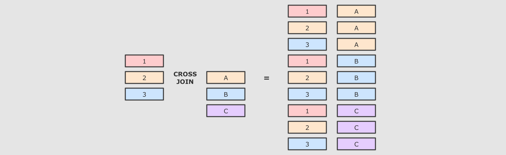

`SQL` 语句

    select * from person cross join cities

`Dataset` 操作

    person.crossJoin(cities)
      .where(person.col("cityId") === cities.col("id"))
      .show()

2. 连接类型：内连接:`inner`

   解释：内连接就是按照条件找到两个数据集关联的数据, 并且在生成的结果集中只存在能关联到的数据


`SQL` 语句

    select * from person inner join cities on person.cityId = cities.id

`Dataset` 操作

    person.join(right = cities,
      joinExprs = person("cityId") === cities("id"),
      joinType = "inner")
      .show()

3. 连接类型全外连接：`outer`, `full`, `fullouter`

   解释：内连接和外连接的最大区别, 就是内连接的结果集中只有可以连接上的数据, 而外连接可以包含没有连接上的数据, 根据情况的不同, 外连接又可以分为很多种, 比如所有的没连接上的数据都放入结果集, 就叫做全外连接


`SQL` 语句

    select * from person full outer join cities on person.cityId = cities.id

`Dataset` 操作

    person.join(right = cities,
      joinExprs = person("cityId") === cities("id"),
      joinType = "full") // "outer", "full", "full_outer"
      .show()

4. 连接类型左外连接：`leftouter`, `left`

   解释：左外连接是全外连接的一个子集, 全外连接中包含左右两边数据集没有连接上的数据, 而左外连接只包含左边数据集中没有连接上的数据


`SQL` 语句

    select * from person left join cities on person.cityId = cities.id

`Dataset` 操作

```scala
person.join(right = cities,
  joinExprs = person("cityId") === cities("id"),
  joinType = "left") // leftouter, left
  .show()
```

5. 连接类型: `LeftAnti`:`leftanti`

   解释:`LeftAnti` 是一种特殊的连接形式, 和左外连接类似, 但是其结果集中没有右侧的数据, 只包含左边集合中没连接上的数据


`SQL` 语句

    select * from person left anti join cities on person.cityId = cities.id

`Dataset` 操作

    person.join(right = cities,
      joinExprs = person("cityId") === cities("id"),
      joinType = "left_anti")
      .show()

6. `LeftSemi`:`leftsemi`

   解释:和 `LeftAnti` 恰好相反, `LeftSemi` 的结果集也没有右侧集合的数据, 但是只包含左侧集合中连接上的数据


`SQL` 语句

    select * from person left semi join cities on person.cityId = cities.id

`Dataset` 操作

    person.join(right = cities,
      joinExprs = person("cityId") === cities("id"),
      joinType = "left_semi")
      .show()

7. 连接类型:右外连接:`rightouter`, `right`

   解释:右外连接和左外连接刚好相反, 左外是包含左侧未连接的数据, 和两个数据集中连接上的数据, 而右外是包含右侧未连接的数据, 和两个数据集中连接上的数据


`SQL` 语句

    select * from person right join cities on person.cityId = cities.id

`Dataset` 操作

    person.join(right = cities,
      joinExprs = person("cityId") === cities("id"),
      joinType = "right") // rightouter, right
      .show()

\[扩展\] 广播连接

Step 1: 正常情况下的 `Join` 过程

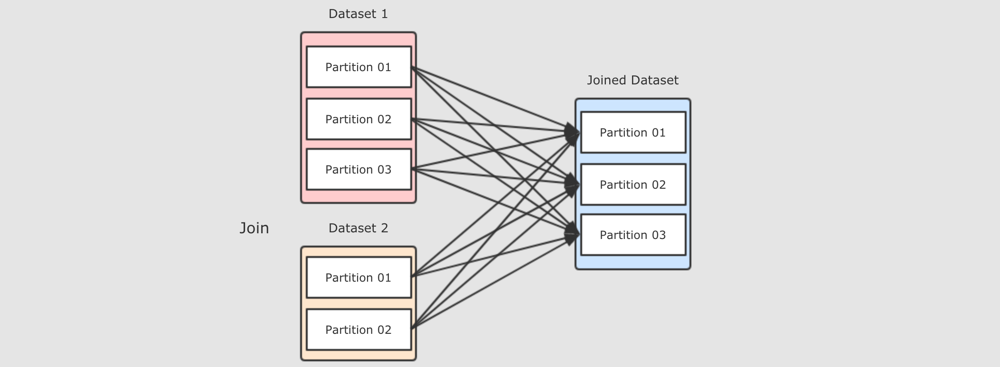

`Join` 会在集群中分发两个数据集, 两个数据集都要复制到 `Reducer` 端, 是一个非常复杂和标准的 `ShuffleDependency`, 有什么可以优化效率吗?

Step 2: `Map` 端 `Join`

前面图中看的过程, 之所以说它效率很低, 原因是需要在集群中进行数据拷贝, 如果能减少数据拷贝, 就能减少开销

如果能够只分发一个较小的数据集呢?


可以将小数据集收集起来, 分发给每一个 `Executor`, 然后在需要 `Join` 的时候, 让较大的数据集在 `Map` 端直接获取小数据集, 从而进行 `Join`, 这种方式是不需要进行 `Shuffle` 的, 所以称之为 `Map` 端 `Join`

Step 3: `Map` 端 `Join` 的常规实现

如果使用 `RDD` 的话, 该如何实现 `Map` 端 `Join` 呢?

    val personRDD = spark.sparkContext.parallelize(Seq((0, "Lucy", 0),
      (1, "Lily", 0), (2, "Tim", 2), (3, "Danial", 3)))
    
    val citiesRDD = spark.sparkContext.parallelize(Seq((0, "Beijing"),
      (1, "Shanghai"), (2, "Guangzhou")))
    
    val citiesBroadcast = spark.sparkContext.broadcast(citiesRDD.collectAsMap())
    
    val result = personRDD.mapPartitions(
      iter => {
        val citiesMap = citiesBroadcast.value
        // 使用列表生成式 yield 生成列表
        val result = for (person <- iter if citiesMap.contains(person._3))
          yield (person._1, person._2, citiesMap(person._3))
        result
      }
    ).collect()
    
    result.foreach(println(_))

Step 4: 使用 `Dataset` 实现 `Join` 的时候会自动进行 `Map` 端 `Join`

自动进行 `Map` 端 `Join` 需要依赖一个系统参数 `spark.sql.autoBroadcastJoinThreshold`, 当数据集小于这个参数的大小时, 会自动进行 `Map` 端 `Join`

如下, 开启自动 `Join`

    println(spark.conf.get("spark.sql.autoBroadcastJoinThreshold").toInt / 1024 / 1024)
    
    println(person.crossJoin(cities).queryExecution.sparkPlan.numberedTreeString)

当关闭这个参数的时候, 则不会自动 Map 端 Join 了

    spark.conf.set("spark.sql.autoBroadcastJoinThreshold", -1)
    println(person.crossJoin(cities).queryExecution.sparkPlan.numberedTreeString)

Step 5: 也可以使用函数强制开启 Map 端 Join

在使用 Dataset 的 join 时, 可以使用 broadcast 函数来实现 Map 端 Join

    import org.apache.spark.sql.functions._
    spark.conf.set("spark.sql.autoBroadcastJoinThreshold", -1)
    println(person.crossJoin(broadcast(cities)).queryExecution.sparkPlan.numberedTreeString)

即使是使用 SQL 也可以使用特殊的语法开启

    spark.conf.set("spark.sql.autoBroadcastJoinThreshold", -1)
    val resultDF = spark.sql(
      """
        |select /*+ MAPJOIN (rt) */ * from person cross join cities rt
      """.stripMargin)
    println(resultDF.queryExecution.sparkPlan.numberedTreeString)

12\. 窗口函数
---------

目标和步骤

目标

理解窗口操作的语义, 掌握窗口函数的使用

步骤

1.  案例1, 第一名和第二名
    
2.  窗口函数介绍
    
3.  案例2, 最优差值
    

### 12.1. 第一名和第二名案例

目标和步骤

目标

掌握如何使用 `SQL` 和 `DataFrame` 完成名次统计, 并且对窗口函数有一个模糊的认识, 方便后面的启发

步骤

1.  需求介绍
    
2.  代码编写
    

需求介绍

1.  数据集
    
    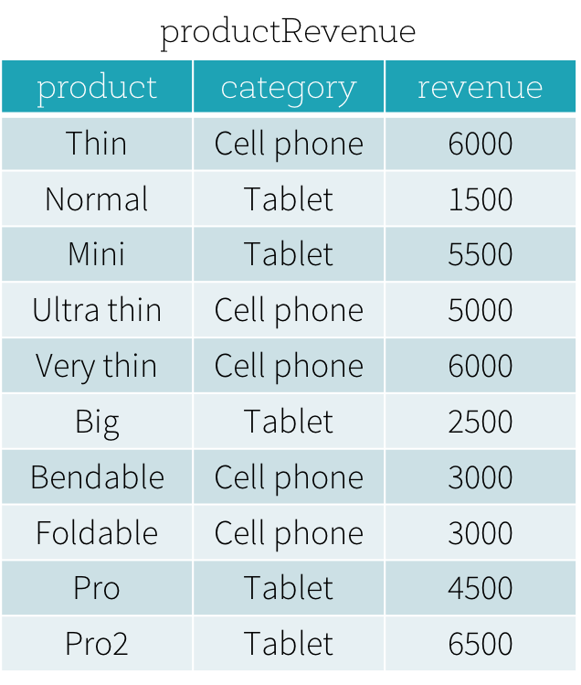
    
    *   `product` : 商品名称
        
    *   `categroy` : 类别
        
    *   `revenue` : 收入
        
    
2.  需求分析
    
    需求
    
    *   从数据集中得到每个类别收入第一的商品和收入第二的商品
        
        关键点是, 每个类别, 收入前两名
        
        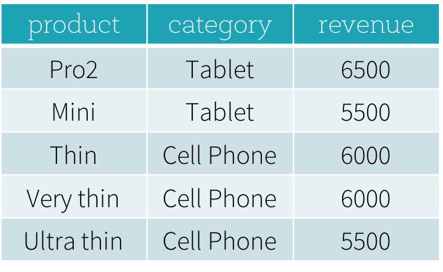
        
    
    方案1: 使用常见语法子查询
    
    *   问题1: `Spark` 和 `Hive` 这样的系统中, 有自增主键吗? 没有
        
    *   问题2: 为什么分布式系统中很少见自增主键? 因为分布式环境下数据在不同的节点中, 很难保证顺序
        
    *   解决方案: 按照某一列去排序, 取前两条数据
        
    *   遗留问题: 不容易在分组中取每一组的前两个
        
    
        SELECT * FROM productRevenue ORDER BY revenue LIMIT 2
    
    方案2: 计算每一个类别的按照收入排序的序号, 取每个类别中的前两个
    
    
    
    思路步骤
    
    1.  按照类别分组
        
    2.  每个类别中的数据按照收入排序
        
    3.  为排序过的数据增加编号
        
    4.  取得每个类别中的前两个数据作为最终结果
        
    
    使用 `SQL` 就不太容易做到, 需要一个语法, 叫做窗口函数
    

代码编写

1.  创建初始环境
    
    1.  创建新的类 `WindowFunction`
        
    2.  编写测试方法
        
    3.  初始化 `SparkSession`
        
    4.  创建数据集
        
    ````scala
        class WindowFunction {
        
          @Test
          def firstSecond(): Unit = {
            val spark = SparkSession.builder()
              .appName("window")
              .master("local[6]")
              .getOrCreate()
        
            import spark.implicits._
        
            val data = Seq(
              ("Thin", "Cell phone", 6000),
              ("Normal", "Tablet", 1500),
              ("Mini", "Tablet", 5500),
              ("Ultra thin", "Cell phone", 5000),
              ("Very thin", "Cell phone", 6000),
              ("Big", "Tablet", 2500),
              ("Bendable", "Cell phone", 3000),
              ("Foldable", "Cell phone", 3000),
              ("Pro", "Tablet", 4500),
              ("Pro2", "Tablet", 6500)
            )
        
            val source = data.toDF("product", "category", "revenue")
          }
        }
    ````
    
2.  方式一: `SQL` 语句::
    
    ```sql
    SELECT
      product,
      category,
      revenue
    FROM (
      SELECT
        product,
        category,
        revenue,
        dense_rank() OVER (PARTITION BY category ORDER BY revenue DESC) as rank
      FROM productRevenue) tmp
    WHERE
      rank <= 2
    ```
    
    *   窗口函数在 `SQL` 中的完整语法如下
        
        ```scala
        function OVER (PARITION BY ... ORDER BY ... FRAME_TYPE BETWEEN ... AND ...)
        ```
        
    
3.  方式二: 使用 `DataFrame` 的命令式 `API`::
    
    ```scala
    val window: WindowSpec = Window.partitionBy('category)
      .orderBy('revenue.desc)
    
    source.select('product, 'category, 'revenue, dense_rank() over window as "rank")
      .where('rank <= 2)
      .show()
    ```
    
    *   `WindowSpec` : 窗口的描述符, 描述窗口应该是怎么样的
        
    *   `dense_rank() over window` : 表示一个叫做 `dense_rank()` 的函数作用于每一个窗口
        
    

总结

*   在 `Spark` 中, 使用 `SQL` 或者 `DataFrame` 都可以操作窗口
    
*   窗口的使用有两个步骤
    
    1.  定义窗口规则
        
    2.  定义窗口函数
        
    
*   在不同的范围内统计名次时, 窗口函数非常得力
    

### 12.2. 窗口函数

目标和步骤

目标

了解窗口函数的使用方式, 能够使用窗口函数完成统计

步骤

1.  窗口函数的逻辑
    
2.  窗口定义部分
    
3.  统计函数部分
    

窗口函数的逻辑

从 **逻辑** 上来讲, 窗口函数执行步骤大致可以分为如下几步

    dense_rank() OVER (PARTITION BY category ORDER BY revenue DESC) as rank

1.  根据 `PARTITION BY category`, 对数据进行分组
    
    
    
2.  分组后, 根据 `ORDER BY revenue DESC` 对每一组数据进行排序
    
    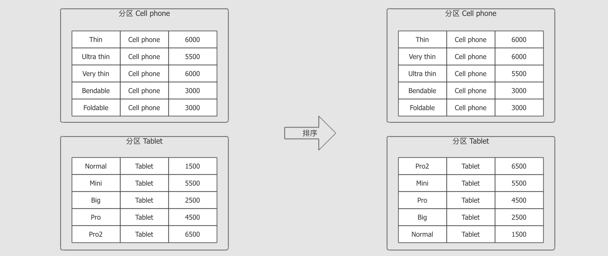
    
3.  在 **每一条数据** 到达窗口函数时, 套入窗口内进行计算
    
    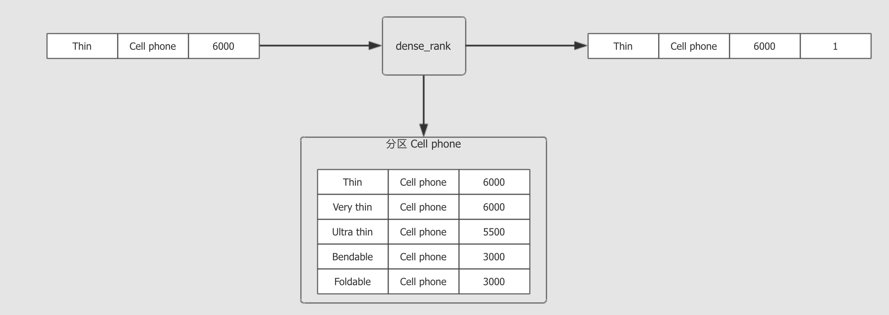
    

从语法的角度上讲, 窗口函数大致分为两个部分

    dense_rank() OVER (PARTITION BY category ORDER BY revenue DESC) as rank

*   函数部分 `dense_rank()`
    
*   窗口定义部分 `PARTITION BY category ORDER BY revenue DESC`
    

窗口函数和 `GroupBy` 最大的区别, 就是 `GroupBy` 的聚合对每一个组只有一个结果, 而窗口函数可以对每一条数据都有一个结果

说白了, 窗口函数其实就是根据当前数据, 计算其在所在的组中的统计数据

窗口定义部分

    dense_rank() OVER (PARTITION BY category ORDER BY revenue DESC) as rank

1.  `Partition` 定义
    
    控制哪些行会被放在一起, 同时这个定义也类似于 `Shuffle`, 会将同一个分组的数据放在同一台机器中处理
    
    
    
2.  `Order` 定义
    
    在一个分组内进行排序, 因为很多操作, 如 `rank`, 需要进行排序
    
    
    
3.  `Frame` 定义
    
    释义
    
    *   窗口函数会针对 **每一个组中的每一条数据** 进行统计聚合或者 `rank`, 一个组又称为一个 `Frame`
        
    *   分组由两个字段控制, `Partition` 在整体上进行分组和分区
        
    *   而通过 `Frame` 可以通过 **当前行** 来更细粒度的分组控制
        
        举个栗子, 例如公司每月销售额的数据, 统计其同比增长率, 那就需要把这条数据和前面一条数据进行结合计算了
        
    
    有哪些控制方式?
    
    *   `Row Frame`
        
        通过 `"行号"` 来表示
        
        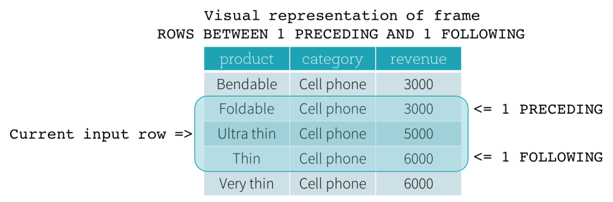
        
    *   `Range Frame`
        
        通过某一个列的差值来表示
        
        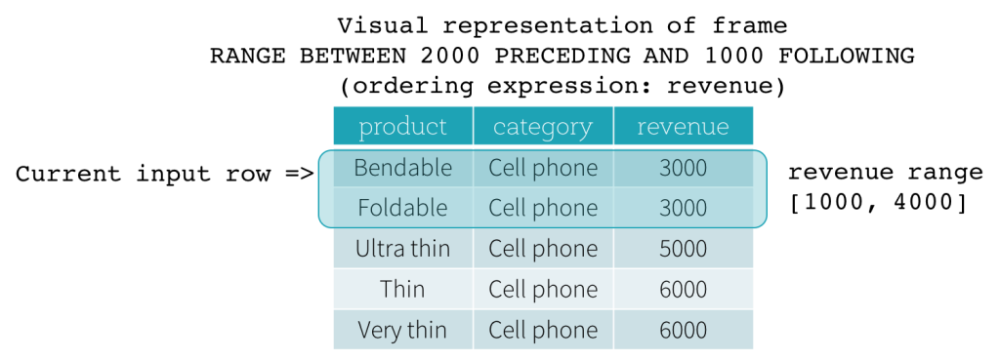
        
        
        
        
        
        
        
        
        
    

函数部分

    dense_rank() OVER (PARTITION BY category ORDER BY revenue DESC) as rank

如下是支持的窗口函数

  

类型

函数

解释

排名函数

`rank`

*   排名函数, 计算当前数据在其 `Frame` 中的位置
    
*   如果有重复, 则重复项后面的行号会有空挡
    

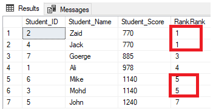

`dense_rank`

*   和 rank 一样, 但是结果中没有空挡
    

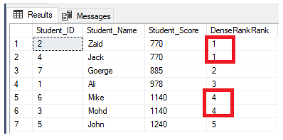

`row_number`

*   和 rank 一样, 也是排名, 但是不同点是即使有重复想, 排名依然增长
    

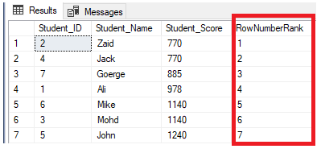

分析函数

`first_value`

获取这个组第一条数据

`last_value`

获取这个组最后一条数据

`lag`

`lag(field, n)` 获取当前数据的 `field` 列向前 `n` 条数据

`lead`

`lead(field, n)` 获取当前数据的 `field` 列向后 `n` 条数据

聚合函数

`*`

所有的 `functions` 中的聚合函数都支持

总结

*   窗口操作分为两个部分
    
    *   窗口定义, 定义时可以指定 `Partition`, `Order`, `Frame`
        
    *   函数操作, 可以使用三大类函数, 排名函数, 分析函数, 聚合函数
        
    

### 12.3. 最优差值案例

目标和步骤

目标

能够针对每个分类进行计算, 求得常见指标, 并且理解实践上面的一些理论

步骤

1.  需求介绍
    
2.  代码实现
    

需求介绍

*   源数据集
    
    
    
*   需求
    
    统计每个商品和此品类最贵商品之间的差值
    
*   目标数据集
    
    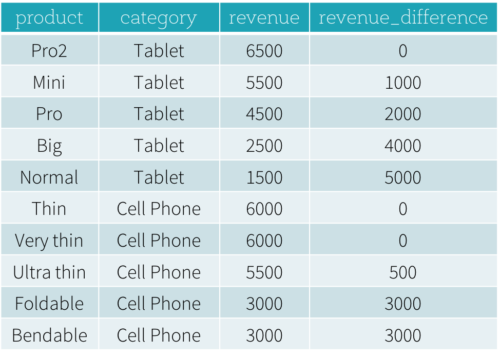
    

代码实现

步骤

1.  创建数据集
    
2.  创建窗口, 按照 `revenue` 分组, 并倒叙排列
    
3.  应用窗口
    

代码

```scala
val spark = SparkSession.builder()
  .appName("window")
  .master("local[6]")
  .getOrCreate()

import spark.implicits._
import org.apache.spark.sql.functions._

val data = Seq(
  ("Thin", "Cell phone", 6000),
  ("Normal", "Tablet", 1500),
  ("Mini", "Tablet", 5500),
  ("Ultra thin", "Cell phone", 5500),
  ("Very thin", "Cell phone", 6000),
  ("Big", "Tablet", 2500),
  ("Bendable", "Cell phone", 3000),
  ("Foldable", "Cell phone", 3000),
  ("Pro", "Tablet", 4500),
  ("Pro2", "Tablet", 6500)
)

val source = data.toDF("product", "category", "revenue")

val windowSpec = Window.partitionBy('category)
  .orderBy('revenue.desc)

source.select(
  'product, 'category, 'revenue,
  ((max('revenue) over windowSpec) - 'revenue) as 'revenue_difference
).show()
```
