# Spark Streaming

导读

1. 介绍
2. 入门
3. 原理
4. 操作

Table of Contents

- [1. Spark Streaming 介绍](#_1_spark_streaming_介绍)
- [2. Spark Streaming 入门](#_2_spark_streaming_入门)
- [2. 原理](#_2_原理)
- [3. 操作](#_3_操作)

## 1. Spark Streaming 介绍

导读

1. 流式计算的场景
2. 流式计算框架
3. `Spark Streaming` 的特点

- 新的场景

  通过对现阶段一些常见的需求进行整理, 我们要问自己一个问题, 这些需求如何解决?

1. 商品推荐
   - 京东和淘宝这样的商城在购物车, 商品详情等地方都有商品推荐的模块
   - 商品推荐的要求
     - 快速的处理, 加入购物车以后就需要迅速的进行推荐
     - 数据量大
     - 需要使用一些推荐算法

2. 工业大数据

   

   - 现在的工场中, 设备是可以联网的, 汇报自己的运行状态, 在应用层可以针对这些数据来分析运行状况和稳健程度, 展示工件完成情况, 运行情况等
   - 工业大数据的需求
     - 快速响应, 及时预测问题
     - 数据是以事件的形式动态的产品和汇报
     - 因为是运行状态信息, 而且一般都是几十上百台机器, 所以汇报的数据量很大

3. 监控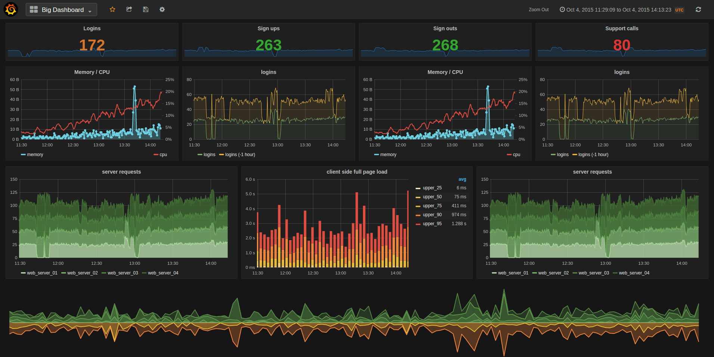
   - 一般的大型集群和平台, 都需要对其进行监控
   - 监控的需求
     - 要针对各种数据库, 包括 `MySQL`, `HBase` 等进行监控
     - 要针对应用进行监控, 例如 `Tomcat`, `Nginx`, `Node.js` 等
     - 要针对硬件的一些指标进行监控, 例如 `CPU`, 内存, 磁盘 等
     - 这些工具的日志输出是非常多的, 往往一个用户的访问行为会带来几百条日志, 这些都要汇报, 所以数据量比较大
     - 要从这些日志中, 聚合系统运行状况

> ![note] 
>
> 这样的需求, 可以通过传统的批处理来完成吗?

- 流计算

  - 批量计算数据已经存在, 一次性读取所有的数据进行批量处理
  - 流计算数据源源不断的进来, 经过处理后落地

- 流和批的架构组合

  流和批都是有意义的, 有自己的应用场景, 那么如何结合流和批呢? 如何在同一个系统中使用这两种不同的解决方案呢?

  - 混合架构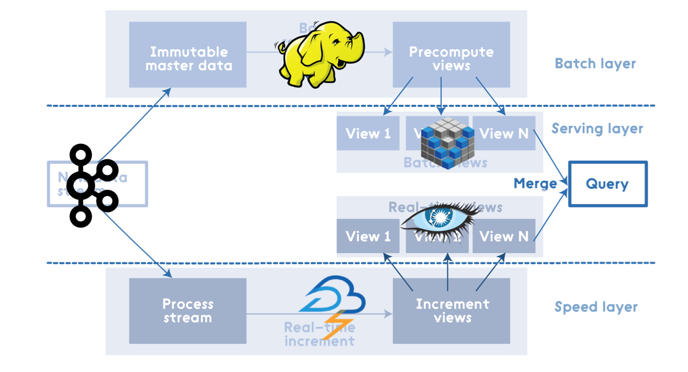

  - 混合架构说明

    混合架构的名字叫做 `Lambda 架构`, 混合架构最大的特点就是将流式计算和批处理结合起来后在进行查询的时候分别查询流系统和批系统, 最后将结果合并在一起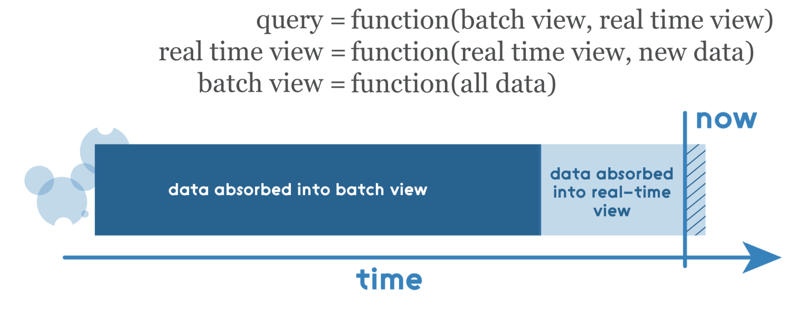

    - 一般情况下 Lambda 架构分三层

      - 批处理层: 批量写入, 批量读取
      - 服务层: 分为两个部分, 一部分对应批处理层, 一部分对应速度层
      - 速度层: 随机读取, 随即写入, 增量计算

    - 优点

      - 兼顾优点, 在批处理层可以全量查询和分析, 在速度层可以查询最新的数据
      - 速度很快, 在大数据系统中, 想要快速的获取结果是非常困难的, 因为高吞吐量和快速返回结果往往很难兼得, 例如 `Impala` 和 `Hive`, `Hive` 能进行非常大规模的数据量的处理, `Impala` 能够快速的查询返回结果, 但是很少有一个系统能够兼得两点, `Lambda` 使用多种融合的手段从而实现

    - 缺点

      `Lambda` 是一个非常反人类的设计, 因为我们需要在系统中不仅维护多套数据层, 还需要维护批处理和流式处理两套框架, 这非常困难, 一套都很难搞定, 两套带来的运维问题是是指数级提升的

- **流式架构**

  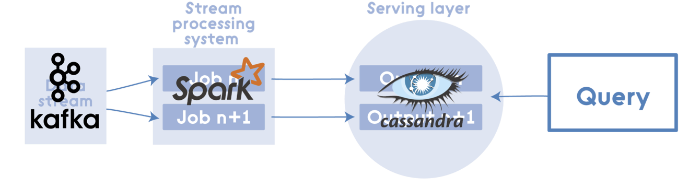

  - 流式架构说明

    流式架构常见的叫做 `Kappa 结构`, 是 `Lambda 架构` 的一个变种, 其实本质上就是删掉了批处理

  - 优点

    非常简单

    效率很高, 在存储系统的发展下, 很多存储系统已经即能快速查询又能批量查询了, 所以 `Kappa 架构` 在新时代还是非常够用的

  - 问题

    丧失了一些 `Lambda` 的优秀特点

- `Spark Streaming` **的特点**

  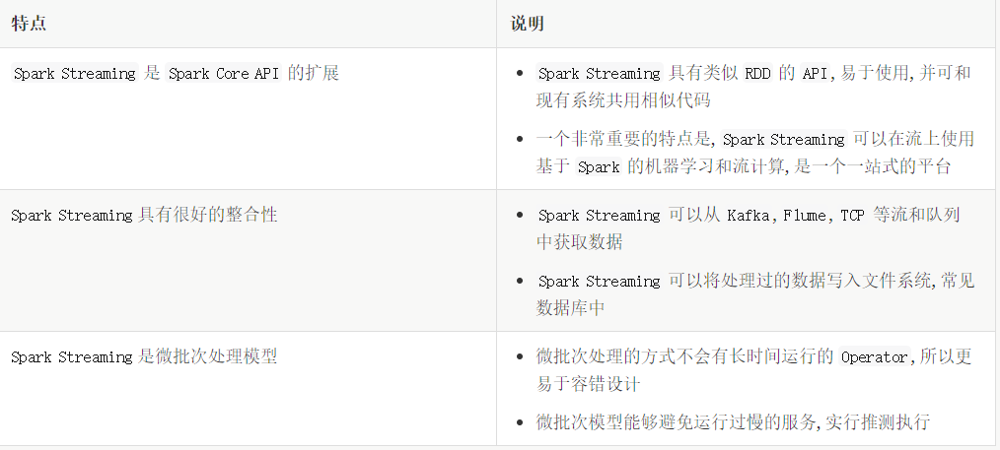

## 2. Spark Streaming 入门

导读

1. 环境准备
2. 工程搭建
3. 代码编写
4. 总结

- `Netcat` 的使用

  `Step 1`: `Socket` 回顾

  - `Socket` 是 `Java` 中为了支持基于 `TCP / UDP` 协议的通信所提供的编程模型

  - `Socket` 分为 `Socket server` 和 `Socket client`

    - `Socket server`

      监听某个端口, 接收 `Socket client` 发过来的连接请求建立连接, 连接建立后可以向 `Socket client` 发送 `TCP packet`交互 (被动)

    - `Socket client`

      向某个端口发起连接, 并在连接建立后, 向 `Socket server` 发送 `TCP packet` 实现交互 (主动)

  - `TCP` 三次握手建立连接

    - `Step 1`

      `Client` 向 `Server` 发送 `SYN(j)`, 进入 `SYN_SEND` 状态等待 `Server` 响应

    - `Step 2`

      `Server` 收到 `Client` 的 `SYN(j)` 并发送确认包 `ACK(j + 1)`, 同时自己也发送一个请求连接的 `SYN(k)` 给 `Client`, 进入 `SYN_RECV` 状态等待 `Client` 确认

    - `Step 3`

      `Client` 收到 `Server` 的 `ACK + SYN`, 向 `Server` 发送连接确认 `ACK(k + 1)`, 此时, `Client` 和 `Server` 都进入 `ESTABLISHED` 状态, 准备数据发送

  `Step 2:` `Netcat`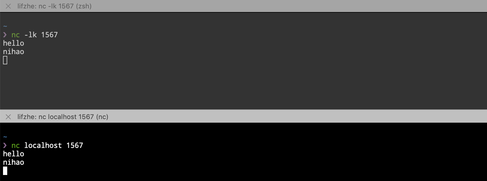

  - `Netcat` 简写 `nc`, 命令行中使用 `nc` 命令调用
  - `Netcat` 是一个非常常见的 `Socket` 工具, 可以使用 `nc` 建立 `Socket server` 也可以建立 `Socket client`
    - `nc -l` 建立 `Socket server`, `l` 是 `listen` 监听的意思
    - `nc host port` 建立 `Socket client`, 并连接到某个 `Socket server`

- 创建工程

  目标

  使用 `Spark Streaming` 程序和 `Socket server` 进行交互, 从 `Server` 处获取实时传输过来的字符串, 拆开单词并统计单词数量, 最后打印出来每一个小批次的单词数量

  `Step 1:` 创建工程

  1. 创建 `IDEA Maven` 工程, 步骤省略, 参考 `Spark` 第一天工程建立方式
  2. 导入 `Maven` 依赖, 省略, 参考 `Step 2`
  3. 创建 `main/scala` 文件夹和 `test/scala` 文件夹
  4. 创建包 `cn.itcast.streaming`
  5. 创建对象 `StreamingWordCount`

  `Step 2:` `Maven` 依赖

  如果使用 `Spark Streaming`, 需要使用如下 `Spark` 的依赖

  - `Spark Core`: `Spark` 的核心包, 因为 `Spark Streaming` 要用到
  - `Spark Streaming`

  ```xml
  <dependencies>
          <dependency>
              <groupId>org.apache.spark</groupId>
              <artifactId>spark-core_2.11</artifactId>
              <version>2.2.0</version>
          </dependency>
          <dependency>
              <groupId>org.scala-lang</groupId>
              <artifactId>scala-library</artifactId>
              <version>2.11.8</version>
          </dependency>
  
          <dependency>
              <groupId>org.apache.hadoop</groupId>
              <artifactId>hadoop-client</artifactId>
              <version>2.7.5</version>
          </dependency>
  
          <dependency>
              <groupId>org.apache.spark</groupId>
              <artifactId>spark-streaming_2.11</artifactId>
              <version>2.2.0</version>
          </dependency>
          <dependency>
              <groupId>org.slf4j</groupId>
              <artifactId>slf4j-simple</artifactId>
              <version>1.7.25</version>
          </dependency>
          <dependency>
              <groupId>junit</groupId>
              <artifactId>junit</artifactId>
              <version>4.12</version>
          </dependency>
      </dependencies>
      <build>
          <sourceDirectory>src/main/scala</sourceDirectory>
          <testSourceDirectory>src/test/scala</testSourceDirectory>
  
          <plugins>
              <plugin>
                  <groupId>org.apache.maven.plugins</groupId>
                  <artifactId>maven-compiler-plugin</artifactId>
                  <version>3.0</version>
                  <configuration>
                      <source>1.8</source>
                      <target>1.8</target>
                      <encoding>UTF-8</encoding>
                  </configuration>
              </plugin>
  
              <plugin>
                  <groupId>net.alchim31.maven</groupId>
                  <artifactId>scala-maven-plugin</artifactId>
                  <version>3.2.0</version>
                  <executions>
                      <execution>
                          <goals>
                              <goal>compile</goal>
                              <goal>testCompile</goal>
                          </goals>
                          <configuration>
                              <args>
                                  <arg>-dependencyfile</arg>
                                  <arg>${project.build.directory}/.scala_dependencies</arg>
                              </args>
                          </configuration>
                      </execution>
                  </executions>
              </plugin>
  
              <plugin>
                  <groupId>org.apache.maven.plugins</groupId>
                  <artifactId>maven-shade-plugin</artifactId>
                  <version>3.1.1</version>
                  <executions>
                      <execution>
                          <phase>package</phase>
                          <goals>
                              <goal>shade</goal>
                          </goals>
                          <configuration>
                              <filters>
                                  <filter>
                                      <artifact>*:*</artifact>
                                      <excludes>
                                          <exclude>META-INF/*.SF</exclude>
                                          <exclude>META-INF/*.DSA</exclude>
                                          <exclude>META-INF/*.RSA</exclude>
                                      </excludes>
                                  </filter>
                              </filters>
                              <transformers>
                                  <transformer implementation="org.apache.maven.plugins.shade.resource.ManifestResourceTransformer">
                                      <mainClass></mainClass>
                                  </transformer>
                              </transformers>
                          </configuration>
                      </execution>
                  </executions>
              </plugin>
          </plugins>
      </build>
  ```

  `Step 3:` 编码

  ```scala
  object StreamingWordCount {
  
    def main(args: Array[String]): Unit = {
      if (args.length < 2) {
        System.err.println("Usage: NetworkWordCount <hostname> <port>")
        System.exit(1)
      }
  
      val sparkConf = new SparkConf().setAppName("NetworkWordCount")
      val ssc = new StreamingContext(sparkConf, Seconds(1))              
  
      val lines = ssc.socketTextStream(                                  
        hostname = args(0),
        port = args(1).toInt,
        storageLevel = StorageLevel.MEMORY_AND_DISK_SER)                 
  
      val words = lines.flatMap(_.split(" "))
      val wordCounts = words.map(x => (x, 1)).reduceByKey(_ + _)
  
      wordCounts.print()                                                 
  
      ssc.start()                                                        
      ssc.awaitTermination()                                             
    }
  }
  ```

  1. 在 `Spark` 中, 一般使用 `XXContext` 来作为入口, `Streaming` 也不例外, 所以创建 `StreamingContext` 就是创建入口
  2. 开启 `Socket` 的 `Receiver`, 连接到某个 `TCP` 端口, 作为 `Socket client`, 去获取数据
  3. 选择 `Receiver` 获取到数据后的保存方式, 此处是内存和磁盘都有, 并且序列化后保存
  4. 类似 `RDD` 中的 `Action`, 执行最后的数据输出和收集
  5. 启动流和 `JobGenerator`, 开始流式处理数据
  6. 阻塞主线程, 后台线程开始不断获取数据并处理

  `Step 4:` 部署和上线

  1. 使用 Maven 命令 package 打包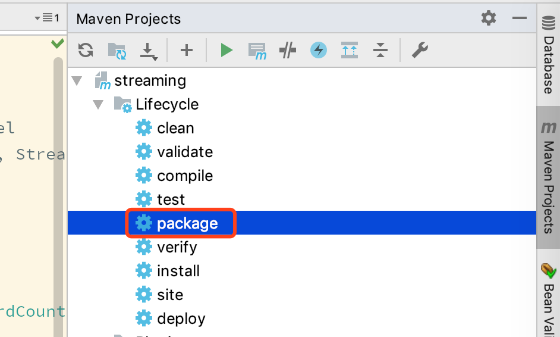

  2. 将打好的包上传到 `node01`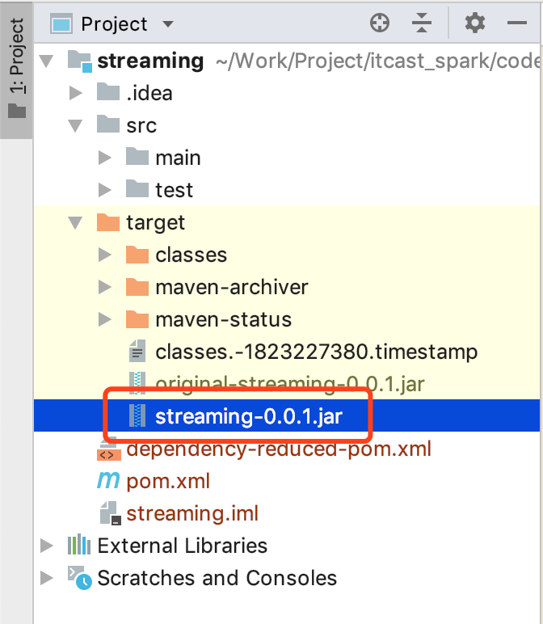

  3. 在 `node02` 上使用 `nc` 开启一个 `Socket server`, 接受 `Streaming` 程序的连接请求, 从而建立连接发送消息给 `Streaming` 程序实时处理

     ```shell
     nc -lk 9999
     ```

  4. 在 `node01` 执行如下命令运行程序

     ```scala
     spark-submit --class cn.itcast.streaming.StreamingWordCount  --master local[6] original-streaming-0.0.1.jar node02 9999
     ```

- `Step 5:` 总结和知识落地

  - 注意点`Spark Streaming` 并不是真正的来一条数据处理一条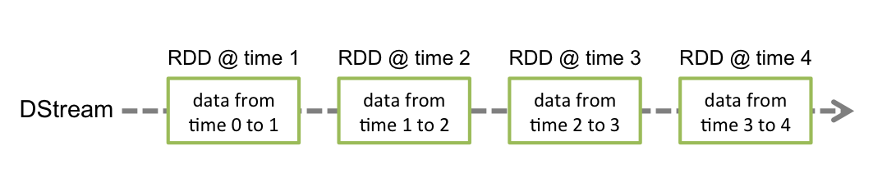
  
    - `Spark Streaming` 的处理机制叫做小批量, 英文叫做 `mini-batch`, 是收集了一定时间的数据后生成 `RDD`, 后针对 `RDD` 进行各种转换操作, 这个原理提现在如下两个地方
      - 控制台中打印的结果是一个批次一个批次的, 统计单词数量也是按照一个批次一个批次的统计
      - 多长时间生成一个 `RDD` 去统计呢? 由 `new StreamingContext(sparkConf, Seconds(1))` 这段代码中的第二个参数指定批次生成的时间
  
  - `Spark Streaming` 中至少要有两个线程
  
    在使用 `spark-submit` 启动程序的时候, 不能指定一个线程
  
    - 主线程被阻塞了, 等待程序运行
    - 需要开启后台线程获取数据
  
  **创建** `StreamingContext`
  
  ```scala
  val conf = new SparkConf().setAppName(appName).setMaster(master)
  val ssc = new StreamingContext(conf, Seconds(1))
  ```
  
  - `StreamingContext` 是 `Spark Streaming` 程序的入口
  - 在创建 `StreamingContext` 的时候, 必须要指定两个参数, 一个是 `SparkConf`, 一个是流中生成 `RDD` 的时间间隔
  - `StreamingContext` 提供了如下功能
    - 创建 `DStream`, 可以通过读取 `Kafka`, 读取 `Socket` 消息, 读取本地文件等创建一个流, 并且作为整个 `DAG` 中的 `InputDStream`
    - `RDD` 遇到 `Action` 才会执行, 但是 `DStream` 不是, `DStream` 只有在 `StreamingContext.start()` 后才会开始接收数据并处理数据
    - 使用 `StreamingContext.awaitTermination()` 等待处理被终止
    - 使用 `StreamingContext.stop()` 来手动的停止处理
  - 在使用的时候有如下注意点
    - 同一个 `Streaming` 程序中, 只能有一个 `StreamingContext`
    - 一旦一个 `Context` 已经启动 (`start`), 则不能添加新的数据源
  
  **各种算子**

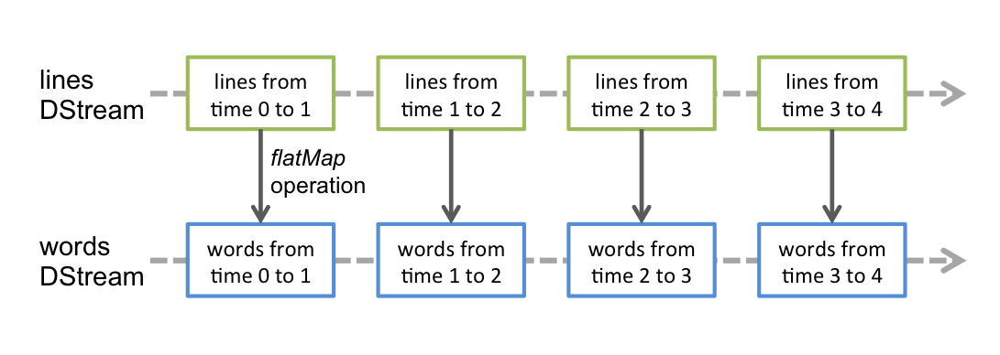

- 这些算子类似 `RDD`, 也会生成新的 `DStream`

- 这些算子操作最终会落到每一个 `DStream` 生成的 `RDD` 中

  | 算子          | 释义                                                         |
  | :------------ | :----------------------------------------------------------- |
  | `flatMap`     | `lines.flatMap(_.split(" "))`将一个数据一对多的转换为另外的形式, 规则通过传入函数指定 |
  | `map`         | `words.map(x => (x, 1))`一对一的转换数据                     |
  | `reduceByKey` | `words.reduceByKey(_ + _)`这个算子需要特别注意, 这个聚合并不是针对于整个流, 而是针对于某个批次的数据 |

## 2. 原理

1. 总章
2. 静态 `DAG`
3. 动态切分
4. 数据流入
5. 容错机制

###　2.1. `Spark Streaming` 的特点
   - `Spark Streaming` 会源源不断的处理数据, 称之为流计算
   - `Spark Streaming` 并不是实时流, 而是按照时间切分小批量, 一个一个的小批量处理
   - `Spark Streaming` 是流计算, 所以可以理解为数据会源源不断的来, 需要长时间运行

### 2.2. `Spark Streaming` **是按照时间切分小批量**

   - 如何小批量?

     `Spark Streaming` 中的编程模型叫做 `DStream`, 所有的 `API` 都从 `DStream` 开始, 其作用就类似于 `RDD` 之于 `Spark Core`

     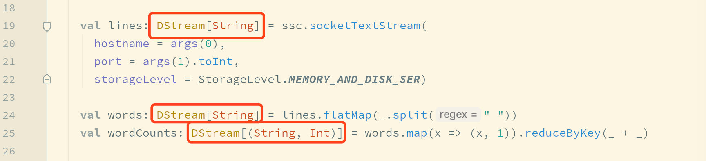可以理解为 `DStream` 是一个管道, 数据源源不断的从这个管道进去, 被处理, 再出去

     但是需要注意的是, `DStream` 并不是严格意义上的实时流, 事实上, `DStream` 并不处理数据, 而是处理 `RDD`

     

     以上, 可以整理出如下道理

     - `Spark Streaming` 是小批量处理数据, 并不是实时流
     - `Spark Streaming` 对数据的处理是按照时间切分为一个又一个小的 `RDD`, 然后针对 `RDD` 进行处理

     所以针对以上的解读, 可能会产生一种疑惑

     - 如何切分 `RDD`?

   - 如何处理数据?

     如下代码

     ```scala
     val lines: DStream[String] = ssc.socketTextStream(
       hostname = args(0),
       port = args(1).toInt,
       storageLevel = StorageLevel.MEMORY_AND_DISK_SER)
     
     val words: DStream[String] = lines
       .flatMap(_.split(" "))
       .map(x => (x, 1))
       .reduceByKey(_ + _)
     ```

     可以看到

     - `RDD` 中针对数据的处理是使用算子, 在 `DStream` 中针对数据的操作也是算子
     - `DStream` 的算子似乎和 `RDD` 没什么区别

     有一个疑惑

     - 难道 `DStream` 会把算子的操作交给 `RDD` 去处理? 如何交?

### 2.3. `Spark Streaming` **是流计算, 流计算的数据是无限的**

   什么系统可以产生无限的数据?

   

   无限的数据一般指的是数据不断的产生, 比如说运行中的系统, 无法判定什么时候公司会倒闭, 所以也无法断定数据什么时候会不再产生数据

   - 那就会产生一个问题

     如何不简单的读取数据, 如何应对数据量时大时小?

   如何数据是无限的, 意味着可能要一直运行下去

   - 那就会又产生一个问题

     `Spark Streaming` 不会出错吗? 数据出错了怎么办?

   **总结**

   总结下来, 有四个问题

   - `DStream` 如何对应 `RDD`?
   - 如何切分 `RDD`?
   - 如何读取数据?
   - 如何容错?

- `DAG` 的定义

  1. `RDD` 和 `DStream` 的 `DAG`

     如果是 `RDD` 的 `WordCount`, 代码大致如下

     ```scala
     val textRDD = sc.textFile(...)
     val splitRDD = textRDD.flatMap(_.split(" "))
     val tupleRDD = splitRDD.map((_, 1))
     val reduceRDD = tupleRDD.reduceByKey(_ + _)
     ```

     用图形表示如下

     同样, `DStream` 的代码大致如下

     ```scala
     val lines: DStream[String] = ssc.socketTextStream(...)
     val words: DStream[String] = lines.flatMap(_.split(" "))
     val wordCounts: DStream[(String, Int)] = words.map(x => (x, 1)).reduceByKey(_ + _)
     ```

     同理, `DStream` 也可以形成 `DAG` 如下看起来 `DStream` 和 `RDD` 好像哟, 确实如此

  2. `RDD` 和 `DStream` 的区别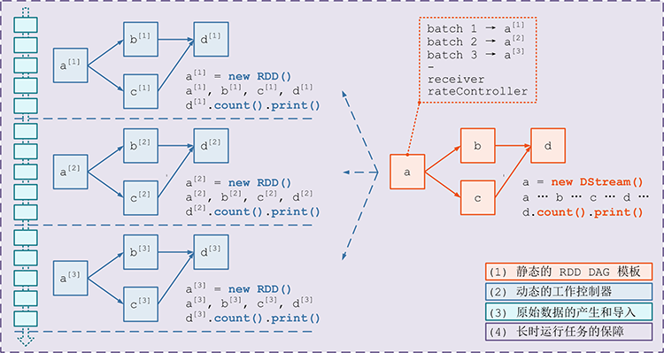
     - `DStream` 的数据是不断进入的, `RDD` 是针对一个数据的操作
     - 像 `RDD` 一样, `DStream` 也有不同的子类, 通过不同的算子生成
     - 一个 `DStream` 代表一个数据集, 其中包含了针对于上一个数据的操作
     - `DStream` 根据时间切片, 划分为多个 `RDD`, 针对 `DStream` 的计算函数, 会作用于每一个 `DStream` 中的 `RDD`
  3. `DStream` 如何形式 `DAG`
     - 每个 `DStream` 都有一个关联的 `DStreamGraph` 对象
     - `DStreamGraph` 负责表示 `DStream` 之间的的依赖关系和运行步骤
     - `DStreamGraph` 中会单独记录 `InputDStream` 和 `OutputDStream`

- 切分流, 生成小批量

  1. 静态和动态

     根据前面的学习, 可以总结一下规律

     - `DStream` 对应 `RDD`
     - `DStreamGraph` 表示 `DStream` 之间的依赖关系和运行流程, 相当于 `RDD` 通过 `DAGScheduler` 所生成的 `RDD DAG`

     但是回顾前面的内容, `RDD` 的运行分为逻辑计划和物理计划

     - 逻辑计划就是 `RDD` 之间依赖关系所构成的一张有向无环图
     - 后根据这张 `DAG` 生成对应的 `TaskSet` 调度到集群中运行, 如下

     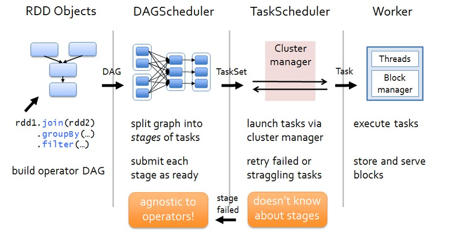

     但是在 `DStream` 中则不能这么简单的划分, 因为 `DStream` 中有一个非常重要的逻辑, 需要按照时间片划分小批量

     - 在 `Streaming` 中, `DStream` 类似 `RDD`, 生成的是静态的数据处理过程, 例如一个 `DStream` 中的数据经过 `map` 转为其它模样
     - 在 `Streaming` 中, `DStreamGraph` 类似 `DAG`, 保存了这种数据处理的过程

     上述两点, 其实描述的是静态的一张 `DAG`, 数据处理过程, 但是 `Streaming` 是动态的, 数据是源源不断的来的

     所以, 在 `DStream` 中, 静态和动态是两个概念, 有不同的流程

     - `DStreamGraph` 将 `DStream` 联合起来, 生成 `DStream` 之间的 `DAG`, 这些 `DStream` 之间的关系是相互依赖的关系, 例如一个 `DStream` 经过 `map` 转为另外一个 `DStream`
     - 但是把视角移动到 `DStream` 中来看, `DStream` 代表了源源不断的 `RDD` 的生成和处理, 按照时间切片, 所以一个 `DStream DAG` 又对应了随着时间的推进所产生的无限个 `RDD DAG`

  2. 动态生成 `RDD DAG` 的过程

     ``RDD DAG` 的生成是按照时间来切片的, `Streaming` 会维护一个 `Timer`, 固定的时间到达后通过如下五个步骤生成一个 `RDD DAG` 后调度执行

     1. 通知 `Receiver` 将收到的数据暂存, 并汇报存储的元信息, 例如存在哪, 存了什么
     2. 通过 `DStreamGraph` 复制出一套新的 `RDD DAG`
     3. 将数据暂存的元信息和 `RDD DAG` 一同交由 `JobScheduler` 去调度执行
     4. 提交结束后, 对系统当前的状态 `Checkpoint`

- 数据的产生和导入

  1. `Receiver`

     在 `Spark Streaming` 中一个非常大的挑战是, 很多外部的队列和存储系统都是分块的, `RDD` 是分区的, 在读取外部数据源的时候, 会用不同的分区对照外部系统的分片, 例如

     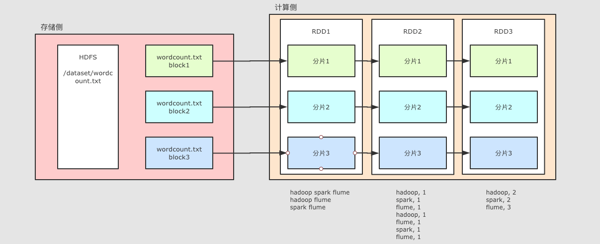不仅 `RDD`, `DStream` 中也面临这种挑战

     那么此处就有一个小问题

     - `DStream` 中是 `RDD` 流, 只是 `RDD` 的分区对应了 `Kafka` 的分区就可以了吗?

     答案是不行, 因为需要一套单独的机制来保证并行的读取外部数据源, 这套机制叫做 `Receiver`

  2. `Receiver` 的结构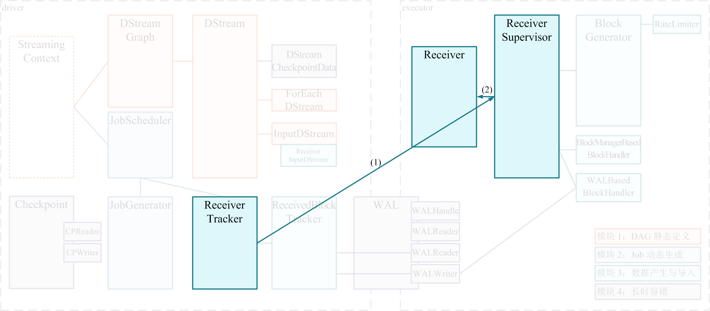

     为了保证并行获取数据, 对应每一个外部数据源的分区, 所以 `Receiver` 也要是分布式的, 主要分为三个部分

     - `Receiver` 是一个对象, 是可以有用户自定义的获取逻辑对象, 表示了如何获取数据
     - `Receiver Tracker` 是 `Receiver` 的协调和调度者, 其运行在 `Driver` 上
     - `Receiver Supervisor` 被 `Receiver Tracker` 调度到不同的几点上分布式运行, 其会拿到用户自定义的 `Receiver` 对象, 使用这个对象来获取外部数据;

  3. `Receiver` 的执行过程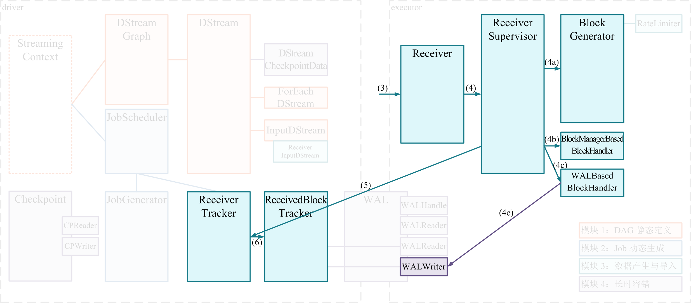

     1. 在 `Spark Streaming` 程序开启时候, `Receiver Tracker` 使用 `JobScheduler` 分发 `Job` 到不同的节点, 每个 `Job` 包含一个 `Task` , 这个 `Task` 就是 `Receiver Supervisor`, 这个部分的源码还挺精彩的, 其实是复用了通用的调度逻辑
     2. `ReceiverSupervisor` 启动后运行 `Receiver` 实例
     3. `Receiver` 启动后, 就将持续不断地接收外界数据, 并持续交给 `ReceiverSupervisor` 进行数据存储
     4. `ReceiverSupervisor` 持续不断地接收到 `Receiver` 转来的数据, 并通过 `BlockManager` 来存储数据
     5. 获取的数据存储完成后发送元数据给 `Driver` 端的 `ReceiverTracker`, 包含数据块的 `id`, 位置, 数量, 大小 等信息

- 容错

  因为要非常长时间的运行, 对于任何一个流计算系统来说, 容错都是非常致命也非常重要的一环, 在 `Spark Streaming` 中, 大致提供了如下的容错手段

  1. 热备

     还记得这行代码吗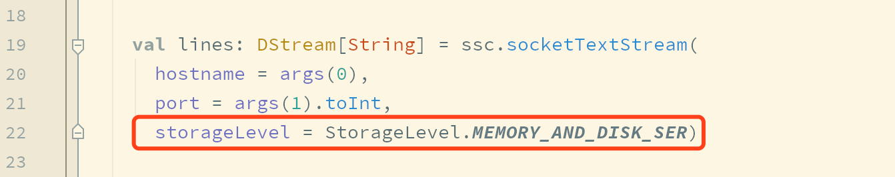这行代码中的 `StorageLevel.MEMORY_AND_DISK_SER` 的作用是什么? 其实就是热备份

     - 当 Receiver 获取到数据要存储的时候, 是交给 BlockManager 存储的
     - 如果设置了 `StorageLevel.MEMORY_AND_DISK_SER`, 则意味着 `BlockManager` 不仅会在本机存储, 也会发往其它的主机进行存储, 本质就是冗余备份
     - 如果某一个计算失败了, 通过冗余的备份, 再次进行计算即可

     这是默认的容错手段

  2. 冷备

     冷备在 `Spark Streaming` 中的手段叫做 `WAL` (预写日志)

     - 当 `Receiver` 获取到数据后, 会交给 `BlockManager` 存储
     - 在存储之前先写到 `WAL` 中, `WAL` 中保存了 `Redo Log`, 其实就是记录了数据怎么产生的, 以便于恢复的时候通过 `Log` 恢复
     - 当出错的时候, 通过 `Redo Log` 去重放数据

  3. 重放

     - 有一些上游的外部系统是支持重放的, 比如说 `Kafka`
     - `Kafka` 可以根据 `Offset` 来获取数据
     - 当 `SparkStreaming` 处理过程中出错了, 只需要通过 `Kafka` 再次读取即可


## 3. 操作

导读

这一小节主要目的是为了了解 `Spark Streaming` 一些特别特殊和重要的操作, 一些基本操作基本类似 `RDD`

3.1. `updateStateByKey`

   需求: 统计整个流中, 所有出现的单词数量, 而不是一个批中的数量

   - 状态

     - 

     - 统计总数

       入门案例中, 只能统计某个时间段内的单词数量, 因为 `reduceByKey` 只能作用于某一个 `RDD`, 不能作用于整个流

       如果想要求单词总数该怎么办?

     - 状态

       可以使用状态来记录中间结果, 从而每次来一批数据, 计算后和中间状态求和, 于是就完成了总数的统计

     

   - 实现

     - 使用 `updateStateByKey` 可以做到这件事
     - `updateStateByKey` 会将中间状态存入 `CheckPoint` 中

     ````scala
     //1. 创建Context
     //在sparkstreaming程序中，设置master的时候线程数不能小于2个
         //因为sparkstreaming有一个receiver专门用来拉取数据，需要占用一个线程
         //数据处理的时候也必须要一个线程来处理，所有线程数据设置的时候不能小于2
     val sparkConf = new SparkConf().setAppName("NetworkWordCount").setMaster("local[6]")
     val sc = new SparkContext(sparkConf)
     //设置日志级别ERROR	WARN	INFO
     sc.setLogLevel("ERROR")
     val ssc = new StreamingContext(sc, Seconds(1))
     //2. 读取数据生成DStream
     val lines: DStream[String] = ssc.socketTextStream(
       hostname = "localhost",
       port = "9999".toInt,
       storageLevel = StorageLevel.MEMORY_AND_DISK_SER_2)
     //3. 词频统计
     val words = lines.flatMap(_.split(" ")).map(x => (x, 1))
     
     // 使用 updateStateByKey 必须设置 Checkpoint 目录
     ssc.checkpoint("checkpoint")
     
     //4. 全局聚合 updateStateByKey 的函数
     def updateFunc(newValue: Seq[Int], runningValue: Option[Int]) = {
       // newValue 之所以是一个 Seq, 是因为它是某一个 Batch 的当前 Key 的全部 Value
       //runningValue:上一次计算的中间结果
     	/**
           * 第一个批次: hello spark  hello python=> [hello,spark,hello,python]==>[(hello,1),(spark,1),(hello,1),(python,1)]
           *  第一组:  hello
           *       bathValue: [1,1]  state:Option[Int]=>None
           *       Some(2+0)
           *  第二组:  spark
           *       bathValue: [1]  state:Option[Int]=>None
           *       Some(1+0)
           *  第三组:  python
           * bathValue: [1]  state:Option[Int]=>None
           *        Some(1+0)
           *
           *
           * 第二个批次: hello world hello spark =>[hello,world,hello,spark] =>[(hello,1),(world,1),(hello,1),(spark,1)]
           * 第一组: hello
           *     bathValue:[1,1]  state:Some(2)
           *     Some(2+2) = Some(4)
           * 第二组: world
           *   bathValue:[1]  state:None
           *    Some(1+0)
           * 第三组: spark
           *   bathValue:[1]  state:Some(1)
           *   Some(1+1) = Some(2)
           */
       val currentBatchSum = newValue.sum
       val state = runningValue.getOrElse(0)
       // 返回的这个 Some(count) 会再次进入 Checkpoint 中当作状态存储
       Some(currentBatchSum + state)
     }
     
     //4.1 调用
     val wordCounts = words.updateStateByKey[Int](updateFunc _)
     //5. 输出
     wordCounts.print()
     //4、启动sparkstreaming程序
     ssc.start()
     //5、阻塞主线程，等待外部停止
     ssc.awaitTermination()
     ````

3.2. `window` 操作

   需求: 计算过 `30s` 的单词总数, 每 `10s` 更新一次实现使用 `window` 即可实现按照窗口组织 RDD

   ```scala
   val sparkConf = new SparkConf().setAppName("NetworkWordCount").setMaster("local[6]")
   val sc = new SparkContext(sparkConf)
   sc.setLogLevel("ERROR")
   val ssc = new StreamingContext(sc, Seconds(1))
   
   val lines: DStream[String] = ssc.socketTextStream(
     hostname = "localhost",
     port = 9999,
     storageLevel = StorageLevel.MEMORY_AND_DISK_SER_2)
   
   val words = lines.flatMap(_.split(" ")).map(x => (x, 1))
   
   // 通过 window 操作, 会将流分为多个窗口
   val wordsWindow = words.window(Seconds(30), Seconds(10))
   // 此时是针对于窗口求聚合
   val wordCounts = wordsWindow.reduceByKey((newValue, runningValue) => newValue + runningValue)
   
   wordCounts.print()
   
   ssc.start()
   ssc.awaitTermination()
   ```

   既然 `window` 操作经常配合 `reduce` 这种聚合, 所以 `Spark Streaming` 提供了较为方便的方法

   ```scala
   val sparkConf = new SparkConf().setAppName("NetworkWordCount").setMaster("local[6]")
   val sc = new SparkContext(sparkConf)
   sc.setLogLevel("ERROR")
   val ssc = new StreamingContext(sc, Seconds(1))
   
   val lines: DStream[String] = ssc.socketTextStream(
     hostname = "localhost",
     port = 9999,
     storageLevel = StorageLevel.MEMORY_AND_DISK_SER)
   
   val words = lines.flatMap(_.split(" ")).map(x => (x, 1))
   
   // 开启窗口并自动进行 reduceByKey 的聚合
   val wordCounts = words.reduceByKeyAndWindow(
     reduceFunc = (n, r) => n + r,
     windowDuration = Seconds(30),
     slideDuration = Seconds(10))
   
   wordCounts.print()
   
   ssc.start()
   ssc.awaitTermination()
   ```

3.3. 窗口时间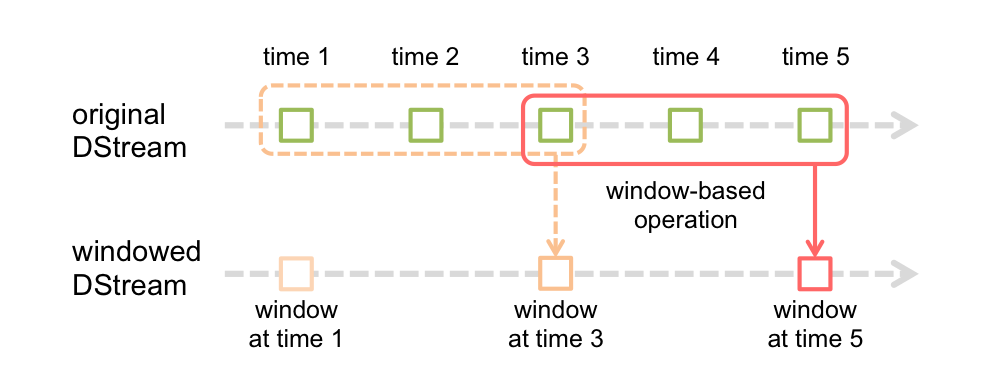

- 在 `window` 函数中, 接收两个参数

  - `windowDuration` 窗口长度, `window` 函数会将多个 `DStream` 中的 `RDD` 按照时间合并为一个, 那么窗口长度配置的就是将多长时间内的 `RDD` 合并为一个
  - `slideDuration` 滑动间隔, 比较好理解的情况是直接按照某个时间来均匀的划分为多个 `window`, 但是往往需求可能是统计最近 `xx分` 内的所有数据, 一秒刷新一次, 那么就需要设置滑动窗口的时间间隔了, 每隔多久生成一个 `window`

- 滑动时间的问题

  - 如果 `windowDuration > slideDuration`, 则在每一个不同的窗口中, 可能计算了重复的数据
  - 如果 `windowDuration < slideDuration`, 则在每一个不同的窗口之间, 有一些数据为能计算进去

  但是其实无论谁比谁大, 都不能算错, 例如, 我的需求有可能就是统计一小时内的数据, 一天刷新两次
  
  

### 3.1. **SparkStreaming与Kafka**

1. 依赖导入

   ```xml
    <dependencies>
           <dependency>
               <groupId>org.apache.spark</groupId>
               <artifactId>spark-core_2.11</artifactId>
               <version>2.2.0</version>
           </dependency>
           <dependency>
               <groupId>org.apache.spark</groupId>
               <artifactId>spark-streaming-kafka-0-10_2.12</artifactId>
               <version>2.4.4</version>
           </dependency>
           <dependency>
               <groupId>org.scala-lang</groupId>
               <artifactId>scala-library</artifactId>
               <version>2.11.8</version>
           </dependency>
   
           <dependency>
               <groupId>org.apache.hadoop</groupId>
               <artifactId>hadoop-client</artifactId>
               <version>2.7.5</version>
           </dependency>
   
           <dependency>
               <groupId>org.apache.spark</groupId>
               <artifactId>spark-streaming_2.11</artifactId>
               <version>2.2.0</version>
           </dependency>
           <dependency>
               <groupId>org.slf4j</groupId>
               <artifactId>slf4j-simple</artifactId>
               <version>1.7.25</version>
           </dependency>
           <dependency>
               <groupId>junit</groupId>
               <artifactId>junit</artifactId>
               <version>4.12</version>
           </dependency>
   
       </dependencies>
       <build>
           <sourceDirectory>src/main/scala</sourceDirectory>
           <testSourceDirectory>src/test/scala</testSourceDirectory>
   
           <plugins>
               <plugin>
                   <groupId>org.apache.maven.plugins</groupId>
                   <artifactId>maven-compiler-plugin</artifactId>
                   <version>3.0</version>
                   <configuration>
                       <source>1.8</source>
                       <target>1.8</target>
                       <encoding>UTF-8</encoding>
                   </configuration>
               </plugin>
   
               <plugin>
                   <groupId>net.alchim31.maven</groupId>
                   <artifactId>scala-maven-plugin</artifactId>
                   <version>3.2.0</version>
                   <executions>
                       <execution>
                           <goals>
                               <goal>compile</goal>
                               <goal>testCompile</goal>
                           </goals>
                           <configuration>
                               <args>
                                   <arg>-dependencyfile</arg>
                                   <arg>${project.build.directory}/.scala_dependencies</arg>
                               </args>
                           </configuration>
                       </execution>
                   </executions>
               </plugin>
   
               <plugin>
                   <groupId>org.apache.maven.plugins</groupId>
                   <artifactId>maven-shade-plugin</artifactId>
                   <version>3.1.1</version>
                   <executions>
                       <execution>
                           <phase>package</phase>
                           <goals>
                               <goal>shade</goal>
                           </goals>
                           <configuration>
                               <filters>
                                   <filter>
                                       <artifact>*:*</artifact>
                                       <excludes>
                                           <exclude>META-INF/*.SF</exclude>
                                           <exclude>META-INF/*.DSA</exclude>
                                           <exclude>META-INF/*.RSA</exclude>
                                       </excludes>
                                   </filter>
                               </filters>
                               <transformers>
                                   <transformer implementation="org.apache.maven.plugins.shade.resource.ManifestResourceTransformer">
                                       <mainClass></mainClass>
                                   </transformer>
                               </transformers>
                           </configuration>
                       </execution>
                   </executions>
               </plugin>
           </plugins>
       </build>
   ```

2. 代码编写

   ```scala
   object KafkaTest {
   
     def main(args: Array[String]): Unit = {
       //1、创建StreamingContext
       val ssc = new StreamingContext(new SparkContext(new SparkConf().setMaster("local[4]").setAppName("test")),Seconds(5))
       //2、通过KafKaUtils读取kafka的数据
       //topic名称
       val topics = Array("spark02")
   
       val kafkaParams = Map[String, Object](
         //kafka节点列表
         "bootstrap.servers" -> "hadoop01:9092,hadoop02:9092,hadoop03:9092",
         //key反序列化类
         "key.deserializer" -> classOf[StringDeserializer],
         //value反序列化类
         "value.deserializer" -> classOf[StringDeserializer],
         //消费组
         "group.id" -> "spark_kafka",
         //数据消费从哪里开始消费 latest:最新的offset  earliest:最小的offset
         "auto.offset.reset" -> "latest",
         //是否自动提交offset false必须是java里面的
         "enable.auto.commit" -> (false: java.lang.Boolean)
       )
       val source = KafkaUtils.createDirectStream[String,String](ssc,LocationStrategies.PreferConsistent,ConsumerStrategies.Subscribe[String,String](topics,kafkaParams))
       //3、数据处理
       source.foreachRDD(rdd=>{
         rdd.map(_.value()).foreach(println(_))
         //获取offset
         val range = rdd.asInstanceOf[HasOffsetRanges].offsetRanges
         //4、更新kafka offset
         //提交offset
         source.asInstanceOf[CanCommitOffsets].commitAsync(range)
       })
   
   
       //5、启动sparkstreaming
       ssc.start()
       //6、阻塞
       ssc.awaitTermination()
     }
   }
   ```

### 3.2. **自定义receiver从socket接收数据**

````scala
/**
  * 自定义receiver从socket接收数据
  */
class MyReceiver(host:String,port:Int) extends Receiver[String](StorageLevel.MEMORY_AND_DISK){

  //启动socket,与socketserver进行通信接收数据
  def receive()={
    val socket = new Socket(host,port)
    //获取socket输入流
    val is: InputStream = socket.getInputStream

    val buffer = new BufferedReader(new InputStreamReader(is))

    var line:String = null
    //如果receiver没有停止并且能够读取到数据
    while (!isStopped() && (line = buffer.readLine())!=null){
      //缓存数据，等到数据累计到一个批次之后统一处理
      store(line)
    }

    buffer.close()

    socket.close()
  }

  //receiver启动的时候调用
  override def onStart(): Unit = {
    //启动线程接收socket数据
    new Thread(){
      override def run(): Unit = {
        //接收socket数据
        receive()
      }
    }.start()
  }

  //receiver停止的时候调用
  override def onStop(): Unit = {

  }
}

object MyReceiver{
  def main(args: Array[String]): Unit = {

    //1、创建StreamingContext

    val ssc = new StreamingContext(new SparkContext(new SparkConf().setMaster("local[4]").setAppName("test")),Seconds(5))

    ssc.sparkContext.setLogLevel("warn")
    //2、读取数据
    val source = ssc.receiverStream(new MyReceiver("192.168.188.100",9999))

    source.flatMap(_.split(" ")).map((_,1)).reduceByKey(_+_).print()

    //3、启动sparkstreaming
    ssc.start()
    //4、阻塞主线程
    ssc.awaitTermination()
  }
}

````
