# Structured Streaming

Table of Contents

- 1. 回顾和展望
  
  - [1.1. Spark 编程模型的进化过程](#_1_1_spark_编程模型的进化过程)
  - [1.2. Spark 的 序列化 的进化过程](#_1_2_spark_的_序列化_的进化过程)
  - [1.3. Spark Streaming 和 Structured Streaming](#_1_3_spark_streaming_和_structured_streaming)
- 2. Structured Streaming 入门案例
  
  - [2.1. 需求梳理](#_2_1_需求梳理)
  - [2.2. 代码实现](#_2_2_代码实现)
  - [2.3. 运行和结果验证](#_2_3_运行和结果验证)
- 3. Stuctured Streaming 的体系和结构
  
  - [3.1. 无限扩展的表格](#_3_1_无限扩展的表格)
  - [3.2. 体系结构](#_3_2_体系结构)
- 4. Source
  
  - [4.1. 从 HDFS 中读取数据](#_4_1_从_hdfs_中读取数据)
  - [4.2. 从 Kafka 中读取数据](#_4_2_从_kafka_中读取数据)
- 5. Sink
  
  - [5.1. HDFS Sink](#_5_1_hdfs_sink)
  - [5.2. Kafka Sink](#_5_2_kafka_sink)
  - [5.3. Foreach Writer](#_5_3_foreach_writer)
  - [5.4. 自定义 Sink](#_5_4_自定义_sink)
  - [5.5. Tigger](#_5_5_tigger)
  - [5.6. 从 Source 到 Sink 的流程](#_5_6_从_source_到_sink_的流程)
  - [5.7. 错误恢复和容错语义](#_5_7_错误恢复和容错语义)
- 6. 有状态算子
  
  - [6.1. 常规算子](#_6_1_常规算子)
- [6.2. 分组算子](#_6_2_分组算子)
  
- 全天目标

  回顾和展望入门案例`Stuctured Streaming` 的体系和结构

## 1. 回顾和展望

- 本章目标

  `Structured Streaming` 是 `Spark Streaming` 的进化版, 如果了解了 `Spark` 的各方面的进化过程, 有助于理解 `Structured Streaming` 的使命和作用

- 本章过程

  `Spark` 的 `API` 进化过程`Spark` 的序列化进化过程`Spark Streaming` 和 `Structured Streaming`

### 1.1. Spark 编程模型的进化过程

目标和过程

- 目标

  `Spark` 的进化过程中, 一个非常重要的组成部分就是编程模型的进化, 通过编程模型可以看得出来内在的问题和解决方案

- 过程

  1. 编程模型 `RDD` 的优点和缺陷
  2. 编程模型 `DataFrame` 的优点和缺陷
  3. 编程模型 `Dataset` 的优点和缺陷


- RDD编程模型

  ```scala
  rdd.flatMap(_.split(" "))    
  .map((_, 1))    
  .reduceByKey(_ + _)    
  .collect
  ```

  - 针对自定义数据对象进行处理, 可以处理任意类型的对象, 比较符合面向对象
  - `RDD` 无法感知到数据的结构, 无法针对数据结构进行编程

- DataFrame编程模型

  ```scala
  spark.read
       .csv("...")
       .where($"name" =!= "")
       .groupBy($"name")
       .show()
  ```

  - `DataFrame` 保留有数据的元信息, `API` 针对数据的结构进行处理, 例如说可以根据数据的某一列进行排序或者分组
  - `DataFrame` 在执行的时候会经过 `Catalyst` 进行优化, 并且序列化更加高效, 性能会更好
  - `DataFrame` 只能处理结构化的数据, 无法处理非结构化的数据, 因为 `DataFrame` 的内部使用 `Row` 对象保存数据
  - `Spark` 为 `DataFrame` 设计了新的数据读写框架, 更加强大, 支持的数据源众多

- Dataset编程模型

  ````scala
  spark.read
       .csv("...")
       .as[Person]
       .where(_.name != "")
       .groupByKey(_.name)
       .count()
       .show()
  ````

  - `Dataset` 结合了 `RDD` 和 `DataFrame` 的特点, 从 `API`上即可以处理结构化数据, 也可以处理非结构化数据
  - `Dataset` 和 `DataFrame` 其实是一个东西, 所以 `DataFrame` 的性能优势, 在 `Dataset` 上也有

总结

- `RDD` 的优点

  1. 面向对象的操作方式
  2. 可以处理任何类型的数据

- `RDD` 的缺点

  1. 运行速度比较慢, 执行过程没有优化
  2. `API` 比较僵硬, 对结构化数据的访问和操作没有优化

- `DataFrame` 的优点

  1. 针对结构化数据高度优化, 可以通过列名访问和转换数据
  2. 增加 `Catalyst` 优化器, 执行过程是优化的, 避免了因为开发者的原因影响效率

- `DataFrame` 的缺点

  1. 只能操作结构化数据
  2. 只有无类型的 `API`, 也就是只能针对列和 `SQL` 操作数据, `API`依然僵硬

- `Dataset` 的优点

  1. 结合了 `RDD` 和 `DataFrame` 的 `API`, 既可以操作结构化数据, 也可以操作非结构化数据
  2. 既有有类型的 `API` 也有无类型的 `API`, 灵活选择

### 1.2. Spark 的 序列化 的进化过程

目标和过程

- 目标

  `Spark` 中的序列化过程决定了数据如何存储, 是性能优化一个非常重要的着眼点, `Spark` 的进化并不只是针对编程模型提供的 `API`, 在大数据处理中, 也必须要考虑性能

- 过程

  1. 序列化和反序列化是什么
  2. `Spark` 中什么地方用到序列化和反序列化
  3. `RDD` 的序列化和反序列化如何实现
  4. `Dataset` 的序列化和反序列化如何实现

- Step 1: 什么是序列化和序列化

  在 `Java` 中, 序列化的代码大概如下

  ```Java
  public class JavaSerializable implements Serializable {
    NonSerializable ns = new NonSerializable();
  }
  
  public class NonSerializable {
  
  }
  
  public static void main(String[] args) throws IOException {
    // 序列化
    JavaSerializable serializable = new JavaSerializable();
    ObjectOutputStream objectOutputStream = new ObjectOutputStream(new FileOutputStream("/tmp/obj.ser"));
    // 这里会抛出一个 "java.io.NotSerializableException: cn.itcast.NonSerializable" 异常
    objectOutputStream.writeObject(serializable);
    objectOutputStream.flush();
    objectOutputStream.close();
  
    // 反序列化
    FileInputStream fileInputStream = new FileInputStream("/tmp/obj.ser");
    ObjectInputStream objectOutputStream = new ObjectInputStream(fileInputStream);
    JavaSerializable serializable1 = objectOutputStream.readObject();
  }
  ```

  序列化是什么

  - 序列化的作用就是可以将对象的内容变成二进制, 存入文件中保存
  - 反序列化指的是将保存下来的二进制对象数据恢复成对象

  序列化对对象的要求

  - 对象必须实现 `Serializable` 接口
  - 对象中的所有属性必须都要可以被序列化, 如果出现无法被序列化的属性, 则序列化失败

  限制

  - 对象被序列化后, 生成的二进制文件中, 包含了很多环境信息, 如对象头, 对象中的属性字段等, 所以内容相对较大
  - 因为数据量大, 所以序列化和反序列化的过程比较慢

  序列化的应用场景

  - 持久化对象数据
  - 网络中不能传输 `Java` 对象, 只能将其序列化后传输二进制数据

- Step 2: 在 `Spark` 中的序列化和反序列化的应用场景

  - `Task` 分发`Task` 是一个对象, 想在网络中传输对象就必须要先序列化

  - `RDD` 缓存

    ````scala
    val rdd1 = rdd.flatMap(_.split(" "))
       .map((_, 1))
       .reduceByKey(_ + _)
    rdd1.cache
    rdd1.collect
    ````
    
    - `RDD` 中处理的是对象, 例如说字符串, `Person` 对象等
- 如果缓存 `RDD` 中的数据, 就需要缓存这些对象
    - 对象是不能存在文件中的, 必须要将对象序列化后, 将二进制数据存入文件
    
  - 广播变量

    - 广播变量会分发到不同的机器上, 这个过程中需要使用网络, 对象在网络中传输就必须先被序列化

  - `Shuffle` 过程

    `Shuffle` 过程是由 `Reducer` 从 `Mapper` 中拉取数据, 这里面涉及到两个需要序列化对象的原因

    - `RDD` 中的数据对象需要在 `Mapper` 端落盘缓存, 等待拉取
  - `Mapper` 和 `Reducer` 要传输数据对象
  
  - `Spark Streaming` 的 `Receiver`

    - `Spark Streaming` 中获取数据的组件叫做 `Receiver`, 获取到的数据也是对象形式, 在获取到以后需要落盘暂存, 就需要对数据对象进行序列化

  - 算子引用外部对象

    ```scala
  class Unserializable(i: Int)
    
    rdd.map(i => new Unserializable(i))
       .collect
       .foreach(println)
    ```
  
    - 在 `Map` 算子的函数中, 传入了一个 `Unserializable` 的对象
  - `Map` 算子的函数是会在整个集群中运行的, 那 `Unserializable` 对象就需要跟随 `Map` 算子的函数被传输到不同的节点上
    
    - 如果 `Unserializable` 不能被序列化, 则会报错
  
- Step 3: `RDD` 的序列化

  

  `RDD` 的序列化

  RDD 的序列化只能使用 Java 序列化器, 或者 Kryo 序列化器

  为什么?

  - RDD 中存放的是数据对象, 要保留所有的数据就必须要对对象的元信息进行保存, 例如对象头之类的
  - 保存一整个对象, 内存占用和效率会比较低一些

  `Kryo` 是什么

  - `Kryo` 是 `Spark` 引入的一个外部的序列化工具, 可以增快 `RDD` 的运行速度

  - 因为 `Kryo` 序列化后的对象更小, 序列化和反序列化的速度非常快

  - 在 `RDD` 中使用 `Kryo` 的过程如下

    ```scala
    val conf = new SparkConf()
      .setMaster("local[2]")
      .setAppName("KyroTest")
    
    conf.set("spark.serializer", "org.apache.spark.serializer.KryoSerializer")
    conf.registerKryoClasses(Array(classOf[Person]))
    
    val sc = new SparkContext(conf)
    
    rdd.map(arr => Person(arr(0), arr(1), arr(2)))
    ```

- Step 4: `DataFrame` 和 `Dataset` 中的序列化

  - 历史的问题
  
    `RDD` 中无法感知数据的组成, 无法感知数据结构, 只能以对象的形式处理数据
  
  - `DataFrame` 和 `Dataset` 的特点
  
    - `DataFrame` 和 `Dataset` 是为结构化数据优化的
  
    - 在 `DataFrame` 和 `Dataset` 中, 数据和数据的 `Schema` 是分开存储的
  
      ```scala
      spark.read
           .csv("...")
           .where($"name" =!= "")
           .groupBy($"name")
           .map(row: Row => row)
           .show()
      ```
  
    - `DataFrame` 中没有数据对象这个概念, 所有的数据都以行的形式存在于 `Row` 对象中, `Row` 中记录了每行数据的结构, 包括列名, 类型等
  
      
  
    - `Dataset` 中上层可以提供有类型的 `API`, 用以操作数据, 但是在内部, 无论是什么类型的数据对象 `Dataset` 都使用一个叫做 `InternalRow` 的类型的对象存储数据
  
      ```scala
      val dataset: Dataset[Person] = spark.read.csv(...).as[Person]
      ```
  
  - 优化点 1: 元信息独立
  
    1. `RDD` 不保存数据的元信息, 所以只能使用 `Java Serializer`或者 `Kyro Serializer` 保存 **整个对象**
  
    2. `DataFrame` 和 `Dataset` 中保存了数据的元信息, 所以可以把元信息独立出来分开保存
  
       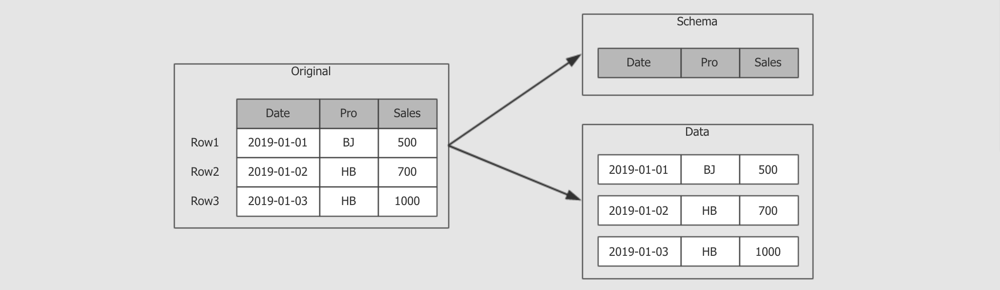
  
    3. 一个 `DataFrame` 或者一个 `Dataset` 中, 元信息只需要保存一份, 序列化的时候, 元信息不需要参与
  
       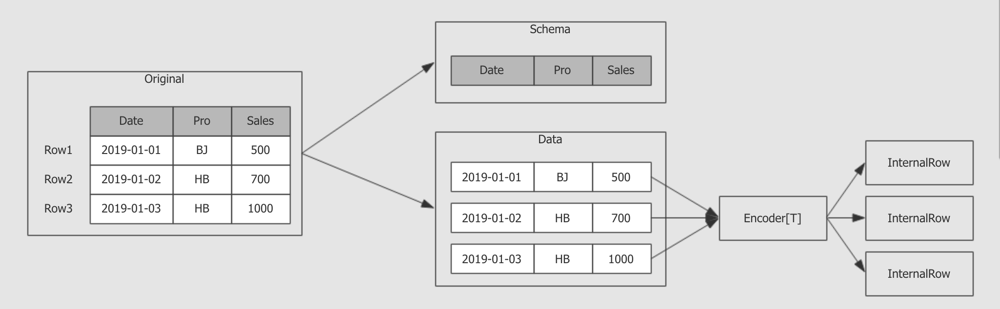
  
    4. 在反序列化 ( `InternalRow → Object` ) 时加入 `Schema` 信息即可
  
       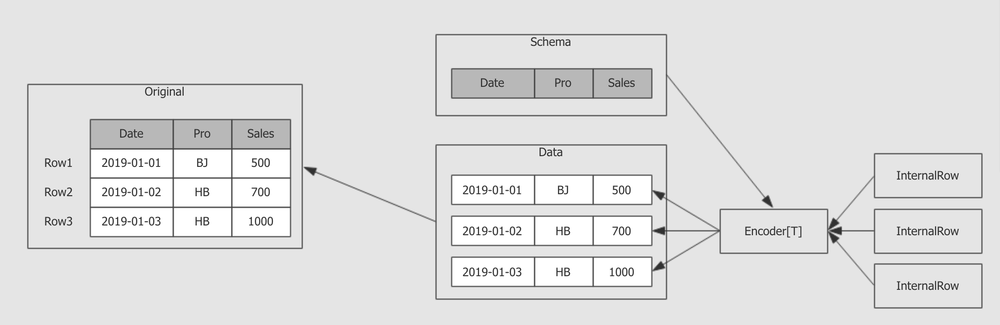
  
  - 优化点 2: 使用堆外内存
  
    - `DataFrame` 和 `Dataset` 不再序列化元信息, 所以内存使用大大减少. 同时新的序列化方式还将数据存入堆外内存中, 从而避免 `GC` 的开销.
    - 堆外内存又叫做 `Unsafe`, 之所以叫不安全的, 因为不能使用 `Java` 的垃圾回收机制, 需要自己负责对象的创建和回收, 性能很好, 但是不建议普通开发者使用, 毕竟不安全

总结

1. 当需要将对象缓存下来的时候, 或者在网络中传输的时候, 要把对象转成二进制, 在使用的时候再将二进制转为对象, 这个过程叫做序列化和反序列化
2. 在 `Spark` 中有很多场景需要存储对象, 或者在网络中传输对象
   1. `Task` 分发的时候, 需要将任务序列化, 分发到不同的 `Executor`中执行
   2. 缓存 `RDD` 的时候, 需要保存 `RDD` 中的数据
   3. 广播变量的时候, 需要将变量序列化, 在集群中广播
   4. `RDD` 的 `Shuffle` 过程中 `Map` 和 `Reducer` 之间需要交换数据
   5. 算子中如果引入了外部的变量, 这个外部的变量也需要被序列化
3. `RDD` 因为不保留数据的元信息, 所以必须要序列化整个对象, 常见的方式是 `Java` 的序列化器, 和 `Kyro` 序列化器
4. `Dataset` 和 `DataFrame` 中保留数据的元信息, 所以可以不再使用 `Java` 的序列化器和 `Kyro` 序列化器, 使用 `Spark` 特有的序列化协议, 生成 `UnsafeInternalRow` 用以保存数据, 这样不仅能减少数据量, 也能减少序列化和反序列化的开销, 其速度大概能达到 `RDD`的序列化的 `20` 倍左右

### 1.3. Spark Streaming 和 Structured Streaming

目标和过程

- 目标

  理解 `Spark Streaming` 和 `Structured Streaming` 之间的区别, 是非常必要的, 从这点上可以理解 `Structured Streaming` 的过去和产生契机

- 过程

  1. `Spark Streaming` 时代
  2. `Structured Streaming` 时代
  3. `Spark Streaming` 和 `Structured Streaming`

- `Spark Streaming` 时代

  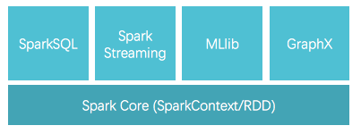

  - `Spark Streaming` 其实就是 `RDD` 的 `API` 的流式工具, 其本质还是 `RDD`, 存储和执行过程依然类似 `RDD`

- `Structured Streaming` 时代

  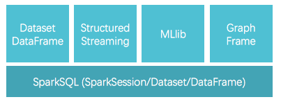

  - `Structured Streaming` 其实就是 `Dataset` 的 `API` 的流式工具, `API`和 `Dataset` 保持高度一致

- `Spark Streaming` 和 `Structured Streaming`

  - `Structured Streaming` 相比于 `Spark Streaming` 的进步就类似于 `Dataset` 相比于 `RDD` 的进步
  - 另外还有一点, `Structured Streaming` 已经支持了连续流模型, 也就是类似于 `Flink` 那样的实时流, 而不是小批量, 但在使用的时候仍然有限制, 大部分情况还是应该采用小批量模式
  
  在`2.2.0` 以后 `Structured Streaming` 被标注为稳定版本, 意味着以后的 `Spark` 流式开发不应该在采用 `Spark Streaming` 了

## 2. Structured Streaming 入门案例

- 目标

  了解 `Structured Streaming` 的编程模型, 为理解 `Structured Streaming`时候是什么, 以及核心体系原理打下基础

- 步骤

  1. 需求梳理
  2. `Structured Streaming`
  3.  代码实现运行验证结果

### 2.1. 需求梳理

目标和过程

- 目标

  理解接下来要做的案例, 有的放矢

- 步骤

  1. 需求
  2. 整体结构
  3. 开发方式

- 需求

  

  - 编写一个流式计算的应用, 不断的接收外部系统的消息
  - 对消息中的单词进行词频统计
  - 统计全局的结果

- 整体结构

  

  1. `Socket Server` 等待 `Structured Streaming` 程序连接
  2. `Structured Streaming` 程序启动, 连接 `Socket Server`, 等待 `Socket Server` 发送数据
  3. `Socket Server` 发送数据, `Structured Streaming` 程序接收数据
  4. `Structured Streaming` 程序接收到数据后处理数据
  5. 数据处理后, 生成对应的结果集, 在控制台打印

- 开发方式和步骤

  `Socket server` 使用 `Netcat nc` 来实现
  
  `Structured Streaming` 程序使用 `IDEA` 实现, 在 `IDEA` 中本地运行
  
  1. 编写代码
  2. 启动 `nc` 发送 `Socket` 消息
  3. 运行代码接收 `Socket` 消息统计词频

总结

- 简单来说, 就是要进行流式的词频统计, 使用 `Structured Streaming`

### 2.2. 代码实现

目标和过程

- 目标

  实现 `Structured Streaming` 部分的代码编写

- 步骤

  1. 创建文件
  2. 创建 `SparkSession`
  3. 读取 `Socket` 数据生成 `DataFrame`
  4. 将 `DataFrame` 转为 `Dataset`, 使用有类型的 `API` 处理词频统计
  5. 生成结果集, 并写入控制台

```scala
object SocketProcessor {

  def main(args: Array[String]): Unit = {

    // 1. 创建 SparkSession
    val spark = SparkSession.builder()
      .master("local[6]")
      .appName("socket_processor")
      .getOrCreate()

    spark.sparkContext.setLogLevel("ERROR")   

    import spark.implicits._

    // 2. 读取外部数据源, 并转为 Dataset[String]
    val source = spark.readStream
      .format("socket")
      .option("host", "192.168.72.141")
      .option("port", 9999)
      .load()
     //source.createOrReplaceTempView("tmptable")
     //source.as[String].flatMap(_.split(" ")).createOrReplaceTempView("tmptable")
     val reasult= spark.sql("select value ,count(*) from tmptable group by value")

    // 3. 统计词频
    val words = source.flatMap(_.split(" "))
      .map((_, 1))
      .groupByKey(_._1)
      .count()

    /*
     *OutputMode.Complete():输出结果是全局的,数据处理过程中可以存在聚合函数
     *OutputMode.Append():输出结果是当前追加的结果,数据处理过程中不能存在聚合函数
     *OutputMode.Update():
     *	如果数据处理过程中包含聚合函数,输出结果是更新的结果
     *	如果数据处理过程中不包含聚合函数,输出结果和Append一样
     */
     // 4. 输出结果
      
    words.writeStream
      .outputMode(OutputMode.Complete())      
      .format("console")                      
      .start()                                
      .awaitTermination()                     
  }
}
```

1. 调整 `Log` 级别, 避免过多的 `Log` 影响视线
2. 默认 `readStream` 会返回 `DataFrame`, 但是词频统计更适合使用 `Dataset`的有类型 `API`
3. 统计全局结果, 而不是一个批次
4. 将结果输出到控制台
5. 开始运行流式应用
6. 阻塞主线程, 在子线程中不断获取数据

总结

- `Structured Streaming` 中的编程步骤依然是先读, 后处理, 最后落地
- `Structured Streaming` 中的编程模型依然是 `DataFrame` 和 `Dataset`
- `Structured Streaming` 中依然是有外部数据源读写框架的, 叫做 `readStream` 和 `writeStream`
- `Structured Streaming` 和 `SparkSQL` 几乎没有区别, 唯一的区别是, `readStream` 读出来的是流, `writeStream` 是将流输出, 而 `SparkSQL` 中的批处理使用 `read` 和 `write`

### 2.3. 运行和结果验证

目标和过程

- 目标

  代码已经编写完毕, 需要运行, 并查看结果集, 因为从结果集的样式中可以看到 `Structured Streaming` 的一些原理

- 步骤

  1. 开启 `Socket server`
  2. 运行程序
  3. 查看数据集

- 开启 `Socket server` 和运行程序

  1. 在虚拟机 `node01` 中运行 `nc -lk 9999`

  2. 在 IDEA 中运行程序

  3. 在 `node01` 中输入以下内容

     ```text
     hello world
     hello spark
     hello hadoop
     hello spark
     hello spark
     ```

- 查看结果集

  ```text
  -------------------------------------------
  Batch: 4
  -------------------------------------------
  +------+--------+
  | value|count(1)|
  +------+--------+
  | hello|       5|
  | spark|       3|
  | world|       1|
  |hadoop|       1|
  +------+--------+
  ```
  
  从结果集中可以观察到以下内容
  
  - `Structured Streaming` 依然是小批量的流处理
  - `Structured Streaming` 的输出是类似 `DataFrame` 的, 也具有 `Schema`, 所以也是针对结构化数据进行优化的
  - 从输出的时间特点上来看, 是一个批次先开始, 然后收集数据, 再进行展示, 这一点和 `Spark Streaming` 不太一样

总结

1. 运行的时候需要先开启 `Socket server`
2. `Structured Streaming` 的 API 和运行也是针对结构化数据进行优化过的

## 3. Stuctured Streaming 的体系和结构

- 目标

  了解 `Structured Streaming` 的体系结构和核心原理, 有两点好处, 一是需要了解原理才好进行性能调优, 二是了解原理后, 才能理解代码执行流程, 从而更好的记忆, 也做到知其然更知其所以然

- 步骤

  1. `WordCount` 的执行原理
  2. `Structured Streaming` 的体系结构

### 3.1. 无限扩展的表格

目标和过程

- 目标

  `Structured Streaming` 是一个复杂的体系, 由很多组件组成, 这些组件之间也会进行交互, 如果无法站在整体视角去观察这些组件之间的关系, 也无法理解 `Structured Streaming` 的全局

- 步骤

  1. 了解 `Dataset` 这个计算模型和流式计算的关系
  2. 如何使用 `Dataset` 处理流式数据?
  3. `WordCount` 案例的执行过程和原理

- `Dataset` 和流式计算

  可以理解为 `Spark` 中的 `Dataset` 有两种, 一种是处理静态批量数据的 `Dataset`, 一种是处理动态实时流的 `Dataset`, 这两种 `Dataset` 之间的区别如下

  - 流式的 `Dataset` 使用 `readStream` 读取外部数据源创建, 使用 `writeStream` 写入外部存储
  - 批式的 `Dataset` 使用 `read` 读取外部数据源创建, 使用 `write` 写入外部存储

- 如何使用 `Dataset` 这个编程模型表示流式计算?

  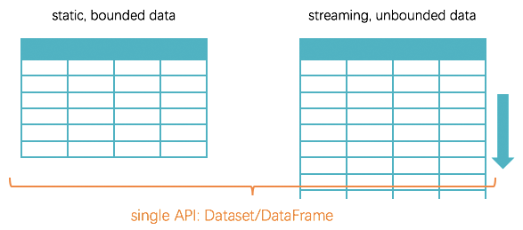可

  - 可以把流式的数据想象成一个不断增长, 无限无界的表
  - 无论是否有界, 全都使用 `Dataset` 这一套 `API`
  - 通过这样的做法, 就能完全保证流和批的处理使用完全相同的代码, 减少这两种处理方式的差异

- `WordCount` 的原理

  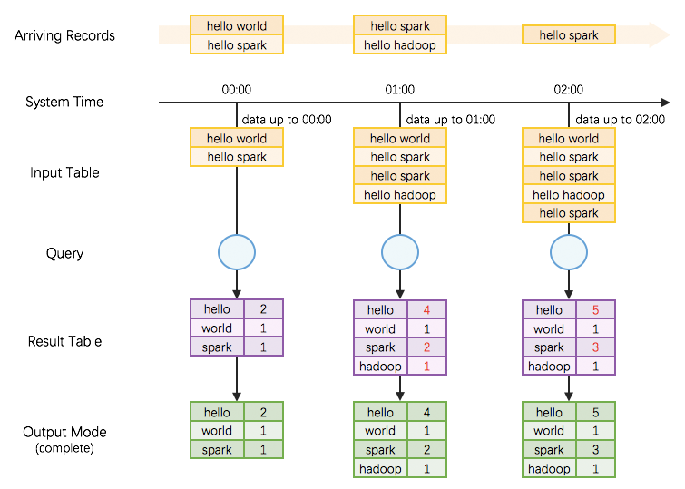
  
  - 整个计算过程大致上分为如下三个部分
    1. `Source`, 读取数据源
    2. `Query`, 在流式数据上的查询
    3. `Result`, 结果集生成
  - 整个的过程如下
    1. 随着时间段的流动, 对外部数据进行批次的划分
    2. 在逻辑上, 将缓存所有的数据, 生成一张无限扩展的表, 在这张表上进行查询
    3. 根据要生成的结果类型, 来选择是否生成基于整个数据集的结果

总结

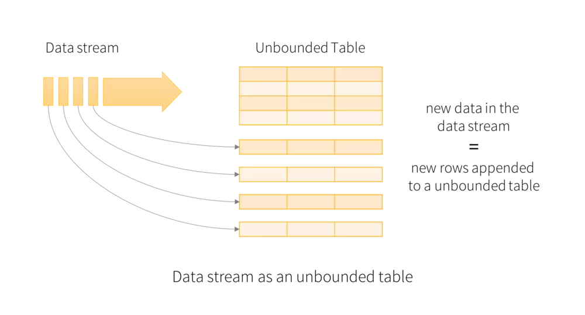

- `Dataset` 不仅可以表达流式数据的处理, 也可以表达批量数据的处理
- `Dataset` 之所以可以表达流式数据的处理, 因为 `Dataset` 可以模拟一张无限扩展的表, 外部的数据会不断的流入到其中

### 3.2. 体系结构

目标和过程

- 目标

  `Structured Streaming` 是一个复杂的体系, 由很多组件组成, 这些组件之间也会进行交互, 如果无法站在整体视角去观察这些组件之间的关系, 也无法理解 `Structured Streaming` 的核心原理

- 步骤

  1. 体系结构
  2. `StreamExecution` 的执行顺序

- 体系结构

  - 在 `Structured Streaming` 中负责整体流程和执行的驱动引擎叫做 `StreamExecution`

    

    `StreamExecution` 在流上进行基于 `Dataset` 的查询, 也就是说, `Dataset` 之所以能够在流上进行查询, 是因为 `StreamExecution`的调度和管理

  - `StreamExecution` 如何工作?

    

    `StreamExecution` 分为三个重要的部分

    - `Source`, 从外部数据源读取数据
    - `LogicalPlan`, 逻辑计划, 在流上的查询计划
    - `Sink`, 对接外部系统, 写入结果

- `StreamExecution` 的执行顺序

  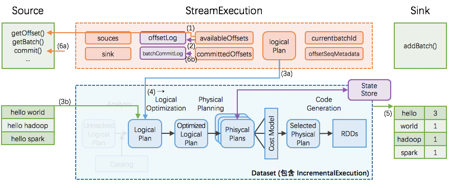

  1. 根据进度标记, 从 `Source` 获取到一个由 `DataFrame` 表示的批次, 这个 `DataFrame` 表示数据的源头

     ```scala
     val source = spark.readStream
       .format("socket")
       .option("host", "127.0.0.1")
       .option("port", 9999)
       .load()
       .as[String]
     ```

     这一点非常类似 `val df = spark.read.csv()` 所生成的 `DataFrame`, 同样都是表示源头

  2. 根据源头 `DataFrame` 生成逻辑计划

     ```scala
     val words = source.flatMap(_.split(" "))
       .map((_, 1))
       .groupByKey(_._1)
       .count()
     ```

     上述代码表示的就是数据的查询, 这一个步骤将这样的查询步骤生成为逻辑执行计划

  3. 优化逻辑计划最终生成物理计划

     

     这一步其实就是使用 `Catalyst` 对执行计划进行优化, 经历基于规则的优化和基于成本模型的优化

  4. 执行物理计划将表示执行结果的 `DataFrame / Dataset` 交给 `Sink`

     整个物理执行计划会针对每一个批次的数据进行处理, 处理后每一个批次都会生成一个表示结果的 `Dataset`

     `Sink` 可以将每一个批次的结果 `Dataset` 落地到外部数据源

  5. 执行完毕后, 汇报 `Source` 这个批次已经处理结束, `Source` 提交并记录最新的进度

- 增量查询

  - 核心问题上图中清晰的展示了最终的结果生成是全局的结果, 而不是一个批次的结果, 但是从 `StreamExecution` 中可以看到, 针对流的处理是按照一个批次一个批次来处理的那么, 最终是如何生成全局的结果集呢?
  
  - 状态记录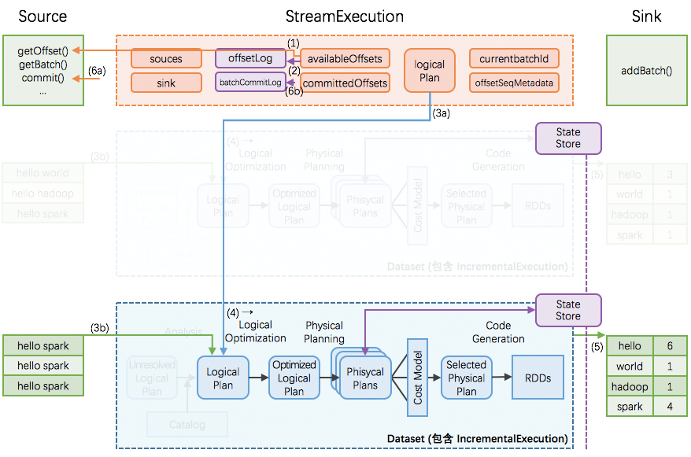
  
    在 `Structured Streaming` 中有一个全局范围的高可用 `StateStore`, 这个时候针对增量的查询变为如下步骤
  
    1. 从 `StateStore` 中取出上次执行完成后的状态
    2. 把上次执行的结果加入本批次, 再进行计算, 得出全局结果
    3. 将当前批次的结果放入 `StateStore` 中, 留待下次使用
  
    

总结

- `StreamExecution` 是整个 `Structured Streaming` 的核心, 负责在流上的查询
- `StreamExecution` 中三个重要的组成部分, 分别是 `Source` 负责读取每个批量的数据, `Sink` 负责将结果写入外部数据源, `Logical Plan` 负责针对每个小批量生成执行计划
- `StreamExecution` 中使用 `StateStore` 来进行状态的维护

## 4. Source

- 目标和过程

  目标
  
  流式计算一般就是通过数据源读取数据, 经过一系列处理再落地到某个地方, 所以这一小节先了解一下如何读取数据, 可以整合哪些数据源
  
  过程
  
  1. 从 `HDFS` 中读取数据
  2. 从 `Kafka` 中读取数据

### 4.1. 从 HDFS 中读取数据

- 目标和过程

  - 目标在数据处理的时候, 经常会遇到这样的场景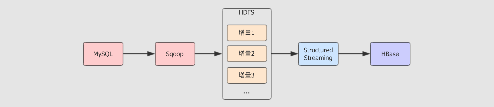
  - 有时候也会遇到这样的场景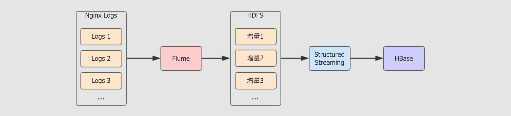
    - 以上两种场景有两个共同的特点
      - 会产生大量小文件在 `HDFS` 上
      - 数据需要处理
    - 通过本章节的学习, 便能够更深刻的理解这种结构, 具有使用 `Structured Streaming` 整合 `HDFS`, 从其中读取数据的能力
  - 步骤
    1. 案例结构
    2. 产生小文件并推送到 `HDFS`
    3. 流式计算统计 `HDFS` 上的小文件
    4. 运行和总结

#### 4.1.1. 案例结构

- 目标和步骤

  目标

  通过本章节可以了解案例的过程和步骤, 以及案例的核心意图

  步骤

  1. 案例结构
  2. 实现步骤
  3. 难点和易错点

- 案例流程

  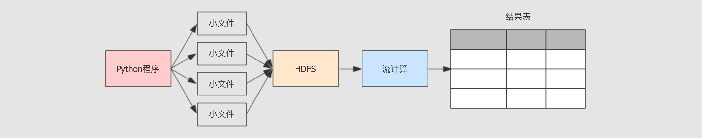

  1. 编写 `Python` 小程序, 在某个目录生成大量小文件
     - `Python` 是解释型语言, 其程序可以直接使用命令运行无需编译, 所以适合编写快速使用的程序, 很多时候也使用 `Python` 代替 `Shell`
     - 使用 `Python` 程序创建新的文件, 并且固定的生成一段 `JSON` 文本写入文件
     - 在真实的环境中, 数据也是一样的不断产生并且被放入 `HDFS` 中, 但是在真实场景下, 可能是 `Flume` 把小文件不断上传到 `HDFS` 中, 也可能是 `Sqoop` 增量更新不断在某个目录中上传小文件
  2. 使用 `Structured Streaming` 汇总数据
     - `HDFS` 中的数据是不断的产生的, 所以也是流式的数据
     - 数据集是 `JSON` 格式, 要有解析 `JSON` 的能力
     - 因为数据是重复的, 要对全局的流数据进行汇总和去重, 其实真实场景下的数据清洗大部分情况下也是要去重的
  3. 使用控制台展示数据
     - 最终的数据结果以表的形式呈现
     - 使用控制台展示数据意味着不需要在修改展示数据的代码, 将 `Sink` 部分的内容放在下一个大章节去说明
     - 真实的工作中, 可能数据是要落地到 `MySQL`, `HBase`, `HDFS` 这样的存储系统中

- 实现步骤

  - Step 1: 编写 `Python` 脚本不断的产生数据
    1. 使用 `Python` 创建字符串保存文件中要保存的数据
    2. 创建文件并写入文件内容
    3. 使用 `Python` 调用系统 `HDFS` 命令上传文件
  - Step 2: 编写 `Structured Streaming` 程序处理数据
    1. 创建 `SparkSession`
    2. 使用 `SparkSession` 的 `readStream` 读取数据源
    3. 使用 `Dataset` 操作数据, 只需要去重
    4. 使用 `Dataset` 的 `writeStream` 设置 `Sink` 将数据展示在控制台中
  - Step 3: 部署程序, 验证结果
    1. 上传脚本到服务器中, 使用 `python` 命令运行脚本
    2. 开启流计算应用, 读取 HDFS 中对应目录的数据
    3. 查看运行结果

- 难点和易错点

  1. 在读取 `HDFS` 的文件时, `Source` 不仅对接数据源, 也负责反序列化数据源中传过来的数据

     - `Source` 可以从不同的数据源中读取数据, 如 `Kafka`, `HDFS`
     - 数据源可能会传过来不同的数据格式, 如 `JSON`, `Parquet`

  2. 读取 `HDFS` 文件的这个 `Source` 叫做 `FileStreamSource`

     从命名就可以看出来这个 `Source` 不仅支持 `HDFS`, 还支持本地文件读取, 亚马逊云, 阿里云 等文件系统的读取, 例如: `file://`, `s3://`, `oss://`

  3. 基于流的 `Dataset` 操作和基于静态数据集的 `Dataset` 操作是一致的

- 总结

  整个案例运行的逻辑是
  
  1. `Python` 程序产生数据到 `HDFS` 中
  2. `Structured Streaming` 从 `HDFS` 中获取数据
  3. `Structured Streaming` 处理数据
  4. 将数据展示在控制台
  
  整个案例的编写步骤
  
  1. `Python` 程序
  2. `Structured Streaming` 程序
  3. 运行

#### 4.1.2. 产生小文件并推送到 HDFS

- 目标和步骤

  目标

  通过本章节看到 `Python` 的大致语法, 并了解 Python 如何编写脚本完成文件的操作, 其实不同的语言使用起来并没有那么难, 完成一些简单的任务还是很简单的

  步骤

  1. 创建 `Python` 代码文件
  2. 编写代码
  3. 本地测试, 但是因为本地环境搭建比较浪费大家时间, 所以暂时不再本地测试

- 代码编写

  - 随便在任一目录中创建文件 `gen_files.py`, 编写以下内容

  ```python
  import os
  
  for index in range(100):
      //1.创建文件内容
      content = """
      {"name":"Michael"}
      {"name":"Andy", "age":30}
      {"name":"Justin", "age":19}
      """
  	//2.文件路径
      file_name = "/export/dataset/text{0}.json".format(index)
  	//3.打开文件,写入内容
      with open(file_name, "w") as file:  
          file.write(content)
  	//4.执行命令,创建目录,上传文件
      os.system("/export/servers/hadoop-2.7.5/bin/hdfs dfs -mkdir -p /dataset/dataset/")
      os.system("/export/servers/hadoop-2.7.5/bin/hdfs dfs -put {0} /dataset/dataset/".format(file_name))
  ```

  1. 注意删除注释中文,更改路径,创建本地目录

     ```shell
     mkdir -p /export/dataset
     ```

  2. 创建文件, 使用这样的写法是因为 `with` 是一种 `Python` 的特殊语法, 如果使用 `with` 去创建文件的话, 使用结束后会自动关闭流

- 总结

  - `Python` 的语法灵活而干净, 比较易于编写
  - 对于其它的语言可以玩乐性质的去使用, 其实并没有很难

#### 4.1.3. 流式计算统计 HDFS 上的小文件

- 目标和步骤

  目标

  通过本章节的学习, 大家可以了解到如何使用 `Structured Streaming` 读取 `HDFS` 中的文件, 并以 `JSON` 的形式解析

  步骤

  1. 创建文件
  2. 编写代码

- 代码

  ```scala
  //设置hadoop环境
  System.setProperty("hadoop.home.dir","c:\\winutil")
  
  //1.创建sparkSession
  val spark = SparkSession.builder()
    .appName("hdfs_source")
    .master("local[6]")
    .getOrCreate()
  //设日志级别
  spark.sparkContext.setLogLevel("WARN")
  
  //定义schema
  val userSchema = new StructType()
    .add("name", "string")
    .add("age", "integer")
  
  //2.数据读取,目录只能是一个文件夹,不能是某一个文件
  val source = spark
    .readStream
    .schema(userSchema)
    .json("hdfs://node01:8020/dataset/dataset")
  
  val result = source.distinct()
  //3.输出结果
  result.writeStream
    .outputMode(OutputMode.Update())
    .format("console")
    .start()
    .awaitTermination()
  ```

- 总结

  以流的形式读取某个 HDFS 目录的代码为
  
  ```scala
  val source = spark
    .readStream         
    .schema(userSchema) 
    .json("hdfs://node01:8020/dataset/dataset") 
  ```
  
  1. 指明读取的是一个流式的 `Dataset`
  2. 指定读取到的数据的 `Schema`
  3. 指定目录位置, 以及数据格式

#### 4.1.4. 运行和流程总结

- 目标和步骤

  目标

  通过这个小节对案例的部署以后, 不仅大家可以学到一种常见的部署方式, 同时也能对案例的执行流程和流计算有更深入的了解

  步骤

  1. 运行 `Python` 程序
  2. 运行 `Spark` 程序
  3. 总结

- 运行 Python 程序

  1. 上传 `Python` 源码文件到服务器中

  2. 运行 `Python` 脚本

     ```shell
     # 进入 Python 文件被上传的位置
     cd ~
     
     # 创建放置生成文件的目录
     mkdir -p /export/dataset
     
     # 运行程序
     python gen_files.py
     ```

- 运行 Spark 程序

  1. 使用 `Maven` 打包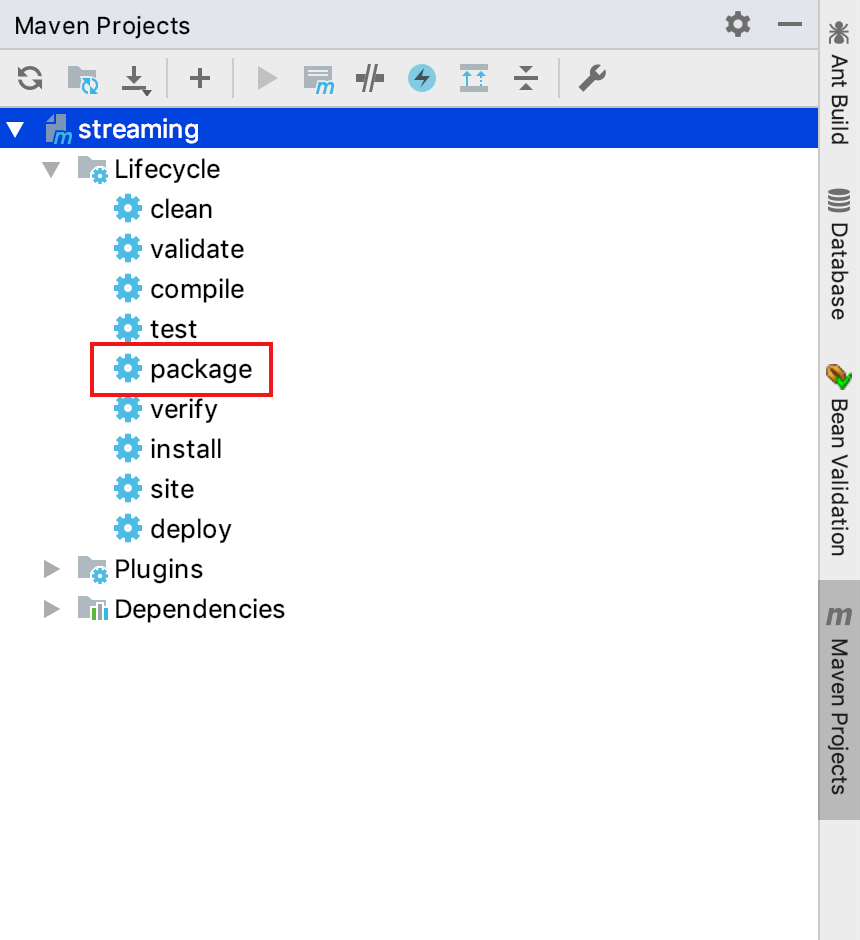

  2. 上传至服务器

  3. 运行 `Spark` 程序

     ```scala
     # 进入保存 Jar 包的文件夹
     cd ~
     
     # 运行流程序
     spark-submit --class cn.itcast.structured.HDFSSource ./original-streaming-0.0.1.jar
     ```

- 总结

  
  
  1. `Python` 生成文件到 `HDFS`, 这一步在真实环境下, 可能是由 `Flume` 和 `Sqoop` 收集并上传至 `HDFS`
  2. `Structured Streaming` 从 `HDFS` 中读取数据并处理
  3. `Structured Streaming` 讲结果表展示在控制台

### 4.2. 从 Kafka 中读取数据

- 目标和步骤

  目标
  
  通过本章节的学习, 便可以理解流式系统和队列间的关系, 同时能够编写代码从 `Kafka` 以流的方式读取数据
  
  步骤
  
  1. `Kafka` 回顾
  2. `Structured Streaming` 整合 `Kafka`
  3. 读取 `JSON` 格式的内容
  4. 读取多个 `Topic` 的数据

#### 4.2.1 Kafka 的场景和结构

- 目标和步骤

  目标

  通过这一个小节的学习, 大家可以理解 `Kfaka` 在整个系统中的作用, 日后工作的话, 也必须要先站在更高层去理解系统的组成, 才能完成功能和代码

  步骤

  1. `Kafka` 的应用场景
  2. `Kafka` 的特点
  3. `Topic` 和 `Partitions`

- Kafka 是一个 Pub / Sub 系统

  - `Pub / Sub` 是 `Publisher / Subscriber` 的简写, 中文称作为发布订阅系统
  - 发布订阅系统可以有多个 `Publisher` 对应一个 `Subscriber`, 例如多个系统都会产生日志, 通过这样的方式, 一个日志处理器可以简单的获取所有系统产生的日志
  - 发布订阅系统也可以一个 `Publisher` 对应多个 `Subscriber`, 这样就类似于广播了, 例如通过这样的方式可以非常轻易的将一个订单的请求分发给所有感兴趣的系统, 减少耦合性
  - 当然, 在大数据系统中, 这样的消息系统往往可以作为整个数据平台的入口, 左边对接业务系统各个模块, 右边对接数据系统各个计算工具

- Kafka 的特点

  `Kafka` 有一个非常重要的应用场景就是对接业务系统和数据系统, 作为一个数据管道, 其需要流通的数据量惊人, 所以 `Kafka` 如果要满足这种场景的话, 就一定具有以下两个特点

  - 高吞吐量
  - 高可靠性

- Topic 和 Partitions

  - 消息和事件经常是不同类型的, 例如用户注册是一种消息, 订单创建也是一种消息
  - `Kafka` 中使用 `Topic` 来组织不同类型的消息
  - `Kafka` 中的 `Topic` 要承受非常大的吞吐量, 所以 `Topic` 应该是可以分片的, 应该是分布式的

- 总结

  - `Kafka` 的应用场景
    - 一般的系统中, 业务系统会不止一个, 数据系统也会比较复杂
    - 为了减少业务系统和数据系统之间的耦合, 要将其分开, 使用一个中间件来流转数据
    - Kafka 因为其吞吐量超高, 所以适用于这种场景
  - `Kafka` 如何保证高吞吐量
    - 因为消息会有很多种类, `Kafka` 中可以创建多个队列, 每一个队列就是一个 `Topic`, 可以理解为是一个主题, 存放相关的消息
    - 因为 `Topic` 直接存放消息, 所以 `Topic` 必须要能够承受非常大的通量, 所以 `Topic` 是分布式的, 是可以分片的, 使用分布式的并行处理能力来解决高通量的问题

#### 4.2.2. Kafka 和 Structured Streaming 整合的结构

- 目标和步骤

  目标

  通过本小节可以理解 `Kafka` 和 `Structured Streaming` 整合的结构原理, 同时还能理解 `Spark` 连接 `Kafka` 的时候一个非常重要的参数

  步骤               

  1. `Topic` 的 `Offset`
  2. `Kafka` 和 `Structured Streaming` 的整合结构
  3. `Structured Streaming` 读取 `Kafka` 消息的三种方式

- Topic 的 Offset

  - `Topic` 是分区的, 每一个 `Topic` 的分区分布在不同的 `Broker` 上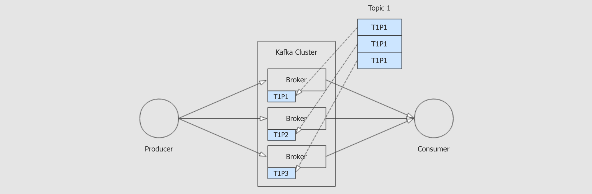

  - 每个分区都对应一系列的 `Log` 文件, 消息存在于 `Log` 中, 消息的 `ID` 就是这条消息在本分区的 `Offset` 偏移量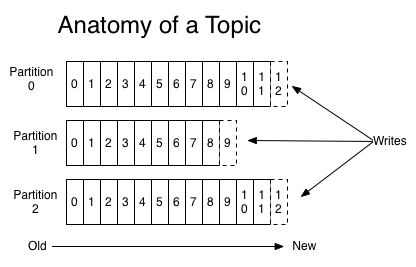

    > `Offset` 又称作为偏移量, 其实就是一个东西距离另外一个东西的距离
    >
    > `Kafka` 中使用 `Offset` 命名消息, 而不是指定 `ID` 的原因是想表示永远自增, `ID` 是可以指定的, 但是 `Offset`只能是一个距离值, 它只会越来越大, 所以, 叫做 `Offset` 而不叫 `ID` 也是这个考虑, 消息只能追加到 `Log` 末尾, 只能增长不能减少

- Kafka 和 Structured Streaming 整合的结构

  

  分析

  - `Structured Streaming` 中使用 `Source` 对接外部系统, 对接 `Kafka`的 `Source` 叫做 `KafkaSource`
  - `KafkaSource` 中会使用 `KafkaSourceRDD` 来映射外部 `Kafka` 的 `Topic`, 两者的 `Partition` 一一对应

  结论

  `Structured Streaming` 会并行的从 `Kafka` 中获取数据

- Structured Streaming 读取 Kafka 消息的三种方式

  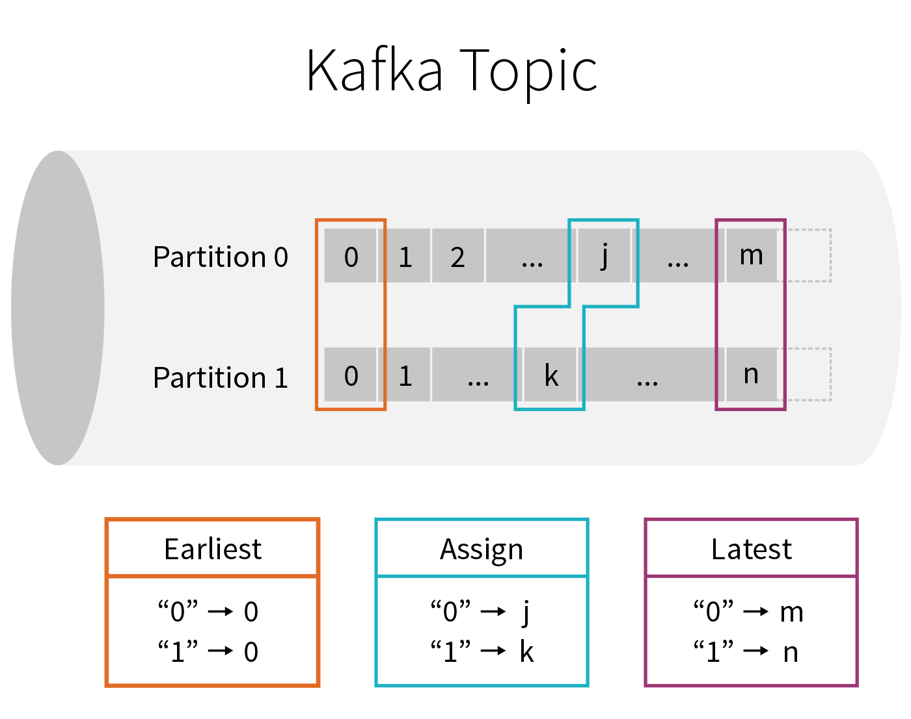

  - `Earliest` 从每个 `Kafka` 分区最开始处开始获取
  - `Assign` 手动指定每个 `Kafka` 分区中的 `Offset`
  - `Latest` 不再处理之前的消息, 只获取流计算启动后新产生的数据

- 总结

  - `Kafka` 中的消息存放在某个 `Topic` 的某个 `Partition` 中, 消息是不可变的, 只会在消息过期的时候从最早的消息开始删除, 消息的 `ID` 也叫做 `Offset`, 并且只能正增长
  - `Structured Streaming` 整合 `Kafka` 的时候, 会并行的通过 `Offset` 从所有 `Topic` 的 `Partition` 中获取数据
  - `Structured Streaming` 在从 `Kafka` 读取数据的时候, 可以选择从最早的地方开始读取, 也可以选择从任意位置读取, 也可以选择只读取最新的

#### 4.2.3. 需求介绍

- 目标和步骤

  目标

  通过本章节的学习, 可以掌握一个常见的需求, 并且了解后面案例的编写步骤

  步骤

  1. 需求
  2. 数据

- 需求

  1. 模拟一个智能物联网系统的数据统计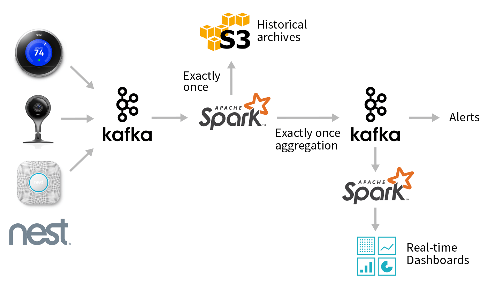

     - 有一个智能家居品牌叫做 `Nest`, 他们主要有两款产品, 一个是恒温器, 一个是摄像头
     - 恒温器的主要作用是通过感应器识别家里什么时候有人, 摄像头主要作用是通过学习算法来识别出现在摄像头中的人是否是家里人, 如果不是则报警
     - 所以这两个设备都需要统计一个指标, 就是家里什么时候有人, 此需求就是针对这个设备的一部分数据, 来统计家里什么时候有人

  2. 使用生产者在 Kafka 的 Topic : streaming-test 中输入 JSON 数据

     ``` json
     {
       "devices": {
         "cameras": {
           "device_id": "awJo6rH",
           "last_event": {
             "has_sound": true,
             "has_motion": true,
             "has_person": true,
             "start_time": "2016-12-29T00:00:00.000Z",
             "end_time": "2016-12-29T18:42:00.000Z"
           }
         }
       }
     }
     ```

  3. 使用 Structured Streaming 来过滤出来家里有人的数据

     把数据转换为 `时间 → 是否有人` 这样类似的形式

- 数据转换

  1. 追踪 JSON 数据的格式可以在一个在线的工具 `https://jsonformatter.org/` 中格式化 `JSON`, 会发现 `JSON` 格式如下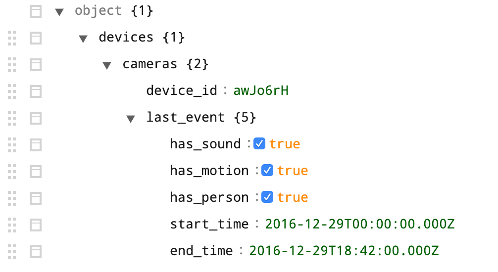

  2. 反序列化

     `JSON` 数据本质上就是字符串, 只不过这个字符串是有结构的, 虽然有结构, 但是很难直接从字符串中取出某个值

     而反序列化, 就是指把 `JSON` 数据转为对象, 或者转为 `DataFrame`, 可以直接使用某一个列或者某一个字段获取数据, 更加方便

     而想要做到这件事, 必须要先根据数据格式, 编写 `Schema` 对象, 从而通过一些方式转为 `DataFrame`

     ```scala
     val eventType = new StructType()
       .add("has_sound", BooleanType, nullable = true)
       .add("has_motion", BooleanType, nullable = true)
       .add("has_person", BooleanType, nullable = true)
       .add("start_time", DateType, nullable = true)
       .add("end_time", DateType, nullable = true)
     
     val camerasType = new StructType()
       .add("device_id", StringType, nullable = true)
       .add("last_event", eventType, nullable = true)
     
     val devicesType = new StructType()
       .add("cameras", camerasType, nullable = true)
     
     val schema = new StructType()
       .add("devices", devicesType, nullable = true)
     ```

- 总结

  1. 业务简单来说, 就是收集智能家居设备的数据, 通过流计算的方式计算其特征规律
  2. `Kafka` 常见的业务场景就是对接业务系统和数据系统
     1. 业务系统经常会使用 JSON 作为数据传输格式
     2. 所以使用 `Structured Streaming` 来对接 `Kafka` 并反序列化 `Kafka`中的 `JSON` 格式的消息, 是一个非常重要的技能
  3. 无论使用什么方式, 如果想反序列化 `JSON` 数据, 就必须要先追踪 `JSON` 数据的结构

#### 4.2.4. 使用 Spark 流计算连接 Kafka 数据源

- 目标和步骤

  目标

  通过本章节的数据, 能够掌握如何使用 `Structured Streaming` 对接 `Kafka`, 从其中获取数据

  步骤

  1. 创建 `Topic` 并输入数据到 `Topic`
  2. `Spark` 整合 `kafka`
  3. 读取到的 `DataFrame` 的数据结构

- 创建 Topic 并输入数据到 Topic

  1. 使用命令创建 `Topic`

     ```shell
     bin/kafka-topics.sh --create --topic streaming-test --replication-factor 1 --partitions 3 --zookeeper node01:2181,node02:2181,node03:2181
     ```

  2. 开启 `Producer`

     ```shell
     bin/kafka-console-producer.sh --broker-list node01:9092,node02:9092,node03:9092 --topic streaming-test
     ```

  3. 把 `JSON` 转为单行输入

     ```json
     {"devices":{"cameras":{"device_id":"awJo6rH","last_event":{"has_sound":true,"has_motion":true,"has_person":true,"start_time":"2016-12-29T00:00:00.000Z","e
                                                                nd_time":"2016-12-29T18:42:00.000Z"}}}}
     ```

- 使用 Spark 读取 Kafka 的 Topic

  1. 编写 `Spark` 代码读取 `Kafka Topic`

     ```scala
     //1.创建SparkSession
     val spark = new SparkSession.builder.appName("kafka").master("local[6]").getOrCreate()
     //2.读取kafka数据
     val source = spark.readStream
       .format("kafka")
       .option("kafka.bootstrap.servers", "node01:9092,node01:9092,node03:9092")
       .option("subscribe", "streaming_test")
       .option("startingOffsets", "earliest")
       .load()
     import spark.implicits._
     source.printSchame()
     ```

     - 三个参数
       - `kafka.bootstrap.servers` : 指定 `Kafka` 的 `Server` 地址
       - `subscribe` : 要监听的 `Topic`, 可以传入多个, 传入多个 Topic 则监听多个 Topic, 也可以使用 `topic-*` 这样的通配符写法
       - `startingOffsets` : 从什么位置开始获取数据, 可选值有 `earliest`, `assign`, `latest`
     - `format` 设置为 `Kafka` 指定使用 `KafkaSource` 读取数据

  2. 思考: 从 `Kafka` 中应该获取到什么?

     - 业务系统有很多种类型, 有可能是 `Web` 程序, 有可能是物联网前端大多数情况下使用 `JSON` 做数据交互

     - 问题1: 业务系统如何把数据给 `Kafka` ?

       - 可以主动或者被动的把数据交给 `Kafka`, 但是无论使用什么方式, 都在使用 `Kafka` 的 `Client` 类库来完成这件事, `Kafka` 的类库调用方式如下

         ```java
         Producer<String, String> producer = new KafkaProducer<String, String>(properties);
         producer.send(new ProducerRecord<String, String>("HelloWorld", msg));
         ```

         其中发给 `Kafka` 的消息是 `KV` 类型的

     - 问题2: 使用 `Structured Streaming` 访问 `Kafka` 获取数据的时候, 需要什么东西呢?

       - 需求1: 存储当前处理过的 `Kafka` 的 `Offset`
       - 需求2: 对接多个 `Kafka Topic` 的时候, 要知道这条数据属于哪个 `Topic`

       - 结论
         - `Kafka` 中收到的消息是 `KV` 类型的, 有 `Key`, 有 `Value`
         - `Structured Streaming` 对接 `Kafka` 的时候, 每一条 `Kafka`消息不能只是 `KV`, 必须要有 `Topic`, `Partition` 之类的信息

  3. 从 `Kafka` 获取的 `DataFrame` 格式

     ```scala
     source.printSchema()
     ```

     结果如下

     ```text
     root
      |-- key: binary (nullable = true)
      |-- value: binary (nullable = true)
      |-- topic: string (nullable = true)
      |-- partition: integer (nullable = true)
      |-- offset: long (nullable = true)
      |-- timestamp: timestamp (nullable = true)
      |-- timestampType: integer (nullable = true)
     ```

     从 `Kafka` 中读取到的并不是直接是数据, 而是一个包含各种信息的表格, 其中每个字段的含义如下

     | Key             | 类型        | 解释                                                         |
     | :-------------- | :---------- | :----------------------------------------------------------- |
     | `key`           | `binary`    | `Kafka` 消息的 `Key`                                         |
     | `value`         | `binary`    | `Kafka` 消息的 `Value`                                       |
     | `topic`         | `string`    | 本条消息所在的 `Topic`, 因为整合的时候一个 `Dataset` 可以对接多个 `Topic`, 所以有这样一个信息 |
     | `partition`     | `integer`   | 消息的分区号                                                 |
     | `offset`        | `long`      | 消息在其分区的偏移量                                         |
     | `timestamp`     | `timestamp` | 消息进入 `Kafka` 的时间戳                                    |
     | `timestampType` | `integer`   | 时间戳类型                                                   |

- 总结

  1. 一定要把 `JSON` 转为一行, 再使用 `Producer` 发送, 不然会出现获取多行的情况
  
  2. 使用 Structured Streaming 连接 Kafka 的时候, 需要配置如下三个参数
  
     - `kafka.bootstrap.servers` : 指定 `Kafka` 的 `Server` 地址
     - `subscribe` : 要监听的 `Topic`, 可以传入多个, 传入多个 Topic 则监听多个 Topic, 也可以使用 `topic-*` 这样的通配符写法
     - `startingOffsets` : 从什么位置开始获取数据, 可选值有 `earliest`, `assign`, `latest`
  
  3. 从 Kafka 获取到的 DataFrame 的 Schema 如下
  
     ```text
     root
      |-- key: binary (nullable = true)
      |-- value: binary (nullable = true)
      |-- topic: string (nullable = true)
      |-- partition: integer (nullable = true)
      |-- offset: long (nullable = true)
      |-- timestamp: timestamp (nullable = true)
      |-- timestampType: integer (nullable = true)
     ```

#### 4.2.5. JSON 解析和数据统计

- 目标和步骤

  目标

  通过本章的学习, 便能够解析 `Kafka` 中的 `JSON` 数据, **这是一个重点中的重点**

  步骤

  1. `JSON` 解析
  2. 数据处理
  3. 运行测试

- JSON 解析

  1. 准备好 `JSON` 所在的列

     - 问题

       由 `Dataset` 的结构可以知道 `key` 和 `value` 列的类型都是 `binary` 二进制, 所以要将其转为字符串, 才可进行 `JSON` 解析

     - 解决方式

       ````scala
       //4.解析JSON
       
       source.selectExpr("CAST(key AS STRING) as key", "CAST(value AS STRING) as value")
       ````

  2. 编写 `Schema` 对照 `JSON` 的格式

     - `Key` 要对应 `JSON` 中的 `Key`
     - `Value` 的类型也要对应 `JSON` 中的 `Value` 类型

     ```scala
     //3.定义JSON中的类型
     val eventType = new StructType()
       .add("has_sound", BooleanType, nullable = true)
       .add("has_motion", BooleanType, nullable = true)
       .add("has_person", BooleanType, nullable = true)
       .add("start_time", DateType, nullable = true)
       .add("end_time", DateType, nullable = true)
     
     val camerasType = new StructType()
       .add("device_id", StringType, nullable = true)
       .add("last_event", eventType, nullable = true)
     
     val devicesType = new StructType()
       .add("cameras", camerasType, nullable = true)
     
     val schema = new StructType()
       .add("devices", devicesType, nullable = true)
     ```

  3. 因为 `JSON` 中包含 `Date` 类型的数据, 所以要指定时间格式化方式

     ```scala
     import org.apache.spark.sql.functions._
     
     val jsonOptions = Map("timestampFormat" -> "yyyy-MM-dd'T'HH:mm:ss.sss'Z'")
     ```

  4. 使用 `from_json` 这个 `UDF` 格式化 `JSON`

     ```scala
     source.selectExpr("CAST(key AS STRING) as key", "CAST(value AS STRING) as value").select(from_json('value, schema, jsonOptions).alias("parsed_value"))
     ```

  5. 选择格式化过后的 `JSON` 中的字段

     因为 `JSON` 被格式化过后, 已经变为了 `StructType`, 所以可以直接获取其中某些字段的值

     ```scala
     .selectExpr("parsed_value.devices.cameras.last_event.has_person as has_person",
               "parsed_value.devices.cameras.last_event.start_time as start_time")
     ```

- 数据处理

  1. 统计各个时段有人的数据

     ```scala
     .filter('has_person === true)
     .groupBy('has_person, 'start_time)
     .count()
     ```

  2. 将数据落地到控制台

     ```scala
     //5.结果输出
     result.writeStream
       .outputMode(OutputMode.Complete())
       .format("console")
       .start()
       .awaitTermination()
     ```

- 全部代码

  ````scala
  import org.apache.spark.sql.SparkSession
    System.setProperty("hadoop.home.dir","C:\\winutil")
  //1.创建SparkSession
  
  val spark = SparkSession.builder()
    .master("local[6]")
    .appName("kafka integration")
    .getOrCreate()
  
  import org.apache.spark.sql.streaming.OutputMode
  import org.apache.spark.sql.types._
  //2.读取kafka数据
  val source = spark
    .readStream
    .format("kafka")
    .option("kafka.bootstrap.servers", "node01:9092,node02:9092,node03:9092")
    .option("subscribe", "streaming-test")
    .option("startingOffsets", "earliest")
    .load()
  // 3. 定义 JSON 中的类型
   /**
        * {
        *   devices:{
        *     cameras:{
        *       device_id:"",
        *       last_event:{
        *         has_sound:true,
        *         has_motion:true,
        *         has_person:true,
        *         start_time:"yyy",
        *         end_time:"yy"
        *       }
        *     }
        *   }
        * }
        */
  val eventType = new StructType()
    .add("has_sound", BooleanType, nullable = true)
    .add("has_motion", BooleanType, nullable = true)
    .add("has_person", BooleanType, nullable = true)
    .add("start_time", DateType, nullable = true)
    .add("end_time", DateType, nullable = true)
  
  val camerasType = new StructType()
    .add("device_id", StringType, nullable = true)
    .add("last_event", eventType, nullable = true)
  
  val devicesType = new StructType()
    .add("cameras", camerasType, nullable = true)
  
  val schema = new StructType()
    .add("devices", devicesType, nullable = true)
  // 4. 解析 JSON
  // 需求: DataFrame(time, has_person)
  val jsonOptions = Map("timestampFormat" -> "yyyy-MM-dd'T'HH:mm:ss.sss'Z'")
  
  import org.apache.spark.sql.functions._
  import spark.implicits._
  
  val result = source.selectExpr("CAST(key AS STRING) as key", "CAST(value AS STRING) as value")
      .select(from_json('value, schema, jsonOptions).alias("parsed_value"))
      .selectExpr("parsed_value.devices.cameras.last_event.has_person as has_person",
        "parsed_value.devices.cameras.last_event.start_time as start_time")
      .filter('has_person === true)
      .groupBy('has_person, 'start_time)
      .count()
   // 5. 打印数据
  result.writeStream
    .outputMode(OutputMode.Append())
    .format("console")
    .start()
    .awaitTermination()
  ````

- 运行测试

  1. 进入服务器中, 启动 `Kafka`
  
     ````properties
     cd /export/servers/kafka/bin   
     ./kafka-server-start.sh /export/servers/kafka/config/server.properties 1>/dev/null 2>&1 &
     
     #注意：可以启动一台broker，单机版。也可以同时启动三台broker，组成一个kafka集群版
     ````
  
  2. 启动 `Kafka` 的 `Producer`
  
     ```shell
     bin/kafka-console-producer.sh --broker-list node01:9092,node02:9092,node03:9092 --topic streaming-test
     ```
  
  3. 启动 `Spark shell` 并拷贝代码进行测试
  
     ```shell
     ./bin/spark-shell --packages org.apache.spark:spark-sql-kafka-0-10_2.11:2.2.0
     ```
  
     - 因为需要和 `Kafka` 整合, 所以在启动的时候需要加载和 `Kafka` 整合的包 `spark-sql-kafka-0-10`

```xml
<dependency>
            <groupId>org.apache.spark</groupId>
            <artifactId>spark-streaming-kafka-0-10_2.12</artifactId>
            <version>2.4.4</version>
        </dependency>
```

## 5. Sink

- 目标和步骤

  目标
  
  - 能够串联两端, 理解整个流式应用, 以及其中的一些根本的原理, 比如说容错语义
  - 能够知道如何对接外部系统, 写入数据
  
  步骤
  
  1. `HDFS Sink`
  2. `Kafka Sink`
  3. `Foreach Sink`
  4. 自定义 `Sink`
  5. `Tiggers`
  6. `Sink` 原理
  7. 错误恢复和容错语义

### 5.1. HDFS Sink

- 目标和步骤

  目标

  能够使用 `Spark` 将流式数据的处理结果放入 `HDFS`

  步骤

  1. 场景和需求
  2. 代码实现

- 场景和需求

  - `Kafka` 往往作为数据系统和业务系统之间的桥梁
  - 数据系统一般由批量处理和流式处理两个部分组成
  - 在 `Kafka` 作为整个数据平台入口的场景下, 需要使用 `StructuredStreaming` 接收 `Kafka` 的数据并放置于 `HDFS` 上, 后续才可以进行批量处理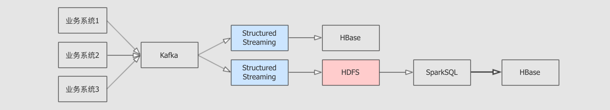

- 案例需求

  - 从 `Kafka` 接收数据, 从给定的数据集中, 裁剪部分列, 落地于 `HDFS`

- 代码实现

  步骤说明
  
  1. 从 `Kafka` 读取数据, 生成源数据集
     1. 连接 `Kafka` 生成 `DataFrame`
     2. 从 `DataFrame` 中取出表示 `Kafka` 消息内容的 `value` 列并转为 `String` 类型
  2. 对源数据集选择列
     1. 解析 `CSV` 格式的数据
     2. 生成正确类型的结果集
  3. 落地 `HDFS`
  
  整体代码
  
  ```scala
  import org.apache.spark.sql.SparkSession
  System.setProperties("hadoop.home.dir","C:\\winutil")
  //创建SparkSession
  val spark = SparkSession.builder()
    .master("local[6]")
    .appName("hdfs_sink")
    .getOrCreate()
  
  import spark.implicits._
  
  val source = spark
    .readStream
    .format("kafka")
    .option("kafka.bootstrap.servers", "node01:9092,node02:9092,node03:9092")
    .option("subscribe", "streaming-bank")
    .option("startingOffsets", "earliest")
    .load()
    .selectExpr("CAST(value AS STRING)")
    .as[String]
  //处理csv,Dataset(String),Dataseet(age,job,balance)
  val result = source.map {
    item =>
      val arr = item.replace("\"", "").split(";")
      (arr(0).toInt, arr(1).toInt, arr(5).toInt)
  }
  .as[(Int, Int, Int)]
  .toDF("age", "job", "balance")
  
  result.writeStream
    .format("parquet") // 也可以是 "orc", "json", "csv" 等
    .option("path", "/dataset/streaming/result/")
    .option("checkpointLocation","checkpoint")
    .start()
  ```

### 5.2. Kafka Sink

- 目标和步骤

  目标

  掌握什么时候要将流式数据落地至 Kafka, 以及如何落地至 Kafka

  步骤

  1. 场景
  2. 代码

- 场景

  - 场景
  - 有很多时候, `ETL` 过后的数据, 需要再次放入 `Kafka`
  - 在 `Kafka` 后, 可能会有流式程序统一将数据落地到 `HDFS`或者 `HBase`

- 案例需求

  - 从 `Kafka` 中获取数据, 简单处理, 再次放入 `Kafka`

- 代码

  步骤
  
  1. 从 `Kafka` 读取数据, 生成源数据集
     1. 连接 `Kafka` 生成 `DataFrame`
     2. 从 `DataFrame` 中取出表示 `Kafka` 消息内容的 `value` 列并转为 `String` 类型
  2. 对源数据集选择列
     1. 解析 `CSV` 格式的数据
     2. 生成正确类型的结果集
  3. 再次落地 `Kafka`
  
  代码
  
  ```scala
  import org.apache.spark.sql.SparkSession
  
  val spark = SparkSession.builder()
    .master("local[6]")
    .appName("kafka integration")
    .getOrCreate()
  
  import spark.implicits._
  
  val source = spark
    .readStream
    .format("kafka")
    .option("kafka.bootstrap.servers", "node01:9092,node02:9092,node03:9092")
    .option("subscribe", "streaming-bank")
    .option("startingOffsets", "earliest")
    .load()
    .selectExpr("CAST(value AS STRING)")
    .as[String]
  
  val result = source.map {
    item =>
      val arr = item.replace("\"", "").split(";")
      (arr(0).toInt, arr(1).toInt, arr(5).toInt)
  }
  .as[(Int, Int, Int)]
  .toDF("age", "job", "balance")
  
  result.writeStream
    .format("kafka")
    .outputMode(OutputMode.Append())
    .option("kafka.bootstrap.servers", "node01:9092,node02:9092,node03:9092")
    .option("topic", "streaming-bank-result")
    .start()
    .awaitTermination()
  ```

### 5.3. Foreach Writer

- 目标和步骤

  目标

  掌握 `Foreach` 模式理解如何扩展 `Structured Streaming` 的 `Sink`, 同时能够将数据落地到 `MySQL`

  步骤

  1. 需求
  2. 代码

- 需求

  - 场景

    - 大数据有一个常见的应用场景
      1. 收集业务系统数据
      2. 数据处理
      3. 放入 `OLTP` 数据
      4. 外部通过 `ECharts` 获取并处理数据
    - 这个场景下, `StructuredStreaming` 就需要处理数据并放入 `MySQL` 或者 `MongoDB`, `HBase` 中以供 `Web` 程序可以获取数据, 图表的形式展示在前端

    

  - Foreach 模式::

    - 起因

      - 在 `Structured Streaming` 中, 并未提供完整的 `MySQL/JDBC`整合工具
      - 不止 `MySQL` 和 `JDBC`, 可能会有其它的目标端需要写入
      - 很多时候 `Structured Streaming` 需要对接一些第三方的系统, 例如阿里云的云存储, 亚马逊云的云存储等, 但是 `Spark` 无法对所有第三方都提供支持, 有时候需要自己编写

    - 解决方案

      

      - 既然无法满足所有的整合需求, `StructuredStreaming` 提供了 `Foreach`, 可以拿到每一个批次的数据
      - 通过 `Foreach` 拿到数据后, 可以通过自定义写入方式, 从而将数据落地到其它的系统

- 案例需求::
  
- 从 `Kafka` 中获取数据, 处理后放入 `MySQL`
  
- 代码

  步骤
  
  1. 创建 `DataFrame` 表示 `Kafka` 数据源
  2. 在源 `DataFrame` 中选择三列数据
  3. 创建 `ForeachWriter` 接收每一个批次的数据落地 `MySQL`
  4. `Foreach` 落地数据
  
  代码
  
  ```scala
  import org.apache.spark.sql.SparkSession
  
  val spark = SparkSession.builder()
    .master("local[6]")
    .appName("kafka integration")
    .getOrCreate()
  
  import spark.implicits._
  
  val source = spark
    .readStream
    .format("kafka")
    .option("kafka.bootstrap.servers", "node01:9092,node02:9092,node03:9092")
    .option("subscribe", "streaming-bank")
    .option("startingOffsets", "earliest")
    .load()
    .selectExpr("CAST(value AS STRING)")
    .as[String]
  
  val result = source.map {
    item =>
      val arr = item.replace("\"", "").split(";")
      (arr(0).toInt, arr(1).toInt, arr(5).toInt)
  }
  .as[(Int, Int, Int)]
  .toDF("age", "job", "balance")
  
  //4.落地到MySql
  class MySQLWriter extends ForeachWriter[Row] {
    val driver = "com.mysql.jdbc.Driver"
    var statement: Statement = _
    var connection: Connection  = _
    val url: String = "jdbc:mysql://node01:3306/streaming-bank-result"
    val user: String = "root"
    val pwd: String = "root"
  
    //
    override def open(partitionId: Long, version: Long): Boolean = {
      Class.forName(driver)
      connection = DriverManager.getConnection(url, user, pwd)
      //this.statement = connection.createStatement
      this.statement = connection.prepareStatement("insert into movies values(?,?,?)")
      true
    }
    //数据操作
    override def process(value: Row): Unit = {
     /* statement.executeUpdate(s"insert into bank values(" +
        s"${value.getAs[Int]("age")}, " +
        s"${value.getAs[Int]("job")}, " +
        s"${value.getAs[Int]("balance")} )")*/
        
        
    }
    //资源回收
    override def close(errorOrNull: Throwable): Unit = {
      connection.close()
    }
  }
  
  result.writeStream
    .foreach(new MySQLWriter)
    .start()
    .awaitTermination()
  ```

### 5.4. 自定义 Sink

- 目标和步骤

  目标

  - `Foreach` 倾向于一次处理一条数据, 如果想拿到 `DataFrame` 幂等的插入外部数据源, 则需要自定义 `Sink`
  - 了解如何自定义 `Sink`

  步骤

  1. `Spark` 加载 `Sink` 流程分析
  2. 自定义 `Sink`

- Spark 加载 Sink 流程分析

  `Sink` 加载流程

  1. `writeStream` 方法中会创建一个 `DataStreamWriter` 对象

     ```scala
     def writeStream: DataStreamWriter[T] = {
       if (!isStreaming) {
         logicalPlan.failAnalysis(
           "'writeStream' can be called only on streaming Dataset/DataFrame")
       }
       new DataStreamWriter[T](this)
     }
     ```

  2. 在 `DataStreamWriter` 对象上通过 `format` 方法指定 `Sink` 的短名并记录下来

     ```scala
     def format(source: String): DataStreamWriter[T] = {
       this.source = source
       this
     }
     ```

  3. 最终会通过 `DataStreamWriter` 对象上的 `start` 方法启动执行, 其中会通过短名创建 `DataSource`

     ```scala
     val dataSource =
         DataSource(
           df.sparkSession,
           className = source, 
           options = extraOptions.toMap,
           partitionColumns = normalizedParCols.getOrElse(Nil))
     ```

     1. 传入的 `Sink` 短名

  4. 在创建 `DataSource` 的时候, 会通过一个复杂的流程创建出对应的 `Source` 和 `Sink`

     ```scala
     lazy val providingClass: Class[_] = DataSource.lookupDataSource(className)
     ```

  5. 在这个复杂的创建流程中, 有一行最关键的代码, 就是通过 `Java`的类加载器加载所有的 `DataSourceRegister`

     ```scala
     val serviceLoader = ServiceLoader.load(classOf[DataSourceRegister], loader)
     ```

  6. 在 `DataSourceRegister` 中会创建对应的 `Source` 或者 `Sink`

     ```scala
     trait DataSourceRegister {
     
       def shortName(): String      
     }
     
     trait StreamSourceProvider {
       def createSource(            
           sqlContext: SQLContext,
           metadataPath: String,
           schema: Option[StructType],
           providerName: String,
           parameters: Map[String, String]): Source
     }
     
     trait StreamSinkProvider {
       def createSink(              
           sqlContext: SQLContext,
           parameters: Map[String, String],
           partitionColumns: Seq[String],
           outputMode: OutputMode): Sink
     }
     ```

     1. 提供短名
     2. 创建 `Source`
     3. 创建 `Sink`

  自定义 `Sink` 的方式

  - 根据前面的流程说明, 有两点非常重要
    - `Spark` 会自动加载所有 `DataSourceRegister` 的子类, 所以需要通过 `DataSourceRegister` 加载 `Source` 和 `Sink`
    - Spark 提供了 `StreamSinkProvider` 用以创建 `Sink`, 提供必要的依赖
  - 所以如果要创建自定义的 `Sink`, 需要做两件事
    1. 创建一个注册器, 继承 `DataSourceRegister` 提供注册功能, 继承 `StreamSinkProvider` 获取创建 `Sink` 的必备依赖
    2. 创建一个 `Sink` 子类

- 自定义 Sink

  步骤

  1. 读取 `Kafka` 数据
  2. 简单处理数据
  3. 创建 `Sink`
  4. 创建 `Sink` 注册器
  5. 使用自定义 `Sink`

  代码

  ```scala
  import org.apache.spark.sql.SparkSession
  
  val spark = SparkSession.builder()
    .master("local[6]")
    .appName("kafka integration")
    .getOrCreate()
  
  import spark.implicits._
  
  val source = spark
    .readStream
    .format("kafka")
    .option("kafka.bootstrap.servers", "node01:9092,node02:9092,node03:9092")
    .option("subscribe", "streaming-bank")
    .option("startingOffsets", "earliest")
    .load()
    .selectExpr("CAST(value AS STRING)")
    .as[String]
  
  val result = source.map {
    item =>
      val arr = item.replace("\"", "").split(";")
      (arr(0).toInt, arr(1).toInt, arr(5).toInt)
  }
    .as[(Int, Int, Int)]
    .toDF("age", "job", "balance")
  
  class MySQLSink(options: Map[String, String], outputMode: OutputMode) extends Sink {
  
    override def addBatch(batchId: Long, data: DataFrame): Unit = {
      val userName = options.get("userName").orNull
      val password = options.get("password").orNull
      val table = options.get("table").orNull
      val jdbcUrl = options.get("jdbcUrl").orNull
  
      val properties = new Properties
      properties.setProperty("user", userName)
      properties.setProperty("password", password)
  
      data.write.mode(outputMode.toString).jdbc(jdbcUrl, table, properties)
    }
  }
  
  class MySQLStreamSinkProvider extends StreamSinkProvider with DataSourceRegister {
  
    override def createSink(sqlContext: SQLContext,
                            parameters: Map[String, String],
                            partitionColumns: Seq[String],
                            outputMode: OutputMode): Sink = {
      new MySQLSink(parameters, outputMode)
    }
  
    override def shortName(): String = "mysql"
  }
  
  result.writeStream
    .format("mysql")
    .option("username", "root")
    .option("password", "root")
    .option("table", "streaming-bank-result")
    .option("jdbcUrl", "jdbc:mysql://node01:3306/test")
    .start()
    .awaitTermination()
  ```

### 5.5. Tigger

- 目标和步骤

  目标

  掌握如何控制 `StructuredStreaming` 的处理时间

  步骤

  1. 微批次处理
  2. 连续流处理

- 微批次处理

  1. 什么是微批次

     - 并不是真正的流, 而是缓存一个批次周期的数据, 后处理这一批次的数据

  2. 通用流程

     步骤

     1. 根据 `Spark` 提供的调试用的数据源 `Rate` 创建流式 `DataFrame`
        - `Rate` 数据源会定期提供一个由两列 `timestamp, value`组成的数据, `value` 是一个随机数
     2. 处理和聚合数据, 计算每个个位数和十位数各有多少条数据
        - 对 `value` 求 `log10` 即可得出其位数
        - 后按照位数进行分组, 最终就可以看到每个位数的数据有多少个

     代码

     ```scala
     val spark = SparkSession.builder()
       .master("local[6]")
       .appName("socket_processor")
       .getOrCreate()
     
     import org.apache.spark.sql.functions._
     import spark.implicits._
     
     spark.sparkContext.setLogLevel("ERROR")
     
     val source = spark.readStream
       .format("rate")
       .load()
     
     source.writeStream.format("console")
     .outputMode(OutputMode.Append())
     .trigger(Trigger.ProcessingTime("20 seconds"))
     //.trigger(Trigger.once())
     .start()
     .awaitTermination()
     
     val result = source.select(log10('value) cast IntegerType as 'key, 'value)
         .groupBy('key)
         .agg(count('key) as 'count)
         .select('key, 'count)
         .where('key.isNotNull)
         .sort('key.asc)
     ```

  3. 默认方式划分批次

     介绍

     默认情况下的 `Structured Streaming` 程序会运行在微批次的模式下, 当一个批次结束后, 下一个批次会立即开始处理

     步骤

     1. 指定落地到 `Console` 中, 不指定 `Trigger`

     代码

     ```scala
     result.writeStream
       .outputMode(OutputMode.Complete())
       .format("console")
       .start()
       .awaitTermination()
     ```

  4. 按照固定时间间隔划分批次

     介绍

     使用微批次处理数据, 使用用户指定的时间间隔启动批次, 如果间隔指定为 `0`, 则尽可能快的去处理, 一个批次紧接着一个批次

     - 如果前一批数据提前完成, 待到批次间隔达成的时候再启动下一个批次
     - 如果前一批数据延后完成, 下一个批次会在前面批次结束后立即启动
     - 如果没有数据可用, 则不启动处理

     步骤

     1. 通过 `Trigger.ProcessingTime()` 指定处理间隔

     代码

     ```scala
     result.writeStream
       .outputMode(OutputMode.Complete())
       .format("console")
       .trigger(Trigger.ProcessingTime("2 seconds"))
       .start()
       .awaitTermination()
     ```

  5. 一次性划分批次

     介绍

     只划分一个批次, 处理完成以后就停止 `Spark` 工作, 当需要启动一下 `Spark` 处理遗留任务的时候, 处理完就关闭集群的情况下, 这个划分方式非常实用

     步骤

     1. 使用 `Trigger.Once` 一次性划分批次

     代码

     ```scala
     result.writeStream
       .outputMode(OutputMode.Complete())
       .format("console")
       .trigger(Trigger.Once())
       .start()
       .awaitTermination()
     ```

- 连续流处理

  - 介绍

    - 微批次会将收到的数据按照批次划分为不同的 `DataFrame`, 后执行 `DataFrame`, 所以其数据的处理延迟取决于每个 `DataFrame` 的处理速度, 最快也只能在一个 `DataFrame` 结束后立刻执行下一个, 最快可以达到 `100ms` 左右的端到端延迟
    - 而连续流处理可以做到大约 `1ms` 的端到端数据处理延迟
    - 连续流处理可以达到 `at-least-once` 的容错语义
    - 从 `Spark 2.3` 版本开始支持连续流处理, 我们所采用的 `2.2` 版本还没有这个特性, 并且这个特性截止到 `2.4` 依然是实验性质, 不建议在生产环境中使用

  - 操作

    - 步骤

      使用特殊的 `Trigger` 完成功能

    - 代码

      ````scala
    result.writeStream   .outputMode(OutputMode.Complete())
      .format("console")   .trigger(Trigger.Continuous("1 second"))   
    .start()   
      .awaitTermination()
      ````
  
  - 限制
  
    - 只支持 `Map` 类的有类型操作
    - 只支持普通的的 `SQL` 类操作, 不支持聚合
    - `Source` 只支持 `Kafka`
    - `Sink` 只支持 `Kafka`, `Console`, `Memory`

### 5.6. 从 Source 到 Sink 的流程

- 目标和步骤

  目标

  理解 `Source` 到 `Sink` 的整体原理

  步骤

  1. 从 `Source` 到 `Sink` 的流程

- 从 Source 到 Sink 的流程

  
  
  1. 在每个 `StreamExecution` 的批次最开始, `StreamExecution` 会向 `Source` 询问当前 `Source` 的最新进度, 即最新的 `offset`
  2. `StreamExecution` 将 `Offset` 放到 `WAL` 里
  3. `StreamExecution` 从 `Source` 获取 `start offset`, `end offset` 区间内的数据
  4. `StreamExecution` 触发计算逻辑 `logicalPlan` 的优化与编译
  5. 计算结果写出给 `Sink`
     - 调用 `Sink.addBatch(batchId: Long, data: DataFrame)` 完成
     - 此时才会由 `Sink` 的写入操作开始触发实际的数据获取和计算过程
  6. 在数据完整写出到 `Sink` 后, `StreamExecution` 通知 `Source` 批次 `id`写入到 `batchCommitLog`, 当前批次结束

### 5.7. 错误恢复和容错语义

- 目标和步骤

  目标

  理解 `Structured Streaming` 中提供的系统级别容错手段

  步骤

  1. 端到端
  2. 三种容错语义
  3. `Sink` 的容错

- 端到端

  

  - `Source` 可能是 `Kafka`, `HDFS`
  - `Sink` 也可能是 `Kafka`, `HDFS`, `MySQL` 等存储服务
  - 消息从 `Source` 取出, 经过 `Structured Streaming` 处理, 最后落地到 `Sink` 的过程, 叫做端到端

- 三种容错语义

  - `at-most-once`
    - 在数据从 `Source` 到 `Sink` 的过程中, 出错了, `Sink` 可能没收到数据, 但是不会收到两次, 叫做 `at-most-once`
    - 一般错误恢复的时候, 不重复计算, 则是 `at-most-once`
  - `at-least-once`
    - 在数据从 `Source` 到 `Sink` 的过程中, 出错了, `Sink` 一定会收到数据, 但是可能收到两次, 叫做 `at-least-once`
    - 一般错误恢复的时候, 重复计算可能完成也可能未完成的计算, 则是 `at-least-once`
  - `exactly-once`
    - 在数据从 `Source` 到 `Sink` 的过程中, 虽然出错了, `Sink`一定恰好收到应该收到的数据, 一条不重复也一条都不少, 即是 `exactly-once`
    - 想做到 `exactly-once` 是非常困难的

- Sink 的容错

  

  - 故障恢复一般分为 `Driver` 的容错和 `Task` 的容错

    - `Driver` 的容错指的是整个系统都挂掉了
    - `Task` 的容错指的是一个任务没运行明白, 重新运行一次

  - 因为 `Spark` 的 `Executor` 能够非常好的处理 `Task` 的容错, 所以我们主要讨论 `Driver` 的容错, 如果出错的时候

    - 读取 `WAL offsetlog` 恢复出最新的 `offsets`

      当 `StreamExecution` 找到 `Source` 获取数据的时候, 会将数据的起始放在 `WAL offsetlog` 中, 当出错要恢复的时候, 就可以从中获取当前处理批次的数据起始, 例如 `Kafka` 的 `Offset`

    - 读取 `batchCommitLog` 决定是否需要重做最近一个批次

      当 `Sink` 处理完批次的数据写入时, 会将当前的批次 `ID` 存入 `batchCommitLog`, 当出错的时候就可以从中取出进行到哪一个批次了, 和 `WAL` 对比即可得知当前批次是否处理完

    - 如果有必要的话, 当前批次数据重做

      - 如果上次执行在 `(5)` 结束前即失效, 那么本次执行里 `Sink` 应该完整写出计算结果
      - 如果上次执行在 `(5)` 结束后才失效, 那么本次执行里 `Sink` 可以重新写出计算结果 (覆盖上次结果), 也可以跳过写出计算结果(因为上次执行已经完整写出过计算结果了)

    - 这样即可保证每次执行的计算结果, 在 Sink 这个层面, 是 **不重不丢**的, 即使中间发生过失效和恢复, 所以 `Structured Streaming` 可以做到 `exactly-once`

- 容错所需要的存储

  - 存储

    - `offsetlog` 和 `batchCommitLog` 关乎于错误恢复
    - `offsetlog` 和 `batchCommitLog` 需要存储在可靠的空间里
    - `offsetlog` 和 `batchCommitLog` 存储在 `Checkpoint` 中
    - `WAL` 其实也存在于 `Checkpoint` 中

  - 指定 `Checkpoint`

    - 只有指定了 `Checkpoint` 路径的时候, 对应的容错功能才可以开启

    ```scala
    aggDF
      .writeStream
      .outputMode("complete")
      .option("checkpointLocation", "path/to/HDFS/dir") 
      .format("memory")
      .start()
    ```

    - 指定 `Checkpoint` 的路径, 这个路径对应的目录必须是 `HDFS`兼容的文件系统

- 需要的外部支持

  如果要做到 `exactly-once`, 只是 `Structured Streaming` 能做到还不行, 还需要 `Source` 和 `Sink` 系统的支持
  
  - `Source` 需要支持数据重放
  
    当有必要的时候, `Structured Streaming` 需要根据 `start` 和 `end offset` 从 `Source` 系统中再次获取数据, 这叫做重放
  
  - `Sink` 需要支持幂等写入
  
    如果需要重做整个批次的时候, `Sink` 要支持给定的 `ID` 写入数据, 这叫幂等写入, 一个 `ID` 对应一条数据进行写入, 如果前面已经写入, 则替换或者丢弃, 不能重复
  
  所以 `Structured Streaming` 想要做到 `exactly-once`, 则也需要外部系统的支持, 如下
  
  - Source
  
    | `Sources`    | 是否可重放 | 原生内置支持 | 注解                                                 |
    | ------------ | ---------- | ------------ | ---------------------------------------------------- |
    | `HDFS`       | 可以       | 已支持       | 包括但不限于 `Text`, `JSON`, `CSV`, `Parquet`, `ORC` |
    | `Kafka`      | 可以       | 已支持       | `Kafka 0.10.0+`                                      |
    | `RateStream` | 可以       | 已支持       | 以一定速率产生数据                                   |
    | RDBMS        | 可以       | 待支持       | 预计后续很快会支持                                   |
    | Socket       | 不可以     | 已支持       | 主要用途是在技术会议和讲座上做 `Demo`                |
  
  - Sink
  
    | `Sinks`       | 是否幂等写入 | 原生内置支持 | 注解                                                  |
    | ------------- | ------------ | ------------ | ----------------------------------------------------- |
    | `HDFS`        | 可以         | 支持         | 包括但不限于 `Text`, `JSON`, `CSV`, `Parquet`, `ORC`  |
    | `ForeachSink` | 可以         | 支持         | 可定制度非常高的 `Sink`, 是否可以幂等取决于具体的实现 |
    | `RDBMS`       | 可以         | 待支持       | 预计后续很快会支持                                    |
    | `Kafka`       | 不可以       | 支持         | `Kafka` 目前不支持幂等写入, 所以可能会有重复写入      |

## 6. 有状态算子

- 目标和步骤

  目标

  了解常见的 `Structured Streaming` 算子, 能够完成常见的流式计算需求

  步骤

  1. 常规算子
  2. 分组算子
  3. 输出模式

- 状态

  - 无状态算子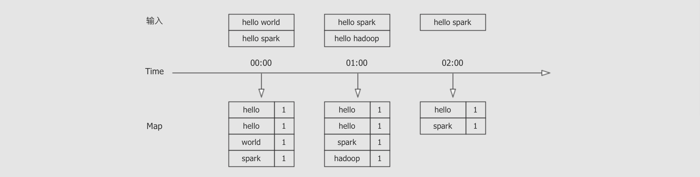
    - 无状态
  - 有状态算子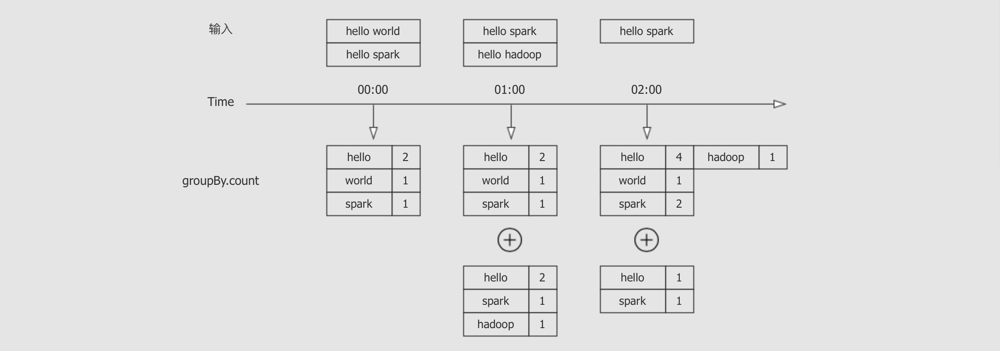
    - 有中间状态需要保存
    - 增量查询

- 总结

  

### 6.1. 常规算子

- 目标和步骤

  目标

  了解 `Structured Streaming` 的常规数据处理方式

  步骤

  1. 案例

- 案例

  - 需求

    - 给定电影评分数据集 `ratings.dat`, 位置在 `Spark/Files/Dataset/Ratings/ratings.dat`
    - 筛选评分超过三分的电影
    - 以追加模式展示数据, 以流的方式来一批数据处理一批数据, 最终每一批次展示为如下效果

    ```text
    +------+-------+
    |Rating|MovieID|
    +------+-------+
    |     5|   1193|
    |     4|   3408|
    +------+-------+
    ```

  - 步骤

    1. 创建 SparkSession
    2. 读取并处理数据结构
    3. 处理数据
       1. 选择要展示的列
       2. 筛选超过三分的数据
    4. 追加模式展示数据到控制台

  - 代码

    - 读取文件的时候只能读取一个文件夹, 因为是流的操作, 流的场景是源源不断有新的文件读取

    ```scala
    val source = spark.readStream
      .textFile("dataset/ratings")
      .map(line => {
        val columns = line.split("::")
        (columns(0).toInt, columns(1).toInt, columns(2).toInt, columns(3).toLong)
      })
      .toDF("UserID", "MovieID", "Rating", "Timestamp")
    
    val result = source.select('Rating, 'MovieID)
        .where('Rating > 3)
    ```

- 总结

  针对静态数据集的很多转换算子, 都可以应用在流式的 `Dataset` 上, 例如 `Map`, `FlatMap`, `Where`, `Select` 等

### 6.2. 分组算子

- 目标和步骤

  目标

  能够使用分组完成常见需求, 并了解如何扩展行

  步骤

  1. 案例

- 案例

  - 需求

    - 给定电影数据集 `movies.dat`, 其中三列 `MovieID`, `Title`, `Genres`
    - 统计每个分类下的电影数量

  - 步骤

    1. 创建 `SparkSession`

    2. 读取数据集, 并组织结构

       注意 `Genres` 是 `genres1|genres2` 形式, 需要分解为数组

    3. 使用 `explode` 函数将数组形式的分类变为单值多条形式

    4. 分组聚合 `Genres`

    5. 输出结果

  - 代码

    ```scala
    val source = spark.readStream
      .textFile("dataset/movies")
      .map(line => {
        val columns = line.split("::")
        (columns(0).toInt, columns(1).toString, columns(2).toString.split("\\|"))
      })
      .toDF("MovieID", "Title", "Genres")
    
    val result = source.select(explode('Genres) as 'Genres)
        .groupBy('Genres)
        .agg(count('Genres) as 'Count)
    
    result.writeStream
      .outputMode(OutputMode.Complete())
      .format("console")
      .queryName("genres_count")
      .start()
      .awaitTermination()
    ```

- 总结

  `Structured Streaming` 不仅支持 `groupBy`, 还支持 `groupByKey`

