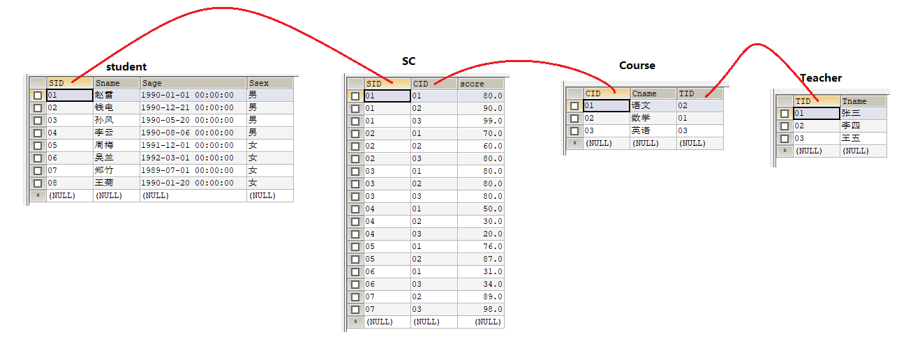

# 创建测试数据

## 学生表(Student)

```sql
create table Student(sid varchar(10),sname varchar(10),sage datetime,ssex nvarchar(10));
insert into Student values('01' , '赵雷' , '1990-01-01' , '男');
insert into Student values('02' , '钱电' , '1990-12-21' , '男');
insert into Student values('03' , '孙风' , '1990-05-20' , '男');
insert into Student values('04' , '李云' , '1990-08-06' , '男');
insert into Student values('05' , '周梅' , '1991-12-01' , '女');
insert into Student values('06' , '吴兰' , '1992-03-01' , '女');
insert into Student values('07' , '郑竹' , '1989-07-01' , '女');
insert into Student values('08' , '王菊' , '1990-01-20' , '女');
```
## 课程表(Course)
```sql
create table Course(cid varchar(10),cname varchar(10),tid varchar(10));
insert into Course values('01' , '语文' , '02');
insert into Course values('02' , '数学' , '01');
insert into Course values('03' , '英语' , '03');
```
## 老师表(Teacher)
```sql
create table Teacher(tid varchar(10),tname varchar(10));
insert into Teacher values('01' , '张三');
insert into Teacher values('02' , '李四');
insert into Teacher values('03' , '王五');
```
## 成绩表(SC)
```sql
create table SC(sid varchar(10),cid varchar(10),score decimal(18,1));
insert into SC values('01' , '01' , 80);
insert into SC values('01' , '02' , 90);
insert into SC values('01' , '03' , 99);
insert into SC values('02' , '01' , 70);
insert into SC values('02' , '02' , 60);
insert into SC values('02' , '03' , 80);
insert into SC values('03' , '01' , 80);
insert into SC values('03' , '02' , 80);
insert into SC values('03' , '03' , 80);
insert into SC values('04' , '01' , 50);
insert into SC values('04' , '02' , 30);
insert into SC values('04' , '03' , 20);
insert into SC values('05' , '01' , 76);
insert into SC values('05' , '02' , 87);
insert into SC values('06' , '01' , 31);
insert into SC values('06' , '03' , 34);
insert into SC values('07' , '02' , 89);
insert into SC values('07' , '03' , 98);
```


# 表格关系图



# 题目

**1、查询"01"课程比"02"课程成绩高的学生的信息及课程分数**

```sql
SELECT a.*,b.score 课程分数 FROM Student a ,SC b WHERE a.SID = b.SID  AND b.CID = '01';

SELECT a.*,b.score 课程分数 FROM Student a ,SC b WHERE a.SID = b.SID  AND b.CID = '02';

SELECT a.*,b.score 课程分数,c.score 课程分数2 FROM Student a ,SC b ,SC c WHERE a.SID = b.SID  AND a.SID = c.SID AND b.CID = '01' AND c.CID = '02' AND b.score < c.score;
```

**2、查询同时存在"01"课程和"02"课程的情况和不存在"01"课程但存在"02"课程的情况**

```sql
SELECT * FROM Student a,SC b WHERE a.SID = b.SID AND b.CID NOT LIKE '01'

SELECT a.SID,a.Sname,b.CID,c.CID FROM Student a 
LEFT JOIN SC b ON a.SID = b.SID AND b.CID= '01' 
LEFT JOIN SC c ON a.SID = c.SID AND c.CID = '02' 
WHERE IFNULL(b.score,0) < c.score;
```

**3、查询平均成绩大于等于60分的同学的学生编号和学生姓名和平均成绩**

```sql
SELECT a.SID 学生编号,a.Sname 学生姓名,CAST(AVG(b.score) AS DECIMAL(4,2) )平均成绩 FROM Student a,SC b WHERE a.SID = b.SID GROUP BY a.SID,a.Sname ORDER BY 平均成绩 DESC
```

**4、查询在sc表存在成绩的学生信息的SQL语句**

```sql
SELECT * FROM Student a,SC b WHERE a.SID = b.SID GROUP BY a.SID
```

**5、查询在sc表中不存在成绩的学生信息的SQL语句**

```sql
SELECT * FROM Student a LEFT JOIN SC b ON a.SID = b.SID GROUP BY a.SID HAVING ISNULL(b.score);
```

**6、查询所有同学的学生编号、学生姓名、选课总数、所有课程的总成绩**

```sql
SELECT a.SID 学生编号,a.Sname 学生姓名, COUNT(b.CID) 选课总数, SUM(b.score) 总成绩 FROM Student a LEFT JOIN SC b ON a.SID = b.SID GROUP BY a.SID
```

**7、查询"李"姓老师的数量**

```sql
SELECT COUNT(*) FROM Teacher t WHERE t.Tname LIKE '李%'
```

**8、查询学过"张三"老师授课的同学的信息**

```sql
SELECT a.*,b.score,c.Cname,d.Tname FROM Student a, SC b, Course c, Teacher d WHERE a.SID = b.SID AND b.CID = c.CID AND c.TID = d.TID AND d.Tname = '张三' GROUP BY a.SID
```

**9、查询没学过"张三"老师授课的同学的信息**

```sql
SELECT a.sid FROM Student a, SC b, Course c , Teacher d WHERE a.sid = b.sid AND b.cid = c.cid AND c.tid = d.tid AND d.Tname = '张三'  -- 学过张三的sid

SELECT a.* FROM Student a WHERE a.sid NOT IN(SELECT a.sid FROM Student a, SC b, Course c , Teacher d WHERE a.sid = b.sid AND b.cid = c.cid AND c.tid = d.tid AND d.Tname = '张三');
```

**10、查询学过编号为"01"并且也学过编号为"02"的课程的同学的信息**

```sql
SELECT a.* FROM Student a,SC b WHERE a.SID = b.SID AND b.CID = '01' AND  EXISTS(SELECT * FROM SC c WHERE c.SID = b.SID AND c.CID = '02')
```

**11、查询学过编号为"01"但是没有学过编号为"02"的课程的同学的信息**

```sql
SELECT a.* FROM Student a,SC b WHERE a.SID = b.SID AND b.CID = '01' AND a.SID NOT IN(SELECT a.SID FROM SC c WHERE c.SID = b.SID AND c.CID = '02')
```

**12、查询没有学全所有课程的同学的信息**

```sql
SELECT a.* FROM Student a LEFT JOIN SC b ON a.SID = b.SID GROUP BY a.SID HAVING COUNT(b.CID) < (SELECT COUNT(*) FROM Course)
```

**13、查询至少有一门课与学号为"01"的同学所学相同的同学的信息**

```sql
SELECT * FROM SC c WHERE c.SID = '01' --01学的课程

SELECT a.* FROM Student a,SC b WHERE a.SID = b.SID AND b.CID IN
(SELECT CID FROM SC c WHERE c.SID = '01') GROUP BY a.SID
```

**14、查询和"01"号的同学学习的课程完全相同的其他同学的信息**

```sql
SELECT * FROM Student WHERE SID IN
(SELECT SID FROM SC WHERE CID NOT IN 
 (SELECT SID FROM SC WHERE CID NOT IN 
  (SELECT CID FROM SC WHERE SID = '01')) 
 GROUP BY SID HAVING COUNT(CID) = 
 (SELECT COUNT(CID) FROM SC WHERE SID = '01') AND SID != '01');
```

**15、查询没学过"张三"老师讲授的任一门课程的学生姓名**

```sql
SELECT Student.Sname FROM Student WHERE sid NOT IN
(SELECT sid FROM SC a, Course b, Teacher c WHERE a.cid = b.cid AND b.tid = c.tid AND c.tname = '张三')
```

**16、查询两门及其以上不及格课程的同学的学号，姓名及其平均成绩**

```sql
SELECT a.SID,a.Sname,CAST(AVG(b.score) AS DECIMAL(10,1)) 平均成绩 FROM Student a,SC b WHERE a.SID = b.SID  AND b.score < 60 GROUP BY a.SID HAVING COUNT(*) >= 2;
```

**17、检索"01"课程分数小于60，按分数降序排列的学生信息** 

```sql
SELECT a.*,b.CID, b.score FROM Student a,SC b WHERE a.SID = b.SID AND b.CID = '01' AND b.score < 60 ORDER BY b.score DESC
```

**18、按平均成绩从高到低显示所有学生的所有课程的成绩以及平均成绩**

```sql
SELECT  a.*,
	MAX(CASE c.Cname WHEN '语文' THEN b.score ELSE 0 END) 语文,
	MAX(CASE c.Cname WHEN '数学' THEN b.score ELSE 0 END) 数学,
	MAX(CASE c.Cname WHEN '英语' THEN b.score ELSE 0 END) 英语,
	CAST(AVG(b.score) AS DECIMAL(10,2)) avg_score 
	FROM Student a 
	LEFT JOIN SC b ON a.SID = b.SID
	LEFT JOIN Course c ON b.CID = c.CID
	GROUP BY a.SID
	ORDER BY avg_score DESC
```

**19、查询各科成绩最高分、最低分和平均分：以如下形式显示：课程ID，课程name，最高分，最低分，平均分，及格率，中等率，优良率，优秀率**

**-- 及格为>=60，中等为：70-80，优良为：80-90，优秀为：>=90**

```sql
SELECT * ,
     MAX(b.score) 最高分,
     MIN(b.score) 最低分,
     CAST(AVG(b.score)  AS DECIMAL(10,2))平均分,
     CAST(SUM(b.score >= 60) /COUNT(*) AS DECIMAL(10,2)) * 100 及格率,
     CAST(SUM(b.score >= 70 AND b.score <= 80) / COUNT(*) AS DECIMAL(10,2)) * 100 中等率
  FROM Course a, SC b
  WHERE a.cid = b.cid 
  GROUP BY a.cid
```

**20、按各科成绩进行排序，并显示排名**

```sql
   SELECT a.*,COUNT(b.score)+1 排名 FROM SC a 
   LEFT JOIN SC b 
   ON a.CID = b.CID AND (a.score < b.score)
   GROUP BY a.CID,a.SID
   ORDER BY a.CID,COUNT(b.score) 
```

```sql
--方法二：
SELECT cid ,score,rank 排名
	FROM
	 (
	    SELECT 
	    *,
	    IF(@p=CID,
	       CASE 
		 WHEN @刚才=score THEN @现在
		 WHEN @刚才 := score THEN @现在:=@现在+1
	       END,
	       @现在 := 1
	       ) AS rank,
	    @p:=CID,
	    @刚才:=score
	    FROM SC,(SELECT @p:=NULL,@刚才:=NULL,@现在:=0)r
	    ORDER BY CID ,score DESC
	 )s;
```

**21、查询不同老师所教不同课程平均分从高到低显示**

```sql
SELECT b.TID, t.Tname, CAST(AVG(a.score) AS DECIMAL(10,2)) avg_score 
FROM SC a ,Course b,Teacher t 
WHERE a.CID = b.CID AND b.TID = t.TID GROUP BY t.TID,t.Tname ORDER BY avg_score DESC;
```

**22、查询所有课程的成绩第2名到第3名的学生信息及该课程成绩**

```sql
SELECT s.*,a.cid, a.score,COUNT(b.score)+1 rank FROM SC a , SC b,Student s
	WHERE  s.sid=a.sid AND a.cid = b.cid AND (a.score < b.score OR (a.score = b.score AND a.sid > b.sid))
	GROUP BY a.cid,a.sid
	HAVING rank IN (2,3)
	ORDER BY a.cid,COUNT(b.score)
```

**23、统计各科成绩各分数段人数：课程编号,课程名称, 100-85 , 85-70 , 70-60 , 0-60 及所占百分比** 

```sql
SELECT a.Cname ,
	SUM(b.score >= 85 AND b.score <= 100)  '100-85人数',
	SUM(b.score >= 70 AND b.score < 85) '85-70人数',
	SUM(b.score >= 60 AND b.score < 70) '70-60人数',
	SUM(b.score >= 0 AND b.score < 60) '0-60人数',
     CAST(SUM(b.score >= 85 AND b.score <= 100) /COUNT(*) AS DECIMAL(10,2)) * 100 '100-85',
     CAST(SUM(b.score >= 70 AND b.score < 85) / COUNT(*) AS DECIMAL(10,2)) * 100 '85-70',
     CAST(SUM(b.score >= 60 AND b.score < 70) / COUNT(*) AS DECIMAL(10,2)) * 100 '70-60',
     CAST(SUM(b.score >= 0 AND b.score < 60) / COUNT(*) AS DECIMAL(10,2)) * 100 '0-60'
  FROM Course a, SC b
  WHERE a.cid = b.cid 
  GROUP BY a.cid
```

24、查询学生平均成绩及其名次

```properties
SELECT a.*,@rank:=@rank+1 排名 FROM

  (SELECT m.SID  学生编号  ,

       m.Sname  学生姓名  ,

       IFNULL(ROUND(AVG(score),2),0)  平均成绩

       FROM Student m LEFT JOIN SC n ON m.SID = n.SID

       GROUP BY m.SID

       ORDER BY 平均成绩 DESC) a,

   (SELECT @rank := 0) b
```

25、查询各科成绩前三名的记录

````properties

方法一:

SELECT a.cid, c.cname,a.score,COUNT(b.score) rank FROM sc a , sc b,course c

    WHERE  c.cid=a.cid AND c.cid=b.cid AND (a.score < b.score OR (a.score = b.score AND a.sid >= b.sid))

    GROUP BY a.cid,a.sid

   HAVING rank IN (1,2,3)

   ORDER BY a.cid,COUNT(b.score)

方法二:未完成

SELECT a.*,@rank:=@rank+1 rank FROM

   (SELECT c.cid,c.cname,sc.SID,sc.score FROM sc LEFT JOIN course c ON sc.CID=c.CID

       ORDER BY sc.CID,sc.score DESC) a,

    (SELECT @rank := 0) b

如何实现分组排序???
````

26、查询每门课程被选修的学生数

```properties
SELECT Cid , COUNT(SID) 学生数  FROM sc GROUP BY CID
```

27、查询出只有两门课程的全部学生的学号和姓名

````sql
SELECT Student.SID , Student.Sname FROM Student , SC

    WHERE Student.SID = SC.SID

    GROUP BY Student.SID

    HAVING COUNT(SC.CID) = 2
````

28、查询男生、女生人数

````sql
SELECT CASE WHEN Ssex = '男' THEN '男生人数' ELSE '女生人数' END  男女情况  , COUNT(sid)  人数  
    FROM student
    GROUP BY CASE WHEN Ssex = '男'
    THEN '男生人数'
    ELSE '女生人数' end
````

29、查询名字中含有"风"字的学生信息

```sql
select * from student where sname like '%风%'
```

30、查询同名同姓学生名单，并统计同名人数

````sql
SELECT Sname  学生姓名 , COUNT(*)  人数  FROM Student GROUP BY Sname HAVING COUNT(*) > 1
````

31、查询1990年出生的学生名单(注：Student表中Sage列的类型是datetime

````sql
SELECT * FROM Student WHERE YEAR(sage) = 1990
````

32、查询每门课程的平均成绩，结果按平均成绩降序排列，平均成绩相同时，按课程编号升序排列

````sql
SELECT sc.CID,c.Cname,ROUND(AVG(sc.score),2) 课程平均成绩

    FROM sc,course c

    WHERE sc.CID=c.CID

    GROUP BY sc.CID

    ORDER BY 课程平均成绩 DESC,sc.CID
````


33、查询平均成绩大于等于85的所有学生的学号、姓名和平均成绩

````sql
SELECT s.SID,s.Sname,ROUND(AVG(sc.score),2) 平均分

    FROM student s,sc

    WHERE s.SID=sc.SID

    GROUP BY s.SID

    HAVING 平均分>=85
````


34、查询课程名称为"数学"，且分数低于60的学生姓名和分数

```sql
SELECT sname,sc.score 数学

    FROM student ,sc,course

    WHERE student.sid=sc.SID AND sc.CID=course.CID AND sc.score<60 AND course.Cname='数学'
```

35、查询所有学生的课程及分数情况；

````sql
SELECT s.*,a.score 语文,b.score 数学, c.score 英语

    FROM student s  LEFT JOIN sc a ON s.SID=a.SID AND a.CID='01'

            LEFT JOIN sc b ON s.SID=b.SID AND b.CID='02'

            LEFT JOIN sc c ON s.SID=c.SID AND c.CID='03'

    
    

select Student.* , Course.Cname , SC.CID , SC.score

from Student, SC , Course

where Student.SID = SC.SID and SC.CID = Course.CID

order by Student.SID , SC.CID
````

36、查询任何一门课程成绩在70分以上的姓名、课程名称和分数；

````sql
SELECT Student.Sname , Course.Cname , SC.score

    FROM Student, SC , Course

    WHERE Student.SID = SC.SID AND SC.CID = Course.CID AND SC.score >= 70
````

37、查询不及格的课程

````sql
select Student.* , Course.Cname , SC.CID , SC.score

from Student, SC , Course

where Student.SID = SC.SID and SC.CID = Course.CID and SC.score < 60

order by Student.SID , SC.CID
````

38、查询课程编号为01且课程成绩在80分以上的学生的学号和姓名；

````properties
select Student.* , Course.Cname , SC.CID , SC.score 
from Student, SC , Course
where Student.SID = SC.SID and SC.CID = Course.CID and SC.CID = '01' and SC.score >= 80
order by Student.SID , SC.CID
````

39、求每门课程的学生人数

````properties
select Course.CID , Course.Cname , count(*)  学生人数 
from Course , SC
where Course.CID = SC.CID
group by  Course.CID , Course.Cname
order by Course.CID , Course.Cname
````

40、查询选修"张三"老师所授课程的学生中，成绩最高的学生信息及其成绩

当最高分只有一个时

````properties
select top 1 Student.* , Course.Cname , SC.CID , SC.score 
from Student, SC , Course , Teacher
where Student.SID = SC.SID and SC.CID = Course.CID and Course.TID = Teacher.TID and Teacher.Tname = '张三'
order by SC.score desc
````

41、查询不同课程成绩相同的学生的学生编号、课程编号、学生成绩

````properties
--方法1
select m.* from SC m ,(select CID , score from SC group by CID , score having count(1) > 1) n
where m.CID= n.CID and m.score = n.score order by m.CID , m.score , m.SID

--方法2
select m.* from SC m where exists (select 1 from (select CID , score from SC group by CID , score having count(1) > 1) n
where m.CID= n.CID and m.score = n.score) order by m.CID , m.score , m.SID
````

42、查询每门课程成绩最好的前两名

````properties
SELECT a.cid, c.cname,a.score,COUNT(b.score) rank FROM sc a , sc b,course c

    WHERE  c.cid=a.cid AND c.cid=b.cid AND (a.score < b.score OR (a.score = b.score AND a.sid >= b.sid))

    GROUP BY a.cid,a.sid

    HAVING rank IN (1,2)

    ORDER BY a.cid,COUNT(b.score)
````

43、统计每门课程的学生选修人数（超过5人的课程才统计）。要求输出课程号和选修人数，查询结果按人数降序排列，若人数相同，按课程号升序排列

````properties
SELECT Course.CID , Course.Cname , COUNT(*)  学生人数

    FROM Course , SC

    WHERE Course.CID = SC.CID

    GROUP BY  Course.CID

    HAVING COUNT(*) >= 5

    ORDER BY  学生人数  DESC , Course.CID

````

44、检索至少选修两门课程的学生学号

````properties
SELECT student.SID , student.Sname

    FROM student , SC

    WHERE student.SID = SC.SID

    GROUP BY student.SID

    HAVING COUNT(1) >= 2

    ORDER BY student.SID
````

45、查询选修了全部课程的学生信息

--方法1 根据数量来完成

````sql
SELECT student.* FROM student

    WHERE SID IN

    (SELECT SID FROM sc GROUP BY SID HAVING COUNT(cid) = (SELECT COUNT(cid) FROM course))
````

--方法2 使用双重否定来完成

````properties
SELECT t.* FROM student t

    WHERE t.SID NOT IN

    (SELECT DISTINCT m.SID FROM

        (SELECT SID , CID FROM student , course) m

            WHERE NOT EXISTS (SELECT 1 FROM sc n WHERE n.SID = m.SID AND n.CID = m.CID)

    )
````

--方法3 使用双重否定来完成

```properties
SELECT t.* FROM student t

    WHERE NOT EXISTS(SELECT 1 FROM

               (SELECT DISTINCT m.SID FROM

                                  (SELECT SID , CID FROM student , course) m

                                      WHERE NOT EXISTS (SELECT 1 FROM sc n WHERE n.SID = m.SID AND n.CID = m.CID)

                 )

              k WHERE k.SID = t.SID

             )


```

46、查询各学生的年龄

````properties
SELECT * , CEIL(DATEDIFF(NOW(),sage)/365)  年龄  FROM student


SELECT *,(YEAR(NOW())-YEAR(sage)+IF(DATEDIFF(NOW(),STR_TO_DATE(

                CONCAT(

                    LEFT(

                         DATE_FORMAT(NOW(),'%Y.%m.%d %H:%i:%s'),5),

                    RIGHT(DATE_FORMAT(sage,'%Y.%m.%d %H:%i:%s'),14)

                       ),

        '%Y.%m.%d %H:%i:%s')

           )>=0,1,0) ) 年龄

FROM student
````

47、查询本周过生日的学生

````properties
SELECT * FROM student

    WHERE  WEEK(

            STR_TO_DATE(

                CONCAT(

                    LEFT(

                         DATE_FORMAT(NOW(),'%Y.%m.%d %H:%i:%s'),5),

                    RIGHT(DATE_FORMAT(sage,'%Y.%m.%d %H:%i:%s'),14)

                       ),

        '%Y.%m.%d %H:%i:%s')

           )

          =WEEK(NOW())
````

48、查询下周过生日的学生

````properties
SELECT * FROM student WHERE  WEEK(STR_TO_DATE(CONCAT(LEFT(DATE_FORMAT(NOW(),'%Y.%m.%d %H:%i:%s'),5),RIGHT(DATE_FORMAT(sage,'%Y.%m.%d %H:%i:%s'),14)),'%Y.%m.%d %H:%i:%s'))=WEEK(NOW())+1
````


49、查询本月过生日的学生

```properties
方法一:SELECT * FROM student

​    WHERE DATE_FORMAT(sage, '%m')=DATE_FORMAT(NOW(),'%m')


方法二:SELECT * FROM student WHERE MONTH(sage)=MONTH(NOW())
```

50、查询下月过生日的学生

```properties
方法一:SELECT * FROM student WHERE DATE_FORMAT(sage, '%m')=DATE_FORMAT(DATE_ADD(NOW(), INTERVAL 1 MONTH),'%m')


方法二:SELECT * FROM student WHERE MONTH(sage)=MONTH(NOW())+1
```

排名函数

创建一个我们需要进行高级排名查询的players表，

````properties
CREATE TABLE `players` (

`pid` int(2) NOT NULL AUTO_INCREMENT,

`name` varchar(50) NOT NULL,

`age` int(2) NOT NULL,

PRIMARY KEY (`pid`),

UNIQUE KEY `name` (`name`)

) ENGINE=InnoDB DEFAULT CHARSET=latin1;

INSERT INTO `players` (`pid`, `name`, `age`) VALUES

(1, 'Samual', 25),

(2, 'Vino', 20),

(3, 'John', 20),

(4, 'Andy', 22),

(5, 'Brian', 21),

(6, 'Dew', 24),

(7, 'Kris', 25),

(8, 'William', 26),

(9, 'George', 23),

(10, 'Peter', 19),

(11, 'Tom', 20),

(12, 'Andre', 20);
````

普通排名:

```properties
SELECT pid, NAME, age, @curRank := @curRank + 1 AS rank

    FROM players p, (SELECT @curRank := 0) q

    ORDER BY age
```

查询以降序排列:

````properties
SELECT pid, NAME, age, @curRank := @curRank + 1 AS rank

    FROM players p, (SELECT @curRank := 0) q

    ORDER BY age DESC, NAME
````

普通并列排名函数

````properties
SELECT pid, NAME, age,

    CASE WHEN @prevRank = age THEN @curRank

         WHEN @prevRank := age THEN @curRank := @curRank + 1

         END AS rank

    FROM players p,(SELECT @curRank :=0, @prevRank := NULL) r

    ORDER BY age
````

高级并列排名函数

```properties
SELECT pid, NAME, age, rank

    FROM(SELECT pid, NAME, age,

                @curRank := IF(@prevRank = age, @curRank, @incRank) AS rank,

                @incRank := @incRank + 1,

                @prevRank := age

        FROM players p, (

            SELECT @curRank :=0, @prevRank := NULL, @incRank := 1) r

    ORDER BY age) s


INSERT INTO flume_meta(source_tab,currentIndex) VALUES("teacher","5")

ON DUPLICATE KEY UPDATE source_tab="ddd",currentIndex="7";
```


