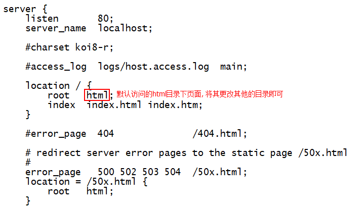
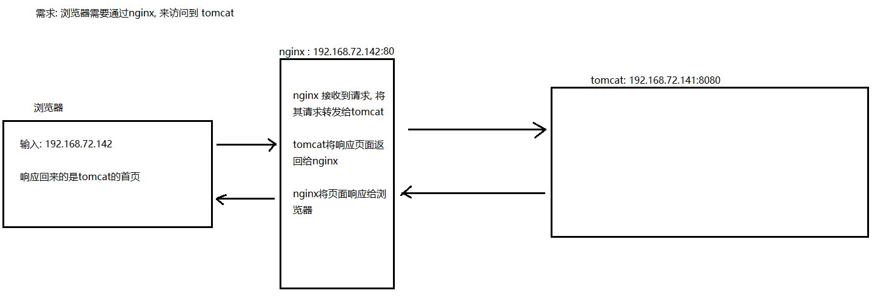
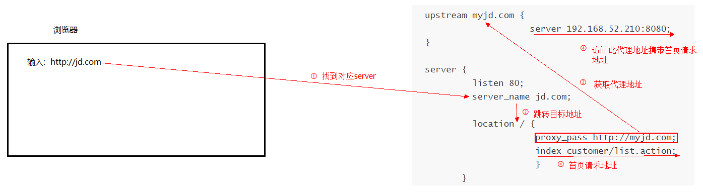
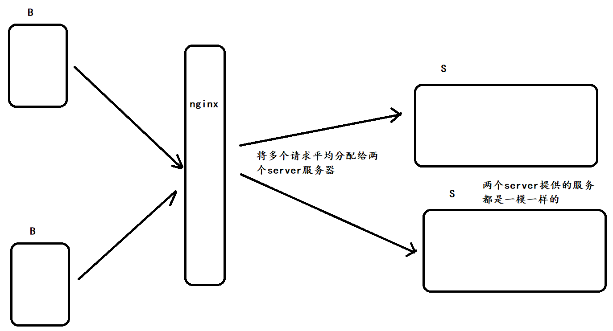

# nginx

## 1 什么是nginx

​	Nginx是一款高性能的http 服务器/反向代理服务器及电子邮件（IMAP/POP3）代理服务器。由俄罗斯的程序设计师Igor Sysoev所开发，官方测试nginx能够支支撑5万并发链接，并且cpu、内存等资源消耗却非常低，运行非常稳定。

## 2 为什么要使用nginx

* 1) **http服务器**。Nginx是一个http服务可以独立提供http服务。可以做网页静态服务器。

  * 静态资源: HTML页面, js文件, css文件, 图片
    * tomcat来讲: 只是将这些静态的资源响应(原模原样)给了前端(浏览器)而已
  * 动态资源:  jsp  servlet  页面产生是有jsp或者servlet动态处理出来的
    * tomcat:  先将jsp转换成servlet, response.writer("<>")

* 2) 虚拟主机。可以实现在一台服务器虚拟出多个网站。例如个人网站使用的虚拟主机。

* 3) **反向代理，负载均衡**。当网站的访问量达到一定程度后，单台服务器不能满足用户的请求时，需要用多台服务器集群可以使用nginx做反向代理。并且多台服务器可以平均分担负载，不会因为某台服务器负载高宕机而某台服务器闲置的情况。

## 3 安装nginx服务器

- 安装目录的准备（如做过， 可省略）:

```shell
安装目录:  /export/servers
软件存放的目录:  /export/software
日志文件的目录:  /export/logs
数据存放的目录: /export/data

创建以上目录:  
mkdir -p /export/servers
mkdir -p /export/software
mkdir -p /export/logs
mkdir -p /export/data
```

* 1) 安装依赖环境: 由于nginx为C语言开发, 需要C语言依赖环境

```
yum install -y gcc-c++ pcre pcre-devel zlib zlib-devel openssl openssl-devel
```

* 2)上传nginx安装包:

```
使用rz上传即可, 上传到 /export/software目录下
```

* 3) 进行解压操作:

```
tar -zxvf nginx-1.8.0.tar.gz
cd nginx-1.8.0
```

* 4) 设置编译参数

```
参数设置如下：直接将整个命令复制执行即可
./configure \
--prefix=/export/servers/nginx \
--pid-path=/export/data/nginx/nginx.pid \
--lock-path=/export/data/nginx.lock \
--error-log-path=/export/logs/nginx/error.log \
--http-log-path=/export/logs/nginx/access.log \
--with-http_gzip_static_module \
--http-client-body-temp-path=/export/data/nginx/client \
--http-proxy-temp-path=/export/data/nginx/proxy \
--http-fastcgi-temp-path=/export/data/nginx/fastcgi \
--http-uwsgi-temp-path=/export/data/nginx/uwsgi \
--http-scgi-temp-path=/export/data/nginx/scgi
```

* 5) 编译安装

```
mkdir -p /export/data/nginx
mkdir -p /export/logs/nginx

cd /export/servers/nginx-1.8.0    # 切换nginx根目录
make			  # 编译
make install	  # 安装, 安装后在 /export/server/nginx
```

* 6) 启动nginx

```
cd /export/server/nginx/sbin
./nginx   # 启动nginx

查看nginx启动进程
ps -ef | grep nginx


注意：执行./nginx启动nginx，这里可以-c指定加载的nginx配置文件，如下：
./nginx -c /export/servers/nginx/conf/nginx.conf
如果不指定-c，nginx在启动时默认加载conf/nginx.conf文件，此文件的地址也可以在编译安装nginx时指定./configure的参数（--conf-path= 指向配置文件（nginx.conf））


停止nginx:
	快速停止:
		cd /export/servers/nginx/sbin
		./nginx -s stop
		此方式相当于先查出nginx进程id再使用kill命令强制杀掉进程。
	
	完整停止(推荐使用):
		cd /usr/local/nginx/sbin
		./nginx -s quit  
		此方式停止步骤是待nginx进程处理任务完毕进行停止。
		
重启nginx :
	先停止再启动（建议使用）：
		对nginx进行重启相当于先停止nginx再启动nginx，即先执行停止命令再执行启动命令。
		如下：
			./nginx -s quit
			./nginx

	重新加载配置文件：
		当nginx的配置文件nginx.conf修改后，要想让配置生效需要重启nginx，使用-s reload不用先停止nginx再启动nginx即可将配置信息在nginx中生效，如下：
			./nginx -s reload
```

* 7) 安装测试:


 	到这说明nginx基本上安装成功。此页面即为 nginx安装目录html目录的index页面

## 4  **发布网站到服务器中**

* 我们可以将写好的静态页面复制到nginx目录下的html的目录中即可，输入以下地址可以访问：

```
访问路径: http://ip地址
注意: 上面这个访问路径,表示已经访问到了,html目录的下,  默认访问到html的目录的index页面
```

* 另一种方式：我们可以将页面复制到nginx的目录下，然后访问

  * 使用此种方式, 需要修改nginx的配置文件:nginx.conf

  

```
访问路径: http://ip地址/页面名称
注意: 这个路径, 默认访问到了配置文件中 root后面设置的路径下, 默认访问的index页面
```

 

​	但是我们可以发现这样，通过IP地址可以访问。但是IP其实相对来讲是很难记住的，我们通常会通过域名去访问一个网站。

## 5 **网站访问的过程**

### 5.1 **网站访问过程分析**

```
C:\Windows\System32\drivers\etc
```


 

### 5.2 修改hosts文件

* 进入电脑C:\Windows\System32\drivers\etc下查找一个hosts文件

```
192.168.72.141 www.jd.com
```

* 打开浏览器访问：http://www.jd.com


## 6 配置nginx的反向代理, 实现网站发布(重点)



> 这个过程被称为是反向代理, 原来浏览器直接请求tomcat, 获得内容, 现在由nginx作为代理, 请求目标地址, 并将目标地址的数据返回给浏览器

如何配置呢?

* 1) 修改配置文件: conf/ nginx.conf文件, 添加如下内容
  * 提示: 可以直接打开配置文件, 拉到最下面, 在最后一个没有被注释的大括号前书写

```

upstream tomcat1 {
                    server 192.168.72.142:8080;
}

server {
         listen 80;
         server_name pinyougou.com;

         location / {
                     proxy_pass http://tomcat1;
                     index index.html index.htm;
                     }
       }
```



> 当访问http://jd.com  其实就是相当于 访问 http://192.168.52.210:8080/list.action

## 7. 负载均衡

​	负载均衡是由多台服务器以对称的方式组成一个服务器集合，每台服务器都具有等价的地位，都可以单独对外提供服务而无须其他服务器的辅助。

​	通过某种负载分担技术，将外部发送来的请求均匀分配到对称结构中的某一台服务器上，而接收到请求的服务器独立地回应客户的请求。均衡负载能够平均分配客户请求到服务器列阵，借此提供快速获取重要数据，解决大量并发访问服务问题。 (廉价的)

### 7.1 nginx的负载均衡

​	我们可以在nginx上配置多台服务器, 当大量并发访问的时候, 我们通过nginx将这些并发请求根据一定的规则平均分派到多台服务器, 提高服务器高可用



### 7.2 如何在nginx中配置负载均衡(重点)

* 1) 修改配置文件

```
upstream tomcat1 {
        server 192.168.72.142:8080;
}
server {
        listen 80;
        server_name pinyougou.com;
        location / {
                proxy_pass http://tomcat1;
                index index.html  index.htm;

        }
}
********** 上述代码是原始内容, 只需要更改upsteam中的server即可
#第一种方案: 配置多台server, nginx就会自动进行负载均衡, 将并发请求平均分配给这两个服务器
upstream tomcat1 {
        server 192.168.72.142:8080;
        server 192.168.72.142:8081; 
       
}
#第二种方案: 可以根据服务器的实际情况调整服务器权重。权重越高分配的请求越多，权重越低，请求越少。默认是都是1 
upstream tomcat1 {
        server 192.168.72.142:8080;
        server 192.168.72.142:8081 weight=2; 
        #例如设置为2, 表示第二个服务器所能承受比第一台两倍的并发请求, 此时, nginx就会权重分配, 如果有6个并发请求, 第二台会承受4个请求, 而第一台只会承受2个请求
}

```

### 7.3 了解nginx的高可用

​	负载均衡高可用:为了避免出现nginx出现宕机,可对nginx进行高可用,为nginx提供备用机,使用高可用监控程序(keepalived)来处理,一般的处理模式是,两台同时运行,实际提供服务的只有一台,监控中心与这台服务器之间会传输诸如'I am alive'这样得信息来监控对方的运行状况,一旦发现对方挂掉,就马上切换到另一台,如果挂掉的主服务器重新发送激活的状态 ,监控中心就会将请求交由主服务器

关于高可用的搭建可以参考此地址: http://blog.51cto.com/superpcm/2095395
