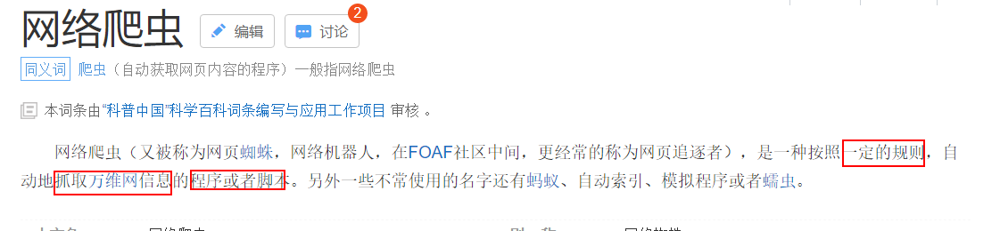
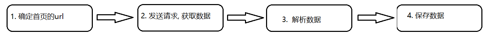
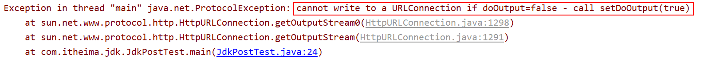
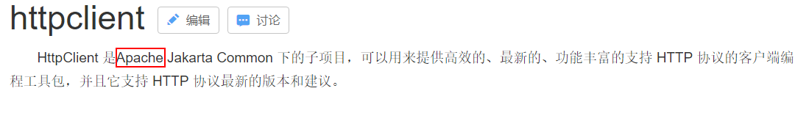
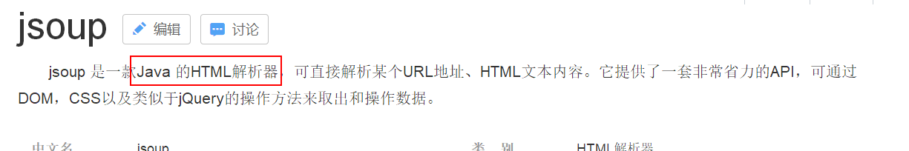
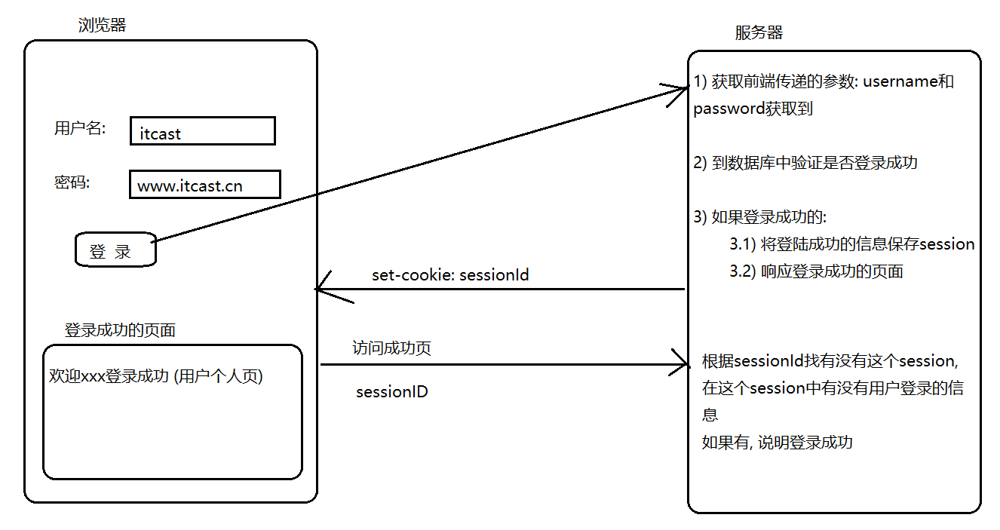

# 娱乐爬虫day03_爬虫基础

课前回顾:

* nginx
  * 1) 使用nginx发布一个静态网站: 二种
    * 1.1) 将静态资源放置到html目录中(不需要修改nginx.conf)
    * 1.2) 将静态资源放置到nginx下目录中(需要修改nginx.conf)
  * 2) 使用反向代理 和 负载均衡 配置
* redis:
  * redis的概念:  redis是C语言, 是一个基于内存可以被持久化的key-value的数据库
  * redis的特点:
    * 1) 读写的效率高
    * 2) 丰富的数据类型
    * 3) 数据移植快
    * 4) 操作都是原子性
  * redis的数据类型 的特点和使用场景
  * redis的安装
  * redis的java客户端: jedis
    * jedis操作redis  五种数据类型 api
    * jedis的连接池
  * redis的持久化 : RDB  AOF

今日内容

* 1) 爬虫的基本概念:
  * 什么是爬虫
  * 爬虫的价值
  * 爬虫的分类
  * 爬虫的执行流程
* 2) 爬虫的三大核心模块: 获取数据, 解析数据, 保存数据
* 3)  案例:  作业
  * 3.1) 爬虫起点中文网的小说(爬取其中的一本书)
  * 3.2) 模拟登陆案例

## 1. 爬虫的基本概念

### 1.1 什么是爬虫



​	爬虫按照一定的规则自动的抓取互联网信息(数据)的程序或者脚本, 爬虫一般有三大模块: 获取数据, 解析数据 , 保存数据

### 1.2 爬虫的价值

​	爬虫的价值指的获取数据的价值, 数据的价值越高, 爬虫的价值越高

* 数据的价值:

  * 例如:  如果现在获取到了大量的用户的数据(名称, 性别, 购物的信息....)
    * 用户行为分析 , 网站用户分析
  * 例如:  获取到了大量的商品的信息
    * 比价网站

  ......

### 1.3 爬虫的分类

爬虫的分类大致分为两大类:

* 通用爬虫:   可以来获取任意的网站, 任意行业 , 不同分类  都可以获取到
  * 例如: 百度 , 谷歌
  * 一般使用通用爬虫:  用来做通用搜索
* 垂直爬虫:  用来获取指定行业, 指定分类, 执行网站的数据, 用来针对性的获取
  * 例如 :   慢慢买 , 笔趣阁
  * 一般使用垂直爬虫都是用来针对公司, 数据分析的

### 1.4 爬虫的执行流程



```
1) 确定首页url :  爬取什么内容
2) 发送请求, 获取数据
3) 解析数据
4) 保存数据
```


## 2. 爬虫的三大核心模块

### 2.1 发送请求, 获取数据

回顾http请求:

* 请求部分 :
  * 请求行 :  请求方式 , 请求协议  , 请求的url
    * get  和 post  区别:
      * 1) 参数放置的位置不同 :  get放置在url路径的后面, post放置在请求体中
      * 2) 参数大小不同 :  get请求不能无限制的拼接 , post 一般没有大小的限制
      * 3) 安全性不同 :  post相对而言要比get更加的安全
  * 请求头: 
    * User-agent :  用来标识浏览器的内核版本  
    * referer :  用于做防掉链的   .  标识用户从哪里来的操作
    * cookie :  用于携带当前网站在浏览器保存的cookie的信息
  * 请求体:
    * 只有post采用请求体, 一般存储的都是请求参数
* 响应部分
  * 响应行:  状态码
    * 200
    * 302
    * 304 : 本地缓存
    * 404
    * 500
  * 响应头:
    * Location : 标识重定向的路径, 一般和302组合使用
    * set-cookie : 向浏览器保存cookie信息
  * 响应体 :
    * 存储着就是返回来的数据

#### 2.1.1 发送http请求:原生

使用原生方式来发送http请求:

* 优点: 不需要导入任何第三方的jar
* 缺点: 实现比较繁琐

```
实现步骤 :
	1) 确定首页url
	2) 将字符串url 转换为 url对象
	3) 根据url对象, 打开远程连接, 获取远程连接对象
	4)  设置相关参数 : 请求参数, 请求头 请求方式
	5) 发送请求, 获取数据
	6) 释放资源
```

【使用原生JDK方式来发送Get请求】

```java
// 使用原生jdk发送get请求
public class JdkGetTest {

    public static void main(String[] args) throws Exception {
        // 1) 确定首页url:
        String indexUrl = "http://www.itcast.cn?username=zs&password=123";
        // 2) 将字符串url 转换为 url对象
        URL url = new URL(indexUrl);  // 类似包装一下
        // 3) 根据url对象, 打开远程连接, 获取远程连接对象
        HttpURLConnection connection = (HttpURLConnection) url.openConnection();
        // 4)  设置相关参数 : 请求参数, 请求头 请求方式 :
        // 请求头一般在开发中一般需要将所有的请求头都设置, 因为模拟一个真实的浏览器发送请求
        connection.setRequestMethod("GET");
        // 5) 发送请求, 获取数据 :    网络的传输都是使用IO流(字节流)的形式来传输
        InputStream in = connection.getInputStream();
        int len = 0;
        byte[] b = new byte[1024];
        while ((len = in.read(b)) != -1) {

            System.out.println( new String(b,0,len)); // 注意, 不要导错包了
        }
        // 6) 释放资源
        in.close();

    }
}

```

【使用原生JDK方式来发送Post请求】

```java
// 使用原生jdk发送post请求
public class JdkPostTest {

    public static void main(String[] args)  throws  Exception {
        // 1) 确定首页url
        String indexUrl = "http://www.itcast.cn";
        // 2) 将字符串url 转换为 url对象
        URL url = new URL(indexUrl);
        // 3) 根据url对象, 打开远程连接, 获取远程连接对象
        HttpURLConnection connection = (HttpURLConnection) url.openConnection();
        // 4)  设置相关参数 : 请求参数, 请求头 请求方式
        connection.setRequestMethod("POST"); // 请求方式需要大写

        connection.setDoOutput(true);  // 打开输出流, 默认jdk发送的方式不允许向外输出
        OutputStream out = connection.getOutputStream();
        out.write("username=zs&password=123".getBytes());
        // 5) 发送请求, 获取数据
        InputStream in = connection.getInputStream();

        int len = 0 ;
        byte[] b = new byte[1024];

        while( (len = in.read(b)) !=  -1 ){
            System.out.println( new String(b,0,len));
        }

        // 6) 释放资源
        in.close();
        out.close();

    }
}

```



#### 2.1.2  使用httpClient发送请求



​	httpClient专为发送http请求而生的, httpClient从jdk1.9开始已经被内置到jdk包中, 如果使用jdk1.9以上的版本, 那么不会在导包httpClient的包, 都是基于java中面向对象的思想


* 1) 导入httpClient相关的jar包

```xml

<dependency>
    <groupId>org.apache.httpcomponents</groupId>
    <artifactId>httpclient</artifactId>
    <version>4.5.4</version>
</dependency>

```

* 2） 使用httpClient的步骤

```
1) 确定首页url
2) 创建httpClient对象
3) 创建请求方式的对象
4) 设置请求参数, 请求头
5) 发送请求, 获取响应对象:response
6) 获取数据:
	6.1) 获取响应行
	6.2) 获取响应头
	6.3) 获取响应体
7) 释放资源
```

【使用httpClient发送get请求】

```java
// 使用httpClient发送get请求
public class HTTPClientGetTest {

    public static void main(String[] args) throws Exception {
        // 1) 确定首页url
        String indexUrl = "http://www.itcast.cn?username=zs&password=123";
        // 2) 创建httpClient对象
        CloseableHttpClient httpClient = HttpClients.createDefault();  //
        // 3) 创建请求方式的对象 : get  post    相当于 request
        HttpGet httpGet = new HttpGet(indexUrl);
        // 4) 设置请求参数, 请求头
        // setHeader()  和 addHeader()  : 都是用来设置请求头, set是用来设置一个头对应一个value,add设置一个头对应多个value的情况
        httpGet.setHeader("User-Agent", "Mozilla/5.0 (Windows NT 6.3; WOW64) AppleWebKit/537.36 (KHTML, like Gecko) Chrome/35.0.1916.153 Safari/537.36");

        // 5) 发送请求, 获取响应对象:response
        CloseableHttpResponse response = httpClient.execute(httpGet);
        // 6) 获取数据:
        // 6.1) 获取响应行
        int code = response.getStatusLine().getStatusCode();  // 获取状态码
        System.out.println(code);
        if(200 == code){
            // 请求成功
            // 6.2) 获取响应头
            Header[] headers = response.getHeaders("Content-Type");
            for (Header header : headers) {
                String value = header.getValue();
                System.out.println(value);
            }

            // 6.3) 获取响应体
            HttpEntity httpEntity = response.getEntity();
            //InputStream inputStream = httpEntity.getContent();  // 这种方式一般是用来获取图片, 视频  二进制的数据
            String html = EntityUtils.toString(httpEntity, "UTF-8");
            System.out.println(html);
        }
        // 7) 释放资源
        httpClient.close();

    }

}
```

【使用httpClient发送Post请求】

```java
// 使用httpClient发送post请求
public class HTTPClientPostTest {

    public static void main(String[] args) throws  Exception {
        // 1) 确定首页url
        String indexUrl = "http://www.itcast.cn";
        // 2) 创建httpClient对象
        CloseableHttpClient httpClient = HttpClients.createDefault();
        // 3) 创建请求方式的对象   ---- request
        HttpPost httpPost = new HttpPost(indexUrl);
        // 4) 设置请求参数, 请求头
        List<BasicNameValuePair> list  = new ArrayList<BasicNameValuePair>();
        list.add(new BasicNameValuePair("username","ls"));
        list.add(new BasicNameValuePair("password","123"));
        list.add(new BasicNameValuePair("a","123"));
        list.add(new BasicNameValuePair("b","123"));
        HttpEntity entity = new UrlEncodedFormEntity(list);
        httpPost.setEntity(entity);

        // 5) 发送请求, 获取响应对象:response
        CloseableHttpResponse response = httpClient.execute(httpPost);
        // 6) 获取数据:
        // 6.1) 获取响应行
        int code = response.getStatusLine().getStatusCode();
        if(200 == code){
            // 6.2) 获取响应头
            Header[] headers = response.getAllHeaders();
            for (Header header : headers) {
                String value = header.getValue();
                System.out.println(value);
            }
            // 6.3) 获取响应体
            HttpEntity httpEntity = response.getEntity();

            String html = EntityUtils.toString(httpEntity, "UTF-8");
            
            System.out.println(html);
        }
        // 7) 释放资源
        httpClient.close();
    }
}

```

总结httpClient使用步骤:

```java
1) 确定首页url
2) 创建httpClient对象 :  httpClient = HttpClients.createDefault();
3) 创建请求方式的对象 :  HttpGet  HttpPost
4) 设置请求参数, 请求头
	头:  setHeader(name,value)
	请求参数(post):
		 List<BasicNameValuePair> list  = new ArrayList<BasicNameValuePair>();
         list.add(new BasicNameValuePair("username","ls"));
         HttpEntity entity = new UrlEncodedFormEntity(list);
         httpPost.setEntity(entity);
5) 发送请求, 获取响应对象: response  = httpClient.execute(httpGet/httpPost)
6) 获取数据:
	6.1) 获取响应行 :  code = response.getStatusLine().getStatusCode();
	6.2) 获取响应头 : response.getHeaders("name")
	6.3) 获取响应体 :  
		entityUtils.toString(response.getentity(),"UTF-8");  获取文本类型
		InputStream in = response.getentity().getContent(); 获取字节类型
7) 释放资源 : 
```

### 2.2 解析数据

解析数据本质上解析HTML文档, 如果解析一个HTML文档呢?

* js也可以获取某一个元素, 并且获取这个元素对应属性的内容和标签体中内容. 但是js是一个前端的技术, 而我们html的数据目前在java代码中, 所以js是不能够使用的
* 寻找一种可以在java客户端中解析html文档的技术 -------> jsoup




如果要想使用jsoup, 需要先进行导包的操作

```xml
<!-- https://mvnrepository.com/artifact/org.jsoup/jsoup -->
<dependency>
    <groupId>org.jsoup</groupId>
    <artifactId>jsoup</artifactId>
    <version>1.10.3</version>
</dependency>

```

如果要使用jsoup解析HTML文档, 需要先获取document对象: 如何获取呢?

【jsoup获取document的方式】

```java
// jsoup获取document的方式
public class JsoupGetDocument {

    public static void main(String[] args)  throws  Exception{
        //1. 确定首页的url
        String indexUrl = "http://www.itcast.cn";
        //2. 发送请求, 获取数据

        //3.解析数据
        //3.1 获取document对象:
        //3.1.1 最常用的一种方式
        String html = "<!DOCTYPE html>\n" +
                "<html lang=\"en\">\n" +
                "<head>\n" +
                "    <meta charset=\"UTF-8\">\n" +
                "    <title>获取document的第一种方式:最常用的</title>\n" +
                "</head>\n" +
                "<body>\n" +
                "\n" +
                "</body>\n" +
                "</html>";
        Document document = Jsoup.parse(html);
        //System.out.println(document);
        System.out.println(document.title());

        //3.1.2 最简单的方式:  一般是在测试环境下使用
        Document document1 = Jsoup.connect(indexUrl).get();
        //System.out.println(document1);

        //3.1.3 通过加载一个外部的html的文件的方式, 来获取   特定环境
        // Document document2 = Jsoup.parse(new File(""), "UTF-8");

        //3.1.4 通过获取一个html的片段的方式
        String pd = "<a href='http://www.itcast.cn'>跳转传智首页</a>";
        Document document2 = Jsoup.parseBodyFragment(pd); // 虽然传递的是一个片段, 但是会将判断放置完整的文档中
        //Document document2 = Jsoup.parse(pd);
        System.out.println(document2);
    }
```


* 如何解析html数据
  * jsoup提供了两套API帮助我们来解析html文档:
    * 1) 是一种类似js的方式来解析html的文档数据, 使用js类似于js里面相关的方法来获取数据,需要程序员对js的方法熟悉
    * 2)  是一种类似CSS或者jQuery中选择器的方式来获取数据 : 只需要掌握选择器的使用即可
      * 常用选择器:  id选择器, 类选择器, 元素选择器, 层级选择器, 属性选择器

*********

需求:  爬取传智播客目前开设了那些课程信息

* 使用js的方式的来获取

```java
 // 使用js的方式
    @Test
    public void getClassesForJs() throws Exception {
        //1. 确定首页url
        String indexUrl = "http://www.itcast.cn";

        //2. 发送请求获取数据
        Document document = Jsoup.connect(indexUrl).get();
        //3. 解析数据
        //System.out.println(document);
        Elements divs = document.getElementsByClass("nav_txt");
        Element div = divs.get(0);
        Elements uls = div.getElementsByTag("ul");
        Element ul = uls.get(0);

        Elements lis = ul.getElementsByTag("li");
        for (Element li : lis) {
            Elements as = li.getElementsByTag("a");
            Element a = as.get(0);

            String classes = a.text();
            System.out.println(classes);
        }


    }
```

* 使用选择器的方式来获取

```java
 // 使用选择器的方式来获取
    @Test
    public void  getClassesForSelector() throws  Exception{
        //1. 确定首页url
        String indexUrl = "http://www.itcast.cn";

        //2. 发送请求, 获取数据
        Document document = Jsoup.connect(indexUrl).get();
        //3. 解析数据

        Elements as = document.select(".nav_txt>ul>li>a");
        for (Element a : as) {
            String classes = a.text();
            System.out.println(classes);
        }
    }
```

总结:   jsoup的常用方法

```
static  Jsoup.parse(String html);  根据html字符串获取document对象
以下的方法都是使用document对象来调用
select("选择器");   根据传递的选择器, 获取指定的元素对象

使用element对象调用
text()/html();   获取元素的内容体:  text只能获取文本内容, html可以将html+文本都获取
			<a><font>红色</font></a>
attr(String name) ; 根据属性名称获取元素的属性的值
```

### 2.3 保存数据

保存数据可以保存到哪里 ?  

* mysql数据库  
  * mybatis
  * jdbc原生
  * **spring中JDBCTemplate**
* redis的数据库  
  * jedis
* 文件中 :
  * io流
* hdfs
* hbase

## 3. 案例

### 3.1 爬取起点中文网的小说

如果不能查看网页源代码可以在浏览器中 ctrl +u

* 1) 确定首页url

```
首页: https://read.qidian.com/chapter/SZGs_-VYe1HhI-Ha6N4TBg2/QoNjSteQu77wrjbX3WA1AA2
```

* 2) 案例实现代码

```java
// 起点爬虫
public class QiDianSpider {

    public static void main(String[] args) throws Exception {

        // 1. 确定首页url
        String indexurl = "https://read.qidian.com/chapter/SZGs_-VYe1HhI-Ha6N4TBg2/QoNjSteQu77wrjbX3WA1AA2";
        while (true) {
            //2. 发送请求, 获取数据
            //2.1 获取httpClient对象
            CloseableHttpClient httpClient = HttpClients.createDefault();
            //2.2 创建请求方式的对象
            HttpGet httpGet = new HttpGet(indexurl);
            //2.3 设置请求参数, 请求头
            httpGet.setHeader("User-Agent", "Mozilla/5.0 (Windows NT 6.3; WOW64) AppleWebKit/537.36 (KHTML, like Gecko) Chrome/35.0.1916.153 Safari/537.36");
            //2.4 发送请求, 获取响应对象
            CloseableHttpResponse response = httpClient.execute(httpGet);
            //2.5 获取数据
            int code = response.getStatusLine().getStatusCode();
            if (200 == code) {
                String html = EntityUtils.toString(response.getEntity(), "UTF-8");
                //2.6 释放资源
                httpClient.close();

                //3. 解析数据
                //3.1 将html字符串转换为document对象
                Document document = Jsoup.parse(html);
                //3.2 开始解析:
                //System.out.println(document);
                //3.2.1 获取章节的名称
                Elements h3s = document.select(".j_chapterName");
                String chapterName = h3s.text();
                //3.2.2 获取章节的内容
                Elements ps = document.select("[class=read-content j_readContent] p");


                //4. 保存数据:  打印
                System.out.println(chapterName);
                for (Element p : ps) {
                    System.out.println(p.text());
                }
                //System.out.println(chapterNext);
                //5.  获取下一章的内容
                //5. 获取下一章的url
                Elements a = document.select("#j_chapterNext[href*=read.qidian.com]");
                String chapterNext = a.attr("href");
                indexurl = "https:" + chapterNext;
                if(a == null || a.size() == 0 ){
                    System.out.println("此本小说免费章节全部获取完成...");
                    break;
                }
            }

        }

    }
}
```

### 3.2 模拟登陆案例

需求:  获取  itcast用户的积分信息



```properties
服务端:
	需求请求的参数
响应时: 
	需要从response中获取用户标识ID值
	
下一次访问成功页面的时候:  在发送请求的时候, 需要将用户标识ID一并发送给服务端
```

登陆的参数 :

```
__VIEWSTATE : /wEPDwULLTIwNjQ3Mzk2NDFkGAEFHl9fQ29udHJvbHNSZXF1aXJlUG9zdEJhY2tLZXlfXxYBBQlhdXRvTG9naW4voj01ABewCkGpFHsMsZvOn9mEZg==

__EVENTVALIDATION:/wEWBQLW+t7HAwLB2tiHDgLKw6LdBQKWuuO2AgKC3IeGDJ4BlQgowBQGYQvtxzS54yrOdnbC
txtUser: itcast
txtPass:www.itcast.cn
btnLogin : 登陆
```

确定首页的url:

```
http://home.manmanbuy.com/login.aspx
```

请求方式 post


模拟登陆的代码实现 : 完整过程

```java
// 模拟登陆的代码
public class MoNiLoginSpider {

    public static void main(String[] args) throws Exception {
        //1. 确定首页的url:
        String indexUrl = "http://home.manmanbuy.com/login.aspx";
        //2. 发送请求, 获取数据
        //2.1 获取httpClient对象
        CloseableHttpClient httpClient = HttpClients.createDefault();
        //2.2 创建请求方式对象
        HttpPost httpPost = new HttpPost(indexUrl);
        //2.3 封装请求参数, 和请求头
        List<BasicNameValuePair> list = new ArrayList<BasicNameValuePair>();
        list.add(new BasicNameValuePair("__VIEWSTATE", "/wEPDwULLTIwNjQ3Mzk2NDFkGAEFHl9fQ29udHJvbHNSZXF1aXJlUG9zdEJhY2tLZXlfXxYBBQlhdXRvTG9naW4voj01ABewCkGpFHsMsZvOn9mEZg=="));
        list.add(new BasicNameValuePair("__EVENTVALIDATION", "/wEWBQLW+t7HAwLB2tiHDgLKw6LdBQKWuuO2AgKC3IeGDJ4BlQgowBQGYQvtxzS54yrOdnbC"));
        list.add(new BasicNameValuePair("txtUser", "itcast"));
        list.add(new BasicNameValuePair("txtPass", "www.itcast.cn"));
        list.add(new BasicNameValuePair("btnLogin", "登陆"));
        HttpEntity entity = new UrlEncodedFormEntity(list);
        httpPost.setEntity(entity);

        // 设计一个头:  referer  防掉链
        httpPost.setHeader("Referer", "http://home.manmanbuy.com/login.aspx");
        //2.4 发送请求, 获取响应的对象
        CloseableHttpResponse response = httpClient.execute(httpPost);

        //2.5 获取数据
        int code = response.getStatusLine().getStatusCode();
        if (code == 302) {
            //登陆成功了, 获取成功的重定向的页面地址

            Header[] locations = response.getHeaders("Location");
            String reUrl = locations[0].getValue();
            reUrl = "http://home.manmanbuy.com"+reUrl;
            Header[] headers = response.getHeaders("Set-Cookie");
            String cookie1 = headers[0].getValue();
            String cookie2 = headers[1].getValue();

            //2.6 释放资源
            httpClient.close();

            //访问成功页面
            httpClient = HttpClients.createDefault();
            HttpGet httpGet = new HttpGet(reUrl);
            httpGet.addHeader("Cookie",cookie1);
            httpGet.addHeader("Cookie",cookie2);

            httpGet.setHeader("Referer","http://home.manmanbuy.com/login.aspx");

            response = httpClient.execute(httpGet);

            code = response.getStatusLine().getStatusCode();

            if(200 == code) {
                String html = EntityUtils.toString(response.getEntity(), "UTF-8");
                httpClient.close();
                // 解析数据, 获取积分信息
                Document document = Jsoup.parse(html);
                Elements fontEl = document.select("#aspnetForm > div.udivright > div:nth-child(2) > table > tbody > tr > td:nth-child(1) > table:nth-child(2) > tbody > tr > td:nth-child(2) > div:nth-child(1) > font");

                String jifen = fontEl.text();
                System.out.println(jifen);
            }
        }
    }
}
```


一般在开发中, 书写爬虫的时候, 遇到了登陆后获取的数据怎么办: 比较万能的方式

​	直接将登陆成功的cookie的用户标识获取到 直接使用即可

```java
//模拟登陆开发实现
public class Login2Spider {

    public static void main(String[] args) throws  Exception {

        //1. 确定首页url:
        String indexUrl = "http://home.manmanbuy.com/usercenter.aspx";

        //2. 发送请求获取数据
        //2.1 获取httpClient对象
        CloseableHttpClient httpClient = HttpClients.createDefault();
        //2.2 创建请求方式对象
        HttpGet httpGet = new HttpGet(indexUrl);

        //2.3 封装请求参数, 和请求头
        httpGet.setHeader("Cookie","ASP.NET_SessionId=1b3zs545q2jgbmnmuam2sujc; Hm_lvt_85f48cee3e51cd48eaba80781b243db3=1557450402; Hm_lpvt_85f48cee3e51cd48eaba80781b243db3=1557472484; 60014_mmbuser=BwJXVABcBTEPAlcCVAtVBVNTAlFVB1VQBlsPVlFRD1sBAwYOUQUCUw%3d%3d");
        httpGet.setHeader("Referer","http://home.manmanbuy.com/login.aspx");

        //2.4 发送请求, 获取响应对象
        CloseableHttpResponse response = httpClient.execute(httpGet);
        //2.5 获取数据
        int code = response.getStatusLine().getStatusCode();
        System.out.println(code);
        if(200 == code){
            String html = EntityUtils.toString(response.getEntity(), "UTF-8");

            //2.6 释放资源
            httpClient.close();
            //3. 解析数据
            Document document = Jsoup.parse(html);

            Elements fontEl = document.select("#aspnetForm > div.udivright > div:nth-child(2) > table > tbody > tr > td:nth-child(1) > table:nth-child(2) > tbody > tr > td:nth-child(2) > div:nth-child(1) > font");

            String jifen = fontEl.text();
            System.out.println(jifen);
        }
    }
}
```


作业:

原生发送post请求的方式 

获取传智博客的课程信息:  采用正式的写法

起点中文网的爬虫

模拟登陆开发实现
