# 娱乐头条_search\_搜索项目搭建

课前回顾:

* solrCloud: solr的集群
  * 为什么要使用solrCloud :  索引量很大 , 搜索请求并发很高
  * solrCloud的基本结构 :  
  * solrCloud的读写和分裂的流程 :  
  * solrCloud的搭建 : 
    * zookeeper集群 : 在solrCLoud中的作用  :  配置维护 , 集群状态, 主节点的选举
    * solrCloud的搭建
  * solrCloud的管理命令:   
  * 使用solrj连接solrCloud的操作 :  
* dubbox:  服务治理
  * 为什么要使用dubbox :  远程访问
  * dubbox的基本使用

今日内容:

* dubbox管理中心
* 搜索服务项目 和 ssm门户的项目搭建
* 索引写入的操作 : 
* SpringTask定时器

> 启动昨天的dubbox的入门程序 需要先干什么?
>
> ​	1) 将虚拟机中zookeeper集群开启了
>
> ​	2) 启动service服务
>
> ​	3) 开启web消费者

## 1. dubbox

### 1.1 什么是dubbox

​	Dubbox 是一个分布式服务中间件，其前身是阿里巴巴开源项目Dubbo ，被国内电商及互联网项目中使用，后期阿里巴巴停止了该项目的维护，当当网便在Dubbo基础上进行优化，并继续维护，为了与原有的Dubbo区分，故将其命名为**Dubbox**。

​	Dubbox 致力于提供高性能和透明化的RPC远程服务调用方案，以及SOA服务治理方案。简单的说，dubbox就是个服务框架，如果没有分布式的需求，其实是不需要用的，只有在分布式的时候，才有dubbox这样的分布式服务框架的需求，并且本质上是个服务调用的东东，说白了就是个远程服务调用的分布式框架。

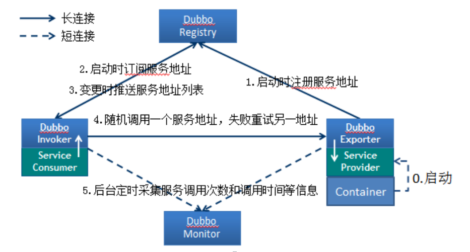

**节点角色说明：**

- Provider: 暴露服务的服务提供方。
- Consumer: 调用远程服务的服务消费方。
- Registry: 服务注册与发现的注册中心。
- Monitor: 统计服务的调用次调和调用时间的监控中心。
- Container: 服务运行容器。

**调用关系说明：**

- 0.) 服务容器负责启动，加载，运行服务提供者。
- 1.) 服务提供者在启动时，向注册中心注册自己提供的服务。
- 2.) 服务消费者在启动时，向注册中心订阅自己所需的服务。
- 3.) 注册中心返回服务提供者地址列表给消费者，如果有变更，注册中心将基于长连接推送变更数据给消费者。
- 4.) 服务消费者，从提供者地址列表中，基于软负载均衡算法，选一台提供者进行调用，如果调用失败，再选另一台调用。
- 5.) 服务消费者和提供者，在内存中累计调用次数和调用时间，定时每分钟发送一次统计数据到监控中心。

### 1.2 注册中心: zookeeper

#### 1.2.1 什么是zookeeper

​	dubbox官方推荐使用 zookeeper 注册中心。注册中心负责服务地址的注册与查找，相当于目录服务，服务提供者和消费者只在启动时与注册中心交互，注册中心不转发请求，压力较小。

​	Zookeeper 是 Apacahe Hadoop 的子项目，是一个树型的目录服务，支持变更推送，适合作为Dubbox 服务的注册中心，工业强度较高，可用于生产环境。

​	同时zookeeper也是集群管理与调度工具, 负责集群的相关信息的记录, 集群中各个节点状态的监控等等,在整个大数据阶段, 我一直和zookeeper打交道

#### 1.2.2 zookeeper的安装（单机版本）

>目前,娱乐头条中采用的zookeeper是集群版本, 参考集群版本的搭建即可

- 第一步: 安装jdk(此步省略, 参考linux中的安装步骤即可)
- 第二步:上传zookeeper的相关压缩包

```shell
cd /export/software
rz  上传即可
```

- 第三步: 解压压缩包

```
cd /export/software
tar -zxf zookeeper-3.4.6.tar.gz -C /export/server
```

- 第四步:进入zookeeper的conf目录, 将zoo.simple.cfg 修改为 zoo.cfg

```shell
cd /export/server/zookeeper-3.4.6/conf
mv zoo.simple.cfg zoo.cfg
```

- 第五步: 打开zoo.cfg配置文件, 将数据目录修改为/export/data/zk

```shell
cd /export/server/zookeeper-3.4.6/conf
vi zoo.cfg
```

​	修改如下:

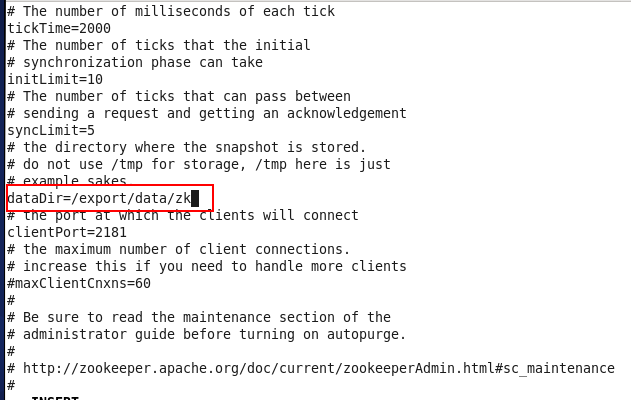

- 第六步: 创建 /export/data/zk 目录

```shell
mkdir -p /export/data/zk
```

- 第七步: 进行zookeeper的bin目录, 启动zookeeper

```shell
cd /export/server/zookeeper-3.4.6/bin
./zkServer.sh start
```

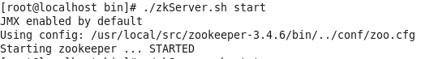

- 检查是否正常启动

```
cd /export/server/zookeeper-3.4.6/bin
./zkServer.sh status
```

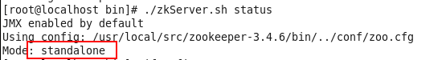


### 1.3 dubbox的基本使用

​	dubbox官方推荐使用zookeeper作为dubbox的注册中心, 负责服务地址的注册与查找,服务提供者和消费者只在启动时与注册中心交互，注册中心不转发请求，压力较小。

> 需注意, dubbox并没有在maven的中央仓库中存在, 需要手动将Dubbox的jar包安装到我的本地仓库中。
>
> 先将dubbo-2.8.4.jar包放到e:\setup, 然后输入命令

```
mvn install:install-file -Dfile=e:\setup\dubbo-2.8.4.jar -DgroupId=com.alibaba -DartifactId=dubbo -Dversion=2.8.4 -Dpackaging=jar
```

- 1)创建一个父工程: gossip-dubboxdemo-parent
  - 在父工程中添加如下依赖

```xml
<!-- 集中定义依赖版本号 -->
    <properties>
        <junit.version>4.12</junit.version>
        <spring.version>4.2.4.RELEASE</spring.version>
        <servlet-api.version>2.5</servlet-api.version>
        <dubbo.version>2.8.4</dubbo.version>
        <zookeeper.version>3.4.7</zookeeper.version>
        <zkclient.version>0.1</zkclient.version>
        <mybatis.version>3.2.8</mybatis.version>
        <mybatis.spring.version>1.2.2</mybatis.spring.version>
        <mysql.version>5.1.32</mysql.version>
        <druid.version>1.0.9</druid.version>
        <freemarker.version>2.3.23</freemarker.version>
        <solrj.version>4.10.2</solrj.version>
        <javassist.version>3.11.0.GA</javassist.version>
    </properties>

    <dependencyManagement>
        <dependencies>
            <!-- spring 相关的依赖包 -->
            <dependency>
                <groupId>org.springframework</groupId>
                <artifactId>spring-context</artifactId>
                <version>${spring.version}</version>
            </dependency>
            <dependency>
                <groupId>org.springframework</groupId>
                <artifactId>spring-beans</artifactId>
                <version>${spring.version}</version>
            </dependency>

            <dependency>
                <groupId>org.springframework</groupId>
                <artifactId>spring-jdbc</artifactId>
                <version>${spring.version}</version>
            </dependency>
            <dependency>
                <groupId>org.springframework</groupId>
                <artifactId>spring-aspects</artifactId>
                <version>${spring.version}</version>
            </dependency>
            <dependency>
                <groupId>org.springframework</groupId>
                <artifactId>spring-jms</artifactId>
                <version>${spring.version}</version>
            </dependency>
            <dependency>
                <groupId>org.springframework</groupId>
                <artifactId>spring-context-support</artifactId>
                <version>${spring.version}</version>
            </dependency>
            <dependency>
                <groupId>org.springframework</groupId>
                <artifactId>spring-web</artifactId>
                <version>${spring.version}</version>
            </dependency>
            <!-- mybatis 相关的依赖包 -->
            <dependency>
                <groupId>org.mybatis</groupId>
                <artifactId>mybatis</artifactId>
                <version>${mybatis.version}</version>
            </dependency>
            <dependency>
                <groupId>org.mybatis</groupId>
                <artifactId>mybatis-spring</artifactId>
                <version>${mybatis.spring.version}</version>
            </dependency>
            <!-- springmvc的相关依赖包 -->
            <dependency>
                <groupId>org.springframework</groupId>
                <artifactId>spring-webmvc</artifactId>
                <version>${spring.version}</version>
            </dependency>

            <!-- 数据库的相关依赖包 -->
            <dependency>
                <groupId>mysql</groupId>
                <artifactId>mysql-connector-java</artifactId>
                <version>${mysql.version}</version>
            </dependency>
            <!-- 连接池 -->
            <dependency>
                <groupId>com.alibaba</groupId>
                <artifactId>druid</artifactId>
                <version>${druid.version}</version>
            </dependency>

            <!-- 日志相关的依赖包 -->
            <dependency>
                <groupId>org.slf4j</groupId>
                <artifactId>slf4j-log4j12</artifactId>
                <version>1.6.4</version>
            </dependency>
            <dependency>
                <groupId>log4j</groupId>
                <artifactId>log4j</artifactId>
                <version>1.2.17</version>
            </dependency>

            <!--json相关的依赖-->
            <dependency>
                <groupId>com.alibaba</groupId>
                <artifactId>fastjson</artifactId>
                <version>1.2.28</version>
            </dependency>


            <!--solr相关依赖-->
            <dependency>
                <groupId>org.apache.solr</groupId>
                <artifactId>solr-solrj</artifactId>
                <version>${solrj.version}</version>
            </dependency>


            <!--测试相关-->

            <dependency>
                <groupId>junit</groupId>
                <artifactId>junit</artifactId>
                <version>${junit.version}</version>
            </dependency>
            <dependency>
                <groupId>org.springframework</groupId>
                <artifactId>spring-test</artifactId>
                <version>${spring.version}</version>
            </dependency>


            <!--dubbox相关依赖-->
            <dependency>
                <groupId>com.alibaba</groupId>
                <artifactId>dubbo</artifactId>
                <version>${dubbo.version}</version>
            </dependency>
            <!--zookeeper相关依赖-->
            <dependency>
                <groupId>org.apache.zookeeper</groupId>
                <artifactId>zookeeper</artifactId>
                <version>${zookeeper.version}</version>
            </dependency>
            <dependency>
                <groupId>com.github.sgroschupf</groupId>
                <artifactId>zkclient</artifactId>
                <version>${zkclient.version}</version>
            </dependency>

            <dependency>
                <groupId>javassist</groupId>
                <artifactId>javassist</artifactId>
                <version>${javassist.version}</version>
            </dependency>
        </dependencies>

    </dependencyManagement>


    <build>
        <plugins>
            <plugin>
                <groupId>org.apache.maven.plugins</groupId>
                <artifactId>maven-compiler-plugin</artifactId>
                <version>3.1</version>
                <configuration>
                    <source>1.8</source>
                    <target>1.8</target>
                    <encoding>utf-8</encoding>
                </configuration>
            </plugin>

        </plugins>
    </build>
```

- 2) 创建服务提供者: dubboxdemo-service  (war工程)

  - 2.1) 添加如下内容依赖:

  ```xml
  <dependencies>
  		<!-- Spring -->
  		<dependency>
  			<groupId>org.springframework</groupId>
  			<artifactId>spring-context</artifactId>
  		</dependency>
  		<dependency>
  			<groupId>org.springframework</groupId>
  			<artifactId>spring-beans</artifactId>
  		</dependency>
  		<dependency>
  			<groupId>org.springframework</groupId>
  			<artifactId>spring-webmvc</artifactId>
  		</dependency>
  		<dependency>
  			<groupId>org.springframework</groupId>
  			<artifactId>spring-jdbc</artifactId>
  		</dependency>
  		<dependency>
  			<groupId>org.springframework</groupId>
  			<artifactId>spring-aspects</artifactId>
  		</dependency>
  		<dependency>
  			<groupId>org.springframework</groupId>
  			<artifactId>spring-jms</artifactId>
  		</dependency>
  		<dependency>
  			<groupId>org.springframework</groupId>
  			<artifactId>spring-context-support</artifactId>
  		</dependency>	
  		<!-- dubbo相关 -->
  		<dependency>
  			<groupId>com.alibaba</groupId>
  			<artifactId>dubbo</artifactId>			
  		</dependency>
  		<dependency>
  			<groupId>org.apache.zookeeper</groupId>
  			<artifactId>zookeeper</artifactId>
  		</dependency>
  		<dependency>
  			<groupId>com.github.sgroschupf</groupId>
  			<artifactId>zkclient</artifactId>
  		</dependency>		
  		<dependency>
  			<groupId>javassist</groupId>
  			<artifactId>javassist</artifactId>
  		</dependency>		
  	</dependencies>
     <build>  
  	  <plugins>
  	      <plugin>  
  	          <groupId>org.apache.maven.plugins</groupId>  
  	          <artifactId>maven-compiler-plugin</artifactId>  
  	          <version>2.3.2</version>  
  	          <configuration>  
  	              <source>1.8</source>  
  	              <target>1.8</target>  
  	          </configuration>  
  	      </plugin>  
  	      <plugin>
  				<groupId>org.apache.tomcat.maven</groupId>
  				<artifactId>tomcat7-maven-plugin</artifactId>
  				<configuration>
  					<!-- 指定端口 -->
  					<port>8081</port>
  					<!-- 请求路径 -->
  					<path>/</path>
  				</configuration>
  	  	  </plugin>
  	  </plugins>  
      </build>
  ```

  - 2.2) 在工程的webapps下创建WEB-INF文件夹，找到web.xml,添加如下内容

  ```xml
  <!-- 加载spring容器 -->
  	<context-param>
  		<param-name>contextConfigLocation</param-name>
  		<param-value>classpath:applicationContext*.xml</param-value>
  	</context-param>
  	<listener>		<listener-class>org.springframework.web.context.ContextLoaderListener</listener-class>
  	</listener>	
  ```

  - 2.3) 创建一个业务的接口
    - 创建包:cn.itcast.dubboxdemo.service,用于存放业务接口

  ```java
  package cn.itcast.dubboxdemo.service;
  /**
   * 业务接口
   */
  public interface UserService {	
  	public String getName();	
  }
  ```

  - 2.4) 创建业务实现类
    - 创建包cn.itcast.dubboxdemo.service.impl ，用于存放业务实现类。创建业务实现类：

  ```java
  package cn.itcast.dubboxdemo.service.impl;
  import com.alibaba.dubbo.config.annotation.Service;
  import cn.itcast.dubbodemo.service.UserService;
  //注意：Service注解与原来不同，需要引入com.alibaba包下的
  @Service
  public class UserServiceImpl implements UserService {
  	public String getName() {		
  		return "itcast";
  	}
  }
  ```

  - 2.5) 编写配置文件
    - 在resources下创建applicationContext-service.xml ,内容如下：

  ```xml
  <?xml version="1.0" encoding="UTF-8"?>
  <beans xmlns="http://www.springframework.org/schema/beans"
  	xmlns:xsi="http://www.w3.org/2001/XMLSchema-instance" xmlns:p="http://www.springframework.org/schema/p"
  	xmlns:context="http://www.springframework.org/schema/context"
  	xmlns:dubbo="http://code.alibabatech.com/schema/dubbo" xmlns:mvc="http://www.springframework.org/schema/mvc"
  	xsi:schemaLocation="http://www.springframework.org/schema/beans http://www.springframework.org/schema/beans/spring-beans.xsd
          http://www.springframework.org/schema/mvc http://www.springframework.org/schema/mvc/spring-mvc.xsd
          http://code.alibabatech.com/schema/dubbo http://code.alibabatech.com/schema/dubbo/dubbo.xsd
          http://www.springframework.org/schema/context http://www.springframework.org/schema/context/spring-context.xsd">
       
      <dubbo:application name="dubboxdemo-service"/>  
      <dubbo:registry protocol="zookeeper" address="192.168.72.141:2181,192.168.72.142:2181,192.168.72.143:2181"/>
      <!--注意：dubbo:annotation用于扫描@Service注解。-->
      <dubbo:annotation package="cn.itcast.dubboxdemo.service" /> 
  </beans>
  ```

  - 2.6) 测试运行

  ```
  tomcat7:run
  ```


- 3.服务消费者开发

  - 3.1) 创建Maven工程（WAR）dubboxdemo-web ，在pom.xml引入依赖 ，同“dubboxdemo-service”工程。区别就是把tomcat插件的运行端口改为8082 。
  - 3.2) 在webapps下WEB-INF 目录，找到web.xml,添加如下内容

  ```xml
  <!-- 解决post乱码 -->
  	<filter>
  		<filter-name>CharacterEncodingFilter</filter-name>		
          <filter-class>org.springframework.web.filter.CharacterEncodingFilter</filter-class>
  		<init-param>
  			<param-name>encoding</param-name>
  			<param-value>utf-8</param-value>
  		</init-param>
  		<init-param>  
              <param-name>forceEncoding</param-name>  
              <param-value>true</param-value>  
          </init-param>  
  	</filter>
  	<filter-mapping>
  		<filter-name>CharacterEncodingFilter</filter-name>
  		<url-pattern>/*</url-pattern>
  	</filter-mapping>		
    <servlet>
    	<servlet-name>springmvc</servlet-name>  	
  	<servlet-class>org.springframework.web.servlet.DispatcherServlet</servlet-class>
    	<!-- 指定加载的配置文件 ，通过参数contextConfigLocation加载-->
    	<init-param>
    		<param-name>contextConfigLocation</param-name>
    		<param-value>classpath:applicationContext-web.xml</param-value>
    	</init-param>
    </servlet>  
    <servlet-mapping>
    	<servlet-name>springmvc</servlet-name>
    	<url-pattern>*.do</url-pattern>
    </servlet-mapping>
  ```

  - 3.3) 拷贝业务接口
    - 将“dubboxdemo-service”工程的cn.itcast.dubboxdemo.service 包以及下面的接口拷贝至此工程。
  - 3.4) 编写Controller

  ```java
  package cn.itcast.dubboxdemo.controller;
  import org.springframework.beans.factory.annotation.Autowired;
  import org.springframework.stereotype.Controller;
  import org.springframework.web.bind.annotation.RequestMapping;
  import org.springframework.web.bind.annotation.ResponseBody;
  import cn.itcast.dubbodemo.service.UserService;
  @Controller
  @RequestMapping("/user")
  public class UserController {
  	@Reference
  	private UserService userService;	
  	@RequestMapping("/showName")
  	@ResponseBody
  	public String showName(){
  		return userService.getName();
  	}		
  }
  ```

  - 3.5) 编写spring配置文件
    - 在src/main/resources下创建applicationContext-web.xml

  ```xml
  <?xml version="1.0" encoding="UTF-8"?>
  <beans xmlns="http://www.springframework.org/schema/beans"
  	xmlns:xsi="http://www.w3.org/2001/XMLSchema-instance" xmlns:p="http://www.springframework.org/schema/p"
  	xmlns:context="http://www.springframework.org/schema/context"
  	xmlns:dubbo="http://code.alibabatech.com/schema/dubbo" xmlns:mvc="http://www.springframework.org/schema/mvc"
  	xsi:schemaLocation="http://www.springframework.org/schema/beans http://www.springframework.org/schema/beans/spring-beans.xsd
          http://www.springframework.org/schema/mvc http://www.springframework.org/schema/mvc/spring-mvc.xsd
          http://code.alibabatech.com/schema/dubbo http://code.alibabatech.com/schema/dubbo/dubbo.xsd
          http://www.springframework.org/schema/context http://www.springframework.org/schema/context/spring-context.xsd">
  
  	<mvc:annotation-driven >
  		<mvc:message-converters register-defaults="false">
  			<bean class="org.springframework.http.converter.StringHttpMessageConverter">  
  				<constructor-arg value="UTF-8" />
  			</bean>  
  		</mvc:message-converters>	
  	</mvc:annotation-driven>
  	<!-- 引用dubbo 服务 -->
  	<dubbo:application name="dubboxdemo-web" />
  	<dubbo:registry protocol="zookeeper" address="192.168.72.141:2181,192.168.72.142:2181,192.168.72.143:2181"/>
       <dubbo:annotation package="cn.itcast.dubboxdemo.controller" />
  </beans>
  ```

  - 3.6) 测试运行

  ```
  tomcat7:run
  
  在浏览器输入http://localhost:8082/user/showName.do，查看浏览器输出结果
  
  ```

### 1.4 dubbox的管理中心的部署

​	我们在开发时，需要知道注册中心都注册了哪些服务，以便我们开发和测试。我们可以通过部署一个管理中心来实现。其实管理中心就是一个web应用，部署到tomcat即可。

#### 1.4.1 管理端的安装

（1）编译源码，得到war包

给大家下发的资源中有个dubbox-master.zip  ，这个是dubbox的源码，我们可以使用maven命令编译源码得到“管理端”的war包

将此压缩包解压，在cmd命令符下进入dubbo-admin目录 ，输入maven命令

```
mvn package -Dmaven.skip.test=true
```

如果你看到如下信息，就说明成功了

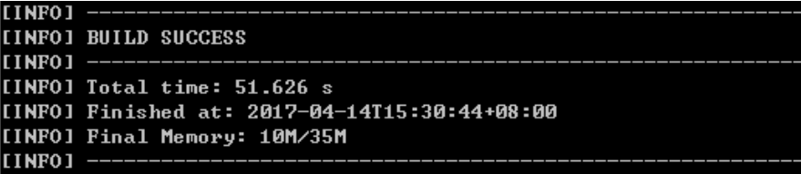

（2）进入target文件夹，你会看到一个dubbo-admin-2.8.4.war ， 在linux服务器上安装tomcat,  将此war包上传到linux服务器的tomcat的webapps下。为了访问方便，你可以把版本号去掉。 启动tomcat后自动解压。

（3）**如果你部署在zookeeper同一台主机并且端口是默认的2181，则无需修改任何配置**。如果不是在一台主机上或端口被修改，需要修改WEB-INF下的dubbo.properties  ，修改如下配置：	

```
单机版本的配置:
	dubbo.registry.address=zookeeper://127.0.0.1:2181   //把ip地址更改为zookeeper的服务器ip地址即可

集群版本的配置:
	dubbo.registry.address=zookeeper://192.168.72.141:2181?backup=192.168.72.142:2181&backup=192.168.72.143:2181
```

#### 1.4.2 管理端的使用

（1）打开浏览器，输入http://192.168.25.132:8080/dubbo-admin/ ,登录用户名和密码均为root 进入首页。 (192.168.25.132)是我部署的linux主机地址。


（2）启动服务提供者工程，即可在服务治理-提供者查看到该服务。


点击其中一条数据后可以查看详情。

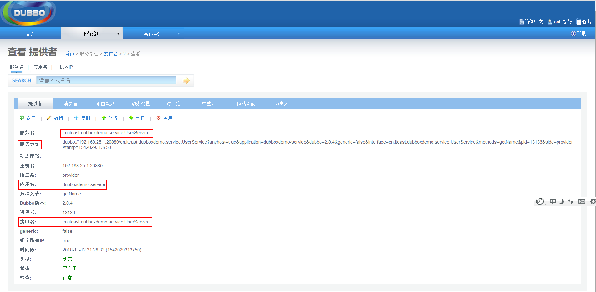

（3）启动服务消费者工程，运行页面，观察“消费者”列表

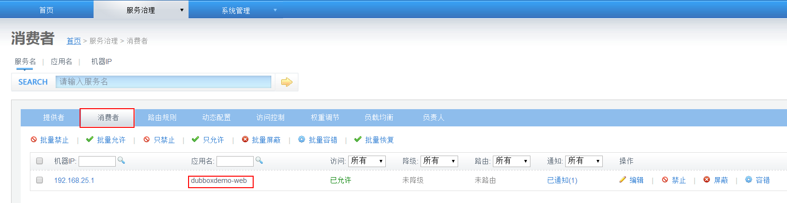

## 2. 搜索引擎的基本架构分析

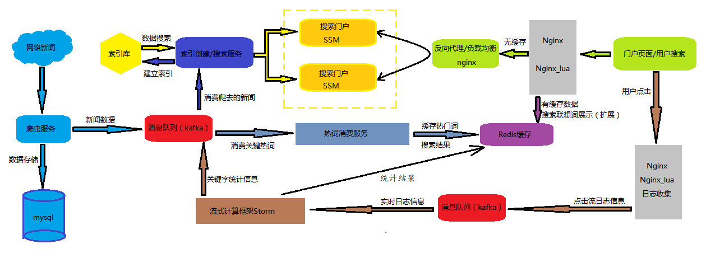

通过上图分析:

​	门户的网站和搜索服务是两个不同的程序, 门户网站主要提供给用户搜索页面 ,展示搜索的结果信息, 

​	搜索服务同样也是一个独立的程序, 提供接口供门户网站进行调用, 查询相关搜索内容

需要思考一个问题:

- 搜索服务和门户网站都是一个独立的应用, 那么web门户端应该如何调用搜索服务端呢?
  - 采用的方式:
    - 1) 可采取直接依赖这个独立的项目, 直接使用里面的类和方法
      - 好处: 简单, 快捷
      - 缺点: 不利于维护, 耦合关系很大, 没有一个好的伸缩性
    - 2) **使用服务中间件方案**
      - 使web端不直接依赖于服务端, 中间可通过dubbox或者是其他的服务中间件进行调用即可
        - 优点: 维护方便, 基本没有任何的耦合关系, 服务与服务之间可以独立的进行调整,满足不同的服务要求, 提高其伸缩性
        - 缺点:由于需要使用服务中间件进行调用,性能方面会受到一定影响

## 3. 搜索服务项目搭建

* 1) 创建一个父工程, 名为 gossip-parent, 并将其src删除.  父工程中会包含两个应用, 一个是搜索服务, 一个ssm门户网站

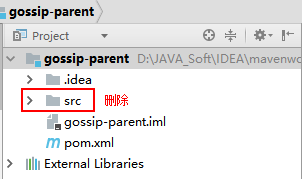

* 2) **在父工程中, 创建搜索服务的子工程,左键选中父工程,选着导航栏中file选择new一个module,** 分别是一个search-interface, 一个是search-service

  * 2.1) 创建search-interface:搜索服务的接口,  其打包方式为jar

  

  * 2.2) 创建search-service: 搜索服务应用, 其打包方式为war, 添加webapp 和 web-info和 web.xml

  

* 3) 添加相关依赖:

  * 3.1) 添加gossip-parent的依赖(锁定版本)  : 

  ```xml
  <!-- 集中定义依赖版本号 -->
      <properties>
          <junit.version>4.12</junit.version>
          <spring.version>4.2.4.RELEASE</spring.version>
          <servlet-api.version>2.5</servlet-api.version>
          <dubbo.version>2.8.4</dubbo.version>
          <zookeeper.version>3.4.7</zookeeper.version>
          <zkclient.version>0.1</zkclient.version>
          <mybatis.version>3.2.8</mybatis.version>
          <mybatis.spring.version>1.2.2</mybatis.spring.version>
          <mysql.version>5.1.32</mysql.version>
          <druid.version>1.0.9</druid.version>
          <freemarker.version>2.3.23</freemarker.version>
          <solrj.version>4.10.2</solrj.version>
          <javassist.version>3.11.0.GA</javassist.version>
      </properties>
  
      <dependencyManagement>
          <dependencies>
              <!-- spring 相关的依赖包 -->
              <dependency>
                  <groupId>org.springframework</groupId>
                  <artifactId>spring-context</artifactId>
                  <version>${spring.version}</version>
              </dependency>
              <dependency>
                  <groupId>org.springframework</groupId>
                  <artifactId>spring-beans</artifactId>
                  <version>${spring.version}</version>
              </dependency>
  
              <dependency>
                  <groupId>org.springframework</groupId>
                  <artifactId>spring-jdbc</artifactId>
                  <version>${spring.version}</version>
              </dependency>
              <dependency>
                  <groupId>org.springframework</groupId>
                  <artifactId>spring-aspects</artifactId>
                  <version>${spring.version}</version>
              </dependency>
              <dependency>
                  <groupId>org.springframework</groupId>
                  <artifactId>spring-jms</artifactId>
                  <version>${spring.version}</version>
              </dependency>
              <dependency>
                  <groupId>org.springframework</groupId>
                  <artifactId>spring-context-support</artifactId>
                  <version>${spring.version}</version>
              </dependency>
              <dependency>
                  <groupId>org.springframework</groupId>
                  <artifactId>spring-web</artifactId>
                  <version>${spring.version}</version>
              </dependency>
              <!-- mybatis 相关的依赖包 -->
              <dependency>
                  <groupId>org.mybatis</groupId>
                  <artifactId>mybatis</artifactId>
                  <version>${mybatis.version}</version>
              </dependency>
              <dependency>
                  <groupId>org.mybatis</groupId>
                  <artifactId>mybatis-spring</artifactId>
                  <version>${mybatis.spring.version}</version>
              </dependency>
              <!-- springmvc的相关依赖包 -->
              <dependency>
                  <groupId>org.springframework</groupId>
                  <artifactId>spring-webmvc</artifactId>
                  <version>${spring.version}</version>
              </dependency>
  
              <!-- 数据库的相关依赖包 -->
              <dependency>
                  <groupId>mysql</groupId>
                  <artifactId>mysql-connector-java</artifactId>
                  <version>${mysql.version}</version>
              </dependency>
              <!-- 连接池 -->
              <dependency>
                  <groupId>com.alibaba</groupId>
                  <artifactId>druid</artifactId>
                  <version>${druid.version}</version>
              </dependency>
  
              <!-- 日志相关的依赖包 -->
              <dependency>
                  <groupId>org.slf4j</groupId>
                  <artifactId>slf4j-log4j12</artifactId>
                  <version>1.6.4</version>
              </dependency>
              <dependency>
                  <groupId>log4j</groupId>
                  <artifactId>log4j</artifactId>
                  <version>1.2.17</version>
              </dependency>
  
              <!--json相关的依赖-->
              <dependency>
                  <groupId>com.alibaba</groupId>
                  <artifactId>fastjson</artifactId>
                  <version>1.2.28</version>
              </dependency>
  
  
              <!--solr相关依赖-->
              <dependency>
                  <groupId>org.apache.solr</groupId>
                  <artifactId>solr-solrj</artifactId>
                  <version>${solrj.version}</version>
              </dependency>
  
  
              <!--测试相关-->
  
              <dependency>
                  <groupId>junit</groupId>
                  <artifactId>junit</artifactId>
                  <version>${junit.version}</version>
              </dependency>
              <dependency>
                  <groupId>org.springframework</groupId>
                  <artifactId>spring-test</artifactId>
                  <version>${spring.version}</version>
              </dependency>
  
  
              <!--dubbox相关依赖-->
              <dependency>
                  <groupId>com.alibaba</groupId>
                  <artifactId>dubbo</artifactId>
                  <version>${dubbo.version}</version>
              </dependency>
              <!--zookeeper相关依赖-->
              <dependency>
                  <groupId>org.apache.zookeeper</groupId>
                  <artifactId>zookeeper</artifactId>
                  <version>${zookeeper.version}</version>
              </dependency>
              <dependency>
                  <groupId>com.github.sgroschupf</groupId>
                  <artifactId>zkclient</artifactId>
                  <version>${zkclient.version}</version>
              </dependency>
  
              <dependency>
                  <groupId>javassist</groupId>
                  <artifactId>javassist</artifactId>
                  <version>${javassist.version}</version>
              </dependency>
          </dependencies>
  
      </dependencyManagement>
  
  
      <build>
          <plugins>
              <plugin>
                  <groupId>org.apache.maven.plugins</groupId>
                  <artifactId>maven-compiler-plugin</artifactId>
                  <version>3.1</version>
                  <configuration>
                      <source>1.8</source>
                      <target>1.8</target>
                      <encoding>utf-8</encoding>
                  </configuration>
              </plugin>
  
          </plugins>
      </build>
  ```

  * 3.2) 添加search-service的pom文件

  > 说明, search-interface此时不需要添加任何的依赖, 其工程里面主要是存放着搜索相关的公共的接口

  ```xml
  <dependencies>
          <!-- spring 相关的依赖包 -->
          <dependency>
              <groupId>org.springframework</groupId>
              <artifactId>spring-context</artifactId>
          </dependency>
          <dependency>
              <groupId>org.springframework</groupId>
              <artifactId>spring-beans</artifactId>
          </dependency>
  
          <dependency>
              <groupId>org.springframework</groupId>
              <artifactId>spring-jdbc</artifactId>
          </dependency>
          <dependency>
              <groupId>org.springframework</groupId>
              <artifactId>spring-aspects</artifactId>
          </dependency>
  
          <dependency>
              <groupId>org.springframework</groupId>
              <artifactId>spring-context-support</artifactId>
          </dependency>
          <dependency>
              <groupId>org.springframework</groupId>
              <artifactId>spring-web</artifactId>
          </dependency>
  
          <!--dubbox相关依赖-->
          <dependency>
              <groupId>com.alibaba</groupId>
              <artifactId>dubbo</artifactId>
          </dependency>
          <dependency>
              <groupId>org.apache.zookeeper</groupId>
              <artifactId>zookeeper</artifactId>
          </dependency>
          <dependency>
              <groupId>com.github.sgroschupf</groupId>
              <artifactId>zkclient</artifactId>
          </dependency>
  
          <dependency>
              <groupId>javassist</groupId>
              <artifactId>javassist</artifactId>
          </dependency>
  
  
      </dependencies>
      <build>
          <plugins>
              <plugin>
                  <groupId>org.apache.tomcat.maven</groupId>
                  <artifactId>tomcat7-maven-plugin</artifactId>
                  <version>2.2</version>
                  <configuration>
                      <path>/</path>
                      <port>9001</port>
                  </configuration>
              </plugin>
          </plugins>
      </build>
  ```

  * 3.3) 在search-service中添加相关的配置文件
    * 主要的配置文件是spring的配置文件applicationContext-service.xml

  ```xml
  <?xml version="1.0" encoding="UTF-8"?>
  <beans xmlns="http://www.springframework.org/schema/beans"
         xmlns:context="http://www.springframework.org/schema/context"
         xmlns:xsi="http://www.w3.org/2001/XMLSchema-instance" xmlns:dubbo="http://code.alibabatech.com/schema/dubbo"
         xsi:schemaLocation="http://www.springframework.org/schema/beans http://www.springframework.org/schema/beans/spring-beans-4.0.xsd
  	http://www.springframework.org/schema/context http://www.springframework.org/schema/context/spring-context-4.0.xsd
  	http://code.alibabatech.com/schema/dubbo http://code.alibabatech.com/schema/dubbo/dubbo.xsd">
  
      <!--以下为solr相关的配置-->
      <!--<bean class="org.apache.solr.client.solrj.impl.HttpSolrServer">
          <constructor-arg name="baseURL" value="http://localhost:8080/solr/collection1"></constructor-arg>
      </bean>-->
  
      <!--solr集群的配置-->
      <bean class="org.apache.solr.client.solrj.impl.CloudSolrServer">
          <!--指定zookeeper的连接地址-->
          <constructor-arg name="zkHost"
                           value="192.168.72.141:2181,192.168.72.142:2181,192.168.72.143:2181"></constructor-arg>
          <!--默认的索引库-->
          <property name="defaultCollection" value="collection1"></property>
          <!--从zookeeper中获取的客户端的超时时间, -->
          <property name="zkClientTimeout" value="5000"></property>
          <!--设置 连接 zookeeper的超时时间-->
          <property name="zkConnectTimeout" value="5000"></property>
      </bean>
  
      <!--dubbox相关配置-->
      <dubbo:protocol name="dubbo" port="20881"></dubbo:protocol>
      <dubbo:application name="search-service"/>
      <dubbo:registry protocol="zookeeper" address="192.168.72.141:2181,192.168.72.142:2181,192.168.72.143:2181"/>
      <dubbo:annotation package="com.itheima.search.service"/>
  </beans>
  ```

  * 3.4) 在search-service中 修改web.xml
    * 其本质只是一个提供服务的应用, 不需要用户访问, 顾 只需要在启动加载spring容器, 通过dubbo构建服务即可

  ```xml
  	<!-- 加载spring容器 -->
    <context-param>
      <param-name>contextConfigLocation</param-name>
      <param-value>classpath:applicationContext*.xml</param-value>
    </context-param>
    <listener>
      <listener-class>org.springframework.web.context.ContextLoaderListener</listener-class>
    </listener>
  ```

  * 3.5) 创建包结构: 注意其包结构应该在配置文件扫描包的范围内
    * 需要在search-interface 和 search-service 都需要进行添加

  

* 4) 在search-service工程中添加solrj 的依赖 和 接口的工程依赖

```xml
		<dependency>
            <groupId>org.apache.solr</groupId>
            <artifactId>solr-solrj</artifactId>
        </dependency>
        <!--需要将接口的工程依赖进来: 注意加载自己写的接口的项目-->
        <dependency>
            <groupId>com.itheima.gossip</groupId>
            <artifactId>search-interface</artifactId>
            <version>1.0-SNAPSHOT</version>
        </dependency>
```

* 5) 测试整个项目是否搭建成功: 

  * 测试方式: 启动一下tomcat, 如果没有任何报错信息显示, 说明当前的配置文件是没有问题的

  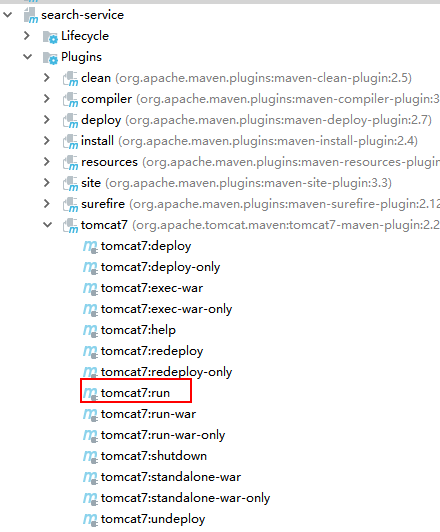

  * 启动后会发现报出如下的错误:

  

  解决方案:  将interface重新安装一下即可, 这里建议当第一次的时候, 直接将整个父工程安装一下

  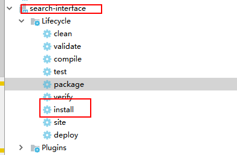

**注意**: 在使用聚合工程的时候, 如果当前工程打包方式是jar包, 每次修改完项目中的任何的东西, 都需要重新安装, 将最新的jar包打包到仓库中, 以保证所依赖的项目, 都能获取最新的jar包

## 4. ssm门户项目的搭建

```
ssm整合 :   ssm中有那些配置文件,每个配置文件中必须要有那些内容即可
	spring: 
		配置文件:  applicationContent.xml
		内容:  扫描包(service) , 数据源 , sqlSessionFactory , 和mybatis整合的扫描, dubbox配置
	
	springmvc: 
		配置文件 : springmvc.xml
		内容:  扫描包(controller), 视图解析器, 驱动注解 
	
	mybatis:
		配置文件:  mapper文件(可选的) sqlMapConfig.xml 
		内容:  啥也没有  但是  有个头约束
	web.xml : 
		spring和web整合的监听器,  springmvc的前端控制器 , 解决post乱码的过滤器
		
	pom.xml : spring + springmvc+ mybatis + mybatis和spring整合 + 数据库驱动 + 连接池 + dubbox +zookeeper
```


* 1) 在gossip-parent中创建 gossip-searchPortal 项目: 打包方式为war, 添加webapp和 web-info和web.xml


* 2) 添加相关依赖: pom.xml

```xml
<dependencies>
        <!-- spring 相关的依赖包 -->
        <dependency>
            <groupId>org.springframework</groupId>
            <artifactId>spring-context</artifactId>
        </dependency>
        <dependency>
            <groupId>org.springframework</groupId>
            <artifactId>spring-beans</artifactId>
        </dependency>

        <dependency>
            <groupId>org.springframework</groupId>
            <artifactId>spring-jdbc</artifactId>
        </dependency>
        <dependency>
            <groupId>org.springframework</groupId>
            <artifactId>spring-aspects</artifactId>
        </dependency>

        <dependency>
            <groupId>org.springframework</groupId>
            <artifactId>spring-context-support</artifactId>
        </dependency>
        <dependency>
            <groupId>org.springframework</groupId>
            <artifactId>spring-web</artifactId>
        </dependency>

        <!-- springmvc的相关依赖包 -->
        <dependency>
            <groupId>org.springframework</groupId>
            <artifactId>spring-webmvc</artifactId>
        </dependency>

        <!-- mybatis 相关的依赖包 -->
        <dependency>
            <groupId>org.mybatis</groupId>
            <artifactId>mybatis</artifactId>
        </dependency>
        <dependency>
            <groupId>org.mybatis</groupId>
            <artifactId>mybatis-spring</artifactId>
        </dependency>
        <!-- 数据库的相关依赖包 -->
        <dependency>
            <groupId>mysql</groupId>
            <artifactId>mysql-connector-java</artifactId>
        </dependency>
        <!-- 连接池 -->
        <dependency>
            <groupId>com.alibaba</groupId>
            <artifactId>druid</artifactId>
        </dependency>

        <!-- 日志相关的依赖包 -->
        <dependency>
            <groupId>org.slf4j</groupId>
            <artifactId>slf4j-log4j12</artifactId>
        </dependency>
        <dependency>
            <groupId>log4j</groupId>
            <artifactId>log4j</artifactId>
        </dependency>

        <!--json相关的依赖-->
        <dependency>
            <groupId>com.alibaba</groupId>
            <artifactId>fastjson</artifactId>
        </dependency>

        <!--dubbox 相关依赖-->
        <dependency>
            <groupId>com.alibaba</groupId>
            <artifactId>dubbo</artifactId>
        </dependency>
        <dependency>
            <groupId>org.apache.zookeeper</groupId>
            <artifactId>zookeeper</artifactId>
        </dependency>
        <dependency>
            <groupId>com.github.sgroschupf</groupId>
            <artifactId>zkclient</artifactId>
        </dependency>
        <dependency>
            <groupId>javassist</groupId>
            <artifactId>javassist</artifactId>
        </dependency>
    
    
    </dependencies>


    <build>
        <!--tomcat7的插件-->
        <plugins>
            <plugin>
                <groupId>org.apache.tomcat.maven</groupId>
                <artifactId>tomcat7-maven-plugin</artifactId>
                <version>2.2</version>
                <configuration>
                    <path>/</path>
                    <port>9002</port>
                </configuration>
            </plugin>
        </plugins>
    </build>
```

* 4) 添加相关的配置文件

  * 4.1) mybatis相关的配置文件: sqlMapConfig.xml

  ```xml
  <?xml version="1.0" encoding="UTF-8"?>
  <!DOCTYPE configuration
          PUBLIC "-//mybatis.org//DTD Config 3.0//EN"
          "http://mybatis.org/dtd/mybatis-3-config.dtd">
  <configuration>
      <typeAliases>
          <package name="com.itheima.gossip.pojo"/>
      </typeAliases>
  </configuration>
  ```

  * 4.2) spring相关的配置文件: applicationContext.xml

  ```xml
  <?xml version="1.0" encoding="UTF-8"?>
  <beans xmlns="http://www.springframework.org/schema/beans"
         xmlns:context="http://www.springframework.org/schema/context"
         xmlns:dubbo="http://code.alibabatech.com/schema/dubbo"
         xmlns:xsi="http://www.w3.org/2001/XMLSchema-instance"
         xsi:schemaLocation="http://www.springframework.org/schema/beans http://www.springframework.org/schema/beans/spring-beans-4.0.xsd
         http://code.alibabatech.com/schema/dubbo http://code.alibabatech.com/schema/dubbo/dubbo.xsd
  	   http://www.springframework.org/schema/context http://www.springframework.org/schema/context/spring-context-4.0.xsd">
  
      <!-- 配置数据源 -->
      <bean id = "dataSource" class="com.alibaba.druid.pool.DruidDataSource" destroy-method="close">
          <property name="driverClassName" value="com.mysql.jdbc.Driver"/>
          <property name="url" value="jdbc:mysql://localhost:3306/spider?characterEncoding=utf-8"/>
          <property name="username" value="root"/>
          <property name="password" value="root"/>
      </bean>
      <!-- 配置sqlsessionFactory -->
      <bean id="sqlSessionFactory" class="org.mybatis.spring.SqlSessionFactoryBean">
          <property name="configLocation" value="classpath:sqlMapConfig.xml"></property>
          <property name="dataSource" ref="dataSource"></property>
          <!--用于加载mapper文件-->
          <!--<property name="mapperLocations" value="classpath:mapper/*"></property>-->
      </bean>
  
      <bean class="org.mybatis.spring.mapper.MapperScannerConfigurer">
          <property name="basePackage" value="com.itheima.gossip.mapper"></property>
      </bean>
  
      <!-- 引用dubbo 服务 -->
      <dubbo:application name="search-web"/>
      <dubbo:registry protocol="zookeeper" address="192.168.72.141:2181,192.168.72.142:2181,192.168.72.143:2181"/>
      <dubbo:annotation package="com.itheima.gossip.service"/>
  
  </beans>
  ```

  * 4.3) springMVC 的配置文件: springMVC.xml

  ```xml
  <?xml version="1.0" encoding="UTF-8"?>
  <beans xmlns="http://www.springframework.org/schema/beans"
         xmlns:xsi="http://www.w3.org/2001/XMLSchema-instance" xmlns:p="http://www.springframework.org/schema/p"
  
         xmlns:context="http://www.springframework.org/schema/context"
         xmlns:mvc="http://www.springframework.org/schema/mvc"
         xsi:schemaLocation="http://www.springframework.org/schema/beans http://www.springframework.org/schema/beans/spring-beans-4.0.xsd
          http://www.springframework.org/schema/mvc http://www.springframework.org/schema/mvc/spring-mvc-4.0.xsd
          http://www.springframework.org/schema/context http://www.springframework.org/schema/context/spring-context-4.0.xsd">
  
      <context:component-scan base-package="com.itheima.gossip.controller"/>
  
      <!-- spring提供了更加便捷的方式来创建处理器映射器和处理器适配器 -->
      <mvc:annotation-driven>
          <mvc:message-converters register-defaults="true">
              <bean class="com.alibaba.fastjson.support.spring.FastJsonHttpMessageConverter">
                  <property name="supportedMediaTypes" value="application/json"/>
                  <property name="features">
                      <array>
                          <value>WriteMapNullValue</value>
                          <value>WriteDateUseDateFormat</value>
                      </array>
                  </property>
              </bean>
          </mvc:message-converters>
  
  
      </mvc:annotation-driven>
  
      <!-- 配置视图解析器 -->
      <bean class="org.springframework.web.servlet.view.InternalResourceViewResolver">
          <property name="prefix" value="/"></property>
          <property name="suffix" value=".html"></property>
      </bean>
  
  </beans>
  ```

* 5) 创建包结构: 注意其包结构应该在配置文件扫描包的范围内

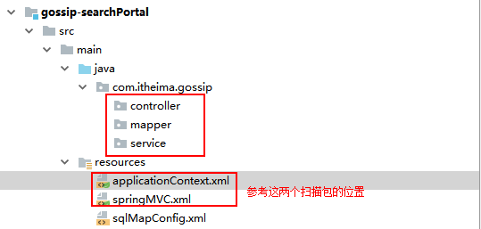

* 6) 修改web.xml

```xml
	<!-- 加载spring容器 -->
    <context-param>
        <param-name>contextConfigLocation</param-name>
        <param-value>classpath:applicationContext*.xml</param-value>
    </context-param>

    <!-- 解决post乱码 -->
    <filter>
        <filter-name>CharacterEncodingFilter</filter-name>
        <filter-class>org.springframework.web.filter.CharacterEncodingFilter</filter-class>
        <init-param>
            <param-name>encoding</param-name>
            <param-value>utf-8</param-value>
        </init-param>
        <init-param>
            <param-name>forceEncoding</param-name>
            <param-value>true</param-value>
        </init-param>
    </filter>
    <filter-mapping>
        <filter-name>CharacterEncodingFilter</filter-name>
        <url-pattern>/*</url-pattern>
    </filter-mapping>

    <!--spring 和 web整合的监听器-->
    <listener>
        <listener-class>org.springframework.web.context.ContextLoaderListener</listener-class>
    </listener>

    <!--springmvc 前端控制器-->
    <servlet>
        <servlet-name>springmvc</servlet-name>
        <servlet-class>org.springframework.web.servlet.DispatcherServlet</servlet-class>
        <!-- 指定加载的配置文件 ，通过参数contextConfigLocation加载-->
        <init-param>
            <param-name>contextConfigLocation</param-name>
            <param-value>classpath:springMVC.xml</param-value>
        </init-param>
    </servlet>

    <servlet-mapping>
        <servlet-name>springmvc</servlet-name>
        <url-pattern>*.action</url-pattern>
    </servlet-mapping>
```

* 7) 手动将search-interface工程添加到门户项目中pom文件当中: 添加自己的接口工程

```xml
		<dependency>
            <groupId>com.itheima.gossip</groupId>
            <artifactId>search-interface</artifactId>
            <version>1.0-SNAPSHOT</version>
        </dependency>
```

* 8)  测试门户当前整体搭建是否有问题: 测试方式和搜索服务类似, 启动一下tomcat即可

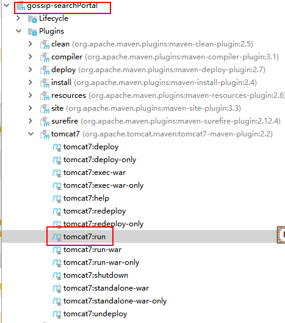


## 5.  进行索引写入操作

### 5.1 索引写入流程分析

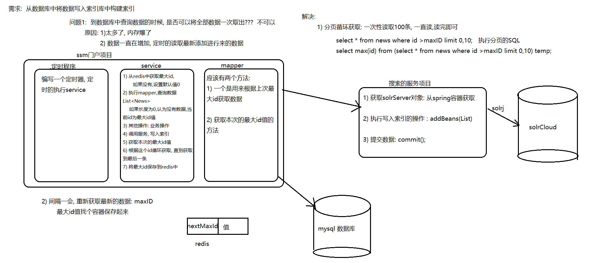

### 5.2 完成搜索服务工程代码编写

* 1) 创建一个 gossip-pojo的工程: 专门用来编写pojo类的

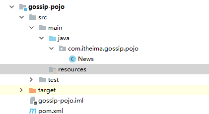

* 2) 在这个工程( gossip-pojo)中创建包结构 :  com.itheima.gossip.pojo, 在这个包下创建一个news对象

```java
public class News implements Serializable {
    private String id;
    private String title;
    private String time;
    private String source;
    private String content;
    private String editor;
    private String docurl;
	//省略了get 和 set方法
}
```

* 3) 在search-interface中的pom文件中添加 pojo工程的依赖关系

```xml
  		<dependency>
            <groupId>com.itheima.gossip</groupId>
            <artifactId>gossip-pojo</artifactId>
            <version>1.0-SNAPSHOT</version>
        </dependency>
```

* 4)  在search-interface中的service包下, 建一个接口类 indexWriterService接口

```java
package com.itheima.search.service;

import com.itheima.gossip.pojo.News;

import java.util.List;

public interface IndexWriterService {

    public void saveBeans(List<News> newsList) throws  Exception;
}

```

* 5) 在search-service中的impl包下, 建一个实现类(服务类) :   indexWriterServiceImpl类

```java
package com.itheima.search.service.impl;

import com.alibaba.dubbo.config.annotation.Service;
import com.itheima.gossip.pojo.News;
import com.itheima.search.service.IndexWriterService;
import org.apache.solr.client.solrj.SolrServer;
import org.springframework.beans.factory.annotation.Autowired;

import java.util.List;
@Service
public class IndexWriterServiceImple implements  IndexWriterService {
    @Autowired // 从容器中获取
    // 如果在注入的时候, 不知道该加那个注解了, 问自己一个问题: 这个对象的实例是一个服务呢, 还是spring容器中对象
    private SolrServer solrServer;

    @Override
    public void saveBeans(List<News> newsList)  throws  Exception{
        solrServer.addBeans(newsList);  // 不要使用addBean这个方法了.....
        solrServer.commit();
    }
}

```

* 6) 安装 pojo工程 和 search-interface工程
* 7) 启动search-service工程

> 请问上述代码有没有问题呢?    有    在pojo中没有添加@field注解

* 8) 关闭刚刚启动的工程, 将search-service中solrj的依赖剪切到gossip-pojo工程的pom文件中

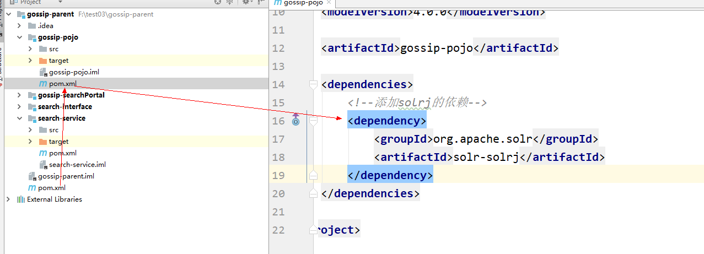

* 9) 在news类中添加@field注解

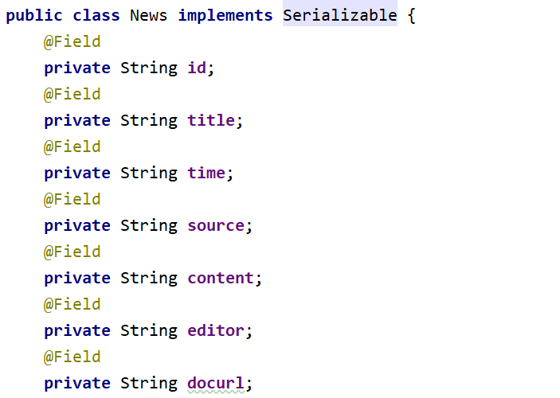

* 10) 安装gossip-pojo ,安装后, 启动search-service工程即可

### 5.3 完成门户端代码实现

#### 5.3.1 实现mapper层代码

* 1) 在门户端项目的mapper包下,建一个NewsMapper的接口

```java
	package com.itheima.gossip.mapper;

import com.itheima.gossip.pojo.News;

import java.util.List;

public interface NewsMapper {

    //1. 根据上一次的最大id, 获取分页数据
    //  select * from news where id >lastMaxId limit 0,10
    public List<News>  findByLastMaxId(String lastMaxId);

    //2. 根据上一次的最大id, 获取本次最大id
    //	select max(id) from (select * from news where id >lastMaxId limit 0,10) temp;
    public String findToNextMaxId(String lastMaxId);

}

```

* 2) 在门户端工程的resources下建立一个mapper的目录, 在这个mapper的目录下建一个NewsMapper.xml

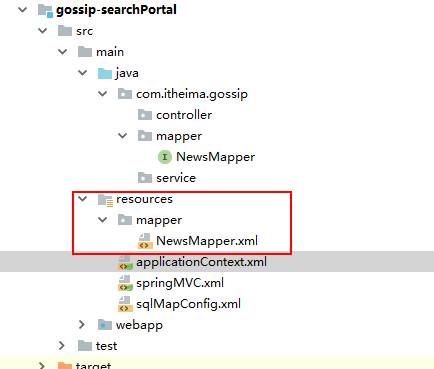

```xml
<?xml version="1.0" encoding="UTF-8" ?>
<!DOCTYPE mapper
        PUBLIC "-//mybatis.org//DTD Mapper 3.0//EN"
        "http://mybatis.org/dtd/mybatis-3-mapper.dtd">
<mapper namespace="com.itheima.gossip.mapper.NewsMapper">

    <select id="findByLastMaxId" parameterType="string" resultType="news">
      select * from news where id >#{lastMaxId} limit 0,100;
    </select>

    <select id="findToNextMaxId" parameterType="string" resultType="string">
        select max(id) from (select * from news where id >#{lastMaxId} limit 0,100) temp;
    </select>

</mapper>
```

* 3) 在resources打开applicationContext.xml中将mapper的注释打开

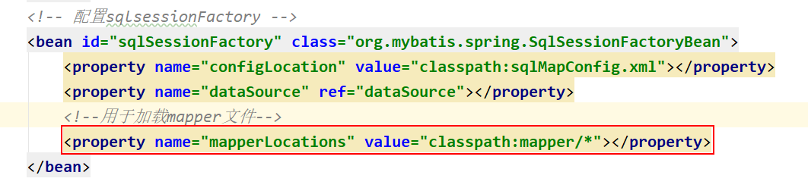

#### 5.3.2 service层代码实现

* 1) 在门户端创建一个utils包, 在utils包下建一个JedisUtils:

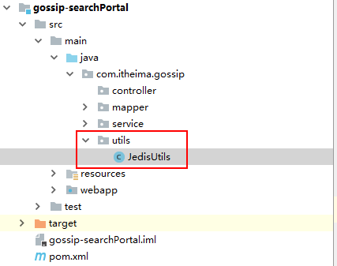

```java
package com.itheima.gossip.utils;

import redis.clients.jedis.Jedis;
import redis.clients.jedis.JedisPool;
import redis.clients.jedis.JedisPoolConfig;

public class JedisUtils {
    private static JedisPool jedisPool;
   // 静态代码块 :  随着类的加载而加载, 一般只会加载一次
    static{
       JedisPoolConfig config = new JedisPoolConfig();
       config.setMaxTotal(100); // 最大的连接数
       config.setMaxIdle(50); // 最大闲时数量
       config.setMinIdle(25); // 最小闲时数量
       // 注意: 如果写成这样, JedisPool jedisPool , 当获取连接对象的时候, 会报空指针错误
       jedisPool = new JedisPool(config,"192.168.72.142",6379);
    }


    //获取连接的方法
    public static Jedis getJedis(){

        return jedisPool.getResource();
    }
}

```

* 2) 在门户端的pom文件中添加jedis依赖

```xml
<!--导入jedis的依赖-->
        <dependency>
            <groupId>redis.clients</groupId>
            <artifactId>jedis</artifactId>
            <version>2.9.0</version>
        </dependency>
```

* 3) 在门户端service包下建一个接口类: IndexWriterProtalService

```java
package com.itheima.gossip.service;

public interface IndexWriterProtalService {

    public void saveBeans() throws Exception;

}

```

* 4) 在service包下建立impl包. 在impl包下建一个实现类:   IndexWriterProtalServiceImpl

```java
package com.itheima.gossip.service.impl;

import com.alibaba.dubbo.config.annotation.Reference;
import com.itheima.gossip.mapper.NewsMapper;
import com.itheima.gossip.pojo.News;
import com.itheima.gossip.service.IndexWriterProtalService;
import com.itheima.gossip.utils.JedisUtils;
import com.itheima.search.service.IndexWriterService;
import org.springframework.beans.factory.annotation.Autowired;
import org.springframework.stereotype.Service;
import redis.clients.jedis.Jedis;

import java.util.List;
@Service
public class IndexWriterProtalServiceImpl  implements IndexWriterProtalService{
    @Autowired
    private NewsMapper newsMapper;
    @Reference(timeout=5000)
    private IndexWriterService indexWriterService;
    // 索引写入的方法
    @Override
    public void saveBeans() throws Exception {
        // 1) 从redis中获取上一次的最大id, 如果没有设置为 0
        Jedis jedis = JedisUtils.getJedis();
        String lastMaxId = jedis.get("bigData:search:lastMaxId");
        jedis.close();
        if(lastMaxId == null || "".equals(lastMaxId)){
            lastMaxId = "0";
        }
        // 6 循环获取
        while(true) {
            //2) 调用mapper 查询数据 , 如果返回值长度为0 , 认为没有数据了, 当前id为最大id值
            List<News> newsList = newsMapper.findByLastMaxId(lastMaxId);
            if (newsList == null || newsList.size() == 0) {
                // 跳出循环
                break;
            }

            //3. 其他的业务操作
			// 2019-05-13 09:43:25
            SimpleDateFormat format1 = new SimpleDateFormat("yyyy-MM-dd HH:mm:ss");
            // 2019-05-13'T'09:43:25'Z'
            SimpleDateFormat format2 = new SimpleDateFormat("yyyy-MM-dd'T'HH:mm:ss'Z'");
            for (News news : newsList) {
                String oldTime = news.getTime();

                Date oldDate = format1.parse(oldTime);
                String newTime = format2.format(oldDate);

                news.setTime(newTime);
            }
            //4. 调用服务,写入索引
            indexWriterService.saveBeans(newsList);

            //5. 获取本次数据中的最大id值
            lastMaxId = newsMapper.findToNextMaxId(lastMaxId);

        }

        // 将最大id存储到redis中
        jedis = JedisUtils.getJedis();
        jedis.set("bigData:search:lastMaxId",lastMaxId);
        jedis.close();

    }
}

```

最终的效果:

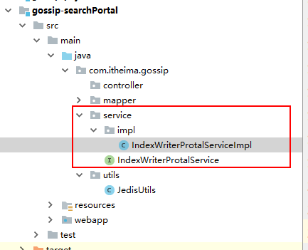

#### 5.3.3 定时器的编写:

* 1) 在门户端创建一个timing的包, 在timing的包下建立一个Timing的类

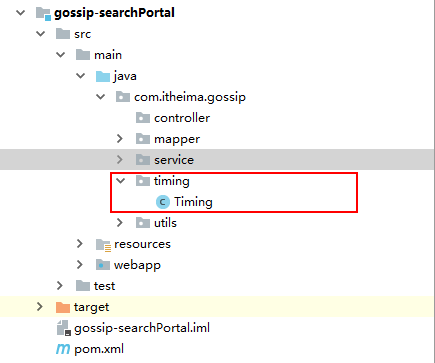

```java
package com.itheima.gossip.timing;

import com.itheima.gossip.service.IndexWriterProtalService;
import org.springframework.beans.factory.annotation.Autowired;
import org.springframework.stereotype.Component;

// 定时执行的类
@Component
public class Timing {

    @Autowired
    private IndexWriterProtalService indexWriterProtalService;
    // 只要能够让timing这个方法定时的执行, 那么service的方法也就会定时的执行  SpringTask
    public void timing(){

        try {
            indexWriterProtalService.saveBeans();
        } catch (Exception e) {
            e.printStackTrace();
        }
    }
}

```

* 2) 在resources下建立一个配置文件:  applicationContext-Task.xml

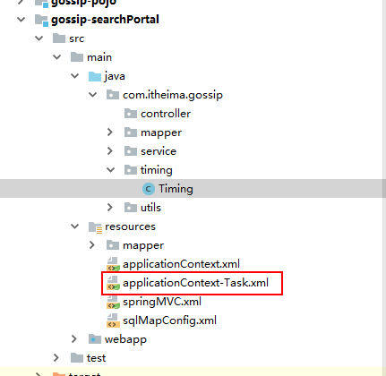

```xml
<?xml version="1.0" encoding="UTF-8"?>
<beans xmlns="http://www.springframework.org/schema/beans"
       xmlns:xsi="http://www.w3.org/2001/XMLSchema-instance"
       xmlns:task="http://www.springframework.org/schema/task"
       xmlns:context="http://www.springframework.org/schema/context"
       xsi:schemaLocation="http://www.springframework.org/schema/beans http://www.springframework.org/schema/beans/spring-beans-4.0.xsd
         http://www.springframework.org/schema/task http://www.springframework.org/schema/task/spring-task-4.0.xsd
        http://www.springframework.org/schema/context http://www.springframework.org/schema/context/spring-context-4.0.xsd">

    <!-- 扫描包, 用于扫描定时执行的任务的类的包 -->
    <context:component-scan base-package="com.itheima.gossip.timing"></context:component-scan>

    <!--开启定时任务的注解方式-->
    <task:annotation-driven/>
</beans>
```

* 3) 在需要执行定时的方法上天机定时执行的注解即可:  @Scheduled(cron = "0/30 * * * * ?")

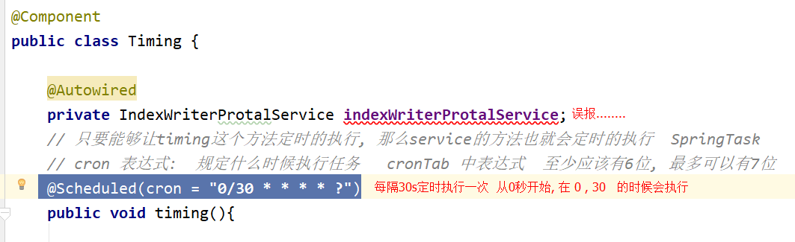


## 6. 引入SpringTask定时器

>  SpringTask是spring3.0后自主提供的定时任务的工具, spring-task，可以将它比作一个轻量级的Quartz，而且使用起来很简单，除spring相关的包外不需要额外的包，而且**支持注解**和配置文件两种形式。这里主要介绍SpringTask的注解使用方式:

* 1) 其本身就是spring的一部分, 顾不需要导入任何额外的包, 只需要添加定时任务相关的xml约束即可

```xml
xmlns:task="http://www.springframework.org/schema/task"
 
http://www.springframework.org/schema/task
http://www.springframework.org/schema/task/spring-task-4.0.xsd
```

* 2) 建议重新创建一个配置文件, 以方便管理: applicationContext-Task.xml
  * 其配置文件完整的内容如下, 使用时直接复制即可

```xml
<?xml version="1.0" encoding="UTF-8"?>
<beans xmlns="http://www.springframework.org/schema/beans"
       xmlns:xsi="http://www.w3.org/2001/XMLSchema-instance"
       xmlns:task="http://www.springframework.org/schema/task"
       xmlns:context="http://www.springframework.org/schema/context"
       xsi:schemaLocation="http://www.springframework.org/schema/beans http://www.springframework.org/schema/beans/spring-beans-4.0.xsd
         http://www.springframework.org/schema/task http://www.springframework.org/schema/task/spring-task-4.0.xsd
        http://www.springframework.org/schema/context http://www.springframework.org/schema/context/spring-context-4.0.xsd">

<!-- 扫描包, 用于扫描定时执行的任务的类的包 -->
    <context:component-scan base-package="com.itheima.gossip.timing"></context:component-scan>

<!--开启定时任务的注解方式-->
    <task:annotation-driven/>
</beans>
```

* 3) 在对应的任务类中的方法上添加@Scheduled 注解, 并设置定时执行的时机
  * 注意: 任务类必须在spring的容器中, 否则@Scheduled不起效

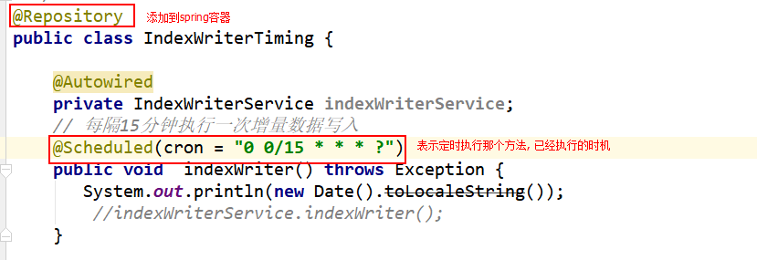

*******

* 扩展: cron 表达式 :   在shell中crontab表达式中第一位是分钟

  一个cron表达式有至少6个（也可能7个）用空格分隔的时间元素。

```
按顺序依次为
      1. 秒（0~59）
      2. 分钟（0~59）
      3. 小时（0~23）
      4. 天（0~31）
      5. 月（0~11）
      6. 星期（1~7 1为SUN-依次为SUN，MON，TUE，WED，THU，FRI，SAT）
      7. 年份（1970－2099）
```

```
其中每个元素可以是一个值(如6),一个连续区间(9-12),一个间隔时间(8-18/4)(/表示每隔多长时间),一个列表(1,3,5),通配符。
由于"月份中的日期"和"星期中的日期"这两个元素互斥的,必须要对其中一个设置?.
       0 0 10,14,16 * * ? 每天上午10点，下午2点，4点
       0 0/30 9-17 * * ?   朝九晚五工作时间内每半小时
       0 0 12 ? * WED 表示每个星期三中午12点
       0 0 12 * * ? 每天中午12点触发
       0 15 10 ? * * 每天上午10:15触发
       0 15 10 * * ? 每天上午10:15触发
       0 15 10 * * ? * 每天上午10:15触发
       0 15 10 * * ? 2005 2005年的每天上午10:15触发
       0 * 14 * * ? 在每天下午2点到下午2:59期间的每1分钟触发
       0 0/5 14 * * ? 在每天下午2点到下午2:55期间的每5分钟触发
       0 0/5 14,18 * * ? 在每天下午2点到2:55期间和下午6点到6:55期间的每5分钟触发
       0 0-5 14 * * ? 在每天下午2点到下午2:05期间的每1分钟触发
       0 10,44 14 ? 3 WED 每年三月的星期三的下午2:10和2:44触发
       0 15 10 ? * MON-FRI 周一至周五的上午10:15触发
       0 15 10 15 * ? 每月15日上午10:15触发
       0 15 10 L * ? 每月最后一日的上午10:15触发
       0 15 10 ? * 6L 每月的最后一个星期五上午10:15触发
       0 15 10 ? * 6L 2002-2005 2002年至2005年的每月的最后一个星期五上午10:15触发
       0 15 10 ? * 6#3 每月的第三个星期五上午10:15触发
       有些子表达式能包含一些范围或列表
       例如：子表达式（天（星期））可以为 “MON-FRI”，“MON，WED，FRI”，“MON-WED,SAT”
       “*”字符代表所有可能的值
       “/”字符用来指定数值的增量
       例如：在子表达式（分钟）里的“0/15”表示从第0分钟开始，每15分钟
                在子表达式（分钟）里的“3/20”表示从第3分钟开始，每20分钟（它和“3，23，43”）的含义一样
       “？”字符仅被用于天（月）和天（星期）两个子表达式，表示不指定值
     	  当2个子表达式其中之一被指定了值以后，为了避免冲突，需要将另一个子表达式的值设为“？”
       “L” 字符仅被用于天（月）和天（星期）两个子表达式，它是单词“last”的缩写
       	如果在“L”前有具体的内容，它就具有其他的含义了。例如：“6L”表示这个月的倒数第６天
       	注意：在使用“L”参数时，不要指定列表或范围，因为这会导致问题
       W 字符代表着平日(Mon-Fri)，并且仅能用于日域中。它用来指定离指定日的最近的一个平日。
       	  大部分的商业处理都是基于工作周的，所以 W 字符可能是非常重要的。
		  假如15号是星期六，那么 trigger 会在14号(星期五)触发，因为星期四比星期一离15号更近。
       #:用于确定每个月第几个星期几，只能出现在DayofMonth域。例如在4#2，表示某月的第二个星期三。
```

http://cron.qqe2.com/


常见错误1:

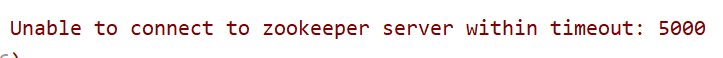

>  说明zookeeper的连接是异常: 无法连接zookeeper
>
> ​	原因:  ip错误  端口号的问题  防火墙的问题  zookeeper没有开启

常见错误2:

如果打开dubbo-admin管理中心, 发现如果没有服务的注册内容:

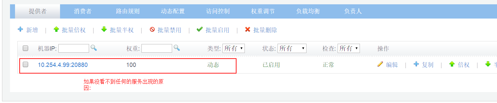

* 1) 服务的项目没有启动 (服务项目的tomcat没有启动)
* 2) 服务项目中dubbox的包扫描是有问题的
* 3) 服务类中没有添加@service注解或者是这个注解的包导错了
* 4) web.xml中是不是没有加载配置文件

常见错误3: 

当定时执行任务的时候: 发现程序没有一直往下执行

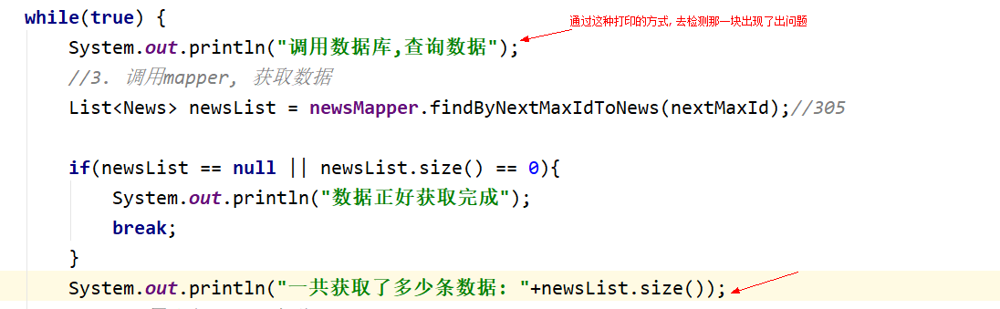

> 发现是数据库无法查询到数据, 执行此处时出现阻塞现象, 此时一般出现原因,都是连接数据的参数出现了问题


常见错误4:

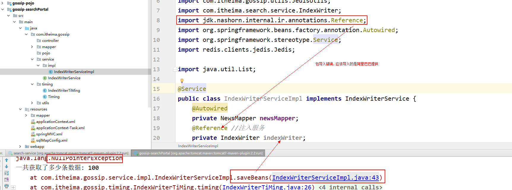


参见错误5:

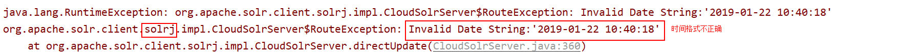

> 时间格式错误, 忽略掉solrj的时间格式的问题, 在solrj中时间格式是采用utc格式  
>
> ​	格式:  yyyy-MM-dd'T'HH:mm:ss'Z'
>
> 解决方案:  使用时间转换工具将其转换为utc格式

常见错误6:

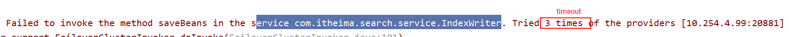

> 出现的原因:  dubbox的调用超时报错   3 times  或者 timeout        
>
> ​	dubbox在调用远程服务的时候, 默认要求服务端在1s内必须调用成功, 如果1s无法调用成功, dubbox会重试3次, 如果3次内还是无法调用, 就会报上述的错误
>
> solrj在写入索引的时候, 1s内无法将数据写入, 所以报错
>
>   解决方案: 将dubbox默认调用的等待时间变长  
>
> ​	只需要在消费端注入服务的注解上添加一个属性 timeout 

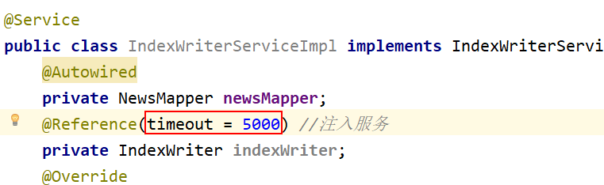

> 这种解决方案, 只是为了解决这个服务调用时间, 如果有其他的服务, 其他服务依旧为1s

常见错误7:  服务无法注入

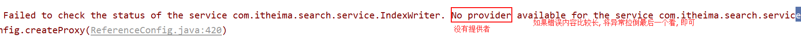

>  异常解决快捷方式:
>
>  ​	如果异常比较长, 需要下拉到最后一个Caused by中查看异常信息
>
>  出现的原因: 
>
>  ​	在服务端中检测:
>
>  ​	1)  @service注解丢失
>
>  ​	2)  @service注解导入错误 , 正确导入的包为ali提供的包
>
>  ​	3)  applicationContext.xml中dubbox扫描包, 无法扫描到这个包下面的类
>
>  ​	4) 是否没有启动服务


常见错误8 : no live solrServer

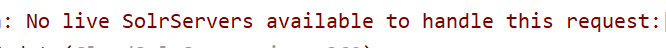

> 出现的原因:   没有一个活着的solr节点
>
> ​	1) solrCloud压根就没有启动
>
> ​	2) solrCloud集体宕机了
>
> 解决方案:  重启


如果今天出现的异常不是上述的异常. 先将整个项目安装一遍, 在重新测试, 如果出现异常依然不是, 那么寻求帮助

现在如果想要整体测试一次代码?

* 1) 打开虚拟机3台
* 2) 开启redis(保证爬虫和程序)
* 3) 保证mysql开启
* 4) zookeeper集群是否 启动正常
* 5) solrCloud集群是否开启正常
* 6) 可选(dubbox-admin) : 检测是否有服务发布'
* 7) 启动service工程, 查看dubbox的管理中心, 是否服务发布成功
* 8) 启动门户工程,等待定时执行

