# day10_search_搜索实现

课前回顾:

* dubbo-admin: dubbo的管理中心
* 搜索服务项目的搭建: 主要和solrCloud打交道
* SSM门户项目搭建:
* 增量式的定时写入索引操作:
  * 在门户端:
    * 1) 应该有一个定时器: 定时的执行service的写入索引方法
    * 2) 在service层:
      * 2.1) 从redis中获取上一次的最大id值, 如果没有设置为 0
      * 2.2) 通过mapper到数据库中查询数据(100)
      * 2.3) 将这个数据中time的时间格式 转换为 UTC格式
      * 2.4) 将这个转换后的数据, 调用服务写入索引数据
      * 2.5) 获取本次数据中的最大id值
      * 2.6) 循环的获取下一次的数据, 直到将表中的所有数据获取完成
      * 2.7) 将最后一次的id值 保存到redis中
  * 3) 在服务端:
    * 3.1) 从spring的容器中 获取 solrServer对象
    * 3.2) 执行 addBeans的方法, 添加原始数据
    * 3.3) 开始执行提交操作: commit

今日内容:

* 1)  分页查询数据, 展示前端
* 2) 高亮展示关键词
* 3) 实现搜索工具的查询(多条件查询)
* 4) 热搜关键词的展示
* 5) 根据热搜关键词查询数据

> 重新测试写入索引的代码的流程:
>
> ​	1) 开启redis(142)
>
> ​	2) 开启zookeeper集群: 使用脚本(141)
>
> ​	3) 开启solrCloud集群: 使用脚本(141)
>
> ​	4) 开启dubbo-admin管理中心(可选的): 141
>
> ​	5) 检测mysql是否正常启动
>
> ​	6) 开启服务端工程
>
> ​	7) 开启门户端工程


## 1. 分页查询数据

### 1.1  流程分析


### 1.2 准备工作

* 1) 将资料中的两个工具类导入到gossip-pojo中

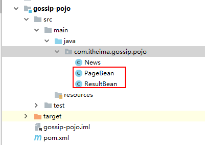

* 2) 需要将gossip-pojo  安装一下

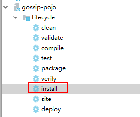

### 1.3  搜索服务项目代码实现

* 1)   在  search-interface 中 建立一个接口类:  indexSearcherService接口
  * 包路径: com.itheima.search.service

```java
package com.itheima.search.service;

import com.itheima.gossip.pojo.ResultBean;

public interface IndexSearcherService {

    public ResultBean findByPage(ResultBean resultBean) throws Exception;

}

```

* 2)  在search-service中 建立实现类: IndexSearcherServiceImpl
  * 包路径:  com.itheima.search.service.impl

```java
package com.itheima.search.service.impl;

import com.alibaba.dubbo.config.annotation.Service;
import com.itheima.gossip.pojo.News;
import com.itheima.gossip.pojo.PageBean;
import com.itheima.gossip.pojo.ResultBean;
import com.itheima.search.service.IndexSearcherService;
import org.apache.solr.client.solrj.SolrQuery;
import org.apache.solr.client.solrj.SolrServer;
import org.apache.solr.client.solrj.response.QueryResponse;
import org.apache.solr.common.SolrDocument;
import org.apache.solr.common.SolrDocumentList;
import org.springframework.beans.factory.annotation.Autowired;

import java.text.SimpleDateFormat;
import java.util.ArrayList;
import java.util.Date;
import java.util.List;

@Service
public class IndexSearcherServiceImpl implements IndexSearcherService {
    @Autowired
    private SolrServer solrServer;

    @Override
    public ResultBean findByPage(ResultBean resultBean) throws Exception {

        //1. 封装查询的条件:  SolrQuery
        //1.1 主入口的条件: 根据关键词查询
        SolrQuery solrQuery = new SolrQuery(resultBean.getKeywords());
        //1.2 分页的条件
        Integer page = resultBean.getPageBean().getPage();
        Integer pageSize = resultBean.getPageBean().getPageSize();

        solrQuery.setStart( (page -1)*pageSize );
        solrQuery.setRows(pageSize);

        //2. 执行查询操作
        QueryResponse response = solrServer.query(solrQuery);

        //3. 封装数据 : pageBean
        PageBean pageBean = resultBean.getPageBean();
        //3.1 封装每页的数据
        //List<News> newsList = response.getBeans(News.class); // 封装不成功的, 因为有一个time字段是date, 但是pojo是string
        SolrDocumentList documentList = response.getResults();
        SimpleDateFormat format1 = new SimpleDateFormat("yyyy-MM-dd HH:mm:ss" );
        List<News>  newsList = new ArrayList<>();
        for (SolrDocument document : documentList) {
            String id = (String) document.get("id");
            String title = (String)document.get("title");
            Date date = (Date) document.get("time");
            String source =(String) document.get("source");
            String content =(String) document.get("content");
            String editor = (String) document.get("editor");
            String docurl = (String) document.get("docurl");

            News news = new News();

            news.setId(id);
            news.setTitle(title);

            String newTime = format1.format(date);
            news.setTime(newTime);

            news.setSource(source);
            news.setContent(content);
            news.setEditor(editor);
            news.setDocurl(docurl);

            newsList.add(news);
        }

        pageBean.setNewsList(newsList);

        //3.2 总条数封装
        Long pageCount = documentList.getNumFound();

        pageBean.setPageCount(pageCount.intValue());

        //3.3 封装 总页数:
        Double pageNumber = Math.ceil((double) pageCount / pageSize);

        pageBean.setPageNumber(pageNumber.intValue());


        //4. 将封装好pageBean对象, 设置到resultBean中
        resultBean.setPageBean(pageBean);

        return resultBean;
    }
}

```

* 3) 将search-interface 安装一下

* 4) 启动服务端即可

### 1.4 门户端代码实现

#### 1.4.1  service层代码实现

* 1)  在门户端的service包下, 建立一个接口类: IndexSearcherProtalService
  * 包路径: com.itheima.gossip.service

```java
package com.itheima.gossip.service;

import com.itheima.gossip.pojo.ResultBean;

public interface IndexSearcherProtalService {

    public ResultBean findByPage(ResultBean resultBean) throws Exception;

}

```

* 2)  在门户端的service的impl包下.  建立一个实现类:  IndexSearcherProtalServiceImpl

```.java
package com.itheima.gossip.service.impl;

import com.alibaba.dubbo.config.annotation.Reference;
import com.itheima.gossip.pojo.ResultBean;
import com.itheima.gossip.service.IndexSearcherProtalService;
import com.itheima.search.service.IndexSearcherService;
import org.springframework.stereotype.Service;

@Service
public class IndexSearcherProtalServiceImpl implements IndexSearcherProtalService {
    @Reference
    private IndexSearcherService indexSearcherService;

    @Override
    public ResultBean findByPage(ResultBean resultBean) throws Exception {
        //1. 调用搜索服务, 查询数据
        resultBean = indexSearcherService.findByPage(resultBean);

        //2. 执行相关操作

        //3. 返回给controller
        return resultBean;
    }
}

```

#### 1.4.2 controller层代码实现

* 1) 在门户端的controller包下, 创建一个 IndexSearcherProtalController类

```java
package com.itheima.gossip.controller;

import com.itheima.gossip.pojo.PageBean;
import com.itheima.gossip.pojo.ResultBean;
import com.itheima.gossip.service.IndexSearcherProtalService;
import org.springframework.beans.factory.annotation.Autowired;
import org.springframework.stereotype.Controller;
import org.springframework.web.bind.annotation.RequestMapping;
import org.springframework.web.bind.annotation.ResponseBody;

@Controller
public class IndexSearcherProtalController {

    @Autowired
    private IndexSearcherProtalService indexSearcherProtalService;

    @ResponseBody
    @RequestMapping("/s")
    public ResultBean findByPage(ResultBean resultBean) {
        try {
            //1. 验证前端参数是否传递正确
            if (resultBean == null) {
                //返回首页
                return new ResultBean("参数传递非法....请重新传递", false);
            }
            String keywords = resultBean.getKeywords();

            if (keywords == null || "".equals(keywords)) {
                //返回首页
                return new ResultBean("参数传递非法....请重新传递", false);
            }

            PageBean pageBean = resultBean.getPageBean();
            if (pageBean == null) {
                pageBean = new PageBean();
                resultBean.setPageBean(pageBean);
            }

            //2. 调用service查询数据:
            resultBean = indexSearcherProtalService.findByPage(resultBean);
        } catch (Exception e) {
            e.printStackTrace();
        }

        return resultBean;
    }


}

```

* 2) 修改 gossip-pojo中pageBean类中: page  和 pageSize的默认值

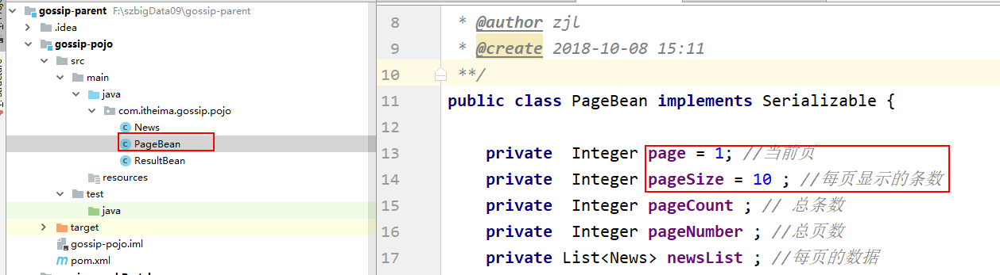

* 3) 安装之前, 停止之前启动service服务端, 安装一下 gossip-pojo工程
* 4)  启动service服务工程
* 5)  启动门户工程

### 1.5 测试后端代码是否成功

* 1) 在浏览器中输入:  http://localhost:9002/s.action?keywords=angelababy

> 发现:  时间比原时间 多了 8个小时, 应该-8小时操作
>
> 解决方案: 在门户端的service层中 对数据进行处理

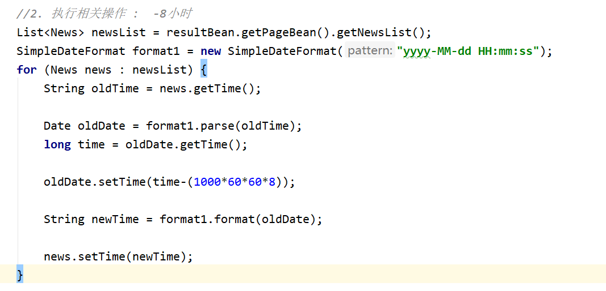

* 2) 测试 分页查询操作: http://localhost:9002/s.action?keywords=angelababy&pageBean.page=1&pageBean.pageSize=5

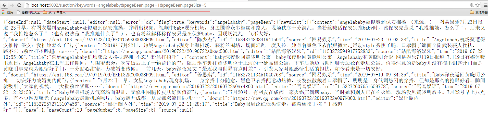

### 1.6 前端代码实现

* 1) 需要先资料中提供的静态页面放置到门户端的webapp下面

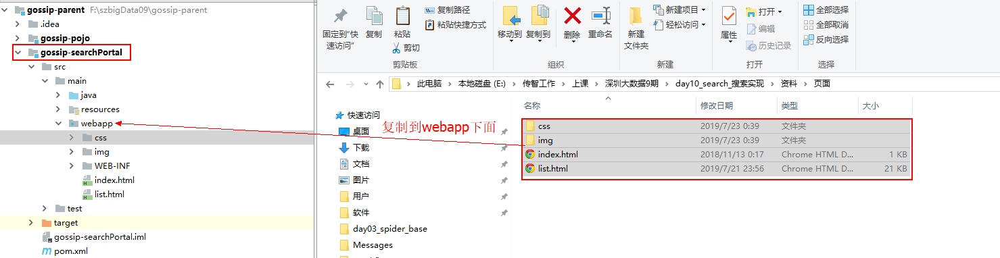


* 2) 修改list.html中搜索的form表单内容

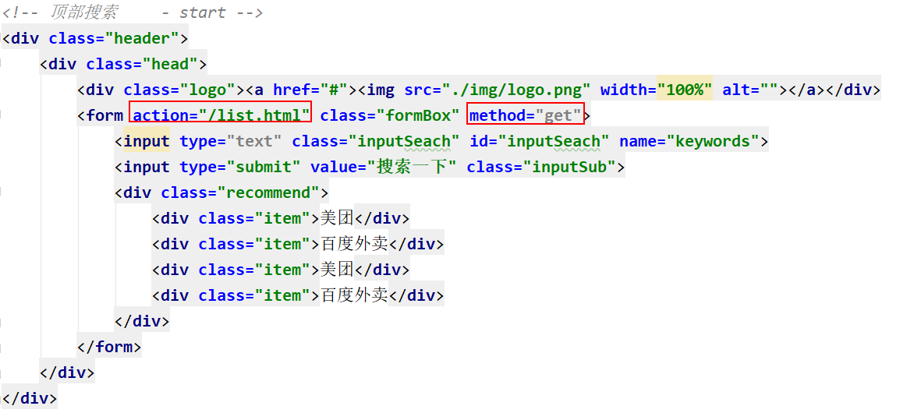

* 3) 删除list.html中新闻的列表页的数据:

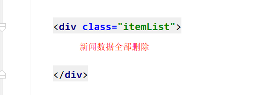

* 4) 删除 list.html静态的分页条: 

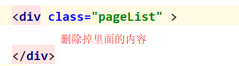

* 5) 在文档的最后面编写js代码: 代码如下

```javascript
<script>

    //1. 页面加载完成后, 获取url上关键词数据 :  js : BOM(浏览器对象)  DOM(文档对象)  SCMAScript(基本语法)
    // ?keywords=刘德华
    var parmas = location.search;

    //2. 切割请求参数, 获取=后面的值
    var keywords = parmas.split("=")[1]; // 如果是中文, 会进行url编码

    //3. url的解码操作
    keywords = decodeURI(keywords)

    //4. 回显到页面中
    $("#inputSeach").val(keywords)

    //5. 发送异步请求
    ajaxQuery(1,12);


    // 执行异步请求的方法
    function ajaxQuery(page,pageSize) {
        //5.1 从文本框中获取用户输入的关键词
        var keywords = $("#inputSeach").val();

        var url = "/s.action"
        var param = {"keywords": keywords,"pageBean.page":page,"pageBean.pageSize":pageSize};
        //5.2 发送异步请求
        $.post(url, param, function (data) { // data:  resultBean对象

            //5.2.1: 获取返回的数据中状态信息: 如果为false. 给用户提示错误信息, 并跳转到首页
            var flag = data.flag;
            if (!flag) {
                // 如果为false, 表示, 请求失败了
                alert(data.error)
                location.href = "/index.html"
                return;
            }

            //5.2.2: 获取 newsList的数据
            var newsList = data.pageBean.newsList;

            //5.2.3 : 遍历newsList, 拼接数据的div列表
            var divStr = ""
            $(newsList).each(function () {
                    // this 表示的当前遍历对象: news对象
                /*
                 <div class="item">
                        <div class="title"><a href="#">北京传智播客教育科技股份有限公司</a></div>
                        <div class="contentInfo_src">
                            <a href="#"></a>
                            <div class="infoBox">
                                <p class="describe">
                                    大数据学习已然成为时代所趋，相较于目前市面上的书籍及学习视频，大数据培训更适用于对大数据感兴趣的人群，通过培训老师丰富的大数据实战经验分享，
                                    能在大数据初期学习中，少走很多弯路，后期的项目实战，结合企业及时下大数据热门应用，可快速接轨大数据发展方向。
                                </p>
                                <p><a class="showurl" href="www.itcast.cn">www.itcast.cn 2018-08</a> <span class="lab">隔壁老王 - 网易新闻</span>
                                </p>
                            </div>
                        </div>
                    </div>
                 */
                var docurl = this.docurl;
                docurl = docurl.substring(0,11)+"..."
                divStr+= "<div class=\"item\">\n" +
                    "                        <div class=\"title\"><a href=\""+this.docurl+"\">"+this.title+"</a></div>\n" +
                    "                        <div class=\"contentInfo_src\">\n" +
                    "                            <a href=\"#\"></a>\n" +
                    "                            <div class=\"infoBox\">\n" +
                    "                                <p class=\"describe\">\n" +
                    "                                   "+this.content+" \n" +
                    "                                    \n" +
                    "                                </p>\n" +
                    "                                <p><a class=\"showurl\" href=\""+this.docurl+"\">"+docurl+" "+this.time+"</a> <span class=\"lab\">"+this.editor+" - "+this.source+"</span>\n" +
                    "                                </p>\n" +
                    "                            </div>\n" +
                    "                        </div>\n" +
                    "                    </div>";

            });

            // 循环接收后: 将divStr设置到页面中
            //5.2.4:  将拼接好的新闻列表页的html  写入到页面中
            $(".itemList").html(divStr)

            // ------------------------以下内容为分页条的处理----------------------------------
            /*
            <ul>
                <li><a href="#">< 上一页</a></li>
                <li>1</li>
                <li>2</li>
                <li class="on">3</li>
                <li>4</li>
                <li>5</li>
                <li>6</li>
                <li>7</li>
                <li>下一页 ></li>
            </ul>
             */

            //  5.3 拼接分页条
            var page = data.pageBean.page;
            var pageNumber = data.pageBean.pageNumber;
            var  pageUi = "<ul>"
            // 添加首页

            pageUi+= "<li onclick = 'ajaxQuery(1,12)'><a href='#'>首 页</a></li>";
            //5.3.1: 拼接 上一页
            if(page > 1){
                pageUi+= "<li  onclick = 'ajaxQuery("+(page-1)+",12)' ><a href='#'>< 上一页</a></li>";
            }

            //5.3.2: 拼接  页码
            //  5.3.2.1  如果总页数 小于等于 7 的, 展示 所有的页码
            if(pageNumber <=7){
                for(var i = 1 ; i <= pageNumber ; i++){

                    if(page == i){
                        pageUi+="<li class='on'>"+i+"</li>";
                    }else{
                        pageUi+="<li onclick = 'ajaxQuery("+i+",12)' >"+i+"</li>";
                    }
                }

            }else {
                // 5.3.2.2 : 如果总页数大于7页的,  当前页 在 1~4范围, 展示 !~7

                if(page<=4){

                    for(var i = 1 ; i <= 7 ; i++){

                        if(page == i){
                            pageUi+="<li class='on'>"+i+"</li>";
                        }else{
                            pageUi+="<li onclick = 'ajaxQuery("+i+",12)' >"+i+"</li>";
                        }
                    }
                }

                // 5.3.2.2 : 如果总页数大于7页的,  当前页 大于4并且小于总页数-2范围, 展示 当前页-3 ~ 当前页 +3
                if(page>4 && page <(pageNumber-2)){

                    for(var i = (page-3) ; i <= (page+3) ; i++){

                        if(page == i){
                            pageUi+="<li class='on'>"+i+"</li>";
                        }else{
                            pageUi+="<li onclick = 'ajaxQuery("+i+",12)' >"+i+"</li>";
                        }
                    }
                }

                // 5.3.2.3 : 如果总页数大于7页的,  当前页+3 大于总页数, 展示 总页数-7 ~ 总页数
                if((page+3) > pageNumber){

                    for(var i = (pageNumber-7) ; i <= pageNumber ; i++){

                        if(page == i){
                            pageUi+="<li class='on'>"+i+"</li>";
                        }else{
                            pageUi+="<li onclick = 'ajaxQuery("+i+",12)' >"+i+"</li>";
                        }
                    }
                }
            }


            //5.3.3: 拼接 下一页
            if(pageNumber > page){
                pageUi+="<li onclick = 'ajaxQuery("+(page+1)+",12)' ><a href='#'>下一页 ></a> </li>"
            }

            // 添加尾页:
            pageUi+= "<li onclick = 'ajaxQuery("+pageNumber+",12)'><a href='#'>尾 页</a></li>";

            pageUi +="</ul>"

            //5.4 将pageUi 设置到页面中
            $(".pageList").html(pageUi)

        }, "json");

    }


</script>
```


## 2. 高亮展示数据

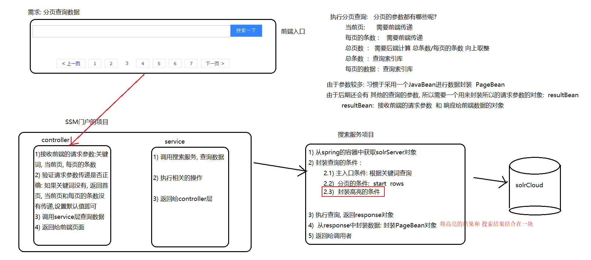

​	由于高亮只需要在服务端中添加高亮的条件 和 将高亮内容封装到查询结果中即可, 故只需要修改服务端代码,即可测试

### 2.1 服务端代码编写

* 1) 在服务端search-service工程中: IndexSearcherServiceImpl中findbypage方法中

  * 1.1) 在封装条件中, 添加高亮的条件

  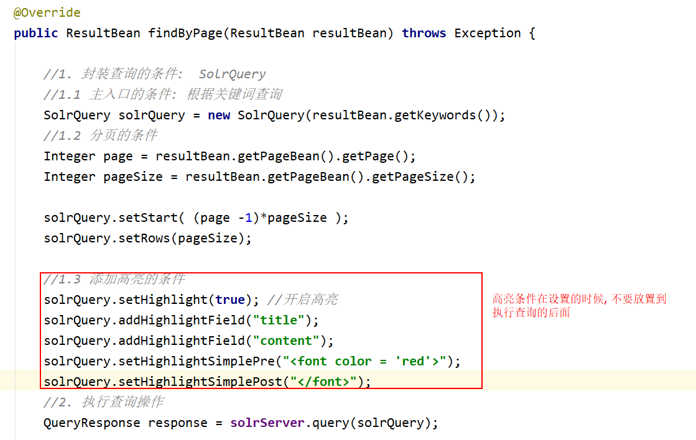

  * 1.2) 在封装数据中, 高亮的内容, 封装到结果数据中

  ```java
  Map<String, Map<String, List<String>>> highlighting = response.getHighlighting(); //高亮的结果内容
  
          SimpleDateFormat format1 = new SimpleDateFormat("yyyy-MM-dd HH:mm:ss" );
          List<News>  newsList = new ArrayList<>();
          for (SolrDocument document : documentList) {
              String id = (String) document.get("id");
              String title = (String)document.get("title");
              Date date = (Date) document.get("time");
              String source =(String) document.get("source");
              String content =(String) document.get("content");
              String editor = (String) document.get("editor");
              String docurl = (String) document.get("docurl");
  
              Map<String, List<String>> listMap = highlighting.get(id);
              List<String> list = listMap.get("title");
              if(list != null && list.size() > 0 ){
                  // 有高亮的内容
                  title = list.get(0);
              }
              list = listMap.get("content");
              if(list != null && list.size() > 0 ){
                  // 有高亮的内容
                  content = list.get(0);
              }else {
                  // 如果content没有高亮的内容, 应该对原有数据, 进行截取操作
                  int size = content.length();
                  if(size >100){
                      content = content.substring(0,99)+"......";
                  }
              }
  
              News news = new News();
  
              news.setId(id);
              news.setTitle(title);
  
              String newTime = format1.format(date);
              news.setTime(newTime);
  
              news.setSource(source);
              news.setContent(content);
              news.setEditor(editor);
              news.setDocurl(docurl);
  
  
              newsList.add(news);
          }
  ```

* 2) 放置一份完整的服务端代码

```java
package com.itheima.search.service.impl;

import com.alibaba.dubbo.config.annotation.Service;
import com.itheima.gossip.pojo.News;
import com.itheima.gossip.pojo.PageBean;
import com.itheima.gossip.pojo.ResultBean;
import com.itheima.search.service.IndexSearcherService;
import org.apache.solr.client.solrj.SolrQuery;
import org.apache.solr.client.solrj.SolrServer;
import org.apache.solr.client.solrj.response.QueryResponse;
import org.apache.solr.common.SolrDocument;
import org.apache.solr.common.SolrDocumentList;
import org.springframework.beans.factory.annotation.Autowired;

import java.text.SimpleDateFormat;
import java.util.ArrayList;
import java.util.Date;
import java.util.List;
import java.util.Map;

@Service
public class IndexSearcherServiceImpl implements IndexSearcherService {
    @Autowired
    private SolrServer solrServer;

    @Override
    public ResultBean findByPage(ResultBean resultBean) throws Exception {

        //1. 封装查询的条件:  SolrQuery
        //1.1 主入口的条件: 根据关键词查询
        SolrQuery solrQuery = new SolrQuery(resultBean.getKeywords());
        //1.2 分页的条件
        Integer page = resultBean.getPageBean().getPage();
        Integer pageSize = resultBean.getPageBean().getPageSize();

        solrQuery.setStart( (page -1)*pageSize );
        solrQuery.setRows(pageSize);

        //1.3 添加高亮的条件
        solrQuery.setHighlight(true); //开启高亮
        solrQuery.addHighlightField("title");
        solrQuery.addHighlightField("content");
        solrQuery.setHighlightSimplePre("<font color = 'red'>");
        solrQuery.setHighlightSimplePost("</font>");
        //2. 执行查询操作
        QueryResponse response = solrServer.query(solrQuery);

        //3. 封装数据 : pageBean
        PageBean pageBean = resultBean.getPageBean();
        //3.1 封装每页的数据
        //List<News> newsList = response.getBeans(News.class); // 封装不成功的, 因为有一个time字段是date, 但是pojo是string
        SolrDocumentList documentList = response.getResults(); // 搜索结果数据
        Map<String, Map<String, List<String>>> highlighting = response.getHighlighting(); //高亮的结果内容

        SimpleDateFormat format1 = new SimpleDateFormat("yyyy-MM-dd HH:mm:ss" );
        List<News>  newsList = new ArrayList<>();
        for (SolrDocument document : documentList) {
            String id = (String) document.get("id");
            String title = (String)document.get("title");
            Date date = (Date) document.get("time");
            String source =(String) document.get("source");
            String content =(String) document.get("content");
            String editor = (String) document.get("editor");
            String docurl = (String) document.get("docurl");

            Map<String, List<String>> listMap = highlighting.get(id);
            List<String> list = listMap.get("title");
            if(list != null && list.size() > 0 ){
                // 有高亮的内容
                title = list.get(0);
            }
            list = listMap.get("content");
            if(list != null && list.size() > 0 ){
                // 有高亮的内容
                content = list.get(0);
            }else {
                // 如果content没有高亮的内容, 应该对原有数据, 进行截取操作
                int size = content.length();
                if(size >100){
                    content = content.substring(0,99)+"......";
                }
            }

            News news = new News();

            news.setId(id);
            news.setTitle(title);

            String newTime = format1.format(date);
            news.setTime(newTime);

            news.setSource(source);
            news.setContent(content);
            news.setEditor(editor);
            news.setDocurl(docurl);


            newsList.add(news);
        }

        pageBean.setNewsList(newsList);

        //3.2 总条数封装
        Long pageCount = documentList.getNumFound();

        pageBean.setPageCount(pageCount.intValue());

        //3.3 封装 总页数:
        Double pageNumber = Math.ceil((double) pageCount / pageSize);

        pageBean.setPageNumber(pageNumber.intValue());


        //4. 将封装好pageBean对象, 设置到resultBean中
        resultBean.setPageBean(pageBean);

        return resultBean;
    }
}

```

* 3) 重启启动 服务端 和门户端, 在页面中检测即可


> 为什么添加高亮后, 对应字段中数据, 出现丢失的问题:
>
> ​	solr在对字段进行高亮的时候, 默认只对字段的前100个字进行高亮, 如果在前100个字当中没有找到高亮的内容, 还会接着寻找后续文档中是否有高亮的数据, 如果有, 那么就在高亮的内容两边各截取50个字, 给用户返回来即可
>
> ​	如何修改默认对前100个字高亮的设置呢?
>
> ​		solrQuery.setHighlightFragsize(300);

## 3. 搜索工具实现

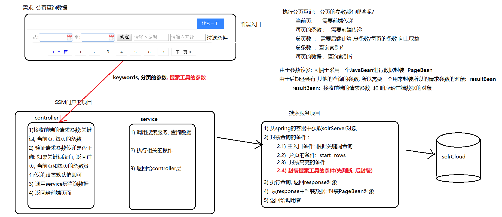

​	搜索工具: 需要前端传递搜索工具的参数, 服务端, 需要判断搜索工具中是否有数据, 如果有数据就进行过滤查询, 而对于门户端, 则不需要做任何操作

### 3.1 搜索服务代码编写

* 1) 在search-service工程中, indexSearcherServiceImpl类的findByPage的方法中添加如下内容

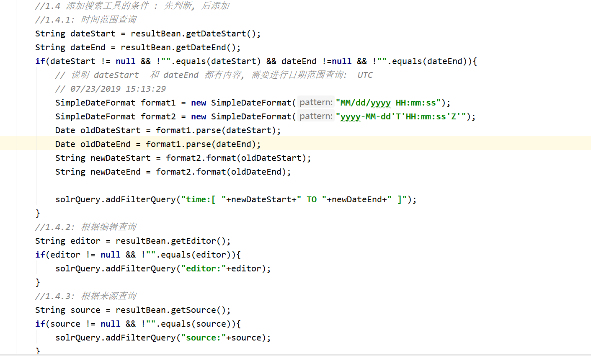

* 2) 放置一份完整服务端代码

```java
package com.itheima.search.service.impl;

import com.alibaba.dubbo.config.annotation.Service;
import com.itheima.gossip.pojo.News;
import com.itheima.gossip.pojo.PageBean;
import com.itheima.gossip.pojo.ResultBean;
import com.itheima.search.service.IndexSearcherService;
import org.apache.solr.client.solrj.SolrQuery;
import org.apache.solr.client.solrj.SolrServer;
import org.apache.solr.client.solrj.response.QueryResponse;
import org.apache.solr.common.SolrDocument;
import org.apache.solr.common.SolrDocumentList;
import org.springframework.beans.factory.annotation.Autowired;

import java.text.SimpleDateFormat;
import java.util.ArrayList;
import java.util.Date;
import java.util.List;
import java.util.Map;

@Service
public class IndexSearcherServiceImpl implements IndexSearcherService {
    @Autowired
    private SolrServer solrServer;

    @Override
    public ResultBean findByPage(ResultBean resultBean) throws Exception {

        //1. 封装查询的条件:  SolrQuery
        //1.1 主入口的条件: 根据关键词查询
        SolrQuery solrQuery = new SolrQuery(resultBean.getKeywords());
        //1.2 分页的条件
        Integer page = resultBean.getPageBean().getPage();
        Integer pageSize = resultBean.getPageBean().getPageSize();

        solrQuery.setStart( (page -1)*pageSize );
        solrQuery.setRows(pageSize);

        //1.3 添加高亮的条件
        solrQuery.setHighlight(true); //开启高亮
        solrQuery.addHighlightField("title");
        solrQuery.addHighlightField("content");
        solrQuery.setHighlightSimplePre("<font color = 'red'>");
        solrQuery.setHighlightSimplePost("</font>");

        //1.4 添加搜索工具的条件 : 先判断, 后添加
        //1.4.1: 时间范围查询
        String dateStart = resultBean.getDateStart();
        String dateEnd = resultBean.getDateEnd();
        if(dateStart != null && !"".equals(dateStart) && dateEnd !=null && !"".equals(dateEnd)){
            // 说明 dateStart  和 dateEnd 都有内容, 需要进行日期范围查询:  UTC
            // 07/23/2019 15:13:29
            SimpleDateFormat format1 = new SimpleDateFormat("MM/dd/yyyy HH:mm:ss");
            SimpleDateFormat format2 = new SimpleDateFormat("yyyy-MM-dd'T'HH:mm:ss'Z'");
            Date oldDateStart = format1.parse(dateStart);
            Date oldDateEnd = format1.parse(dateEnd);
            String newDateStart = format2.format(oldDateStart);
            String newDateEnd = format2.format(oldDateEnd);

            solrQuery.addFilterQuery("time:[ "+newDateStart+" TO "+newDateEnd+" ]");
        }
        //1.4.2: 根据编辑查询
        String editor = resultBean.getEditor();
        if(editor != null && !"".equals(editor)){
            solrQuery.addFilterQuery("editor:"+editor);
        }
        //1.4.3: 根据来源查询
        String source = resultBean.getSource();
        if(source != null && !"".equals(source)){
            solrQuery.addFilterQuery("source:"+source);
        }

        //2. 执行查询操作
        QueryResponse response = solrServer.query(solrQuery);

        //3. 封装数据 : pageBean
        PageBean pageBean = resultBean.getPageBean();
        //3.1 封装每页的数据
        //List<News> newsList = response.getBeans(News.class); // 封装不成功的, 因为有一个time字段是date, 但是pojo是string
        SolrDocumentList documentList = response.getResults(); // 搜索结果数据
        Map<String, Map<String, List<String>>> highlighting = response.getHighlighting(); //高亮的结果内容

        SimpleDateFormat format1 = new SimpleDateFormat("yyyy-MM-dd HH:mm:ss" );
        List<News>  newsList = new ArrayList<>();
        for (SolrDocument document : documentList) {
            String id = (String) document.get("id");
            String title = (String)document.get("title");
            Date date = (Date) document.get("time");
            source =(String) document.get("source");
            String content =(String) document.get("content");
            editor = (String) document.get("editor");
            String docurl = (String) document.get("docurl");

            Map<String, List<String>> listMap = highlighting.get(id);
            List<String> list = listMap.get("title");
            if(list != null && list.size() > 0 ){
                // 有高亮的内容
                title = list.get(0);
            }
            list = listMap.get("content");
            if(list != null && list.size() > 0 ){
                // 有高亮的内容
                content = list.get(0);
            }else {
                // 如果content没有高亮的内容, 应该对原有数据, 进行截取操作
                int size = content.length();
                if(size >100){
                    content = content.substring(0,99)+"......";
                }
            }

            News news = new News();

            news.setId(id);
            news.setTitle(title);

            String newTime = format1.format(date);
            news.setTime(newTime);

            news.setSource(source);
            news.setContent(content);
            news.setEditor(editor);
            news.setDocurl(docurl);


            newsList.add(news);
        }

        pageBean.setNewsList(newsList);

        //3.2 总条数封装
        Long pageCount = documentList.getNumFound();

        pageBean.setPageCount(pageCount.intValue());

        //3.3 封装 总页数:
        Double pageNumber = Math.ceil((double) pageCount / pageSize);

        pageBean.setPageNumber(pageNumber.intValue());


        //4. 将封装好pageBean对象, 设置到resultBean中
        resultBean.setPageBean(pageBean);

        return resultBean;
    }
}

```

* 3) 启动服务工程和 门户工程

### 3.2 测试后端代码是否ok

* 测试路径: [http://localhost:9002/s.action?keywords=angelababy&pageBean.page=1&pageBean.pageSize=5&dateStart=07/23/2019 00:00:01&dataEnd=07/23/2019 23:12:30)

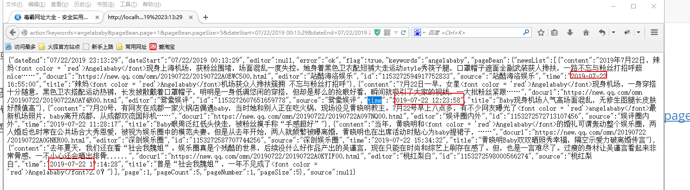

### 3.3 前端代码实现

* 1) 修改一下, list.html中热搜工具栏中内容

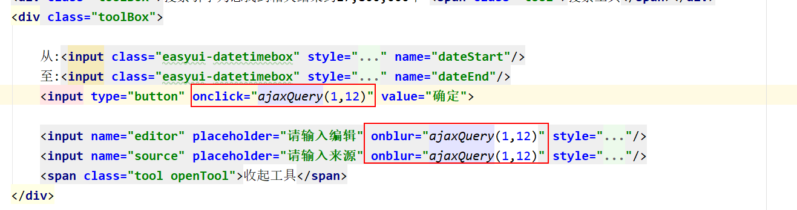

* 2) 修改 ajaxQuery方法中: 添加获取搜索工具的代码 已经 添加请求参数的内容

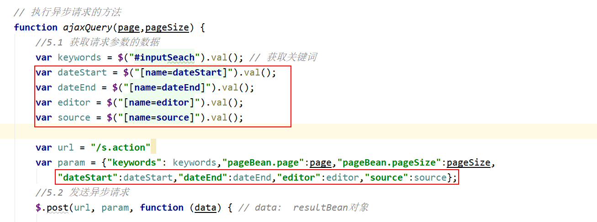

* 3) 测试, 是否可用


## 4. 热搜关键词展示

热搜词:  经常被用户所搜索到关键词

如何能够知道, 那些词语是用户经常搜索的词语?  通过记录用户搜索关键词的次数, 实时统计热搜数据

​	一般可以采用大数据的实时统计框架来处理:  storm, spark 

能否先自己造一些热搜数据, 后期学习完 storm后, 将自己造静态数据修改为通过storm实时统计出来的词语即可

热搜数据, 最终必然要找一个容器来存储起来, 那么请求需要寻找一个什么容器: 

​	热搜数据:  动态的一直改变,那么就需要一个容器支持高效率读写  : redis

​	热搜数据, 在展示的时候, 需要将频率最高的展示在最前面, 排名 :  sortedSet

```
静态的热搜数据:
    赵薇败诉                   3449233
    霍顿队友主动和孙杨握手        2458008
    水自由                      2228726
    230万用户完成携号转网        2135075	
    吴佩慈怀四胎                2086094
    霍顿父亲发声                1233284
    李沁造型                   1194326
    移动回应逝者手机号过户问题     1112676	
    强化严重精神障碍患者管理       1108352
    外交部回应孙杨夺冠霍顿拒上领奖台 1108239
    连续50天被夸奖的女孩子          1108218
    这个夏天最忙的三个人            917252
    baby回应机场事件              544254	
    孟美岐演碧瑶                   477143
    兄嫂本无缘 全靠我花钱           466879
    杨紫呼吁不要提前散播剧集         385405
    梁洛施                        384148


```

* 在门户层的test文件夹中将上述静态数据写入到redis中

```java
package com.itheima.test;

import com.itheima.gossip.utils.JedisUtils;
import redis.clients.jedis.Jedis;

public class TopKeyToRedis {

    public static void main(String[] args) {
        //1. 获取jedis对象
        Jedis jedis = JedisUtils.getJedis();

        //2. 执行添加到redis操作 : sortedSet

        jedis.zadd("bigData:gossip:topkey",3449233,"赵薇败诉");
        jedis.zadd("bigData:gossip:topkey",2458008,"霍顿队友主动和孙杨握手");
        jedis.zadd("bigData:gossip:topkey",2228726,"水自由");
        jedis.zadd("bigData:gossip:topkey",2135075,"230万用户完成携号转网");
        jedis.zadd("bigData:gossip:topkey",2086094,"吴佩慈怀四胎");
        jedis.zadd("bigData:gossip:topkey",1233284,"霍顿父亲发声");
        jedis.zadd("bigData:gossip:topkey",1194326,"李沁造型");
        jedis.zadd("bigData:gossip:topkey",1112676,"移动回应逝者手机号过户问题");
        jedis.zadd("bigData:gossip:topkey",1108352,"强化严重精神障碍患者管理");
        jedis.zadd("bigData:gossip:topkey",1108239,"外交部回应孙杨夺冠霍顿拒上领奖台");
        jedis.zadd("bigData:gossip:topkey",1108218,"连续50天被夸奖的女孩子");
        jedis.zadd("bigData:gossip:topkey",917252,"这个夏天最忙的三个人");
        jedis.zadd("bigData:gossip:topkey",544254,"baby回应机场事件");
        jedis.zadd("bigData:gossip:topkey",477143,"孟美岐演碧瑶");
        jedis.zadd("bigData:gossip:topkey",466879,"兄嫂本无缘全靠我花钱");
        jedis.zadd("bigData:gossip:topkey",385405,"杨紫呼吁不要提前散播剧集");
        jedis.zadd("bigData:gossip:topkey",384148,"梁洛施");

        //3. 释放资源
        jedis.close();

    }
}

```

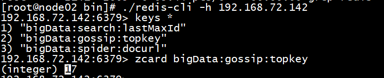


### 5.1 : 热搜展示的流程分析

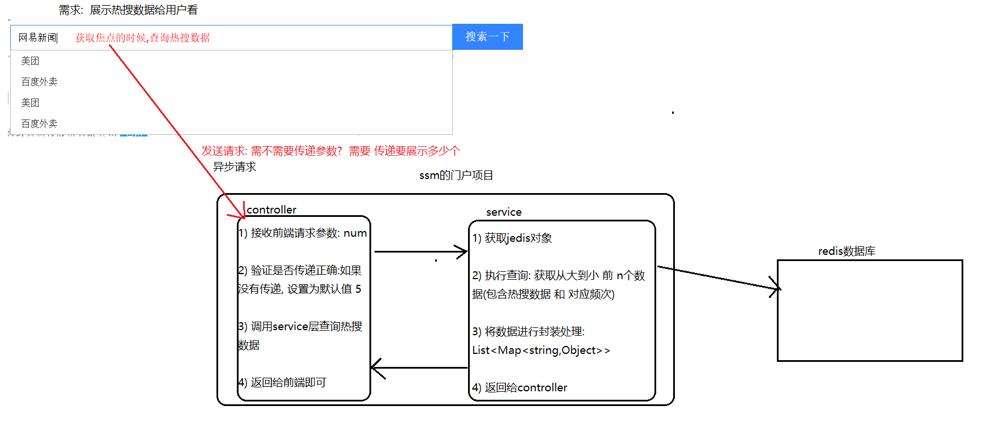

### 5.2 ssm门户代码编写

#### 5.2.1 service层代码实现

* 1) 在门户端的service的包下, 建立一个接口类: TopkeyService

```java
package com.itheima.gossip.service;

import java.util.List;
import java.util.Map;

public interface TopKeyService {

    public List<Map<String,Object>>  findByTopKey(Integer num);
}

```

* 2) 在门户端的service的impl包下, 建立一个实现类:  TopKeyServiceImpl

```java
package com.itheima.gossip.service.impl;
import org.springframework.stereotype.Service;
import com.itheima.gossip.service.TopKeyService;
import com.itheima.gossip.utils.JedisUtils;
import redis.clients.jedis.Jedis;
import redis.clients.jedis.Tuple;

import java.util.*;
@Service
public class TopKeyServiceImpl implements TopKeyService {


    @Override
    public List<Map<String, Object>> findByTopKey(Integer num) {
        //1. 获取jedis对象
        Jedis jedis = JedisUtils.getJedis();

        //2. 执行查询 : 从大到小 的 前 num个数据
        Set<Tuple> tuples = jedis.zrevrangeWithScores("bigData:gossip:topkey", 0, (num - 1));


        //3. 封装数据
        List<Map<String, Object>> mapList = new ArrayList<>();
        for (Tuple tuple : tuples) {

            String topKey = tuple.getElement();
            double score = tuple.getScore();

            Map<String,Object> map = new HashMap<>();

            map.put("topKey",topKey);
            map.put("score",score);

            mapList.add(map);

        }


        //4. 释放资源
        jedis.close();

        return mapList;
    }
}

```

#### 5.2.2 controller层代码编写

* 1) 在门户端的controller包下, 建立一个类: topKeyController

```java
package com.itheima.gossip.controller;

import com.itheima.gossip.service.TopKeyService;
import org.springframework.beans.factory.annotation.Autowired;
import org.springframework.stereotype.Controller;
import org.springframework.web.bind.annotation.RequestMapping;
import org.springframework.web.bind.annotation.ResponseBody;

import java.util.List;
import java.util.Map;

@Controller
public class TopKeyController {
    @Autowired
    private TopKeyService topKeyService;

    @RequestMapping("/top")
    @ResponseBody
    public List<Map<String,Object>>  findByTopKey(Integer num){
        //1. 验证 参数是否正确
        if(num == null){
            num = 5;
        }
        //2. 调用service层, 查询数据
        List<Map<String, Object>> mapList = topKeyService.findByTopKey(num);
        return mapList;
    }


}

```

* 2) 启动服务端和 门户端: 注意虽然热搜数据不会使用到服务端, 但是也是需要启动的, 因为其他的类中使用服务端

* 3) 测试后端代码是否OK?

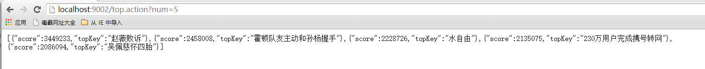

### 5.3 前端代码实现

* 1) 在搜索框中添加一个获取焦点事件:

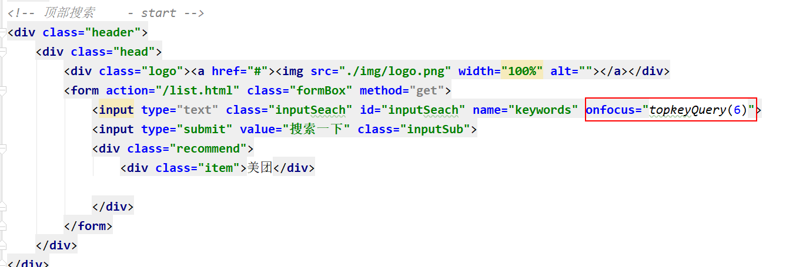

* 2) 删除 原有页面中热搜静态数据

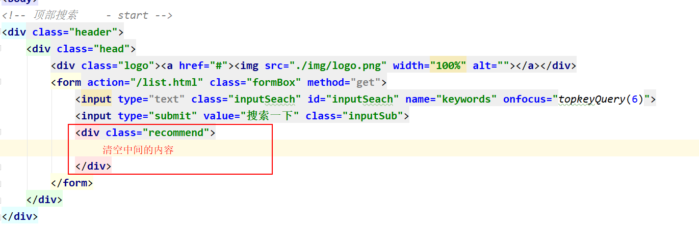

* 3) 在页面的最后面, 编写 topkeyQuery 函数

```java
 function topkeyQuery(num) {
        var url = "/top.action";
        var param = {"num":num};
        $.get(url,param,function(data){ // List<Map>
            // <div class="item">美团</div>

            var divStr = "";
            $(data).each(function () {
                // this 一个个map
                divStr += "<div class='item'><span>"+this.topKey+"</span><span style='float: right;color: red'>"+this.score+"</span></div>";
            })

            $(".recommend").html(divStr);


        },"json");

    }
```


结果内容:

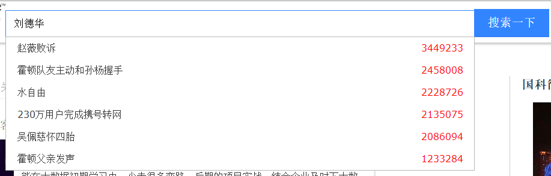

## 5. 根据热搜查询数据

​	根据热搜数据查询数据 , 其实就是原来分页查询数据操作, 只不过是不需要用户手动输入 ,直接点击对应关键词查询即可

​	所以, 不需要修改后端任何内容, 只需要让前端根据用户点击的关键词执行查询


如何能够动态的获取到用户点击的关键词呢?


## 6. 将编写好js抽取js的文件

* 1) 在门户端的webapp下面建立一个js的目录, 在js的目录下建立一个search.js的文件


* 2) 将自己写的js的代码截切到search.js的文件中
  * 注意: 不要将script标签截切过去, 因为script标签是html代码
* 3) 在list.html中引入search.js 即可

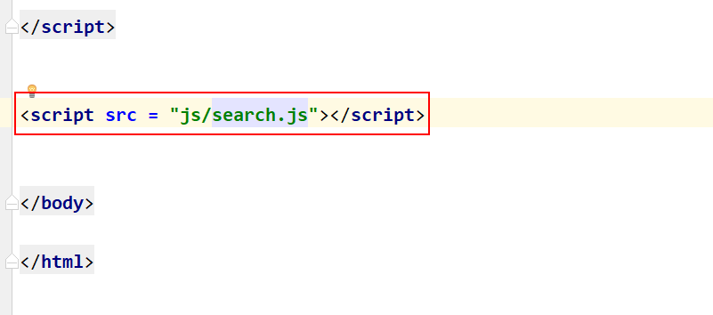

## 7. 将index.html 和list.html 结合在一起

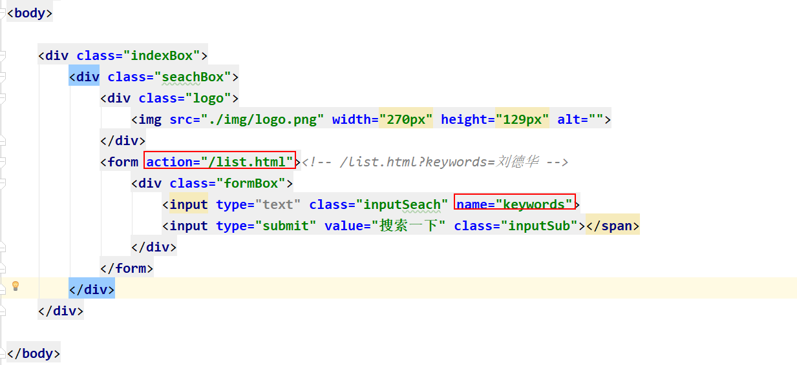


## 8. 完整的js代码

```javascript

//1. 页面加载完成后, 获取url上关键词数据 :  js : BOM(浏览器对象)  DOM(文档对象)  SCMAScript(基本语法)
// ?keywords=刘德华
var parmas = location.search;

//2. 切割请求参数, 获取=后面的值
var keywords = parmas.split("=")[1]; // 如果是中文, 会进行url编码
if(keywords == undefined){
    location="/index.html";
}
//3. url的解码操作
keywords = decodeURI(keywords)

//4. 回显到页面中
$("#inputSeach").val(keywords)

//5. 发送异步请求
ajaxQuery(1,12);


// 执行异步请求的方法
function ajaxQuery(page,pageSize) {
    //5.1 获取请求参数的数据
    var keywords = $("#inputSeach").val(); // 获取关键词
    var dateStart = $("[name=dateStart]").val();
    var dateEnd = $("[name=dateEnd]").val();
    var editor = $("[name=editor]").val();
    var source = $("[name=source]").val();

    var url = "/s.action"
    var param = {"keywords": keywords,"pageBean.page":page,"pageBean.pageSize":pageSize,
        "dateStart":dateStart,"dateEnd":dateEnd,"editor":editor,"source":source};
    //5.2 发送异步请求
    $.post(url, param, function (data) { // data:  resultBean对象

        //5.2.1: 获取返回的数据中状态信息: 如果为false. 给用户提示错误信息, 并跳转到首页
        var flag = data.flag;
        if (!flag) {
            // 如果为false, 表示, 请求失败了
            alert(data.error)
            location.href = "/index.html"
            return;
        }

        //5.2.2: 获取 newsList的数据
        var newsList = data.pageBean.newsList;

        //5.2.3 : 遍历newsList, 拼接数据的div列表
        var divStr = ""
        $(newsList).each(function () {
            // this 表示的当前遍历对象: news对象
            /*
             <div class="item">
                    <div class="title"><a href="#">北京传智播客教育科技股份有限公司</a></div>
                    <div class="contentInfo_src">
                        <a href="#"></a>
                        <div class="infoBox">
                            <p class="describe">
                                大数据学习已然成为时代所趋，相较于目前市面上的书籍及学习视频，大数据培训更适用于对大数据感兴趣的人群，通过培训老师丰富的大数据实战经验分享，
                                能在大数据初期学习中，少走很多弯路，后期的项目实战，结合企业及时下大数据热门应用，可快速接轨大数据发展方向。
                            </p>
                            <p><a class="showurl" href="www.itcast.cn">www.itcast.cn 2018-08</a> <span class="lab">隔壁老王 - 网易新闻</span>
                            </p>
                        </div>
                    </div>
                </div>
             */
            var docurl = this.docurl;
            docurl = docurl.substring(0,11)+"..."
            divStr+= "<div class=\"item\">\n" +
                "                        <div class=\"title\"><a href=\""+this.docurl+"\">"+this.title+"</a></div>\n" +
                "                        <div class=\"contentInfo_src\">\n" +
                "                            <a href=\"#\"></a>\n" +
                "                            <div class=\"infoBox\">\n" +
                "                                <p class=\"describe\">\n" +
                "                                   "+this.content+" \n" +
                "                                    \n" +
                "                                </p>\n" +
                "                                <p><a class=\"showurl\" href=\""+this.docurl+"\">"+docurl+" "+this.time+"</a> <span class=\"lab\">"+this.editor+" - "+this.source+"</span>\n" +
                "                                </p>\n" +
                "                            </div>\n" +
                "                        </div>\n" +
                "                    </div>";

        });

        // 循环接收后: 将divStr设置到页面中
        //5.2.4:  将拼接好的新闻列表页的html  写入到页面中
        $(".itemList").html(divStr)

        // ------------------------以下内容为分页条的处理----------------------------------
        /*
        <ul>
            <li><a href="#">< 上一页</a></li>
            <li>1</li>
            <li>2</li>
            <li class="on">3</li>
            <li>4</li>
            <li>5</li>
            <li>6</li>
            <li>7</li>
            <li>下一页 ></li>
        </ul>
         */

        //  5.3 拼接分页条
        var page = data.pageBean.page;
        var pageNumber = data.pageBean.pageNumber;
        var  pageUi = "<ul>"
        // 添加首页

        pageUi+= "<li onclick = 'ajaxQuery(1,12)'><a href='#'>首 页</a></li>";
        //5.3.1: 拼接 上一页
        if(page > 1){
            pageUi+= "<li  onclick = 'ajaxQuery("+(page-1)+",12)' ><a href='#'>< 上一页</a></li>";
        }

        //5.3.2: 拼接  页码
        //  5.3.2.1  如果总页数 小于等于 7 的, 展示 所有的页码
        if(pageNumber <=7){
            for(var i = 1 ; i <= pageNumber ; i++){

                if(page == i){
                    pageUi+="<li class='on'>"+i+"</li>";
                }else{
                    pageUi+="<li onclick = 'ajaxQuery("+i+",12)' >"+i+"</li>";
                }
            }

        }else {
            // 5.3.2.2 : 如果总页数大于7页的,  当前页 在 1~4范围, 展示 !~7

            if(page<=4){

                for(var i = 1 ; i <= 7 ; i++){

                    if(page == i){
                        pageUi+="<li class='on'>"+i+"</li>";
                    }else{
                        pageUi+="<li onclick = 'ajaxQuery("+i+",12)' >"+i+"</li>";
                    }
                }
            }

            // 5.3.2.2 : 如果总页数大于7页的,  当前页 大于4并且小于总页数-2范围, 展示 当前页-3 ~ 当前页 +3
            if(page>4 && page <(pageNumber-2)){

                for(var i = (page-3) ; i <= (page+3) ; i++){

                    if(page == i){
                        pageUi+="<li class='on'>"+i+"</li>";
                    }else{
                        pageUi+="<li onclick = 'ajaxQuery("+i+",12)' >"+i+"</li>";
                    }
                }
            }

            // 5.3.2.3 : 如果总页数大于7页的,  当前页+3 大于总页数, 展示 总页数-7 ~ 总页数
            if((page+3) > pageNumber){

                for(var i = (pageNumber-7) ; i <= pageNumber ; i++){

                    if(page == i){
                        pageUi+="<li class='on'>"+i+"</li>";
                    }else{
                        pageUi+="<li onclick = 'ajaxQuery("+i+",12)' >"+i+"</li>";
                    }
                }
            }
        }


        //5.3.3: 拼接 下一页
        if(pageNumber > page){
            pageUi+="<li onclick = 'ajaxQuery("+(page+1)+",12)' ><a href='#'>下一页 ></a> </li>"
        }

        // 添加尾页:
        pageUi+= "<li onclick = 'ajaxQuery("+pageNumber+",12)'><a href='#'>尾 页</a></li>";

        pageUi +="</ul>"

        //5.4 将pageUi 设置到页面中
        $(".pageList").html(pageUi)

    }, "json");

}

function topkeyQuery(num) {
    var url = "/top.action";
    var param = {"num":num};
    $.get(url,param,function(data){ // List<Map>
        // <div class="item">美团</div>

        var divStr = "";
        $(data).each(function () {
            // this 一个个map
            divStr += "<div class='item' onclick='findByTopKey(this)'><span>"+this.topKey+"</span><span style='float: right;color: red'>"+this.score+"</span></div>";
        })

        $(".recommend").html(divStr);


    },"json");

}

function findByTopKey(obj) {  // obj 表示当前点击的这个div对象
    var topKey = $(obj).children(":first").text();

    location.href = "/list.html?keywords="+topKey;
}
```

