# 娱乐头条_kafka集成

## 1 系统升级背景

### 1.1 爬虫升级前的系统架构

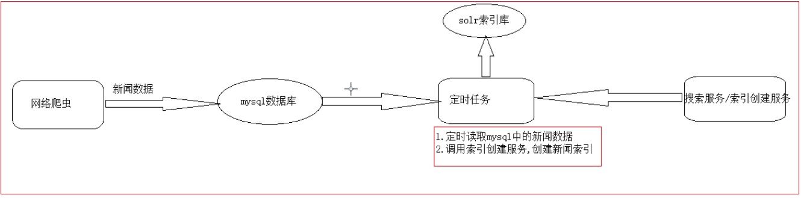

### 1.2 爬虫升级后的系统架构

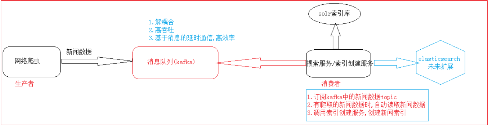

### 1.3 升级后项目整体架构

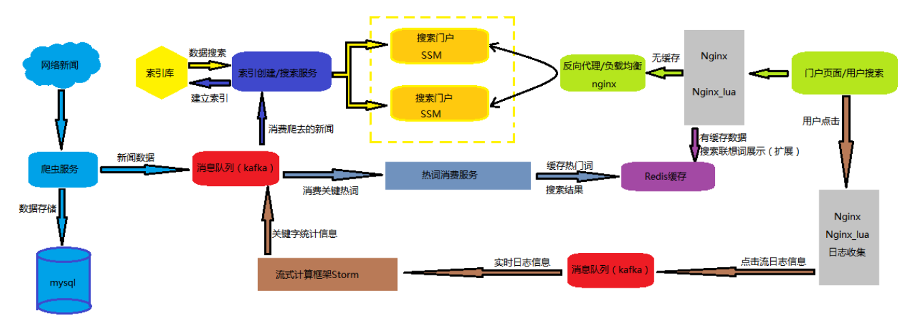

## 2. kafka和spring框架的集成

### 2.1 准备工作

* 1) 启动kafka集群(需先启动zookeeper集群):

```
启动node01, node02,node03  上面的zookeeper
下面的命令在三台机器上执行下:  获取使用zookeeper的启动脚本启动均可
	cd /export/servers/zk/bin
 	./zkServer.sh start
 	./zkServer.sh status
 	
启动node01, node02,node03  上面的kafka
下面的命令需要在三台机器上执行下:
 cd  /export/servers/kafka/bin
 ./kafka-server-start.sh /export/servers/kafka/config/server.properties 1>/dev/null 2>&1 &
```

​	spring-kafka官方文档: https://spring.io/projects/spring-kafka

​	kafka的快速入门: http://kafka.apache.org/documentation.html#quickstart

* 2) 创建一个用于测试的topic: spider-test

```
 ./kafka-topics.sh --create --zookeeper node01:2181 --topic spider-test --replication-factor 1 --partitions 3
 topic名称: spider-test
 分区数: 3
 副本数: 1
```

* 3) 准备相关的依赖jar包

```xml
    <dependency>
        <groupId>org.springframework.kafka</groupId>
        <artifactId>spring-kafka</artifactId>
        <version>1.3.5.RELEASE</version>
    </dependency>
    <dependency>
        <groupId>junit</groupId>
        <artifactId>junit</artifactId>
        <version>4.12</version>
    </dependency>
    <dependency>
        <groupId>org.slf4j</groupId>
        <artifactId>slf4j-api</artifactId>
        <version>1.7.13</version>
    </dependency>
    <!-- spring集成测试 -->
    <dependency>
        <groupId>org.springframework</groupId>
        <artifactId>spring-test</artifactId>
        <version>4.3.17.RELEASE</version>
    </dependency>
```


### 2.2 创建消息生产者项目

* 1）创建工程springjms_kafka_producer，在POM文件中引入Springkafka 日志以及单元测试等相关依赖

* 2）在src/main/resources下创建spring配置文件kafka-producer.xml

```xml
<?xml version="1.0" encoding="UTF-8"?>
<beans xmlns="http://www.springframework.org/schema/beans"
       xmlns:context="http://www.springframework.org/schema/context"
       xmlns:xsi="http://www.w3.org/2001/XMLSchema-instance"
       xsi:schemaLocation="http://www.springframework.org/schema/beans http://www.springframework.org/schema/beans/spring-beans-4.0.xsd
	http://www.springframework.org/schema/context http://www.springframework.org/schema/context/spring-context-4.0.xsd">
  
<!-- 包扫描 -->
<context:component-scan base-package="cn.itcast.kafka.producer"/>
<!-- 加载属性文件 -->
<context:property-placeholder location="classpath:init.properties" />

<!-- 定义producer的参数信息 -->
 <bean id="producerProperties" class="java.util.HashMap">
 	<constructor-arg>
 		<map>
	     	<entry key="bootstrap.servers" value="${kafka.servers}"/>
	     	<entry key="group.id" value="0"/>
	     	<entry key="retries" value="10"/>
	     	<entry key="batch.size" value="16384"/>
	     	<entry key="linger.ms" value="1"/>
	     	<entry key="buffer.memory" value="33554432"/>
	     	<entry key="key.serializer" value="org.apache.kafka.common.serialization.IntegerSerializer"/>
	     	<entry key="value.serializer" value="org.apache.kafka.common.serialization.StringSerializer"/>
 		</map>
 	</constructor-arg>
 </bean>
 
 <!-- 创建kafkatemplate需要使用的producerfactory bean -->
 <bean id="producerFactory" class="org.springframework.kafka.core.DefaultKafkaProducerFactory">
 	<constructor-arg>
 		<ref bean="producerProperties"/>
 	</constructor-arg>
 </bean>
 
 <!-- 创建kafkatemplate bean，使用的时候，只需要注入这个bean，即可使用template的send消息方法 -->
 <bean id="KafkaTemplate" class="org.springframework.kafka.core.KafkaTemplate">
 	<constructor-arg ref="producerFactory"/>
 	<constructor-arg name="autoFlush" value="true"/>
 	<property name="defaultTopic" value="${kafka.topic}"/>
 </bean>
```

* 3) 在src/main/resources下创建init.properties属性配置文件:内容如下

```
kafka.servers=node01:9092
kafka.topic=spider-test
```

* 4）在cn.itcast.kafka.producer包下创建消息生产者类

```java
@Component
public class SpiderKafkaProducer {
    
    @Autowired
    private KafkaTemplate<Integer, String> kafkaTemplate;
    
    /**
     * 
     * 发送消息到spider-test这个topic
     */
    public void sendSpider(String data) {

        kafkaTemplate.send("spider-test", data);
    }
}
```

* 5) 单元测试
  * 在src/test/java创建测试类(包名: cn.itcast.kafka.test)

```java
@RunWith(SpringJUnit4ClassRunner.class)
@ContextConfiguration(locations="classpath:kafka-producer.xml")
public class KafkaProducerTest {

    @Autowired
    private SpiderKafkaProducer kafkaProducer;

    /**
     * 简单字符串的测试
     * @throws Exception
     */
    @Test
    public void testProducer() throws Exception {
        String data = "spring集成kafka发送的生产者数据sssssssss";
        kafkaProducer.sendSpider(data);   
    }
}
```

### 2.3 创建消息的消费者项目

* 1）创建工程springjms_kafka_consumer，在POM文件中引入Springkafka 日志以及单元测试等相关依赖

* 2）在src/main/resources下创建配置文件 kafka-consumer.xml

```xml
<?xml version="1.0" encoding="UTF-8"?>
<beans xmlns="http://www.springframework.org/schema/beans"
       xmlns:context="http://www.springframework.org/schema/context"
       xmlns:xsi="http://www.w3.org/2001/XMLSchema-instance"
       xsi:schemaLocation="http://www.springframework.org/schema/beans http://www.springframework.org/schema/beans/spring-beans-4.0.xsd
	http://www.springframework.org/schema/context http://www.springframework.org/schema/context/spring-context-4.0.xsd">
  
  	<!-- 包扫描 -->
	<context:component-scan base-package="cn.itcast.kafka.consumer"/>
	<!-- 加载属性文件 -->
	<context:property-placeholder location="classpath:init.properties" />
	<!-- 定义consumer的参数 -->
     <bean id="consumerProperties" class="java.util.HashMap">
     	<constructor-arg>
     		<map>
		     	<entry key="bootstrap.servers" value="${kafka.servers}"/>
		     	<entry key="group.id" value="0"/>
		     	<entry key="enable.auto.commit" value="true"/>
		     	<entry key="auto.commit.interval.ms" value="1000"/>
		     	<entry key="session.timeout.ms" value="15000"/>
		     	<entry key="key.deserializer" value="org.apache.kafka.common.serialization.IntegerDeserializer"/>
		     	<entry key="value.deserializer" value="org.apache.kafka.common.serialization.StringDeserializer"/>
     		</map>
     	</constructor-arg>
     </bean>
     
     <!-- 创建consumerFactory bean -->
     <bean id="consumerFactory" class="org.springframework.kafka.core.DefaultKafkaConsumerFactory">
     	<constructor-arg>
     		<ref bean="consumerProperties"/>
     	</constructor-arg>
     </bean>
     
     <!-- 消费者容器配置信息 -->
     <bean id="containerProperties" class="org.springframework.kafka.listener.config.ContainerProperties">
     	<constructor-arg value="${kafka.topic}"/>
     	<!-- 真正执行消费数据逻辑的消息监听者 -->
     	<property name="messageListener" ref="spiderKafkaConsumer"/>
     </bean>    
     
     <bean id="messageListenerContainer" class="org.springframework.kafka.listener.KafkaMessageListenerContainer" init-method="doStart">
     	<constructor-arg ref="consumerFactory"/>
     	<constructor-arg ref="containerProperties"/>
     </bean>
```

* 3）在src/main/resources下创建init.properties属性配置文件: 内容如下

```properties
kafka.servers=node01:90925
kafka.topic=spider-test
```

* 4）在cn.itcast.kafka.consumer包下编写消息监听类

```java
@Component
public class SpiderKafkaConsumer implements MessageListener<Integer, String>{
    
    @Override
    public void onMessage(ConsumerRecord<Integer, String> recoders) {
        String value = recoder.value();
        System.out.println("获取topic中的数据进行消费，内容：" + value);
    }
 }  
```

* 5）编写单元测试

```java
@RunWith(SpringJUnit4ClassRunner.class)
@ContextConfiguration(locations = "classpath:kafka-consumer.xml")
public class KafkaConsumerTest {


    @Test
    public void test(){
        try {
            //等待键盘输入: 让程序阻塞, 不停止
            System.in.read();
        } catch (IOException e) {
            e.printStackTrace();
        }
    }
}
```

* 5）先运行消费者,然后运行生产者的测试类,进行测试

## 3. 网络爬虫集成kafka

> 思路 :  网络爬虫爬取新闻数据后,将数据写入kafka集群, 然后又索引写入服务进行消费即可

​	此工程改造后,作为kafka的生产者.如下图：

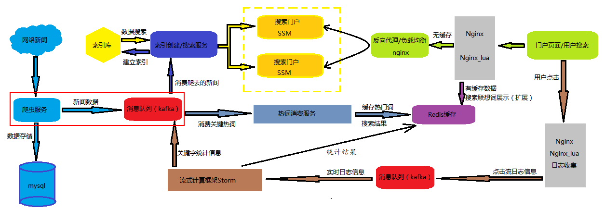

### 3.1 在项目中导入相关的jar包

```xml
<dependency>
    <groupId>org.apache.kafka</groupId>
    <artifactId>kafka-clients</artifactId>
    <version>0.11.0.1</version>
</dependency>
```

### 3.2 编写生产者的代码

> 说明 将爬虫爬取的数据写入kafka中.

```java
/**
 * @author itheima
 * @Title: KafkaSpiderProducer
 * @ProjectName gossip-parent
 * @Description: 将爬虫数据写入kafka的生产者
 * @date 2018/10/2820:07
 */
public class KafkaSpiderProducer {

    //配置信息加载
    private static Properties props = null;

    //消息生产者
    private static KafkaProducer<String, String> kafkaProducer = null;

    //初始化工作
    static {
        props = new Properties();
        props.put("bootstrap.servers", "node01:9092");
        props.put("acks", "all");
        props.put("retries", 0);
        props.put("batch.size", 16384);
        props.put("linger.ms", 1);
        props.put("buffer.memory", 33554432);
        props.put("key.serializer",
                "org.apache.kafka.common.serialization.StringSerializer");
        props.put("value.serializer",
                "org.apache.kafka.common.serialization.StringSerializer");

        // 1.创建KafkaProducer 也就kafka的生产者
        // 1.1 需要一个Properties对象--怎么连接kafka集群
        kafkaProducer = new KafkaProducer<String, String>(props);

    }

    /**
     * 将爬取的数据写入kafka
     * @param  : 新闻数据对象
     */
    public  void saveSpiderTokafka(String news){
     
        ProducerRecord<String, String> producerRecord = new ProducerRecord<String, String>("spider",news);
        // 2.1 发送ProducerRecord对象
        kafkaProducer.send(producerRecord);
      
    }
}
```

### 3.3  爬虫程序调用生产者代码

* 1) 在publicDaoNode程序中添加一个成员变量

```java
//创建生产者对象
private static KafkaSpiderProducer kafkaSpiderProducer = new KafkaSpiderProducer();
```

* 2) 在publicDaoNode程序中调用生产者的方法, 将数据写入kafka即可

```java
// 在添加完数据库后, 添加此代码
kafkaSpiderProducer.saveSpiderTokafka(newsJson);
```

* 3) 测试

  * 3.1) 在kafka中先创建好对应的topic

  ```shell
  ./kafka-topics.sh --create --zookeeper node01:2181 --topic spider --replication-factor 2 --partitions 3
  ```

  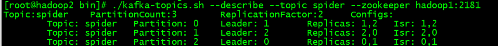

  * 3.2) 根据自己的redis的ip地址，修改代码中的redis连接ip地址

  ```java
  //修改JedisUtils中jedis连接的ip地址
  jedisPool = new JedisPool(config,"192.168.72.142",6379);
  ```

  * 3.3) 使用kafka控制台查看爬取的新闻数据

  ```shell
  ./kafka-console-consumer.sh --zookeeper node01:2181 --topic spider 
  ```

  * 3.4） 运行163爬虫和腾讯爬虫爬取数据，查看kafka控制台是否有新闻数据，举例如下：

  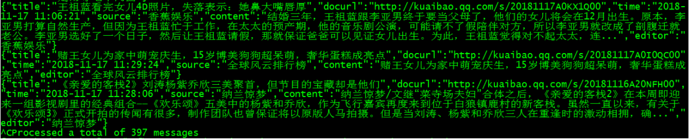

## 4. 索引创建服务集成kafka

​	索引创建服务作为消费者,读取kafka集群中的新闻数据,进行创建索引.

​	此工程改造后,作为kafka的消费者.如下图位置：

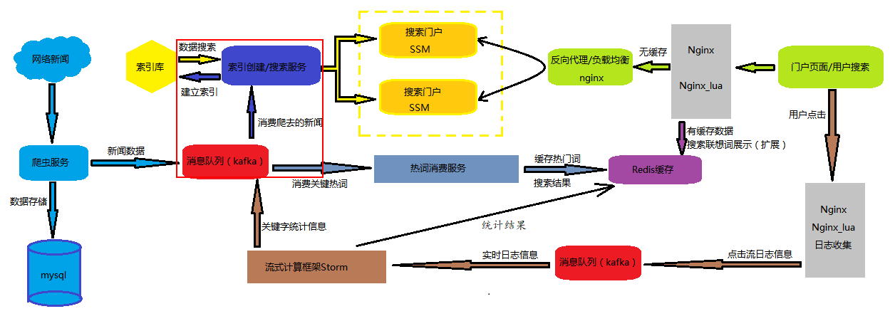

### 4.1 搜索工程导入相关jar包

```xml
		<dependency>
			<groupId>org.springframework.kafka</groupId>
			<artifactId>spring-kafka</artifactId>
			<version>1.3.5.RELEASE</version>
		</dependency>
		<dependency>
            <groupId>org.springframework</groupId>
            <artifactId>spring-test</artifactId>
        </dependency>
		<dependency>
			<groupId>junit</groupId>
			<artifactId>junit</artifactId>
			<version>4.12</version>
		</dependency>
		<dependency>
			<groupId>org.slf4j</groupId>
			<artifactId>slf4j-api</artifactId>
			<version>1.7.13</version>
		</dependency>
		<dependency>
            <groupId>com.google.code.gson</groupId>
            <artifactId>gson</artifactId>
            <version>2.8.1</version>
        </dependency>
		<dependency>
            <groupId>commons-codec</groupId>
            <artifactId>commons-codec</artifactId>
            <version>1.10</version>
        </dependency>
```

### 4.2 添加消费者的配置文件

* applicationContext-kafka-consumer.xml  ：保证能够被web.xml文件加载到

```xml
<?xml version="1.0" encoding="UTF-8"?>
<beans xmlns="http://www.springframework.org/schema/beans"
       xmlns:xsi="http://www.w3.org/2001/XMLSchema-instance"
       xmlns:context="http://www.springframework.org/schema/context"
       xsi:schemaLocation="http://www.springframework.org/schema/beans
         http://www.springframework.org/schema/beans/spring-beans.xsd
         http://www.springframework.org/schema/context
         http://www.springframework.org/schema/context/spring-context.xsd">

    <!--加载kafka属性配置文件-->
     <context:property-placeholder location="classpath:*.properties" />

    <!-- 定义consumer的参数 -->
    <bean id="consumerProperties" class="java.util.HashMap">
        <constructor-arg>
            <map>
                <entry key="bootstrap.servers" value="${kafka.servers}"/>
                <entry key="group.id" value="spider"/>
                <entry key="enable.auto.commit" value="true"/>
                <entry key="auto.commit.interval.ms" value="1000"/>
                <entry key="session.timeout.ms" value="15000"/>
                <entry key="key.deserializer" value="org.apache.kafka.common.serialization.StringDeserializer"/>
                <entry key="value.deserializer" value="org.apache.kafka.common.serialization.StringDeserializer"/>
            </map>
        </constructor-arg>
    </bean>

    <!-- 创建consumerFactory bean -->
    <bean id="consumerFactory" class="org.springframework.kafka.core.DefaultKafkaConsumerFactory">
        <constructor-arg>
            <ref bean="consumerProperties"/>
        </constructor-arg>
    </bean>

    <!-- 消费者容器配置信息 -->
    <bean id="containerProperties" class="org.springframework.kafka.listener.config.ContainerProperties">
        <constructor-arg value="${kafka.topic}"/>
        <!-- 真正执行消费数据逻辑的消息监听者 -->
        <property name="messageListener" ref="spiderKafkaConsumer"/>
    </bean>

	<!-- 消费者容器 -->
    <bean id="messageListenerContainer" class="org.springframework.kafka.listener.KafkaMessageListenerContainer" init-method="doStart">
        <constructor-arg ref="consumerFactory"/>
        <constructor-arg ref="containerProperties"/>
    </bean>

</beans>
```

* 在resources 下添加一个 init.properties  配置文件:

```properties
kafka.servers=node01:9092,node02:9092,node03:9092
kafka.topic=spider
```

### 4.3 添加消费者代码

```java
@Service
public class SpiderKafkaConsumer implements MessageListener<Integer, String> {
    private static Gson gson = new Gson();

    @Autowired
    private IndexWriterService indexWriterService;

    @Override
    public void onMessage(ConsumerRecord<Integer, String> data) {
        try {
            System.out.println("获取kafka中的爬虫数据.......");
            String value = data.value();
            System.out.println("获取topic中的数据进行消费，内容：" + value);
            News news = gson.fromJson(value, News.class);
            
            ArrayList<News> newsList = new ArrayList<>();
            newsList.add(news);
          	//处理日期格式问题
            SimpleDateFormat format1 = new SimpleDateFormat("yyyy-MM-dd HH:mm:ss");
            SimpleDateFormat format2 = new SimpleDateFormat("yyyy-MM-dd'T'HH:mm:ss'Z'");
            for (News newss : newsList) {
                String oldTime = newss.getTime();
                Date oldDate = format1.parse(oldTime);
                String newTime = format2.format(oldDate);
                newss.setTime(newTime);
            }	
          
            indexWriterService.saveBeans(newsList);
            System.out.println("调用搜索服务进行新闻数据的索引服务........");
        } catch (Exception e) {
            e.printStackTrace();
        }
    }
}
```

## 5、热词消费服务搭建及开发

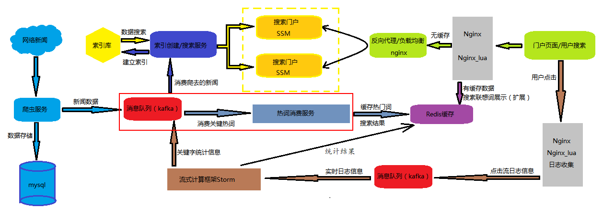

> ​	当用户在前端页面准备输入查询的内容时, 我们会给用户展示当前的热搜词语, 那么这些热搜词必然是用户当前最热的词语, 最容易查询的内容, 那么我们能不能把这些用户经常查的数据先缓存到redis中, 提供用户的查询效率呢 ? ? ?

### 5.1 需求分析

> 从架构图中可以看出, 实时统计服务会将统计的热搜关键词的结果写入到kafka中, 故其为生产者(目前占不考虑如何实现).
>
> 热词消费服务是从kafka中获取热搜词数据, 故其为消费者

* 实现流程

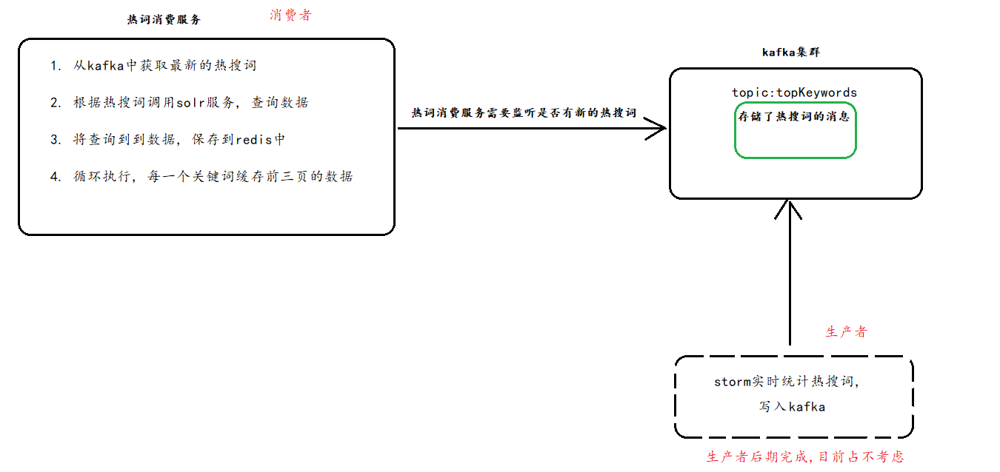

### 5.2 热词消费服务项目搭建与开发

* 1) 创建一个search-topkey-interface工程, 并创建com.itheima.topkey.service, 并在此包下创建一个接口

```java
/**
 * 根据热搜关键词生成搜索结果的缓存数据
 * @author Administrator
 *
 */
public interface TopKeyService {
    /**
	 * 根据热搜关键词生成redis缓存数据
	 * @param keyword
	 */
    public void findByPageKeywordsToRedis(String keyword)  throws Exception;
}
```

* 2) 创建一个war工程 search-topkey-service, 并在pom中导入以下依赖

```xml
	  <dependencies>
        <!-- spring 相关的依赖包 -->
        <dependency>
            <groupId>org.springframework</groupId>
            <artifactId>spring-context</artifactId>
        </dependency>
        <dependency>
            <groupId>org.springframework</groupId>
            <artifactId>spring-beans</artifactId>
        </dependency>

        <dependency>
            <groupId>org.springframework</groupId>
            <artifactId>spring-jdbc</artifactId>
        </dependency>
        <dependency>
            <groupId>org.springframework</groupId>
            <artifactId>spring-aspects</artifactId>
        </dependency>

        <dependency>
            <groupId>org.springframework</groupId>
            <artifactId>spring-context-support</artifactId>
        </dependency>
        <dependency>
            <groupId>org.springframework</groupId>
            <artifactId>spring-web</artifactId>
        </dependency>

        
        <!--spingkafka kafkaclient-->
        <dependency>
            <groupId>org.springframework.kafka</groupId>
            <artifactId>spring-kafka</artifactId>
            <version>1.3.5.RELEASE</version>
        </dependency>
        <!-- 测试相关依赖  -->
        <dependency>
            <groupId>org.springframework</groupId>
            <artifactId>spring-test</artifactId>
        </dependency>
        <dependency>
            <groupId>junit</groupId>
            <artifactId>junit</artifactId>
            <version>4.12</version>
        </dependency>
        <!-- 日志相关  -->
        <dependency>
            <groupId>org.slf4j</groupId>
            <artifactId>slf4j-api</artifactId>
            <version>1.7.13</version>
        </dependency>
        <!-- json转换工具gson 与 fastjson  -->  
        <dependency>
            <groupId>com.google.code.gson</groupId>
            <artifactId>gson</artifactId>
            <version>2.8.1</version>
        </dependency>
      
        <dependency>
            <groupId>com.alibaba</groupId>
            <artifactId>fastjson</artifactId>
            <version>1.2.28</version>
        </dependency>
        <!--jedis-->
        <dependency>
            <groupId>redis.clients</groupId>
            <artifactId>jedis</artifactId>
            <version>2.9.0</version>
        </dependency>

        <!--需要将接口的工程依赖进来:  此处需要根据自己的项目进行依赖-->
        <dependency>
            <groupId>com.itheima.gossip</groupId>
            <artifactId>search-interface</artifactId>
            <version>1.0-SNAPSHOT</version>
        </dependency>
        <dependency>
            <groupId>com.itheima.gossip</groupId>
            <artifactId>search-topkey-interface</artifactId>
            <version>1.0-SNAPSHOT</version>
        </dependency>
          
    </dependencies>
    <build>
        <plugins>
            <plugin>
                <groupId>org.apache.tomcat.maven</groupId>
                <artifactId>tomcat7-maven-plugin</artifactId>
                <version>2.2</version>
                <configuration>
                    <path>/</path>
                    <port>9003</port>
                </configuration>
            </plugin>
        </plugins>
    </build>
```

* 3) 添加web.xml 

```xml
 <!-- 加载spring容器 -->
    <context-param>
        <param-name>contextConfigLocation</param-name>
        <param-value>classpath:applicationContext*.xml</param-value>
    </context-param>
    <listener>
        <listener-class>org.springframework.web.context.ContextLoaderListener</listener-class>
    </listener>
```

* 4) 添加配置文件  spring的 : applicationContext-kafka-customer.xml 与 init.properties
  * applicationContext-kafka-customer.xml

```xml
<?xml version="1.0" encoding="UTF-8"?>
<beans xmlns="http://www.springframework.org/schema/beans"
       xmlns:xsi="http://www.w3.org/2001/XMLSchema-instance"
       xmlns:context="http://www.springframework.org/schema/context"
       xsi:schemaLocation="http://www.springframework.org/schema/beans
         http://www.springframework.org/schema/beans/spring-beans.xsd
         http://www.springframework.org/schema/context
         http://www.springframework.org/schema/context/spring-context.xsd">
<context:component-scan base-package="com.itheima.topkey"></context:component-scan>
    <!--加载kafka属性配置文件-->
     <context:property-placeholder location="classpath:init.properties" />

    <!-- 定义consumer的参数 -->
    <bean id="consumerProperties" class="java.util.HashMap">
        <constructor-arg>
            <map>
                <entry key="bootstrap.servers" value="${kafka.servers}"/>
                <entry key="group.id" value="0"/>
                <entry key="enable.auto.commit" value="true"/>
                <entry key="auto.commit.interval.ms" value="1000"/>
                <entry key="session.timeout.ms" value="15000"/>
                <entry key="key.deserializer" value="org.apache.kafka.common.serialization.IntegerDeserializer"/>
                <entry key="value.deserializer" value="org.apache.kafka.common.serialization.StringDeserializer"/>
            </map>
        </constructor-arg>
    </bean>

    <!-- 创建consumerFactory bean -->
    <bean id="consumerFactory" class="org.springframework.kafka.core.DefaultKafkaConsumerFactory">
        <constructor-arg>
            <ref bean="consumerProperties"/>
        </constructor-arg>
    </bean>

    <!-- 消费者容器配置信息 -->
    <bean id="containerProperties" class="org.springframework.kafka.listener.config.ContainerProperties">
        <constructor-arg value="${kafka.topic}"/>
        <!-- 真正执行消费数据逻辑的消息监听者 -->
        <property name="messageListener" ref="topkeyKafkaConsumer"/>
    </bean>


    <bean id="messageListenerContainer" class="org.springframework.kafka.listener.KafkaMessageListenerContainer" init-method="doStart">
        <constructor-arg ref="consumerFactory"/>
        <constructor-arg ref="containerProperties"/>
    </bean>

</beans>
```

​	init.properties

```properties
kafka.servers=node01:9092,node02:9092,node03:9092
kafka.topic=keywords
```

* 5) 在search-topkey-service工程中建立com.itheima.topkey.service.impl包，包下建立类:

```java
@Service
public class TopKeyServiceImpl implements TopKeyService {

    /**
     * 导入索引搜索服务
     */
    @Reference(timeout = 5000)
    private IndexSearcherService indexSearcherService;

    /**
     * 根据对应的关键词生产缓存数据
     *
     * @param topKeywords ： 巩俐
     * @return
     */
    @Override
    public void findByPageKeywordsToRedis(String keyword) throws Exception{
       
       //1. 读取关键词
       //2. 根据关键词，调用索引搜索服务，查询新闻数据
       ResultBean resultBean = new ResultBean();
       PageBean pb = new PageBean();
       resultBean.setPageBean(pb);
       resultBean.setKeywords(keyword);
       //根据关键词，查询总共多少页数据
       PageBean pageBean = indexSearcherService.findByPageQuery(resultBean);

       //默认取前3页结果数据
       int pageCount = 3;
       if(pageBean.getPageNumber() < 3){
            pageCount = pageBean.getPageNumber();
       }

       //3. 将前5页新闻数据写入redis缓存
       for(int i=1;i <= pageCount;i++){
            //获取第i页的数据
            resultBean.getPageBean().setPage(i);
            PageBean page = indexSearcherService.findByPageQuery(resultBean);
            resultBean.setPageBean(page);

             //写入redis缓存
            Jedis jedis = JedisUtils.getJedis();
            jedis.set(keyword+":"+i, JSON.toJSONString(resultBean));
        }
        System.out.println("当前key:' " + keyword +" 缓存到redis成功...");

    }
}
```

* 6) 创建 com.itheima.topkey.web 包,在此包下添加 TopkeyKafkaConsumer消费者类

```java
@Component
public class TopkeyKafkaConsumer implements MessageListener<Integer, String>{

    /**
     * 调用热词消费服务进行生成热搜词的缓存服务
     */
    @Autowired
    private TopKeyService topKeyService;

    @Override
    public void onMessage(ConsumerRecord<Integer, String> recoders) {
        try {
            System.out.println("获取kafka中的热门关键词数据.......");
            String value = recoders.value();
            System.out.println("获取topic中的数据进行消费，内容：" + value);
            //调用页面静态化服务生成静态页面
            topKeyService.findByPageKeywordsToRedis(value);
            System.out.println("调用搜索服务进行新闻数据的索引服务........");
        } catch (Exception e){
            e.printStackTrace();
        }
    }

}
```

### 5.3 测试

* 1) 启动kafka集群
* 2)  使用控制台创建对应的topic: topKeywords

```sh
bin/kafka-topics.sh --create --zookeeper node01:2181,node02:2181,node03:2181 --replication-factor 2 --partitions 3 --topic topKeywords
```

* 3) 启动热词消费服务: tomcat7:run
* 4) 使用控制台创建一个关键词, 生成测试数据:  刘德华
* 5) 查询热词消费服务, 是否消费关键词: 查看redis的缓存数据即可: keys *  

## 6. 整体部署

### 6.1 爬虫部署

> 爬虫部署中: 由于我们只修改了publicDaoNode类, 故打包只需要重新将此包打包即可使用

* 1）修改pom中打包插件的主入口类为publicDaoNode类:
* 2)  选择项目重新进行编译
* 3)  执行打包插件提供的打包命令: single
* 4)  查看打包后的jar包中主入口类是否更改
* 5) 更改jar包的名称为 PublicDaoNode.jar
* 6) 使用此jar包将linux中三台服务器中的PublicDaoNode.jar全部替换掉

```shell
# 注意: 以下命令需要在三台虚拟机中都要执行一下
cd /export/servers/spider
rm -rf PublicDaoNode.jar
rz  # 上传新打包好的jar即可
```

### 6.2 热词服务和搜索服务部署

* 1) 安装整个gossip-parent工程

* 2) 对search-service、search-topkey-service工程各执行package打包命令

  * 执行后, 包存储在各个公共的target目录下

  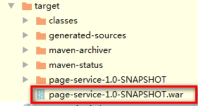

* 3) 在linux中准备两个tomcat, 具体部署方案如下:

```
准备干净的Tomcat来部署两个war包：

192.168.72.141   

192.168.72.142   search-service.war     tomcat3个端口号:  9100     8105      8109 

192.168.72.143  search-topkeye-service.war  tomcat3个端口号:  9200    8205   8209 

注意： 部署Tomcat时，不要端口冲突
```

* 4) 将war包放置对应放置在两个tomcat的webapps下
* 5) 启动两个tomcat
  * 注意1: 需要先启动9100这个tomcat
  * 注意2: 启动前zookeeper集群和solr集群已经redis必须全部开启

* 6) 进行测试: 向kafka中发送一个热搜关键词消息, 查看topkey这个服务能否进行消费, 将缓存数据写入redis

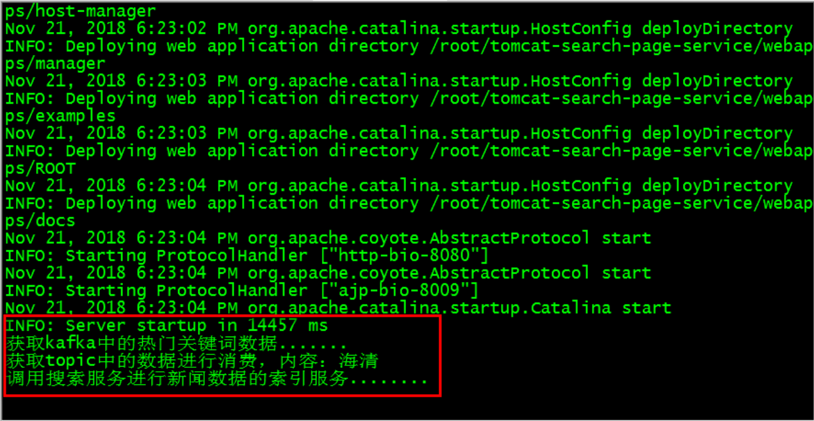

> 如成功, 可以在tomcat日志中, 查看如上图内容

