# 娱乐头条_综合部署

课前回顾:

* 1) 系统升级的背景:(写入索引的操作)
* 2) spring 和 kafka的整合 : 
* 3)  爬虫程序  和kafka进行集成操作 :   生产者
* 4)  索引创建服务  和 kafka进行集成 :   消费者(spring和kafka集成)
* 5)  热词消费服务工程创建和代码编写:   集成 kafka, 热词数据的来源, 来源于实时框架写入到kafka中热词
* 6) 服务部署:
  * 对爬虫进行部署 :  只需要对dao的jar进行重新部署即可
  * 对搜索服务 和 热词服务部署

今日内容:

* 门户集群部署,已经反向代理和负载均衡
* 升级为双层nginx架构:  为什么要升级
* 安装openresty(nginx)
* 使用openresty和 反向代理的nginx结合使用
* lua的基本语法:
  * 使用lua如何连接redis
  * 使用lua如何发送请求

* 完成最终门户部署


```
将上一次部署后的服务相关工程, 全部启动并测试:

1) 启动3台虚拟机
2) 启动redis服务器
3) 开启zookeeper集群
4) 开启solrCloud集群
5) 开启kafka集群
6) (可选)开启dubbo-admin 
7) 开启在142部署search-service的tomcat 9100
8) 开启在143部署search-topkey-service的tomcat 9200


测试:
	1) 启动爬虫程序, 观察 142 中写入索引是否执行, 或者观察solrCloud中数据有没有增加
	2) 启动一个生产者, topic为143监听topic,  生产一个关键词数据, 观察 redis是否有缓存数据产生
```


## 1.综合部署图

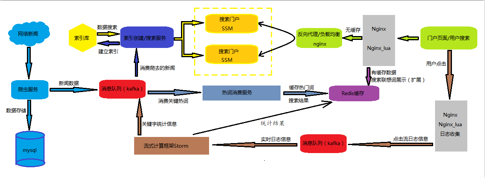

说明: 

```properties
昨天完成了爬虫服务的部署,索引创建服务的部署,热词消费服务的部署,接下来首先进行门户集群的部署,同时使用nginx实现反向代理和负载均衡.
```

## 2.门户集群部署

### 2.1 部署架构图

​	首先完成如下图所示: 门户集群部署,再进行nginx反向代理和负载均衡的配置.

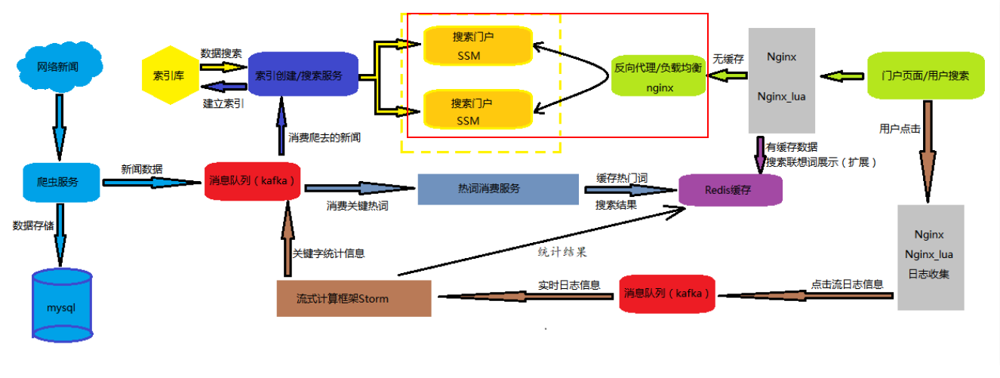

### 2.2 门户集群的部署

```
在打包之前, 需要先将门户中定时任务给清理掉, 否则 会出现写入索引的重复问题
```

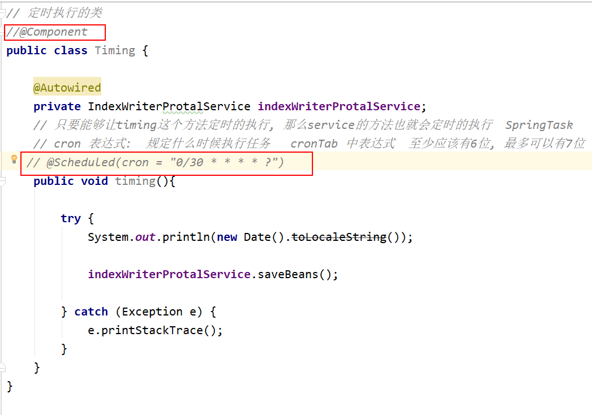


1. 将项目打成war包

   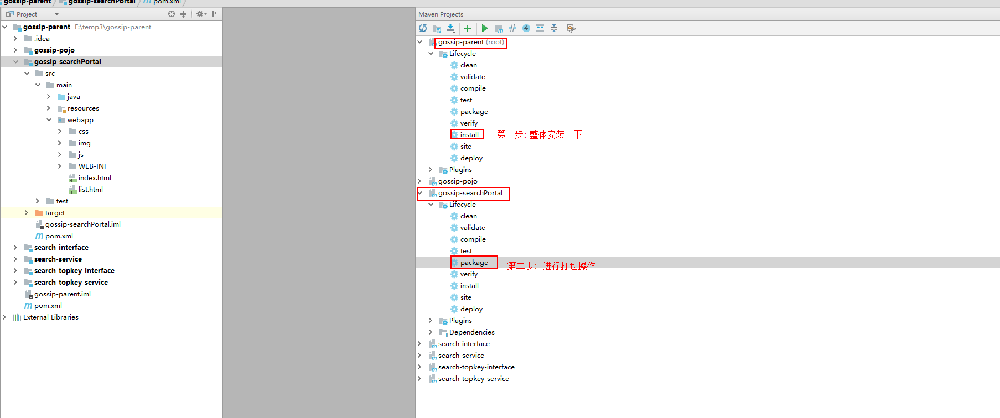

2. 准备tomcat,更改名称为: tomcat-potal-9001, 并修改端口号,将打好的war包部署到tomcat的webapps下

   ​	tomcat放置的位置:  141  /export/servers/gossip

```
tomcat-potal-9001 : 8015   9001     8019    ip:  192.168.72.141
```

3. 完成如下截图的操作:


4. 启动tomcat,验证是否可以正常访问.

​	启动后,测试的效果:

​	注意: 要想启动门户需要做的准备工作

```
1. zookeeper集群开启
2. solrCloud的集群开启
3. kafka集群开启
4. redis开启
5. mysql开启
6. 搜索服务项目开启
7. 热词消费服务开启
```


   效果

 

### 2.3 nginx反向代理的配置

​	反向代理（Reverse Proxy）方式是指以代理服务器来接受internet上的连接请求，然后将请求转发给内部网络上的服务器，并将从服务器上得到的结果返回给internet上请求连接的客户端，此时代理服务器对外就表现为一个反向代理服务器。

1. 配置nginx反向代理

   ```shell
   注:  nginx服务器ip地址: 192.168.72.142
   在配置之前, 需要将nginx.conf中数据, 进行还原
   
   
   在nginx的conf目录下nginx.conf配置文件中添加如下内容: 
   
   	upstream protalProxy {
            server 192.168.72.141:9001;
       }
   
       server {
           listen       8888;
           server_name  localhost;
   
           #charset koi8-r;
   
           #access_log  logs/host.access.log  main;
   
           location / {
               root   html;
               index  index.html index.htm;
   
               proxy_pass   http://protalProxy;
           }
   
           location ~ .* {
               proxy_pass http://protalProxy;
               proxy_set_header Host $http_host;
               proxy_set_header X-Real-IP $remote_addr;
               proxy_set_header X-Forwarded-For $proxy_add_x_forwarded_for;
           }
   
   
   ```

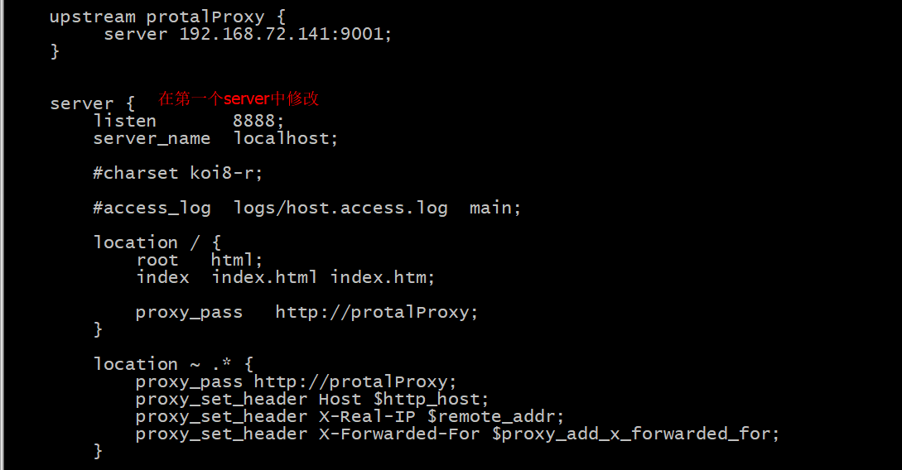


1. 重新启动反向代理Nginx  然后用浏览器测试： http://192.168.72.142:8888,浏览器可以直接访问到后端的门户系统


### 2.4 nginx负载均衡策略的配置

​	负载均衡 建立在现有网络结构之上，它提供了一种廉价有效透明的方法扩展网络设备和服务器的带宽、增加吞吐量、加强网络数据处理能力、提高网络的灵活性和可用性。

​	负载均衡，英文名称为Load Balance，其意思就是分摊到多个操作单元上进行执行，例如Web服务器、FTP服务器、企业关键应用服务器和其它关键任务服务器等，从而共同完成工作任务。

* 1.准备工作

  * 1.1）将门户的tomcat复制一个, 并修改其端口号, 修改后, 启动这个tomcat
    * 操作复制之前, 先将原有的tomcat关闭

  ```
  tomcat-potal-9002 : 8025	9002      8029    ip:  192.168.72.141
  ```

  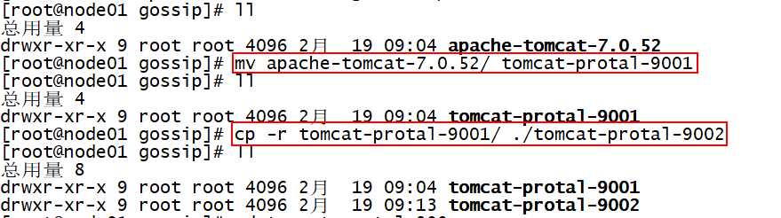

  * 1.2）为了能够区分是访问哪个服务器的网站，可以在首页标题加上标记以便区分。例如:修改title标题

* 2.配置负载均衡

​	修改 Nginx配置文件：	nginx.conf

```properties
 upstream protalProxy {
                #server 192.168.72.49:8080 weight=3;  
                server 192.168.72.141:9001;
                server 192.168.72.141:9002;
    }
    server {
        listen       8888;
        server_name  localhost;

        #charset koi8-r;
        charset utf-8;

        #access_log  logs/host.access.log  main;

        location / {
            proxy_pass   http://protalProxy;
            index  index.html index.htm;
        }
        location ~ .* {
            proxy_pass http://protalProxy;
            proxy_set_header Host $http_host;
            proxy_set_header X-Real-IP $remote_addr;
            proxy_set_header X-Forwarded-For $proxy_add_x_forwarded_for;
        }
      }

```

​	地址栏输入http://192.168.127.129:8888  刷新观察每个网页的标题，看是否不同。

​	经过测试，两台服务器出现的概率各为50%，交替显示。

​	**默认的负载均衡策略时轮询.   下面测试基于权重的策略:**

​	如果其中一台服务器性能比较好，想让其承担更多的压力，可以设置权重。

​	比如想让9001出现次数是其它服务器的2倍，则修改配置如下：	

```
    upstream tomcat-portal {
	 		server 192.168.127.144:9001 weight=2;
            server 192.168.127.144:9002;
    }

```

​	经过测试，每刷新三次，有两次是9001,一次是9002

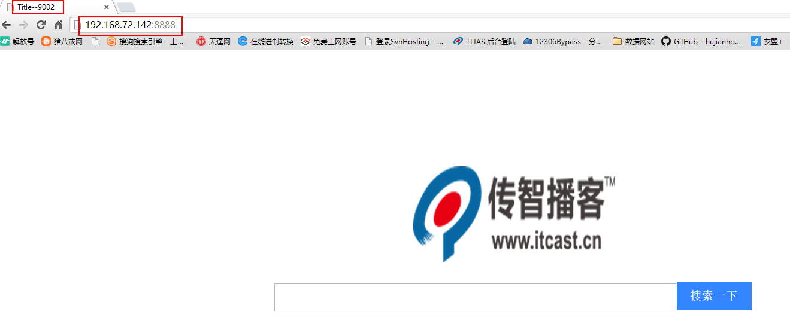

## 3. 热门搜索服务升级双层nginx

#### 3.1 升级说明

1. 每天搜索访问量很大,而且有一些经常搜索的热点关键词,是否可以将热点关键词的搜索结果进行缓存
2. 使用nginx的高并发支持及lua脚本的可编程能力对系统进行升级改造
   1. 使用redis缓存热门关键词的搜索结果(缓存前3页结果数据),使用json方式存放
   2. 使用openresty(nginx+lua)担当第一层代理
   3. 在第一层nginx中进行lua脚本编程
      1. 判断用户输入关键词是否有缓存的搜索结果,有返回redis中的搜索结果
      2. 如果没有缓存,才将请求分发到第二层nginx,访问搜索门户集群获取结果

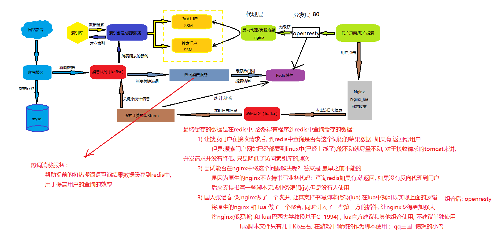

#### 3.2   升级后架构图

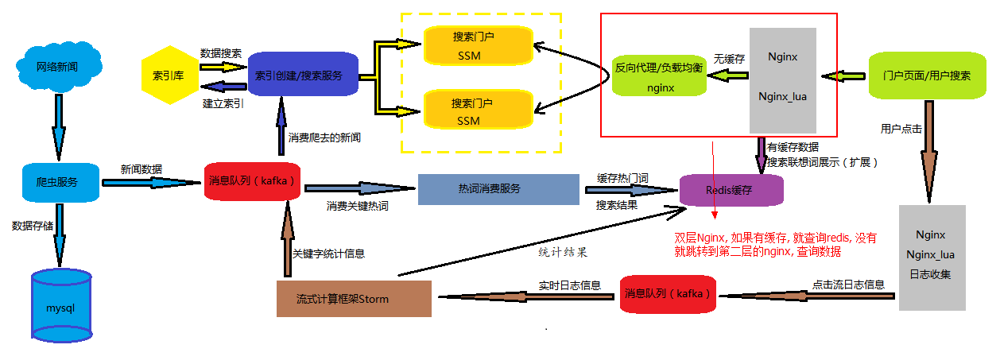

## 4.安装OpenResty环境 (142)

​	后端的nginx服务器，就称之为nginx应用服务器; 最前端的nginx服务器，被称之为nginx分发服务器

下面先基于openResty部署 nginx 分发层.

```
OpenResty® 是一个基于 Nginx 与 Lua 的高性能 Web 平台，其内部集成了大量精良的 Lua 库、第三方模块以及大多数的依赖项。用于方便地搭建能够处理超高并发、扩展性极高的动态 Web 应用、Web 服务和动态网关。

OpenResty® 通过汇聚各种设计精良的 Nginx 模块（主要由 OpenResty 团队自主开发），从而将 Nginx 有效地变成一个强大的通用 Web 应用平台。这样，Web 开发人员和系统工程师可以使用 Lua 脚本语言调动 Nginx 支持的各种 C 以及 Lua 模块，快速构造出足以胜任 10K 乃至 1000K 以上单机并发连接的高性能 Web 应用系统。

OpenResty® 的目标是让你的Web服务直接跑在 Nginx 服务内部，充分利用 Nginx 的非阻塞 I/O 模型，不仅仅对 HTTP 客户端请求,甚至于对远程后端诸如 MySQL、PostgreSQL、Memcached 以及 Redis 等都进行一致的高性能响应。
官网:  http://openresty.org/cn/ 
```

### 4.1 openResty安装环境 

```properties
yum install -y libreadline-dev libncurses5-dev libpcre3-dev libssl-dev perl
```

### 4.2 编译安装

- 1.创建安装目录/export/servers/openresty

```properties
mkdir -p /export/servers/openresty
cd /export/servers/openresty
```

- 2.下载openresty-1.13.6.1.tar.gz并解压（本地上传也可）

```properties
cd /export/software/
wget http://openresty.org/download/openresty-1.13.6.1.tar.gz
tar -zxf openresty-1.13.6.1.tar.gz -C /export/servers/openresty/
```

- 3.安装LuaJIT，lua编译环境

```properties
cd /export/servers/openresty/openresty-1.13.6.1/bundle/LuaJIT-2.1-20171103/
make clean && make && make install
```

- 4.下载ngx_cache_purge模块，该模块用于清理nginx缓存

  **通过浏览器下载**：http://github.com/FRiCKLE/ngx_cache_purge/archive/2.3.tar.gz

  上传ngx_cache_purge-2.3.tar.gz文件

```properties
cd /export/servers/openresty/openresty-1.13.6.1/bundle
--上传ngx_cache_purge-2.3.tar.gz文件, 成功后, 使用下面的命令解压
tar -zxvf ngx_cache_purge-2.3.tar.gz
```

- 5.下载nginx_upstream_check_module模块，该模块用于uptream健康检查

  **通过浏览器下载**：http://github.com/yaoweibin/nginx_upstream_check_module/archive/v0.3.0.tar.gz

  上传nginx_upstream_check_module-0.3.0.tar.gz文件

```properties
cd /export/servers/openresty/openresty-1.13.6.1/bundle
--上传nginx_upstream_check_module-0.3.0.tar.gz文件 , 成功后, 使用下面的命令解压
tar -zxvf nginx_upstream_check_module-0.3.0.tar.gz
```

- 6.安装ngx_openresty

```properties
cd /export/servers/openresty/openresty-1.13.6.1
# 以下是一行
./configure --prefix=/export/servers/openresty --with-http_realip_module  --with-pcre  --with-luajit --add-module=./bundle/ngx_cache_purge-2.3/ --add-module=./bundle/nginx_upstream_check_module-0.3.0/ -j2

make && make install

--with***                  安装一些内置/集成的模块
--with-http_realip_module  取用户真实ip模块
--with-pcre                Perl兼容的表达式模块
--with-luajit              集成luajit模块 
--add-module               添加自定义的第三方模块，如此次的ngx_che_purge
```

- 7.到/export/servers/openresty目录下

```properties
cd /export/servers/openresty
ll
```

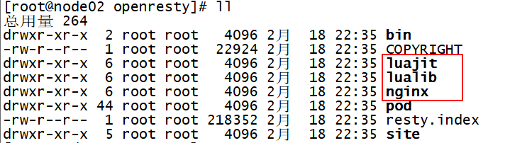

​	会发现多出来了如下目录，说明安装成功

​	**luajit** ：luajit环境，luajit类似于java的jit，即即时编译，lua是一种解释语言，通过luajit可以即时编译lua代码到机器代码，得到很好的性能；
​	**lualib**：要使用的lua库，里边提供了一些默认的lua库，如redis，json库等，也可以把一些自己开发的或第三方的放在这；
​	**nginx** ：安装的nginx；
​	查看nginx版本和安装的模块

```properties
/export/servers/openresty/nginx/sbin/nginx -V
```

- 8.启动openresty 下的nginx

```properties
启动方式1 :
	cd /export/servers/openresty/nginx/sbin
	./nginx    # 启动nginx
启动方式2 :
	cd /export/servers/openresty/bin
	./openresty 
```

**注意**:如果本机已经有nginx了,并且端口号为80,需要修改nginx的端口，规则就是提供外网服务的通常采用80端口，内部使用不冲突即可

### 4.3 测试访问

​	浏览器访问192.168.72.142

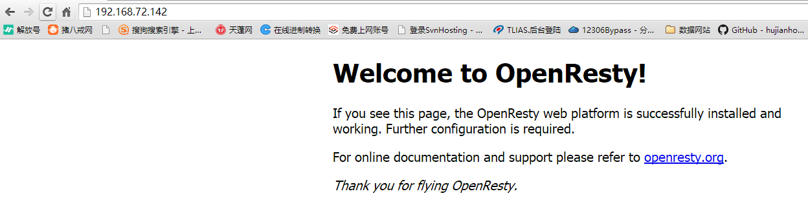

​	到此，openResty安装成功。

## 5.双层nginx+tomcat集群架构

​	基于上面已经完成了应用层nginx到tomcat门户集群的部署.

​	基于分发层nginx已经部署成功.接下来我们完成双层nginx的调试.

### 5.1 部署说明

​	首先保证应用层nginx+tomcat集群配置的正确性.也就是上面的反向代理和负载均衡必须可以跑通.

### 5.2 双层nginx配置

​	修改分发层nginx的配置文件: ip地址192.168.72.142

```
vim /export/servers/openresty/nginx/conf/nginx.conf
```

​	在http下面添加如下内容:

```nginx
upstream nginx {
        server 192.168.72.142:8888;
}

   server{
        listen  80;
        server_name  localhost;

        location /{
                proxy_set_header Host  $host;
                proxy_set_header X-Forwarded-For  $remote_addr;
                proxy_pass http://nginx;
        }
   }

```

​	说明: 上面配置了反向代理,  分发层代理应用层nginx, 192.168.127.129:8888是上面应用层nginx地址.

### 5.3 双层nginx测试

​	重新启动分发层nginx,进行测试:   

```
浏览器访问:  http://192.168.72.142/
```

​	测试结果如下:

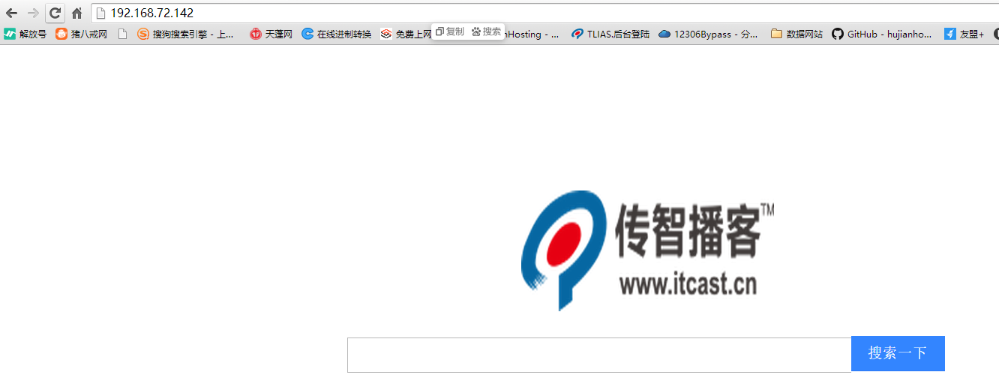


​	门户系统需要动静分离:  将静态页面从tomcat中移植出来, 放置到nginx中

​		好处: 当用户访问静态页面的时候, 就不需要在访问的tomcat了, 降低了tomcat的并发

​	门户系统的前台系统部署在nginx静态服务器上.    (部署在分发层 nginx服务器上)

​	门户系统的动态部分部署在tomcat服务器上.  (已经完成部署)

### 5.4 准备静态页面

```
静态数据:
	html , css ,js ,图片 , 字体文件, json文件
```


​	静态网站项目截图:

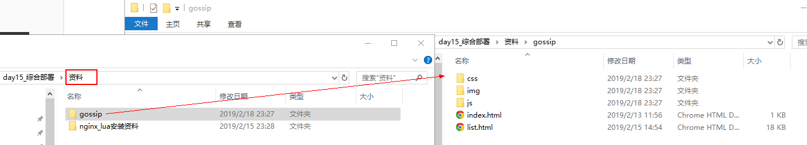		

​	

​	js目录中有一个search.js上的ajax异步请求地址部分需要修改为:   /lua_redis_basic

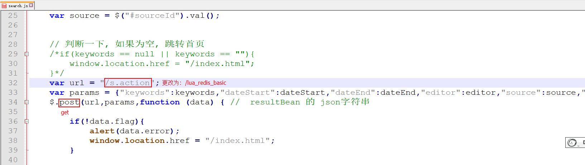		

​	注意:  上面的请求地址是  openresty(nginx+lua)服务器地址,上面搭建了一个server,访问路径是这个.

​		    请求方式:  get

​	将上面的的静态工程部署在openresty服务器的html目录下,如下图:

![cat,测试是否OK

* * 1.2) 使用nginx对门户进行反向代理和负载均衡的配置 : 
  * 注意: 如果在141中启动两个门户出现错误的时候, 
      * 1) 扩大141虚拟机的内存
      * 2) 将两个门户分来放置两个虚拟机当中
  * 1.3) 升级为双层nginx:  加入openresty
    * 原生的nginx无法编写业务逻辑代码. 使用openresty中lua脚本的方式来编写
  
  * 1.4) openresty的安装 : 参考笔记
  * 1.5) 将openresty 和 代理层的nginx进行集成
* 1.6) 动静的分离: 将静态页面从tomcat中移植到openresty的nginx的html目录下
    * 注意: 执行完成后, 无法看到静态页面:404
  * 1.7) lua基本使用: 
    * 1.7.1)  hello world 入门, 上述的404 就会没有的, 就可以看到页面了
    * 1.7.2) 使用lua连接redis:  能够将lua的脚本看懂, 会简单的修改可以
    * 1.73) 使用lua 发送和接收http请求:  


## 7.双层nginx架构的部署

### 7.1 需求	

```
1. 第一层(分发层)nginx:  使用nginx+lua脚本编程.
	首选根据关键字和页码, 判断redis中是否有缓存数据.
	有缓存数据,直接返回给用户响应.
	如果没有,将请求分发给第二层nginx
	
2. 第二层(应用层)nginx: 使用nginx的反向代理和负载均衡
	使用反向代理代理门户后台集群.参照上面3.2节的内容.
	
```


### 7.2 配置双层nginx

>  所有的配置文件都在:   cd /export/servers/openresty/nginx/conf/  目录下	

```
1. 创建一个文件: lua_redis_Or_Http.conf文件,内容如下:此文件需要重新创建

   upstream nginx {
        server 192.168.72.142:8888;
   }
	server {
    listen       80;
    server_name  _;
    location /lua_test {
        default_type 'text/html';
        content_by_lua 'ngx.say("hello lua world")';
    }
    location /lua_redis_basic {
 	   default_type 'text/html';
    	   lua_code_cache on;
    	   content_by_lua_file /export/servers/openresty/nginx/conf/lua_redis_Or_Http.lua;
    }
    
    location /top.action{
                proxy_set_header Host  $host;
                proxy_set_header X-Forwarded-For  $remote_addr;
                proxy_pass http://nginx;
    }

}

注意: 在上面的配置中, 我们将原nginx.conf的反向代理, 放置到了lua_redis_Or_Http.conf中, 需要将nginx.conf中反向代理删除,否则会报错, 删除方式如下图
需要将这个文件配置到nginx.conf中:include
```

​	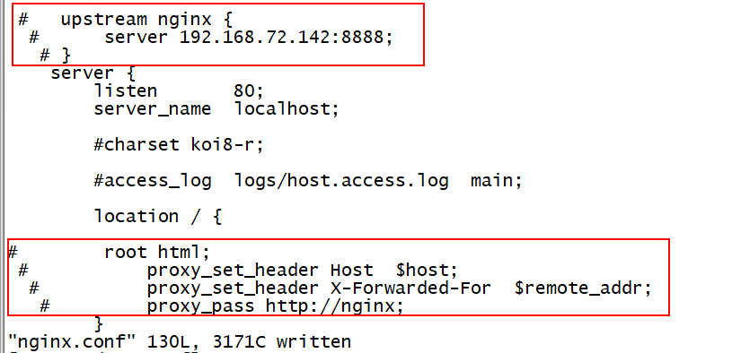

在 cd /export/servers/openresty/nginx/conf/

上面配置的lua_redis_Or_Http.lua脚本内容如下:此文件需要重新创建

```
--获取url中的请求参数
local uri_args = ngx.req.get_uri_args()
local keywords = uri_args["keywords"]
local page = uri_args["pageBean.page"]
local pageSize = uri_args["pageBean.pageSize"]
--ngx.say("your request keywords is  : ", keywords)
--ngx.say("your request page is  : ", page)
--ngx.say("your request pageSize is  : ", pageSize)
--有keyword,且redis中有缓存的详情数据,就获取redis中详情json数据
--有keyword,但是没有获取到详情数据,就分发到门户系统获取对应的json数据
ngx.log(ngx.ERR,"keywords and page is "..keywords.." "..page)
--定义关闭连接的函数
function close_redis(red)  
    if not red then  
        return  
    end  
    local ok, err = red:close()  
    if not ok then  
        ngx.say("close redis error : ", err)  
    end
end
local function urlEncode(s)  
     s = string.gsub(s, "([^%w%.%- ])", function(c) return string.format("%%%02X", string.byte(c)) end)  
    return string.gsub(s, " ", "+")  
end  
--ngx.say("connect to redis ......",page) 
local redis = require("resty.redis")
--创建实例  
--ngx.say("connect to redis ......",page)
local red = redis:new()
--设置超时（毫秒)
red:set_timeout(1000)
--建立连接
local ip = "192.168.72.142"  
local port = 6379 
local ok, err = red:connect(ip, port)  
if not ok then  
    ngx.say("connect to redis error : ", err)  
    return close_redis(red)  
end
--授权
--local ok, err = red:auth("redis")
--if not ok then
--    ngx.say("auth to redis error : ", err)
--    return close_redis(red)
--end
--调用API进行处理
local resp, err = red:get('gossip:'..keywords..':'..page)
--ngx.say("get json data from redis ",keywords..':'..page)
if not resp then
    ngx.say("get json error : ", err)
    return close_redis(red)
end
if resp ~= ngx.null then
--resp不为空,返回redis中的详情数据,
        --print("读取redis后的结果为:"..resp)
	ngx.say(resp)
else
--resp为空,请求分发到门户系统	
	--创建http对象
	--ngx.say("from menhu .....")
	local http = require("resty.http")
	local httpc = http.new()
	local backend = 'http://192.168.72.142:8888'
	keywords = urlEncode(keywords)
	
	local requestPath = '/s.action?keywords='..keywords..'&pageBean.page='..page..'&pageBean.pageSize='..pageSize
		--local requestPath = '/ps.action'
		--ngx.say("requestPath: ",requestPath)
		local resp, err = httpc:request_uri(backend,{
		  method = "GET",
		  --method = "POST",
		  keepalive_timeout = 600,
	          keepalive_pool = 2,
		  path = requestPath,
		  body = ngx.req.get_uri_args().data,
		headers = {  ["User-Agent"] = "Mozilla/5.0 (Windows NT 6.1; WOW64) AppleWebKit/537.36 (KHTML, like Gecko) Chrome/40.0.2214.111 Safari/537.36",
			["Content-Type"] = "application/json;charset=utf8"  
		    } 
		})

		if not resp then
                  ngx.say("request error: ", err)
                  return
                else
		  --获取状态码  
		  --ngx.status = resp.status 
		  --获取响应头  
		  --for k, v in pairs(resp.headers) do  
		    -- if k ~= "Transfer-Encoding" and k ~= "Connection" then  
		      --       ngx.header[k] = v  
		     --end  
		  --end 
		  --ngx.say("resp.status .....",resp.status)
                  ngx.say(resp.body)
                end 
		httpc:close()
end

--调用API获取数据
  
--关闭redis连接 
close_redis(red)  
```

注意: 	

```
1.上面访问的redis的地址是: 192.168.72.142:6379 ,可以根据自己的情况改变(就是热搜词缓存服务写入缓存数据的redis地址)

2.上面访问第一层(分发层)nginx的地址是: 192.168.72.142. 也就是4.3节中配置的反向代理和负载均衡服务器的地址.
```

### 7.3 重新启动测试

```
1.验证配置文件的合法性
/export/servers/openresty/nginx/sbin/nginx -t 
2. 重新加载nginx
/export/servers/openresty/nginx/sbin/nginx -s reload   

3. 进行访问测试
	http://192.168.72.142

```

常见错误1:

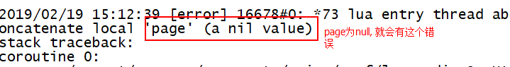


## 8.项目启动步骤

1. 启动zookeeper集群(141)`

```shell
cd /export/servers/zookeeper-3.4.9/bin/
./startZKCloud.sh 
```

2. 启动redis(142)

```shell
cd /export/servers/redis/bin/
./redis-server ../conf/redis_6379.conf 
```

3. 启动solr集群 (141)

```
cd /export/servers/solr/bin
./startSolrCloud.sh

```

4. kafka集群启动 (141)

```
cd /export/servers/kafka/sbin
./startKafka.sh
```

5. 启动搜索及索引创建服务(142)

```shell
cd /export/servers/gossip/search-service-tomcat-9100/bin/
./startup.sh
tail -100f /export/servers/gossip/tomcat-search-service-9100/logs/catalina.out 
```

6. 启动热词消费服务(143)

```shell
cd /export/servers/gossip/tomcat-search-topkey-service-9200/bin/
./startup.sh 
tail -100f /export/servers/gossip/tomcat-search-topkey-service-9200/logs/catalina.out
```

7. 启动门户系统(141: 9001,9002)

```
cd /export/servers/gossip/tomcat-protal-9001/bin/
./startup.sh 
tail -100f /export/servers/gossip/tomcat-protal-9001/logs/catalina.out

cd /export/servers/gossip/tomcat-protal-9002/bin/

./startup.sh 
tail -100f /export/servers/gossip/tomcat-protal-9002/logs/catalina.out
```

8. 启动应用层的nginx (142)

```
cd /export/servers/nginx/sbin/
./nginx
```

9. 启动分发层的openresty (142)

```
cd /export/servers/openresty/nginx/sbin/
./nginx
```

10. 访问 192.168.72.142 查看效果


注意: 由于后期数据的发送都采用了get请求来发送, 故tomcat获取数据会有乱码

```
解决方案: 修改tomcat的编码方式
	在tomcat的server.xml的配置文件中:  找到设置9001 和 9002 端口的配置, 在配置标签上添加一个新的属性如下:
URIEncoding="UTF-8"

添加后的效果:
<Connector executor="tomcatThreadPool"
               port="8080" protocol="HTTP/1.1"
               connectionTimeout="20000"
               redirectPort="8443"  URIEncoding="UTF-8" />
               
 注意: 配置完成后, 将tomcat进行重启, 重启的方式  先停, 后启
```


