# 娱乐头条_storm与热词统计

课前回顾:

* 1)  门户的双层nginx的部署
* 2) 日志流收集 :  页面进行埋点
  * 1) 引入 watch.js, jQuery,js 项目中
  * 2) 需要进行埋点的页面中, 引入这两个js文件
  * 3)  在需要埋点标签上 添加 clstag属性
    * 注意:  submit不允许添加埋点
* 3)  使用lua脚本完成生产消息到kafka : 
* 4)  只需要将页面进行埋点, 和lua脚本进行结合
* storm:
  * 1) storm的基本介绍:  是一个流式计算框架
  * 2) storm架构 : nimbus , supervisor , worker(进程) ,task
  * 3) storm的编程模型 : Spout(数据来源) bolt(处理数据) ,topolopy(拓扑) ,tuple
    * wordCount :  三个
      * ReadSpout:  去读数据
      * splitBolt :  进行对数据的切割处理
      * countBolt :  +1

今日内容:

* 1) wordCount入门案例
* 2) 使用storm消费kafka中数据, 统计热搜数据
* 3) 项目整体测试
* 4) storm集群安装


## 1.storm基础

### 1.1、什么是storm


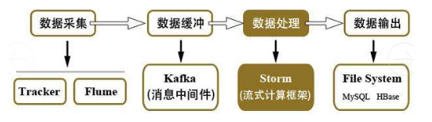

- Hadoop在处理数据的时候，时效性不够，市场期望能够尽快得到处理后的数据。
- Storm是一个流式计算框架，数据源源不断的产生，源源不断的收集，源源不断的计算。（一条数据一条数据的处理）
- Storm只负责数据的计算，不负责数据的存储。
- 2013年前后，阿里巴巴基于storm框架，使用java语言开发了类似的流式计算框架佳作，Jstorm。2016年年底阿里巴巴将源码贡献给了Apache storm，两个项目开始合并，新的项目名字叫做storm2.x。阿里巴巴团队专注flink开发。

### 1.2、storm架构

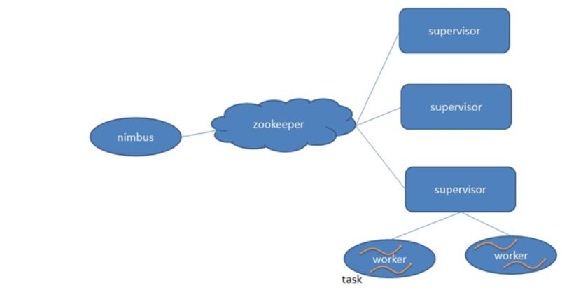

**Nimbus**：负责资源分配和任务调度。

**Supervisor**：负责接受nimbus分配的任务，启动和停止属于自己管理的worker进程。

**Worker**：运行具体处理组件逻辑的进程。

**Task**：worker中每一个spout/bolt的线程称为一个task. 在storm0.8之后，task不再与物理线程对应，同一个spout/bolt的task可能会共享一个物理线程，该线程称为executor。

### 1.3、storm编程模型

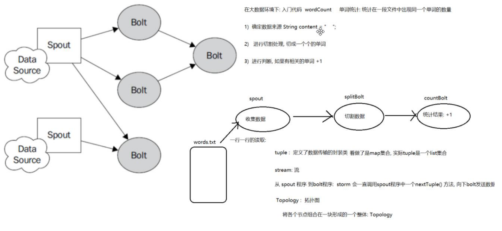

**Topology**：Storm中运行的一个实时应用程序，因为各个组件间的消息流动形成逻辑上的一个拓扑结构。

**Spout**：在一个topology中产生源数据流的组件。通常情况下spout会从外部数据源中读取数据，然后转换为topology内部的源数据。Spout是一个主动的角色，其接口中有个nextTuple()函数，storm框架会不停地调用此函数，用户只要在其中生成源数据即可。

**Bolt**：在一个topology中接受数据然后执行处理的组件。Bolt可以执行过滤、函数操作、合并、写数据库等任何操作。Bolt是一个被动的角色，其接口中有个execute(Tuple input)函数,在接受到消息后会调用此函数，用户可以在其中执行自己想要的操作。

**Tuple**：一次消息传递的基本单元。本来应该是一个key-value的map，但是由于各个组件间传递的tuple的字段名称已经事先定义好，所以tuple中只要按序填入各个value就行了，所以就是一个value list.

**Stream**：源源不断传递的tuple就组成了stream。

## 2.WordCound案例

### 2.1、功能说明

设计一个topology，来实现对一个句子里面的单词出现的频率进行统计。

整个topology分为三个部分：

RandomSentenceSpout：数据源，在已知的英文句子中，随机发送一条句子出去。

SplitSentenceBolt:负责将单行文本记录（句子）切分成单词

WordCountBolt:负责对单词的频率进行累加

### 2.2、案例准备工作

#### 2.2.1、创建工程

创建父工程storm-parent

​	创建jar包工程storm-wordcount

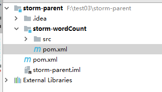

#### 2.2.2、pom配置

```xml
<!--依赖-->
<dependencies>
    <dependency>
        <groupId>org.apache.storm</groupId>
        <artifactId>storm-core</artifactId>
        <version>1.1.1</version>
    </dependency>
</dependencies>
<!--编译插件-->
<build>
    <plugins>
        <plugin>
            <groupId>org.apache.maven.plugins</groupId>
            <artifactId>maven-compiler-plugin</artifactId>
            <version>3.7.0</version>
            <configuration>
                <source>1.8</source>
                <target>1.8</target>
            </configuration>
        </plugin>
    </plugins>
</build>
```

### 2.3、案例编写

#### 2.3.1、ReadFileSpout

```java
package com.itheima.storm;

import org.apache.storm.spout.SpoutOutputCollector;
import org.apache.storm.task.TopologyContext;
import org.apache.storm.topology.OutputFieldsDeclarer;
import org.apache.storm.topology.base.BaseRichSpout;
import org.apache.storm.tuple.Fields;

import java.io.BufferedReader;
import java.io.FileNotFoundException;
import java.io.FileReader;
import java.io.IOException;
import java.util.Arrays;
import java.util.Map;

//  读取文件的spout程序
public class ReadFileSpout extends BaseRichSpout{
    private SpoutOutputCollector collector;
    private  BufferedReader reader ;
    //  在创建和这个RedisFileSpout对象的时候, 会调用这个方法, 进行初始化操作

    /**
     *
     * @param conf  :  进行对storm配置操作, 一般不使用
     * @param context : storm上下文对象, 一般不使用
     * @param collector :  向下游输出内容对象
     */
    @Override
    public void open(Map conf, TopologyContext context, SpoutOutputCollector collector) {
        this.collector = collector;

        try {
             reader = new BufferedReader(new FileReader("G:\\word.txt"));
        } catch (FileNotFoundException e) {
            e.printStackTrace();
        }

    }
    //  当将任务提交给storm程序后, storm程序会不断的调用nextTuple方法, 进行执行
    // 一般在这个方法, 循环的读取数据
    @Override
    public void nextTuple() { // 主动
        try {
            // 一行行获取数据
            String line = reader.readLine();
            if(line != null){
                collector.emit(Arrays.asList(line)); //发送到下游了
            }

        } catch (IOException e) {
            e.printStackTrace();
        }
    }

    // declareOutputFields : 数据传输 tuple, 看做是一个Map, 本质上是一个list, map的中key提前定义好了,
    // 在哪里定义呢?  declareOutputFields
    @Override
    public void declareOutputFields(OutputFieldsDeclarer declarer) {
        declarer.declare(new Fields("line"));
    }
}

```

#### 2.3.2、SplitBolt 

```java
package com.itheima.storm;

import org.apache.storm.task.OutputCollector;
import org.apache.storm.task.TopologyContext;
import org.apache.storm.topology.OutputFieldsDeclarer;
import org.apache.storm.topology.base.BaseRichBolt;
import org.apache.storm.tuple.Fields;
import org.apache.storm.tuple.Tuple;

import java.util.Arrays;
import java.util.Map;

public class SplitBolt  extends BaseRichBolt{
    private OutputCollector collector ;
    // prepare : 创建这个对象的时候, 就会执行这个方法
    @Override
    public void prepare(Map stormConf, TopologyContext context, OutputCollector collector) {
        this.collector = collector;
    }
    //execute :  当上游有数据发过来, 就会执行这个方法, 参数就是数据
    @Override
    public void execute(Tuple tuple) {
        // 从tuple获取数据
        String line = tuple.getStringByField("line");

        //切割数据
        String[] words = line.split(" ");

        for (String word : words) {
            //每次发送一个单词
            collector.emit(Arrays.asList(word,1));
        }

    }

    @Override
    public void declareOutputFields(OutputFieldsDeclarer declarer) {
        declarer.declare(new Fields("word","count"));
    }
}

```

#### 2.3.3、CountBolt 

```java
package com.itheima.storm;

import org.apache.storm.task.OutputCollector;
import org.apache.storm.task.TopologyContext;
import org.apache.storm.topology.OutputFieldsDeclarer;
import org.apache.storm.topology.base.BaseRichBolt;
import org.apache.storm.tuple.Tuple;

import java.util.HashMap;
import java.util.Map;

public class CountBolt extends BaseRichBolt {
    private OutputCollector collector;
    private Map<String,Integer> map = new HashMap<>();
    @Override
    public void prepare(Map stormConf, TopologyContext context, OutputCollector collector) {
        this.collector = collector;
    }

    @Override
    public void execute(Tuple tuple) {
          //1 从tuple中获取数据
        String word = tuple.getStringByField("word");
        Integer count = tuple.getIntegerByField("count");


        if(map.get(word) != null){
            // 如果能获取到, 说明map已经有数据了, +1 即可
            Integer wordCount = map.get(word);
            wordCount++;
            map.put(word,wordCount);
        }else {
            // 如果没有呢?
            map.put(word,count);
        }

        System.out.println(map);
    }

    @Override
    public void declareOutputFields(OutputFieldsDeclarer declarer) {
	
    }
}

```

#### 2.3.4、TopologyMain 驱动类

```java
package com.itheima.storm;

import org.apache.storm.Config;
import org.apache.storm.LocalCluster;
import org.apache.storm.topology.TopologyBuilder;

import java.util.HashMap;

// 构建整个 拓扑关系, 并将拓扑关系提交给strom运行
public class TopologyMain {

    public static void main(String[] args) {
        //1. 构建 拓扑关系
        TopologyBuilder builder = new TopologyBuilder();


        builder.setSpout("readFileSpout",new ReadFileSpout());

        builder.setBolt("splitBolt",new SplitBolt()).shuffleGrouping("readFileSpout");

        builder.setBolt("countBolt",new CountBolt()).shuffleGrouping("splitBolt");


        //2.  提交任务 : 2种  1_本地提交  2. 集群提交

        LocalCluster localCluster = new LocalCluster();
        // 参数1: 任务的名称    参数2:  运行的配置  参数3  拓扑图(任务)
        localCluster.submitTopology("wordCount",new Config(),builder.createTopology());

    }
}
```

### 2.4案例分析

#### 2.4.1画图分析

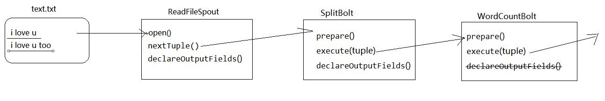

#### 2.4.2、Component生命周期

​	Spout生命周期

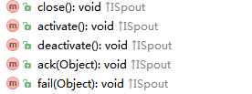

​	Bolt生命周期


​	Bolt的两个抽象类

​		BaseRichBolt 需要手动调ack方法 

​		BaseBasicBolt由storm框架自动调ack方法


## 3.storm消费kafka数据

### 3.0  流程分析

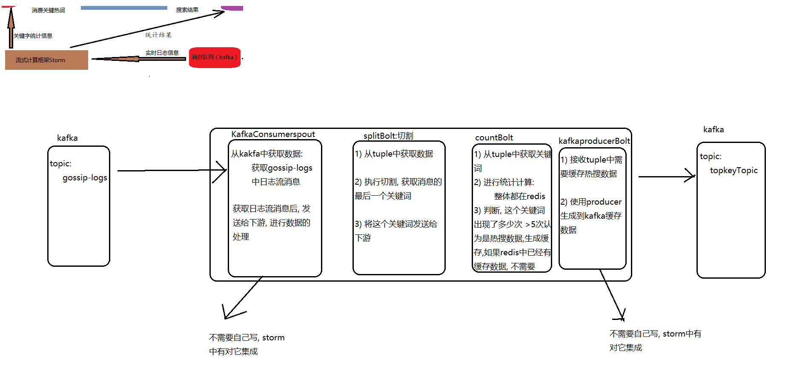


### 3.1.创建工程

创建工程gossip-stormTopkey

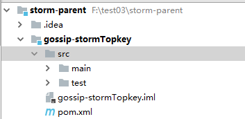

添加依赖

```xml
<!--依赖-->
    <dependencies>
        <dependency>
            <groupId>org.apache.storm</groupId>
            <artifactId>storm-core</artifactId>
            <version>1.1.1</version>
        </dependency>

        <dependency>
            <groupId>org.apache.storm</groupId>
            <artifactId>storm-kafka-client</artifactId>
            <version>1.1.1</version>
        </dependency>


        <dependency>
            <groupId>redis.clients</groupId>
            <artifactId>jedis</artifactId>
            <version>2.9.0</version>
        </dependency>
    </dependencies>
    <build>
        <plugins>
            <plugin>
                <groupId>org.apache.maven.plugins</groupId>
                <artifactId>maven-compiler-plugin</artifactId>
                <version>3.7.0</version>
                <configuration>
                    <source>1.8</source>
                    <target>1.8</target>
                </configuration>
            </plugin>
        </plugins>
    </build>
```


### 3.2  编写: TopkeySplitBolt

> kafka中tuple:一共有五个数据
>
> ​	1)从哪个topic中获取的数据
>
> ​	2)offset:偏移量
>
> ​	3)从哪个分片中获取的
>
> ​	4)消息的key值
>
> ​	5)消息的value的值

包结构: com.itheima.topkeyCount

```java
package com.itheima.topkeyCount;

import org.apache.storm.topology.BasicOutputCollector;
import org.apache.storm.topology.OutputFieldsDeclarer;
import org.apache.storm.topology.base.BaseBasicBolt;
import org.apache.storm.tuple.Fields;
import org.apache.storm.tuple.Tuple;

import java.util.Arrays;

public class TopKeySplitBolt extends BaseBasicBolt{
    @Override
    public void execute(Tuple tuple, BasicOutputCollector collector) {
        System.out.println(tuple.toString());
       //tuple.getStringByField("value")默认字段为value
        //1. 获取上游发过来的数据: kakfa中日志流的数据
        String msg = tuple.getString(4);// 表示获取tuple中第五个数据

        //2. 切割处理
        int lastIndexOf = msg.lastIndexOf("#CS#");

        String keywords = msg.substring(lastIndexOf + 4);


        //3. 发送给下游即可
        collector.emit(Arrays.asList(keywords,1));

    }

    @Override
    public void declareOutputFields(OutputFieldsDeclarer declarer) {

        declarer.declare(new Fields("keywords","count"));
    }
}

```

### 3.3 编写: TopkeyCountBolt

* 1) 创建一个utils包, 放入jedisUtils

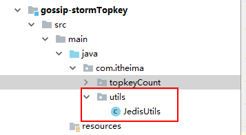

* 2) 编写处理的bolt程序
  * 包结构: com.itheima.topkeyCount

```java
package com.itheima.topkeyCount;

import com.itheima.utils.JedisUtils;
import org.apache.storm.topology.BasicOutputCollector;
import org.apache.storm.topology.OutputFieldsDeclarer;
import org.apache.storm.topology.base.BaseBasicBolt;
import org.apache.storm.tuple.Fields;
import org.apache.storm.tuple.Tuple;
import redis.clients.jedis.Jedis;

import java.util.Arrays;

public class TopKeyCountBolt extends BaseBasicBolt {
    @Override
    public void execute(Tuple tuple, BasicOutputCollector collector) {
        //1. 获取数据
        String keywords = tuple.getStringByField("keywords");
        Integer count = tuple.getIntegerByField("count");

        //2. 判断在redis中这个关键词存在, 如果存在,+1  不存在设置为1
        Jedis jedis = JedisUtils.getJedis();   //bigData:gossip:topKey    sortedSet(排行榜)
        Double score = jedis.zscore("bigData:gossip:topKey", keywords);

        if(score == null){
            //认为没有这个数据
            score = count*1.0;
            jedis.zadd("bigData:gossip:topKey",count,keywords);
        }else{
            // 返回值就是++ 后的值
           score = jedis.zincrby("bigData:gossip:topKey", 1, keywords);
        }

        //3. 判断, 这个元素出现了多少次, 如果大于5次的, 认为是热搜数据
        if(score>5){
            //    bigdata:gossip:keywords:page   string

            if(!jedis.exists("bigdata:gossip:" + keywords + ":1")){
                // 当前关键词没有缓存数据, 需要生成缓存数据
                collector.emit(Arrays.asList(keywords));
            }
        }
        jedis.close();

    }

    @Override
    public void declareOutputFields(OutputFieldsDeclarer declarer) {
        declarer.declare(new Fields("topkey"));
    }
}

```

### 3.4 构建整个topology:

> 官网:www.storm.apache.org/releases,或者百度storm,选择apache-storm

* 1) 集成kafka的消费者

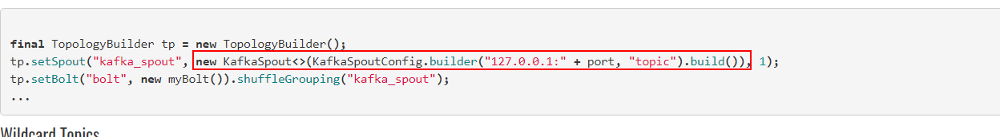

* 2) 集成kakfa的生产者

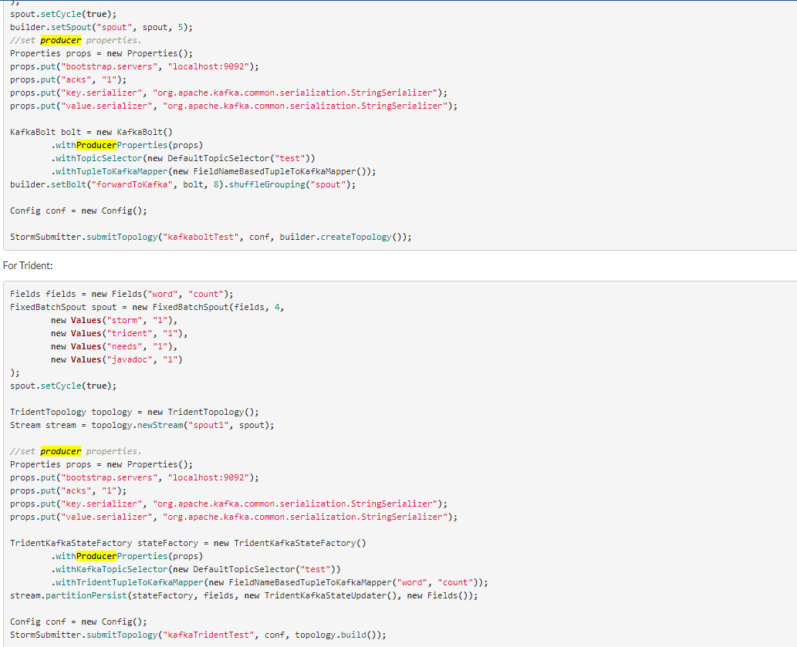

* 3) 编写代码:实现驱动类

```java
package com.itheima.topkeyCount;

import org.apache.kafka.common.serialization.StringDeserializer;
import org.apache.storm.Config;
import org.apache.storm.LocalCluster;
import org.apache.storm.kafka.bolt.KafkaBolt;
import org.apache.storm.kafka.bolt.mapper.FieldNameBasedTupleToKafkaMapper;
import org.apache.storm.kafka.bolt.selector.DefaultTopicSelector;
import org.apache.storm.kafka.spout.KafkaSpout;
import org.apache.storm.kafka.spout.KafkaSpoutConfig;
import org.apache.storm.topology.TopologyBuilder;

import java.util.Properties;

public class TopKeyTopologyMain {
    public static void main(String[] args) {
        //1. 创建 拓扑构造器
        TopologyBuilder builder = new TopologyBuilder();

        KafkaSpoutConfig<String, String> kafkaSpoutConfig = KafkaSpoutConfig.builder("node01:9092,node02:9092,node03:9092", "gossip-logs")
                .setKey(StringDeserializer.class)
                .setValue(StringDeserializer.class)
                .setGroupId("topkey01")
                .build();


        KafkaSpout<String, String> kafkaSpout = new KafkaSpout<>(kafkaSpoutConfig);
        builder.setSpout("kafkaSpout",kafkaSpout);


        builder.setBolt("topKeySplitBolt",new TopKeySplitBolt()).shuffleGrouping("kafkaSpout");


        builder.setBolt("topKeyCountBolt",new TopKeyCountBolt()).shuffleGrouping("topKeySplitBolt");


        Properties props = new Properties();
        props.put("bootstrap.servers", "node01:9092,node02:9092,node03:9092");
        props.put("acks", "all");
        props.put("key.serializer", "org.apache.kafka.common.serialization.StringSerializer");
        props.put("value.serializer", "org.apache.kafka.common.serialization.StringSerializer");

        KafkaBolt bolt = new KafkaBolt()
                .withProducerProperties(props)  //kakfa生成者的配置信息
                .withTopicSelector(new DefaultTopicSelector("topkeyTopic")) //指定默认的topic
                .withTupleToKafkaMapper(new FieldNameBasedTupleToKafkaMapper(null,"topkey")); //指定接收上游数据的filed值:参数1 key  参数2:value

        builder.setBolt("kafkaBolt",bolt).shuffleGrouping("topKeyCountBolt");


        //2. 提交任务

        LocalCluster cluster = new LocalCluster();

        cluster.submitTopology("topkeyCount",new Config(),builder.createTopology());

    }
}

```

### 3.5 整体测试:

* 1) 启动之前那一坨服务:

```
1.1) 启动zookeeper集群  
1.2) 启动redis
1.3) 启动solrCloud集群
1.4) 启动kafka集群
1.5) 可选(dubbo-admin)
1.6) 启动 142 中  搜索服务工程
1.7) 启动 143 中 热词消费服务
1.8) 启动 141 中两台 门户系统
1.9) 启动 142 中 代理层nginx
1.10) 启动 142 中openresty
1.11)启动storm的热词统计程序
```

* 2) 测试

```
2.1) 搜索服务的日志文件: 打开   ---索引写入的过程
2.2) 热词消费服务日志 : 打开   ---  观察热搜数据的缓存到redis的过程
2.3) 打开 openresty的错误日志文件 ---  观察执行搜索请求, 是否OK
2.4) 打来 openresty的成功日志文件  ---- 观察埋点请求是否发送
2.5)  打开 redis   ----观察 缓存数据(string) 和  热搜数据(排行榜) 是否正确写入到redis中
2.6)  打开kafka的两个消费者:  topic:  gossip-logs  topic: topkeyTopic
```

* 3) 准备工作:

```
将redis中  原有的热搜数据(静态数据) 清空
将爬虫的定时任务开启
```

* 4) 操作即可 :  页面执行查询

```
4.1)当爬虫运行的时候,观察写入索引是否成功
4.2)在当前页面进行搜索的时候
	观察1:查询请求是否成功
	观察2:埋点请求有没有发送
	观察3:排行榜信息是否+1操作
	观察4:当某一个关键词数据达到5次以上,redis中缓存数据是否成功

free -m	查看linux内存使用量
```


日志告警系统

## 4.storm集群安装

### 4.1准备环境

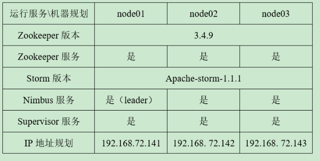

说明：

1. 三台虚拟机安装zookeeper集群并启动---版本3.4.9
2. 配置/etc/hosts

```properties
192.168.72.141 node01
192.168.72.142 node02
192.168.72.143 node03
```

1. storm版本1.1.1
2. 下载地址：http://storm.apache.org/downloads.html

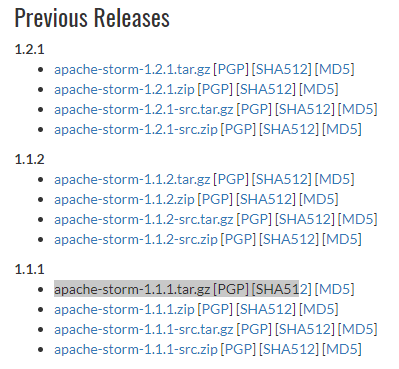

### 4.2集群安装

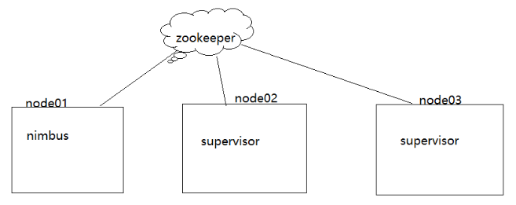

1. 上传storm压缩包

```properties
cd /export/software
```

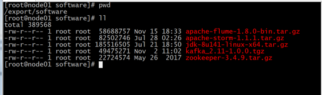

1. 解压安装包

```properties
tar -zxvf apache-storm-1.1.1.tar.gz -C ../servers/
cd ../servers/
```

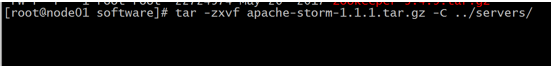

1. 修改配置文件storm.yaml（**注意**：编写和修改配置顶头，注意空格问题，复制时 注释不要复制）

```properties
#zookeeper集群信息
storm.zookeeper.servers:
     - "node01"
     - "node02"
     - "node03"
#nimbus种子信息
nimbus.seeds: ["node01", "node02", "node03"]
#storm数据存放目录
storm.local.dir: "/export/servers/apache-storm-1.1.2/stormdata"
#storm的UI界面占用的端口
ui.port: 8088
#supervisor启动任务task时占用的槽点（端口号）
supervisor.slots.ports:
    - 6700
    - 6701
    - 6702
    - 6703
```

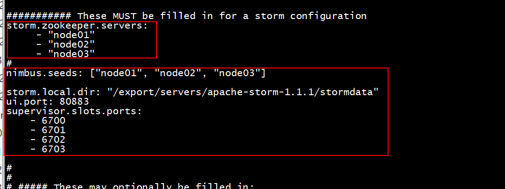

1. 将storm安装程序分发拷贝到另外两台机器上

```properties
scp -r apache-storm-1.1.2/ node02:/export/servers/
scp -r apache-storm-1.1.2/ node03:$PWD
```

1. 启动服务

**node01**

```properties
cd /export/servers/apache-storm-1.1.1/bin
#启动 nimbus进程
nohup ./storm nimbus >/dev/null 2>&1 &
#启动web UI
nohup ./storm ui >/dev/null 2>&1 &
#启动logViewer（不建议启动）--很占用内存
nohup ./storm logviewer >/dev/null 2>&1 &
#启动supervisor
nohup ./storm supervisor >/dev/null 2>&1 &
```

**node02**

```properties
#启动 nimbus进程
nohup ./storm nimbus >/dev/null 2>&1 &
#启动logViewer（不建议启动）
nohup ./storm logviewer >/dev/null 2>&1 &
#启动supervisor
nohup ./storm supervisor >/dev/null 2>&1 &
```

**node03**

```properties
#启动 nimbus进程
nohup ./storm nimbus >/dev/null 2>&1 &
#启动logViewer（不建议启动）
nohup ./storm logviewer >/dev/null 2>&1 &
#启动supervisor
nohup ./storm supervisor >/dev/null 2>&1 &
```

### 4.3torm的UI界面管理

#### 4.3.1UI访问

访问地址

http://192.168.72.141:8088/index.html

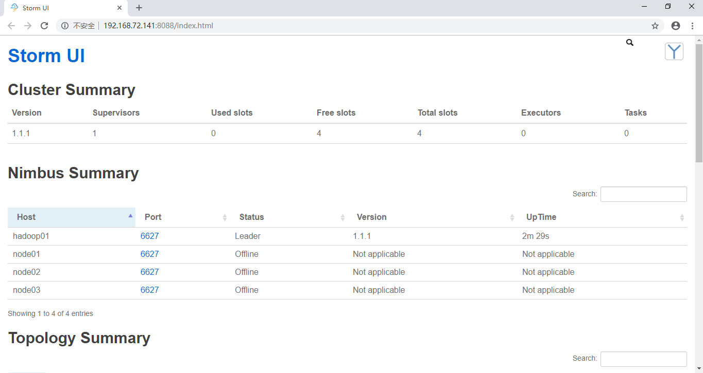

- **集群概要**

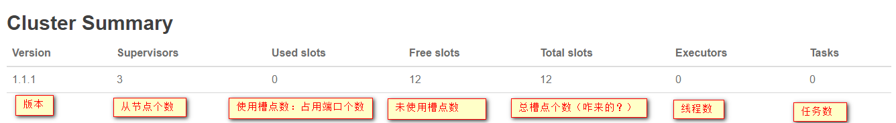

- **nimbus 概要**


- **supervisor 概要**

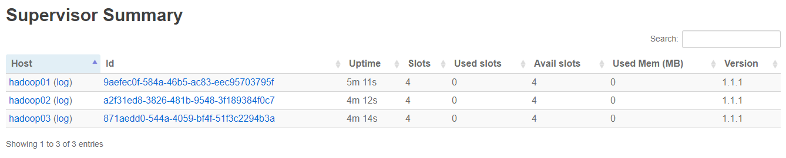

- **topology 概要**--没有任务上传


#### 4.3.2 wordcount案例修改

​	storm集群安装成功后，我们可以将storm案例打包运行在stomr集群上。

**FileReadSpout**

​	wordcount案例中获取的是windows磁盘下的文件，在虚拟机上将会报找不到文件的错误，这里将文件读取修改为随机获取数组中元素内容（该内容为一句话，所以整体逻辑不影响）

```java
package cn.itcast.storm.wc;
import org.apache.storm.spout.SpoutOutputCollector;
import org.apache.storm.task.TopologyContext;
import org.apache.storm.topology.OutputFieldsDeclarer;
import org.apache.storm.topology.base.BaseRichSpout;
import org.apache.storm.tuple.Fields;
import org.apache.storm.tuple.Values;
import java.util.Map;
import java.util.Random;

public class FileReadSpout extends BaseRichSpout {

    private SpoutOutputCollector spoutOutputCollector;
    //在这里定义了一个随机对象，用于获取随机数
    Random rand;
    
    @Override
    public void open(Map map, TopologyContext topologyContext, SpoutOutputCollector spoutOutputCollector) {
            this.spoutOutputCollector=spoutOutputCollector;
            //初始化随机对象
            rand = new Random();
    }

    @Override
    public void nextTuple() {
        //定义数组，作为数据来源
        String[] sentences = new String[]{ "my storm word count", "hello my storm", "hello storm hello world"};
        //通过随机下标，随机获取数组中的元素
        String sentence = sentences[rand.nextInt(sentences.length)];
        //将获取的句子发送走
        spoutOutputCollector.emit(new Values(sentence));
    }

    @Override
    public void declareOutputFields(OutputFieldsDeclarer outputFieldsDeclarer) {
        outputFieldsDeclarer.declare(new Fields("juzi"));
    }
}
```

**TopologyMain**

​	编译好的项目需要打包上传，所以topology提交模式需要修改为集群模式

```java
package cn.itcast.storm.wc;
import org.apache.storm.Config;
import org.apache.storm.LocalCluster;
import org.apache.storm.StormSubmitter;
import org.apache.storm.generated.AlreadyAliveException;
import org.apache.storm.generated.AuthorizationException;
import org.apache.storm.generated.InvalidTopologyException;
import org.apache.storm.topology.TopologyBuilder;

public class TopologyMain {
    public static void main(String[] args) throws Exception {
        TopologyBuilder builder = new TopologyBuilder();
        builder.setSpout("readSpout",new FileReadSpout());
        builder.setBolt("splitBolt",new SplitBolt()).shuffleGrouping("readSpout");
        builder.setBolt("countBolt",new CountBolt()).shuffleGrouping("splitBolt");

        Config config = new Config();
        if(args!=null&&args.length>0){//有参数是集群模式
            StormSubmitter.submitTopology(args[0],config,builder.createTopology());
        }else{
            LocalCluster cluster = new LocalCluster();
            cluster.submitTopology("wcToplogy",config,builder.createTopology());
        }
    }
}
```

**pom.xml**

​	jar的常见依赖范围有compile、provided、runtime、test四种，IDEA中的运行环境和storm集群上运行的环境不一致，所以打包时选择好jar包的依赖范围，storm集群会提供storm的jar，所以这里改为provided

```xml
<dependencies>
    <dependency>
        <groupId>org.apache.storm</groupId>
        <artifactId>storm-core</artifactId>
        <version>1.1.1</version>
        <!-- 目前<scope>可以使用5个值：
    * compile，缺省值，适用于所有阶段，会随着项目一起发布。
    * provided，类似compile，期望JDK、容器或使用者会提供这个依赖。如servlet.jar。
    * runtime，只在运行时使用，如JDBC驱动，适用运行和测试阶段。
    * test，只在测试时使用，用于编译和运行测试代码。不会随项目发布。
    * system，类似provided，需要显式提供包含依赖的jar，Maven不会在Repository中查找它。  -->
        <scope>provided</scope>
    </dependency>
</dependencies>
<build>
    <plugins>
        <plugin>
            <groupId>org.apache.maven.plugins</groupId>
            <artifactId>maven-compiler-plugin</artifactId>
            <version>3.7.0</version>
            <configuration>
                <source>1.8</source>
                <target>1.8</target>
            </configuration>
        </plugin>
    </plugins>
</build>
```

上传任务执行程序

```properties
#storm命令 jar 被执行的任务jar包 入口main所在类路径 任务名称
/export/servers/apache-storm-1.1.1/bin/storm jar /export/servers/wordcount.jar  cn.itcast.storm.wc.TopologyMain wordcount
```

#### 4.3.3上传任务后UI界面分析

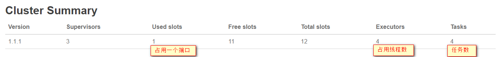

------


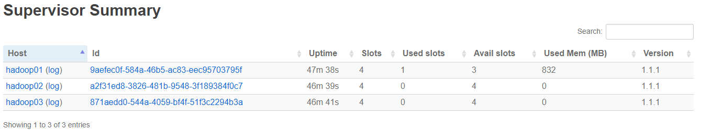

------


------

------


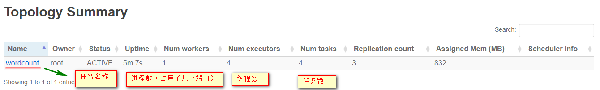

------


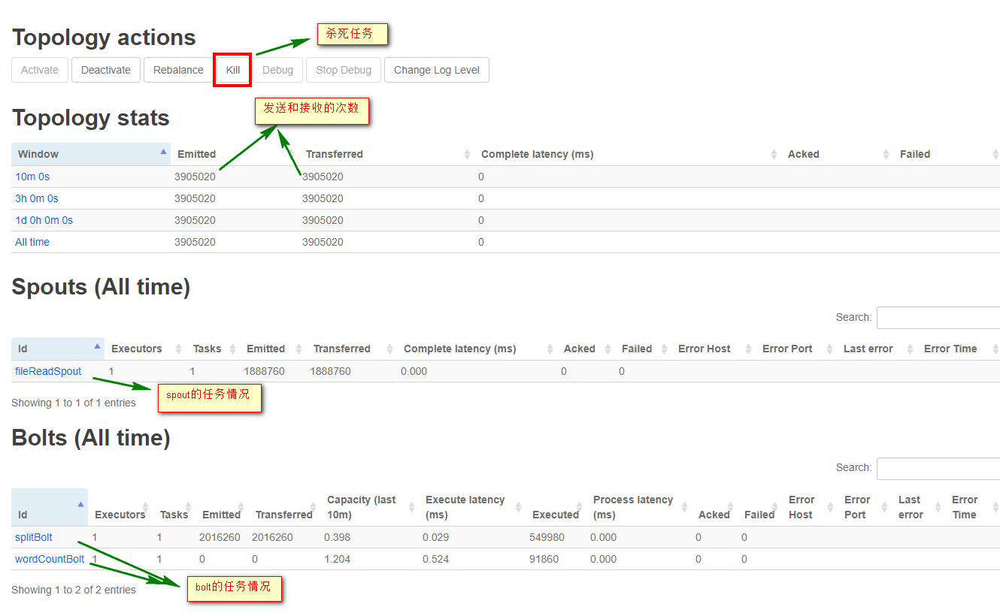

**storm中不能存在相同任务名**

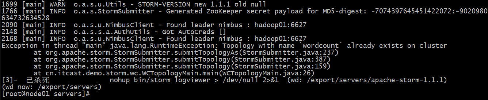

## 
