# 娱乐头条_点击流日志收集

课前回顾：

* 1) 单机版本的门户部署 :
* 2) 使用nginx完成对门户的反向代理和负载均衡
* 3) 为什么要升级为双层nginx
* 4) 安装openresty :
* 5)  将openresty 和 代理层nginx集成
* 6) 动静分离
*  7) lua基本使用: 如何连接redis , 如果接受和发送请求

今日内容：

* 1) 双层nginx的部署
* 2)  日志收集系统测试
* 3)   使用 lua  集成 kafka
* 4)  在头条项目中集成日志收集
* 5) 介绍storm


```
1)  开启三台虚拟机
2)  开启redis
3)  开启 zookeeper集群
4)  开启solrCloud集群
5)  开启kafka集成
6)  (可选)开启 dubbo-admin
7)  开启search搜索服务: 142
8)  开启热词服务:  143
9)  开启门户项目:  141 (两个)
10) 开启 142  代理层 nginx
11) 开启  142  分发层openresty
```


## 1.日志收集系统&部署

### 1.1系统分析

#### 1.1.1背景分析

​	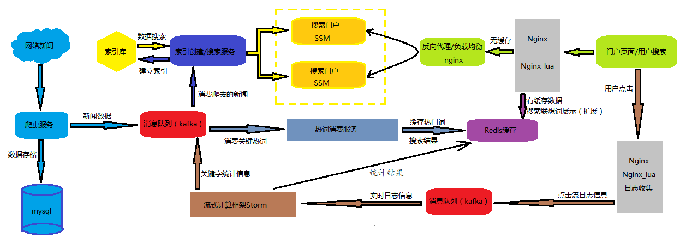

#### 1.1.2架构分析

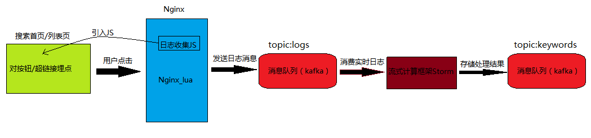

1. **用户**点击搜索发送请求及点击超链接产生用户行为

2. **搜索首页及列表页**加载nginx中部署的watch.js文件，实现浏览器及超链接埋点，用来收集用户点击日志

3. **nginx_lua**部署watch.js，用来收集用户点击请求，nginx.conf集成kafka.lua脚本，收集请求信息，kafka.lua中集成kafka集群配置，将请求生成日志topic通过生产者发送消息

4. **kafka集群**接收nginx_lua收集的用户点击日志topic

5. **storm集群**作为消费者消费kafka中用户点击日志，实现数据实时处理，并整理收集关键字，将整理的关键字topic发送到kafka中

6. **kafka集群**接收storm集群处理的关键字结果，热词消费服务（昨天内容），消费kafka信息，根据热词缓存热搜新闻信息

#### 1.1.3 技术选型

1. 浏览器埋点技术--基于watch.js实现

2. 收集埋点请求信息，实现点击数据转发--nginx_lua（openresty版本）

3. 实现数据发送和接收，实现工程解耦，降低请求访问压力--kafka集群

4. 数据接收和数据处理中心，实现关键字的统计和结果发送--storm集群

### 1.2系统部署

#### 1.2.1 nginx_lua的安装

​	采用集成了nginx与lua模块的openResty，双层nginx部署已经存在openResty，这里不再重复安装，工作时建议独立使用

**启动nginx**

```properties
/export/servers/openresty/nginx/sbin/nginx -s reload   # 重新加载配置文件(142)
```

#### 1.2.2.集成数据采集JS

​	**资料\埋点技术**

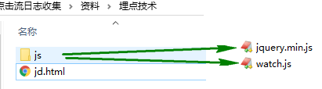

​	原理：

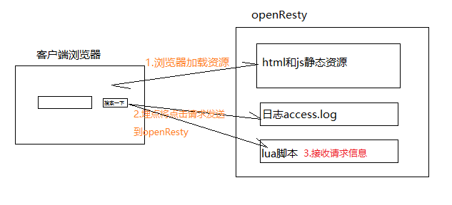

* 昨天综合部署中，我们将门户网站进行了动静分离，将静态资源部署到openResty所在的192.168.72.143这台服务器的/export/servers中，这里我们将日志收集测试文件同样部署到这个位置进行发布

```properties
#进入到昨天静态资源文件夹
cd /export/servers/openresty/nginx/html
#将静态资源jd.html内容部署到该文件夹下
#将资料中js内文件上传到nigux的js文件夹下
```

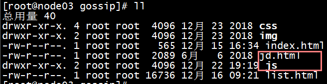

* 修改watch.js文件，作用是：当用户点击时，会发送请求到日志收集系统中。

```js
function r(t, e) {
    var a = f()
    a.clstag = t.clstag
    //var n = '//' + location.hostname + '/watch' 
    //将地址指定日志收集系统所在ip
    var n = '//192.168.72.142/kafka_lua'
    i.ajax({
        url: n,
        type: 'POST',
        data: a,
        dataType: 'json',
        success: function(t) {},
        error: function(t) {},
        complete: function(t) {
            e()
        }
    })
}
```

下面是修改参考图：

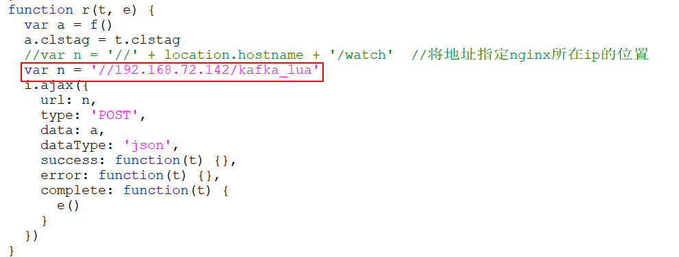

* 浏览器埋点，测试页面jd.html引入watch.js

```html
<script src="js/jquery.min.js"></script>
<script type="text/javascript">
    var jaq = jaq || [];
    jaq.push(['account', '_ACCOUNT_']);
    jaq.push(['domain', '_DOMAIN_']);
    (function () {
        var ja = document.createElement('script'); ja.type = 'text/javascript'; ja.async = true;
        ja.src = 'js/watch.js'
        var s = document.getElementsByTagName('script')[0]; s.parentNode.insertBefore(ja, s);
    })();
</script>
```

下面是修改参考图： jQuery.min.js的位置 和 warch.js的位置

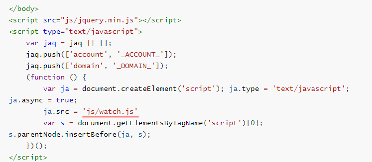

* 页面按钮或超链接埋点

原理：超链接或按钮中加入clstag="homepage|keycount|home2013|08a"，watch.js监测到该按钮或超链接被点击，将发送请求到指定的位置，其中clstag的内容是可以自定义的。

```html
<!--clstag用于埋点，有该属性的dom点击行为将被采集-->
<!--有clstag属性，标识08a-->
<div clstag="homepage|keycount|home2013|08a" class="placeholder">有clstag</div>
<!--无clstag属性，不会被收集-->
<div class="placeholder">无clstag</div>
<!--有clstag属性，标识08g-->
<button clstag="homepage|keycount|home2013|08g">button按钮</button>
<!--有clstag属性，标识08c-->
<input type="button" clstag="homepage|keycount|home2013|08c" value="input按钮" />
<!--有clstag属性，标识08d-->
<a clstag="homepage|keycount|home2013|08d" href="http://www.baidu.com">链接跳转捕获</a>
<!--有clstag属性，标识08e-->
<a clstag="homepage|keycount|home2013|08e" href="http://www.baidu.com" target="_blank">链接target捕获</a>
```

#### 1.2.2测试

* 重启openResty

```properties
/export/servers/openresty/nginx/sbin/nginx -s reload
```

* 打开nginx日志文件，点击浏览器请求按钮，查询日志信息

```
#日志查看命令
tail -10f /export/servers/openresty/nginx/logs/access.log
```

* 结果展示 : 有可能状态码为404  

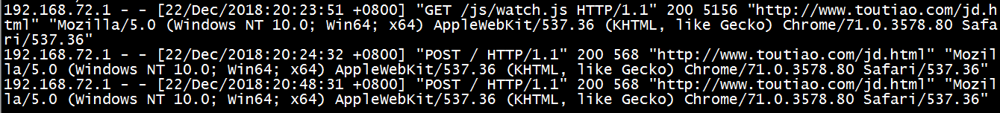


```
埋点的步骤:
	1. 添加watch.js 和jQuery的js到项目中:修改watch.js中的发送请求的路径;
	2. 将这个watch.js和jquery.js添加到页面中 : 
	<script src = "js/jquery.mini.js"></script>
	
	<script type="text/javascript">
        var jaq = jaq || [];
        jaq.push(['account', '_ACCOUNT_']);
        jaq.push(['domain', '_DOMAIN_']);
        (function () {
            var ja = document.createElement('script'); ja.type = 'text/javascript'; ja.async = true;
            ja.src = 'js/watch.js'  // 修改这个路径即可,添加在页面的最后面
            var s = document.getElementsByTagName('script')[0]; s.parentNode.insertBefore(ja, s);
        })();
    </script>
    3. 在标签上添加clstag属性, 属性的值可以随意填,但是不能不填
    	注意:  标签中特别注意一个标签不能够添加埋点: submit标签
```

## 2.nginx_lua集成kafka集群

安装Kafka，需要先下载一个插件，然后在进行配置。

### 2.1下载插件(142)

```properties
# 下载插件
cd /export/software/
# 浏览器下载（wget会失败）
https://github.com/doujiang24/lua-resty-kafka/archive/master.zip
# 上传解压插件
unzip lua-resty-kafka-master.zip
# 拷贝插件到openresty安装目录  以下是一行
cp -r lua-resty-kafka-master/lib/resty/kafka/ /export/servers/openresty/lualib/resty/
# 查看插件目录
ll /export/servers/openresty/lualib/resty/
```

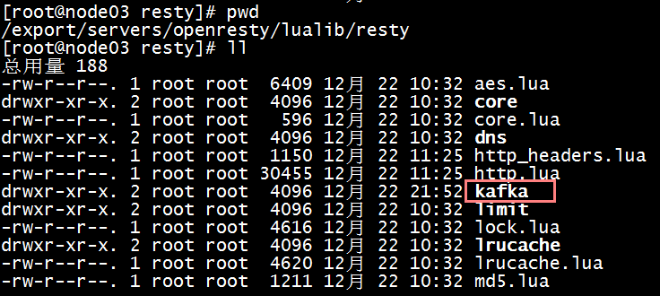

### 2.2 准备kafka_lua文件

#### 2.2.1 kafka准备

* 启动kafka集群

```properties
#查看集群启动情况
jps
#启动kafka : 或者直接采用kafka集群脚本
cd /export/servers/kafka/bin
./kafka-server-start.sh /export/servers/kafka/config/server.properties >/dev/null 2>&1 &
```

* 创建日志topic：gossip-logs

```properties
#创建topic：logs
./kafka-topics.sh --create --zookeeper node01:2181 --replication-factor 2 --partitions 3 --topic gossip-logs
#查看topic列表 
./kafka-topics.sh --list --zookeeper node01:2181
```

* 启动消费者

```properties
./kafka-console-consumer.sh --bootstrap-server node01:9092 --topic gossip-logs
```

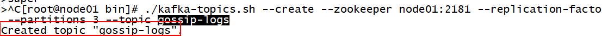

* 启动生产者

```properties
./kafka-console-producer.sh --broker-list node01:9092 --topic gossip-logs
#测试
>杨幂
```

#### 2.2.2文件准备(142)

创建一个: kafka.lua

​	将文件创建在/export/servers/openresty/nginx/conf下

```properties
vi kafka.lua	#创建文件
```

> 此脚本功能:  用来获取用户请求来数据, 将用户数据按照一定格式拼接起来, 将拼接后固定格式数据发送给kafka

```properties
#kafka.lua

local time_local = ngx.var.time_local
if time_local == nil then
    time_local = ""
end

local request = ngx.var.request
if request == nil then
    request = ""
end

local request_method = ngx.var.request_method
if request_method == nil then
    request_method = ""
end

local content_type = ngx.var.content_type
if content_type == nil then
    content_type = ""
end

ngx.req.read_body()
local request_body = ngx.var.request_body
if request_body == nil then
    request_body = ""
end

local args = ngx.req.get_post_args()
local clstag = args["clstag"]
ngx.say("keywords:",clstag)


local http_referer = ngx.var.http_referer
if http_referer == nil then
    http_referer = ""
end

local remote_addr = ngx.var.remote_addr
if remote_addr == nil then
    remote_addr = ""
end

local http_user_agent = ngx.var.http_user_agent
if http_user_agent == nil then
    http_user_agent = ""
end

local time_iso8601 = ngx.var.time_iso8601
if time_iso8601 == nil then
    time_iso8601 = ""
end

local server_addr = ngx.var.server_addr
if server_addr == nil then
    server_addr = ""
end

local http_cookie = ngx.var.http_cookie
if http_cookie == nil then
    http_cookie = ""
    http_cookie = ""
end
-- #CS#用于字符串切割的符号
local message = time_local .."#CS#".. request .."#CS#".. request_method .."#CS#".. content_type .."#CS#".. request_body .."#CS#".. http_referer .."#CS#".. remote_addr .."#CS#".. http_user_agent .."#CS#".. time_iso8601 .."#CS#".. server_addr .."#CS#".. http_cookie .."#CS#".. clstag

local producer = require "resty.kafka.producer"

local broker_list = {
-- 这个地方不能使用 主机名, 只能ip地址,可以写多个
    { host = "192.168.72.142", port = 9092 },
}

-- sync producer_type  lua在生产数据使用异步来生产数据	async异步发送
local p = producer:new(broker_list, { producer_type = "async" })  
-- nil 相当于 null
local offset, err = p:send("gossip-logs", nil, message)
if not offset then
    ngx.say("send err:", err)
    return
end
```

### 2.3在/export/servers/openresty/nignx/conf/下修改lua_redis_Or_Http.conf文件

```properties
cd /export/servers/openresty/nx/conf/
vi lua_redis_Or_Http.conf
# 需要在nginx.conf中配置,include
```

```properties
#添加访问kafka_lua模块代码配置
location /kafka_lua {
        #resolver 8.8.8.8;  指定DNS的解析地址
        default_type 'text/html';
        content_by_lua_file     /export/servers/openresty/nginx/conf/kafka.lua;
}
```

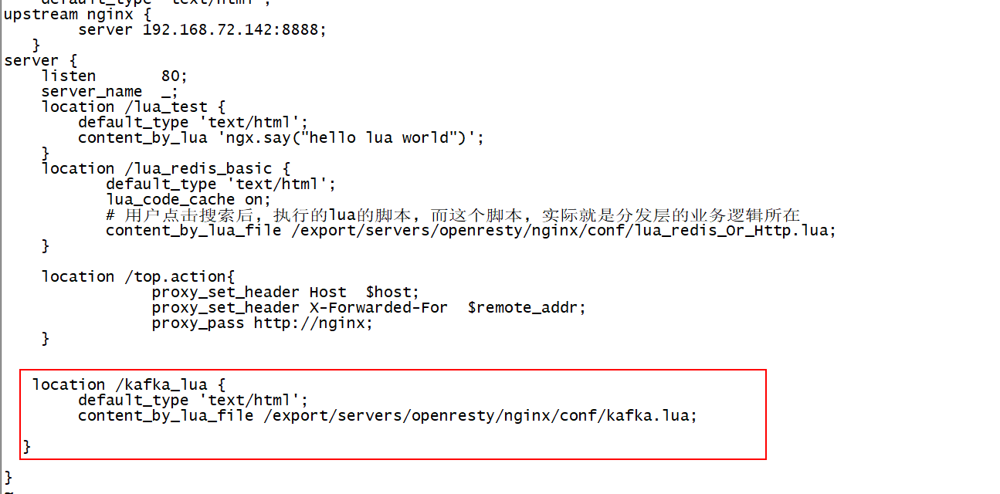

```
重新加载一下配置文件:
	/export/servers/openresty/nginx/sbin/nginx -t
	/export/servers/openresty/nginx/sbin/nginx -s reload
```

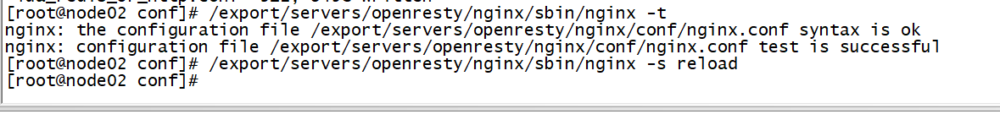

### 2.4修改kafka配置文件  (不需要的) 

​	注意：lua作为生产者连接kafka需要识别kafka服务器，所以需要在kafka的server.properties中加入kafka所在服务器的host.name

```properties
host.name=192.168.72.143
```

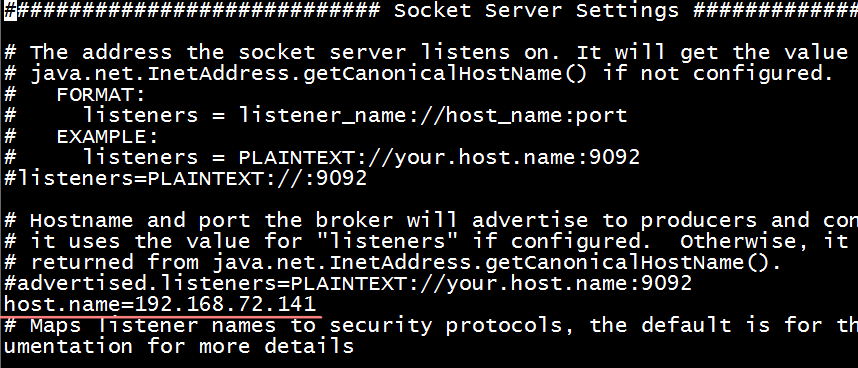

### 2.5测试

控制台开启消费者，点击jd.html页面按钮，查看控制台打印情况

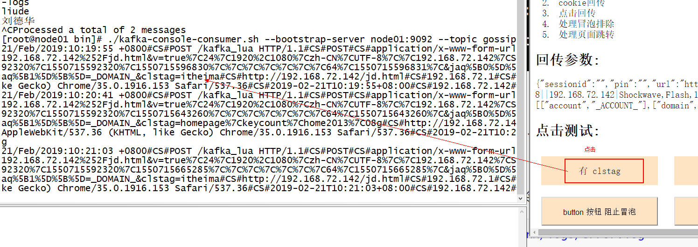

* 如果消费者接收不到消息, 查询nginx错误日志命令,看是否有错误

```properties
tail -100f /export/servers/openresty/nginx/logs/error.log
```

## 3.娱乐头条页面日志收集

将数据采集集成到搜索页首页项目gossip-searchPortal

### 3.1list页面引入jquery.js

前面引入过jquery.js，此步骤可以省略

### 3.2浏览器埋点

index.html和list.html中浏览器埋点，两个页面做法一样，这里以list.html为例：

```html
<!--放到body结束标签下-->

<script type="text/javascript">
  var jaq = jaq || [];
  jaq.push(['account', '_ACCOUNT_']);
  jaq.push(['domain', '_DOMAIN_']);
  (function () {
    var ja = document.createElement('script'); ja.type = 'text/javascript'; ja.async = true;
    ja.src = 'js/watch.js'
    var s = document.getElementsByTagName('script')[0]; s.parentNode.insertBefore(ja, s);
  })();
</script>
```

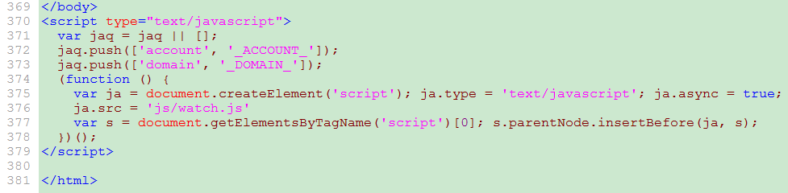

### 3.3搜索按钮埋点list.html中

```html
<!-- 顶部搜索	 - start -->
<div class="header">
    <div class="head">
        <div class="logo"><a href="#"></a></div>
        <!--在form表单上添加id-->
        <form id="formId" action="/list.html" class="formBox" method="get">
            <input type="text" class="inputSeach" id="inputSeach" name="keywords" onfocus ="ajaxTopQuery(this)" >
            <!--将搜索输入项类型改为button，触发埋点 clstag="search"中的内容可以任意，但是不能为空，用onclick触发表单提交方法-->
            <input type="button" clstag="search" onclick="document:formId.submit()" value="搜索一下" class="inputSub">
            <div class="recommend">

            </div>
        </form>
    </div>
</div>
```


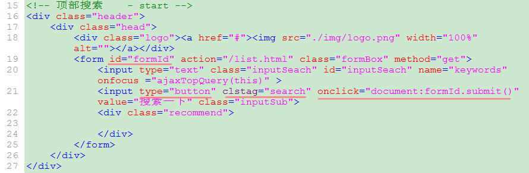

### 3.4.综合测试

点击搜素按钮，在kafka消费者控制台查看收集到的日志信息:如果点击没有看到,建议先将浏览器的缓存清理一下:ctrl+shift+del清楚全部缓存

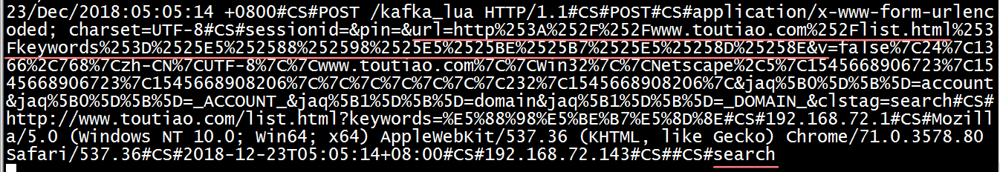

途中标红的内容就是收集到的页面url和clstag标签上的内容


发现了一个问题:  只能获取到用户上一次输入的关键词,无法及时获取到用户当前输入的关键词

解决方案:  clstag动态获取用户当前输入的内容

* 1) 在搜索框中添加一个失去焦点事件: onblur = "getKeywords()"


* 2) 在页面的最后, 编写函数 : 函数的名称  getKeywords

```javascript
<script>

  function getkeywords(){
  
	//1. 获取用户输入内容
	var keywords = $("[name=keywords]").val();
	
	//2. 将用户输入的内容设置到搜索一下的按钮中clstag属性中
	$(".inputSub").attr("clstag",keywords);
  }

</script>
```

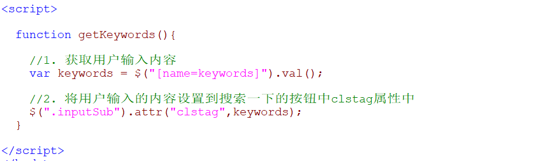


* 3) 将index.html集成在一块


## 4.storm简介

### 4.1、什么是storm


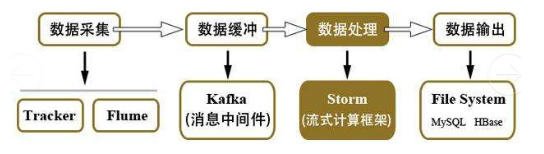

- Hadoop在处理数据的时候，时效性不够，市场期望能够尽快得到处理后的数据。离线计算
- Storm是一个流式计算框架，数据源源不断的产生，源源不断的收集，源源不断的计算。（一条数据一条数据的处理）实时统计
- Storm只负责数据的计算，不负责数据的存储。
- 2013年前后，阿里巴巴基于storm框架，使用java语言开发了类似的流式计算框架佳作，Jstorm。2016年年底阿里巴巴将源码贡献给了Apache storm，两个项目开始合并，新的项目名字叫做storm2.x。阿里巴巴团队专注flink开发。


### 4.2、storm架构

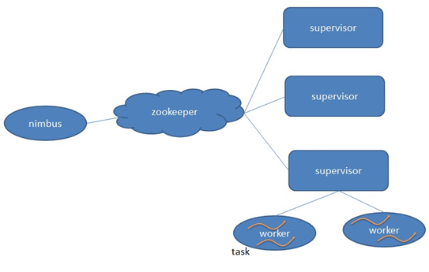

**Nimbus**：storm中的主节点,负责集群管理、资源分配和任务调度。

**Supervisor**：storm中的从节点,负责接受nimbus分配的任务，启动和停止属于自己管理的worker进程。

**Worker**：表示一个进程,一个任务就是一个进程,storm可以统计多个任务,运行具体处理组件逻辑的进程。

**Task**：表示一个个进程,真时执行任务的地方,worker中每一个spout/bolt的线程称为一个task. 在storm0.8之后，task不再与物理线程对应，同一个spout/bolt的task可能会共享一个物理线程，该线程称为executor。

**zookeeper**：负责中转,当提交一个任务给storm的时候,有nimbus接收任务,将分配的结果保存到zookeeper上;supervisor一直和zookeeper保持连接:有我执行的任务吗:一旦有了任务,对应的supervisor开启进程,在进程里面开启对应的线程执行任务


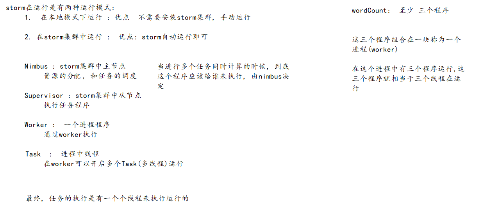


### 4.3、storm编程模型

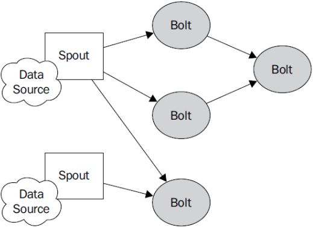

**Topology**：Storm中运行的一个实时应用程序，因为各个组件间的消息流动形成逻辑上的一个拓扑结构。

​	组成后的**Topology** 看做是一个 任务 一个一个任务就看是一个个的进程, 一个spout一个个bolt就是一个个的线程

**Spout**：在一个topology中产生源数据流的组件。通常情况下spout会从外部数据源中读取数据，然后转换为topology内部的源数据。Spout是一个主动的角色，其接口中有个nextTuple()函数，storm框架会不停地调用此函数，用户只要在其中生成源数据即可。

**Bolt**：在一个topology中接受数据然后执行处理的组件。Bolt可以执行过滤、函数操作、合并、写数据库等任何操作。Bolt是一个被动的角色，其接口中有个execute(Tuple input)函数,在接受到消息后会调用此函数，用户可以在其中执行自己想要的操作。


**Tuple**：一次消息传递的基本单元。本来应该是一个key-value的map，但是由于各个组件间传递的tuple的字段名称已经事先定义好，所以tuple中只要按序填入各个value就行了，所以就是一个value list.

**Stream**：源源不断传递的tuple就组成了stream。


