# 娱乐头条-storm高级1

课程回顾:

- 日志收集系统:

  - 1)日志收集系统需要使用的技术点
    - 前段页面需要使用watch.js实现埋点操作:收集用户点击时候的日志信息
    - 后端,需要使用openresty来接收埋点请求,使用lua脚本的方式获取请求中的一些参数
    - lua脚本:获取到埋点请求参数后,将参数拼接成一个message消息,发送到kafka中
  - 2)lua和kafka的集成
    - 2.1)lualib目录中是否摇lua对kafka的lua的库
      - 如果有就可以直接连接对应的第三方的工具
      - 如果没有,需要先下载对应的lua库
    - 2.2)编写lua的脚本文件
    - 2.3)在nginx.conf中通过location中属性来加载lua的脚本文件
  - 3)埋点操作的基本操作步骤:
    - 3.1)在需要进行埋点的项目中引入jquery和watch.js文件
    - 3.2)修改watch.js中的埋点请求路径
    - 3.3)在需要进行埋点的页面找到标签,引入jquery和watch.js的文件
    - 3.4)在页面中对应需要埋点的标签上,添加clstag属性,属性值可以随意的写,写什么后端就会给后端发什么内容,但是不能不写
      - 注意:submit标签是不允许进行埋点的

- 热词统计:

  - 1)storm的基本介绍:storm是流式实时计算框架数据是源源不断的产生,源源不断的进行计算

  - 2)storm的架构

    - nimbus:storm集群的主节点,用于资源的调度和任务的分配
    - supervisor:storm的集群的从节点,用于接收任务,执行任务
    - worker:代表一个进程,一般来说默认,一个任务就会开启一个进程
    - task:代表线程,在一个任务中,各个子程序就是一个个的线程

  - 3)storm的编程模型

    - spout:用来和数据源打交道,获取数据
    - bolt:用来统计计算
    - tuple传输数据的载体
    - stream:通过spout和bolt从上游往下游发送tuple数据,形成流的方式

  - 4)入门案例:wordCount

  - 5)热词统计

    

今日内容:

* 1) storm集群的安装
* 2) 将任务上传到storm集群中运行:
* 3)storm的原理
  * 3.1) 提交任务的整个流程
  * 3.2) storm并行度和并发的问题
  * 3.3) storm的分发策略:八种分发
  * 3.4) 消息不丢失的策略:ack机制
* 4)storm的定时操作
* 5)storm和mysql的集成
* 6)flume日志收集系统

## 1.storm集群安装

### 1.1准备环境

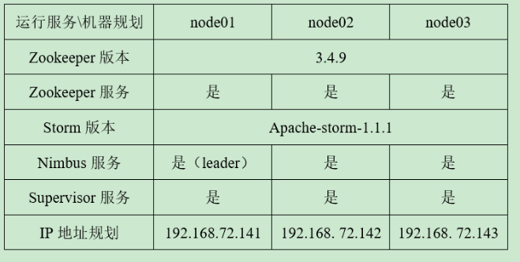

说明：

1. 三台虚拟机安装zookeeper集群并启动---版本3.4.9

2. 配置/etc/hosts

```properties
192.168.72.141 node01
192.168.72.142 node02
192.168.72.143 node03
```

3. storm版本1.1.1
4. 下载地址：http://storm.apache.org/downloads.html

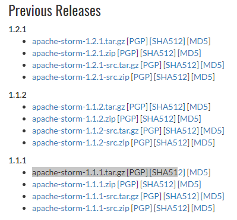

### 1.2 集群安装

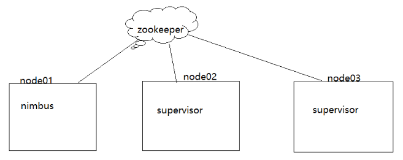

1. 上传storm压缩包(141)

```properties
cd /export/software
```

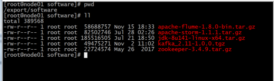

2. 解压安装包

```properties
tar -zxvf apache-storm-1.1.1.tar.gz -C ../servers/
cd ../servers/
```

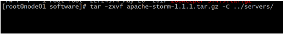

3. 进入conf目录下修改配置文件storm.yaml（**注意**：编写和修改配置顶头，注意空格问题，复制时注释不要复制）

```
cd /export/servers/apache-storm-1.1.1/conf/
vi storm.yaml

创建目录
mkdir -p /export/servers/apache-storm-1.1.1/stormdata
```

```properties
#zookeeper集群信息
storm.zookeeper.servers:
     - "node01"
     - "node02"
     - "node03"
#nimbus种子信息
nimbus.seeds: ["node01", "node02", "node03"]
#storm数据存放目录
storm.local.dir: "/export/servers/apache-storm-1.1.1/stormdata"
#storm的UI界面占用的端口
ui.port: 8088
#supervisor启动任务task时占用的槽点（端口号）
supervisor.slots.ports:
    - 6700
    - 6701
    - 6702
    - 6703
```

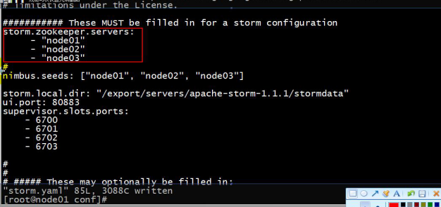

1. 将storm安装程序分发拷贝到另外两台机器上

```properties
cd  /export/servers/
scp -r apache-storm-1.1.1/ node02:/export/servers/
scp -r apache-storm-1.1.1/ node03:$PWD
```

5. 启动服务

**node01**

```properties
cd /export/servers/apache-storm-1.1.1/bin
#启动后jps查看进程
#启动 nimbus进程(三台都需要启动)
nohup ./storm nimbus 1>/dev/null 2>&1 &
#启动web UI(启动一台就可以了141)
nohup ./storm ui 1>/dev/null  2>&1 &
#启动logViewer（不建议启动） : 是一个非常之消耗内存的程序
nohup ./storm logviewer 1>/dev/null 2>&1 &
#启动supervisor(三台都需要启动)
nohup ./storm supervisor 1>/dev/null 2>&1 &
```

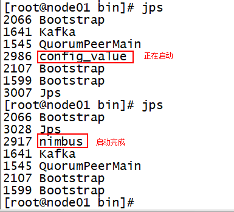

**node02**

```properties
cd /export/servers/apache-storm-1.1.1/bin
#启动 nimbus进程
nohup ./storm nimbus 1>/dev/null 2>&1 &
#启动logViewer（不建议启动）
nohup ./storm logviewer 1>/dev/null 2>&1 &
#启动supervisor
nohup ./storm supervisor 1>/dev/null 2>&1 &
```

**node03**

```properties
#启动 nimbus进程
nohup ./storm nimbus 1>/dev/null 2>&1 &
#启动logViewer（不建议启动）
nohup ./storm logviewer 1>/dev/null 2>&1 &
#启动supervisor
nohup ./storm supervisor 1>/dev/null 2>&1 &
```

### 1.3torm的UI界面管理

#### 1.3.1UI访问

访问地址

http://192.168.72.141:8088/index.html

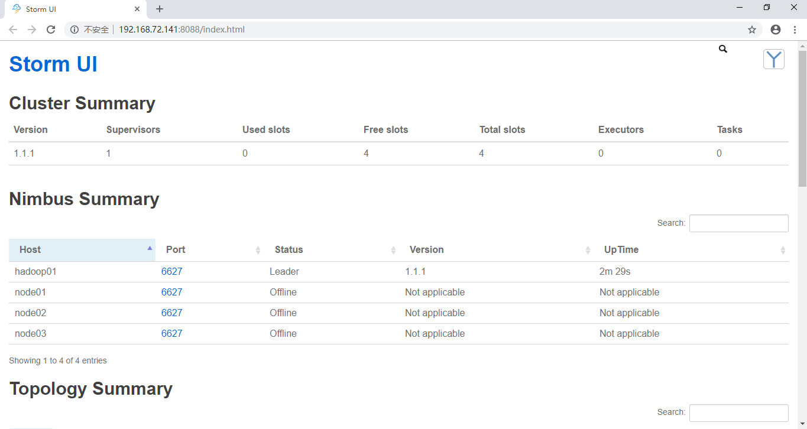

* **集群概要**

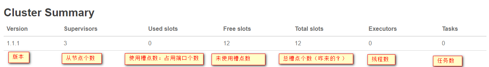

* **nimbus 概要**

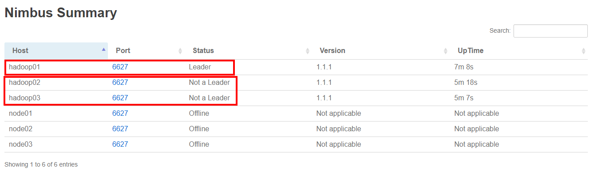

* **supervisor 概要**

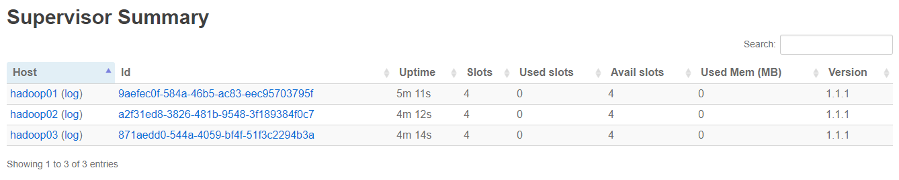

* **topology 概要**--没有任务上传


#### 1.3.2wordcount案例修改

​	storm集群安装成功后，我们可以将storm案例打包运行在stomr集群上。

**FileReadSpout**

​	wordcount案例中获取的是windows磁盘下的文件，在虚拟机上将会报找不到文件的错误，这里将文件读取修改为随机获取数组中元素内容（该内容为一句话，所以整体逻辑不影响）

```java
package com.itheima.storm;

import org.apache.storm.spout.SpoutOutputCollector;
import org.apache.storm.task.TopologyContext;
import org.apache.storm.topology.OutputFieldsDeclarer;
import org.apache.storm.topology.base.BaseRichSpout;
import org.apache.storm.tuple.Fields;

import java.io.BufferedReader;
import java.io.FileNotFoundException;
import java.io.FileReader;
import java.io.IOException;
import java.util.Arrays;
import java.util.Map;
import java.util.Random;

//  读取文件的spout程序
public class ReadFileSpout extends BaseRichSpout {
    private SpoutOutputCollector collector;
    private String[] strArr;
    private Random random;
    //private  BufferedReader reader ;
    //  在创建和这个RedisFileSpout对象的时候, 会调用这个方法, 进行初始化操作

    /**
     * @param conf      :  进行对storm配置操作, 一般不使用
     * @param context   : storm上下文对象, 一般不使用
     * @param collector :  向下游输出内容对象
     */
    @Override
    public void open(Map conf, TopologyContext context, SpoutOutputCollector collector) {
        this.collector = collector;

        strArr = new String[]{"hello storm welcome to beijing", "public void nextTuple", "ReadFileSpout extends BaseRichSpout"};

        random = new Random();
    }

    //  当将任务提交给storm程序后, storm程序会不断的调用nextTuple方法, 进行执行
    // 一般在这个方法, 循环的读取数据
    @Override
    public void nextTuple() { // 主动

        // 一行行获取数据
        //String line = reader.readLine();

        int i = random.nextInt(strArr.length);
        String line = strArr[i];

        try {
            Thread.sleep(100);

            if (line != null) {
                collector.emit(Arrays.asList(line)); //发送到下游了
            }
        } catch (InterruptedException e) {
            e.printStackTrace();
        }

    }

    // declareOutputFields : 数据传输 tuple, 看做是一个Map, 本质上是一个list, map的中key提前定义好了,
    // 在哪里定义呢?  declareOutputFields
    @Override
    public void declareOutputFields(OutputFieldsDeclarer declarer) {
        declarer.declare(new Fields("line"));
    }
}

```

**TopologyMain**

​	编译好的项目需要打包上传，所以topology提交模式需要修改为集群模式

```java
package com.itheima.storm;

import com.sun.org.apache.bcel.internal.generic.NEW;
import org.apache.storm.Config;
import org.apache.storm.LocalCluster;
import org.apache.storm.StormSubmitter;
import org.apache.storm.generated.AlreadyAliveException;
import org.apache.storm.generated.AuthorizationException;
import org.apache.storm.generated.InvalidTopologyException;
import org.apache.storm.topology.TopologyBuilder;

import java.util.HashMap;

// 构建整个 拓扑关系, 并将拓扑关系提交给strom运行
public class TopologyMain {

    public static void main(String[] args) throws Exception {
        //1. 构建 拓扑关系
        TopologyBuilder builder = new TopologyBuilder();


        builder.setSpout("readFileSpout", new ReadFileSpout());

        builder.setBolt("splitBolt", new SplitBolt()).shuffleGrouping("readFileSpout");

        builder.setBolt("countBolt", new CountBolt()).shuffleGrouping("splitBolt");

        Config config = new Config();
        //2.  提交任务 : 2种  1_本地提交  2. 集群提交
        if (args != null && args.length > 0) {
            // 进行集群提交方案
            StormSubmitter.submitTopology(args[0], config, builder.createTopology());
        }else{
            LocalCluster localCluster = new LocalCluster();
            // 参数1: 任务的名称    参数2:  运行的配置  参数3  拓扑图(任务)
            localCluster.submitTopology("wordCount", config, builder.createTopology());
        }
    }
}
```

**pom.xml**

​	四种范围:  编译,  运行时, 打包, 测试

​	jar的常见依赖范围有compile、provided、runtime、test四种，IDEA中的运行环境和storm集群上运行的环境不一致，所以打包时选择好jar包的依赖范围，storm集群会提供storm的jar，所以这里改为provided

```xml
<dependencies>
    <dependency>
        <groupId>org.apache.storm</groupId>
        <artifactId>storm-core</artifactId>
        <version>1.1.1</version>
        <!-- 目前<scope>可以使用5个值：
    	* compile，缺省值，适用于所有阶段，会随着项目一起发布。
    	* provided，类似compile，期望JDK、容器或使用者会提供这个依赖。如servlet.jar。
    	* runtime，只在运行时使用，如JDBC驱动，适用运行和测试阶段。
    	* test，只在测试时使用，用于编译和运行测试代码。不会随项目发布。
    	* system，类似provided，需要显式提供包含依赖的jar，Maven不会在Repository中查找它。  -->
        <scope>provided</scope>
    </dependency>
</dependencies>
<build>
    <plugins>
        <plugin>
            <groupId>org.apache.maven.plugins</groupId>
            <artifactId>maven-compiler-plugin</artifactId>
            <version>3.7.0</version>
            <configuration>
                <source>1.8</source>
                <target>1.8</target>
            </configuration>
        </plugin>
    </plugins>
</build>
```

上传任务执行程序

```properties
#storm命令 jar 被执行的任务jar包 入口main所在类路径 任务名称
/export/servers/apache-storm-1.1.2/bin/storm jar /export/servers/wordcount.jar  cn.itcast.storm.wc.TopologyMain wordcount
```

#### 1.3.3上传任务后UI界面分析

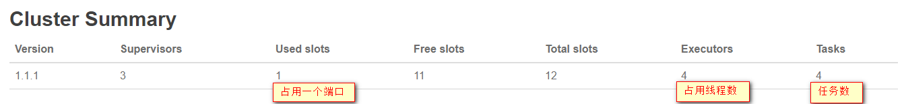

****


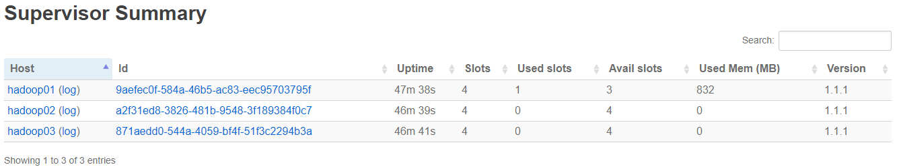

****


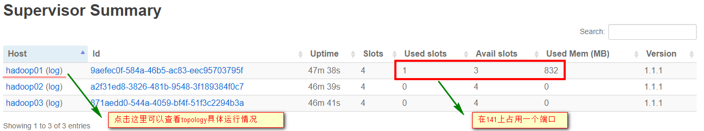

****

****


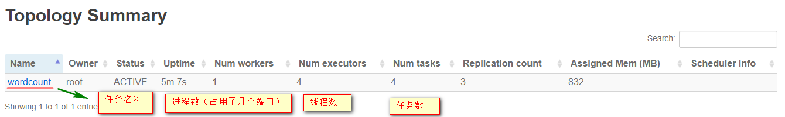

****


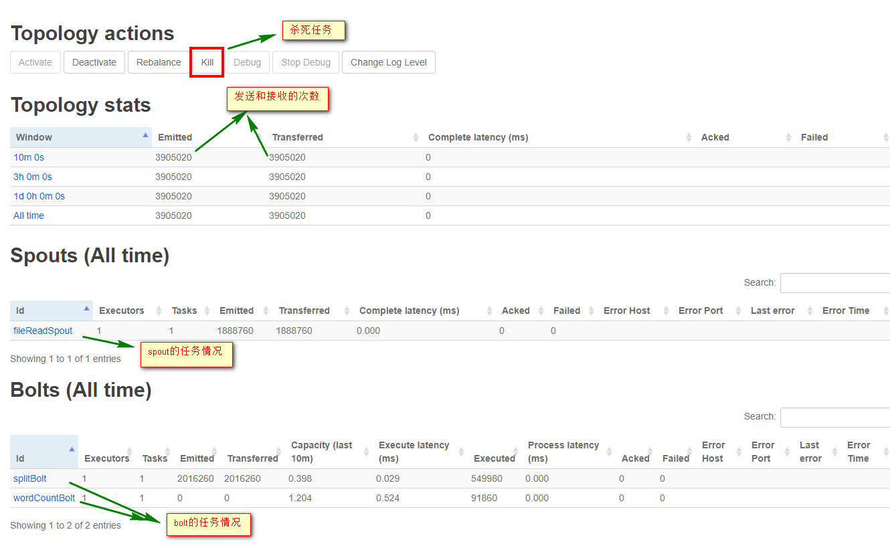

**storm中不能存在相同任务名**

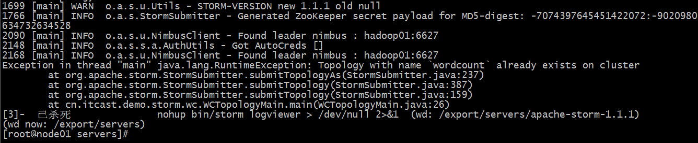

## 2.storm原理

### 2.1Storm任务提交的过程

#### 2.1.1Storm任务提交的过程

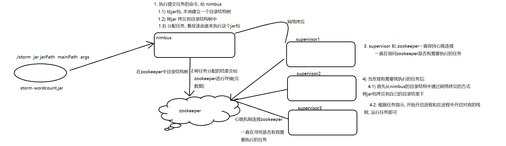


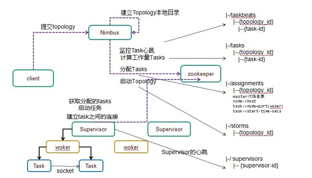

```
#提交过程信息
TopologyMetricsRunnable.TaskStartEvent[oldAssignment=<null>,newAssignment=Assignment[masterCodeDir=C:\Users\MAOXIA~1\AppData\Local\Temp\\e73862a8-f7e7-41f3-883d-af494618bc9f\nimbus\stormdist\double11-1-1458909887,nodeHost={61ce10a7-1e78-4c47-9fb3-c21f43a331ba=192.168.1.106},taskStartTimeSecs={1=1458909910, 2=1458909910, 3=1458909910, 4=1458909910, 5=1458909910, 6=1458909910, 7=1458909910, 8=1458909910},workers=[ResourceWorkerSlot[hostname=192.168.1.106,memSize=0,cpu=0,tasks=[1, 2, 3, 4, 5, 6, 7, 8],jvm=<null>,nodeId=61ce10a7-1e78-4c47-9fb3-c21f43a331ba,port=6900]],timeStamp=1458909910633,type=Assign],task2Component=<null>,clusterName=<null>,topologyId=double11-1-1458909887,timestamp=0]
```

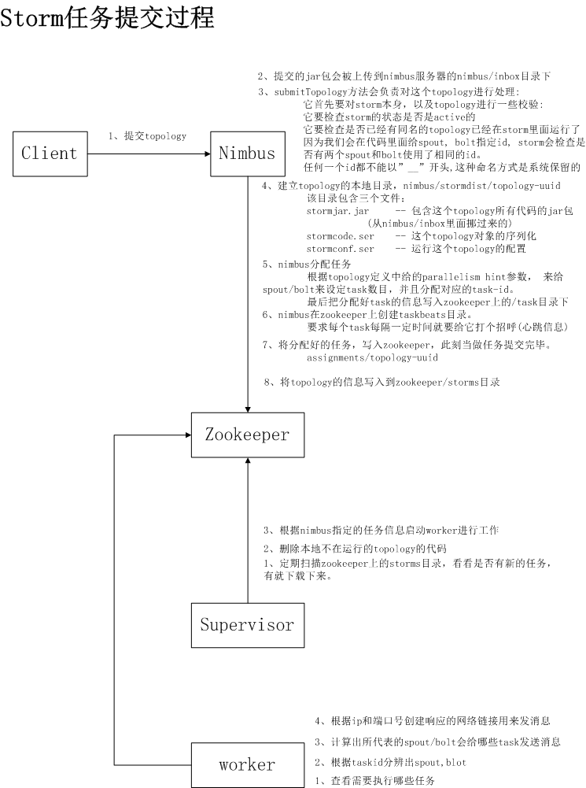

#### 2.1.2 Storm 组件本地目录树

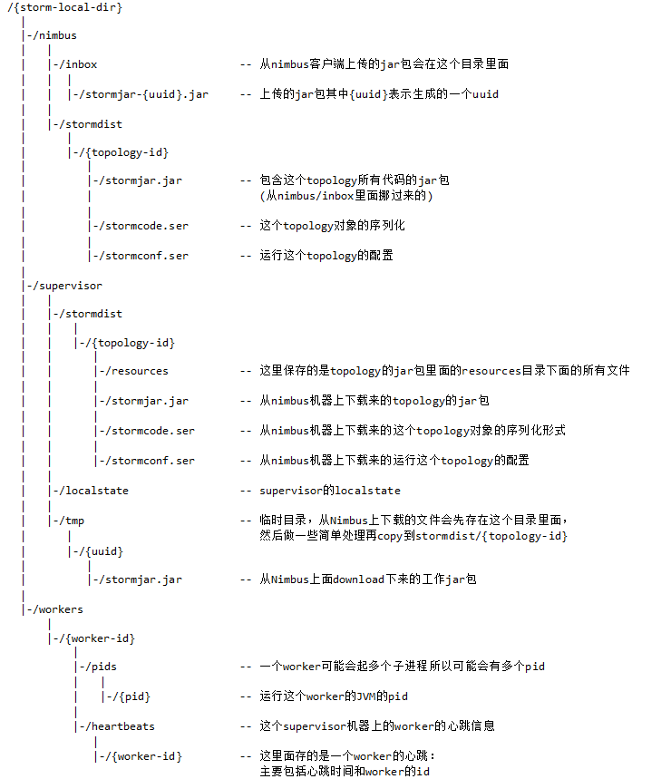

#### 2.1.3 zookeeper组件目录树

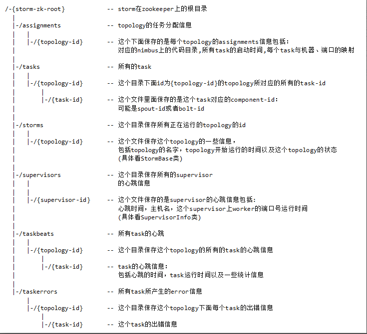

### 2.2 storm的并行度与并发问题

#### 2.2.1并行度设置

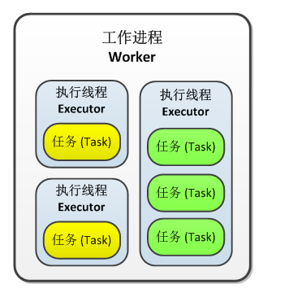

```java
config.setNumWorkers(1); // 进程
topologyBuilder.setSpout("mySpout", new RandomSpout(),3);
topologyBuilder.setBolt("splitBolt", new SplitBolt(),3).shuffleGrouping("mySpout");
topologyBuilder.setBolt("countBolt", new CountBolt(),3).setNumTasks(4).shuffleGrouping("splitBolt");
```

Storm当中的worker，executor，task之间的相互关系

```properties
#Worker:
表示一个进程

#Executor：
表示由worker启动的线程

一个worker只会负责一个topology任务，不会出现一个worker负责多个topology任务的情况。
一个worker进程当中，可以启动多个线程executor，也就是说，一个worker进程可以对应多个executor线程

#task:
是实际执行数据处理的最小工作单元（注意，task 并不是线程） 
—— 在你的代码中实现的每个 spout 或者 bolt 都会在集群中运行很多个 task。在拓扑的整个生命周期中每个组件的 task 数量都是保持不变的，不过每个组件的 executor 数量却是有可能会随着时间变化。在默认情况下 task 的数量是和 executor 的数量一样的，也就是说，默认情况下 Storm 会在每个线程上运行一个 task
```

**注：调整task的数量，并不能够实际上提高storm的并行度，因为storm不管是spout还是bolt当中的代码都是串行执行的，就算一个executor对应多个task，这多个task也是串行去执行executor当中的代码，所以这个调整task的个数，实际上并不能提高storm的并行度**

在实际工作当中，由于spout与bolt的数量不能够精准确定，所以需要随时调整spout与bolt的数量，所以在storm当中，我们可以通过命令来动态的进行调整

```shell
#一定要注意：重新调整的时候=号两边不要有空格
./storm rebalance mytopo -n 3 -e mySpout=5 -e splitBolt=6 -e countBolt=8
```

#### 2.2.2并发问题

修改并行度后我们会发现，控制台打印出现问题


分析：设置并行度后，要考虑线程安全问题，而这里出现问题的只能是全局变量wordAndScoreMap

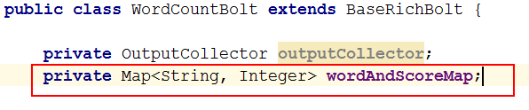

解决方法：最简单的想法我们可能想到让wordAndScoreMap编程一个线程安全的对象，于是我们修改初始对象代码

```java
this.wordAndScoreMap = new ConcurrentHashMap<>();
```

不过我们发现问题并没有解决，我们先做个小扩展。

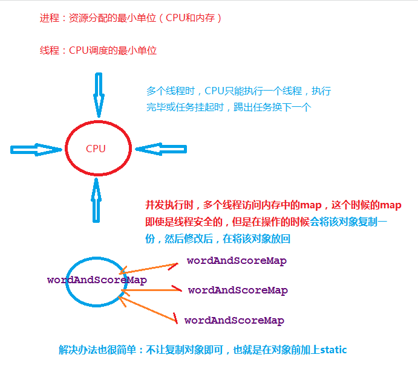

```java
private static Map<String, Integer> wordAndScoreMap;
```

如此我们就解决了并行执行时的线程安全问题。

```
在storm中,解决线程安全的问题:
	1)如果存储的容器是jvm内存中的容器
		1.1)首先保证这个容器必须是一个线程安全的容器
		1.2)保证容器只会被创建一次
	2)如果存储的容器是 外部第三方的容器
		2.1)只要保证第三方容器线程安全即可:redis(原子性)
```

### 2.3 Storm的分发策略

Storm当中的分组策略，一共有八种：

所谓的grouping策略就是在Spout与Bolt、Bolt与Bolt之间传递Tuple的方式。总共有八种方式：

```properties
#shuffleGrouping 随机分组:
将tuple随机分配到bolt中，能够保证各task中处理的数据均衡；

#fieldsGrouping 按照字段分组:
（在这里即是同一个单词只能发送给一个Bolt）根据设定的字段相同值得tuple被分配到同一个bolt进行处理；
举例：builder.setBolt("mybolt", new MyStoreBolt(),5).fieldsGrouping("checkBolt",new Fields("uid"));
说明：该bolt由5个任务task执行，相同uid的元组tuple被分配到同一个task进行处理；该task接收的元祖字段是mybolt发射出的字段信息，不受uid分组的影响。
该分组不仅方便统计而且还可以通过该方式保证相同uid的数据保存不重复（uid信息写入数据库中唯一）；

#allGrouping 广播发送：
所有bolt都可以收到该tuple（广播发送，即每一个Tuple，每一个Bolt都会收到）

#globalGrouping全局分组：
（全局分组，将Tuple分配到task id值最低的task里面）
tuple被发送给bolt的同一个并且最小task_id的任务处理，实现事务性的topology

#noneGrouping（随机分派）不分组：
效果等同于shuffle Grouping.

#directGrouping 直接分组：
（直接分组，指定Tuple与Bolt的对应发送关系）
由tuple的发射单元直接决定tuple将发射给那个bolt，一般情况下是由接收tuple的bolt决定接收哪个bolt发射的Tuple。这是一种比较特别的分组方法，用这种分组意味着消息的发送者指定由消息接收者的哪个task处理这个消息。 只有被声明为Direct Stream的消息流可以声明这种分组方法。而且这种消息tuple必须使用emitDirect方法来发射。消息处理者可以通过TopologyContext来获取处理它的消息的taskid (OutputCollector.emit方法也会返回taskid)。

#Local or shuffle Grouping本地或者随机分组(推荐):
优先将数据发送到本机的处理器executor，如果本机没有对应的处理器，那么再发送给其他机器的executor，避免了网络资源的拷贝，减轻网络传输的压力

#customGrouping （自定义的Grouping）
```


### 2.4 消息不丢失机制 : ack

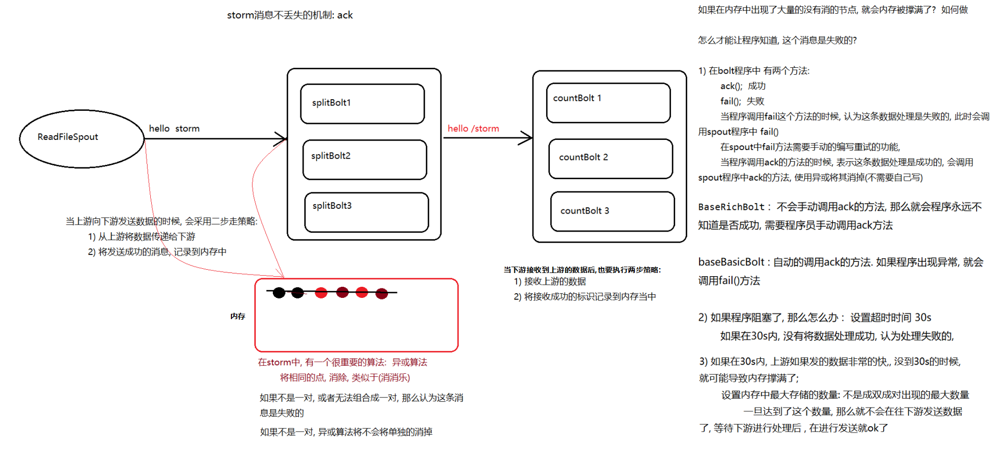

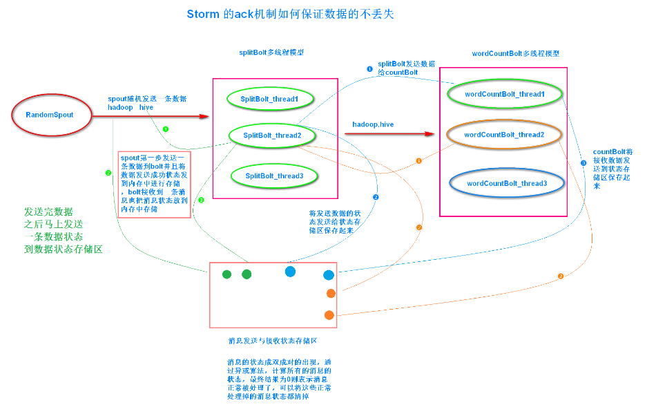

#### 2.4.1.ack是什么

* ack 机制是storm整个技术体系中非常闪亮的一个创新点。

* 通过Ack机制，spout发送出去的每一条消息，都可以确定是被成功处理或失败处理， 从而可以让开发者采取动作。比如在Meta中，成功被处理，即可更新偏移量，当失败时，重复发送数据。

* 因此，通过Ack机制，很容易做到保证所有数据均被处理，一条都不漏。

* **另外需要注意的，当spout触发fail动作时，不会自动重发失败的tuple，需要spout自己重新获取数据，手动重新再发送一次**

* ack机制即， spout发送的每一条消息
  * 在规定的时间内，spout收到Acker的ack响应，即认为该tuple 被后续bolt成功处理
  * 在规定的时间内，没有收到Acker的ack响应tuple，就触发fail动作，即认为该tuple处理失败，
  * 或者收到Acker发送的fail响应tuple，也认为失败，触发fail动作

* 另外Ack机制还常用于限流作用： 为了避免spout发送数据太快，而bolt处理太慢，常常设置pending数，当spout有等于或超过pending数的tuple没有收到ack或fail响应时，跳过执行nextTuple， 从而限制spout发送数据。

* 通过conf.put(Config.TOPOLOGY_MAX_SPOUT_PENDING, pending);设置spout pend数。

* **这个timeout时间可以通过Config.TOPOLOGY_MESSAGE_TIMEOUT_SECS来设定。Timeout的默认时长为30秒**

#### 2.4.2.如何使用Ack机制（重点）

​	**spout 在发送数据的时候带上msgid**

​	**设置ack进程数至少大于**0；Config.setNumAckers(conf, ackerParal);  默认是 1

​	在bolt中完成处理tuple时，执行OutputCollector.ack(tuple), 当失败处理时，执行OutputCollector.fail(tuple); 

​	推荐使用IBasicBolt， 因为IBasicBolt 自动封装了OutputCollector.ack(tuple), 处理失败时，抛出FailedException，则自动执行OutputCollector.fail(tuple)

#### 2.4.3.如何关闭Ack机制

有2种途径

​	spout发送数据是不带上msgid

​	设置acker数等于0

#### 2.4.4.基本实现

​	Storm 系统中有一组叫做"acker"的特殊的任务，它们负责跟踪DAG（有向无环图）中的每个消息。

​	acker任务保存了spout id的一对值的映射。第一个值就是spout的任务id，通过这个id，acker就知道消息处理完成时该通知哪个spout任务。第二个值是一个64bit的数字，我们称之为"ack val"， 它是树中所有消息的随机id的异或计算结果。

```properties
<TaskId,<RootId,ackValue>>
Spoutid,<系统生成的id,ackValue>
Task-0,64bit,0 
```

​	ack val表示了整棵树的的状态，无论这棵树多大，只需要这个固定大小的数字就可以跟踪整棵树。当消息被创建和被应答的时候都会有相同的消息id发送过来做异或。 每当acker发现一棵树的ack val值为0的时候，它就知道这棵树已经被完全处理了

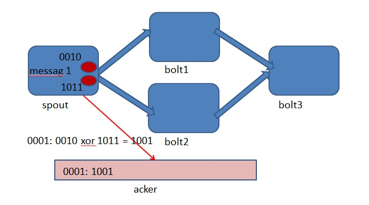

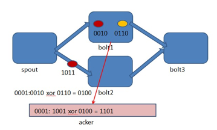

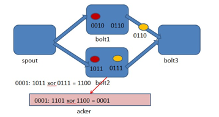

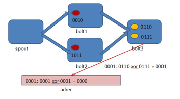

#### 2.4.5.spout与bolt的其他开发方式

​	对于spout，有ISpout，IRichSpout，BaseRichSpout

​	对于bolt，有IBolt，IRichBolt，BaseRichBolt，**IBasicBolt**，**BaseBasicBolt**

​	IBasicBolt，BaseBasicBolt不用每次execute完成都写ack/fail，因为已经帮你实现好了。

#### 2.4.6.ack测试

修改FileReadSpout

```java
package com.itheima.wordCount;

import org.apache.storm.spout.SpoutOutputCollector;
import org.apache.storm.task.TopologyContext;
import org.apache.storm.topology.OutputFieldsDeclarer;
import org.apache.storm.topology.base.BaseRichBolt;
import org.apache.storm.topology.base.BaseRichSpout;
import org.apache.storm.tuple.Fields;

import java.util.Arrays;
import java.util.Map;
import java.util.Random;

public class ReadSpout extends BaseRichSpout {
    private SpoutOutputCollector collector;
    private String[] strArr ;
    private Random random ;
    @Override
    public void open(Map conf, TopologyContext context, SpoutOutputCollector collector) {
        this.collector = collector ;
        strArr = new String[]{"1hello storm","2storm ack","3hello storm storm ack"};
        random = new Random();
    }

    @Override
    public void nextTuple() {

        int i = random.nextInt(strArr.length);

        String line = strArr[i];
        try {
            Thread.sleep(1000);
            System.out.println(line);
            collector.emit(Arrays.asList(line),line);
        } catch (InterruptedException e) {
            e.printStackTrace();
        }


    }

    @Override
    public void declareOutputFields(OutputFieldsDeclarer declarer) {
        declarer.declare(new Fields("line"));
    }

    // 失败的方法
    @Override
    public void fail(Object msgId) { //当前这条失败的消息
        System.out.println("这条消息, 处理失败了......呜呜呜呜呜..."+ msgId);
        // 重试:
        //collector.emit(Arrays.asList(msgId));
    }
}

```

修改SplitBolt

```java
package com.itheima.wordCount;

import org.apache.storm.task.OutputCollector;
import org.apache.storm.task.TopologyContext;
import org.apache.storm.topology.OutputFieldsDeclarer;
import org.apache.storm.topology.base.BaseRichBolt;
import org.apache.storm.tuple.Tuple;

import java.util.Map;

public class SplitBolt extends BaseRichBolt {
    private OutputCollector collector;

    @Override
    public void prepare(Map stormConf, TopologyContext context, OutputCollector collector) {
        this.collector =collector;
    }

    @Override
    public void execute(Tuple tuple) {
        String line = tuple.getStringByField("line");
        try {
            Thread.sleep(40000);
            collector.ack(tuple);
        } catch (InterruptedException e) {
            collector.fail(tuple);
            e.printStackTrace();
        }


    }

    @Override
    public void declareOutputFields(OutputFieldsDeclarer declarer) {

    }
}

```

修改WCTopologyMain

```java
package com.itheima.wordCount;

import org.apache.storm.Config;
import org.apache.storm.LocalCluster;
import org.apache.storm.topology.TopologyBuilder;

public class TopologyMain {

    public static void main(String[] args) {

        TopologyBuilder builder = new TopologyBuilder();

        builder.setSpout("readSpout",new ReadSpout());

        builder.setBolt("splitBolt",new SplitBolt()).localOrShuffleGrouping("readSpout");


        //本地运行:
        LocalCluster localCluster = new LocalCluster();

        Config config = new Config();
        config.setNumAckers(1);
        localCluster.submitTopology("wordCountACK",config,builder.createTopology());
    }
}

```

注意：不要忘记修改依赖的scope

 

睡眠40秒，在40秒内spout向bolt不停的发送消息，发送失败的数据重新发送给spout


总结: 关于ack的设置:

* 1) 在config的配置中需要开启ack机制

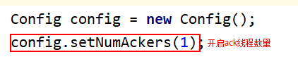

* 2) 需要在spout程序中向下游发送数据的时候, 需要携带msgid
  * 注意: 建议msgId设置的内容时候 , 将其设置就是当前要发送的数据内容

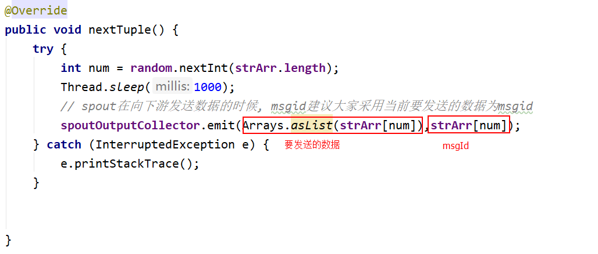

* 3) 在spout程序重写 fail()方法, 根据自己业务需要, 编写失败后应该如何处理数据

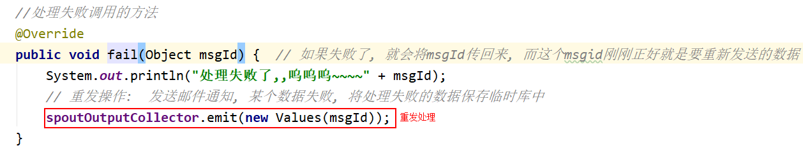

* 4) bolt程序建议实现的baseBasicBolt
  * 自动的调用ack方法 和fail方法: 
    * 如果代码中有try 这个代码, 建议才catch中手动fail方法

## 3.storm的定时器

​	在storm框架中有一个可以定时向当前Bolt处理节点发送消息的Bolt组件，完成设置后，storm本身的统计并不会受影响，可以实现定时的将统计好的List<Map>数据向下游发送。

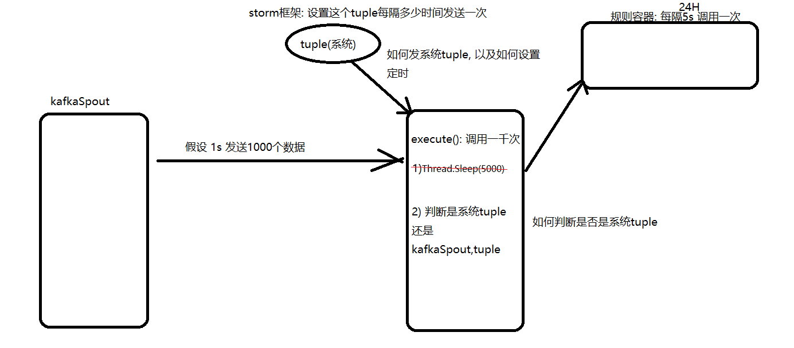

​	这里我们以wordcount案例为例

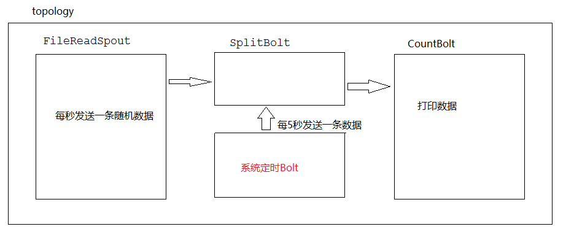

**ReadRandomSpout**修改向下游Bolt发送频率(**这不是设置定时的核心,只是让效果看的明显一点**)

```java
//休眠1秒，间隔1秒向下游发送随机数据
Thread.sleep(1000);
```

**SplitBolt**

```java
package com.itheima.storm;

import org.apache.storm.Config;
import org.apache.storm.Constants;
import org.apache.storm.topology.BasicOutputCollector;
import org.apache.storm.topology.OutputFieldsDeclarer;
import org.apache.storm.topology.base.BaseBasicBolt;
import org.apache.storm.tuple.Fields;
import org.apache.storm.tuple.Tuple;
import org.apache.storm.tuple.Values;

import java.util.Arrays;
import java.util.Date;
import java.util.Map;

public class SplitBolt extends BaseBasicBolt {
    //通过这个方法, 可以去设置storm相关的参数
    @Override
    public Map<String, Object> getComponentConfiguration() {
        Config config = new Config(); // topology_tick_tuple_freq_secs

        config.put(config.TOPOLOGY_TICK_TUPLE_FREQ_SECS,5); // 5/s 发送一个系统的tuple

        return config;
    }

    public void execute(Tuple tuple, BasicOutputCollector basicOutputCollector) {
        //每隔5/s 打印一下当前时间
        //     tuple.getSourceStreamId().contains(Constants.SYSTEM_TICK_STREAM_ID)
        // &&  tuple.getSourceComponent().contains(Constants.SYSTEM_COMPONENT_ID
            if(tuple.getSourceStreamId().contains(Constants.SYSTEM_TICK_STREAM_ID)&&tuple.getSourceComponent().contains(Constants.SYSTEM_COMPONENT_ID)){
            //如果是系统的tuple. 打印当前的时间
            String time = new Date().toLocaleString();
            System.out.println(time);
        } else {
            // 如果不是系统的tuple, 执行相关切割任务
            String words = tuple.getStringByField("words");

            String[] split = words.split(" ");
            String name = split[0];
            String age = split[1];

            basicOutputCollector.emit(new Values(name,age));

        }


    }

    public void declareOutputFields(OutputFieldsDeclarer outputFieldsDeclarer) {
        outputFieldsDeclarer.declare(new Fields("word","age"));
    }
}

```

执行测试

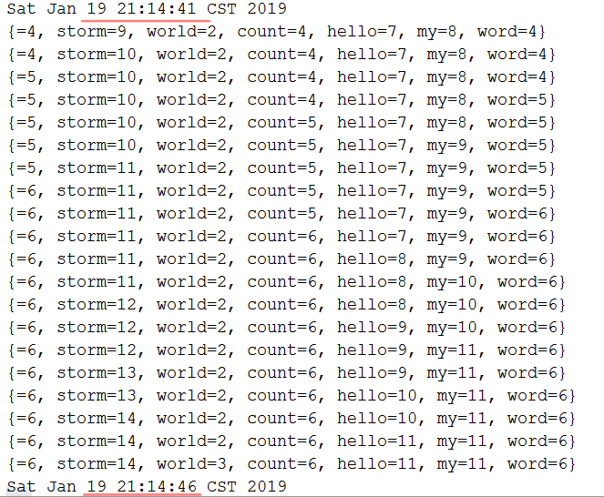


## 4.storm与mysql整合

分析：

​	storm是数据处理框架，不负责数据存储，storm是一个非常成熟的框架，可以与各个模块的整合，这里我们测试将数据保存到mysql中。

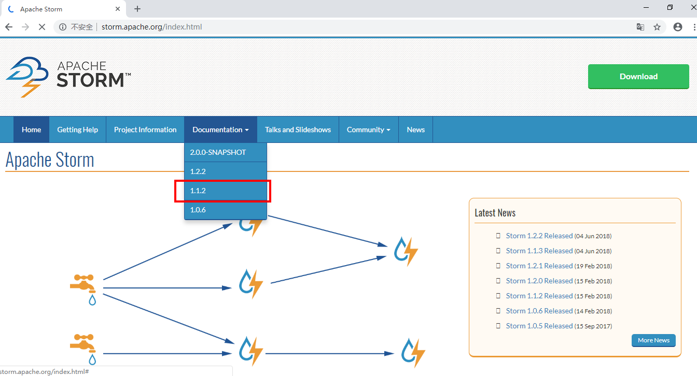

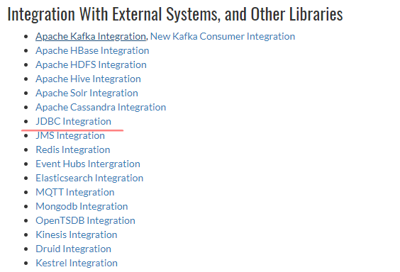

JDBCBolt

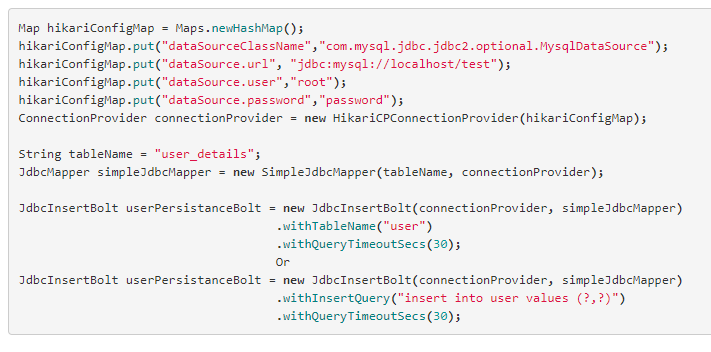

pom依赖

```xml
<!-- storm包 -->
<dependency>
        <groupId>org.apache.storm</groupId>
        <artifactId>storm-core</artifactId>
        <version>1.1.1</version>
    </dependency>
<!-- storm整合jdbc -->
<dependency>
    <groupId>org.apache.storm</groupId>
    <artifactId>storm-jdbc</artifactId>
    <version>1.1.1</version>
</dependency>
<!-- mysql驱动包 -->
<dependency>
    <groupId>mysql</groupId>
    <artifactId>mysql-connector-java</artifactId>
    <version>5.1.38</version>
</dependency>
<!-- google工具类 -->
<dependency>
    <groupId>com.google.collections</groupId>
    <artifactId>google-collections</artifactId>
    <version>1.0</version>
</dependency>
```

创建数据库log_monitor及测试表user

```sql
/*
SQLyog Ultimate v8.32 
MySQL - 5.6.22-log : Database - log_monitor
*********************************************************************
*/ 
/*!40101 SET NAMES utf8 */;
/*!40101 SET SQL_MODE=''*/;
/*!40014 SET @OLD_UNIQUE_CHECKS=@@UNIQUE_CHECKS, UNIQUE_CHECKS=0 */;
/*!40014 SET @OLD_FOREIGN_KEY_CHECKS=@@FOREIGN_KEY_CHECKS, FOREIGN_KEY_CHECKS=0 */;
/*!40101 SET @OLD_SQL_MODE=@@SQL_MODE, SQL_MODE='NO_AUTO_VALUE_ON_ZERO' */;
/*!40111 SET @OLD_SQL_NOTES=@@SQL_NOTES, SQL_NOTES=0 */;
CREATE DATABASE /*!32312 IF NOT EXISTS*/`log_monitor` /*!40100 DEFAULT CHARACTER SET utf8 */;

USE `log_monitor`;

/*Table structure for table `log_monitor_app` */
/*Table structure for table `user` */

DROP TABLE IF EXISTS `user`;

CREATE TABLE `user` (
  `userId` INT(11) NOT NULL AUTO_INCREMENT,
  `name` VARCHAR(1024) DEFAULT NULL,
  `age` VARCHAR(5) DEFAULT NULL,
  PRIMARY KEY (`userId`)
) ENGINE=INNODB AUTO_INCREMENT=10 DEFAULT CHARSET=utf8;

/*Data for the table `user` 

INSERT  INTO `user`(`userId`,`name`,`age`) VALUES (1,'c',1),(2,'b',1),(3,'a',1),(4,'c',1),(5,'a',1),(6,'b',1),(7,'c',1),(8,'c',1),(9,'b',1);*/

/*!40101 SET SQL_MODE=@OLD_SQL_MODE */;
/*!40014 SET FOREIGN_KEY_CHECKS=@OLD_FOREIGN_KEY_CHECKS */;
/*!40014 SET UNIQUE_CHECKS=@OLD_UNIQUE_CHECKS */;
/*!40111 SET SQL_NOTES=@OLD_SQL_NOTES */;
```

RandomSpout

​	修改字符串数组，用于插入数据库

```java
String[] sentences = new String[]{ "张三 15","王五 18","李四 25"};
```


```java
package com.itheima.storm;

import org.apache.storm.spout.SpoutOutputCollector;
import org.apache.storm.task.OutputCollector;
import org.apache.storm.task.TopologyContext;
import org.apache.storm.topology.OutputFieldsDeclarer;
import org.apache.storm.topology.base.BaseRichBolt;
import org.apache.storm.topology.base.BaseRichSpout;
import org.apache.storm.tuple.Fields;
import org.apache.storm.tuple.Tuple;
import org.apache.storm.tuple.Values;

import java.util.Map;
import java.util.Random;

public class RandomSpout extends BaseRichSpout {
    private SpoutOutputCollector spoutOutputCollector;
    private String[] wordArr;
    private Random random;

    @Override
    public void open(Map map, TopologyContext topologyContext, SpoutOutputCollector spoutOutputCollector) {
        this.spoutOutputCollector=spoutOutputCollector;
        wordArr = new String[]{"张三 15","王五 18","李四 25"};
        random = new Random();
    }

    @Override
    public void nextTuple() {
        int i = random.nextInt(wordArr.length);
        try {
            Thread.sleep(1000);
        } catch (InterruptedException e) {
            e.printStackTrace();
        }
        spoutOutputCollector.emit(new Values(wordArr[i]));
    }

    @Override
    public void declareOutputFields(OutputFieldsDeclarer outputFieldsDeclarer) {
        outputFieldsDeclarer.declare(new Fields("words"));;
    }
}


```

SplitBolt

​	修改数据发送字段，与数据库字段对应

```java
package com.itheima.storm;

import org.apache.storm.Config;
import org.apache.storm.Constants;
import org.apache.storm.task.OutputCollector;
import org.apache.storm.task.TopologyContext;
import org.apache.storm.topology.BasicOutputCollector;
import org.apache.storm.topology.OutputFieldsDeclarer;
import org.apache.storm.topology.base.BaseRichBolt;
import org.apache.storm.tuple.Fields;
import org.apache.storm.tuple.Tuple;
import org.apache.storm.tuple.Values;

import java.util.Date;
import java.util.Map;

public class SplitBolt extends BaseRichBolt {

    @Override
    public Map<String, Object> getComponentConfiguration() {
        Config config = new Config();
        config.put(config.TOPOLOGY_TICK_TUPLE_FREQ_SECS,5);//发送一个系统的tuple

        return config;
    }

    @Override
    public void prepare(Map map, TopologyContext topologyContext, OutputCollector outputCollector) {

    }

    @Override
    public void execute(Tuple tuple) {

    }

    public void execute(Tuple tuple, BasicOutputCollector basicOutputCollector) {
            if (tuple.getSourceStreamId().contains(Constants.SYSTEM_TICK_STREAM_ID)&&tuple.getSourceComponent().contains(Constants.SYSTEM_COMPONENT_ID)){
                //如果是系统的tuple,打印当前的时间
                String time = new Date().toLocaleString();
                System.out.println(time);
            }else {
                //如果不是系统的tuple,执行相关切割任务
                String line = tuple.getStringByField("words");
                String[] splitWords = line.split(" ");
                String name = splitWords[0];
                String age = splitWords[1];

                basicOutputCollector.emit(new Values(null,name,age));
            }
    }

    @Override
    public void declareOutputFields(OutputFieldsDeclarer outputFieldsDeclarer) {
        outputFieldsDeclarer.declare(new Fields("userId","name","age"));
    }
}


```

CountBolt

```
package com.itheima.storm;

import org.apache.storm.task.OutputCollector;
import org.apache.storm.task.TopologyContext;
import org.apache.storm.topology.OutputFieldsDeclarer;
import org.apache.storm.topology.base.BaseRichBolt;
import org.apache.storm.tuple.Tuple;

import java.util.Map;
import java.util.concurrent.ConcurrentHashMap;

public class CountBolt extends BaseRichBolt {
    private OutputCollector collector;
    private static Map<String,Integer> map = new ConcurrentHashMap<>();
    @Override
    public void prepare(Map stormConf, TopologyContext context, OutputCollector collector) {
        this.collector = collector;
    }

    @Override
    public void execute(Tuple tuple) {
          //1 从tuple中获取数据
        String name = tuple.getStringByField("name");
        String ageStr = tuple.getStringByField("age");
        int age = Integer.parseInt(ageStr);
        if (map.get(name) != null){
            Integer integer = map.get(name);
            age = integer + age;
            map.put(name,age);
        }else {
            map.put(name,age);

        }

        System.out.println(map);
    }

    @Override
    public void declareOutputFields(OutputFieldsDeclarer declarer) {

    }
}

```

TopologyMain

​	修改topology结构，集成JDBCBolt，注意修改配置参数

```java
package com.itheima.storm;

import com.google.common.collect.Maps;
import org.apache.storm.Config;
import org.apache.storm.LocalCluster;
import org.apache.storm.StormSubmitter;
import org.apache.storm.generated.AlreadyAliveException;
import org.apache.storm.generated.AuthorizationException;
import org.apache.storm.generated.InvalidTopologyException;

import org.apache.storm.jdbc.bolt.JdbcInsertBolt;
import org.apache.storm.jdbc.common.ConnectionProvider;
import org.apache.storm.jdbc.common.HikariCPConnectionProvider;
import org.apache.storm.jdbc.mapper.SimpleJdbcMapper;
import org.apache.storm.topology.TopologyBuilder;

import java.util.Map;

public class WordCountMain {
    public static void main(String[] args) throws InvalidTopologyException, AuthorizationException, AlreadyAliveException {
        Map hikairconfigMap = Maps.newHashMap();

        hikairconfigMap.put("dataSourceClassName","com.mysql.jdbc.jdbc2.optional.MysqlDataSource");
        hikairconfigMap.put("dataSource.url", "jdbc:mysql://localhost:3306/log_monitor");
        hikairconfigMap.put("dataSource.user","root");
        hikairconfigMap.put("dataSource.password","root");
        ConnectionProvider connectionProvider = new HikariCPConnectionProvider(hikairconfigMap);

        String tableName = "user";

        SimpleJdbcMapper simpleJdbcMapper = new SimpleJdbcMapper(tableName, connectionProvider);

        JdbcInsertBolt jdbcInsertBolt = new JdbcInsertBolt(connectionProvider, simpleJdbcMapper)
                .withInsertQuery("insert into user values(?,?,?)")
                .withQueryTimeoutSecs(30);

        TopologyBuilder builder = new TopologyBuilder();

        builder.setSpout("randomSpout",new RandomSpout());
        builder.setBolt("splitBolt",new SplitBolt()).localOrShuffleGrouping("randomSpout");

        builder.setBolt("countBolt",new CountBolt()).localOrShuffleGrouping("splitBolt");
        builder.setBolt("jdbcInsertBolt",jdbcInsertBolt).localOrShuffleGrouping("countBolt");
        //提交任务
        Config config = new Config();
        if (args != null && args.length>0){
            StormSubmitter.submitTopology(args[0],config,builder.createTopology());
        }else {
            LocalCluster cluster = new LocalCluster();
            cluster.submitTopology("words",config,builder.createTopology());
        }

    }
}


```

执行测试

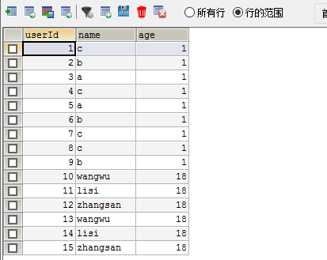

