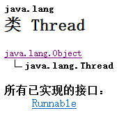
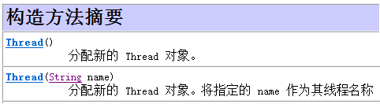
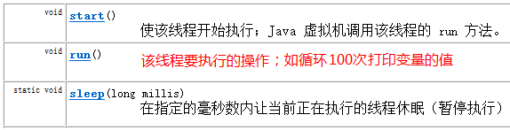
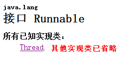
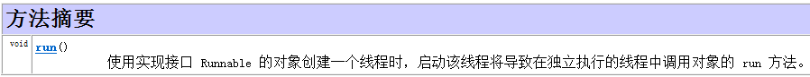
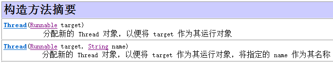

# 第1天 多线程 

## 今日内容介绍

1. 多线程概述
   线程实现
2. 多线程安全问题产生 & 解决方案

## 多线程概述

学习多线程之前，我们先要了解几个关于多线程有关的概念。
A:进程：进程指正在运行的程序。确切的来说，当一个程序进入内存运行，即变成一个进程，进程是处于运行过程中的程序，并且具有一定独立功能。
B:线程：线程是进程中的一个执行单元，负责当前进程中程序的执行，一个进程中至少有一个线程。一个进程中是可以有多个线程的，这个应用程序也可以称之为多线程程序。
C:简而言之：一个程序运行后至少有一个进程，一个进程中可以包含多个线程

**什么是多线程呢？即就是一个程序中有多个线程在同时执行。**

## 线程实现

## 实现线程一:继承Thread类

该如何创建线程呢？通过API中搜索，查到Thread类。通过阅读Thread类中的描述。Thread是程序中的执行线程。Java 虚拟机允许应用程序并发地运行多个执行线程。



}



A:创建线程的步骤：

1. 定义一个类继承Thread。
2. 重写run方法。
3. 创建子类对象，就是创建线程对象。
4. 调用start方法，开启线程并让线程执行，同时还会告诉jvm去调用run方法

### 案例代码一

``` java
package com.itheima/_01;
public class MyThread extends Thread {
@Override
public void run() {
for (int i = 0; i /< 100; i++) {
System.out.println(getName() + ":" + i);
}
}
}
```

```java
package com.itheima/_01;
//多线程的实现方式：

//方式1：一种方法是将类声明为 Thread 的子类。该子类应重写 Thread 类的 run 方法。接下来可以分配并启动该子类的实例
//Thread
//String getName() 返回该线程的名称。

// void setName(String name) 改变线程名称，使之与参数 name 相同。

// CPU执行程序的随机

public class ThreadDemo2 {

public static void main(String[] args) {
//创建线程实例
MyThread mt = new MyThread();
//修改线程名字
mt.setName("张三");
//启动线程
mt.start();
//创建线程实例
MyThread mt2 = new MyThread();
mt2.setName("老王");
//启动线程
mt2.start();
}
}
```

## 实现线程二:实现Runnable接口

创建线程的另一种方法是声明实现 Runnable 接口的类。该类然后实现 run 方法。然后创建Runnable的子类对象，传入到某个线程的构造方法中，开启线程。

为何要实现Runnable接口，Runable是啥玩意呢？继续API搜索。

查看Runnable接口说明文档：Runnable接口用来指定每个线程要执行的任务。包含了一个 run 的无参数抽象方法，需要由接口实现类重写该方法。







创建线程的步骤。

1. 定义类实现Runnable接口。
2. 覆盖接口中的run方法。
3. 创建Thread类的对象
4. 将Runnable接口的子类对象作为参数传递给Thread类的构造函数。
5. 调用Thread类的start方法开启线程。

### 案例代码二

```java
package com.itheima02;
public class MyThread extends Thread {

public MyThread(String name){
super(name);
}
@Override
public void run() {
for (int i = 0; i < 100; i++) {
System.out.println(this.getName() + ":" + i);
}
}
}
```

## 多线程安全问题产生&解决方案

## 多线程卖票案例

需求:用三个线程模拟三个售票窗口,共同卖100张火车票,每个线程打印出卖第几张票

### 案例代码三

``` java
package com.itheima10;
import java.util.ArrayList;
import java.util.Collections;
import java.util.List;
public class Test02 {
public static void main(String[] args) {
// StringBuffer
// Vector
// Hashtable
// HashMap<K, V>

// ArrayList<String> list = new ArrayList<String>();
// List<String> synlist = Collections.synchronizedList(list);

// Collections工具类可以把线程不安全的集合类变成线程安全的集合类

// Person p = new Person();
// new Person().toString();
new Thread(new Runnable(){\\创建的是实现了Runnable接口的子实现类的临时对象
@Override
public void run() {
for (int i = 0; i < 100; i++) {
System.out.println(Thread.currentThread().getName()+":"+i);}
}
}).start();
}
}
```

```java
package com.itheima10;

public class Window implements Runnable {
int i = 0;
static int num = 100;

// Object obj = new Object();

String obj = new String("a");
// 任意锁对象 就是创建的任何一个类的对象都可以作为锁 但是都必须被所有的线程对象共享

@Override
public void run() {// t1线程抢到了执行权 t2 t3
while (true) {
if (i % 2 == 0) {
Class c = Window.class;
synchronized (c) {// 同步代码块的锁对象是任意对象锁
//当火车票小于0时停止售票
if (num > 0) {\\ 1 t1 t2 t3
try {Thread.sleep(200);}
catch (InterruptedException e) {e.printStackTrace();}
System.out.println(Thread.currentThread().getName()+ "正在出售第" + num-- + "张票");
/*
* t1,t2,t3
* 假设只剩一张票
* t1过来了，他一看有票，他就进来了，但是他突然肚子不舒服，然后他就去上卫生间了
* t2也过来了，他一看也有票，他也进来了，但是他的肚子也不舒服，他也去上卫生间了
* t1上完了卫生间回来了，开始售票
* tickets = 0;
* t2也上完卫生间回来了，他也进行售票
*  tickets = -1;
*/
}
}
} else {sell();}i++;}}

// sell方法进来之后 就是一个同步代码块 是被synchronized关键字所修饰的
// 我们能不能把这个方法也用synchronized来修饰呢
private synchronized void sell() {// 同步方法 它的锁对象就是当前this对象
// synchronized (obj) {// 同步代码块的锁对象是任意对象锁}
if (num > 0) {// 1 t1 t2 t3
System.out.println(Thread.currentThread().getName() + "正在出售第"
+ num-- + "张票");
try {
Thread.sleep(200);
} catch (InterruptedException e) {
e.printStackTrace();
}
}
}

//静态方法的锁不是this 是当前类的字节码文件对象(反射讲)

private static synchronized void sell1() {
if (num > 0) {// 1 t1 t2 t3
System.out.println(Thread.currentThread().getName() + "正在出售第"
+ num-- + "张票");
try {Thread.sleep(200);} catch (InterruptedException e) {e.printStackTrace();}
}
}
}
```

```java
package com.itheima10;
public class Test {
public static void main(String[] args) {

Window w = new Window();

Thread t1 = new Thread(w, "窗口1");//为线程添加实现Runnable的类.名字
Thread t2 = new Thread(w, "窗口2");
Thread t3 = new Thread(w, "窗口3");

t1.start();
t2.start();
t3.start();
// 加入了线程休眠之后 有可能会出现
// 1 同票 同一张票卖出去了两次
// 2 负票 有可能卖到第0张 甚至-1
}
}
```

## 多线程安全问题解决

### 使用同步代码块解决

格式:

synchronized(锁对象){

//需要同步的代码

}

#### 案例代码四

```java
// 任意锁对象 就是创建的任何一个类的对象都可以作为锁 但是都必须被所有的线程对象共享
//synchronized:同步（锁），可以修饰代码块和方法，被修饰的代码块和方法一旦被某个线程访问，则直接锁住，其他的线程将无法访问
@Override
public void run() {// t1线程抢到了执行权 t2 t3
while (true) {
if (i % 2 == 0) {
Class c = Window.class;
synchronized (c) {// 同步代码块的锁对象是任意对象锁
if (num > 0) {// 1 t1 t2 t3
System.out.println(Thread.currentThread().getName()
+ "正在出售第" + num-- + "张票");
try {
Thread.sleep(200);
} catch (InterruptedException e) {e.printStackTrace();}}}} else {sell1();}
i++;}}
```

### 使用同步方法解决

格式:

修饰符 synchronized 返回值 方法名(){

}
同步方法:使用关键字synchronized修饰的方法，一旦被一个线程访问，则整个方法全部锁住，其他线程则无法访问
synchronized
 注意：
  非静态同步方法的锁对象是this
  静态的同步方法的锁对象是当前类的字节码对象

#### 案例代码五

```java
//我们能不能把这个方法也用synchronized来修饰呢
private synchronized void sell() {//同步方法 它的锁对象就是当前this对象
// synchronized (obj) {\\ 同步代码块的锁对象是任意对象锁
if (num > 0) {\\ 1 t1 t2 t3
System.out.println(Thread.currentThread().getName() + "正在出售第"
+ num-- + "张票");
try {Thread.sleep(200);} catch (InterruptedException e) {e.printStackTrace();}
}}
```
