# MySQL\_day01

**今日任务**

-   理解数据库和关系型数据库的概念

-   独立完成数据库的安装

-   理解关系型数据库的存储结构

-   独立完成对数据库的添加，修改，删除，查询操作

-   独立完成对数据库表的添加，修改，删除，查询操作

-   独立完成对数据库表记录的添加，修改，删除，查询操作

## MySQL的概述

### 数据库的概述

#### 什么是数据库

数据库就是一个文件系统，通过标准的SQL语句获取数据

### MySQL的概述

#### 什么是MySQL数据库


### 关系型数据库概述

#### 什么是关系型数据库

关系型数据库存放的是实体之间的关系

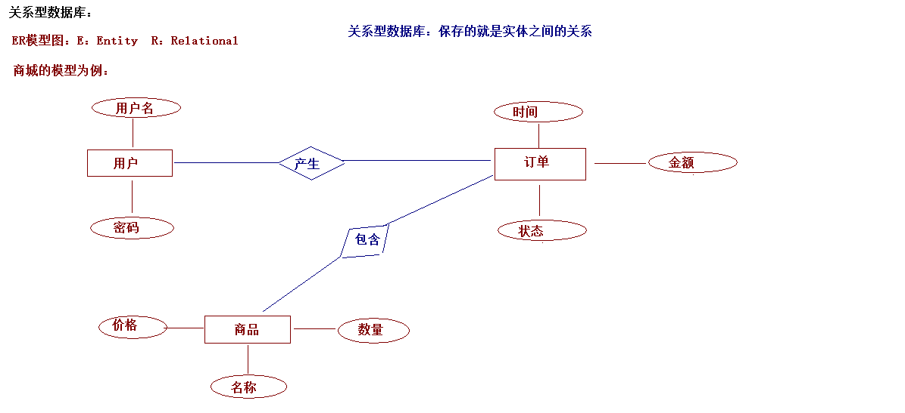

#### 常见的关系型数据库

-   MySQL

-   Oracle

-   SQLServer

-   DB2

-   SyBase

## MySQL的安装

### MySQL安装步骤

参见《MySQL的安装》视频

## MySQL的数据存储方式的概述

### 服务器的概念

#### 什么是服务器

服务器要从硬件和软件两个方面来说：

-   硬件：指的就是一台计算机。

-   软件：需要在这台电脑上安装数据库服务器。

### MySQL数据库存储的方式

#### 存储方式的描述

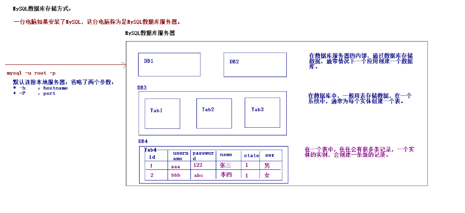{width="6.000694444444444in" height="2.751388888888889in"}

一台数据库服务器中会创建很多数据库（一个项目，会创建一个数据库）。在数据库中会创建很多张表（一个实体会创建一个表）。在表中会有很多记录（一个对象的实例会添加一条新的记录）。

## SQL的概述

### SQL的概念

#### 什么是SQL

{width="6.0in" height="1.145138888888889in"}

### SQL的分类

#### DDL：数据定义语言

create，drop，alter..

#### DCL：数据控制语言

grant，if...

#### DML：数据操纵语言

insert，update，delete...

#### DQL：数据查询语言

select

## 使用SQL

### SQL对数据库进行操作

#### 创建数据库

-   语法：

    -   create database 数据库名称 \[character set 字符集 collate 字符集校对规则\];

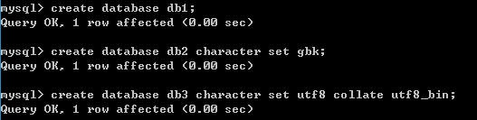{width="5.488888888888889in" height="1.3854166666666667in"}

#### 查看数据库

-   语法：

    -   查看数据库服务器中所有的数据库：show databases;

> 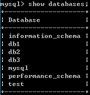

-   查看某个数据库的定义信息： show create database 数据库名称;

> 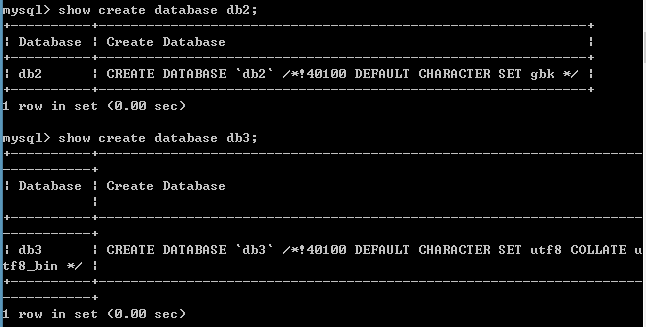

#### 修改数据库

-   语法：

    -   alter database 数据库名称 character set 字符集 collate 校对规则;

> 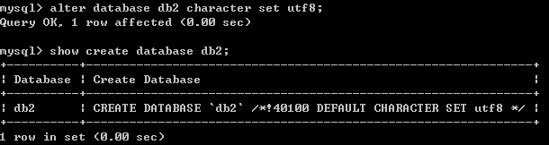

#### 删除数据库

-   语法:

    -   drop database 数据库名称;

> 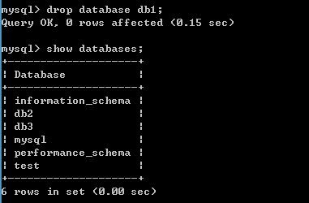

#### 其他数据库操作

-   切换数据库：use 数据库名称;

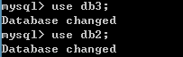

-   查看当前正在使用的数据库：

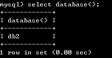

### SQL对数据库表进行操作

#### SQL创建表

-   语法：

    -   create table 表名称(字段名称 字段类型(长度) 约束,字段名称 字段类型(长度) 约束...);

-   字段类型

    -   一个实体对应一个表，一个实体属性对应表的一个字段。

> Java中的类型 MySQL中的类型
>
> byte/short/int/long tinyint/smallint/int/bigint
>
> float float
>
> double double
>
> boolean bit
>
> char/String char和varchar类型
>
> **char和varchar的区别：**
>
> **\* char代表是固定长度的字符或字符串。**
>
> **\* 定义类型char(8),向这个字段存入字符串hello，那么数据库使用三个空格将其补全。**
>
> **\* varchar代表的是可变长度的字符串。**
>
> **\* 定义类型varchar(8), 向这个字段存入字符串hello,那么存入到数据库的就是hello。**
>
> Date date/time/datetime/timestamp
>
> **datetime和timestamp区别**
>
> **\* datetime就是既有日期又有时间的日期类型，如果没有向这个字段中存值，数据库使用null存入到数据库中**
>
> **\* timestamp也是既有日期又有时间的日期类型，如果没有向这个字段中存值，数据库使用当前的系统时间存入到数据库中。**
>
> File BLOB/TEXT

-   约束

    -   约束作用：保证数据的完整性

    -   单表约束分类：

        -   主键约束：primary key 主键约束默认就是唯一 非空的

        -   唯一约束：unique

        -   非空约束：not null

-   建表语句：

```sql
create database web_test1;

use web_test1;

create table user(

id int primary key auto_increment,

username varchar(20) unique,

password varchar(20) not null,

age int,

birthday date

);
```


#### SQL查看表

-   查看某个数据库下的所有的表

<!-- -->

-   语法：show tables;

> 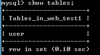{width="2.1666666666666665in" height="1.1875in"}

-   查看某个表的结构信息

<!-- -->

-   语法：desc 表名;

> 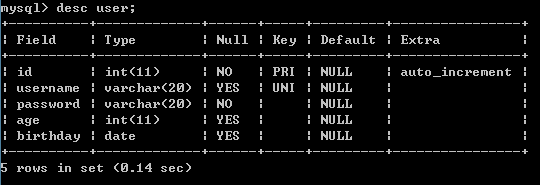{width="5.624305555555556in" height="1.9270833333333333in"}

#### SQL删除表

-   删除表

    -   语法：drop table 表名;

> 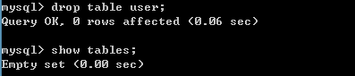{width="4.134722222222222in" height="0.8854166666666666in"}

#### SQL修改表

-   修改表：添加列

    -   alter table 表名 add 列名 类型(长度) 约束;

> 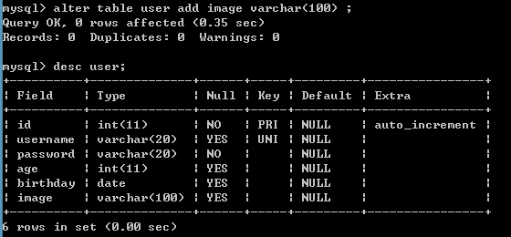{width="5.832638888888889in" height="2.7083333333333335in"}

-   修改表：修改列类型，长度和约束

    -   alter table 表名 modify 列名 类型(长度) 约束;

> {width="5.613888888888889in" height="0.6666666666666666in"}

-   修改表：删除列

    -   alter table 表名 drop 列名;

> {width="5.572222222222222in" height="0.7083333333333334in"}

-   修改表：修改列名称

    -   alter table 表名 change 旧列名 新列名 类型(长度) 约束;

> 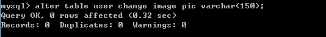{width="5.561805555555556in" height="0.6458333333333334in"}

-   修改表：修改表名

    -   rename table 表名 to 新的表名;

{width="5.593055555555556in" height="0.4791666666666667in"}

-   修改表：修改表的字符集

    -   alter table 表名 character set 字符集;

> {width="5.738888888888889in" height="0.6145833333333334in"}

### SQL对数据库表的记录进行操作（重点）

#### SQL添加表的记录

-   语法：

    -   向表中插入某些列：insert into 表名 (列名1,列名2,列名3...) values (值1,值2,值3...)

    -   向表中插入所有列：insert into 表名 values (值1,值2,值3...);

-   **注意事项**

    -   **1.值的类型与数据库中表列的类型一致。**

    -   **2.值的顺序与数据库中表列的顺序一致。**

    -   **3.值的最大长度不能超过列设置最大长度。**

    -   **4.值的类型是字符串或者是日期类型，使用单引号引起来。**

-   添加记录

    -   添加某几列

insert into user (id,username,password) values (null,\'aaa\',\'123\');

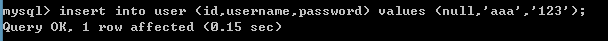{width="5.997222222222222in" height="0.4041666666666667in"}

-   添加所有列

insert into user values (null,\'bbb\',\'123\',23,\'1993-09-01\');

{width="6.001388888888889in" height="0.4361111111111111in"}

-   添加中文记录

insert into user values (null,\'张三\',\'123\',23,\'1993-09-01\');

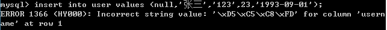{width="6.000694444444444in" height="0.4756944444444444in"}

**直接向数据库中插入中文记录会出现错误！！！**

**解决方法：**

**show variables like \'%character%\'; \--查看数据库中与字符集相关参数：**

**需要将MySQL数据库服务器中的客户端部分的字符集改为gbk。**

**找到MySQL的安装路径：my.ini文件，修改文件中\[client\]下的字符集**

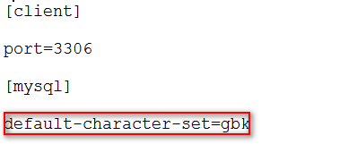{width="4.145138888888889in" height="1.6770833333333333in"}

\* 重新启动MySQL的服务器

services.msc

#### SQL修改表的记录

-   语法:

    -   update 表名 set 列名=值,列名=值 \[where 条件\];

-   **注意事项**

    -   **1.值的类型与列的类型一致。**

    -   **2.值的最大长度不能超过列设置的最大长度。**

    -   **3.字符串类型和日期类型添加单引号。**

-   **修改某一列的所有值**

update user set password = \'abc\';

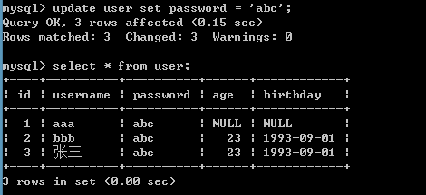{width="4.895138888888889in" height="2.25in"}

-   **按条件修改数据**

update user set password = \'xyz\' where username = \'bbb\';

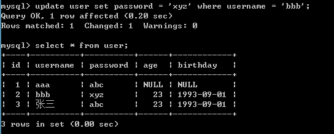{width="5.665972222222222in" height="2.2708333333333335in"}

-   **按条件修改多个列**

update user set password=\'123\',age=34 where username=\'aaa\';

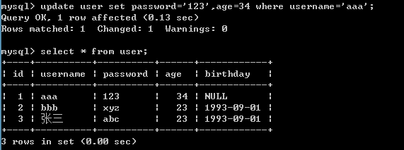{width="5.947222222222222in" height="2.21875in"}

#### SQL删除表的记录

-   语法：

    -   delete from 表名 \[where 条件\];

-   **注意事项**

    -   **1.删除表的记录，指的是删除表中的一行记录。**

    -   **2.删除如果没有条件，默认是删除表中的所有记录。**

-   **删除某一条记录**

delete from user where id = 2;

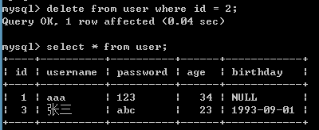{width="4.165972222222222in" height="1.7083333333333333in"}

-   **删除表中的所有记录**

delete from user;

{width="4.207638888888889in" height="0.9166666666666666in"}

-   **删除表中的记录有两种做法:**

    -   **delete from user;**

        -   **删除所有记录，属于DML语句，一条记录一条记录删除。事务可以作用在DML语句上的**

    -   **truncate table user;**

        -   **删除所有记录，属于DDL语句，将表删除，然后重新创建一个结构一样的表。事务不能控制DDL的**

#### SQL查看表的记录（重点）

-   **基本查询**

    -   **语法:select \[distinct\] \*\|列名 from 表 \[条件\];**

    -   环境的准备：

create table exam(

id int primary key auto\_increment,

name varchar(20),

english int,

chinese int,

math int

);

insert into exam values (null,\'张三\',85,74,91);

insert into exam values (null,\'李四\',95,90,83);

insert into exam values (null,\'王五\',85,84,59);

insert into exam values (null,\'赵六\',75,79,76);

insert into exam values (null,\'田七\',69,63,98);

insert into exam values (null,\'李老八\',89,90,83);

-   查询所有学生考试成绩信息

select \* from exam;

{width="3.801388888888889in" height="1.96875in"}

-   查询所有学生的姓名和英语成绩

select name,english from exam;

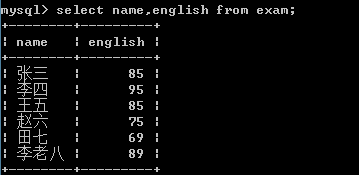{width="3.738888888888889in" height="1.8229166666666667in"}

-   查询英语成绩信息（不显示重复的值）

select distinct english from exam;

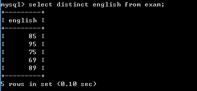{width="4.103472222222222in" height="1.90625in"}

-   查看学生姓名和学生的总成绩

select name,english+chinese+math from exam;

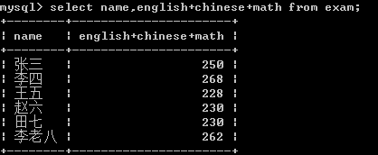{width="4.353472222222222in" height="1.7916666666666667in"}

-   别名查询

select name,english+chinese+math as sum from exam;

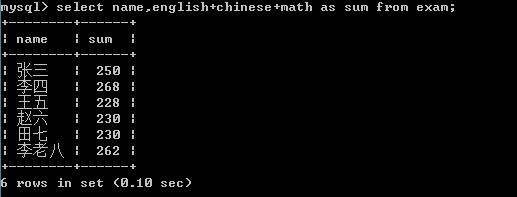{width="5.384722222222222in" height="2.0520833333333335in"}

-   **条件查询**

    -   **使用where子句**

        -   **\> , \< , \>= , \<= , \<\> ,=**

        -   **like:模糊查询**

        -   **in:范围查询**

        -   **条件关联:and , or ,not**

    -   **查询李四学生的成绩：**

select \* from exam where name = \'李四\';

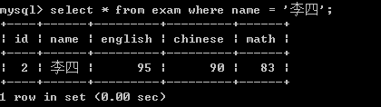{width="4.374305555555556in" height="1.2291666666666667in"}

-   **查询名称叫李四学生并且英文大于90分**

select \* from exam where name = \'李四\' and english \> 90;

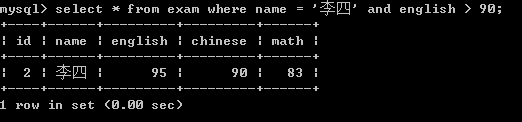{width="5.436805555555556in" height="1.2708333333333333in"}

-   **查询姓李的学生的信息**

like可以进行模糊查询,在like子句中可以使用\_或者%作为占位符。\_只能代表一个字符，而%可以代表任意个字符。

\* like '李\_' ：名字中必须是两个字，而且是姓李的。

\* like '李%' ：名字中姓李的学生，李子后可以是1个或任意个字符。

\* like '%四' ：名字中以四结尾的。

\* like '%王%' ：只要名称中包含这个字就可以。

select \* from exam where name like \'李%\';

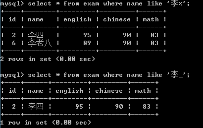{width="4.270138888888889in" height="2.6875in"}

-   **查询英语成绩是69,75,89学生的信息**

select \* from exam where english in (69,75,89);

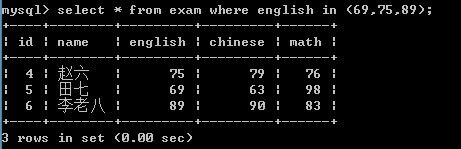{width="4.801388888888889in" height="1.5520833333333333in"}

-   **排序查询**
-   **使用order by 字段名称 asc/desc;**
    
-   查询学生信息，并且按照语文成绩进行排序：

select \* from exam order by chinese;

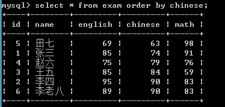{width="3.895138888888889in" height="1.8645833333333333in"}

-   查询学生信息，并且按照语文成绩倒序排序：

select \* from exam order by chinese desc;

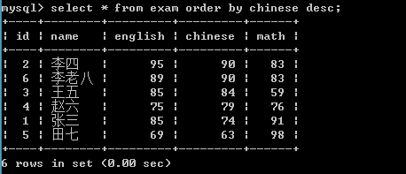{width="4.770138888888889in" height="2.0520833333333335in"}

-   查询学生信息，先按照语文成绩进行倒序排序，如果成绩相同再按照英语成绩升序排序

select \* from exam order by chinese desc,english asc;

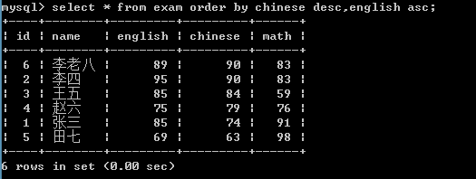{width="5.468055555555556in" height="2.0625in"}

-   查询姓李的学生的信息，按照英语成绩降序排序

select \* from exam where name like \'李%\' order by english desc;

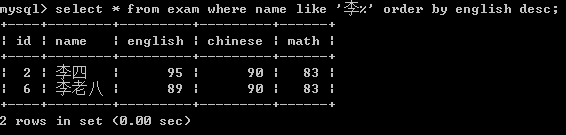{width="5.895138888888889in" height="1.40625in"}

-   **分组统计查询**

    -   **聚合函数使用**

        -   **sum();**

            -   获取所有学生的英语成绩的总和:

select sum(english) from exam;

{width="3.6034722222222224in" height="1.2291666666666667in"}

-   获取所有学生的英语成绩和数学成绩总和：

select sum(english),sum(math) from exam;

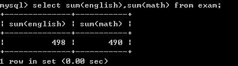{width="4.197222222222222in" height="1.1770833333333333in"}

-   查询姓李的学生的英语成绩的总和

select sum(english) from exam where name like \'李%\';

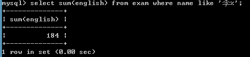{width="5.103472222222222in" height="1.1666666666666667in"}

-   查询所有学生各科的总成绩：

select sum(english)+sum(chinese)+sum(math) from exam;

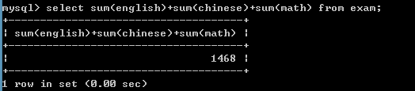{width="5.457638888888889in" height="1.1979166666666667in"}

select sum(english+chinese+math) from exam;

与上面的语句有什么不同？

\* 上面的语句是按照列的方式统计，英语成绩总和+语文成绩总和+数学成绩总和。

\* 下面的语句先计算英语+数学+语文然后再求和。

\* 使用ifnull的函数

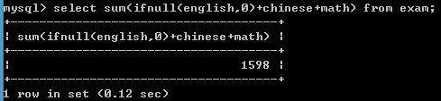{width="5.093055555555556in" height="1.1770833333333333in"}

-   **count();**

    -   获得学生的总数

select count(\*) from exam;

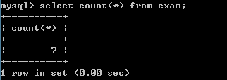{width="3.3534722222222224in" height="1.1875in"}

-   获得姓李的学生的个数

select count(\*) from exam where name like \'李%\';

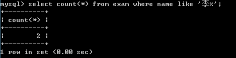{width="4.884722222222222in" height="1.2083333333333333in"}

-   **max();**

    -   获得数学成绩的最高分：

select max(math) from exam;

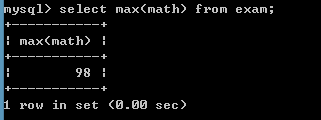{width="3.3430555555555554in" height="1.25in"}

-   **min();**

    -   获得语文成绩的最小值

select min(chinese) from exam;

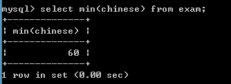{width="3.4784722222222224in" height="1.2708333333333333in"}

-   **avg();**
-   **获取语文成绩的平均值**

select avg(chinese) from exam;

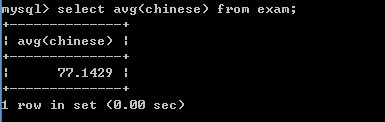{width="4.009722222222222in" height="1.2708333333333333in"}

-   **分组查询**

    -   **语法：使用group by 字段名称;**

    -   **环境准备**

```sql
create table orderitem(

id int primary key auto_increment,

product varchar(20),

price double

);

insert into orderitem values (null,'电视机',2999);

insert into orderitem values (null,'电视机',2999);

insert into orderitem values (null,'洗衣机',1000);

insert into orderitem values (null,'洗衣机',1000);

insert into orderitem values (null,'洗衣机',1000);

insert into orderitem values (null,'冰箱',3999);

insert into orderitem values (null,'冰箱',3999);

insert into orderitem values (null,'空调',1999);
```


-   按商品名称统计，每类商品所购买的个数：

select product,count(\*) from orderitem group by product;

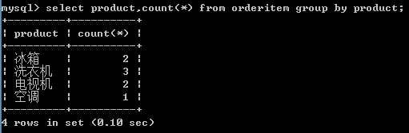{width="5.322222222222222in" height="1.7395833333333333in"}

-   按商品名称统计，每类商品所花费的总金额：

select product,sum(price) from orderitem group by product;

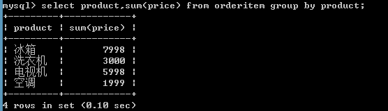{width="5.790972222222222in" height="1.6666666666666667in"}

-   按商品名称统计，统计每类商品花费的总金额在5000元以上的商品

**\*\*\*\*\* where的子句后面不能跟着聚合函数。如果现在使用带有聚合函数的条件过滤（分组后条件过滤）需要使用一个关键字having**

select product,sum(price) from orderitem group by product having sum(price) > 5000;

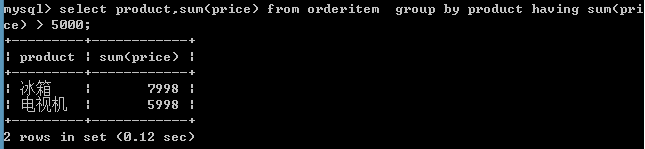{width="5.999305555555556in" height="1.386111111111111in"}

-   按商品名称统计，统计每类商品花费的总金额在5000元以上的商品，并且按照总金额升序排序

select product,sum(price) from orderitem group by product having sum(price) \> 5000 order by sum(price) asc;

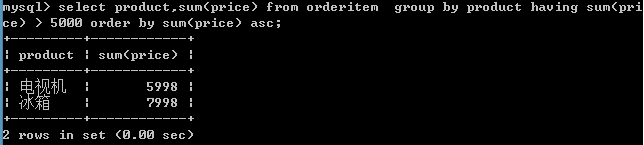{width="6.003472222222222in" height="1.35in"}

-   **总结**
-   **S(select)... F(from)...W(where)...G(group by)...H(having)...O(order by);**
