## 1.1 重置MySQL的密码

### 1.1.1 重置MySQL的密码步骤

#### 1.1.1.1 第一步：停止MySQL的服务

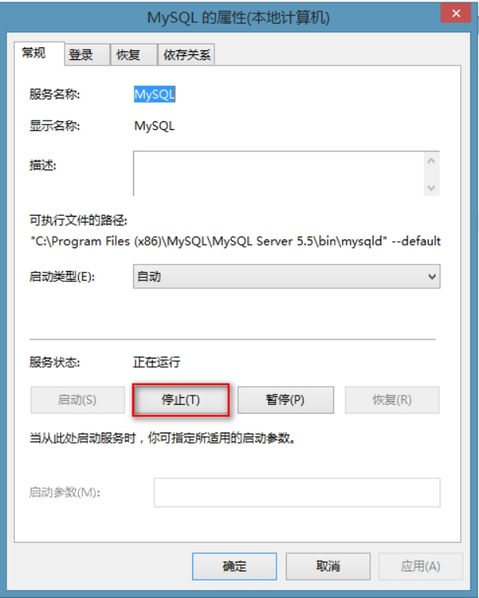 

#### 1.1.1.2 第二步：在cmd下启动MySQL服务

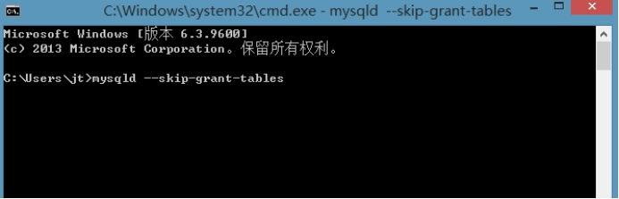 

#### 1.1.1.3 第三步：重新开启cmd的命令行

登录MySQL，不需要输入密码

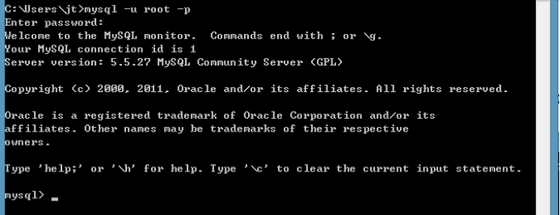 

#### 1.1.1.4 第四步：修改root的密码

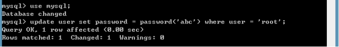 

#### 1.1.1.5 第五步：结束mysqld的进程

 

#### 1.1.1.6 第六步：重新启动MySQL的服务

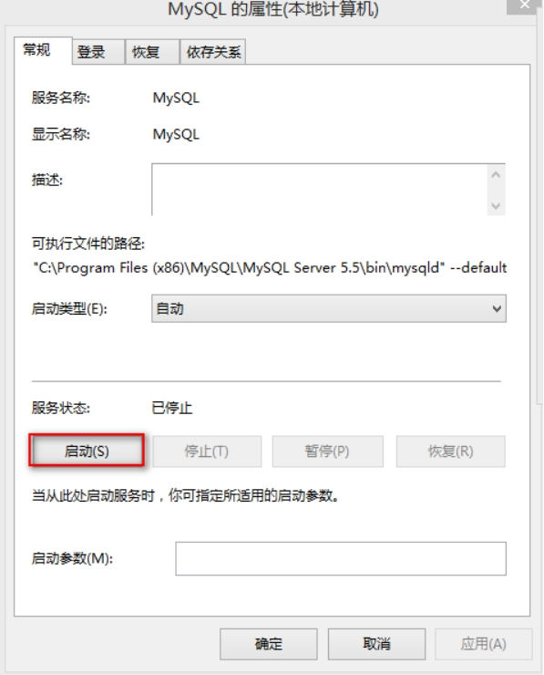 

## 1.2 数据库的备份和还原

### 1.2.1 数据库的备份

#### 1.2.1.1 第一步：打开cmd的命令行窗口

mysqldump -u root -p web_test1 >C:/web_test1.sql

 

### 1.2.2 数据库的还原

#### 1.2.2.1 第一种还原方式：

l 第一步：在数据库服务器内部创建数据库：

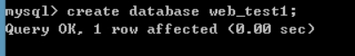 

l 第二步：在命令行窗口

mysql -u root -p web_test1 < C:/web_test1.sql

 

#### 1.2.2.2 第二种还原方式

l 第一步：在数据库服务器内部创建数据库：

 

l 第二步：切换到该数据库使用source命令还原

 

## 1.3 MySQL的可视化工具使用

### 1.3.1 SQLyog可视化工具

#### 1.3.1.1 可视化工具连接到MySQL

 

#### 1.3.1.2 创建数据库

- 在空白处点击右键

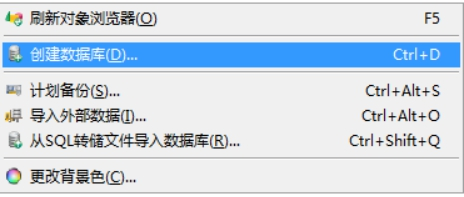 

- 输入数据库名称

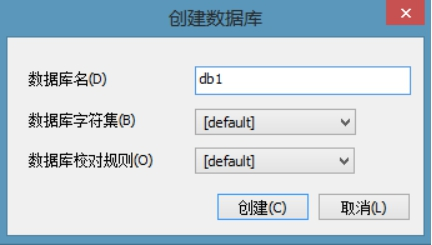 

#### 1.3.1.3 删除数据库

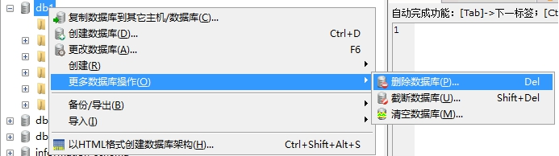 

#### 1.3.1.4 创建表

- 在Tables上右键：

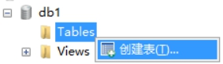 

- 创建表

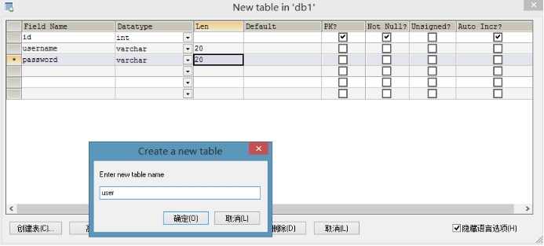 

#### 1.3.1.5 向表中插入记录

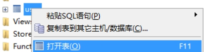 

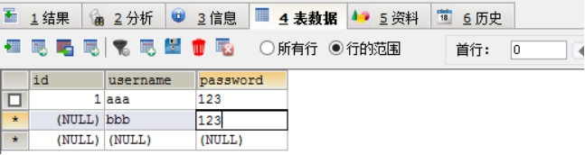 

#### 1.3.1.6 执行SQL语句

- 编写SQL

 

- 执行SQL

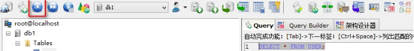 

#### 1.3.1.7 数据库备份:

- 备份数据库

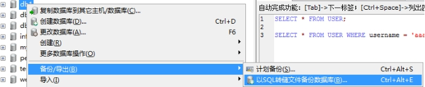 

- 导出SQL

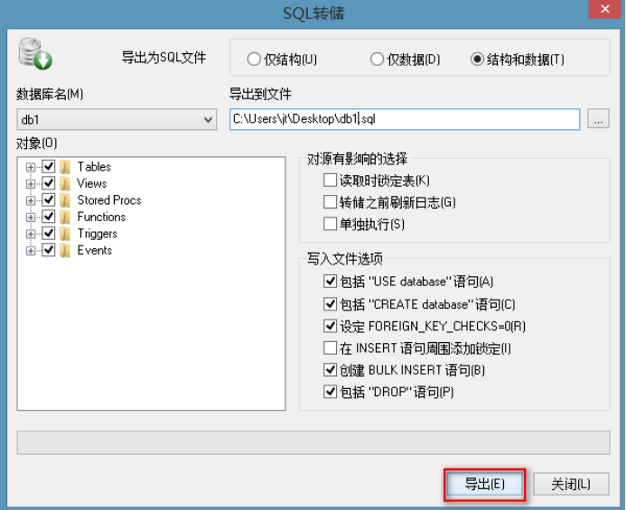 

## 1.4 多表设计之外键约束

### 1.4.1 约束

#### 1.4.1.1 约束的作用

约束是用来保证数据的完整性。

#### 1.4.1.2 单表约束

- 主键约束
- 唯一约束
- 非空约束

#### 1.4.1.3 多表约束

- 外键约束：用来保证数据完整性（多表之间）。

### 1.4.2 演示外键约束作用

#### 1.4.2.1 创建一个部门表

```sql
create table dept(
	did int primary key auto_increment,
	dname varchar(20)
);
insert into dept values (null,'市场部');
insert into dept values (null,'人事部');
insert into dept values (null,'教研部');
```

#### 1.4.2.2 创建一个员工表

```sql
create table employee(
	eid int primary key auto_increment,
	ename varchar(20),
	salary double,
	birthday date,
	sex varchar(10),
	dno int
);

insert into employee values (null,'张三',8000,'1988-09-01','男',3);

insert into employee values (null,'李四',9000,'1988-09-01','男',1);

insert into employee values (null,'王五',6000,'1988-09-01','男',2);

insert into employee values (null,'赵六',10000,'1988-09-01','男',3);

insert into employee values (null,'孙七',10000,'1988-09-01','男',1);
```

#### 1.4.2.3 删除其中的某个部门（是否可以）

- 查看数据

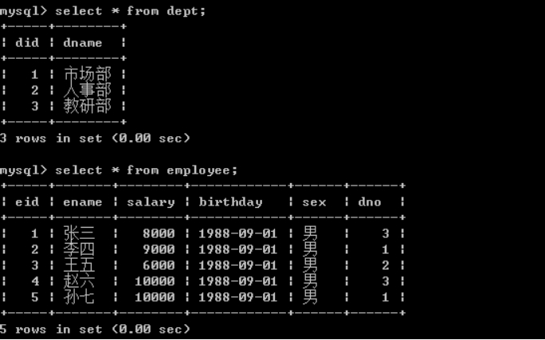 

- 向员工表中插入一条记录（没有部门）

  ```sql
  insert into employee values (null,'田八',10000,'1988-09-01','男',null);
  ```

- 删除一个人事部

  ```sql
  delete from dept where did = 2;
  ```

向刚才做的这两个操作（插入一个没有部门的员工，删除一个带有员工的部门）。这种情况都是不应该发生。这个时候需要在多表之间添加外键约束。

### 1.4.3 添加外键约束

#### 1.4.3.1 在员工表上添加外键

````sql
alter table employee add foreign key (dno) references dept(did);
````

 

#### 1.4.3.2 设置外键为非空

```sql
alter table employee modify dno int not null;
```

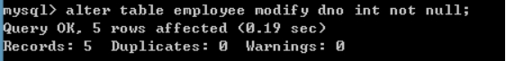 

## 1.5 多表设计之表关系的介绍

### 1.5.1 表与表之间的关系

#### 1.5.1.1 一对多的关系

- 一对多的例子：
  - 一个部门下可以有多个员工，一个员工只能属于某一个部门。

#### 1.5.1.2 多对多的关系

- 多对多的例子：
  - 一个学生可以选择多门课程，一门课程可以被多个学生选择。

#### 1.5.1.3 一对一的关系

- 一对一的例子：
  - 一个公司可以有一个注册地址，一个注册地址只能对一个公司。

## 1.6 多表设计之一对多关系

### 1.6.1 一对多关系介绍

#### 1.6.1.1 一对多关系的建表原则

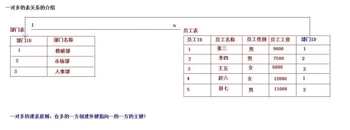 

在多的一方创建外键指向一的一方的主键

## 1.1 多表设计之多对多

### 1.1.1 多对多的关系介绍

一个学生选择多门课程，一门课程被多个学生所选择

#### 1.1.1.1 多对多的建表的原则

 

需要创建中间表，中间表中至少两个字段，分别作为外键指向多对多双方的主键

## 1.7 多表设计之一对一关系

### 1.7.1 一对一关系的介绍

一个公司可以对应一个注册地址，一个注册地址只能对应一个公司

#### 1.7.1.1 一对一关系建表原则

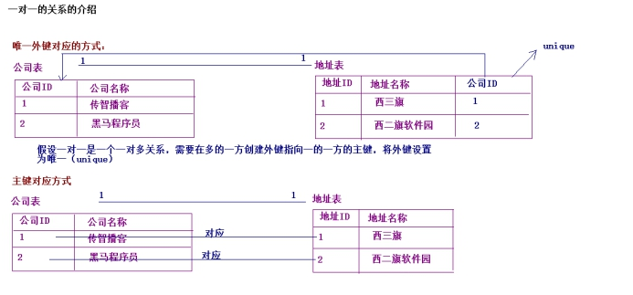 

- 唯一外键对应
  - 假设是一对多，在多的一方创建外键指向一的一方的主键，将外键设置为unique。

- 主键对应
  - 将两个表的主键建立对应关系即可。

## 1.8 多表设计之多表分析及创建

### 1.8.1 多表的分析

#### 1.8.1.1 需求：

完成一个学校的选课系统，在选课系统中包含班级，学生和课程这些实体。

- 班级和学生之间是有关系存在：
  - 一个班级下包含多个学生，一个学生只能属于某一个班级（一对多的关系）。
- 学生和课程之间是有关系存在：
  - 一个学生可以选择多门课程，一门课程也可以被多个学生所选择（多对多的关系）。

### 1.8.2 多表的创建

#### 1.8.2.1 创建表

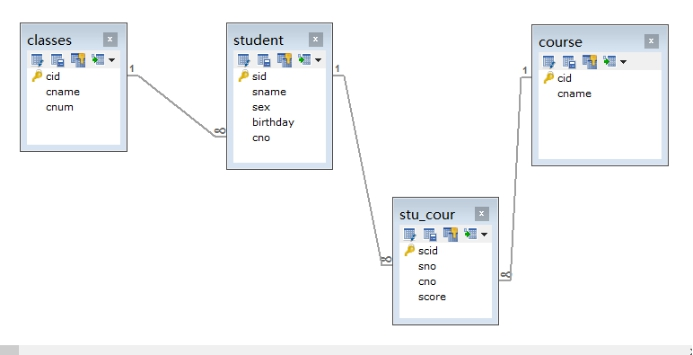 

### 1.8.3 作业：

#### 1.8.3.1 需求：

实现一个网上商城案例，在商城中会有用户，商品，订单，商品分类。

## 1.9 多表查询之多表查询的概述

### 1.9.1 多表查询的分类

#### 1.9.1.1 连接查询

- 交叉连接:cross join
  - 交叉连接：查询到的是两个表的笛卡尔积。
  - 语法：
    - select * from 表1 cross join 表2;
    - select * from 表1,表2;

- 内连接:inner join(inner是可以省略的)
  - 显示内连接：在SQL中显示的调用inner join关键字
    - 语法：select * from 表1 inner join 表2 on 关联条件;
  - 隐式内连接：在SQL中没有调用inner join关键字
    - 语法：select * from 表1,表2 where 关联条件;

- 外连接:outer join(outer可以省略的)
  - 左外连接：
    - 语法：select * from 表1 left outer join 表2 on 关联条件;
  - 右外连接
    - 语法：select * from 表1 right outer join 表2 on 关联条件;

#### 1.9.1.2 子查询

- 子查询：一个查询语句条件需要依赖另一个查询语句的结果。

## 1.10 多表查询之数据准备

### 1.10.1 数据准备

#### 1.10.1.1 班级表数据的准备

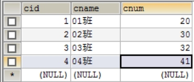 

#### 1.10.1.2 学生表数据的准备

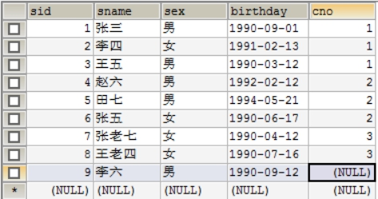 

#### 1.10.1.3 课程表数据的准备

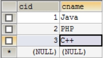 

#### 1.10.1.4 学生选课表的准备

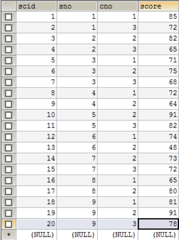 

## 1.1 多表查询之交叉连接

### 1.1.1 交叉连接

#### 1.1.1.1 使用cross join关键字

````sql
select * from classes cross join student;
````

#### 1.1.1.2 不使用cross join关键字

````sql
SELECT * FROM classes,student;
````

## 1.1 多表查询之内连接

### 1.1.1 内连接

#### 1.1.1.1 显示内连接

````sql
select * from classes c inner join student s on c.cid = s.cno;
````

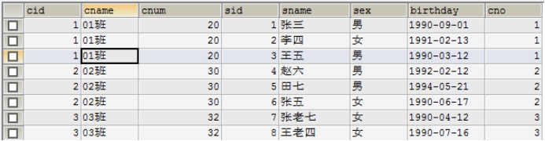 

#### 1.1.1.2 隐式内连接

````sql
SELECT * FROM classes c,student s WHERE c.cid = s.cno;
````

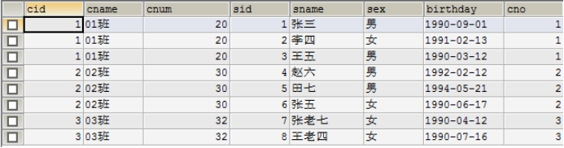 

## 1.1 多表查询之外连接

### 1.1.1 外连接

#### 1.1.1.1 左外连接

```sql
SELECT * FROM classes c LEFT OUTER JOIN student s ON c.cid = s.cno;
```

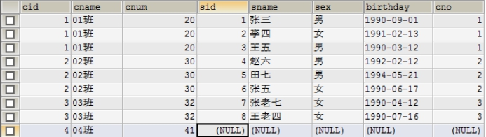 

#### 1.1.1.2 右外连接

```sql
select * from classes c right outer join student s on c.cid = s.cno;
```

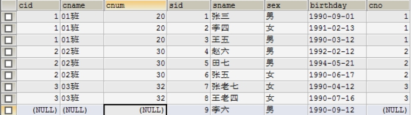 

## 1.1 多表查询之内连接与外连接的区别

### 1.1.1 内连接和外连接的区别

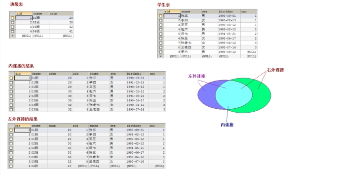 

## 1.11 多表查询之子查询

### 1.11.1 子查询

#### 1.11.1.1 带in的子查询

- 查询学生生日在91年之后的班级的信息。

  ````sql
  select * from classes where cid in (SELECT cno FROM student WHERE birthday > '1991-01-01');
  ````

  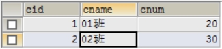 

#### 1.11.1.2 带exists的子查询

- 查询学生生日大于91年1月1日，如果记录存在，前面的SQL语句就会执行

  ````sql
  select * from classes where exists (SELECT cno FROM student WHERE birthday > '1991-01-01');
  ````

  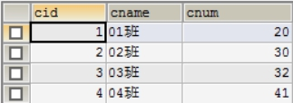 

#### 1.11.1.3 带any的子查询

```sql
SELECT * FROM classes WHERE cid > ANY (SELECT cno FROM student )
```

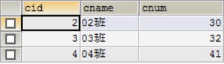 

#### 1.11.1.4 带all的子查询

`````sql
SELECT * FROM classes WHERE cid > ALL (SELECT cno FROM student)
`````

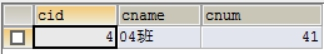 

## 1.12 多表查询之练习

### 1.12.1 多表查询的练习

- 查询班级名称，和班级总人数

  ````sql
  SELECT c.cname,COUNT(*) FROM classes c,student s WHERE c.cid = s.cno GROUP BY c.cname;
  ````

  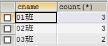 

- 查询学生的姓名和学生所选的总课程平均成绩。

  ```sql
  select s.sname,avg(sc.score) from student s,stu_cour sc where s.sid = sc.sno group by s.sname;
  ```

  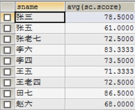 

- 查询学生的姓名和学生的选课总数，显示选课超过2门学生姓名。

  ```sql
  select s.sname,count(*) from student s,stu_cour sc where s.sid = sc.sno group by s.sname having count(*) > 2;
  ```

  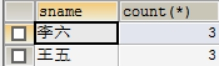 

- 查询平均成绩大于80分的学生的总数。

  ```sql
  select count(*) from student s where s.sid in (SELECT sc.sno FROM stu_cour sc GROUP BY sc.sno HAVING AVG(sc.score) >  80);
  ```

   

- 查询学生和平均成绩，但是平均成绩大于01班的任何一个学生的评价成绩。

  ```sql
  SELECT s.sname,AVG(sc.score) FROM student s,stu_cour sc WHERE s.sid = sc.sno GROUP BY s.sname HAVING AVG(sc.score) > ANY(SELECT AVG(sc.score) FROM student s,stu_cour sc,classes c WHERE s.sid = sc.sno AND s.cno = c.cname AND c.cname ='01班' GROUP BY s.sname);
  ```

  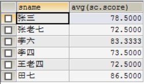 

## 1.13 事务的概述

### 1.13.1 事务的概念

事务：指的是逻辑上的一组操作，组成这组操作的各个逻辑单元，要么全都成功，要么全都失败。

### 1.13.2 MySQL中的事务管理

#### 1.13.2.1 环境准备

````sql
create table account(
	id int primary key auto_increment,
	name varchar(20),
	money double
);

insert into account values (null,'小张',10000);
insert into account values (null,'小凤',10000);
````

#### 1.13.2.2 转账案例

l 开启事务：

start transaction;

l 提交事务

commit;

l 回滚事务

rollback;

l 提交事务

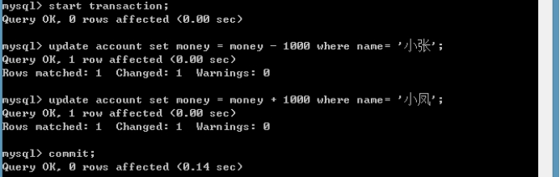 

update account set money=money+1000 where name='小张';

update account set money=money-1000 where name='小风';

l 回滚事务

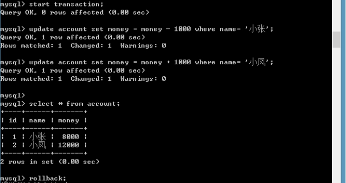 

### 1.13.3 事务的特性：

#### 1.13.3.1 原子性

原子性：事务的不可分割，组成事务的各个逻辑单元不可分割。

#### 1.13.3.2 一致性

一致性：事务执行的前后，数据完整性保持一致。

#### 1.13.3.3 隔离性

隔离性：事务执行不应该受到其他事务的干扰。

#### 1.13.3.4 持久性

持久性：事务一旦结束，数据就持久化到数据库中。

 

## 1.14 事务的隔离级别

### 1.14.1 如果不考虑隔离性，引发一些安全问题

隔离性：一个事务的执行，不应该受到其他事务的干扰。

如果不考虑隔离性（一个事务执行受到其他的事务的干扰），引发一些安全问题，主要体现在读取数据上：

l 脏读：一个事务读到了另一个事务未提交的数据，导致查询结果不一致

l 不可重复读：一个事务读到了另一个事务已经提交的update的数据，导致多次查询结果不一致。

l 虚读/幻读：一个事务读到了另一个事务已经提交的insert的数据，导致多次查询结果不一致。

### 1.14.2 解决这些安全性问题：

设置事务的隔离级别：

l read uncommitted	：脏读，不可重复读，虚读都有可能发生

l read committed	：避免脏读。但是不可重复读和虚读是有可能发生

l repeatable read	：避免脏读和不可重复读，但是虚读有可能发生。

l serializable		：避免脏读，不可重复读，虚读。

## 1.15 事务的隔离级别的演示

### 1.15.1 演示脏读

l 开启两个窗口A,B

l 设置A窗口的隔离级别为read uncommitted;

SET SESSION TRANSACTION ISOLATION LEVEL read uncommitted;

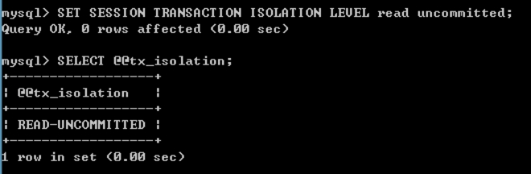 

l 在A，B两个窗口中开启事务

start transaction;

l 在B窗口中完成转账的功能：

update account set money = money - 1000 where name= '小张';

update account set money = money + 1000 where name= '小凤';

*\\ 事务未提交!!!

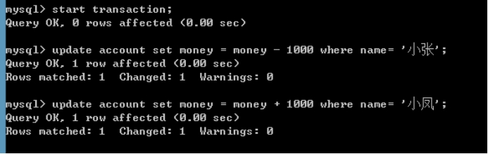 

l 在A窗口中进行查询

select * from account;

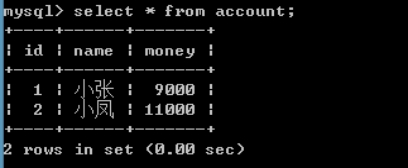 

*\\发现A窗口中已经查询到转账成功了！！！已经发生了脏读：一个事务中已经读到了另一个事务未提交的数据。

## 1.16 事务的隔离级别演示

### 1.16.1 避免脏读，演示不可重复读发生

l 开启两个窗口A,B

l 设置A窗口的隔离级别为read committed;

SET SESSION TRANSACTION ISOLATION LEVEL read committed;

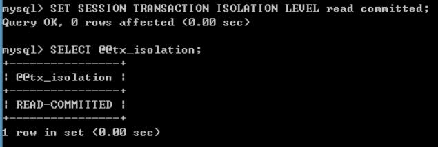 

l 分别在两个窗口中开启事务：

start transaction;

l 在B窗口中完成转账

update account set money = money - 1000 where name= '小张';

update account set money = money + 1000 where name= '小凤';

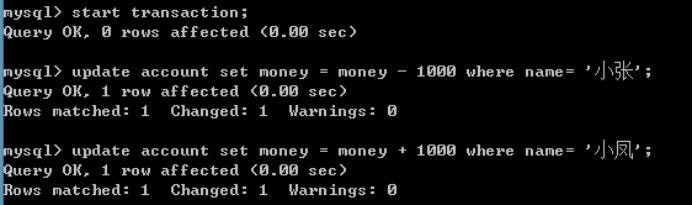 

*\\ 没有提交事务！！！

l 在A窗口中进行查询：

select * from account;

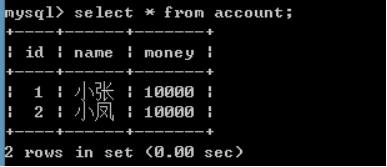 

*\\ 发现这个时候没有转账成功！！！（没有查询到另一个事务未提交的数据：说明已经避免了脏读）。

l 在B窗口中提交事务

commit;

l 在A窗口查询

select * from account;

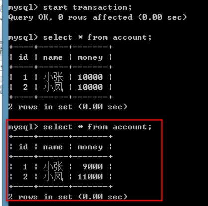 

*\\ 发现这次的结果已经发生了变化！！！（已经发生不可重复读：一个事务已经读到了另一个事务提交的update的数据，导致多次查询结果不一致。）

 

## 1.17 事务的隔离级别的演示

### 1.17.1 演示避免不可重复读

l 分别开启两个窗口A，B

l 设置A窗口的隔离级别：repeatable read;

SET SESSION TRANSACTION ISOLATION LEVEL repeatable read;

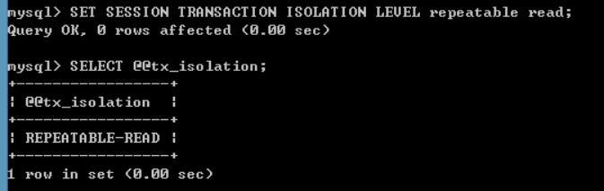 

l 在A，B两个窗口中开启事务:

start transaction;

l 在B窗口完成转账

update account set money = money - 1000 where name= '小张';

update account set money = money + 1000 where name= '小凤';

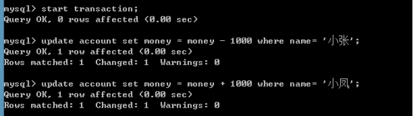 

*\\ 未提交事务！！！

l 在A窗口中进行查询

select * from account;

*\\ 发现没有转账成功：说明避免脏读！！！

l 在B窗口中提交事务

commit;

l 在A窗口中再次查询：

 

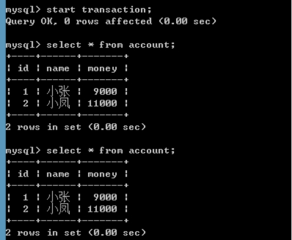 

*\\ 发现在一个事务中的多次查询结果是一致！！！（已经避免不可重复读）。

## 1.18 事务的隔离级别演示

### 1.18.1 演示串行化

l 开启两个窗口A,B

l 设置A窗口的隔离级别：serializable

SET SESSION TRANSACTION ISOLATION LEVEL serializable;

 

l 分别在两个窗口中开启事务：

start transaction;

 

l 在B窗口中插入一条记录

insert into account values (null,'小李',10000);

 

l 在A窗口中进行查询

select * from account;

*\\发现A窗口已经卡住了（说明事务不允许出现并发，A窗口需要等待B窗口事务执行完成以后，才会执行A窗口的事务。）当B窗口的事务结束（提交或者回滚），那么A窗口马上就会出现结果。

  