## 一、JDBC的概述

### 什么是JDBC

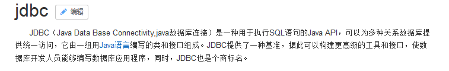

### 什么是数据库驱动

-   驱动：两个设备（应用）之间通信的桥梁。

### 为什么学习JDBC

没有JDBC的时候，如果现在要开发一套系统，使用Java连接MySQL数据库，那么这时候Java程序员需要了解MySQL驱动API，如果使用Java连接Oracle数据库，那么这个时候Java程序员需要了解Oracle数据库驱动API。

SUN公司提供一套统一的规范（接口）。然后各个数据库生产商提供这套接口的实现。这套接口规范就是JDBC的规范。

## JDBC的入门

### JDBC的环境准备

#### 创建数据库和表

``` mysql
create database web_test3;
use web_test3;
create table user(
id int primary key auto_increment,
username varchar(20),
password varchar(20),
nickname varchar(20),
age int
);
insert into user values (null,'aaa','123','小丽',34);
insert into user values (null,'bbb','123','大王',32);
insert into user values (null,'ccc','123','小明',28);
insert into user values (null,'ddd','123','大黄',21);
```

#### 创建项目，引入jar包

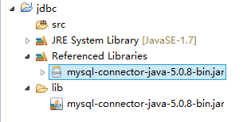

### JDBC的代码实现

#### JDBC的开发步骤

-   第一步：加载驱动

-   第二步：获得连接

-   第三步：基本操作

-   第四步：释放资源

    4.  #### JDBC的代码实现

```java
import org.junit.Test;

// JDBC的入门程序


public class JDBCDemo1 {
@Test
//JDBC的入门

public void demo1() throws Exception{
//1.加载驱动
Class.forName("com.mysql.jdbc.Driver");
//2.获得连接
Connection conn = DriverManager.getConnection("jdbc:mysql://localhost:3306/web_test3", "root", "123");
// 3.基本操作：执行SQL
//3.1获得执行SQL语句的对象
Statement statement = conn.createStatement();
// 3.2编写SQL语句:
String sql = "select  from user";
// 3.3执行SQL:
ResultSet rs = statement.executeQuery(sql);
// 3.4遍历结果集:
while(rs.next()){
System.out.print(rs.getInt("id")+" ");
System.out.print(rs.getString("username")+" ");
System.out.print(rs.getString("password")+" ");
System.out.print(rs.getString("nickname")+" ");
System.out.print(rs.getInt("age"));
System.out.println();
}
// 4.释放资源
rs.close();
statement.close();
conn.close();
}
}
```


## JDBC的API详解之DriverManager

### DriverManager：驱动管理类

#### 作用一：注册驱动

{width="5.768055555555556in" height="0.7354166666666667in"}

这个方法可以完成驱动的注册，但是实际开发中一般不会使用这个方法完成驱动的注册！！！

原因：

如果需要注册驱动，就会使用DriverManager.registerDriver(new Driver());，但是查看源代码发现，在代码中有一段静态代码块，静态代码块已经调用了注册驱动的方法。

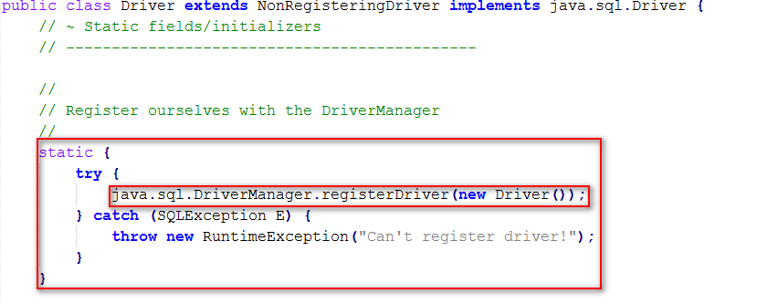{width="5.768055555555556in" height="2.2534722222222223in"}

-   如果再手动调用该方法注册驱动，就会导致驱动被注册两次。实际开发中一般会采用：

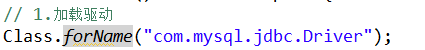{width="4.427083333333333in" height="0.5208333333333334in"}

#### 作用二：获得连接


这个方法就是用来获得与数据库连接的方法：这个方法中有三个参数：

-   url ：与数据库连接的路径

-   user ：与数据库连接的用户名

-   password ：与数据库连接的密码

主要关注的是url的写法：

jdbc:mysql:\\localhost:3306\web\_test3

-   jdbc :连接数据库的协议

-   mysql :是jdbc的子协议

-   localhost :连接的MySQL数据库服务器的主机地址。（连接是本机就可以写成localhost），如果连接不是本机的，就需要写上连接主机的IP地址。

-   3306 :MySQL数据库服务器的端口号

-   web\_test3 :数据库名称

url如果连接的是本机的路径，可以简化为如下格式：

jdbc:mysql:\\\web\_test3

## JDBC的API详解之Connection

### Connection：与数据库连接对象

#### 作用一：创建执行SQL语句的对象

{width="5.768055555555556in" height="0.5291666666666667in"}

{width="5.768055555555556in" height="0.5229166666666667in"}

{width="5.768055555555556in" height="0.5326388888888889in"}

执行SQL语句对象:

-   Statement :执行SQL

-   CallableStatement :执行数据库中存储过程

-   PreparedStatement :执行SQL.对SQL进行预处理。解决SQL注入漏洞。

    8.  #### 作用二：管理事务

{width="5.768055555555556in" height="0.5395833333333333in"}

{width="5.768055555555556in" height="0.6541666666666667in"}

{width="5.768055555555556in" height="0.58125in"}

## JDBC的API详解之Statement

### Statement：执行SQL

#### 作用一：执行SQL

{width="5.768055555555556in" height="0.5069444444444444in"}

{width="5.768055555555556in" height="0.5104166666666666in"}

{width="5.768055555555556in" height="0.5715277777777777in"}

-   执行SQL的方法

    -   boolean execute(String sql);

        -   执行查询，修改，添加，删除的SQL语句。

    -   ResultSet executeQuery(String sql);

        -   执行查询（执行select语句）。

    -   int executeUpate(String sql);

        -   执行修改，添加，删除的SQL语句。

            10. #### 作用二：执行批处理

{width="5.768055555555556in" height="0.5138888888888888in"}

{width="5.768055555555556in" height="0.45625in"}

{width="5.768055555555556in" height="0.4583333333333333in"}

## JDBC的API详解之ResultSet

### ResultSet：结果集。

通过select语句的查询结果。

#### 结果集的遍历

{width="5.768055555555556in" height="0.2701388888888889in"}

-   结果集遍历原理

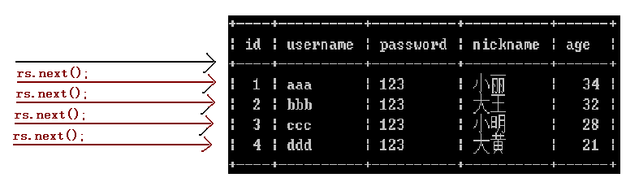{width="5.768055555555556in" height="1.6722222222222223in"}

-   代码实现

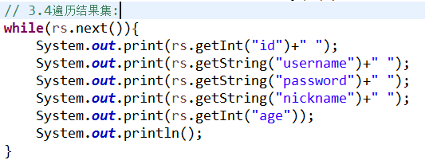{width="5.552083333333333in" height="2.09375in"}

#### 结果集的获取

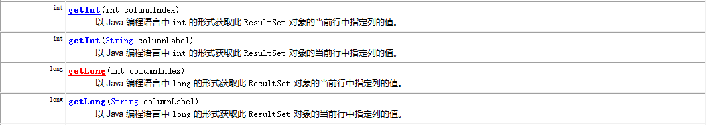{width="5.768055555555556in" height="1.03125in"}

{width="5.768055555555556in" height="0.5305555555555556in"}

-   结果集获取可以使用结果集中的:

getXXX();方法通常都会有一个重载的方法。

-   getXXX(int columnIndex);

-   getXXX(String columnName);

## JDBC的资源释放

### JDBC资源释放

JDBC程序执行结束后，将与数据库进行交互的对象释放掉，通常是ResultSet,Statement,Connection。

这几个对象中尤其是Connection对象是非常稀有的。这个对象一定要做到尽量晚创建，尽早释放掉。

-   将资源释放的代码写入到finally的代码块中。

-   资源释放的代码应该写的标准：

```java
if(rs !=null){
try {
rs.close();
} catch (SQLException e) {
e.printStackTrace();
}
rs = null;
}
if(statement !=null){
try {
statement.close();
} catch (SQLException e) {
e.printStackTrace();
}
statement = null;
}
if(conn !=null){
try {
conn.close();
} catch (SQLException e) {
e.printStackTrace();
}
conn = null;
}
```

1.  ## JDBC的CRUD操作之保存操作

    1.  ### 保存操作代码实现

```java
@Test
//保存操作的代码实现
public void demo1(){
Connection conn = null;
Statement stmt = null;
try{
// 注册驱动:
Class.forName("com.mysql.jdbc.Driver");
//获得连接:
conn = DriverManager.getConnection("jdbc:mysql:///web_test3", "root", "abc");
//执行操作:
//创建执行SQL语句对象:
stmt = conn.createStatement();
//编写SQL语句:
String sql = "insert into user values (null,'eee','123','阿黄',21)";
//执行SQL语句:
int num = stmt.executeUpdate(sql);
if(num > 0){
System.out.println("保存用户成功!!!");
}
}catch(Exception e){
e.printStackTrace();
}finally{
// 资源释放：
if(stmt != null){
try {
stmt.close();
} catch (SQLException e) {
e.printStackTrace();
}
stmt = null;
}
if(conn != null){
try {
conn.close();
} catch (SQLException e) {
e.printStackTrace();
}
conn = null;
}
}
}
```


1.  ## JDBC的CURD操作之修改操作

    1.  ### 修改操作代码实现

```java
@Test
//修改操作的代码实现
public void demo2(){
Connection conn = null;
Statement stmt = null;
try{
//注册驱动:
Class.forName("com.mysql.jdbc.Driver");
//获得连接
conn = DriverManager.getConnection("jdbc:mysql:\\web_test3", "root", "abc");
//执行操作:
//创建执行SQL语句的对象:
stmt = conn.createStatement();
// 编写SQL语句：
String sql = "update user set password='abc',nickname='旺财' where id = 5";
// 执行SQL语句:
int num = stmt.executeUpdate(sql);
if(num > 0){
System.out.println("修改用户成功!!!");
}
}catch(Exception e){
e.printStackTrace();
}finally{
// 资源释放：
if(stmt != null){
try {
stmt.close();
} catch (SQLException e) {
e.printStackTrace();
}
stmt = null;
}
if(conn != null){
try {
conn.close();
} catch (SQLException e) {

e.printStackTrace();

}

conn = null;

}

}

}
```


1.  ## JDBC的CRUD操作之删除操作

    1.  ### 删除操作的代码实现

```
@Test

//删除操作的代码实现
public void demo3(){

Connection conn = null;

Statement stmt = null;

try{

//注册驱动:

Class.forName(\"com.mysql.jdbc.Driver\");

// 获得连接:

conn = DriverManager.getConnection(\"jdbc:mysql:\\\web\_test3\", \"root\", \"abc\");

// 创建执行SQL语句对象:

stmt = conn.createStatement();

//编写SQL:

String sql = \"delete from user where id = 5\";

// 执行SQL:

int num = stmt.executeUpdate(sql);

if(num > 0){

System.out.println("删除用户成功！！！");

}

}catch(Exception e){

e.printStackTrace();

}finally{

// 资源释放：

if(stmt != null){

try {

stmt.close();

} catch (SQLException e) {

e.printStackTrace();

}

stmt = null;

}

if(conn != null){

try {

conn.close();

} catch (SQLException e) {

e.printStackTrace();

}

conn = null;

}

}

}
```


1.  ## JDBC的CRUD操作之查询操作

    1.  ### 查询多条记录

```
@Test
// 查询多条记录
public void demo4(){

Connection conn = null;

Statement stmt = null;

ResultSet rs = null;

try{

// 注册驱动

Class.forName("com.mysql.jdbc.Driver");

// 获得连接

conn = DriverManager.getConnection("jdbc:mysql:///web_test3", "root", "abc");

// 执行操作

// 创建执行SQL语句的对象:

stmt = conn.createStatement();

// 编写SQL:

String sql = "select * from user";

// 执行SQL:

rs = stmt.executeQuery(sql);

// 遍历结果集:

while(rs.next()){

System.out.println(rs.getInt("id")+" "+rs.getString("username")+" "+rs.getString("password"));

}

}catch(Exception e){

e.printStackTrace();

}finally{

资源释放：

if(rs != null){

try {

rs.close();

} catch (SQLException e) {

e.printStackTrace();

}

rs = null;

}

if(stmt != null){

try {

stmt.close();

} catch (SQLException e) {

e.printStackTrace();

}

stmt = null;

}

if(conn != null){

try {

conn.close();

} catch (SQLException e) {

e.printStackTrace();

}

conn = null;

}

}

}

//查询一条记录

@Test
//查询一条记录
public void demo5(){

Connection conn = null;

Statement stmt = null;

ResultSet rs = null;

try{

// 注册驱动

Class.forName("com.mysql.jdbc.Driver");

// 获得连接

conn = DriverManager.getConnection("jdbc:mysql://web_test3", "root", "abc");

// 执行SQL

// 创建执行SQL语句对象:

stmt = conn.createStatement();

// 编写SQL:

String sql ="select  from user where id = 4";

rs = stmt.executeQuery(sql);

// 判断就可以:

if(rs.next()){

System.out.println(rs.getInt("id")+" "+rs.getString("username")+" "+rs.getString("password"));

}

}catch(Exception e){

e.printStackTrace();

}finally{

// 资源释放：

if(rs != null){

try {

rs.close();

} catch (SQLException e) {

e.printStackTrace();

}

rs = null;

}

if(stmt != null){

try {

stmt.close();

} catch (SQLException e) {

e.printStackTrace();

}

stmt = null;

}

if(conn != null){

try {

conn.close();

} catch (SQLException e) {

e.printStackTrace();

}

conn = null;

}

}

}
```


1.  ## JDBC的工具类的抽取

    1.  ### 抽取一个JDBC的工具类

因为传统JDBC的开发，注册驱动，获得连接，释放资源这些代码都是重复编写的。所以可以将重复的代码提取到一个类中来完成。

```
//JDBC的工具类

//@author jt
public class JDBCUtils {

private static final String driverClassName;

private static final String url;

private static final String username;

private static final String password;

static{

driverClassName="com.mysql.jdbc.Driver";

url="jdbc:mysql:///web_test3";

username="root";

password="abc";

}


//注册驱动的方法
public static void loadDriver(){
try {

Class.forName(driverClassName);

} catch (ClassNotFoundException e) {

e.printStackTrace();

}

}

//获得连接的方法
public static Connection getConnection(){

Connection conn = null;

try{

// 将驱动一并注册:

loadDriver();

// 获得连接

conn = DriverManager.getConnection(url,username, password);

}catch(Exception e){

e.printStackTrace();

}

return conn;

}
//释放资源的方法
public static void release(Statement stmt,Connection conn){

if(stmt != null){

try {

stmt.close();

} catch (SQLException e) {

e.printStackTrace();

}

stmt = null;

}

if(conn != null){

try {

conn.close();

} catch (SQLException e) {

e.printStackTrace();

}

conn = null;

}

}

public static void release(ResultSet rs,Statement stmt,Connection conn){

// 资源释放：

if(rs != null){

try {

rs.close();

} catch (SQLException e) {

e.printStackTrace();

}

rs = null;

}

if(stmt != null){

try {

stmt.close();

} catch (SQLException e) {

e.printStackTrace();

}

stmt = null;

}

if(conn != null){

try {

conn.close();

} catch (SQLException e) {

e.printStackTrace();

}

conn = null;

}

}

}
```


### 测试工具类

```
@Test
// 查询操作：使用工具类

public void demo1(){

Connection conn = null;

Statement stmt = null;

ResultSet rs = null;

try{

// 获得连接:

conn = JDBCUtils.getConnection();

// 创建执行SQL语句的对象:

stmt = conn.createStatement();

// 编写SQL:

String sql = "select * from user";

// 执行查询:

rs = stmt.executeQuery(sql);

// 遍历结果集:

while(rs.next()){

System.out.println(rs.getInt("id")+" "+rs.getString("username")+" "+rs.getString("password"));

}

}catch(Exception e){

e.printStackTrace();

}finally{

// 释放资源:

JDBCUtils.release(rs, stmt, conn);

}

}
```


## JDBC的配置信息提取到配置文件

### 配置文件

-   属性文件

    -   格式：扩展名是.properties

    -   内容：key=value

-   XML文件

### 提取信息到配置文件

-   定义一个配置文件

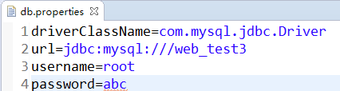{width="4.4375in" height="1.1875in"}

### 在工具类中解析属性文件

-   获取到具体内容为常量赋值

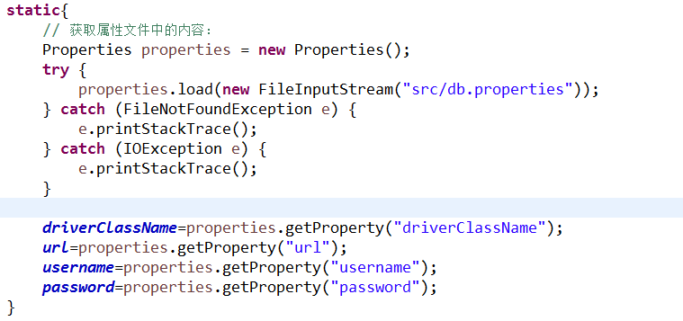

## JDBC的SQL注入漏洞

### 什么是SQL注入漏洞

在早期互联网上SQL注入漏洞普遍存在。有一个网站，用户需要进行注册，用户注册以后根据用户名和密码完成登录。假设现在用户名已经被其他人知道了，但是其他人不知道你的密码，也可以登录到网站上进行相应的操作。

### 演示SQL注入漏洞

#### 基本登录功能实现

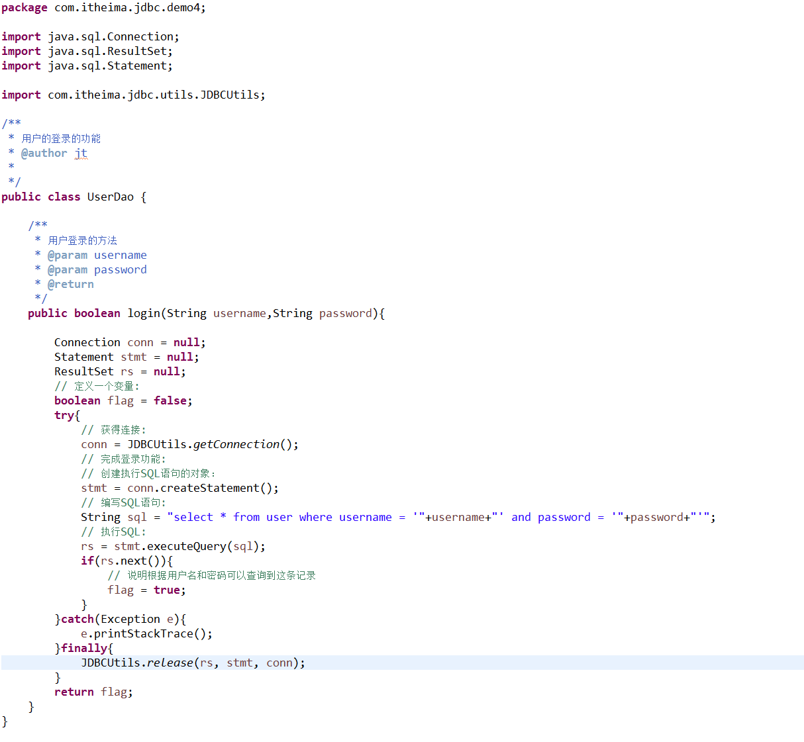{width="5.768055555555556in" height="5.3180555555555555in"}

#### 演示SQL注入漏洞

-   输入用户名

    -   aaa' or '1=1 密码随意

    -   aaa' \-- 密码随意

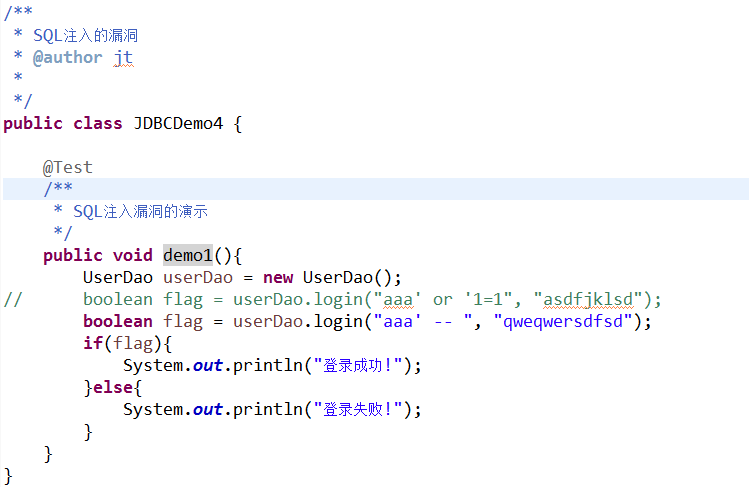{width="5.768055555555556in" height="3.745138888888889in"}

1.  ## JDBC的SQL注入漏洞分析和解决

    1.  ### SQL注入漏洞分析

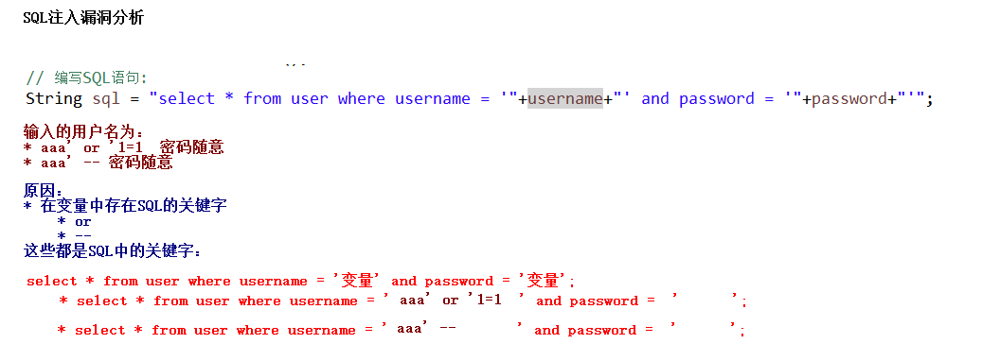{width="5.768055555555556in" height="2.0791666666666666in"}

### SQL注入漏洞解决

需要采用PreparedStatement对象解决SQL注入漏洞。这个对象将SQL预先进行编译，使用?作为占位符。?所代表内容是SQL所固定。再次传入变量（包含SQL的关键字）。这个时候也不会识别这些关键字。

```
public class UserDao {

public boolean login(String username,String password){

Connection conn = null;

PreparedStatement pstmt = null;

ResultSet rs = null;

// 定义一个变量:

boolean flag = false;

try{

// 获得连接:

conn = JDBCUtils.getConnection();

// 编写SQL语句:

String sql = "select * from user where username = ? and password = ?\";

// 预编译SQL

pstmt = conn.prepareStatement(sql);

// 设置参数:

pstmt.setString(1, username);

pstmt.setString(2, password);

// 执行SQL语句:

rs = pstmt.executeQuery();

if(rs.next()){

// 说明根据用户名和密码可以查询到这条记录

flag = true;

}

}catch(Exception e){

e.printStackTrace();

}finally{

JDBCUtils.release(rs, pstmt, conn);

}

return flag;

}
```


1.  ## JDBC的CRUD操作之PreparedStatement的保存操作

    1.  ### 保存操作代码实现

```
@Test
//保存操作
public void demo1(){

Connection conn = null;

PreparedStatement pstmt = null;

try{

// 获得连接:

conn = JDBCUtils.getConnection();

// 编写SQL语句:

String sql = "insert into user values (null,?,?,?,?)";

// 预编译SQL:

pstmt = conn.prepareStatement(sql);

// 设置参数:

pstmt.setString(1, "eee");

pstmt.setString(2, "abc");

pstmt.setString(3, "旺财");

pstmt.setInt(4, 32);

// 执行SQL

int num = pstmt.executeUpdate();

if(num > 0){

System.out.println(\"保存成功！");

}

}catch(Exception e){

e.printStackTrace();

}finally{

JDBCUtils.release(pstmt, conn);

}

}
```


1.  ## JDBC的CRUD操作之PreparedStatement的修改操作

    1.  ### 修改操作代码实现

\@Test

\\\

\ 修改操作

\\

public void demo2(){

Connection conn = null;

PreparedStatement pstmt = null;

try{

\\ 获得连接:

conn = JDBCUtils.getConnection();

\\ 编写SQL语句:

String sql = \"update user set username = ?,password =?,nickname=?,age = ? where id = ?\";

\\ 预编译SQL:

pstmt = conn.prepareStatement(sql);

\\ 设置参数:

pstmt.setString(1, \"abc\");

pstmt.setString(2, \"1234\");

pstmt.setString(3, \"旺旺\");

pstmt.setInt(4, 23);

pstmt.setInt(5, 6);

\\ 执行SQL：

int num = pstmt.executeUpdate();

if(num \> 0){

System.out.println(\"修改成功！\");

}

}catch(Exception e){

e.printStackTrace();

}finally{

JDBCUtils.release(pstmt, conn);

}

}

1.  ## JDBC的CRUD操作之PreparedStatement的删除操作

    1.  ### 删除操作的代码实现

\@Test

\\\

\ 删除操作

\\

public void demo3(){

Connection conn = null;

PreparedStatement pstmt = null;

try{

\\ 获得连接：

conn = JDBCUtils.getConnection();

\\ 编写SQL语句:

String sql = \"delete from user where id = ?\";

\\ 预编译SQL

pstmt = conn.prepareStatement(sql);

\\ 设置参数:

pstmt.setInt(1, 4);

\\ 执行SQL:

int num = pstmt.executeUpdate();

if(num \> 0){

System.out.println(\"删除成功！\");

}

}catch(Exception e){

e.printStackTrace();

}finally{

JDBCUtils.release(pstmt, conn);

}

}

1.  ## JDBC的CRUD操作之PreparedStatement的查询操作

    1.  ### 查询操作代码实现

\@Test

\\\

\ 查询操作

\\

public void demo4(){

Connection conn = null;

PreparedStatement pstmt = null;

ResultSet rs = null;

try{

\\ 获得连接:

conn = JDBCUtils.getConnection();

\\ 编写SQL:

String sql = \"select \ from user\";

\\ 预编译SQL:

pstmt = conn.prepareStatement(sql);

\\ 设置参数:

\\ 执行SQL:

rs = pstmt.executeQuery();

\\ 遍历结果集:

while(rs.next()){

System.out.println(rs.getInt(\"id\")+\" \"+rs.getString(\"username\")+\" \"+rs.getString(\"password\")+\" \"+rs.getString(\"nickname\"));

}

}catch(Exception e){

e.printStackTrace();

}finally{

JDBCUtils.release(rs, pstmt, conn);

}

}

1.  ## JDBC的批处理操作

    1.  ### 什么是批处理

之前进行JDBC的操作的时候，都是一条SQL语句执行。现在如果使用批处理，可以将一批SQL一起执行。

### 批处理基本使用

\@Test

\\\

\ 批处理基本操作

\\

public void demo1(){

Connection conn = null;

Statement stmt = null;

try{

\\ 获得连接:

conn = JDBCUtils.getConnection();

\\ 创建执行批处理对象:

stmt = conn.createStatement();

\\ 编写一批SQL语句：

String sql1 = \"create database test1\";

String sql2 = \"use test1\";

String sql3 = \"create table user(id int primary key auto\_increment,name varchar(20))\";

String sql4 = \"insert into user values (null,\'aaa\')\";

String sql5 = \"insert into user values (null,\'bbb\')\";

String sql6 = \"insert into user values (null,\'ccc\')\";

String sql7 = \"update user set name = \'mmm\' where id = 2\";

String sql8 = \"delete from user where id = 1\";

\\ 添加到批处理

stmt.addBatch(sql1);

stmt.addBatch(sql2);

stmt.addBatch(sql3);

stmt.addBatch(sql4);

stmt.addBatch(sql5);

stmt.addBatch(sql6);

stmt.addBatch(sql7);

stmt.addBatch(sql8);

\\ 执行批处理:

stmt.executeBatch();

}catch(Exception e){

e.printStackTrace();

}finally{

JDBCUtils.release(stmt, conn);

}

}

### 批量插入（使用PreparedStatement）

\@Test

\\\

\ 批量插入记录:

\ \ 默认情况下MySQL批处理没有开启的，需要在[url]{.underline}后面拼接一个参数即可。

\\

public void demo2(){

\\ 记录开始时间:

long begin = System.currentTimeMillis();

Connection conn = null;

PreparedStatement pstmt = null;

try{

\\ 获得连接:

conn = JDBCUtils.getConnection();

\\ 编写SQL语句：

String sql = \"insert into user values (null,?)\";

\\ 预编译SQL:

pstmt = conn.prepareStatement(sql);

for(int i=1;i\<=10000;i++){

pstmt.setString(1, \"name\"+i);

\\ 添加到批处理

pstmt.addBatch();

\\ 注意问题：

\\ 执行批处理

if(i % 1000 == 0){

\\ 执行批处理:

pstmt.executeBatch();

\\ 清空批处理:

pstmt.clearBatch();

}

}

}catch(Exception e){

e.printStackTrace();

}finally{

JDBCUtils.release(pstmt, conn);

}

long end = System.currentTimeMillis();

System.out.println((end-begin));

}
