## **1.1** **JDBC的事务环境准备**

### **1.1.1** **事务的概念：**

事务指的是逻辑上的一组操作，组成这组操作各个逻辑单元要么全都成功，要么全都失败。

### **1.1.2** **事务环境准备**

l 创建数据库和表

`````sql
create database web_test4;
use web_test4;
create table account(
	id int primary key auto_increment,
	name varchar(20),
	money double
);
insert into account values (null,'aaa',10000);
insert into account values (null,'bbb',10000);
insert into account values (null,'ccc',10000);
`````

## **1.1** **JDBC的事务管理**

### **1.1.1** **转账案例代码实现**

````java
@Test
	/**
	 * 完成转账的案例
	 */
	public void demo1(){
		Connection conn = null;
		PreparedStatement pstmt  = null;
		try{
			/**
			 * 完成转账代码：
			 * * 扣除某个账号的钱
			 * * 给另外一个账号加钱
			 */
			// 获得连接：
			conn = JDBCUtils.getConnection();
			// 编写SQL语句：
			String sql = "update account set money = money + ? where name = ?";
			// 预编译SQL:
			pstmt = conn.prepareStatement(sql);
			// 设置参数:
			// 用aaa账号给bbb账号转1000元
			pstmt.setDouble(1, -1000);
			pstmt.setString(2, "aaa");
			// 执行SQL：扣除aaa账号1000元
			pstmt.executeUpdate();
			
//			int i = 1 / 0;
			
			// 给bbb账号加1000
			pstmt.setDouble(1, 1000);
			pstmt.setString(2, "bbb");
			pstmt.executeUpdate();
		}catch(Exception e){
			e.printStackTrace();
		}finally{
			JDBCUtils.release(pstmt, conn);
		}
	}
````

**在转账中没有添加事务的管理，出现aaa账号的钱被转丢了，但是bbb账号的钱没有任何变化。需要给转账的功能添加事务的管理。**

### **1.1.2** **在转账中添加事务管理：**

#### **1.1.2.1** **事务管理的API：**

 

 

 

#### **1.1.2.2** **在转账中添加事务管理**

```java
@Test
	/**
	 * 完成转账的案例
	 */
	public void demo1(){
		Connection conn = null;
		PreparedStatement pstmt  = null;
		try{
			/**
			 * 完成转账代码：
			 * * 扣除某个账号的钱
			 * * 给另外一个账号加钱
			 */
			// 获得连接：
			conn = JDBCUtils.getConnection();
			// 开启事务
			conn.setAutoCommit(false);
			// 编写SQL语句：
			String sql = "update account set money = money + ? where name = ?";
			// 预编译SQL:
			pstmt = conn.prepareStatement(sql);
			// 设置参数:
			// 用aaa账号给bbb账号转1000元
			pstmt.setDouble(1, -1000);
			pstmt.setString(2, "aaa");
			// 执行SQL：扣除aaa账号1000元
			pstmt.executeUpdate();
			
			int i = 1 / 0;
			
			// 给bbb账号加1000
			pstmt.setDouble(1, 1000);
			pstmt.setString(2, "bbb");
			pstmt.executeUpdate();
			
			// 提交事务:
			conn.commit();
		}catch(Exception e){
			// 回滚事务:
			try {
				conn.rollback();
			} catch (SQLException e1) {
				e1.printStackTrace();
			}
			e.printStackTrace();
		}finally{
			JDBCUtils.release(pstmt, conn);
		}
	}
```

## **1.1** **连接池的概述**

### **1.1.1** **什么是连接池**

 

连接池是装有连接的容器，使用连接的话，可以从连接池中进行获取，使用完成之后将连接归还给连接池。

### **1.1.2** **为什么要学习连接池**

连接对象创建和销毁是需要耗费时间的，在服务器初始化的时候就初始化一些连接。把这些连接放入到内存中，使用的时候可以从内存中获取，使用完成之后将连接放入连接池中。从内存中获取和归还的效率要远远高于创建和销毁的效率。（提升性能）。

### **1.1.3** **连接池原理**

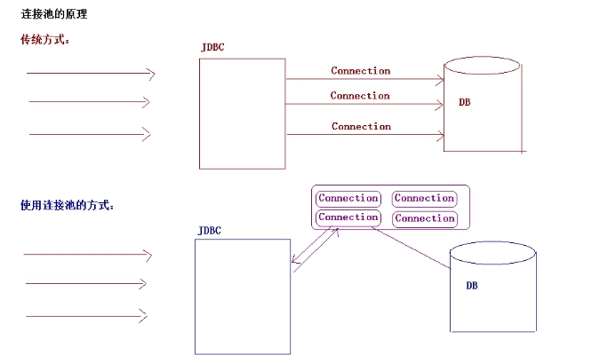 

## **1.1** **自定义连接池**

### **1.1.1** **自定义连接池的实现步骤**

#### **1.1.1.1** **编写一个类实现DataSource接口**

#### **1.1.1.2** **重写getConnection方法**

#### **1.1.1.3** **初始化多个连接在内存中**

#### **1.1.1.4** **编写归还连接的方法**

### **1.1.2** **自定义连接池的代码实现**

#### **1.1.2.1** **代码实现**

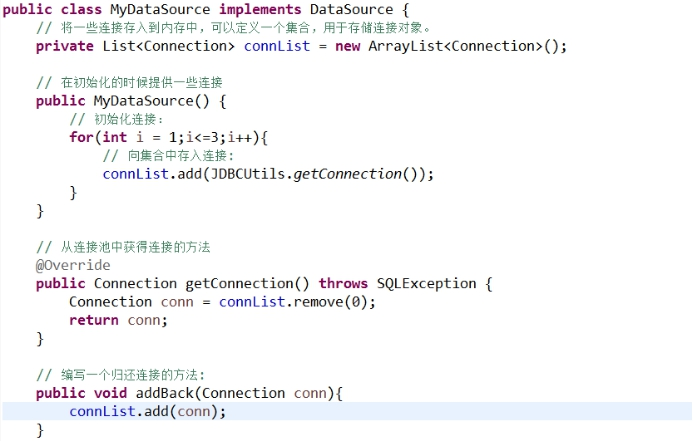 

#### **1.1.2.2** **测试代码**

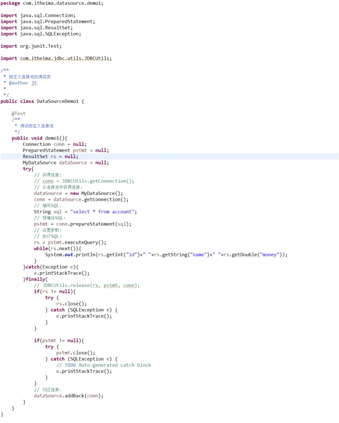 

## **1.2** **自定义连接池的问题及解决分析**

### **1.2.1** **自定义连接池的问题：**

#### **1.2.1.1** **使用接口的实现类完成的构造**

MyDataSource dataSource = new MyDataSource();

这种写法不方便程序的扩展。

#### **1.2.1.2** **额外提供了方法归还连接**

// 归还连接：

dataSource.addBack(conn);

这种方式增加使用连接池的用户的难度。

### **1.2.2** **自定义连接池的问题解决**

如果不提供自定义的方法就可以解决这个问题，但是连接要如何归还到连接池呢？

#### **1.2.2.1** **解决分析的思路**

原来在Connection中是有一个close方法的，colse方法完成了连接的销毁。能不能做一个事情，将原有的连接的close方法改为归还。

- 现在要做的事情就是将原有的close方法的逻辑改为归还。**（增强一个类中的方法）。**

- **如何增强一个类中的方法**

  - **一种：采用继承的方式：**

  ```java
  ***** 继承这种增强是最简单，但是是有使用条件的：必须能够控制这个类的构造！！！
  class Man{
      public void run(){
  		System.out.println(“跑…”);
  }
  }
  
  class SuperMan extends Man{
  	public void run(){
  		System.out.println(“飞…”);
  }
  ```

  - **二种：采用装饰者模式：**

    **装饰者模式使用条件：**

    一、增强的类和被增强的类实现相同的接口

    二、在增强的类中获得被增强的类的引用

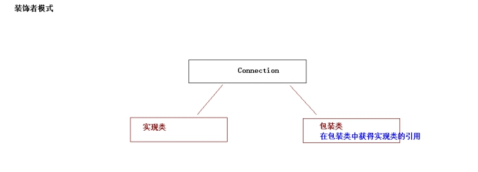 

````java
interface Waiter{
	public void server();
}

public class Waitress implements Waiter{
	public void server(){
		System.out.println(“服务中…”);
}
}

public class WaiterWrapper implements Waiter{
	private Waiter waiter;
	public Waitress(Waiter waiter){
		this.waiter = waiter;
}
	public void server(){
		System.out.println(“微笑…”);
		waiter.server();
}
}
````

- **三种：动态代理的方式**

 

## **1.3** **自定义连接池的问题解决代码实现**

### **1.3.1** **使用装饰者模式增强Connection中的close方法**

为了简化编程，提供一个模板类（模板类原封不动的将接口中的所有方法都实现，但是都没有增强）。编写一个装饰类继承模板类。在装饰类中只需要增强某一个方法即可。

#### **1.3.1.1** **代码实现**

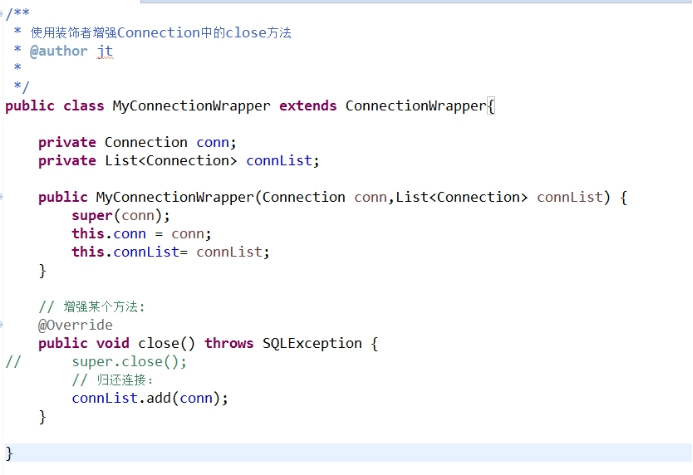 

#### **1.3.1.2** **测试代码**

l 改写连接池

```java
public class MyDataSource implements DataSource {
	// 将一些连接存入到内存中，可以定义一个集合，用于存储连接对象。
	private List<Connection> connList = new ArrayList<Connection>();
	
	// 在初始化的时候提供一些连接
	public MyDataSource() {
		// 初始化连接：
		for(int i = 1;i<=3;i++){
			// 向集合中存入连接:
			connList.add(JDBCUtils.getConnection());
		}
	}
	
	// 从连接池中获得连接的方法
	@Override
	public Connection getConnection() throws SQLException {
		Connection conn = connList.remove(0);
		// 增强连接：
		MyConnectionWrapper connWrapper = new MyConnectionWrapper(conn, connList);
		return connWrapper;
	}
	
	// 编写一个归还连接的方法:
	/*public void addBack(Connection conn){
		connList.add(conn);
	}*/
}
```

l 测试代码

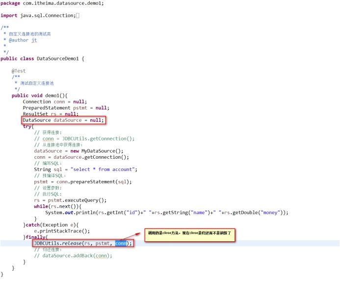 

## **1.1** **Druid开源连接池的使用**

### **1.1.1** **Druid的概述**

Druid阿里旗下开源连接池产品，使用非常简单，可以与Spring框架进行快速整合。

### **1.1.2** **Druid的使用**

````java
@Test
	/**
	 * Druid的使用:
	 * * 手动设置参数的方式
	 */
	public void demo1(){
		Connection conn = null;
		PreparedStatement pstmt = null;
		ResultSet rs = null;
		try{
			// 使用连接池：
			DruidDataSource dataSource = new DruidDataSource();
			// 手动设置数据库连接的参数:
			dataSource.setDriverClassName("com.mysql.jdbc.Driver");
			dataSource.setUrl("jdbc:mysql:///web_test4");
			dataSource.setUsername("root");
			dataSource.setPassword("abc");
			// 获得连接：
//			conn = JDBCUtils.getConnection();
			conn = dataSource.getConnection();
			// 编写SQL:
			String sql = "select * from account";
			// 预编译SQL:
			pstmt = conn.prepareStatement(sql);
			// 设置参数:
			// 执行SQL:
			rs = pstmt.executeQuery();
			while(rs.next()){
				System.out.println(rs.getInt("id")+" "+rs.getString("name")+" "+rs.getDouble("money"));
			}
		}catch(Exception e){
			e.printStackTrace();
		}finally{
			JDBCUtils.release(rs, pstmt, conn);
		}
	}
````

## **1.1** **Druid开源连接池的使用二**

### **1.1.1** **使用配置方式完成连接池的使用**

````java
@Test
	/**
	 * Druid的使用:
	 * * 配置方式设置参数
	 * Druid配置方式可以使用属性文件配置的。
	 * * 文件名称没有规定但是属性文件中的key要一定的。
	 */
	public void demo2(){
		Connection conn = null;
		PreparedStatement pstmt = null;
		ResultSet rs = null;
		try{
			// 使用连接池：
			// 从属性文件中获取：
			Properties properties = new Properties();
			properties.load(new FileInputStream("src/druid.properties"));
			DataSource dataSource = DruidDataSourceFactory.createDataSource(properties);
			// 获得连接：
//			conn = JDBCUtils.getConnection();
			conn = dataSource.getConnection();
			// 编写SQL:
			String sql = "select * from account";
			// 预编译SQL:
			pstmt = conn.prepareStatement(sql);
			// 设置参数:
			// 执行SQL:
			rs = pstmt.executeQuery();
			while(rs.next()){
				System.out.println(rs.getInt("id")+" "+rs.getString("name")+" "+rs.getDouble("money"));
			}
		}catch(Exception e){
			e.printStackTrace();
		}finally{
			JDBCUtils.release(rs, pstmt, conn);
		}
	}
````

## **1.1** **C3P0开源连接池的使用**

### **1.1.1** **C3P0的连接池的概述**

 

### **1.1.2** **C3P0的连接池的使用**

#### **1.1.2.1** **手动设置参数的方式**

````java
@Test
	/**
	 * 手动设置参数的方式:
	 */
	public void demo1(){
		Connection conn = null;
		PreparedStatement pstmt = null;
		ResultSet rs = null;
		try{
			// 获得连接：从连接池中获取：
			// 创建连接池：
			ComboPooledDataSource dataSource = new ComboPooledDataSource();
			// 设置连接参数:
			dataSource.setDriverClass("com.mysql.jdbc.Driver");
			dataSource.setJdbcUrl("jdbc:mysql:///web_test4");
			dataSource.setUser("root");
			dataSource.setPassword("abc");
			// 从连接池中获得连接:
			conn = dataSource.getConnection();
			// 编写SQL：
			String sql = "select * from account";
			// 预编译SQL:
			pstmt = conn.prepareStatement(sql);
			// 执行SQL：
			rs = pstmt.executeQuery();
			while(rs.next()){
				System.out.println(rs.getInt("id")+" "+rs.getString("name")+" "+rs.getDouble("money"));
			}
		}catch(Exception e){
			e.printStackTrace();
		}finally{
			JDBCUtils.release(rs, pstmt, conn);
		}
	}
````

## **1.4** **C3P0开源连接池的使用二**

### **1.4.1** **C3P0连接池的使用**

#### **1.4.1.1** **采用配置文件的方式：**

l 配置连接池

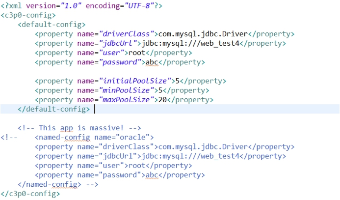 

l 使用连接池

````java
@Test
	/**
	 * 采用配置文件的方式：
	 */
	public void demo2(){
		Connection conn = null;
		PreparedStatement pstmt = null;
		ResultSet rs = null;
		try{
			// 获得连接：从连接池中获取：
			// 创建连接池：//创建连接池默认去类路径下查找c3p0-config.xml
			ComboPooledDataSource dataSource = new ComboPooledDataSource();
			// 从连接池中获得连接:
			conn = dataSource.getConnection();
			// 编写SQL：
			String sql = "select * from account";
			// 预编译SQL:
			pstmt = conn.prepareStatement(sql);
			// 执行SQL：
			rs = pstmt.executeQuery();
			while(rs.next()){
				System.out.println(rs.getInt("id")+" "+rs.getString("name")+" "+rs.getDouble("money"));
			}
		}catch(Exception e){
			e.printStackTrace();
		}finally{
			JDBCUtils.release(rs, pstmt, conn);
		}
	}
````

## **1.1** **改写工具类**

### **1.1.1** **工具类代码实现**

连接池对象应该是一个应用只创建一次就可以的，不需要每次使用都创建一个新的连接池。

#### **1.1.1.1** **工具类代码实现**

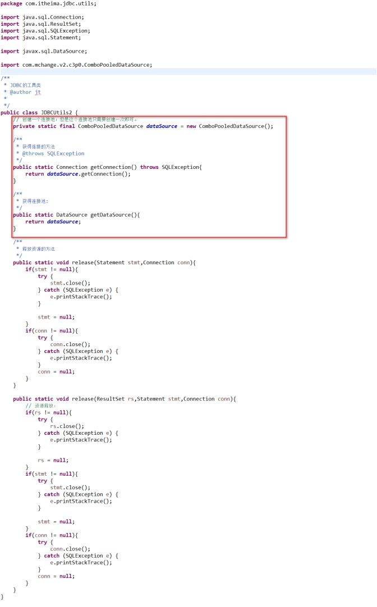 

## **1.1** **DBUtils的概述**

### **1.1.1** **什么是DBUtils**

 

对JDBC的简单封装，而且没有影响性能。

### **1.1.2** **为什么要学习DBUtils**

因为JDBC手写比较麻烦，而且有非常多的代码是类似的。比如获得连接，预编译SQL，释放资源等..那么可以将这些代码抽取出来放到工具类中。将类似的代码进行抽取。大大简化JDBC的编程。

## **1.5**  **DBUtils的API**

### **1.5.1** **DBUtils的API的概述**

#### **1.5.1.1** **QueryRunner对象：核心运行类**

l 构造方法：

 

 

l 方法：

 

 

 

 

在一般情况下如果执行CRUD的操作：

构造：

QueryRunner(DataSource ds);

方法：

int update(String sql,Object… args);

T query(String sql,ResultSetHandler rsh,Object… args);

如果有事务管理的话使用另一套完成CRUD的操作

构造：

QueryRunner();

方法:

int update(Connection conn,String sql,Object… args);

T query(Connection conn,String sql,ResultSetHandler rsh,Object… args);

l 方法

 

#### **1.5.1.2** **DbUtils**

l 方法:

 

 

## **1.1** **DBUtils的使用之增删改的操作**

### **1.1.1** **DBUtils的添加操作**

```java
@Test
	/**
	 * 添加操作
	 */
	public void demo1() throws SQLException{
		// 创建核心类：QueryRunner:
		QueryRunner queryRunner = new QueryRunner(JDBCUtils2.getDataSource());
		queryRunner.update("insert into account values (null,?,?)", "ddd",10000);
	}
```

### **1.1.2** **DBUtils的修改操作**

````java
@Test
	/**
	 * 修改操作
	 */
	public void demo2() throws SQLException{
		// 创建核心类:
		QueryRunner queryRunner = new QueryRunner(JDBCUtils2.getDataSource());
		queryRunner.update("update account set name=?,money=? where id =?", "eee",20000,4);
	}
````

### **1.1.3** **DBUtils的删除操作**

````java
@Test
	/**
	 * 删除操作
	 */
	public void demo3() throws SQLException{
		// 创建核心类:
		QueryRunner queryRunner = new QueryRunner(JDBCUtils2.getDataSource());
		queryRunner.update("delete from account where id = ?", 3);
	}
````

## **1.6** **DBUtils的使用之查询的操作**

### **1.6.1** **查询的代码实现**

#### **1.6.1.1** **查询一条记录**

l 创建一个对象：Account

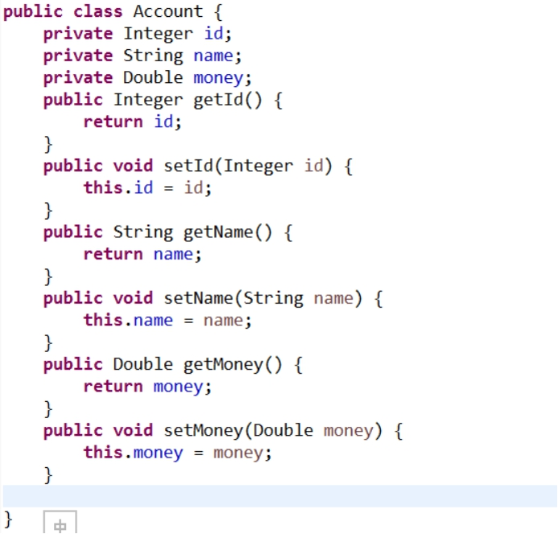 

l 查询代码实现

 

#### **1.6.1.2** **查询多条记录**

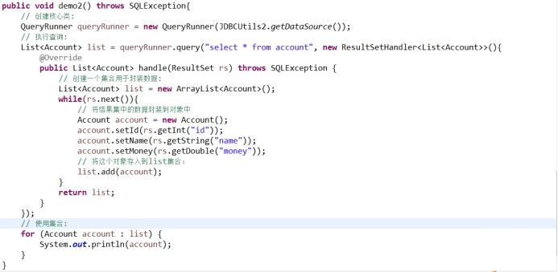 

## **1.1** **DBUtils的使用之ResultSetHandler的实现类**

### **1.1.1** **ArrayHandler和ArrayListHandler**

#### **1.1.1.1** **ArrayHandler**

将**一条记录**封装到一个数组当中。这个数组应该是Object[]。

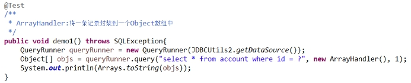 

#### **1.1.1.2** **ArrayListHandler**

将多条记录封装到一个装有Object[]的List集合中。

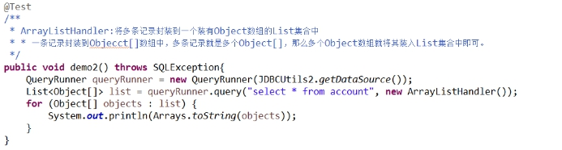 

## **1.1** **DBUtils的使用ResultSetHandler的实现类二**

### **1.1.1** **BeanHandler和BeanListHandler**

#### **1.1.1.1** **BeanHandler**

将一条记录封装到一个JavaBean中。

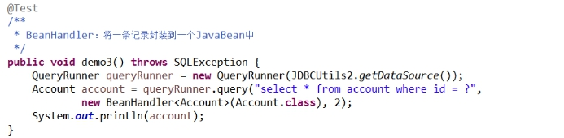 

#### **1.1.1.2** **BeanListHandler**

将多条记录封装到一个装有JavaBean的List集合中。

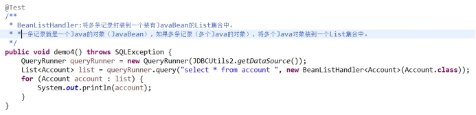 

## **1.1** **DBUtils的使用之ResultSetHandler的实现类三**

### **1.1.1** **MapHandler和MapListHandler**

#### **1.1.1.1** **MapHandler**

将一条记录封装到一个Map集合中，Map的key是列名，Map的value就是表中列的记录值。

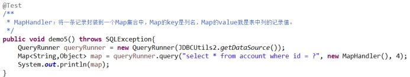 

#### **1.1.1.2** **MapListHandler**

将多条记录封装到一个装有Map的List集合中。

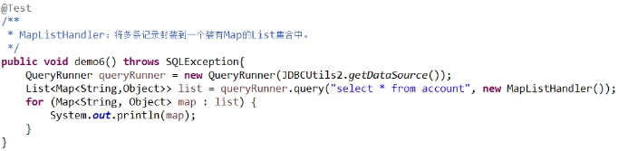 

## **1.1** **DBUtils的使用之ResultSetHandler的实现类四**

### **1.1.1** **ColumnListHandler、ScalarHandler、KeyedHandler**

#### **1.1.1.1** **ColumnListHandler**

将数据中的某列封装到List集合中。

 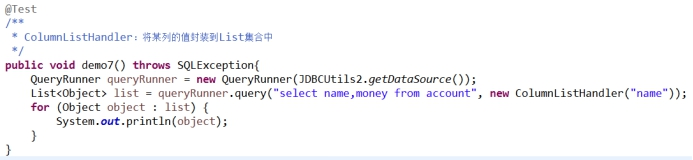

#### **1.1.1.2** **ScalarHandler**

将单个值封装。

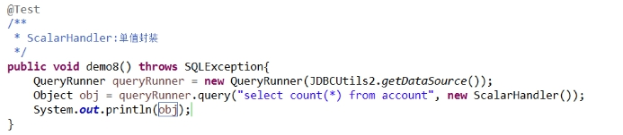 

#### **1.1.1.3** **KeyedHandler（了解）**

将一条记录封装到一个Map集合中。将多条记录封装到一个装有Map集合的Map集合中。而且外面的Map的key是可以指定的。

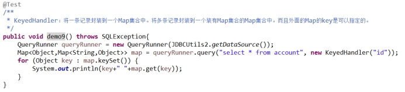 