# HTML

## 1、HTML的简述

### 1.1、HTML是什么？有什么作用？

HTML：（Hyper Text Markup Language） 超文本标记语言

文本：相当于记事本里写的文字。 展示信息

超文本：超越了文本仅仅展示信息的功能范畴。泛指：图片、有样式的文字、点击跳转页面的文字

语言：工具。

标记：标签

HTML是由标签所组成的语言，能展示超文本效果

HTML是用来写网页的，是设计页面的基础。

### 1.2、HTML的入门案例

步骤1：创建文件，后缀名为html

步骤2：用记事本打开文件，并且编写文字

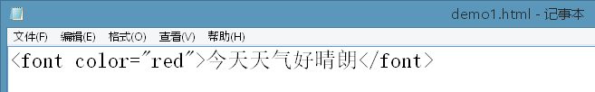

步骤3：用浏览器打开。例如：火狐或者IE

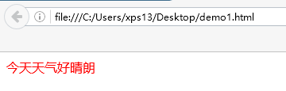

### 1.3、HTML的语言特征

-   HTML代码是由头和体组成。

\<html\>

\<head\>

\<title\> 标题\</title\>

> \</head\>

\<body\>需要展示给用户看的信息内容\</body\>

\</html\>

\<html\>标签就相当于 java类 大括号

\<head\>中存放的都是网页的说明性内容，例如标题

-   HTML文件的扩展名为html或者htm。Htm是老的命名规范，html的新的

-   HTML文件由浏览器直接解析执行，无需编译，直接由上到下依次解析执行。

-   HTML标签通常由开始标签和结束标签组成。例如:\<font\>内容体\</font\>

开始标签和结束标签之间的内容叫做内容体

-   HTML没有内容体的标签叫做空标签。仅由一个标签组成。例如：\<br/\> 自关闭

-   HTML标签不区分大小写，为了方便阅读，建议使用小写。

-   HTML标签是有属性的，格式为：属性名="属性值"，属性值用引号引起。引号包含单引号和双引号

-   HTML标签建议包裹嵌套，不建议交叉嵌套。如下图所示

> 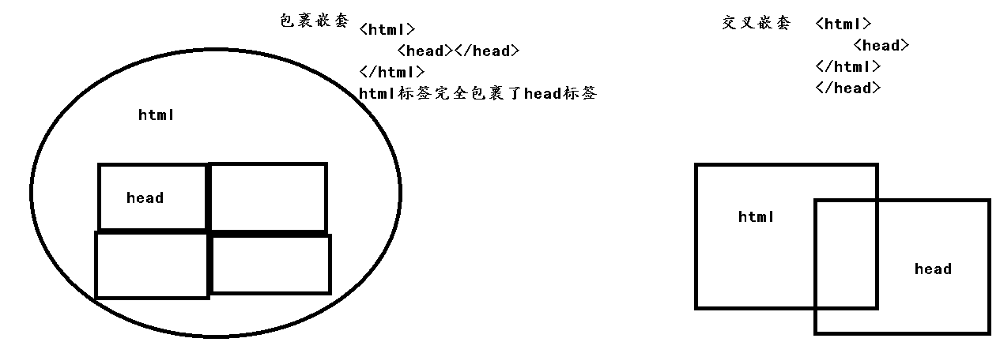{width="5.768055555555556in" height="1.9743055555555555in"}

### 1.4、使用Hbuilder

步骤1：打开Hbuilder

{width="0.8534722222222222in" height="0.9888888888888889in"}

步骤2：选择"暂不登录"

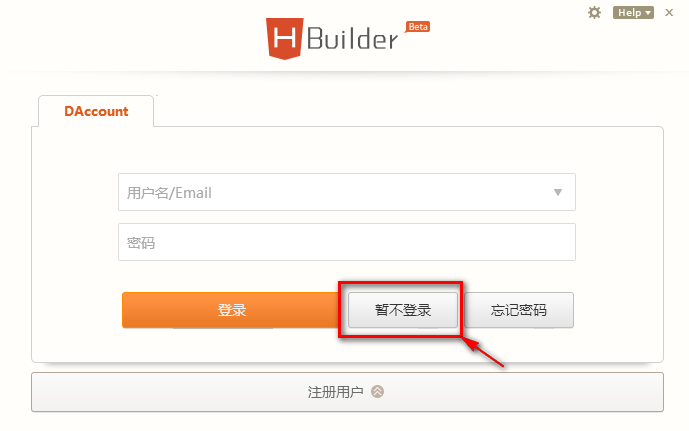{width="5.768055555555556in" height="3.6083333333333334in"}

步骤3：选择"工具"\-\--"选项"

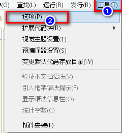{width="2.4993055555555554in" height="2.707638888888889in"}

步骤4：输入"工作空间"，点击"工作空间"，在右侧选项中将"文本文件编码" 选为"其他 UTF-8"

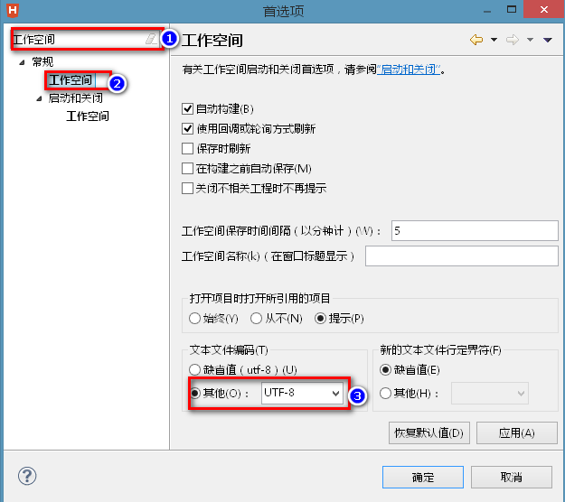{width="5.768055555555556in" height="5.13125in"}

步骤5：在"项目管理器"，鼠标右键，"新建""WEB项目"

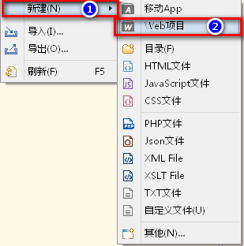{width="3.2180555555555554in" height="3.2493055555555554in"}

步骤6：修改"项目名"和"位置"，并点击完成

{width="5.768055555555556in" height="4.810416666666667in"}

步骤7：项目创建完毕

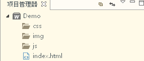{width="2.9784722222222224in" height="1.270138888888889in"}

## 2、HTML的基本标签

### 2.1、 字体标签和格式化标签

#### 2.1.1、\<font\>

字体标签，用于展示效果中修饰文字样式

\文字\</font\>

-   size:控制字体大小.最小1 \~ 最大7。 如果设置范围不在1\~7之间，设置无效

<!-- -->

-   color：控制字体颜色. 使用英文设置（例如：red,blue...）

-   face：控制字体类型。只能设置系统字库中存在的字体类型

示例：

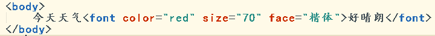{width="5.768055555555556in" height="0.48055555555555557in"}

效果：

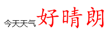{width="2.238888888888889in" height="0.7388888888888889in"}

#### 2.1.2、\<br/\>

HTML源码中换行，浏览器解析时会自动忽略。

换行标签，用于展示效果中换行

示例：

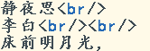{width="1.7284722222222222in" height="0.5930555555555556in"}

效果：

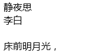{width="1.8222222222222222in" height="0.9368055555555556in"}

#### 2.1.3、\<p\>\</p\>

段落标签，用于展示效果中划分段落。并且自动在段前和段后自动加空白行

-   align:段落内容的对齐方式

> 默认是left， 内容居左
>
> Right 右
>
> Center 居中

示例：

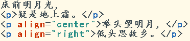{width="3.8743055555555554in" height="0.8430555555555556in"}

效果：

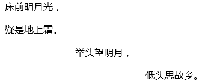{width="3.6034722222222224in" height="1.457638888888889in"}

#### 2.1.4、\<h1\>\</h1\>

标题标签，用于展示效果中划分标题

其中\<h1\>最大，\<h6\>最小

示例：

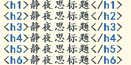{width="2.332638888888889in" height="1.1659722222222222in"}

效果：

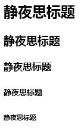{width="1.4159722222222222in" height="2.270138888888889in"}

#### 2.1.5、&nbsp;

HTML源码中的多个空格，效果中最终会合并成一个。

空格符号，用于展示效果中显示一个空白的位置

示例：

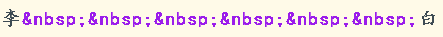{width="4.613888888888889in" height="0.38472222222222224in"}

效果：

{width="0.9472222222222222in" height="0.28055555555555556in"}

#### 2.1.6、HTML注释

用于注释HTML源码，不在HTML效果中展示。

只能在源码中看到，页面展示效果中是没有

格式：\<!\--HTML注释内容 \--\>

示例：

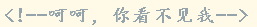{width="2.676388888888889in" height="0.28055555555555556in"}

效果：在HTML效果展示中不会显示，只能在源码中看到

### 2.2、 图片标签

#### 2.2.1、\

用于在页面效果中展示一张图片。

-   src：指明图片的路径。（必有属性）

> 图片路径的写法：
>
> ①内网路径：
>
> 绝对路径：文件在硬盘上的具体位置。【不建议使用】
>
> 例如：C:\\ JavaWeb001\_html\\img\\c\_1.jpg
>
> 相对路径：从引入者所在目录出发。【建议使用相对路径】
>
> 例如：../img/c\_1.jpg
>
> ../表示上一层目录
>
> ./表示当前目录
>
> 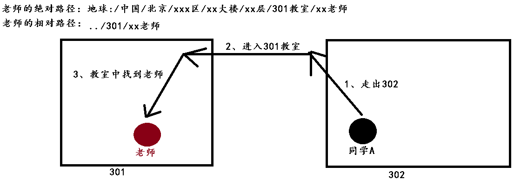{width="5.979861111111111in" height="2.09375in"}
>
> ②互联网路径：
>
> 必须前面加上http://
>
> 例如：http://www.baidu.com/xxx.jpg

-   width：图片宽度

-   height：图片的高度

> 宽度和高度的设置：
>
> 默认单位是px，像素。例如：width="400" 其实设置的是 width="400px"。固定设置方式
>
> 百分比设置。例如：width="50%"。 是父标签的百分比。 动态改变的。

示例：

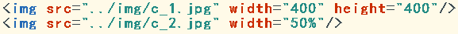{width="5.768055555555556in" height="0.4395833333333333in"}

效果：

{width="3.8430555555555554in" height="2.058333333333333in"}

### 2.3、 列表标签

#### 2.3.1、\<ul\>\</ul\>

无序列表标签，用于在效果中定义一个无序列表

#### 2.3.2、\<li\>\</li\>

列表条目项标签，用于在效果中定义一个列表的条目

#### 2.3.3、\<ol\>\</ol\>

有序列表标签，用于在效果中定义一个有序列表

示例：

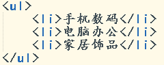{width="2.4993055555555554in" height="0.9888888888888889in"}

效果：

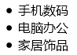{width="1.020138888888889in" height="0.7284722222222222in"}

示例：

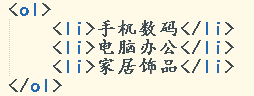{width="2.645138888888889in" height="0.9993055555555556in"}

效果：

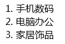{width="1.145138888888889in" height="0.7701388888888889in"}

### 2.4、 超链接标签

#### 2.4.1、\<a\>\</a\>

超链接标签 ，用于在效果中定义一个可以点击跳转的链接

-   href：超链接跳转的路径 (必有属性)

> 内网本机路径：相对路径和绝对路径
>
> 互联网路径：http://地址
>
> 本页：默认跳转到本页

超链接正常工作：①a标签中必须有内容

②a标签必须有href属性

示例：

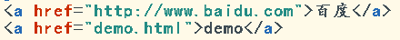{width="4.582638888888889in" height="0.4576388888888889in"}

效果：

{width="0.9784722222222222in" height="0.35347222222222224in"}

'l;

注意：

①a标签内容体，不仅仅是文字，也可以是其他内容，例如图片

②a标签的href属性，不仅仅可以链接到html上，也可以链接到其他文件上，例如图片

示例：

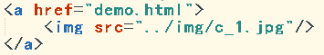{width="3.6972222222222224in" height="0.6347222222222222in"}

效果：

{width="0.8131944444444444in" height="0.89375in"}

示例：

{width="5.145138888888889in" height="0.2701388888888889in"}

效果：

{width="1.457638888888889in" height="0.2388888888888889in"}

### 2.5、 表格标签

#### 2.5.1、\<table\>\</table\>

表格标签，用于在效果中定义一个表格

-   border：设置表格的边框粗细

-   width：设置表格的

-   宽度

#### 2.5.2 、\<tr\>\</tr\>

表格的行标签，用于在效果中定义一个表格行

#### 2.5.3、\<td\>\</td\>

表格的单元格标签，用于在效果中定义一个表格行中的单元格

表格的书写顺序：

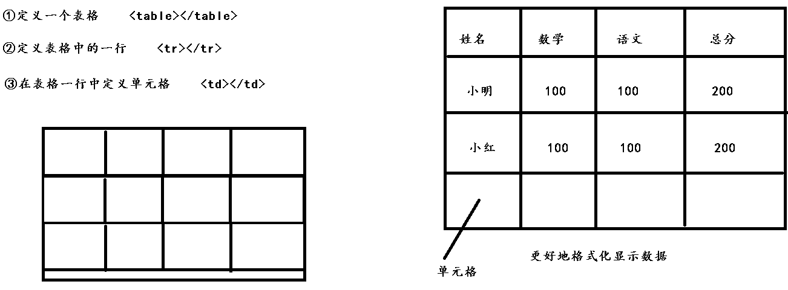{width="6.5in" height="2.3958333333333335in"}

步骤1：定义一个表格 \<table\>\</table\>

步骤2：定义表格中的一行 \<tr\>\</tr\>

步骤3：在表格一行中定义单元格 \<td\>\</td\> 内容就可以写在单元格中

示例：

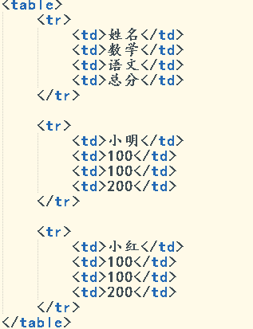{width="1.7465277777777777in" height="2.2756944444444445in"}

效果：

{width="1.5722222222222222in" height="0.8534722222222222in"}

#### 2.5.4、\<th\>\</th\>

表格的表头单元格标签，用于在效果中定义一个表格行中的表头单元格

\<th\>和\<td\>唯一区别：\<th\>内容 居中加粗

示例：

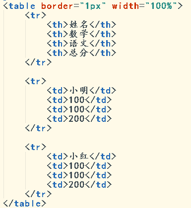{width="2.1in" height="2.2909722222222224in"}

效果：

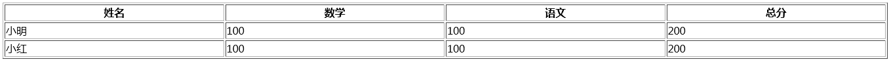{width="5.874305555555556in" height="0.4326388888888889in"}

#### 2.5.5、单元格合并

\<td\>或者\<th\>都有两个单元格合并属性：

-   colspan：跨列合并单元格

-   rowspan：跨行合并单元格

合并步骤：

1.  确定合并哪几个单元格，确定是跨列合并还是跨行合并

2.  在第一个出现的单元格上书写 合并单元格属性

3.  合并几个单元格，属性值就书写几

4.  被合并的单元格必须删掉

示例1：

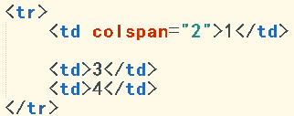{width="2.5in" height="0.9854166666666667in"}

效果1：

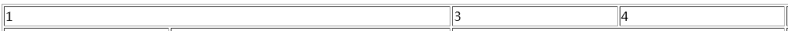{width="5.768055555555556in" height="0.23125in"}

示例2：

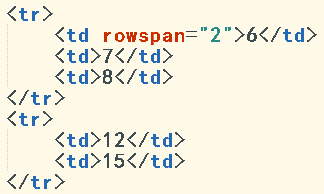{width="2.626388888888889in" height="1.5722222222222222in"}

效果2：

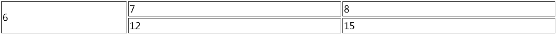{width="5.768055555555556in" height="0.35555555555555557in"}

示例3：

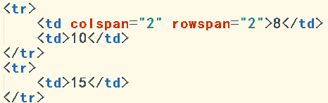{width="2.723611111111111in" height="0.8527777777777777in"}

效果3：

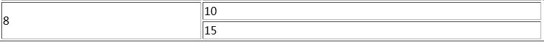{width="5.768055555555556in" height="0.4527777777777778in"}

### 2.6、块标签

#### 2.6.1、\<span\>\</span\>

行级的块标签，用于在效果中 一行上定义一个块，进行内容显示。

1.  span有多少内容，就会占用多大空间。

②Span不会自动换行

适用于少量数据展示

示例：

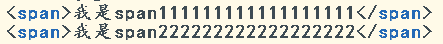{width="3.425in" height="0.33958333333333335in"}

效果：

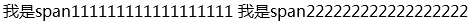{width="3.4027777777777777in" height="0.18611111111111112in"}

#### 2.6.2、\<div\>\</div\>

块级的块标签，用于在效果中 定义一块，默认占满一行，进行内容的显示

1.  默认占满一行

2.  会自动换行

适用于大量数据展示

示例：

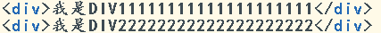{width="3.15625in" height="0.27291666666666664in"}

效果：

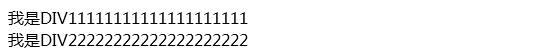{width="3.19375in" height="0.2965277777777778in"}

#### 2.6.3、Div和span的应用场景：

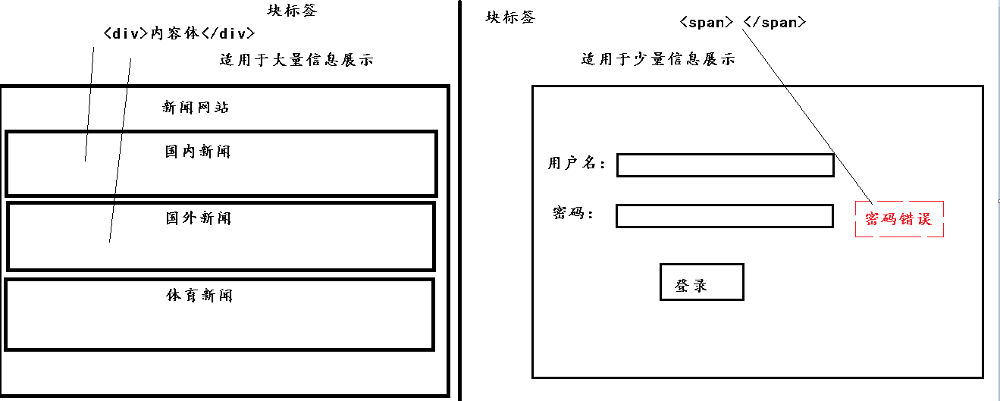{width="5.768055555555556in" height="2.3131944444444446in"}

## 3、HTML的表单标签

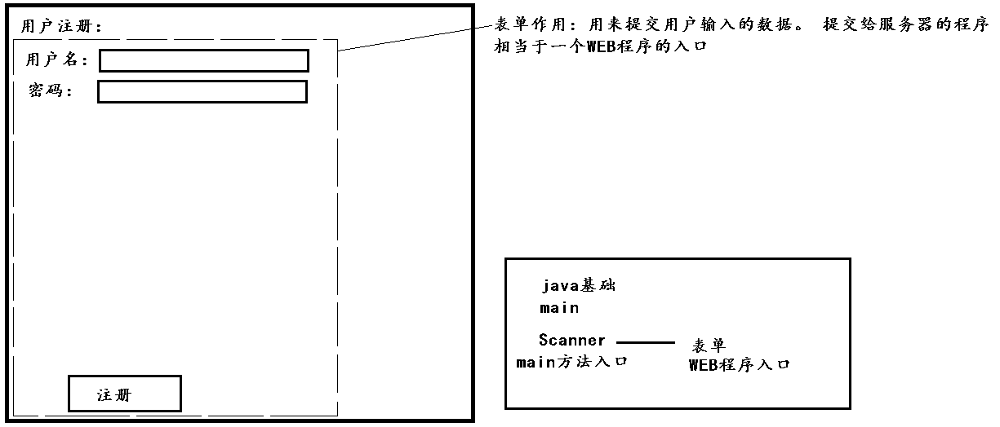{width="4.9847222222222225in" height="2.1319444444444446in"}

### 3.1、输入项标签

\<input/\>标签

表单输入项标签之一，用户可以在该标签上 通过填写和选择 进行数据的输入。

-   type:设置该标签的种类

<!-- -->

-   text:文本框。 默认

-   password:密码框。 内容为非明文

-   radio:单选框。 在同一组内有单选效果

-   checkbox:复选框。 在同一组内有复选效果

-   submit:提交按钮。用于控制表单提交数据

-   reset:重置按钮。 用于将表单输入项恢复到默认状态

-   file:附件框。用于文件上传。

-   hidden:隐藏域。一般用作提交服务器需要拿到，但用户不需要看到的数据。

-   button:普通按钮。需要和JS事件一起用

<!-- -->

-   name: 单选框、复选框进行数据的分组。/ 设置该标签对应的参数名

> 某个表单输入项需要通过参数列表提交，就必须设置name属性

-   value:设置该标签对应的参数值。 / 作为按钮的名字

> value属性的设置策略：
>
> ①文本框、密码框这样的表单输入项，可以不强制指定value，因为用户可以自由输入
>
> ②单选框、复选框这样的表单输入项，必须强制指定value，因为用户无法输入，只能选择，如果不指定value，那么提交上去的只有on

-   checked:设置单选框/复选框的默认选中状态

-   readonly:设置该标签的参数值只读，用户无法手动更改。数据是可以正常提交

-   disabled:设置该标签不可用，参数值无法更改，且参数值也无法提交

参数列表的格式：

参数名1=参数值1&参数名2=参数值2&参数名3=参数值3.......

例如：username=zhangsan&password=123&sex=man

示例1：

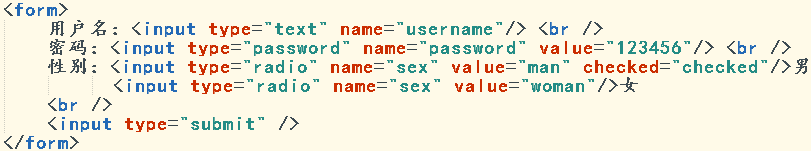{width="3.65625in" height="0.6805555555555556in"}

效果1：

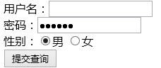{width="1.663888888888889in" height="0.7006944444444444in"}

示例2：

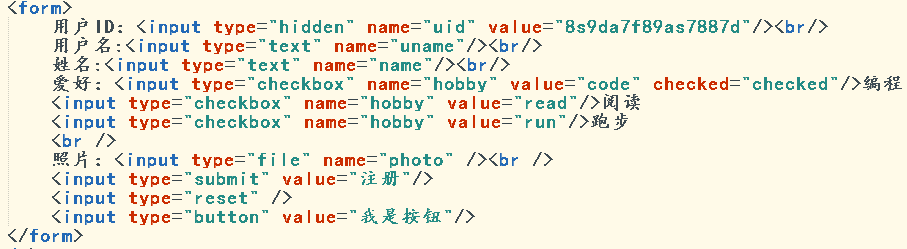{width="4.485416666666667in" height="1.23125in"}

效果2：

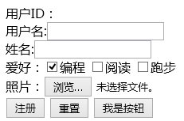{width="1.8277777777777777in" height="1.2104166666666667in"}

示例3：

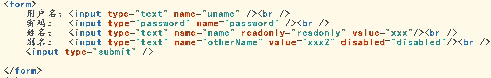{width="4.507638888888889in" height="0.7229166666666667in"}

效果3：

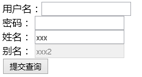{width="1.5590277777777777in" height="0.8430555555555556in"}

### 3.2、选择框标签

\<select\>\</select\>标签 定义一个选择框

-   name: 设置该标签对应的参数名

-   multiple：设置该标签选项全部显示，并且可以进行多选提交。默认为单选。

\<option\>\</option\>标签

选项标签，用于为一个选择框添加一个选项

-   value:设置需要提交的参数值。

-   selected:设置选项的默认选中状态

注意事项：

Option的内容体一般是用来进行展示

参数值 应该是option的value属性值

示例1：

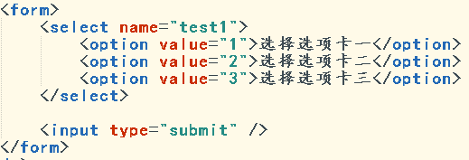{width="3.3805555555555555in" height="1.1527777777777777in"}

效果1：

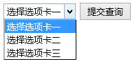{width="1.4847222222222223in" height="0.7055555555555556in"}

示例2：

{width="4.134027777777778in" height="0.8652777777777778in"}

效果2：

{width="1.9159722222222222in" height="0.34305555555555556in"}

示例3：

{width="3.134027777777778in" height="0.9652777777777778in"}

效果3：

{width="1.488888888888889in" height="0.9888888888888889in"}

### 3.3、文本域标签

\<textarea\>\</textarea\>标签

表单输入项标签之一，用户可以在该标签上 通过输入 进行数据的输入。

-   name: 设置该标签对应的参数名

文本域和文本框区别：

1.  文本框不能换行，文本域可以

2.  文本框参数值是value属性，文本域参数值是标签的内容体

示例1：

{width="3.283333333333333in" height="0.43194444444444446in"}

效果1：

{width="2.0743055555555556in" height="0.6680555555555555in"}

示例2：

{width="3.910416666666667in" height="0.4048611111111111in"}

效果2：

{width="1.8506944444444444in" height="0.6215277777777778in"}

### 3.4、表单标签

\<form\>\</form\>标签。

用于在效果中定义一个表单，用于提交用户填写的数据。

-   action:将数据提交到何处。

> 默认提交到本页。
>
> 本机内网路径：
>
> 相对路径：
>
> 绝对路径：
>
> 互联网路径：
>
> http://www.baidu.com/xxx

-   method:将数据以何种方式提交

> 默认为：get
>
> 提交方式可定义：get 或者 post
>
> Get提交方式特点：把数据拼接到地址栏上
>
> Post提交方式特点：没有把提交数据拼接到地址栏上。请求体
>
> Get和post提交方式区别：

1.  get提交的参数列表拼接到了地址栏后面

> post方式不会 拼接地址栏

②get方式提交的数据 敏感信息不安全

Post方式提交的数据 相对安全

③get方式提交的数据量 有限的

Post方式从理论上提交的数据量 无限大

> 尽量使用post方式提交表单

### 3.5、提交表单注意事项

#### 3.5.1、提交中文问题

##### 3.5.1.1、为什么要使用URL编码？

正常提交数据：

?password=123&username=zhangsan

非正常提交数据：

?password=123\#ohheih&dlajfk&dskfklas&username=zhangsan

URL编码解决方式：特殊符号，中文

例如：& - %26

?password=123\#ohheih&dlajfk&dskfklas&username=zhangsan

编码完：?password=123\#ohheih %26dlajfk %26dskfklas&username=zhangsan

为了保证表单数据传递时能更好区分出name和value。

保证数据传递的完整性

##### 3.5.1.2、URL编码的表现形式&本质

> ①你好，进行普通的编码，编码成字节数组。【使用的是页面规定的字符集，例如utf-8】

2.  字节数组中的每一个元素，都会从10进制，转为16进制

3.  把已经转为16进制的字节数组，以%进行拼接 。拼接出的字符串，就是URL编码后的结果

例如：你好，用UTF-8编码，编码的字节数组为：

\[-28, -67, -96, -27, -91, -67\]

URL编码后：

\%E4%BD%A0%E5%A5%BD
