# CSS

## 1、css简述

### 1.1、css是什么？有什么作用？ 

HTML\-\-\-\-\-\-\--》页面的结构\-\-\-\-\-\-\--》人的面部（素颜）

CSS \-\-\-\-\-\-\--》美化页面 \-\-\-\-\-\-\--》给人化妆

CSS (Cascading Style Sheets) ：层叠样式表

层叠：一层一层叠加

样式表：存储样式的地方，多个样式

给一个人的面部化妆， 画口红， 画眼影， 打粉底

HTML标签 样式1 样式2 样式3

CSS 通常称为CSS样式或层叠样式表，主要用于设置HTML页面中的文本内容（字体、大小、对其方式等）、图片的外形（高宽、边框样式、边距等）以及版面的布局等外观显示样式。

CSS可以使HTML页面更好看，CSS色系的搭配可以让用户更舒服，CSS+DIV布局更佳灵活，更容易绘制出用户需要的结构。

CSS作用：修饰HTML页面，更丰富多彩地展示超文本信息

### 1.2、css入门案例

-   步骤1：创建一个HTML文件

-   步骤2：在HTML上创建一个标签

- 步骤3：标签中新增一个style属性，并修改style属性值

  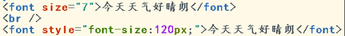

效果：

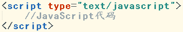{width="5.768055555555556in" height="1.570138888888889in"}

### 1.3、为什么使用CSS替代HTML属性设置样式

因为HTML属性在单独使用时有一定的局限性，所以要配合CSS样式代码才可以展示更为丰富的效果。

### 1.4、css的代码规范

放置规范：

在\<style\>标签内容体中书写css样式代码。

\<style\>标签放置在\<head\>标签之中。

格式规范：

选择器名称 { 属性名1：属性值1；属性名2：属性值2；.......}

选择器：即指定CSS样式作用在哪些HTML标签上

代码规范：

-   属性名和属性值之间是键值对关系；

-   属性名和属性值之间 用 ":" 连接，最后";"结尾；

> 例如：font-size:120px;

-   如果一个属性名有多个值，多个值之间用 空格 隔开。

> 例如： *border*:5px solid red;

-   CSS注释：/\* 注释内容\*/ 等同于java的多行注释

示例：

{width="2.7534722222222223in" height="2.1819444444444445in"}

效果：

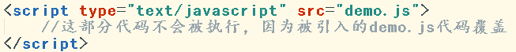{width="2.7979166666666666in" height="0.8159722222222222in"}

## 2、css选择器

### 2.1、基本选择器

#### 2.1.1、元素选择器

HTML标签又名HTML元素。

元素选择器：即以HTML标签名作为选择器名称。

作用：选择CSS样式代码 作用于 对应标签名的标签上。

- 格式：

  ```properties
  标签名{
  	/*CSS样式代码*/
  }
  ```

适用范围：适用于将相同样式 作用在多个同名标签上

示例：

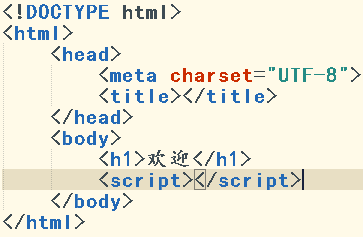{width="3.109722222222222in" height="2.432638888888889in"}

效果：

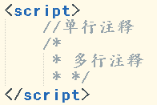{width="5.768055555555556in" height="1.5506944444444444in"}

#### 2.1.2、类选择器

每个HTML标签都有一个class属性，class属性值即为类名

类选择器：即以HTML的类名（class属性值）作为选择器名称。

作用：选择CSS样式代码 作用于 对应类名的HTML标签上

- 格式：

  ```properties
  .类名{
  	/*CSS样式代码*/
  }
  ```

适用范围：适用于将样式 一次作用在相同类名的标签上。（即使标签名不同）

示例：

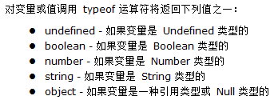{width="2.9923611111111112in" height="1.7930555555555556in"}

效果：

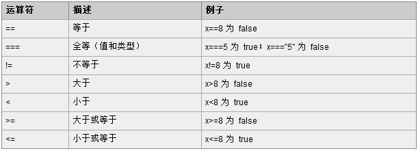{width="2.5930555555555554in" height="0.7388888888888889in"}

#### 2.1.3、id选择器

每个HTML标签都有一个id属性，id的属性值必须在本页面是唯一的。

id选择器：即以HTML的id（id属性值）作为选择器名称。

作用：选择CSS样式代码 作用于 某个规定id值的html标签上

- 格式：

  ```properties
  #id值{
  	/*CSS样式代码*/
  }
  ```

适用范围：适用于将样式 作用某个标签上。（更有针对性）

注意：

必须手动保证ID值在本页面唯一。

示例：

{width="2.9923611111111112in" height="2.1354166666666665in"}

效果：

{width="2.520138888888889in" height="1.020138888888889in"}

### 2.2、基本选择器的组合方式

#### 2.2.1、层级关系

标签和标签之间有层级关系，例如：\<html\>标签的子标签为\<body\>标签。

我们可以对基本选择器进行组合，表现出层级关系，从而更加针对性地把样式作用于某些标签上。

- 格式：

  ```properties
  选择器1 选择器2 …..{
  		/*css样式代码*/
  }
  
  ```

选择器1 下的 选择器2

示例：

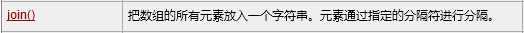{width="2.4923611111111112in" height="2.404166666666667in"}

效果：

{width="1.863888888888889in" height="0.5305555555555556in"}

## 3、css样式

### 3.1、边框属性

所有的HTML标签都有边框，默认边框不可见

#### 3.1.1、border

> 设置边框的样式

-   格式：宽度 样式 颜色

> 例如：border:1px solid red ，1像素粗的 实线 红色边框。
>
> 线条样式：solid 实线，none 无边，double 双线

示例：

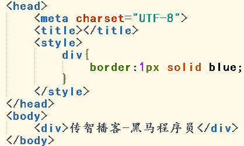{width="2.566666666666667in" height="1.5409722222222222in"}

效果：

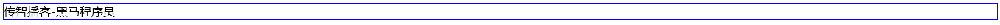{width="6.6618055555555555in" height="0.17152777777777778in"}

#### 3.1.2、width

> 用于设置标签的宽度

示例：

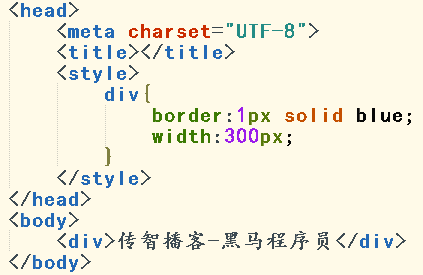{width="2.720138888888889in" height="1.7680555555555555in"}

效果：

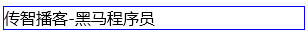{width="3.207638888888889in" height="0.37430555555555556in"}

#### 3.1.3、height

> 用于设置标签的高度

示例：

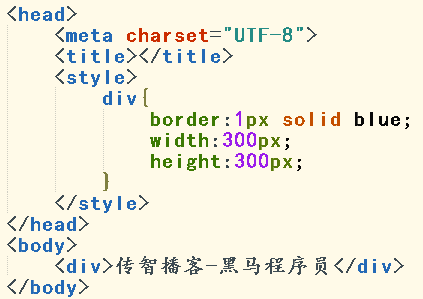{width="2.566666666666667in" height="1.8145833333333334in"}

效果：

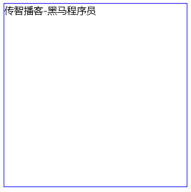{width="1.8131944444444446in" height="1.81875in"}

#### 3.1.4、background-color

用于设置标签的背景颜色

背景颜色设置的两种主流方式：

①英文单词 例如：red,blue,yellow

②颜色代码 格式：\#红绿蓝， 每一个颜色用两个16进制位数表示

例如：\#ff1100 红色ff，绿色11，蓝色00，红色颜色最重，绿色其次，没有蓝色

示例：

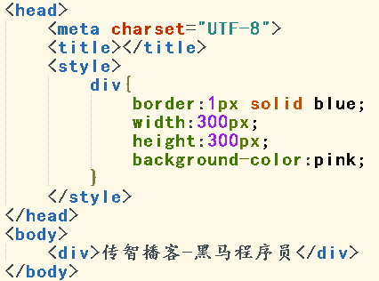{width="2.678472222222222in" height="1.9868055555555555in"}

效果：

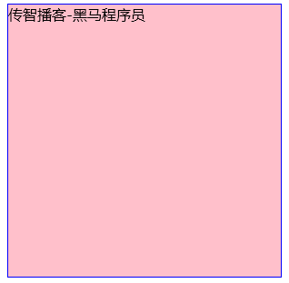{width="2.2131944444444445in" height="2.171527777777778in"}

### 3.2、布局

#### 3.2.1、float

通常默认的排版方式，将页面中的元素从上到下一一罗列，而实际开发中，需要左右方式进行排版，就需要使用浮动属性

-   格式：

> 选择器{float:属性值;}
>
> 常用属性值：
>
> none：元素不浮动（默认值）
>
> left：元素向左浮动
>
> right：元素向右浮动

注意：因为元素设置浮动属性后，会脱离原有文档流（会脱离原有的板式），从而会影响其他元素的样式，所以设置浮动以后，页面样式需要重新调整

示例1：

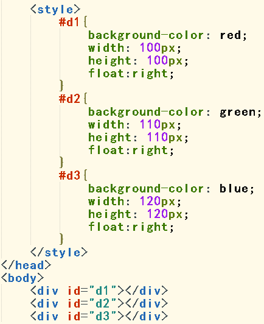{width="2.5in" height="3.063888888888889in"}

效果1：

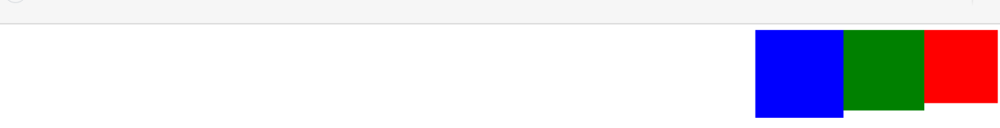{width="5.768055555555556in" height="0.7416666666666667in"}

示例2：

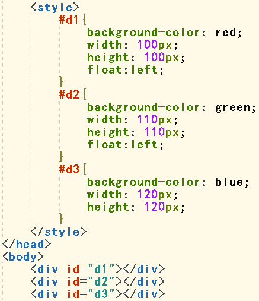{width="2.8555555555555556in" height="3.3131944444444446in"}

效果2：

{width="4.884722222222222in" height="1.520138888888889in"}

### 3.3、转换

#### 3.3.1、display

HTML提供丰富的标签，这些标签被定义成了不同的类型，一般分为：块级元素和行内元素。

-   块元素：以区域块方式出现。每个块标签独自占据一整行或多整行。块结束会自动换行

    -   常见的块元素：\<h1\>、\<p\>、\<div\>、\<ul\>等

-   行内元素：根据内容多少来占用行内空间，不会自动换行

    -   常见的行内元素：\<span\>、\<a\> 等

display属性可以使得元素 在行内元素和块元素之间相互转换。

-   格式：

> 选择器{display:属性值}

-   常用的属性值：

> block：此元素将显为块元素（块元素默认的display属性值）
>
> inline：此元素将显示为行内元素（行内元素默认的display属性值）
>
> none：此元素将被隐藏，不显示，也不占用页面空间。

示例：

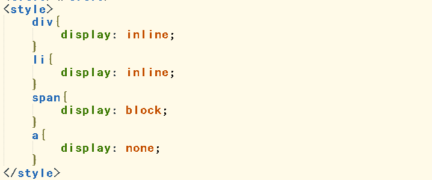{width="3.73125in" height="1.5583333333333333in"}

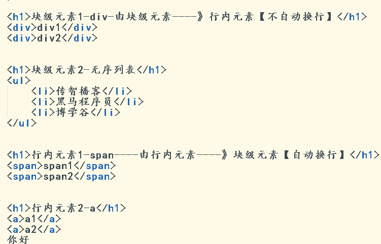{width="3.7534722222222223in" height="2.4090277777777778in"}

效果：

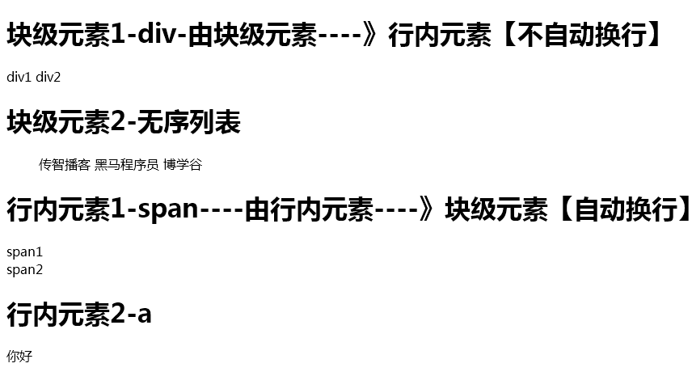{width="3.7777777777777777in" height="2.0520833333333335in"}

### 3.4、字体

#### 3.4.1、font-size

用于设置字体的大小。

#### 3.4.2、color

用于设置字体的颜色。

示例：

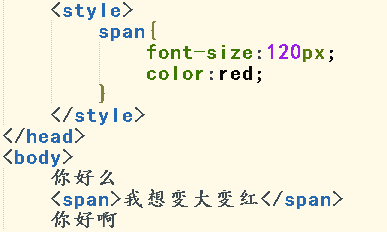{width="3.0368055555555555in" height="1.8208333333333333in"}

效果：

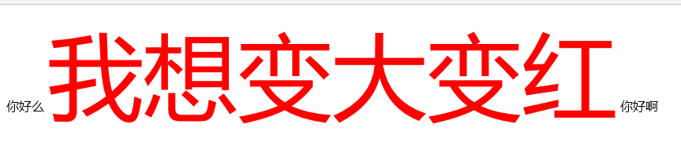{width="4.11875in" height="0.8875in"}

## 4、css盒子模型

### 4.1、什么是盒子模型

所有的HTML元素，我们都可以看成一个四边形，即一个盒子。

> 用CSS来设置元素盒子的 内边距、边框 和 外边距 的样式的方式，
>
> 相当于设置盒子的样式，所以我们将其称之为 盒子模型

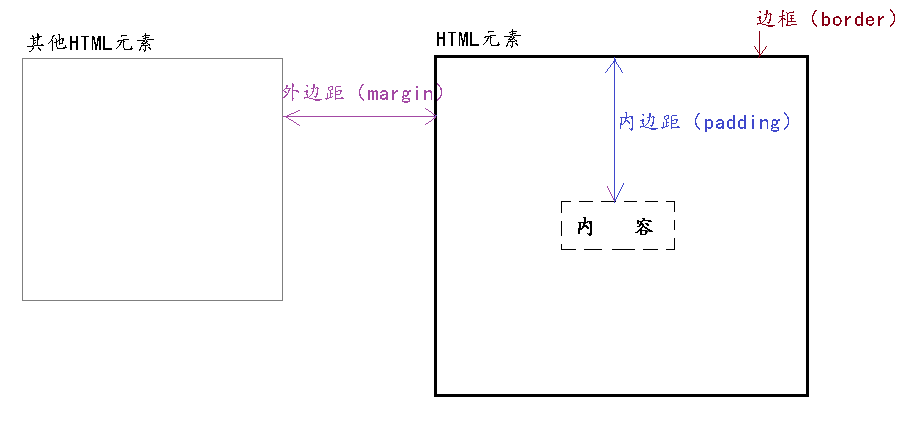{width="5.768055555555556in" height="2.6958333333333333in"}

### 4.2、边框（border回顾及再阐述）

边框：HTML元素盒子的框体

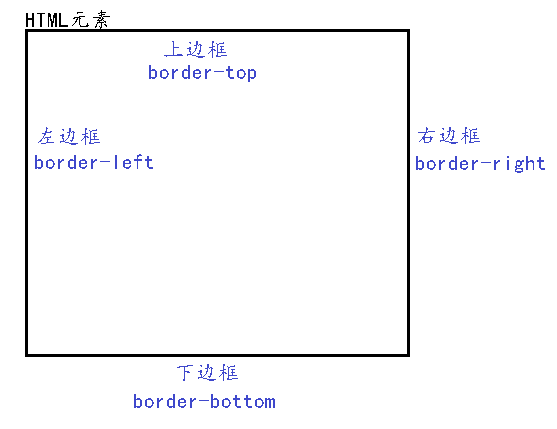{width="2.954861111111111in" height="2.2756944444444445in"}

边框有四个属性可以设置：

-   border-top:上边框

-   border -right:右边框

-   border -bottom:下边框

-   border -left:左边框

示例：

{width="5.768055555555556in" height="0.24027777777777778in"}

效果：

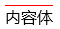{width="0.625in" height="0.3020833333333333in"}

通用性设置：

一次性设置上下左右边框样式 为1像素的 实体 红色线

border:1px solid red;

### 4.3、内边距padding

内边距：HTML元素里的内容体 到 HTML元素边框 的距离

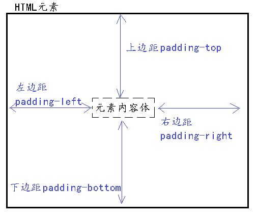{width="3.1104166666666666in" height="2.6118055555555557in"}

内边距有四个属性可以设置：

-   padding-top:上边距

-   padding-right:右边距

-   padding-bottom:下边距

-   padding-left:左边距

通用性设置：

一次性设置上下左右内边距距离为10PX

padding:10px;

### 4.4、外边距margin

外边距：HTML元素边框 到 其他HTML元素边框的距离

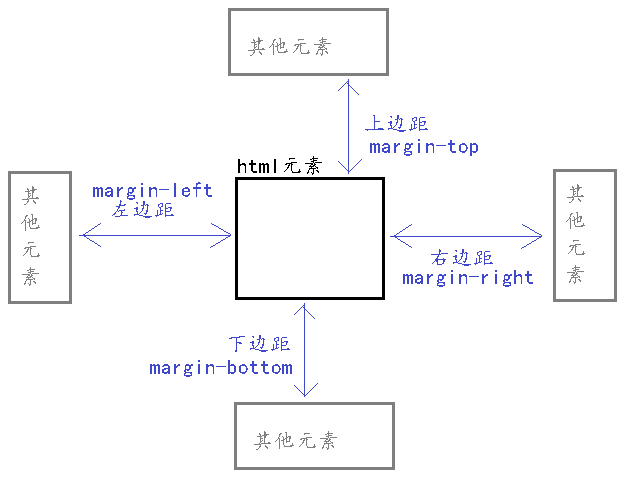{width="3.723611111111111in" height="2.8625in"}

外边距有四个属性可以设置：

-   margin-top:上边距

-   margin -right:右边距

-   margin -bottom:下边距

-   margin -left:左边距

通用性设置：

一次性设置上下左右外边距距离为10PX

margin:10px;

## 5、css和HTML的结合方式

### 5.1、内部样式

#### 5.1.1、行内样式

行内样式，是通过标签的style属性来设置元素的样式。

格式：

\<html标签 style="css样式代码" /\>

示例：

{width="5.768055555555556in" height="0.2048611111111111in"}

效果：

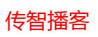{width="1.4472222222222222in" height="0.5513888888888889in"}

适用环境：更加针对性修改某个标签的样式

#### 5.1.2、\<style\>\</style\>标签方式

当某些样式在页面中被多个标签重复使用，为了编码更加灵活，避免书写重复代码，

我们将样式代码从标签style属性中抽取出来，统一写入到style标签中。

格式：

\<style\>

css样式代码

\</style\>

示例：

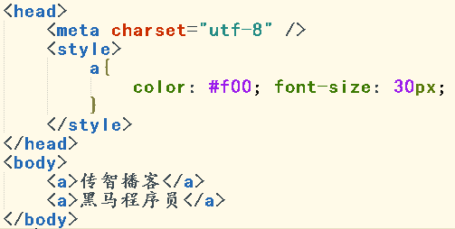{width="3.428472222222222in" height="1.73125in"}

效果：

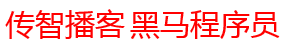{width="2.6416666666666666in" height="0.4986111111111111in"}

应用环境：适合页面中进行样式复用

### 5.2、外部样式

#### 5.2.1、\<link/\>标签方式

\<link/\>又称为链入式，是将所有的样式放在一个或多个以.css为扩展名的外部样式表文件中，通过\<link\>标签将样式连接到HTML文档中。

格式：

\<link rel=\"stylesheet\" type=\"text/css\" href=\"css文件路径\"/\>

-   rel=\"stylesheet\" ,固定值，表示样式表

-   type=\"text/css\"，固定值，表示css类型

-   href ，表示css文件位置

示例：

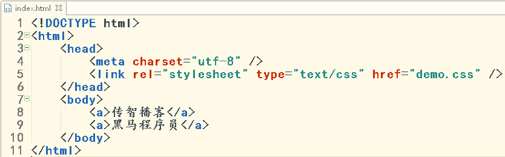{width="4.638194444444444in" height="1.4402777777777778in"}

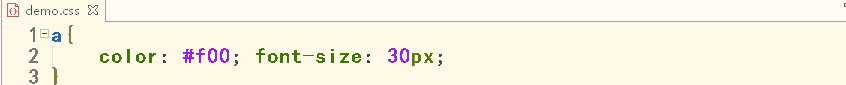{width="4.6715277777777775in" height="0.46875in"}

效果：

{width="2.8506944444444446in" height="0.5027777777777778in"}

适合：不同页面进行样式复用。

# JavaScript

## 1、JavaScript概述

### 1.1、JavaScript是什么？有什么作用？ 

HTML：就是用来写网页的。 人的身体

CSS： 就是用来美化页面的。 人的衣服

JavaScript：前端大脑、灵魂。 人的大脑、灵魂

JavaScript是WEB上强大的**脚本语言**。

脚本语言：

无法独立执行。必须嵌入到其他语言中，结合使用。

直接被浏览器解析执行。

Java编程语言：

> 独立写程序，独立运行。 编译\-\--执行

作用：控制页面特效展示。

> 例如：

- JS可以对HTML元素进行动态控制
- JS可以对表单项进行校验
- JS可以控制CSS的样式；

### 1.2、JavaScript入门案例

### 1.3、JavaScript的语言特征及编程注意事项

特征：

- JavaScript无需编译，直接被浏览器解释并执行
- JavaScript无法单独运行，必须嵌入到HTML代码中运行
- JavaScript的执行过程由上到下依次执行

注意：

- JavaScript没有访问系统文件的权限（安全）
- 由于JavaScript无需编译，是由上到下依次解释执行，所以在保证可读性的情况下，允许使用链式编程
- JavaScript和java没有任何直接关系

### 1.4、JavaScript的组成


- ECMAScript (核心)：规定了JS的**语法和基本对象**。
- DOM 文档对象模型：**处理网页内容**的方法和接口

> 标记型文档。HTML

- BOM 浏览器对象模型：**与浏览器交互**的方法和接口

### 1.4、JavaScript的引入方式

#### 1.4.1、内部脚本

在当前页面内部写script标签，script内部即可书写JavaScript代码

格式：

> \<script type="text/javascript"\>
>
> JavaScript的代码
>
> \</script\>

示例：

\javaScript\word\media/image4.png){width="2.6486111111111112in" height="0.46944444444444444in"}

注：script标签理论上可以书写在HTML文件的任意位置

#### 1.4.2、外部引入

在HTML文档中，通过\<script src=""\>标签引入.js文件

格式：

\<script type="text/javascript" src="javascript文件路径" \>\</script\>

示例1：

\javaScript\word\media/image5.png){width="5.768055555555556in" height="0.22916666666666666in"}

注：外部引用时script标签内不能有script代码，即使写了也不会执行。

示例2：

\javaScript\word\media/image6.png){width="5.768055555555556in" height="0.5826388888888889in"}

#### 1.4.3、script标签规范化的放置位置（了解）

开发规范规定，script标签的放置位置为：

Body结束标签前。

如图所示：

\javaScript\word\media/image7.png){width="2.5368055555555555in" height="1.65625in"}

优点：

- 保证html展示内容优先加载，最后加载脚本。 增强用户体验性

## 2、JavaScript语法及规则

### 2.1、注释

- 单行注释

//

Hbuilder快捷键 ctrl+/

- 多行注释

/\* \*/

Hbuilder快捷键 ctrl+shift+/

示例：

\javaScript\word\media/image8.png){width="1.7909722222222222in" height="1.1965277777777779in"}

### 2.2、变量

#### 2.2.1、变量简述

变量：标示内存中的一块空间，用于存储数据，且数据是可变的。

变量的声明：

var 变量名; //变量赋予默认值，默认值为undefined （未定义的）

变量的声明和赋值：

var 变量名=值; //变量赋予对应的值

在声明JavaScript变量时，需要遵循以下命名规范：

- 必须以字母或下划线开头，中间可以是数字、字符或下划线 stu\_num stuNum
- 变量名不能包含空格等符号
- 不能使用JavaScript关键字作为变量名，如：function、this、class
- JavaScript严格区分大小写。

#### 2.2.2、基本数据类型

类似于java中的基本数据类型

var num =

- string 字符串类型。""和''都是字符串。 JavaScript中没有单个字符
- boolean 布尔类型。 固定值为true和false
- number 数字类型。 任意数字
- null 空，一个占位符。
- undefined 未定义类型，该类型只有一个固定值，即undefined，表示变量声明却未 定义具体的值。

> 注：因为undefined是从null中派生出来的，所以undefined==null
>
> JavaScript区别于java，是弱类型语言，变量的使用不用严格遵循规范，所以一个变量声明好之后，是可以赋予任意类型的值。
>
> 通过typeof运算符可以分辨变量值属于哪种基本数据类型
>
> \javaScript\word\media/image9.png){width="2.9027777777777777in" height="1.0444444444444445in"}
>
> ECMAScript实现之初的一个bug，null属于基本数据类型，typeof(null)\--object

#### 2.2.3、引用数据类型

引用类型通常叫做类（class），但在JavaScript中，因为不存在编译过程，所以没有类的概念，所处理的引用数据类型都是**对象**。

标准创建方式：

var str = new String();//和java相同

var str = new String; //js独有的方式

### 2.3、运算符

> JavaScript运算符与Java运算符基本一致。

这里我们来寻找不同点进行学习

#### 2.3.1、比较运算符

> \javaScript\word\media/image10.png){width="5.089583333333334in" height="1.8430555555555554in"}

== 逻辑等。仅仅对比 值

**=== 全等**。 对比值并且对比类型。

> 如果值和类型都相同，则为true；值和类型有一个不同，则为false

+-------------------+
| 随堂练习：        |
|                   |
| var x=8;          |
|                   |
| alert(x==8);      |
|                   |
| alert(x===8);     |
|                   |
| alert(x==\"8\");  |
|                   |
| alert(x===\"8\"); |
+-------------------+

#### 2.3.2、逻辑运算符

> \javaScript\word\media/image11.png){width="5.081944444444445in" height="0.9402777777777778in"}

注：JavaScript逻辑运算符没有 & \|

### 2.4、正则对象

#### 2.4.1、RegExp对象的创建方式

- var reg = new RegExp(\"表达式\"); （开发中基本不用）
- **var reg = /\^表达式\$/; 直接量（开发中常用）**

直接量中存在边界，即\^代表开始，\$代表结束

直接量方式的正则是对象，不是字符串，别用引号

#### 2.4.2、test方法

正则对象.test(string); 用来校验字符串是否匹配正则。

全部字符匹配返回true；有字符不匹配返回false

随堂练习

+--------------------------+
| 练习：判断字符串是否为空	 |
|                          					   |
| var msg="";              			    |
|                                                  |
| var reg = /\^\\s\*\$/;                     |
|                                                 |
| alert(reg.test(msg));                |
+--------------------------+

#### 2.4.3、正则对象使用注意事项

/\^表达式\$/ **只要有无法成立正则的字符存在，即为false。**

> **全部符合为true**
>
> （检查严格，眼睛不揉沙子）
>
> 适用于表单校验

/表达式/ **只要有成立正则的字符存在，即为true。**

> **全部不符合为false**
>
> （检查不严格，懒人思想）

适用于字符串查找、替换

### 2.5、JS数组对象

#### 2.5.1、JS数组的特性

JS数组可以看做 Java中的ArrayList 集合。

- 数组中的每一个成员没有类型限制，及可以存放任意类型
- 数组的长度可以自动修改

#### 2.5.2、JS数组的四种创建方式

1. var arr = \[1,2,3,"a",true\]; //常用的JS数组。 长度5
2. var arr = new Array();创建一个数组对象，数组长度默认为0
3. var arr = new Array(4);

> 数组长度是4，相当于开辟了长度为4的空间，每个元素是undefined。（仅在显示数组时进行处理，undefined为了方便显示变成了空字符串形式，其值本质仍然是undefined）

4. var arr = new Array("a","b",true); //创建了一个数组，长度3, 数组元素是"a","b",true

#### 2.5.3、JS数组的常用属性/方法

\javaScript\word\media/image12.png){width="5.436805555555556in" height="0.31180555555555556in"}

\javaScript\word\media/image13.png){width="5.457638888888889in" height="0.34305555555555556in"}

\javaScript\word\media/image14.png){width="5.468055555555556in" height="0.9784722222222222in"}

物理翻转：就是把元素下标进行互换