### 0.1学习目标

（1）能够独立编写并使用JavaScript语法之全局函，自定义函数数和自定义对象

（2）能够独立编写并使用BOM对象

（3）能够独立完成并使用DOM对象

（4）能够独立编写并使用JS常见事件

（5）能够独立编写并使用JS的事件绑定

### 0.2 学习指南

1\. JavaScript语法之全局函数和自定义函数(重点)

2.JavaScrpit语法之自定义对象

3\. 使用BOM对象弹消息框（重点）

4\. 使用BOM设置循环定时器和一次性定时器 (重点)

5\. Location对象之href属性

6.使用DOM获取元素节点对象(重点)

7.元素对象常见属性(重点)

8.解释JS事件驱动机制

9.阐述常见的JS事件

10.JS事件的两种事件绑定方式

## 2、JavaScript语法及规则

### 2.6、全局函数（global）

#### 2.6.1、执行

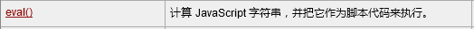

作用：用于增强程序的扩展性。

注：只可以传递原始数据类型string，传递String对象无作用。

#### 2.6.2、编码和解码

URL/URI编码：中文及特殊符号 %16进制

作用：保证数据传递的完整性。

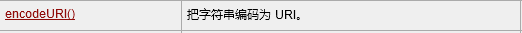{width="5.436805555555556in" height="0.34305555555555556in"}

{width="5.426388888888889in" height="0.31180555555555556in"}

#### 2.6.3、URI和URL的区别

URI是统一资源标识符。 标识资源详细名称。

URL是统一资源定位器。 定位资源的网络位置。

资源：可以通过浏览器访问的信息统统称为资源。（图片、文本、HTML、CSS等等。。。。）

URI标识资源的详细名称，包含资源名。

URL定位资源的网络位置。包含http://

例如：

[[http://www.itcast.cn/]{.underline}](http://www.itcast.cn/) 是URL

/a.html 是URI

[[http://www.itcast.cn/a.html]{.underline}](http://www.itcast.cn/a.html) 既是URL，也是URI

#### 2.6.4、字符串转数字

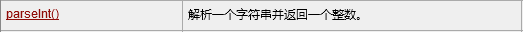{width="5.447222222222222in" height="0.3326388888888889in"}

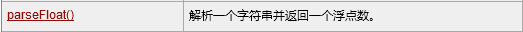{width="5.447222222222222in" height="0.3326388888888889in"}

parseInt(string); string按照字面值转换为整数类型，小数点后面部分不关注。

parseFloat(string); string按照字面值转换为小数类型。

注：

-   如果字符串的某个字符从字面值上无法转为数字，那么从该字符开始停止转换，仅返回前面正确的转换值。（例如：11.5a55，parseInt结果11，parseFloat结果11.5）

-   如果字符串的第一个字符就无法从字面值上转为数字，那么停止转换，返回NaN

> NaN（Not A Number，一个数字类型的标识，表示不是一个正确的数字）

### 2.7、自定义函数/自定义方法

#### 2.7.1、函数简述及作用

如果一段代码需要被重复编写使用，那么我们为了方便统一编写使用，可以将其封装进一个函数（方法）中。

作用：增强代码的复用性

#### 2.7.2、函数格式

{width="3.1972222222222224in" height="0.7076388888888889in"}

-   JavaScript函数定义必须用小写的function；

-   JavaScript函数无需定义返回值类型，直接在function后面书写 方法名；

-   参数的定义无需使用var关键字，否则报错；

-   JavaScript函数体中，return可以不写，也可以return 具体值，或者仅仅写return；

#### 2.7.3、函数使用的注意事项

JavaScript函数调用执行完毕一定有返回值，值及类型根据return决定，如果未return具体值，返回值为undefined；

JavaScript函数若同名，则不存在方法重载，只有方法相互覆盖，最后定义的函数覆盖之前的定义；

因为JavaScript不存在函数重载，所以JavaScript仅根据方法名来调用函数，即使实参与函数的形参不匹配，也不会影响正常调用；

如果形参未赋值，就使用默认值undefined

### 2.8、自定义对象

#### 2.8.1、function构造函数

我们知道，JavaScript中的引用数据类型都是对象，而对象在JavaScript中可以用函数来表示。

相当于java中创建某个class类

-   无形参格式：

function 对象名(){

函数体

> }

示例：

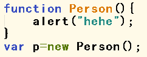{width="2.1041666666666665in" height="0.8256944444444444in"}

效果：

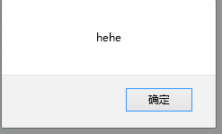{width="1.6340277777777779in" height="0.9854166666666667in"}

-   带参数格式：

function 对象名(参数列表){

函数体

> }

示例：

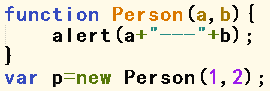{width="2.3875in" height="0.8048611111111111in"}

效果：

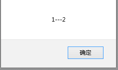{width="1.6263888888888889in" height="0.9729166666666667in"}

-   有属性格式：

function 对象名(){

this.属性名1=属性值1;

this.属性名2=属性值2;

.......

}

this表示当前对象。

示例1：（this表示的是Person对象）

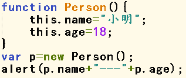{width="2.2680555555555557in" height="0.9513888888888888in"}

效果1：

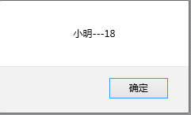{width="1.73125in" height="1.0486111111111112in"}

示例2：

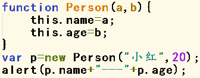{width="2.425in" height="0.9451388888888889in"}

效果2：

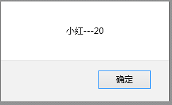{width="1.7381944444444444in" height="1.0659722222222223in"}

示例3：（无需定义，自由为对象赋予属性及值）

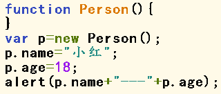{width="2.2534722222222223in" height="0.9576388888888889in"}

效果3：

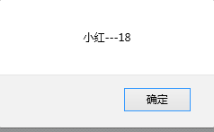{width="1.61875in" height="1.0in"}

应用场景：适用于对象构建及代码复用。

#### 2.8.2、对象直接量

开发中可以用一种简单的方式直接创建自定义的JavaScript对象，这种方式称为"对象直接量"。

格式：

var 对象名 = {属性名1:"属性值1", 属性名2:"属性值2", 属性名3:"属性值3"......};

注：**该方式直接创建出实例对象，无需构建函数，无需再new创建实例对象，直接使用即可**

示例1：

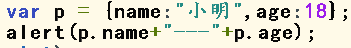{width="2.5069444444444446in" height="0.3423611111111111in"}

效果1：

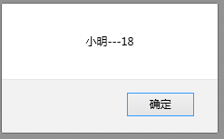{width="1.6784722222222221in" height="1.0395833333333333in"}

示例2：

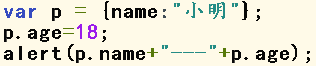{width="2.3805555555555555in" height="0.4965277777777778in"}

效果2：

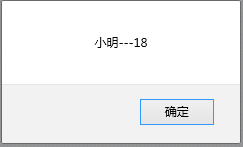{width="1.7534722222222223in" height="1.0604166666666666in"}

应用场景：适用于快速创建实例对象及数据封装。

## 3、BOM对象

### 3.1、BOM对象简述

#### 3.1.1、BOM对象是什么？有什么用？

BOM（Browser Object Model）浏览器对象模型

浏览器：IE、火狐、谷歌等

作用：用来执行浏览器的相关操作。（例如：浏览器的地址、弹出消息等）

一般情况下，window代表了BOM对象。

window对象是JavaScript的内置对象，使用window对象调用方法时可以省略window不写。

### 3.2、消息框

#### 3.2.1、alert()

警告框，用来弹出警告消息。

示例：

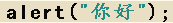{width="1.801388888888889in" height="0.2388888888888889in"}

效果：

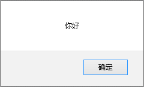{width="1.6715277777777777in" height="1.0166666666666666in"}

注：不同浏览器显示的组件样式不同，这里我们无需关注组件样式。

#### 3.2.2、confirm()

确认框，用于告知用户信息并收集用户的选择

示例1：

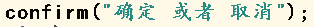{width="2.5819444444444444in" height="0.22152777777777777in"}

效果2：

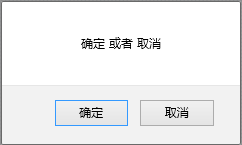{width="1.7833333333333334in" height="1.0680555555555555in"}

该方法有返回值，用户通过选择"确定"或者"取消"，方法结束会返回boolean类型的值。

-   "确定"返回ture；

-   "取消"返回false；

示例2：

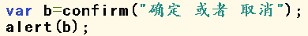{width="2.6416666666666666in" height="0.3111111111111111in"}

效果2：

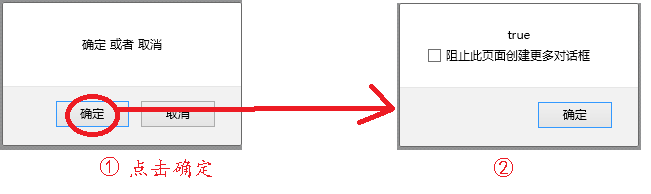{width="4.15625in" height="1.2381944444444444in"}

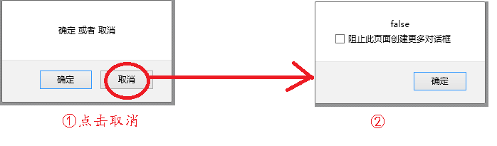{width="4.201388888888889in" height="1.2333333333333334in"}

### 3.3、定时器

#### 3.3.1、循环定时器的设置和取消

##### 3.3.1.1、启动循环定时器-setInterval()

循环定时器，调用一次就会创建并循环执行一个定时器。

格式：

setInterval(调用方法,毫秒值);

//毫秒值： 循环周期

示例：

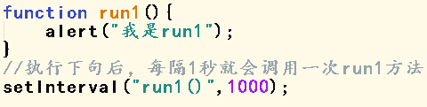{width="3.088888888888889in" height="0.7784722222222222in"}

效果：（每隔一秒就会弹出一次对话框）

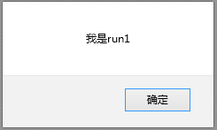{width="2.0069444444444446in" height="1.2041666666666666in"}

##### 3.3.1.2、停止循环定时器-clearInterval()

setInterval方法在创建一个定时器的同时，还会返回一个的定时器的ID，该ID就代表这个定时器。

此定时器ID在当前页面是不重复的。

我们可以通过clearInterval方法，指定某个循环定时器 停止

格式：

clearInterval(定时器ID);

示例：

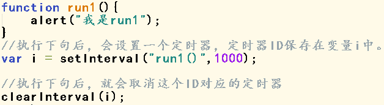{width="3.6638888888888888in" height="1.0090277777777779in"}

效果：

因为定时器设定后立即取消了，所以没有任何效果。

#### 3.3.2、一次性定时器的设置和取消

##### 3.3.2.1、启动一次性定时器-setTimeout()

一次性定时器，调用一次就会创建并执行一个定时器一次。

格式：

setTimeout(调用方法,毫秒值);

示例：

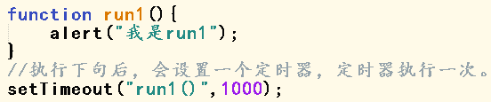{width="3.7909722222222224in" height="0.7895833333333333in"}

效果：

{width="2.0069444444444446in" height="1.2041666666666666in"}

##### 3.3.2.2、停止一次性定时器clearTimeout()

setTimeout方法在创建一个定时器的同时，还会返回一个的定时器的ID，该ID就代表这个定时器。

此定时器ID在当前页面是不重复的。

我们可以通过clearTimeout方法，指定某个一次性定时器 停止

格式：

clearTimeout (定时器ID);

示例：

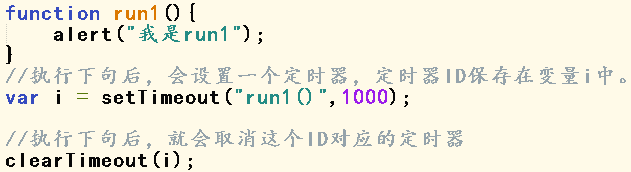{width="3.4770833333333333in" height="0.9472222222222222in"}

效果：

因为定时器设定后立即取消了，所以没有任何效果。

### 3.4、location对象

location 对象包含浏览器 地址栏 的信息。

常用属性：

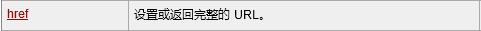{width="5.009722222222222in" height="0.32222222222222224in"}

设置href属性，浏览器就会跳转到对应的路径

## 4、DOM对象

### 4.1、DOM对象的简述

#### 4.1.1、DOM对象是什么？有什么作用？

DOM（Document Object Model） 文档对象模型

文档：标记型文档（HTML等）

DOM是将标记型文档中所有内容（标签、文本、属性）都封装成对象，

通过操作对象的属性或者方法，来达到操作或者改变HTML展示效果的目的。

#### 4.1.2、DOM树介绍

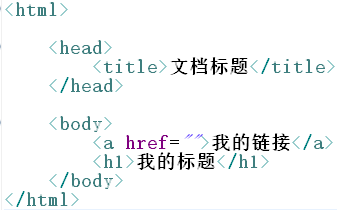{width="4.006944444444445in" height="2.4972222222222222in"}

上述HTML文档会被浏览器 由上到下依次 加载并解析。

加载到浏览器的内存

加载并解析到内存中，会生成一张DOM树

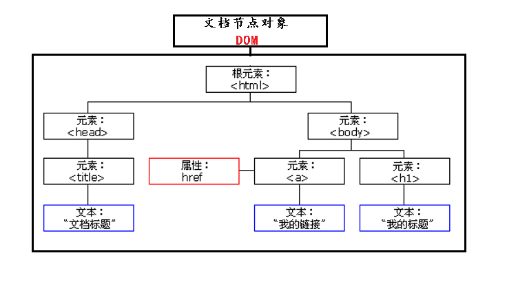{width="5.768055555555556in" height="3.2368055555555557in"}

其中：

-   每个标签会被加载成 DOM树上的一个元素节点对象。

-   每个标签的属性会被加载成DOM树上的一个属性节点对象

-   每个标签的内容体会被加载成DOM树上的一个文本节点对象

-   整个DOM树，是一个文档节点对象，即DOM对象。

-   一个HTML文档加载到内存中就会形成一个DOM对象

DOM树的特点：

-   必定会有一个根节点

<!-- -->

-   每个节点都是节点对象

-   常见的节点关系：**父子节点关系**

-   文本节点对象没有子节点\-\--叶子节点

-   每个节点都有**一个父节点，零到多个子节点**

-   **只有根节点没有父节点**

### 4.2、获取元素对象的四种方式

在JavaScript中，我们可以通过DOM对象的4种方式获取对应的元素对象：

-   getElementById(); \-\--通过元素ID获取对应元素对象

可以通过ID获取对应的元素对象，如果找不到，返回null

-   getElementsByName(); \-\--通过元素的name属性获取符合要求的所有元素

-   getElementsByTagName(); \-\--通过元素的元素名属性获取符合要求的所有元素

-   getElementsByClassName(); \-\--通过元素的class属性获取符合要求的所有元素

> 可以获取到元素节点对象 数组；如果找不到，返回 空数组

注：获取某个/某些元素节点对象，必须保证元素节点对象被先加载到内存中

### 4.3、元素对象常见属性

#### 4.3.1、value

元素对象.value， 获取元素对象的value属性值。

元素对象.value=属性值 设置元素对象的value属性值。

修改元素的值

#### 4.3.2、className

元素对象.className， 获取元素对象的class属性值。

元素对象. className =属性值 设置元素对象的class属性值。

修改元素样式

#### 4.3.3、checked

元素对象.checked， 获取元素对象的checked属性值。

元素对象. checked =属性值 设置元素对象的checked属性值。

注：HTML中checked="checked"，JavaScript中返回true，false

修改单选/复选的 选中与否

#### 4.3.3、innerHTML

元素对象.innerHTML， 获取元素对象的内容体

元素对象.innerHTML=值 设置元素对象的内容体

操作元素的内容体

## 5、JS事件

### 5.1、JS事件是什么？有什么作用？

通常鼠标或热键的动作我们称之为事件(Event)

事件包括：点击、表单提交、值发生改变、鼠标移入、鼠标移出等等

通过JS事件，我们可以完成页面的指定特效。

### 5.2、JS事件驱动机制简述

页面上的特效，我们可以理解在JS事件驱动机制下进行。

JS事件驱动机制：

警察抓小偷

-   事件源 小偷

-   事件 偷东西

-   监听器 警察

-   注册/绑定监听器 让警察时刻盯着小偷

> 事件源：专门产生事件的组件。
>
> 事件：由事件源所产生的动作或者事情。
>
> 监听器：专门处理 事件源 所产生的事件。
>
> 注册/绑定监听器：让监听器时刻监听事件源是否有指定事件产生，如果事件源产生指定事件，则调用监听器处理。
>
> 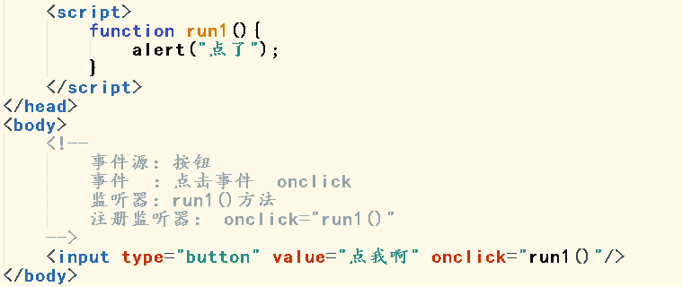{width="5.768055555555556in" height="2.428472222222222in"}

### 5.3、常见的JS事件

#### 5.3.1、点击事件（onclick）

点击事件：由鼠标或热键点击元素组件时触发

示例：

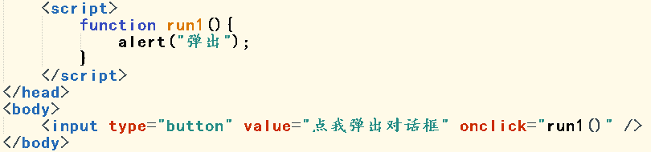{width="5.768055555555556in" height="1.3527777777777779in"}

效果：

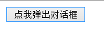{width="1.551388888888889in" height="0.5305555555555556in"}

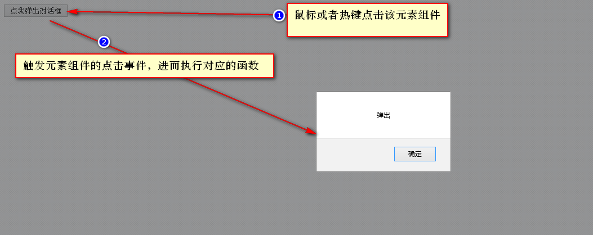{width="5.768055555555556in" height="2.2895833333333333in"}

#### 5.3.2、焦点事件（onblur、onfoucs）

##### 5.3.2.1、获取焦点事件(onfocus)

焦点：即整个页面的注意力。

默认一个正常页面最多仅有一个焦点。

例如：文本框中闪烁的小竖线。

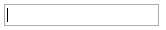{width="1.7284722222222222in" height="0.31180555555555556in"}

通常焦点也能反映出用户目前的关注点，或者正在操作的组件。

获取焦点事件：当元素组件获取焦点时触发

示例：

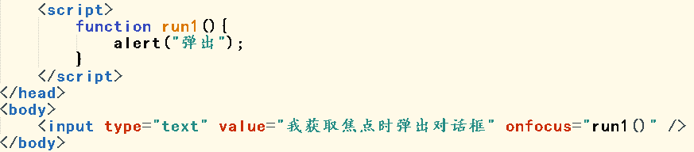{width="5.768055555555556in" height="1.2680555555555555in"}

效果：

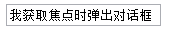{width="1.7597222222222222in" height="0.3326388888888889in"}

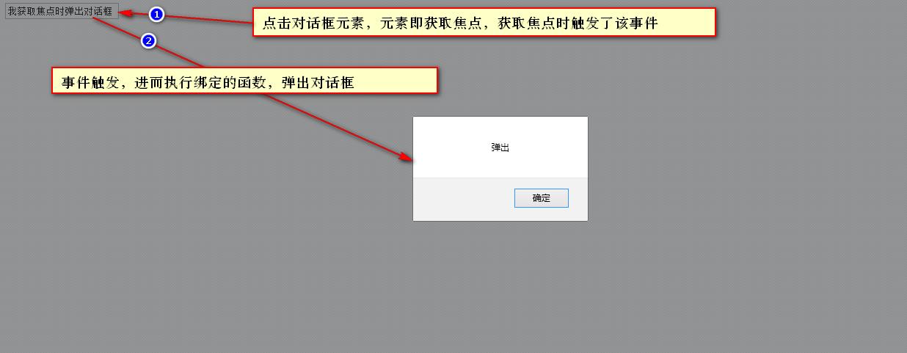{width="5.768055555555556in" height="2.2444444444444445in"}

##### 5.3.2.2、失去焦点事件（onblur）

失去焦点事件：元素组件失去焦点时触发

示例：

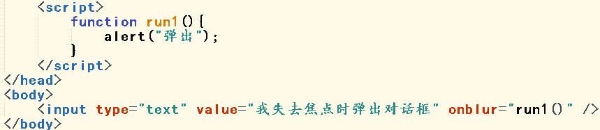{width="5.768055555555556in" height="1.2555555555555555in"}

效果：

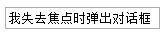{width="1.7284722222222222in" height="0.38472222222222224in"}

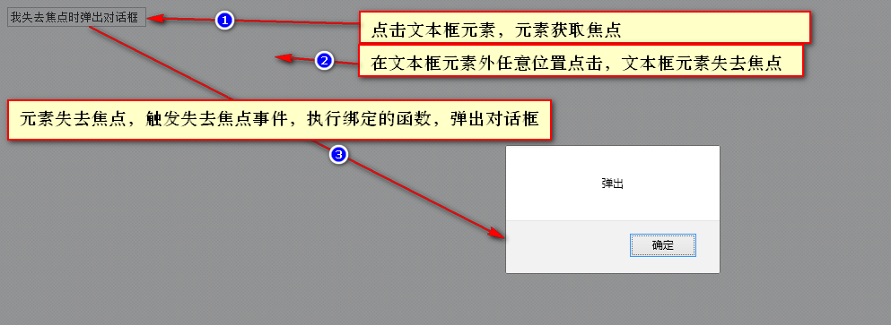{width="5.768055555555556in" height="2.1083333333333334in"}

#### 5.3.3、域内容改变事件（onchange）

域内容改变事件： 元素组件的值发生改变时触发

示例：

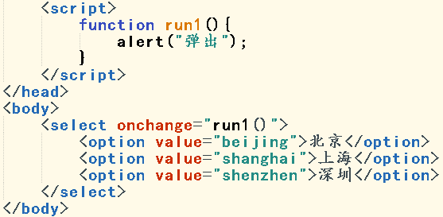{width="3.69375in" height="1.8104166666666666in"}

效果：

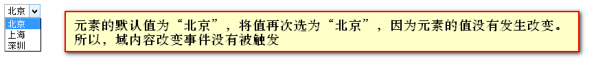{width="5.768055555555556in" height="0.7243055555555555in"}

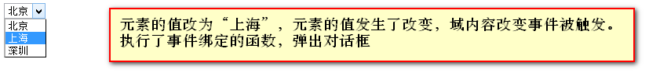{width="5.768055555555556in" height="0.6555555555555556in"}

#### 5.3.4、加载完毕事件（onload）

加载完毕事件：元素组件加载完毕时触发。

示例：

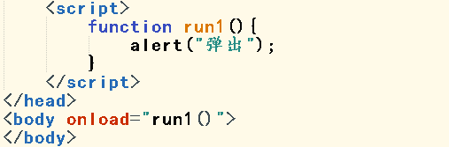{width="3.670138888888889in" height="1.2083333333333333in"}

效果：

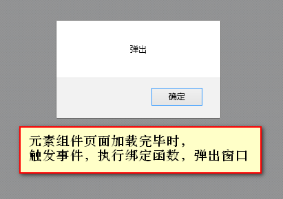{width="3.701388888888889in" height="2.6118055555555557in"}

#### 5.3.5、表单提交事件（onsubmit）

表单提交事件：**表单的提交按钮被点击时**触发

注意：该事件需要返回boolean类型的值来执行 提交/阻止 表单数据的操作。

-   事件得到true，提交表单数据

-   事件得到false，阻止表单数据提交

示例1：

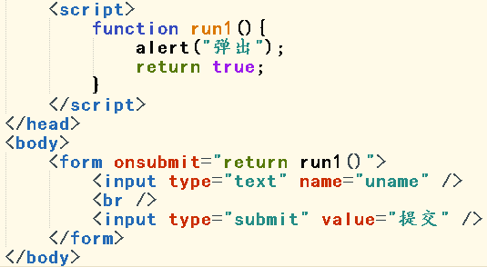{width="3.9625in" height="2.1770833333333335in"}

效果1：

{width="2.582638888888889in" height="0.6659722222222222in"}

{width="4.932638888888889in" height="2.2423611111111112in"}

{width="4.932638888888889in" height="1.8159722222222223in"}

示例2：

{width="3.373611111111111in" height="1.8805555555555555in"}

效果2：

{width="5.768055555555556in" height="3.217361111111111in"}

#### 5.3.6、键位弹起事件（onkeyup）

键位弹起事件：在组件中输入某些内容时，键盘键位弹起时触发该事件

示例：

{width="4.178472222222222in" height="1.2375in"}

效果：

{width="4.783333333333333in" height="1.3652777777777778in"}

#### 5.3.7、常用鼠标事件

##### 5.3.7.1、鼠标移入事件（onmouseover）

鼠标移入事件：鼠标移入某个元素组件时触发

示例：

{width="5.768055555555556in" height="1.5875in"}

效果：

{width="5.768055555555556in" height="1.8152777777777778in"}

##### 5.3.7.2、鼠标移出事件（onmouseout）

鼠标移出事件：鼠标移出某元素时触发

示例：

{width="5.768055555555556in" height="1.5881944444444445in"}

效果：

{width="5.768055555555556in" height="1.8152777777777778in"}

### 5.4、JS事件的两种绑定方式

#### 5.4.1、元素事件句柄绑定

将事件以元素属性的方式写到标签内部，进而绑定对应函数。

示例1：【为事件绑定一个无参函数】

{width="4.701388888888889in" height="1.3770833333333334in"}

示例2：【为事件绑定一个有参函数】

{width="5.768055555555556in" height="1.4944444444444445in"}

示例3：【为事件绑定一个有参函数-this】

{width="5.768055555555556in" height="1.2756944444444445in"}

示例4：【为事件绑定多个函数】

{width="5.768055555555556in" height="2.20625in"}

事件句柄绑定方式-

优点：①开发快捷

②传参方便

③可以绑定多个函数

缺点：JS和HTML代码高度糅合在一起，不利于多部门的项目开发维护

#### 5.4.2、DOM绑定方式

使用DOM的属性方式绑定事件。

示例1：【将下述绑定转为DOM方式绑定】

{width="4.0368055555555555in" height="1.1229166666666666in"}

{width="4.044444444444444in" height="1.3840277777777779in"}

{width="4.052083333333333in" height="1.5166666666666666in"}

示例2：【使用DOM绑定方式，为文本框onclick事件绑定run1方法】

{width="5.768055555555556in" height="1.3694444444444445in"}

{width="5.768055555555556in" height="2.1729166666666666in"}

DOM绑定方式-

优点：使得HTML代码和JS代码完全分离

缺点：①不能传递参数。 解决：匿名函数是可以的

②一个事件只能绑定一个函数 解决：匿名函数内部是可以绑定多个哈数。
