# Tomcat&Http&Servlet

### 1.1.1 一、学习目标

\1. 完成Tomcat的安装及常见问题的解决

\2. 应用Tomcat发布web项目

\3. 应用Eclipse发布项目以及完成虚拟主机的配置

\4. 了解HTTP协议与HTTP抓包工具的使用

\5. 阐述什么是Servlet与Servlet是如何执行的

\6. 记忆Servlet实现关系与应用Servlet模板开发Servlet(重点)		

### 1.1.2 二、学习指南

\1. Web概述与Tomcat的安装及注意事项

\2. Tomcat的目录结构与项目发布

\3. Eclipse集成Tomcat发布项目与虚拟主机的配置

\4. HTTP协议的理解与抓包工具的使用

\5. Servlet的入门与执行流程的分析

\6. Servlet实现关系分析与使用servlet模板开发	

 

## 1.1 WEB的概述

### 1.1.1 什么是WEB

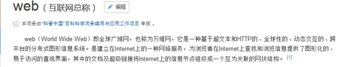 

### 1.1.2 什么是JavaWEB

使用Java语言进行WEB的开发。

### 1.1.3 软件架构

l CS结构的软件

n CS：Client/Server 客户端和服务器，这种软件往往需要安装。比如QQ、迅雷、播放器。

n 优缺点：

u 优点：

l 可以减轻服务器端压力，将部分代码写到客户端。

l 界面很美观。

u 缺点：

l 一旦服务器更新了，客户端也需要更新。

l 分布式开发比较弱。

l BS结构的软件

n BS：Browser/Server 浏览器和服务器，这种软件不需要安装，只需要通过浏览器就可以访问。

n 优缺点：

u 优点：

l 服务器一旦更新，不需要更新客户端，因为客户端就是浏览器

l 比较强的分布式能力

u 缺点：

l 服务器端压力会比较大。

l 界面效果不如CS结构软件。

### 1.1.4 WEB服务器

l 服务器：

n 硬件：其实就是一台电脑（这台电脑配置要求很高）。

n 软件：需要在这台电脑上安装web服务器的软件。

### 1.1.5 常见哪些web服务器

l Tomcat		：Apache组织提供的一个开源的免费的web服务器。满足EE的Serlet和JSP的规范。

l WebSphere	：IBM公司开发的一个收费的大型web服务器。满足了EE开发的所有规范。

l WebLogic		：BEA公司开发的一个收费的大型web服务器。满足了EE开发的所有规范。

l IIS			：应用在.NET平台上。

l Apache		：应用在PHP平台上。

### 1.1.6 WEB开发中的资源

- 静态web资源
  - HTML
  - CSS
  - JS

- 动态web资源
  - Servlet、JSP
  - PHP
  - ASP

 

## 1.2 Tomcat的概述及安装

### 1.2.1 什么是Tomcat

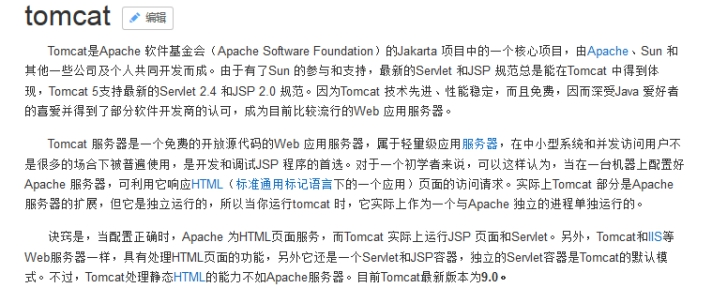 

Tomcat就是一个web的服务器，用来发布web项目。

### 1.2.2 Tomcat的安装

#### 1.2.2.1 下载Tomcat

l 官网

<http://tomcat.apache.org/>

l 下载地址

<http://tomcat.apache.org/download-70.cgi>

#### 1.2.2.2 解压Tomcat

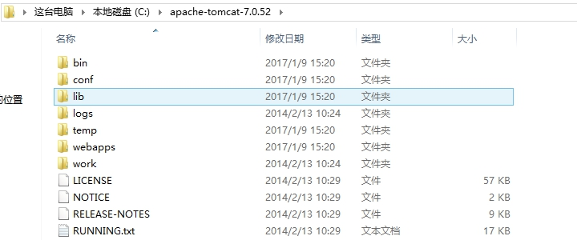 

#### 1.2.2.3 启动Tomcat

进入tomcat/bin/startup.bat

 

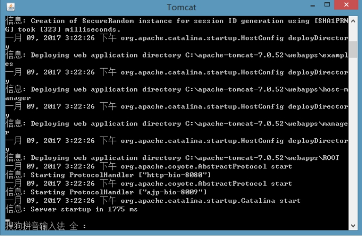 

#### 1.2.2.4 测试Tomcat

打开浏览器输入以下地址：

http://localhost:8080/

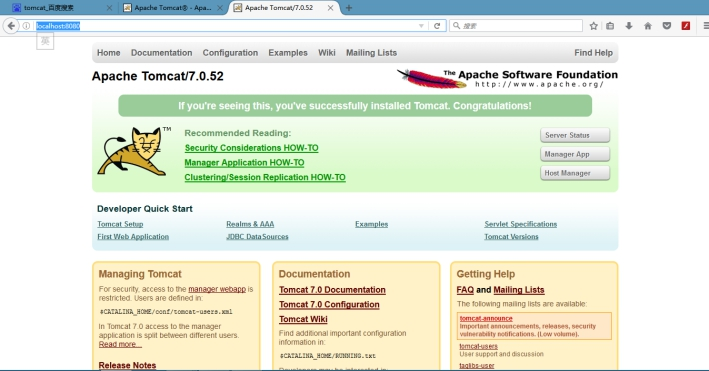 

 

## 1.3 Tomcat的安装注意事项

### 1.3.1 Java环境变量的配置

Tomcat运行需要依赖Java环境，也就是说需要在电脑上安装了JDK之后才可以安装和启动Tomcat。因为Tomcat启动的时候需要使用JRE的环境。必须要配置JAVA_HOME环境变量，如果没有配置JAVA_HOME环境变量，那么服务器在启动的时候就会一闪然后关闭。

 

### 1.3.2 Tomcat端口号冲突的问题

如果电脑上安装了一个应用之后，有可能会占用Tomcat的端口，如果将Tomcat端口占用了，同样这个Tomcat启动不了的。

Tomcat默认的端口号是8080。一般80端口容易被其他程序所占用。因为80端口是HTTP协议的默认端口（可以省略）。

l 解决办法：

n 一种：将占用端口的程序结束掉。

u 输入命令查看端口号：

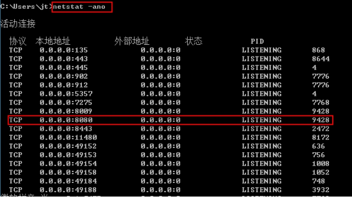 

u 结束9428端口的程序

在任务管理器中结束9428这个程序

n 二种：改变自身程序的端口。

u 修改Tomcat的端口号：

进入tomcat/conf/server.xml

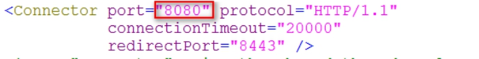 

端口被占用的异常信息

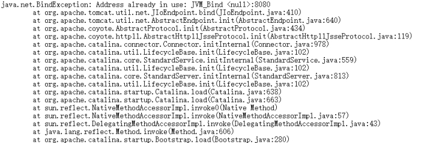 

## 1.4 Tomcat的目录结构

### 1.4.1 Tomcat目录结构

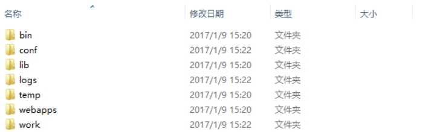 

l bin		:二进制文件（命令文件：开启和关闭）

l conf		:配置文件

l lib		:tomcat所需要的jar包

l logs		:tomcat服务器日志文件

l temp	:tomcat运行产生临时文件

l webapps	:需要发布的项目需要放在webapps下

l work	:JSP翻译（编译）成Servlet产生的代码

 

## 1.5 动态WEB资源的目录结构

### 1.1.1 动态WEB资源目录结构

website

​	|------静态页面（HTML、CSS、JS、图片）

​	|------JSP页面

​	|------WEB-INF

​			|-----web.xml	（必须的）

​			|-----classes	（可选的）

​			|-----lib		（可选的）

 

## 1.6 Tomcat的项目发布方式一

### 1.4.2 Tomcat项目发布的方式

l 一种：直接将项目复制到tomcat/webapps下

l 二种：在tomcat/conf/server.xml配置tomcat的虚拟路径

l 三种：在tomcat/conf/Catalina/localhost/下配置tomcat的虚拟路径

### 1.4.3 部署项目的方式一

l 将项目复制到tomcat/webapps中

 

l 启动服务器

 

l 访问项目

<http://localhost:8080/aaa/index.html>

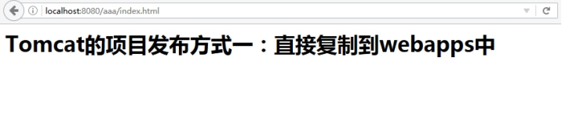 

## 1.7 Tomcat的项目发布方式二

### 1.4.4 部署项目的方式二

这种方式是需要配置Tomcat的虚拟路径。

#### 1.4.4.1 什么虚拟路径

虚拟路径：配置一个名称与一个真实的路径进行绑定，然后访问这个名称从而找到真实路径。

#### 1.4.4.2 如何配置虚拟路径

在tomcat/conf/server.xml中进行配置（可以在tomcat的文档中找到）。

l 第一步:创建一个项目

l 第二步:配置虚拟路径

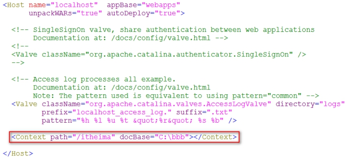 

l 第三步:启动服务器访问

<http://localhost:8080/itheima/index.html>

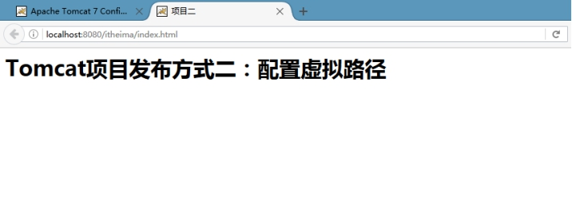 

 

## 1.8 Tomcat的项目发布方式三

### 1.4.5 部署项目方式三

第三种方式也需要配置虚拟路径，第二种需要修改server.xml。server.xml是tomcat的核心配置文件，一旦你修改错了，那么tomcat服务器就会出现问题。推荐使用第三种配置方式。

#### 1.4.5.1 配置虚拟路径

l 第一步：创建web项目

l 第二步：创建一个xml（在tomcat/conf/Catalina/localhost）

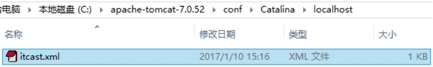 

l 第三步：配置虚拟路径

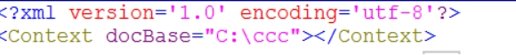 

文件的名称就是虚拟路径（itcast），只需要访问itcast就可以访问C:\ccc这个路径

l 第四步：访问项目

<http://localhost:8080/itcast/index.html>

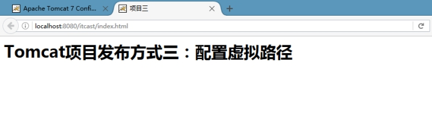 

## 1.5 Eclipse中集成Tomcat

### 1.5.1 Eclipse中配置Tomcat

#### 1.5.1.1 选择Eclipse的服务的配置

l 选择window

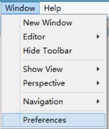 

l 弹出界面选择Server

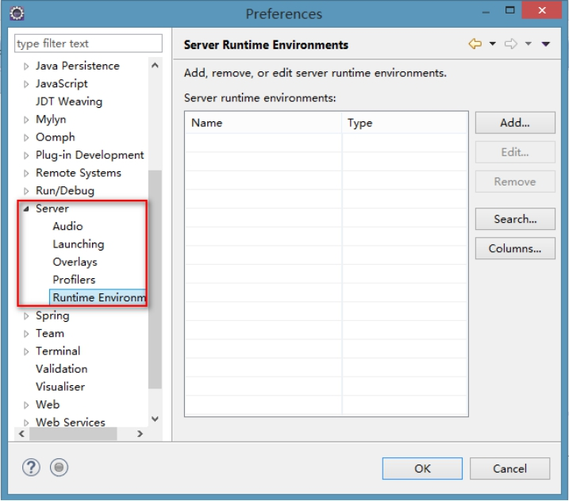 

l 添加服务

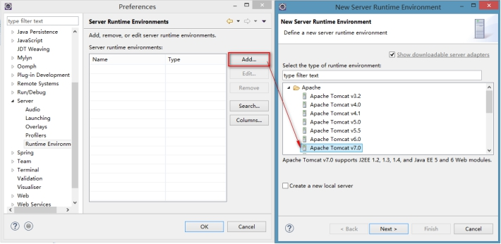 

l 选择Tomcat服务

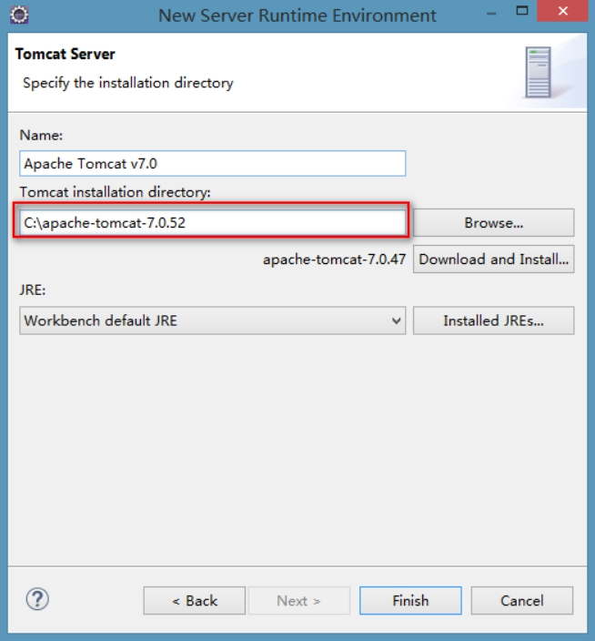 

#### 1.5.1.2 配置服务

l 创建服务

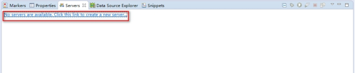 

l 选择服务

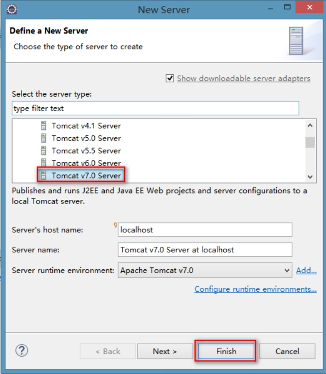 

l 设置服务

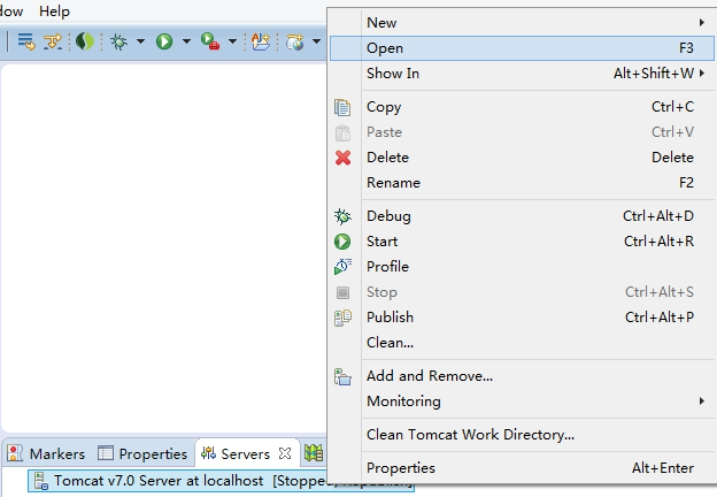 

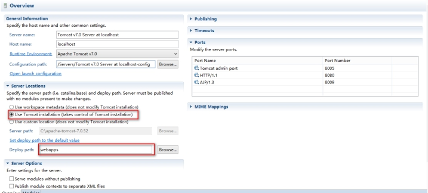 

### 1.5.2 在Eclipse中发布web项目

#### 1.5.2.1 创建一个web项目

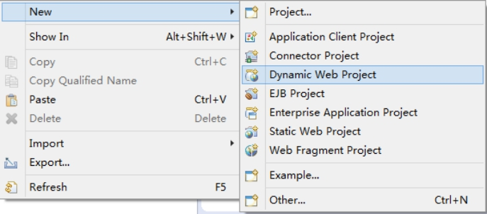 

 

 

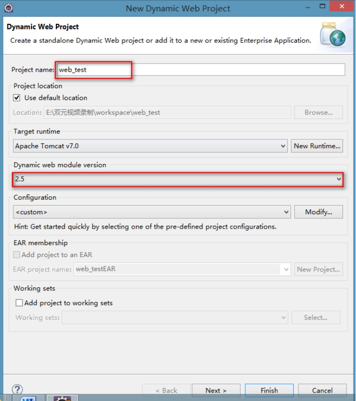 

#### 1.1.1.1 创建页面

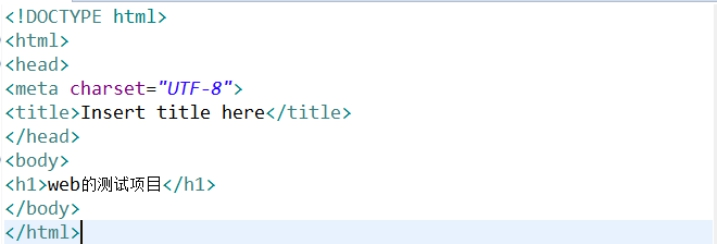 

#### 1.1.1.2 发布项目

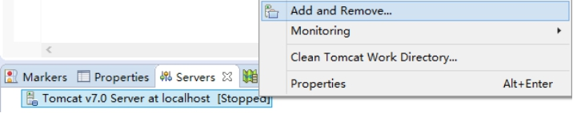 

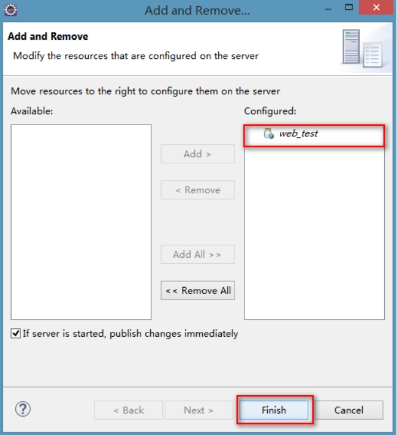 

#### 1.1.1.3 启动Tomcat

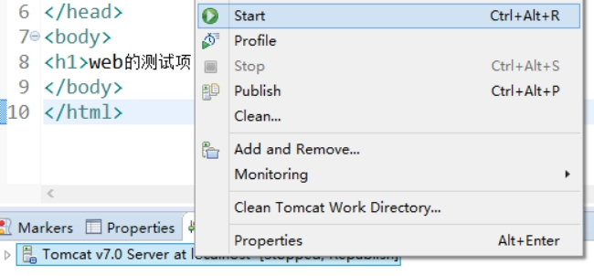 

#### 1.1.1.4 访问项目

<http://localhost:8080/web_test/>

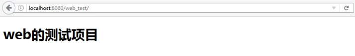 

 

 

## 1.1 Tomcat虚拟主机的配置之网站访问的过程

### 1.1.1 网站访问的全过程

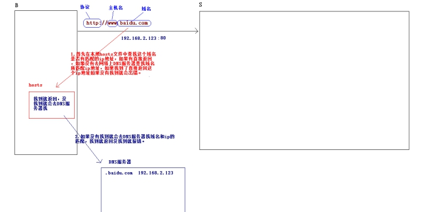 

 

 

## 1.1 Tomcat虚拟主机的配置之虚拟主机的配置

### 1.1.1 虚拟主机的概述

#### 1.1.1.1 什么是虚拟主机

虚拟主机：在电脑上设置一个目录，使用一个名称与该目录进行绑定。这个路径称为是虚拟主机。主机是可以发布web项目的。

### 1.1.2 虚拟主机的配置

#### 1.1.2.1 抓取百度页面

在资料中找到

#### 1.1.2.2 创建一个路径（虚拟主机）

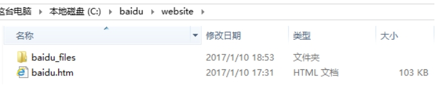 

这里的baidu是虚拟主机的目录，website是项目名称。

#### 1.1.2.3 配置tomcat的虚拟主机

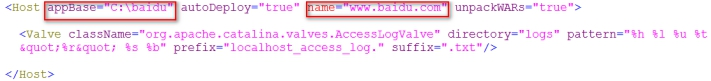 

#### 1.1.2.4 修改本地的hosts文件

找到C:\Windows\System32\drivers\etc\hosts

修改hosts文件

 

#### 1.1.2.5 启动服务器访问项目

<http://www.baidu.com:8080/website/baidu.htm>

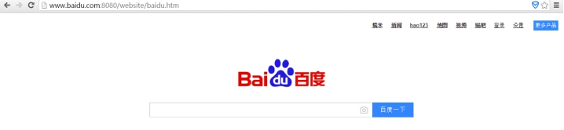 

#### 1.1.2.6 修改端口号

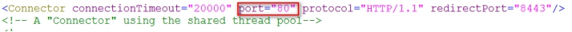 

<http://www.baidu.com/website/baidu.htm>

 

#### 1.1.2.7 将路径中的website去掉

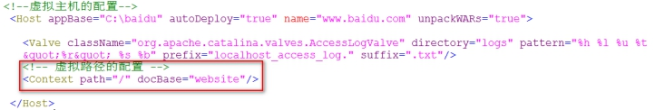 

<http://www.baidu.com/baidu.htm>

 

#### 1.1.2.8 配置默认的首页

在conf/web.xml

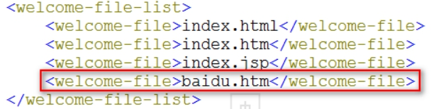 

http://www.baidu.com

 

## 1.6 HTTP协议的概述

### 1.6.1 HTTP协议的概述

#### 1.6.1.1 什么是HTTP协议

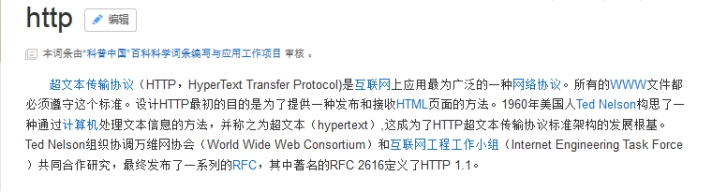 

l HTTP协议：规定了浏览器和服务器端的数据交互的格式

#### 1.6.1.2 HTTP的特性

l 基于请求和响应模型

n 必须要先有请求，后有响应。

n 请求和响应必须成对出现。

l 简单快捷

n 因为发送请求的时候只需要发送请求方式和请求路径即可

#### 1.6.1.3 HTTP的版本

l HTTP1.0	：

l HTTP1.1	：

## 1.7 HTTP协议的抓包分析

### 1.7.1 分析HTTP协议

#### 1.7.1.1 准备工作

l 创建页面

n demo1.html

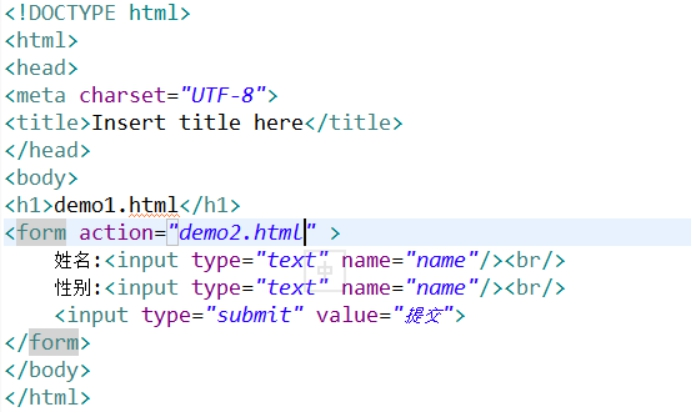 

n demo2.html

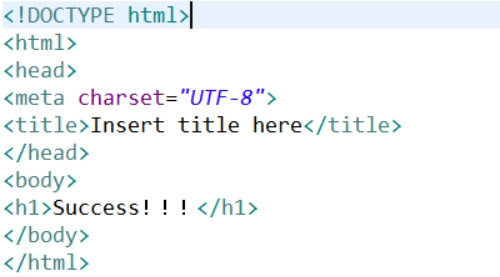 

#### 1.7.1.2 安装HTTPWatch

#### 1.7.1.3 分析HTTP协议

l 请求部分

````properties
***** GET方式的请求
GET /web_test/demo2.html?name=aaa&name=man HTTP/1.1
Accept: text/html, application/xhtml+xml, */*
X-HttpWatch-RID: 9561-10011
Referer: http://localhost:8080/web_test/demo1.html
Accept-Language: zh-CN
User-Agent: Mozilla/5.0 (Windows NT 6.3; WOW64; Trident/7.0; rv:11.0) like Gecko
Accept-Encoding: gzip, deflate
Host: localhost:8080
DNT: 1
Connection: Keep-Alive

***** POST方式的请求
POST /web_test/demo2.html HTTP/1.1
Accept: text/html, application/xhtml+xml, */*
X-HttpWatch-RID: 9561-10041
Referer: http://localhost:8080/web_test/demo1.html
Accept-Language: zh-CN
User-Agent: Mozilla/5.0 (Windows NT 6.3; WOW64; Trident/7.0; rv:11.0) like Gecko
Content-Type: application/x-www-form-urlencoded
Accept-Encoding: gzip, deflate
Host: localhost:8080
Content-Length: 19
DNT: 1
Connection: Keep-Alive
Cache-Control: no-cache

name=bbb&name=woman
````

l 响应部分

````properties
HTTP/1.1 200 OK
Server: Apache-Coyote/1.1
Accept-Ranges: bytes
ETag: W/"151-1484111223984"
Last-Modified: Wed, 11 Jan 2017 05:07:03 GMT
Content-Type: text/html
Content-Length: 151
Date: Wed, 11 Jan 2017 05:14:00 GMT

<!DOCTYPE html>
<html>
<head>
<meta charset="UTF-8">
<title>Insert title here</title>
</head>
<body>
<h1>Success锛侊紒锛?/h1>
</body>
</html>
````

## 1.8 HTTP协议之请求部分

### 1.8.1 请求部分详解

#### 1.8.1.1 请求部分可以分成三块

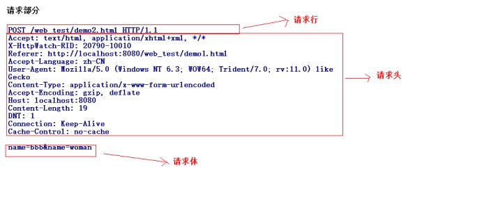 

l 请求行

n 请求方式

u 请求方式有很多种，常用就两种GET和POST。

u GET和POST的区别？

l GET：请求的参数会显示到地址栏。通常是有大小的限制。没有请求体

l POST：请求的参数不会显示到地址栏（在请求体中）。POST没有大小的限制。有请求体（请求参数）。只有表单设置method=”post”才是post请求。

n 请求路径

n 协议版本

l 请求头

n 请求头的格式一般都是一个key对应一个value的，也有一个key对应多个value的情况。

n 记住一些请求头：

u Referer		：代表网页的来源。（防盗链）。

u User-Agent	：获得客户端浏览器类型。

l 请求体

n 只有POST请求方式才有请求体，而且请求体是POST方式请求参数。

 

## 1.9 HTTP协议之响应部分

### 1.9.1 响应部分详解

#### 1.9.1.1 响应部分分成三块内容

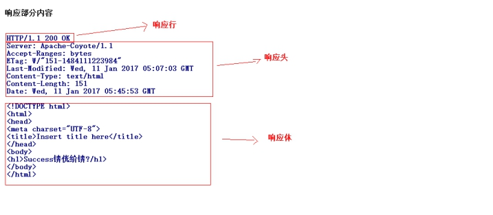 

l 响应行

n 协议版本

n 状态码

u 200	：代表响应成功

u 302	：需要进行重定向操作

u 304	：需要查找本地缓存

u 404	：请求资源不存在

u 500	：服务器内部错误

n 状态码描述

l 响应头

n 通常一个key对应一个value，也有一个key对应多个value。

n 记住响应头：

u Location	：重定向的路径。

u Refresh	：定时刷新。

u Content-Disposition：文件下载的时候使用。

l 响应体

n 就是显示到浏览器上页面的代码。

## 1.10 Servlet的概述

### 1.10.1 Servlet的概述

#### 1.10.1.1 什么是Servlet

Servlet其实就一个运行在web服务器上的小的Java程序，用于处理从web客户端发送的请求，并且对请求作出响应。

#### 1.10.1.2 使用Servlet

l 编写一个Java类实现Servlet的接口

l 配置Servlet

 

## 1.1 Servlet的入门

### 1.1.1 Servlet的入门

#### 1.1.1.1 创建包和类

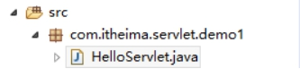 

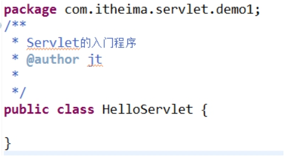 

#### 1.1.1.2 实现Servlet的接口

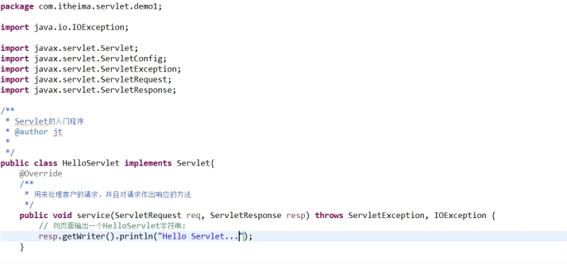 

#### 1.1.1.3 在web.xml中配置这个类

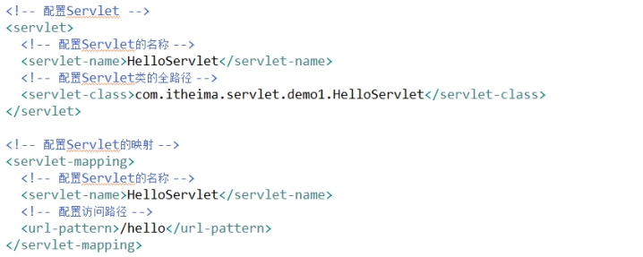 

#### 1.1.1.4 访问Servlet

<http://localhost:8080/web_test/hello>

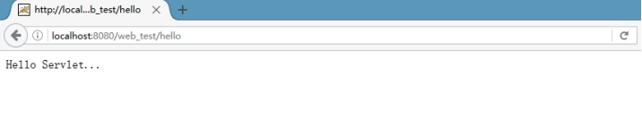 

 

## 1.1 Servlet的执行流程

### 1.1.1 Servlet的执行流程

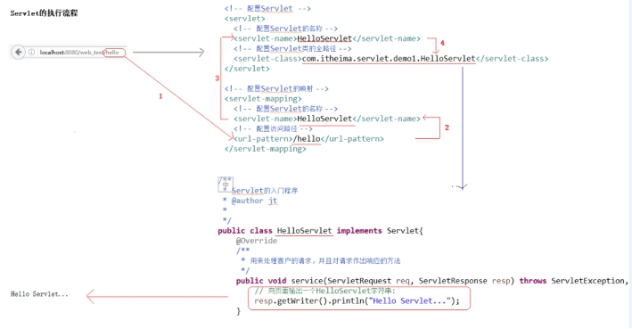 

## 1.1 Servlet的实现关系

### 1.1.1 Servlet的实现关系

#### 1.1.1.1 基本的实现关系

Servlet接口			

​	|

​	|

GenericServlet类		通用的Servlet，是一个与协议无关的Servlet

​	|

​	|

HttpServlet类			Http专用的Servlet

#### 1.1.1.2 关系实现的概述

SUN设计之初，是有野心，以后的互联网不仅仅只使用http协议，可以通过GenericServlet实现。HttpServlet是一个与协议相关的Servlet是专门用来处理HTTP协议的请求。通常编写一个Servlet一般都会让这个Servlet继承HttpServlet重写service方法。

在service方法内部根据请求方式不同执行不同的doXXX的方法（get请求执行doGet方法，如果是post请求就会执行doPost方法）。

所以往往继承了HttpServlet之后不需要重写service方法，只需要重写doGet和doPost方法即可。往往请求要处理的内容的代码都是一致的，所以需要让doGet和doPost相互调用可以简化编程。

 

## 1.1 Eclipse中使用Servlet模板

### 1.1.1 使用Eclipse开发Servlet

#### 1.1.1.1 新建Servlet

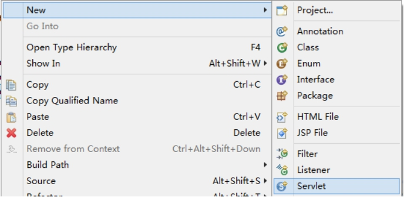 

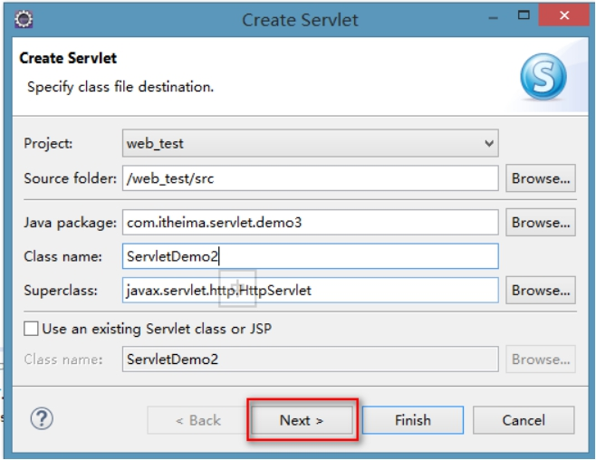 

#### 1.1.1.2 完成Servlet的配置

 

 

 