### 1.1.1 一、学习目标

\1. 阐述servlet生命周期(面试)(掌握)

\2. 能够完成servlet的配置(访问路径/启动时加载)(掌握)

\3. 完成ServletConfig对象API的使用(了解)

\4. 完成ServletContext对象API的使用(掌握)

\5. 应用Response响应对象(掌握)* 

\6. 应用Request请求对象	(掌握)

​	

### 1.1.2 二、 学习指南

\1. servlet生命周期(面试)

\2. servlet的配置(访问路径/启动时加载)

\3. ServletConfig对象API的使用

\4. ServletContext对象API的使用

\5. Response响应对象的使用

\6. Request请求对象的使用

 

## 1.1 Servlet的生命周期

### 1.1.1 Servlet的生命周期概述

#### 1.1.1.1 什么是生命周期

生命周期：一个对象从创建到销毁过程。

#### 1.1.1.2 Servlet的生命周期（\\\*）

Servlet生命周期：Servlet对象从创建到销毁的过程。

l Servlet何时被创建又是何时被销毁的？

Servlet中有init,service,destroy方法，这几个方法称为是Servlet生命周期相关的方法。

l Servlet是在第一次被访问的时候会被实例化，只要Servlet一被实例化那么Servlet中的init方法就会执行（init只会执行一次）。任何一次从客户端发送来的请求，那么Servlet中的service方法就会执行（在service方法的内部根据请求的方式不同调用不同doXXX方法）。当Servlet从服务器中移除或者服务器关闭的时候Servlet对象被销毁，里面的destroy方法就会执行，然后垃圾回收就会将其回收掉。

#### 1.1.1.3 代码演示Servlet的生命周期

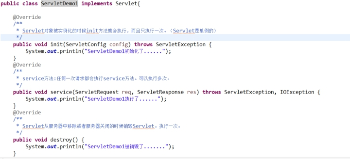 

## 1.1 Servlet的启动时加载

### 1.1.1 为什么使用启动时加载

Servlet对象是第一次被访问的时候会被创建的，init方法就会执行。假设在init方法中做了一些比较耗时的操作（比如：加载了一些配置文件并且解析可能需要花费3秒钟）。第一个用户第一次访问这个Servlet的时候，需要等待3秒钟。如何使第一个用户在第一次访问的时候不需要花费这么长时间？

### 1.1.2 什么是启动时加载

Servlet默认是在第一次访问的时候创建的对象，现在通过一个配置将Servlet的实例化的过程放在服务器启动的时候（让服务器启动的时候创建Servlet的对象）。如果现在这样做那么之前花费的时间就会在服务器启动的时候一起花费掉了。对于用户来讲就不需要额外花费这个时间。

### 1.1.3 配置完成启动时加载

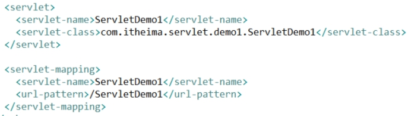 

## 1.2 Servlet的访问路径的配置

### 1.2.1 Servlet中的urlPattern的配置

#### 1.2.1.1 <url-pattern>的配置方式

l 完全路径匹配

n 以 / 开始		比如：/ServletDemo1	/aaa/ServletDemo2

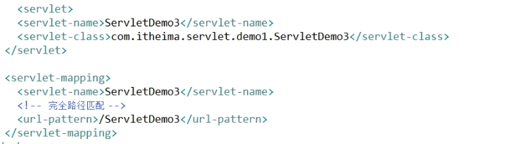 

l 目录匹配

n 以 / 开始，以 /*结束		比如：/*		/aaa/*	/aaa/bbb/*

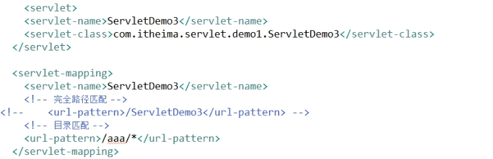 

l 扩展名匹配

n 不能以 / 开始，以*开始		比如：*.action	*.do		*.jsp

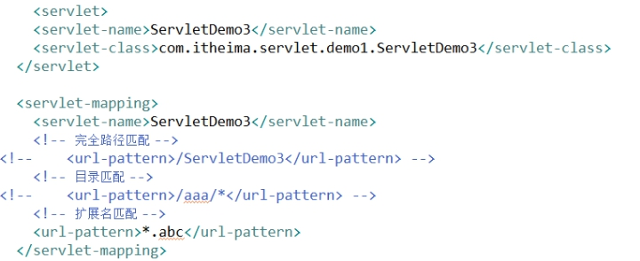 

#### 1.2.1.2 访问的优先级：

完全路径匹配  >  目录匹配  >  扩展名匹配

## 1.3 ServletConfig对象

### 1.3.1 ServletConfig对象的概述

ServletConfig用来获得Servlet的相关的配置的对象。

#### 1.3.1.1 获得ServletConfig对象

 

#### 1.3.1.2 ServletConfig对象的API

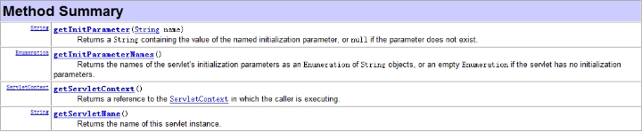 

l 获得Servlet的初始化参数

l 获得ServletContext对象

l 获得Servlet的名称

#### 1.3.1.3 演示ServletConfig的API

l 配置初始化参数

n 配置	

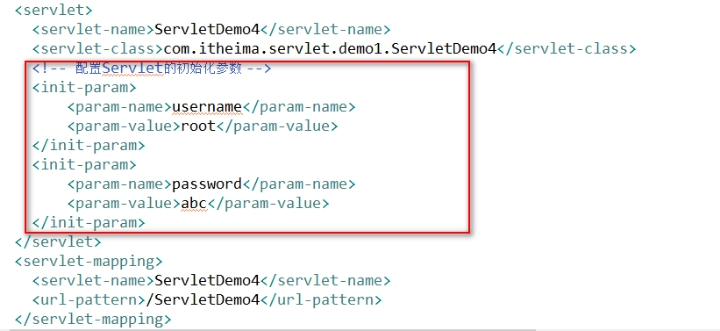 

n 实现

 

 

## 1.4 ServletContext对象之获取web项目信息

### 1.4.1 ServletContext对象概述

#### 1.4.1.1 什么是ServletContext

ServletContext：Servlet的上下文对象。ServletContext对象对Servlet之前和之后的内容都知道。这个对象一个web项目只有一个。在服务器启动的时候为每个web项目创建一个单独的ServletContext对象。

### 1.4.2 ServletContext对象的作用

#### 1.4.2.1 作用一：用来获取web项目信息

因为一个web项目只有一个ServletContext对象，所以这个对象对整个项目的相关内容都是了解的。

l 方法：

n 获取文件的MIME类型：

 

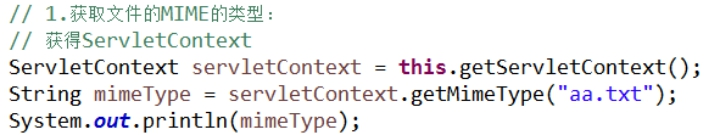 

n 获取web项目请求工程名：

 

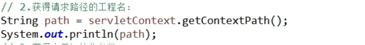 

n 获取web项目的初始化参数：

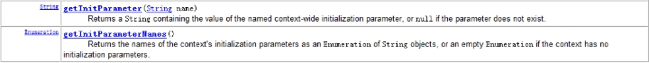 

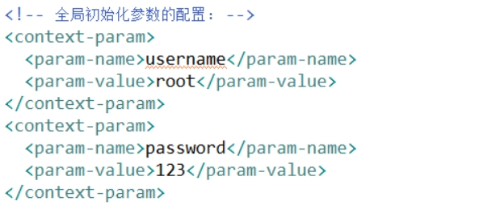 

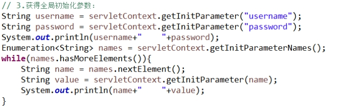 

## 1.1 ServletContext对象之读取web项目下文件

### 1.1.1 ServletContext对象的作用

#### 1.1.1.1 作用二：读取web项目下的文件

之前使用IO流就可以读取文件（java项目中）。现在是一个web项目，web项目需要发布到tomcat下才能访问的。获取web项目下的文件如果使用传统的IO就会出现问题（原因：路径中使用的是相对路径，相对的是JRE环境）。

#### 1.1.1.2 读取文件的代码实现

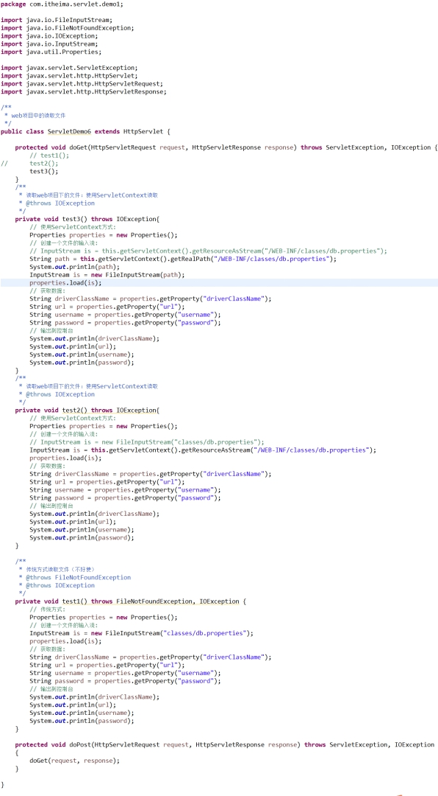 

 

## 1.5 ServletContext对象之作为域对象存取数据

### 1.5.1 域对象概述

#### 1.5.1.1 什么是域对象

域对象：指的是将数据存入到域对象中，这个数据就会有一定的作用范围。域指的是一定的作用范围。

### 1.5.2 ServletContext作为域对象

#### 1.5.2.1 ServletContext作为域对象的API

l 存入数据的方法：

 

l 获取数据的方法：

 

l 移除数据的方法：

 

#### 1.5.2.2 ServletContext作为域对象的作用范围

ServletContext是在服务器启动的时候为每个web项目单独创建一个ServletContext对象。当web项目从服务器中移除，或者是关闭服务器的时候ServletContext对象会被销毁。向ServletContext中保存的数据一直存在（当服务器关闭的时候ServletContext对象被销毁，然后里面数据才会失效）。范围：整个web应用。

### 1.5.3 ServletContext域对象代码演示

#### 1.5.3.1 代码演示

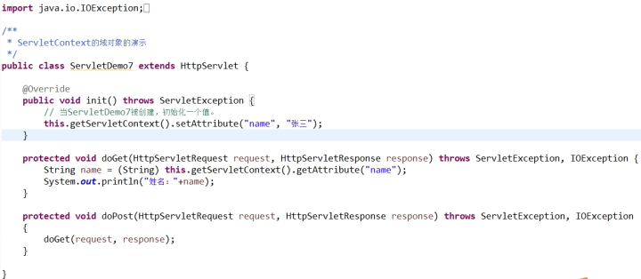 

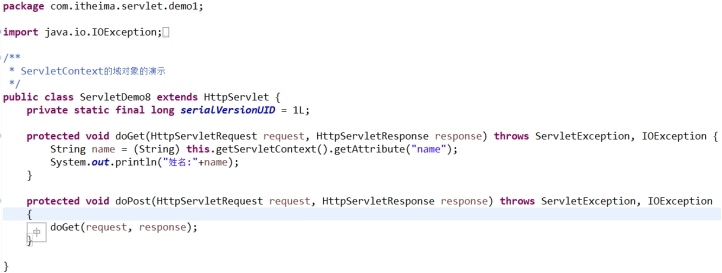 

 

## 1.1 Response对象的概述

### 1.1.1 Response对象的概述

#### 1.1.1.1 什么是Response

开发的软件是B/S结构的软件，可以通过浏览器访问服务器的软件。从浏览器输入一个地址访问服务器（将这个过程称为是请求）。服务器接收到请求，需要进行处理，处理以后需要将处理结果显示回浏览器端（将这个过程称为是响应）。

#### 1.1.1.2 画图说明Response对象

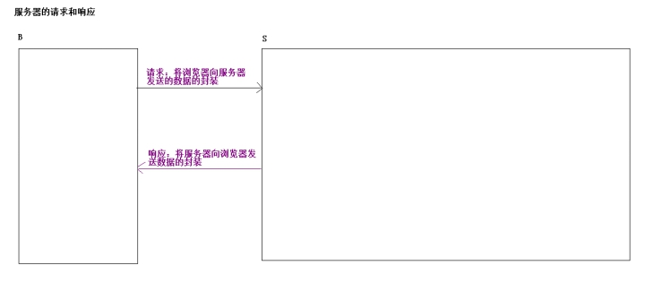 

## 1.6 Response对象的API

### 1.6.1 Response对象的API

#### 1.6.1.1 Response关于响应行的方法

 

l 设置响应的状态码

n 200 正确

n 302 重定向

n 304 查找本地缓存

n 404 请求资源不存在

n 500 服务器内部错误

#### 1.6.1.2 Response关于响应头的方法

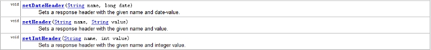 

l set开头的方法：针对一个key对应一个value的情况。

n 举例：比如有一个头 content-Type:text/html  setHeader(“content-Type”,”text/plain”);

n 最终得到头的结果：content-Type:text/plain

 

l add开头的方法：针对一个key对应多个value的情况。

n 举例：比如有一个content-Type:text/html	  addHeader(“content-Type”,”text/plain”);

n 最终得到头的结果：content-Type:text/html,text/plain

#### 1.6.1.3 Response关于响应体的方法

 

#### 1.6.1.4 Response其他的API

 

l 重定向的方法

 

l 设置浏览器打开页面时候采用的字符集

 

l 设置响应字符流的缓冲区字符集

 

l 服务器向浏览器回写Cookie的方法

## 1.7 Response对象的API的代码演示

### 1.7.1 Response对象API的代码演示

#### 1.7.1.1 设置状态码

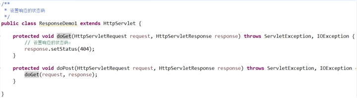 

#### 1.7.1.2 完成重定向

重定向：302状态码和Location响应头结合使用的效果。

 

l 实际开发中可以使用

response.sendRedirect(“/web01/ResponseDemo2”);替换重定向两句写法

#### 1.7.1.3 定时刷新效果

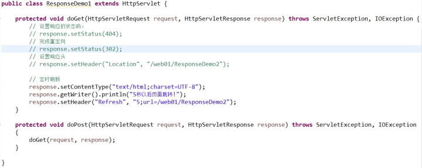 

 

## 1.8 页面定时跳转的扩展

### 1.8.1 使用JS完成读秒的效果

#### 1.8.1.1 在HTML中完成页面跳转

l 多学一招：

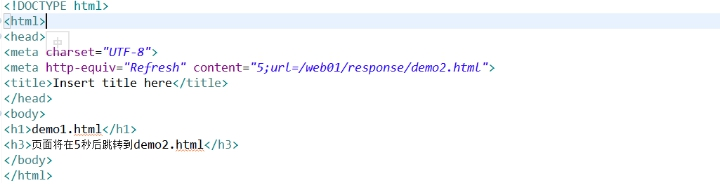 

#### 1.8.1.2 使用JS完成读秒效果

```html
<meta http-equiv="Refresh" content="5;url=/web01/response/demo02.html">

<title>Insert title here</title>
</head>
<body onload="load()">
<h1>demo.html</h1>
<h3>页面将在秒<span id="sp">5</span>后跳转到demo.html</h3>
<script type="text/javascript">
	var i = 5;
	function load(){
		window.setInterval("changeSeconds()", 1000);
	}
	function changeSeconds(){
		i--;
		document.getElementById("sp").innerHTML=i;
	}
</script>
</body>
```


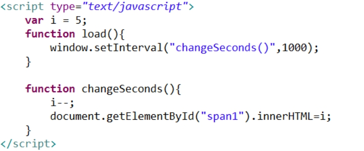 

## 1.9 Response对象响应的中文乱码处理

### 1.9.1 Response向页面响应中文

#### 1.9.1.1 使用字节流响应中文

l 编写代码

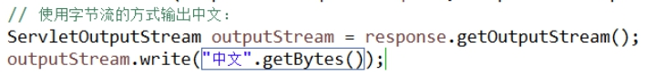 

*\\******使用上述代码向页面输出中文是否会有乱码？

- 不一定
  - 其实这个乱码的产生与中文转成字节数组及浏览器打开方式（打开的时候采用的默认字符集）有关

- 解决：
  - 将中文转成字节数组的时候和浏览器默认打开的时候采用的字符集一致即可。

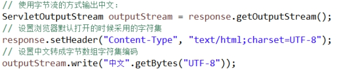 

 

#### 1.9.1.2 使用字符流响应中文

l 编写代码

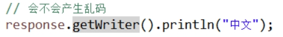 

*\\*使用上述代码向页面输出中文是否会产生乱码？

l 一定乱码

n 原因：

u 字符流是有缓冲区的，response获得字符流，response设计默认的缓冲区编码是ISO-8859-1。这个字符集不支持中文的。

n 解决：

u 设置response获得字符流缓冲区的编码和设置浏览器默认打开时候采用的字符集一致即可。

字符流向页面响应中文，有一种简化的方式：

 

 

## 1.10 Request对象的概述及API的介绍

### 1.10.1 Request对象的概述

#### 1.10.1.1 什么是Request对象

开发的软件都是B/S结构软件，从浏览器向服务器提交一些数据，将这些内容进行封装就封装成了一个请求对象（Request对象）。

### 1.10.2 Request对象的API

#### 1.10.2.1 获得客户机信息

 

l 获得请求的方式

 

l 获得请求路径后的提交参数的字符串

 

l 获得请求路径的URL和URI

 

l 获得客户机的IP地址

#### 1.10.2.2 获得请求头的方法

 

l 获得一个key对应一个value的请求头

 

l 获得一个key对应多个value的请求头

#### 1.10.2.3 获得请求参数的方法

 

l 获得提交的参数（一个name对应一个value）

 

l 获得提交的参数（一个name对应多个value）

 

l 获得提交的参数，将提交的参数的名称和对应的值存入到一个Map集合中

#### 1.10.2.4 Request作为域对象存取数据的方法

 

l 向request域中存数据

 

l 从request域中获取数据

 

l 从request域中移除数据

## 1.11 Request对象的API的代码演示

### 1.11.1 Request对象的API的代码演示

#### 1.11.1.1 Request对象获取客户机信息

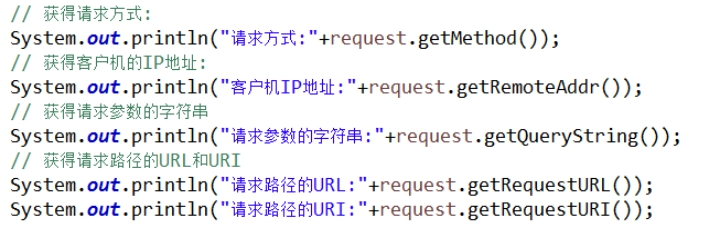 

#### 1.11.1.2 Request获得请求头的信息

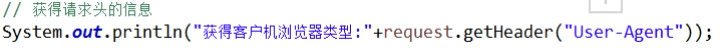 

## 1.1 Request对象接收表单请求参数

### 1.1.1 Request对象接收表单请求参数

#### 1.1.1.1 编写一个静态页面

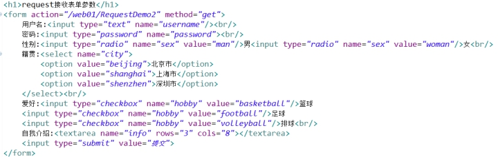 

#### 1.1.1.2 接收请求参数

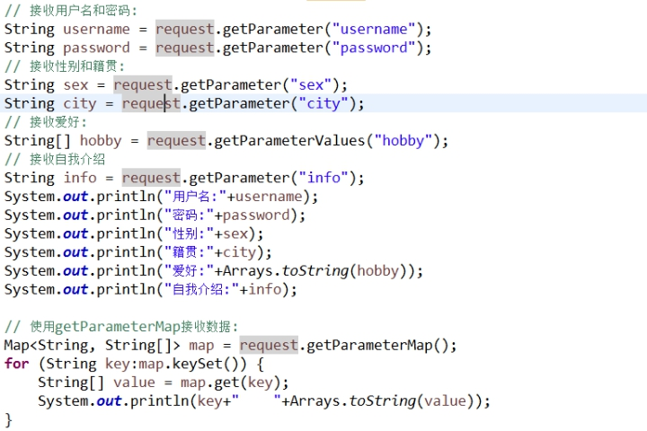 

## 1.1 Request对象接收表单请求参数的中文乱码处理

### 1.1.1 Request对象接收中文数据

#### 1.1.1.1 POST方式接收中文

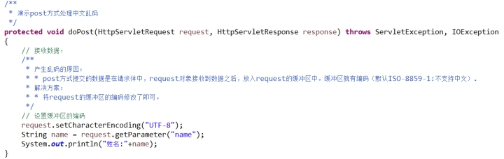 

#### 1.1.1.2 GET方式接收中文

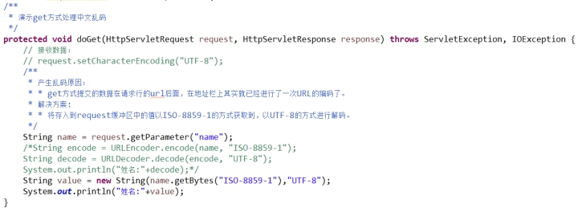 

 

 