## 1.1 JSP的概述

### 1.1.1 JSP的概述

#### 1.1.1.1 什么是JSP

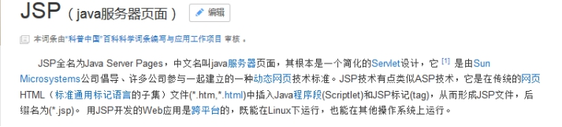 

JSP：Java Server Pages (Java服务器端页面)，其实就在HTML中嵌入Java代码。

#### 1.1.1.2 为什么学习JSP

SUN公司提供了动态网页开发技术：Servlet。Servlet自身有一些缺点，SUN公司发现了这些问题，推出了一个新的动态网页开发技术JSP。

Servlet的缺点：

- Servlet需要进行配置，不方便维护

- Servlet很难向网页中输出HTML页面内容

 

## 1.2 JSP的运行原理

### 1.2.1 JSP的简单使用

#### 1.2.1.1 创建一个JSP页面

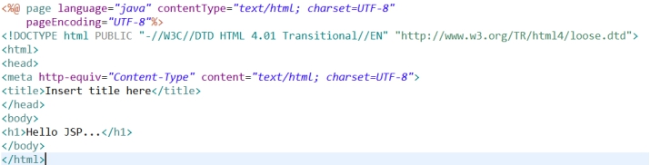 

#### 1.2.1.2 运行JSP

JSP需要发布到服务器中才可以运行的。

- 发布项目到Tomcat中

- 访问JSP页面

 

### 1.2.2 JSP的运行原理

#### 1.2.2.1 JSP的运行原理分析

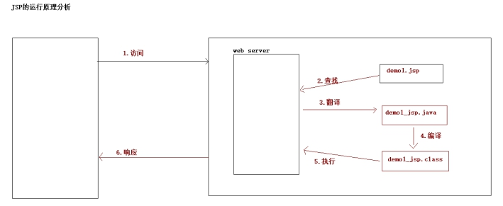 

JSP文件翻译成Java文件，将这个Java文件编译生成class文件，运行class文件。

## 1.3 JSP的脚本元素

### 1.3.1 JSP的脚本元素概述

#### 1.3.1.1 什么是JSP的脚本元素

JSP = HTML + Java代码 + JSP自身东西

JSP的脚本元素就是在JSP中嵌入Java代码。

### 1.3.2 JSP的脚本元素的分类

#### 1.3.2.1 声明标签

- 语法：
  -  <%! 变量或方法声明 %>

  -  写在这个脚本中的代码，翻译成Servlet内部的成员变量或成员方法。

- 用法：

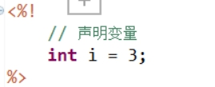 

#### 1.3.2.2 表达式标签

- 语法：

  -  <%= 表达式 %>

  -  写在这个脚本中的代码，翻译成方法内部的out.print();当中的内容。

- 用法：

 

#### 1.3.2.3 程序代码标签

- 语法：

  -  <% 程序代码 %>

  -  写在这个脚本中的代码，翻译成方法内部的局部变量或方法内部代码片段。

- 用法：

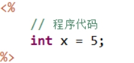 

## 1.1 JSP的开发模式之MVC模式

### 1.1.1 JSP开发模式

#### 1.1.1.1 动态网页开发模式的发展

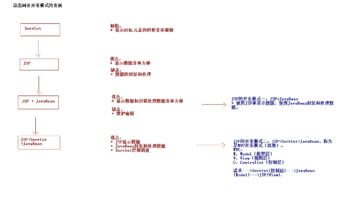 

## 1.4 开发中的路径问题

### 1.4.1 路径问题描述

#### 1.4.1.1 什么时候会遇到路径问题

提供一些页面，在页面中会提供链接或者表单，当点击链接或者表单的时候需要进行提交，提交到Servlet中。从页面向Servlet发送请求的地址（路径）应该如何编写。

### 1.4.2 路径的分类

#### 1.4.2.1 相对路径

- 相对路径的写法：
  - 相对路径不是以 / 开头的。

- 相对路径的使用：

  -  在跟路径下的页面访问Servlet

demo2.jsp的访问路径：

<http://localhost:8080/web02/demo2.jsp>

ServletDemo1的访问路径：

<http://localhost:8080/web02/ServletDemo1>

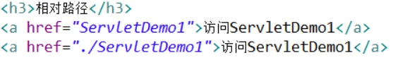 

 

  -  在某个目录下的页面访问Servlet

demo2.jsp的访问路径：

​	<http://localhost:8080/web02/demo2/demo2.jsp>

ServletDemo1的访问路径：

<http://localhost:8080/web02/ServletDemo1>

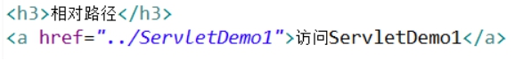 

 

#### 1.4.2.2 绝对路径（通常）

- 绝对路径的写法：

  -  通常以 / 开始的路径

使用绝对路径，不需要关心当前文件和要请求的文件的相对位置的关系！！！

- 注意：

  -  绝对路径分成服务器端路径和客户端路径

  -  客户端路径  需要带工程名

  -  服务器端路径 不需要带工程名

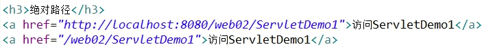 

## 1.1 案例需求介绍

### 1.1.1 案例需求

#### 1.1.1.1 案例需求描述

提供登录页面，用于用户登录（用户名和密码需要查询数据库）。如果登录失败，需要回到登录页面（给出提示信息）。如果登录成功，页面进行跳转，在成功页面上显示登录成功的总人数。

#### 1.1.1.2 案例流程分析

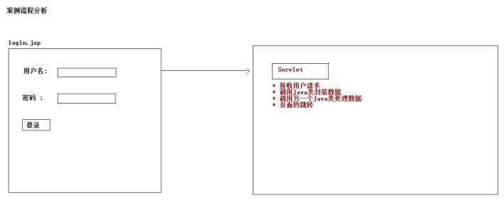 

## 1.5 Request作为域对象存取数据

### 1.5.1 Request作为域对象

#### 1.5.1.1 Request作为域对象的API

- 向Request域中保存数据

 

- 从Request域中获取数据

 

- 从Request域中移除数据

 

#### 1.5.1.2 Request作为域对象作用范围

Request对象其实就是从客户端浏览器向服务器发送的一次请求信息的封装。那么实质上向Request中所保存的数据有效期也是一次请求范围。

一次请求范围：从客户端浏览器向服务器发送一次请求，服务器针对这次请求对浏览器作出响应。当服务器作出响应之后，请求对象就销毁了，保存在其中的数据就无效了。

## 1.1 请求转发和重定向完成页面跳转

### 1.1.1 请求转发

#### 1.1.1.1 请求转发的写法

通过ServletRequest对象获得RequestDispatcher对象。

 

再根据RequestDispatcher中的方法进行请求转发。

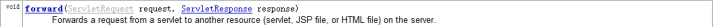 

#### 1.1.1.2 请求转发的代码实现

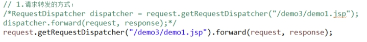 

#### 1.1.1.3 请求转发的效果

 

### 1.1.2 重定向

#### 1.1.2.1 重定向的写法

通过HttpServletResponse对象中的以下方法实现重定向

 

#### 1.1.2.2 重定向的代码实现

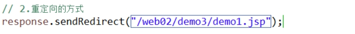 

#### 1.1.2.3 重定向的效果

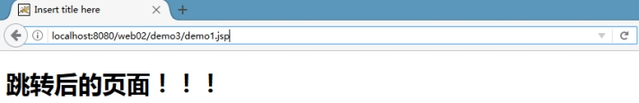 

## 1.6 请求转发和重定向区别

### 1.6.1 请求转发和重定向区别

#### 1.6.1.1 请求转发和重定向原理

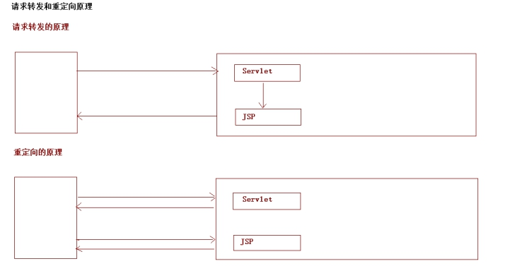 

#### 1.6.1.2 请求转发和重定向区别总结

- 请求转发是一次请求一次响应，而重定向是两次请求两次响应。

- 请求转发地址栏不会变化的，重定向地址栏发生变化。

- 请求转发路径不带工程名，重定向需要带工程名路径。

- 请求转发只能在本网站内部，重定向可以定向到任何网站。

#### 1.6.1.3 代码演示请求转发和重定向区别

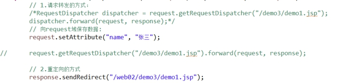 

- 注意：

如果需要使用request进行值传递，需要通过请求转发完成。如果页面需要跳转到其他网站上必须使用重定向。

## 1.1 案例准备-MVC的准备

### 1.1.1 MVC在案例中的应用

#### 1.1.1.1 MVC如何在案例中应用

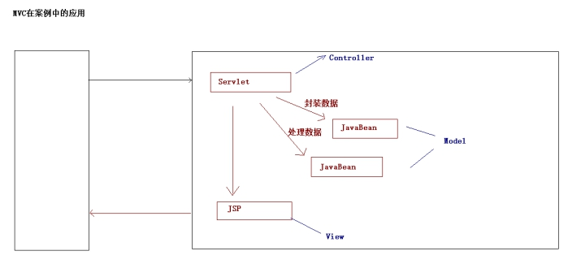 

## 1.1 案例准备-创建数据库

### 1.1.1 创建数据库

#### 1.1.1.1 建表语句

```sql
create database web02_login;
use web02_login;
create table user(
	uid int primary key auto_increment,
	username varchar(20),
	password varchar(20),
	nickname varchar(20)
);

insert into user values (null,'zs','123','张三');
insert into user values (null,'ls','123','李四');
insert into user values (null,'ww','123','王五');
```

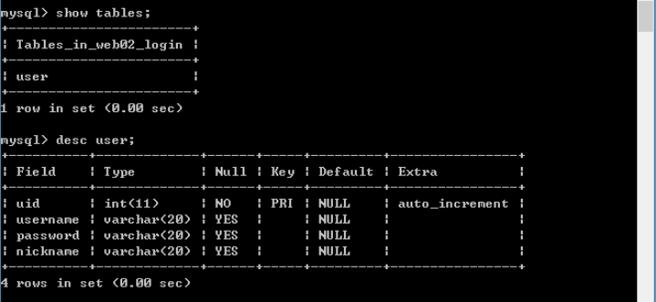 

 

## 1.1 案例准备-项目环境搭建

### 1.1.1 项目环境搭建

#### 1.1.1.1 创建web项目

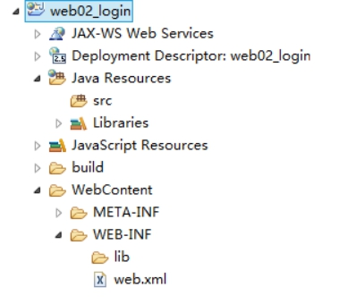 

#### 1.1.1.2 创建相关的包结构

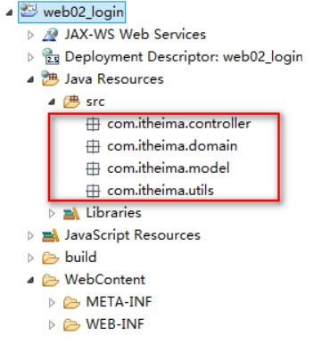 

## 1.7 案例准备-引入相关资源

### 1.7.1 引入相关资源

#### 1.7.1.1 引入相关的jar包：

- MySQL数据库驱动包

- C3P0连接池所需jar包

- DBUtils开发的jar包

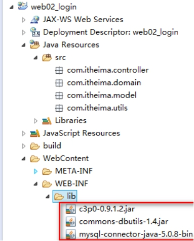 

#### 1.7.1.2 引入C3P0配置文件

将配置文件放到工程的src下即可

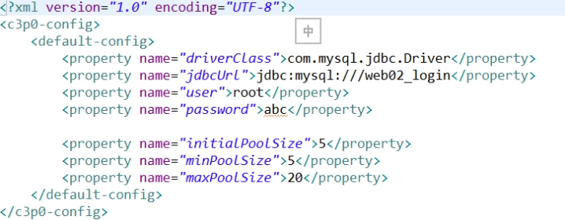 

## 1.1 案例准备-创建登录页面

### 1.1.1 创建登录页面

#### 1.1.1.1 登录页面实现

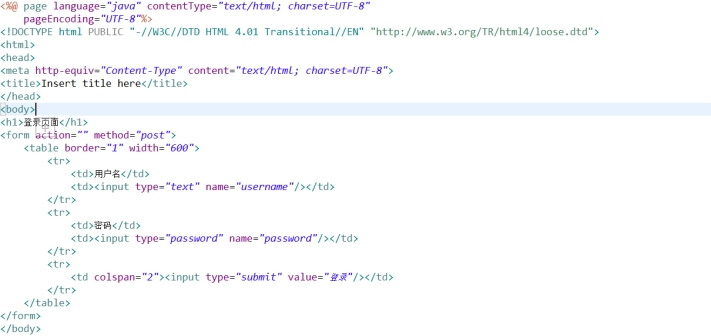 

#### 1.1.1.2 登录页面效果

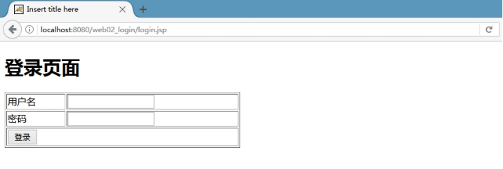 

 

#### 1.1.1.3 引入JDBC开发的工具类

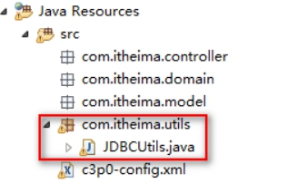 

## 1.8 案例代码-登录代码实现

### 1.8.1 登录代码实现

#### 1.8.1.1 登录代码实现流程

登录页面（login.jsp）à登录的Servlet（LoginServlet），在这个Servlet中需要接收数据，将这个数据封装到一个JavaBean中，调用另一个JavaBean处理数据。根据处理结果进行页面跳转。

#### 1.8.1.2 登录代码实现

- 第一步：在controller包下创建LoginServlet

- 第二步：在domain下创建一个User类

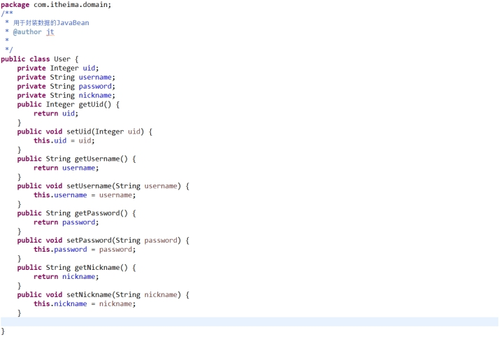 

- 第三步：在model包下创建一个UserModel类

在这个类中提供一个login的方法

- 第四步：根据处理结果进行页面跳转

#### 1.8.1.3 登录的Servlet的业务代码

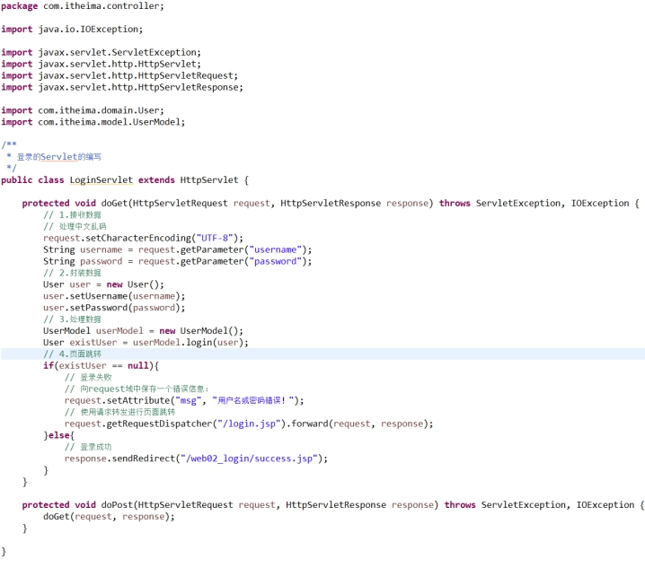 

## 1.1 案例代码-登录代码底层代码

### 1.1.1 登录底层代码

#### 1.1.1.1 处理数据部分代码

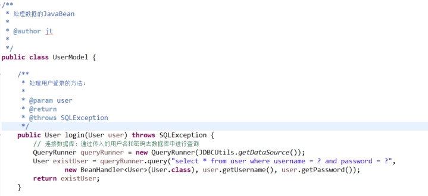 

## 1.1 案例代码-登录代码错误信息的回显

### 1.1.1 登录代码错误信息回显

#### 1.1.1.1 错误信息回显代码

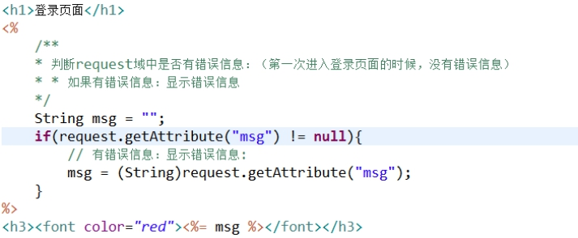 

#### 1.1.1.2 错误信息显示效果

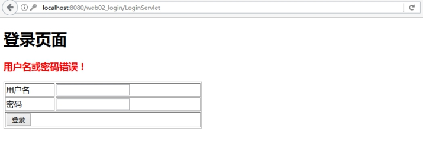 

## 1.1 案例代码-记录登录成功人数分析

### 1.1.1 记录登录成功的人数分析

#### 1.1.1.1 画图分析

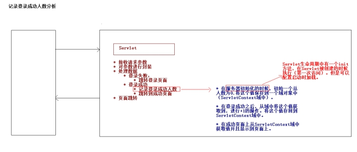 

## 1.9 案例代码-记录登录成人数代码实现

### 1.9.1 记录登录成功人数的代码

#### 1.9.1.1 完成初始化操作

- 在服务器启动的时候初始化一个值为零，将这个值存入到ServletContext域中。

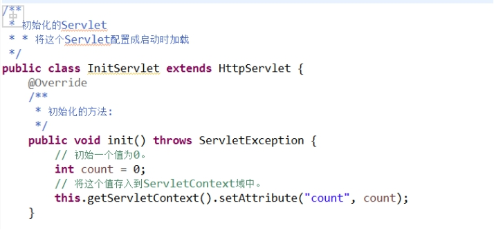 

- 将这个Servlet配置成启动时加载

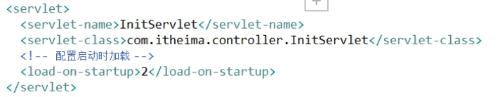 

#### 1.9.1.2 记录登录成功的人数

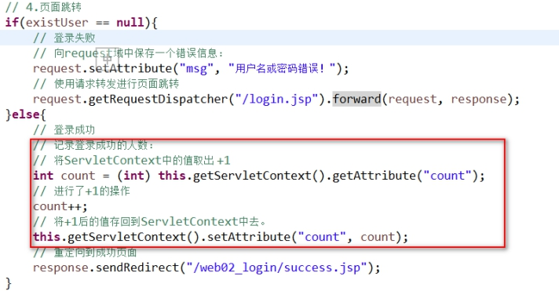 

#### 1.9.1.3 在登录成功页面上显示总人数

 

 

