## 会话技术的概述

### 1.1.1 会话技术的概述

#### 1.1.1.1 什么是会话

会话简单理解为：用户打开一个浏览器，点击多个超链接访问服务器的web资源，然后关闭浏览器，整个过程称为是一次会话。

#### 1.1.1.2 为什么要学习会话

每个用户与服务器进行交互过程中，产生一些各自的数据，程序想要把这些数据进行保存，就需要使用会话技术。

例如：用户点击超链接购买一个商品，程序应该保存用户所购买的商品，以便于用户点击结账可以得到用户所购买的商品信息。

思考：用户购买的商品保存在request或ServletContext中是否可以？

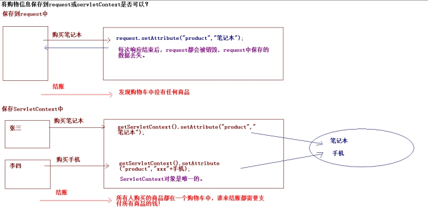 

## 1.1 会话技术的实现原理

### 1.1.1 会话技术分类

#### 1.1.1.1 Cookie技术

Cookie是客户端技术，程序把每个用户的数据以cookie的形式保存到各自浏览器中。当用户使用浏览器再次访问服务器中的web资源的时候，就会带着各自的数据过去。这样，web资源处理的就是用户各自的数据了。

#### 1.1.1.2 Session技术

Session是服务器端技术，利用这个技术，服务器在运行时为每一个用户的浏览器创建一个独享的session对象。由于session为用户浏览器独享，所有用户在访问服务器的时候，可以把各自的数据放在各自的session中，当用户再次访问服务器中的web资源的时候，其他web资源再从用户各自的session中取出数据为用户服务。

### 1.1.2 会话技术的实现原理

#### 1.1.2.1 Cookie的实现原理

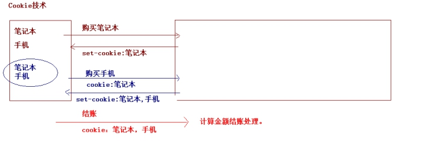 

#### 1.1.2.2 Session的实现原理

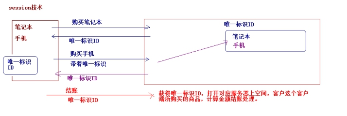 

## 1.1 记录用户上次访问时间的分析

### 1.1.1 记录用户上次访问时间分析

1. 第一次登录网页,需要创建一个指定名称的cookie,并且往cookie中存储当前系统时间

2. 不是第一次登录网页,浏览器就会携带所有的cookie到服务器,那么就需要找出存储时间的cookie,取出cookie里面存储的时间,把取出的时间设置到响应里面,再获取系统当前时间用来覆盖cookie中之前存储的时间,把cookie回写到浏览器

#### 1.1.1.1 分析需求和流程

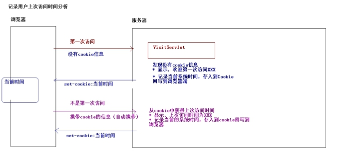 

## 1.1 记录用户上次访问时间的代码实现

### 1.1.1 Cookie的简单的使用

#### 1.1.1.1 获得从浏览器带过来的Cookie

通过HttpServletRequest对象中的方法：

 

#### 1.1.1.2 向浏览器回写Cookie

通过HttpServletResponse对象中的方法：

 

#### 1.1.1.3 Cookie的构造

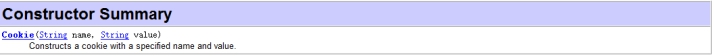 

### 1.1.2 案例代码实现

#### 1.1.2.1 创建一个web项目

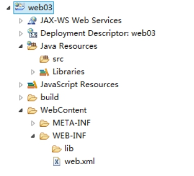 

#### 1.1.2.2 创建包结构

 

#### 1.1.2.3 代码实现

- 编写工具类

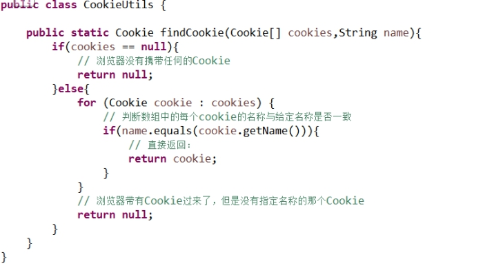 

- 编写Servlet

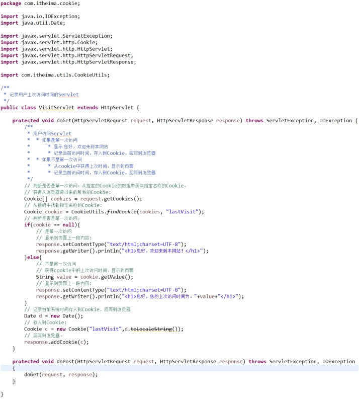 

## 1.1 Cookie的分类

### 1.1.1 案例存在问题

#### 1.1.1.1 问题描述

用户访问Servlet，记录用户的上次访问时间。但是如果用户将浏览器关闭，重新打开浏览器访问程序，程序就会把其当成是第一次访问：（显示，您好，欢迎来到本网站）。

### 1.1.2 Cookie的分类

#### 1.1.2.1 默认级别的Cookie

指的是没有设置有效时间的Cookie，默认的情况下只要关闭了浏览器，Cookie也会被销毁。（Cookie存在于浏览器的内存中，当关闭了浏览器Cookie就销毁了）。

#### 1.1.2.2 持久级别的Cookie

指的是有有效时间的Cookie，这种Cookie的内容不是保存在浏览器的内存中，将Cookie的内容保存（持久化）到硬盘上。这个时候，关闭浏览器，再次打开浏览器会加载硬盘上的文件，从而Cookie中的数据就不会丢失。

## 1.2 Cookie的API的概述

### 1.2.1 Cookie的API的概述

#### 1.2.1.1 构造方法

 

- Cookie(String name,String value);

#### 1.2.1.2 其他的方法

- 获得Cookie的名称的方法

 

- 获得Cookie的值的方法

 

- 设置Cookie的有效域名

 

- 设置Cookie的有效路径

 

- 设置Cookie的有效时长

 

### 1.2.2 代码改进

#### 1.2.2.1 案例问题解决

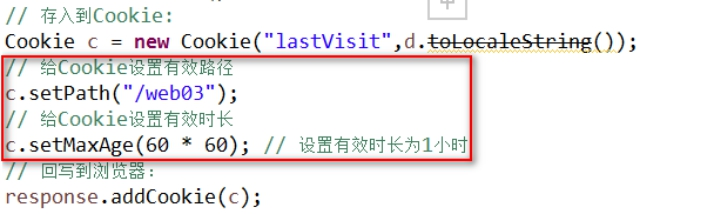 

 

## 1.3 Cookie的使用细节

### 1.3.1 Cookie的使用细节

#### 1.3.1.1 Cookie的使用细节总结

- 一个Cookie只用标识一种信息，至少含有一个标识该信息的名称和值。

- 一个web站点可以给一个浏览器发送多个Cookie。一个web浏览器可以存储多个web站点的Cookie。

- 浏览器一般只允许存放300个Cookie，每个站点最多可以存放20个Cookie，每个Cookie的大小限制为4KB（老版本浏览器）。-----浏览器存放的Cookie的大小和个数是有限制的。

- 如果创建了一个Cookie，并发送到浏览器，默认情况下它是一个会话级别的Cookie。用户退出浏览器就被删除。如果希望将这个Cookie存到磁盘上，需要设置有效时长调用setMaxAge(int maxAge)方法，以秒为单位的。

- 需要手动删除持久性Cookie，可以将Cookie的有效时长设置为0.必须注意：删除Cookie时候，path必须一致，否则无法删除。

## 1.4 Session的概述

### 1.4.1 Session的概述

#### 1.4.1.1 什么是Session

Session称为是一次会话，Cookie将用户产生的私有的数据保存到浏览器端，Session将用户产生的私有的数据保存到服务器端。注意：一个浏览器独占一个session对象。因此，在需要保存用户数据时候，服务器程序可以将用户数据写到session对象中，当用户使用浏览器访问其他程序时，其他程序可以从用户的session中取出该用户的数据，为用户服务。

#### 1.4.1.2 为什么有Cookie还要有Session

- Cookie局限性：
  - Cookie保存的数据是有个数和大小的限制的。

  - 数据是保存客户端浏览器上（相对不是很安全）。

- Session

  - Session没有个数和大小限制。

  - 数据是保存在服务器上（相对比较安全）。

#### 1.4.1.3 Session如何保存用户数据

Session对象由服务器创建，开发人员可以调用request对象的getSession方法得到Session对象。

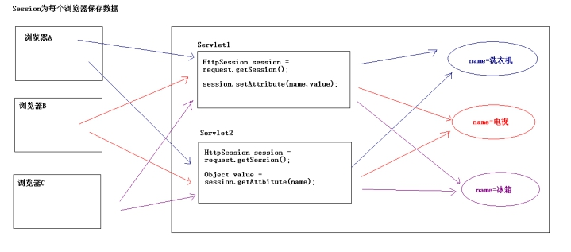 

## 1.5 Session的实现原理

### 1.5.1 Session的实现原理

#### 1.5.1.1 Session的实现原理分析

- 服务器是如何实现一个session为一个用户浏览器服务的？

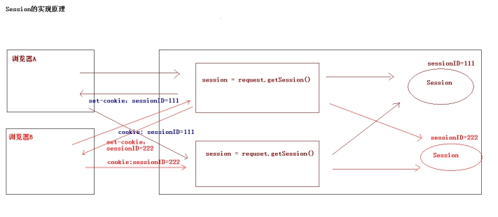 

Session的实现原理：

- 基于Cookie的，基于Cookie回写了一个Session的ID。

## 1.6 Session作为域对象存取数据

### 1.6.1 Session作为域对象

#### 1.6.1.1 Session作为域对象的API

- 向session中存入数据

 

- 从session域中获取数据

 

- 从session域中移除数据

 

#### 1.6.1.2 Session作为域对象的作用范围

Session作为域对象，作用范围就是一次会话的范围。一次会话，指的是用户打开浏览器点击多个超链接，访问服务器资源，到最后关闭浏览器的过程。

## 1.7 Servlet的数据访问范围的总结

### 1.7.1 Servlet的域对象的总结

#### 1.7.1.1 请求范围（ServletRequest）

- 何时创建和销毁的

  - 创建：当用户向服务器发送一次请求，服务器创建一个request对象。

  - 销毁：当服务器对这次请求作出了响应，服务器就会销毁这个request对象。

- 如何存取数据

  - 存数据：

    - void setAttribute(String name,Object value);

  - 取数据

    - Object getAttribute(String name);

- 作用范围

  - 作用范围：一次请求。（转发就是一次请求）。

#### 1.7.1.2 会话范围（HttpSession）

- 何时创建和销毁的

  - 创建：服务器端第一次调用getSession()方法的时候。
- 销毁：三种情况。
    - Session过期，默认的过期时间30分钟(web.xml中配置)。

    - 非正常关闭服务器。（正常关闭服务器—session会被序列化）。

    - 手动调用session.invalidate();

- 如何存取数据

  - 存数据：

    - void setAttribute(String name,Object value);

  - 取数据

    - Object getAttribute(String name);

- 作用范围

  - 作用范围：一次会话（多次请求）

#### 1.7.1.3 应用范围（ServletContext）

- 何时创建和销毁的

  - 创建：服务器启动的时候创建，为每个web项目创建一个单独ServletContext对象。 

  - 销毁：服务器关闭的时候，或者项目从服务器中移除的时候。

- 如何存取数据

  - 存数据：

    - void setAttribute(String name,Object value);

  - 取数据

    - Object getAttribute(String name);

- 作用范围

  - 作用范围：整个应用

 

## 1.1 案例需求描述

### 1.1.1 案例需求

#### 1.1.1.1 案例功能分析

1. 登录失败-----回到登录页面

a) 校验验证码是否输对,验证码输入错误,回到登录页面,输入正确就去校验用户名和密码

b) 校验用户名和密码是否输对,输入错误就回到登录页面,输入正确就重定向到登录成功页面

2. 登录成功页面

a) 记住用户名-à为了下一次打开登录页面的时候会自动拿到上一次记录的用户名

b) 登录成功的界面要显示用户名

 

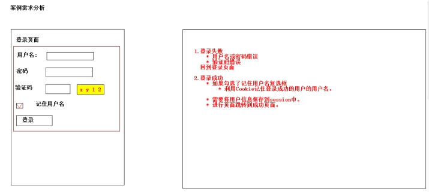 

## 1.8 案例准备

### 1.8.1 案例准备

#### 1.8.1.1 创建web项目

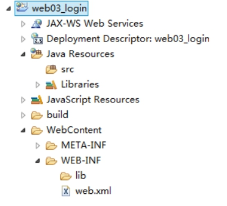 

#### 1.8.1.2 引入jar包

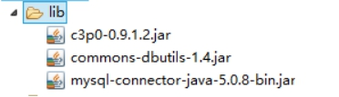 

#### 1.8.1.3 创建包结构

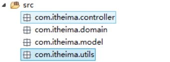 

#### 1.8.1.4 引入工具类和配置文件

 

#### 1.8.1.5 引入相关的类并修改

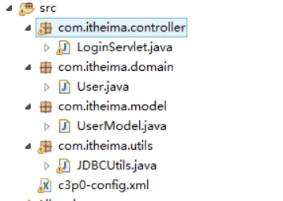 

修改配置文件：

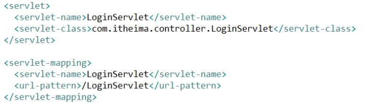 

#### 1.8.1.6 创建登录页面

- 页面代码

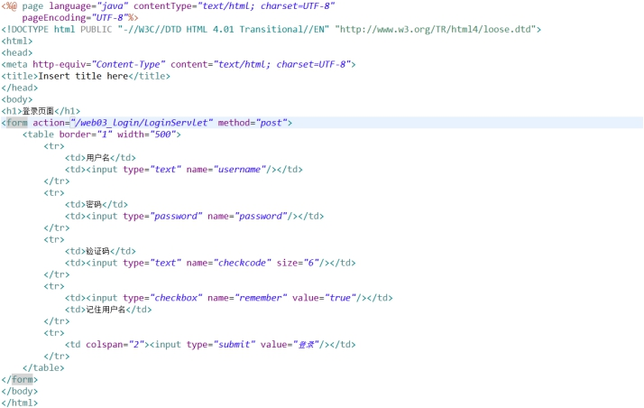 

 

## 1.9 案例代码-用户登录的功能

### 1.9.1 用户登录功能

#### 1.9.1.1 用户登录流程

用户输入用户名或密码进行登录：

- 如果用户名或密码错误，保存错误信息，回到登录页面。

- 如果用户名或密码正确，将用户的信息保存到会话中，跳转到成功页面。

#### 1.9.1.2 用户登录代码实现

- 在登录页面回显错误信息：

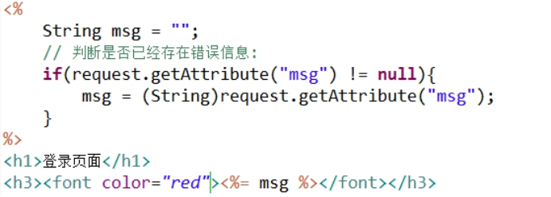 

- 用户登录代码实现

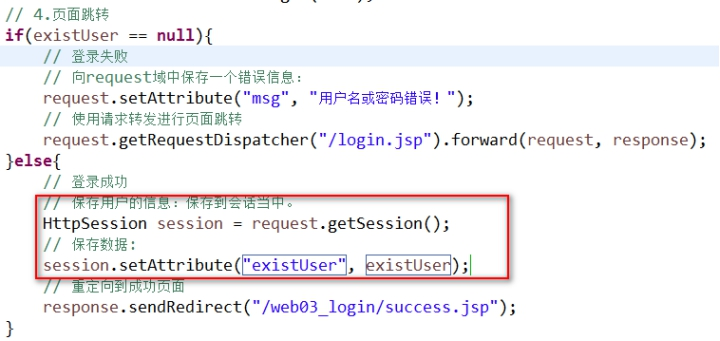 

- 编写success.jsp

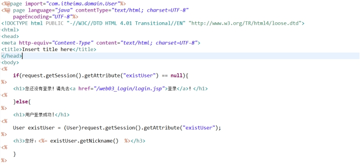 

## 1.1 案例代码-一次性验证码的分析

### 1.1.1 一次性验证码

#### 1.1.1.1 一次性验证码作用

一次性验证码作用：防止恶意灌水。而且一次性验证码只能够使用一次，不管成功或者失败，验证码都将失效。

#### 1.1.1.2 一次性验证码的校验

一次性验证码生成（随机生成4个字母或数字，由response生成一张图片响应到页面）。

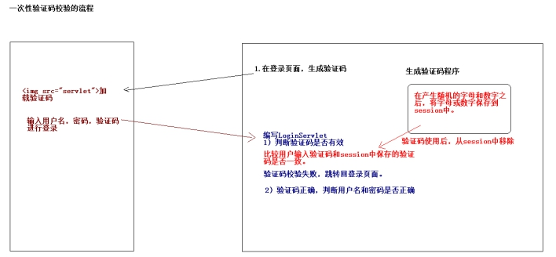 

1. 生成验证码,并且显示到界面上

2. 校验验证码

3. 实现验证码只能使用一次

4. 校验完验证码之后,比较用户名和密码,然后实现跳转

## 1.10 案例代码-一次性验证码的实现

### 1.10.1 一次性验证码实现

#### 1.10.1.1 生成验证码图片

- 复制Servlet到指定的包下

- 修改web.xml完成该Servlet的配置

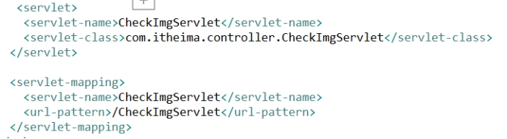 

- 在页面中引入Servlet

 

#### 1.10.1.2 将随机生成的字母或数字保存到session中

​		// 定义一个StringBuffer

​		StringBuffer buffer = new StringBuffer();

​		// 定义x坐标

​		int x = 10;

​		for (int i = 0; i < 4; i++) {

​			// 随机颜色

​			graphics2d.setColor(new Color(20 + random.nextInt(110), 20 + random

​					.nextInt(110), 20 + random.nextInt(110)));

​			// 旋转 -30 --- 30度

​			int jiaod    - = random.nextInt(60) - 30;

​			// 换算弧度

​			double theta = jiaod    - * Math.PI / 180;

 

​			// 生成一个随机数字

​			int index = random.nextInt(words.length()); // 生成随机数 0 到 length - 1

​			// 获得字母数字

​			char c = words.charAt(index);

​			

​			// 将随机产生的字符存入到字符串中:

​			buffer.append(c);

​			

​			// 将c 输出到图片

​			graphics2d.rotate(theta, x, 20);

​			graphics2d.drawString(String.*valueOf*(c), x, 20);

​			graphics2d.rotate(-theta, x, 20);

​			x += 30;

​		}

​		

​		// 将buffer转成字符串对象：

​		String checkcode = buffer.toString();

​		// 将其存入到session中

​		request.getSession().setAttribute("checkcode", checkcode);

#### 1.10.1.3 校验一次性验证码

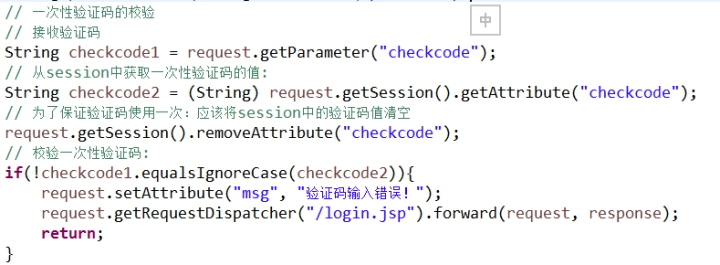 

## 1.11 案例代码-一次性验证码的点击按钮切换图片

### 1.11.1 点击按钮切换图片

#### 1.11.1.1 代码实现

- 提供超链接：

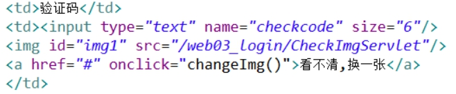 

- 编写JS的函数

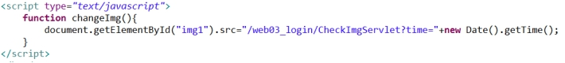 

## 1.12 案例代码-记住用户名的实现

### 1.12.1 记住用户名的实现

#### 1.12.1.1 需求概述

如果在登录的过程中，将记住用户名的复选框勾选了，而且在登录成功情况下，需要记住用户名，在关闭浏览器，下次访问该网站的登录页面的时候，会在用户名的文本框中自动呈现出用户名。

#### 1.12.1.2 代码实现

- 记住用户名的后台代码

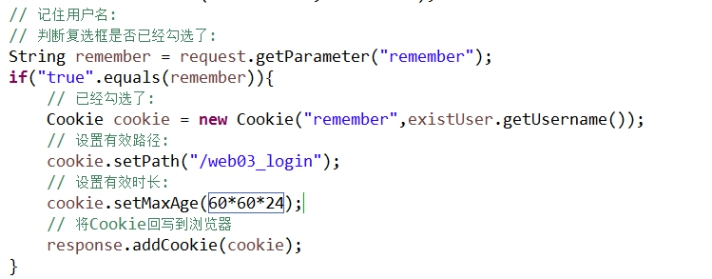 

- 在页面的文本框中回显用户名

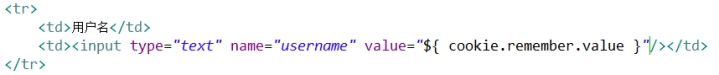 

## 1.13 案例代码-系统退出

### 1.13.1 系统退出

#### 1.13.1.1 代码实现

- 提供一个退出的链接

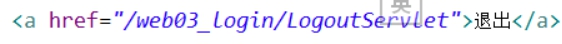 

- 编写LogoutServlet

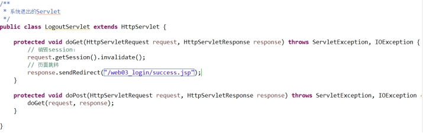 

 