## 1.1 JSP的回顾

### 1.1.1 JSP的回顾

#### 1.1.1.1 什么是JSP

JSP：Java Server Pages Java服务器端页面。

JSP 就是 HTM- + Java代码 + JSP自身东西。

#### 1.1.1.2 JSP由来

Servlet技术生成动态网页的时候很麻烦，需要通过response获得输出流，调用print方法进行打印的。这种编程方式很麻烦，而且美工也不容易处理。SUN公司为了简化动态网页开发，推出JSP。

#### 1.1.1.3 JSP的运行原理

JSP在执行时，会被服务器翻译为Servlet编译执行，JSP就是一个Servlet。

#### 1.1.1.4 JSP脚本元素

<%!	%>	:JSP声明 翻译成 Servlet成员部分的内容。声明变量，方法，内部类。

<%= %>		:翻译out.print(),在service方法内部。用于生成HTML页面源码。

<%	%>	:嵌入Java代码 翻译成service方法内部的代码块。声明变量，内部类。

## 1.2 JSP的模板修改和注释

### 1.2.1 JSP的模板修改

#### 1.2.1.1 修改JSP的字符集编码

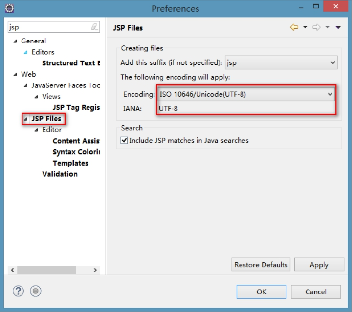 

### 1.2.2 JSP的注释

#### 1.2.2.1 HTML的注释

- 写法:
  - <!--HTML的注释 -->

- 存在时机

  - 存在JSP的源码中，翻译成Servlet后这个注释也存在，在生成HTML响应到页面的时候这个注释也会存在。

#### 1.2.2.2 Java代码的注释

- 写法:

  - <% // 单行注释 

  - /* 多行注释 */ 

  - /文档注释*/

  -  %>

- 存在时机

  - 存在JSP的源码中，翻译成Servlet后Java代码的注释也会存在，但是生成HTML响应到页面后，这种注释就消失了。

#### 1.2.2.3 JSP注释

- 写法:

  - <%-- JSP的注释 --%>

- 存在时机:

  - 存在JSP的源码中，翻译Servlet后注释就没有了。

注意：Java代码注释的话不要使用HTML的注释！！！

 

## 1.3 JSP的指令元素的概述

### 1.3.1 JSP的指令元素的概述

#### 1.3.1.1 JSP指令元素作用

- 用于指示JSP执行的某些步骤

- 用于指示JSP变现特定行为

#### 1.3.1.2 JSP指令元素的语法

- 语法:

  - <%@ 指令名称 属性名称=属性的值 属性名称=属性的值 %>

#### 1.3.1.3 JSP指令元素的分类

- page指令：指示JSP的页面设置属性和行为

- include指令：指示JSP包含哪些其他页面

- taglib指令：指示JSP页面包含哪些标签库

 

## 1.4 JSP的指令-page指令

### 1.4.1 Page指令

#### 1.4.1.1 Page指令简介

- 写法：

  - <%@ page 属性名=属性值 %>

- Page指令用来定义JSP文件的全局属性。

- 这些属性可以单独使用，也可以几个或多个同时使用。

- 在JSP页面中，只有import属性可以出现多次，其他属性都只能出现一次。

#### 1.4.1.2 Page指令属性

- language属性：	声明使用脚本的语言。只能是java。

- extends属性：	标明JSP编译成Servlet的时候继承的类。默认值：HttpJspBase。

- session属性：		标明JSP中是否可以直接使用session对象。默认值是true。

- buffer属性：		标明JSP对客户端输出缓冲区大小。默认值8kb。

- autoFlush属性：	如果缓冲区大小溢出，是否自动刷出。默认true。

- import属性：		用于导入Java包或类。

- contentType属性：标明JSP被浏览器解析和打开的时候采用的默认的字符集。

- pageEncoding属性：JSP文件及JSP翻译后的Servlet保存到硬盘上采用字符集。

- isErrorPage属性：	处理JSP页面异常。

- errorPage属性：	处理JSP页面异常。

- isELIgnored属性：	通知JSP是否忽略EL表达式。

 

## 1.5 JSP的指令-include和taglib指令

### 1.5.1 Include指令

#### 1.5.1.1 Include指令简介

- 写法：

  - <%@ include 属性名=属性值%>

- 作用：

  - 在JSP页面中静态包含一个文件，同时由该JSP解析包含的文件内容。

#### 1.5.1.2 Include指令属性

- file属性：	指示JSP页面包含页面路径。

#### 1.5.1.3 Include指令原理（静态包含原理）

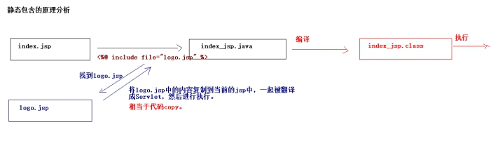 

- 注意地方：

  - 应该将被包含的页面的结构去掉。

  - 在被包含的页面中定义变量，在包含的页面中还可以使用。

### 1.5.2 Taglib指令

#### 1.5.2.1 Taglib指令简介

- 写法

  - <%@ taglib 属性名=属性值%>

- 作用：

  - 用于在JSP页面中引入标签库。

#### 1.5.2.2 Taglib指令属性

- uri属性：	引入的标签库的路径

- prefix属性：	引入标签库的别名

 

## 1.6 JSP的内置对象

### 1.6.1 JSP的内置对象概述

#### 1.6.1.1 什么是JSP的内置对象

JSP的内置对象：指的是可以直接在JSP页面中使用的对象。

#### 1.6.1.2 JSP的内置对象有哪些

JSP当中有9大内置对象：

- request		：从客户端向服务器发送的请求对象

- response		：从服务器端向客户端作出响应对象

- session		：服务器为客户端创建会话对象

- application	：代表应用。获得的ServletContext对象。

- out			：向输出流写入内容的对象。

- page			：当前的JSP翻译成Servlet后的对象的引用。

- pageContext	：本JSP的页面的上下文对象。

- config		：本JSP的ServletConfig对象。

- exception		：表示JSP页面运行时产生的异常对象。

#### 1.6.1.3 JSP的内置对象具体类型

- request		HttpServletRequest

- response		HttpServletResponse

- session		HttpSession

- Application		ServletContext

- config		ServletConfig

- page			Object

- pageContext	PageContext

- out			JspWriter

- exception		Throwable

 

## 1.7 pageContext对象的概述

### 1.7.1 pageContext对象

#### 1.7.1.1 pageContext对象简介

pageContext对象直接翻译为“页面上下文”对象，代表的是当前页面运行的一些属性。

它是javax.servlet.jsp.PageContext类的实例对象。

#### 1.7.1.2 pageContext对象作用

- 提供了page范围的数据存取的方法：

  - 向page范围中存入数据：

 

  - 从page范围获取数据

 

  - 从page范围移除数据

 

  - 查找属性的方法：

 

- 通过这个对象获得其他的8个内置对象：

  - 获得其他8个内置对象的方法

 

 

## 1.8 JSP的四个作用范围

### 1.8.1 JSP的四个作用范围

#### 1.8.1.1 JSP的四个作用范围概述

- PageScope		：页面范围。

  - 页面范围指的是在当前的页面内有效，出了这个页面，用pageContext保存的数据就无效了。

- RequestScope		：请求范围。

  - 从客户端向服务器发送一次请求，服务器对这次请求作出了响应之后，用request保存的数据就无效了。

- SessionScope		：会话范围。

  - 每个浏览器向服务器发送请求（多次请求）。将该会话结束。

- ApplicationScope	：应用范围。

  - 在整个应用中任意的地方都可以获取。

#### 1.8.1.2 JSP的四个作用范围演示

#### 1.8.1.3 pageContext对象向四个域范围存取数据

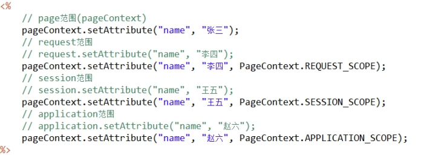 

#### 1.8.1.4 findAttribute方法:

查找属性方法：先根据小范围的名称进行查找，如果找到了就返回，如果没有找到就会去比其大一个域的范围进行查找。

 

## 1.9 JSP的动作标签

### 1.9.1 JSP的动作标签的概述

#### 1.9.1.1 什么是JSP的动作标签

JSP的动作标签用于在JSP页面中提供业务逻辑功能，避免在JSP页面中直接编写Java代码，造成jsp页面难以维护。

#### 1.9.1.2 常用的动作标签

- <jsp:forward/>	：请求转发。

- <jsp:include/>：包含（动态包含）。

- <jsp:param/>：传递参数。

#### 1.9.1.3 演示JSP的动作标签

### 1.9.2 静态包含和动态包含区别

静态包含:

#### 1.9.2.1 动态包含的原理

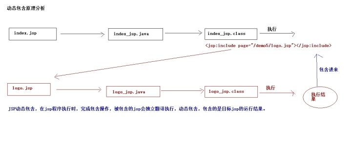 

 

## 1.10 EL的概述

### 1.10.1 EL的概述

#### 1.10.1.1 什么是EL

 

EL：Expressio  - Language表达式语言。

#### 1.10.1.2 EL作用（为什么要学习EL）

EL和JSTL一起使用取代JSP页面中嵌入Java代码写法。

#### 1.10.1.3 EL功能

- EL获取数据

- EL执行运算

- EL获取web开发常用的对象

- EL调用Java方法

#### 1.10.1.4 EL语法

- 语法：

  - ${ EL表达式 }

## 1.11 EL获取数据

### 1.11.1 EL获取数据

#### 1.11.1.1 EL如何获取数据

EL表达式语句在执行的时候，会调用pageContext.findAttribute()方法。分别从page、request、session、application范围查找相应对象，找到就会返回相应对象，找不到返回””(不是null，是空的字符串)。EL所获取的数据需要在四个作用范围中。

#### 1.11.1.2 演示EL获取数据

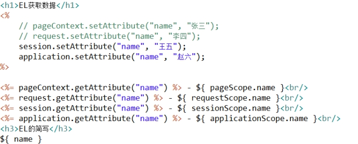 

## 1.12 EL获取数组和集合中的数据

### 1.12.1 EL获取数据

#### 1.12.1.1 获取数组的数据

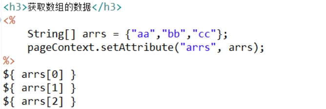 

#### 1.12.1.2 获取List集合的数据

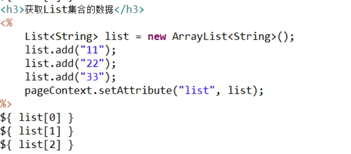 

#### 1.12.1.3 获取Map集合的数据

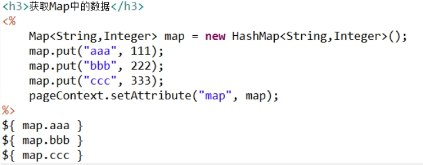 

- 注意：

  - 如果map的key中包含了特殊字符，不能使用.必须使用[]。

u .用来获取对象的属性的。

u []用来获得下标。

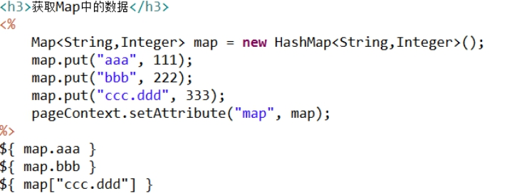 

## 1.1 EL执行运算

### 1.1.1 EL执行运算

#### 1.1.1.1 执行算数运算

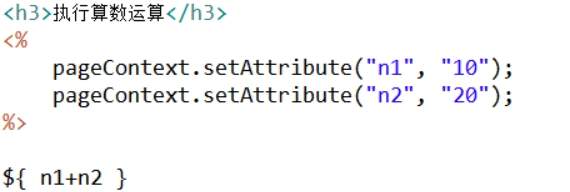 

#### 1.1.1.2 执行关系运算

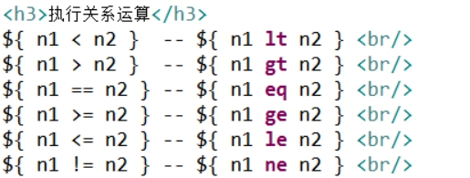 

#### 1.1.1.3 执行逻辑运算

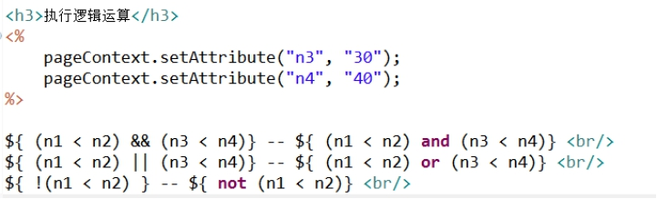 

#### 1.1.1.4 执行三元运算

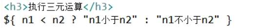 

#### 1.1.1.5 empty运算符

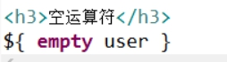 

 

## 1.13 EL获取web开发常用对象

### 1.13.1 EL获取web开发常用对象

#### 1.13.1.1 常用对象有哪些

EL表达式定义了11个web开发常用对象。使用这些对象可以很方便获取web开发冲的一些常见对象，并可以读取这些对象中的数据。

- pageContext		：相当于JSP内置对象中pageContext

- pageScope		：获取指定域下的名称的数据

- requestScope		：获取指定域下的名称的数据

- sessionScope		：获取指定域下的名称的数据

- applicationScope	：获取指定域下的名称的数据

- param			：在页面中接收请求参数（接收一个名称对应一个值参数）。

- paramValues		：在页面中接收请求参数（接收一个名称对应多个值参数）。

- header			：在页面上获取请求头（获取一个key对应一个value 头）

- headerValues		：在页面上获取请求头（获取一个key对应多个value 头）

- cookie			：访问cookie的名称和值（${cookie.key.name} ${cookie.key.value}）

- initParam			：获取全局初始化参数的值

 

## 1.14 JSTL的概述

### 1.14.1 JSTL的概述

#### 1.14.1.1 什么是JSTL

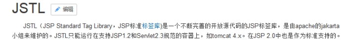 

JSTL：JSP的标准标签库。

#### 1.14.1.2 为什么学习JSTL

主要和EL来取代传统页面上直接嵌入Java代码写法。提升程序可读性、维护性和方便性。

#### 1.14.1.3 JSTL的版本

JSTL1.0、JSTL1.1和JSTL1.2版本

- 1.0版本不支持EL表达式。

- 1.1和1.2支持了EL表达式。

#### 1.14.1.4 JSTL的标签库

- c标签（core标签库）

- fmt标签（国际化标签库）

- xml标签

- sql标签

- jstl函数库（EL函数）

 

## 1.1 JSTL的入门

### 1.1.1 JSTL的入门

#### 1.1.1.1 引入JSTL的jar包

 

#### 1.1.1.2 新建JSP页面

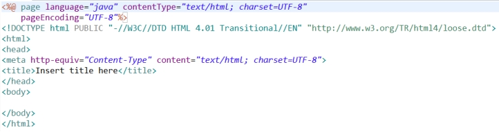 

#### 1.1.1.3 引入标签库

 

#### 1.1.1.4 使用JSTL

 

 

## 1.15 JSTL的if标签

### 1.15.1 JSTL的if标签

#### 1.15.1.1 if的标签使用

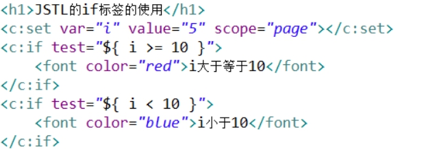 

#### 1.15.1.2 if标签的属性

- test属性	：条件

- var属性	：将test中的条件的值赋给一个变量，在var中定义变量

- scope属性：作用范围

## 1.16 JSTL的foreach标签

### 1.16.1 JSTL的foreach标签

#### 1.16.1.1 foreach标签的使用

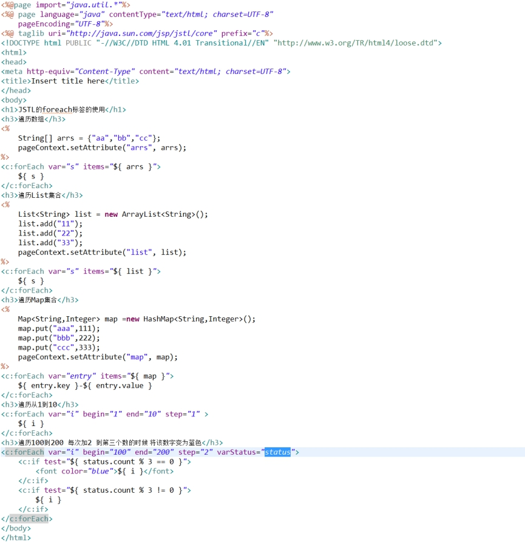 

## 1.1 案例准备

### 1.1.1 搭建开发环境

#### 1.1.1.1 创建web项目

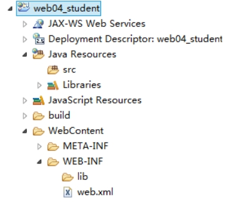 

#### 1.1.1.2 引入相关的jar包

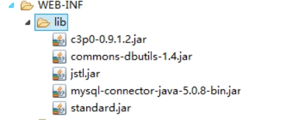 

#### 1.1.1.3 创建包结构，引入工具类

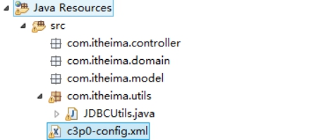 

#### 1.1.1.4 创建数据库和表

````sql
create database web04_student;

use web04_student;

create table student(

	sid int primary key auto_increment,

	sname varchar(20),

	sex varchar(10),

	age int

);

insert into student values (null,'张三','男',20);

insert into student values (null,'李四','女',23);

insert into student values (null,'王五','女',18);

insert into student values (null,'赵六','男',25);

insert into student values (null,'孙七','男',21);
````

## 1.1 案例代码实现

### 1.1.1 案例代码实现

#### 1.1.1.1 创建实体类

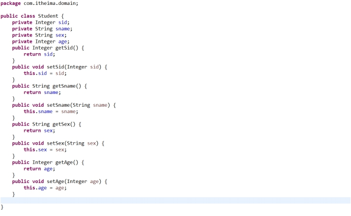 

#### 1.1.1.2 创建Servlet

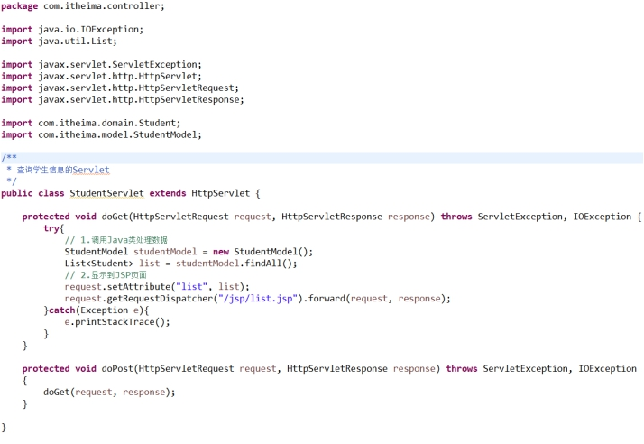 

#### 1.1.1.3 创建Model的对象

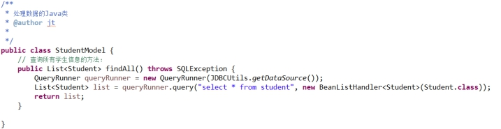 

#### 1.1.1.4 编写list.jsp

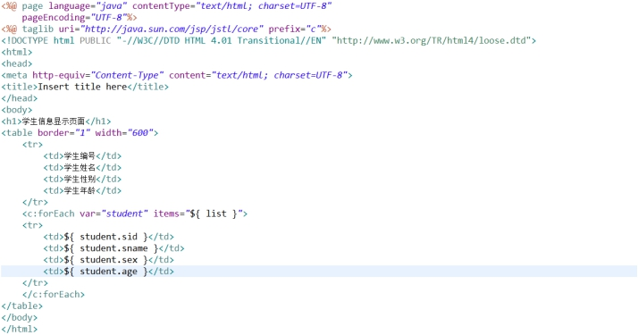 

#### 1.1.1.5 运行效果

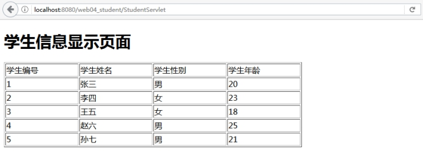 

 