## 1.1 监听器的概述

### 1.1.1 监听器的概述

#### 1.1.1.1 什么是监听器

监听器就是一个实现了特定接口的Java类，这个Java类用于监听另一个Java类的方法调用或者属性的改变。当被监听对象发生上述事件后，监听器某个方法将会立即被执行。

#### 1.1.1.2 监听器的用途

用来监听其他对象的变化的。主要应用在图形化界面开发上。

- Java中GUI，Android

#### 1.1.1.3 监听器的术语

- 事件源：指的是被监听对象（汽车）

- 监听器：指的是监听的对象（报警器）

- 事件源和监听器绑定：在汽车上安装报警器

- 事件：指的是事件源对象的改变（踹了汽车一脚）----主要功能获得事件源对象。

 

为事件源绑定监听器,当事件源发生事件,那么监听器就会去处理(执行对应的方法)

1. 事件源

2. 监听器(方法)

3. 为事件源绑定监听器

 

## 1.1 监听器的入门

### 1.1.1 监听器的入门

#### 1.1.1.1 监听器的入门程序

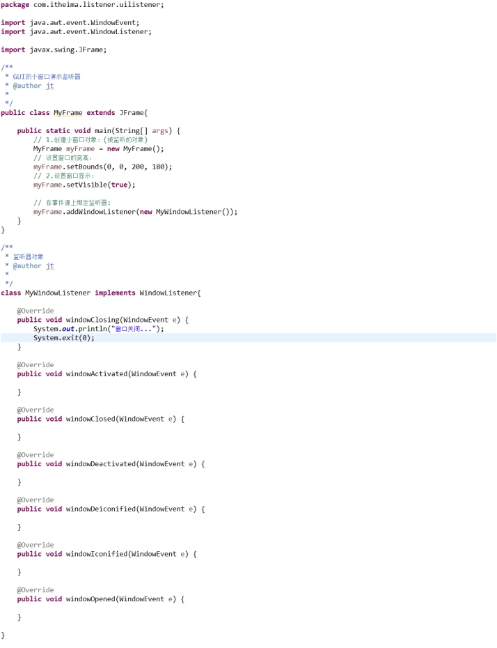 

#### 1.1.1.2 监听器的执行过程

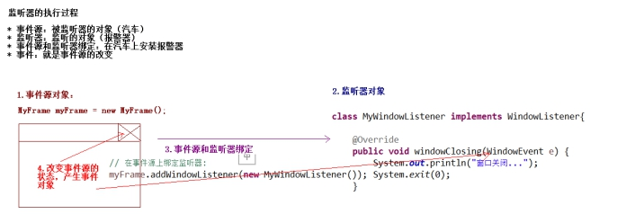 

 

## 1.2 Servlet中的监听器

### 1.2.1 Servlet中的监听器

#### 1.2.1.1 Servlet中的监听器简介

在Servlet中定义了多种类型的监听器，它们用于监听的事件源分别是ServletContext、HttpSession和ServletRequest这三个域对象。

#### 1.2.1.2 Servlet中的监听器的分类

- 一类：监听三个域对象的创建和销毁的监听器（三个）

- 二类：监听三个域对象的属性变更（属性添加、移除、替换）的监听器（三个）

- 三类：监听HttpSession中JavaBean的状态改变（钝化、活化、绑定、解除绑定）的监听（两个）

 

## 1.3 ServletContextListener监听器的使用

### 1.3.1 ServletContextListener监听器

#### 1.3.1.1 ServletContextListener监听器的作用

- 用来监听ServletContext域对象的创建和销毁的监听器。

#### 1.3.1.2 ServletContext创建和销毁

- ServletContext
  - 创建：在服务器启动的时候，为每个web应用创建单独的ServletContext对象。

  - 销毁：在服务器关闭的时候，或者项目从web服务器中移除的时候。

#### 1.3.1.3 ServletContextListener监听器的方法

- 监听ServletContext对象的创建

 

- 监听ServletContext对象的销毁

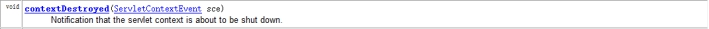 

#### 1.3.1.4 编写监听器

- 监听器的代码

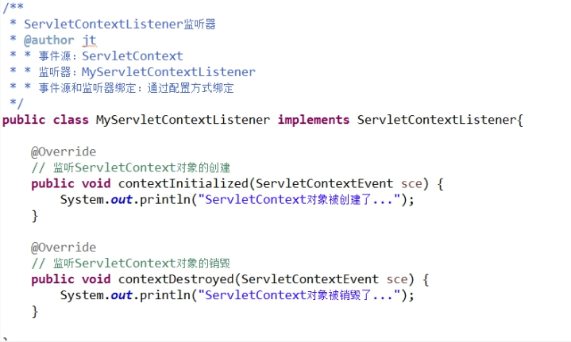 

- 监听器的配置

 

#### 1.3.1.5 ServletContextListener企业用途

- 加载框架的配置文件：

  - Spring框架提供了一个核心监听器ContextLoaderListener。

- 定时任务调度：

 

## 1.4 HttpSessionListener监听器的使用

### 1.4.1 HttpSessionListener监听器

#### 1.4.1.1 HttpSessionListener监听器作用

- 用来监听HttpSession对象的创建和销毁。

#### 1.4.1.2 HttpSession创建和销毁

- 创建：

  - 服务器端第一次调用getSession()方法时候。

- 销毁：

  - 非正常关闭服务器（正常关闭服务器session会被序列化）。

  - Session过期（默认过期时间30分钟）。

  - 手动调用session.invalidate()方法。

#### 1.4.1.3 HttpSessionListener监听器的方法

- 监听HttpSession对象创建

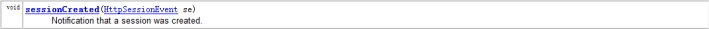 

- 监听HttpSession对象销毁

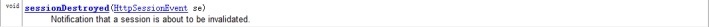 

#### 1.4.1.4 编写监听器监听HttpSession对象创建和销毁

- 监听器代码

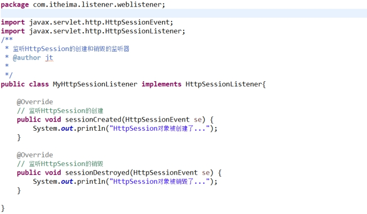 

- 监听器的配置

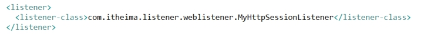 

#### 1.4.1.5 问题

- 访问HTML是否创建Session		：不会

- 访问JSP是否创建Session		：会

- 访问Servlet是否创建Session	：不会（默认没有调用getSession方法）

## 1.5 ServletRequestListener监听器的使用

### 1.5.1 ServletRequestListener监听器

#### 1.5.1.1 ServletRequestListener监听器作用

- 用户监听ServletRequest对象的创建和销毁

#### 1.5.1.2 ServletRequest对象的创建和销毁

- 创建

  - 从客户端向服务器发送一次请求，服务器就会创建request对象。

- 销毁

  - 服务器对这次请求作出了响应之后，request对象就销毁了。

#### 1.5.1.3 ServletRequestListener监听器的方法

- 监听ServletRequest对象的创建

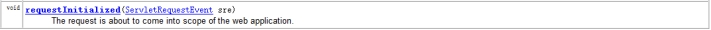 

- 监听ServletRequest对象的销毁

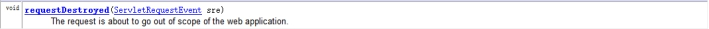 

#### 1.5.1.4 编写监听器代码

- 监听器代码

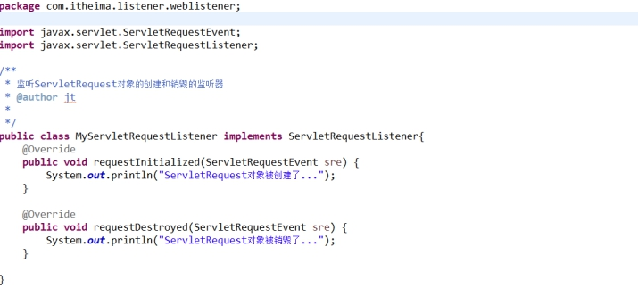 

- 监听器配置

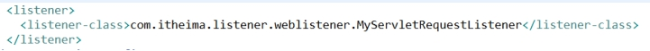 

#### 1.5.1.5 问题：

- 访问HTML页面是否创建请求对象	：会

- 访问JSP页面是否创建请求对象		：会

- 访问Servlet是否创建请求对象		：会

 

## 1.6 统计当前在线人数的案例

### 1.6.1 案例实现

#### 1.6.1.1 案例分析

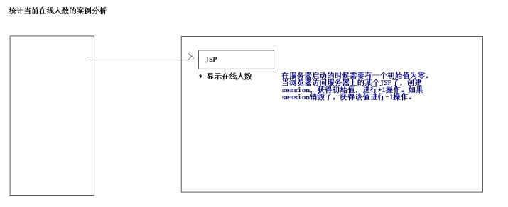 

#### 1.6.1.2 代码实现

- 创建ServletContextListener进行初始化

 

- 创建HttpSessionListener

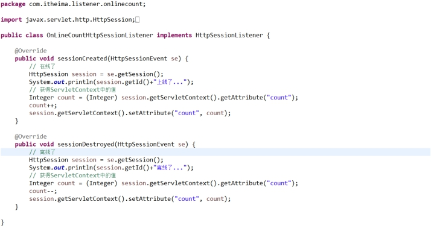 

- 配置监听器

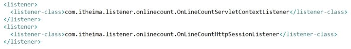 

- 创建JSP页面

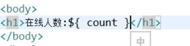 

## 1.7 监听三个域对象的属性变更的监听器

### 1.7.1 监听三个域对象的属性变更的监听器

#### 1.7.1.1 ServletContextAttributeListener

- 监听ServletContext对象中的属性变更（属性添加，移除，替换）的监听器

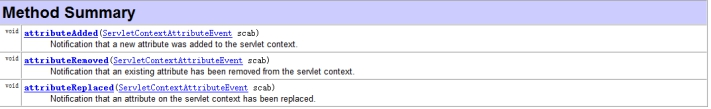 

#### 1.7.1.2 HttpSessionAttributeListener

- 监听HttpSession对象中的属性变更（属性添加，移除，替换）的监听器

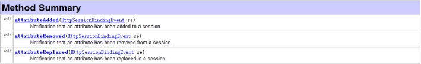 

#### 1.7.1.3 ServletRequestAttributeListener

- 监听ServletRequest对象中的属性变更（属性添加，移除，替换）的监听器

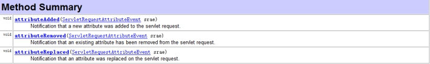 

### 1.7.2 演示第二类监听器

#### 1.7.2.1 演示HttpSessionAttributeListener

- 代码编写

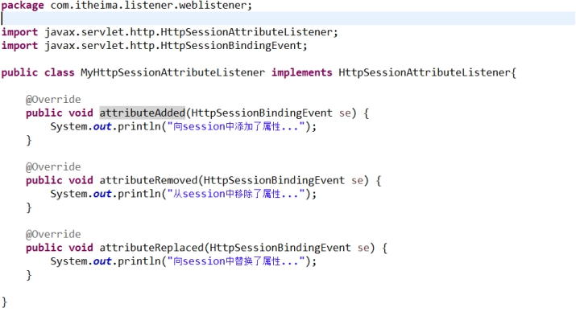 

- 配置监听器

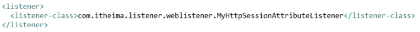 

- 编写测试的JSP

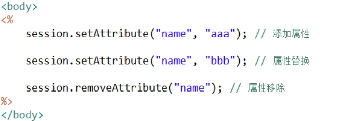 

 

## 1.8 监听HttpSession中Java类状态改变的监听器

### 1.8.1 第三类监听器概述

保存在Session域中的Java类可以有多种状态：绑定到session中；从session中解除绑定；随session对象持久化到一个存储设备中（钝化）；随session对象从一个存储设备中恢复（活化）。

Servlet对方中定义了两个特殊的监听的接口来帮助Java类了解自己在Session域中的状态：

HttpSessionBindingListener接口    监听绑定和解除绑定

HttpSessionActivationListener接口， 监听钝化和活化

实现这两个接口的类不需要在web.xml中进行配置。

#### 1.8.1.1 HttpSessionBindingListener监听器:

监听Java类在HttpSession中的绑定和解除绑定的状态的监听器：

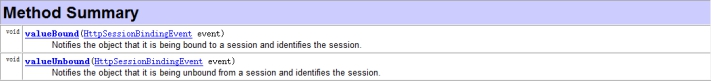 

- 测试代码：

 

#### 1.8.1.2 HttpSessionActivationListener监听器

监听HttpSession中Java类的钝化和活化监听器。

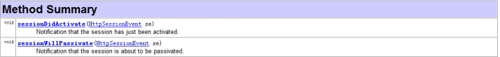 

- 测试代码

 

- 配置完成session的序列化和反序列化

Context标签可以配置在：

tomcat/conf/context.xml					:所有tomcat下虚拟主机和虚拟目录下的工程都会序列化session

tomcat/conf/Catalina/localhost/context.xml	:localhost虚拟主机下的所有项目会序列化session

工程/META-INF/context.xml					:当前工程才会序列化session。

````properties
<Context>
<Manager className="org.apache.catalina.session.PersistentManager" maxIdleSwap="1">
	<Store className="org.apache.catalina.session.FileStore" directory="itheima"/>
</Manager>
</Context> 
````

## 1.1 Filter的概述

### 1.1.1 Filter的概述

#### 1.1.1.1 什么是Filter

<http://loaclhost:8080/web01/ServletDemo1?name=张三&password=123>

<http://localhost:8080/web01/login.jsp>

<http://localhost:8080/web01/success.jsp>

我喜欢战争

我喜欢xxx

 

Filter称为过滤器，它是Servlet技术中最实用的技术，web开发人员通过Filter技术，对web服务器所管理的资源（JSP，Servlet，静态图片或静态html文件）进行拦截，从而实现一些特殊的功能。

Filter就是过滤从客户端向服务器发送的请求。

#### 1.1.1.2 为什么学习过滤器

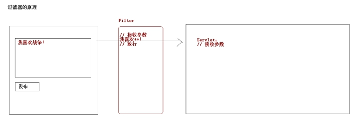 

## 1.1 Filter的入门

### 1.1.1 Filter的入门

#### 1.1.1.1 第一步：编写一个类实现Filter接口

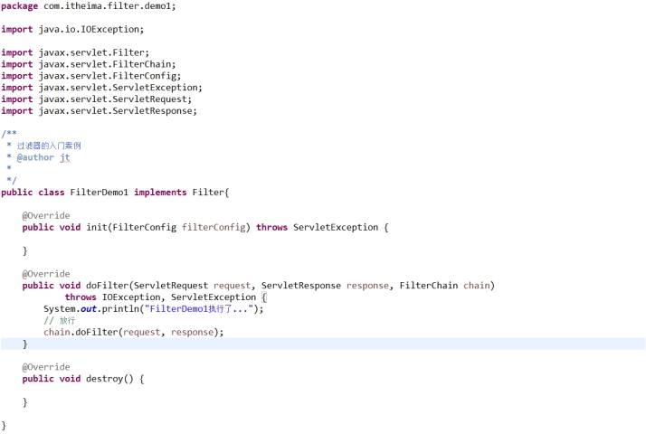 

#### 1.1.1.2 第二步：对过滤器进行配置

 

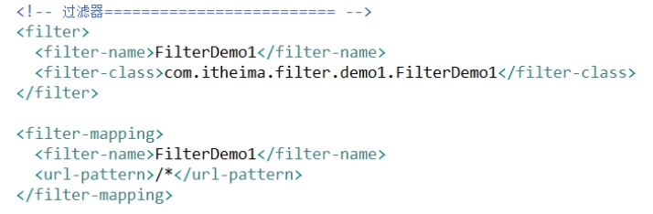 

## 1.1 FilterChain对象的概述

### 1.1.1 FilterChain对象的概述

#### 1.1.1.1 什么是FilterChain

FilterChain过滤器链：在一个web应用中，可以开发编写多个Filter，这些Filter组合起来称为是一个过滤器链。

Web服务器根据Filter在web.xml文件中的注册顺序（mapping的配置顺序）决定先调用那个Filter。依次调用后面的过滤器，如果没有下一个过滤器，调用目标资源

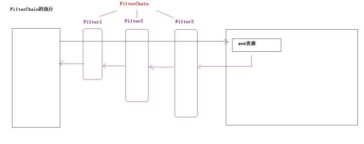 

#### 1.1.1.2 FilterChain的演示

 

## 1.1 Filter的生命周期

### 1.1.1 Filter的生命周期

#### 1.1.1.1 Filter的生命周期描述

Filter的创建和销毁是由web服务器负责。Web应用程序启动的时候，web服务器创建Filter的实例对象。并调用其init方法进行初始化（filter对象只会创建一次，init方法也只会执行一次）。

每次filter进行拦截的时候，都会执行doFilter的方法。

当服务器关闭的时候，应用从服务器中移除的时候，服务器会销毁Filter对象。

 

 

 

## 1.1 FilterConfig对象的概述

### 1.1.1 FilterConfig对象的概述

#### 1.1.1.1 FilterConfig对象的作用：

用来获得Filter的相关的配置的对象。

#### 1.1.1.2 FilterConfig对象的API

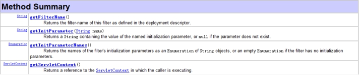 

#### 1.1.1.3 FilterConfig的演示

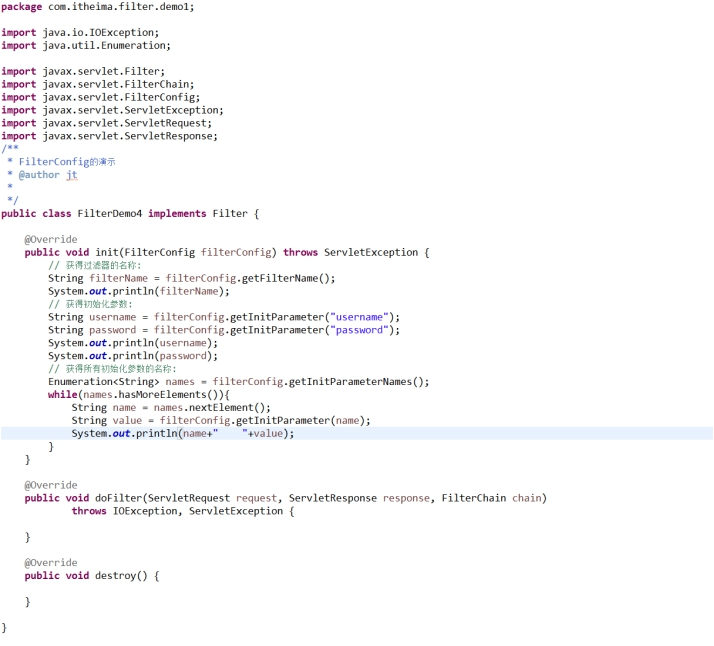 

## 1.9 过滤器的相关配置

### 1.9.1 过滤器的相关配置

#### 1.9.1.1 <url-pattern>的配置

- 完全路径匹配		：以/开始   比如/aaa  /aaa/bbb

- 目录匹配			：以/开始 以*结束  比如/*  /aaa/*  /aaa/bbb/*

- 扩展名匹配		：不能以/开始 以*开始 比如*.jsp  *.do   *.action

#### 1.9.1.2 \<servlet-name>的配置

专门以Servlet的配置的名称拦截Servlet。

#### 1.9.1.3 \<dispatcher>的配置

- 默认的情况下过滤器会拦截请求。如果进行转发（需要拦截这次转发）。

- dispatcher的取值

  - REQUEST	:默认值。默认过滤器拦截的就是请求。

  - FORWARD:转发。

  - INCLUDE	:页面包含的时候进行拦截

  - ERROR	:页面出现全局错误页面跳转的时候进行拦截

 

## 1.10 案例：权限验证过滤器

### 1.10.1 案例实现

#### 1.10.1.1 案例需求

现在一个网站上需要有登录的功能，在登录成功后，重定向到后台的成功页面（后台的页面有很多）。如果现在没有登录直接在地址栏上输入后台页面地址。

编写一个过滤器：可以对没有登录的用户进行拦截。（没有登录，回到登录页面。如果已经登录，放行。）

#### 1.10.1.2 案例登录功能

- 创建表

  ```sql
  create database web05;
  use web05;
  create table user(
  	id int primary key auto_increment,
  	username varchar(20),
  	password varchar(20)
  );
  insert into user values (null,'aaa','123');
  ```

- 搭建项目的环境

 

## 1.1 案例：权限验证过滤器

### 1.1.1 案例实现

#### 1.1.1.1 权限验证的过滤器实现

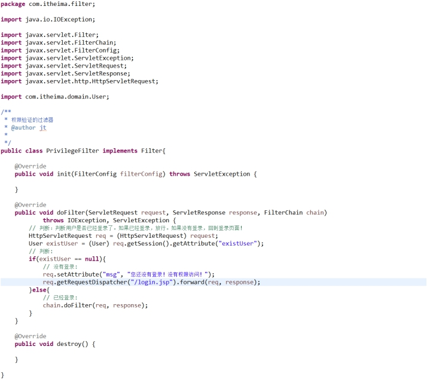 

## 1.11 案例：通用的字符集编码过滤器的分析

### 1.11.1 案例分析

#### 1.11.1.1 案例需求

网站，需要向后台提交中文的数据（有可能是GET也有可能是POST）。中文处理根据不同的请求方式，处理的方式也是不一样的。

需要调用request.getParameter();方法接收数据，但是这个时候无论是get还是post接收的数据都是存在乱码。现在调用request.getParameter()方法无论是get还是post请求提交的中文，都没有乱码。

#### 1.11.1.2 增强一个类的方法

通过上面的分析，现在增强request的getParameter的方法。增强的过程要写在过滤器中。

- 如何增强一个类中的方法？

  - 继承

u 必须要能够控制这个类的构造。

  - 装饰者
      - 被增强的类和增强的类需要实现相同的接口。
      - 在增强的类中获得被增强的类的引用。
      - 缺点：接口中的方法过多，重写很多其他的方法。

  - 动态代理
      - 类需要实现接口。

 

## 1.12 案例：通用的字符集编码过滤器的代码实现

### 1.12.1 案例实现

#### 1.12.1.1 代码实现

- 过滤器的代码

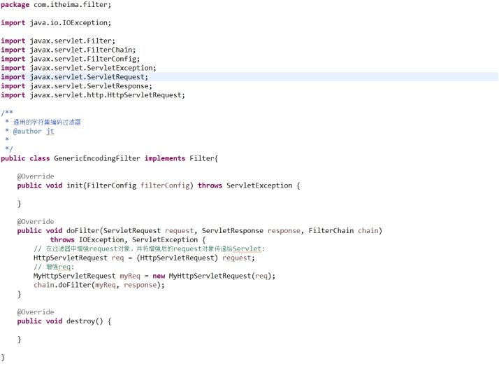 

- 增强类的代码

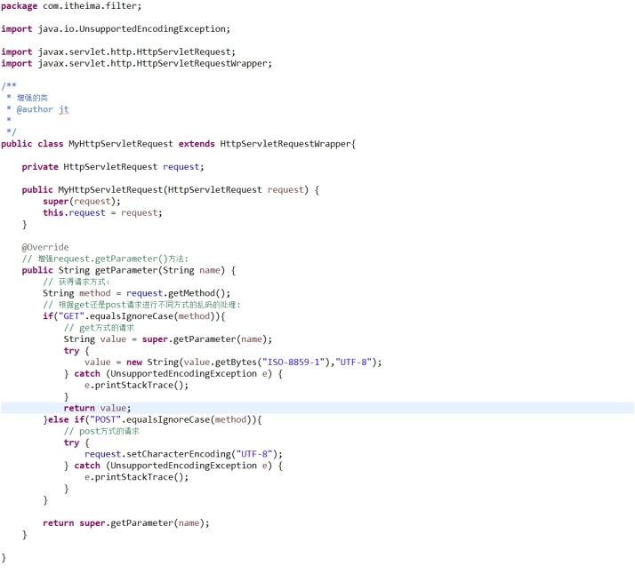 

 