## 1.1 文件上传的概述

### 1.1.1 文件上传的概述

#### 1.1.1.1 什么是文件上传

- 文件上传：将本地的文件通过流写入到服务器的过程。

#### 1.1.1.2 为什么要学习文件上传

- 实际开发中有很多应用：
  -  QQ空间上传图片

  -  招聘网站上传简历

#### 1.1.1.3 文件上传的技术

- JSPSmartUpload	：应用在JSP上的文件上传和下载的组件。

- FileUpload		：应用在Java环境上的文件上传的功能。

- Servlet3.0			：提供文件上传的功能

- Struts2			：提供文件上传的功能

#### 1.1.1.4 文件上传的要素

- 文件上传的三个要素

  -  表单的提交的方式需要是POST

  -  表单中需要有<input type=”file”>元素，需要有name属性和值。

  -  表单enctype=”multipart/form-data”

 

## 1.2 文件上传的原理分析

### 1.2.1 文件上传的原理分析

#### 1.2.1.1 抓包分析

- 没有设置enctype属性

  ````properties
  POST /web06/jsp/upload.jsp HTTP/1.1
  Accept: text/html, application/xhtml+xml, */*
  X-HttpWatch-RID: 22006-10011
  Referer: http://localhost:8080/web06/jsp/upload.jsp
  Accept-Language: zh-CN
  User-Agent: Mozilla/5.0 (Windows NT 6.3; WOW64; Trident/7.0; rv:11.0) like Gecko
  Content-Type: application/x-www-form-urlencoded
  Accept-Encoding: gzip, deflate
  Host: localhost:8080
  Content-Length: 53
  DNT: 1
  Connection: Keep-Alive
  Cache-Control: no-cache
  Cookie: JSESSIONID=D51DCB996556C94861B2C72C4D978010
  
  info=info&upload=C%3A%5CUsers%5Cjt%5CDesktop%5Caa.txt
  ````

*\\ 注意：没有文件上传中的文件的具体的内容。

- 设置enctype属性

  ````properties
  POST /web06/jsp/upload.jsp HTTP/1.1
  Accept: text/html, application/xhtml+xml, */*
  X-HttpWatch-RID: 22006-10026
  Referer: http://localhost:8080/web06/jsp/upload.jsp
  Accept-Language: zh-CN
  User-Agent: Mozilla/5.0 (Windows NT 6.3; WOW64; Trident/7.0; rv:11.0) like Gecko
  Content-Type: multipart/form-data; boundary=---------------------------7e139d10110a64
  Accept-Encoding: gzip, deflate
  Host: localhost:8080
  Content-Length: 322
  DNT: 1
  Connection: Keep-Alive
  Cache-Control: no-cache
  Cookie: JSESSIONID=D51DCB996556C94861B2C72C4D978010
  
  -----------------------------7e139d10110a64
  Content-Disposition: form-data; name="info"
  
  aaa
  -----------------------------7e139d10110a64
  Content-Disposition: form-data; name="upload"; filename="C:\Users\jt\Desktop\aa.txt"
  Content-Type: text/plain
  
  hello world！！！
  -----------------------------7e139d10110a64--
  ````

#### 1.2.1.2 文件上传的原理分析

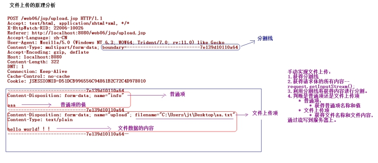 

 

 

## 1.3 文件上传的入门

### 1.3.1 文件上传的入门

#### 1.3.1.1 代码实现

- 第一步：引入文件上传的相关的jar包。

 

- 第二步：编写文件上传的页面

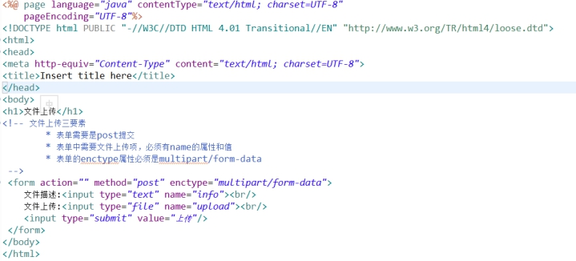 

- 编写文件上传的Servlet

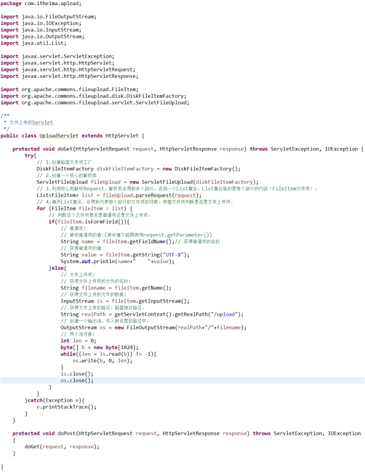 

 

## 1.4 文件上传的API

### 1.4.1 文件上传的API

#### 1.4.1.1 DiskFileItemFactory：磁盘文件项工厂

- 构造方法：

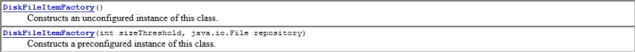 

  -  DiskFileItemFactory()

  -  DiskFileItemFactory(int sizeThreshold,File repostory)

     -  sizeThreshold		:设置文件上传的缓冲区的大小，默认值为10kb。

     -  repository		:设置文件上传过程中产生临时文件存放的路径。

- 方法：

 

  -  setSizeThreshold()		：设置缓冲区的大小

  -  setRepository()		：设置临时文件存放的路径

#### 1.4.1.2 API的使用的代码

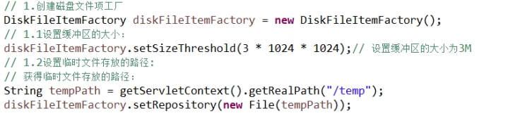 

 

## 1.5 文件上传的API

### 1.5.1 文件上传的API

#### 1.5.1.1 ServletFileUpload：核心解析类

- 构造方法：

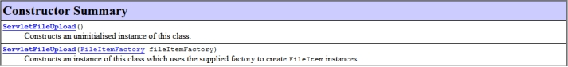 

  -  ServeltFileUpload(FileItemFactory fileItemFactory);

- 方法：

 

  -  是用来判断表单的enctype属性是否正确。

 

  -  解析Request对象，返回一个List集合（每个部分的对象FileItem）

 

  -  设置单个文件的大小

 

  -  设置上传的文件的总大小

 

  -  设置中文文件名上传的乱码的问题。

 

  -  设置监听文件上传的进度

## 1.6 文件上传的API

### 1.6.1 文件上传的API

#### 1.6.1.1 FileItem文件项

- 方法

 

  -  判断表单项是普通项还是文件上传项。如果为true代表是普通项

- 普通项的方法：

 

  -  获得普通项的名称

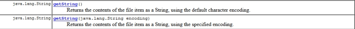 

  -  获得普通项的值

- 文件上传项：

 

  -  获得文件上传的文件名的方法

 

  -   获得文件上传的文件内容的方法

 

  -  获得文件上传的文件的大小

 

  -  删除文件上传过程中的临时文件

## 1.7 JS控制多文件上传

### 1.7.1 案例需求

#### 1.7.1.1 案例需求描述

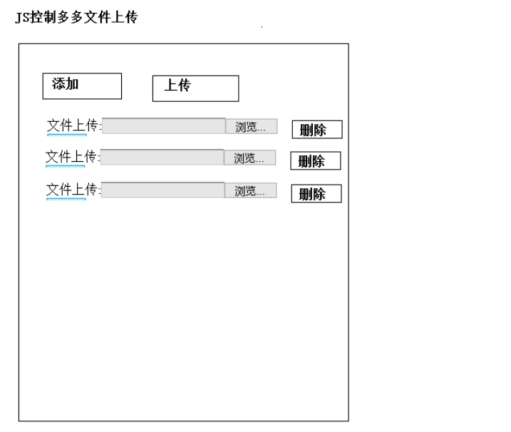 

### 1.7.2 案例实现

#### 1.7.2.1 案例代码实现

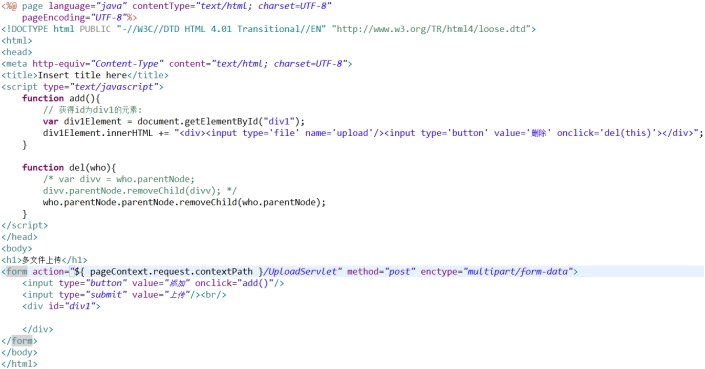 

## 1.1 文件上传兼容浏览器问题及解决

### 1.1.1 文件上传兼容浏览器问题

#### 1.1.1.1 问题描述

如果使用IE老版本的浏览器出现一个文件名称获取错误问题。IE老版本获取文件名称的时候，会带有路径。

 

#### 1.1.1.2 问题解决

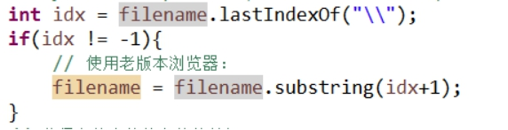 

## 1.1 文件上传同一个目录下文件同名的问题及解决

### 1.1.1 文件上传同一个目录下文件同名问题

#### 1.1.1.1 问题描述

张三向服务器上传了一个文件aa.txt内容是hello world。李四向服务器上传了一个文件aa.txt内容hello Java。后上传的文件将先上传的文件覆盖了。

#### 1.1.1.2 问题解决

使用唯一文件名进行解决。

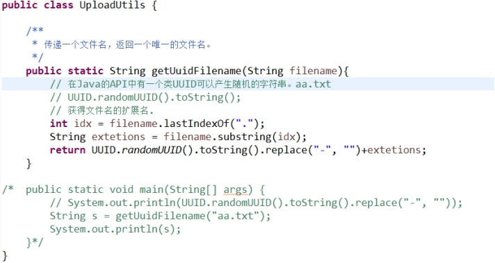 

 

## 1.8 文件上传同一个目录下存放文件过多的问题及解决

### 1.8.1 文件上传同一个目录下文件过多的问题

#### 1.8.1.1 问题描述

现在所有的用户都上传文件，如果网站访问量比较大，如果都上传到同一个目录下，在同一个目录下存放的文件太多了，也会对程序有影响（其实打开该目录的时候，都会很卡，更别说读写操作）。

#### 1.8.1.2 问题解决

- 目录分离

  -  按时间分离		：按月、周、天、小时。
-  按用户分离		：按张三、李四。
  -  按个数分离		：一个目录下存放3000个文件
-  按目录分离算法	：按照某种特定算法进行分离
     -  上传一个文件，得到一个唯一的文件名。

     -  唯一文件名获取其hashCode值。-----int类型的值（32位）

     -  让hashCode的值 & 0xf;-----得出的这个值作为一级目录。

     -  让hashCode右移4位  & 0xf;----得出的这个值作为二级目录。

     -  以此类推。

- 分析算法：


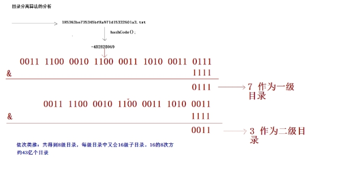 

#### 1.8.1.3 算法实现

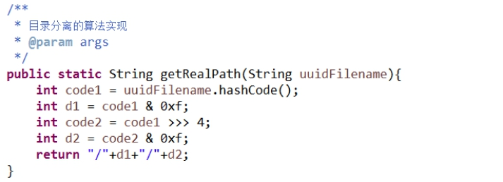 

 

## 1.9 文件下载的概述

### 1.9.1 文件下载的概述

#### 1.9.1.1 什么是文件下载

- 文件下载：将服务器上的一个文件，通过流写入到客户端上。

#### 1.9.1.2 为什么学习文件下载

- 很多应用包含有文件下载的功能

  -  音乐的下载

  -  应用的下载

#### 1.9.1.3 文件下载的方式

- 使用超链接的方式实现文件的下载

  -  在<a href="文件的路径">超链接</a>
  -  注意：超链接的方式，如果浏览器不能识别这种格式的文件，提示下载，如果支持该格式的文件，直接打开。

- 通过手动编写代码的方式实现文件的下载
  - 设置两个头和一个流

```properties
 -  Content-Type			:文件的MIME的类型

 -  Content-Disposition	:浏览器支持该格式的文件，提示下载

 -  设置代表该文件的输入流(输出流是固定 response.getOutputStream())
```

 


## 1.1 文件下载的入门之超链接的方式

### 1.1.1 超链接方式实现文件下载

#### 1.1.1.1 代码实现

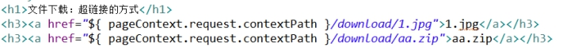 

l 如果浏览器支持这个格式的文件就会直接打开，如果浏览器不支持这个格式的文件才会提示下载。

## 1.10 文件下载的入门之手动编码的方式

### 1.10.1 手动编码的方式实现文件下载

#### 1.10.1.1 代码实现

- 文件下载的页面

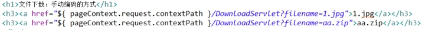 

- 文件下载的Servlet

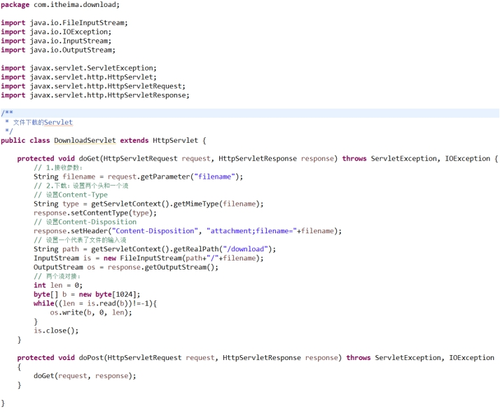 

## 1.11 中文文件的下载

### 1.11.1 中文文件的下载

#### 1.11.1.1 代码实现

- 中文文件的下载：（出现乱码问题）

  -  不同的浏览器对中文文件的下载的编码不一样的。

     -  IE浏览器采用的是URL编码

     -  Firefox浏览器采用的是Base64编码

  -  判断客户端使用的浏览器的类型

     -  User-Agent请求头可以获得客户端浏览器信息。

- 代码实现

 

## 1.1 给定目录下的文件下载之分析

### 1.1.1 案例需求

#### 1.1.1.1 需求描述

给定一个目录（这个目录可以是任意盘符下的任意路径—这个路径下有多少级目录，每级目录中有多少个文件都是未知的）。将这个路径中的文件显示到页面上，在页面上给每个问题件都提供响应下载的链接，当点击这个链接的时候，对该文件进行下载。

### 1.1.2 案例分析

#### 1.1.2.1 分析过程

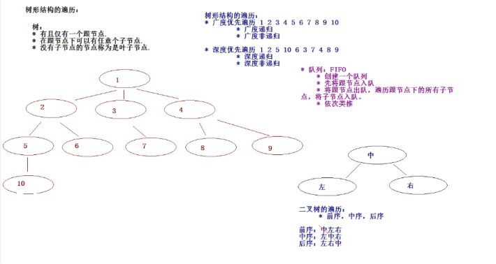 

 

## 1.1 给定目录下的文件下载之文件列表显示

### 1.1.1 文件列表显示

#### 1.1.1.1 代码实现

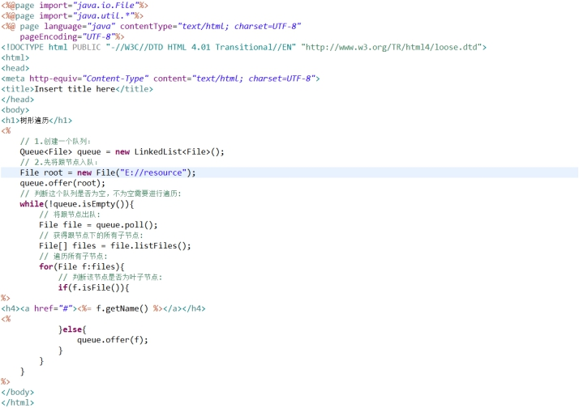 

 

## 1.1 给定目录下的文件下载之下载代码实现

### 1.1.1 文件下载

#### 1.1.1.1 代码实现

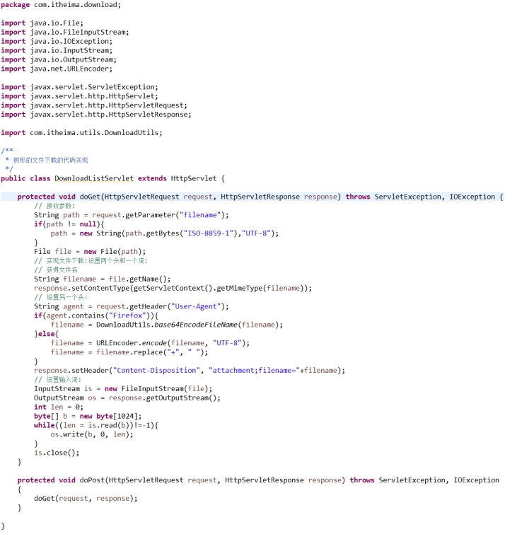 

 