jQuery

1.  jQuery的概述

2.  jQuery的核心函数(重点)

3.  jQuery的选择器(9类选择器)(重点)

4.  jQuery 的DOM操作(重点)

5.  jQuery 的事件操作(重点)

6.  ajax 入门(概述\\发生一个ajax异步请求)(了解)

# 一、jQuery概述

## jQuery介绍

> jQuery是一个快速、简洁的JavaScript框架，是继Prototype之后又一个优秀的JavaScript代码库（*或JavaScript框架*）。jQuery设计的宗旨是"write Less，Do More"，即倡导写更少的代码，做更多的事情。它封装JavaScript常用的功能代码，提供一种简便的JavaScript设计模式，优化HTML文档操作、事件处理、动画设计和Ajax交互。

1. 我们使用jquery可以更好完成以下操作

   - html文档操作，对于dom相关操作优化

   - jquery提供更加方便与丰富事件处理
   - jquery提供简单动画特效
   - jquery提供ajax交互

   我们知道，要使用任何一个js框架，都是需要导入相关的js文件。

2. 关于其它常用js框架:
   1. dojo 面向对象的js框架

   2. extjs 学习成本比较高 它提供大量的丰富组件，它效果展示非常好

   3. prototype 早期比较流行js框架

   4. angularJS 它是一个mvc js框架，它提供双向数据绑定。。

   jquery它的插件机制特别丰富,在开发中可以选择非常多的相关插件，例如，表单校验插件，树型结构。。。

## jQuery快速入门

[[http://jquery.com/]]jquery官网

jquery最新版本3.1.1 我们学习的版本1.8.3

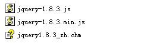{width="2.46875in" height="0.8125in"}

对于jquery它从jquery2.x以后对浏览器支持不是特别好。

在pc端开发使用比较主流的是1.x版本.

对于开发中， 我们需要导入的是min.js文件，在学习阶段我们导入 jquery-1.8.3.js.

完成操作:页面加载完成后，弹出一个框显示hello jquery.

第一步:导入js文件

<script type="text/javascript" src="js/jquery-1.8.3.js"></script>

第二步：完成操作

```js
$(function(){
alert(“hello jquery1”);
});
```

**注意:源生的js绑定，它只能绑定一次，而jquery允许绑定多次。**

# 二、jQuery核心函数(重点)

1.  三个核心函数的作用

    1.  jQuery(callback) 页面加载完成后，指定的函数执行

    2.  jQuery(html代码)它的作用是将一个dom对象包装成jquery对象。

    3.  jQuery(selector) 作用是用于在页面上查找，根据css选择器
2.  Dom对象转换成jQuery对象,jQuery对象转换成Dom对象
    1.  Dom对象转换成jQuery对象: \$(dom对象)\
    2.  jQuery对象转换成Dom对象: jquery对象\[0\] 或者 jquery对象.get(0)

{width="2.1678029308836395in" height="0.6145833333333334in"}

## 1. jQuery(callback)

jQuery(callback)它是\$(document).ready()的简写。

\$(document).ready(function(){});页面加载完成后，指定的函数执行。

```javascript
$(function(){
//最完成的写法
jQuery(document).ready(function(){
    alert("hallo jquery1");
});
//简写1
$(document).ready(function(){
    alert("hallo jquery2");
});
//简写2
jQuery(function(){
     alert("hallo jquery3");
});
//简写3
$(function(){
 alert("hallo jquery4");
});
});
```

在jquery的源代码

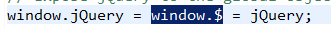{width="3.4479166666666665in" height="0.3020833333333333in"}

## 2. jQuery(html,*\[ownerDocument\]*)(重点)

jQuery(html代码)它的作用是将一个dom对象包装成jquery对象。

问题:什么是jquery对象?

我们的jquery中定义的方法与属性，只有jquery对象可以调用。

这个核心函数的作用是将一个dom对象包装成了jquery对象

而它的第一个参数是html代码.

它的第二个参数是可选，它用于设置dom的相关属性.

## 3. jQuery(\[selector,\[context\]\])

这个函数我们使用它的主要作用是用于在页面上查找，根据css选择器.

参数1(selector) 	 :就css选择器 jquery中提供了九种选择器

参数2(context)	   :就是指定要查找的dom集.

### 3.1 关于jquery对象与dom对象转换

对于dom对象------>jquery				对象 \$(dom)

对于jquery对象----->dom				 对象 jquery对象\[0\] 或 jquery.get(0)

<script type = "text/javascript" src = "js/jquery-1.8.3.js"></script><Script type = "text/javascript" >
$(function(){
   //得到div的dom对象
    var div = document.getElementById("d");
    //得到一个jQuery对象
    var jqueryDiv = $("#id");
    //转换dom转换成jquery
    $(div).html("hello jquery");
    //转换jquery转换成dom
    jqueryDiv.get(0).innnerHTML="hello jquery...........";
});
</Script>


# 三、jQuery选择器(重要)

## 1. 基本选择器

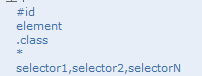{width="2.1041666666666665in" height="0.7916666666666666in"}

\#id 		     :根据 id属性查找一个元素

Element 	:根据元素的标签名称查找元素

.class		 :根据元素的class属性查找元素

\*                 :匹配所有元素

Select1,selector2...将每一个选择器匹配到元素合并后一起返回

### 练习

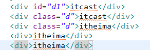{width="3.0416666666666665in" height="1.0416666666666667in"}

1.  得到id=d1的元素中的内容显示出

2.  将class=d元素中的内容后面添加欢迎你

3.  得到id=d1这个div在整个页面上是第几个.

4.  得到class=d的元素有几个

5.  将所有的class=d或id=d1元素中的内容设置为java

### 方法总结:

a.  html ()方法，无参数代表获取元素中的html代码，如果有参数代表设置元素的html信息

b.  text()方法，无参数代表获取元素中的文本信息，如果有参数代表设置元素的文本信息

c.  each()方法，它的使用可以帮助我们遍历元素，可以传递一个函数 each(function(n)),n就代表的是每一个元素的序号，在函数中可以通过this来获取其dom对象

d.  index()方法，它可以判断元素的序号

## 2. 层级选择器

层级选择器是根据元素的关系来获取。关系是指父子关系，兄弟关系

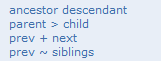{width="1.6770833333333333in" height="0.6354166666666666in"}

1.  空格 得到元素下的所有子元素(包含直接子元素与间接子元素)

2.  大于号\> 只获取直接的子元素

3.  加号+ 只获取直接的一个兄弟元素

4.  波浪线\~ 所有的后边的兄弟元素

### 练习 

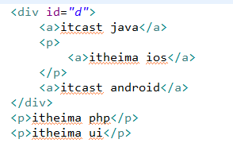{width="3.0625in" height="1.875in"}

1.  获取id=d的所有\<a\>子元素

2.  获取id=d 的直接\<a\>子元素

3.  获取id=d第一个\<p\>兄弟元素

4.  获取id=d的所有\<p\>兄弟元素

5.  将id=d下的所有子元素\<a\>的文字颜色设置成红色

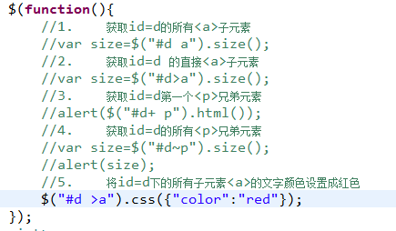{width="4.53125in" height="2.6458333333333335in"}

### 方法总结:

css()方法，它可以设置元素的样式,如果只有一个值 css(name,value),

如果有多个值,css({name:value,name:value})

## 3. 过滤器

过滤器它是在基本选择器与层次选择器获取到一批元素后，在进行过滤操作，使用过滤选择器基本都是":"开头，除了属性过滤选择器。

### 3.1 基本过滤选择器

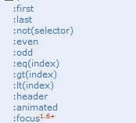{width="1.8125in" height="1.6354166666666667in"}

#### 练习 

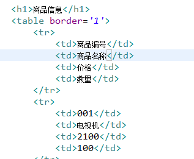{width="3.3020833333333335in" height="2.71875in"}

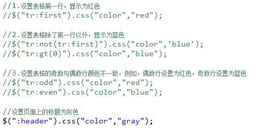{width="5.447916666666667in" height="2.6354166666666665in"}

### 3.2 内容过滤选择器

内容过滤选择器它是根据元素内部文本内容进行选中。

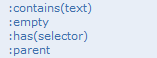{width="1.6354166666666667in" height="0.6041666666666666in"}

#### 练习

```html
<div>itcast java</div>
<div>itcast ios</div>
<div></div>
<div>
	<a>传智播客</a>欢迎您
</div>
<div>
	世界第一语言<a>java</a>
</div>
<div>
	<span>今天天气好晴朗</span>
</div>
```


```javascript
$(function(){

    //1.设置含有文本内容java的div字体颜色为红色

    //$("div:contains('java')").css("color","red");

    //2.设置没有子元素的div文本内容为"这是一个空div"

    $("div:empty").html("这个一个空div标签");

    //3.包含<a>元素的div字体颜色为黄色

    $("div:has(a)").css("color","yellow");

    //设置所有含有子元素的span字体为蓝色

    $("span:parent").css("color","blue");

});
```


### 3.3 可见性过滤选择器

可见性过滤选择器它匹配display:none或表单中input hidden这样的元素.

{width="1.3125in" height="0.34375in"}

#### 练习

<form >
	<input type="text" name="email" /><br>
	<input type = "hidden" name = "id" value="10" />
</form>
<table>
	<tr style = "display: none">
		<td>Value 1</td>
	</tr>
	<tr>
		<td>Value 2</td>
	</tr>
	<tr>
		<td>Value 3</td>
	</tr>
</table>


<script type="text/javascript" src="../js/jquery-1.8.3.js"></script>
<script type="text/javascript">
$(function(){
	//1.获取变得中隐藏域的值
	var value = $("input:hidden").val();
	alert(value);
	//2.设置table中所有可见的tr背景改为蓝色
	$("tr:visible").css("background-color","blue");
	//3.获取table中所有隐藏tr中文本值
	alert($("tr:hidden").text());
	//4.并将隐藏的tr显示出来
	$("tr:hidden").show();
	//原来显示的tr隐藏起来
	//$("tr:visible").hide();
});
</script>

#### 方法总结

1.  val() 获取元素当前的值 value值

2.  show() 让元素显示出来

3.  hide() 让元素隐藏起来

### 3.4 属性过滤选择器

根据元素的属性来过滤

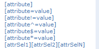{width="2.125in" height="1.0625in"}

\^=匹配开始

\$=匹配结尾

\*=匹配包含

#### 练习

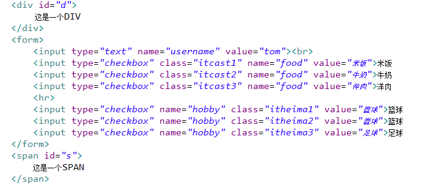{width="5.768055555555556in" height="2.4814654418197724in"}

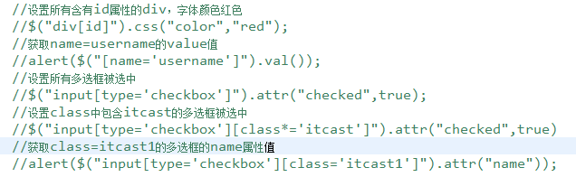{width="5.768055555555556in" height="1.7778160542432195in"}

#### 方法总结

attr()设置或返回被选元素的属性值。

### 3.5 子元素过滤选择器

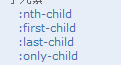{width="1.2604166666666667in" height="0.6770833333333334in"}

根据子元素顺序来获取。

nth-child根据序号来选择，序号是从1开始,也可以设置odd even 根据奇偶来设置

也可以通过倍数来设置

first-child 获取第一个

last-child 获取最后一个

only-child 获取只有一个子元素

#### 练习 

```html
<ul>
	<li>JAVA</li>
	<li>IOS</li>
	<li>PYTHON</li>
	<li>C++</li>
</ul>
<ul>
	<li>丽颖</li>
	<li>许晴</li>
	<li>杨紫</li>
</ul>
<ul>
	<li>NodeJS</li>
</ul>
```

```javascript
<script type="text/javascript" src="../js/jquery-1.8.3.js"></script>
<script type="text/javascript">
$(function(){
	//设置列表中的第2个li字号30
	$("ul li:nth-child(2)").css("font-size",30);
	//设置列表中的第一行字体为红色
	$("ul li:first-child").css("color","red");
	//设置列表中最后一行字体为蓝色
	$("ul li:last-child").css("color","blue");
	//获取ul下只有一个li的信息
	alert($("ul li:only-child").html());
});
</script>
```


### 3.6 表单过滤选择器

表单过滤选择器是用于选取表单中的元素

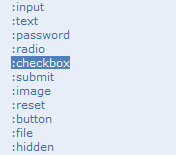{width="1.8333333333333333in" height="1.6145833333333333in"}

#### 练习

```html
<form >
	username:<input type="text" name="username"><br>
	password:<input type="password" name="password"><br>
	<input type="button" value="按钮">
</form>
```

```javascript
<script type="text/javascript" src="../js/jquery-1.8.3.js"></script>
<script type="text/javascript">
$(function(){
	//当username与password失去焦点后,判断录入的数据不为空
	$(":text,:password").blur(function(){
		//获取数据
		var value = $(this).val();
		if(value.trim() ==""){
			alert($(this).attr("name")+"不能为空");
		}
	});
	
	//对button添加点击事件,提交form表单
	$(":button").click(function(){
		$("form").submit();
	});
});
</script>
```


#### 方法总结

1.  trim()它是去掉字符串左右空格

#### 常用事件处理

2.  失去焦点事件 blur(function(){})

3.  click(function(){}) 点击事件

4.  submit() 表单提交

### 表单对象属性过滤选择器

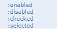{width="1.1875in" height="0.6979166666666666in"}

checked它是用于radio,checkbox 判断选中

selected它是用于select下拉框选中。

练习

```html
<form >
性别:
	<input type="radio" name="sex" value="男">男
	<input type="radio" name="sex" value="女">女
	<hr>
爱好:
	<input type="checkbox" name="hobby" class="itheima1" value="篮球">篮球
	<input type="checkbox" name="hobby" class="itheima2" value="排球">排球
	<input type="checkbox" name="hobby" class="itheima3" value="足球">足球
	<hr>
城市:
	<select>
		<option value="">--请选择--</option>
		<option value="北京">北京</option>
		<option value="上海">上海</option>
		<option value="深圳">深圳</option>
	</select>
	<br>
	<input type="button" value="打印">
</form>
```

```javascript
<script type="text/javascript" src="../js/jquery-1.8.3.js"></script>
<script type="text/javascript">
$(function(){
	//点击按钮,打印radio checkbox select中的选中的项
	$(":button").click(function(){
		//获取选中的性别
		alert($(":radio:checked").val());
		//获取多选框
		$(":checkbox:checked").each(function(){
			alert($(this).val());
		});
		//得到下拉框中的选中值
		alert($("select option:selected").val());
	});
});
</script>
```

我们在开发中，使用比较多的选择器有:

1.  基本选择器 class id element

2.  层次选择器 父子关系 兄弟关系

3.  过滤选择器 属性过滤 基本过滤 内容过滤 关于表单过滤

# jQuery DOM操作

## 文档处理

### 插入操作

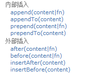{width="1.9895833333333333in" height="1.5416666666666667in"}

#### 练习

```html
<h1>班级</h1>
<select id="edu">
		<option value="小学">小学</option>
		<option value="中学">中学</option>
		<option value="本科">本科</option>
</select>
```

```javascript
<script type="text/javascript" src="../js/jquery-1.8.3.js"></script>
<script type="text/javascript">
$(function(){
	//内部插入
	//1.在select中开始添加一项<option value="学前班">学前班</option>
	//$("#edu").prepend($("<option value='学前班'>学前班</option>"));
	//$("<option value='学前班'>学前班</option>").prependTo($("#edu"));
	//2.在select最后添加一项<option value='研究生'>研究生</option>
	//$("#edu").append($("<option value='研究生'>研究生</option>"));
	//$("<option value='研究生'>研究生</option>").appendTo($("#edu"));
	//外部插入
	//1.在select中开始添加一项<option value="学前班">学前班</option>
	$("#edu option:first").before($("<option value='学前班'>学前班</option>"));
	$("#edu option:last").after($("<option value='研究生'>研究生</option>"));
	
	
});
```

### 删除

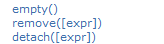{width="1.7083333333333333in" height="0.4583333333333333in"}

#### 练习

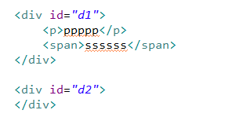{width="3.1354166666666665in" height="1.6041666666666667in"}

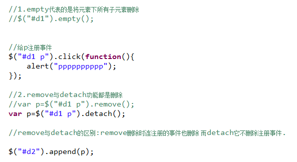{width="5.768055555555556in" height="3.1517344706911636in"}

### 替换与克隆

替换操作

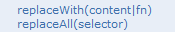{width="1.8229166666666667in" height="0.3333333333333333in"}

克隆操作

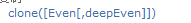{width="1.9895833333333333in" height="0.23958333333333334in"}

#### 练习

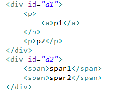{width="2.46875in" height="1.9895833333333333in"}

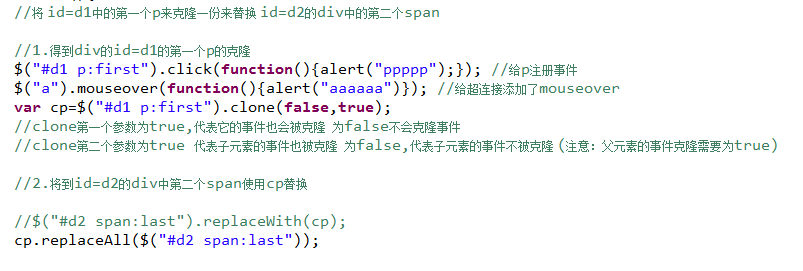{width="5.768055555555556in" height="1.946719160104987in"}

### 综合练习

```html
<div align="center">
	<table id="tab" border="1">
	<tr>
		<td>姓名</td>
		<td>电话</td>
		<td>邮箱</td>
		<td>删除</td>
	</tr>
	</table>
	<hr>
	姓名:<input type="text" id="username"> 
	电话:<input type="text" id="phone"> 
	邮箱:<input type="text" id="email"> 
	<input type="button" value="添加">
</div>
```

```javascript
<script type="text/javascript" src="../js/jquery-1.8.3.js"></script>
<script type="text/javascript">
$(function(){
	//给添加按钮加上点击事件
	$(":button").click(function(){
		//创建一个tr
		var tr= $("<tr></tr>");
		//创建四个td项tr中添加内容
		var td1 =$("<td></td>");
		td1.append($("#username").val());
		var td2 =$("<td></td>");
		td1.append($("#phone").val());
		var td3 =$("<td></td>");
		td1.append($("#email").val());
		var td4 =$("<td></td>");
		//创建一个连接
		var a = $("<a href='javascript:void(0)'>删除</a>");
		td4.append(a);
		//完成删除功能
		a.click(function(){
			//$(this).parent().parent().remove()
			$(this).parents("tr").remove();
		});
		
		//将td添加到tr中
		tr.append(td1).append(td2).append(td3).append(td4);
		//将rt添加到table中
		$("#tab").append(tr);
	});
});
</script>
```


## 筛选

### 过滤

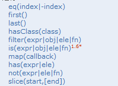{width="2.0729166666666665in" height="1.5104166666666667in"}

过滤操作它相当于是我们在jquery中使用的过滤选择器，

例如 eq可以根据序号来获取元素 first与last来获取第一个元素与最后一个元素

### 查找

{width="2.0729166666666665in" height="2.0833333333333335in"}

是通过当前元素，获取祖先元素，父元素子元素等。

find方法，它可以直接来查找指定的元素.

# jQuery事件机制

## jQuery事件介绍

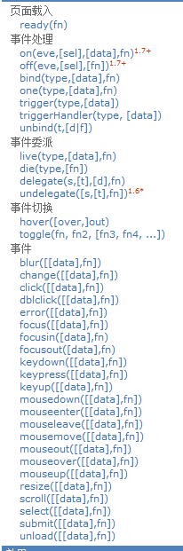{width="2.1458333333333335in" height="6.46875in"}

Jquery中的事件与传统的javascript中事件区别:

Jquery中事件允许绑定多个函数，而javascript中一个事件只能绑定一个函数.

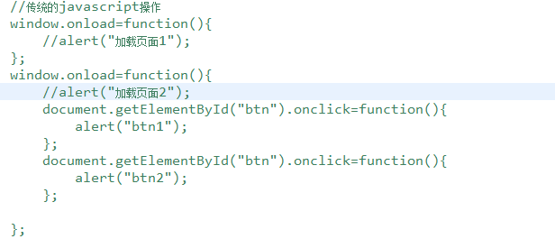{width="5.768055555555556in" height="2.4814654418197724in"}

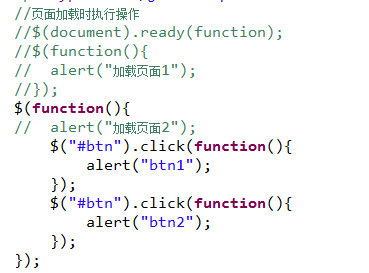{width="3.84375in" height="2.84375in"}

## 事件绑定

### 传统的javascript中事件绑定操作

写法一

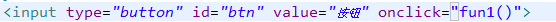{width="5.768055555555556in" height="0.22823272090988628in"}

写法二

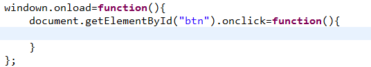{width="5.583333333333333in" height="1.0104166666666667in"}

### Jquery事件绑定操作

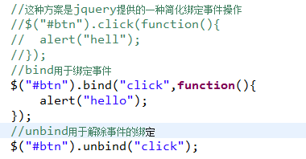{width="3.9583333333333335in" height="2.0625in"}

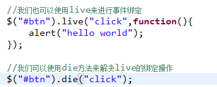{width="3.7083333333333335in" height="1.4895833333333333in"}

问题 bine与live它们的区别?

{width="5.768055555555556in" height="1.5782042869641295in"}

## 一次性事件和自动触发

### 一次性事件

one()为每一个匹配元素的特定事件（像click）绑定一个一次性的事件处理函数。

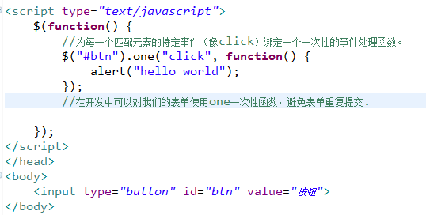{width="5.604166666666667in" height="2.8333333333333335in"}

### 事件触发

trigger()在每一个匹配的元素上触发某类事件

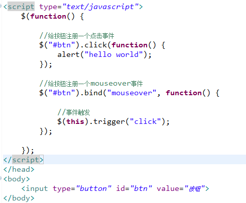{width="5.104166666666667in" height="4.197916666666667in"}

## 事件切换

- ### hover


这个操作它可以绑定两个函数，当触发mouseover时第一个函数执行，当触发mouseout时第二个函数执行。

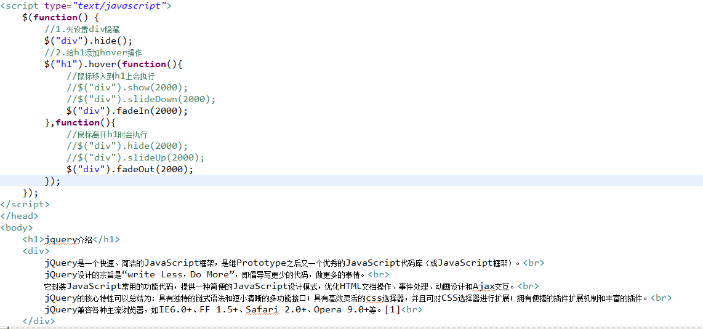{width="5.768055555555556in" height="2.70244094488189in"}

- ### toggle


用于绑定两个或多个事件处理器函数，以响应被选元素的轮流的 click 事件。

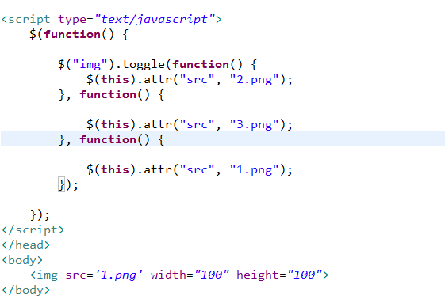{width="5.768055555555556in" height="3.8453707349081365in"}

# Javaweb-AJAX

# AJAX概述

## AJAX介绍

AJAX 是一种用于创建快速动态网页的技术。

AJAX即"Asynchronous Javascript And XML"（异步JavaScript和XML），是指一种创建交互式[网页](http://baike.baidu.com/view/828.htm)应用的网页开发技术。

AJAX = 异步 [JavaScript](http://baike.baidu.com/view/16168.htm)和[XML](http://baike.baidu.com/view/63.htm)（[标准通用标记语言](http://baike.baidu.com/view/5286041.htm)的子集）。

通过在后台与服务器进行少量数据交换，AJAX 可以使网页实现异步更新。这意味着可以在不重新加载整个网页的情况下，对网页的某部分进行更新。

传统的网页（不使用 AJAX）如果需要更新内容，必须重载整个网页页面。

AJAX 的核心是 JavaScript 对象 XMLHttpRequest。该对象在 Internet Explorer 5 中首次引入，它是一种支持异步请求的技术。简而言之，XMLHttpRequest使您可以使用 JavaScript 向服务器提出请求并处理响应，而不阻塞用户。

AJAX不是一种新的编程语言，而是一种用于创建更好更快以及交互性更强的Web应用程序的技术。

## AJAX优点

使用Javascript向服务器提出请求并处理响应而不阻塞用户！核心对象XMLHTTPRequest。通过这个对象，您的 JavaScript 可在不重载页面的情况与Web服务器交换数据，即在不需要刷新页面的情况下，就可以产生局部刷新的效果。

AJAX 在浏览器与 Web 服务器之间使用异步数据传输（HTTP 请求），这样就可使网页从服务器请求少量的信息，而不是整个页面。

AJAX 可使因特网应用程序更小、更快，更友好

## AJAX工作原理

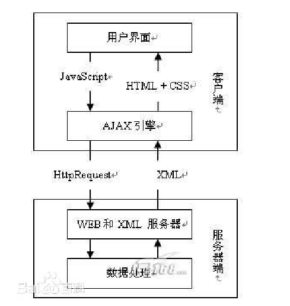{width="5.09375in" height="5.364583333333333in"}

## AJAX应用

### AJAX快速入门

创建一个demo1.html

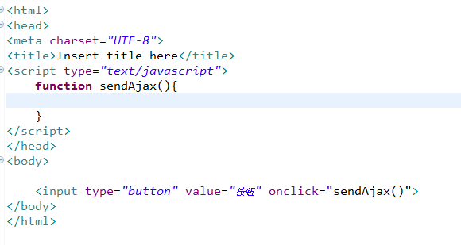{width="5.768055555555556in" height="3.0729582239720035in"}

如何发送一个ajax请求?

### 第一步:获取一个XMLHttpRequest对象

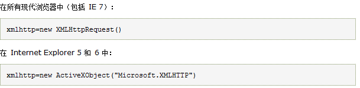{width="5.768055555555556in" height="1.420650699912511in"}

### 第二步:设置一个回调函数

回调函数它的作用就是用于处理服务器响应的数据

通过XMLHttpRequest对象的onreadystatechange设置回调函数

### 第三步:设置请求方式GET/POST及请求的URL等

通过XMLHttpRequest对象的open方法

### 第四步:真正向服务器发送请求

通过XMLHttpRequest对象的send方法

### 第五步:在回调函数中获取服务器响应的数据

通过XMLHttpRequest对象的responseText
