## 1． XMLHttpRequest对象详解

### 1.1． 获取XMLHttpRequest 对象

对于大部分浏览器可以直接通过 new XMLHttpRequest();

对于IE5  IE6 new ActiveXObject("Microsoft.XMLHTTP")

 

### 1.2． XMLHttpRequest常用属性

1. onreadystatechange 它是用于绑定回调函数，当服务器响应数据回来后，我们可以在指定的回调函数中进行数据处理。

2. readyState 它描述的http请求的状态

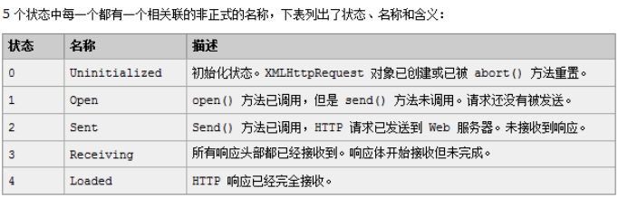 

3. status 它描述的http状态码  200 404  405 500…

4. 获取服务器响应数据

responesText或responseXML来获取

 

### 1.3． XMLHttpRequest常用方法

1. open它是用于设置请求方式，url及是否异步

参数1：HTTP 请求方式  POST/GET。

参数2:url路径

参数3:true/false 代表是否异步

 

2. send它是真正向服务器发送请求

如果请求方式是get，那么我们使用send(null) 原因:get请求方式是没有http请求体

只有post请求方式时，才有请求体,所以send的参数只是在post请求时使用例如

Xmlhttp.send(“username=xxx&password=xxx”);

 

3. setRequestHeader

注意：如果请求方式是POST,那么我们在使用时，必须设置一个请求头，就需要使用setRequestHeader方法来完成

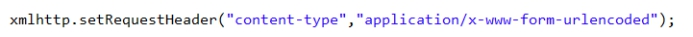 

 

# 一、 AJAX案例

## 1． 案例1-验证用户名是否可以使用

### 1.1． 第一步:创建一个页面demo2.html

 

 

### 1.2． 第二步:完成浏览器向服务器发送ajax请求操作

1. 得到文本框中录入信息

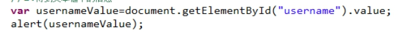 

 

2. 使用ajax来完成向服务器发送请求操作

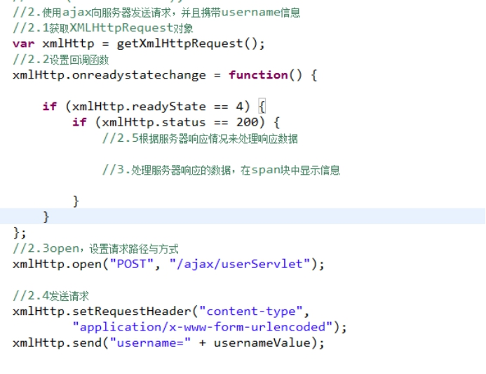 

 

### 1.3． 第三步:完成服务器端操作

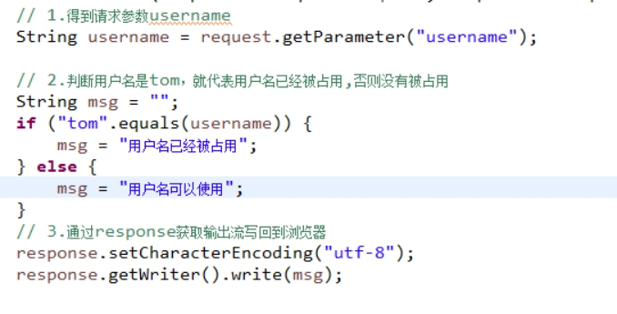 

 

### 1.4． 第四步:在浏览器端展示数据

1. 在浏览器展示

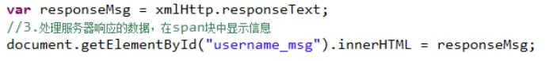 

2. 修改服务器端响应数据

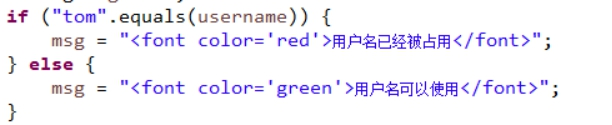 

 

## 2． 案例2-省市二级联动

### 2.1． 第一步:创建demo3.html页面

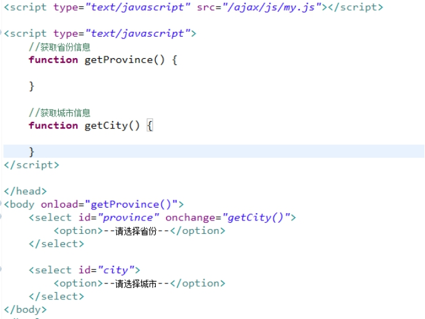 

 

### 2.2． 第二步:在服务器端创建一个工具类CityUtil它可以获取省份与城市信息

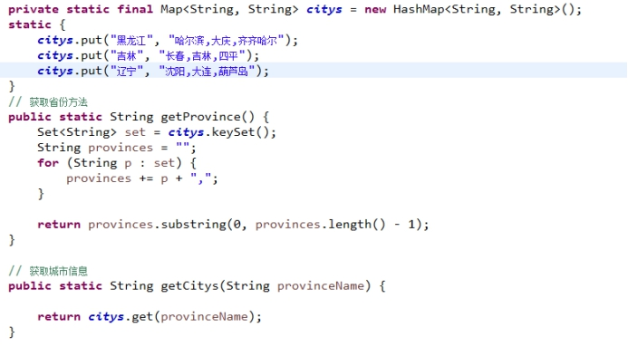 

创建ProvinceServlet

创建CityServlet

### 2.3． 第三步:向服务器发送请求获取省份信息填充到省份下拉框

1. 在demo3.html页面上向服务器发送ajax请求

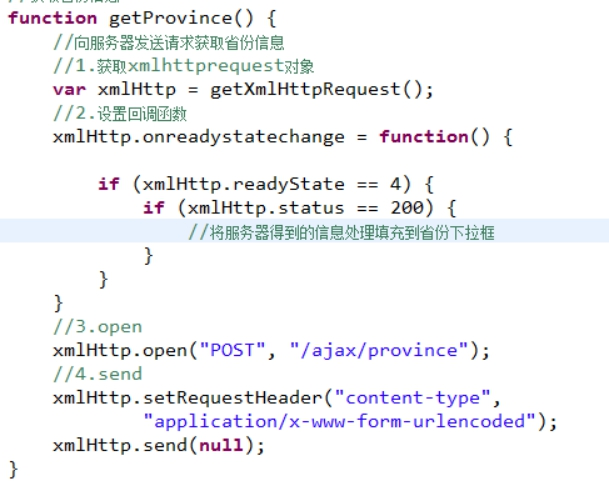 

2. 服务器响应省份信息

 

3. 在浏览器端处理服务器响应的数据，显示在省份下拉框

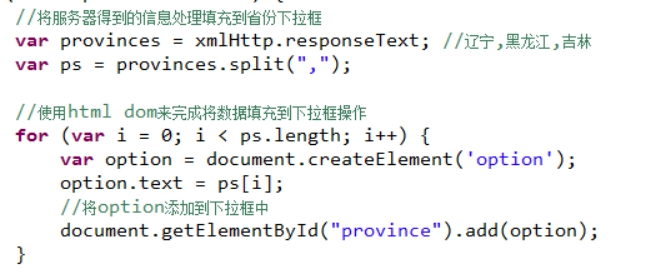 

### 2.4． 第四步:选择省份信息，向服务器发送请求获取城市信息填充到城市下拉框

1.获取省份名称

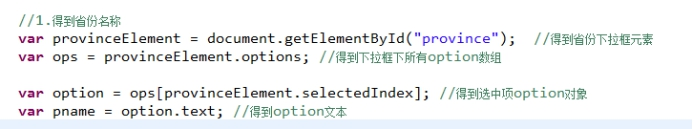 

2.向服务器发送请求，将省份名称做为参数传递到服务器，服务器根据省份名称查询对应的城市信息

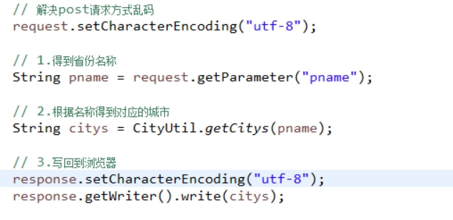 

 

3.在浏览器端处理数据填充到城市下拉框中

注意:在向城市下拉框中添加信息前要先进行一次清空操作

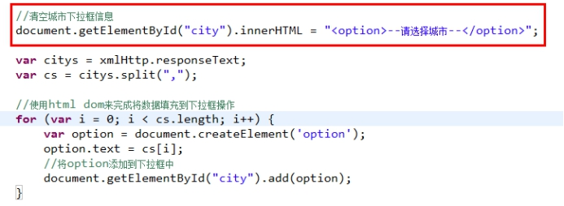 

 

# 二、 jQueryAjax编程

## 1． jquery ajax开发介绍

 

 

1.$.ajax()它是jquery提供的最基本的ajax编程方式。它的功能比较强大，但是使用比较麻烦，一般不使用，它是将远程数据加载到XMLHttpRequest对象中。

2.load  get  post 它们简化了$.ajax操作，get post针对get与post请求的，它们是开发中使用的比较多。

3.getScript  getJSON 它们是用于解决ajax跨域问题的。

 

## 2． load使用(了解)

载入远程 HTML 文件代码并插入至 DOM 中.

实现一个用户名验证是否可以使用案例

 

### 2.1． 浏览器端

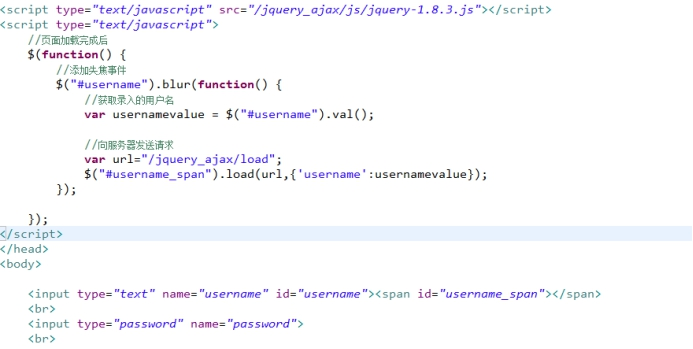 

注意事项:

1. load方法是将服务器响应的数据直接插入到指定的dom元素中。

2. jquery中的load方法它的请求方式是什么?

a) 如果有参数请求方式是post

b) 如果没有参数请求方式是get

### 2.2． 服务器端

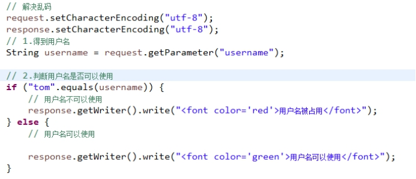 

## 3． $.ajax介绍（了解）

$.ajax它是jquery中最基本的ajax操作，load  get  post都简化了$.ajax操作.

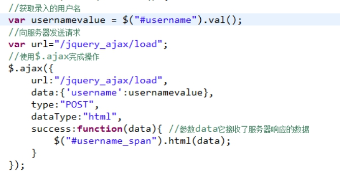 

 

## 4． $.post与$.get介绍（重要）

$.get与$.post它们针对于get与post请求

格式

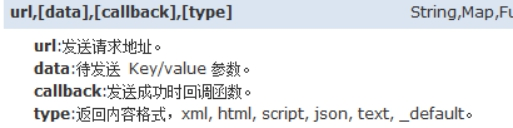 

 

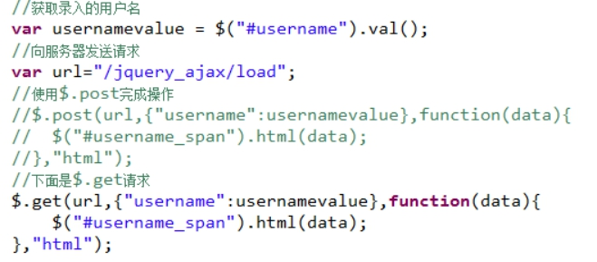 

## 5． jQuery ajax开发基于json(重点)

### 5.1． json介绍

[JSON](http://baike.baidu.com/view/136475.htm)([JavaScript](http://baike.baidu.com/view/16168.htm) Object Notation) 是一种轻量级的数据交换格式.

json简单说就是javascript中的对象和数组.

对象: {key：value,key：value,...}

数组: ["java","javascript","vb",...]

注意:在json中它的两种结构可以互相嵌套

{key:[value1,value2],key:value}

[{name:xxx},{key:value},{key:value}]

### 5.2． Fastjson介绍

将java的对象转换成json数据,也可以将一个json转换成java对象(不常用).

Fastjson是阿里提供的一个开源json插件.

对于json处理的插件   fastjson   jsonlib   flexjson  Jackson.

 

Fastjson使用介绍

1. 导入相应的jar包

 

 

2. 演示fastjson将java对象转换成json数据

String  json=JSONObject.toJsonString(java对象);

 

问题:将java对象转换成json时，名称是否可以自己来指定?

 

问题:如果java对象中存在日期类型属性java.util.Date,是否可以用指定的格式来转换成json。

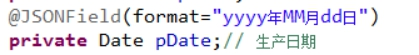 

问题:如果java类中的某些属性不想生成json中？

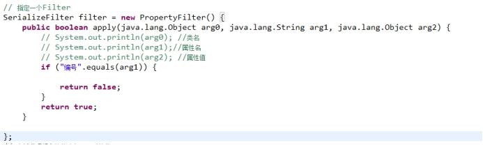 

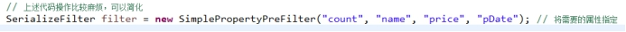 

 

问题:关于fastjson将java对象转换成json时的循环引用问题?

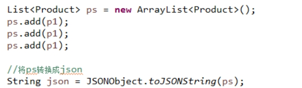 

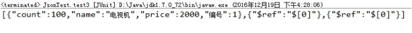 

通过以下设置可以取消循环引用

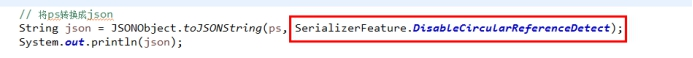 

### 5.3． 案例1-显示商品信息

步骤 :

1. 创建一个html页面，页面上有一个”显示商品”连接

2. 当我们点击页面上的连接时，向服务器发送ajax请求，获取商品信息.

3. 服务器得到商品信息List<Product>,将集合信息转换成json响应到浏览器端。

4. 在页面上来处理服务器响应回来的数据。

 

代码完成:

1. 向服务器发送请求操作

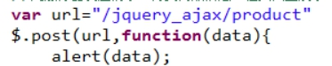 

2. 在服务器端获取商品信息，并响应到浏览器

 

 

3. 在浏览器端来处理服务器响应的数据展示出来

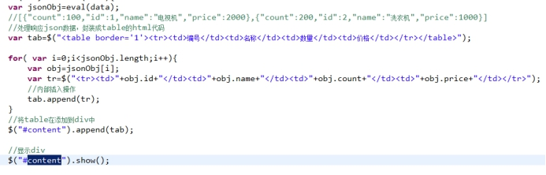 

 

### 5.4． 案例2-省市二级联动

#### 分析:

1. 会向服务器发送两次请求，第一次是页面加载完成后，获取省份信息

选择省份后，向服务器发送请求来获取相关的城市信息。

 

2. 省份与城市信息

Province对应省份信息类

City对应城市信息类

我们自定义相关的信息

Map<Province,List<City>>用来存储省份与城市信息。

 

#### 代码实现

1.完成服务器端操作

a.创建Province与City类

b.创建Map集合来封装数据

c.创建一个Servlet来处理浏览器端的请求。

2.关于浏览器端操作

​	a.页面加载完成后，要向服务器发送请求，来获取省份信息，添加到省份下拉框中。

​	b.当选择某一个省份后,chang事件触发，根据选择的省份，向服务器发送请求来获取对应的城市信息添加到城市的下拉框中。

 

问题:我们是通过一个CityServlet来处理这两次请求？

​	我们可以在请求中添加一个参数来判断这次请求操作要完成什么功能。

​	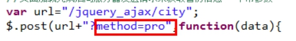

​	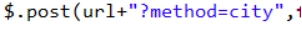

1.向服务器发送请求来获也能省份信息添加到省份下拉框

​	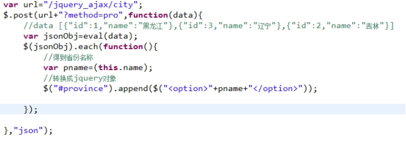

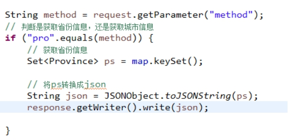 

 

2.当选择了省份信息后，要根据省份名称来向服务器发送请求获取对应的城市信息添加到城市的下拉框中。

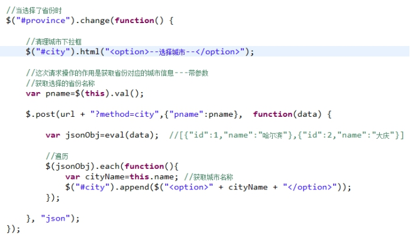 

 

 

## 6． jQuery ajax开发基于xml(了解)

### 6.1． XStream介绍

可以使用XStream工具来完成xml与java对象之间的转换。它也可以完成java对象与json之间的转换。

问题:XStream使用时需要导入哪些jar包？

 

 

 

问题:XStream怎样将java对象转换成xml?

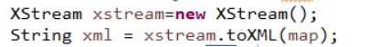 

#### 关于XStream相关的常用方法

​	1.设置别名

​	

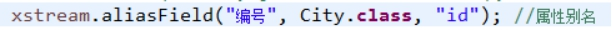 

​	2.忽略属性

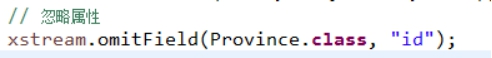 

3.将类的属性设置成xml中字段的属性

​	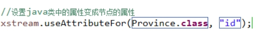

#### 注解使用

要想使用XStream的注解，必须开启注解扫描.

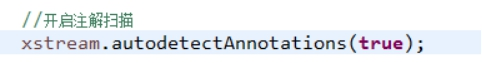 

 

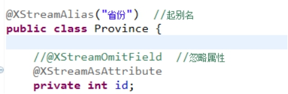 

 

### 6.2． 案例-返回xml完成省市二级联动操作

#### 服务器端操作

返回的是xml数据

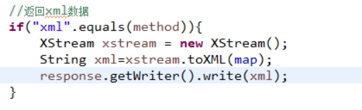 

 

#### 浏览器端操作

创建html页面

注意:发送请求后，服务器返回的xml数据中已经包含了省份与城市信息。不需要在发送第二次请求。

问题:怎样在返回的xml中获取省份名称?

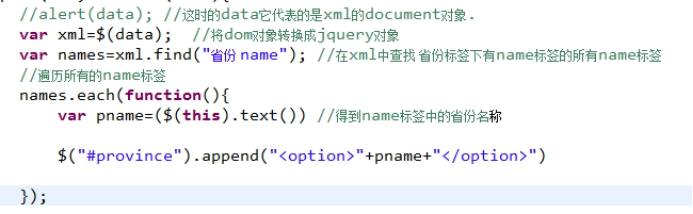 

 

问题:选择省份后如何将对应的城市信息添加到城市下拉框中?

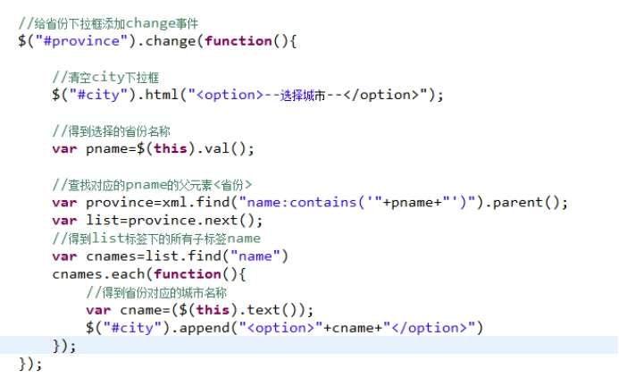 

 

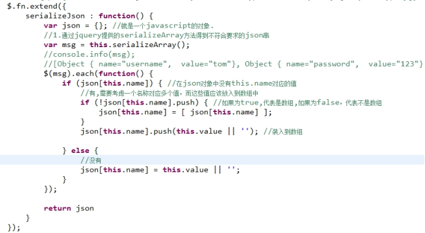 

 