# 一、 Ajax跨域问题

## 1． 跨域介绍

### 1.1． 什么是跨域

跨域它是不同的域名(服务器)之间的相互的资源的访问。

当协议，域名，端口号任意一个不相同，它们就是不同的域。

正常情况下，因为浏览器安全问题，不同域的资源是不可以访问的。

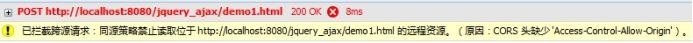 

### 1.2． 跨域解决方案

什么情况下会使用到跨域？

一般情况是在自己的内部的工程中会出现跨域情况。

有三种解决方案:

1. 代理方案 前端页面访问本地的服务器，本地服务器访问其它域的资源，它是服务器端的跨域问题解决。
2. jsonp JSONP(JSON with Padding)是[JSON](http://baike.baidu.com/view/136475.htm)的一种“使用模式”，可用于解决主流浏览器的跨域数据访问的问题。由于同源策略，一般来说位于 server1.example.com 的网页无法与不是 server1.example.com的服务器沟通，而 HTML 的<script> 元素是一个例外。利用 <script> 元素的这个开放策略，网页可以得到从其他来源动态产生的 JSON 资料，而这种使用模式就是所谓的 JSONP。用 JSONP 抓到的资料并不是 JSON，而是任意的JavaScript，用 JavaScript 直译器执行而不是用 JSON 解析器解析。

3. XHR2全称XMLHttpRequest Level2它是HTML5提供的方法，一般是在移动开发中使用。

 

## 2． jQuery解决跨域操作

在jquery中我们可以使用$.ajax,$.getJSON,$.getScript来解跨域问题。

### 2.1． $.ajax解决跨域问题

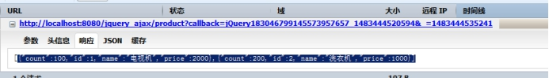 

关于json与jsonp格式的区别

Json格式 :[value1,value],{name:value}

Jsonp格式: callback(json)  

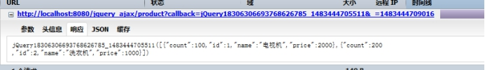 

 

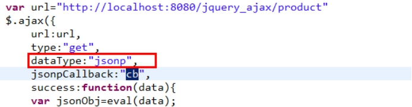 

 

### 2.2． Jquery中如何使用jsonp完成跨域问题

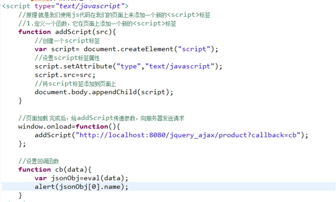 

### 2.3． $.getJSON解决跨域问题

$.getJSON它就是$.ajax解决跨域问题的简化操作。

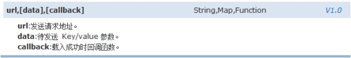 

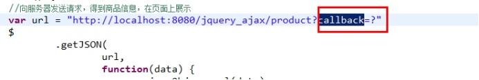 

# 二、 jQuery案例-分页操作

涉及到的技术点:

1.前端使用bootstrap的分页组件来完成数据分页显示。

2.服务器端使用javaee经典三层架构

3.使用c3p0连接池，dbutils来完成数据库操作。

### 0.1． 分页介绍

问题:为什么分页?

因为数据量比较大，为了用户有更好的体验。一般情况下，数据在展示时都会进行分页操作。

#### 分页的种类

​	分页有两种:

1.物理分页 :使用数据库本身提供的分页操作来完成数据查询，查询到的就是当前页的信息。例如mysql可以使用limit  oracle数据库可以使用rownum来宛成。这种方案的优点是性能比较好，但是它存在不通用问题。

 页码:  

1    1-10    (1-1)*10+1

2    11-20   (2-1)*10+1

3    21-30   (3-1)*10+1

页码  (页码-1)*每页显示的总条数 + 1

 

1 0—9   (1-1)*10

2 10-19   (2-1)*10

3 20-29   (3-1)*10

页码      (页码-1)*每页的总条数

 

 Select * from user limit 1,10;

  Select * from user limit 11,10;

2.逻辑分页 ：它是利用数据库的游标来操作 （将数据库所有数据都查询出来，存储在内存中），性能比较低，但是它通用。

​	现在开发中一般使用的比较多的是物理分页。

#### 分页基本原理

分页实现可以使用ajax分页，也可以使用服务器端分页，它们原理是一样的。

 

Mysql中的limit如何完成分页数据查询操作

Select * from 表名  limit num1,num2;

Num1代表的是从第几行开始查询，起始值是0.

Num2代表的是要查询几条记录。

例如查询第二页数据(每页显示5条)

Select * from product limit (页码-1)*每页条数,(每页条数);

 

完成分页操作必备条件:

1. 页码pageNo  默认是1 会根据上一页，下一页，首页尾页选择变化，我们通过js来控制。

2. 每页显示条数pageSize 人为设置。

3. 总条数

4. 总页数=总条数/每页显示条数 (要取整)

5. 封装的当前页的数据。

### 0.2． JAVAEE三层架构

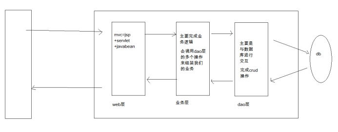 

采用三层架构优点:利用开发与复用 结构清晰，利用标准化。

三层:

Web层：它主要包含的关于javaweb相关操作，例如request,response,session对象操作，它调用业务层来实现具体的功能。

业务层(service层):它主要是业务逻辑操作，它不包含web常用对象，它只是java代码。

数据访问层(dao层):它主要是与数据库进行交互，完成crud操作。

缺点:开发难度加大，性能得到一定的消耗。

### 0.3． Bootstrap分布组件使用介绍

注意：在使用bootstrap的分页组件时，需要导入相关的css文件与js文件，并且bootstrap它依赖于jquery,在导入bootstrap的js文件前要导入jquery的js文件，并且它的版本要求必须是1.9.1以上版本.

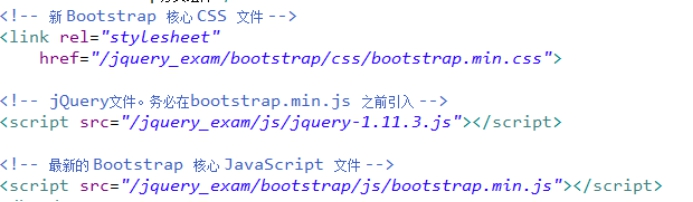 

 

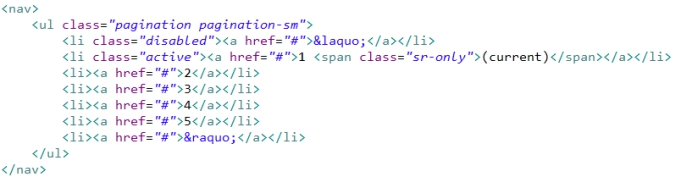 

 

### 0.4． 代码实现

#### 完成前期准备工作

##### 相关的jar包的导入

​	C3p0连接池jar  

 Dbutils

 json处理的相关jar包

mysql的驱动jar

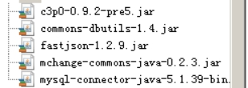 

##### 创建服务器端的结构

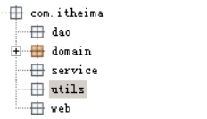 

##### 创建实体类Product

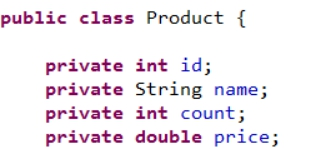 

##### 需要c3p0连接池

​	我们创建一个JdbcUtils 工具类，在使用dbutils的QueryRunner时需要Connection对象或DataSource对象

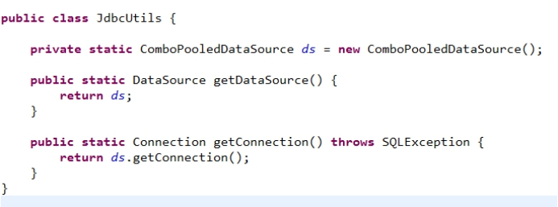 

 

### 0.5． 完成所有产品的查询操作

#### 第一步：创建产品页面，向服务器发送请求（获取所有产品信息）

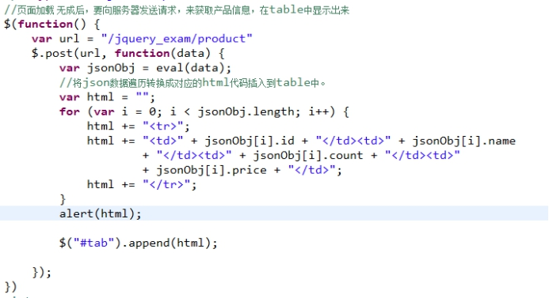 

#### 第二步:创建一个servlet来接收请求，获取所有的产品信息

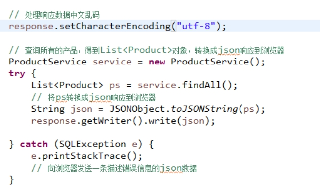 

#### 第三步:创建业务层ProductService

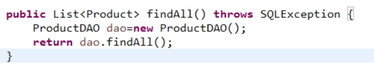 

#### 第四步：创建持久化层ProductDAO

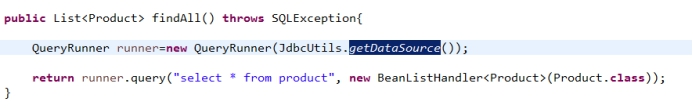 

### 0.6． 完成产品的分页显示

#### 第一步:在浏览器端提供pageNo与pageSize,将它们做为参数传递到服务器

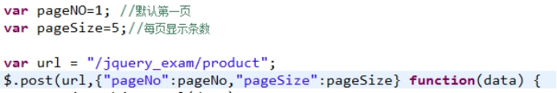 

#### 第二步:服务器来处理分页

Web

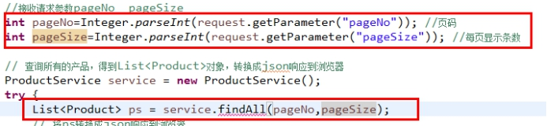 

Service

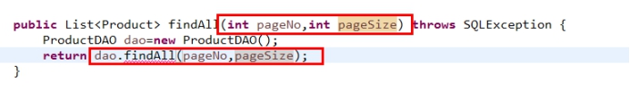 

Dao

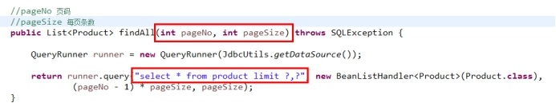 

 

问题:怎样在浏览器端展示分页条?

在分页条中需要总页数据，也就是说，总页数我们需要在服务器端查询获得到，需要服务器端返回它,我们可以定义一个PageBean这样一个对象，在这个PageBean中我们封装分页需要的数据，将它在服务器端生成，服务器端就不需要直接返回List<Product>,.面是返回一个PageBean的json数据。

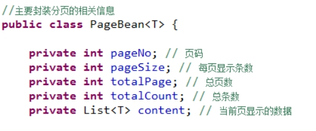 

我们可以在service中来对PageBean进行数据封装，servlet最终是将PageBean转换成json响应到浏览器。

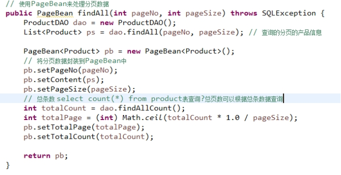 

 

响应到浏览器的json数据

````properties
{"content":[{"count":100,"id":1,"name":"电视机","price":2000},{"count":200,"id":2,"name":"洗衣机","price":1000},{"count":300,"id":3,"name":"空调","price":3000},{"count":50,"id":4,"name":"投影仪","price":2000},{"count":100,"id":5,"name":"HP电脑","price":4000}],"pageNo":1,"pageSize":5,"totalCount":11,"totalPage":3} 
````

#### 第三步 在浏览器端展示分页信息

##### 关于数据展示

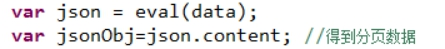 

##### 关于分页条码

它是一个动态生成的数据，我们需要拼接html代码来完成

###### a.处理当前页高亮显示

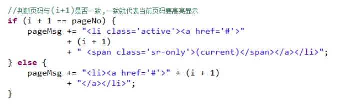 

###### b.跳转到指定的页

修复操作:

​	1.在真正生成数据与分页条前将数据清空并恢复成原始状态

​	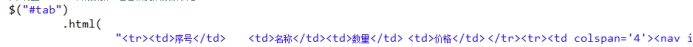

​	2.处理参数pageNum

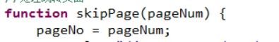 

###### c.处理上一页操作

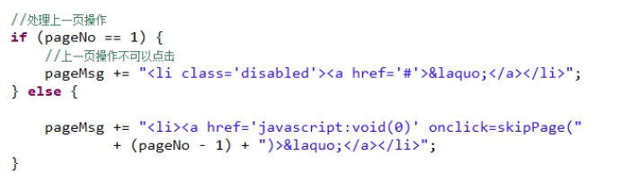 

###### d.处理下一页操作

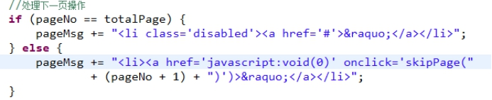 

 

# 三、 jQuery扩展(了解)

## 1． serialize与serializeArray

serialize:它的作用是将表单的数据序列化

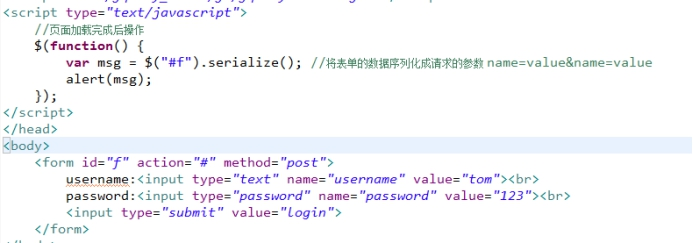 

serializeArray:将表单序列化，返回的是json数据格式

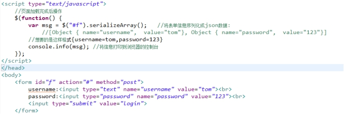 

## 2． 插件机制与自定义插件

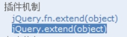 

在开发中使用jquery,除了它本身提供的API,我们更多的还会使用jquery的插件。

例如jquery easyui….

### 2.1． jQuery.extend(); 

上面这个是扩展jquery全局对象本身  $.post  $.ajax  $.get

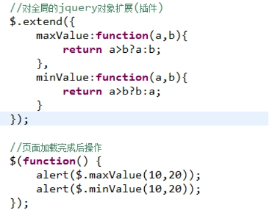 

### 2.2． jQuery.fn.extend();

上面这个是扩展jquery对象    $(“#f”).find()  $(“abc”).val()

通过创建一个插件完成表单数据转换成json操作

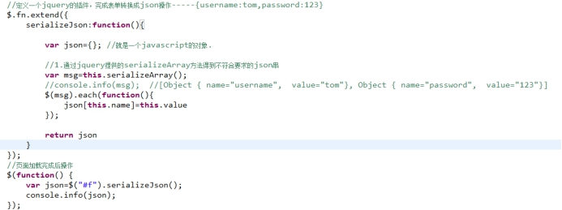 

如果表单中出现一个名称对应多个值的元素，怎样处理?

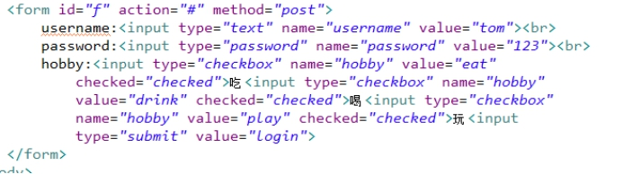 

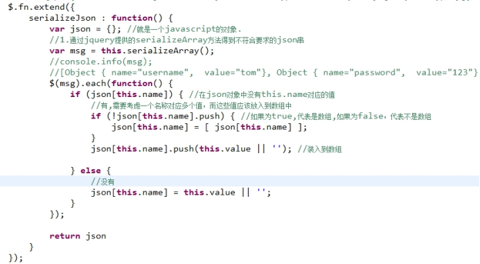 

 