# 课堂笔记

学习Linux目标:掌握linux常用命令，会安装开发中使用软件，例如mysql,jdk....

## Linux介绍

Unix是一个强大的多用户、多任务操作系统。于1969年在AT&T的贝尔实验室开发。UNIX的商标权由国际开放标准组织（The Open Group）所拥有。UNIX操作系统是商业版，需要收费，价格比Microsoft Windows正版要贵一些。

Linux可安装在各种计算机硬件设备中，比如手机、平板电脑、路由器、台式计算机
Linux系统的应用
服务器系统Web应用服务器、数据库服务器、接口服务器、DNS、FTP等等；
嵌入式系统路由器、防火墙、手机、PDA、IP 分享器、交换器、家电用品的微电脑控制器等等，
高性能运算、计算密集型应用Linux有强大的运算能力。
桌面应用系统
移动手持系统
Linux版本
常用的ubuntu centos fedora redhat

## Linux安装

我们在虚拟机上来安装Linux
VMWare它是一个收费虚拟软件。
对于VMWare安装清楚的可以参考资料中的文档 <<虚拟软件vmware安装>>
问题:怎样安装linux系统(centos6.5)
参考《CentOS6详细安装文档.doc》
前提:需要一个

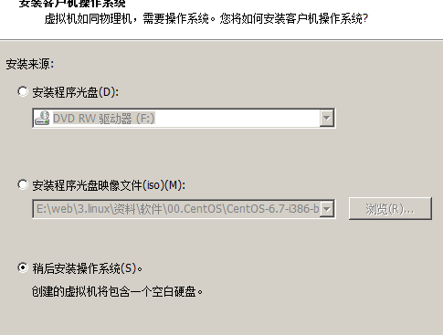{width="5.052083333333333in" height="3.8229166666666665in"}
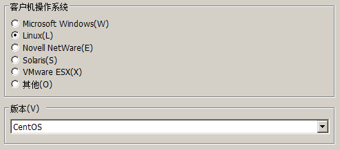{width="5.145833333333333in" height="2.2708333333333335in"}
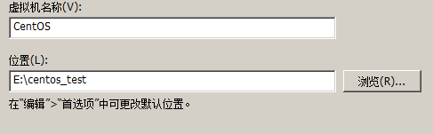{width="5.072916666666667in" height="1.5729166666666667in"}

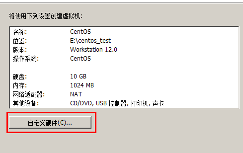{width="5.09375in" height="3.2083333333333335in"}
我们需要指定iso文件的位置

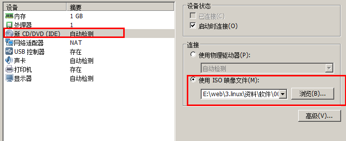{width="5.768055555555556in" height="2.349948600174978in"}

{width="5.768055555555556in" height="2.9073939195100613in"}

选择第一项，安装全新操作系统或升级现有操作系统

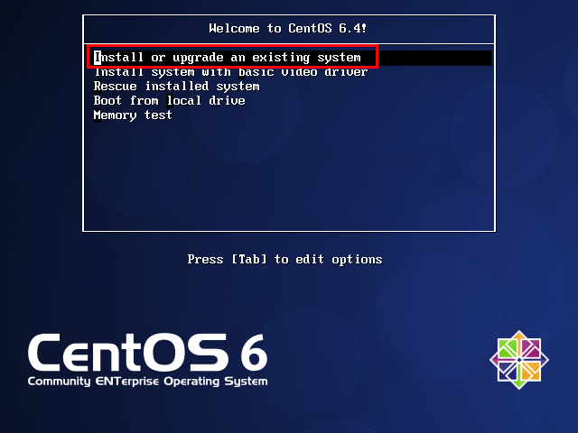{width="5.763888888888889in" height="4.320833333333334in"}

第13步：Tab键进行选择，选择Skip，退出检测

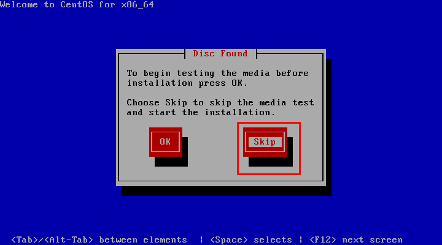{width="5.763888888888889in" height="3.207638888888889in"}

第14步：点击Next

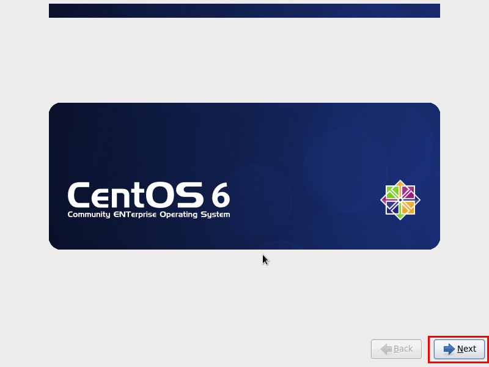{width="5.763888888888889in" height="4.320833333333334in"}

第15步：选择语言，这里选择的是中文简体

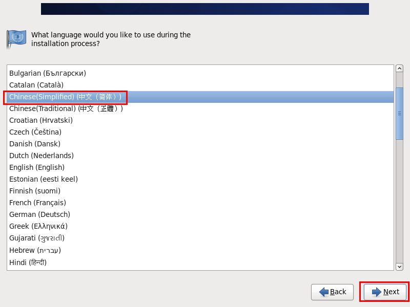{width="5.763888888888889in" height="4.320833333333334in"}

第16步：选择键盘样式

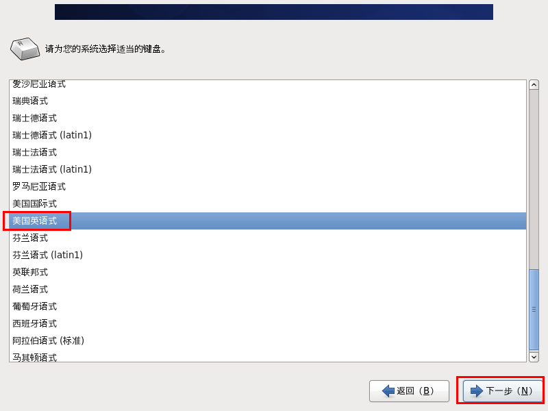{width="5.763888888888889in" height="4.320833333333334in"}

第17步：选择存储设备

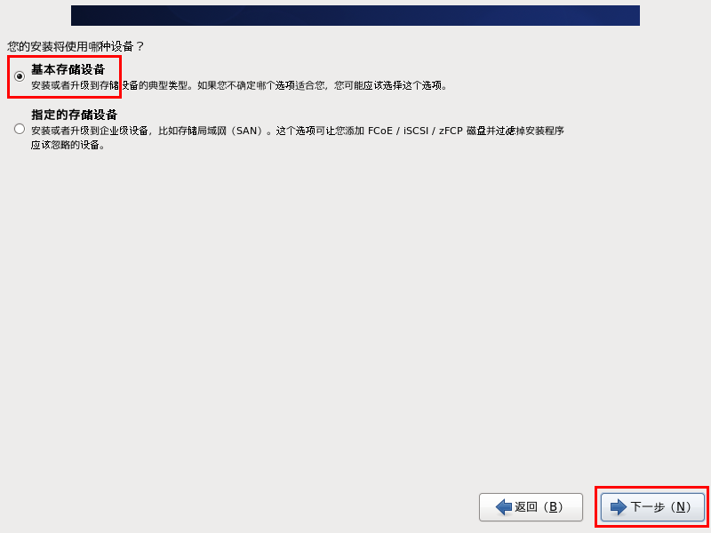{width="5.763888888888889in" height="4.320833333333334in"}

如果以前安装过虚拟机，会出现这个警告，选择是，忽略所有数据

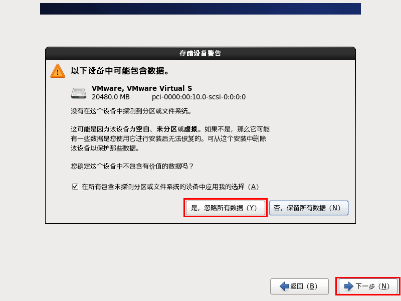{width="5.763888888888889in" height="4.320833333333334in"}

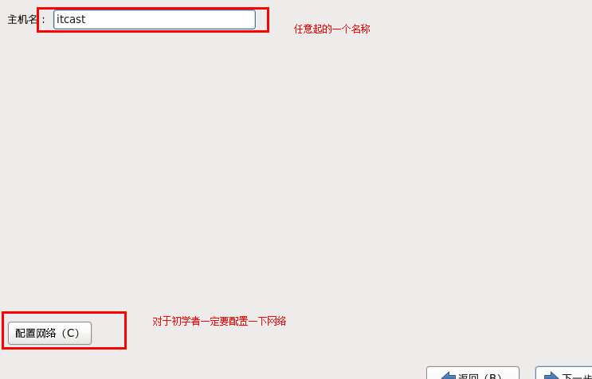{width="5.768055555555556in" height="3.6951607611548556in"}

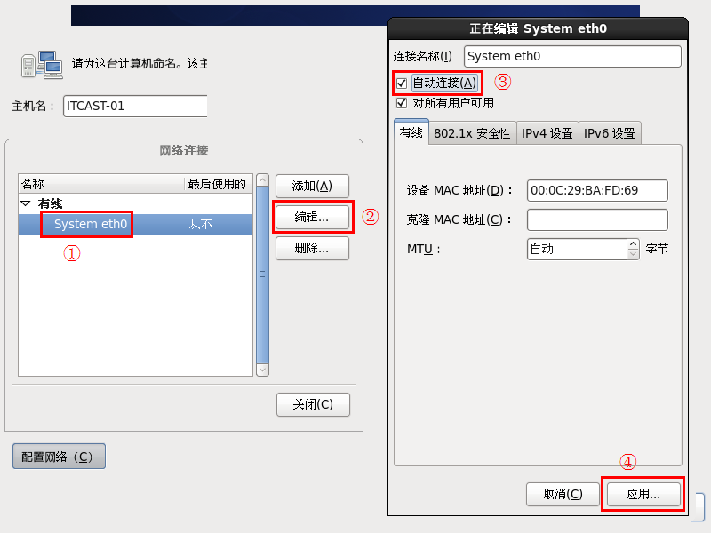{width="5.763888888888889in" height="4.320833333333334in"}

设置时区，勾选使用UTC时间

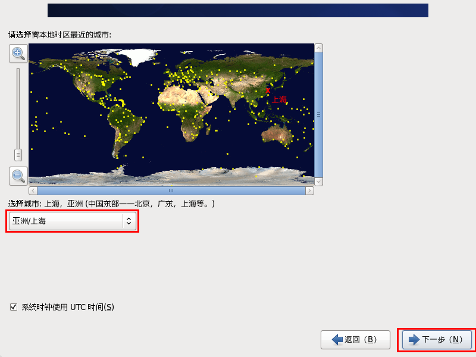{width="5.763888888888889in" height="4.320833333333334in"}

第21步：输入根用户（root）的密码

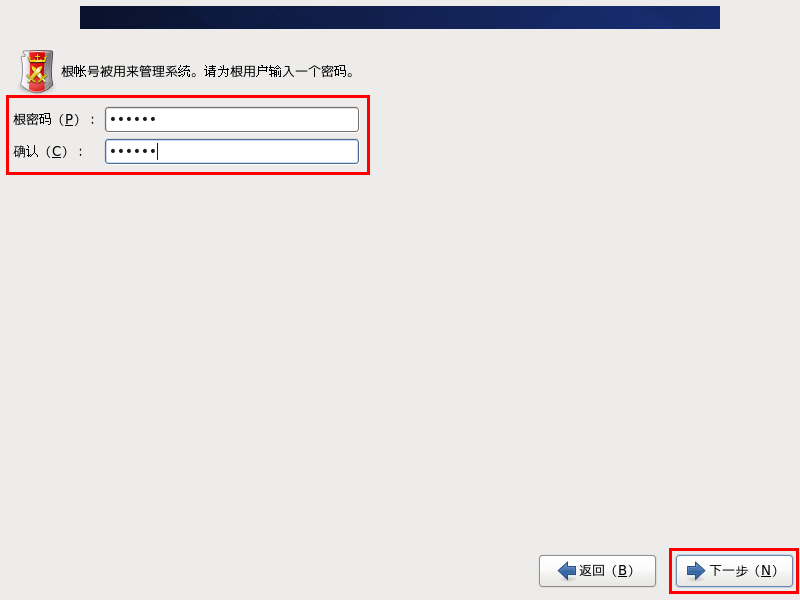{width="5.763888888888889in" height="4.320833333333334in"}

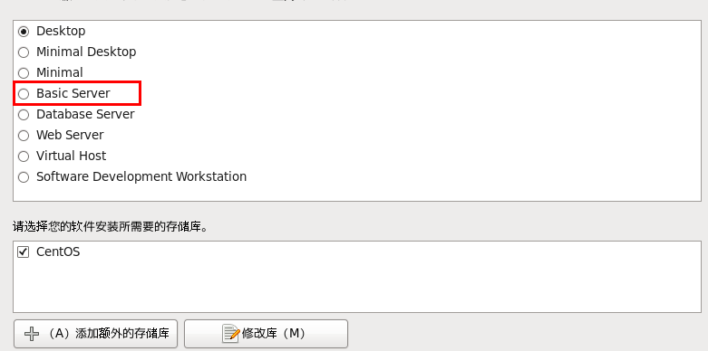{width="5.768055555555556in" height="2.865334645669291in"}

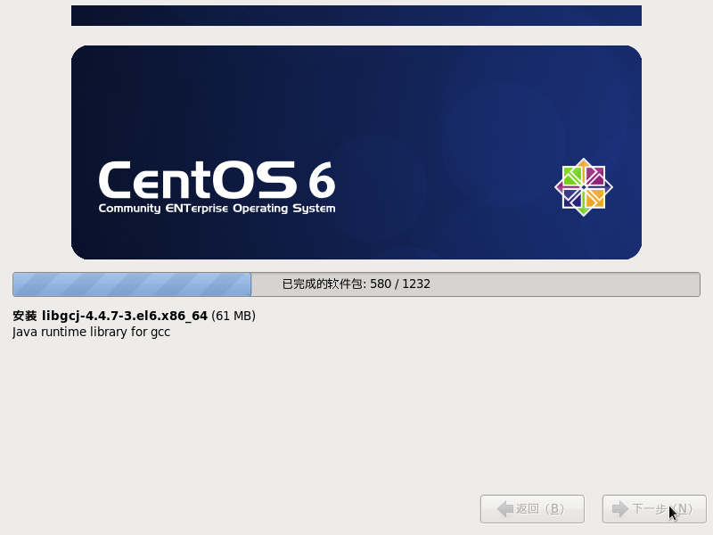{width="5.763888888888889in" height="4.320833333333334in"}

登录时，使用的用户是root,录入密码时不会显示

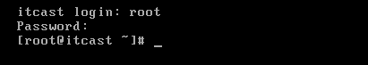{width="4.28125in" height="0.7604166666666666in"}

## Linux远程访问

使用CRT

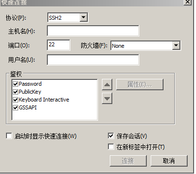{width="4.145833333333333in" height="3.6770833333333335in"}

需要录入linux的ip地址及用户名密码

查看ip地址ifconfig

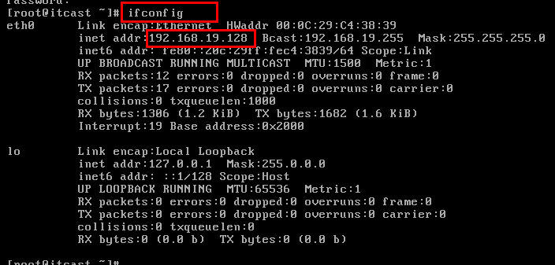{width="5.768055555555556in" height="2.7611898512685915in"}

注意事项:

1.  关于linux安装时失败问题，有可能是硬件虚拟化没有打开，需要在bios中开启虚拟化。通过 {width="1.90625in" height="0.3125in"}可以查看

2.  关于CRT安装与破解(参考图片)

## Linux目录结构

Linux系统它是文件系统。

它的根目录 是"/",是以树型结构来管理。

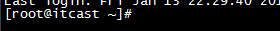{width="2.9166666666666665in" height="0.3229166666666667in"}

Root用户登录后，显示时有一个~,它其实代表的就是root目录

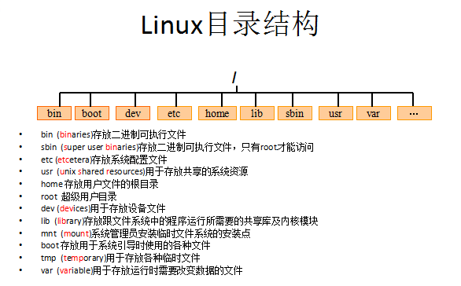{width="5.465277777777778in" height="3.3941918197725283in"}

我们可以将我们自己的文件安装在任意位置。

## Linux常用命令(重点)

### 切换目录命令cd

cd app 	切换到app目录

cd .. 		切换到上一层目录

cd / 		切换到系统根目录

cd ~ 		切换到用户主目录

cd - 		e directory)命令可用来创建子目录。

mkdir app  在当前目录下创建app目录

mkdir --p app2/test  级联创建aap2以及test目

rmdir(remove directory)命令可用来删除"空"的子目录：

rmdir app  删除app目录

### 浏览文件

cat操作

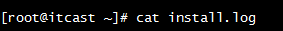{width="2.9479166666666665in" height="0.3229166666666667in"}

more与less用法类似

{width="1.7395833333333333in" height="0.22916666666666666in"}

{width="1.8645833333333333in" height="0.17708333333333334in"}

tail

tail命令是在实际使用过程中使用非常多的一个命令，它的功能是：用于显示文件后几行的内容。

用法:

tail -10 /etc/passwd 查看后10行数据

tail -f catalina.log 动态查看日志(*****)

ctrl+c 结束查看

### 文件操作

cp是copy操作

mv它是move相当于剪切

cp(copy)命令可以将文件从一处复制到另一处。一般在使用cp命令时将一个文件复制成另一个文件或复制到某目录时，需要指定源文件名与目标文件名或目录。

cp a.txt b.txt 将a.txt复制为b.txt文件

cp a.txt ../ 将a.txt文件复制到上一层目录中

mv 移动或者重命名

mv a.txt ../ 将a.txt文件移动到上一层目录中

mv a.txt b.txt 将a.txt文件重命名为b.txt

rm它可以帮助我们删除文件与目录

rm 删除文件

用法：rm [选项]... 文件...

rm a.txt 删除a.txt文件

删除需要用户确认，y/n

rm 删除不询问

rm -f a.txt 不询问，直接删除

rm 删除目录

rm -r a 递归删除 可以删除文件夹(会询问)

不询问递归删除（慎用）

rm -rf a 不询问递归删除 可以删除文件夹(不会询问)

rm -rf * 删除所有文件

rm -rf /* 自杀

touch 创建文件 

### 打包压缩与解压

tar命令位于/bin目录下，它能够将用户所指定的文件或目录打包成一个文件，但不做压缩。一般Linux上常用的压缩方式是选用tar将许多文件打包成一个文件，再以gzip压缩命令压缩成xxx.tar.gz(或称为xxx.tgz)的文件。

常用参数：

-c：创建一个新tar文件

-v：显示运行过程的信息

-f：指定文件名

-z：调用gzip压缩命令进行压缩

-t：查看压缩文件的内容

-x：解开tar文件

打包：

tar --cvf xxx.tar ./*

打包并且压缩：

tar --zcvf xxx.tar.gz ./*

解压

tar --xvf xxx.tar

tar -xvf xxx.tar.gz -C /usr/aaa

### 文件查找

查找符合条件的文件find

查找文件中符合条件的字符串grep

find指令用于查找符合条件的文件

示例：

find / -name "ins*" 查找文件名称是以ins开头的文件

find / -name "ins*" --ls

find / --user itcast --ls 查找用户itcast的文件

find / --user itcast --type d --ls 查找用户itcast的目录

find /-perm -777 --type d-ls 查找权限是777的文件

查找文件里符合条件的字符串。

用法: grep [选项]... PATTERN [FILE]...

示例：

grep lang anaconda-ks.cfg 在文件中查找lang

grep lang anaconda-ks.cfg --color 高亮显示

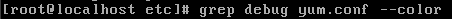{width="4.695833333333334in" height="0.2in"}

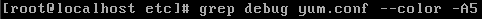

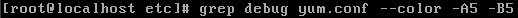{width="5.382638888888889in" height="0.1909722222222222in"}

### 其它常用命令

【pwd】

显示当前所在目录

【touch】

创建一个空文件

* touch a.txt

【ll -h】

友好显示文件大小

【wget】

下载资料

* wget http://nginx.org/download/nginx-1.9.12.tar.gz

## VI与VIM编辑器

有三种模式 命令行 插入 底行

通过 vi（vim） 文件名 就可以对文件进行操作

当操作时，开始是命令行模式 按I o a 切换到插入模式

按esc 可以在重新切换到命令行模式

在命令行模式下按 ":" 就可以切换到底行模式。

在命令行模式下可以使用一些快捷键

在Linux下一般使用vi编辑器来编辑文件。vi既可以查看文件也可以编辑文件。三种模式：命令行、插入、底行模式。

切换到命令行模式：按Esc键；

切换到插入模式：按 i 、o、a键；

i 在当前位置前插入

I 在当前行首插入

a 在当前位置后插入

A 在当前行尾插入

o 在当前行之后插入一行

O 在当前行之前插入一行

切换到底行模式：按 :（冒号）；更多详细用法，查询文档《Vim命令合集.docx》和《vi使用方法详细介绍.docx》

打开文件：vim file

退出：esc :q

修改文件：输入i进入插入模式

保存并退出：esc:wq

不保存退出：esc:q!

三种进入插入模式：

i:在当前的光标所在处插入

o:在当前光标所在的行的下一行插入

a:在光标所在的下一个字符插入

快捷键：在命令行模式下

dd -- 快速删除一行

yy - 复制当前行

nyy - 从当前行向后复制几行

p - 粘贴

R -- 替换

### 重定向

> 重定向输出，覆盖原有内容；

>> 重定向输出，又追加功能；

示例：

cat /etc/passwd > a.txt 将输出定向到a.txt中

cat /etc/passwd >> a.txt 输出并且追加

ifconfig > ifconfig.txt

### 管道

管道是Linux命令中重要的一个概念，其作用是将一个命令的输出用作另一个命令的输入。示例

ls --help | more 分页查询帮助信息

**ps --ef | grep java 查询名称中包含java的进程**

ifconfig | more

cat index.html | more

ps --ef | grep aio

### &&命令执行控制

命令之间使用 && 连接，实现逻辑与的功能。

只有在 && 左边的命令返回真（命令返回值 $? == 0），&& 右边的命令才会被执行。 

只要有一个命令返回假（命令返回值 $? == 1），后面的命令就不会被执行。

mkdir test && cd test

### 系统常用命令

date 显示或设置系统时间

date 显示当前系统时间

date -s "2014-01-01 10:10:10" 设置系统时间df 显示磁盘信息

df --h 友好显示大小free 显示内存状态

free --m 以mb单位显示内存组昂头top 显示，管理执行中的程序

clear 清屏幕

+++++++++++++++++++++

**ps 正在运行的某个进程的状态**

**ps --ef 查看所有进程**

ps --ef | grep ssh 查找某一进程

kill 杀掉某一进程

kill 2868 杀掉2868编号的进程

kill -9 2868 强制杀死进程

du 显示所有目录或文件的大小。

du --h 显示当前目录的大小

who 显示目前登入系统的用户信息。

uname 显示系统信息。

uname -a 显示本机详细信息。依次为：内核名称(类别)，主机名，内核版本号，内核版本，内核编译日期，硬件名，处理器类型，硬件平台类型，操作系统名称

## Linux下用户与组管理

### 用户管理

useradd 添加一个用户

useradd test 添加test用户

useradd test -d /home/t1 指定用户home目录

passwd 设置、修改密码

passwd test 为test用户设置密码

切换登录：

ssh -l test -p 22 192.168.19.128

su -- 用户名

userdel 删除一个用户

userdel test 删除test用户(不会删除home目录)

userdel --r test 删除用户以及home目录

### 组管理

当在创建一个新用户user时，若没有指定他所属于的组，就建立一个和该用户同名的私有组

创建用户时也可以指定所在组

groupadd 创建组

groupadd public 创建一个名为public的组

useradd u1 --g public 创建用户指定组groupdel 删除组，如果该组有用户成员，必须先删除用户才能删除组。

groupdel public

### id，su命令

【id命令】

功能：查看一个用户的UID和GID用法：id [选项]... [用户名]

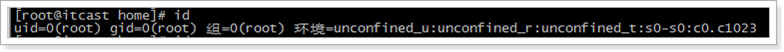{width="6.0in" height="0.4in"}

直接使用id

直接使用id 用户名

【su命令】

功能：切换用户。用法：su [选项]... [-] [用户 [参数]... ]示例：

su u1 切换到u1用户

su - u1 切换到u1用户，并且将环境也切换到u1用户的环境（推荐使用）

【账户文件】

/etc/passwd 用户文件/etc/shadow 密码文件/etc/group 组信息文件

【用户文件】

root:x:0:0:root:/root:/bin/bash账号名称： 在系统中是唯一的用户密码： 此字段存放加密口令用户标识码(User ID)： 系统内部用它来标示用户组标识码(Group ID)： 系统内部用它来标识用户属性用户相关信息： 例如用户全名等用户目录： 用户登录系统后所进入的目录用户环境: 用户工作的环境

【密码文件】

shadow文件中每条记录用冒号间隔的9个字段组成.用户名：用户登录到系统时使用的名字，而且是惟一的口令： 存放加密的口令最后一次修改时间: 标识从某一时刻起到用户最后一次修改时间最大时间间隔: 口令保持有效的最大天数，即多少天后必须修改口令最小时间间隔： 再次修改口令之间的最小天数警告时间：从系统开始警告到口令正式失效的天数不活动时间： 口令过期少天后，该账号被禁用失效时间：指示口令失效的绝对天数(从1970年1月1日开始计算)标志：未使用

【组文件】

root:x:0:组名：用户所属组组口令：一般不用GID：组ID用户列表：属于该组的所有用户

## 文件权限管理

### 文件权限

{width="5.095833333333333in" height="2.173611111111111in"}

------------------ ------------------- -------------- --- --- --- --- --- ---
  **属主（user）**   **属组（group）**   **其他用户**                       
  r                  w                   x              r   w   x   r   w   x
  4                  2                   1              4   2   1   4   2   1
------------------ ------------------- -------------- --- --- --- --- --- ---

r:对文件是指可读取内容 对目录是可以ls

w:对文件是指可修改文件内容，对目录 是指可以在其中创建或删除子节点(目录或文件)

x:对文件是指是否可以运行这个文件，对目录是指是否可以cd进入这个目录

### Linux三种文件类型：

普通文件： 包括文本文件、数据文件、可执行的二进制程序文件等。

目录文件： Linux系统把目录看成是一种特殊的文件，利用它构成文件系统的树型结构。

设备文件： Linux系统把每一个设备都看成是一个文件

### 文件类型标识

普通文件（-）目录（d）符号链接（l）

* 进入etc可以查看，相当于快捷方式字符设备文件（c）块设备文件（s）套接字（s）命名管道（p）

### 文件权限管理：

chmod 变更文件或目录的权限。

chmod 755 a.txt

chmod u=rwx,g=rx,o=rx a.txt

chmod 000 a.txt / chmod 777 a.txtchown 变更文件或目录改文件所属用户和组

chown u1:public aa ：变更当前的目录或文件的所属用户和组

chown -R u1:public aa ：变更目录中的所有的子目录及文件的所属用户和组

例如: aa 属于 root 用户 root组 假设aa下面有一个a.txt文件 root用户 root 组

chown u1:public aa aa属于u1用户 public组 a.txt root用户 root组

chown -R u1:public aa aa属于u1用户 public组 a.txt u1用户 public组

文件的权限:

R,W,X---------------(4,2,1)

文件权限的更改

Chmod 777 a.txt;

chmod u=rwx,g=rx,o=rx a.txt

文件所属用户或者组的一个更改

## 常用网络操作

### 主机名配置

hostname 查看主机名

hostname xxx 修改主机名 重启后无效

如果想要永久生效，可以修改/etc/sysconfig/network文件

### IP地址配置

Setup设置ip地址

ifconfig 查看(修改)ip地址(重启后无效)

ifconfig eth0 192.168.12.22 修改ip地址

如果想要永久生效

修改 /etc/sysconfig/network-scripts/ifcfg-eth0文件

### 域名映射

/etc/hosts文件用于在通过主机名进行访问时做ip地址解析之用

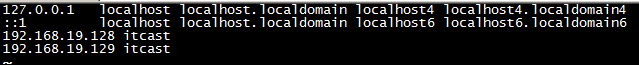{width="5.768055555555556in" height="0.586819772528434in"}

192.168.42.43 www.baidu.com

### 网络服务管理

service network status 查看指定服务的状态

service network stop 停止指定服务

service network start 启动指定服务

service network restart 重启指定服务

service ---status--all 查看系统中所有后台服务

netstat --nltp 查看系统中网络进程的端口监听情况

防火墙设置

防火墙根据配置文件/etc/sysconfig/iptables来控制本机的"出"、"入"网络访问行为。

service iptables status 查看防火墙状态

service iptables stop 关闭防火墙

service iptables start 启动防火墙

chkconfig iptables off 禁止防火墙自启

## Linux上软件安装介绍

-   Linux上的软件安装有以下几种常见方式介绍

1.  二进制发布包

> 软件已经针对具体平台编译打包发布，只要解压，修改配置即可

2.  RPM包

> 软件已经按照redhat的包管理工具规范RPM进行打包发布，需要获取到相应的软件RPM发布包，然后用RPM命令进行安装

3.  Yum在线安装

> 软件已经以RPM规范打包，但发布在了网络上的一些服务器上，可用yum在线安装服务器上的rpm软件，并且会自动解决软件安装过程中的库依赖问题

4.  源码编译安装

> 软件以源码工程的形式发布，需要获取到源码工程后用相应开发工具进行编译打包部署。

-   上传与下载工具介绍

1.  FileZilla

> {width="2.0625in" height="0.2916666666666667in"}
>
> 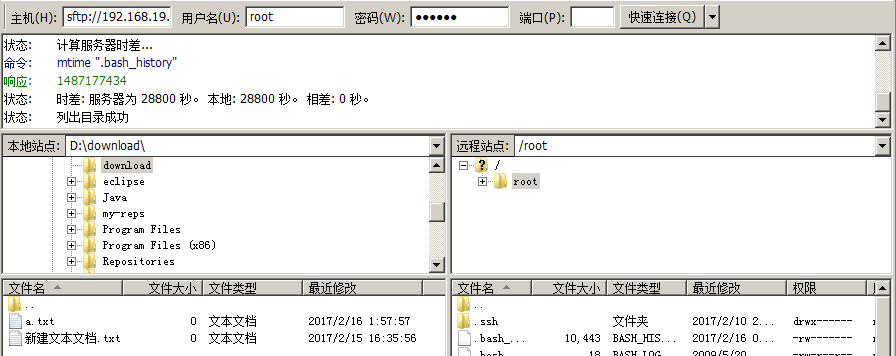{width="5.768055555555556in" height="2.2918678915135606in"}

2.  lrzsz

> 我们可以使用yum安装方式安装 yum install lrzsz
>
> Yum remove lrzsz
>
> 注意：必须有网络
>
> 可以在crt中设置上传与下载目录
>
> 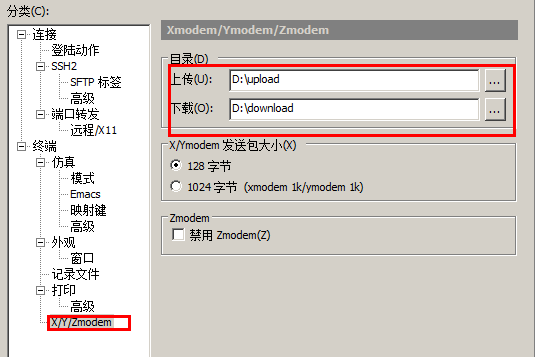{width="5.572916666666667in" height="3.71875in"}
>
> 上传：
>
> 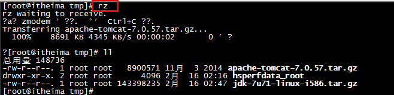{width="5.768055555555556in" height="1.3939468503937007in"}
>
> 下载
>
> 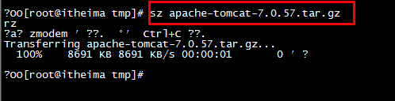{width="5.1875in" height="1.3333333333333333in"}

### 在Linux上安装JDK:

【步骤一】：上传JDK到Linux的服务器.

* 上传JDK

* 卸载open-JDK

java --version

rpm -qa | grep java

rpm -e --nodeps java-1.6.0-openjdk-1.6.0.35-1.13.7.1.el6_6.i686

rpm -e --nodeps java-1.7.0-openjdk-1.7.0.79-2.5.5.4.el6.i686

【步骤二】：在Linux服务器上安装JDK.

* 通常将软件安装到/usr/local

* 直接解压就可以

tar --xvf jdk.tar.gz -C 目标路径

{width="4.322916666666667in" height="0.20833333333333334in"}

【步骤三】：配置JDK的环境变量.

配置环境变量：

① vi /etc/profile

② 在末尾行添加

#set java environment

JAVA_HOME=/usr/local/jdk7/jdk1.7.0_71

CLASSPATH=.:$JAVA_HOME/lib.tools.jar

PATH=$JAVA_HOME/bin:$PATH

export JAVA_HOME CLASSPATH PATH

保存退出

③source /etc/profile 使更改的配置立即生效

总结:

1.  进入local目录 cd /usr/local

2.  上传你需要安装的jdk压缩文件(注意jdk要和centOS版本一致)

3.  查询当前centos系统中默认的jdk(rpm -qa | grep java)

4.  删除系统中默认的jdk (rpm -e --nodeps 查询到的jdk文件)

5.  在local目录下创建一个jdk文件夹,然后把jdk压缩文件解压到jdk文件夹里面

6.  配置JDK的环境变量(vi /etc/profile)

在末尾行添加

#set java environment

JAVA_HOME=jdk安装的绝对路径

CLASSPATH=.:$JAVA_HOME/lib.tools.jar

PATH=$JAVA_HOME/bin:$PATH

export JAVA_HOME CLASSPATH PATH

7.  source /etc/profile 使更改的配置立即生效

### 在Linux上安装Mysql:

【步骤一】：将mysql的安装文件上传到Linux的服务器.

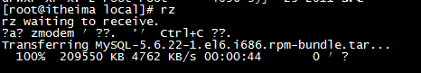{width="4.854166666666667in" height="0.84375in"}

将mysql的tar解压

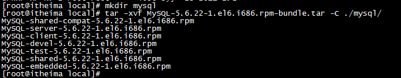{width="5.305970034995625in" height="1.126865704286964in"}

将系统自带的mysql卸载

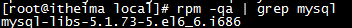{width="3.6666666666666665in" height="0.2916666666666667in"}

{width="4.177083333333333in" height="0.14583333333333334in"}

【步骤二】：安装MYSQL服务端

{width="4.0in" height="0.1875in"}

下面的提示是告诉我们root用户的密码第一次是随机生成的，它保存在/root/.mysql_secret中，第一次登录需要修改root密码

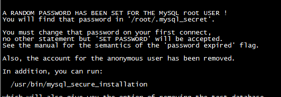{width="5.216418416447944in" height="2.0in"}

【步骤三】：安装MYSQL客户端

{width="3.9895833333333335in" height="0.1875in"}

查看生成的root密码

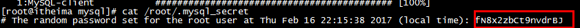{width="5.768055555555556in" height="0.28105971128608925in"}

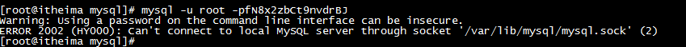{width="5.768055555555556in" height="0.4005599300087489in"}

报错:原因是没有启动mysql服务

需要开启mysql服务

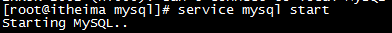{width="4.083333333333333in" height="0.34375in"}

执行下面操作报错，原因是第一次操作mysql必须修改root用户的密码

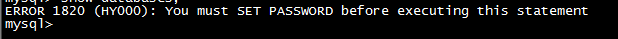{width="5.768055555555556in" height="0.3638418635170604in"}

设置root用户的密码

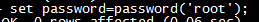{width="2.6979166666666665in" height="0.22916666666666666in"}

1.  上传mysql安装压缩文件到local目录

2.  创建一个mysql目录

3.  把mysql的压缩文件解压到mysql目录中

4.  将系统自带的mysql卸载

5.  安装mysql的服务器(可能有些同学的系统缺少依赖)

6.  安装mysql的客户端

7.  开启mysql服务

8.  登录mysql mysql -uroot -p原始密码(保存在/root/.mysql_secret)

9.  使用mysql必须修改root用户的密码

10. 正常使用了

-   **Mysql服务加入到系统服务并自动启动操作：**

chkconfig --add mysql

自动启动：

chkconfig mysql on

查询列表：

chkconfig

-   关于mysql远程访问设置

-   grant all privileges on *.* to 'root' @'%' identified by 'root';

-   flush privileges;

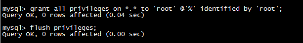{width="5.768055555555556in" height="0.8278226159230097in"}

在linux中很多软件的端口都被"防火墙"限止，我们需要将防火墙关闭

防火墙打开3306端口

/sbin/iptables -I INPUT -p tcp --dport 3306 -j ACCEPT

/etc/rc.d/init.d/iptables save

/etc/init.d/iptables status

学习阶段我们也可以直接将防火墙关闭

service iptables stop;

### 在Linux上安装tomcat:

1.Tomcat上传到linux上

2.将上传的tomcat解压

3.在tomcat/bin目录下执行 ./startup.sh（注意防火墙）

4.查看目标 tomcat/logs/catalina.out
