# Redis

## Redis概述

## Redis介绍

Redis是一个开源的使用ANSI [C语言](http://baike.baidu.com/view/1219.htm)编写、支持网络、可基于内存亦可持久化的日志型、Key-Value[数据库](http://baike.baidu.com/view/1088.htm)，并提供多种语言的API。从2010年3月15日起，Redis的开发工作由VMware主持。从2013年5月开始，Redis的开发由Pivotal赞助。

Redis是 NoSQL技术阵营中的一员，它通过多种键值数据类型来适应不同场景下的存储需求，借助一些高层级的接口使用其可以胜任，如缓存、队列系统的不同角色

<!-- Redis的官网: https://redis.io/ -->

## Redis特性

Redis 与其他 key - value 缓存产品有以下三个特点：

1. Redis支持数据的持久化，可以将内存中的数据保存在磁盘中，重启的时候可以再次加载进行使用。
2. Redis不仅仅支持简单的key-value类型的数据，同时还提供list，set，zset，hash等数据结构的存储。
3. Redis支持数据的备份，即master-slave模式的数据备份。

   Redis 优势:
<!-- -->
1. 性能极高 -- Redis能读的速度是110000次/s,写的速度是81000次/s 。
2. 丰富的数据类型 -- Redis支持二进制案例的Strings,Lists,Hashes, Sets 及 Ordered Sets 数据类型操作。
3. 原子 -- Redis的所有操作都是原子性的，同时Redis还支持对几个操作全并后的原子性执行。
4. 丰富的特性 -- Redis还支持 publish/subscribe, 通知, key 过期等等特性。

## Redis下载及安装

## Redis版本说明

Redis原生只支持linux系统
Redis官方是不支持windows平台，windows版本是微软自己建立的分支，基于官方的redis源码上进行编译、发布、维护的，所以window平台上的redis版本都略低于官方版本。

## Redis下载

当前redis最新版本是4.0，它是一个测试版本，稳定版本是3.2版本。
可以直接在windows上下载，通过上传工具上传到linux系统，也可以在linux下直接
<!-- 最新稳定版本下载链接：http://download.redis.io/releases/redis-3.2.8.tar.gz -->
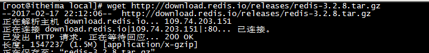
注意：必须可以上网，如果不能上网的同学可以在今天的资源中查找，然后通过lrzsz上传到linux系统。


## Xz Redis安装

第一步：将redis.tar.gz解压到 local/redis-3.2.8
tar -zxvf redis-3.2.8.tar.gz
第二步: 在local目录下创建一个redis文件夹,然后进入redis-3.2.8目录
cd redis-3.2.8
第三步:在local/redis-3.2.8目录下对redis进行编译
make
第四步:,在 local/redis-3.2.8目录下执行安装命令,指定安装到local/redis目录下
make PREFIX=/usr/local/redis install
注意：如果安装redis是报下面的错误，是因为系统没有安装gcc环境，缺少依赖
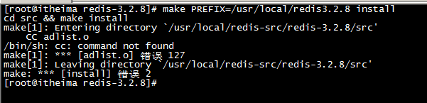
解决方案
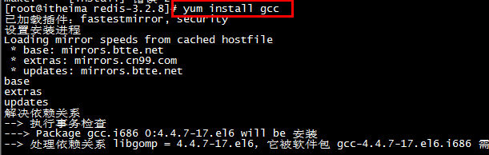
 make MALLOC=libc 或者 yum -y install gcc-c++

安装完成后，对redis进行重新编译安装

安装完成后，我们进入目录bin中查看

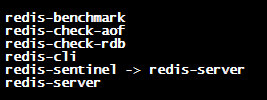

redis-server redis服务器

redis-cli redis命令行客户端

redis-benchmark redis性能测试工具

redis-check-aof AOF文件修复工具

redis-check-rdb RDB文件检索工具

## redis客户端测试

解压的是在: local/redis-3.2.8

安装的目录: local/redis

第一步:需要将redis编译后的目录 中的redis.conf文件copy到我们自己的redis目录中。

第二步:启动redis服务在redis目录下 ./bin/redis-server  ./redis.conf

- 注意这个redis.conf文件是redis的配置文件。


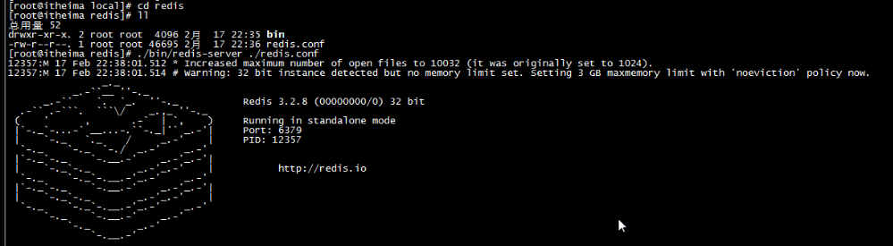

```
./bin/redis-server ./redis.conf
```

**注意:前面是redis-server服务，后面redis.conf配置文件。**

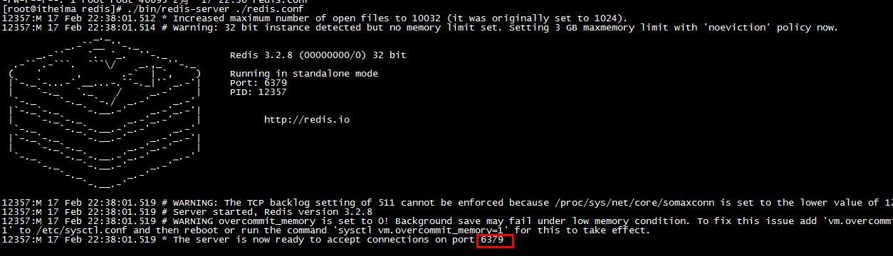

Redis占用的端口是6379

可以通过redis-cli命令行客户端来测试redis是否启动成功


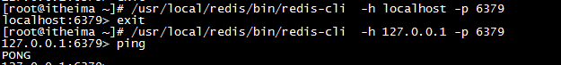

启动客户端:

第一: 如果redis.conf 是默认情况,也就是 bind 127.0.0.1 并且没有设置密码

Redis客户端的路径 -h 127.0.0.1 -p 6379

/usr/local/redis/bin/redis-cli -h 127.0.0.1 -p 6379

/usr/local/redis/bin/redis-cli -h localhost -p 6379

第二: 一般会设置redis.conf ,

1. vi redis.conf 打开redis.conf文件**(打开文件后查找功能在命令行模式下输入:/要找的词)**

2. 注释 bind 127.0.0.1 (# bind 127.0.0.1),

3. 设置密码: requirepass admin

4. 连接: ./bin/redis-cli -h 192.168.203.128 -p 6379 -a admin

> **客户端路径 -h redis服务器ip地址 -p 6379 -a 密码**

## Redis数据类型与常见操作

## Redis数据类型介绍

redis是一个key-value[存储系统](http://baike.baidu.com/view/51839.htm)。和Memcached类似，它支持存储的value类型相对更多，包括string(字符串)、list([链表](http://baike.baidu.com/view/549479.htm))、set(集合)、zset(sorted set /--有序集合)和hash（哈希类型）。

## string类型常见操作

字符串类型是Redis中最为基础的数据存储类型，它在Redis中是二进制安全的，这便意味着该类型可以接受任何格式的数据，如JPEG图像数据或Json对象描述信息等。在Redis中字符串类型的Value最多可以容纳的数据长度是512M。

常见操作

- SET key value

  设定该Key持有指定的字符串Value，如果该Key已经存在，则覆盖其原有值。返回值：总是返回"OK"

- GET key

  获取指定Key的Value。如果与该Key关联的Value不是string类型，Redis将返回错误信息，因为GET命令只能用于获取string Value。

  返回值：与该Key相关的Value，如果该Key不存在，则返回nil。

- MSET key value /[key value /...

  该命令原子性的完成参数中所有key/value的设置操作，其具体行为可以看成是多次迭代执行SET命令。

  返回值：该命令不会失败，始终返回OK。

- MGET key /[key /...

  返回所有指定Keys的Values，如果其中某个Key不存在，或者其值不为string类型，该Key的Value将返回nil。

  返回值：返回一组指定Keys的Values的列表。

- SETNX key value

  如果指定的Key不存在，则设定该Key持有指定字符串Value，此时其效果等价于SET命令。相反，如果该Key已经存在，该命令将不做任何操作并返回。

  返回值：1表示设置成功，否则0（not exists）。

- MSETNX key value [key value ...]

  该命令原子性的完成参数中所有key/value的设置操作，其具体行为可以看成是多次迭代执行SETNX命令。然而这里需要明确说明的是，如果在这一批Keys中有任意一个Key已经存在了，那么该操作将全部回滚，即所有的修改都不会生效。返回值：1表示所有Keys都设置成功，0则表示没有任何Key被修改。

- APPEND key value

  如果该Key已经存在，APPEND命令将参数Value的数据追加到已存在Value的末尾。如果该Key不存在，APPEND命令将会创建一个新的Key/Value。

  返回值：追加后Value的长度。

- DECR key

  将指定Key的Value原子性的递减1。如果该Key不存在，其初始值为0，在decr之后其值为-1。如果Value的值不能转换为整型值，如Hello，该操作将执行失败并返回相应的错误信息。

  返回值：递减后的Value值。

- INCR key

  将指定Key的Value原子性的递增1。如果该Key不存在，其初始值为0，在incr之后其值为1。如果Value的值不能转换为整型值，如Hello，该操作将执行失败并返回相应的错误信息。

  返回值：递增后的Value值。

- DECRBY key decrement

  将指定Key的Value原子性的减少decrement。如果该Key不存在，其初始值为0，在decrby之后其值为-decrement。如果Value的值不能转换为整型值，如Hello，该操作将执行失败并返回相应的错误信息。注意：该操作的取值范围是64位有符号整型。

  返回值：减少后的Value值。

- INCRBY key increment

  将指定Key的Value原子性的增加increment。如果该Key不存在，其初始值为0，在incrby之后其值为increment。如果Value的值不能转换为整型值，如Hello，该操作将执行失败并返回相应的错误信息。注意：该操作的取值范围是64位有符号整型。

  返回值：增加后的Value值。

- GETSET key value

  原子性的设置该Key为指定的Value，同时返回该Key的原有值。和GET命令一样，该命令也只能处理string Value，否则Redis将给出相关的错误信息。

  返回值：返回该Key的原有值，如果该Key之前并不存在，则返回nil。

- STRLEN key

  返回指定Key的字符值长度，如果Value不是string类型，Redis将执行失败并给出相关的错误信息。

  返回值：指定Key的Value字符长度，如果该Key不存在，返回0。

- SETEX key seconds value

  原子性完成两个操作，一是设置该Key的值为指定字符串，同时设置该Key在Redis服务器中的存活时间(秒数)。该命令主要应用于Redis被当做Cache服务器使用时。

  (expire）

- SETRANGE key offset value

  替换指定Key的部分字符串值。从offset开始，替换的长度为该命令第三个参数value的字符串长度，其中如果offset的值大于该Key的原有值Value的字符串长度，Redis将会在Value的后面补齐(offset - strlen(value))数量的0x00，之后再追加新值。如果该键不存在，该命令会将其原值的长度假设为0，并在其后添补offset个0x00后再追加新值。鉴于字符串Value的最大长度为512M，因此offset的最大值为536870911。最后需要注意的是，如果该命令在执行时致使指定Key的原有值长度增加，这将会导致Redis重新分配足够的内存以容纳替换后的全部字符串，因此就会带来一定的性能折损。

  返回值：修改后的字符串Value长度。

- GETRANGE key start end

  截取字符串。该命令在截取子字符串时，将以闭区间的方式同时包含start(0表示第一个字符)和end所在的字符，如果end值超过Value的字符长度，该命令将只是截取从start开始之后所有的字符数据。

  返回值：子字符串；

- SETBIT key offset value

  设置在指定Offset上BIT的值，该值只能为1或0，在设定后该命令返回该Offset上原有的BIT值。如果指定Key不存在，该命令将创建一个新值，并在指定的Offset上设定参数中的BIT值。如果Offset大于Value的字符长度，Redis将拉长Value值并在指定Offset上设置参数中的BIT值，中间添加的BIT值为0。最后需要说明的是Offset值必须大于0。

  返回值：在指定Offset上的BIT原有值。

- GETBIT key offset

  返回在指定Offset上BIT的值，0或1。如果Offset超过string value的长度，该命令将返回0，所以对于空字符串始终返回0。

  返回值：在指定Offset上的BIT值。(布隆过滤器)

需要记忆的:

- SET key value     设定该Key持有指定的字符串Value
- GET key    获取指定Key的Value
- MSET key value [key value ...]    同时设置多个key和value
- MGET key [key ...]  同时获取多个key的值
- SETNX key value  	设置该Key持有指定的字符串Value(如果key存在就不做任何操作
- MSETNX key value [key value ...]   设置多个值(原子性的:其中一个key存在就不做任何操作)
- APPEND key value   拼接字符串
- STRLEN key    返回指定Key的字符值长度
- SETRANGE key offset value  替换指定Key的部分字符串值
- GETRANGE key start end     截取字符串

## list类型常见操作

在Redis中，List类型是按照插入顺序排序的字符串链表。和数据结构中的**普通链表**一样，我们可以在其头部(left)和尾部(right)                                                                                                                                                                                                                                                                                                                                                                                                                                                                                                                                                                                                                                                                                                                                                                                                                                                                                                                                                                                                                                                                                                                                                                                                                                    添加新的元素。在插入时，如果该键并不存在，Redis将为该键创建一个新的链表。与此相反，如果链表中所有的元素均被移除，那么该键也将会被从数据库中删除。List中可以包含的最大元素数量是4294967295。

从元素插入和删除的效率视角来看，如果我们是在链表的两头插入或删除元素，这将会是非常高效的操作，即使链表中已经存储了百万条记录，该操作也可以在常量时间内完成。然而需要说明的是，如果元素插入或删除操作是作用于链表中间，那将会是非常低效的。

常见操作

- LPUSH key value [value ...] lpush list1 zs ls ww...

  在指定Key所关联的List Value的头部插入参数中给出的所有Values。如果该Key不存在，该命令将在插入之前创建一个与该Key关联的空链表，之后再将数据从链表的头部插入。如果该键的Value不是链表类型，该命令将返回相关的错误信息。返回值：插入后链表中元素的数量。

- LPUSHX key value

  仅有当参数中指定的Key存在时，该命令才会在其所关联的List Value的头部插入参数中给出的Value，否则将不会有任何操作发生。

  返回值：插入后链表中元素的数量。

- LRANGE key start stop

  该命令的参数start和end都是0-based。即0表示链表头部(leftmost)的第一个元素。其中start的值也可以为负值，-1将表示链表中的最后一个元素，即尾部元素，-2表示倒数第二个并以此类推。该命令在获取元素时，start和end位置上的元素也会被取出。如果start的值大于链表中元素的数量，空链表将会被返回。如果end的值大于元素的数量，该命令则获取从start(包括start)开始，链表中剩余的所有元素。

  返回值：返回指定范围内元素的列表。

- LPOP key

  返回并弹出指定Key关联的链表中的第一个元素，即头部元素。如果该Key不存，返回nil。

  返回值：链表头部的元素。

- LLEN key

  返回指定Key关联的链表中元素的数量，如果该Key不存在，则返回0。如果与该Key关联的Value的类型不是链表，则返回相关的错误信息。

  返回值：链表中元素的数量。

- LREM key count value ------ LREM list1 2 4;

  在指定Key关联的链表中，删除前count个值等于value的元素。如果count大于0，从头向尾遍历并删除，如果count小于0，则从尾向头遍历并删除。

  如果count等于0，则删除链表中所有等于value的元素。如果指定的Key不存在，则直接返回0。

  返回值：返回被删除的元素数量。

- LSET key index value

  设定链表中指定位置的值为新值，其中0表示第一个元素，即头部元素，-1表示尾部元素。如果索引值Index超出了链表中元素的数量范围，该命令将返回相关的错误信息。

  (对指定脚标的值进行设置)

- LINDEX key index

  该命令将返回链表中指定位置(index)的元素，index是0-based，表示头部元素，如果index为-1，表示尾部元素。如果与该Key关联的不是链表，该命令将返回相关的错误信息。

  返回值：返回请求的元素，如果index超出范围，则返回nil。(读出指定脚标的值)

- LTRIM key start stop

  该命令将仅保留指定范围内的元素，从而保证链接中的元素数量相对恒定。start和stop参数都是0-based，0表示头部元素。和其他命令一样，start和stop也可以为负值，-1表示尾部元素。如果start大于链表的尾部，或start大于stop，该命令不错报错，而是返回一个空的链表，与此同时该Key也将被删除。如果stop大于元素的数量，则保留从start开始剩余的所有元素。

- LINSERT key BEFORE|AFTER pivot value--- linsert list before 3 4

  该命令的功能是在pivot元素的前面或后面插入参数中的元素value。如果Key不存在，该命令将不执行任何操作。如果与Key关联的Value类型不是链表，相关的错误信息将被返回。

  返回值：成功插入后链表中元素的数量，如果没有找到pivot，返回-1，如果key不存在，返回0。

  (在指定的某个value前或后插入一个新的value)

- RPUSH key value [value ...]

  在指定Key所关联的List Value的尾部插入参数中给出的所有Values。如果该Key不存在，该命令将在插入之前创建一个与该Key关联的空链表，之后再将数据从链表的尾部插入。如果该键的Value不是链表类型，该命令将返回相关的错误信息。返回值：插入后链表中元素的数量。

- RPUSHX key value

  仅有当参数中指定的Key存在时，该命令才会在其所关联的List Value的尾部插入参数中给出的Value，否则将不会有任何操作发生。

  返回值：插入后链表中元素的数量。

- RPOP key

  返回并弹出指定Key关联的链表中的最后一个元素，即尾部元素，。如果该Key不存，返回nil。

  返回值：链表尾部的元素。

- RPOPLPUSH source destination

  原子性的从与source键关联的链表尾部弹出一个元素，同时再将弹出的元素插入到与destination键关联的链表的头部。如果source键不存在，该命令将返回nil，同时不再做任何其它的操作了。如果source和destination是同一个键，则相当于原子性的将其关联链表中的尾部元素移到该链表的头部。

  返回值：返回弹出和插入的元素。

需要记忆的:

在Redis中，List类型是按照插入顺序排序的字符串链表。和数据结构中的**普通链表**一样

- LPUSH key value [value ...]   添加键和对应的多个值
- LRANGE key start stop 	 查询该键对应的值
- LLEN key 查询该键有多少个值
- LREM key count value  删除指定键中前count个值等于value的元素
- LSET key index value  修改指定键中指定索引位置的value
- LINDEX key index 获取指定键指定索引位置的value
- LINSERT key BEFORE|AFTER pivot value--- linsert list before 3 4

## hash类型常见操作

Redis中的Hashes类型可以看成具有String Key和String Value的map容器。所以该类型非常适合于存储值对象的信息。如用户信息：Username、Password和Age等。每一个Hash可以存储4294967295个键值对。

常见操作

- HSET key field value	 例 hset map username zhangsan

  为指定的Key设定Field/Value对，如果Key不存在，该命令将创建新Key以参数中的Field/Value对，如果参数中的Field在该Key中已经存在，则用新值覆盖其原有值。

  返回值：1表示新的Field被设置了新值，0表示Field已经存在，用新值覆盖原有值。

- HGET key field hget map username

  返回指定Key中指定Field的关联值。

  返回值：返回参数中Field的关联值，如果参数中的Key或Field不存，返回nil。

- HSETNX key field value

  只有当参数中的Key或Field不存在的情况下，为指定的Key设定Field/Value对，否则该命令不会进行任何操作。

  返回值：1表示新的Field被设置了新值，0表示Key或Field已经存在，该命令没有进行任何操作。

- HEXISTS key field

  判断指定Key中的指定Field是否存在。

  返回值：1表示存在，0表示参数中的Field或Key不存在。

- HLEN key

  获取该Key所包含的Field的数量。 返回Key包含的Field数量，如果Key不存在，返回0。

- HDEL key field [field ...]

  从指定Key的Hashes Value中删除参数中指定的多个字段，如果不存在的字段将被忽略。

  返回值：如果Key不存在，则将其视为空Hashes，并返回0，否则返回实际删除的Field数量。

- HINCRBY key field increment

  增加指定Key中指定Field关联的Value的值。如果Key或Field不存在，该命令将会创建一个新Key或新Field，并将其关联的Value初始化为0，之后再指定数字增加的操作。该命令支持的数字是64位有符号整型，即increment可以负数。返回值：运算后的值。

- HGETALL key

  获取该键包含的所有Field/Value。其返回格式为一个Field、一个Value，并以此类推。

  返回值：Field/Value的列表。

- HKEYS key hkeys map

  返回指定Key的所有Fields名。

  返回值：Field的列表。

- HVALS key

  返回指定Key的所有Values名。

  返回值：Value的列表。

- HMGET key field [field ...]

  获取和参数中指定Fields关联的一组Values。如果请求的Field不存在，其值返回nil。如果Key不存在，该命令将其视为空Hash，因此返回一组nil。

  返回值：返回和请求Fields关联的一组Values，其返回顺序等同于Fields的请求顺序。

- HMSET key field value [field value ...]

  逐对依次设置参数中给出的Field/Value对。如果其中某个Field已经存在，则用新值覆盖原有值。如果Key不存在，则创建新Key，同时设定参数中的Field/Value。

需要记忆:

Redis中的Hashes类型可以看成具有String Key和String Value的map容器

- HSET key field value	 为指定的Key设定Field/Value对
- HGET key field 	 获取指定Key中指定Field的关联值
- HEXISTS key field 	 判断指定Key中的指定Field是否存在
- HLEN key 	 获取该Key所包含的Field的数量。
- HDEL key field [field ...] 	 从指定Key的Hashes Value中删除参数中指定的多个字段，如果不存在的字段将被忽略。
- HGETALL key	 获取该键包含的所有Field/Value
- HKEYS key 	获取指定Key的所有Fields名
- HVALS key 	 返回指定Key的所有Values名。 	
- HMSET key field value [field value ...] 逐对依次设置参数中给出的Field/Value对
- HMGET key field [field ...] 	 获取和参数中指定Fields关联的一组Values。

## set类型常见操作

在Redis中，我们可以将Set类型看作为没有排序的字符串集合。Set可包含的最大元素数量是4294967295。

Set类型在功能上还存在着一个非常重要的特性，即在服务器端完成多个Sets之间的聚合计算操作，如unions、intersections和differences。由于这些操作均在服务端完成，因此效率极高，而且也节省了大量的网络IO开销。

常见操作

- SADD key member [member ...]

  如果在插入的过程用，参数中有的成员在Set中已经存在，该成员将被忽略，而其它成员仍将会被正常插入。如果执行该命令之前，该Key并不存在，该命令将会创建一个新的Set，此后再将参数中的成员陆续插入。
  
  返回值：本次操作实际插入的成员数量。

- SCARD key

  获取Set中成员的数量。

  返回值：返回Set中成员的数量，如果该Key并不存在，返回0。

- SISMEMBER key member

  判断参数中指定成员是否已经存在于与Key相关联的Set集合中。返回值：1表示已经存在，0表示不存在，或该Key本身并不存在。

- SMEMBERS key

  获取与该Key关联的Set中所有的成员。

  返回值：返回Set中所有的成员。

- SPOP key

  随机的移除并返回Set中的某一成员。 由于Set中元素的布局不受外部控制，因此无法像List那样确定哪个元素位于Set的头部或者尾部。

  返回值：返回移除的成员，如果该Key并不存在，则返回nil。

- SRANDMEMBER key

  和SPOP一样，随机的返回Set中的一个成员，不同的是该命令并不会删除返回的成员。

  返回值：返回随机位置的成员，如果Key不存在则返回nil。

- SREM key member [member ...]

  从与Key关联的Set中删除参数中指定的成员，不存在的参数成员将被忽略，如果该Key并不存在，将视为空Set处理。

  返回值：从Set中实际移除的成员数量，如果没有则返回0。

- SMOVE source destination member

  原子性的将参数中的成员从source键移入到destination键所关联的Set中。如果该成员在source中并不存在，该命令将不会再执行任何操作并返回0，否则，该成员将从source移入到destination。如果此时该成员已经在destination中存在，那么该命令仅是将该成员从source中移出。

  返回值：1表示正常移动，0表示source中并不包含参数成员。

- SDIFF key [key ...]

  返回参数中第一个Key所关联的Set和其后所有Keys所关联的Sets中成员的差异。如果Key不存在，则视为空Set。

  返回值：差异结果成员的集合。

- SDIFFSTORE destination key [key ...]

  该命令和SDIFF命令在功能上完全相同，两者之间唯一的差别是SDIFF返回差异的结果成员，而该命令将差异成员存储在destination关联的Set中。如果destination键已经存在，该操作将覆盖它的成员。

  返回值：返回差异成员的数量。

- SINTER key [key ...]

  该命令将返回参数中所有Keys关联的Sets中成员的交集。因此如果参数中任何一个Key关联的Set为空，或某一Key不存在，那么该命令的结果将为空集。

  返回值：交集结果成员的集合。

- SINTERSTORE destination key [key ...]

  该命令和SINTER命令在功能上完全相同，两者之间唯一的差别是SINTER返回交集的结果成员，而该命令将交集成员存储在destination关联的Set中。如果destination键已经存在，该操作将覆盖它的成员。

  返回值：返回交集成员的数量。

- SUNION key [key ...]

  该命令将返回参数中所有Keys关联的Sets中成员的并集。

  返回值：并集结果成员的集合。

- SUNIONSTORE destination key [key ...]

  该命令和SUNION命令在功能上完全相同，两者之间唯一的差别是SUNION返回并集的结果成员，而该命令将并集成员存储在destination关联的Set中。如果destination键已经存在，该操作将覆盖它的成员。

  返回值：返回并集成员的数量。

**需要记忆:**

在Redis中，我们可以将Set类型看作为没有排序的字符串集合。

- SADD key member [member ...] 添加键和对应的值
- SMEMBERS key	 获取与该Key关联的Set中所有的成员
- SCARD key	 获取Set中成员的数量
- SREM key member [member ...]	 从与Key关联的Set中删除参数中指定的成员
- SDIFF key [key ...] 获取第一个key和后面所有key中不同的部分
- SINTER key [key ...]  获取所有Keys关联的Sets中成员的交集
- SUNION key [key ...] 	 获取所有Keys关联的Sets中成员的并集

## sortedSet类型常见操作

Sorted-Sets和Sets类型极为相似，它们都是字符串的集合，都不允许重复的成员出现在一个Set中。它们之间的主要差别是Sorted-Sets中的每一个成员都会有一个分数(score)与之关联，Redis正是通过分数来为集合中的成员进行从小到大的排序。然而需要额外指出的是，尽管Sorted-Sets中的**成员必须是唯一**的，但是**分数(score)却是可以重复**的。

在Sorted-Set中添加、删除或更新一个成员都是非常快速的操作，由于Sorted-Sets中的成员在集合中的位置是有序的，因此，即便是访问位于集合中部的成员也仍然是非常高效的。事实上，Redis所具有的这一特征在很多其它类型的数据库中是很难实现的，换句话说，在该点上要想达到和Redis同样的高效，在其它数据库中进行建模是非常困难的。

常见操作

- ZADD key score member [score] [member]例 zadd sco 9 a 8 b 7 c 6 d

  添加参数中指定的所有成员及其分数到指定key的Sorted-Set中，在该命令中我们可以指定多组score/member作为参数。如果在添加时参数中的某一成员已经存在，该命令将更新此成员的分数为新值，同时再将该成员基于新值重新排序。如果键不存在，该命令将为该键创建一个新的Sorted-Sets Value，并将score/member对插入其中。

  返回值：本次操作实际插入的成员数量。

- ZINCRBY key increment member

  该命令将为指定Key中的指定成员增加指定的分数。如果成员不存在，该命令将添加该成员并假设其初始分数为0，此后再将其分数加上increment。如果Key不存，该命令将创建该Key及其关联的Sorted-Sets，并包含参数指定的成员，其分数为increment参数。

  返回值：以字符串形式表示的新分数。

- ZCARD key

  获取与该Key相关联的Sorted-Sets中包含的<u>成员总数量</u>

  返回值：返回Sorted-Sets中的成员数量，如果该Key不存在，返回0。

- ZCOUNT key min max

  该命令用于获取**分数(score)**在min和max之间的<u>成员数量</u>。缺省情况下，min和max表示的范围是闭区间范围，即min <= score <= max内的成员将被返回。然而我们可以通过在min和max的前面添加"("字符来表示开区间，如(min max表示min < score <= max，而(min (max表示min < score< max。

  返回值：分数指定范围内成员的数量。

- ZRANGE key start stop [WITHSCORES]

  该命令返回**排名**在参数start和stop<u>指定范围内的成员</u>，这里start和stop参数都是0-1，**即0表示第一个成员，-1表示最后一个成员**。如果start大于该Sorted-Set中的最大索引值，或start /> stop，此时一个空集合将被返回。如果stop大于最大索引值，该命令将返回从start到集合的最后一个成员。如果命令中带有可选参数WITHSCORES选项，该命令在返回的结果中将包含每个成员的分数值，如value1,score1,value2,score2...。　　

  返回值：返回索引在start和stop之间的成员列表。

- ZREVRANGE key start stop [WITHSCORES]

  该命令的功能和ZRANGE基本相同，唯一的差别在于顺序相反。返回值：返回指定的成员列表。

- ZRANGEBYSCORE key min max [WITHSCORES] [LIMIT offset count]

  该命令将返回**分数**在min和max<u>范围内的成员</u>，即满足表达式min <= score <= max的成员，其中返回的成员是按照其分数从低到高的顺序返回，如果成员具有相同的分数，则按成员的字典顺序返回。可选参数LIMIT用于限制返回成员的数量范围。可选参数offset表示从符合条件的第offset个成员开始返回，同时返回count个成员。

  返回值：返回分数在指定范围内的成员列表。

- ZREVRANGEBYSCORE key max min [WITHSCORES] [LIMIT offset count]

  该命令除了排序方式是基于从高到低的分数排序之外，其它功能和参数含义均与ZRANGEBYSCORE相同。

  返回值：返回分数在指定范围内的成员列表。

- ZRANK key member

  该命令将返回参数中指定**成员的位置值**（按分数由低到高的顺序），其中0表示第一个成员，它是Sorted-Set中分数最低的成员。

  返回值：如果该成员存在，则返回它的位置索引值。否则返回nil。

- ZREVRANK key member

  该命令的功能和ZRANK基本相同，唯一的差别在于顺序相反

  返回值：如果该成员存在，则返回它的位置索引值。否则返回nil。

- ZSCORE key member

  <u>获取指定成员的分数。</u>

  返回值：如果该成员存在，以字符串的形式返回其分数，否则返回nil。

- ZREM key member [member ...]

  该命令将<u>移除参数中指定的成员</u>，其中不存在的成员将被忽略。如果与该Key关联的Value不是Sorted-Set，相应的错误信息将被返回。

  返回值：实际被删除的成员数量。

- ZREMRANGEBYRANK key start stop

  删除索引位置位于start和stop之间的成员，start和stop都是0-based，即0表示分数最低的成员，-1表示最后一个成员，即分数最高的成员。

  返回值：被删除的成员数量。

- ZREMRANGEBYSCORE key min max

  删除分数在min和max之间的所有成员，即满足表达式min <= score <= max的所有成员。对于min和max参数，可以采用开区间的方式表示，具体规则参照ZCOUNT。

  返回值：被删除的成员数量。

**需要记忆的:**

Sorted-Sets不允许重复的成员出现在一个Set中,Sorted-Sets中的每一个成员都会有一个分数(score)与之关联，Redis正是通过分数来为集合中的成员进行从小到大的排序。然而需要额外指出的是，尽管Sorted-Sets中的**成员必须是唯一**的，但是**分数**(score)却是可以重复的。

- ZADD key score member [score] [member] 添加成员
- ZCARD key 	 统计个数
- ZRANGE key start stop [WITHSCORES] 	根据索引获取成员
- ZRANGEBYSCORE key min max  根据分数获取成员
- ZRANK key member 	 获取成员的索引位置
- ZSCORE key member	 获取成员的分数
- ZREM key member [member ...]	 删除成员

## 其它操作

### Key通用操作

- KEYS pattern

- keys *

  获取所有匹配pattern参数的Keys。需要说明的是，在我们的正常操作中应该尽量避免对该命令的调用，因为对于大型数据库而言，该命令是非常耗时的，对Redis服务器的性能打击也是比较大的。pattern支持glob-style的通配符格式，如/*表示任意一个或多个字符，?表示任意字符，/[abc/]表示方括号中任意一个字母。 匹配模式的键列表。

- DEL key [key ...]

  从数据库删除中参数中指定的keys，如果指定键不存在，则直接忽略。还需要另行指出的是，如果指定的Key关联的数据类型不是String类型，而是List、Set、Hashes和Sorted Set等容器类型，该命令删除每个键的时间复杂度为O(M)，其中M表示容器中元素的数量。而对于String类型的Key，其时间复杂度为O(1)。

  返回值：实际被删除的Key数量。

- EXISTS key

  判断指定键是否存在。

  返回值：1表示存在，0表示不存在。

- MOVE key db

  将当前数据库中指定的键Key移动到参数中指定的数据库中。如果该Key在目标数据库中已经存在，或者在当前数据库中并不存在，该命令将不做任何操作并返回0。

  返回值：移动成功返回1，否则0。

  在redis.conf文件中定义了redis的默认库的数据


​		我们可以使用select 数值 来进行库的切换: select 10.

- RENAME key newkey

  为指定的键重新命名，如果参数中的两个Keys的名字相同，或者是源Key不存在，该命令都会返回相关的错误信息。如果newKey已经存在，则直接覆盖。

- RENAMENX key newkey

  如果新值不存在，则将参数中的原值修改为新值。其它条件和RENAME一致。

  返回值：1表示修改成功，否则0。

- PERSIST key

  如果Key存在过期时间，该命令会将其过期时间消除，使该Key不再有超时，而是可以持久化存储。

  返回值：1表示Key的过期时间被移除，0表示该Key不存在或没有过期时间。

- EXPIRE key seconds

  该命令为参数中指定的Key设定超时的秒数，在超过该时间后，Key被自动的删除。如果该Key在超时之前被修改，与该键关联的超时将被移除。

  返回值：1表示超时被设置，0则表示Key不存在，或不能被设置。

- EXPIREAT key timestamp

  该命令的逻辑功能和EXPIRE完全相同，唯一的差别是该命令指定的超时时间是绝对时间，而不是相对时间。该时间参数是Unix timestamp格式的，即从1970年1月1日开始所流经的秒数。

  返回值：1表示超时被设置，0则表示Key不存在，或不能被设置。

- TTL key

  获取该键所剩的超时描述。

  返回值：返回所剩描述，如果该键不存在或没有超时设置，则返回-1。

- RANDOMKEY

  从当前打开的数据库中随机的返回一个Key。

  返回值：返回的随机键，如果该数据库是空的则返回nil。

- TYPE key

  获取与参数中指定键关联值的类型，该命令将以字符串的格式返回。

  返回值：返回的字符串为string、list、set、hash和zset，如果key不存在返回none。

需要记忆的:

- KEYS pattern	 获取所有匹配pattern参数的Keys
- DEL key [key ...]	 删除指定的keys
- EXPIRE key seconds 	 为参数中指定的Key设定超时的秒数，在超过该时间后，Key被自动的删除
- PERSIST key 取消key的过期时间
- TTL key 	 获取该键所剩的超时描述

### 事务

Redis 事务可以一次执行多个命令， 并且带有以下两个重要的保证：

-   事务是一个单独的隔离操作：事务中的所有命令都会序列化、按顺序地执行。事务在执行的过程中，不会被其他客户端发送来的命令请求所打断。

-   事务是一个原子操作：事务中的命令要么全部被执行，要么全部都不执行。

一个事务从开始到执行会经历以下三个阶段：

开始事务。**MULTI** 

命令入队。

执行事务。**EXEC** 

事务常用命令

- MULTI

  Redis Multi 命令用于标记一个事务块的开始。

  事务块内的多条命令会按照先后顺序被放进一个队列当中，最后由 EXEC 命令原子性(atomic)地执行。

  返回值:总是返回OK

- EXEC

  Redis Exec 命令用于执行所有事务块内的命令

  返回值: 事务块内所有命令的返回值，按命令执行的先后顺序排列。 当操作被打断时，返回空值 nil 。

- DISCARD

  Redis Discard 命令用于取消事务，放弃执行事务块内的所有命令。

  返回值: 总是返回 OK 。

- WATCH

  Redis Watch 命令用于监视一个(或多个) key ，如果在事务执行之前这个(或这些) key 被其他命令所改动，那么事务将被打断

- UNWATCH

  Redis Unwatch 命令用于取消 WATCH 命令对所有 key 的监视

# Redis java客户端jedis

## Jedis介绍与快速入门

通过java来操作redis使用jedis

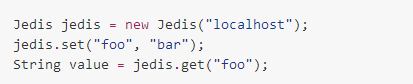

搭建jedis环境

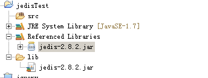

编写代码

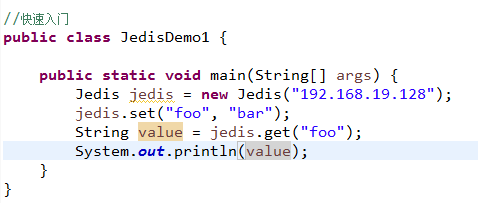

程序执行报错：

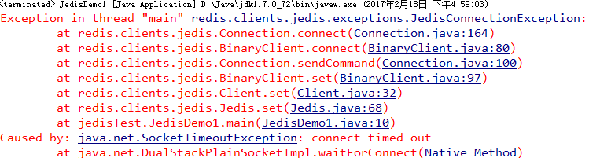

原因:

1.  redis服务器是否开启 ./bin/redis-server ./redis.conf
2.  linux的防火墙是否关闭 service iptables stop
3.  在redis.conf配置文件中 bind 127.0.0.1 代表的是外部 不可以访问redis

通过以上操作，错误信息不一样了 vi ./redis.conf

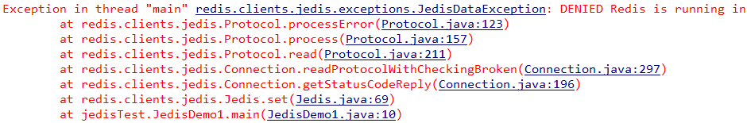

原因：是我们没有设置密码

我们需要在redis.conf文件中设置密码 默认是:requirepass foobared

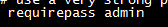

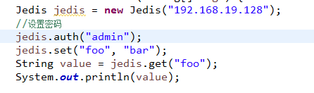

在命令行下连接redis

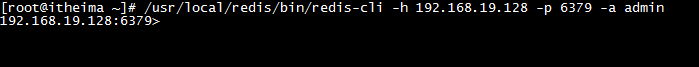

## string类型常见操作

```java
//string操作
public class JedisDemo2 {
Jedis jedis;
@Before
public void createJedis() {
jedis = new Jedis("192.168.19.128");
// 设置密码
jedis.auth("admin");
}
// 演示 set get
@Test
public void test1() {
jedis.set("username", "tom");
String value = jedis.get("username");
System.out.println(value);
}
//演示mset mget
@Test
public void test2(){
jedis.mset("password","123","age","20");
List<String> values = jedis.mget("username","password","age");
System.out.println(values);
}
//演示 append setrange getrange
@Test
public void test3(){
//jedis.append("username"," is boy");
//jedis.setrange("username", 7,"girl");
System.out.println(jedis.get("username"));
System.out.println(jedis.getrange("username", 7, -1));
}
}
```


## list类型常见操作

```java
//list操作
public class JedisDemo3 {
Jedis jedis;
@Before
public void createJedis() {
jedis = new Jedis("192.168.19.128");
// 设置密码
jedis.auth("admin");
}
// 演示lpush lrange
@Test
public void test1() {
jedis.lpush("names", "tom", "james","张三", "李四");
List<String> names = jedis.lrange("names", 0, -1);
System.out.println(names);
}
// lset
@Test
public void test2() {
// jedis.lset("names", 1, "王五");
// List<String> names = jedis.lrange("names", 0, -1);
// System.out.println(names);
String value = jedis.lindex("names", 1);
System.out.println(value);
}
// linsert
@Test
public void test3() {
jedis.linsert("names", LIST_POSITION.BEFORE, "james", "fox");
List<String> names = jedis.lrange("names", 0, -1);
System.out.println(names);
}
// lrem
@Test
public void test4(){
jedis.lrem("names", 1, "tom");
List<String> names = jedis.lrange("names", 0, -1);
System.out.println(names);
}
}
```


## hash类型常见操作

```java
//hash操作
public class JedisDemo4 {
Jedis jedis;
@Before
public void createJedis() {
jedis = new Jedis("192.168.19.128");
// 设置密码
jedis.auth("admin");
}
// 演示hset hget
@Test
public void test1() {
jedis.hset("user", "username", "tom");
String value = jedis.hget("user", "username");
System.out.println(value);
}
// 演示hmset hmget
/@Test
public void test2() {
Map<String, String> hash = new HashMap<String, String>();
hash.put("password", "123");
hash.put("sex", "male");
jedis.hmset("user", hash);
List<String> values = jedis.hmget("user", "username", "password", "sex");
System.out.println(values);
}
//演示 hgetall hkeys kvals
@Test
public void test3(){
Map<String, String> map = jedis.hgetAll("user");
for(String key:map.keySet()){
System.out.println(key+" "+map.get(key));
}
Set<String> keys = jedis.hkeys("user");
System.out.println(keys);
List<String> values = jedis.hvals("user");
System.out.println(values);
}
// 演示hdel
@Test
public void test4(){
jedis.hdel("user", "username","password");
Map<String, String> map = jedis.hgetAll("user");
for(String key:map.keySet()){
System.out.println(key+" "+map.get(key));
}
}
}
```


## set类型常见操作

```java
//set操作
public class JedisDemo5 {
Jedis jedis;
@Before
public void createJedis() {
jedis = new Jedis("192.168.19.128");
// 设置密码
jedis.auth("admin");
}
//演示sadd smembers
@Test
public void test1(){
jedis.sadd("language1","java","c++","ruby","python");
Set<String> smembers = jedis.smembers("language1");
System.out.println(smembers);
}
//演示srem
@Test
public void test2(){
jedis.srem("language1", "java");
Set<String> smembers = jedis.smembers("language1");
System.out.println(smembers);
}
//差集 sdiff
@Test
public void test3(){
jedis.sadd("language1","java","c++","ruby","python");
jedis.sadd("language2","ios","c++","c#","android");
Set<String> sdiff = jedis.sdiff("language1","language2");
System.out.println(sdiff);
}
//交集
@Test
public void test4(){
jedis.sadd("language1","java","c++","ruby","python");
jedis.sadd("language2","ios","c++","c/#","android");
Set<String> sinter = jedis.sinter("language1","language2");
System.out.println(sinter);
}
//并集
@Test
public void test5(){
jedis.sadd("language1","java","c++","ruby","python");
jedis.sadd("language2","ios","c++","c#","android");
Set<String> sunion = jedis.sunion("language1","language2");
System.out.println(sunion);
}
}
```


## sortedSet类型常见操作

```java
//sortedset操作
public class JedisDemo6 {
Jedis jedis;
@Before
public void createJedis() {
jedis = new Jedis("192.168.19.128");
// 设置密码
jedis.auth("admin");
}
// 演示zadd zrange zrangeByScore
@Test
public void test1() {
Map<String, Double> sm = new HashMap<String, Double>();
sm.put("张三", 70.0);
sm.put("李四", 80.0);
sm.put("王五", 90.0);
sm.put("赵六", 60.0);
jedis.zadd("zkey", sm);
Set<String> set = jedis.zrange("zkey", 0, -1);
System.out.println(set);
// 根据分数获取
Set<String> set1 = jedis.zrangeByScore("zkey", 70.0, 90.0);
System.out.println(set1);
}
// 获取分数元素 zrangeWithScores
@Test
public void test2() {
Map<String, Double> sm = new HashMap<String, Double>();
sm.put("张三", 70.0);
sm.put("李四", 80.0);
sm.put("王五", 90.0);
sm.put("赵六", 60.0);
jedis.zadd("zkey", sm);
Set<Tuple> zws = jedis.zrangeWithScores("zkey", 0, -1);
for (Tuple t : zws) {
System.out.println(t.getScore() + " " + t.getElement());
}
}
// zrank
@Test
public void test3() {
Map<String, Double> sm = new HashMap<String, Double>();
sm.put("张三", 70.0);
sm.put("李四", 80.0);
sm.put("王五", 90.0);
sm.put("赵六", 60.0);
jedis.zadd("zkey", sm);
Long num = jedis.zrank("zkey", "赵六");
System.out.println(num);
}
// zscore
@Test
public void test4() {
Map<String, Double> sm = new HashMap<String, Double>();
sm.put("张三", 70.0);
sm.put("李四", 80.0);
sm.put("王五", 90.0);
sm.put("赵六", 60.0);
jedis.zadd("zkey", sm);
Double zscore = jedis.zscore("zkey", "张三");
System.out.println(zscore);
}
// zrem
@Test
public void test5() {
Map<String, Double> sm = new HashMap<String, Double>();
sm.put("张三", 70.0);
sm.put("李四", 80.0);
sm.put("王五", 90.0);
sm.put("赵六", 60.0);
jedis.zadd("zkey", sm);
jedis.zrem("zkey", "李四");
Set/<Tuple/> zws = jedis.zrangeWithScores("zkey", 0, -1);
for (Tuple t : zws) {
System.out.println(t.getScore() + " " + t.getElement());
}
}
}
```


## key的常见操作

```java
//key的通用操作
public class JedisDemo7 {
Jedis jedis;
@Before
public void createJedis() {
jedis = new Jedis("192.168.19.128");
// 设置密码
jedis.auth("admin");
}
// keys patten
@Test
public void test1(){
Set<String> keys = jedis.keys("*");
System.out.println(keys);
}
//del key
@Test
public void test2(){
Long del = jedis.del("user");
System.out.println(del);
}
//关于key时间设置
@Test
public void test3(){
//jedis.expire("username", 200); //设置生命周期为200秒
jedis.persist("username");
Long ttl = jedis.ttl("username"); //获取生命周期值
System.out.println(ttl);
}
}
```


# Redis数据持久化

Redis将内存存储和持久化存储相结合，即可提供数据访问的高效性，又可保证数据存储的安全性

## Redis数据持久化机制介绍

1). RDB持久化：

​		该机制是指在指定的时间间隔内将**内存中的数据集快照**写入磁盘。

2). AOF(append only file)持久化:

​	该机制将以**日志的形式记录服务器所处理的每一个写操作**，在Redis服务器启动之初会读取该文件来重新构建数据库，以保证启动后数据库中的数据是完整的。

3). 同时应用AOF和RDB。

4). 无持久化：

​	可通过配置的方式禁用Redis服务器的持久化功能，这样我们就可以将Redis视为一个功能加强版的memcached了

## Redis数据持久化配置与测试

- RDB快照方式:

  缺省情况下，Redis会将数据集的快照dump到dump.rdb文件中。此外，我们也可以通过配置文件来修改Redis服务器dump快照的频率，在打开redis.conf文件之后，我们搜索save，可以看到下面的配置信息：

- save 900 1

  在900秒(15分钟)之后，如果至少有1个key发生变化，则dump内存快照。

- save 300 10

  在300秒(5分钟)之后，如果至少有10个key发生变化，则dump内存快照。

- save 60 10

  在60秒(1分钟)之后，如果至少有10000个key发生变化，则dump内存快照。

注意:关于dump.rdb文件存储的位置,它是设置是在redis.conf文件中

dir ./

这段配置指的是服务器启动时的当前路径。

-   AOF日志文件方式：在redis.conf文件中

- AOF日志持久化机制的开启：

  将appendonly no 改为appendonly yes

- AOF同步方式的配置：

  在Redis的配置文件中存在三种同步方式，它们分别是:

  1. appendfsync always :每次有数据修改发生时都会写入AOF文件。
  2. appendfsync everysec :每秒钟同步一次，该策略为AOF的缺省策略。
  3. appendfsync no :从不同步。高效但是数据不会被持久化。

## RDB与AOF对比总结 

- RDB存在哪些优势呢？

  1). 数据的备份和恢复非常方便，因为一个数据库只有一个持久化文件

  2). 性能最大化。对于Redis的服务进程而言，在开始持久化时，它唯一需要做的只是fork出子进程，之后再由子进程完成这些持久化的工作，这样就可以极大的避免服务进程执行IO操作了。

  3). 相比于AOF机制，如果数据集很大，RDB的启动效率会更高。

- RDB又存在哪些劣势呢？

  1).系统一旦在定时持久化之前出现宕机现象，此前没有来得及写入磁盘的数据都将丢失。

  2). 由于RDB是通过fork子进程来协助完成数据持久化工作的，因此，如果当数据集较大时，可能会导致整个服务器停止服务几百毫秒，甚至是1秒钟。

- AOF的优势有哪些呢？

  1). 该机制可以带来更高的数据安全性，即数据持久性。Redis中提供了3种同步策略，即每秒同步、每修改同步和不同步。

  2).对日志文件的写入操作采用的是append模式，因此在写入过程中即使出现宕机现象，也不会破坏日志文件中已经存在的内容。

  3). 如果日志过大，Redis可以自动启用rewrite机制迅速"瘦身"(也可手动触发aof的rewrite操作，命令： bgrewriteaof)

4). AOF日志格式清晰、易于理解，很容易用AOF日志文件完成数据的重建。

- AOF的劣势有哪些呢？

  1). 对于相同数量的数据集而言，AOF文件通常要大于RDB文件。

  2). 根据同步策略的不同，AOF在运行效率上往往会慢于RDB。总之，每秒同步策略的效率是比较高的，同步禁用策略的效率和RDB一样高效。
