# Javaweb基础加强-反射

# 反射介绍

反射，一种计算机处理方式。是程序可以访问、检测和修改它本身状态或行为的一种能力。

JAVA反射机制是在运行状态中，对于任意一个类，都能够知道这个类的所有属性和方法；对于任意一个对象，都能够调用它的任意方法和属性；这种动态获取信息以及动态调用对象方法的功能称为java语言的反射机制。

Java反射常用API

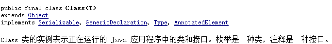

在java.lang.reflect包下有三个类

{width="1.2916666666666667in" height="0.5104166666666666in"}

优点：

1. 反射提高了程序的灵活性和扩展性。
2. 降低耦合性，提高自适应能力。
3. 它允许程序创建和控制任何类的对象，无需提前硬编码目标类。

缺点：

1. 性能问题：使用反射基本上是一种解释操作，用于字段和方法接入时要远慢于直接代码。因此反射机制主要应用在对灵活性和拓展性要求很高的系统框架上，普通程序不建议使用。
2. 使用反射会模糊程序内部逻辑；程序员希望在源代码中看到程序的逻辑，反射却绕过了源代码的技术，因而会带来维护的问题，反射代码比相应的直接代码更复杂。

# Class介绍

Java中的Class它可以代表任意的类或接口类型.

如何获取一个Class？

有三种方式:

1.  如果持有一个对象，可以直接通过从Object类中继承的getClass方法获取

> 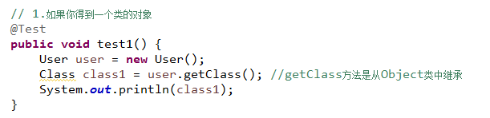{width="5.721527777777778in" height="1.3875in"}

2.  可以直接通过类包(接口)直接调用其属性.class获取

> 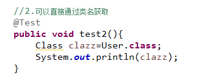{width="3.75in" height="1.34375in"}

3.  可以通过Class类中提供的forName方法获取

> 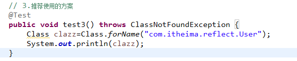{width="5.725in" height="1.1819444444444445in"}

为什么要获取Class对象？

对于我们学习反射，我们在操作中一般会获取类的成员 Constructor Field Method,但是要想获取这些对象，必须首先得到其Class,通过Class来获得其它对象

# Constructor介绍

Constructor它描述的单个构造器，我们得到它就可以实例化对象.

问题:如何获取Constructor?

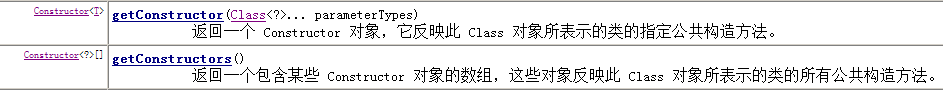{width="5.697222222222222in" height="0.54375in"}

getConstructor它获取的是类的public构造

getConstructors它获取的是类的所有的public构造

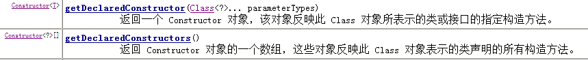{width="5.726388888888889in" height="0.5868055555555556in"}

以上两个方法不仅可以获取public，也可以获取其它权限的。

我们得到构造器，就可以实例化对象

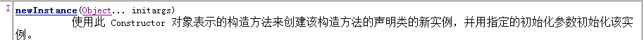{width="5.7125in" height="0.35625in"}

如果不是public，那么我们需要通过AccessibleObject中的setAccessible(true)来取消检查

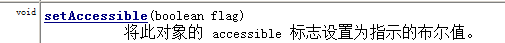{width="5.260416666666667in" height="0.4479166666666667in"}


# Field介绍

Java.lang.reflect.Field它描述的属性对象。

关于Filed我们了解以下两个方面

1.  如何获取一个Field

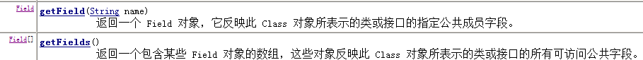{width="5.68125in" height="0.53125in"}

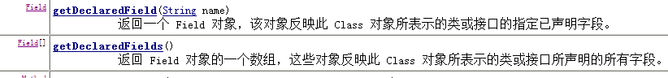{width="5.736805555555556in" height="0.6701388888888888in"}

2.  Field的操作

    a.  对Field进行赋值

> 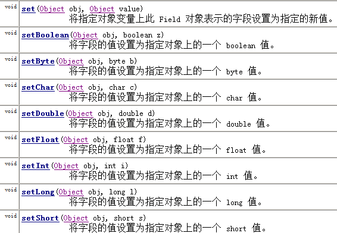{width="5.7131944444444445in" height="3.9611111111111112in"}

b.  对Field进行取值

> 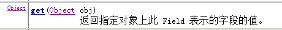{width="4.791666666666667in" height="0.5104166666666666in"}

# Method介绍（重点）

Java.lang.reflect.Method它描述的是类或接口中的方法。

如何获取一个Method对象

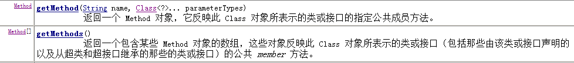{width="5.704861111111111in" height="0.6298611111111111in"}

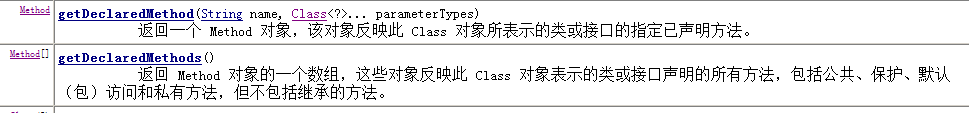{width="5.753472222222222in" height="0.6708333333333333in"}

Method如何使用?

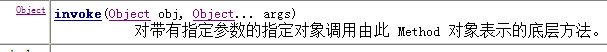{width="5.754166666666666in" height="0.4930555555555556in"}

Method的invoke使用时注意事项?

1.  如果方法是static，我们怎样调用？

> 如果方法是静态的，在通过invoke调用时不需要传递对象
>
> 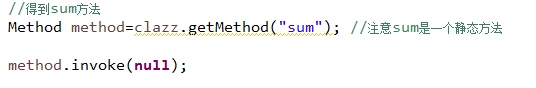{width="5.583333333333333in" height="0.9166666666666666in"}

2.  如果方法的参数是一个数组类型，怎样处理?

> 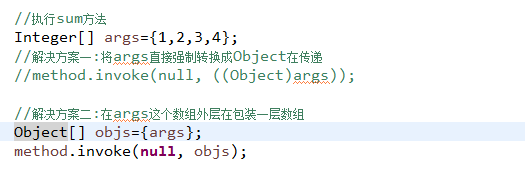{width="5.46875in" height="1.9270833333333333in"}

# 反射案例

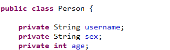{width="3.59375in" height="1.0625in"}

并提供get\set方法

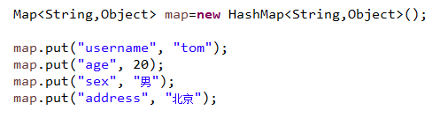{width="5.177083333333333in" height="1.3958333333333333in"}

使用java中的反射技术将类中的属性与map中的key相同名称的，使用反射技术将key对应的value值赋值给属性.

采用两种方式完成操作

## 直接操作属性 Field来完成操作

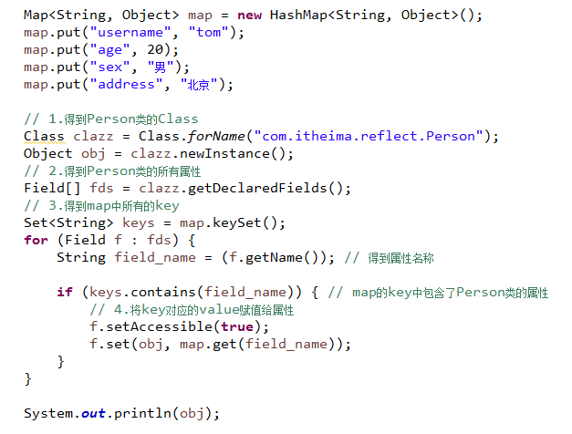{width="5.747222222222222in" height="4.363194444444445in"}

## 通过属性对应的setXxx方法来完成操作

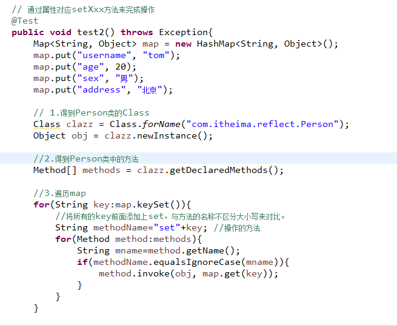{width="5.73125in" height="4.715972222222222in"}

Java基础加强-动态代理

干一件事情

自己做

请代理帮忙做

接口: 抽象方法

目标对象: 实现该接口,并实现抽象方法

代理对象: 实现该接口,并实现抽象方法,在该抽象方法中让目标对象调用目标对象的方法

测试类: 创建目标对象,调用该方法 目标对象直接调用方法

实例:

接口: 买烟的抽象方法

班长类: 目标对象 实现买烟的功能

测试类: 创建班长对象 让班长对象调用买烟的方法

代理:

接口:买烟的抽象方法

班长类: 目标对象 实现买烟的功能

代理类: 属性: 班长对象 实现买烟的功能,在买烟的方法 里面 让班长对象调用班长自己的买烟的方法(代理对象的买烟方法里面进行判断,来决定班长是否去买烟)

测试类: 创建代理对象,让代理对象调用代理对象中的买烟方法

# 二、代理模式介绍

即Proxy Pattern，23种常用的面向对象软件的设计模式之一

代理模式的定义：为其他对象提供一种代理以控制对这个对象的访问。在某些情况下，一个对象不适合或者不能直接引用另一个对象，而代理对象可以在客户端和目标对象之间起到中介的作用。

## 1. 组成

抽象角色：通过接口或抽象类声明真实角色实现的业务方法。

代理角色：实现抽象角色，是真实角色的代理，通过真实角色的业务逻辑方法来实现抽象方法，并可以附加自己的操作。

真实角色：实现抽象角色，定义真实角色所要实现的业务逻辑，供代理角色调用。

## 2. 分类

### 静态代理

是由程序员创建或工具生成代理类的源码，再编译代理类。所谓静态也就是在程序运行前就已经存在代理类的字节码文件，代理类和委托类的关系在运行前就确定了。

### 动态代理

是在实现阶段不用关心代理类，而在运行阶段才指定哪一个对象。

## 优点

(1).职责清晰

真实的角色就是实现实际的业务逻辑，不用关心其他非本职责的事务，通过后期的代理完成一件完成事务，附带的结果就是编程简洁清晰。

(2).代理对象可以在客户端和目标对象之间起到中介的作用，这样起到了中介的作用和保护了目标对象的作用。

(3).高扩展性

# 3. Java中动态代理

在jdk的api中提供了java.lang.reflect.Proxy它可以帮助我们完成动态代理创建

注意：在java中使用Proxy来完成动态代理对象的创建，只能为目标实现了接口的类创建代理对象。

动态代理是在内存中直接生成代理对象。

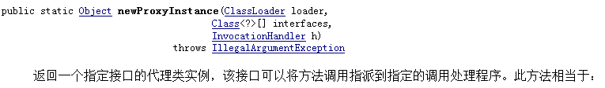{width="5.7375in" height="0.8402777777777778in"}

通过这个方法可以直接创建一个代理对象。

前两个参数帮助我们生产一个代理对象;

第三个参数控制目标行为访问的问题

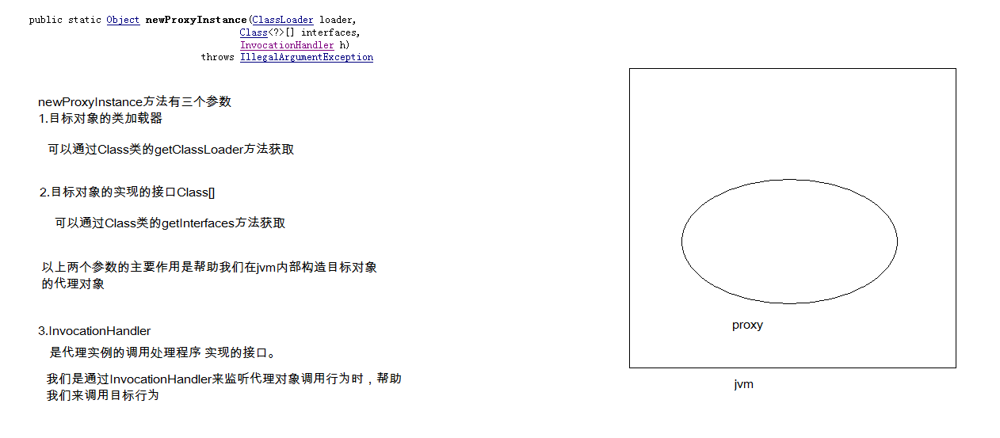{width="5.652777777777778in" height="2.4715277777777778in"}

InvocationHandler详解

它是一个接口，接口中声明了一个方法

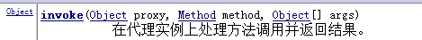{width="4.885416666666667in" height="0.46875in"}

Invoke方法，它是在代理对象调用行为时，会执行的方法，而invoke方法上有三个参数

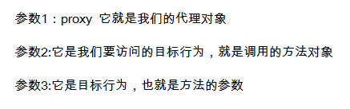{width="4.552083333333333in" height="1.4270833333333333in"}

这个方法的主要作用是，当我们通过代理对象调用行为时，来控制目标行为是否可以被调用。

{width="5.6930555555555555in" height="2.548611111111111in"}

案例:测试addUser方法的运行时间

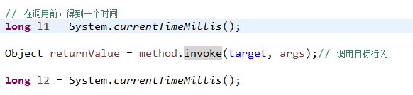{width="5.759722222222222in" height="1.3263888888888888in"}

在开发中，我们使用动态代理可以完成性能监控，权限控制，日志记录等操作s

Java基础加强-注解Annotation

# 三、注解概述

## 注解介绍

注解（Annotation），也叫元数据。一种代码级别的说明。它是JDK1.5及以后版本引入的一个特性，与类、接口、枚举是在同一个层次。它可以用于创建文档，跟踪代码中的依赖性，甚至执行基本编译时检查。注解是以'\@注解名'在代码中存在的

它可以声明在包、类、字段、方法、局部变量、方法参数等的前面，用来对这些元素进行说明，注释。你可以在编译时选择代码里的注解是否只存在于源代码级，或者它也能在class文件、或者运行时中出现（SOURCE\CLASS\RUNTIME）。

## 注解作用

如果要对于元数据的作用进行分类，还没有明确的定义，不过我们可以根据它所起的作用，大致可分为三类：

编写文档：通过代码里标识的元数据生成文档。

代码分析：通过代码里标识的元数据对代码进行分析。

编译检查：通过代码里标识的元数据让编译器能实现基本的编译检查

在现在开发中使用注解，一般是用于将注解替换配置文件。（Xml配置文件）

# Java中基本内置注解

## @Override

它的作用是对覆盖超类中方法的方法进行标记，如果被标记的方法并没有实际覆盖超类中的方法，则编译器会发出错误警告。

注意事项:

对于接口中的方法重写，在jdk1.5时@Override它是会报错.

在jdk1.6后的版本就可以描述接口与类之间的重写

## @Deprecated

它的作用是对不应该再使用的方法添加注解，当编程人员使用这些方法时，将会在编译时显示提示信息

问题:什么时候方法是过时的?

> 当前版本中方法它存在隐患，在后续版本中对其进行了补充，这时前一个版本中的方法就会标注成过时的。

## @SuppressWarnings

它的作用是去掉程序中的警告.

其参数有：

deprecation，使用了过时的类或方法时的警告

unchecked，执行了未检查的转换时的警告

fallthrough，当 switch 程序块直接通往下一种情况而没有 break 时的警告

path，在类路径、源文件路径等中有不存在的路径时的警告

serial，当在可序列化的类上缺少serialVersionUID 定义时的警告

finally ，任何 finally 子句不能正常完成时的警告

all，关于以上所有情况的警告

# 自定义注解

## 注解声明

通过上面的三个注解的源代码可以发现，要声明一个注解通过 \@interface

声明一个注解格式 @interface 注解名

## 注解本质分析

分析一下注解的本质:将其.class文件找到，反编译. 可以使用javap命令或反编译工具。

@interface MyAnnoation{}

反编译后的结果

```
interface MyAnnotation extends Annotation

{

}
```

结论:注解本质上就是一个接口。它扩展了java.lang.annotation.Annotation接口;

在java中所有注解都是Annotation接口的子接口。

## 注解成员

注解本质上就是一个接口，那么它也可以有属性和方法。

但是接口中的属性是 public static final的，在注解中注解没有什么意义。

在开发中注解中经常存在的是方法。而在注解中叫做注解的属性.

## 自定义注解-属性操作

### 注解属性类型

1.基本类型 byte short int long float double char boolean

2.String

3.枚举类型

4.注解类型

5.Class类型

6.以上类型的一维数组类型

### 注解属性的使用

1.如果一个注解有属性，那么在使用注解时，要对属性进行赋值操作.

例如:@MyAnnotation(st = \"aaa\")

2.如果一个注解的属性有多个，都需要赋值，使用\",\"分开属性.

@MyAnnotation(st = \"aaa\",i=10)

3.也可以给属性赋默认值

double d() default 1.23;

如果属性有默认值，在使用注解时，就可以不用为属性赋值。

4.如果属性是数组类型

1.可以直接使用 属性名={值1,值2,。。。}方式,例如

@MyAnnotation(st = \"aaa\",i=10,sts={\"a\",\"b\"})

2.如果数组的值只有一个也可以写成下面方式

@MyAnnotation(st = \"aaa\",i=10,sts=\"a\")

注意sts属性它是数组类型，也就是说，只有一个值时，可以省略\"{}\"

5.对于属性名称 value的操作.

1.如果属性名称叫value,那么在使用时，可以省略属性名称

@MyAnnotation(\"hello\")

2.如果有多个属性，都需要赋值，其中一个叫value,这时，必须写属性名称

@MyAnnotation(value=\"hello\",i=10)

3.如果属性名称叫value,它的类型是数组类型.

1.只有这个value属性

可以直接赋值，不用写属性名称,但是，如果只有一个值

@MyAnnotation({\"abc\"})或 \@MyAnnotation(\"abc\")

但是如果有多个值

@MyAnnotation({\"abc\",\"def\"})

2.如果有多个属性，属性名称叫value

所有属性都需要赋值，那么必须写属性名称.

## 自定义注解-元注解

### 1.什么是元注解及其作用

用于修饰注解的注解，可以描述注解在什么范围及在什么阶段使用等

### 2.四个元注解介绍

#### @Retention 

指定注解信息在哪个阶段存在 Source Class Runtime

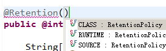{width="2.8541666666666665in" height="0.8854166666666666in"}

SOURCE它对应着编译阶段，可以帮助我们进行检查。

CLASS 它对应解析执行阶段

RUNTIME 它对应着在JVM中

#### @Target 

指定注解修饰目标对象类型 TYPE 类、接口 FIELD 成员变量 METHOD 方法

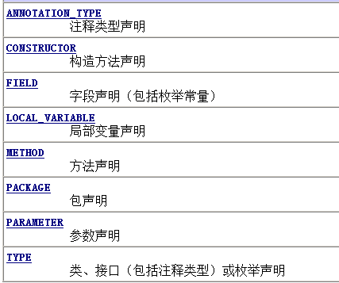{width="4.447916666666667in" height="3.71875in"}

#### @Documented 

使用该元注解修饰，该注解的信息可以生成到javadoc 文档中

#### @Inherited

如果一个注解使用该元注解修饰，应用注解目标类的子类会自动继承该注解

\@Retention \@Target 是自定义注解必须使用两个元注解，并且，\@Retention它的值应该是RUNTIME,因为我们会结合反射技术来使用。 \@Target我们一般使用TYPE或METHOD

## 案例-获取Connection连接数据库

目的：让注解具有功能，必须结合反射技术来应用。

注解它可以替换配置文件。

第一步:创建注解

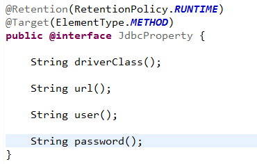{width="3.8541666666666665in" height="2.4583333333333335in"}

第二步:使用注解

我们可以通过getAnnotation()方法来获取注解对象

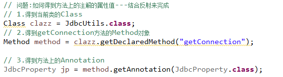{width="5.729861111111111in" height="1.573611111111111in"}

问题:使用注解可以替换配置文件，为什么要替换?

配置文件中的信息，它会随着程序的变大，配置信息越来越多，不利于开发。

而将配置信息通过注解来替换，便于开发与阅读。
