# 一、IDEA

# IDEA安装

下载地址：[http://www.jetbrains.com/idea/download/\#section=windows ](http://www.jetbrains.com/idea/download/#section=windows)

选择Exe文件下载，当然也可以选择Zip文件，Zip为绿色文件，可直接双击使用，而Exe文件需要安装。

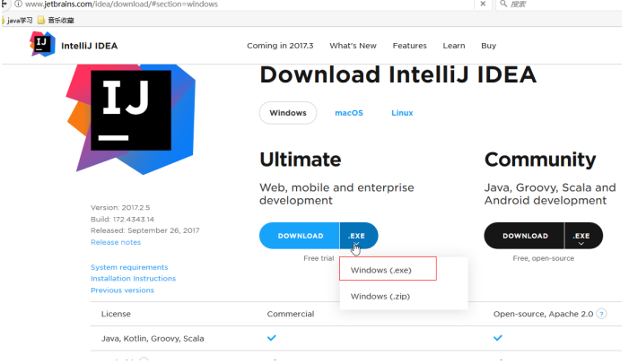

由于安装步骤除了Next还是Next，我就不介绍了。

# 二、工具栏介绍（了解）

打开IDEA后能看到顶部有对应的工具栏，我们对其中一些重要的工具栏做个介绍和了解。

{width="5.7625in" height="0.24722222222222223in"}

## 1. File

### New

- 创建工程

  IDEA支持的语言比较多，所以我们创建项目的时候，除了可以创建java项目还可以创建Android工程、Kotlin工程等。

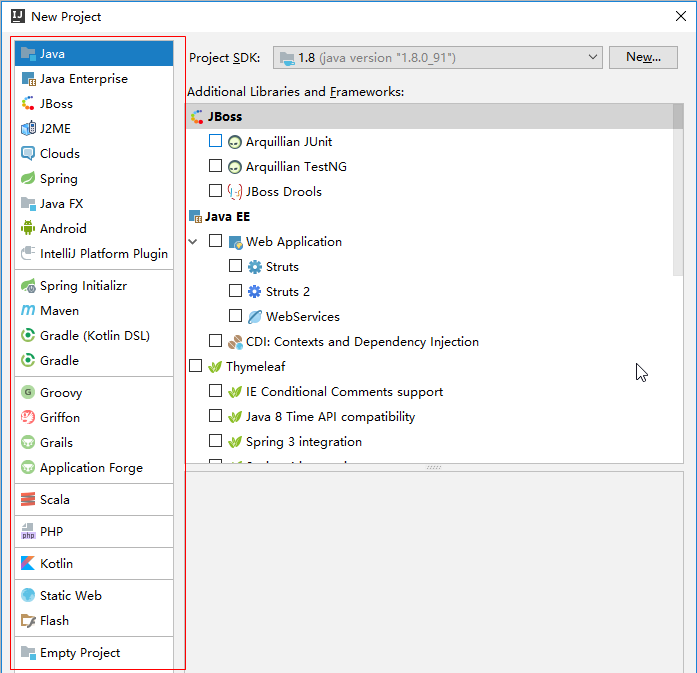

- 创建对文件

  new功能还能创建很多别的文件，例如html、xml等，如果找不到对应的类型，直接new File，后缀写对应文件后缀名就可以了。

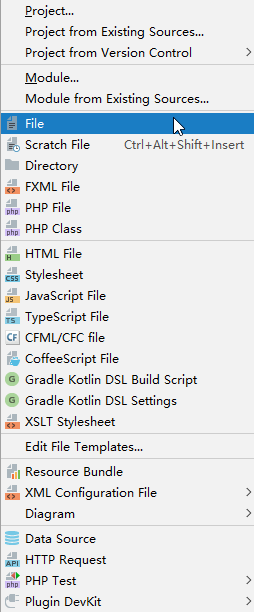{width="2.6458333333333335in" height="6.395138888888889in"}

### Open/Open URL/Open Recent/Close Project

- open

  打开某个工程或者目录

- Open URL

  打开某个网络地址，例如http://www.haoso.com

- Open Recent

  打开最近使用的工程

- Close Proje

  关闭当前工程

### Settings/Default settings(理解)

Settings用来设置当前工程IDEA相关属性，而Default settings则设置IDEA默认属性，下面列举了部分：

1. Appearance & Behavior 外观和行为
2. Keymap 快捷键
3. Editor 编辑器
4. Plugins 插件
5. Version Control 版本控制
6. Build,Execution,Deployment 构建，执行，部署
7. Languages & Frameworks 语言和框架
8. Tools 工具集

## 2. Edit

1. Cut 剪切
2. Copy 拷贝
3. Copy Path 拷贝路径
4. Copy Relative Path 拷贝相对路径
5. Paste 粘贴
6. Paste from History 从历史记录中粘贴
7. Paste Simple 粘贴剪切板上的内容
8. Delete 删除选中文件

## 3. View

1.  Tool Windows 面板功能切换

2.  Compare with 和其他文件对比

3.  Compare with Clipboard 和剪切板内容对比

4.  Toolbar 是否显示顶部工具栏

5.  Tool Buttons 是否显示工具栏按钮

6.  Status Bar 是否显示状态工具

7.  Navigation Bar 是否显示导航栏

## 4. Navigate

它主要实现了各种快捷查找和跳转功能。

1.  Class 快速定位一个java文件

2.  File 快速定位一个文件

3.  Line/Column 快速定位某一行

4.  Back 标签页向左移动

5.  Forward 标签页向右移动

6.  Last Edit Location 最后编辑的文件

## 5. Code

该工具栏主要是对源码类进行操作。

1.  Override Methods 重写父类相关方法

2.  Generate 创建常用方法，例如get、set、toString或者构造函数等

3.  Surround With 相关流程控制，或者捕获异常等，如图：

    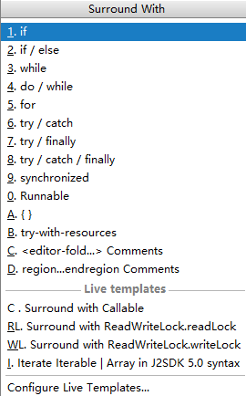{width="2.8118055555555554in" height="4.520138888888889in"}

4.  Move Line Down 当前行向下移动

5.  Move Line Up 当前行向上移动

## 6. Refactor

1.  Rename 更改文件名以及相关引用的更改

2.  Rename File 仅只更改文件名

3.  Extract-\>Variable 抽取一个变量(可以选中一段字符，抽取成方法的一个变量)

4.  Extract-\>Field 抽取一个成员变量(可以选中一段字符，抽取成类的一个变量)

5.  Extract-\>Parameter 抽取一个入参(可以选中一段字符，抽取成方法的入参)

6.  Extract-\>Method 抽取一个方法

## 7. Build/Run/Tools

Build该功能主要用于构建当前工程。

Run用于开发环境测试对应的工程。

Tools集成的一些工具列表。

# 三、IDEA创建普通java项目

创建普通java项目，步骤很简单

选择：File\>New\>Project\>Java\>javaEE(如果是javaweb项目，需要勾选Web Application)

Project SDK选择当前环境中的JDK配置。

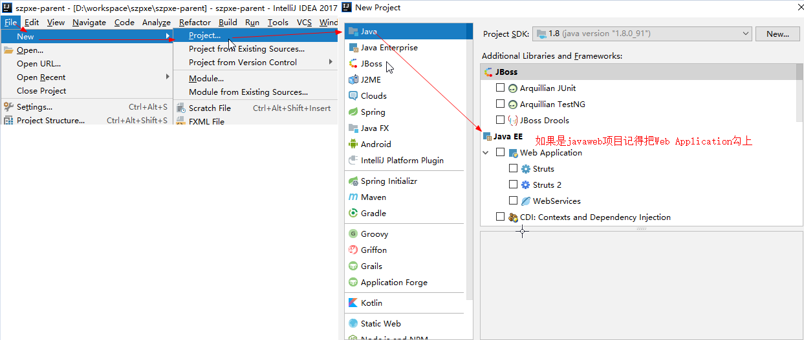{width="5.761111111111111in" height="2.442361111111111in"}

这里可以选择根据下面对应的模板创建当前项目，也可以直接选择下一步创建一个普通项目。

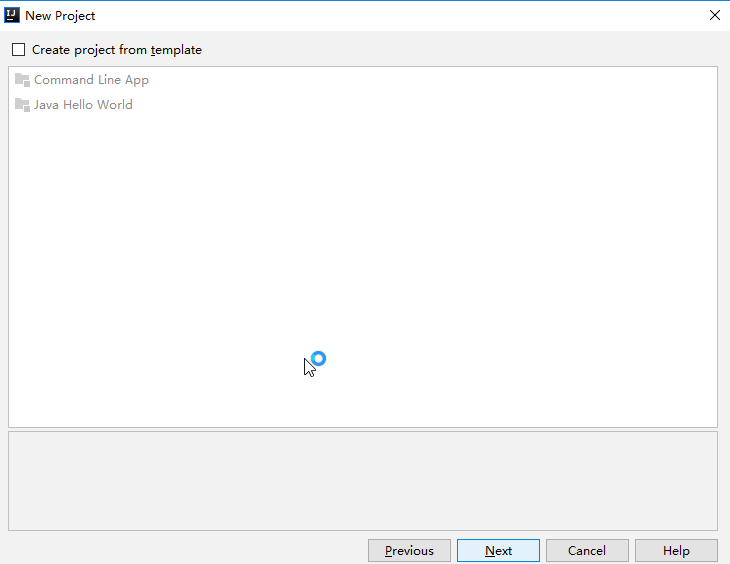{width="5.763194444444444in" height="4.4527777777777775in"}

输入项目名字和项目存储目录，选择Finish创建普通项目完毕。

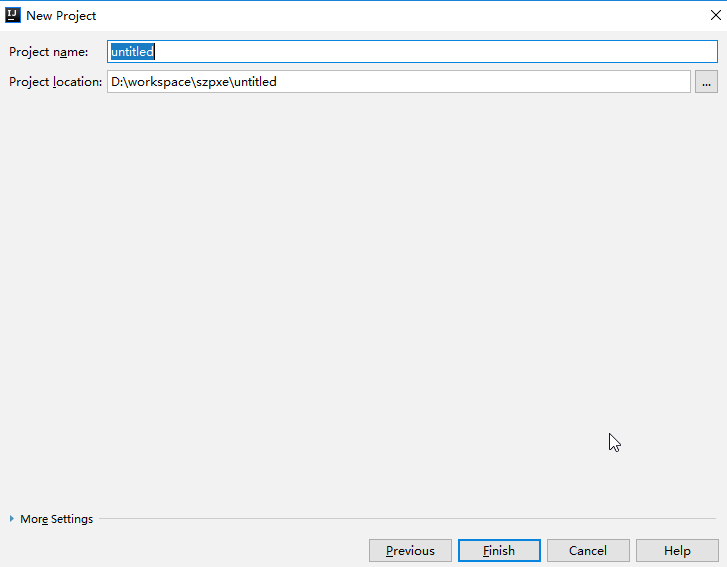{width="5.7625in" height="4.4944444444444445in"}

# 3.1 设置默认的JDK环境变量

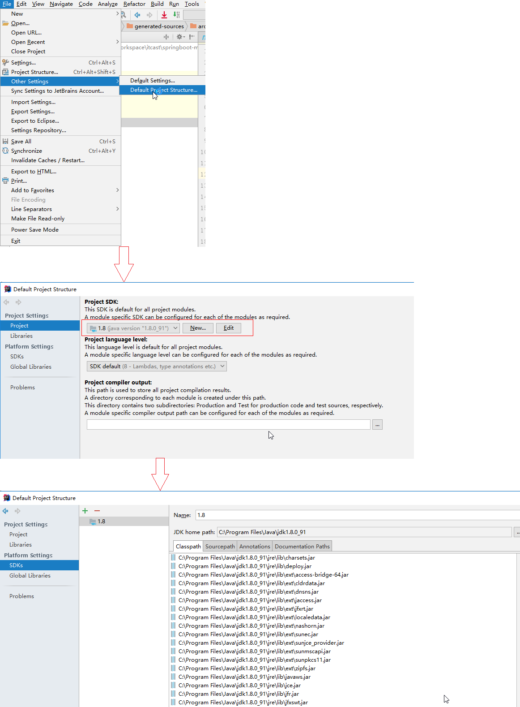{width="5.761111111111111in" height="7.822916666666667in"}

# 3.2 项目导包和文件类型定义

## 项目导包

IDEA对包的要求比较严格，并不是导入了包后就一定能使用。如下图：

选中项目：点击File\>Project Structure\>选中Modules\>点击绿色+号\>Jars or directors\>选中要加入的包\>勾选包\>应用。

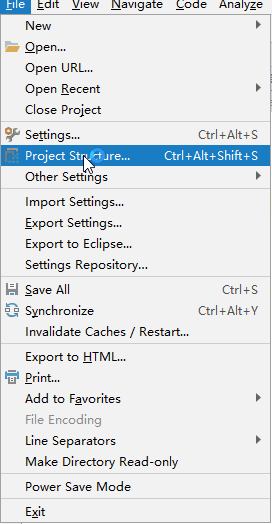{width="2.832638888888889in" height="5.457638888888889in"}

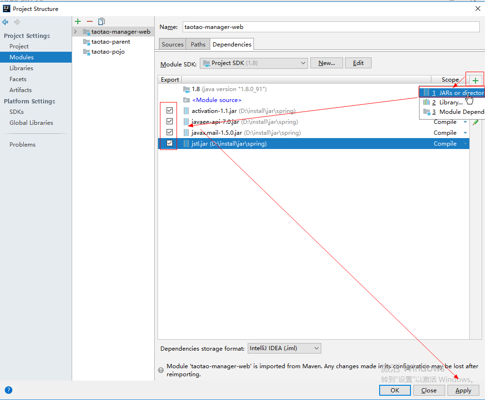{width="5.758333333333334in" height="4.75in"}

## 文件类型定义

项目创建后，我们会发现一个包下不能创建自己要的东西，这个时候怎么办？因为我们IDEA对项目包和文件夹敏感，给每个文件夹指定了类型，例如java源码包、classpath资源包、测试源码包、测试资源包、文件夹等，在包下可以创建java类而在文件夹下不可以创建java类。

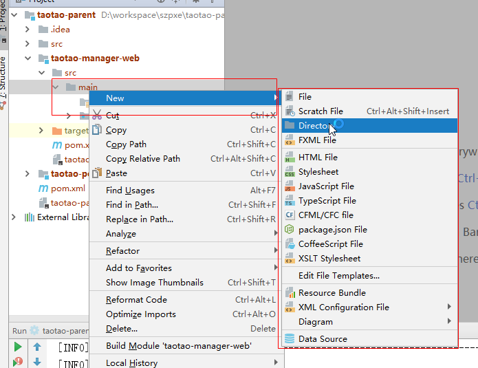{width="5.7625in" height="4.435416666666667in"}

解决方案：

选中项目：File\>Project Structure\>Modules\>Sources

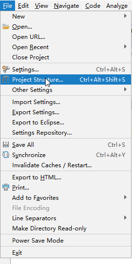{width="2.832638888888889in" height="5.655555555555556in"}

此时会出现如下图：

如果你想让当前某个文件夹变成java源码包，直接选中文件夹，再点击对应的文件类型设定即可。

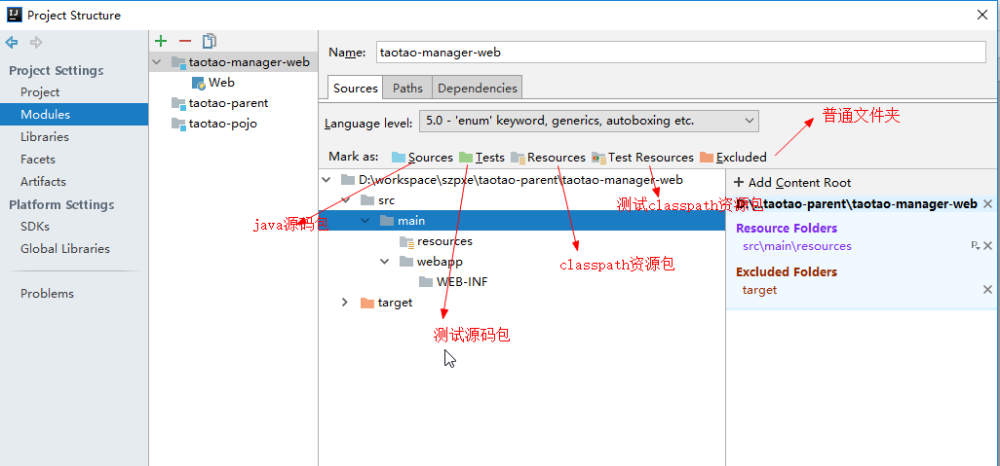{width="5.759722222222222in" height="2.688888888888889in"}

# 3.3 面板介绍

## 项目信息展示面板

项目信息面板展示了项目结构和项目所有详细内容，可以通过它来对项目进行各种操作。

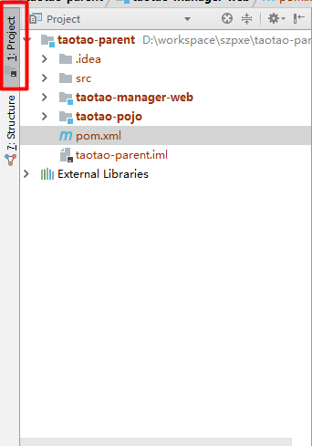{width="3.5618055555555554in" height="5.093055555555556in"}

## 项目结构面板

项目结构面板主要展示了对应的结构。

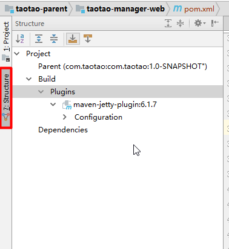{width="3.9368055555555554in" height="4.290972222222222in"}

## 命令面板

我们常常会输入一些常用的命令，入maven命令，IDEA提供了命令面板。

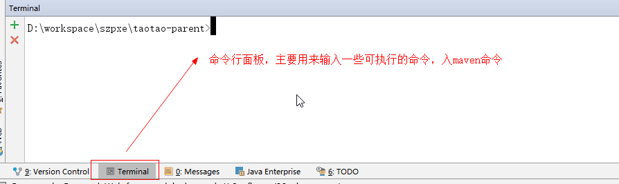{width="5.763888888888889in" height="1.7208333333333334in"}

## 数据库链接配置面板

为了方便对数据库操作，IDEA集成了数据库操作工具，通过它可以轻松连上对应的数据库。

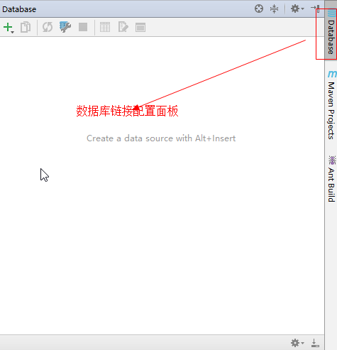{width="4.947222222222222in" height="5.134722222222222in"}

### 链接数据库配置

数据库链接面板支持链接多种数据库，我们这里选择MySQL。操作流程：

选择：+号\>Data Source\>MySQL

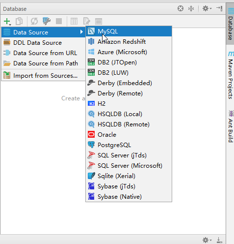{width="4.968055555555556in" height="5.165972222222222in"}

在数据库面板数据库链接信息配置这里输入链接信息，点击Test Connection.

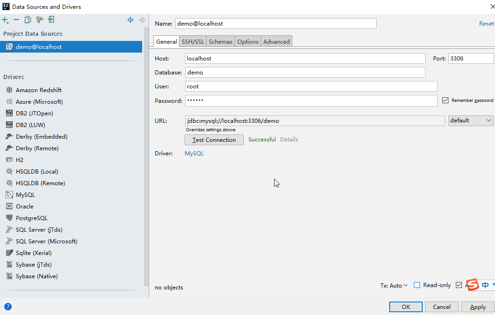{width="5.7625in" height="3.673611111111111in"}

这时候右边就能直接链接我们数据了。

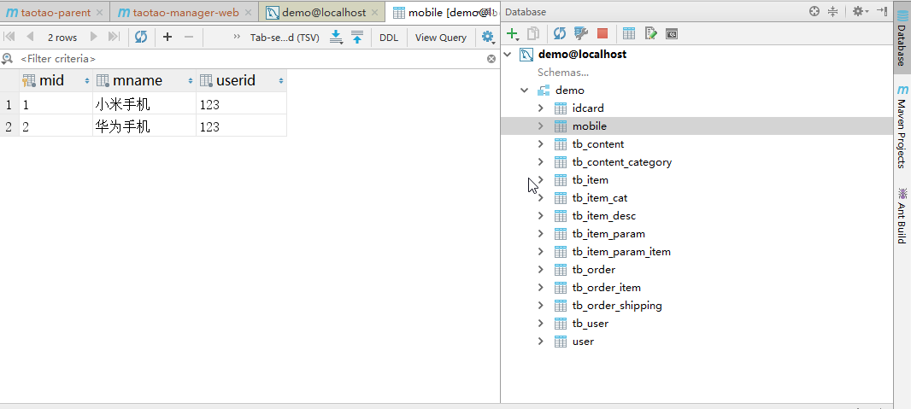{width="5.7625in" height="2.588888888888889in"}

当然，还可以在控制台输入SQL语句进行数据查询。

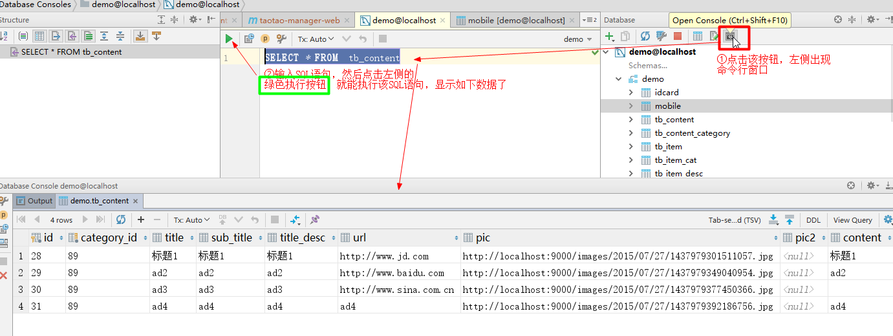{width="5.768055555555556in" height="2.1798611111111112in"}

# 3.4 IDEA配置Tomcat（掌握）

## 第一步：进入编辑面板

如图，选择Edit Configurations

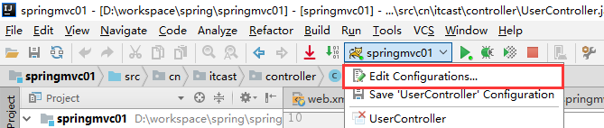{width="5.7625in" height="1.2236111111111112in"}

## 第二步：配置tomcat

选择Defaults\>Tomcat Server\>Local

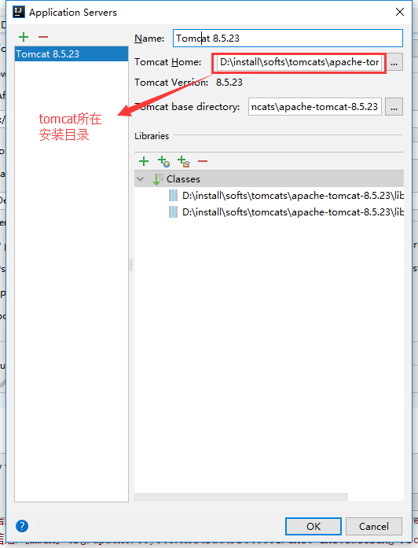{width="5.540972222222222in" height="7.259722222222222in"}

配置后tomcat编辑面板如图：

这里三个端口可自己任意修改，和以前tomcat的conf目录的server.xml一致，不过当前tomcat只是配置tomcat所在地。

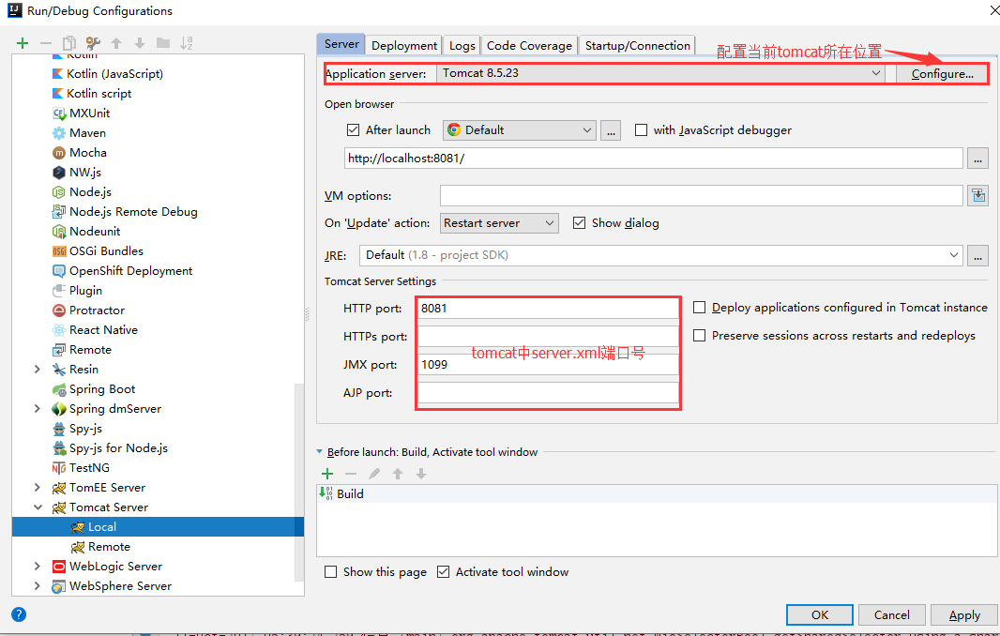{width="5.7625in" height="3.665277777777778in"}

## 发布项目

配置完成后，会多出一个tomcat的配置，如下图：

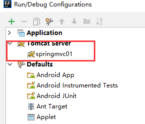{width="3.0097222222222224in" height="2.5833333333333335in"}

发布项目时，选择当前Tomcat Server\>Deployment进行项目配置

点击中间部分绿色+号，选择要发布的项目。右边Application content配置一般是你项目名字，不过建议设置成/，这样访问项目的时候不需要加项目名字了。

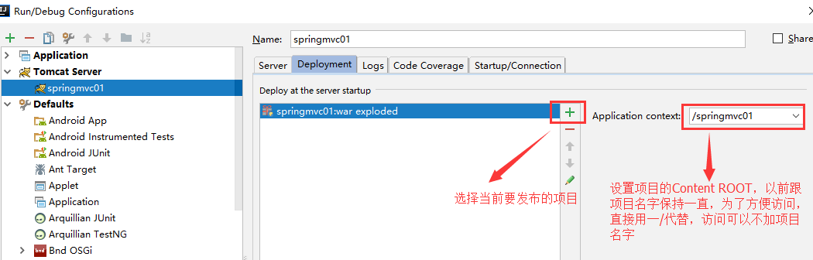{width="5.763194444444444in" height="1.8444444444444446in"}

## tomcat日志配置

为了方便查看日志，可以选择Logs配置日志，左边的复选框双击就能选中，选中后tomcat运行将能查看多种日志，更方便你分析项目问题。

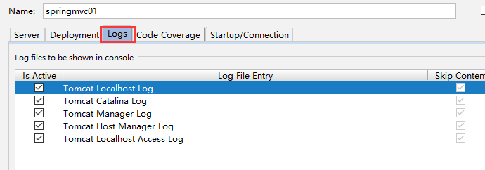{width="5.763888888888889in" height="2.0215277777777776in"}

## 启动tomcat

tomcat配置完成后，在之前的基础上会多出一个运行小按钮和debug小按钮。点击任何一个小按钮都能启动tomcat。

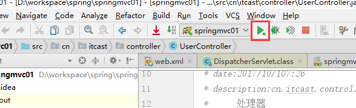{width="5.763194444444444in" height="1.7548611111111112in"}

启动tomcat后，IDEA下方会多出几个控制台日志窗口，之前你配置日志的时候，选中了哪些，下面就会多出对应的窗口，这里我们一般需要查看Tomcat Catalina Log就可以了，如果需要查看多种日志，点击不同标签页切换即可。

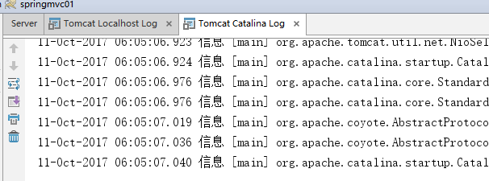{width="5.7625in" height="2.1395833333333334in"}

# 3.5 Jsp文件修改后重启生效问题

IDEA用Tomcat发布项目后，如果修改了某个jsp，需要重启tomcat，这样就造成了开发速度问题，如何解决？

修改tomcat配置即可，edit configurations

设置On 'Update' action为Redeploy。

设置On frame deactivation为Update resourcees。

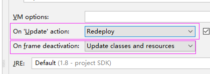{width="4.363888888888889in" height="1.5416666666666667in"}

# IDEA快捷键总结

+----------------------------------------------------------------------------------------------------------------------------------------------------------------------------------------------------------------------------------------------------------------------------------------------------------------------------------------------------------------------------------------------------------------------------------------------------------------------------------------------------------------------------+
| 1\. \-\-\-\-\-\-\-\-\-\--自动代码\-\-\-\-\-\-\--\                                                                                                                                                                                                                                                                                                                                                                                                                                                                          |
| 常用的有fori/sout/psvm+Tab即可生成循环、System.out、main方法等boilerplate样板代码\                                                                                                                                                                                                                                                                                                                                                                                                                                         |
| 例如要输入for(User user : users)只需输入user.for+Tab                                                                                                                                                                                                                                                                                                                                                                                                                                                                       |
|                                                                                                                                                                                                                                                                                                                                                                                                                                                                                                                            |
| 再比如，要输入Date birthday = user.getBirthday();只需输入user.getBirthday().var+Tab即可。代码标签输入完成后，按Tab，生成代码。                                                                                                                                                                                                                                                                                                                                                                                             |
|                                                                                                                                                                                                                                                                                                                                                                                                                                                                                                                            |
| Ctrl+Alt+O 优化导入的类和包\                                                                                                                                                                                                                                                                                                                                                                                                                                                                                               |
| Alt+Insert 生成代码(如get,set方法,构造函数等)   或者右键（Generate）\                                                                                                                                                                                                                                                                                                                                                                                                                                                      |
| fori/sout/psvm + Tab \                                                                                                                                                                                                                                                                                                                                                                                                                                                                                                     |
| Ctrl+Alt+T  生成try catch  或者 Alt+enter\                                                                                                                                                                                                                                                                                                                                                                                                                                                                                 |
| CTRL+ALT+T  把选中的代码放在 TRY{} IF{} ELSE{} 里\                                                                                                                                                                                                                                                                                                                                                                                                                                                                         |
| Ctrl + O 重写方法 \                                                                                                                                                                                                                                                                                                                                                                                                                                                                                                        |
| Ctrl + I 实现方法\                                                                                                                                                                                                                                                                                                                                                                                                                                                                                                         |
| Ctr+shift+U 大小写转化 \                                                                                                                                                                                                                                                                                                                                                                                                                                                                                                   |
| ALT+回车    导入包,自动修正 \                                                                                                                                                                                                                                                                                                                                                                                                                                                                                              |
| ALT+/       代码提示\                                                                                                                                                                                                                                                                                                                                                                                                                                                                                                      |
| CTRL+J      自动代码 \                                                                                                                                                                                                                                                                                                                                                                                                                                                                                                     |
| Ctrl+Shift+J，整合两行为一行\                                                                                                                                                                                                                                                                                                                                                                                                                                                                                              |
| CTRL+空格   代码提示 \                                                                                                                                                                                                                                                                                                                                                                                                                                                                                                     |
| CTRL+SHIFT+SPACE 自动补全代码 \                                                                                                                                                                                                                                                                                                                                                                                                                                                                                            |
| CTRL+ALT+L  格式化代码 \                                                                                                                                                                                                                                                                                                                                                                                                                                                                                                   |
| CTRL+ALT+I  自动缩进 \                                                                                                                                                                                                                                                                                                                                                                                                                                                                                                     |
| CTRL+ALT+O  优化导入的类和包 \                                                                                                                                                                                                                                                                                                                                                                                                                                                                                             |
| ALT+INSERT  生成代码(如GET,SET方法,构造函数等) \                                                                                                                                                                                                                                                                                                                                                                                                                                                                           |
| CTRL+E      最近更改的代码 \                                                                                                                                                                                                                                                                                                                                                                                                                                                                                               |
| CTRL+ALT+SPACE  类名或接口名提示 \                                                                                                                                                                                                                                                                                                                                                                                                                                                                                         |
| CTRL+P   方法参数提示 \                                                                                                                                                                                                                                                                                                                                                                                                                                                                                                    |
| CTRL+Q，可以看到当前方法的声明  \                                                                                                                                                                                                                                                                                                                                                                                                                                                                                          |
| Shift+F6  重构-重命名 (包、类、方法、变量、甚至注释等)\                                                                                                                                                                                                                                                                                                                                                                                                                                                                    |
| Ctrl+Alt+V 提取变量\                                                                                                                                                                                                                                                                                                                                                                                                                                                                                                       |
| \                                                                                                                                                                                                                                                                                                                                                                                                                                                                                                                          |
| 2. \-\-\-\-\-\-\-\-\-\--查询快捷键\-\-\-\-\-\-\--\                                                                                                                                                                                                                                                                                                                                                                                                                                                                         |
| Ctrl＋Shift＋Backspace可以跳转到上次编辑的地\                                                                                                                                                                                                                                                                                                                                                                                                                                                                              |
| CTRL+ALT+ left/right 前后导航编辑过的地方\                                                                                                                                                                                                                                                                                                                                                                                                                                                                                 |
| ALT+7  靠左窗口显示当前文件的结构\                                                                                                                                                                                                                                                                                                                                                                                                                                                                                         |
| Ctrl+F12 浮动显示当前文件的结构\                                                                                                                                                                                                                                                                                                                                                                                                                                                                                           |
| ALT+F7 找到你的函数或者变量或者类的所有引用到的地方\                                                                                                                                                                                                                                                                                                                                                                                                                                                                       |
| CTRL+ALT+F7  找到你的函数或者变量或者类的所有引用到的地方\                                                                                                                                                                                                                                                                                                                                                                                                                                                                 |
| Ctrl+Shift+Alt+N 查找类中的方法或变量\                                                                                                                                                                                                                                                                                                                                                                                                                                                                                     |
| 双击SHIFT 在项目的所有目录查找文件\                                                                                                                                                                                                                                                                                                                                                                                                                                                                                        |
| Ctrl+N   查找类\                                                                                                                                                                                                                                                                                                                                                                                                                                                                                                           |
| Ctrl+Shift+N 查找文件\                                                                                                                                                                                                                                                                                                                                                                                                                                                                                                     |
| CTRL+G   定位行 \                                                                                                                                                                                                                                                                                                                                                                                                                                                                                                          |
| CTRL+F   在当前窗口查找文本 \                                                                                                                                                                                                                                                                                                                                                                                                                                                                                              |
| CTRL+SHIFT+F  在指定窗口查找文本 \                                                                                                                                                                                                                                                                                                                                                                                                                                                                                         |
| CTRL+R   在 当前窗口替换文本 \                                                                                                                                                                                                                                                                                                                                                                                                                                                                                             |
| CTRL+SHIFT+R  在指定窗口替换文本 \                                                                                                                                                                                                                                                                                                                                                                                                                                                                                         |
| ALT+SHIFT+C  查找修改的文件 \                                                                                                                                                                                                                                                                                                                                                                                                                                                                                              |
| CTRL+E   最近打开的文件 \                                                                                                                                                                                                                                                                                                                                                                                                                                                                                                  |
| F3   向下查找关键字出现位置 \                                                                                                                                                                                                                                                                                                                                                                                                                                                                                              |
| SHIFT+F3  向上一个关键字出现位置 \                                                                                                                                                                                                                                                                                                                                                                                                                                                                                         |
| 选中文本，按Alt+F3 ，高亮相同文本，F3逐个往下查找相同文本\                                                                                                                                                                                                                                                                                                                                                                                                                                                                 |
| F4   查找变量来源 \                                                                                                                                                                                                                                                                                                                                                                                                                                                                                                        |
| CTRL+SHIFT+O  弹出显示查找内容\                                                                                                                                                                                                                                                                                                                                                                                                                                                                                            |
| Ctrl+W 选中代码，连续按会有其他效果\                                                                                                                                                                                                                                                                                                                                                                                                                                                                                       |
| F2 或Shift+F2 高亮错误或警告快速定位\                                                                                                                                                                                                                                                                                                                                                                                                                                                                                      |
| Ctrl+Up/Down 光标跳转到第一行或最后一行下\                                                                                                                                                                                                                                                                                                                                                                                                                                                                                 |
| Ctrl+B 快速打开光标处的类或方法 \                                                                                                                                                                                                                                                                                                                                                                                                                                                                                          |
| CTRL+ALT+B  找所有的子类 \                                                                                                                                                                                                                                                                                                                                                                                                                                                                                                 |
| CTRL+SHIFT+B  找变量的类 \                                                                                                                                                                                                                                                                                                                                                                                                                                                                                                 |
| Ctrl+Shift+上下键  上下移动代码\                                                                                                                                                                                                                                                                                                                                                                                                                                                                                           |
| Ctrl+Alt+ left/right 返回至上次浏览的位置\                                                                                                                                                                                                                                                                                                                                                                                                                                                                                 |
| Ctrl+X 删除行\                                                                                                                                                                                                                                                                                                                                                                                                                                                                                                             |
| Ctrl+D 复制行\                                                                                                                                                                                                                                                                                                                                                                                                                                                                                                             |
| Ctrl+/ 或 Ctrl+Shift+/  注释（// 或者/\\...\/ ）\                                                                                                                                                                                                                                                                                                                                                                                                                                                                        |
| Ctrl+H 显示类结构图\                                                                                                                                                                                                                                                                                                                                                                                                                                                                                                       |
| Ctrl+Q 显示注释文档\                                                                                                                                                                                                                                                                                                                                                                                                                                                                                                       |
| Alt+F1 查找代码所在位置\                                                                                                                                                                                                                                                                                                                                                                                                                                                                                                   |
| Alt+1 快速打开或隐藏工程面板\                                                                                                                                                                                                                                                                                                                                                                                                                                                                                              |
| Alt+ left/right 切换代码视图\                                                                                                                                                                                                                                                                                                                                                                                                                                                                                              |
| ALT+ ↑/↓  在方法间快速移动定位 \                                                                                                                                                                                                                                                                                                                                                                                                                                                                                           |
| CTRL+ALT+ left/right 前后导航编辑过的地方\                                                                                                                                                                                                                                                                                                                                                                                                                                                                                 |
| Ctrl＋Shift＋Backspace可以跳转到上次编辑的地\                                                                                                                                                                                                                                                                                                                                                                                                                                                                              |
| Alt+6    查找TODO                                                                                                                                                                                                                                                                                                                                                                                                                                                                                                          |
|                                                                                                                                                                                                                                                                                                                                                                                                                                                                                                                            |
| 3.\-\-\-\-\-\-\-\-\-\-\-\-\-\-\-\-\-\-\-\--其他快捷键\-\-\-\-\-\-\-\-\-\-\-\-\-\-\-\-\-\--\                                                                                                                                                                                                                                                                                                                                                                                                                                |
| SHIFT+ENTER 另起一行\                                                                                                                                                                                                                                                                                                                                                                                                                                                                                                      |
| CTRL+Z   倒退(撤销)\                                                                                                                                                                                                                                                                                                                                                                                                                                                                                                       |
| CTRL+SHIFT+Z  向前(取消撤销)\                                                                                                                                                                                                                                                                                                                                                                                                                                                                                              |
| CTRL+ALT+F12  资源管理器打开文件夹 \                                                                                                                                                                                                                                                                                                                                                                                                                                                                                       |
| ALT+F1   查找文件所在目录位置 \                                                                                                                                                                                                                                                                                                                                                                                                                                                                                            |
| SHIFT+ALT+INSERT 竖编辑模式 \                                                                                                                                                                                                                                                                                                                                                                                                                                                                                              |
| CTRL+F4  关闭当前窗口\                                                                                                                                                                                                                                                                                                                                                                                                                                                                                                     |
| Ctrl+Alt+V，可以引入变量。例如：new String(); 自动导入变量定义\                                                                                                                                                                                                                                                                                                                                                                                                                                                            |
| Ctrl+\~，快速切换方案（界面外观、代码风格、快捷键映射等菜单）\                                                                                                                                                                                                                                                                                                                                                                                                                                                             |
| 4.\-\-\-\-\-\-\-\-\-\-\-\-\--svn快捷键\-\-\-\-\-\-\-\-\-\-\-\-\-\--\                                                                                                                                                                                                                                                                                                                                                                                                                                                       |
| ctrl+k 提交代码到SVN\                                                                                                                                                                                                                                                                                                                                                                                                                                                                                                      |
| ctrl+t 更新代码                                                                                                                                                                                                                                                                                                                                                                                                                                                                                                            |
|                                                                                                                                                                                                                                                                                                                                                                                                                                                                                                                            |
| 5.\-\-\-\-\-\-\-\-\-\-\-\-\--调试快捷键\-\-\-\-\-\-\-\-\-\-\-\-\-\--                                                                                                                                                                                                                                                                                                                                                                                                                                                       |
|                                                                                                                                                                                                                                                                                                                                                                                                                                                                                                                            |
| 其实常用的 就是F8 F7 F9 最值得一提的 就是Drop Frame  可以让运行过的代码从头再来                                                                                                                                                                                                                                                                                                                                                                                                                                            |
|                                                                                                                                                                                                                                                                                                                                                                                                                                                                                                                            |
| alt+F8          debug时选中查看值\                                                                                                                                                                                                                                                                                                                                                                                                                                                                                         |
| Alt+Shift+F9，选择 Debug\                                                                                                                                                                                                                                                                                                                                                                                                                                                                                                  |
| Alt+Shift+F10，选择 Run\                                                                                                                                                                                                                                                                                                                                                                                                                                                                                                   |
| Ctrl+Shift+F9，编译\                                                                                                                                                                                                                                                                                                                                                                                                                                                                                                       |
| Ctrl+Shift+F8，查看断点\                                                                                                                                                                                                                                                                                                                                                                                                                                                                                                   |
| F7，步入\                                                                                                                                                                                                                                                                                                                                                                                                                                                                                                                  |
| Shift+F7，智能步入\                                                                                                                                                                                                                                                                                                                                                                                                                                                                                                        |
| Alt+Shift+F7，强制步入\                                                                                                                                                                                                                                                                                                                                                                                                                                                                                                    |
| F8，步过\                                                                                                                                                                                                                                                                                                                                                                                                                                                                                                                  |
| Shift+F8，步出\                                                                                                                                                                                                                                                                                                                                                                                                                                                                                                            |
| Alt+Shift+F8，强制步过\                                                                                                                                                                                                                                                                                                                                                                                                                                                                                                    |
| Alt+F9，运行至光标处\                                                                                                                                                                                                                                                                                                                                                                                                                                                                                                      |
| Ctrl+Alt+F9，强制运行至光标处\                                                                                                                                                                                                                                                                                                                                                                                                                                                                                             |
| F9，恢复程序\                                                                                                                                                                                                                                                                                                                                                                                                                                                                                                              |
| Alt+F10，定位到断点\                                                                                                                                                                                                                                                                                                                                                                                                                                                                                                       |
| 6.\-\-\-\-\-\-\-\-\-\-\-\-\--重构\-\-\-\-\-\-\-\-\-\-\-\-\-\--\                                                                                                                                                                                                                                                                                                                                                                                                                                                            |
| Ctrl+Alt+Shift+T，弹出重构菜单\                                                                                                                                                                                                                                                                                                                                                                                                                                                                                            |
| Shift+F6，重命名\                                                                                                                                                                                                                                                                                                                                                                                                                                                                                                          |
| F6，移动\                                                                                                                                                                                                                                                                                                                                                                                                                                                                                                                  |
| F5，复制\                                                                                                                                                                                                                                                                                                                                                                                                                                                                                                                  |
| Alt+Delete，安全删除\                                                                                                                                                                                                                                                                                                                                                                                                                                                                                                      |
| Ctrl+Alt+N，内联                                                                                                                                                                                                                                                                                                                                                                                                                                                                                                         |
| ============================================================\                                                                                                                                                                                                                                                                                                                                                                                                                                                              |
|  十大Intellij IDEA快捷键\                                                                                                                                                                                                                                                                                                                                                                                                                                                                                                  |
| 1 智能提示:\                                                                                                                                                                                                                                                                                                                                                                                                                                                                                                               |
| Intellij首当其冲的当然就是Intelligence智能！基本的代码提示用Ctrl+Space，还有更智能地按类型信息提示Ctrl+Shift+Space，但因为Intellij总是随着我们敲击而自动提示，所以很多时候都不会手动敲这两个快捷键(除非提示框消失了)。用F2/ Shift+F2移动到有错误的代码，Alt+Enter快速修复(即Eclipse中的Quick Fix功能)。当智能提示为我们自动补全方法名时，我们通常要自己补上行尾的反括号和分号，当括号嵌套很多层时会很麻烦，这时我们只需敲Ctrl+Shift+Enter就能自动补全末尾的字符。而且不只是括号，例如敲完if/for时也可以自动补上{}花括号。\ |
| 最后要说一点，Intellij能够智能感知Spring、Hibernate等主流框架的配置文件和类，以静制动，在看似"静态"的外表下，智能地扫描理解你的项目是如何构造和配置的。\                                                                                                                                                                                                                                                                                                                                                                   |
| \                                                                                                                                                                                                                                                                                                                                                                                                                                                                                                                          |
| 2 重构:\                                                                                                                                                                                                                                                                                                                                                                                                                                                                                                                   |
| Intellij重构是另一完爆Eclipse的功能，其智能程度令人瞠目结舌，比如提取变量时自动检查到所有匹配同时提取成一个变量等。尤其看过《重构-改善既有代码设计》之后，有了Intellij的配合简直是令人大呼过瘾！也正是强大的智能和重构功能，使Intellij下的TDD开发非常顺畅。\                                                                                                                                                                                                                                                               |
| 切入正题，先说一个无敌的重构功能大汇总快捷键Ctrl+Shift+Alt+T，叫做Refactor This。按法有点复杂，但也符合Intellij的风格，很多快捷键都要双手完成，而不像Eclipse不少最有用的快捷键可以潇洒地单手完成(不知道算不算Eclipse的一大优点)，但各位用过Emacs的话就会觉得也没什么了(非Emacs黑)。此外，还有些最常用的重构技巧，因为太常用了，若每次都在Refactor This菜单里选的话效率有些低。比如Shift+F6直接就是改名，Ctrl+Alt+V则是提取变量。                                                                                           |
|                                                                                                                                                                                                                                                                                                                                                                                                                                                                                                                            |
| 3 代码生成：\                                                                                                                                                                                                                                                                                                                                                                                                                                                                                                              |
| 这一点类似Eclipse，虽不是独到之处，但因为日常使用频率极高，所以还是罗列在榜单前面。常用的有fori/sout/psvm+Tab即可生成循环、System.out、main方法等boilerplate样板代码，用Ctrl+J可以查看所有模板。后面"辅助"一节中将会讲到Alt+Insert，在编辑窗口中点击可以生成构造函数、toString、getter/setter、重写父类方法等。这两个技巧实在太常用了，几乎每天都要生成一堆main、System.out和getter/setter。\                                                                                                                              |
| 另外，Intellij IDEA 13中加入了后缀自动补全功能(Postfix Completion)，比模板生成更加灵活和强大。例如要输入for(User user : users)只需输入user.for+Tab。再比如，要输入Date birthday = user.getBirthday();只需输入user.getBirthday().var+Tab即可。\                                                                                                                                                                                                                                                                             |
| \                                                                                                                                                                                                                                                                                                                                                                                                                                                                                                                          |
| 4 编辑：\                                                                                                                                                                                                                                                                                                                                                                                                                                                                                                                  |
| 编辑中不得不说的一大神键就是能够自动按语法选中代码的Ctrl+W以及反向的Ctrl+Shift+W了。此外，Ctrl+Left/Right移动光标到前/后单词，Ctrl+\[/\]移动到前/后代码块，这些类Vim风格的光标移动也是一大亮点。以上Ctrl+Left/Right/\[\]加上Shift的话就能选中跳跃范围内的代码。Alt+Forward/Backward移动到前/后方法。还有些非常普通的像Ctrl+Y删除行、Ctrl+D复制行、Ctrl+\</\>折叠代码就不多说了。\                                                                                                                                          |
| 关于光标移动再多扩展一点，除了Intellij本身已提供的功能外，我们还可以安装ideaVim或者emacsIDEAs享受到Vim的快速移动和Emacs的AceJump功能(超爽！)。另外，Intellij的书签功能也是不错的，用Ctrl+Shift+Num定义1-10书签(再次按这组快捷键则是删除书签)，然后通过Ctrl+Num跳转。这避免了多次使用前/下一编辑位置Ctrl+Left/Right来回跳转的麻烦，而且此快捷键默认与Windows热键冲突(默认多了Alt，与Windows改变显示器显示方向冲突，一不小心显示器就变成倒着显式的了，冏啊)。\                                                               |
| \                                                                                                                                                                                                                                                                                                                                                                                                                                                                                                                          |
| 5 查找打开：\                                                                                                                                                                                                                                                                                                                                                                                                                                                                                                              |
| 类似Eclipse，Intellij的Ctrl+N/Ctrl+Shift+N可以打开类或资源，但Intellij更加智能一些，我们输入的任何字符都将看作模糊匹配，省却了Eclipse中还有输入\的麻烦。最新版本的IDEA还加入了Search Everywhere功能，只需按Shift+Shift即可在一个弹出框中搜索任何东西，包括类、资源、配置项、方法等等。\                                                                                                                                                                                                                                   |
| 类的继承关系则可用Ctrl+H打开类层次窗口，在继承层次上跳转则用Ctrl+B/Ctrl+Alt+B分别对应父类或父方法定义和子类或子方法实现，查看当前类的所有方法用Ctrl+F12。\                                                                                                                                                                                                                                                                                                                                                                 |
| 要找类或方法的使用也很简单，Alt+F7。要查找文本的出现位置就用Ctrl+F/Ctrl+Shift+F在当前窗口或全工程中查找，再配合F3/Shift+F3前后移动到下一匹配处。\                                                                                                                                                                                                                                                                                                                                                                          |
| Intellij更加智能的又一佐证是在任意菜单或显示窗口，都可以直接输入你要找的单词，Intellij就会自动为你过滤。                                                                                                                                                                                                                                                                                                                                                                                                                   |
|                                                                                                                                                                                                                                                                                                                                                                                                                                                                                                                            |
| 6 其他辅助：\                                                                                                                                                                                                                                                                                                                                                                                                                                                                                                              |
| 以上这些神键配上一些辅助快捷键，即可让你的双手90%以上的时间摆脱鼠标，专注于键盘仿佛在进行钢琴表演。这些不起眼却是至关重要的最后一块拼图有：\                                                                                                                                                                                                                                                                                                                                                                               |
| Ø  命令：Ctrl+Shift+A可以查找所有Intellij的命令，并且每个命令后面还有其快捷键。所以它不仅是一大神键，也是查找学习快捷键的工具。\                                                                                                                                                                                                                                                                                                                                                                                           |
| Ø  新建：Alt+Insert可以新建类、方法等任何东西。\                                                                                                                                                                                                                                                                                                                                                                                                                                                                           |
| Ø  格式化代码：格式化import列表Ctrl+Alt+O，格式化代码Ctrl+Alt+L。\                                                                                                                                                                                                                                                                                                                                                                                                                                                         |
| Ø  切换窗口：Alt+Num，常用的有1-项目结构，3-搜索结果，4/5-运行调试。Ctrl+Tab切换标签页，Ctrl+E/Ctrl+Shift+E打开最近打开过的或编辑过的文件。\                                                                                                                                                                                                                                                                                                                                                                               |
| Ø  单元测试：Ctrl+Alt+T创建单元测试用例。\                                                                                                                                                                                                                                                                                                                                                                                                                                                                                 |
| Ø  运行：Alt+Shift+F10运行程序，Shift+F9启动调试，Ctrl+F2停止。\                                                                                                                                                                                                                                                                                                                                                                                                                                                           |
| Ø  调试：F7/F8/F9分别对应Step into，Step over，Continue。\                                                                                                                                                                                                                                                                                                                                                                                                                                                                 |
| 此外还有些我自定义的，例如水平分屏Ctrl+\|等，和一些神奇的小功能Ctrl+Shift+V粘贴很早以前拷贝过的，Alt+Shift+Insert进入到列模式进行按列选中。\                                                                                                                                                                                                                                                                                                                                                                               |
| Ø  Top \#10切来切去：Ctrl+Tab\                                                                                                                                                                                                                                                                                                                                                                                                                                                                                             |
| Ø  Top \#9选你所想：Ctrl+W\                                                                                                                                                                                                                                                                                                                                                                                                                                                                                                |
| Ø  Top \#8代码生成：Template/Postfix +Tab\                                                                                                                                                                                                                                                                                                                                                                                                                                                                                 |
| Ø  Top \#7发号施令：Ctrl+Shift+A\                                                                                                                                                                                                                                                                                                                                                                                                                                                                                          |
| Ø  Top \#6无处藏身：Shift+Shift\                                                                                                                                                                                                                                                                                                                                                                                                                                                                                           |
| Ø  Top \#5自动完成：Ctrl+Shift+Enter\                                                                                                                                                                                                                                                                                                                                                                                                                                                                                      |
| Ø  Top \#4创造万物：Alt+Insert\                                                                                                                                                                                                                                                                                                                                                                                                                                                                                            |
| 太难割舍，前三名并列吧！\                                                                                                                                                                                                                                                                                                                                                                                                                                                                                                  |
| Ø  Top \#1智能补全：Ctrl+Shift+Space\                                                                                                                                                                                                                                                                                                                                                                                                                                                                                      |
| Ø  Top \#1自我修复：Alt+Enter\                                                                                                                                                                                                                                                                                                                                                                                                                                                                                             |
| Ø  Top \#1重构一切：Ctrl+Shift+Alt+T\                                                                                                                                                                                                                                                                                                                                                                                                                                                                                      |
| CTRL+ALT+ left/right 前后导航编辑过的地方\                                                                                                                                                                                                                                                                                                                                                                                                                                                                                 |
| Ctrl＋Shift＋Backspace可以跳转到上次编辑的地                                                                                                                                                                                                                                                                                                                                                                                                                                                                               |
+----------------------------------------------------------------------------------------------------------------------------------------------------------------------------------------------------------------------------------------------------------------------------------------------------------------------------------------------------------------------------------------------------------------------------------------------------------------------------------------------------------------------------+

常用快捷键

-----------------------------------------
  /\\\\\\
  \ alt+鼠标下拽: 多行同时输入相同字符\
  \\
  \ 生成get+set :\[万能键\]\
  \ alt+insert\
  \ toString\
  \ 构造函数\
  \ 重写父类方法\
  \\
  \ ctrl+alt+B :查看接口的实现类\
  \\
  \ alt+enter :\[万能键\]\
  \ 创建一个变量接受当前函数返回的数据\
  \ 快速创建一个方法\
  \ 快速实现一个接口对应的方法\
  \ 快速捕获异常\
  \\
  \ ctrl+alt+L :代码格式化\
  \\
  \\
  \ctrl+shift+↑↓:当前行向上或者向下挪动\
  \\
  \ ctrl+c :选中当前行\
  \\
  \ ctrl+x :剪切选中行\
  \\
  \ ctrl+y :删除一行\
  \\
  \ ctrl+D :复制选中行\
  \\
  \ ctrl+alt+T:\[万能键\]\
  \ 流程控制: if else while\
  \ 手动捕获异常\
  \\
  \\
  \ ctrl+F12 :查看当前类的成员对象\
  \\
  \\
  \ 双击Shift：查找文件\
  \\
  \ Ctrl+Shift+N：快速定位文件\
  \\
  \\
  \ Ctrl+E:查看最近打开的文件\
  \\
  \ ctrl+G :行定位\
  \ \/

-----------------------------------------

# IDEA快捷键设置

例如某个快捷键不怎么熟悉，想切换成以前熟悉的，怎么设置快捷方式呢？

操作:File\>Settings\>keymap

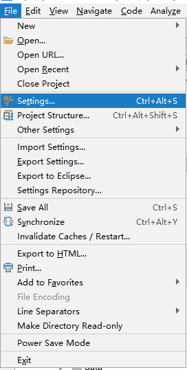{width="2.832638888888889in" height="5.603472222222222in"}

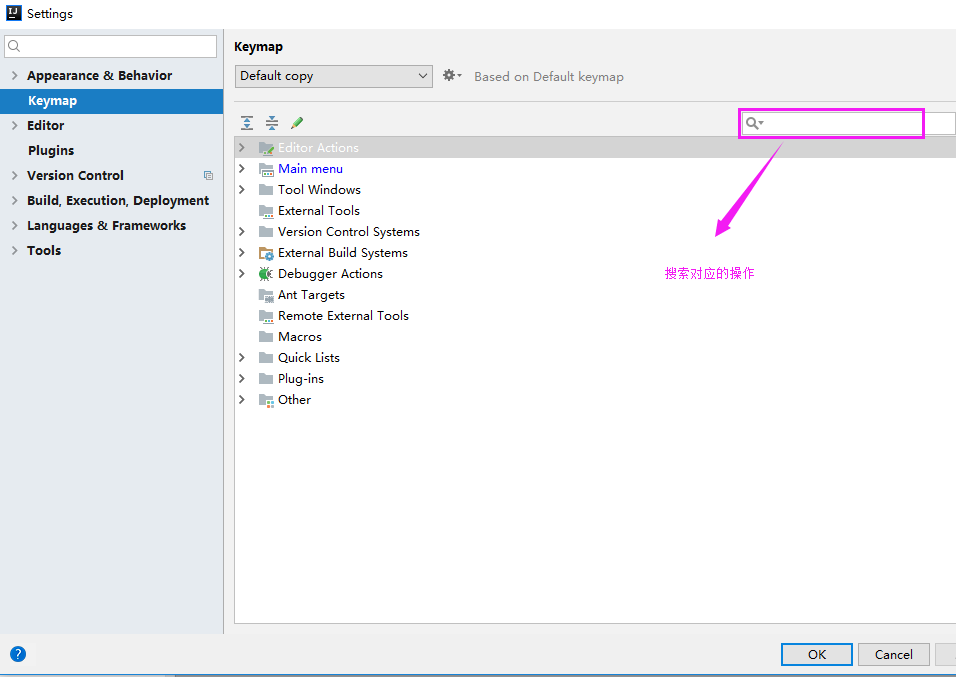{width="5.7652777777777775in" height="4.082638888888889in"}

在搜索框里输入需要设置快捷键的操作,然后选择对应的操作，右键创建快捷键操作。

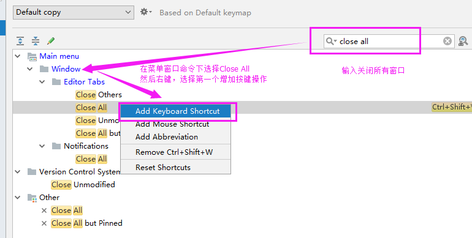{width="5.766666666666667in" height="2.9131944444444446in"}

# IDEA创建模板快捷操作

在平时工作中，存在很多繁琐而工作量又大且容易出错的一些配置，使用IDEA，能够只配置一次而下次就可以快捷键直接把它呼唤出来使用，具体配置如下。

## 创建模板分组

步骤如下图：

选择File\>Settings\>+\>Template Groups\>Create New Group

这时候就能创建一个模板分组

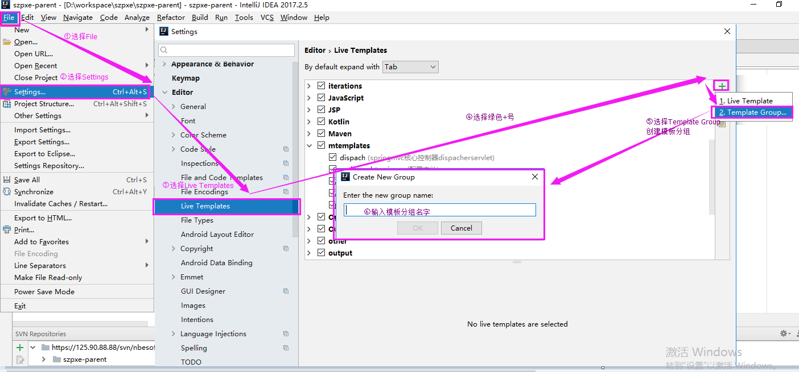{width="5.761111111111111in" height="2.6881944444444446in"}

创建完毕后，左边菜单会多一个创建的模板组，可以在这里定义所有你要的模板。

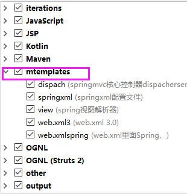{width="3.2284722222222224in" height="3.3430555555555554in"}

## 创建模板

选择:+号\>Live Template\>配置模板呼出字符+模板内容+描述\>Define\>选择需要使用该模板调出的配置文件类型。

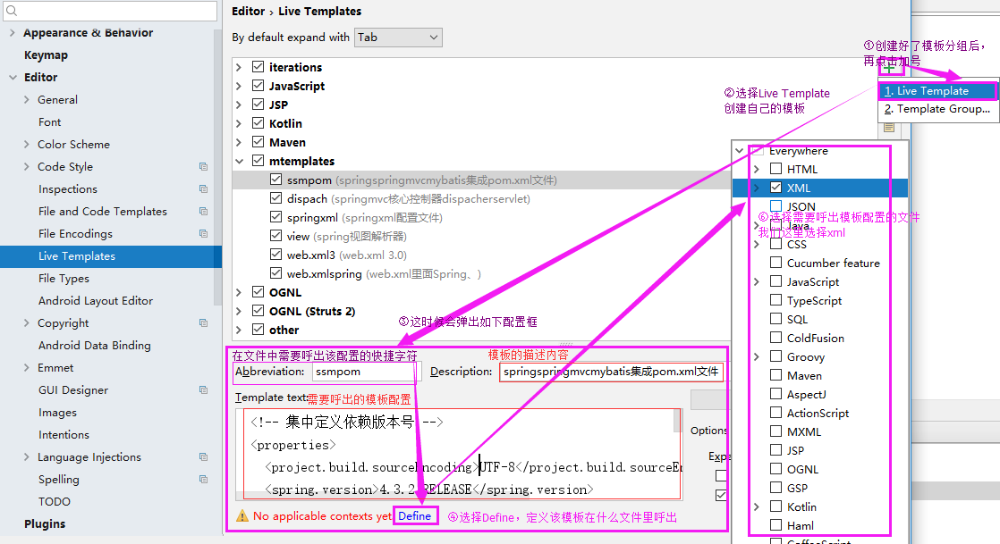{width="5.763888888888889in" height="3.1395833333333334in"}

## 调出模板操作

在任意一个xml文件中输入ssmpom,再选中提示。

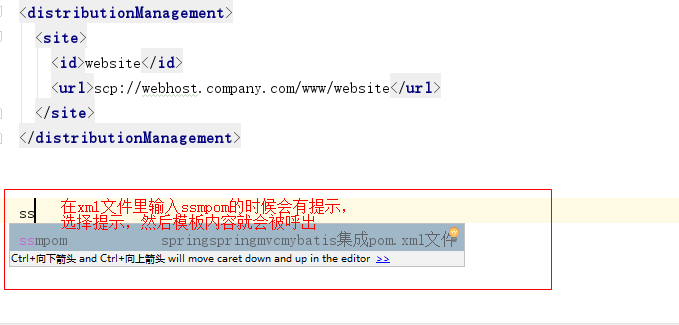{width="6.458333333333333in" height="3.0909722222222222in"}

# 3.6 IDEA每次打开最后创建的项目问题

使用IDEA，每次打开IDEA的时候都是加载了最后创建的一个项目，这时候只需要选择File\>Settings\>System Settings，然后将右侧 Reopen last project on startup的勾去掉就可以了。

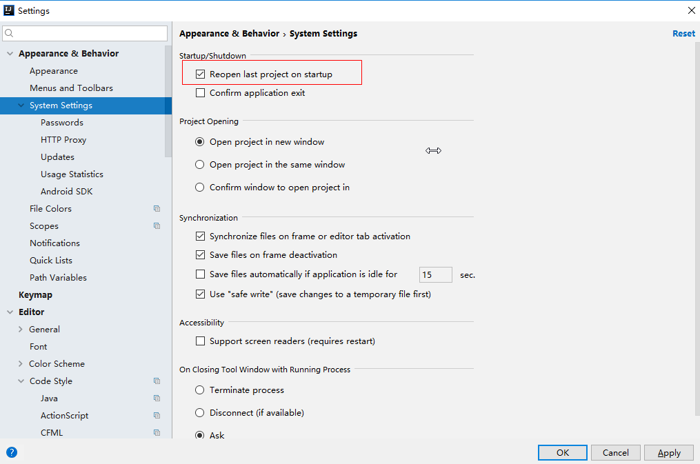{width="5.761805555555555in" height="3.8201388888888888in"}

# 注释配置

在现实开发中，我们经常需要知道每个类用来做什么的，每个类是谁写的等操作，但很多注释内容都是重复的，而只有少部分需要变更，这时候我们可以考虑定义一个注释模板。

选择：Settings\>File and code template\>File Header,然后进行配置即可。

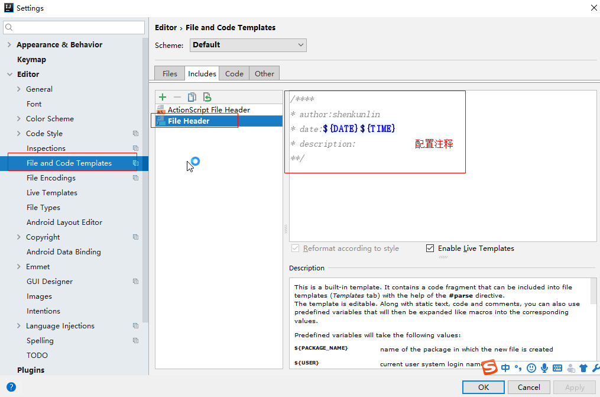{width="5.761805555555555in" height="3.8090277777777777in"}

# 表单提交工具

很多时候，模拟表单请求，需要自己写表单，这时候可以直接用IDEA集成的RESTful工具测试。如图：

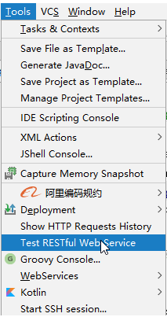{width="2.21875in" height="4.197222222222222in"}

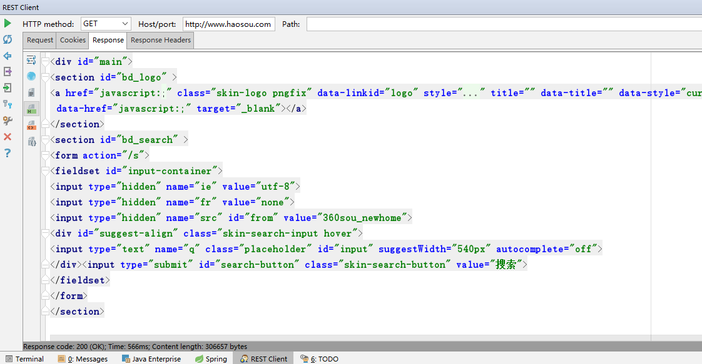{width="5.761111111111111in" height="2.99375in"}

# 实战

## 编辑区和文件区切换

如下图，如果想实现编辑区和文件区的跳转，这个可以直接用快捷键实现，比如像跳转到文件区project1面板，按alt+1,想从文件区切换到编辑区，按esc即可。

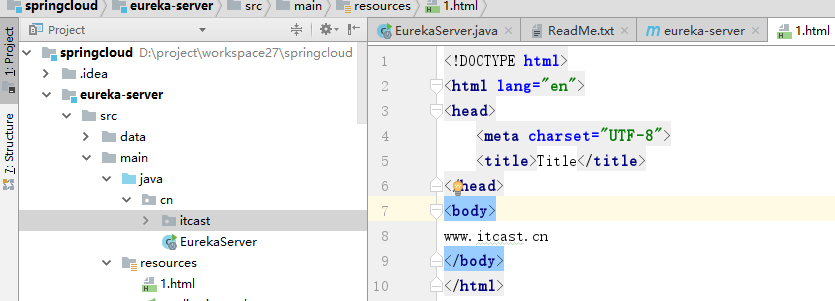{width="5.7659722222222225in" height="2.078472222222222in"}

## 搜索定位

### 类搜索

Ctrl+N 快速定位一个类

Ctrl+N+N 如果搜索范围包含Jar包里的文件，则按Ctrl+N再按一次N就可以实现Jar包搜索

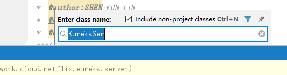{width="5.766666666666667in" height="1.5104166666666667in"}

### 文件搜索

Ctrl+Shift+N 搜索文件

Ctrl+Shift+N+N 如果搜索包含jar包中的文件，则按两次N

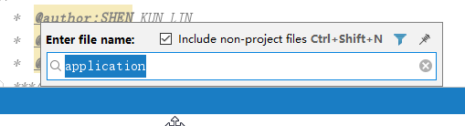{width="5.301388888888889in" height="1.4375in"}

### 字符搜索

Ctrl+Shift+Alt+N 比如我们想搜索一个user()方法， 这时候可以通过这个指令实现搜索。

Ctrl+Shift+Alt+N+N 可以实现jar包文件方法搜索。

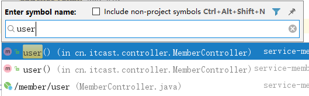{width="5.509722222222222in" height="1.7083333333333333in"}

### 字符串搜索

Ctrl+Shift+F 实现文件搜索

Match case：是否匹配大小写

Words：是否将搜索的内容作为一个完整的词搜索

Regex：是否使用正则搜索

File mask：搜索文件类型匹配

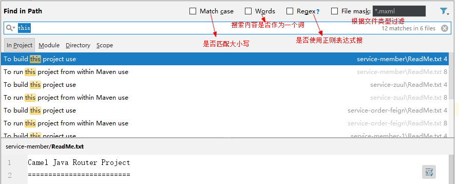{width="5.763888888888889in" height="2.307638888888889in"}

## 常用操作

### 列操作

列入现在从数据库中复制表对应的列，需要创建一个实体Bean，我们用IDEA实现方便多了。

Alt+鼠标右键+拖拽

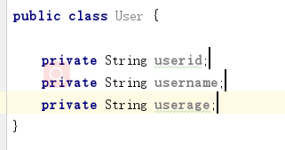{width="3.3430555555555554in" height="1.7604166666666667in"}

### Return的用法

直接用对象.re就能提示return；

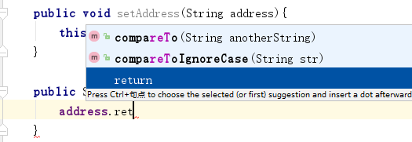{width="5.468055555555556in" height="1.8854166666666667in"}

## 重构

### 批量修改变量名字

按住shift+F6

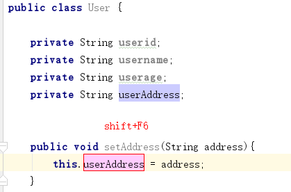{width="4.363888888888889in" height="2.8743055555555554in"}

### 重构方法

选中要重构的代码，按ctrl+alt+M

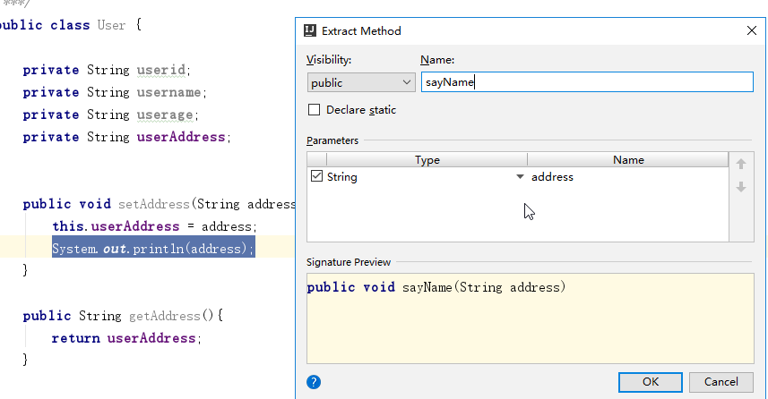{width="5.7659722222222225in" height="3.0006944444444446in"}

## 断点调试

### 断点快捷键

添加断点：Ctrl+F8

F8 单步执行

F9 跳过当前单步调试

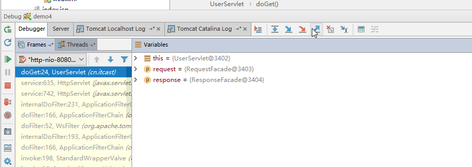{width="5.761805555555555in" height="2.0368055555555555in"}

### 断点操作

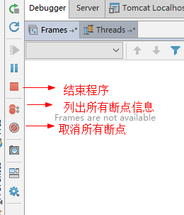{width="2.7083333333333335in" height="3.1555555555555554in"}

### 条件断点

在断点上右键，可以添加条件判断，当服务对应条件判断时，断点才生效。

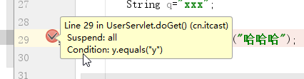{width="4.436805555555556in" height="1.15625in"}

## 文件操作

文件复制：F5

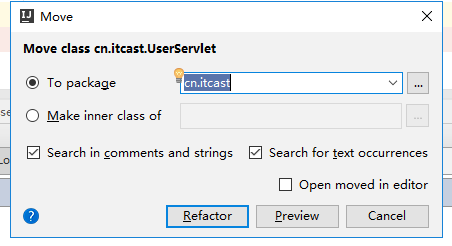{width="4.707638888888889in" height="2.5625in"}

文件移动：F6

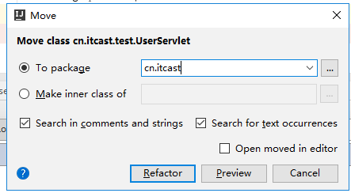{width="4.613888888888889in" height="2.5416666666666665in"}

重点总结：

1)  面板介绍中的Database

2)  Tomcat配置

3)  常用快捷键

4)  断点调试
