Mybatis第2天笔记

# 第1章Mabatis课程计划。

1、mybatis中的连接池以及事务控制			原理部分了解，应用部分会用

​	mybatis中连接池使用及分析

​	mybatis事务控制的分析

2、mybatis基于XML配置的动态SQL语句使用		会用即可

​	mappers配置文件中的几个标签：

```
<if>
<where>
<foreach>
<sql>
```

3、mybatis中的多表操作				掌握应用（联合查询）

​	一对多

​	多对多

\-----------------------------------------

今日学习目标：

1：掌握SqlMapConfig.xml配置文件（第2章）

2：理解Mybatis连接池与事务操作（第3章）

3：掌握Mybatis动态SQL（第4章）

4：掌握Mybatis多表关联查询（第5章5.3）

5：掌握Mybatis多对多关系（第5章5.4）

# 第2章 SqlMapConfig.xml配置文件

4.1配置内容 

SqlMapConfig.xml中配置的内容和顺序如下： 

properties（属性） 

settings（全局配置参数） 

typeAliases（类型别名） 

typeHandlers（类型处理器） 

objectFactory（对象工厂） 

plugins（插件） 

environments（环境集合属性对象）

environment（环境子属性对象）

transactionManager（事务管理）

dataSource（数据源）

mappers（映射器） 

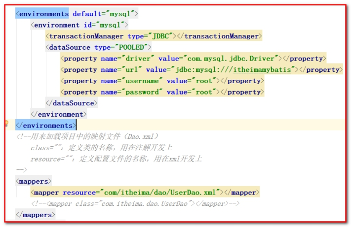 

## 2.1properties(属性)

SqlMapConfig.xml可以引用java属性文件中的配置信息如下： 

在classpath下定义jdbcConfig.properties文件， 

```properties
jdbc.driver=com.mysql.jdbc.Driver
jdbc.url=jdbc:mysql://localhost:3306/itcastmybatis
jdbc.username=root
jdbc.password=root
```

在sqlMapConfig.xml中配置：

```xml
<!-- 配置properties
    可以在标签内部配置连接数据库的信息。也可以通过属性引用外部配置文件信息
    resource属性： 常用的
        用于指定配置文件的位置，是按照类路径的写法来写，并且必须存在于类路径下。
    url属性：
        是要求按照Url的写法来写地址
        URL：Uniform Resource Locator 统一资源定位符。它是可以唯一标识一个资源的位置。
        它的写法：
            http://localhost:8080/mybatisserver/demo1Servlet
            协议      主机   端口       URI

        URI:Uniform Resource Identifier 统一资源标识符。它是在应用中可以唯一定位一个资源的。
-->
   <properties resource="jdbcConfig.properties"></properties>

   <!--配置环境-->
   <environments default="mysql">
       <!-- 配置mysql的环境-->
       <environment id="mysql">
           <!-- 配置事务 -->
           <transactionManager type="JDBC"></transactionManager>

           <!--配置连接池-->
           <dataSource type="POOLED">
               <property name="driver" value="${jdbc.driver}"></property>
               <property name="url" value="${jdbc.url}"></property>
               <property name="username" value="${jdbc.username}"></property>
               <property name="password" value="${jdbc.password}"></property>
           </dataSource>
       </environment>
   </environments>
```

以上代码可以写成：

```properties
<properties url="file:///D:/ideaProjects/mybatis/mybatis_day02_crud/src/main/resources/jdbcConfig.properties">
</properties>
```

注意： MyBatis 将按照下面的顺序来加载属性： 

- 使用 properties 元素加载的外部属性文件优先级最高。 
- 然后会读取properties 元素中resource加载的属性，它会覆盖已读取的同名属性。 

## 2.2typeAliases（类型别名）

| 4.3.1 mybatis支持别名： 别名 | 映射的类型 |
| ---------------------------- | ---------- |
| _byte                        | byte       |
| _long                        | long       |
| _short                       | short      |
| _int                         | int        |
| _integer                     | int        |
| _double                      | double     |
| _float                       | float      |
| _boolean                     | boolean    |
| string                       | String     |
| byte                         | Byte       |
| long                         | Long       |
| short                        | Short      |
| int                          | Integer    |
| integer                      | Integer    |
| double                       | Double     |
| float                        | Float      |
| boolean                      | Boolean    |
| date                         | Date       |
| decimal                      | BigDecimal |
| bigdecimal                   | BigDecimal |
| map                          | Map        |

## 2.3自定义别名：

（1）在SqlMapConfig.xml中配置：

```java
<!--使用typeAliases配置别名，它只能配置domain中类的别名 -->
<typeAliases>
    <!--typeAlias用于配置别名。type属性指定的是实体类全限定类名。alias属性指定别名，当指定了别名就不再区分大小写-->
    <typeAlias type="com.itheima.domain.User" alias="user"></typeAlias>

    <!-- 用于指定要配置别名的包，当指定之后，该包下的实体类都会注册别名，并且类名就是别名，不再区分大小写-->
    <!--<package name="com.itheima.domain"></package>-->
</typeAliases>
```

（2）在UserDao.xml中配置：

```xml
<!-- 查询所有
    resultType="com.itheima.domain.User"：指定返回的结果类型
    resultMap="userMap"：指定resultMap定义的id属性
 -->
<select id="findAll" resultType="UsEr">
    <!-- select id as userId,username as userName,address as userAddress,sex as userSex,birthday as userBirthday from user; -->
    select * from user;
</select>

<!--保存用户-->
<insert id="saveUser" parameterType="UsER">
    <!-- 配置插入操作后，获取插入数据的id -->
    <selectKey keyProperty="userId" keyColumn="id" resultType="int" order="AFTER">
        select last_insert_id();
    </selectKey>
    insert into user(username,address,sex,birthday)values(#{userName},#{userAddress},#{userSex},#{userBirthday});

</insert>
```

## 2.4mappers（映射器）

在SqlMapConfig.xml中配置：  

```xml
<!-- 配置映射文件的位置 -->
<mappers>
    <!--<mapper resource="com/itheima/dao/UserDao.xml"></mapper>-->
    <!-- package标签是用于指定dao接口所在的包,当指定了之后就不需要在写mapper以及resource或者class了 -->
    <package name="com.itheima.dao"></package>
</mappers>
```

1：<mapper resource=" " />

使用相对于类路径的资源 

如：<mapper resource="com/itheima/dao/UserDao.xml" />

应用场景：指定XML映射配置 

2：<mapper class=" " />

使用mapper接口类路径 

如：<mapper class="com.itheima.dao.UserDao"/> 

注意：此种方法要求mapper接口名称和mapper映射文件名称相同，且放在同一个目录中。 

应用场景：指定注解配置

3：<package name=""/>

注册指定包下的所有mapper接口 

如：<package name="cn.itcast.dao"/> 

注意：此种方法要求mapper接口名称和mapper映射文件名称相同，且放在同一个目录中。 

应用场景：即可以使用XML配置文件，也可以使用注解。

# 第3章Mybatis 连接池与事务深入（了解）

## 3.1 Mybatis的连接池技术

我们在实际开发中都会使用连接池。因为它可以减少我们获取连接所消耗的时间。

我们在前面的WEB课程中也学习过类似的连接池技术，而在Mybatis中也有连接池技术，但是它采用的是自己的连接池技术。在Mybatis的SqlMapConfig.xml配置文件中，通过<dataSource type=”pooled”>来实现Mybatis中连接池的配置。 

什么是连接池？

 

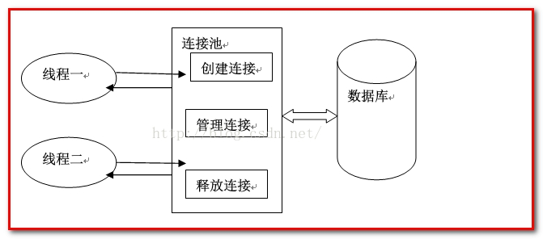 

连接池的特点：

1：连接池就是用于存储连接的一个容器

2：连接池其实就是一个集合对象，该集合必须是线程安全的，不能两个线程拿到同一个连接。

3：连接池必须实现队列的特性，先进先出

 

 

### 3.1.1 Mybatis连接池的分类

在Mybatis中我们将它的数据源dataSource分为以下几类： 

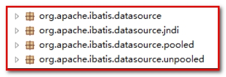 

可以看出Mybatis将它自己的数据源分为三类： 

l UNPOOLED 不使用连接池的数据源，采用传统的获取连接的方式，虽然也实现Javax.sql.DataSource接口，但是并没有使用池的思想。

l POOLED 使用连接池的数据源，采用传统的javax.sql.DataSource规范中的连接池，mybatis中有针对规范的实现。

l JNDI 使用JNDI实现的数据源（不了解），采用服务器提供的JNDI技术实现，来获取DataSource对象，不同的服务器所能拿到DataSource是不一样。

​				 注意：如果不是web或者maven的war工程，是不能使用的。

​				 我们课程中使用的是tomcat服务器，采用连接池就是dbcp连接池。

具体结构如下： 

相应地，MyBatis内部分别定义了实现了java.sql.DataSource接口的UnpooledDataSource，PooledDataSource类来表示UNPOOLED、POOLED类型的数据源。 

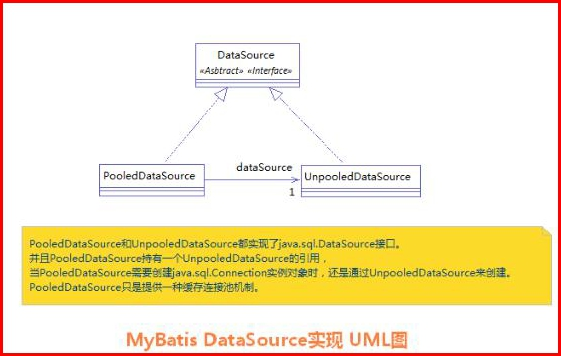 

在这三种数据源中，我们一般采用的是POOLED数据源（很多时候我们所说的数据源就是为了更好的管理数据库连接，也就是我们所说的连接池技术）。 

### 3.1.2 Mybatis中数据源的配置

 

创建工程：

 

拷贝main/java，resources，test/java，pom.xml中的内容

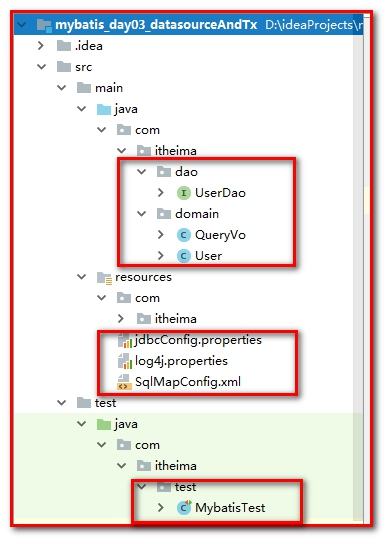 

 

测试数据源：

我们的数据源配置就是在SqlMapConfig.xml文件中，具体配置如下： 

MyBatis在初始化时，解析此文件，根据<dataSource>的type属性来创建相应类型的的数据源DataSource，即： 

type=”POOLED”：MyBatis会创建PooledDataSource实例 

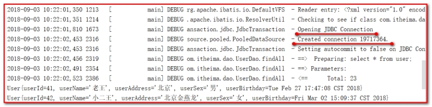 

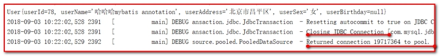 

结论：它是从池中获取一个连接来用。

底层：PooledDataSource.java

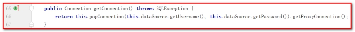 

点击popConnection方法

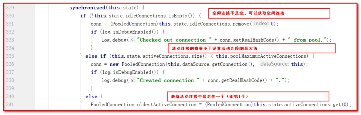 

分析：

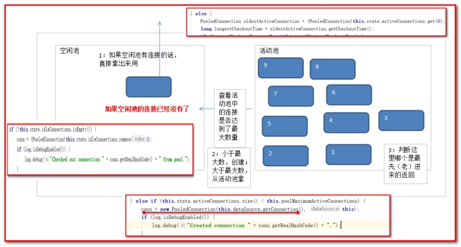 

 

【面试题】：[为什么MyBatis连接池要设计为有一个空闲连接列表和一个活动连接列表？](https://segmentfault.com/q/1010000010363490)

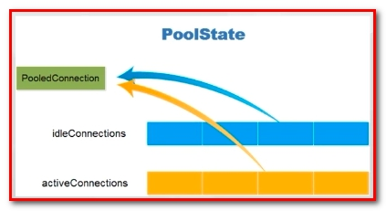 

1：从连接池的设计看，这两个连接列表都是必需的，加起来等于是连接池能用的最大连接数。
2：当有新的连接请求时，有从空闲连接列表中选择一个可用的连接，如果这个连接可以正常执行，转移到活动连接列表。

3：新建连接比较耗时，所以一开始就新建好一堆连接，这些连接没有被使用的时候就在空闲列表里。

4：当要使用的时候，就从空闲列表里拿一个，放到活动列表里。


type=”UNPOOLED” ： MyBatis会创建UnpooledDataSource实例 

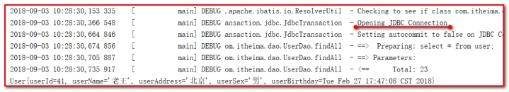 

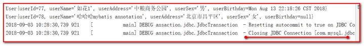 

结论：它是每次创建一个新的连接来用。

底层：UnpooledDataSource.java

 

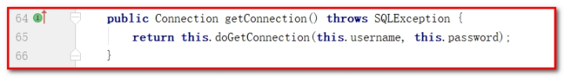 

点击doGetConnection方法

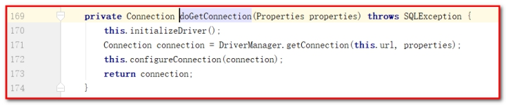 

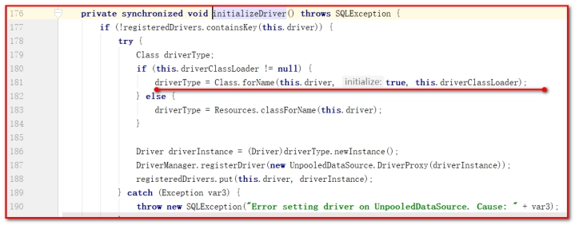 

type=”JNDI”：MyBatis会从JNDI服务上查找DataSource实例，然后返回使用 （不需要了解）

参照：《JNDI数据源》

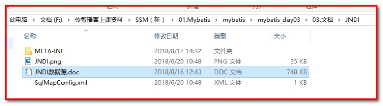 

 

总结：最后我们可以发现，真正连接打开的时间点，只是在我们执行SQL语句时，才会进行。其实这样做我们也可以进一步发现，数据库连接是我们最为宝贵的资源，只有在要用到的时候，才去获取并打开连接，当我们用完了就再立即将数据库连接归还到连接池中。 所以我们使用连接池的技术会节省连接资源。

### 3.1.3  Mybatis的事务控制

#### 3.1.3.1  JDBC中事务的回顾

自主学习：

一：什么是事务？

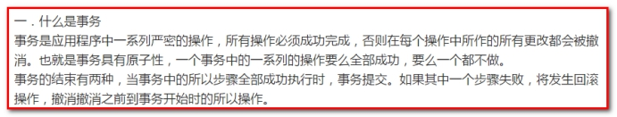 

​	二：事务的四大特性ACID？

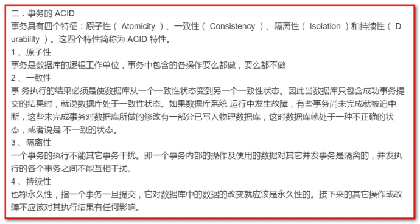 

​	三：不考虑隔离性会产生的3个问题？

脏读

 （针对未提交数据）如果一个事务中对数据进行了更新，但事务还没有提交，另一个事务可以“看到”该事务没有提交的更新结果，这样造成的问题就是，如果第一个事务回滚，那么，第二个事务在此之前所“看到”的数据就是一笔脏数据。

不可重复读

（针对其他提交前后，读取数据本身的对比）不可重复读取是指同一个事务在整个事务过程中对同一笔数据进行读取，每次读取结果都不同。如果事务1在事务2的更新操作之前读取一次数据，在事务2的更新操作之后再读取同一笔数据一次，两次结果是不同的

幻读

（针对其他提交前后，读取数据条数的对比） 幻读是指同样一笔查询在整个事务过程中多次执行后，查询所得的结果集是不一样的。幻读针对的是多笔记录。如果事务1在事务2的新增操作之前读取一次数据，在事务2的新增操作之后再读取同一笔数据，取得的结果集是不同的，幻读发生。

不可重复读和幻读比较：

两者有些相似，但是前者针对的是update或delete，后者针对的insert。

​	四：解决办法：四种隔离级别？

1、Serializable （串行化）：最严格的级别，事务串行执行，资源消耗最大；

2、REPEATABLE READ（重复读）：保证了一个事务不会修改已经由另一个事务读取但未提交（回滚）的数据。避免了“脏读”和“不可重复读”的情况，但不能避免“幻读”，但是带来了更多的性能损失。（mysql的默认隔离级别）

3、READ COMMITTED（读已提交）：大多数主流数据库的默认事务等级，保证了一个事务不会读到另一个并行事务已修改但未提交的数据，避免了“脏读”，但不能避免“幻读”和“不可重复读”。该级别适用于大多数系统。（oracle的默认隔离级别）

4、Read Uncommitted（读未提交）：事务中的修改，即使没有提交，其他事务也可以看得到，会导致“脏读”、“幻读”和“不可重复读取”。

事务的提交和回滚。

​	通过sqlsession对象的commit方法和rollback方法实现事务的提交和回滚

在JDBC中我们可以通过手动方式将事务的提交改为手动方式，通过setAutoCommit()方法就可以调整。 

通过JDK文档，我们找到该方法如下： 

 

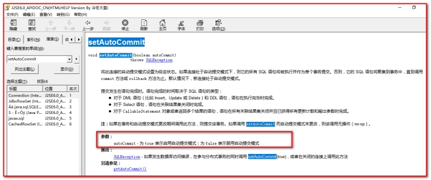 

那么我们的Mybatis框架因为是对JDBC的封装，所以Mybatis框架的事务控制方式，本身也是用JDBC的setAutoCommit()方法来设置事务提交方式的。

底层：JdbcTransaction.java

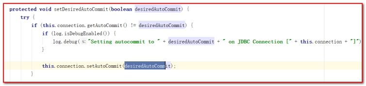 

 

#### 3.1.3.2  Mybatis中事务提交方式

Mybatis中事务的提交方式，本质上就是调用JDBC的setAutoCommit()来实现事务控制。 

我们运行之前所写的代码： 

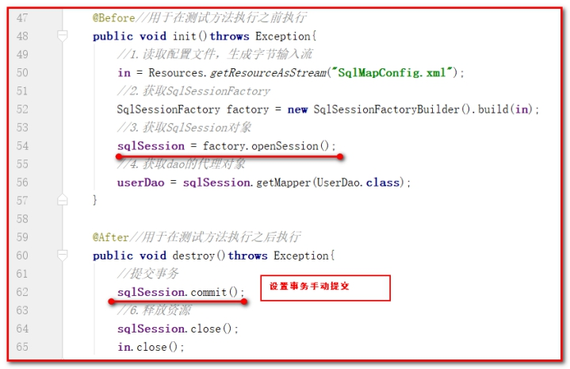 

l 查看DefaultSqlSessionFactory的openSession();方法

设置为false表示需要手动提交事务。

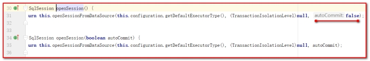 

这是我们的Connection的整个变化过程，通过分析我们能够发现之前的CUD操作过程中，我们都要手动进行事务的提交，原因是setAutoCommit()方法，在执行时它的值被设置为false了，所以我们在CUD操作中，必须通过sqlSession.commit()方法来执行提交操作。

 

l 查看SqlSession.commit();方法

还是调用了JdbcTransaction.java

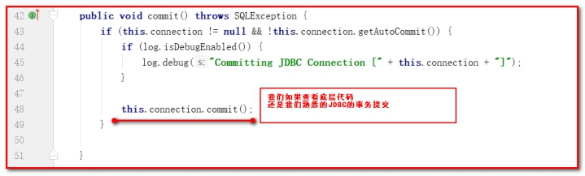 

 

测试自动提交：

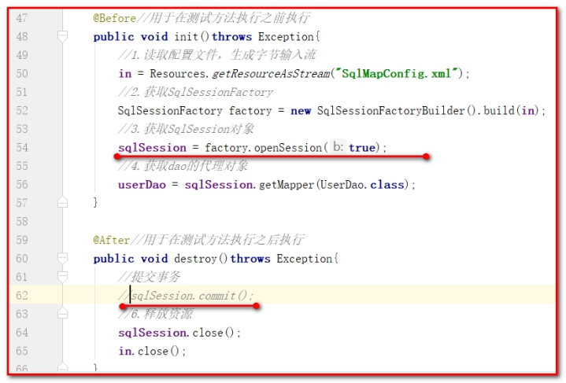 

总结：如果设置此时事务就设置为自动提交了，同样可以实现CUD操作时记录的保存。虽然这也是一种方式，但就编程而言，设置为自动提交方式为false再根据情况决定是否进行提交，这种方式更常用。因为我们可以根据业务情况来决定业务是否进行提交。如果设置自动提交，如果当前操作有误，事务很难设置回滚了。 只有设置为手动提交，我们才能更好的控制事务。

 ```java
try{
   // 操作业务1
   // 操作业务2
   session.commit();
}
catch(Exeception ex){
   session.rollback();
}
 ```

# 第4章 Mybatis映射文件的SQL深入

Mybatis的映射文件中，前面我们的SQL都是比较简单的，有些时候业务逻辑复杂时，我们的SQL是动态变化的，此时在前面的学习中我们的SQL就不能满足要求了。 

参考的官方文档，描述如下： 

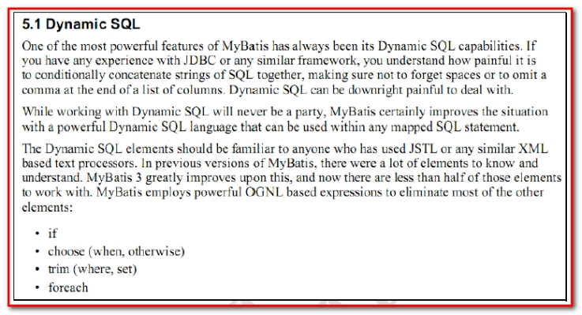 

创建工程：

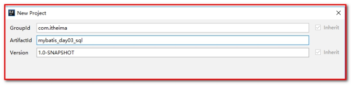 

导入基本配置：

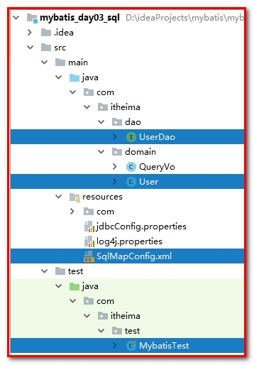 

## 4.1动态SQL之<if>标签

我们根据实体类的不同取值，使用不同的SQL语句来进行查询。比如在id如果不为空时可以根据id查询，如果username不同空时还要加入用户名作为条件。这种情况在我们的多条件组合查询中经常会碰到。 

第一步：UserDao.xml中配置

```xml
<!--根据条件查询-->
<select id="findByCondition" parameterType="user" resultMap="userMap">
    select * from user where 1=1
    <if test="userName != null">
        and username = #{userName}
    </if>
    <if test="userSex != null">
        and sex = #{userSex}
    </if>
</select>
```

第二步：UserDao.java中配置

```java
/**
 * 根据条件查询
 * @param  user
 * @return
 */
List<User> findByCondition(User user);
```

第三步：MybatisTest.java中配置

````java
/**
 * 测试根据查询条件查询
 */
@Test
public void testFindByCondition(){
    User user = new User();
    user.setUserName("老王");
    //user.setUserSex("女");
    //5.执行查询一个方法
    List<User> users = userDao.findByCondition(user);
    for(User u : users){
        System.out.println(u);
    }
}
````

注意：<if>标签的test属性中写的是对象的属性名，如果是包装类的对象要使用OGNL表达式的写法。 

另外要注意where 1=1 的作用~ ！ 

 

## 4.2动态SQL之<where>标签

省略where 1=1

UserDao.xml

```xml
<!--where标签的使用-->
<select id="findByCondition" parameterType="user" resultMap="userMap">
    select * from user
    <where>
        <if test="userName != null">
            and username = #{userName}
        </if>
        <if test="userSex != null">
            and sex = #{userSex}
        </if>
    </where>
</select>
```

- **<where />可以自动处理第一个and** 

## 4.3动态SQL标签之<foreach>标签

 

需求 :

- 传入多个id查询用户信息，用下边两个sql实现： 

```sql
SELECT * FROM USERS WHERE username LIKE '%张%' AND (id =10 OR id =89 OR id=16) 
SELECT * FROM USERS WHERE username LIKE '%张%' AND id IN (10,89,16) 
```

这样我们在进行范围查询时，就要将一个集合中的值，作为参数动态添加进来。 

这样我们将如何进行参数的传递？ 

第一步：QueryVo.java

定义List<Integer>

```java
public class QueryVo {

    private User user;
    private List<Integer> ids = new ArrayList<Integer>();

    public User getUser() {
        return user;
    }

    public void setUser(User user) {
        this.user = user;
    }

    public List<Integer> getIds() {
        return ids;
    }

    public void setIds(List<Integer> ids) {
        this.ids = ids;
    }
}
```

第二步：UserDao.xml

```xml
<!--foreach标签的使用-->
<select id="findInIds" parameterType="queryVo" resultMap="userMap">
    select * from user
    <where>
        <if test="ids != null and ids.size()>0">
            <foreach collection="ids" open=" and id in (" close=")" item="uid" separator=",">
                #{uid}
            </foreach>
        </if>
    </where>
</select>
```


这里：

SQL语句： select 字段from user where id in (?) 

<foreach>标签用于遍历集合，它的属性： 

collection:代表要遍历的集合元素，注意编写时不要写#{} 

open:代表语句的开始部分 

close:代表结束部分 

item:代表遍历集合的每个元素，生成的变量名 

sperator:代表分隔符 

第三步：UserDao.java

```java
/**
 * 嵌套子查询（foreach的用法）
 * @param  queryVo
 * @return
 */
List<User> findInIds(QueryVo queryVo);
```

第四步：MybatisTest.java

```java
/**
 * 测试嵌套子查询forEach
 */
@Test
public void testFindInIds(){
    QueryVo queryVo = new QueryVo();
    List<Integer> ids = new ArrayList<Integer>();
    ids.add(41);
    ids.add(42);
    ids.add(43);
    ids.add(46);
    queryVo.setIds(ids);
    //5.执行查询一个方法
    List<User> users = userDao.findInIds(queryVo);
    for(User u : users){
        System.out.println(u);
    }
}
```

查看结果：

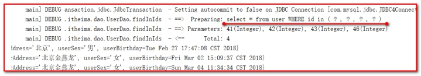 

## 4.4Mybatis中简化编写的SQL片段

Sql中可将重复的sql提取出来，使用时用include引用即可，最终达到sql重用的目的。 

我们先到UserDao.xml文件中使用<sql>标签，定义出公共部分，如下： 

```xml
<sql id="defaultUser">
    select * from user
</sql>
```

```xml
<!--foreach标签的使用-->
<select id="findInIds" parameterType="queryVo" resultMap="userMap">
    <!--select * from user-->
    <include refid="defaultUser"></include>
    <where>
        <if test="ids != null and ids.size()>0">
            <foreach collection="ids" open=" and id in (" close=")" item="uid" separator=",">
                #{uid}
            </foreach>
        </if>
    </where>
</select>
```


其中<include>标签的refid属性的值就是<sql> 标签定义id的取值。 

注意：如果引用其它mapper.xml的sql片段，则在引用时需要加上namespace，如下： 

<include refid=*"*namespace.sql片段”/> 

```xml
<select id="findByIds" parameterType="queryVo" resultType="user">
    <include refid="com.itheima.dao.UserDao.defaultUser"></include>
   <where>
       <if test="ids!=null and ids.size()>0">
          <foreach collection="ids" open="id IN(" close=")" separator="," item="uid">
              #{uid}
          </foreach>
       </if>
   </where>
</select>
```


# 第5章Mybatis 的多表关联查询

## 5.1回顾：

表之间的关系有几种：

​		一对多

​		多对一

​		一对一

​		多对多

​	举例：

​		用户和订单就是一对多

​		订单和用户就是多对一（一对一）

​			一个用户可以下多个订单

​			一个订单属于同一个用户

 

​		人和身份证号就是一对一

​			一个人只能有一个身份证号

​			一个身份证号只能属于一个人

 

​		老师和学生之间就是多对多

​			一个学生可以被多个老师教过

​			一个老师可以交多个学生

​	在多对一中：特例：

​		如果拿出每一个订单，他都只能属于一个用户。

​		所以Mybatis就把多对一看成了一对一。

## 5.2用户和账号

本次案例主要以最为简单的用户和账户的模型来分析Mybatis 多表关系。用户为User 表，账户为Account 表。一个用户（User）可以有多个账户（Account）。具体关系如下： 

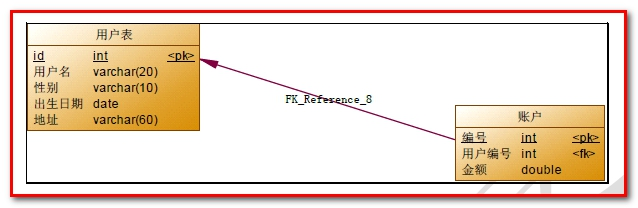 

【创建表】【添加数据】

````sql
DROP TABLE IF EXISTS `account`;

CREATE TABLE `account` (
  `ID` INT(11) NOT NULL COMMENT '编号',
  `UID` INT(11) DEFAULT NULL COMMENT '用户编号',
  `MONEY` DOUBLE DEFAULT NULL COMMENT '金额',
  PRIMARY KEY  (`ID`),
  KEY `FK_Reference_8` (`UID`),
  CONSTRAINT `FK_Reference_8` FOREIGN KEY (`UID`) REFERENCES `user` (`id`)
) ENGINE=INNODB DEFAULT CHARSET=utf8;

INSERT  INTO `account`(`ID`,`UID`,`MONEY`) VALUES (1,46,1000),(2,45,1000),(3,46,2000);
````

【学习内容】

mybatis中的多表查询：

​		示例：用户和账户

​			一个用户可以有多个账户

​			一个账户只能属于一个用户（多个账户也可以属于同一个用户）

​		步骤：

​			1、建立两张表：用户表，账户表

​				让用户表和账户表之间具备一对多的关系：需要使用外键在账户表中添加

​			2、建立两个实体类：用户实体类和账户实体类

​				让用户和账户的实体类能体现出来一对多的关系

​			3、建立两个配置文件

​				用户的配置文件（UserDao.xml）

​				账户的配置文件（AccountDao.xml）

​			4、实现配置：【需求】

​                当我们查询账户时，可以同时得到账户的所属用户信息（一对一）

​				当我们查询用户时，可以同时得到用户下所包含的账户信息（一对多）

 

## 5.3Mybatis维护一对多关系

### 5.3.1查询所有账户

第一步：创建工程

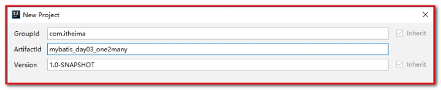 

第二步：导入java文件、资源文件、测试文件、pom.xml

 

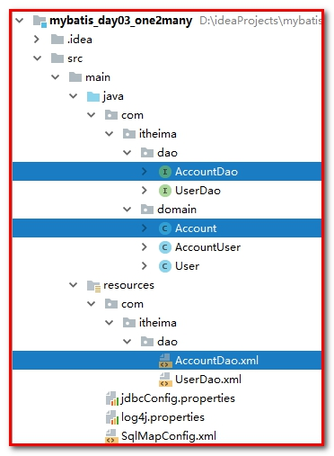 

第三步：创建Account.java

```java
public class Account implements Serializable{

    private Integer id;
    private Integer uid;
    private Double money;
    // 省略set、get方法
}
```

第四步：创建AccountDao.java

```java
/**
 * 用户的持久层接口
 */
public interface AccountDao {

    /**
     * 查询所有用户
     * @return
     */
    List<Account> findAll();

    /**
     * 根据id查询用户信息
     * @param id
     * @return
     */
    Account findById(Integer id);
}
```

第五步：创建AccountDao.xml

```xml
<?xml version="1.0" encoding="UTF-8"?>
<!DOCTYPE mapper
        PUBLIC "-//mybatis.org//DTD Mapper 3.0//EN"
        "http://mybatis.org/dtd/mybatis-3-mapper.dtd">
<mapper namespace="com.itheima.dao.AccountDao">

    <!-- 查询所有 -->
    <select id="findAll" resultType="com.itheima.domain.Account">
        select * from account;
    </select>

    <!-- 根据id查询用户 -->
    <select id="findById" parameterType="INT" resultType="com.itheima.domain.Account">
        select * from account where id = #{uid}
    </select>
</mapper>
```


第六步：编写测试类MybatisTest.xml

````java
<?xml version="1.0" encoding="UTF-8"?>
<!DOCTYPE mapper
        PUBLIC "-//mybatis.org//DTD Mapper 3.0//EN"
        "http://mybatis.org/dtd/mybatis-3-mapper.dtd">
<mapper namespace="com.itheima.dao.AccountDao">

    <!-- 查询所有 -->
    <select id="findAll" resultType="com.itheima.domain.Account">
        select * from account;
    </select>

    <!-- 根据id查询用户 -->
    <select id="findById" parameterType="INT" resultType="com.itheima.domain.Account">
        select * from account where id = #{uid}
    </select>
</mapper>
````

测试查询所有。

```
/**
 * 查询所有账户
 */
@Test
public void testFindAllAccount(){
    //5.执行查询所有方法
    List<Account> list = accountDao.findAll();
    for(Account account : list){
        System.out.println(account);
    }
}
```

这里别忘记配置：在SqlMapConfig.xml中

````xml
<mappers>
    <!--<mapper resource="com/itheima/dao/UserDao.xml"></mapper>-->
    <!--<mapper resource="com/itheima/dao/AccountDao.xml"></mapper>-->
    <package name="com.itheima.dao"></package>
</mappers>
````

### 5.3.2一对一查询，查询账号，同时关联用户（方案一）

第一步：sql语句

```sql
SELECT a.*,u.username,u.address FROM account a,USER u WHERE u.id = a.uid
```


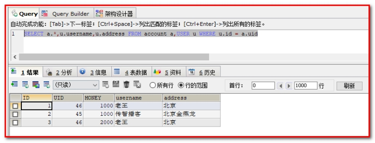 

第二步：在com.itheima.domain中创建AccountUser.java

```java
/**
 */
public class AccountUser extends Account implements Serializable {

    private String username;
    private String address;

    public String getUsername() {
        return username;
    }

    public void setUsername(String username) {
        this.username = username;
    }

    public String getAddress() {
        return address;
    }

    public void setAddress(String address) {
        this.address = address;
    }

    @Override
    public String toString() {
        return super.toString()+ "             AccountUser{" +
                "username='" + username + '\'' +
                ", address='" + address + '\'' +
                '}';
    }
}
```


第三步：AccountDao.java

````java
/**
 * 查询账号和客户的信息
 */
List<AccountUser> findByAccountUser();
````

第四步：AccountDao.xml

````xml
<!-- 查询所有 -->
<select id="findByAccountUser" resultType="com.itheima.domain.AccountUser">
    SELECT a.*,u.username,u.address FROM account a,user u WHERE u.id = a.uid
</select>
````


第五步：MybatisTest.java

```java
/**
 * 查询所有账户和客户信息
 */
@Test
public void testFindAllAccountUser(){
    //5.执行查询所有方法
    List<AccountUser> list = accountDao.findByAccountUser();
    for(AccountUser accountUser : list){
        System.out.println(accountUser);
    }
}
```

 

查看结果：

 

结论：定义专门的实体类（domain类）作为输出类型，其中定义了sql查询结果集所有的字段。此方法较为简单，企业中使用普遍。

 

### 5.3.3一对一查询，查询账号，同时关联用户（方案二）

使用resultMap，定义专门的resultMap用于映射一对一查询结果。 

通过面向对象的(一对一)关系可以得知，我们可以在Account类中加入一个User类的对象来代表这个账户是哪个用户的。 

第一步：sql语句

````
select u.*,a.id as aid,a.uid,a.money from account a,user u where u.id = a.uid
````


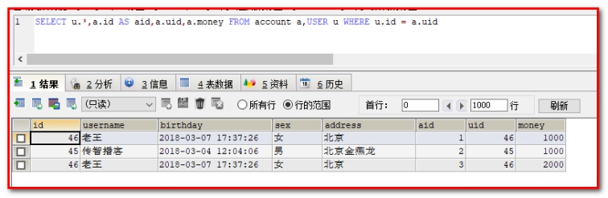 

第二步：修改Account.java

```
public class Account implements Serializable{

    private Integer id;
    private Integer uid;
    private Double money;

    private User user;

    public User getUser() {
        return user;
    }

    public void setUser(User user) {
        this.user = user;
    }
}
```


重写Account对象的toString方法。

```java
@Override
public String toString() {
    return "Account{" +
            "id=" + id +
            ", uid=" + uid +
            ", money=" + money +
            ", user=" + user +
            '}';
}
```


第三步：AccountDao.java

```java
/**
 * 查询账号和客户的信息（方案二：直接用Account对象封装）
 */
List<Account> findByAccountUser2();
```


第四步：AccountDao.xml

```java
<!--定义resultMap对象，用来封装账号信息-->
<resultMap id="accountMap" type="account">
    <id property="id" column="aid"></id>
    <result property="uid" column="uid"></result>
    <result property="money" column="money"></result>
    <!--association用来关联对象，property代表加载对象，javaType代表加载对象的数据类型，可以写成com.itheima.domain.User-->
    <association property="user" javaType="user">
        <id property="id" column="id"></id>
        <result property="username" column="username"></result>
        <result property="birthday" column="birthday"></result>
        <result property="sex" column="sex"></result>
        <result property="address" column="address"></result>
    </association>

</resultMap>
<!-- 查询所有（方案二：直接用Account对象封装） -->
<select id="findByAccountUser2" resultMap="accountMap">
    select u.*,a.id as aid,a.uid,a.money from account a,user u where u.id = a.uid
</select>
```


第五步：MybatisTest.java

```java
/**
 * 查询所有账户和客户信息（方案二，直接使用Account对象）
 */
@Test
public void testFindAllAccountUser2(){
    //5.执行查询所有方法
    List<Account> list = accountDao.findByAccountUser2();
    for(Account account : list){
        System.out.println(account);
    }
}
```


查看结果：

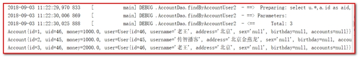 

### 5.3.4一对多查询，查询用户，同时查询账号的集合

需求：查询所有用户信息及用户关联的账户信息。 

分析：用户信息和他的账户信息为一对多关系，并且查询过程中如果用户没有账户信息，此时也要将用户信息查询出来，只不过没有信息的字段用null表示，我们想到了左外连接查询比较合适。 

第一步：

Sql语句：

SELECT u.*, a.id as aid, a.uid, a.money FROM user u LEFT JOIN account a ON u.id = a.uid

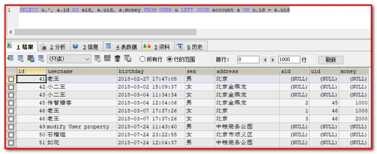 

 

第二步：修改User.java对象

````
public class User implements Serializable {

    private Integer id;
    private String username;
    private String address;
    private String sex;
    private Date birthday;
    private List<Account> accounts;

    public List<Account> getAccounts() {
        return accounts;
    }

    public void setAccounts(List<Account> accounts) {
        this.accounts = accounts;
    }
}
````


重写toString的方法

```
@Override
public String toString() {
    return "User{" +
            "id=" + id +
            ", username='" + username + '\'' +
            ", address='" + address + '\'' +
            ", sex='" + sex + '\'' +
            ", birthday=" + birthday +
            ", accounts=" + accounts +
            '}';
}
```

 

第三步：UserDao.java接口中加入查询方法 

在UserDao接口中加入查询方法：public List<User> findUserAccountList(); 

```java
/**
 * 根据用户账号的信息
 * @param
 * @return
 */
List<User> findUserAccountList();
```


第四步：修改UserDao.xml映射文件 

```xmls
<!--定义用户和账号的查询-->
<resultMap id="userMap" type="user">
    <id property="id" column="id"></id>
    <result property="username" column="username"></result>
    <result property="address" column="address"></result>
    <result property="sex" column="sex"></result>
    <result property="birthday" column="birthday"></result>
    <collection property="accounts" ofType="account">
        <id property="id" column="aid"></id>
        <result property="uid" column="uid"></result>
        <result property="money" column="money"></result>
    </collection>
</resultMap>

<!-- 根据用户和账号的信息 -->
<select id="findUserAccountList" resultMap="userMap">
    SELECT u.*, a.id as aid, a.uid, a.money FROM user u LEFT JOIN account a ON u.id = a.uid
</select>
```


这里：

collection部分定义了用户关联的账户信息。表示关联查询结果集 

property=*"accounts"*：关联查询的结果集存储在User对象的上哪个属性。 

ofType=*"account"*：指定关联查询的结果集中的对象类型即List中的对象类型。此处可以使用别名，也可以使用全限定名，即com.itheima.domain.Account。 

<id/>及<result/>的意义同一对一查询。 

 

第五步：在测试类MybatisTest.java中添加:

```java
/**
 * 查询所有用户和账号信息
 */
@Test
public void testFindUserAccountList(){
    //5.执行查询所有方法
    List<User> list = userDao.findUserAccountList();
    for(User user : list){
        System.out.println(user);
    }
}
```


第六步：查询查询

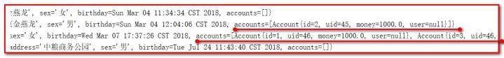 

 

## 5.4  Mybatis维护多对多关系

【学习内容】

示例：用户和角色

​			一个用户可以有多个角色

​			一个角色可以赋予多个用户

​		步骤：

​			1、建立两张表：用户表，角色表

​				让用户表和角色表具有多对多的关系。需要使用中间表，中间表中包含各自的主键，在中间表中是两端表的外键。

​			2、建立两个实体类：用户实体类和角色实体类

​				让用户和角色的实体类能体现出来多对多的关系

​				各自包含对方一个集合引用

​			3、建立两个配置文件

​				用户的配置文件

​				角色的配置文件

​			4、实现配置：【需求】

​                当我们查询角色时，可以同时得到角色的所赋予的用户信息

​				当我们查询用户时，可以同时得到用户所包含的角色信息	

用户与角色的多对多关系模型如下：

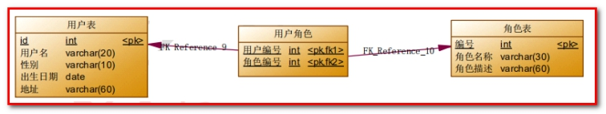 

在 MySQL 数据库中添加角色表，用户角色的中间表。

角色表

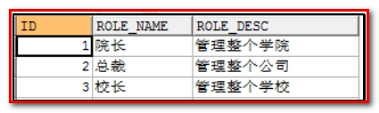 

角色用户关联表（中间表）

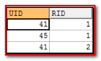 

创建表：导入数据

````java
DROP TABLE IF EXISTS `role`;
CREATE TABLE `role` (
  `ID` int(11) NOT NULL COMMENT '编号',
  `ROLE_NAME` varchar(30) default NULL COMMENT '角色名称',
  `ROLE_DESC` varchar(60) default NULL COMMENT '角色描述',
  PRIMARY KEY  (`ID`)
) ENGINE=InnoDB DEFAULT CHARSET=utf8;

insert  into `role`(`ID`,`ROLE_NAME`,`ROLE_DESC`) values (1,'院长','管理整个学院'),(2,'总裁','管理整个公司'),(3,'校长','管理整个学校');

DROP TABLE IF EXISTS `user_role`;

CREATE TABLE `user_role` (
  `UID` int(11) NOT NULL COMMENT '用户编号',
  `RID` int(11) NOT NULL COMMENT '角色编号',
  PRIMARY KEY  (`UID`,`RID`),
  KEY `FK_Reference_10` (`RID`),
  CONSTRAINT `FK_Reference_10` FOREIGN KEY (`RID`) REFERENCES `role` (`ID`),
  CONSTRAINT `FK_Reference_9` FOREIGN KEY (`UID`) REFERENCES `user` (`id`)
) ENGINE=InnoDB DEFAULT CHARSET=utf8;

insert  into `user_role`(`UID`,`RID`) values (41,1),(45,1),(41,2);
````


### 5.4.1查询所有角色

第一步：创建工程

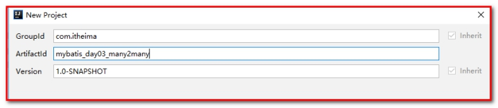 

第二步：导入java文件、资源文件、测试文件、pom.xml

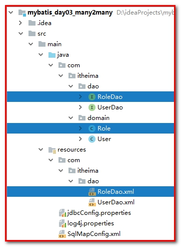 

第三步：创建Role.java

这里注意，我们使用属性和数据库字段并不相同

```java
public class Role implements Serializable {

    private Integer roleId;
    private String roleName;
    private String roleDesc;
}
```

第四步：创建RoleDao.java

````java
/**
 * 角色的持久层接口
 */
public interface RoleDao {

    /**
     * 查询所有角色
     * @return
     */
    List<Role> findAll();

    /**
     * 根据id查询角色信息
     * @param id
     * @return
     */
    Role findById(Integer id);
}
````


第五步：创建RoleDao.xml

````xml
<?xml version="1.0" encoding="UTF-8"?>
<!DOCTYPE mapper
        PUBLIC "-//mybatis.org//DTD Mapper 3.0//EN"
        "http://mybatis.org/dtd/mybatis-3-mapper.dtd">
<mapper namespace="com.itheima.dao.RoleDao">

    <resultMap id="roleMap" type="com.itheima.domain.Role">
        <id property="roleId" column="rid"></id>
        <result property="roleName" column="role_name"></result>
        <result property="roleDesc" column="role_desc"></result>
    </resultMap>
    <!-- 查询所有-->
    <select id="findAll" resultMap="roleMap">
        select * from role;
    </select>

    <!-- 根据id查询用户 -->
    <select id="findById" parameterType="INT" resultMap="roleMap">
        select * from role where id = #{uid}
    </select>
````


第六步：编写测试类MybatisTest.java

````java
/**
 * 测试mybatis的crud操作
 */
public class MybatisTest {


    private InputStream in;
    private SqlSession sqlSession;
    private UserDao userDao;
    private RoleDao roleDao;

    @Before//用于在测试方法执行之前执行
    public void init()throws Exception{
        //1.读取配置文件，生成字节输入流
        in = Resources.getResourceAsStream("SqlMapConfig.xml");
        //2.获取SqlSessionFactory
        SqlSessionFactory factory = new SqlSessionFactoryBuilder().build(in);
        //3.获取SqlSession对象
        sqlSession = factory.openSession();
        //4.获取dao的代理对象
        userDao = sqlSession.getMapper(UserDao.class);
        roleDao = sqlSession.getMapper(RoleDao.class);
    }
}

````


测试查询所有。

```java
/**
 * 测试查询所有角色
 */
@Test
public void testFindAllRole(){
    //5.执行查询所有方法
    List<Role> roles = roleDao.findAll();
    for(Role role : roles){
        System.out.println(role);
    }

}
```


 

### 5.4.2多对多查询，查询角色，同时关联用户

【需求】：查询所有角色，同时获取角色的所赋予的用户

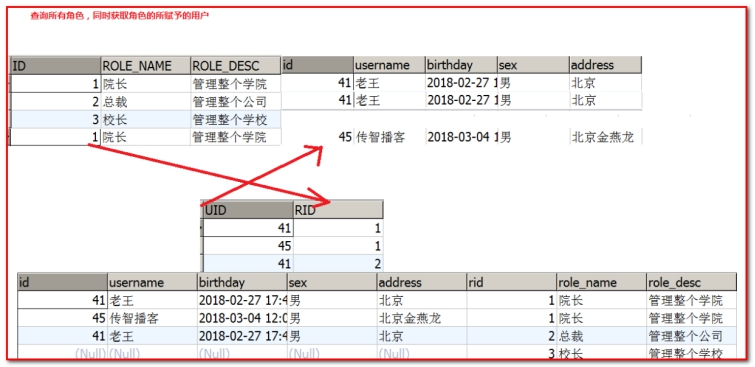 

第一步：sql语句

```
SELECT u.*,r.id AS rid,r.role_name,r.role_desc FROM role r
LEFT JOIN user_role ur ON r.ID = ur.rid
LEFT JOIN USER u ON u.id = ur.uid
```

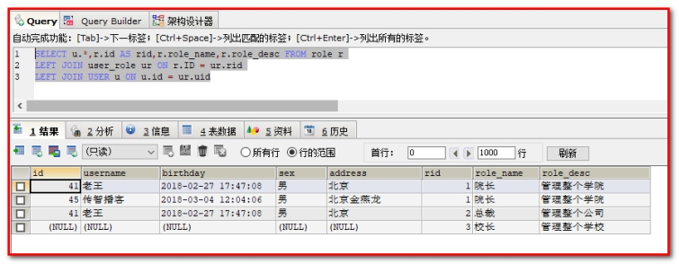 

第二步：修改Role.java

我们加载的信息中不仅有角色信息，同时还要加载关联加载具有该角色的用户信息。因为一个角色，可以分配给多个用户，所以我们可以考虑在 Role 类中加入一个 List<User>的属性，用于存放这个角色分配给了哪些用户对象。

```
public class Role implements Serializable {

    private Integer roleId;
    private String roleName;
    private String roleDesc;
    private List<User> users = new ArrayList<User>();

    public List<User> getUsers() {
        return users;
    }

    public void setUsers(List<User> users) {
        this.users = users;
    }
}
```


重写Role对象的toString方法。

```
@Override
public String toString() {
    return "Role{" +
            "roleId=" + roleId +
            ", roleName='" + roleName + '\'' +
            ", roleDesc='" + roleDesc + '\'' +
            ", users=" + users +
            '}';
}
```


第三步：RoleDao.java

```java
/**
 * 查询所有角色信息，同时查询用户的信息
 * @param
 * @return
 */
List<Role> findRoleUserList();
```

第四步：RoleDao.xml

````xml
<resultMap id="roleMap" type="com.itheima.domain.Role">
    <id property="roleId" column="rid"></id>
    <result property="roleName" column="role_name"></result>
    <result property="roleDesc" column="role_desc"></result>
    <collection property="users" ofType="user">
        <id property="id" column="id"></id>
        <result property="username" column="username"></result>
        <result property="address" column="address"></result>
        <result property="sex" column="sex"></result>
        <result property="birthday" column="birthday"></result>
    </collection>
</resultMap>
<!-- 查询所有角色，同时查询所有用户 -->
<select id="findRoleUserList" resultMap="roleMap">
    SELECT u.*,r.id AS rid,r.role_name,r.role_desc FROM role r
    LEFT JOIN user_role ur ON r.ID = ur.rid
    LEFT JOIN USER u ON u.id = ur.uid
</select>
````


这里需注意：sql语句如果有换行，需要在sql的后面尽量加一个空格。

第五步：MybatisTest.java

```java
/**
 * 测试查询所有的角色
 */
@Test
public void testFindRoleUserList(){
    //5.执行查询所有方法
    List<Role> roles = roleDao.findRoleUserList();
    for(Role role : roles){
        System.out.println(role);
    }

}
```

 

查看结果：

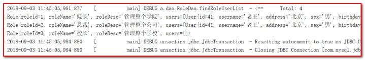 

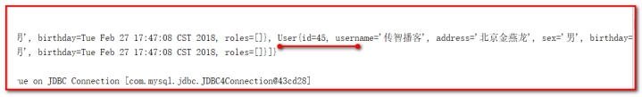 

### 5.4.3多对多查询，查询用户，同时关联角色

【需求】：查询所有用户，同时获取用户的所赋予的角色

 

第一步：sql语句

````
SELECT u.*,r.id AS rid,r.role_name,r.role_desc FROM USER u
LEFT JOIN user_role ur ON u.ID = ur.uid
LEFT JOIN role r ON r.id = ur.rid
````


 

第二步：修改User.java

````java
public class User implements Serializable{

    private Integer id;
    private String username;
    private String address;
    private String sex;
    private Date birthday;
    private List<Role> roles = new ArrayList<Role>();

    public List<Role> getRoles() {
        return roles;
    }

    public void setRoles(List<Role> roles) {
        this.roles = roles;
    }
}
````


重写User对象的toString方法。

````java
@Override
public String toString() {
    return "User{" +
            "id=" + id +
            ", username='" + username + '\'' +
            ", address='" + address + '\'' +
            ", sex='" + sex + '\'' +
            ", birthday=" + birthday +
            ", roles=" + roles +
           '}';
}
````

第三步：UserDao.java

```java
/**
 * 查询所有的用户，同时查询关联的角色信息
 * @param
 * @return
 */
List<User> findUserRoleList();
```


第四步：UserDao.xml

```xml
<resultMap id="userMap" type="user">
    <id property="id" column="id"></id>
    <result property="username" column="username"></result>
    <result property="address" column="address"></result>
    <result property="birthday" column="birthday"></result>
    <result property="sex" column="sex"></result>
    <collection property="roles" ofType="role">
        <id property="roleId" column="rid"></id>
        <result property="roleName" column="role_name"></result>
        <result property="roleDesc" column="role_desc"></result>
    </collection>
</resultMap>
<!-- 查询所有的用户，同时查询关联的角色信息 -->
<select id="findUserRoleList" resultMap="userMap">
    SELECT u.*,r.id AS rid,r.role_name,r.role_desc FROM USER u
    LEFT JOIN user_role ur ON u.ID = ur.uid
    LEFT JOIN role r ON r.id = ur.rid
</select>
```


这里需注意：sql语句如果有换行，需要在sql的后面尽量加一个空格。

第五步：MybatisTest.java

```java
/**
 * 测试查询所有的用户
 */
@Test
public void testFindUserRoleList(){
    //5.执行查询所有方法
    List<User> users = userDao.findUserRoleList();
    for(User user : users){
        System.out.println(user);
    }

}
```


查看结果：

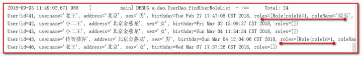 

 

 

 

 

 