Mybatis第3天笔记

# 第1章  Mybatis课程计划。

1、Mybatis中的延迟加载（多表操作）

​	什么是延迟加载（按需加载）、立即加载

 

2、Mybatis中的缓存

​	什么是缓存

​		存在于内存中的临时数据。

​	为什么使用缓存

​		减少和数据库的交互次数，提高执行效率。

​	什么样的数据能使用缓存，什么样的数据不能使用

​		适用于缓存：

​			经常查询并且不经常改变的。

​			数据的正确与否对最终结果影响不大的。

​		不适用于缓存：

​			经常改变的数据

​			数据的正确与否对最终结果影响很大的。

​			例如：商品的库存，银行的汇率，股市的牌价。

​	Mybatis中的一级缓存和二级缓存

​		一级缓存：

​			它指的是Mybatis中SqlSession对象的缓存。

​			当我们执行查询之后，查询的结果会同时存入到SqlSession为我们提供一块区域中。

​			该区域的结构是一个Map。当我们再次查询同样的数据，mybatis会先去sqlsession中

​			查询是否有，有的话直接拿出来用。

​			当SqlSession对象消失时，mybatis的一级缓存也就消失了。

​		

​		二级缓存:

​			它指的是Mybatis中SqlSessionFactory对象的缓存。由同一个SqlSessionFactory对象创建的SqlSession共享其缓存。

​			二级缓存的使用步骤：

​				第一步：让Mybatis框架支持二级缓存（在SqlMapConfig.xml中配置）

​				第二步：让当前的映射文件支持二级缓存（在UserDao.xml中配置）

​				第三步：让当前的操作支持二级缓存（在select标签中配置）

3、Mybatis中的注解开发

​	环境搭建

​	单表CRUD操作（代理Dao方式）

​	多表查询操作

​    延迟加载

​	缓存的配置

\-----------------------------------------

今日学习目标：

1：掌握Mybatis的延迟加载（第2章）

2：掌握Mybatis缓存（第3章）

3：掌握Mybatis注解开发（第4章）

 

 

 

 

# 第2章  Mybatis 延迟加载策略 

通过前面的学习，我们已经掌握了 Mybatis 中一对一，一对多，多对多关系的配置及实现，可以实

现对象的关联查询。实际开发过程中很多

 

 

## 2.1 何为延迟加载?

问题：在一对多中，当我们有一个用户，它有100个账户。

​	      在查询用户的时候，要不要把关联的账户查出来？

​	      在查询账户的时候，要不要把关联的用户查出来？

​          如果使用联合查询，用户信息和账号信息会通过一条sql语句全部查询出来，此时是不涉及到延迟加载

​		

​	      在查询用户时，用户下的账户信息应该是什么时候使用，什么时候查询。

​	      在查询账户时，账户的所属用户信息应该是随着账户查询时是否一起查询出来。

 

​	什么是延迟加载

​		在真正使用数据时才发起查询，不用的时候不查询。按需加载（懒加载）

​	什么是立即加载

​		不管用不用，只要一调用方法，马上发起查询。

​	应用场景：

​	在对应的四种表关系中：一对多，多对一，一对一，多对多

​		一对多，多对多：通常情况下我们都是采用延迟加载。（建议）

​		多对一，一对一：通常情况下我们都是采用立即加载。（建议）

 

延迟加载：就是在需要用到数据时才进行加载，不需要用到数据时就不加载数据。延迟加载也称懒加载.

好处：先从单表查询，需要时再从关联表去关联查询，

 

## 2.2 实现多对一的延迟加载（association）

【需求】

查询账户(Account)信息并且关联查询用户(User)信息。如果先查询账户(Account)信息即可满足要求，

当我们需要查询用户(User)信息时，再去查询用户信息。

 

第一步：创建工程

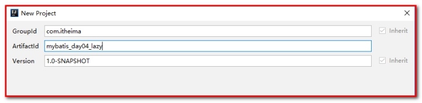 

第二步：导入配置文件（从mybatis_day03_one2many拷贝）

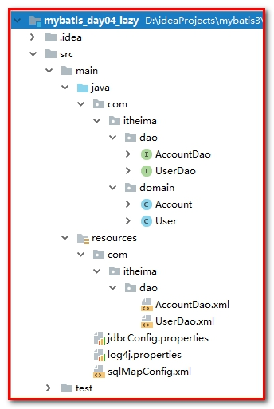 

 

第三步：Account.java

【需求】：查询账户信息同时查询用户信息。 

```java
/**
 */
public class Account implements Serializable {

    private Integer id;
    private Integer uid;
    private Double money;

    private User user;

    public User getUser() {
        return user;
    }

    public void setUser(User user) {
        this.user = user;
    }
}
```


第四步：AccountDao.java

AccountDao类中添加查询账户信息的方法: 

```
/**
 * 查询账号和客户的信息
 */
List<Account> findByAccountUser();
```


第五步：AccountDao.xml

```xml
<!--定义resultMap对象，用来封装账号信息-->
<resultMap id="accountMap" type="account">
    <id property="id" column="id"></id>
    <result property="uid" column="uid"></result>
    <result property="money" column="money"></result>
    <!--association用来关联对象，
    property代表加载对象，
    javaType代表加载对象的数据类型，可以写成com.itheima.domain.User
    select 属性指定的内容：查询用户的唯一标识，指延迟加载要执行的statement的id
                            要使用UserDao.xml中的findById完成根据用户id查询用户信息
    column 属性指定的内容：用户根据id查询时，所需要的参数的值
    -->
    <association property="user" column="uid" javaType="user" select="com.itheima.dao.UserDao.findById">
    </association>

</resultMap>
<!-- 查询所有账号 -->
<select id="findByAccountUser" resultMap="accountMap">
    select * from account;
</select>
```


第六步：UserDao.java

```java
/**
 * 根据id查询用户信息
 * @param id
 * @return
 */
User findById(Integer id);
```


第七步：UserDao.xml

```xml
<!-- 根据id查询用户 -->
<select id="findById" parameterType="INT" resultType="com.itheima.domain.User">
    select * from user where id = #{uid}
</select>
```


第八步：测试MybatisTest.java

```java
/**
 * 查询所有账户和客户信息（方案二，直接使用Account对象）
 */
@Test
public void testFindAllAccountUser(){
    //5.执行查询所有方法
    List<Account> list = accountDao.findByAccountUser();
}
```


测试：

查看sql语句，并没有实现延迟检索，而是立即检索（默认）。

即【查询账号信息，同时把用户的信息也查询】

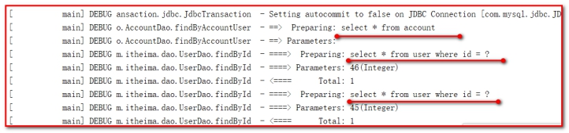 

 

第九步：开启Mybatis的延迟检索策略

进入Mybaits的官方文档，找到settings的说明信息

<http://www.mybatis.org/mybatis-3/>

 

 

我们发现lazyLoadingEnabled属性的默认是false，表示不会延迟加载。

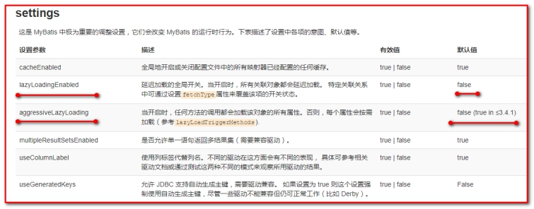 

配置SqlMapConfig.xml

这里注意：标签的加载顺序：settings需放到typeAliases的前面

```xml
<?xml version="1.0" encoding="UTF-8"?>
<!DOCTYPE configuration
        PUBLIC "-//mybatis.org//DTD Config 3.0//EN"
        "http://mybatis.org/dtd/mybatis-3-config.dtd">
<configuration>
    <properties resource="jdbcConfig.properties"></properties>
    <!--需要配置延迟加载策略-->
    <settings>
        <!--打开延迟加载的开关-->
        <setting name="lazyLoadingEnabled" value="true"/>
        <!--将积极加载改为消息加载，即按需加载-->
        <setting name="aggressiveLazyLoading" value="false"/>
    </settings>
```


第十步：测试MybatisTest.java

```java
/**
 * 查询所有账户和客户信息（方案二，直接使用Account对象）
 */
@Test
public void testFindAllAccountUser(){
    //5.执行查询所有方法
    List<Account> list = accountDao.findByAccountUser();
}
```


查看控制台，此时因为没有查询用户信息，所以只查询了账号的信息。

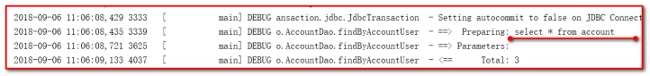 

我们发现，因为本次只是将Account对象查询出来放入List集合中，并没有涉及到User对象，所以就没有发出SQL语句查询账户所关联的User对象的查询。 

 

我们也可以在AccountDao.xml中使用fethcType属性用来控制延迟检索和立即检索：

*fetchType:*    *eager：立即检索*    *lazy：延迟检索*

 ````java
<association property="user" javaType="user" select="com.itheima.dao.UserDao.findById" column="uid" fetchType="eager">

</association>
 ````


## 2.3 实现一对多的延迟加载（collection）

第一步：User.java

【需求】：查询用户信息同时查询账号信息。 

User实体类中加入一个List<Account>类的对象 

```java
public class User implements Serializable {

    private Integer id;
    private String username;
    private String address;
    private String sex;
    private Date birthday;
    private List<Account> accounts;

    public List<Account> getAccounts() {
        return accounts;
    }

    public void setAccounts(List<Account> accounts) {
        this.accounts = accounts;
    }
}
```


第二步：UserDao.java

```java
 /**
 * 根据用户账号的信息
 * @param
 * @return
 */
List<User> findUserAccountList();
```


第三步：UserDao.xml

````xml
<!--定义用户和账号的查询-->
<resultMap id="userMap" type="user">
    <id property="id" column="id"></id>
    <result property="username" column="username"></result>
    <result property="address" column="address"></result>
    <result property="sex" column="sex"></result>
    <result property="birthday" column="birthday"></result>
    <collection property="accounts" ofType="account" select="com.itheima.dao.AccountDao.findAccountByUid" column="id">
    </collection>
</resultMap>

<!-- 根据用户和账号的信息 -->
<select id="findUserAccountList" resultMap="userMap">
    SELECT * FROM user
</select>
````


<collection>标签主要用于加载关联的集合对象 

select属性用于指定查询account列表的sql语句，所以填写的是该sql映射的id 

column属性用于指定select属性的sql语句的参数来源，上面的参数来自于user的id列，所以就写成id这一个字段名了 

fetchType：立即和延迟检索的开关

lazy：延迟检索

eager：立即检索

第四步：AccountDao.java

```java
/**
 * 根据用户id查询账号信息
 * @return
 */
List<Account> findAccountByUid(Integer uid);
```

第五步：AccountDao.xml

```xml
<!-- 更加用户id查询账号列表 -->
<select id="findAccountByUid" resultType="account" parameterType="int">
    select * from account where uid = #{uid};
</select>
```


第六步：测试MybatisTest.java

````java
/**
 * 查询所有用户和账号信息
 */
@Test
public void testFindUserAccountList(){
    //5.执行查询所有方法
    List<User> list = userDao.findUserAccountList();
    for(User user : list){
        System.out.println(user);
        System.out.println(user.getAccounts().size());
    }
}
````

测试：

即【查询用户信息，采用延迟检索，需要账号的信息，才查询账号】

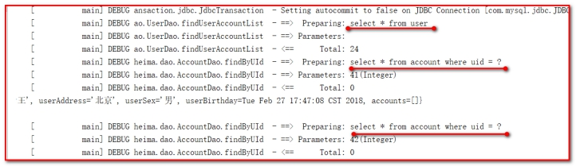 

小结：延迟检索会对系统查询数据库做性能的优化

多对一，一对一的查询，默认是立即检索（不管用没用到一的一端的属性值，因为只查询一次，所以立即检索不会浪费太多性能）

一对多，多对多的查询，默认是延迟检索（不管用没用到多的一端的属性值，因为会查询多次，所以立即检索会浪费太多性能）

 

总结：通过本示例，我们可以发现Mybatis的延迟加载还要有很明显效果，对于提升软件性能这是一个不错的手段。 

用的时候：一般项目经理采用延迟检索，用的时候再查询数据库，有助于程序健壮，减少操作数据库的频率。

如果我们开发，大家记住2点：

1：可以使用联合查询语句，完成多表的查询（用的比较多，联合查询的sql语句不会出现立即检索和延迟检索）

2：可以使用select的单独查询（通过主外键），完成多表的查询（考虑立即检索和延迟检索）

# 第3章  Mybatis缓存 

像大多数的持久化框架一样，Mybatis也提供了缓存策略，通过缓存策略来减少数据库的查询次数，从而提高性能。 

Mybatis中缓存分为一级缓存，二级缓存

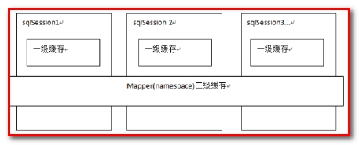 

一级缓存：是SqlSession级别的缓存（线程级别的缓存）

二级缓存：是SqlSessionFactory级别的缓存（进程级别的缓存）

一个SqlSessionFactory存在多个SqlSession。

 

## 3.1  一级缓存：

它指的是Mybatis中SqlSession对象的缓存。

当我们执行查询之后，查询的结果会同时存入到SqlSession为我们提供一块区域中。

该区域的结构是一个Map。当我们再次查询同样的数据，mybatis会先去sqlsession中查询是否有，有的话直接拿出来用，如果没有再查询数据库。

当SqlSession对象消失时，mybatis的一级缓存也就消失了。

### 3.1.1 测试一级缓存

创建工程mybatis_day04_cache。

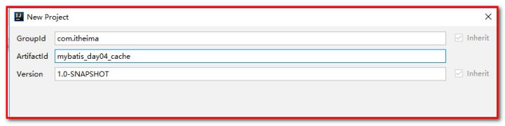 

pom.xml，配置：

```xml
<?xml version="1.0" encoding="UTF-8"?>
<project xmlns="http://maven.apache.org/POM/4.0.0"
         xmlns:xsi="http://www.w3.org/2001/XMLSchema-instance"
         xsi:schemaLocation="http://maven.apache.org/POM/4.0.0 http://maven.apache.org/xsd/maven-4.0.0.xsd">
    <modelVersion>4.0.0</modelVersion>

    <groupId>com.itheima</groupId>
    <artifactId>mybatis_day04_cache</artifactId>
    <version>1.0-SNAPSHOT</version>
    <packaging>jar</packaging>
    <dependencies>
        <dependency>
            <groupId>org.mybatis</groupId>
            <artifactId>mybatis</artifactId>
            <version>3.4.5</version>
        </dependency>

        <dependency>
            <groupId>mysql</groupId>
            <artifactId>mysql-connector-java</artifactId>
            <version>5.1.6</version>
        </dependency>

        <dependency>
            <groupId>log4j</groupId>
            <artifactId>log4j</artifactId>
            <version>1.2.12</version>
        </dependency>

        <dependency>
            <groupId>junit</groupId>
            <artifactId>junit</artifactId>
            <version>4.10</version>
        </dependency>
    </dependencies>

</project>
```


导入配置文件

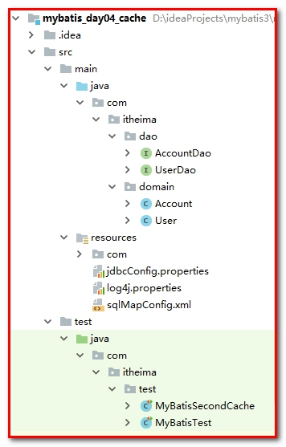 

第一步：UserDao.java

```java
/**
 * 用户的持久层接口
 */
public interface UserDao {


    /**
     * 根据id查询用户信息
     * @param id
     * @return
     */
    User findById(Integer id);


}
```


第二步：UserDao.xml

```xml
<?xml version="1.0" encoding="UTF-8"?>
<!DOCTYPE mapper
        PUBLIC "-//mybatis.org//DTD Mapper 3.0//EN"
        "http://mybatis.org/dtd/mybatis-3-mapper.dtd">
<mapper namespace="com.itheima.dao.UserDao">


    <!-- 根据id查询用户 -->
    <select id="findById" parameterType="INT" resultType="com.itheima.domain.User">
        select * from user where id = #{uid}
    </select>


</mapper>
```


第三步：测试类MybatisSecondCachet.java

```java
/**
 * 测试主键ID查询操作
 * 测试sqlSession的一级缓存（自带）
 */
@Test
public void testFirstLevelCache(){
    //5.执行查询一个方法
    User user1 = userDao.findById(50);
System.out.println(user1);
    User user2 = userDao.findById(50);
    System.out.println(user2);
    System.out.println(user1==user2);
}
```


测试：

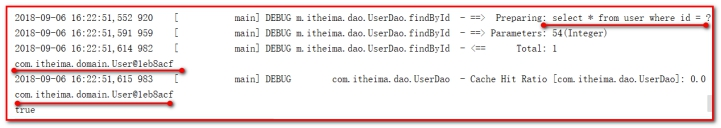 

总结：2个对象是1个对象，表示从缓存中获取，不会查询数据库；一级缓存中存放的是一个对象

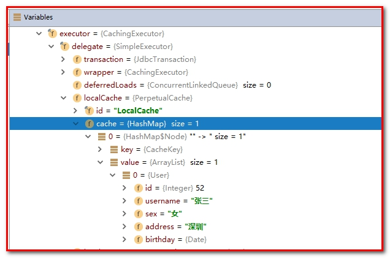 

第四步：测试MybatisTest.java

```java
/**
     * 测试主键ID查询操作
     * 测试一级缓存是SqlSession级别的缓存，只要SqlSession没有flush或close，它就存在
     */
    @Test
    public void testFirstLevelCacheCycle(){
        //5.执行查询一个方法
        User user1 = userDao.findById(50);

        System.out.println(user1);
        sqlSession.close();
//        sqlSession.clearCache();// 清理缓存
        sqlSession = factory.openSession();
        userDao = sqlSession.getMapper(UserDao.class);
        User user2 = userDao.findById(50);
        System.out.println(user2);
        System.out.println(user1==user2);
    }
```


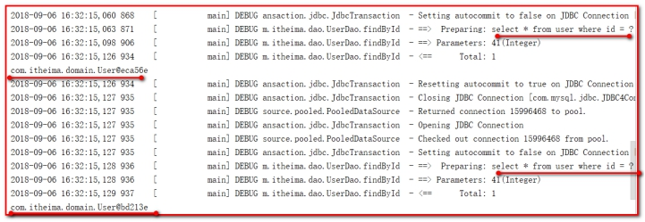 

总结：两个对象不是同一个对象，SqlSession关闭，缓存消失，会再次查询数据库。

 

一级缓存是SqlSession 范围的缓存，当调用SqlSession 的修改，添加，删除，commit()，close()等方法时，就会清空一级缓存。 

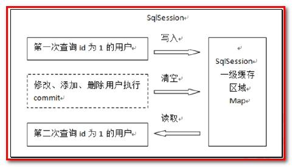 

第一次发起查询用户id 为1 的用户信息，先去找缓存中是否有id 为1 的用户信息，如果没有，从数据库查询用户信息。 得到用户信息，将用户信息存储到一级缓存中。 如果sqlSession 去执行commit 操作（执行插入、更新、删除），清空SqlSession 中的一级缓存，这样做的目的为了让缓存中存储的是最新的信息，避免脏读。 

第二次发起查询用户id 为1 的用户信息，先去找缓存中是否有id 为1 的用户信息，缓存中有，直接从缓存中获取用户信息。 

 

​		

## 3.2 		二级缓存:

它指的是Mybatis中SqlSessionFactory对象的级别缓存。由同一个SqlSessionFactory对象创建的SqlSession共享其缓存。

二级缓存的使用步骤：

​	第一步：让Mybatis框架支持二级缓存（在SqlMapConfig.xml中配置）

​	第二步：让当前的映射文件支持二级缓存（在UserDao.xml中配置）

​	第三步：让当前的操作支持二级缓存（在select标签中配置）

二级缓存结构图 

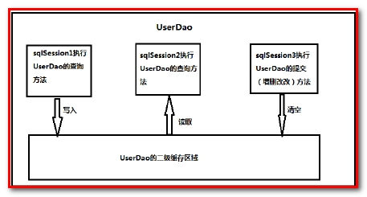 

 

### 3.2.1 测试二级缓存

测试类MybatisTest.java

````java
/**
 * 测试主键ID查询操作
 * 测试sqlSessionFactory的二级缓存（配置）
 */
@Test
public void testSecondLevelCache(){
    SqlSession sqlSession1 = factory.openSession();
    UserDao userDao = sqlSession1.getMapper(UserDao.class);
    User user1 = userDao.findById(50);
    System.out.println(user1);
    sqlSession1.close();
    SqlSession sqlSession2 = factory.openSession();
    UserDao userDao2 = sqlSession2.getMapper(UserDao.class);
    User user2 = userDao2.findById(50);
    System.out.println(user2);
    sqlSession2.close();
    System.out.println(user1==user2);
}
````


此时：缓存没有起作用

 

 

二级缓存需要配置：

### 3.2.2 二级缓存的开启与关闭 

第一步：在SqlMapConfig.xml 文件开启二级缓存 

因为cacheEnabled 的取值默认就为true，所以这一步可以省略不配置。为true 代表开启二级缓存； 为false 代表不开启二级缓存。 

 ```xml
<!--需要配置延迟加载策略-->
<settings>
    <!--开启二级缓存-->
    <setting name="cacheEnabled" value="true"/>
</settings>
 ```


第二步：配置UserDao.xml中相关的Mapper 映射文件 

<cache>标签表示当前这个mapper 映射将使用二级缓存，区分的标准就看mapper 的namespace 值。 

 ```
<mapper namespace="com.itheima.dao.UserDao">
    <cache/>
</mapper>
 ```


第三步：配置UserDao.xml中statement 上面的useCache 属性 ，在select标签中配置

```xml
<!-- 根据id查询用户 -->
<select id="findById" parameterType="INT" resultType="com.itheima.domain.User" useCache="true">
    select * from user where id = #{uid}
</select>
```


将UserDao.xml 映射文件中的<select>标签中设置useCache=”true”代表当前这个statement 要使用二级缓存，如果不使用二级缓存可以设置为false。 

注意：针对每次查询都需要最新的数据sql，要设置成useCache=false，禁用二级缓存。 

 

使用MybatisTest.java测试：

```java
/**
 * 测试主键ID查询操作
 * 测试sqlSessionFactory的二级缓存（配置）
 */
@Test
public void testSecondLevelCache(){
    SqlSession sqlSession1 = factory.openSession();
    UserDao userDao = sqlSession1.getMapper(UserDao.class);
    User user1 = userDao.findById(50);
    System.out.println(user1);
    sqlSession1.close();
    SqlSession sqlSession2 = factory.openSession();
    UserDao userDao2 = sqlSession2.getMapper(UserDao.class);
    User user2 = userDao2.findById(50);
    System.out.println(user2);
    sqlSession2.close();
    System.out.println(user1==user2);
}
```


测试：

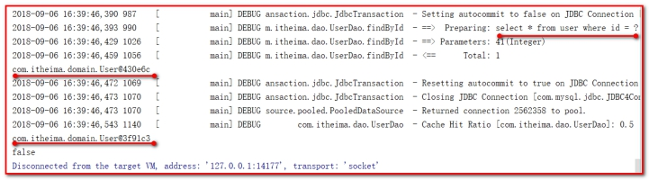 

 

经过上面的测试，我们发现执行了两次查询，并且在执行第一次查询后，我们关闭了一级缓存，再去执行第二次查询时，我们发现并没有对数据库发出sql 语句，所以此时的数据就只能是来自于我们所说的二级缓存。 

但是为什么2个对象不一致呢？原理二级缓存中存放的是对象的散装数据，每次查询的时候需要重新封装实体对象。

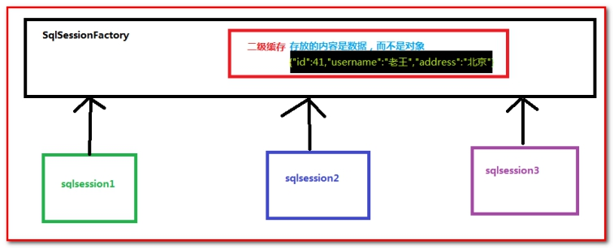 

SqlSessionFactory存放缓存的地方：

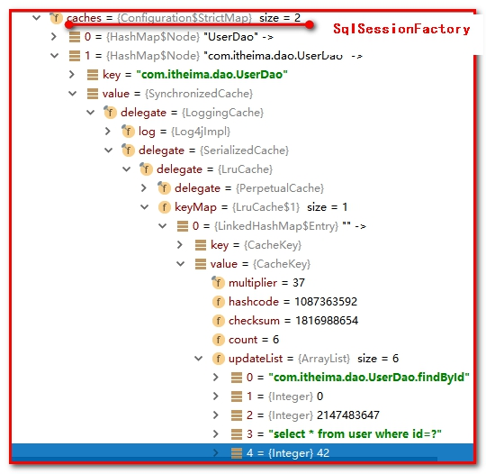 

 

考虑二级缓存的应用场景：

适应放置到二级缓存的数据：经常不会发生变化的数据，例如地区编码

不适合放置到二级缓存的数据：经常变化的数据

财务数据

 

# 第4章  Mybatis注解开发 

这几年来注解开发越来越流行，Mybatis也可以使用注解开发方式，这样我们就可以减少编写Mapper映射文件了。本次我们先围绕一些基本的 CRUD来学习，再学习复杂映射关系及延迟加载及缓存。 

## 4.1 创建工程（入门案例查询所有）

创建工程：mybatis_day04_annotation，工程目录结构如下：

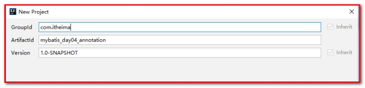 

pom.xml，配置：

```xml
<?xml version="1.0" encoding="UTF-8"?>
<project xmlns="http://maven.apache.org/POM/4.0.0"
         xmlns:xsi="http://www.w3.org/2001/XMLSchema-instance"
         xsi:schemaLocation="http://maven.apache.org/POM/4.0.0 http://maven.apache.org/xsd/maven-4.0.0.xsd">
    <modelVersion>4.0.0</modelVersion>

    <groupId>com.itheima</groupId>
    <artifactId>mybatis_day04_cache</artifactId>
    <version>1.0-SNAPSHOT</version>
    <packaging>jar</packaging>
    <dependencies>
        <dependency>
            <groupId>org.mybatis</groupId>
            <artifactId>mybatis</artifactId>
            <version>3.4.5</version>
        </dependency>

        <dependency>
            <groupId>mysql</groupId>
            <artifactId>mysql-connector-java</artifactId>
            <version>5.1.6</version>
        </dependency>

        <dependency>
            <groupId>log4j</groupId>
            <artifactId>log4j</artifactId>
            <version>1.2.12</version>
        </dependency>

        <dependency>
            <groupId>junit</groupId>
            <artifactId>junit</artifactId>
            <version>4.10</version>
        </dependency>
    </dependencies>

</project>
```

 

src/resource下：SqlMapConfig.xml

```xml
<?xml version="1.0" encoding="UTF-8"?>
<!DOCTYPE configuration
        PUBLIC "-//mybatis.org//DTD Config 3.0//EN"
        "http://mybatis.org/dtd/mybatis-3-config.dtd">
<configuration>
    <!-- 引入外部配置文件-->
    <properties resource="jdbcConfig.properties"></properties>
    <!--配置别名-->
    <typeAliases>
        <package name="com.itheima.domain"></package>
    </typeAliases>
    <!-- 配置环境-->
    <environments default="mysql">
        <environment id="mysql">
            <transactionManager type="JDBC"></transactionManager>
            <dataSource type="POOLED">
                <property name="driver" value="${jdbc.driver}"></property>
                <property name="url" value="${jdbc.url}"></property>
                <property name="username" value="${jdbc.username}"></property>
                <property name="password" value="${jdbc.password}"></property>
            </dataSource>
        </environment>
    </environments>
    <!-- 指定带有注解的dao接口所在位置 -->
    <mappers>
        <mapper class="com.itheima.dao.UserDao"></mapper>
    </mappers>
</configuration>
```


src/main/java，创建包com.itheima.domain，创建User.java

```java
/**
 * 在mybatis中针对,CRUD一共有四个注解
 *  @Select @Insert @Update @Delete
 */
public interface UserDao {

    /**
     * 查询所有用户
     * @return
     */
    @Select(value="select * from user")
    List<User> findAll();
}
```

测试MybatisTest.java

```java
/**
 */
public class MybatisAnnoTest {

    /**
     * 测试基于注解的mybatis使用
     * @param args
     */
    public static void main(String[] args) throws  Exception{
        //1.获取字节输入流
        InputStream in = Resources.getResourceAsStream("SqlMapConfig.xml");
        //2.根据字节输入流构建SqlSessionFactory
        SqlSessionFactory factory = new SqlSessionFactoryBuilder().build(in);
        //3.根据SqlSessionFactory生产一个SqlSession
        SqlSession session = factory.openSession();
        //4.使用SqlSession获取Dao的代理对象
        UserDao userDao = session.getMapper(UserDao.class);
        //5.执行Dao的方法
        List<User> users = userDao.findAll();
        for(User user : users){
            System.out.println(user);
        }
        //6.释放资源
        session.close();
        in.close();
    }
}
```


【原理分析】：

UserDao.xml

```xml
<mapper namespace="com.itheima.dao.UserDao">
    <select id="findAll" resultType="com.itheima.domain.User">
        select * from user;
    </select>
</mapper>
```


注解：UserDao.java

```java
package com.itheima.dao;
import java.util.List;

/**
 * 在mybatis中针对,CRUD一共有四个注解
 *  @Select @Insert @Update @Delete
 */
public interface UserDao {

    /**
     * 查询所有用户
     * @return
     */
    @Select(value="select * from user")
    List<User> findAll();
}
```


这里注意：如果使用注解，就不能使用配置文件

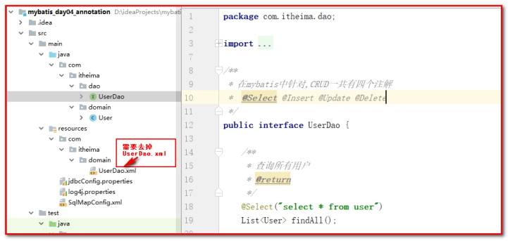 

## 4.2 Mybatis的注解说明 

@Insert:实现新增 

@Update:实现更新 

@Delete:实现删除 

@Select:实现查询 

@Result:实现结果集封装 

@Results:可以与@Result一起使用，封装多个结果集 

@One:实现一对一结果集封装 

@Many:实现一对多结果集封装 

@SelectProvider: 实现动态SQL映射 

我们也通过查看Mybatis官方文档来学习Mybatis注解开发 

 

 

## 4.3 使用Mybatis注解实现基本CRUD 

单表的CRUD操作是最基本的操作，前面我们的学习都是基于Mybaits的映射文件来实现的。 

UserDao.java

```java
/**
 * 在mybatis中针对,CRUD一共有四个注解
 *  @Select @Insert @Update @Delete
 */
public interface UserDao {

    /**
     * 查询所有用户
     * @return
     */
    @Select("select * from user")
    List<User> findAll();

    /**
     * 保存用户
     * @param user
     */
    @Insert("insert into user(username,address,sex,birthday)values(#{username},#{address},#{sex},#{birthday})")
    @SelectKey(statement = "SELECT LAST_INSERT_ID()",keyProperty = "id",keyColumn = "id",before = false,resultType = Integer.class)

void saveUser(User user);

    /**
     * 更新用户
     * @param user
     */
    @Update("update user set username=#{username},sex=#{sex},birthday=#{birthday},address=#{address} where id=#{id}")
    void updateUser(User user);

    /**
     * 删除用户
     * @param userId
     */
    @Delete("delete from user where id=#{id} ")
    void deleteUser(Integer userId);

    /**
     * 根据id查询用户
     * @param userId
     * @return
     */
    @Select("select * from user  where id=#{uid} ")
    User findById(@Param(value = "uid")Integer userId);

    /**
     * 根据用户名称模糊查询
     * @param username
     * @return
     */
//    @Select("select * from user where username like #{username} ")
    @Select("select * from user where username like '%${value}%' ")
    List<User> findUserByName(String username);

    /**
     * 查询总用户数量
     * @return
     */
    @Select("select count(*) from user ")
    int findTotalUser();

// 传递2个条件或者多个条件
    @Select(value = "select * from user where username like #{name} and sex = #{sex}")
    List<User> findByNameAndSex(@Param(value = "name") String username, @Param(value = "sex") String sex);

    @Select(value = "select * from user where username like #{name} and sex = #{sex}")
    List<User> findByNameAndSex2(Map map);


}
```


测试类：AnnotationCRUDTest.java

```java
/**
 */
public class AnnotationCRUDTest {
    private InputStream in;
    private SqlSessionFactory factory;
    private SqlSession session;
    private UserDao userDao;

    @Before
    public  void init()throws Exception{
        in = Resources.getResourceAsStream("SqlMapConfig.xml");
        factory = new SqlSessionFactoryBuilder().build(in);
        session = factory.openSession();
        userDao = session.getMapper(UserDao.class);
    }

    @After
    public  void destroy()throws  Exception{
        session.commit();
        session.close();
        in.close();
    }

    @Test
    public void testFindAll(){
        List<User> list = userDao.findAll();
        for(User user:list){
            System.out.println(user);
        }
    }

    @Test
    public void testSave(){
        User user = new User();
        user.setUsername("mybatis annotation");
        user.setAddress("北京市昌平区");

        userDao.saveUser(user);
    }

    @Test
    public void testUpdate(){
        User user = new User();
        user.setId(57);
        user.setUsername("mybatis annotation update");
        user.setAddress("北京市海淀区");
        user.setSex("男");
        user.setBirthday(new Date());

        userDao.updateUser(user);
    }


    @Test
    public void testDelete(){
        userDao.deleteUser(51);
    }

    @Test
    public void testFindOne(){
        User user = userDao.findById(57);
        System.out.println(user);
    }


    @Test
    public  void testFindByName(){
//        List<User> users = userDao.findUserByName("%mybatis%");
        List<User> users = userDao.findUserByName("mybatis");
        for(User user : users){
            System.out.println(user);
        }
    }

    @Test
    public  void testFindTotal(){
        int total = userDao.findTotalUser();
        System.out.println(total);
    }

// 传递2个条件或者多个条件
    @Test
    public void findByNameAndSex() throws Exception {
    	String username = "%王%";
    	String sex = "男";
    	List<User> list = userDao.findByNameAndSex(username,sex);
    	for (User user : list) {
            System.out.println(user);
    	}
    }

    // 使用hashmap，指定key和value
    @Test
    public void findByNameAndSex2() throws Exception {
    	String username = "%王%";
    	String sex = "男";
    	Map<String,String> map = new HashMap<String, String>();
    	map.put("name",username);
    	map.put("sex",sex);
    	List<User> list = userDao.findByNameAndSex2(map);
    	for (User user : list) {
            System.out.println(user);
    	}
    }

}
```


## 4.4 使用注解实现复杂关系映射开发

实现复杂关系映射之前我们可以在映射文件中通过配置<resultMap>来实现，但通过后我们发现并没有@ResultMap这个注解。下面我们一起来学习@Results注解，@Result注解，@One注解，@Many注解。

创建工程

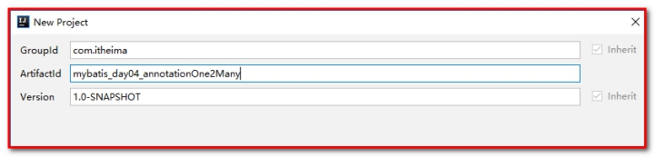 

 

### 4.4.1 @Result和@ResultMap

第一步：User.java

修改属性和数据库的列不一致。

```java
public class User implements Serializable{

    private Integer userId;
    private String userName;
    private String userAddress;
    private String userSex;
    private Date userBirthday;
}
```

 

第二步：修改 UserDao.java

添加注解：@Results和@Result，在其他的方法中，可以使用@ResultMap指定id的名称。

````java
/**
 * 在mybatis中针对,CRUD一共有四个注解
 *  @Select @Insert @Update @Delete
 */
public interface UserDao {

    /**
     * 查询所有用户
     * @return
     */
    @Select("select * from user")
    @Results(id="userMap",value = {
            @Result(id = true,property = "userId",column = "id"),
            @Result(property = "userName",column = "username"),
            @Result(property = "userAddress",column = "address"),
            @Result(property = "userSex",column = "sex"),
            @Result(property = "userBirthday",column = "birthday")
    })
    List<User> findAll();


    /**
     * 根据id查询用户
     * @param userId
     * @return
     */
    @Select("select * from user  where id=#{uid} ")
    @ResultMap(value="userMap")
    User findById(Integer userId);

    /**
     * 根据用户名称模糊查询
     * @param username
     * @return
     */
    @Select("select * from user where username like #{username} ")
    @ResultMap(value="userMap")
    List<User> findUserByName(String username);

}
````

 

第三步：测试：

AnnotationCRUDTest.java

```java
@Test
public void testFindAll(){
    List<User> list = userDao.findAll();
    for(User user:list){
        System.out.println(user);
    }
}

@Test
public void testFindOne(){
    User user = userDao.findById(57);
    System.out.println(user);
}


@Test
public  void testFindByName(){
    List<User> users = userDao.findUserByName("%mybatis%");
    for(User user : users){
        System.out.println(user);
    }
}
```


这里：

@Results注解 

- 代替的是标签<resultMap> 
- 该注解中可以使用单个@Result注解，也可以使用@Result集合 
- @Results（{@Result（），@Result（）}）或@Results（@Result（）） 

@Result注解 

- 代替了 <id>标签和<result>标签 
- @Result 中 属性介绍： 
  - id boolean类型，是否是主键，默认是false（非主键）
  - column 数据库的列名
  - property对象中需要装配的属性名 
  - one 需要使用的@One注解（@Result（one=@One）（））） 
  - many 需要使用的@Many注解（@Result（many=@many）（））） 

@One注解（一对一） 

- 代替了<association>标签，是多表查询的关键，在注解中用来指定子查询返回单一对象。 

- @One注解属性介绍： 

  - select 指定用来多表查询的sqlmapper 
  - fetchType会覆盖全局的配置参数lazyLoadingEnabled。。 

- 使用格式： 

  @Result(column=" ",property="",one=@One(select="")) 

@Many注解（一对多） 

- 代替了<collection>标签,是是多表查询的关键，在注解中用来指定子查询返回对象集合。 
- 注意：聚集元素用来处理“一对多”的关系。需要指定映射的Java实体类的属性，属性的javaType（一般为ArrayList）但是注解中可以不定义； 

- 使用格式： 

  @Result(property="",column="",many=@Many(select="")) 

### 4.4.2 @One（多对一和一对一场景）

#### 4.4.2.1 添加User实体类及Account实体类 

【需求】：查询账号信息，同时查询用户信息。

定义：Account.java实体类 

````java
public class Account implements Serializable{
    private Integer id;
    private Integer uid;
    private Double money;
    private User user;
}
````

 

定义：User.java实体类

```java
public class User implements Serializable{

    private Integer userId;
    private String userName;
    private String userAddress;
    private String userSex;
    private Date userBirthday;
}
```


#### 4.4.2.2 添加UserDao接口及AccountDao接口 

AccountDao.java

```java
public interface AccountDao {

    /**
     * 查询所有账号
     * @return
     */
    @Select("select * from account")
    @Results(id="accountMap",value = {
            @Result(id = true,property = "id",column = "id"),
            @Result(property = "uid",column = "uid"),
            @Result(property = "money",column = "money"),
            @Result(property = "user",column = "uid",one=@One(select = "com.itheima.dao.UserDao.findById",fetchType = FetchType.LAZY))
    })
    List<Account> findAll();
}
```


UserDao.java

```java
// 查询所有
@Select(value = "select * from user")
@Results(id="userMap",value = {
        @Result(id = true,property = "userId",column ="id" ),
        @Result(property = "userName",column ="username" ),
        @Result(property = "userAddress",column ="address" ),
        @Result(property = "userSex",column ="sex" ),
        @Result(property = "userBirthday",column ="birthday" )
})
public List<User> findAll();

/**
 * 根据id查询用户
 * @param userId
 * @return
 */
@Select("select * from user  where id=#{uid} ")
@ResultMap(value="userMap")
User findById(Integer userId);
```


测试：AnnotationCRUDTest.java

```java
private InputStream in;
private SqlSessionFactory factory;
private SqlSession session;
private UserDao userDao;
private AccountDao accountDao;

@Before
public  void init()throws Exception{
    in = Resources.getResourceAsStream("SqlMapConfig.xml");
    factory = new SqlSessionFactoryBuilder().build(in);
    session = factory.openSession();
    userDao = session.getMapper(UserDao.class);
    accountDao = session.getMapper(AccountDao.class);
}

@Test
public void testFindAllAccount(){
    List<Account> list = accountDao.findAll();
    for(Account account:list){
        System.out.println(account);
    }
}
```


测试一下：延迟检索和立即检索

在SqlMapConfig.xml中配置：

```xml
<settings>
    <!--开启延迟检索策略-->
    <setting name="lazyLoadingEnabled" value="true"/>
    <setting name="aggressiveLazyLoading" value="false"/>
</settings>
```


### 4.4.3 @Many（一对多和多对多）

【需求】：查询所有的用户，将所有用户所对应的账号信息集合查询出来

#### 4.4.3.1 添加User实体类及Account实体类 

第一步：定义User.java

```java
public class User implements Serializable{

    private Integer userId;
    private String userName;
    private String userAddress;
    private String userSex;
    private Date userBirthday;

    List<Account> accounts;
}
```


#### 4.4.3.2 添加UserDao接口及AccountDao接口 

第二步：UserDao.java

```java
/**
 * 查询所有用户
 * @return
 */
@Select("select * from user")
@Results(id="userMap",value = {
        @Result(id = true,property = "userId",column = "id"),
        @Result(property = "userName",column = "username"),
        @Result(property = "userAddress",column = "address"),
        @Result(property = "userSex",column = "sex"),
        @Result(property = "userBirthday",column = "birthday"),
        @Result(property = "accounts",column = "id",many = @Many(select = "com.itheima.dao.AccountDao.findByUid",fetchType = FetchType.LAZY))
})
List<User> findAll();
```


@Many:相当于<collection>的配置 

- select属性：代表将要执行的sql语句 
- fetchType属性：代表加载方式，一般如果要延迟加载都设置为LAZY的值 
- column = "id"：表示user表拿id主键作为参数，去Account表去查询。

AcctounDao.java

```java
@Select(value = "select * from account where uid = #{uid}")
List<Account> findByUid(Integer uid);
```


第三步：AnnotationCRUDTest.java

```
@Test
public void testFindAll(){
    List<User> list = userDao.findAll();
    for(User user:list){
        System.out.println(user);
        System.out.println(user.getAccounts());
    }
}
```


测试立即检索和延迟检索。

 

### 4.4.4 使用联合查询的sql语句

【需求】：查询所有的账号信息，同时将账号信息对应的用户信息也查询出来。（使用联合查询）

第一步：定义sql

```sql
SELECT u.*,a.id AS aid,a.uid,a.money FROM account a,USER u WHERE a.uid = u.id
```


第二步：Account.java对象

```java
public class Account implements Serializable {

    private Integer id;
    private Integer uid;
    private Double money;

    private User user;
}
```


第三步：在AccountDao.java中定义方法，同时定义@Select注解和@Results注解

```java
// 查询所有的账号，同时关联出所有的用户
@Select(value = "SELECT u.*,a.id AS aid,a.uid,a.money FROM account a,USER u WHERE a.uid = u.id")
@Results(id = "accountUserMap",value = {
        @Result(id = true,property = "id",column = "aid"),
        @Result(property = "uid",column = "uid"),
        @Result(property = "money",column = "money"),
        @Result(property = "user.userId",column = "id"),
        @Result(property = "user.userName",column = "username"),
        @Result(property = "user.userSex",column = "sex"),
        @Result(property = "user.userAddress",column = "address"),
        @Result(property = "user.userBirthday",column = "birthday")
})
List<Account> findAllAccountUser2();
```


第四步：测试

```java
// 查询账号，同时将账号下的用户信息也查询出来
@Test
public void testFindAccountUser2() throws Exception {
    List<Account> list = accountDao.findAllAccountUser2();
    for (Account account : list) {
        System.out.println(account);
    }
}
```

 

## 4.5 使用注解配置二级缓存

测试类SecondLevelCacheTest .java：

```java
public class SecondLevelCacheTest {
    private InputStream in;
    private SqlSessionFactory factory;


    @Before
    public  void init()throws Exception{
        in = Resources.getResourceAsStream("SqlMapConfig.xml");
        factory = new SqlSessionFactoryBuilder().build(in);
    }

    @After
    public  void destroy()throws  Exception{
        in.close();
    }

    @Test
    public void testSecondLevelCache(){
        SqlSession session = factory.openSession();
        UserDao userDao = session.getMapper(UserDao.class);
        User user = userDao.findById(50);
        System.out.println(user);
        session.close();
        // 重新开启
        SqlSession session1 = factory.openSession();
        UserDao userDao1 = session1.getMapper(UserDao.class);
        User user1 = userDao1.findById(50);
        System.out.println(user1);
        session1.close();
    }
}
```


添加二级缓存

第一步：配置SqlMapConfig.xml

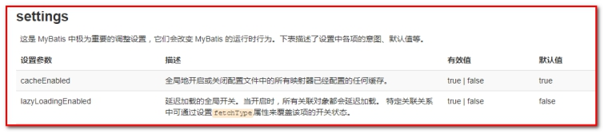 

```xml
<settings>
    <!--开启二级缓存-->
    <setting name="cacheEnabled" value="true"/>
</settings>
```


第二步：配置UserDao.java

```java
@CacheNamespace(blocking = true) // 使用二级缓存
public interface UserDao {
}
```

 

再次测试，发现二级缓存可以使用。

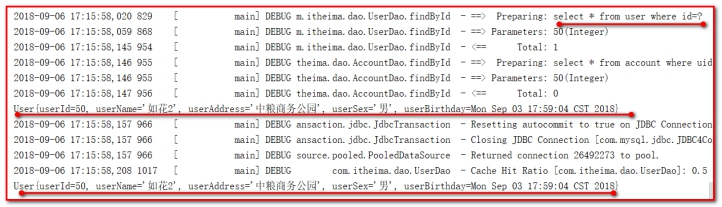 

 

 