Spring第1天笔记

# 第1章 课程计划。

学习spring：IOC（XML+注解）和AOP（XML+注解），spring整合第三方框架，轻量级

spring共四天

第一天：spring框架的概述以及spring中基于XML的IOC配置和DI

第二天：spring中基于注解的IOC、DI和ioc的案例（查询数据库：DButils）

第三天：spring中的aop和基于XML以及注解的AOP配置

第四天：spring中的JdbcTemlate（hibernateTemplate）以及Spring事务控制（基于XML和注解）

\-----------------------------------------

1、spring的概述

​	spring是什么

​	spring的两大核心

​	spring的发展历程和优势

​	spring体系结构

2、程序的耦合及解耦

​	曾经案例中问题

​	工厂模式解耦

3、IOC概念和spring中的IOC（控制反转）（重点）

​	spring中基于XML的IOC环境搭建

4、依赖注入DI（Dependency Injection）（重点）

 

 今日学习目标：

1：能够理解spring的IOC的容器（第3章）

2：能够编写spring的IOC的入门案例（第4章）

3：能够说出spring的bean标签的配置（第4章4.2）

4：能够理解Bean的实例化方法（第4章4.3）

5：能够理解Bean的属性注入方法（第5章）

6：能够理解复杂类型的属性注入（第5章5.5）

 

# 第2章 Spring概述  

 

## 2.1  Spring概述[了解] 

 

### 2.1.1  spring是什么 

Spring是分层的Java SE/EE应用 full-stack轻量级开源框架，以IoC（Inverse Of Control：反转控制）和AOP（Aspect Oriented Programming：面向切面编程）为内核，提供了展现层Spring MVC和持久层Spring JDBC以及业务层事务管理等众多的企业级应用技术，还能整合开源世界众多著名的第三方框架和类库，逐渐成为使用最多的Java EE企业应用开源框架。 

什么是一站式开发：

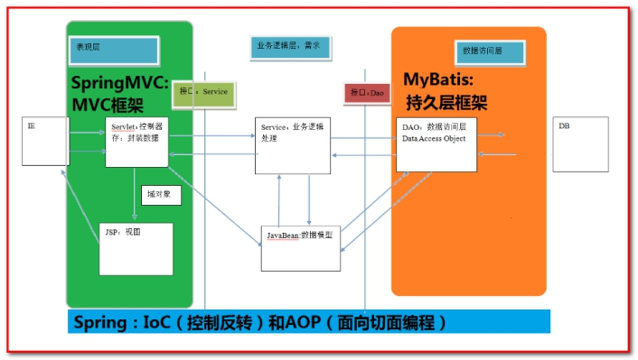 

 

### 2.1.2  Spring的发展历程 

1997年IBM提出了EJB的思想 

1998年，SUN制定开发标准规范EJB1.0 

1999年，EJB1.1发布 

2001年，EJB2.0发布 

2003年，EJB2.1发布 

2006年，EJB3.0发布 

Rod Johnson（spring之父） 

Expert One-to-One J2EE Design and Development(2002) 

阐述了J2EE使用EJB开发设计的优点及解决方案 

Expert One-to-One J2EE Development without EJB(2004) 

阐述了J2EE开发不使用EJB的解决方式（Spring雏形） 

2017年9月份发布了spring的最新版本spring 5.0通用版（GA） 


### 2.1.3  spring的优势 

1：方便解耦，简化开发 （工厂模式）

通过Spring提供的IoC容器，可以将对象间的依赖关系交由Spring进行控制，避免硬编码所造成的过度程序耦合。用户也不必再为单例模式类、属性文件解析等这些很底层的需求编写代码，可以更专注于上层的应用。 

2：AOP编程的支持 （jdk动态代理、cglib动态代理）

通过Spring的AOP功能，方便进行面向切面的编程，许多不容易用传统OOP实现的功能可以通过AOP轻松应付。 

声明式事务的支持可以将我们从单调烦闷的事务管理代码中解脱出来，通过声明式方式灵活的进行事务的管理，提高开发效率和质量。 

3：方便程序的测试（和Junit整合） 

可以用非容器依赖的编程方式进行几乎所有的测试工作，测试不再是昂贵的操作，而是随手可做的事情。 

4：方便集成各种优秀框架 

Spring可以降低各种框架的使用难度，提供了对各种优秀框架（Struts、Hibernate、Mybatis、Hessian、Quartz、ActivityMQ、Redis等）的直接支持。 

5：降低JavaEE API的使用难度 （SSM整合）

Spring对JavaEE API（如JDBC、JavaMail、远程调用等）进行了薄薄的封装层，使这些API的使用难度大为降低。 

Java源码是经典学习范例 

Spring的源代码设计精妙、结构清晰、匠心独用，处处体现着大师对Java设计模式灵活运用以及对Java技术的高深造诣。它的源代码无意是Java技术的最佳实践的范例。 

 

### 2.1.4 spring的体系结构 

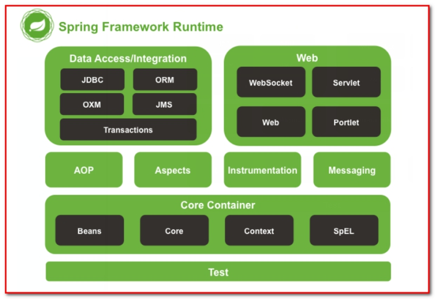 

 

# 第3章 IoC的概念和作用 

## 3.1 程序的耦合和解耦[理解] 

### 3.1.1 什么是程序的耦合（知道即可的知识） 

耦合性(Coupling)，也叫耦合度，是对模块间关联程度的度量。耦合的强弱取决于模块间接口的复杂性、调用模块的方式以及通过界面传送数据的多少。模块间的耦合度是指模块之间的依赖关系，包括控制关系、调用关系、数据传递关系。模块间联系越多，其耦合性越强，同时表明其独立性越差( 降低耦合性，可以提高其独立性)。

耦合性存在于各个领域，而非软件设计中独有的，但是我们只讨论软件工程中的耦合。 

在软件工程中，耦合指的就是就是对象之间的依赖性。对象之间的耦合越高，维护成本越高。因此对象的设计应使类和构件之间的耦合最小。软件设计中通常用耦合度和内聚度作为衡量模块独立程度的标准。划分模块的一个准则就是高内聚低耦合。 

它有如下分类：（了解） 

（1） 内容耦合。当一个模块直接修改或操作另一个模块的数据时，或一个模块不通过正常入口而转入另一个模块时，这样的耦合被称为内容耦合。内容耦合是最高程度的耦合，应该避免使用之。 

（2） 公共耦合。两个或两个以上的模块共同引用一个全局数据项，这种耦合被称为公共耦合。在具有大量公共耦合的结构中，确定究竟是哪个模块给全局变量赋了一个特定的值是十分困难的。 

（3） 外部耦合 。一组模块都访问同一全局简单变量而不是同一全局数据结构，而且不是通过参数表传递该全局变量的信息，则称之为外部耦合。 

（4） 控制耦合 。一个模块通过接口向另一个模块传递一个控制信号，接受信号的模块根据信号值而进行适当的动作，这种耦合被称为控制耦合。 

（5） 标记耦合 。若一个模块A通过接口向两个模块B和C传递一个公共参数，那么称模块B和C之间存在一个标记耦合。 

（6） 数据耦合。模块之间通过参数来传递数据，那么被称为数据耦合。数据耦合是最低的一种耦合形式，系统中一般都存在这种类型的耦合，因为为了完成一些有意义的功能，往往需要将某些模块的输出数据作为另一些模块的输入数据。 

（7） 非直接耦合 。两个模块之间没有直接关系，它们之间的联系完全是通过主模块的控制和调用来实现的。 

总结： 

耦合是影响软件复杂程度和设计质量的一个重要因素，在设计上我们应采用以下原则：如果模块间必须存在耦合，就尽量使用数据耦合，少用控制耦合，限制公共耦合的范围，尽量避免使用内容耦合。 

内聚与耦合 

内聚标志一个模块内各个元素彼此结合的紧密程度，它是信息隐蔽和局部化概念的自然扩展。内聚是从功能角度来度量模块内的联系，一个好的内聚模块应当恰好做一件事。它描述的是模块内的功能联系。耦合是软件结构中各模块之间相互连接的一种度量，耦合强弱取决于模块间接口的复杂程度、进入或访问一个模块的点以及通过接口的数据。 程序讲究的是低耦合，高内聚。就是同一个模块内的各个元素之间要高度紧密，但是各个模块之间的相互依存度却要不那么紧密。 

内聚和耦合是密切相关的，同其他模块存在高耦合的模块意味着低内聚，而高内聚的模块意味着该模块同其他模块之间是低耦合。在进行软件设计时，应力争做到高内聚，低耦合。

 

我们在开发中，有些依赖关系是必须的，有些依赖关系可以通过优化代码来解除的。 

请看下面的示例代码： 

```java
/** 
* 账户的业务层实现类 
*/ 
public class AccountServiceImpl implements IAccountService { 
private AccountDao accountDao = new AccountDaoImpl(); 
} 
```


上面的代码表示： 

业务层调用持久层，并且此时业务层在依赖持久层的接口和实现类。如果此时没有持久层实现类，编译将不能通过。这种编译期依赖关系，应该在我们开发中杜绝。我们需要优化代码解决。 

```java
/** 
* 账户的业务层实现类 
*/ 
public class AccountServiceImpl implements IAccountService { 
private AccountDao accountDao;

public void setAccountDao(AccountDao accountDao){
    this.accountDao = accountDao;
} 
} 
```


再比如： 

早期我们的JDBC操作，注册驱动时，我们为什么不使用DriverManager的register方法，而是采用Class.forName的方式？ 

```java
public class JdbcDemo1 { 
/** 
*/ 
public static void main(String[] args) throws Exception { 
//1.注册驱动 
//DriverManager.registerDriver(new com.mysql.jdbc.Driver()); 
Class.forName("com.mysql.jdbc.Driver"); 
//2.获取连接 
//3.获取预处理sql语句对象 
//4.获取结果集 
//5.遍历结果集 
} 
} 
```


原因就是： 

我们的类依赖了数据库的具体驱动类（MySQL），如果这时候更换了数据库品牌（比如Oracle），需要修改源码来重新数据库驱动。这显然不是我们想要的。 

#### 3.1.1.1 【案例一：使用反射技术创建JDBC连接】

第一步：创建工程：

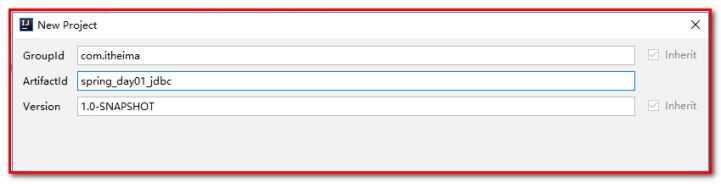 

 

第二步：导入maven坐标，pom.xml

````
<dependencies>
    <dependency>
        <groupId>mysql</groupId>
        <artifactId>mysql-connector-java</artifactId>
        <version>5.1.6</version>
    </dependency>
</dependencies>
````


第三步：创建数据库和表

创建数据库

itcastspring

创建表

```sql
create table account(
	id int primary key auto_increment,
	name varchar(40),
	money float
)character set utf8 collate utf8_general_ci;

insert into account(name,money) values('aaa',1000);
insert into account(name,money) values('bbb',1000);
insert into account(name,money) values('ccc',1000);
```


第四步：创建JdbcDemo1.java，测试连接数据库

```
/**
 * 程序的耦合
 *      耦合：程序间的依赖关系
 *          包括：
 *              类之间的依赖
 *              方法间的依赖
 *      解耦：
 *          降低程序间的依赖关系
 *      实际开发中：
 *          应该做到：编译期不依赖，运行时才依赖。
 *      解耦的思路：
 *          第一步：使用反射来创建对象，而避免使用new关键字。
 *          第二步：通过读取配置文件来获取要创建的对象全限定类名
 *
 */
public class JdbcDemo1 {
    public static void main(String[] args) throws  Exception{
        //1.注册驱动
//        DriverManager.registerDriver(new com.mysql.jdbc.Driver());
        Class.forName("com.mysql.jdbc.Driver");

        //2.获取连接
        Connection conn = DriverManager.getConnection("jdbc:mysql://localhost:3306/itcastspring","root","root");
        //3.获取操作数据库的预处理对象
        PreparedStatement pstm = conn.prepareStatement("select * from account");
        //4.执行SQL，得到结果集
        ResultSet rs = pstm.executeQuery();
        //5.遍历结果集
        while(rs.next()){
            System.out.println(rs.getString("name"));
        }
        //6.释放资源
        rs.close();
        pstm.close();
        conn.close();
    }
}
```


#### 3.1.1.2 【案例二：使用工厂模式+反射技术创建对象】

第一步：创建工程：

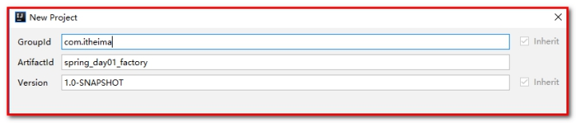 

第二步：创建包com.itheima.dao，创建接口AccountDao.java

```java
/**
 * 账户的持久层接口
 */
public interface AccountDao {

    /**
     * 模拟保存账户
     */
    void saveAccount();
}
```


创建包com.itheima.dao.impl创建类AccountDaoImpl.java实现接口AccountDao.java

```
/**
 * 账户的持久层实现类
 */
public class AccountDaoImpl implements AccountDao {

    public void saveAccount(){

        System.out.println("保存账户");
    }
}
```


第三步：创建com.itheima.service，创建接口AccountService.java

```java
/**
 * 账户业务层的接口
 */
public interface AccountService {

    /**
     * 模拟保存账户
     */
    void saveAccount();
}
```


创建包com.itheima.service.impl，创建接口的实现类AccountServiceImpl.java

```java
/**
 * 账户的业务层实现类
 */
public class AccountServiceImpl implements AccountService {


    private int i = 1; // 单例模式会改变全局变量

    public void  saveAccount(){
//  private AccountDao accountDao = new AccountDaoImpl();
        private AccountDao accountDao = (AccountDao)BeanFactory.getBean("accountDao");
        // int i = 1; // 单例模式需要设置局部变量
        accountDao.saveAccount();
        System.out.println(i);
        i++;
    }
}
```


第四步：创建com.itheima.ui，创建类Client.java，表示表现层

```java
/**
 * 模拟一个表现层，用于调用业务层
 */
public class Client {

    public static void main(String[] args) {
        //AccountService as = new AccountServiceImpl();
        for(int i=0;i<5;i++) {
            AccountService as = (AccountService) BeanFactory.getBean("accountService");
            System.out.println(as);
            as.saveAccount();
        }

    }
}
```

 

第五步：在resource下，创建bean.properties

```properties
accountService=com.itheima.service.impl.AccountServiceImpl
accountDao=com.itheima.dao.impl.AccountDaoImpl
```

第六步：创建工厂类，用来创建对象

创建包com.itheima.factory，创建类BeanFactory.java

```java
/**
 * 一个创建Bean对象的工厂
 *
 * Bean：在计算机英语中，有可重用组件的含义。
 * JavaBean：用java语言编写的可重用组件。
 *      javabean -->  实体类
 *
 *   它就是创建我们的service和dao对象的。
 *
 *   第一个：需要一个配置文件来配置我们的service和dao
 *           配置的内容：唯一标识=全限定类名（key=value)
 *   第二个：通过读取配置文件中配置的内容，反射创建对象
 *
 *   我的配置文件可以是xml也可以是properties
 */
public class BeanFactory {
    //定义一个Properties对象
    private static Properties props;

    //定义一个Map,用于存放我们要创建的对象。我们把它称之为容器
    private static Map<String,Object> beans;

    //使用静态代码块为Properties对象赋值
    static {
        try {
            //实例化对象
            props = new Properties();
            //获取properties文件的流对象
            InputStream in = BeanFactory.class.getClassLoader().getResourceAsStream("bean.properties");
            props.load(in);
            //实例化容器
            beans = new HashMap<String,Object>();
            //取出配置文件中所有的Key
            Enumeration keys = props.keys();
            //遍历枚举
            while (keys.hasMoreElements()){
                //取出每个Key
                String key = keys.nextElement().toString();
                //根据key获取value
                String beanPath = props.getProperty(key);
                //反射创建对象
                Object value = Class.forName(beanPath).newInstance();
                //把key和value存入容器中
                beans.put(key,value);
            }
        }catch(Exception e){
            throw new ExceptionInInitializerError("初始化properties失败！");
        }
    }

    /**
     * 根据bean的名称获取对象（单例）
     * @param beanName
     * @return
     */
    public static Object getBean(String beanName){
        return beans.get(beanName);
    }

    /**
     * 根据Bean的名称获取bean对象（多例）
     * @param beanName
     * @return

    public static Object getBean(String beanName){
    Object bean = null;
    try {
    String beanPath = props.getProperty(beanName);
    //            System.out.println(beanPath);
    bean = Class.forName(beanPath).newInstance();//每次都会调用默认构造函数创建对象
    }catch (Exception e){
    e.printStackTrace();
    }
    return bean;
    }*/
}
```

 

### 3.1.2 解决程序耦合的思路一：反射 

当是我们讲解jdbc时，是通过反射来注册驱动的，代码如下： 

```java
Class.forName("com.mysql.jdbc.Driver");//此处只是一个字符串 
```

此时的好处是，我们的类中不再依赖具体的驱动类，此时就算删除mysql的驱动jar包，依然可以编译（运行就不要想了，没有驱动不可能运行成功的）。 

同时，也产生了一个新的问题，mysql驱动的全限定类名字符串是在java类中写死的，一旦要改还是要修改源码。 

解决这个问题也很简单，使用配置文件配置（xml或者是properties）。 

 

### 3.1.3 解决程序耦合的思路二：工厂模式解耦 

在实际开发中我们可以把三层的对象都使用配置文件配置起来，当启动服务器应用加载的时候，让一个类中的方法通过读取配置文件，把这些对象同时创建出来并存起来。在接下来的使用的时候，直接拿过来用就好了。 

那么，这个读取配置文件，创建和获取三层对象的类就是工厂。 

 

### 3.1.4 控制反转-Inversion Of Control 

上一小节解耦的思路有2个问题： 

1、存哪去？ 

分析：由于我们是很多对象，肯定要找个集合来存。这时候有Map和List供选择。 

到底选Map还是List就看我们有没有查找需求。因为有查找需求，选Map。 

所以我们的答案就是在应用加载时，创建一个Map，用于存放三层对象。 

我们把这个map称之为容器。 

2、还是没解释什么是工厂？ 

工厂就是负责给我们从容器中获取指定对象的类。这时候我们获取对象的方式发生了改变。而不是我们在程序中去new对象，而是通过工厂去创建对象，并且通过工厂去获取对象。 

原来： 

我们在获取对象时，都是采用new的方式。是主动的

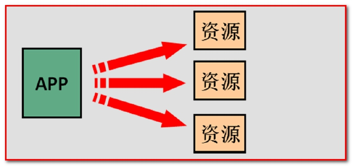 

现在： 

我们获取对象时，同时跟工厂要，有工厂为我们查找或者创建对象。是被动的。 

 

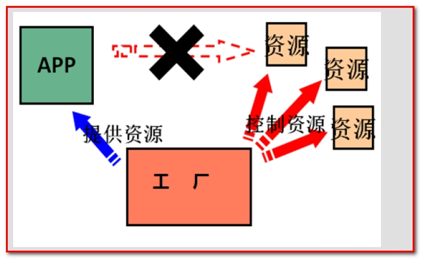 

这种被动接收的方式获取对象的思想就是控制反转（IOC），它是spring框架的核心之一。

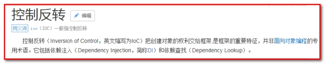 

明确ioc的作用： 削减计算机程序的耦合(解除我们代码中的依赖关系)，将对象的创建和调用都交给spring容器去处理。

 

# 第4章 使用spring的IOC解决程序耦合 

官网：http://spring.io/ 

下载地址： 

http://repo.springsource.org/libs-release-local/org/springframework/spring 

解压:(Spring目录结构:) 

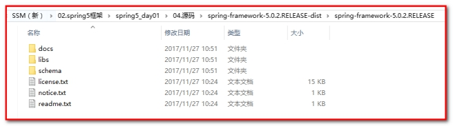 

\* docs :API和开发规范. 

\* libs :jar包和源码. 

\* schema :约束. 

 

## 4.1  IOC入门

第一步：创建工程

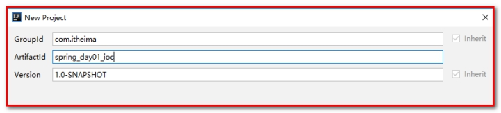 

第二步：导入spring的依赖包

```java
<?xml version="1.0" encoding="UTF-8"?>
<project xmlns="http://maven.apache.org/POM/4.0.0"
         xmlns:xsi="http://www.w3.org/2001/XMLSchema-instance"
         xsi:schemaLocation="http://maven.apache.org/POM/4.0.0 http://maven.apache.org/xsd/maven-4.0.0.xsd">
    <modelVersion>4.0.0</modelVersion>

    <groupId>com.itheima</groupId>
    <artifactId>spring_day01_ioc</artifactId>
    <version>1.0-SNAPSHOT</version>

    <dependencies>
        <dependency>
            <groupId>org.springframework</groupId>
            <artifactId>spring-context</artifactId>
            <version>5.0.2.RELEASE</version>
        </dependency>
    </dependencies>
</project>
```

 

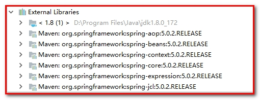 

第三步：创建Dao

创建接口AccountDao.java

```java
/**
 * 账户的持久层接口
 */
public interface AccountDao {

    /**
     * 模拟保存账户
     */
    void saveAccount();
}
```


创建实现类AccountDaoImpl.java

```java
/**
 * 账户的持久层实现类
 */
public class AccountDaoImpl implements AccountDao {

    public  void saveAccount(){
        System.out.println("AccountDaoImpl 保存了账户");
    }
}
```


第四步：创建Service

创建接口AccountService.java

```java
/**
 * 账户业务层的接口
 */
public interface AccountService {

    /**
     * 模拟保存账户
     */
    void saveAccount();
}
```

 

创建接口的实现类AccountServiceImpl.java

```java
/**
 * 账户的业务层实现类
 */
public class AccountServiceImpl implements AccountService {

    private AccountDao accountDao ;

    public AccountServiceImpl(){
        System.out.println("对象创建了");
    }

    public void  saveAccount(){
System.out.println("AccountServiceImpl 保存了账户");
        accountDao.saveAccount();
    }
}
```

 

第五步：在resource下创建applicationContext.xml

````java
<?xml version="1.0" encoding="UTF-8"?>
<beans xmlns="http://www.springframework.org/schema/beans"
       xmlns:xsi="http://www.w3.org/2001/XMLSchema-instance"
       xsi:schemaLocation="http://www.springframework.org/schema/beans
        http://www.springframework.org/schema/beans/spring-beans.xsd">

    <!--把对象的创建交给spring来管理-->
    <bean id="accountService" class="com.itheima.service.impl.AccountServiceImpl"></bean>

    <bean id="accountDao" class="com.itheima.dao.impl.AccountDaoImpl"></bean>
</beans>
````

 

第六步：ApplicationContext接口对象

参考：ApplicationContext和ClassPathXmlApplicationContext、FileSystemXmlApplicationContex的关系。

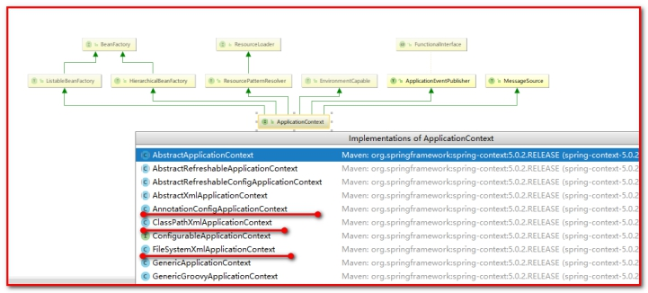 

【图例】

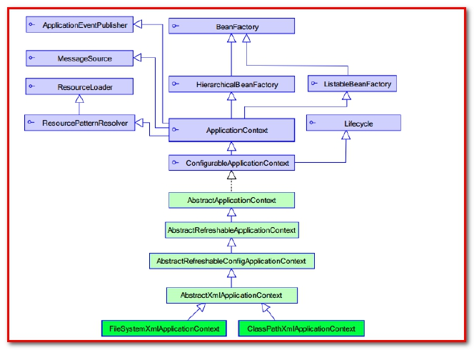 

【BeanFactory 和ApplicationContext 的区别 】（了解）

BeanFactory 才是Spring 容器中的顶层接口。

ApplicationContext 是它的子接口。

BeanFactory 和ApplicationContext 的区别：

创建的方式都表示单例对象。

创建对象的时间点不一样。

ApplicationContext：只要一读取配置文件，默认情况下就会创建对象。（立即加载）

BeanFactory：什么时候使用什么时候创建对象。（延迟加载）

【ApplicationContext 接口的实现类 】

（1）ClassPathXmlApplicationContext： （重点）

它是从类的根路径下加载配置文件 推荐使用这种 

（2）FileSystemXmlApplicationContext： 

它是从磁盘路径上加载配置文件，配置文件可以在磁盘的任意位置。 

（3）AnnotationConfigApplicationContext: （第2天讲）

当我们使用注解配置容器对象时，需要使用此类来创建spring 容器。它用来读取注解。 

测试类：

````
/**
 * 模拟一个表现层，用于调用业务层
 */
public class Client {

    // 模拟Action

//    /**
//     * 测试由ApplicationContext对象获取spring容器中创建的对象
//     * @param args
//     */
//    public static void main(String[] args) {
//        // 代码之间存在依赖关系（耦合）
//        // AccountService accountService = new AccountServiceImpl();
//        // 由spring创建对象（完成对象的解耦）
//        ApplicationContext ac = new ClassPathXmlApplicationContext("applicationContext.xml");
//        // 通过名称调用（通过spring容器中的id属性）(推荐）
//        AccountService accountService = (AccountService) ac.getBean("accountService");
//        // 通过类型调用（通过spring容器中的class属性）
//        // AccountService accountService = ac.getBean(AccountServiceImpl.class);
//        accountService.saveAccount();
//    }

    /**
     * 测试BeanFactory和ApplicationContext之间的区别
     *
     * ApplicationContext：只要一读取配置文件，默认情况下就会创建对象。（立即加载）
       BeanFactory：什么时候使，用什么时候创建对象。（延迟加载）
     */
//    public static void main(String[] args) {
//        // 使用ApplicationContext创建对象默认是单例（只要加载spring容器，对象会立即创建，叫做立即检索）
//        // ApplicationContext ac = new ClassPathXmlApplicationContext("applicationContext.xml");
//        // 使用BeanFactory创建对象默认是单例（当加载spring容器的时候，不会执行构造方法，对象不会立即创建，只要调用getBean的方法，对象才会创建，叫做延迟检索）
//        BeanFactory ac = new XmlBeanFactory(new ClassPathResource("applicationContext.xml"));
//        AccountService accountService = (AccountService) ac.getBean("accountService");
//        System.out.println(accountService);
//
//        AccountService accountService1 = (AccountService) ac.getBean("accountService");
//        System.out.println(accountService1);
//    }

    /**
     * 【ApplicationContext 接口的实现类 】
     （1）ClassPathXmlApplicationContext：
     它是从类的根路径下加载配置文件 推荐使用这种
     （2）FileSystemXmlApplicationContext：
     它是从磁盘路径上加载配置文件，配置文件可以在磁盘的任意位置。注意磁盘的权限
     （3）AnnotationConfigApplicationContext:
     当我们使用注解配置容器对象时，需要使用此类来创建spring 容器。它用来读取注解。
     */
    public static void main(String[] args) {
        // 测试ClassPathXmlApplicationContext
        // ApplicationContext ac = new ClassPathXmlApplicationContext("applicationContext.xml");
        // 测试FileSystemXmlApplicationContext
        ApplicationContext ac =  new FileSystemXmlApplicationContext("d:/applicationContext.xml");
        AccountService accountService = (AccountService) ac.getBean("accountService");
        System.out.println(accountService);
        AccountService accountService1 = (AccountService) ac.getBean("accountService");
        System.out.println(accountService1);
    }
}
````


## 4.2  id和name的配置（了解）

id中不能出现特殊字符（容器中的唯一标识），name中可以出现特殊的字符（表示引用）。

可以指定多个name，之间可以用分号（“；”）、空格（“ ”）或逗号（“，”）分隔开，如果没有指定id，那么第一个name为标识符，其余的为别名； 若指定了id属性，则id为标识符，所有的name均为别名。如：

```xml
<bean name="alias1 alias2;alias3,alias4" id="hello1" class="com.zyh.spring3.hello.HelloWorld"> </bean> 
```


此时，hello1为标识符，而alias1，alias2，alias3，alias4为别名，它们都可以作为Bean的键值；

## 4.3  实例化Bean的三种方式 

创建工程

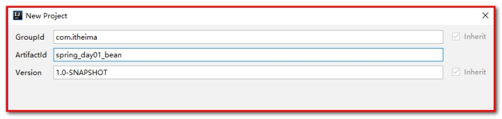 

导入坐标：pom.xml

```xml
<dependencies>
    <dependency>
        <groupId>org.springframework</groupId>
        <artifactId>spring-context</artifactId>
        <version>5.0.2.RELEASE</version>
    </dependency>
</dependencies>
```


创建包，com.itheima.service，创建接口AccountServiceImpl.java

```java
/**
 * 账户业务层的接口
 */
public interface AccountService {

    /**
     * 模拟保存账户
     */
    void saveAccount();
}
```

 

创建包com.itheima.service.impl，创建接口的实现类AccountService.java

```java
/**
 * 账户的业务层实现类
 */
public class AccountServiceImpl implements AccountService {

    public AccountServiceImpl(){
        System.out.println("对象创建了");
    }

    public void  saveAccount(){
        System.out.println("service中的saveAccount方法执行了。。。");
    }

}
```

 

测试类：Client.java

```java
public class Client {
    public static void main(String[] args) {
        //1.获取核心容器对象
        ApplicationContext ac = new ClassPathXmlApplicationContext("applicationContext.xml");
        //2.根据id获取Bean对象
        AccountService as  = (AccountService)ac.getBean("accountService");
        as.saveAccount();
    }
}
```


- 第一种：采用无参数的构造方法方式实例化（用的最多）

applicationContext.xml

```xml
<!--创建Bean的三种方式 -->
<!-- 第一种方式：使用默认构造函数创建。
        在spring的配置文件中使用bean标签，配以id和class属性之后，且没有其他属性和标签时。
        采用的就是默认构造函数创建bean对象，此时如果类中没有默认构造函数，则对象无法创建。
-->
<bean id="accountService" class="com.itheima.service.impl.AccountServiceImpl"></bean>
```


需要无参的构造方法

```java
public class AccountServiceImpl implements AccountService {
    //可以不写，默认就是无参构造
    public AccountServiceImpl(){
        System.out.println("对象创建了");
    }
}
```


-  第二种：采用静态工厂实例化的方式

applicationContext.xml

```
<!-- 第二种方式：使用工厂中的静态方法创建对象（使用某个类中的静态方法创建对象，并存入spring容器) -->
<bean id="accountService" class="com.itheima.factory.StaticFactory" factory-method="getAccountService"></bean>
```

AccountServiceImpl.java

```
public class AccountServiceImpl implements AccountService {

}
```


StaticFactory.java，静态工厂类

```java
/**
 * 模拟一个工厂类（该类可能是存在于jar包中的，我们无法通过修改源码的方式来提供默认构造函数）
 */
public class StaticFactory {

    public static AccountService getAccountService(){
        return new AccountServiceImpl();
    }
}
```

 

- 第三种：采用实例工厂（非静态的）实例化的方式

applicationContext.xml

```xml
<!-- 第三种方式： 使用普通工厂中的方法创建对象（使用某个类中的方法创建对象，并存入spring容器） -->
<bean id="instanceFactory" class="com.itheima.factory.InstanceFactory"></bean>
<bean id="accountService" factory-bean="instanceFactory" factory-method="getAccountService"></bean>
```


AccountServiceImpl.java

```java
public class AccountServiceImpl implements AccountService {

}
```


InstanceFactory.java

````java
/**
 * 模拟一个工厂类（该类可能是存在于jar包中的，我们无法通过修改源码的方式来提供默认构造函数）
 */
public class InstanceFactory {

    public AccountService getAccountService(){
        return new AccountServiceImpl();
    }
}
````

总结：第一种无参构造的方式用的最多，第二种和第三种一般是调用spring底层写好类的时候会用到。

## 4.4  Bean的作用访问的配置：scope的配置

Spring创建这个类的时候，默认采用的单例的模式进行创建的。如果想去改变单例模式，需要通过scope进行配置。

Scope属性中有以下几个取值:

-  singleton			：默认值，单例的。
-  prototype		    ：多例的。
-  request			：应用在web应用中，将创建的对象存入到request域中。
-  session			：应用在web应用中，将创建的对象存入到session域中。
-  globalsession		：应用在集群环境下使用。将创建的对象存入到全局的session中。

什么是globalsession（了解即可）？

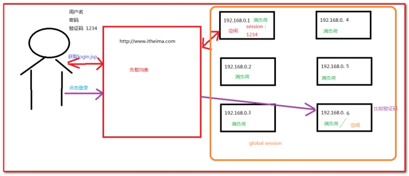 

applicationContext.xml中的配置

```xml
<!-- bean的作用范围调整
    bean标签的scope属性：
        作用：用于指定bean的作用范围
        取值： 常用的就是单例的和多例的
            singleton：单例的（默认值）
            prototype：多例的
            request：作用于web应用的请求范围
            session：作用于web应用的会话范围
            global-session：作用于集群环境的会话范围（全局会话范围），当不是集群环境时，它就是session
-->
<bean id="accountService" class="com.itheima.service.impl.AccountServiceImpl" scope="prototype"></bean>
```


## 4.5  Bean的生命周期的配置

单例对象
    出生：当容器创建时对象出生
    活着：只要容器还在，对象一直活着
    死亡：容器销毁，对象消亡
    总结：单例对象的生命周期和容器相同
多例对象
    出生：当我们使用对象时spring框架为我们创建
    活着：对象只要是在使用过程中就一直活着。
    死亡：当对象长时间不用，且没有别的对象引用时，由Java的垃圾回收器回收

​    总结：多例对象的生命周期和对象是否被使用有关。与容器是否被销毁无关。

第一步：AccountServiceImpl.java

````java
/**
 * 账户的业务层实现类
 */
public class AccountServiceImpl implements AccountService {

    public AccountServiceImpl(){
        System.out.println("对象创建了");
    }

    public void  saveAccount(){
        System.out.println("service中的saveAccount方法执行了。。。");
    }

    public void  init(){
        System.out.println("对象初始化了。。。");
    }
    public void  destroy(){
        System.out.println("对象销毁了。。。");
    }

}
````

 

第二步：applicationContext.xml

```xml
<!-- bean对象的生命周期
                单例对象
                    出生：当容器创建时对象出生
                    活着：只要容器还在，对象一直活着
                    死亡：容器销毁，对象消亡
                    总结：单例对象的生命周期和容器相同
                多例对象
                    出生：当我们使用对象时spring框架为我们创建
                    活着：对象只要是在使用过程中就一直活着。
                    死亡：当对象长时间不用，且没有别的对象引用时，由Java的垃圾回收器回收
                    总结：多例对象的声明周期和对象是否被使用有关
                -->
<bean id="accountService" class="com.itheima.service.impl.AccountServiceImpl"
      scope="singleton" init-method="init" destroy-method="destroy"></bean>
```


第三步：Client.java测试：

```java
/**
 * 模拟一个表现层，用于调用业务层
 */
public class Client {

    /**
     *
     * @param args
     */
    public static void main(String[] args) {
        //1.获取核心容器对象
        ClassPathXmlApplicationContext ac = new ClassPathXmlApplicationContext("applicationContext.xml");
        //2.根据id获取Bean对象
        AccountService as  = (AccountService)ac.getBean("accountService");
        as.saveAccount();

        //手动关闭容器（单例的时候，关闭才有效果）
        ac.close();
    }
}
```

 

总结：开发场景

单例（常用）：一般创建对象单例（例如Service对象、Dao对象，数据源的对象...）

多例：如果spring创建数据库连接对象Connection（每个线程使用的数据库连接对象是不同的，保证线程安全）

​      Struts2（本身多实例，多线程），如果spring创建struts2的对象，一定是多例（了解）

# 第5章 spring的依赖注入（DI） 

 

依赖注入：Dependency Injection。它是spring框架核心ioc的具体实现。 

我们的程序在编写时，通过控制反转，把对象的创建交给了spring，但是代码中不可能出现没有依赖的情况。ioc解耦只是降低他们的依赖关系，但不会消除。例如：我们的业务层仍会调用持久层的方法。 

```java
public class AccountServiceImpl implements AccountService {

    AccountDao accountDao = new AccountDaoImpl();
}
```


那这种业务层和持久层的依赖关系，在使用spring之后，就让spring来维护了。 

简单的说，就是坐等框架把持久层对象传入业务层，而不用我们自己去获取。 这就是依赖注入。
 	依赖注入：
     能注入的数据：有三类
        （1）基本类型和String类型（值的注入）
        （2）其他bean对象类型（在配置文件中或者注解配置过的bean）（对象的注入）
        （3）复杂类型/集合类型（集合的注入）
     能注入的方式：有三种
        （1）第一种：使用构造函数提供
        （2）第二种：使用set方法提供（使用p名称空间注入）（用的最多）
        （3）第三种：使用注解提供（明天的内容）

 

## 5.1  准备工作

创建工程

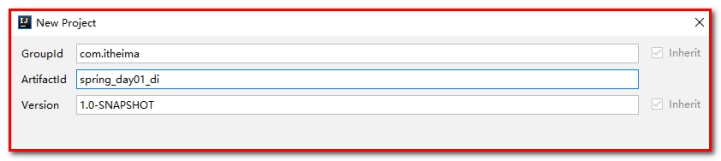 

导入坐标，pom.xml

```xml
<dependencies>
    <dependency>
        <groupId>org.springframework</groupId>
        <artifactId>spring-context</artifactId>
        <version>5.0.2.RELEASE</version>
    </dependency>
</dependencies>
```


创建包com.itheima.service，创建接口AccountService.java

```java
/**
 * 账户业务层的接口
 */
public interface AccountService {

    /**
     * 模拟保存账户
     */
    void saveAccount();
}
```


创建包com.itheima.service.impl，创建接口的实现类AccountServiceImpl.java

```java
/**
 * 账户的业务层实现类
 */
public class AccountServiceImpl implements AccountService {

    private String name;
    private Integer age;
    private Date birthday;

    public void  saveAccount(){
        System.out.println("service中的saveAccount方法执行了。。。"+name+","+age+","+birthday);
    }
}
```

 

## 5.2  构造函数注入 

第一步：AccountServiceImpl.java提供传递参数的构造方法。

```java
/**
 * 账户的业务层实现类
 */
public class AccountServiceImpl implements AccountService {

    //如果是经常变化的数据，并不适用于注入的方式
    private String name;
    private Integer age;
    private Date birthday;

    public AccountServiceImpl(){

    }

    public AccountServiceImpl(String name,Integer age,Date birthday){
        this.name = name;
        this.age = age;
        this.birthday = birthday;
    }

    public void  saveAccount(){
        System.out.println("service中的saveAccount方法执行了。。。"+name+","+age+","+birthday);
    }


}
```


第二步：applicationContext.xml

```xml
<!--构造函数注入：
    使用的标签:constructor-arg
    标签出现的位置：bean标签的内部
    标签中的属性
        type：用于指定要注入的数据的数据类型，该数据类型也是构造函数中某个或某些参数的类型
        index：用于指定要注入的数据给构造函数中指定索引位置的参数赋值。索引的位置是从0开始
        name：用于指定给构造函数中指定名称的参数赋值                                        常用的
        =============以上三个用于指定给构造函数中哪个参数赋值===============================
        value：用于提供基本类型和String类型的数据
        ref：用于指定其他的bean类型数据。它指的就是在spring的Ioc核心容器中出现过的bean对象

    优势：
        在获取bean对象时，注入数据是必须的操作，否则对象无法创建成功。
    弊端：
        改变了bean对象的实例化方式，使我们在创建对象时，如果用不到这些数据，也必须提供。
-->
<bean id="accountService" class="com.itheima.service.impl.AccountServiceImpl">
    <constructor-arg name="name" value="泰斯特"></constructor-arg>
    <constructor-arg name="age" value="18"></constructor-arg>
    <constructor-arg name="birthday" ref="now"></constructor-arg>
</bean>

<!-- 配置一个日期对象 -->
<bean id="now" class="java.util.Date"></bean>
```


第三步：测试类Client.java

```java
/**
 * 模拟一个表现层，用于调用业务层
 */
public class Client {


    public static void main(String[] args) {
        //1.获取核心容器对象
        ApplicationContext ac = new ClassPathXmlApplicationContext("applicationContext.xml");
        //2.根据id获取Bean对象
        AccountService as  = (AccountService)ac.getBean("accountService");
        as.saveAccount();

    }
}
```

## 5.3  set方法注入 （推荐使用）

第一步：AccountServiceImpl2.java提供属性的set方法。

````java
/**
 * 账户的业务层实现类
 */
public class AccountServiceImpl2 implements AccountService {

    //如果是经常变化的数据，并不适用于注入的方式
    private String name;
    private Integer age;
    private Date birthday;

    public void setName(String name) {
        this.name = name;
    }

    public void setAge(Integer age) {
        this.age = age;
    }

    public void setBirthday(Date birthday) {
        this.birthday = birthday;
    }

    public void  saveAccount(){
        System.out.println("service中的saveAccount方法执行了。。。"+name+","+age+","+birthday);
    }


}
````


第二步：applicationContext.xml

```xml
<!-- set方法注入                更常用的方式
    涉及的标签：property
    出现的位置：bean标签的内部
    标签的属性
        name：用于指定注入时所调用的set方法名称
        value：用于提供基本类型和String类型的数据
        ref：用于指定其他的bean类型数据。它指的就是在spring的Ioc核心容器中出现过的bean对象
    优势：
        1：使用set方法创建对象时没有明确的限制，可以直接使用默认构造函数；
2：使用set方法注入值或者对象，需要哪个属性只需要注入哪个属性
-->
<bean id="accountService2" class="com.itheima.service.impl.AccountServiceImpl2">
    <property name="name" value="小明" ></property>
    <property name="age" value="21"></property>
    <property name="birthday" ref="now"></property>
</bean>

<!-- 配置一个日期对象 -->
<bean id="now" class="java.util.Date"></bean>
```


第三步：测试类Client.java

```java
public class Client {


    public static void main(String[] args) {
        //1.获取核心容器对象
        ApplicationContext ac = new ClassPathXmlApplicationContext("applicationContext.xml");
        //2.根据id获取Bean对象
        AccountService as  = (AccountService)ac.getBean("accountService2");
        as.saveAccount();

    }
}
```


使用spring创建对象，并完成注入的时候，使用set方法比构造方法注入要简单实用。推荐使用set方法。

 

## 5.4  使用p名称空间注入数据（本质还是调用set方法） （了解）

p名称空间作用：简化set方法依赖注入

- 引入p名称空间

  ```xml
  <beans xmlns="http://www.springframework.org/schema/beans"
         xmlns:p="http://www.springframework.org/schema/p"
         xmlns:xsi="http://www.w3.org/2001/XMLSchema-instance"
         xsi:schemaLocation="http://www.springframework.org/schema/beans
      http://www.springframework.org/schema/beans/spring-beans.xsd">
  ```

  

- 使用p名称空间完成属性注入

语法：普通属性	p:属性名=””		对象类型  p:属性名-ref=””

```xml
<!--
   使用p空间完成注入
   语法：普通属性    p:属性名=””      对象类型  p:属性名-ref=””
-->
   <bean id="accountService2" class="com.itheima.service.impl.AccountServiceImpl2" p:name="小刚" p:age="25" p:birthday-ref="now"></bean>
   <!-- 配置一个日期对象 -->
   <bean id="now" class="java.util.Date"></bean>
```


这里注意：需要对属性提供set方法，方可实现注入。

 

## 5.5  注入集合属性（复杂类型） 

第一步：AccountServiceImpl3.java提供属性的set方法。

```java
/**
 * 账户的业务层实现类
 */
public class AccountServiceImpl3 implements AccountService {

    Object[] arrays;
    List<Object> list;
    Set<Object> set;
    Map<String,Object> map;
    Properties properties;

    public void setArrays(Object[] arrays) {
        this.arrays = arrays;
    }

    public void setList(List<Object> list) {
        this.list = list;
    }

    public void setSet(Set<Object> set) {
        this.set = set;
    }

    public void setMap(Map<String, Object> map) {
        this.map = map;
    }

    public void setProperties(Properties properties) {
        this.properties = properties;
    }

    public void saveAccount() {
        System.out.println("执行AccountServiceImpl中的saveAccount方法！ arrays:"+Arrays.toString(arrays)+"        list:"+list+"      set:"+set+"        map:"+map+"         properties"+properties);
    }
}
```


第二步：applicationContext.xml

```xml
<!-- 复杂类型的注入/集合类型的注入
    用于给List结构集合注入的标签：
        list array set
    用于个Map结构集合注入的标签:
        map  props
    结构相同，标签可以互换
-->
    <bean id="accountService3" class="com.itheima.service.impl.AccountServiceImpl3">
    <!--数组-->
    <!--在spring的集合注入中，array，list，set是可以通用的-->
    <property name="arrays">
        <set>
            <value>张三</value>
            <value>22</value>
            <ref bean="date"></ref>
        </set>
    </property>
    <!--list集合-->
    <property name="list">
        <set>
            <value>李四</value>
            <value>20</value>
            <ref bean="date"></ref>
        </set>
    </property>
    <!--set集合-->
    <property name="set">
        <set>
            <value>王五</value>
            <value>25</value>
            <ref bean="date"></ref>
        </set>
    </property>
    <!--map集合-->
    <property name="map">
        <map>
            <entry key="key001">
                <value>赵六</value>
            </entry>
            <entry key="key002" value="23"></entry>
            <entry key="key003">
                <ref bean="date"></ref>
            </entry>
        </map>
    </property>
    <!--properties集合，和map集合很相似，也是键值对，键和值只能是String-->
    <!--集合属性的应用场景：初始化系统中使用常量-->
    <property name="properties">
        <props>
            <prop key="driver">com.mysql.jdbc.Driver</prop>
            <prop key="url">jdbc:mysql:///itcastspring</prop>
            <prop key="username">root</prop>
            <prop key="password">root</prop>
        </props>
    </property>
</bean>

```


第三步：测试类Client.java

```java
public class Client {
    public static void main(String[] args) {
        //1.获取核心容器对象
        ApplicationContext ac = new ClassPathXmlApplicationContext("applicationContext.xml");
        //2.根据id获取Bean对象
        AccountService as  = (AccountService)ac.getBean("accountService3");
        as.saveAccount();
    }
}
```


## 5.6  在Service中，注入Dao

我们的业务层仍会调用持久层的方法。 

第一步：applicationContext.xml

````xml
<bean id="accountService" class="com.itheima.service.impl.AccountServiceImpl">
    <property name="accountDao" ref="accountDao"></property>
</bean>
<bean id="accountDao" class="com.itheima.dao.impl.AccountDaoImpl"></bean>
````


第二步：

```java
public class AccountServiceImpl implements AccountService {

    AccountDao accountDao;
    // 注入：set方法，构造方法
    public void setAccountDao(AccountDao accountDao) {
        this.accountDao = accountDao;
    }
}
```

