Spring第2天笔记

# 第1章 课程计划。

1、完善我们的account转账案例（spring 第2天）

2、分析转账案例中问题（事务）

3、回顾之前讲过的一个技术：动态代理（JDK）

4、动态代理另一种实现方式（CGLIB）

5、解决转账案例中的问题（使用代理）

6、AOP的概念

7、spring中的AOP相关术语

8、spring中基于XML和注解的AOP配置（五种通知）

今日学习目标：

1：能够理解AOP相关概念

2：能够说出AOP相关术语的含义（第5章,5.1.2）

3：能够应用AspectJ表达式语言（第5章，5.2.2）

4：能够编写Spring的AOP中不同通知的代码（第5章，5.3）（重点）

5：能够理解spring的AOP的注解（第5章，5.4）（重点）

 

# 第2章 转账案例 

【需求】：姓名为aaa的账号取出100元给姓名为bbb的账号

 

## 2.1  准备工作：

第一步：创建工程spring_day03_account

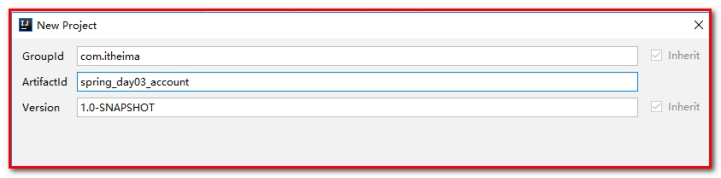 

第二步：导入坐标，pom.xml

```java
<?xml version="1.0" encoding="UTF-8"?>
<project xmlns="http://maven.apache.org/POM/4.0.0"
         xmlns:xsi="http://www.w3.org/2001/XMLSchema-instance"
         xsi:schemaLocation="http://maven.apache.org/POM/4.0.0 http://maven.apache.org/xsd/maven-4.0.0.xsd">
    <modelVersion>4.0.0</modelVersion>

    <groupId>com.itheima</groupId>
    <artifactId>spring_day03_account</artifactId>
    <version>1.0-SNAPSHOT</version>
    <packaging>jar</packaging>

    <dependencies>
        <dependency>
            <groupId>org.springframework</groupId>
            <artifactId>spring-context</artifactId>
            <version>5.0.2.RELEASE</version>
        </dependency>
        <dependency>
            <groupId>org.springframework</groupId>
            <artifactId>spring-test</artifactId>
            <version>5.0.2.RELEASE</version>
        </dependency>
        <dependency>
            <groupId>commons-dbutils</groupId>
            <artifactId>commons-dbutils</artifactId>
            <version>1.4</version>
        </dependency>

        <dependency>
            <groupId>mysql</groupId>
            <artifactId>mysql-connector-java</artifactId>
            <version>5.1.6</version>
        </dependency>

        <dependency>
            <groupId>c3p0</groupId>
            <artifactId>c3p0</artifactId>
            <version>0.9.1.2</version>
        </dependency>

        <dependency>
            <groupId>junit</groupId>
            <artifactId>junit</artifactId>
            <version>4.12</version>
        </dependency>
    </dependencies>

</project>
```


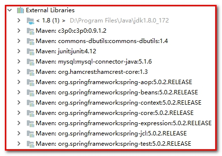 

第三步：创建com.itheima.domain

创建账号信息表

```java
/**
 * 账户的实体类
 */
public class Account implements Serializable {

    private Integer id;
    private String name;
    private Float money;
}
```


第四步：创建包com.itheima.dao，

创建接口AccountDao.java

```java
/**
 * 账户的持久层接口
 */
public interface AccountDao {

    /**
     * 查询所有
     * @return
     */
    List<Account> findAllAccount();

    /**
     * 查询一个
     * @return
     */
    Account findAccountById(Integer accountId);

    /**
     * 保存
     * @param account
     */
    void saveAccount(Account account);

    /**
     * 更新
     * @param account
     */
    void updateAccount(Account account);

    /**
     * 删除
     * @param acccountId
     */
    void deleteAccount(Integer acccountId);

    /**
     * 根据名称查询账户
     * @param accountName
     * @return  如果有唯一的一个结果就返回，如果没有结果就返回null
     *          如果结果集超过一个就抛异常
     */
    Account findAccountByName(String accountName);
}
```


创建实现类AccountDaoImpl.java

```java
/**
 * 账户的持久层实现类
 */
public class AccountDaoImpl implements AccountDao {

    private QueryRunner runner;

    public List<Account> findAllAccount() {
        try{
            return runner.query("select * from account",new BeanListHandler<Account>(Account.class));
        }catch (Exception e) {
            throw new RuntimeException(e);
        }
    }

    public Account findAccountById(Integer accountId) {
        try{
            return runner.query("select * from account where id = ? ",new BeanHandler<Account>(Account.class),accountId);
        }catch (Exception e) {
            throw new RuntimeException(e);
        }
    }

    public void saveAccount(Account account) {
        try{
            runner.update("insert into account(name,money)values(?,?)",account.getName(),account.getMoney());
        }catch (Exception e) {
            throw new RuntimeException(e);
        }
    }

    public void updateAccount(Account account) {
        try{
            runner.update("update account set name=?,money=? where id=?",account.getName(),account.getMoney(),account.getId());
        }catch (Exception e) {
            throw new RuntimeException(e);
        }
    }

    public void deleteAccount(Integer accountId) {
        try{
            runner.update("delete from account where id=?",accountId);
        }catch (Exception e) {
            throw new RuntimeException(e);
        }
    }

    public Account findAccountByName(String accountName) {
        try{
            List<Account> accounts = runner.query("select * from account where name = ? ",new BeanListHandler<Account>(Account.class),accountName);
            if(accounts == null || accounts.size() == 0){
                return null;
            }
            if(accounts.size() > 1){
                throw new RuntimeException("结果集不唯一，数据有问题");
            }
            return accounts.get(0);
        }catch (Exception e) {
            throw new RuntimeException(e);
        }
    }
}
```


第五步：创建com.itheima.service，创建接口AccountService.java

```java
/**
 * 账户的业务层接口
 */
public interface AccountService {

    /**
     * 查询所有
     * @return
     */
    List<Account> findAllAccount();

    /**
     * 查询一个
     * @return
     */
    Account findAccountById(Integer accountId);

    /**
     * 保存
     * @param account
     */
    void saveAccount(Account account);

    /**
     * 更新
     * @param account
     */
    void updateAccount(Account account);

    /**
     * 删除
     * @param acccountId
     */
    void deleteAccount(Integer acccountId);

    /**
     * 转账
     * @param sourceName        转出账户名称
     * @param targetName        转入账户名称
     * @param money             转账金额
     */
    void transfer(String sourceName, String targetName, Float money);
}
```


创建接口的实现类，AccountServiceImpl.java

````java
/**
 * 账户的业务层实现类
 *
 * 事务控制应该都是在业务层
 */
public class AccountServiceImpl implements AccountService {

    private AccountDao accountDao;

    public void setAccountDao(AccountDao accountDao) {
        this.accountDao = accountDao;
    }


    public List<Account> findAllAccount() {
        return accountDao.findAllAccount();
    }


    public Account findAccountById(Integer accountId) {
        return accountDao.findAccountById(accountId);

    }


    public void saveAccount(Account account) {
        accountDao.saveAccount(account);
    }


    public void updateAccount(Account account) {
        accountDao.updateAccount(account);
    }


    public void deleteAccount(Integer acccountId) {
        accountDao.deleteAccount(acccountId);
    }


    public void transfer(String sourceName, String targetName, Float money) {
        System.out.println("transfer....");
        //2.1根据名称查询转出账户
        Account source = accountDao.findAccountByName(sourceName);
        //2.2根据名称查询转入账户
        Account target = accountDao.findAccountByName(targetName);
        //2.3转出账户减钱
        source.setMoney(source.getMoney()-money);
        //2.4转入账户加钱
        target.setMoney(target.getMoney()+money);
        //2.5更新转出账户
        accountDao.updateAccount(source);

        int i=1/0;

        //2.6更新转入账户
        accountDao.updateAccount(target);
    }
}
````


第六步：配置applicationContext.xml

```xml
<?xml version="1.0" encoding="UTF-8"?>
<beans xmlns="http://www.springframework.org/schema/beans"
       xmlns:xsi="http://www.w3.org/2001/XMLSchema-instance"
       xsi:schemaLocation="http://www.springframework.org/schema/beans
        http://www.springframework.org/schema/beans/spring-beans.xsd">

    <!-- 配置Service -->
    <bean id="accountService" class="com.itheima.service.impl.AccountServiceImpl">
        <!-- 注入dao -->
        <property name="accountDao" ref="accountDao"></property>
    </bean>

    <!--配置Dao对象-->
    <bean id="accountDao" class="com.itheima.dao.impl.AccountDaoImpl">
        <!-- 注入QueryRunner -->
        <property name="runner" ref="runner"></property>
    </bean>

    <!--配置QueryRunner-->
    <bean id="runner" class="org.apache.commons.dbutils.QueryRunner" scope="prototype">
        <constructor-arg name="ds" ref="dataSource"></constructor-arg>
    </bean>

    <!-- 配置数据源 -->
    <bean id="dataSource" class="com.mchange.v2.c3p0.ComboPooledDataSource">
        <!--连接数据库的必备信息-->
        <property name="driverClass" value="com.mysql.jdbc.Driver"></property>
        <property name="jdbcUrl" value="jdbc:mysql://localhost:3306/itcastspring"></property>
        <property name="user" value="root"></property>
        <property name="password" value="root"></property>
    </bean>

</beans>
```


第七步：测试

AccountServiceTest.java

```java
/**
 * 使用Junit单元测试：测试我们的配置
 */
@RunWith(SpringJUnit4ClassRunner.class)
@ContextConfiguration(locations = "classpath:applicationContext.xml")
public class AccountServiceTest {

    @Autowired
    private AccountService as;

    @Test
    public  void testTransfer(){
        as.transfer("aaa","bbb",100f);
    }
}
```


事务被自动控制了。换言之，我们使用了connection对象的setAutoCommit(true) 

此方式控制事务，如果我们每次都执行一条sql语句，没有问题，但是如果业务方法一次要执行多条sql语句，这种方式就无法实现功能了。 可以在AccountServiceImpl.java中的transfer方法中添加int i = 1/0;完成测试

## 2.2  添加事务

查看QueryRunner中的底层代码

query方法：

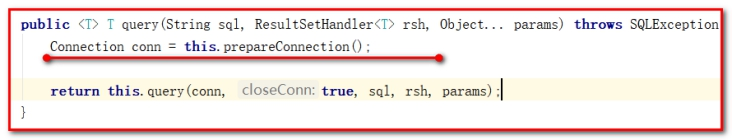 

update方法：

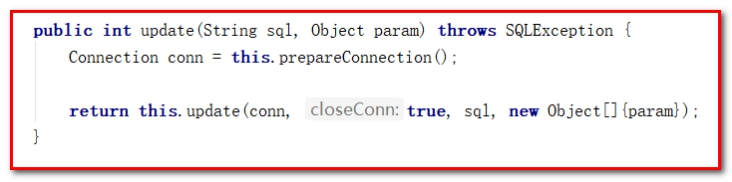 

【事务分析】

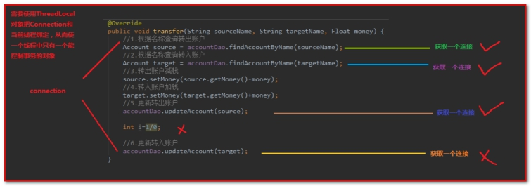 

总结：

如果在AccountServiceImpl.java中的transfer方法中，抛出一个异常。此时事务不会回滚，原因是DBUtils每个操作数据都是获取一个连接，每个连接的事务都是独立的，且默认是自动提交。

解决方案：

需要使用ThreadLocal对象把Connection和当前线程绑定，从而使一个线程中只能有一个能控制事务的连接对象。

### 2.2.1 ConnectionUtils.java

第一步：创建包com.itheima.utils，编写ConnectionUtils.java

作用：连接的工具类，它用于从数据源中获取一个连接，并且实现和线程的绑定

```java
/**
 * 连接的工具类，它用于从数据源中获取一个连接，并且实现和线程的绑定
 */
public class ConnectionUtils {

    private ThreadLocal<Connection> tl = new ThreadLocal<Connection>();

    private DataSource dataSource;

    public void setDataSource(DataSource dataSource) {
        this.dataSource = dataSource;
    }

    /**
     * 获取当前线程上的连接
     * @return
     */
    public Connection getThreadConnection() {
        try{
            //1.先从ThreadLocal上获取
            Connection conn = tl.get();
            //2.判断当前线程上是否有连接
            if (conn == null) {
                //3.从数据源中获取一个连接，并且存入ThreadLocal中
                conn = dataSource.getConnection();
                tl.set(conn);
            }
            //4.返回当前线程上的连接
            return conn;
        }catch (Exception e){
            throw new RuntimeException(e);
        }
    }

    /**
     * 把连接和线程解绑（在当前线程结束的时候执行）
     */
    public void removeConnection(){
        tl.remove();
    }
}
```


### 2.2.2 TransactionManager.java

作用：和事务管理相关的工具类，它包含了，开启事务，提交事务，回滚事务和释放连接

 ````java
/**
 * 和事务管理相关的工具类，它包含了，开启事务，提交事务，回滚事务和释放连接
 */
public class TransactionManager {

    private ConnectionUtils connectionUtils;

    public void setConnectionUtils(ConnectionUtils connectionUtils) {
        this.connectionUtils = connectionUtils;
    }

    /**
     * 开启事务
     */
    public  void beginTransaction(){
        try {
            connectionUtils.getThreadConnection().setAutoCommit(false);
        }catch (Exception e){
            e.printStackTrace();
        }
    }

    /**
     * 提交事务
     */
    public  void commit(){
        try {
            connectionUtils.getThreadConnection().commit();
        }catch (Exception e){
            e.printStackTrace();
        }
    }

    /**
     * 回滚事务
     */
    public  void rollback(){
        try {
            connectionUtils.getThreadConnection().rollback();
        }catch (Exception e){
            e.printStackTrace();
        }
    }


    /**
     * 释放连接
     */
    public  void release(){
        try {
            connectionUtils.getThreadConnection().close();//把连接还回连接池中
            connectionUtils.removeConnection();//线程和连接解绑
        }catch (Exception e){
            e.printStackTrace();
        }
    }
}
 ````


### 2.2.3 配置AccountDaoImpl.java

作用：注入连接工具对象，使得操作数据库从同一个连接中获取

```java
/**
 * 账户的持久层实现类
 */
public class AccountDaoImpl implements AccountDao {

    private QueryRunner runner;
    private ConnectionUtils connectionUtils;

    public void setConnectionUtils(ConnectionUtils connectionUtils) {
        this.connectionUtils = connectionUtils;
    }

    public void setRunner(QueryRunner runner) {
        this.runner = runner;
    }

    public List<Account> findAllAccount() {
        try{
            return runner.query(connectionUtils.getThreadConnection(),"select * from account",new BeanListHandler<Account>(Account.class));
        }catch (Exception e) {
            throw new RuntimeException(e);
        }
    }

    public Account findAccountById(Integer accountId) {
        try{
            return runner.query(connectionUtils.getThreadConnection(),"select * from account where id = ? ",new BeanHandler<Account>(Account.class),accountId);
        }catch (Exception e) {
            throw new RuntimeException(e);
        }
    }

    public void saveAccount(Account account) {
        try{
            runner.update(connectionUtils.getThreadConnection(),"insert into account(name,money)values(?,?)",account.getName(),account.getMoney());
        }catch (Exception e) {
            throw new RuntimeException(e);
        }
    }

    public void updateAccount(Account account) {
        try{
            runner.update(connectionUtils.getThreadConnection(),"update account set name=?,money=? where id=?",account.getName(),account.getMoney(),account.getId());
        }catch (Exception e) {
            throw new RuntimeException(e);
        }
    }

    public void deleteAccount(Integer accountId) {
        try{
            runner.update(connectionUtils.getThreadConnection(),"delete from account where id=?",accountId);
        }catch (Exception e) {
            throw new RuntimeException(e);
        }
    }

    public Account findAccountByName(String accountName) {
        try{
            List<Account> accounts = runner.query(connectionUtils.getThreadConnection(),"select * from account where name = ? ",new BeanListHandler<Account>(Account.class),accountName);
            if(accounts == null || accounts.size() == 0){
                return null;
            }
            if(accounts.size() > 1){
                throw new RuntimeException("结果集不唯一，数据有问题");
            }
            return accounts.get(0);
        }catch (Exception e) {
            throw new RuntimeException(e);
        }
    }
}
```


### 2.2.4 配置AccountServiceImpl.java

事务操作一定需要在Service层控制。

作用：注入事务管理器对象，对每个操作都需要开启事务、提交事务、关闭事务，如果抛出异常，需要回滚事务。

```java
/**
 * 账户的业务层实现类
 *
 * 事务控制应该都是在业务层
 */
public class AccountServiceImpl implements AccountService {

    private AccountDao accountDao;
    private TransactionManager txManager;

    public void setTxManager(TransactionManager txManager) {
        this.txManager = txManager;
    }

    public void setAccountDao(AccountDao accountDao) {
        this.accountDao = accountDao;
    }

    public List<Account> findAllAccount() {
        try {
            //1.开启事务
            txManager.beginTransaction();
            //2.执行操作
            List<Account> accounts = accountDao.findAllAccount();
            //3.提交事务
            txManager.commit();
            //4.返回结果
            return accounts;
        }catch (Exception e){
            //5.回滚操作
            txManager.rollback();
            throw new RuntimeException(e);
        }finally {
            //6.释放连接
            txManager.release();
        }

    }

    public Account findAccountById(Integer accountId) {
        try {
            //1.开启事务
            txManager.beginTransaction();
            //2.执行操作
            Account account = accountDao.findAccountById(accountId);
            //3.提交事务
            txManager.commit();
            //4.返回结果
            return account;
        }catch (Exception e){
            //5.回滚操作
            txManager.rollback();
            throw new RuntimeException(e);
        }finally {
            //6.释放连接
            txManager.release();
        }
    }

    public void saveAccount(Account account) {
        try {
            //1.开启事务
            txManager.beginTransaction();
            //2.执行操作
            accountDao.saveAccount(account);
            //3.提交事务
            txManager.commit();
        }catch (Exception e){
            //4.回滚操作
            txManager.rollback();
        }finally {
            //5.释放连接
            txManager.release();
        }

    }

    public void updateAccount(Account account) {
        try {
            //1.开启事务
            txManager.beginTransaction();
            //2.执行操作
            accountDao.updateAccount(account);
            //3.提交事务
            txManager.commit();
        }catch (Exception e){
            //4.回滚操作
            txManager.rollback();
        }finally {
            //5.释放连接
            txManager.release();
        }

    }

    public void deleteAccount(Integer acccountId) {
        try {
            //1.开启事务
            txManager.beginTransaction();
            //2.执行操作
            accountDao.deleteAccount(acccountId);
            //3.提交事务
            txManager.commit();
        }catch (Exception e){
            //4.回滚操作
            txManager.rollback();
        }finally {
            //5.释放连接
            txManager.release();
        }

    }

    public void transfer(String sourceName, String targetName, Float money) {
        try {
            //1.开启事务
            txManager.beginTransaction();
            //2.执行操作

            //2.1根据名称查询转出账户
            Account source = accountDao.findAccountByName(sourceName);
            //2.2根据名称查询转入账户
            Account target = accountDao.findAccountByName(targetName);
            //2.3转出账户减钱
            source.setMoney(source.getMoney()-money);
            //2.4转入账户加钱
            target.setMoney(target.getMoney()+money);
            //2.5更新转出账户
            accountDao.updateAccount(source);

            int i=1/0;

            //2.6更新转入账户
            accountDao.updateAccount(target);
            //3.提交事务
            txManager.commit();

        }catch (Exception e){
            //4.回滚操作
            txManager.rollback();
            e.printStackTrace();
        }finally {
            //5.释放连接
            txManager.release();
        }


    }
}
```


### 2.2.5 配置applicationContext.xml

```xml
<!-- 配置Service -->
<bean id="accountService" class="com.itheima.service.impl.AccountServiceImpl">
    <!-- 注入dao -->
    <property name="accountDao" ref="accountDao"></property>
    <!--注入事务管理器-->
    <property name="txManager" ref="txManager"></property>
</bean>

<!--配置Dao对象-->
<bean id="accountDao" class="com.itheima.dao.impl.AccountDaoImpl">
    <!-- 注入QueryRunner -->
    <property name="runner" ref="runner"></property>
    <!-- 注入ConnectionUtils -->
    <property name="connectionUtils" ref="connectionUtils"></property>
</bean>

<!--配置QueryRunner-->
<bean id="runner" class="org.apache.commons.dbutils.QueryRunner" scope="prototype">
    <!--这里要去掉queryRunner的默认连接池配置，由ConnectionUtils 获取连接-->
    <!--<constructor-arg name="ds" ref="dataSource"></constructor-arg>-->
</bean>

<!-- 配置数据源 -->
<bean id="dataSource" class="com.mchange.v2.c3p0.ComboPooledDataSource">
    <!--连接数据库的必备信息-->
    <property name="driverClass" value="com.mysql.jdbc.Driver"></property>
    <property name="jdbcUrl" value="jdbc:mysql://localhost:3306/itcastspring"></property>
    <property name="user" value="root"></property>
    <property name="password" value="root"></property>
</bean>

<!-- 配置Connection的工具类 ConnectionUtils -->
<bean id="connectionUtils" class="com.itheima.utils.ConnectionUtils">
    <!-- 注入数据源-->
    <property name="dataSource" ref="dataSource"></property>
</bean>

<!-- 配置事务管理器-->
<bean id="txManager" class="com.itheima.utils.TransactionManager">
    <!-- 注入ConnectionUtils -->
    <property name="connectionUtils" ref="connectionUtils"></property>
</bean>
```


【问题】

通过对业务层改造，已经可以实现事务控制了，但是由于我们添加了事务控制，也产生了一个新的问题： 

业务层方法变得臃肿了，里面充斥着很多重复代码。并且业务层方法和事务控制方法耦合了。 

试想一下，如果我们此时提交，回滚，释放资源中任何一个方法名变更，都需要修改业务层的代码，况且这还只是一个业务层实现类，而实际的项目中这种业务层实现类可能有十几个甚至几十个。 

【思考】： 

这个问题能不能解决呢？ 

答案是肯定的，使用下一小节中提到的技术。 

 

# 第3章 代理技术（了解）

熟悉代理对象的作用。

没有代理之前：

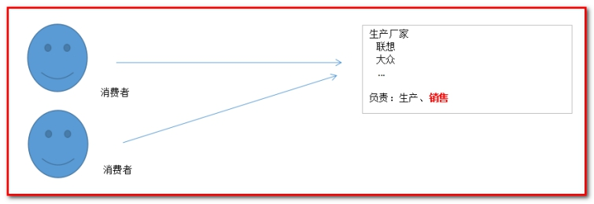 

使用代理之后：

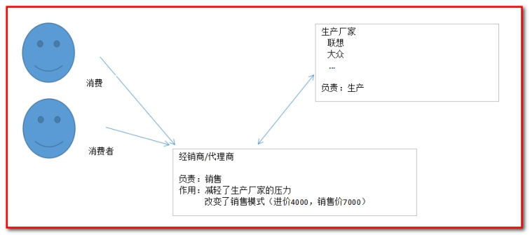 

 

 

## 3.1 准备工作

创建工程spring_day03_proxy

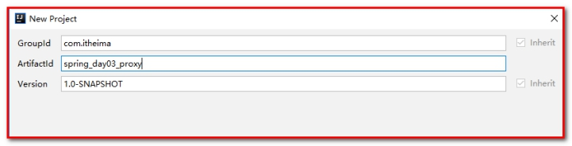 

pom.xml文件配置

```xml
<?xml version="1.0" encoding="UTF-8"?>
<project xmlns="http://maven.apache.org/POM/4.0.0"
         xmlns:xsi="http://www.w3.org/2001/XMLSchema-instance"
         xsi:schemaLocation="http://maven.apache.org/POM/4.0.0 http://maven.apache.org/xsd/maven-4.0.0.xsd">
    <modelVersion>4.0.0</modelVersion>

    <groupId>com.itheima</groupId>
    <artifactId>spring_day03_proxy</artifactId>
    <version>1.0-SNAPSHOT</version>
    <packaging>jar</packaging>

    <dependencies>
        <dependency>
            <groupId>cglib</groupId>
            <artifactId>cglib</artifactId>
            <version>2.2</version>
        </dependency>
    </dependencies>

</project>
```

 

## 3.2 JDK代理（对接口的代理）

【应用场景】：

如果目标对象是接口，使用JDK代理

第一步：创建接口Producer.java

```java
/**
 * 对生产厂家要求的接口
 */
public interface Producer {

    /**
     * 销售
     * @param money
     */
    public void saleProduct(float money);

    /**
     * 售后
     * @param money
     */
    public void afterService(float money);
}
```


第二步：创建接口的实现类ProductImpl.java

```java
/**
 * 一个生产者
 */
public class ProducerImpl implements Producer{

    /**
     * 销售
     * @param money
     */
    public void saleProduct(float money){
        System.out.println("销售产品，并拿到钱："+money);
    }

    /**
     * 售后
     * @param money
     */
    public void afterService(float money){
        System.out.println("提供售后服务，并拿到钱："+money);
    }
}
```

 

第三步：创建代理类Client.java

```java
/**
 * 模拟一个消费者
 */
public class Client {

    public static void main(String[] args) {
        final Producer producer = new ProducerImpl();

        /**
         * 动态代理：
         *  特点：字节码谁用谁创建，谁用谁加载
         *  作用：不修改源码的基础上对方法增强
         *  代理分类：
         *      基于接口的动态代理
         *      基于子类的动态代理
         *  基于接口的动态代理：
         *      涉及的类：Proxy
         *      提供者：JDK官方
         *  如何创建代理对象：
         *      使用Proxy类中的newProxyInstance方法
         *  创建JDK代理对象的要求：
         *      被代理类最少实现一个接口，如果没有则不能使用
         *  newProxyInstance方法的参数：
         *      ClassLoader：类加载器
         *          它是用于加载代理对象字节码的。和被代理对象使用相同的类加载器。固定写法。
         *      Class[]：字节码数组
         *          它是用于让代理对象和被代理对象有相同方法。固定写法。
         *      InvocationHandler：用于提供增强的代码
         *          它是让我们写代理细节。我们一般都是些一个该接口的实现类，通常情况下都是匿名内部类，但不是必须的。
         */
        Producer proxyProducer = (Producer) Proxy.newProxyInstance(producer.getClass().getClassLoader(),
                producer.getClass().getInterfaces(),
                new InvocationHandler() {
                    /**
                     * 作用：执行被代理对象的任何接口方法都会经过该方法
                     * 方法参数的含义
                     * @param proxy   代理对象的引用
                     * @param method  当前执行的方法
                     * @param args    当前执行方法所需的参数
                     * @return        和被代理对象方法有相同的返回值
                     * @throws Throwable
                     */
                    public Object invoke(Object proxy, Method method, Object[] args) throws Throwable {
                        //提供增强的代码
                        Object returnValue = null;

                        //1.获取方法执行的参数
                        Float money = (Float)args[0];
                        //2.判断当前方法是不是销售
                        if("saleProduct".equals(method.getName())) {
                            returnValue = method.invoke(producer, money*0.8f);
                        }
                        return returnValue;
                    }
                });
        proxyProducer.saleProduct(10000f);
    }
}
```

 

JDK代理：

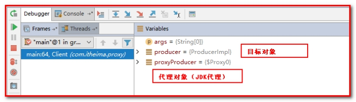 

## 3.3 CGLIB代理（对类的代理）

【应用场景】

如果目标对象是类

第一步：定义Product.java类

```java
/**
 * 一个生产者
 */
public class Producer {

    /**
     * 销售
     * @param money
     */
    public void saleProduct(float money){
        System.out.println("销售产品，并拿到钱："+money);
    }

    /**
     * 售后
     * @param money
     */
    public void afterService(float money){
        System.out.println("提供售后服务，并拿到钱："+money);
    }
}
```


第二步：创建代理类Client.java

````java
/**
 * 模拟一个消费者
 */
public class Client {

    public static void main(String[] args) {
        final Producer producer = new Producer();

        /**
         * 动态代理：
         *  特点：字节码谁用谁创建，谁用谁加载
         *  作用：不修改源码的基础上对方法增强
         *  分类：
         *      基于接口的动态代理（jdk）
         *      基于子类的动态代理（cglib）
         *  基于子类的动态代理：
         *      涉及的类：Enhancer
         *      提供者：第三方cglib库
         *  如何创建代理对象：
         *      使用Enhancer类中的create方法
         *  创建代理对象的要求：
         *      被代理类不能是最终类，即用final修饰的类不能创建代理对象。
         *  create方法的参数：
         *      Class：字节码
         *          它是用于指定被代理对象的字节码。
         *
         *      Callback：用于提供增强的代码
         *          它是让我们写代理的细节。我们一般都是些一个该接口的实现类，通常情况下都是匿名内部类，但不是必须的。
         *          此接口的实现类都是谁用谁写。
         *          我们一般写的都是该接口的子接口实现类：MethodInterceptor
         */
        Producer cglibProducer = (Producer) Enhancer.create(producer.getClass(), new MethodInterceptor() {
            /**
             * 执行北地阿里对象的任何方法都会经过该方法
             * @param proxy
             * @param method
             * @param args
             *    以上三个参数和基于接口的动态代理中invoke方法的参数是一样的
             * @param methodProxy ：当前执行方法的代理对象（不常用）
             * @return
             * @throws Throwable
             */
            public Object intercept(Object proxy, Method method, Object[] args, MethodProxy methodProxy) throws Throwable {
                //提供增强的代码
                Object returnValue = null;

                //1.获取方法执行的参数
                Float money = (Float)args[0];
                //2.判断当前方法是不是销售
                if("saleProduct".equals(method.getName())) {
                    returnValue = method.invoke(producer, money*0.8f);
                }
                return returnValue;
            }
        });
        cglibProducer.saleProduct(12000f);
    }
}
````


Cglib代理：

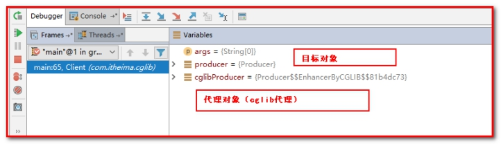 

Cglib代理解决了jdk代理只能面向接口的问题。

Spring正式引入代理的特点：如果是对接口代理使用JDK代理（默认）；如果对类代理使用Cglib代理。

 

## 3.4 转账案例事务优化（JDK代理）

第一步 ：创建包com.itheima.factory，创建类BeanFactory.java

```java
/**
 * 用于创建Service的代理对象的工厂
 */
public class BeanFactory {

    private AccountService accountService;

    private TransactionManager txManager;

    public void setTxManager(TransactionManager txManager) {
        this.txManager = txManager;
    }


    public void setAccountService(AccountService accountService) {
        this.accountService = accountService;
    }

    /**
     * 获取Service代理对象
     * @return
     */
    public AccountService getAccountService() {
        return (AccountService)Proxy.newProxyInstance(accountService.getClass().getClassLoader(),
                accountService.getClass().getInterfaces(),
                new InvocationHandler() {
                    /**
                     * 添加事务的支持
                     *
                     * @param proxy
                     * @param method
                     * @param args
                     * @return
                     * @throws Throwable
                     */
                    public Object invoke(Object proxy, Method method, Object[] args) throws Throwable {

                        Object rtValue = null;
                        try {
                            //1.开启事务
                            txManager.beginTransaction();
                            //2.执行操作
                            rtValue = method.invoke(accountService, args);
                            //3.提交事务
                            txManager.commit();
                            //4.返回结果
                            return rtValue;
                        } catch (Exception e) {
                            //5.回滚操作
                            txManager.rollback();
                            throw new RuntimeException(e);
                        } finally {
                            //6.释放连接
                            txManager.release();
                        }
                    }
                });

    }
}
```


第二步：改造AccountServiceImpl.java

```java
/**
 * 账户的业务层实现类
 *
 * 事务控制应该都是在业务层
 */
public class AccountServiceImpl implements AccountService {

    private AccountDao accountDao;

    public void setAccountDao(AccountDao accountDao) {
        this.accountDao = accountDao;
    }


    public List<Account> findAllAccount() {
        return accountDao.findAllAccount();
    }


    public Account findAccountById(Integer accountId) {
        return accountDao.findAccountById(accountId);

    }


    public void saveAccount(Account account) {
        accountDao.saveAccount(account);
    }


    public void updateAccount(Account account) {
        accountDao.updateAccount(account);
    }


    public void deleteAccount(Integer acccountId) {
        accountDao.deleteAccount(acccountId);
    }


    public void transfer(String sourceName, String targetName, Float money) {
        System.out.println("transfer....");
        //2.1根据名称查询转出账户
        Account source = accountDao.findAccountByName(sourceName);
        //2.2根据名称查询转入账户
        Account target = accountDao.findAccountByName(targetName);
        //2.3转出账户减钱
        source.setMoney(source.getMoney()-money);
        //2.4转入账户加钱
        target.setMoney(target.getMoney()+money);
        //2.5更新转出账户
        accountDao.updateAccount(source);

        int i=1/0;

        //2.6更新转入账户
        accountDao.updateAccount(target);
    }
}
```


第三步：配置applicationContext.xml

```xml
<?xml version="1.0" encoding="UTF-8"?>
<beans xmlns="http://www.springframework.org/schema/beans"
       xmlns:xsi="http://www.w3.org/2001/XMLSchema-instance"
       xsi:schemaLocation="http://www.springframework.org/schema/beans
        http://www.springframework.org/schema/beans/spring-beans.xsd">
    <!--配置beanfactory-->
    <bean id="beanFactory" class="com.itheima.factory.BeanFactory">
        <!-- 注入service -->
        <property name="accountService" ref="accountService"></property>
        <!-- 注入事务管理器 -->
        <property name="txManager" ref="txManager"></property>
    </bean>

    <!--配置代理的service，使用实例工厂的模式创建对象-->
    <bean id="proxyAccountService" factory-bean="beanFactory" factory-method="getAccountService"></bean>


    <!-- 配置Service -->
    <bean id="accountService" class="com.itheima.service.impl.AccountServiceImpl">
        <!-- 注入dao -->
        <property name="accountDao" ref="accountDao"></property>
        <!--注入事务管理器
        <property name="txManager" ref="txManager"></property>-->
    </bean>

    <!--配置Dao对象-->
    <bean id="accountDao" class="com.itheima.dao.impl.AccountDaoImpl">
        <!-- 注入QueryRunner -->
        <property name="runner" ref="runner"></property>
        <!-- 注入ConnectionUtils -->
        <property name="connectionUtils" ref="connectionUtils"></property>
    </bean>

    <!--配置QueryRunner-->
    <bean id="runner" class="org.apache.commons.dbutils.QueryRunner" scope="prototype">
        <!--<constructor-arg name="ds" ref="dataSource"></constructor-arg>-->
    </bean>

    <!-- 配置数据源 -->
    <bean id="dataSource" class="com.mchange.v2.c3p0.ComboPooledDataSource">
        <!--连接数据库的必备信息-->
        <property name="driverClass" value="com.mysql.jdbc.Driver"></property>
        <property name="jdbcUrl" value="jdbc:mysql://localhost:3306/itcastspring"></property>
        <property name="user" value="root"></property>
        <property name="password" value="root"></property>
    </bean>

    <!-- 配置Connection的工具类 ConnectionUtils -->
    <bean id="connectionUtils" class="com.itheima.utils.ConnectionUtils">
        <!-- 注入数据源-->
        <property name="dataSource" ref="dataSource"></property>
    </bean>

    <!-- 配置事务管理器-->
    <bean id="txManager" class="com.itheima.utils.TransactionManager">
        <!-- 注入ConnectionUtils -->
        <property name="connectionUtils" ref="connectionUtils"></property>
    </bean>
</beans>
```


第四步：测试类AccountServiceTest.java

因为spring容器中出现了2个AccountService的类型，所以使用@Qualifier("proxyAccountService")指定我们想要的类型，@Qualifier("proxyAccountService")表示代理类型。

```java
/**
 * 使用Junit单元测试：测试我们的配置
 */
@RunWith(SpringJUnit4ClassRunner.class)
@ContextConfiguration(locations = "classpath:applicationContext.xml")
public class AccountServiceTest {

    @Autowired
    @Qualifier("proxyAccountService")
    private AccountService as;

    @Test
    public  void testTransfer(){
        as.transfer("aaa","bbb",100f);
    }

}
```


测试：事务控制住了，但是问题仍然存在，现在BeanFactory的代码太过繁琐，需要手动编程，能否通过配置的形式完成代理方式呢？

# 第4章 AOP的概述

## 4.1 什么是AOP

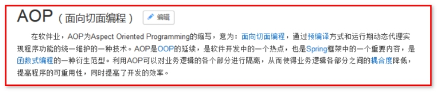 

 

AOP (Aspect Oriented Programing) 称为：面向切面编程，它是一种编程思想。

AOP采取横向抽取机制，取代了传统纵向继承体系重复性代码的编写方式（应用场景：例如性能监视、事务管理、安全检查、缓存、日志记录等）。

【扩展了解】AOP 是 OOP（面向对象编程（Object Oriented Programming，OOP，面向对象程序设计）是一种计算机编程架构），思想延续 ！

 

 

 

## 4.2 AOP的作用

-  权限校验
-  日志记录
-  性能检测
-  缓存技术
-  **事务管理**

## 4.3 AOP底层实现

代理机制。

2个：spring的aop的底层原理

 1：JDK代理（要求目标对象面向接口）（spring默认的代理方式是JDK代理）

 2：CGLIB代理（面向接口、面向类）

 

 

# 第5章 Spring中的AOP

 

## 5.1 Spring中AOP的细节 

 

### 5.1.1 说明 

我们学习spring的aop，就是通过配置的方式（使用JDK代理），实现上一章节的功能。 

```java
public class BeanFactory {

    private AccountService accountService;

    private TransactionManager txManager;

    public void setTxManager(TransactionManager txManager) {
        this.txManager = txManager;
    }


    public final void setAccountService(AccountService accountService) {
        this.accountService = accountService;
    }

    /**
     * 获取Service代理对象
     * @return
     */
    public AccountService getAccountService() {
        return (AccountService)Proxy.newProxyInstance(accountService.getClass().getClassLoader(),
                accountService.getClass().getInterfaces(),
                new InvocationHandler() {
                    /**
                     * 添加事务的支持
                     *
                     * @param proxy
                     * @param method
                     * @param args
                     * @return
                     * @throws Throwable
                     */
                    public Object invoke(Object proxy, Method method, Object[] args) throws Throwable {
                        // 表示测试用的方法
//                        if("test".equals(method.getName())){
//                            return method.invoke(accountService,args);
//                        }

                        Object rtValue = null;
                        try {
                            //1.开启事务
                            txManager.beginTransaction();
                            //2.执行操作
                            rtValue = method.invoke(accountService, args);
                            //3.提交事务
                            txManager.commit();
                            //4.返回结果
                            return rtValue;
                        } catch (Exception e) {
                            //5.回滚操作
                            txManager.rollback();
                            throw new RuntimeException(e);
                        } finally {
                            //6.释放连接
                            txManager.release();
                        }
                    }
                });

    }
}
```


### 5.1.2 AOP相关术语 

- Joinpoint(连接点): （方法）

  所谓连接点是指那些被拦截到的点。在spring中,这些点指的是方法,因为spring只支持方法类型的连接点。 

- Pointcut(切入点): （方法）

  所谓切入点是指我们要对哪些Joinpoint进行拦截的定义。 

- Advice(通知/增强): （方法）

  所谓通知是指拦截到Joinpoint之后所要做的事情就是通知。 

  通知的类型：前置通知,后置通知,异常通知,最终通知,环绕通知。  

- Target(目标对象): 

  代理的目标对象。 

- Weaving(织入): （了解）

  是指把增强应用到目标对象来创建新的代理对象的过程。 

  spring采用动态代理织入，而AspectJ采用编译期织入和类装载期织入。 

- Proxy（代理）: 

  一个类被AOP织入增强后，就产生一个结果代理类。 

- Aspect(切面): （类）

  是切入点和通知（引介）的结合。 

- Introduction(引介): （不了解）

  引介是一种特殊的通知在不修改类代码的前提下, Introduction可以在运行期为类动态地添加一些方法或Field。

 

### 5.1.3 学习spring中的AOP要明确的事 （了解）

a、开发阶段（我们做的） 

编写核心业务代码（开发主线）：大部分程序员来做，要求熟悉业务需求。 

把公用代码抽取出来，**制作成通知（日志、事务、权限）**。开发阶段最后再做。

编写日志、事务、权限的配置，在spring配置文件中，**声明切入点与通知间的关系，即切面即可。** 

b、运行阶段（Spring框架完成的） 

Spring框架监控切入点方法的执行。一旦监控到切入点方法被运行，使用代理机制，动态创建目标对象的代理对象，根据通知类别，在代理对象的对应位置，将通知对应的功能织入，完成完整的代码逻辑运行。 

### 5.1.4 关于代理的选择 

在spring中，框架会根据目标类是否实现了接口来决定采用哪种动态代理的方式。 

**如果对接口，默认使用JDK代理。**

 

**如果对类，采用CGLIB代理。**

 

 

## 5.2 Spring的AOP配置

【需求】在访问com.itheima.service.impl中的AccountService.java中的方法之前，添加日志操作

### 5.2.1 准备工作

第一步：创建spring_day03_springaop工程

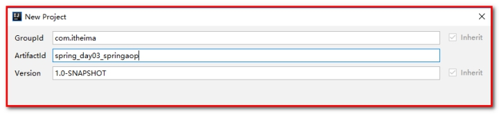 

第二步：导入maven坐标

````xml
<?xml version="1.0" encoding="UTF-8"?>
<project xmlns="http://maven.apache.org/POM/4.0.0"
         xmlns:xsi="http://www.w3.org/2001/XMLSchema-instance"
         xsi:schemaLocation="http://maven.apache.org/POM/4.0.0 http://maven.apache.org/xsd/maven-4.0.0.xsd">
    <modelVersion>4.0.0</modelVersion>

    <groupId>com.itheima</groupId>
    <artifactId>spring_day03_springaop</artifactId>
    <version>1.0-SNAPSHOT</version>
    <packaging>jar</packaging>

    <dependencies>
        <dependency>
            <groupId>org.springframework</groupId>
            <artifactId>spring-context</artifactId>
            <version>5.0.2.RELEASE</version>
        </dependency>

        <dependency>
            <groupId>org.springframework</groupId>
            <artifactId>spring-test</artifactId>
            <version>5.0.2.RELEASE</version>
        </dependency>

        <dependency>
            <groupId>junit</groupId>
            <artifactId>junit</artifactId>
            <version>4.12</version>
        </dependency>

        <dependency>
            <groupId>org.aspectj</groupId>
            <artifactId>aspectjweaver</artifactId>
            <version>1.8.7</version>
        </dependency>


    </dependencies>
</project>
````


第三步：定义Service的接口和实现类

创建包com.itheima.service，创建接口AccountService.java

```java
/**
 * 账户的业务层接口
 */
public interface AccountService {

    /**
     * 模拟保存账户
     */
    void saveAccount();

    /**
     * 模拟更新账户
     * @param i
     */
    void updateAccount(int i);

    /**
     * 删除账户
     * @return
     */
    int  deleteAccount();
}
```


创建包com.itheima.service.impl，创建接口的实现类AccountServiceImpl.java

```java
/**
 * 账户的业务层实现类
 */
public class AccountServiceImpl implements AccountService {

    public void saveAccount() {
        System.out.println("执行了保存");
    }

    public void updateAccount(int i) {
        System.out.println("执行了更新"+i);

    }

    public int deleteAccount() {
        System.out.println("执行了删除");
        return 0;
    }
}
```


第四步：创建com.itheima.util，创建增强类Logger.java

```java
/**
 * 用于记录日志的工具类，它里面提供了公共的代码
 */
public class Logger {

    /**
     * 用于打印日志：计划让其在切入点方法执行之前执行（切入点方法就是业务层方法）
     */
    public  void printLog(){
        System.out.println("Logger类中的pringLog方法开始记录日志了。。。");
    }
}
```

第五步：配置applicationContext.xml

````xml
<?xml version="1.0" encoding="UTF-8"?>
<beans xmlns="http://www.springframework.org/schema/beans"
       xmlns:xsi="http://www.w3.org/2001/XMLSchema-instance"
       xmlns:aop="http://www.springframework.org/schema/aop"
       xsi:schemaLocation="http://www.springframework.org/schema/beans
        http://www.springframework.org/schema/beans/spring-beans.xsd
        http://www.springframework.org/schema/aop
        http://www.springframework.org/schema/aop/spring-aop.xsd">

    <!-- 配置srping的Ioc,把service对象配置进来-->
    <bean id="accountService" class="com.itheima.service.impl.AccountServiceImpl"></bean>

    <!--spring中基于XML的AOP配置步骤
        1、把通知Bean也交给spring来管理
        2、使用aop:config标签表明开始AOP的配置
        3、使用aop:aspect标签表明配置切面
                id属性：是给切面提供一个唯一标识
                ref属性：是指定通知类bean的Id。
        4、在aop:aspect标签的内部使用对应标签来配置通知的类型
               我们现在示例是让printLog方法在切入点方法执行之前执行：所以是前置通知
               aop:before：表示配置前置通知
                    method属性：用于指定Logger类中哪个方法是前置通知
                    pointcut属性：用于指定切入点表达式，该表达式的含义指的是对业务层中哪些方法增强

            切入点表达式的写法：
                关键字：execution(表达式)
    -->

    <!-- 配置Logger类，声明切面（创建对象，不是真正aop的切面） -->
    <bean id="logger" class="com.itheima.utils.Logger"></bean>

    <!--配置AOP-->
    <aop:config>
        <!--配置切面 -->
        <aop:aspect id="logAdvice" ref="logger">
            <!-- 配置通知的类型，并且建立通知方法和切入点方法的关联-->
<aop:before method="printLog" pointcut="execution(void   com.itheima.service.impl.AccountServiceImpl.saveAccount())"></aop:before>
            <aop:before method="printLog" pointcut="execution(void com.itheima.service.impl.AccountServiceImpl.updateAccount(int))"></aop:before>
            <aop:before method="printLog" pointcut="execution(int com.itheima.service.impl.AccountServiceImpl.deleteAccount())"></aop:before>

        </aop:aspect>
    </aop:config>

</beans>
````


第六步：测试

创建com.itheim.test包，创建测试类AOPTest.java

```java
/**
 * 测试AOP的配置
 */
@RunWith(value = SpringJUnit4ClassRunner.class)
@ContextConfiguration(locations = "classpath:applicationContext.xml")
public class AOPTest {

    @Autowired
    private AccountService as;

    @Test
    public void proxy(){
        //3.执行方法
        as.saveAccount();
        as.updateAccount(1);
        as.deleteAccount();
    }
}
```


实现了在访问目标对象方法之前先输出了日志。（切面编程）

### 5.2.2 切入点表达式的写法（重点）

切入点表达式的写法

 关键字：execution(表达式)
          表达式：

- 参数一：访问修饰符（非必填）

- 参数二：返回值（必填）

- 参数三：包名.类名（非必填）

- 参数四：方法名（参数）（必填）

- 参数五：异常（非必填）

- 访问修饰符  返回值  包名.包名.包名...类名.方法名(参数列表)

  - 标准的表达式写法：

    public void com.itheima.service.impl.AccountServiceImpl.saveAccount()

  - 访问修饰符可以省略

    void com.itheima.service.impl.AccountServiceImpl.saveAccount()

  - 返回值可以使用通配符（\*：表示任意），表示任意返回值

    \*com.itheima.service.impl.AccountServiceImpl.saveAccount()
    包名可以使用通配符，表示任意包。但是有几级包，就需要写几个*.

    * \*\*\.\*\.\*.AccountServiceImpl.saveAccount())

  - 包名可以使用..表示当前包及其子包

    - \*\*\.\*\.\.AccountServiceImpl.saveAccount()

  -  类名和方法名都可以使用*来实现通配（一般情况下，不会这样配置）

                        * \*\.\.\*\.\*() == * *

     -  参数列表：

          - 可以直接写数据类型：

            基本类型直接写名称           int

            引用类型写包名.类名的方式    java.lang.String

            可以使用通配符表示任意类型，但是必须有参数

            可以使用..表示有无参数均可，有参数可以是任意类型

            全通配写法：* *..*.*(..)*

            实际开发中切入点表达式的通常写法：切到业务层实现类下的所有方法：* com.itheima.service..\*.\*(..)

例如：

````xml
<aop:before method="printLog" pointcut="execution(* com.itheima.service..*.*(..))">
</aop:before>
````

## 5.3 Spring AOP的五种通知类型（使用XML）

前置通知、后置通知、异常通知、最终通知、环绕通知。

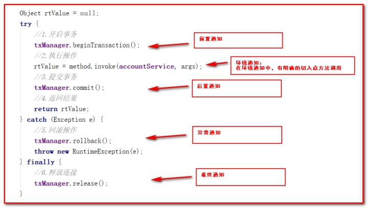 

### 5.3.1 准备工作

第一步：创建工程

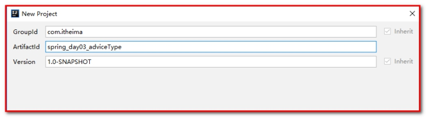 

第二步：配置pom.xml

```xml
<?xml version="1.0" encoding="UTF-8"?>
<project xmlns="http://maven.apache.org/POM/4.0.0"
         xmlns:xsi="http://www.w3.org/2001/XMLSchema-instance"
         xsi:schemaLocation="http://maven.apache.org/POM/4.0.0 http://maven.apache.org/xsd/maven-4.0.0.xsd">
    <modelVersion>4.0.0</modelVersion>

    <groupId>com.itheima</groupId>
    <artifactId>spring_day03_adviceType</artifactId>
    <version>1.0-SNAPSHOT</version>
    <packaging>jar</packaging>
    <dependencies>
        <dependency>
            <groupId>org.springframework</groupId>
            <artifactId>spring-context</artifactId>
            <version>5.0.2.RELEASE</version>
        </dependency>

        <dependency>
            <groupId>org.springframework</groupId>
            <artifactId>spring-test</artifactId>
            <version>5.0.2.RELEASE</version>
        </dependency>

        <dependency>
            <groupId>junit</groupId>
            <artifactId>junit</artifactId>
            <version>4.12</version>
        </dependency>

        <dependency>
            <groupId>org.aspectj</groupId>
            <artifactId>aspectjweaver</artifactId>
            <version>1.8.7</version>
        </dependency>
    </dependencies>
</project>
```


第三步：定义Service的接口和实现类

创建包com.itheima.service，创建接口AccountService.java

````java
/**
 * 账户的业务层接口
 */
public interface AccountService {

    /**
     * 模拟保存账户
     */
    void saveAccount();

    /**
     * 模拟更新账户
     * @param i
     */
    void updateAccount(int i);

    /**
     * 删除账户
     * @return
     */
    int  deleteAccount();
}
````


创建包com.itheima.service.impl，创建接口的实现类AccountServiceImpl.java

```java
/**
 * 账户的业务层实现类
 */
public class AccountServiceImpl implements AccountService {

    public void saveAccount() {
        System.out.println("执行了保存");
    }

    public void updateAccount(int i) {
        System.out.println("执行了更新"+i);

    }

    public int deleteAccount() {
        System.out.println("执行了删除");
        return 0;
    }
}
```


第四步：创建com.itheima.util，创建增强类Logger.java

````java
/**
 * 用于记录日志的工具类，它里面提供了公共的代码
 */
public class Logger {

    /**
     * 前置通知
     */
    public  void beforePrintLog(JoinPoint jp){
        System.out.println("前置通知Logger类中的beforePrintLog方法开始记录日志了。。。");
    }

    /**
     * 后置通知
     */
    public  void afterReturningPrintLog(JoinPoint jp){
        System.out.println("后置通知Logger类中的afterReturningPrintLog方法开始记录日志了。。。");
    }
    /**
     * 异常通知
     */
    public  void afterThrowingPrintLog(JoinPoint jp){
        System.out.println("异常通知Logger类中的afterThrowingPrintLog方法开始记录日志了。。。");
    }

    /**
     * 最终通知
     */
    public  void afterPrintLog(JoinPoint jp){
        System.out.println("最终通知Logger类中的afterPrintLog方法开始记录日志了。。。");
    }

    /**
     * 环绕通知
     * 问题：
     *      当我们配置了环绕通知之后，切入点方法没有执行，而通知方法执行了。
     * 分析：
     *      通过对比动态代理中的环绕通知代码，发现动态代理的环绕通知有明确的切入点方法调用，而我们的代码中没有。
     * 解决：
     *      Spring框架为我们提供了一个接口：ProceedingJoinPoint。该接口有一个方法proceed()，此方法就相当于明确调用切入点方法。
     *      该接口可以作为环绕通知的方法参数，在程序执行时，spring框架会为我们提供该接口的实现类供我们使用。
     *
     * spring中的环绕通知：
     *      它是spring框架为我们提供的一种可以在代码中手动控制增强方法何时执行的方式。
     */
    public Object aroundPringLog(ProceedingJoinPoint pjp){
        Object rtValue = null;
        try{
            Object[] args = pjp.getArgs();//得到方法执行所需的参数

            System.out.println("Logger类中的aroundPringLog方法开始记录日志了。。。前置");

            rtValue = pjp.proceed(args);//明确调用业务层方法（切入点方法）

            System.out.println("Logger类中的aroundPringLog方法开始记录日志了。。。后置");

            return rtValue;
        }catch (Throwable t){
            System.out.println("Logger类中的aroundPringLog方法开始记录日志了。。。异常");
            throw new RuntimeException(t);
        }finally {
            System.out.println("Logger类中的aroundPringLog方法开始记录日志了。。。最终");
        }
    }
}
````


第五步：配置applicationContext.xml

````xml
<?xml version="1.0" encoding="UTF-8"?>
<beans xmlns="http://www.springframework.org/schema/beans"
       xmlns:xsi="http://www.w3.org/2001/XMLSchema-instance"
       xmlns:aop="http://www.springframework.org/schema/aop"
       xsi:schemaLocation="http://www.springframework.org/schema/beans
        http://www.springframework.org/schema/beans/spring-beans.xsd
        http://www.springframework.org/schema/aop
        http://www.springframework.org/schema/aop/spring-aop.xsd">

    <!-- 配置srping的Ioc,把service对象配置进来-->
    <bean id="accountService" class="com.itheima.service.impl.AccountServiceImpl"></bean>


    <!-- 配置Logger类 -->
    <bean id="logger" class="com.itheima.utils.Logger"></bean>

    <!--配置AOP-->
    <aop:config>
        <!-- 配置切入点表达式 id属性用于指定表达式的唯一标识。expression属性用于指定表达式内容
              此标签写在aop:aspect标签内部只能当前切面使用。
              它还可以写在aop:aspect外面，此时就变成了所有切面可用
          -->
        <aop:pointcut id="pt1" expression="execution(* com.itheima.service..*.*(..))"></aop:pointcut>
        <!--配置切面 -->
        <aop:aspect id="logAdvice" ref="logger">
            <!-- 配置前置通知：在切入点方法执行之前执行
            <aop:before method="beforePrintLog" pointcut-ref="pt1" ></aop:before>-->

            <!-- 配置后置通知：在切入点方法正常执行之后值。它和异常通知永远只能执行一个
            <aop:after-returning method="afterReturningPrintLog" pointcut-ref="pt1"></aop:after-returning>-->

            <!-- 配置异常通知：在切入点方法执行产生异常之后执行。它和后置通知永远只能执行一个
            <aop:after-throwing method="afterThrowingPrintLog" pointcut-ref="pt1"></aop:after-throwing>-->

            <!-- 配置最终通知：无论切入点方法是否正常执行它都会在其后面执行
            <aop:after method="afterPrintLog" pointcut-ref="pt1"></aop:after>-->

            <!-- 配置环绕通知 详细的注释请看Logger类中-->
            <aop:around method="aroundPringLog" pointcut-ref="pt1"></aop:around>
        </aop:aspect>
    </aop:config>

</beans>
````


第六步：测试类

```java
/**
 * 测试AOP的配置
 */
@RunWith(value = SpringJUnit4ClassRunner.class)
@ContextConfiguration(locations = "classpath:applicationContext.xml")
public class AOPTest {

    @Autowired
    private AccountService as;

    @Test
    public void proxy(){
        //3.执行方法
        as.saveAccount();
    }
}
```

## 5.4 Spring AOP的注解方式配置五种通知类型

### 5.4.1 准备工作

第一步：创建工程

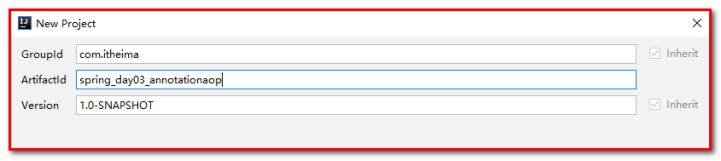 

第二步：配置pom.xml

````xml
<?xml version="1.0" encoding="UTF-8"?>
<project xmlns="http://maven.apache.org/POM/4.0.0"
         xmlns:xsi="http://www.w3.org/2001/XMLSchema-instance"
         xsi:schemaLocation="http://maven.apache.org/POM/4.0.0 http://maven.apache.org/xsd/maven-4.0.0.xsd">
    <modelVersion>4.0.0</modelVersion>

    <groupId>com.itheima</groupId>
    <artifactId>spring_day03_annotationaop</artifactId>
    <version>1.0-SNAPSHOT</version>
    <packaging>jar</packaging>
    <dependencies>
        <dependency>
            <groupId>org.springframework</groupId>
            <artifactId>spring-context</artifactId>
            <version>5.0.2.RELEASE</version>
        </dependency>

        <dependency>
            <groupId>org.springframework</groupId>
            <artifactId>spring-test</artifactId>
            <version>5.0.2.RELEASE</version>
        </dependency>

        <dependency>
            <groupId>junit</groupId>
            <artifactId>junit</artifactId>
            <version>4.12</version>
        </dependency>

        <dependency>
            <groupId>org.aspectj</groupId>
            <artifactId>aspectjweaver</artifactId>
            <version>1.8.7</version>
        </dependency>
    </dependencies>

</project>
````


第三步：定义Service的接口和实现类

创建包com.itheima.service，创建接口AccountService.java

```java
/**
 * 账户的业务层接口
 */
public interface AccountService {

    /**
     * 模拟保存账户
     */
    void saveAccount();

    /**
     * 模拟更新账户
     * @param i
     */
    void updateAccount(int i);

    /**
     * 删除账户
     * @return
     */
    int  deleteAccount();
}
```


创建包com.itheima.service.impl，创建接口的实现类AccountServiceImpl.java

````java
/**
 * 账户的业务层实现类
 */
@Service("accountService")
public class AccountServiceImpl implements AccountService {

    public void saveAccount() {
        System.out.println("执行了保存");
        //int i=1/0;
    }

    public void updateAccount(int i) {
        System.out.println("执行了更新"+i);

    }

    public int deleteAccount() {
        System.out.println("执行了删除");
        return 0;
    }
}
````


第四步：创建com.itheima.util，创建增强类Logger.java

```java
/**
 * 用于记录日志的工具类，它里面提供了公共的代码
 */
@Component("logger")
@Aspect//表示当前类是一个切面类
public class Logger {

    @Pointcut("execution(* com.itheima.service..*.*(..))")
    private void pt1(){}

    /**
     * 前置通知
     */
//    @Before("pt1()")
    public  void beforePrintLog(JoinPoint jp){
        System.out.println("前置通知Logger类中的beforePrintLog方法开始记录日志了。。。");
    }

    /**
     * 后置通知
     */
//    @AfterReturning("pt1()")
    public  void afterReturningPrintLog(JoinPoint jp){
        System.out.println("后置通知Logger类中的afterReturningPrintLog方法开始记录日志了。。。");
    }
    /**
     * 异常通知
     */
//    @AfterThrowing("pt1()")
    public  void afterThrowingPrintLog(JoinPoint jp){
        System.out.println("异常通知Logger类中的afterThrowingPrintLog方法开始记录日志了。。。");
    }

    /**
     * 最终通知
     */
//    @After("pt1()")
    public  void afterPrintLog(JoinPoint jp){
        System.out.println("最终通知Logger类中的afterPrintLog方法开始记录日志了。。。");
    }

    /**
     * 环绕通知
     * 问题：
     *      当我们配置了环绕通知之后，切入点方法没有执行，而通知方法执行了。
     * 分析：
     *      通过对比动态代理中的环绕通知代码，发现动态代理的环绕通知有明确的切入点方法调用，而我们的代码中没有。
     * 解决：
     *      Spring框架为我们提供了一个接口：ProceedingJoinPoint。该接口有一个方法proceed()，此方法就相当于明确调用切入点方法。
     *      该接口可以作为环绕通知的方法参数，在程序执行时，spring框架会为我们提供该接口的实现类供我们使用。
     *
     * spring中的环绕通知：
     *      它是spring框架为我们提供的一种可以在代码中手动控制增强方法何时执行的方式。
     */
    @Around("pt1()")
    public Object aroundPringLog(ProceedingJoinPoint pjp){
        Object rtValue = null;
        try{
            Object[] args = pjp.getArgs();//得到方法执行所需的参数

            System.out.println("Logger类中的aroundPringLog方法开始记录日志了。。。前置");

            rtValue = pjp.proceed(args);//明确调用业务层方法（切入点方法）

            System.out.println("Logger类中的aroundPringLog方法开始记录日志了。。。后置");

            return rtValue;
        }catch (Throwable t){
            System.out.println("Logger类中的aroundPringLog方法开始记录日志了。。。异常");
            throw new RuntimeException(t);
        }finally {
            System.out.println("Logger类中的aroundPringLog方法开始记录日志了。。。最终");
        }
    }
}
```


第五步：配置applicationContext.xml

```xml
<?xml version="1.0" encoding="UTF-8"?>
<beans xmlns="http://www.springframework.org/schema/beans"
       xmlns:xsi="http://www.w3.org/2001/XMLSchema-instance"
       xmlns:aop="http://www.springframework.org/schema/aop"
       xmlns:context="http://www.springframework.org/schema/context"
       xsi:schemaLocation="http://www.springframework.org/schema/beans
        http://www.springframework.org/schema/beans/spring-beans.xsd
        http://www.springframework.org/schema/aop
        http://www.springframework.org/schema/aop/spring-aop.xsd
        http://www.springframework.org/schema/context
        http://www.springframework.org/schema/context/spring-context.xsd">

    <!-- 配置spring创建容器时要扫描的包-->
    <context:component-scan base-package="com.itheima"></context:component-scan>

    <!-- 配置spring开启注解AOP的支持 -->
    <aop:aspectj-autoproxy></aop:aspectj-autoproxy>
</beans>
```


第六步：测试类

````java
/**
 * 测试AOP的配置
 */
@RunWith(value = SpringJUnit4ClassRunner.class)
@ContextConfiguration(locations = "classpath:applicationContext.xml")
public class AOPTest {

    @Autowired
    private AccountService as;

    @Test
    public void proxy(){
        //3.执行方法
        as.saveAccount();
    }
}
````

总结：

发现问题：注解开发spring的aop，默认是：最终通知放置到了后置通知/异常通知的前面。要想实现最终通知放置到后置通知/异常通知的后面，怎么办？

解决方案：只能使用环绕通知。

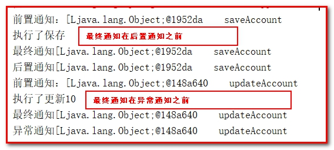 

 

### 5.4.2 完全使用注解（了解）

第一步：去掉applicationContext.xml

创建包com.itheima.config，创建类SpringConfiguration.java

````java
@Configuration
@ComponentScan(basePackages="com.itheima")
@EnableAspectJAutoProxy
public class SpringConfiguration {

}
````


第二步：测试类，AOPAnnoTest.java

````java
/**
 * 测试AOP的配置
 */
@RunWith(value = SpringJUnit4ClassRunner.class)
@ContextConfiguration(classes = SpringConfiguration.class)
public class AOPAnnoTest {

    @Autowired
    private AccountService as;

    @Test
    public void proxy(){
        //3.执行方法
        as.saveAccount();
    }
}
````

 

 