SpringMVC第2天笔记

# 第1章 课程计划。

 今日学习目标：

1：掌握Controller的返回值使用（第2章，2.2）

2：掌握Controller中的转发和重定向使用（第2章，2.3）

3：掌握SpringMVC与json交互（重点）（第2章，2.4）

4：掌握图片上传（第3章）

5：掌握SpringMVC的统一异常处理（第4章）

6：了解SpringMVC拦截器（第5章）

 

# 第2章  响应数据和结果视图  

## 2.1  开发准备

第一步：创建web工程

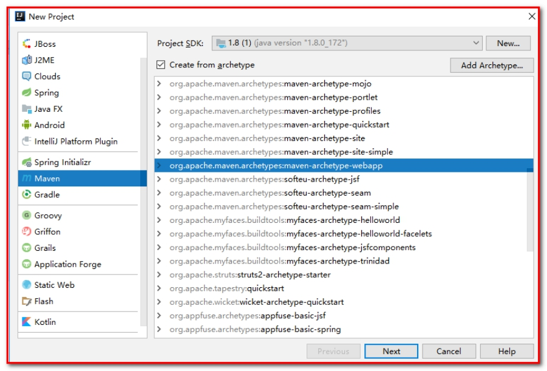 

项目名：springmvc_day02_response

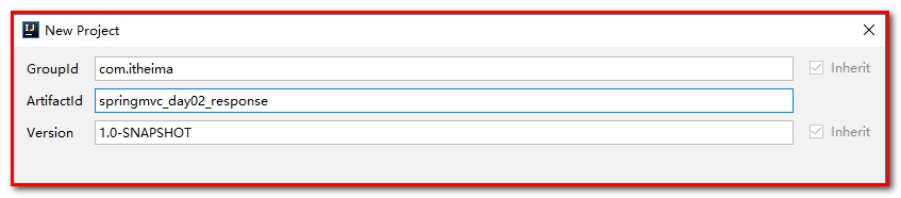 

指定：

Key：archetypeCatalog

Value：internal

解决web项目使用idea创建工程后，加载过慢的问题。

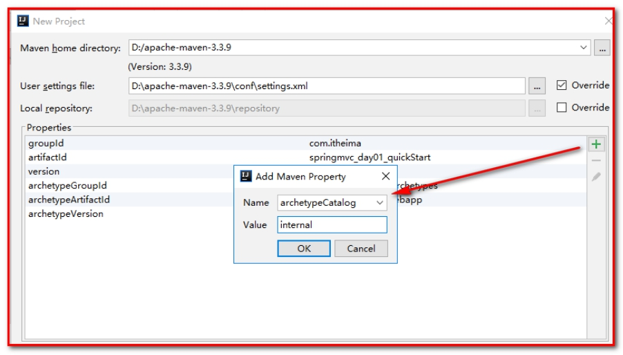 

第二步：导入jar包

````xml
<!-- 版本锁定 -->
<properties>
  <project.build.sourceEncoding>UTF-8</project.build.sourceEncoding>
  <maven.compiler.source>1.8</maven.compiler.source>
  <maven.compiler.target>1.8</maven.compiler.target>
  <spring.version>5.0.2.RELEASE</spring.version>
</properties>


<dependencies>
  <dependency>
    <groupId>org.springframework</groupId>
    <artifactId>spring-context</artifactId>
    <version>${spring.version}</version>
  </dependency>

  <dependency>
    <groupId>org.springframework</groupId>
    <artifactId>spring-web</artifactId>
    <version>${spring.version}</version>
  </dependency>

  <dependency>
    <groupId>org.springframework</groupId>
    <artifactId>spring-webmvc</artifactId>
    <version>${spring.version}</version>
  </dependency>

  <dependency>
    <groupId>javax.servlet</groupId>
    <artifactId>servlet-api</artifactId>
    <version>2.5</version>
    <scope>provided</scope>
  </dependency>

  <dependency>
    <groupId>javax.servlet.jsp</groupId>
    <artifactId>jsp-api</artifactId>
    <version>2.0</version>
    <scope>provided</scope>
  </dependency>
</dependencies>
````

第三步：配置web.xml

在web.xml配置文件中核心控制器DispatcherServlet

```xml
<!-- SpringMVC的核心控制器 -->
<servlet>
    <servlet-name>dispatcherServlet</servlet-name>
    <servlet-class>org.springframework.web.servlet.DispatcherServlet</servlet-class>
    <!-- 配置Servlet的初始化参数，读取springmvc的配置文件，创建spring容器 -->
    <init-param>
        <param-name>contextConfigLocation</param-name>
        <param-value>classpath:springmvc.xml</param-value>
    </init-param>
    <!-- 配置servlet启动时加载对象 -->
    <load-on-startup>1</load-on-startup>
</servlet>
<servlet-mapping>
    <servlet-name>dispatcherServlet</servlet-name>
    <url-pattern>/</url-pattern>
</servlet-mapping>
```

处理乱码的过滤器：

```xml
<!--处理乱码的过滤器-->
<filter>
    <filter-name>CharacterEncodingFilter</filter-name>
    <filter-class>org.springframework.web.filter.CharacterEncodingFilter</filter-class>
    <init-param>
        <param-name>encoding</param-name>
        <param-value>UTF-8</param-value>
    </init-param>
</filter>
<filter-mapping>
    <filter-name>CharacterEncodingFilter</filter-name>
    <url-pattern>/*</url-pattern>
</filter-mapping>
```

第四步：配置编写springmvc.xml的配置文件

在resources下创建springmvc.xml

```xml
<?xml version="1.0" encoding="UTF-8"?>
<beans xmlns="http://www.springframework.org/schema/beans"
       xmlns:mvc="http://www.springframework.org/schema/mvc"
       xmlns:context="http://www.springframework.org/schema/context"
       xmlns:xsi="http://www.w3.org/2001/XMLSchema-instance"
       xsi:schemaLocation="
        http://www.springframework.org/schema/beans
        http://www.springframework.org/schema/beans/spring-beans.xsd
        http://www.springframework.org/schema/mvc
        http://www.springframework.org/schema/mvc/spring-mvc.xsd
        http://www.springframework.org/schema/context
        http://www.springframework.org/schema/context/spring-context.xsd">

    <!-- 1：配置spring创建容器时要扫描的包 -->
    <context:component-scan base-package="com.itheima"></context:component-scan>

    <!-- 2：配置视图解析器 -->
    <bean id="viewResolver" class="org.springframework.web.servlet.view.InternalResourceViewResolver">
        <property name="prefix" value="/WEB-INF/pages/"></property>
        <property name="suffix" value=".jsp"></property>
    </bean>

    <!-- 3：配置spring开启注解mvc的支持 -->
    <mvc:annotation-driven></mvc:annotation-driven>
</beans>
```

第五步：创建index.jsp

````html
<%@ page contentType="text/html;charset=UTF-8" language="java" %>
<html>
<head>
    <title>Title</title>
</head>
<body>

</body>
</html>
````

第六步：在WEB-INF下创建pages的文件夹，创建success.jsp

```html
<body>
<h1>访问成功</h1>
</body>
```

## 2.2  返回值分类

### 2.2.1 返回字符串

Controller方法返回字符串可以指定逻辑视图的名称，根据视图解析器为物理视图的地址。

第一步：创建response.jsp

```html
<body>
<h3>返回字符串</h3>
<a href="user/testReturnString">返回字符串</a><br>
<a href="user/userUpdate">修改用户（表单回显）</a>
</body>
```

第二步：创建包com.itheima.controller，创建类UserController.java

```java
@Controller
@RequestMapping(path = "/user")
public class UserController {

    // 返回字符串
    @RequestMapping(path="/testReturnString")
    public String testReturnString(){
        System.out.println("执行了testReturnString方法！");
        return "success";
    }

    /**
     * 请求参数的绑定
     */
    @RequestMapping(value="/userUpdate")
    public String userUpdate(Model model) {
        // 模拟从数据库中查询的数据，在页面上进行回显
        User user = new User();
        user.setUsername("张三");
        user.setPassword("123");
        user.setAge(18);
        model.addAttribute("user", user);
        return "update";
    }
}
```

第三步：在WEB-INF的pages下，编写update.jsp

````html
<%@ page contentType="text/html;charset=UTF-8" language="java"  isELIgnored="false" %>
<html>
<head>
    <title>Title</title>
</head>
<body>
<h3>修改用户</h3>
${ requestScope }
<form action="${pageContext.request.contextPath}/
user/update" method="post">
    姓名：<input type="text" name="username" value="${ user.username }"><br>
    密码：<input type="text" name="password" value="${ user.password }"><br>
    年龄：<input type="text" name="age" value="${ user.age }"><br>
    <input type="submit" value="提交">
</form>
</body>
</html>
````

点击“提交”

````java
// 更新保存
@RequestMapping(value = "/update")
public String update(User user){
    System.out.println("执行UserController的update的方法！user："+user);
    return "success";
}
````

### 2.2.2 返回值是void（了解）

情况1：如果控制器的方法返回值编写成void，执行程序报404的异常，默认查找JSP页面没有找到。

默认会跳转到@RequestMapping(path="/testVoid")testVoid的页面。

response.jsp

```html
<h3>无返回值void</h3>
<a href="user/testVoid">无返回值</a>
```

userController.java

```java
// 无返回值
@RequestMapping(path="/testVoid")
public void testVoid(){
    System.out.println("执行了testVoid方法！");
}
```

结果抛出

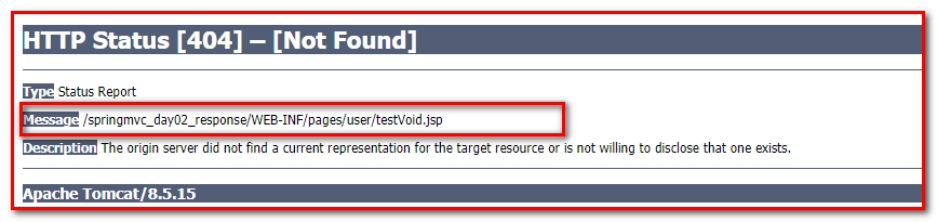 

情况2：可以使用请求转发或者重定向跳转到指定的页面

修改testVoid的方法

```java
@RequestMapping(value="/testVoid")
    public void testVoid(HttpServletRequest request, HttpServletResponse response) throws Exception {
        System.out.println("请求转发或者重定向");
        // 1：请求转发
//  request.getRequestDispatcher("/WEB-INF/pages/success.jsp").forward(request, response);
        // 2：重定向
//  response.sendRedirect(request.getContextPath()+"/index.jsp");


        response.setCharacterEncoding("UTF-8");
        response.setContentType("text/html;charset=UTF-8");

        // 3：直接响应数据
        response.getWriter().print("你好");
        return;
    }
```

页面结果：

情况3：如果不指定转发和重定向，直接响应数据。

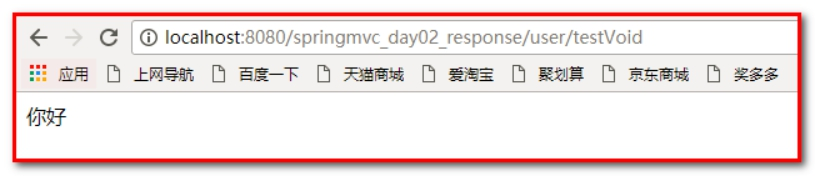 

 

### 2.2.3 返回值是ModelAndView对象

ModelAndView对象是Spring提供的一个对象，可以用来调整具体的JSP视图

具体的代码如下

第一步：response.jsp

```html
<h3>返回ModelAndView对象</h3>
<a href="user/testModelAndView">ModelAndView</a>
```

第二步：修改Usercontroller.java

```java
/**
 * 返回ModelAndView对象
 * 可以传入视图的名称（即跳转的页面），还可以传入对象。
 * @return
 * @throws Exception
 */
@RequestMapping(value="/testModelAndView")
public ModelAndView testModelAndView() throws Exception {
    ModelAndView mv = new ModelAndView();
    // 默认执行视图解析器，跳转到WEB-INF/pages/success.jsp的页面
    mv.setViewName("success");

    // 模拟从数据库中查询所有的用户信息
    List<User> list = new ArrayList<>();
    User user1 = new User();
    user1.setUsername("张三");
    user1.setPassword("123");

    User user2 = new User();
    user2.setUsername("赵四");
    user2.setPassword("456");

    list.add(user1);
    list.add(user2);
    // 添加对象
    mv.addObject("list", list);

    return mv;
}
```

第三步：导入jstl坐标

```xml
<dependency>
  <groupId>jstl</groupId>
  <artifactId>jstl</artifactId>
  <version>1.2</version>
</dependency>
```

第四步：success.jsp

遍历结果

```html
<%@ page contentType="text/html;charset=UTF-8" language="java" isELIgnored="false" %>
<%@taglib prefix="c" uri="http://java.sun.com/jsp/jstl/core" %>
<html>
<head>
    <title>Title</title>
</head>
<body>
<h1>访问成功</h1>
<h3>查询所有的数据</h3>
<c:forEach items="${ list }" var="user">
    ${ user.username }-----${user.password}<br>
</c:forEach>
</body>
</html>
```

查询结果

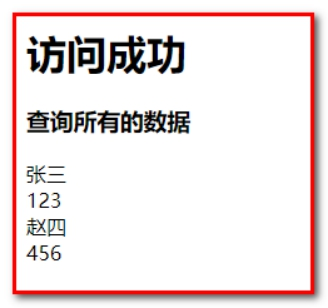 

## 2.3 	SpringMVC框架提供的转发和重定向（关键字）

### 2.3.1 forward请求转发

UserController.java方法返回String类型，想进行请求转发也可以编写成：

response.jsp

```html
<h3>转发和重定向</h3>
<a href="user/testForwardOrRedirect">ForwardOrRedirect</a>
```

UserController.java

````java
/**
     * 使用forward关键字进行请求转发
     * "forward:转发的JSP路径"，不走视图解析器了，所以需要编写完整的路径
     * @return
     * @throws Exception
     */
    @RequestMapping("/testForwardOrRedirect")
    public String testForwardOrRedirect() throws Exception {
        System.out.println("testForwardOrRedirect方法执行了...");
//        return "forward:/WEB-INF/pages/success.jsp";
        return "forward:/user/testReturnString";
    }
````

查询结果：

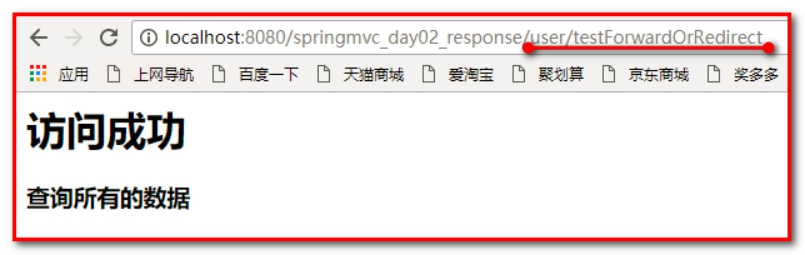 

### 2.3.2 redirect重定向

controller方法返回String类型，想进行重定向也可以编写成

```java
/**
     * 重定向
     * @return
     * @throws Exception
     */
    @RequestMapping("/testForwardOrRedirect")
    public String testForwardOrRedirect() throws Exception {
        System.out.println("testForwardOrRedirect方法执行了...");
//        return "redirect:/index.jsp";
        return "redirect:/user/testReturnString";
    }
```

查询结果：

 

 

 

## 2.4  @ResponseBody响应json数据

### 2.4.1 去掉对静态资源的拦截

1：DispatcherServlet会拦截到所有的资源，导致一个问题就是静态资源（img、css、js）也会被拦截到，从而不能被使用。

第一步：response.jsp

````html
<%@ page contentType="text/html;charset=UTF-8" language="java" %>
<script src="js/jquery.min.js"></script>
<script>
    $(function(){
        $("#btn").click(function(){
            alert("ok");
        })
    })
</script>
<html>
<head>
    <title>Title</title>
</head>
<body>
<h3>ResponseBody响应json数据</h3>
<input type="button" value="提交" id="btn"/>
</body>
</html>
````

此时发现【提交】按钮不起作用，因为springMVC的使用了servlet的配置，servlet中使用/，拦截所有的请求，js/jquery.min.js也被拦截了，不起作用。

【解决方案】：需要配置静态资源不进行拦截，在springmvc.xml配置文件添加如下配置

第二步：springmvc.xml配置

<mvc:resources>标签配置不过滤上

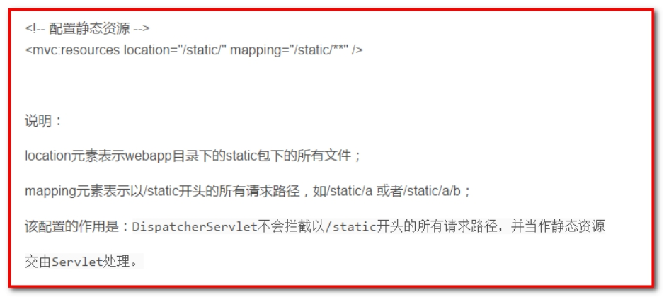 

location元素表示webapp目录下的包下的所有文件

mapping元素表示以/css开头的所有请求路径，如/css/a.css 或者/css/aa/b.css

```xml
<!-- 设置静态资源不过滤 -->
<mvc:resources location="/css/" mapping="/css/**"/>  <!-- css样式 -->
<mvc:resources location="/images/" mapping="/images/**"/>  <!-- 图片 -->
<mvc:resources location="/js/" mapping="/js/**"/>  <!-- javascript -->
```

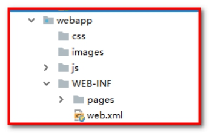 

推荐使用：在springmvc.xml中使用：

````xml
<!--去掉所有的静态资源，让DispatchServlet不能拦截静态资源-->
<!--方案一-->
<mvc:default-servlet-handler></mvc:default-servlet-handler>
````

### 2.4.2 使用@RequestBody获取请求的数据

使用@RequestBody获取请求体数据

response.jsp

````html
<script>
    $(function(){
        $("#btn").click(function(){
//          alert("ok");
            $.ajax({
                url:"user/testJson",
                contentType:"application/json;charset=UTF-8",
                data:'{"username":"tom","password":"123","age":30}',
                dataType:"json",
                type:"post",
                success:function(data){
                    alert(data);
                    alert(data.addressName);
                }
            });
        })
    })
</script>
````

UserController.java

````java
/**
 * 获取请求体的数据
 * @param body
 */
@RequestMapping("/testJson")
public void testJson(@RequestBody String body) {
    System.out.println(body);
}
````

此时输出：

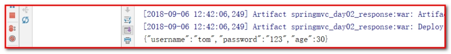
但是此时获取了json数据的字符串，我们需要将数据封装到javaBean的对象怎么办？

### 2.4.3 Jackson的jar包

json字符串和JavaBean对象互相转换的过程中，需要使用jackson的jar包

```xml
<dependency>
  <groupId>com.fasterxml.jackson.core</groupId>
  <artifactId>jackson-databind</artifactId>
  <version>2.9.0</version>
</dependency>
<dependency>
  <groupId>com.fasterxml.jackson.core</groupId>
  <artifactId>jackson-core</artifactId>
  <version>2.9.0</version>
</dependency>
<dependency>
  <groupId>com.fasterxml.jackson.core</groupId>
  <artifactId>jackson-annotations</artifactId>
  <version>2.9.0</version>
</dependency>
```

### 2.4.4 使用@ResponseBody注解将JavaBean对象转换成Json返回

使用@ResponseBody注解把JavaBean对象转换成json字符串，直接响应

要求方法需要返回JavaBean的对象

response.jsp

```html
<script src="js/jquery.min.js"></script>
<script>
    $(function(){
        $("#btn").click(function(){
//          alert("ok");
            $.ajax({
                url:"user/testJson",
                contentType:"application/json;charset=UTF-8",
                data:'{"username":"tom","password":"123","age":30}',
                dataType:"json",
                type:"post",
                success:function(data){
                    alert(data);
                    alert(data.username);
                    alert(data.password);
                    alert(data.age);
                }
            });
        })
    })
</script>
```

**注意**：data:'{"username":"tom","password":"123","age":30}',一定保证单引号在外，双引号在里，否则抛出异常：

````properties
14-Aug-2018 18:03:12.701 警告 [http-nio-8080-exec-163] org.springframework.web.servlet.mvc.support.DefaultHandlerExceptionResolver.handleHttpMessageNotReadable Failed to read HTTP message: org.springframework.http.converter.HttpMessageNotReadableException: JSON parse error: Unexpected character (''' (code 39)): was expecting double-quote to start field name; nested exception is com.fasterxml.jackson.core.JsonParseException: Unexpected character (''' (code 39)): was expecting double-quote to start field name
 at [Source: (PushbackInputStream); line: 1, column: 3]
````

UserController.java

```java
/**
 * 获取请求体的数据，响应数据Json
 * @param body
 */
@RequestMapping("/testJson")
public @ResponseBody User testJson(@RequestBody User user) {
    // 请求user
    System.out.println(user);
    // 响应u
    User u = new User();
    u.setUsername("张三");
    u.setPassword("123");
    u.setAge(18);
    return u;
}
```

查看请求：

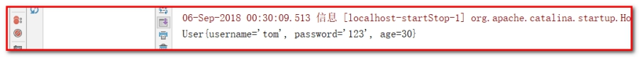 

查看响应：

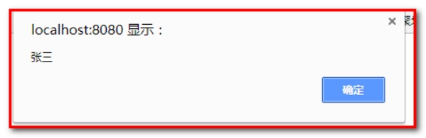 

 

 

# 第3章 SpringMVC实现文件上传 

 

## 3.1 文件上传的必要前提 

A： form表单的enctype取值必须是：multipart/form-data （支持二进制数据）

​			(默认值是:application/x-www-form-urlencoded) （支持传递参数，例如：?username=zhangsan&age=18）

​			enctype:是表单请求正文的类型 

B： method属性取值必须是Post 

C： 提供一个文件选择域<input type="file" /> 


## 3.2 文件上传的原理分析 

当form表单的enctype取值不是默认值后（例如：multipart/form-data），request.getParameter()将失效。

默认值：

enctype=”application/x-www-form-urlencoded”时，form表单的正文内容是：  

`key=value&key=value&key=value `

当form表单的enctype取值为Mutilpart/form-data时，请求正文内容就变成： 每一部分都是MIME类型描述的正文 

````properties
-----------------------------7de1a433602ac 分界符 
Content-Disposition: form-data; name="userName" 协议头 
aaa 协议的正文 
-----------------------------7de1a433602ac 
Content-Disposition: form-data; name="file"; filename="C:\Users\zhy\Desktop\fileupload_demofile\b.txt" 
Content-Type: text/plain 协议的类型（MIME类型） 
bbbbbbbbbbbbbbbbbbbbbbbbbbbbbbbb 
-----------------------------7de1a433602ac-- 
````

## 3.3 借助第三方组件实现文件上传 

使用Commons-fileupload组件实现文件上传，需要导入该组件相应的支撑jar包：Commons-fileupload和commons-io。commons-io 不属于文件上传组件的开发jar文件，但Commons-fileupload 组件从1.1 版本开始，它工作时需要commons-io包的支持。 

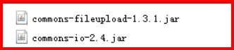 

## 3.4 springmvc传统方式的文件上传 

说明 

传统方式的文件上传，指的是我们上传的文件和访问的应用存在于同一台服务器上。 

并且上传完成之后，浏览器可能跳转。 

实现步骤 

第一步：创建项目，导入jar包

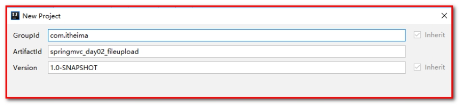 

pom.xml

````xml
<!-- 版本锁定 -->
<properties>
  <project.build.sourceEncoding>UTF-8</project.build.sourceEncoding>
  <maven.compiler.source>1.8</maven.compiler.source>
  <maven.compiler.target>1.8</maven.compiler.target>
  <spring.version>5.0.2.RELEASE</spring.version>
</properties>


<dependencies>
  <dependency>
    <groupId>org.springframework</groupId>
    <artifactId>spring-context</artifactId>
    <version>${spring.version}</version>
  </dependency>

  <dependency>
    <groupId>org.springframework</groupId>
    <artifactId>spring-web</artifactId>
    <version>${spring.version}</version>
  </dependency>

  <dependency>
    <groupId>org.springframework</groupId>
    <artifactId>spring-webmvc</artifactId>
    <version>${spring.version}</version>
  </dependency>

  <dependency>
    <groupId>javax.servlet</groupId>
    <artifactId>servlet-api</artifactId>
    <version>2.5</version>
    <scope>provided</scope>
  </dependency>

  <dependency>
    <groupId>javax.servlet.jsp</groupId>
    <artifactId>jsp-api</artifactId>
    <version>2.0</version>
    <scope>provided</scope>
  </dependency>

  <dependency>
    <groupId>jstl</groupId>
    <artifactId>jstl</artifactId>
    <version>1.2</version>
  </dependency>

  <dependency>
    <groupId>commons-fileupload</groupId>
    <artifactId>commons-fileupload</artifactId>
    <version>1.3.1</version>
  </dependency>
  <dependency>
    <groupId>commons-io</groupId>
    <artifactId>commons-io</artifactId>
    <version>2.4</version>
  </dependency>

</dependencies>
````

第二步：web.xml

````xml
<!-- SpringMVC的核心控制器 -->
<servlet>
    <servlet-name>dispatcherServlet</servlet-name>
    <servlet-class>org.springframework.web.servlet.DispatcherServlet</servlet-class>
    <!-- 配置Servlet的初始化参数，读取springmvc的配置文件，创建spring容器 -->
    <init-param>
        <param-name>contextConfigLocation</param-name>
        <param-value>classpath:springmvc.xml</param-value>
    </init-param>
    <!-- 配置servlet启动时加载对象 -->
    <load-on-startup>1</load-on-startup>
</servlet>
<servlet-mapping>
    <servlet-name>dispatcherServlet</servlet-name>
    <url-pattern>/</url-pattern>
</servlet-mapping>

<!--配置解决中文乱码过滤器-->
<filter>
    <filter-name>characterEncodingFilter</filter-name>
    <filter-class>org.springframework.web.filter.CharacterEncodingFilter</filter-class>
    <init-param>
        <param-name>encoding</param-name>
        <param-value>utf-8</param-value>
    </init-param>
</filter>
<filter-mapping>
    <filter-name>characterEncodingFilter</filter-name>
    <url-pattern>/*</url-pattern>
</filter-mapping>
````

第三步：springmvc.xml

````xml
<?xml version="1.0" encoding="UTF-8"?>
<beans xmlns="http://www.springframework.org/schema/beans"
       xmlns:mvc="http://www.springframework.org/schema/mvc"
       xmlns:context="http://www.springframework.org/schema/context"
       xmlns:xsi="http://www.w3.org/2001/XMLSchema-instance"
       xsi:schemaLocation="
        http://www.springframework.org/schema/beans
        http://www.springframework.org/schema/beans/spring-beans.xsd
        http://www.springframework.org/schema/mvc
        http://www.springframework.org/schema/mvc/spring-mvc.xsd
        http://www.springframework.org/schema/context
        http://www.springframework.org/schema/context/spring-context.xsd">
    <context:component-scan base-package="com.itheima.controller"/>

    <!--视图解析器-->
    <bean id="viewResolver" class="org.springframework.web.servlet.view.InternalResourceViewResolver">
        <property name="prefix" value="/WEB-INF/pages/"></property>
        <property name="suffix" value=".jsp"></property>
    </bean>

    <mvc:annotation-driven></mvc:annotation-driven>

    <!-- 设置静态资源不过滤 -->
    <mvc:default-servlet-handler></mvc:default-servlet-handler>

</beans>
````

第四步：导入index.jsp

````html
<body>
<a href="user/testFileUpload">文件上传</a>
</body>
````

第五步：导入UserController.java

```java
@Controller
@RequestMapping(path = "/user")
public class UserController {

    // 文件上传
    @RequestMapping(path="/testFileUpload")
    public String testFileUpload(){
        System.out.println("执行了testFileUpload方法！");
        return "success";
    }

}
```

导入WEB-INF/pages/success.jsp

````html
<body>
<h1>文件上传成功</h1>
</body>
````

发布到tomcat，测试。

### 3.4.1 普通文件上传

index.jsp

````html
<%--
   enctype="multipart/form-data"把请求体分成多个部分上传
--%>
<form action="user/testFileUpload1" method="post" enctype="multipart/form-data">
    选择文件：<input type="file" name="upload"><br/>
    <input type="submit" value="上传"/><br/>
</form>
````

UserController.java

```java
// 文件上传
@RequestMapping(path="/testFileUpload1")
public String testFileUpload1(HttpServletRequest request) throws Exception {
    System.out.println("执行了testFileUpload1方法！");
    // 上传的位置，获取到项目根目录下的uploads文件夹绝对路径
    String path = request.getSession().getServletContext().getRealPath("/uploads");
    // 创建file对象
    File file = new File(path);
    // 判断是否存在
    if(!file.exists()) {
        // 创建目录
        file.mkdirs();
    }

    // 创建磁盘文件项工厂
    DiskFileItemFactory factory = new DiskFileItemFactory();
    ServletFileUpload fileUpload = new ServletFileUpload(factory);
    // 解析request
    List<FileItem> list = fileUpload.parseRequest(request);
    // 遍历，获取到每一个文件项的对象
    for (FileItem fileItem : list) {
        // 判断，当前fileItem是否是文件项
        if(fileItem.isFormField()) {
            // 说明是普通的表单 ，文本框
        }else {
            // 一定文件上传项 fileItem
            // 获取到文件的名称
            String filename = fileItem.getName();
            // 生成唯一标识
            String uuid = UUID.randomUUID().toString().replace("-", "").toUpperCase();
            filename = uuid+"_"+filename;
            // 上传文件
            fileItem.write(new File(file, filename));
            // 删除临时文件
            fileItem.delete();
        }
    }

    return "success";
}
```

查看上传结果：

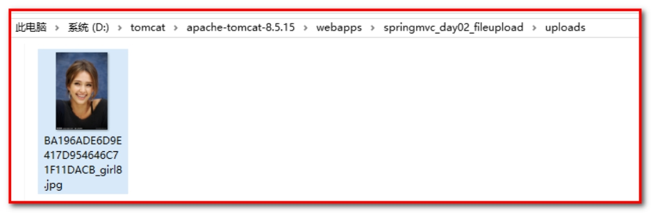 

 

### 3.4.2 SpringMVC传统方式文件上传

简化ServletFileUpload的写法。

SpringMVC框架提供了MultipartFile对象，该对象表示上传的文件，要求变量名称必须和表单file标签的name属性名称相同。

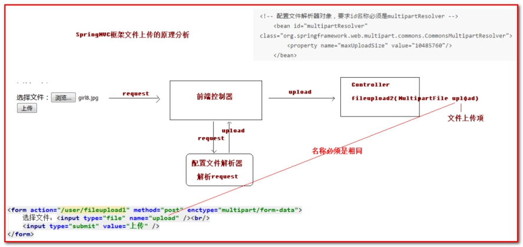 

 

第一步：springmvc.xml中配置

配置文件解析器对象

````xml
<!-- 配置文件解析器对象，要求id名称必须是multipartResolver -->
<bean id="multipartResolver" class="org.springframework.web.multipart.commons.CommonsMultipartResolver">
    <!--文件大小限制：10*1024*1024字节，表示10M-->
    <property name="maxUploadSize" value="10485760"/>
</bean>
````

第二步：index.jsp

```html
<hr>
<form action="user/testFileUpload2" method="post" enctype="multipart/form-data">
    选择文件：<input type="file" name="upload"><br/>
    <input type="submit" value="上传"/><br/>
</form>
```

第三步：UserController.java

````java
/**
 * 使用的是SpringMVC的文件上传
 * 框架提供了一个类，表示上传文件的对象，底层已经帮你解析了request对象，把文件上传对象通过方法的参数传递进来
 *
 * MultipartFile upload    变量名称必须和表单file标签的name属性名称相同，上传文件的对象，SpringMVC框架传递给你的。
 *
 * @param request
 * @return
 * @throws Exception
 */
@RequestMapping("/testFileUpload2")
public String testFileUpload2(HttpServletRequest request,MultipartFile upload) throws Exception {
    System.out.println("SpringMVC的上传文件...");
    // 上传的位置，获取到项目根目录下的uploads文件夹绝对路径
    String path = request.getSession().getServletContext().getRealPath("/uploads");
    // 创建file对象
    File file = new File(path);
    // 判断是否存在
    if(!file.exists()) {
        // 创建目录
        file.mkdirs();
    }

    // 获取到文件的名称
    String filename = upload.getOriginalFilename();
    // 生成唯一标识
    String uuid = UUID.randomUUID().toString().replace("-", "").toUpperCase();
    filename = uuid+"_"+filename;
    // 使用upload对象中方法就直接上传文件
    upload.transferTo(new File(file, filename));

    return "success";
}
````

## 3.5 springmvc跨服务器方式的文件上传 

### 3.5.1 分服务器的目的 

在实际开发中，我们会有很多处理不同功能的服务器。例如： 

应用服务器：负责部署我们的应用 （源码）

数据库服务器：运行我们的数据库 

缓存和消息服务器：负责处理大并发访问的缓存和消息 

文件服务器：负责存储用户上传文件的服务器。

图片服务器：负责存储用户上传的图片的信息。 

(注意：此处说的不是服务器集群） 

分服务器处理的目的是让服务器各司其职，从而提高我们项目的运行效率。 

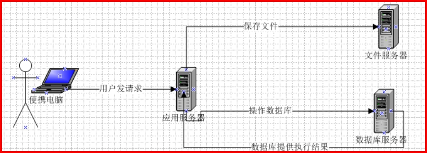 

 

### 3.5.2 准备两个tomcat服务器，并创建一个用于存放图片的web工程 

第一步：创建工程

选择项目，右键，new一个Module

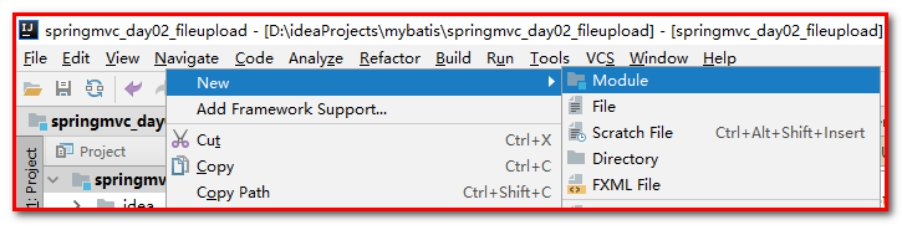 

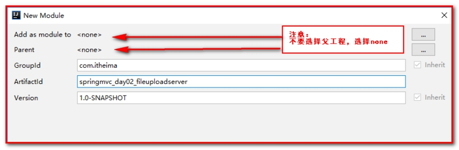 

第二步：创建2个tomcat服务器

一个应用服务器：用来启动springmvc_day02_fileupload（端口：8080）

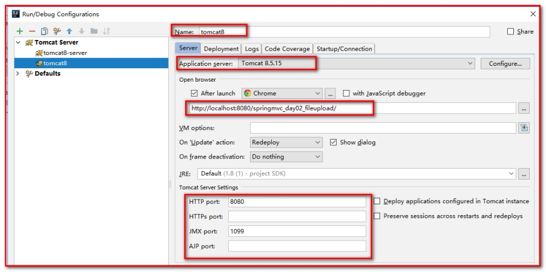 

另一个图片服务器：用来启动springmvc_day02_fileuploadserver（端口：9090）

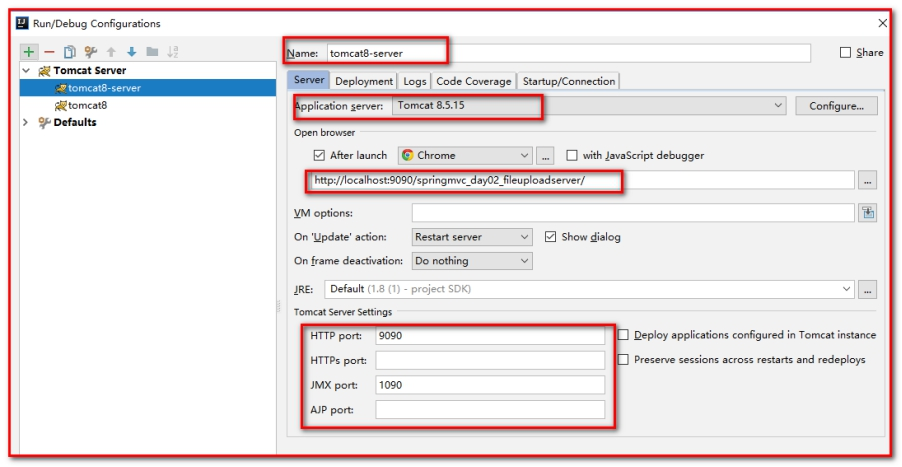 

两个服务器的端口需要不一致

同时在图片服务器上创建upload文件夹，用来指定上传的文件。

 

### 3.5.3 导入jar包

在我们负责处理文件上传的项目中拷贝文件上传的必备jar包 

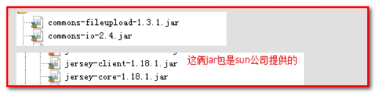 

导入开发需要的jar包

````xml
<dependency>
  <groupId>commons-fileupload</groupId>
  <artifactId>commons-fileupload</artifactId>
  <version>1.3.1</version>
</dependency>
<dependency>
  <groupId>commons-io</groupId>
  <artifactId>commons-io</artifactId>
  <version>2.4</version>
</dependency>

<dependency>
  <groupId>com.sun.jersey</groupId>
  <artifactId>jersey-core</artifactId>
  <version>1.18.1</version>
</dependency>
<dependency>
  <groupId>com.sun.jersey</groupId>
  <artifactId>jersey-client</artifactId>
  <version>1.18.1</version>
</dependency>
````

### 3.5.4 文件上传

index.jsp

````html
<hr>
<form action="user/testFileUpload3" method="post" enctype="multipart/form-data">
    选择文件：<input type="file" name="upload"><br/>
    <input type="submit" value="上传"/><br/>
</form>
````

UserController.java

````java
/**
 * 跨服务器上传文件，把文件上传到图片服务器中去
 * @param upload
 * @return
 * @throws Exception
 */
@RequestMapping("/testFileUpload3")
public String testFileUpload3(MultipartFile upload) throws Exception {
    System.out.println("跨服务器上传文件...");

    // 指定上传文件的路径
    String path = "http://localhost:9090/springmvc_day02_fileuploadserver/uploads/";

    // 获取到文件的名称
    String filename = upload.getOriginalFilename();
    // 生成唯一标识
    String uuid = UUID.randomUUID().toString().replace("-", "").toUpperCase();
    filename = uuid+"_"+filename;

    // 上传文件
    // 创建客户端对象
    Client client = Client.create();
    filename = path+filename;
    // 连接图片服务器
    WebResource webResource = client.resource(filename);
    // 把文件上传到图片服务器上
    webResource.put(upload.getBytes());

    return "success";
}
````

查看上传的文件：

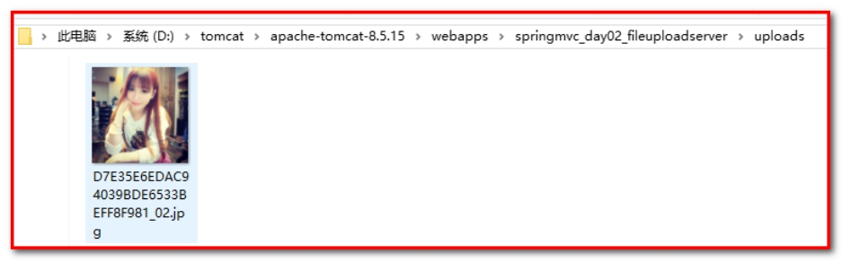 

可在success.jsp中，显示上传的图片

```html
<body>
    ${pageContext.request.contextPath}
    <h1>访问成功！</h1>
    
</body>
```

**注意：**如果抛出异常：returned a response status of 403 Forbidden

出现这个错误的原因是因为我将图片上传单独部署了一个服务器。但是图片不能写入。需要在这个存储图片的项目所在的tomcat中配置可写操作。具体的是在Tomcat目录下的conf文件夹下的web.xml中加入

加入此行的含义是：接收文件的目标服务器可以支持写入操作。 

````xml
<servlet>
        <servlet-name>default</servlet-name>
        <servlet-class>org.apache.catalina.servlets.DefaultServlet</servlet-class>
        <init-param>
            <param-name>debug</param-name>
            <param-value>0</param-value>
        </init-param>
		<init-param>
			<param-name>readonly</param-name>
			<param-value>false</param-value>
        </init-param>
        <init-param>
            <param-name>listings</param-name>
            <param-value>false</param-value>
        </init-param>
        <load-on-startup>1</load-on-startup>
    </servlet>
````

# 第4章 SpringMVC的异常处理

## 4.1  异常处理思路

系统中异常包括两类：预期异常和运行时异常RuntimeException，前者通过捕获异常从而获取异常信息，后者主要通过规范代码开发、测试通过手段减少运行时异常的发生。 系统的dao、service、controller出现都通过throws Exception向上抛出，最后由springmvc前端控制器交由异常处理器进行异常处理

 

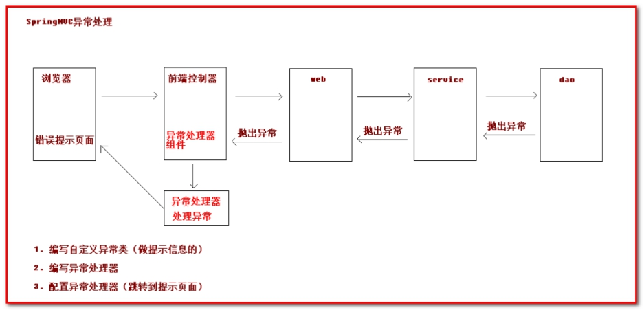 

## 4.2  SpringMVC的异常处理

第一步：创建工程

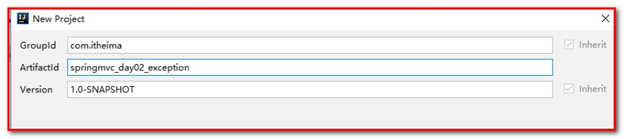 

第二步：导入坐标

````xml
<!-- 版本锁定 -->
<properties>
  <project.build.sourceEncoding>UTF-8</project.build.sourceEncoding>
  <maven.compiler.source>1.8</maven.compiler.source>
  <maven.compiler.target>1.8</maven.compiler.target>
  <spring.version>5.0.2.RELEASE</spring.version>
</properties>

<dependencies>
  <dependency>
    <groupId>org.springframework</groupId>
    <artifactId>spring-context</artifactId>
    <version>${spring.version}</version>
  </dependency>

  <dependency>
    <groupId>org.springframework</groupId>
    <artifactId>spring-web</artifactId>
    <version>${spring.version}</version>
  </dependency>

  <dependency>
    <groupId>org.springframework</groupId>
    <artifactId>spring-webmvc</artifactId>
    <version>${spring.version}</version>
  </dependency>

  <dependency>
    <groupId>javax.servlet</groupId>
    <artifactId>servlet-api</artifactId>
    <version>2.5</version>
    <scope>provided</scope>
  </dependency>

  <dependency>
    <groupId>javax.servlet.jsp</groupId>
    <artifactId>jsp-api</artifactId>
    <version>2.0</version>
    <scope>provided</scope>
  </dependency>

  <dependency>
    <groupId>jstl</groupId>
    <artifactId>jstl</artifactId>
    <version>1.2</version>
  </dependency>
</dependencies>
````

第三步：web.xml

````xml
<!-- SpringMVC的核心控制器 -->
<servlet>
    <servlet-name>dispatcherServlet</servlet-name>
    <servlet-class>org.springframework.web.servlet.DispatcherServlet</servlet-class>
    <!-- 配置Servlet的初始化参数，读取springmvc的配置文件，创建spring容器 -->
    <init-param>
        <param-name>contextConfigLocation</param-name>
        <param-value>classpath:springmvc.xml</param-value>
    </init-param>
    <!-- 配置servlet启动时加载对象 -->
    <load-on-startup>1</load-on-startup>
</servlet>
<servlet-mapping>
    <servlet-name>dispatcherServlet</servlet-name>
    <url-pattern>/</url-pattern>
</servlet-mapping>

<!--配置解决中文乱码过滤器-->
<filter>
    <filter-name>characterEncodingFilter</filter-name>
    <filter-class>org.springframework.web.filter.CharacterEncodingFilter</filter-class>
    <init-param>
        <param-name>encoding</param-name>
        <param-value>utf-8</param-value>
    </init-param>
</filter>
<filter-mapping>
    <filter-name>characterEncodingFilter</filter-name>
    <url-pattern>/*</url-pattern>
</filter-mapping>
````

第四步：springmvc.xml

```xml
<?xml version="1.0" encoding="UTF-8"?>
<beans xmlns="http://www.springframework.org/schema/beans"
       xmlns:mvc="http://www.springframework.org/schema/mvc"
       xmlns:context="http://www.springframework.org/schema/context"
       xmlns:xsi="http://www.w3.org/2001/XMLSchema-instance"
       xsi:schemaLocation="
        http://www.springframework.org/schema/beans
        http://www.springframework.org/schema/beans/spring-beans.xsd
        http://www.springframework.org/schema/mvc
        http://www.springframework.org/schema/mvc/spring-mvc.xsd
        http://www.springframework.org/schema/context
        http://www.springframework.org/schema/context/spring-context.xsd">
    <context:component-scan base-package="com.itheima.controller"/>

    <!--视图解析器-->
    <bean id="viewResolver" class="org.springframework.web.servlet.view.InternalResourceViewResolver">
        <property name="prefix" value="/WEB-INF/pages/"></property>
        <property name="suffix" value=".jsp"></property>
    </bean>

    <mvc:annotation-driven></mvc:annotation-driven>

    <!-- 设置静态资源不过滤 -->
    <mvc:resources location="/css/" mapping="/css/**"/>  <!-- 样式 -->
    <mvc:resources location="/images/" mapping="/images/**"/>  <!-- 图片 -->
    <mvc:resources location="/js/" mapping="/js/**"/>  <!-- javascript -->

</beans>
```

第五步：导入index.jsp

```html
<body>
<a href="user/testException">异常处理</a>
</body>
```

第六步：导入UserController.java

```java
@Controller
@RequestMapping(path = "/user")
public class UserController {

    // 自定义异常处理
    @RequestMapping(path="/testException")
    public String testException(){
        System.out.println("执行了testException方法！");
        int a = 10/0;
        return "success";
    }
}
```

导入WEB-INF/pages/success.jsp

```html
<body>
<h1>访问成功！</h1>
</body>
```

发布到tomcat，测试。

抛出异常：

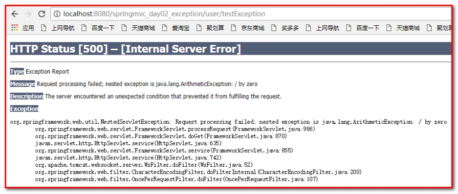 

### 4.2.1 第一步：编写自定义异常类

创建包com.itheima.exception，创建类SysException.java。

```java
/**
 * 自定义异常类
 */
public class SysException extends Exception {

    // 异常提示信息
    private String message;

    public String getMessage() {
        return message;
    }
    public void setMessage(String message) {
        this.message = message;
    }
    public SysException(String message) {
        this.message = message;
    }
}
```

### 4.2.2 第二步：编写异常处理器

创建包com.itheima.exception，创建类SysException.java。

````java
/**
 * 编写异常处理器
 */
public class SysExceptionResolver implements HandlerExceptionResolver {

    /**
     * 跳转到具体的错误页面的方法
     */
    @Override
    public ModelAndView resolveException(HttpServletRequest httpServletRequest, HttpServletResponse httpServletResponse, @Nullable Object o, Exception e) {
        e.printStackTrace();
        SysException se = null;
        // 获取到异常对象
        if(e instanceof SysException) {
            se = (SysException) e;
        }else {
            se = new SysException("请联系管理员");
        }
        ModelAndView mv = new ModelAndView();
        // 存入错误的提示信息
        mv.addObject("message", se.getMessage());
        // 跳转的Jsp页面
        mv.setViewName("error");// 跳转到WEB-INF/pages/error.jsp
        return mv;
    }
}
````

### 4.2.3 第三步：配置异常处理器（跳转到错误提示页面）

springmvc.xml

````xml
<!-- 配置异常处理器 -->
<bean id="sysExceptionResolver" class="com.itheima.exception.SysExceptionResolver"/>
````

### 4.2.4 第四步：修改UserController.java

````java
// 自定义异常处理
@RequestMapping(path="/testException")
public String testException() throws SysException{
    System.out.println("执行了testException方法！");
    try {
        int a = 10/0;
    } catch (Exception e) {
        // 在控制台打印
        e.printStackTrace();
        throw new SysException("服务器繁忙，稍后再试...");
    }
    return "success";
}
````

### 4.2.5 第五步：指定error.jsp错误页面

````html
<%@ page contentType="text/html;charset=UTF-8" language="java" isELIgnored="false" %>
<html>
<head>
    <title>Title</title>
</head>
<body>
<h1>访问失败</h1>
${message}<br>
</body>
</html>
````

效果：

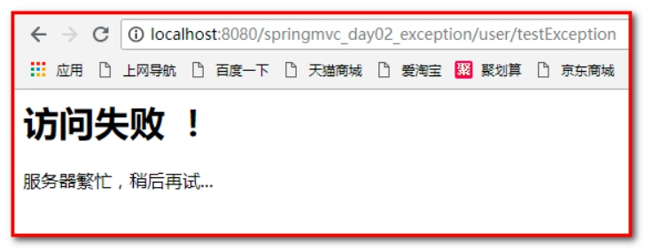 

# 第5章 SpringMVC中的拦截器 

## 5.1  拦截器的作用 

Spring MVC 的处理器拦截器类似于Servlet开发中的过滤器Filter，用于对处理器（Controller）进行预处理和后处理。 

用户可以自己定义一些拦截器来实现特定的功能（权限控制、日志处理等）。 

谈到拦截器，还要向大家提一个词——拦截器链（Interceptor Chain）。拦截器链就是将拦截器按一定的顺序联结成一条链。在访问被拦截的方法或字段时，拦截器链中的拦截器就会按其之前定义的顺序被调用。 

说到这里，可能大家脑海中有了一个疑问，这不是我们之前学的过滤器吗？是的它和过滤器是有几分相似，但是也有区别，接下来我们就来说说他们的区别： 

过滤器和拦截器的区别：

区别1：

过滤器是servlet规范中的一部分，任何java web工程都可以使用。 

拦截器是SpringMVC框架自己的，只有使用了SpringMVC框架的工程才能用。 

区别2：

过滤器在url-pattern中配置了/\*之后，可以对所有要访问的资源拦截。 

拦截器它是只会拦截访问的控制器方法（只会拦截Controller），如果访问的是jsp，html,css,image或者js是不会进行拦截的。 

它也是AOP思想的具体应用。 

我们要想自定义拦截器， 要求必须实现：HandlerInterceptor接口。 

 

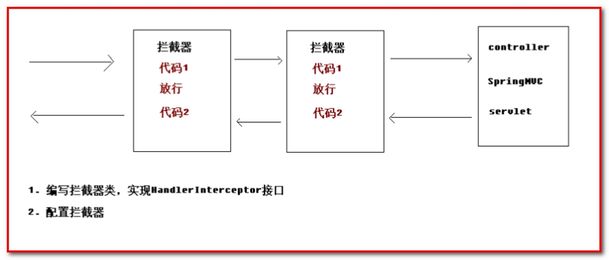 

## 5.2  自定义拦截器的步骤 

第一步：创建工程

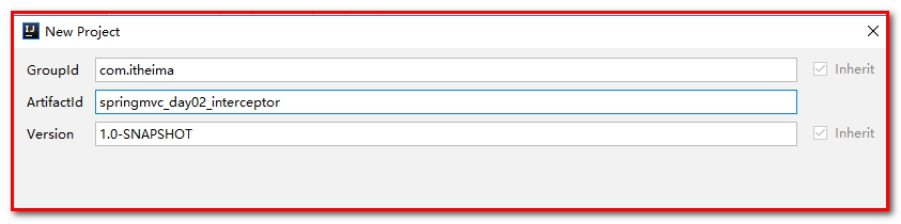 

第二步：导入坐标

````xml
<!-- 版本锁定 -->
<properties>
    <project.build.sourceEncoding>UTF-8</project.build.sourceEncoding>
    <maven.compiler.source>1.8</maven.compiler.source>
    <maven.compiler.target>1.8</maven.compiler.target>
    <spring.version>5.0.2.RELEASE</spring.version>
</properties>


<dependencies>
    <dependency>
        <groupId>org.springframework</groupId>
        <artifactId>spring-context</artifactId>
        <version>${spring.version}</version>
    </dependency>

    <dependency>
        <groupId>org.springframework</groupId>
        <artifactId>spring-web</artifactId>
        <version>${spring.version}</version>
    </dependency>

    <dependency>
        <groupId>org.springframework</groupId>
        <artifactId>spring-webmvc</artifactId>
        <version>${spring.version}</version>
    </dependency>

    <dependency>
        <groupId>javax.servlet</groupId>
        <artifactId>servlet-api</artifactId>
        <version>2.5</version>
        <scope>provided</scope>
    </dependency>

    <dependency>
        <groupId>javax.servlet.jsp</groupId>
        <artifactId>jsp-api</artifactId>
        <version>2.0</version>
        <scope>provided</scope>
    </dependency>

    <dependency>
        <groupId>jstl</groupId>
        <artifactId>jstl</artifactId>
        <version>1.2</version>
    </dependency>
</dependencies>
````

第三步：web.xml

`````xml
<!-- SpringMVC的核心控制器 -->
<servlet>
    <servlet-name>dispatcherServlet</servlet-name>
    <servlet-class>org.springframework.web.servlet.DispatcherServlet</servlet-class>
    <!-- 配置Servlet的初始化参数，读取springmvc的配置文件，创建spring容器 -->
    <init-param>
        <param-name>contextConfigLocation</param-name>
        <param-value>classpath:springmvc.xml</param-value>
    </init-param>
    <!-- 配置servlet启动时加载对象 -->
    <load-on-startup>1</load-on-startup>
</servlet>
<servlet-mapping>
    <servlet-name>dispatcherServlet</servlet-name>
    <url-pattern>/</url-pattern>
</servlet-mapping>

<!--配置解决中文乱码过滤器-->
<filter>
    <filter-name>characterEncodingFilter</filter-name>
    <filter-class>org.springframework.web.filter.CharacterEncodingFilter</filter-class>
    <init-param>
        <param-name>encoding</param-name>
        <param-value>utf-8</param-value>
    </init-param>
</filter>
<filter-mapping>
    <filter-name>characterEncodingFilter</filter-name>
    <url-pattern>/*</url-pattern>
</filter-mapping>
`````

第四步：springmvc.xml

````xml
<?xml version="1.0" encoding="UTF-8"?>
<beans xmlns="http://www.springframework.org/schema/beans"
       xmlns:mvc="http://www.springframework.org/schema/mvc"
       xmlns:context="http://www.springframework.org/schema/context"
       xmlns:xsi="http://www.w3.org/2001/XMLSchema-instance"
       xsi:schemaLocation="
        http://www.springframework.org/schema/beans
        http://www.springframework.org/schema/beans/spring-beans.xsd
        http://www.springframework.org/schema/mvc
        http://www.springframework.org/schema/mvc/spring-mvc.xsd
        http://www.springframework.org/schema/context
        http://www.springframework.org/schema/context/spring-context.xsd">
    <context:component-scan base-package="com.itheima.controller"/>

    <!--视图解析器-->
    <bean id="viewResolver" class="org.springframework.web.servlet.view.InternalResourceViewResolver">
        <property name="prefix" value="/WEB-INF/pages/"></property>
        <property name="suffix" value=".jsp"></property>
    </bean>

    <mvc:annotation-driven></mvc:annotation-driven>

    <!-- 设置静态资源不过滤 -->
    <mvc:resources location="/css/" mapping="/css/**"/>  <!-- 样式 -->
    <mvc:resources location="/images/" mapping="/images/**"/>  <!-- 图片 -->
    <mvc:resources location="/js/" mapping="/js/**"/>  <!-- javascript -->

</beans>
````

第四步：导入UserController.java

`````java
@Controller
@RequestMapping(path = "/user")
public class UserController {

    // 自定义拦截器
    @RequestMapping(path="/testInterceptor")
    public String testInterceptor(){
        System.out.println("执行了testInterceptor方法！");
        return "success";
    }
}
`````

第五步：导入index.jsp

```html
<body>
<a href="user/testInterceptor">自定义拦截器</a>
</body>
```

导入WEB-INF/pages/success.jsp

```html
<body>
<h1>访问成功</h1>
</body>
```

发布到tomcat，测试。

 

### 5.2.1 第一步：自定义拦截器

创建包com.itheima.interceptor，创建类MyInterceptor1.java，实现HandlerInterceptor接口

```java
public class MyInterceptor1 implements HandlerInterceptor{

    /**
     * controller方法执行前，进行拦截的方法
     * return true放行
     * return false拦截
     *   可以使用转发或者重定向直接跳转到指定的页面。
     */
    @Override
    public boolean preHandle(HttpServletRequest request, HttpServletResponse response, Object handler) throws Exception {
        System.out.println("访问Controller类之前执行...");
        return true;
    }
}
```

### 5.2.2 第二步：配置拦截器类

在springmvc.xml中配置拦截器类

```xml
<!--配置拦截器类-->
<mvc:interceptors>
    <mvc:interceptor>
        <!-- 哪些方法进行拦截 -->
        <mvc:mapping path="/user/*"/>
        <!--哪些方法不进行拦截-->
        <!--<mvc:exclude-mapping path="/user/save"/>-->
        <!-- 注册拦截器对象 -->
        <bean class="com.itheima.interceptor.MyInterceptor1"></bean>
    </mvc:interceptor>
</mvc:interceptors>
```

在success.jsp中添加：

````html
<body>
<h1>访问成功</h1>
<%
    System.out.println("浏览器success.jsp执行...");
%>
</body>
````

重新部署tomcat

测试：查看结果

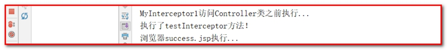 


### 5.2.3 HandlerInterceptor接口中的方法

1：preHandle方法是controller方法执行前拦截的方法

可以使用request或者response跳转到指定的页面

return true放行，执行下一个拦截器，如果没有拦截器，执行controller中的方法。

return false不放行，不会执行controller中的方法。

2：postHandle是controller方法执行后执行的方法，在JSP视图执行前。

可以使用request或者response跳转到指定的页面

如果指定了跳转的页面，那么controller方法跳转的页面将不会显示。

3：afterCompletion方法是在JSP执行后执行（用的不多）

request或者response不能再跳转页面了，否则抛出异常。

修改：MyInterceptor.java

````java
public class MyInterceptor1 implements HandlerInterceptor{

    /**
     * controller方法执行前，进行拦截的方法（预处理）
     * return true放行
     * return false拦截
     *   可以使用转发或者重定向直接跳转到指定的页面。
     */
    @Override
    public boolean preHandle(HttpServletRequest request, HttpServletResponse response, Object handler) throws Exception {
        System.out.println("MyInterceptor1访问Controller类之前执行...");
//        request.getRequestDispatcher("/WEB-INF/pages/error.jsp").forward(request,response);
        return true;
    }

    /**
     * controller方法执行后，进行拦截的方法（后处理），success.jsp执行之前
     *   可以使用转发或者重定向直接跳转到指定的页面。
     */
    @Override
    public void postHandle(HttpServletRequest request, HttpServletResponse response, Object handler, @Nullable ModelAndView modelAndView) throws Exception {
        System.out.println("MyInterceptor1访问Controller类之后执行...");
//        request.getRequestDispatcher("/WEB-INF/pages/error.jsp").forward(request,response);
    }

    /**
     *  success.jsp执行之后，该方法执行（终处理）
     */
    @Override
    public void afterCompletion(HttpServletRequest request, HttpServletResponse response, Object handler, @Nullable Exception ex) throws Exception {
        System.out.println("MyInterceptor1访问success.jsp之后...");
    }
}
````

重新启动tomcat，执行。

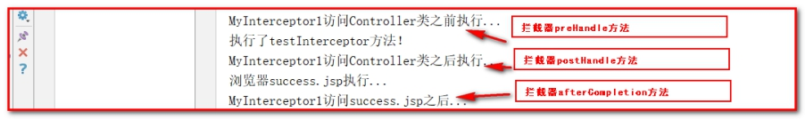 

## 5.3 配置多个拦截器

第一步：再编写一个拦截器的类MyInterceptor2.java

```java
public class MyInterceptor2 implements HandlerInterceptor{

    /**
     * controller方法执行前，进行拦截的方法（预处理）
     * return true放行
     * return false拦截
     *   可以使用转发或者重定向直接跳转到指定的页面。
     */
    @Override
    public boolean preHandle(HttpServletRequest request, HttpServletResponse response, Object handler) throws Exception {
        System.out.println("MyInterceptor2访问Controller类之前执行...");
//        request.getRequestDispatcher("/WEB-INF/pages/error.jsp").forward(request,response);
        return true;
    }

    /**
     * controller方法执行后，进行拦截的方法（后处理），success.jsp执行之前
     *   可以使用转发或者重定向直接跳转到指定的页面。
     */
    @Override
    public void postHandle(HttpServletRequest request, HttpServletResponse response, Object handler, @Nullable ModelAndView modelAndView) throws Exception {
        System.out.println("MyInterceptor2访问Controller类之后执行...");
//        request.getRequestDispatcher("/WEB-INF/pages/error.jsp").forward(request,response);
    }

    /**
     *  success.jsp执行之后，该方法执行（终处理）
     */
    @Override
    public void afterCompletion(HttpServletRequest request, HttpServletResponse response, Object handler, @Nullable Exception ex) throws Exception {
        System.out.println("MyInterceptor2访问success.jsp之后...");
    }
}
```

第二步：配置2个拦截器

````html
<!--配置拦截器类-->
<mvc:interceptors>
    <mvc:interceptor>
        <!-- 哪些方法进行拦截 -->
        <mvc:mapping path="/user/*"/>
        <!--哪些方法不进行拦截-->
        <!--<mvc:exclude-mapping path="/user/save"/>-->
        <!-- 注册拦截器对象 -->
        <bean class="com.itheima.interceptor.MyInterceptor1"></bean>
    </mvc:interceptor>
    <mvc:interceptor>
        <!-- 哪些方法进行拦截 -->
        <mvc:mapping path="/**"/>
        <!--哪些方法不进行拦截-->
        <!--<mvc:exclude-mapping path="/user/save"/>-->
        <!-- 注册拦截器对象 -->
        <bean class="com.itheima.interceptor.MyInterceptor2"></bean>
    </mvc:interceptor>
</mvc:interceptors>
````

启动tomcat，执行看效果：

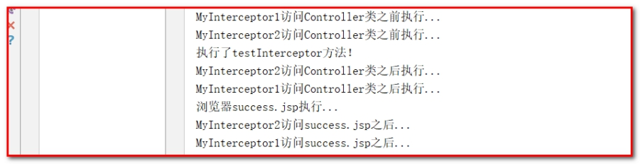 

 

使用拦截器处理“权限控制”，例如，存在session就能访问Controller，不存在session不能访问Controller，跳转到错误的页面（明天做）