Flink基础介绍

## 学习目标

- Flink基本介绍（了解）
  - 大数据发展历史
  - Flink性能比较
  - Flink在阿里的现状
- Flink集群安装（会用）
  - 伪分布式安装
  - StandAlone模式安装
  - StandAlone的高可用模式
  - Yarn模式
  - Yarn-Session
- Flink架构介绍（掌握）
  - Flink组件栈
  - 编程模型
  - 程序结构
  - 任务调度与执行
  - Flink的应用场景

## 1. Flink介绍

### 1.1. Flink引入

 这几年大数据的飞速发展，出现了很多热门的开源社区，其中著名的有`Hadoop`、`Storm`，以及后来的 `Spark`，他们都有着各自专注的应用场景。`Spark`掀开了`内存计算`的先河，/比较/也以内存为赌注，赢得了内存计算的飞速发展。Spark 的火热或多或少的掩盖了其他分布式计算的系统身影。就像 Flink，也就在这个时候默默的发展着。
 在国外一些社区，有很多人将大数据的计算引擎分成了`4 代`，当然也有很多人不会认同。我们先姑且这么认为和讨论。

第1代——Hadoop MapReduce

- 批处理
- Mapper、Reducer
   Hadoop的MapReduce将计算分为两个阶段，分别为 Map 和 Reduce。对于上层应用来说，就不得不想方设法去拆分算法，甚至于不得不在上层应用实现多个Job的串联，以完成一个完整的算法，例如迭代计算。

第2代——DAG框架（`Tez`） + MapReduce

- 批处理
- 1个Tez = MR(1) + MR(2) + ... + MR(n)
- 相比MR效率有所提升
  

第3代——Spark

- 批处理、流处理、SQL高层API支持
- 自带DAG
- 内存迭代计算、性能较之前大幅提升

第4代——Flink

- 批处理、流处理、SQL高层API支持
- 自带DAG
- 流式计算性能更高、可靠性更高
- flink做的最好的就是状态管理、内存管理

### 1.2. 什么是Flink

Flink概述:

- 分布式的`计算引擎`
- 支持`批处理`，即处理静态的数据集、历史的数据集
- 支持`流处理`，即实时地处理一些实时数据流
- 支持`基于事件`的应用【比如说滴滴通过`Flink CEP`实现实时监测司机的行为流来判断司机的行为是否正当】

官网地址:  <https://flink.apache.org/>
官网介绍:

`Stateful Computations over Data Streams`，即数据流上的有状态的计算。

- Data Streams ，Flink认为`有界数据集`是`无界数据流`的一种特例，所以说有界数据集也是一种数据流，事件流也是一种数据流。`Everything is streams`，即Flink可以用来处理任何的数据，可以支持批处理、流处理、AI、MachineLearning等等。
- Stateful Computations，即`有状态计算`。有状态计算是最近几年来越来越被用户需求的一个功能。比如说一个网站一天内访问UV数，那么这个UV数便为`状态`。Flink提供了内置的对状态的一致性的处理，即如果任务发生了Failover，其状态不会丢失、不会被多算少算，同时提供了非常高的性能。
`无界流`：意思很明显，只有开始没有结束。必须连续的处理无界流数据，也即是在事件注入之后立即要对其进行处理。不能等待数据到达了再去全部处理，因为数据是无界的并且永远不会结束数据注入。处理无界流数据往往要求事件注入的时候有一定的顺序性，例如可以以事件产生的顺序注入，这样会使得处理结果完整。
`有界流`：也即是有明确的开始和结束的定义。有界流可以等待数据全部注入完成了再开始处理。注入的顺序不是必须的了，因为对于一个静态的数据集，我们是可以对其进行排序的。有界流的处理也可以称为`批处理`。
其它特点:

- 性能优秀(尤其在流计算领域)
- 高可扩展性
- 支持容错
- `纯内存式`的计算引擎，做了内存管理方面的大量优化
- 支持`eventime`的处理
- 支持超大状态的Job(在阿里巴巴中作业的state大小超过TB的是非常常见的)
- 支持`exactly-once`的处理。

### 1.3. 性能比较

首先，我们可以通过下面的性能测试初步了解两个框架的性能区别，它们都可以基于内存计算框架进行实时计算，所以都拥有非常好的计算性能。经过测试，Flink计算性能上略好。
测试环境：

1.CPU：7000个;
2.内存：单机128GB;
3.版本：Hadoop 2.3.0，Spark 1.4，Flink 0.9
4.数据：800MB，8GB，8TB;
5.算法：K-means：以空间中K个点为中心进行聚类，对最靠近它们的对象归类。通过迭代的方法，逐次更新各聚类中心的值，直至得到最好的聚类结果。
6.迭代：K=10，3组数据

测试结果:
纵坐标是秒，横坐标是次数
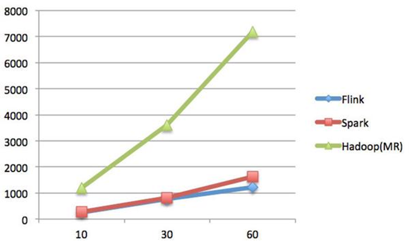

结论:
Spark和Flink全部都运行在Hadoop YARN上，性能为Flink > Spark > Hadoop(MR)，迭代次数越多越明显
性能上，Flink优于Spark和Hadoop最主要的原因是Flink支持`增量迭代`，具有`对迭代自动优化`的功能

### 1.4. 发展历史

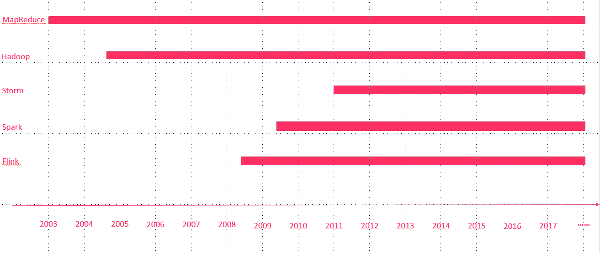
2008年，Flink 的前身已经是柏林理工大学一个研究性项目，原名 `StratoSphere`。
2014年，Flink被`Apache孵化器`所接受然后迅速地成为了 `ASF（Apache Software Foundation）`的顶级项目之一。
最新版本已经到了`1.9.0`
本次课程基于`flink-1.7.2`开发
spark是2009年诞生在`加州大学伯克利分校的AMP实验室`，2013年开源成为Apache孵化项目

### 1.5. Flink在阿里的现状

基于Apache Flink在阿里巴巴搭建的平台于2016年正式上线，并从阿里巴巴的`搜索`和`推荐`这两大场景开始实现。
目前阿里巴巴所有的业务，包括阿里巴巴所有子公司都采用了基于Flink搭建的实时计算平台。
同时Flink计算平台运行在开源的Hadoop集群之上。
采用Hadoop的`YARN`做为资源管理调度，以 `HDFS`作为数据存储。
因此，Flink可以和开源大数据软件Hadoop无缝对接。
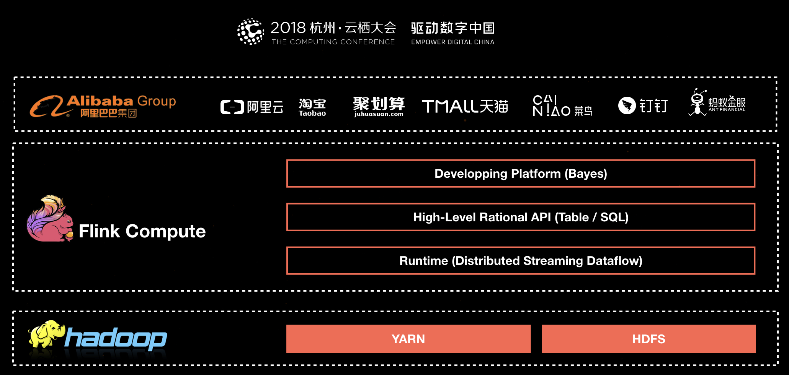
目前，这套基于Flink搭建的实时计算平台不仅服务于阿里巴巴集团内部，而且通过阿里云的云产品API向整个开发者生态提供基于Flink的云产品支持。
Flink在阿里巴巴的大规模应用，表现如何？

- 规模：一个系统是否成熟，规模是重要指标，Flink最初上线阿里巴巴只有数百台服务器，目前规模已达上万台，此等规模在全球范围内也是屈指可数；
- 状态数据：基于Flink，内部积累起来的状态数据已经是PB级别规模；
- Events：如今每天在Flink的计算平台上，处理的数据已经超过万亿条;
- TPS：在峰值期间可以承担每秒超过4.72亿次的访问，最典型的应用场景是`阿里巴巴双11大屏`；


Flink分支`Blink`

- 阿里自15年起开始调研开源流计算引擎，最终决定基于Flink打造新一代计算引擎
- 阿里贡献了数百个commiter，并对Flink进行高度定制，并取名为`Blink`
- 阿里是`Flink SQL`的最大贡献者，一半以上的功能都是阿里的工程师开发的

logo介绍

在德语中，flink 一词表示快速和灵巧 , 松鼠具有快速和灵巧的特点
柏林的松鼠是红棕色，Flink的松鼠 logo尾巴的颜色与 Apache 软件基金会的 logo 颜色相呼应

## 2. Flink集群安装

Flink支持多种安装模式

- local（本地）——单机模式，一般不使用
- standalone——独立模式，Flink自带集群，开发测试环境使用
- yarn——计算资源统一由Hadoop YARN管理，生产测试环境使用

### 2.1. 伪分布环境部署


- Flink程序需要提交给`Job Client`
- Job Client将作业提交给`Job Manager`
- Job Manager负责协调资源分配和作业执行。 资源分配完成后，任务将提交给相应的`Task Manager`
- Task Manager启动一个线程以开始执行。Task Manager会向Job Manager报告状态更改。例如开始执行，正在进行或已完成。
- 作业执行完成后，结果将发送回客户端（Job Client）

环境准备:

- 下载安装包 <https://archive.apache.org/dist/flink/flink-1.7.2/flink-1.7.2-bin-hadoop27-scala_2.11.tgz>
- 服务器: node01

安装步骤：

```shell
[root@node01 softwares]# cd /export/softwares/
#1. 上传压缩包
#2. 解压
[root@node01 softwares]# tar -zxvf flink-1.7.2-bin-hadoop27-scala_2.11.tgz  -C /export/servers/
#3.启动
[root@node01 servers]# cd /export/servers/flink-1.7.2/
[root@node01 flink-1.7.2]# ./bin/start-cluster.sh
[root@node01 flink-1.7.2]# jps
#使用JPS可以查看到下面两个进程
#- TaskManagerRunner
#- StandaloneSessionClusterEntrypoint
#4.访问web界面
http://node01:8081
```


`slot`在flink里面可以认为是资源组，Flink是通过将任务分成子任务并且将这些子任务分配到slot来并行执行程序。

5.运行测试任务

```shell
# 注意路路径
[root@node01 flink-1.7.2]# bin/flink run /export/servers/flink-1.7.2/examples/batch/WordCount.jar --input /root/zookeeper.out --output /export/servers/flink_data
```

控制台输出:

```text
Starting execution of program
Program execution finished
Job with JobID f6b24430b5701313da85d19dd7c6e959 has finished.
Job Runtime: 7106 ms
```

观察WebUI
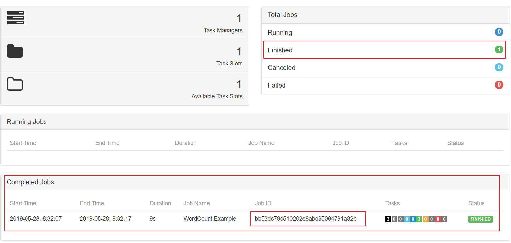

### 2.2. Standalone模式集群安装部署

Standalone集群架构


- client客户端提交任务给JobManager
- JobManager负责Flink集群计算资源管理，并分发任务给TaskManager执行
- TaskManager定期向JobManager汇报状态

环境准备:

- 服务器: node01(Master + Slave)
- 服务器: node02(Slave)
- 服务器: node03(Slave)

安装步骤:

```shell
#3.使用vi修改`conf/flink-conf.yaml`
[root@node01 flink-1.7.2]# vim conf/flink-conf.yaml

# jobManager 的IP地址
jobmanager.rpc.address: node01
# JobManager 的端口号
jobmanager.rpc.port: 6123
# JobManager JVM heap 内存大小
jobmanager.heap.size: 1024
# TaskManager JVM heap 内存大小
taskmanager.heap.size: 1024
# 每个 TaskManager 提供的任务 slots 数量大小
taskmanager.numberOfTaskSlots: 2
#是否进行预分配内存，默认不进行预分配，这样在我们不使用flink集群时候不会占用集群资源
taskmanager.memory.preallocate: false
# 程序默认并行计算的个数
parallelism.default: 1
#JobManager的Web界面的端口（默认：8081）
jobmanager.web.port: 8081
#配置每个taskmanager生成的临时文件目录（选配）
taskmanager.tmp.dirs: /export/servers/flink-1.7.2/tmp
```

slot和parallelism总结
taskmanager.numberOfTaskSlots:2
每一个taskmanager中的分配2个TaskSlot,3个taskmanager一共有6个TaskSlot
parallelism.default:1
运行程序默认的并行度为1，6个TaskSlot只用了1个，有5个空闲

1.`slot`是静态的概念，是指`taskmanager`具有的并发执行能力
2.`parallelism`是动态的概念，是指程序运行时实际使用的并发能力

4.使用vi修改slaves文件

```shell
[root@node01 flink-1.7.2]# vim conf/slaves
node01
node02
node03
```

5.使用vi修改`/etc/profile`系统环境变量配置文件，添加HADOOP_CONF_DIR目录

```shell
export HADOOP_CONF_DIR=/export/servers/hadoop-2.7.5/etc/hadoop
```

6.分发/etc/profile到其他两个节点

```shell
scp -r /etc/profile node02:/etc
scp -r /etc/profile node03:/etc
```

7.每个节点重新加载环境变量

```shell
source /etc/profile
```

8.使用scp命令分发flink到其他节点

```shell
[root@node01 flink-1.7.2]# scp -r /export/servers/flink-1.7.2/ node02:/export/servers/
[root@node01 flink-1.7.2]# scp -r /export/servers/flink-1.7.2/ node03:/export/servers/
```

9.启动Flink集群

```shell
[root@node01 flink-1.7.2]# ./bin/start-cluster.sh
```

启动/停止flink集群

- 启动：./bin/start-cluster.sh  
- 停止：./bin/stop-cluster.sh

启动/停止jobmanager
如果集群中的jobmanager进程挂了，执行下面命令启动

- bin/jobmanager.sh start
- bin/jobmanager.sh stop

启动/停止taskmanager
添加新的taskmanager节点或者重启taskmanager节点

- bin/taskmanager.sh start
- bin/taskmanager.sh stop

10.启动HDFS集群

```shell
 cd /export/servers/hadoop-2.7.5/sbin
 start-all.sh
```

11.在HDFS中创建/test/input目录

```shell

[root@node01 flink-1.7.2]# hdfs dfs -mkdir -p /test/input
```

12.上传wordcount.txt文件到HDFS /test/input目录

```shell
[root@node01 flink-1.7.2]# hdfs dfs -put /export/servers/flink-1.7.2/README.txt /test/input
```

13.并运行测试任务

```shell
[root@node01 flink-1.7.2]#  bin/flink run /export/servers/flink-1.7.2/examples/batch/WordCount.jar --input hdfs://node01:8020/test/input/README.txt --output hdfs://node01:8020/test/output2/result.txt
# 出现以下为执行完成
Starting execution of program
2019-09-27 15:05:26,984 WARN  org.apache.hadoop.hdfs.shortcircuit.DomainSocketFactory       - The short-circuit local reads feature cannot be used because libhadoop cannot be loaded.
Program execution finished
Job with JobID c3207aac9acd5f1455dc04699259e881 has finished.
Job Runtime: 2922 ms
```

14.浏览Flink Web UI界面

```shell
 http://node01:8081
```

### 2.3. Standalone高可用HA模式

从上述架构图中，可发现JobManager存在`单点故障`，一旦JobManager出现意外，整个集群无法工作。所以，为了确保集群的高可用，需要搭建Flink的HA。
HA架构图
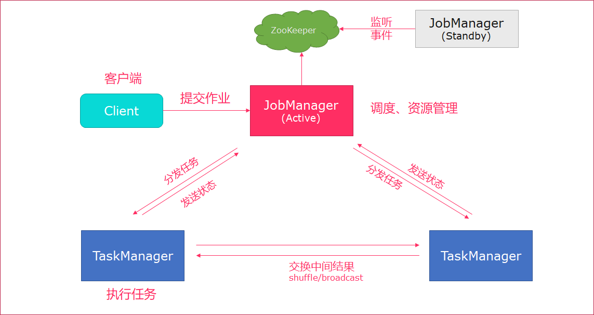
环境准备:
服务器: node01(Master + Slave)
服务器: node02(Master + Slave)
服务器: node03(Slave)

安装步骤

1. 在flink-conf.yaml中添加zookeeper配置

```yaml
#开启HA，使用文件系统作为快照存储
state.backend: filesystem
#启用检查点，可以将快照保存到HDFS
state.backend.fs.checkpointdir: hdfs://node01:8020/flink-checkpoints
#使用zookeeper搭建高可用
high-availability: zookeeper
# 存储JobManager的元数据到HDFS
high-availability.storageDir: hdfs://node01:8020/flink/ha/
high-availability.zookeeper.quorum: node01:2181,node02:2181,node03:2181
```

2.将配置过的HA的`flink-conf.yaml`分发到另外两个节点

```shell
[root@node01 flink-1.7.2]# scp -r /export/servers/flink-1.7.2/conf/flink-conf.yaml node02:/export/servers/flink-1.7.2/conf/
[root@node01 flink-1.7.2]# scp -r /export/servers/flink-1.7.2/conf/flink-conf.yaml node03:/export/servers/flink-1.7.2/conf/
```

3.到节点2中修改flink-conf.yaml中的配置，将JobManager设置为自己节点的名称

```shell
[root@node02 flink-1.7.2]# vim conf/flink-conf.yaml
jobmanager.rpc.address: node02
```

4.在node01的`masters`配置文件中添加多个节点

```shell
[root@node01 flink-1.7.2]# vim conf/masters
node01:8081
node02:8081
```

5.分发masters配置文件到另外两个节点

```shell
[root@node01 flink-1.7.2]# scp /export/servers/flink-1.7.2/conf/masters node02:/export/servers/flink-1.7.2/conf/
[root@node01 flink-1.7.2]# scp /export/servers/flink-1.7.2/conf/masters node03:/export/servers/flink-1.7.2/conf/
```

6.启动`zookeeper`集群
7.启动`HDFS`集群
8.启动`flink`集群

```shell
# 先停集群
[root@node01 flink-1.7.2]# ./bin/stop-cluster.sh
No taskexecutor daemon (pid: 76183) is running anymore on node01.
No taskexecutor daemon (pid: 47024) is running anymore on node02.
No taskexecutor daemon (pid: 55547) is running anymore on node03.
No standalonesession daemon (pid: 75692) is running anymore on node01.
No standalonesession daemon to stop on host node02.
# 再停集群
[root@node01 flink-1.7.2]# ./bin/start-cluster.sh  
Starting HA cluster with 2 masters.
[INFO] 1 instance(s) of standalonesession are already running on node01.
Starting standalonesession daemon on host node01.
Starting standalonesession daemon on host node02.
[INFO] 1 instance(s) of taskexecutor are already running on node01.
Starting taskexecutor daemon on host node01.
Starting taskexecutor daemon on host node02.
Starting taskexecutor daemon on host node03.
```

9.分别查看两个节点的Flink Web UI
<http://node01:8081>
<http://node02:8081>
10.kill掉一个节点，查看另外的一个节点的Web UI

```shell
[root@node02 flink-1.7.2]# jps
49122 TaskManagerRunner
19173
48614 StandaloneSessionClusterEntrypoint
18935 NodeManager
18792 DataNode
5117 QuorumPeerMain
49247 Jps
[root@node02 flink-1.7.2]# kill -9 48614
```

注意事项
切记搭建HA，需要将第二个节点的`jobmanager.rpc.address`修改为node02

### 2.4. Yarn集群环境

在一个企业中，为了最大化的利用集群资源，一般都会在一个集群中同时运行多种类型的 Workload。因此 Flink 也支持在`Yarn`上面运行；`flink on yarn`的前提是：hdfs、yarn均启动
集群规划
JobManager: node01
WorkManager: node01 node02 node03
步骤

1. 修改Hadoop的yarn-site.xml，添加该配置表示内存超过分配值，是否将任务杀掉。默认为true。
运行Flink程序，很容易超过分配的内存。

```shell
[root@node01 hadoop]# cd /export/servers/hadoop-2.7.5/etc/hadoop
[root@node01 hadoop]# vim yarn-site.xml
```

```xml
<property>
<name>yarn.nodemanager.vmem-check-enabled</name>
 <value>false</value>
</property>
```

2.分发yarn-site.xml到其它服务器节点

```shell
[root@node01 hadoop]# scp yarn-site.xml node02:$PWD
yarn-site.xml                                                                                  100% 1548     1.5KB/s   00:00
[root@node01 hadoop]# scp yarn-site.xml node03:$PWD
yarn-site.xml
```

3.启动HDFS、YARN集群

```shell
[root@node01 sbin]# cd /export/servers/hadoop-2.7.5/sbin
[root@node01 sbin]# start-all.sh
```

### 2.5. yarn-session

Flink运行在YARN上，可以使用`yarn-session`来快速提交作业到YARN集群。我们先来看下Flink On Yarn模式，Flink是如何和Yarn进行交互的。
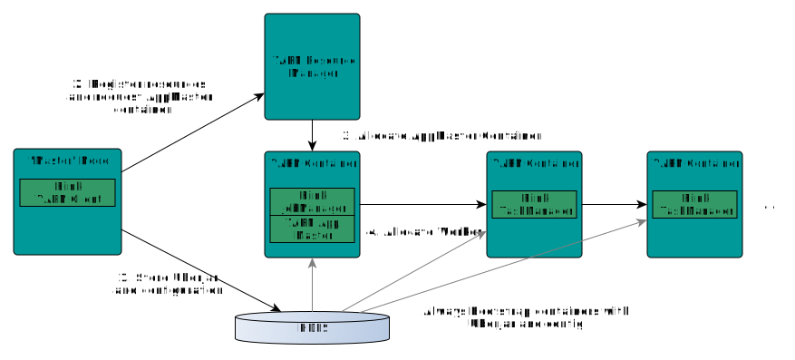

1. 上传jar包和配置文件到HDFS集群上
2. 申请资源和请求AppMaster容器
3. Yarn分配资源AppMaster容器，并启动JobManager

```shell
JobManager和ApplicationMaster运行在同一个container上。
一旦他们被成功启动，AppMaster就知道JobManager的地址（AM它自己所在的机器）。
它就会为TaskManager生成一个新的Flink配置文件（他们就可以连接到JobManager）。
这个配置文件也被上传到HDFS上。
此外，AppMaster容器也提供了Flink的web服务接口。
YARN所分配的所有端口都是临时端口，这允许用户并行执行多个Flink
```

4.申请worker资源，启动TaskManager


yarn-session提供两种模式: `会话模式`和`分离模式`

### 2.6. 会话模式

- 使用Flink中的yarn-session（yarn客户端），会启动两个必要服务`JobManager`和`TaskManager`
- 客户端通过yarn-session提交作业
- yarn-session会一直启动，不停地接收客户端提交的作用
- 有大量的小作业，适合使用这种方式


使用步骤:

1. 在flink目录启动yarn-session

```shell
[root@node01 sbin]# cd /export/servers/flink-1.7.2/
bin/yarn-session.sh -n 2 -tm 800 -s 1 -d

# -n 表示申请2个容器，
# -s 表示每个容器启动多少个slot
# -tm 表示每个TaskManager申请800M内存
# -d 表示以后台程序方式运行

yarn-session.sh脚本可以携带的参数:
Required
  -n,--container <arg>分配多少个yarn容器 (=taskmanager的数量)  
      Optional
        -D <arg>                        动态属性
        -d,--detached                    独立运行 （以分离模式运行作业）
        -id,--applicationId <arg>            YARN集群上的任务id，附着到一个后台运行的yarn session中
        -j,--jar <arg>                      Path to Flink jar file
        -jm,--jobManagerMemory <arg>     JobManager的内存 [in MB]
        -m,--jobmanager <host:port>        指定需要连接的jobmanager(主节点)地址  
                                       使用这个参数可以指定一个不同于配置文件中的jobmanager  
        -n,--container <arg>               分配多少个yarn容器 (=taskmanager的数量)
        -nm,--name <arg>                 在YARN上为一个自定义的应用设置一个名字
        -q,--query                        显示yarn中可用的资源 (内存, cpu核数)
        -qu,--queue <arg>                 指定YARN队列
        -s,--slots <arg>                   每个TaskManager使用的slots数量
        -st,--streaming                   在流模式下启动Flink
        -tm,--taskManagerMemory <arg>    每个TaskManager的内存 [in MB]
        -z,--zookeeperNamespace <arg>     针对HA模式在zookeeper上创建NameSpace
```

2.使用flink提交任务

```shell
[root@node01 flink-1.7.2]# bin/flink run examples/batch/WordCount.jar
```

3.如果程序运行完了，可以使用`yarn application -kill application_id`杀掉任务
<http://node01:8088/cluster/>

```shell
[root@node01 flink-1.7.2]# yarn application -kill application_1569136276193_0001
```

### 2.7. 分离模式

- 直接提交任务给YARN
- 大作业，适合使用这种方式


1. 使用flink直接提交任务

```shell
bin/flink run -m yarn-cluster -yn 2 ./examples/batch/WordCount.jar  

# -m  jobmanager的地址
# -yn 表示TaskManager的个数  
```

2.查看WEB UI
<http://node01:8088/cluster/>

## 3. Flink架构介绍

### 3.1. Flink基石

Flink之所以能这么流行，离不开它最重要的四个基石：`Checkpoint`、`State`、`Time`、`Window`。

首先是`Checkpoint`机制，这是Flink最重要的一个特性。Flink基于`Chandy-Lamport`算法实现了一个分布式的一致性的快照，从而提供了`一致性的语义`。Chandy-Lamport算法实际上在1985年的时候已经被提出来，但并没有被很广泛的应用，而Flink则把这个算法发扬光大了。Spark最近在实现Continue streaming，Continue streaming的目的是为了降低它处理的延时，其也需要提供这种一致性的语义，最终采用Chandy-Lamport这个算法，说明Chandy-Lamport算法在业界得到了一定的肯定。
提供了一致性的语义之后，Flink为了让用户在编程时能够更轻松、更容易地去`管理状态`，还提供了一套非常简单明了的State API，包括里面的有ValueState、ListState、MapState，近期添加了BroadcastState，使用State API能够自动享受到这种一致性的语义。
除此之外，Flink还实现了`Watermark`的机制，能够支持基于`事件的时间`的处理，或者说基于系统时间的处理，能够容忍数据的`迟到`、容忍`乱序`的数据。
另外流计算中一般在对流数据进行操作之前都会先进行开窗，即基于一个什么样的窗口上做这个计算。Flink提供了开箱即用的各种窗口，比如`滑动窗口`、`滚动窗口`、`会话窗口`以及非常灵活的`自定义的窗口`。

### 3.2. 组件栈

Flink是一个分层架构的系统，每一层所包含的组件都提供了特定的抽象，用来服务于上层组件。Flink分层的组件栈如下图所示：

从下至上：

- 部署层：Flink 支持本地运行、能在独立集群或者在被 YARN 管理的集群上运行， 也能部署在云上。
- 运行时：Runtime层提供了支持Flink计算的全部核心实现，为上层API层提供基础服务。
- API：DataStream、DataSet、Table、SQL API。
- 扩展库：Flink 还包括用于复杂事件处理，机器学习，图形处理和 Apache Storm 兼容性的专用代码库。

### 3.3. Flink数据流编程模型抽象级别

Flink 提供了不同的抽象级别以开发流式或批处理应用。
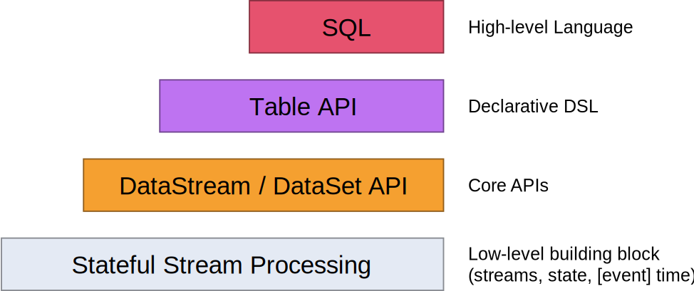

- 最底层提供了有状态流。它将通过 过程函数（Process Function）嵌入到 DataStream API 中。它允许用户可以自由地处理来自一个或多个流数据的事件，并使用一致、容错的状态。除此之外，用户可以注册事件时间和处理事件回调，从而使程序可以实现复杂的计算。
- DataStream/DataSet API 是 Flink 提供的核心 API ，DataSet 处理有界的数据集，DataStream 处理有界或者无界的数据流。用户可以通过各种方法（map/flatmap/window/keyby/sum/max/min/avg/join 等）将数据进行转换/计算。
- Table API 是以 表 为中心的声明式 DSL，其中表可能会动态变化（在表达流数据时）。Table API 提供了例如 select、project、join、group-by、aggregate 等操作，使用起来却更加简洁（代码量更少）。你可以在表与 DataStream/DataSet 之间无缝切换，也允许程序将 Table API 与 DataStream 以及 DataSet 混合使用。
- Flink 提供的最高层级的抽象是 SQL 。这一层抽象在语法与表达能力上与 Table API 类似，但是是以 SQL查询表达式的形式表现程序。SQL 抽象与 Table API 交互密切，同时 SQL 查询可以直接在 Table API 定义的表上执行。

### 3.4. Flink程序结构

Flink程序的基本构建块是流和转换（请注意，Flink的DataSet API中使用的DataSet也是内部流 ）。从概念上讲，流是（可能永无止境的）数据记录流，而转换是将一个或多个流作为一个或多个流的操作。输入，并产生一个或多个输出流。

Flink 应用程序结构就是如上图所示：
`Source`: 数据源，Flink 在流处理和批处理上的 source 大概有 4 类：基于本地集合的 source、基于文件的 source、基于网络套接字的 source、自定义的 source。自定义的 source 常见的有 Apache kafka、RabbitMQ 等，当然你也可以定义自己的 source。
`Transformation`：数据转换的各种操作，有 Map/FlatMap/Filter/KeyBy/Reduce/Fold/Aggregations/Window/WindowAll/Union/Window join/Split/Select等，操作很多，可以将数据转换计算成你想要的数据。
`Sink`：接收器，Flink 将转换计算后的数据发送的地点 ，你可能需要存储下来，Flink 常见的 Sink 大概有如下几类：写入文件、打印出来、写入 socket 、自定义的 sink 。自定义的 sink 常见的有 Apache kafka、RabbitMQ、MySQL、ElasticSearch、Apache Cassandra、Hadoop FileSystem 等，同理你也可以定义自己的 sink。

### 3.5. Flink并行数据流

Flink程序在执行的时候，会被映射成一个`Streaming Dataflow`，一个Streaming Dataflow是由一组`Stream`和`Transformation Operator`组成的。在启动时从一个或多个`Source Operator`开始，结束于一个或多个`Sink Operator`。
Flink程序本质上是`并行的和分布式`的，在执行过程中，一个流(stream)包含一个或多个流`分区`，而每一个operator包含一个或多个operator子任务。操作子任务间彼此独立，在不同的线程中执行，甚至是在不同的机器或不同的容器上。operator子任务的数量是这一特定operator的`并行度`。相同程序中的不同operator有不同级别的并行度。
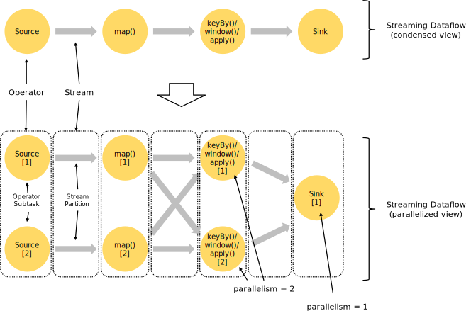
一个Stream可以被分成多个Stream的分区，也就是`Stream Partition`。一个Operator也可以被分为`多个Operator Subtask`。如上图中，Source被分成Source1和Source2，它们分别为Source的Operator Subtask。每一个Operator Subtask都是在`不同的线程`当中独立执行的。一个Operator的并行度，就等于Operator Subtask的个数。上图Source的并行度为2。而一个Stream的并行度就等于它生成的Operator的并行度。
数据在两个operator之间传递的时候有两种模式：
One to One模式：两个operator用此模式传递的时候，会保持数据的分区数和数据的排序；如上图中的Source1到Map1，它就保留的Source的分区特性，以及分区元素处理的有序性。
Redistributing （重新分配）模式：这种模式会改变数据的分区数；每个一个operator subtask会根据选择transformation把数据发送到不同的目标subtasks,比如keyBy()会通过hashcode重新分区,broadcast()和rebalance()方法会随机重新分区;

### 3.6. Task和Operator chain

Flink的所有操作都称之为Operator，客户端在提交任务的时候会对Operator进行优化操作，能进行合并的Operator会被合并为一个Operator，合并后的Operator称为Operator chain，实际上就是一个执行链，每个执行链会在TaskManager上一个独立的线程中执行。

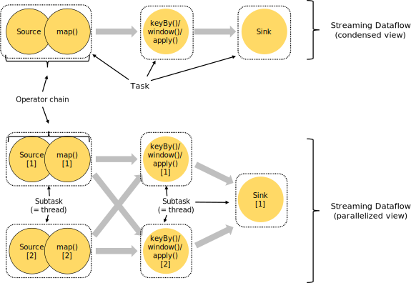

### 3.7. 任务调度与执行

------

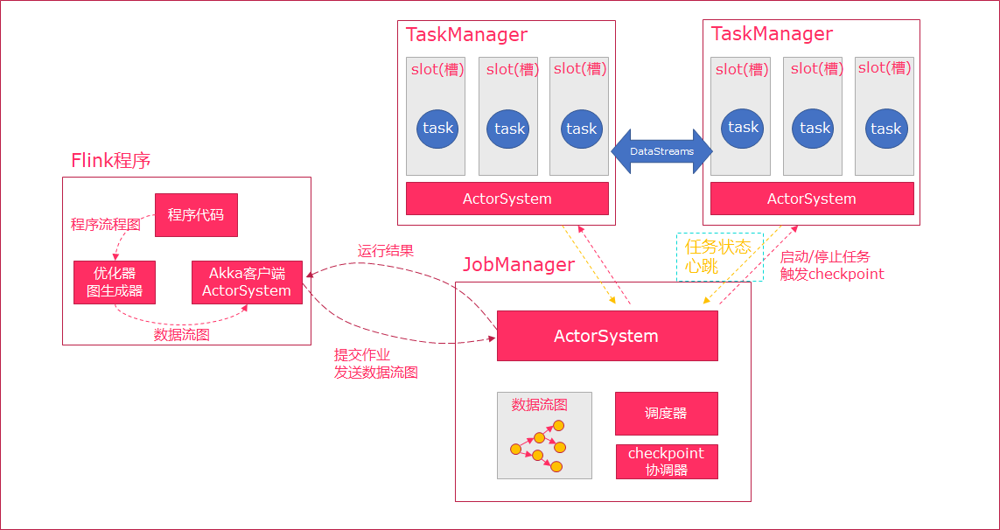

1. 当Flink执行executor会自动根据程序代码生成DAG数据流图
2. ActorSystem创建Actor将数据流图发送给JobManager中的Actor
3. JobManager会不断接收TaskManager的心跳消息，从而可以获取到有效的TaskManager
4. JobManager通过调度器在TaskManager中调度执行Task（在Flink中，最小的调度单元就是task，对应就是一个线程）
5. 在程序运行过程中，task与task之间是可以进行数据传输的

- Job Client

  - 主要职责是`提交任务`, 提交后可以结束进程, 也可以等待结果返回
  - Job Client `不是` Flink 程序执行的内部部分，但它是任务执行的`起点`。
  - Job Client 负责接受用户的程序代码，然后创建数据流，将数据流提交给 Job Manager 以便进一步执行。 执行完成后，Job Client 将结果返回给用户

- `JobManager`​

  - 主要职责是调度工作并协调任务做`检查点`
  - 集群中至少要有一个 `master`，master 负责调度 task，协调checkpoints 和容错，
  - 高可用设置的话可以有多个 master，但要保证一个是 leader, 其他是`standby`;
  - Job Manager 包含 `Actor System`、`Scheduler`、`CheckPoint`三个重要的组件
  - `JobManager`从客户端接收到任务以后, 首先生成`优化过的执行计划`, 再调度到`TaskManager`中执行
- `TaskManager`
  - 主要职责是从`JobManager`处接收任务, 并部署和启动任务, 接收上游的数据并处理
  - Task Manager 是在 JVM 中的一个或多个线程中执行任务的工作节点。
  - `TaskManager`在创建之初就设置好了`Slot`, 每个`Slot`可以执行一个任务

### 3.8. 任务槽（task-slot）和槽共享（Slot Sharing）

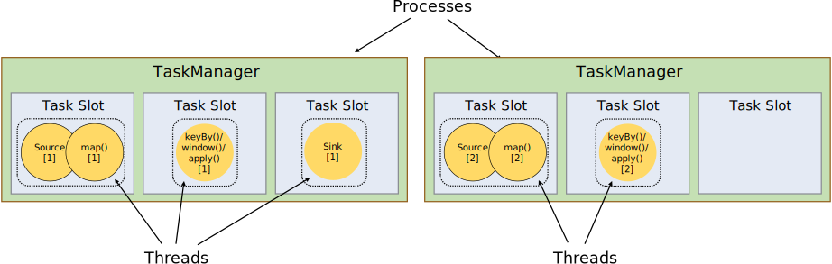
每个TaskManager是一个JVM的`进程`, 可以在不同的线程中执行一个或多个子任务。
为了控制一个worker能接收多少个task。worker通过task slot来进行控制（一个worker至少有一个task slot）。
每个task slot表示TaskManager拥有资源的一个固定大小的子集。
flink将进程的内存进行了划分到多个slot中。
图中有2个TaskManager，每个TaskManager有3个slot的，每个slot占有1/3的内存。
内存被划分到不同的slot之后可以获得如下好处:

- TaskManager最多能同时并发执行的任务是可以控制的，那就是3个，因为不能超过slot的数量。
- slot有独占的内存空间，这样在一个TaskManager中可以运行多个不同的作业，作业之间不受影响。

槽共享（Slot Sharing）
默认情况下，Flink允许子任务共享插槽，即使它们是不同任务的子任务，只要它们来自同一个作业。结果是一个槽可以保存作业的整个管道。允许*插槽共享*有两个主要好处：

- 只需计算Job中最高并行度（parallelism）的task slot,只要这个满足，其他的job也都能满足。
- 资源分配更加公平，如果有比较空闲的slot可以将更多的任务分配给它。图中若没有任务槽共享，负载不高的Source/Map等subtask将会占据许多资源，而负载较高的窗口subtask则会缺乏资源。
- 有了任务槽共享，可以将基本并行度（base parallelism）从2提升到6.提高了分槽资源的利用率。同时它还可以保障TaskManager给subtask的分配的slot方案更加公平。

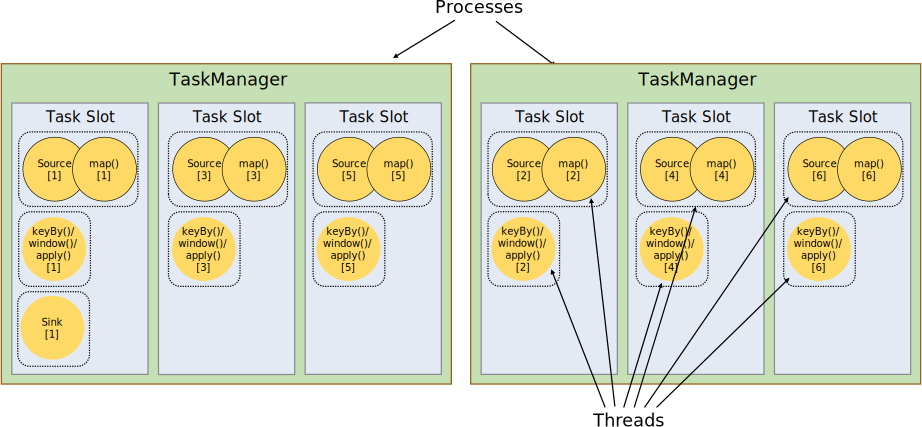

### 3.9. Flink统一的流处理与批处理

在大数据处理领域，批处理任务与流处理任务一般被认为是两种`不同`的任务
一个大数据框架一般会被设计为只能处理其中一种任务

- Storm只支持流处理任务
- MapReduce、Spark只支持批处理任务
- Spark Streaming是Apache Spark之上支持流处理任务的子系统，看似是一个特例，其实并不是——Spark Streaming采用了一种`micro-batch`的架构，即把输入的数据流切分成细粒度的batch，并为每一个batch数据提交一个批处理的Spark任务，所以Spark Streaming本质上还是基于Spark批处理系统对流式数据进行处理，和Storm等完全流式的数据处理方式完全不同。
- Flink通过灵活的执行引擎，能够`同时支持`批处理任务与流处理任务

在执行引擎这一层，流处理系统与批处理系统最大不同在于`节点间的数据传输方式`：

- 对于一个流处理系统，其节点间数据传输的标准模型是：
  - 当一条数据被处理完成后，序列化到缓存中，然后立刻通过网络传输到下一个节点，由下一个节点继续处理
- 对于一个批处理系统，其节点间数据传输的标准模型是：
  - 当一条数据被处理完成后，序列化到缓存中，并不会立刻通过网络传输到下一个节点，当`缓存写满`，就持久化到本地硬盘上，当所有数据都被处理完成后，才开始将处理后的数据通过网络传输到下一个节点
这两种数据传输模式是两个极端，对应的是流处理系统对`低延迟`的要求和批处理系统对`高吞吐量`的要求

Flink的执行引擎采用了一种十分灵活的方式，同时支持了这两种数据传输模型

- Flink以`固定的缓存块`为单位进行网络数据传输，用户可以通过设置缓存块超时值指定缓存块的传输时机。如果缓存块的超时值为0，则Flink的数据传输方式类似上文所提到流处理系统的标准模型，此时系统可以获得最低的处理延迟
- 如果缓存块的超时值为无限大，则Flink的数据传输方式类似上文所提到批处理系统的标准模型，此时系统可以获得最高的吞吐量
- 同时缓存块的超时值也可以设置为0到无限大之间的任意值。缓存块的超时阈值越小，则Flink流处理执行引擎的数据处理延迟越低，但吞吐量也会降低，反之亦然。通过调整缓存块的超时阈值，用户可根据需求灵活地权衡系统延迟和吞吐量


### 3.10. Flink的应用场景


阿里在Flink的应用主要包含四个模块：实时监控、实时报表、流数据分析和实时仓库。
实时监控：

- 用户行为预警、app crash 预警、服务器攻击预警
- 对用户行为或者相关事件进行实时监测和分析，基于风控规则进行预警
实时报表：
- 双11、双12等活动直播大屏
- 对外数据产品：生意参谋等
- 数据化运营
流数据分析：
- 实时计算相关指标反馈及时调整决策
- 内容投放、无线智能推送、实时个性化推荐等
实时仓库：
- 数据实时清洗、归并、结构化
- 数仓的补充和优化
从很多公司的应用案例发现，其实Flink主要用在如下三大场景：
场景一：Event-driven Applications【事件驱动】
`事件驱动型应用`是一类具有状态的应用，它从一个或多个事件流提取数据，并根据到来的事件触发计算、状态更新或其他外部动作。
事件驱动型应用是在计算存储分离的`传统应用`基础上进化而来。
在传统架构中，应用需要`读写远程事务型数据库`。
相反，事件驱动型应用是基于`状态化流处理`来完成。在该设计中，`数据和计算不会分离`，应用只需访问本地（内存或磁盘）即可获取数据。系统`容错性`的实现依赖于定期向远程持久化存储写入 `checkpoint`。下图描述了传统应用和事件驱动型应用架构的区别。

典型的事件驱动类应用：

- 欺诈检测(Fraud detection)
- 异常检测(Anomaly detection)
- 基于规则的告警(Rule-based alerting)
- 业务流程监控(Business process monitoring)
- Web应用程序(社交网络)
场景二：Data Analytics Applications【数据分析】
数据分析任务需要从原始数据中提取有价值的信息和指标。
如下图所示，Apache Flink 同时支持流式及批量分析应用。

Data Analytics Applications包含Batch analytics（批处理分析）和Streaming analytics（流处理分析）。
Batch analytics可以理解为`周期性查询`：比如Flink应用凌晨从Recorded Events中读取昨天的数据，然后做周期查询运算，最后将数据写入Database或者HDFS，或者直接将数据生成报表供公司上层领导决策使用。
Streaming analytics可以理解为`连续性查询`：比如实时展示双十一天猫销售GMV，用户下单数据需要实时写入消息队列，Flink 应用源源不断读取数据做实时计算，然后不断的将数据更新至Database或者K-VStore，最后做大屏实时展示。
典型的数据分析应用实例

- 电信网络质量监控
- 移动应用中的产品更新及实验评估分析
- 消费者技术中的实时数据即席分析
- 大规模图分析

场景三：Data Pipeline Applications【数据管道】
什么是数据管道？
提取-转换-加载（ETL）是一种在存储系统之间进行数据转换和迁移的常用方法。
ETL 作业通常会周期性地触发，将数据从事务型数据库拷贝到分析型数据库或数据仓库。
数据管道和 ETL 作业的用途相似，都可以转换、丰富数据，并将其从某个存储系统移动到另一个。
但数据管道是以`持续流模式`运行，而非周期性触发。因此它支持从一个不断生成数据的源头读取记录，并将它们以低延迟移动到终点。例如：数据管道可以用来监控文件系统目录中的新文件，并将其数据写入事件日志；另一个应用可能会将事件流物化到数据库或增量构建和优化查询索引。
和周期性 ETL 作业相比，`持续数据管道`可以明显降低将数据移动到目的端的延迟。此外，由于它能够持续消费和发送数据，因此用途更广，支持用例更多。
下图描述了周期性 ETL 作业和持续数据管道的差异。

Periodic ETL：比如每天凌晨周期性的启动一个Flink ETL Job，读取传统数据库中的数据，然后做ETL，最后写入数据库和文件系统。
Data Pipeline：比如启动一个Flink 实时应用，数据源（比如数据库、Kafka）中的数据不断的通过Flink Data Pipeline流入或者追加到数据仓库（数据库或者文件系统），或者Kafka消息队列。
典型的数据管道应用实例

- 电子商务中的实时查询索引构建
- 电子商务中的持续 ETL

思考：
假设你是一个电商公司，经常搞运营活动，但收效甚微，经过细致排查，发现原来是羊毛党在薅平台的羊毛，把补给用户的补贴都薅走了，钱花了不少，效果却没达到。我们应该怎么办呢？

```text
你可以做一个实时的异常检测系统，监控用户的高危行为，及时发现高危行为并采取措施，降低损失。
系统流程：
1.用户的行为经由app上报或web日志记录下来，发送到一个消息队列里去；
2.然后流计算订阅消息队列，过滤出感兴趣的行为，比如：购买、领券、浏览等；
3.流计算把这个行为特征化；
4.流计算通过UDF调用外部一个风险模型，判断这次行为是否有问题（单次行为）；
5.流计算里通过CEP功能，跨多条记录分析用户行为（比如用户先做了a，又做了b，又做了3次c），整体识别是否有风险；
6.综合风险模型和CEP的结果，产出预警信息。
```

# 02-Flink批处理

## 1. 学习目标

Flink的批处理Source
    基于本地集合
    基于文件
    基于CSV
    基于压缩文件
Flink的Transformation
    map
    flatmap
    filter
    reduce
    rebalance
Flink的Sink
    写入集合
    写入文件
Flink程序本地执行和集群执行
Flink的广播变量
Flink的累加器
Flink的分布式缓存

## 2. Flink批处理开发

Flink 应用程序结构主要包含三部分,Source/Transformation/Sink,如下图所示：

- Source: 数据源，Flink 在流处理和批处理上的 source 大概有 4 类：
  - 基于本地集合的 source
  - 基于文件的 source
  - 基于网络套接字的 source
  - 自定义的 source。自定义的 source 常见的有 Apache kafka、Amazon Kinesis Streams、RabbitMQ、Twitter Streaming API、Apache NiFi 等，当然你也可以定义自己的 source。
- Transformation：数据转换的各种操作，有 Map/FlatMap/Filter/KeyBy/Reduce/Fold/Aggregations/Window/WindowAll/Union/Window join/Split/Select/Project 等，操作很多，可以将数据转换计算成你想要的数据。
- Sink：接收器，Flink 将转换计算后的数据发送的地点 ，你可能需要存储下来，Flink 常见的 Sink 大概有如下几类：
  - 写入文件、
  - 打印输出、
  - 写入 socket 、
  - 自定义的 sink 。自定义的 sink 常见的有 Apache kafka、RabbitMQ、MySQL、ElasticSearch、Apache Cassandra、Hadoop FileSystem 等，同理你也可以定义自己的 Sink。

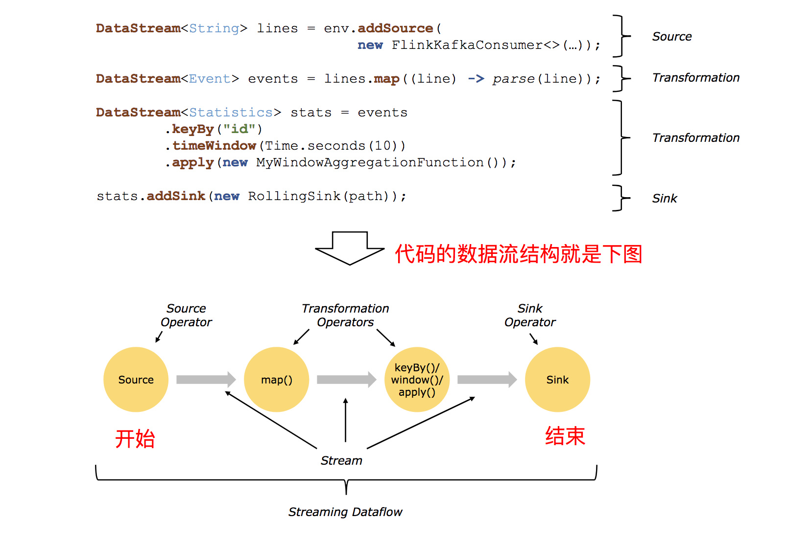

### 环境搭建

pom.xml

```xml
<?xml version="1.0" encoding="UTF-8"?>
<project xmlns="http://maven.apache.org/POM/4.0.0"
         xmlns:xsi="http://www.w3.org/2001/XMLSchema-instance"
         xsi:schemaLocation="http://maven.apache.org/POM/4.0.0 http://maven.apache.org/xsd/maven-4.0.0.xsd">
    <modelVersion>4.0.0</modelVersion>

    <groupId>com.itheima</groupId>
    <artifactId>flink-base</artifactId>
    <version>1.0-SNAPSHOT</version>

    <properties>
        <maven.compiler.source>1.8</maven.compiler.source>
        <maven.compiler.target>1.8</maven.compiler.target>
        <encoding>UTF-8</encoding>
        <scala.version>2.11</scala.version>
        <flink.version>1.6.1</flink.version>
        <hadoop.version>2.7.5</hadoop.version>
    </properties>

    <dependencies>

        <!--Flink TableAPI-->
        <dependency>
            <groupId>org.apache.flink</groupId>
            <artifactId>flink-table_${scala.version}</artifactId>
            <version>${flink.version}</version>
        </dependency>
        <!--导入scala的依赖-->
        <dependency>
            <groupId>org.apache.flink</groupId>
            <artifactId>flink-scala_${scala.version}</artifactId>
            <version>${flink.version}</version>
        </dependency>

        <dependency>
            <groupId>org.apache.flink</groupId>
            <artifactId>flink-connector-kafka-0.10_${scala.version}</artifactId>
            <version>${flink.version}</version>
        </dependency>

        <!--模块二 流处理-->
        <dependency>
            <groupId>org.apache.flink</groupId>
            <artifactId>flink-streaming-scala_${scala.version}</artifactId>
            <version>${flink.version}</version>
        </dependency>
        <dependency>
            <groupId>org.apache.flink</groupId>
            <artifactId>flink-streaming-java_${scala.version}</artifactId>
            <version>${flink.version}</version>
        </dependency>

        <!--对象和json 互相转换的-->
        <dependency>
            <groupId>com.alibaba</groupId>
            <artifactId>fastjson</artifactId>
            <version>1.2.44</version>
        </dependency>

        <dependency>
            <groupId>org.apache.flink</groupId>
            <artifactId>flink-runtime-web_2.11</artifactId>
            <version>${flink.version}</version>
        </dependency>

        <dependency>
            <groupId>org.apache.hadoop</groupId>
            <artifactId>hadoop-client</artifactId>
            <version>${hadoop.version}</version>
        </dependency>

        <!-- 指定mysql-connector的依赖 -->
        <dependency>
            <groupId>mysql</groupId>
            <artifactId>mysql-connector-java</artifactId>
            <version>5.1.38</version>
        </dependency>

    </dependencies>


    <build>
        <sourceDirectory>src/main/scala</sourceDirectory>
        <testSourceDirectory>src/test/scala</testSourceDirectory>
        <plugins>

            <plugin>
                <groupId>org.apache.maven.plugins</groupId>
                <artifactId>maven-compiler-plugin</artifactId>
                <version>2.5.1</version>
                <configuration>
                    <source>${maven.compiler.source}</source>
                    <target>${maven.compiler.target}</target>
                    <!--<encoding>${project.build.sourceEncoding}</encoding>-->
                </configuration>
            </plugin>

            <plugin>
                <groupId>net.alchim31.maven</groupId>
                <artifactId>scala-maven-plugin</artifactId>
                <version>3.2.0</version>
                <executions>
                    <execution>
                        <goals>
                            <goal>compile</goal>
                            <goal>testCompile</goal>
                        </goals>
                        <configuration>
                            <args>
                                <!--<arg>-make:transitive</arg>-->
                                <arg>-dependencyfile</arg>
                                <arg>${project.build.directory}/.scala_dependencies</arg>
                            </args>

                        </configuration>
                    </execution>
                </executions>
            </plugin>


            <plugin>
                <groupId>org.apache.maven.plugins</groupId>
                <artifactId>maven-shade-plugin</artifactId>
                <version>2.3</version>
                <executions>
                    <execution>
                        <phase>package</phase>
                        <goals>
                            <goal>shade</goal>
                        </goals>
                        <configuration>
                            <filters>
                                <filter>
                                    <artifact>*:*</artifact>
                                    <excludes>
                                        <!--
                                        zip -d learn_spark.jar META-INF/*.RSA META-INF/*.DSA META-INF/*.SF
                                        -->
                                        <exclude>META-INF/*.SF</exclude>
                                        <exclude>META-INF/*.DSA</exclude>
                                        <exclude>META-INF/*.RSA</exclude>
                                    </excludes>
                                </filter>
                            </filters>
                            <transformers>
                                <transformer
                                        implementation="org.apache.maven.plugins.shade.resource.ManifestResourceTransformer">
                                    <mainClass>com.itheima.batch.BatchFromCollection</mainClass>
                                </transformer>
                            </transformers>
                        </configuration>
                    </execution>

                </executions>
            </plugin>

            <plugin>
                <groupId>org.apache.maven.plugins</groupId>
                <artifactId>maven-jar-plugin</artifactId>
                <version>2.6</version>
                <configuration>
                    <archive>
                        <manifest>
                            <addClasspath>true</addClasspath>
                            <classpathPrefix>lib/</classpathPrefix>
                            <mainClass>com.itheima.env.BatchRemoteEven</mainClass>
                        </manifest>
                    </archive>
                </configuration>
            </plugin>
            <plugin>
                <groupId>org.apache.maven.plugins</groupId>
                <artifactId>maven-dependency-plugin</artifactId>
                <version>2.10</version>
                <executions>
                    <execution>
                        <id>copy-dependencies</id>
                        <phase>package</phase>
                        <goals>
                            <goal>copy-dependencies</goal>
                        </goals>
                        <configuration>
                            <outputDirectory>${project.build.directory}/lib</outputDirectory>
                        </configuration>
                    </execution>
                </executions>
            </plugin>
        </plugins>
    </build>

</project>
```

## 3. Flink批处理DataSource

`DataSource` 是什么呢？就字面意思其实就可以知道：数据来源。
Flink 做为一款流式计算框架，它可用来做批处理，即处理静态的数据集、历史的数据集；也可以用来做流处理，即实时的处理些实时数据流，实时的产生数据流结果，只要数据源源不断的过来，Flink 就能够一直计算下去，这个 Data Sources 就是数据的来源地。
Flink在批处理中常见的source主要有两大类。

- 基于本地集合的source（Collection-based-source）
- 基于文件的source（File-based-source）

### 3.1. 基于本地集合的Source

在Flink中最常见的创建本地集合的DataSet方式有三种。

1. 使用env.fromElements()，这种方式也支持Tuple，自定义对象等复合形式。
2. 使用env.fromCollection(),这种方式支持多种Collection的具体类型。
3. 使用env.generateSequence(),这种方法创建基于Sequence的DataSet。

使用方式如下:

```scala
import org.apache.flink.api.scala.ExecutionEnvironment
import scala.collection.mutable
import scala.collection.mutable.{ArrayBuffer, ListBuffer}

/**
  * 读取集合中的批次数据
  */
object BatchFromCollection {
  def main(args: Array[String]): Unit = {

    //获取flink执行环境
    val env = ExecutionEnvironment.getExecutionEnvironment

    //导入隐式转换
    import org.apache.flink.api.scala._

    //0.用element创建DataSet(fromElements)
    val ds0: DataSet[String] = env.fromElements("spark", "flink")
    ds0.print()

    //1.用Tuple创建DataSet(fromElements) 传入元组
    val ds1: DataSet[(Int, String)] = env.fromElements((1, "spark"), (2, "flink"))
    ds1.print()

    //2.用Array创建DataSet
    val ds2: DataSet[String] = env.fromCollection(Array("spark", "flink"))
    ds2.print()

    //3.用ArrayBuffer创建DataSet
    val ds3: DataSet[String] = env.fromCollection(ArrayBuffer("spark", "flink"))
    ds3.print()

    //4.用List创建DataSet
    val ds4: DataSet[String] = env.fromCollection(List("spark", "flink"))
    ds4.print()

    //5.用ListBuffer创建DataSet
    val ds5: DataSet[String] = env.fromCollection(ListBuffer("spark", "flink"))
    ds5.print()

    //6.用Vector创建DataSet
    val ds6: DataSet[String] = env.fromCollection(Vector("spark", "flink"))
    ds6.print()

    //7.用Queue创建DataSet
    val ds7: DataSet[String] = env.fromCollection(mutable.Queue("spark", "flink"))
    ds7.print()

    //8.用Stack创建DataSet
    val ds8: DataSet[String] = env.fromCollection(mutable.Stack("spark", "flink"))
    ds8.print()

    //9.用Stream创建DataSet（Stream相当于lazy List，避免在中间过程中生成不必要的集合）
    val ds9: DataSet[String] = env.fromCollection(Stream("spark", "flink"))
    ds9.print()

    //10.用Seq创建DataSet
    val ds10: DataSet[String] = env.fromCollection(Seq("spark", "flink"))
    ds10.print()

    //11.用Set创建DataSet
    val ds11: DataSet[String] = env.fromCollection(Set("spark", "flink"))
    ds11.print()

    //12.用Iterable创建DataSet
    val ds12: DataSet[String] = env.fromCollection(Iterable("spark", "flink"))
    ds12.print()

    //13.用ArraySeq创建DataSet
    val ds13: DataSet[String] = env.fromCollection(mutable.ArraySeq("spark", "flink"))
    ds13.print()

    //14.用ArrayStack创建DataSet
    val ds14: DataSet[String] = env.fromCollection(mutable.ArrayStack("spark", "flink"))
    ds14.print()

    //15.用Map创建DataSet
    val ds15: DataSet[(Int, String)] = env.fromCollection(Map(1 -> "spark", 2 -> "flink"))
    ds15.print()

    //16.用Range创建DataSet
    val ds16: DataSet[Int] = env.fromCollection(Range(1, 9))
    ds16.print()

    //17.用fromElements创建DataSet
    val ds17: DataSet[Long] = env.generateSequence(1, 9)
    ds17.print()
  }
}
```

### 3.2. 基于文件的Source

Flink支持直接从外部文件存储系统中读取文件的方式来创建Source数据源,Flink支持的方式有以下几种:

1. 读取本地文件数据
2. 读取HDFS文件数据
3. 读取CSV文件数据
4. 读取压缩文件
5. 遍历目录

下面分别演示每个数据源的加载方式:

3.2.1. 读取本地文件

```scala
import org.apache.flink.api.scala.{DataSet, ExecutionEnvironment, GroupedDataSet}

/**
  * 读取文件中的批次数据
  */
object BatchFromFile {
  def main(args: Array[String]): Unit = {
    //使用readTextFile读取本地文件
    //初始化环境
    val environment: ExecutionEnvironment = ExecutionEnvironment.getExecutionEnvironment

    //加载数据
    val datas: DataSet[String] = environment.readTextFile("data.txt")

    //触发程序执行
    datas.print()
  }
}
```

读取HDFS文件数据

```scala
import org.apache.flink.api.scala.{DataSet, ExecutionEnvironment, GroupedDataSet}

/**
  * 读取文件中的批次数据
  */
object BatchFromFile {
  def main(args: Array[String]): Unit = {
    //使用readTextFile读取本地文件
    //初始化环境
    val environment: ExecutionEnvironment = ExecutionEnvironment.getExecutionEnvironment
    //加载数据
    val datas: DataSet[String] = environment.readTextFile("hdfs://node01:8020/README.txt")
    //触发程序执行
    datas.print()
  }
}
```

#### 3.2.3. 读取CSV文件数据

```scala
import org.apache.flink.api.scala.{DataSet, ExecutionEnvironment, GroupedDataSet}
/**
  * 读取CSV文件中的批次数据
  */
object BatchFromCsvFile {
  def main(args: Array[String]): Unit = {
    //初始化环境
    val env: ExecutionEnvironment = ExecutionEnvironment.getExecutionEnvironment

      // 用于映射CSV文件的样例类
    case class Student(id:Int, name:String)

    val csvDataSet = env.readCsvFile[Student]("./data/input/subject.csv")
    csvDataSet.print()
    //触发程序执行
    datas.print()
  }
}
```

#### 3.2.4. 读取压缩文件

对于以下压缩类型，不需要指定任何额外的inputformat方法，flink可以自动识别并且解压。但是，压缩文件可能不会并行读取，可能是顺序读取的，这样可能会影响作业的可伸缩性。

| 压缩格式 | 扩展名    | 并行化 |
| -------- | --------- | ------ |
| DEFLATE  | .deflate  | no     |
| GZIP     | .gz .gzip | no     |
| Bzip2    | .bz2      | no     |
| XZ       | .xz       | no     |

```scala
import org.apache.flink.api.scala.ExecutionEnvironment

/**
  * 读取压缩文件的数据
  */
object BatchFromCompressFile {
  def main(args: Array[String]): Unit = {
    //初始化环境
    val env = ExecutionEnvironment.getExecutionEnvironment
    //加载数据
    val result = env.readTextFile("D:\\BaiduNetdiskDownload\\hbase-1.3.1-bin.tar.gz")
    //触发程序执行
    result.print()
  }
}
```

#### 3.2.5. 遍历目录

flink支持对一个文件目录内的所有文件，包括所有子目录中的所有文件的遍历访问方式。
对于从文件中读取数据，当读取的数个文件夹的时候，嵌套的文件默认是不会被读取的，只会读取第一个文件，其他的都会被忽略。所以我们需要使用recursive.file.enumeration进行递归读取

```scala
import org.apache.flink.api.scala.{DataSet, ExecutionEnvironment}
import org.apache.flink.configuration.Configuration

/**
  * 遍历目录的批次数据
  */
object BatchFromFolder {
  def main(args: Array[String]): Unit = {
    //初始化环境
    val env = ExecutionEnvironment.getExecutionEnvironment
    val parameters = new Configuration
    // recursive.file.enumeration 开启递归
    parameters.setBoolean("recursive.file.enumeration", true)

    val result = env.readTextFile("D:\\data\\dataN").withParameters(parameters)
    //触发程序执行
    result.print()
  }
}
```

## 4. Flink批处理Transformation

| Transformation  | 说明                                                         |
| --------------- | ------------------------------------------------------------ |
| map             | 将DataSet中的每一个元素转换为另外一个元素                    |
| flatMap         | 将DataSet中的每一个元素转换为0...n个元素                     |
| mapPartition    | 将一个分区中的元素转换为另一个元素                           |
| filter          | 过滤出来一些符合条件的元素                                   |
| reduce          | 可以对一个dataset或者一个group来进行聚合计算，最终聚合成一个元素 |
| reduceGroup     | 将一个dataset或者一个group聚合成一个或多个元素               |
| aggregate       | 按照内置的方式来进行聚合。例如：SUM/MIN/MAX..               |
| distinct        | 去重                                                         |
| join            | 将两个DataSet按照一定条件连接到一起，形成新的DataSet         |
| union           | 将两个DataSet取并集，并不会去重                              |
| rebalance       | 让每个分区的数据均匀分布，避免数据倾斜                       |
| partitionByHash | 按照指定的key进行hash分区                                    |
| sortPartition   | 指定字段对分区中的数据进行排序                               |

### 4.1. map

将DataSet中的每一个元素转换为另外一个元素
示例
使用map操作，将以下数据

```html
"1,张三", "2,李四", "3,王五", "4,赵六"
```

转换为一个scala的样例类。

步骤

1. 获取`ExecutionEnvironment`运行环境
2. 使用`fromCollection`构建数据源
3. 创建一个`User`样例类
4. 使用`map`操作执行转换
5. 打印测试

参考代码

```scala
case class User(id:String, name:String)

val env = ExecutionEnvironment.getExecutionEnvironment

val textDataSet: DataSet[String] = env.fromCollection(
    List("1,张三", "2,李四", "3,王五", "4,赵六")
)

val userDataSet: DataSet[User] = textDataSet.map {
    text =>
    val fieldArr = text.split(",")
    User(fieldArr(0), fieldArr(1))
}

userDataSet.print()
```

### 4.2. flatMap

将DataSet中的每一个元素转换为0...n个元素
示例
分别将以下数据，转换成`国家`、`省份`、`城市`三个维度的数据。
将以下数据

```html
张三,中国,江西省,南昌市
李四,中国,河北省,石家庄市
Tom,America,NewYork,Manhattan
```

转换为

```html
(张三,中国)
(张三,中国,江西省)
(张三,中国,江西省,江西省)
(李四,中国)
(李四,中国,河北省)
(李四,中国,河北省,河北省)
(Tom,America)
(Tom,America,NewYork)
(Tom,America,NewYork,NewYork)
```

思路

以上数据为一条转换为三条，显然，应当使用`flatMap`来实现
分别在`flatMap`函数中构建三个数据，并放入到一个列表中
    姓名, 国家
    姓名, 国家省份
    姓名, 国家省份城市

步骤

1. 构建批处理运行环境
2. 构建本地集合数据源
3. 使用`flatMap`将一条数据转换为三条数据
    使用逗号分隔字段
    分别构建国家、国家省份、国家省份城市三个元组
4. 打印输出

参考代码

```scala
// 1. 构建批处理运行环境
val env = ExecutionEnvironment.getExecutionEnvironment

// 2. 构建本地集合数据源
val userDataSet = env.fromCollection(List(
    "张三,中国,江西省,南昌市",
    "李四,中国,河北省,石家庄市",
    "Tom,America,NewYork,Manhattan"
))

// 3. 使用`flatMap`将一条数据转换为三条数据
val resultDataSet = userDataSet.flatMap{
    text =>
    //   - 使用逗号分隔字段
    val fieldArr = text.split(",")
    //   - 分别构建国家、国家省份、国家省份城市三个元组
    List(
        (fieldArr(0), fieldArr(1)), // 构建国家维度数据
        (fieldArr(0), fieldArr(1) + fieldArr(2)), // 构建省份维度数据
        (fieldArr(0), fieldArr(1) + fieldArr(2) + fieldArr(3)) // 构建城市维度数据
    )
}

// 4. 打印输出
resultDataSet.print()
```

### 4.3. mapPartition

将一个`分区`中的元素转换为另一个元素
示例
使用mapPartition操作，将以下数据

```html
"1,张三", "2,李四", "3,王五", "4,赵六"
```

转换为一个scala的样例类。
步骤

1. 获取`ExecutionEnvironment`运行环境
2. 使用`fromCollection`构建数据源
3. 创建一个`User`样例类
4. 使用`mapPartition`操作执行转换
5. 打印测试

参考代码

```scala
// 3. 创建一个`User`样例类
case class User(id:String, name:String)

def main(args: Array[String]): Unit = {
    // 1. 获取`ExecutionEnvironment`运行环境
    val env = ExecutionEnvironment.getExecutionEnvironment

    // 2. 使用`fromCollection`构建数据源
    val userDataSet = env.fromCollection(List("1,张三", "2,李四", "3,王五", "4,赵六"))

    // 4. 使用`mapPartition`操作执行转换
    val resultDataSet = userDataSet.mapPartition{
        iter =>
        // TODO:打开连接

        // 对迭代器执行转换操作
        iter.map{
            ele =>
            val fieldArr = ele.split(",")
            User(fieldArr(0), fieldArr(1))
        }

        // TODO：关闭连接
    }

    // 5. 打印测试
    resultDataSet.print()
}
```

`map`和`mapPartition`的效果是一样的，但如果在map的函数中，需要访问一些外部存储。例如：
 `访问mysql数据库，需要打开连接`, 此时效率较低。而使用`mapPartition`可以有效减少连接数，提高效率

### 4.4. filter

`过滤出来`一些符合条件的元素
示例：
过滤出来以下以`h`开头的单词。

```html
"hadoop", "hive", "spark", "flink"
```

步骤

1. 获取`ExecutionEnvironment`运行环境
2. 使用`fromCollection`构建数据源
3. 使用`filter`操作执行过滤
4. 打印测试

参考代码

```scala
def main(args: Array[String]): Unit = {
    // 1. 获取`ExecutionEnvironment`运行环境
    val env = ExecutionEnvironment.getExecutionEnvironment

    // 2. 使用`fromCollection`构建数据源
    val wordDataSet = env.fromCollection(List("hadoop", "hive", "spark", "flink"))

    // 3. 使用`filter`操作执行过滤
    val resultDataSet = wordDataSet.filter(_.startsWith("h"))

    // 4. 打印测试
    resultDataSet.print()
  }
```

### 4.5. reduce

可以对一个`dataset`或者一个`group`来进行聚合计算，最终聚合成一个元素
示例1
请将以下元组数据，使用`reduce`操作聚合成一个最终结果

```html
("java" , 1) , ("java", 1) ,("java" , 1)
```

将上传元素数据转换为`("java",3)`
步骤

1. 获取`ExecutionEnvironment`运行环境
2. 使用`fromCollection`构建数据源
3. 使用`redice`执行聚合操作
4. 打印测试

参考代码

```scala
// 1. 获取`ExecutionEnvironment`运行环境
val env = ExecutionEnvironment.getExecutionEnvironment
// 2. 使用`fromCollection`构建数据源
val wordCountDataSet = env.fromCollection(List(("java" , 1) , ("java", 1) ,("java" , 1) ))

// 3. 使用`redice`执行聚合操作
val resultDataSet = wordCountDataSet.reduce{
    (wc1, wc2) =>
    (wc2._1, wc1._2 + wc2._2)
}

// 4. 打印测试
resultDataSet.print()
```

示例2
请将以下元组数据，下按照单词使用`groupBy`进行分组，再使用`reduce`操作聚合成一个最终结果

```html
("java" , 1) , ("java", 1) ,("scala" , 1)  
```

转换为

```html
("java", 2), ("scala", 1)
```

步骤

1. 获取`ExecutionEnvironment`运行环境
2. 使用`fromCollection`构建数据源
3. 使用`groupBy`按照单词进行分组
4. 使用`reduce`对每个分组进行统计
5. 打印测试

参考代码

```scala
// 1. 获取`ExecutionEnvironment`运行环境
val env = ExecutionEnvironment.getExecutionEnvironment

// 2. 使用`fromCollection`构建数据源
val wordcountDataSet = env.fromCollection(List(("java" , 1) , ("java", 1) ,("scala" , 1)  ))

// 3. 使用`groupBy`按照单词进行分组
val groupedDataSet = wordcountDataSet.groupBy(_._1)

// 4. 使用`reduce`对每个分组进行统计
val resultDataSet = groupedDataSet.reduce{
    (wc1, wc2) =>
    (wc1._1, wc1._2 + wc2._2)
}

// 5. 打印测试
resultDataSet.print()
```

### 4.6. reduceGroup

  可以对一个dataset或者一个group来进行聚合计算，最终聚合成一个元素
reduce和reduceGroup的`区别`


reduce是将数据一个个拉取到另外一个节点，然后再执行计算
reduceGroup是先在每个group所在的节点上执行计算，然后再拉取
示例
请将以下元组数据，下按照单词使用`groupBy`进行分组，再使用`reduceGroup`操作进行单词计数

```html
("java" , 1) , ("java", 1) ,("scala" , 1)  
```

步骤

1. 获取`ExecutionEnvironment`运行环境
2. 使用`fromCollection`构建数据源
3. 使用`groupBy`按照单词进行分组
4. 使用`reduceGroup`对每个分组进行统计
5. 打印测试

参考代码

```scala
    // 1. 获取`ExecutionEnvironment`运行环境
    val env = ExecutionEnvironment.getExecutionEnvironment
    env.setParallelism(1)

    // 2. 使用`fromCollection`构建数据源
    val wordcountDataSet = env.fromCollection(
      List(("java" , 1) , ("java", 1) ,("scala" , 1)  )
    )

    // 3. 使用`groupBy`按照单词进行分组
    val groupedDataSet = wordcountDataSet.groupBy(_._1)

    // 4. 使用`reduceGroup`对每个分组进行统计
    val resultDataSet = groupedDataSet.reduceGroup{
      iter =>
        iter.reduce{(wc1, wc2) => (wc1._1,wc1._2 + wc2._2)}
    }

    // 5. 打印测试
    resultDataSet.print()
```

### 4.7. aggregate

按照内置的方式来进行聚合, Aggregate只能作用于`元组`上。例如：SUM/MIN/MAX..
示例
请将以下元组数据，使用`aggregate`操作进行单词统计

```html
("java" , 1) , ("java", 1) ,("scala" , 1)
```

步骤

1. 获取`ExecutionEnvironment`运行环境
2. 使用`fromCollection`构建数据源
3. 使用`groupBy`按照单词进行分组
4. 使用`aggregate`对每个分组进行`SUM`统计
5. 打印测试

参考代码

```scala
// 1. 获取`ExecutionEnvironment`运行环境
val env = ExecutionEnvironment.getExecutionEnvironment

// 2. 使用`fromCollection`构建数据源
val wordcountDataSet = env.fromCollection(
    List(("java" , 1) , ("java", 1) ,("scala" , 1)  )
)

// 3. 使用`groupBy`按照单词进行分组
val groupedDataSet = wordcountDataSet.groupBy(0)

// 4. 使用`aggregate`对每个分组进行`SUM`统计
val resultDataSet = groupedDataSet.aggregate(Aggregations.SUM, 1)

// 5. 打印测试
resultDataSet.print()
```

注意
要使用aggregate，只能使用字段索引名或索引名称来进行分组`groupBy(0)`，否则会报一下错误:

```html
Exception in thread "main" java.lang.UnsupportedOperationException: Aggregate does not support grouping with KeySelector functions, yet.
```

4.8. distinct

去除重复的数据

示例

请将以下元组数据，使用`distinct`操作去除重复的单词

```html
("java" , 1) , ("java", 2) ,("scala" , 1)
```

去重得到

```html
("java", 1), ("scala", 1)
```

步骤

1. 获取`ExecutionEnvironment`运行环境
2. 使用`fromCollection`构建数据源
3. 使用`distinct`指定按照哪个字段来进行去重
4. 打印测试

参考代码

```scala
// 1. 获取`ExecutionEnvironment`运行环境
val env = ExecutionEnvironment.getExecutionEnvironment

// 2. 使用`fromCollection`构建数据源
val wordcountDataSet = env.fromCollection(
    List(("java" , 1) , ("java", 1) ,("scala" , 1)  )
)

// 3. 使用`distinct`指定按照哪个字段来进行去重
val resultDataSet = wordcountDataSet.distinct(0)

// 4. 打印测试
resultDataSet.print()
```

### 4.8. join

使用join可以将两个DataSet连接起来
示例：
在`资料\测试数据源`中，有两个csv文件，有一个为`score.csv`，一个为`subject.csv`，分别保存了成绩数据以及学科数据。

需要将这两个数据连接到一起，然后打印出来。


步骤

1. 分别将资料中的两个文件复制到项目中的`data/join/input`中
2. 构建批处理环境
3. 创建两个样例类

```text
   * 学科Subject（学科ID、学科名字）
   * 成绩Score（唯一ID、学生姓名、学科ID、分数——Double类型）
```

4.分别使用`readCsvFile`加载csv数据源，并制定泛型
5. 使用join连接两个DataSet，并使用`where`、`equalTo`方法设置关联条件
6. 打印关联后的数据源

参考代码

```scala
// 学科Subject（学科ID、学科名字）
case class Subject(id:Int, name:String)

// 成绩Score（唯一ID、学生姓名、学科ID、分数）
case class Score(id:Int, name:String, subjectId:Int, score:Double)


def main(args: Array[String]): Unit = {
    // 1. 获取`ExecutionEnvironment`运行环境
    val env = ExecutionEnvironment.getExecutionEnvironment

    // 3. 分别使用`readCsvFile`加载csv数据源
    val scoreDataSet = env.readCsvFile[Score]("./data/join/input/score.csv")
    val subjectDataSet = env.readCsvFile[Subject]("./data/join/input/subject.csv")

    // 4. 使用join连接两个DataSet，并使用`where`、`equalTo`方法设置关联条件
    val joinedDataSet = scoreDataSet.join(subjectDataSet).where(2).equalTo(0)

    // 5. 打印关联后的数据源
    joinedDataSet.print()
}
```

### 4.9. union

将两个DataSet取并集，不会去重。

示例

将以下数据进行取并集操作

数据集1

```html
"hadoop", "hive", "flume"
```

数据集2

```html
"hadoop", "hive", "spark"
```

步骤

1. 构建批处理运行环境
2. 使用`fromCollection`创建两个数据源
3. 使用`union`将两个数据源关联在一起
4. 打印测试

参考代码

```scala
    // 1. 获取`ExecutionEnvironment`运行环境
    val env = ExecutionEnvironment.getExecutionEnvironment

    // 2. 使用`fromCollection`创建两个数据源
    val wordDataSet1 = env.fromCollection(List("hadoop", "hive", "flume"))
    val wordDataSet2 = env.fromCollection(List("hadoop", "hive", "spark"))

    // 3. 使用`union`将两个数据源关联在一起
    val resultDataSet = wordDataSet1.union(wordDataSet2)

    // 4. 打印测试
    resultDataSet.print()
```

### 4.10. rebalance

  Flink也会产生`数据倾斜`的时候，例如：当前的数据量有10亿条，在处理过程就有可能发生如下状况：
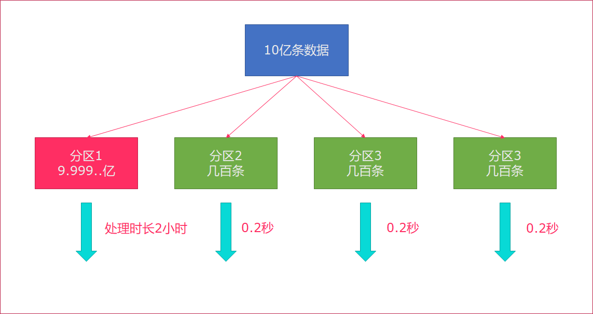
`rebalance`会使用轮询的方式将数据均匀打散，这是处理数据倾斜最好的选择。
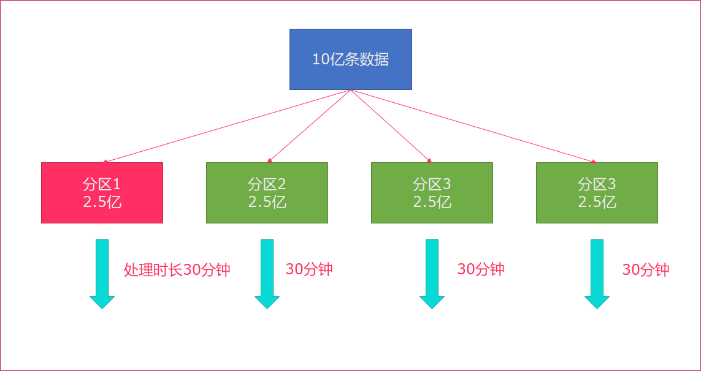

步骤

1. 构建批处理运行环境
2. 使用`env.generateSequence`创建0-100的并行数据
3. 使用`fiter`过滤出来`大于8`的数字
4. 使用map操作传入`RichMapFunction`，将当前子任务的ID和数字构建成一个元组

```text
   在RichMapFunction中可以使用`getRuntimeContext.getIndexOfThisSubtask`获取子任务序号
```

5.打印测试

参考代码

```scala
    // 1. 获取`ExecutionEnvironment`运行环境
    val env = ExecutionEnvironment.getExecutionEnvironment

    // 2. 使用`env.generateSequence`创建0-100的并行数据
    val numDataSet = env.generateSequence(0, 100)

    // 3. 使用`fiter`过滤出来`大于8`的数字
    val filterDataSet = numDataSet.filter(_ > 8)

    // 4. 使用map操作传入`RichMapFunction`，将当前子任务的ID和数字构建成一个元组
    val resultDataSet = filterDataSet.map(new RichMapFunction[Long, (Long, Long)] {
      override def map(in: Long): (Long, Long) = {
        (getRuntimeContext.getIndexOfThisSubtask, in)
      }
    })

    // 5. 打印测试
    resultDataSet.print()
```

上述代码没有加rebalance，通过观察，有可能会出现数据倾斜。
在filter计算完后，调用`rebalance`，这样，就会均匀地将数据分布到每一个分区中。

### 4.11. hashPartition

按照指定的key进行hash分区
示例

基于以下列表数据来创建数据源，并按照hashPartition进行分区，然后输出到文件。

```html
List(1,1,1,1,1,1,1,2,2,2,2,2)
```

步骤

1. 构建批处理运行环境
2. 设置并行度为`2`
3. 使用`fromCollection`构建测试数据集
4. 使用`partitionByHash`按照字符串的hash进行分区
5. 调用`writeAsText`写入文件到`data/parition_output`目录中
6. 打印测试

参考代码

```scala
    // 1. 获取`ExecutionEnvironment`运行环境
    val env = ExecutionEnvironment.getExecutionEnvironment

    // 1. 设置并行度为`2`
    env.setParallelism(2)

    // 2. 使用`fromCollection`构建测试数据集
    val numDataSet = env.fromCollection(List(1,1,1,1,1,1,1,2,2,2,2,2))

    // 3. 使用`partitionByHash`按照字符串的hash进行分区
    val partitionDataSet: DataSet[Int] = numDataSet.partitionByHash(_.toString)

    // 4. 调用`writeAsText`写入文件到`data/parition_output`目录中
    partitionDataSet.writeAsText("./data/parition_output")

    // 5. 打印测试
    partitionDataSet.print()
```

### 4.12. sortPartition

指定字段对分区中的数据进行`排序`
示例
按照以下列表来创建数据集

```html
List("hadoop", "hadoop", "hadoop", "hive", "hive", "spark", "spark", "flink")
```

对分区进行排序后，输出到文件。
步骤

1. 构建批处理运行环境
2. 使用`fromCollection`构建测试数据集
3. 设置数据集的并行度为`2`
4. 使用`sortPartition`按照字符串进行降序排序
5. 调用`writeAsText`写入文件到`data/sort_output`目录中
6. 启动执行

参考代码

```scala
    // 1. 获取`ExecutionEnvironment`运行环境
    val env = ExecutionEnvironment.getExecutionEnvironment
    // 2. 使用`fromCollection`构建测试数据集
    val wordDataSet = env.fromCollection(List("hadoop", "hadoop", "hadoop", "hive", "hive", "spark", "spark", "flink"))
    // 3. 设置数据集的并行度为`2`
    wordDataSet.setParallelism(2)
    // 4. 使用`sortPartition`按照字符串进行降序排序
    val sortedDataSet = wordDataSet.sortPartition(_.toString, Order.DESCENDING)
    // 5. 调用`writeAsText`写入文件到`data/sort_output`目录中
    sortedDataSet.writeAsText("./data/sort_output/")
    // 6. 启动执行
    env.execute("App")
```

## 5. Flink批处理Sink

flink在批处理中常见的sink

- 基于本地集合的sink（Collection-based-sink）
- 基于文件的sink（File-based-sink）

### 5.1. 基于本地集合的sink

目标:

基于下列数据,分别 进行打印输出,error输出,collect()

```text
(19, "zhangsan", 178.8),
(17, "lisi", 168.8),
(18, "wangwu", 184.8),
(21, "zhaoliu", 164.8)
```

代码:

```scala
import org.apache.flink.api.scala.{DataSet, ExecutionEnvironment}
import org.apache.flink.core.fs.FileSystem.WriteMode
import org.apache.flink.api.scala._

object BatchSinkCollection {
  def main(args: Array[String]): Unit = {
    //1.定义环境
    val env = ExecutionEnvironment.getExecutionEnvironment

    //2.定义数据 stu(age,name,height)
    val stu: DataSet[(Int, String, Double)] = env.fromElements(
      (19, "zhangsan", 178.8),
      (17, "lisi", 168.8),
      (18, "wangwu", 184.8),
      (21, "zhaoliu", 164.8)
    )
    //3.TODO sink到标准输出
    stu.print

    //3.TODO sink到标准error输出
    stu.printToErr()

    //4.TODO sink到本地Collection
    print(stu.collect())

    env.execute()
  }
}
```

### 5.2. 基于文件的sink

- flink支持多种存储设备上的文件，包括本地文件，hdfs文件等。
- flink支持多种文件的存储格式，包括text文件，CSV文件等。
- writeAsText()：TextOuputFormat - 将元素作为字符串写入行。字符串是通过调用每个元素的toString()方法获得的。

#### 5.2.1. 将数据写入本地文件

目标:

基于下列数据,写入到文件中

```text
Map(1 -> "spark", 2 -> "flink")
```

代码:

```scala
import org.apache.flink.api.scala.{DataSet, ExecutionEnvironment}
import org.apache.flink.core.fs.FileSystem.WriteMode
import org.apache.flink.api.scala._

/**
  * 将数据写入本地文件
  */
object BatchSinkFile {
  def main(args: Array[String]): Unit = {
    //1.定义环境
    val env = ExecutionEnvironment.getExecutionEnvironment

    //2.定义数据
    val ds1: DataSet[Map[Int, String]] = env.fromElements(Map(1 -> "spark", 2 -> "flink"))
    //3 .TODO 写入到本地，文本文档,NO_OVERWRITE模式下如果文件已经存在，则报错，OVERWRITE模式下如果文件已经存在，则覆盖
    ds1.setParallelism(1).writeAsText("test/data1/aa", WriteMode.OVERWRITE)
    env.execute()
  }
}
```

#### 5.2.2. 将数据写入HDFS

```scala
import org.apache.flink.api.scala.{DataSet, ExecutionEnvironment}
import org.apache.flink.core.fs.FileSystem.WriteMode
import org.apache.flink.api.scala._

/**
  * 将数据写入本地文件
  */
object BatchSinkFile {
  def main(args: Array[String]): Unit = {
    //1.定义环境
    val env = ExecutionEnvironment.getExecutionEnvironment

    //2.定义数据 stu(age,name,height)
    val stu: DataSet[(Int, String, Double)] = env.fromElements(
      (19, "zhangsan", 178.8),
      (17, "lisi", 168.8),
      (18, "wangwu", 184.8),
      (21, "zhaoliu", 164.8)
    )
    val ds1: DataSet[Map[Int, String]] = env.fromElements(Map(1 -> "spark", 2 -> "flink"))
    //1.TODO 写入到本地，文本文档,NO_OVERWRITE模式下如果文件已经存在，则报错，OVERWRITE模式下如果文件已经存在，则覆盖
    ds1.setParallelism(1).writeAsText("hdfs://bigdata111:9000/a", WriteMode.OVERWRITE)
    env.execute()
  }
}
```

## 6. Flink程序本地执行和集群执行

### 6.1. 本地执行

Flink支持两种不同的本地执行。

`LocalExecutionEnvironment` 是启动完整的Flink运行时（Flink Runtime），包括 JobManager 和 TaskManager 。 这种方式包括内存管理和在集群模式下执行的所有内部算法。

`CollectionEnvironment` 是在 Java 集合（Java Collections）上执行 Flink 程序。 此模式不会启动完整的Flink运行时（Flink Runtime），因此执行的开销非常低并且轻量化。 例如一个`DataSet.map()`变换，会对Java list中所有元素应用 `map()` 函数。

#### 6.1.1. local环境

`LocalEnvironment`是Flink程序本地执行的句柄。可使用它，独立或嵌入其他程序在本地 JVM 中运行Flink程序。

本地环境通过该方法实例化`ExecutionEnvironment.createLocalEnvironment()`。

 默认情况下，启动的`本地线程数`与计算机的`CPU个数`相同。也可以指定所需的并行性。本地环境可以配置为使用enableLogging()/ 登录到控制台disableLogging()。

在大多数情况下，ExecutionEnvironment.getExecutionEnvironment()是更好的方式。LocalEnvironment当程序在本地启动时（命令行界面外），该方法会返回一个程序，并且当程序由命令行界面调用时，它会返回一个预配置的群集执行环境。   注意：本地执行环境不启动任何Web前端来监视执行。

```scala
/**
  * local环境
  */
object BatchCollectionsEven {
  def main(args: Array[String]): Unit = {
    // 开始时间
    var start_time =new Date().getTime
    //TODO 初始化本地执行环境
    val env = ExecutionEnvironment.createLocalEnvironment
    val list: DataSet[String] = env.fromCollection(List("1","2"))
    list.print()

    // 结束时间
    var end_time =new Date().getTime
    println(end_time-start_time) //单位毫秒
  }
}
```

#### 6.1.2. 集合环境

使用集合的执行CollectionEnvironment是执行Flink程序的低开销方法。这种模式的典型用例是自动化测试，调试和代码重用。

用户也可以使用为批处理实施的算法，以便更具交互性的案例  请注意，基于集合的Flink程序的执行仅适用于适合JVM堆的小数据。集合上的执行不是多线程的，只使用一个线程

```scala
/**
  * local环境
  */
object BatchCollectionsEven {
  def main(args: Array[String]): Unit = {
    // 开始时间
    var start_time =new Date().getTime
    //TODO 初始化本地执行环境
    val env = ExecutionEnvironment.createCollectionsEnvironment
    val list: DataSet[String] = env.fromCollection(List("1","2"))
    list.print()

    // 结束时间
    var end_time =new Date().getTime
    println(end_time-start_time) //单位毫秒
  }
}
```

### 6.2. 集群执行

Flink程序可以在许多机器的集群上分布运行。有两种方法可将程序发送到群集以供执行：

- 使用命令行界面提交
- 使用代码中的远程环境提交

#### 6.2.1. 使用命令行提交

```shell
./bin/flink run ./examples/batch/WordCount.jar   --input file:///home/user/hamlet.txt --output file:///home/user/wordcount_out
```

#### 6.2.2. 使用代码中远程环境提交

通过IDE,直接在远程环境上执行Flink Java程序。
操作步骤

1. 添加Maven插件

```scala
   <build>
       <plugins>
           <plugin>
               <groupId>org.apache.maven.plugins</groupId>
               <artifactId>maven-jar-plugin</artifactId>
               <version>2.6</version>
               <configuration>
                   <archive>
                       <manifest>
                           <addClasspath>true</addClasspath>
                           <classpathPrefix>lib/</classpathPrefix>
                           <mainClass>com.flink.DataStream.RemoteEven</mainClass>
                       </manifest>
                   </archive>
               </configuration>
           </plugin>
           <plugin>
               <groupId>org.apache.maven.plugins</groupId>
               <artifactId>maven-dependency-plugin</artifactId>
               <version>2.10</version>
               <executions>
                   <execution>
                       <id>copy-dependencies</id>
                       <phase>package</phase>
                       <goals>
                           <goal>copy-dependencies</goal>
                       </goals>
                       <configuration>
                           <outputDirectory>${project.build.directory}/lib</outputDirectory>
                       </configuration>
                   </execution>
               </executions>
           </plugin>
       </plugins>
   </build>
```

```java
   /**
    创建远程执行环境。远程环境将程序（部分）发送到集群以执行。请注意，程序中使用的所有文件路径都必须可以从集群中访问。除非通过[[ExecutionEnvironment.setParallelism（）]显式设置并行度，否则执行将使用集群的默认并行度。
    * @param host  JobManager的ip或域名
    * @param port  JobManager的端口
    * @param jarFiles 包含需要发送到集群的代码的JAR文件。如果程序使用用户定义的函数、用户定义的输入格式或任何库，则必须在JAR文件中提供这些函数。
    */
   def createRemoteEnvironment(host: String, port: Int, jarFiles: String*): ExecutionEnvironment = {
       new ExecutionEnvironment(JavaEnv.createRemoteEnvironment(host, port, jarFiles: _*))
   }
```

示例

读取HDFS上的score.csv文件, 获取到每个学生最好的成绩信息.

开发步骤

1. 创建远程执行环境
2. 读取远程CSV文件,转换成元组类型
3. 根据姓名分组,按成绩倒序排列,取第一个值
4. 打印结果

代码

```scala
object BatchRemoteEven {

  def main(args: Array[String]): Unit = {
    // 1. 创建远程执行环境
    val env: ExecutionEnvironment = ExecutionEnvironment.createRemoteEnvironment("node01", 8081, "E:\\bigdata_ws\\flink-base\\target\\flink-base-1.0-SNAPSHOT.jar")
    // 2. 读取远程CSV文件,转换为元组类型
    val scoreDatSet: DataSet[(Long, String, Long, Double)] = env.readCsvFile[(Long, String, Long, Double)]("hdfs://node01:8020/flink-datas/score.csv")
    // 3. 根据姓名分组,按成绩倒序排列,取第一个值
    val list: DataSet[(Long, String, Long, Double)] = scoreDatSet.groupBy(1).sortGroup(3,Order.DESCENDING).first(1)
    // 4. 打印结果
    list.print()
  }
}
```

## 7. Flink的广播变量

Flink支持广播。可以将数据广播到TaskManager上，数据存储到内存中。数据存储在内存中，这样可以减缓大量的shuffle操作；比如在数据join阶段，不可避免的就是大量的shuffle操作，我们可以把其中一个dataSet广播出去，一直加载到taskManager的内存中，可以直接在内存中拿数据，避免了大量的shuffle，导致集群性能下降；
广播变量创建后，它可以运行在集群中的任何function上，而不需要多次传递给集群节点。另外需要记住，不应该修改广播变量，这样才能确保每个节点获取到的值都是一致的。
一句话解释，可以理解为是一个公共的共享变量，我们可以把一个dataset 数据集广播出去，然后不同的task在节点上都能够获取到，这个数据在每个节点上只会存在一份。如果不使用broadcast，则在每个节点中的每个task中都需要拷贝一份dataset数据集，比较浪费内存(也就是一个节点中可能会存在多份dataset数据)。


可以理解广播就是一个公共的共享变量
将一个数据集广播后，不同的Task都可以在节点上获取到
每个节点`只存一份`
如果不使用广播，每一个Task都会拷贝一份数据集，造成内存资源浪费

用法

在需要使用广播的操作后，使用`withBroadcastSet`创建广播
在操作中，使用getRuntimeContext.getBroadcastVariable`[广播数据类型]`(`广播名`)获取广播变量

操作步骤:

```scala
1：初始化数据
DataSet<Integer> toBroadcast = env.fromElements(1, 2, 3)
2：广播数据
.withBroadcastSet(toBroadcast, "broadcastSetName");
3：获取数据
Collection<Integer> broadcastSet = getRuntimeContext().getBroadcastVariable("broadcastSetName");
```

示例

创建一个`学生`数据集，包含以下数据

```html
|学生ID | 姓名 |
|------|------|
List((1, "张三"), (2, "李四"), (3, "王五"))
```

将该数据，发布到广播。

再创建一个`成绩`数据集，

```html
|学生ID | 学科 | 成绩 |
|------|------|-----|
List( (1, "语文", 50),(2, "数学", 70), (3, "英文", 86))
```

请通过广播获取到学生姓名，将数据转换为

```html
List( ("张三", "语文", 50),("李四", "数学", 70), ("王五", "英文", 86))
```

步骤

1. 获取批处理运行环境
2. 分别创建两个数据集
3. 使用`RichMapFunction`对`成绩`数据集进行map转换
4. 在数据集调用`map`方法后，调用`withBroadcastSet`将`学生`数据集创建广播
5. 实现`RichMapFunction`
   - 将成绩数据(学生ID，学科，成绩) -> (学生姓名，学科，成绩)
   - 重写`open`方法中，获取广播数据
   - 导入`scala.collection.JavaConverters._`隐式转换
   - 将广播数据使用`asScala`转换为Scala集合，再使用toList转换为scala `List`集合
   - 在`map`方法中使用广播进行转换
6. 打印测试

参考代码

```scala
package com.itheima.broad

import org.apache.flink.api.common.functions.RichMapFunction
import org.apache.flink.api.scala._
import org.apache.flink.configuration.Configuration

object BroadCast {


  def main(args: Array[String]): Unit = {
    // 1. 获取`ExecutionEnvironment`运行环境
    val env = ExecutionEnvironment.getExecutionEnvironment

    // 1. 分别创建两个数据集
    val studentDataSet: DataSet[(Int, String)] = env.fromCollection(List((1, "张三"), (2, "李四"), (3, "王五")))
    val scoreDataSet: DataSet[(Int, String, Int)] = env.fromCollection(List((1, "语文", 50), (2, "数学", 70), (3, "英文", 86)))

    // 1. 使用`RichMapFunction`对`成绩`数据集进行map转换
    // 将成绩数据(学生ID，学科，成绩) -> (学生姓名，学科，成绩)
    val resultDataSet: DataSet[(String, String, Int)] = scoreDataSet.map(new RichMapFunction[(Int, String, Int), (String, String, Int)] {

      var bc_studentList: List[(Int, String)] = null

      // - 重写`open`方法中，获取广播数据
      override def open(parameters: Configuration): Unit = {
        import scala.collection.JavaConverters._
        bc_studentList = getRuntimeContext.getBroadcastVariable[(Int, String)]("bc_student").asScala.toList
      }

      //   - 在`map`方法中使用广播进行转换
      override def map(value: (Int, String, Int)): (String, String, Int) = {
        // 获取学生ID
        val studentId: Int = value._1
        // 过滤出和学生ID相同的内容
        val tuples: List[(Int, String)] = bc_studentList.filter((x: (Int, String)) => x._1 == studentId)
        // 构建元组
        (tuples(0)._2,value._2,value._3)
      }
    }).withBroadcastSet(studentDataSet, "bc_student")
    // 3. 打印测试
    resultDataSet.print()
  }

}
```

1. 广播出去的变量存放在每个节点的内存中，直到程序结束，这个数据集不能太大
2. `withBroadcastSet`需要在要使用到广播的操作后调用
3. 需要手动导入`scala.collection.JavaConverters._`将Java集合转换为scala集合

## 8. Flink的累加器

`Accumulator`即累加器，与`MapReduce counter`的应用场景差不多，都能很好地观察task在运行期间的数据变化
可以在Flink job任务中的算子函数中操作累加器，但是只能在任务执行结束之后才能获得累加器的最终结果。
Flink现在有以下内置累加器。每个累加器都实现了Accumulator接口。

- IntCounter
- LongCounter
- DoubleCounter

操作步骤:

```scala
1：创建累加器
private IntCounter numLines = new IntCounter();
2：注册累加器
getRuntimeContext().addAccumulator("num-lines", this.numLines);
3：使用累加器
this.numLines.add(1);
4：获取累加器的结果
myJobExecutionResult.getAccumulatorResult("num-lines")
```

示例:

遍历下列数据, 打印出单词的总数

```text
"a","b","c","d"
```

开发步骤:

1. 获取批处理环境
2. 加载本地集合
3. map转换
   1. 定义累加器
   2. 注册累加器
   3. 累加数据
4. 数据写入到文件中
5. 执行任务,获取任务执行结果对象(JobExecutionResult)
6. 获取累加器数值
7. 打印数值

代码:

```scala
import org.apache.flink.api.common.accumulators.IntCounter
import org.apache.flink.api.common.functions.RichMapFunction
import org.apache.flink.api.scala.ExecutionEnvironment
import org.apache.flink.configuration.Configuration

/**
  * counter 累加器
  * Created by zhangjingcun.tech on 2018/10/30.
  */
object BatchDemoCounter {
  def main(args: Array[String]): Unit = {
    //获取执行环境
    val env = ExecutionEnvironment.getExecutionEnvironment

    import org.apache.flink.api.scala._

    val data = env.fromElements("a","b","c","d")

    val res = data.map(new RichMapFunction[String,String] {
      //1：定义累加器
      val numLines = new IntCounter

      override def open(parameters: Configuration): Unit = {
        super.open(parameters)
        //2:注册累加器
        getRuntimeContext.addAccumulator("num-lines",this.numLines)
      }

      var sum = 0;
      override def map(value: String) = {
        //如果并行度为1，使用普通的累加求和即可，但是设置多个并行度，则普通的累加求和结果就不准了
        sum += 1;
        System.out.println("sum："+sum);
        this.numLines.add(1)
        value
      }

    }).setParallelism(1)
    //    res.print();
    res.writeAsText("d:\\data\\count0")
    val jobResult = env.execute("BatchDemoCounterScala")
    //    //3：获取累加器
    val num = jobResult.getAccumulatorResult[Int]("num-lines")
    println("num:"+num)
  }
}

```

  Flink Broadcast和Accumulators的区别

   Broadcast(广播变量)允许程序员将一个只读的变量缓存在每台机器上，而不用在任务之间传递变量。广播变量可以进行共享，但是不可以进行修改

   Accumulators(累加器)是可以在不同任务中对同一个变量进行累加操作

## 9. Flink的分布式缓存

Flink提供了一个类似于Hadoop的分布式缓存，让并行运行实例的函数可以在本地访问。这个功能可以被使用来分享外部静态的数据，例如：机器学习的逻辑回归模型等！

缓存的使用流程：

使用ExecutionEnvironment实例对本地的或者远程的文件（例如：HDFS上的文件）,为缓存文件指定一个名字注册该缓存文件。当程序执行时候，Flink会自动将复制文件或者目录到所有worker节点的本地文件系统中，函数可以根据名字去该节点的本地文件系统中检索该文件！  
注意:广播是将变量分发到各个worker节点的内存上，分布式缓存是将文件缓存到各个worker节点上

操作步骤:

```text
1：注册一个文件
env.registerCachedFile("hdfs:///path/to/your/file", "hdfsFile")  
2：访问数据
File myFile = getRuntimeContext().getDistributedCache().getFile("hdfsFile");
```

示例：

遍历下列数据, 并在open方法中获取缓存的文件

```text
a,b,c,d
```

代码:

```scala
import org.apache.commons.io.FileUtils
import org.apache.flink.api.common.functions.RichMapFunction
import org.apache.flink.api.scala.ExecutionEnvironment
import org.apache.flink.configuration.Configuration

/**
  * 分布式缓存
  */
object BatchDemoDisCache {
  def main(args: Array[String]): Unit = {
    //获取执行环境
    val env = ExecutionEnvironment.getExecutionEnvironment

    //隐式转换
    import org.apache.flink.api.scala._
    //1:注册文件
    env.registerCachedFile("d:\\data\\file\\a.txt","b.txt")

    //读取数据
    val data = env.fromElements("a","b","c","d")
    val result = data.map(new RichMapFunction[String,String] {

      override def open(parameters: Configuration): Unit = {
        super.open(parameters)
        //访问数据
        val myFile = getRuntimeContext.getDistributedCache.getFile("b.txt")
        val lines = FileUtils.readLines(myFile)
        val it = lines.iterator()
        while (it.hasNext){
          val line = it.next();
          println("line:"+line)
        }
      }
      override def map(value: String) = {
        value
      }
    })
    result.print()
  }
}
```

# 03-Flink流处理

学习目标

- Flink流处理的Source
  - 基于集合
  - 基于文件
  - 基于Socket
  - 自定义数据源
  - 使用Kafka作为数据源
  - 使用MySql作为数据源
- Flink流处理的Transformation
  - keyby
  - connect
  - split和select
- Flink流处理的Sink
  - sink到kafka
  - sink到mysql
- Flink的Window操作
  - 时间窗口
  - 计数窗口
  - 自定义窗口
- Flink的水印机制

## 1. 输入数据集DataSource

Flink 中你可以使用 `StreamExecutionEnvironment.getExecutionEnvironment`创建流处理的执行环境
Flink 中你可以使用 StreamExecutionEnvironment.addSource(source) 来为你的程序添加数据来源。
Flink 已经提供了若干实现好了的 source functions，当然你也可以通过实现 `SourceFunction`来自定义非并行的source或者实现 `ParallelSourceFunction` 接口或者扩展 `RichParallelSourceFunction` 来自定义并行的 source。
Flink在流处理上的source和在批处理上的source基本一致。大致有4大类：

基于本地集合的source（Collection-based-source）
基于文件的source（File-based-source）- 读取文本文件，即符合 TextInputFormat 规范的文件，并将其作为字符串返回
基于网络套接字的source（Socket-based-source）- 从 socket 读取。元素可以用分隔符切分。
自定义的source（Custom-source）

### 1.1. 基于本地集合的source

```scala
//创建流处理的执行环境
 val env = StreamExecutionEnvironment.getExecutionEnvironment
//使用env.fromElements()来创建数据源
val dataStream: DataStream[String] = env.fromElements("spark", "flink")
```

```scala
import org.apache.flink.streaming.api.scala.{DataStream, StreamExecutionEnvironment}
import org.apache.flink.streaming.api.scala._
import scala.collection.immutable.{Queue, Stack}
import scala.collection.mutable
import scala.collection.mutable.{ArrayBuffer, ListBuffer}

object StreamingDemoFromCollectionSource {
  def main(args: Array[String]): Unit = {
    val senv = StreamExecutionEnvironment.getExecutionEnvironment
    //0.用element创建DataStream(fromElements)
    val ds0: DataStream[String] = senv.fromElements("spark", "flink")
    ds0.print()

    //1.用Tuple创建DataStream(fromElements)
    val ds1: DataStream[(Int, String)] = senv.fromElements((1, "spark"), (2, "flink"))
    ds1.print()

    //2.用Array创建DataStream
    val ds2: DataStream[String] = senv.fromCollection(Array("spark", "flink"))
    ds2.print()

    //3.用ArrayBuffer创建DataStream
    val ds3: DataStream[String] = senv.fromCollection(ArrayBuffer("spark", "flink"))
    ds3.print()

    //4.用List创建DataStream
    val ds4: DataStream[String] = senv.fromCollection(List("spark", "flink"))
    ds4.print()

    //5.用List创建DataStream
    val ds5: DataStream[String] = senv.fromCollection(ListBuffer("spark", "flink"))
    ds5.print()

    //6.用Vector创建DataStream
    val ds6: DataStream[String] = senv.fromCollection(Vector("spark", "flink"))
    ds6.print()

    //7.用Queue创建DataStream
    val ds7: DataStream[String] = senv.fromCollection(Queue("spark", "flink"))
    ds7.print()

    //8.用Stack创建DataStream
    val ds8: DataStream[String] = senv.fromCollection(Stack("spark", "flink"))
    ds8.print()

    //9.用Stream创建DataStream（Stream相当于lazy List，避免在中间过程中生成不必要的集合）
    val ds9: DataStream[String] = senv.fromCollection(Stream("spark", "flink"))
    ds9.print()

    //10.用Seq创建DataStream
    val ds10: DataStream[String] = senv.fromCollection(Seq("spark", "flink"))
    ds10.print()

    //11.用Set创建DataStream(不支持)
    //val ds11: DataStream[String] = senv.fromCollection(Set("spark", "flink"))
    //ds11.print()

    //12.用Iterable创建DataStream(不支持)
    //val ds12: DataStream[String] = senv.fromCollection(Iterable("spark", "flink"))
    //ds12.print()

    //13.用ArraySeq创建DataStream
    val ds13: DataStream[String] = senv.fromCollection(mutable.ArraySeq("spark", "flink"))
    ds13.print()

    //14.用ArrayStack创建DataStream
    val ds14: DataStream[String] = senv.fromCollection(mutable.ArrayStack("spark", "flink"))
    ds14.print()

    //15.用Map创建DataStream(不支持)
    //val ds15: DataStream[(Int, String)] = senv.fromCollection(Map(1 -> "spark", 2 -> "flink"))
    //ds15.print()

    //16.用Range创建DataStream
    val ds16: DataStream[Int] = senv.fromCollection(Range(1, 9))
    ds16.print()

    //17.用fromElements创建DataStream
    val ds17: DataStream[Long] = senv.generateSequence(1, 9)
    ds17.print()

    senv.execute(this.getClass.getName)
  }
}

```

### 1.2. 基于文件的source

Flink的流处理可以直接通过`readTextFile()`方法读取文件来创建数据源,方法如下:

```scala
object DataSource_CSV {
  def main(args: Array[String]): Unit = {
    // 1. 获取流处理运行环境
    val env = StreamExecutionEnvironment.getExecutionEnvironment
    // 2. 读取文件 注意路径(可直接读本地文件)
    val textDataStream: DataStream[String] = env.readTextFile("hdfs://node01:8020/flink-datas/score.csv")
    // 3. 打印数据
    textDataStream.print()
    // 4. 执行程序
    env.execute()
  }
}
```

### 1.3. 基于网络套接字的source

上面两种方式创建的数据源一般都是固定的.如果需要源源不断的产生数据,可以使用socket的方式来获取数据,通过调用`socketTextStream()`方法
示例
编写Flink程序，接收`socket`的单词数据，并以空格进行单词拆分打印。
步骤

1. 获取流处理运行环境
2. 构建socket流数据源，并指定IP地址和端口号
3. 对接收到的数据进行空格拆分
4. 打印输出
5. 启动执行
6. 在Linux中，使用`nc -lk 端口号`监听端口，并发送单词

需要一个发送socket的客户端
安装nc:  yum install -y nc
nc -lk 9999 监听9999端口的信息

代码

```scala
object SocketSource {
  def main(args: Array[String]): Unit = {
    //1. 获取流处理运行环境
    val env = StreamExecutionEnvironment.getExecutionEnvironment
    //  2. 构建socket流数据源，并指定IP地址和端口号
    // hadoop hadoop hive spark
    val socketDataStream: DataStream[String] = env.socketTextStream("node01", 9999)
    //  3. 转换,以空格拆分单词
    val mapDataSet: DataStream[String] = socketDataStream.flatMap(_.split(" "))
    //  4. 打印输出
    mapDataSet.print()
    //  5. 启动执行
    env.execute("WordCount_Stream")
  }
}
```

### 1.4. 自定义source

我们也可以通过去实现`SourceFunction`或者它的子类`RichSourceFunction`类来自定义实现一些自定义的source，Kafka创建source数据源类`FlinkKafkaConsumer010`也是采用类似的方式。

#### 1.4.1. 自定义数据源

示例:
自定义数据源, 每1秒钟随机生成一条订单信息(`订单ID`、`用户ID`、`订单金额`、`时间戳`)
要求:

- 随机生成订单ID（UUID）
- 随机生成用户ID（0-2）
- 随机生成订单金额（0-100）
- 时间戳为当前系统时间

开发步骤:

1. 创建订单样例类
2. 获取流处理环境
3. 创建自定义数据源
   - 循环1000次
   - 随机构建订单信息
   - 上下文收集数据
   - 每隔一秒执行一次循环

4. 打印数据
5. 执行任务

代码:

```scala
object StreamFlinkSqlDemo {

  // 创建一个订单样例类Order，包含四个字段（订单ID、用户ID、订单金额、时间戳）
  case class Order(id: String, userId: Int, money: Long, createTime: Long)

  def main(args: Array[String]): Unit = {
    // 1. 获取流处理运行环境
    val env = StreamExecutionEnvironment.getExecutionEnvironment

    // 2. 创建一个自定义数据源
    val orderDataStream = env.addSource(new RichSourceFunction[Order] {
      override def run(ctx: SourceFunction.SourceContext[Order]): Unit = {
        // 使用for循环生成1000个订单
        for (i <- 0 until 1000) {
          // 随机生成订单ID（UUID）
          val id = UUID.randomUUID().toString
          // 随机生成用户ID（0-2）
          val userId = Random.nextInt(3)
          // 随机生成订单金额（0-100）
          val money = Random.nextInt(101)
          // 时间戳为当前系统时间
          val timestamp = System.currentTimeMillis()
          // 收集数据
          ctx.collect(Order(id, userId, money, timestamp))
          // 每隔1秒生成一个订单
          TimeUnit.SECONDS.sleep(1)
        }
      }

      override def cancel(): Unit = ()
    })
    // 3. 打印数据
    orderDataStream.print()
    // 4. 执行程序
    env.execute()
  }
}
```

#### 1.4.2. 使用Kafka作为数据源

我们可以通过使用`FlinkKafkaConsumer010`来从Kafka中获取消息:

示例:

使用Flink流处理方式,读取Kafka的数据,并打印.

开发步骤:

1. 创建流处理环境
2. 指定链接kafka相关信息
3. 创建kafka数据流(FlinkKafkaConsumer010)
4. 添加Kafka数据源
5. 打印数据
6. 执行任务

Kafka相关操作:
>
创建topic
>
kafka-topics.sh --create --partitions 3 --replication-factor 2 --topic kafkatopic --zookeeper node01:2181,node02:2181,node03:2181
>
模拟生产者
>
kafka-console-producer.sh --broker-list node01:9092,node02:9092,node03:9092 --topic kafkatopic
>
模拟消费者
>
kafka-console-consumer.sh --from-beginning --topic kafkatopic --zookeeper node01:2181,node02:2181,node03:2181
>
（0.9版本之后）kafka-console-consumer.sh --from-beginning --topic kafkatopic --bootstrap-server node01:9092,node02:9092,node03:9092

代码:

```scala
import java.util.Properties
import org.apache.flink.api.common.serialization.SimpleStringSchema
import org.apache.flink.streaming.api.scala.{DataStream, StreamExecutionEnvironment}
import org.apache.flink.api.scala._
import org.apache.flink.streaming.connectors.kafka.FlinkKafkaConsumer010
import org.apache.kafka.clients.CommonClientConfigs

object DataSource_kafka {
  def main(args: Array[String]): Unit = {

    //1. 创建流处理环境
    val env = StreamExecutionEnvironment.getExecutionEnvironment
    //2. 指定kafka数据流的相关信息
    val kafkaCluster = "node01:9092,node02:9092,node03:9092"
    val kafkaTopicName = "kafkatopic"

    //3. 创建kafka数据流
    val properties = new Properties()
    properties.setProperty(CommonClientConfigs.BOOTSTRAP_SERVERS_CONFIG, kafkaCluster)
    val kafka010 = new FlinkKafkaConsumer010[String](kafkaTopicName, new SimpleStringSchema(), properties)

    //4. 添加数据源addSource(kafka010)
    val text: DataStream[String] = env.addSource(kafka010)

    //5. 打印数据
    text.print()

    //6. 执行任务
    env.execute("flink-kafka-wordcunt")
  }
}
```

#### 1.4.3. 使用MySQL作为数据源

上面我们已经使用了自定义数据源和Flink自带的Kafka source，那么接下来就模仿着写一个从 MySQL 中读取数据的 Source。

示例

自定义数据源, 读取MySql数据库(test)表(user)数据.

| id   | username | password | name |
| ---- | -------- | -------- | ---- |
| 1    | zhangsan | 111111   | 张三 |
| 2    | lisi     | 222222   | 李四 |
| 3    | wangwu   | 333333   | 王五 |
| 4    | zhaoliu  | 444444   | 赵六 |
| 5    | tianqi   | 555555   | 田七 |

相关依赖

```xml
 <!-- 指定mysql-connector的依赖 -->
 <dependency>
     <groupId>mysql</groupId>
     <artifactId>mysql-connector-java</artifactId>
     <version>5.1.38</version>
 </dependency>
```

开发步骤

1. 自定义Source,继承自RichSourceFunction
2. 实现run方法
   1. 加载驱动
   2. 创建连接
   3. 创建PreparedStatement
   4. 执行查询
   5. 遍历查询结果,收集数据
3. 使用自定义Source
4. 打印结果
5. 执行任务

代码

```scala
package com.itheima.stream

import java.sql.{Connection, DriverManager, PreparedStatement}

import org.apache.flink.api.scala._
import org.apache.flink.configuration.Configuration
import org.apache.flink.streaming.api.functions.source.RichSourceFunction
import org.apache.flink.streaming.api.functions.source.SourceFunction.SourceContext
import org.apache.flink.streaming.api.scala.{DataStream, StreamExecutionEnvironment}

object DataSource_mysql {
  def main(args: Array[String]): Unit = {
    // 1. 创建流处理环境
    val env = StreamExecutionEnvironment.getExecutionEnvironment
    // 2. 设置并行度
    env.setParallelism(1)
    // 3. 添加自定义MySql数据源
    val source = env.addSource(new MySql_source)
    // 4. 打印结果
    source.print()
    // 5. 执行任务
    env.execute()
  }
}

class MySql_source extends RichSourceFunction[(Int, String, String, String)] {

  override def run(ctx: SourceContext[(Int, String, String, String)]): Unit = {

    // 1. 加载MySql驱动
    Class.forName("com.mysql.jdbc.Driver")
    // 2. 链接MySql
    var connection: Connection = DriverManager.getConnection("jdbc:mysql:///test", "root", "123456")
    // 3. 创建PreparedStatement
    val sql = "select id , username , password , name from user"
    var ps: PreparedStatement = connection.prepareStatement(sql)

    // 4. 执行Sql查询
    val queryRequest = ps.executeQuery()
    // 5. 遍历结果
    while (queryRequest.next()) {
      val id = queryRequest.getInt("id")
      val username = queryRequest.getString("username")
      val password = queryRequest.getString("password")
      val name = queryRequest.getString("name")
      // 收集数据
      ctx.collect((id, username, password, name))
    }
  }

  override def cancel(): Unit = {}
}
```

## 2. DataStream的Transformation

和DataSet批处理一样，DataStream也包括一系列的Transformation操作.

流数据处理和批数据处理有很多操作是类似的，所以就不再一 一讲解。我们主要讲解，和批处理不一样的一些操作。

### 2.1. keyBy

按照指定的key来进行分流，类似于批处理中的`groupBy`。可以按照索引名/字段名来指定分组的字段.

示例

读取socket数据源, 进行单词的计数

开发步骤

1. 获取流处理运行环境
2. 设置并行度
3. 获取数据源
4. 转换操作
   1. 以空白进行分割
   2. 给每个单词计数1
   3. 根据单词分组
   4. 求和
5. 打印到控制台
6. 执行任务

代码

```scala
/**
  * KeyBy算子的使用
  */
object Transformation_KeyBy {
  def main(args: Array[String]): Unit = {
    // 1.获取流处理运行环境
    val senv = StreamExecutionEnvironment.getExecutionEnvironment
    // 2.设置并行度
    senv.setParallelism(3)
    //3. 获取Socket数据源
    val stream = senv.socketTextStream("node01", 9999, '\n')
    //4. 转换操作,以空格切分,每个元素计数1,以单词分组,累加
    val text = stream.flatMap(_.split("\\s"))
      .map((_,1))
      //TODO 逻辑上将一个流分成不相交的分区，每个分区包含相同键的元素。在内部，这是通过散列分区来实现的
      .keyBy(_._1)
      //TODO 这里的sum并不是分组去重后的累加值，如果统计去重后累加值，则使用窗口函数
      .sum(1)
    //5. 打印到控制台
    text.print()
    //6. 执行任务
    senv.execute()
  }
}
```

### 2.2. Connect

`Connect`用来将两个DataStream组装成一个`ConnectedStreams`。它用了两个泛型，即不要求两个dataStream的element是同一类型。这样我们就可以把不同的数据组装成同一个结构.

示例

读取两个不同类型的数据源，使用connect进行合并打印。

开发步骤

1. 创建流式处理环境
2. 添加两个自定义数据源
3. 使用connect合并两个数据流,创建ConnectedStreams对象
4. 遍历ConnectedStreams对象,转换为DataStream
5. 打印输出,设置并行度为1
6. 执行任务

自定义数据源

```scala
/**
  * 创建自定义并行度为1的source
  * 实现从1开始产生递增数字
  */
class MyLongSourceScala extends SourceFunction[Long] {
  var count = 1L
  var isRunning = true

  override def run(ctx: SourceContext[Long]) = {
    while (isRunning) {
      ctx.collect(count)
      count += 1
      TimeUnit.SECONDS.sleep(1)
    }
  }

  override def cancel() = {
    isRunning = false
  }
}

/**
  * 创建自定义并行度为1的source
  * 实现从1开始产生递增字符串
  */
class MyStringSourceScala extends SourceFunction[String] {
  var count = 1L
  var isRunning = true

  override def run(ctx: SourceContext[String]) = {
    while (isRunning) {
      ctx.collect("str_" + count)
      count += 1
      TimeUnit.SECONDS.sleep(1)
    }
  }

  override def cancel() = {
    isRunning = false
  }
}
```

代码

```scala

object StreamingDemoConnectScala {
  def main(args: Array[String]): Unit = {
    // 1. 创建流式处理环境
    val env = StreamExecutionEnvironment.getExecutionEnvironment
    // 2. 添加两个自定义数据源
    val text1: DataStream[Long] = env.addSource(new MyLongSourceScala)
    val text2: DataStream[String] = env.addSource(new MyStringSourceScala)
    // 3. 使用connect合并两个数据流,创建ConnectedStreams对象
    val connectedStreams: ConnectedStreams[Long, String] = text1.connect(text2)
    // 4. 遍历ConnectedStreams对象,转换为DataStream
    val result: DataStream[Any] = connectedStreams.map(line1 => {
      line1
    }, line2 => {
      line2
    })
    // 5. 打印输出,设置并行度为1
    result.print().setParallelism(1)
    // 6. 执行任务
    env.execute("StreamingDemoWithMyNoParallelSourceScala")
  }
}
```

### 2.3. split和select

`split`就是将一个DataStream分成多个流，用`SplitStream`来表示

DataStream → SplitStream

`select`就是获取分流后对应的数据，跟split搭配使用，从SplitStream中选择一个或多个流

SplitStream → DataStream

示例

加载本地集合(1,2,3,4,5,6), 使用split进行数据分流,分为奇数和偶数. 并打印奇数结果

开发步骤

1. 创建流处理环境
2. 设置并行度
3. 加载本地集合
4. 数据分流,分为奇数和偶数
5. 获取分流后的数据
6. 打印数据
7. 执行任务

代码：

```scala
/**
  * 演示Split和Select方法
  * Split: DataStream->SplitStream
  * Select: SplitStream->DataStream
  */
object SplitAndSelect {

  def main(args: Array[String]): Unit = {
    // 1. 创建批处理环境
    val env = StreamExecutionEnvironment.getExecutionEnvironment
    // 2. 设置并行度
    env.setParallelism(1)
    // 3. 加载本地集合
    val elements: DataStream[Int] = env.fromElements(1, 2, 3, 4, 5, 6)
    // 4. 数据分流,分为奇数和偶数
    val split_data: SplitStream[Int] = elements.split(
      (num: Int) =>
        num % 2 match {
          case 0 => List("even")
          case 1 => List("odd")
        }
    )
    // 5. 获取分流后的数据
    val even: DataStream[Int] = split_data.select("even")
    val odd: DataStream[Int] = split_data.select("odd")
    val all: DataStream[Int] = split_data.select("odd", "even")

    // 6. 打印数据
    odd.print()

    // 7. 执行任务
    env.execute()
  }
}
```

## 3. Flink在流处理上常见的sink

Flink将数据进行sink操作到本地文件/本地集合/HDFS等和之前的批处理操作一致.这里重点说下sink到Kafka以及MySQL的操作

### 3.1. Sink到Kafka

kafka-console-consumer.sh --from-beginning --topic test2 --zookeeper node01:2181,node02:2181,node03:2181

示例

读取MySql的数据, 落地到Kafka中

开发步骤

1. 创建流处理环境
2. 设置并行度
3. 添加自定义MySql数据源
4. 转换元组数据为字符串
5. 构建`FlinkKafkaProducer010`
6. 添加sink
7. 执行任务

代码

```scala
object DataSink_kafka {
  def main(args: Array[String]): Unit = {
    // 1. 创建流处理环境
    val env = StreamExecutionEnvironment.getExecutionEnvironment
    // 2. 设置并行度
    env.setParallelism(1)
    // 3. 添加自定义MySql数据源
    val source: DataStream[(Int, String, String, String)] = env.addSource(new MySql_source)

    // 4. 转换元组数据为字符串
    val strDataStream: DataStream[String] = source.map(
      line => line._1 + line._2 + line._3 + line._4
    )

    //5. 构建FlinkKafkaProducer010
    val p: Properties = new Properties
    p.setProperty("bootstrap.servers", "node01:9092,node02:9092,node03:9092")
    val sink = new FlinkKafkaProducer010[String]("test2", new SimpleStringSchema(), p)
    // 6. 添加sink
    strDataStream.addSink(sink)
    // 7. 执行任务
    env.execute("flink-kafka-wordcount")
  }
}
```

### 3.2. Sink到MySQL

示例

加载下列本地集合,导入MySql中

```scala
List(
      (10, "dazhuang", "123456", "大壮"),
      (11, "erya", "123456", "二丫"),
      (12, "sanpang", "123456", "三胖")
    )
```

开发步骤

1. 创建流执行环境
2. 准备数据
3. 添加sink
   - 构建自定义Sink,继承自`RichSinkFunction`
   - 重写`open`方法,获取`Connection`和`PreparedStatement`
   - 重写`invoke`方法,执行插入操作
   - 重写`close`方法,关闭连接操作
4. 执行任务

代码

```scala
object DataSink_MySql {
  def main(args: Array[String]): Unit = {
    //1.创建流执行环境
    val env = StreamExecutionEnvironment.getExecutionEnvironment
    //2.准备数据
    val value: DataStream[(Int, String, String, String)] = env.fromCollection(List(
      (10, "dazhuang", "123456", "大壮"),
      (11, "erya", "123456", "二丫"),
      (12, "sanpang", "123456", "三胖")
    ))
    // 3. 添加sink
    value.addSink(new MySql_Sink)
    //4.触发流执行
    env.execute()
  }
}

// 自定义落地MySql的Sink
class MySql_Sink extends RichSinkFunction[(Int, String, String, String)] {

  private var connection: Connection = null
  private var ps: PreparedStatement = null

  override def open(parameters: Configuration): Unit = {
    //1:加载驱动
    Class.forName("com.mysql.jdbc.Driver")
    //2：创建连接
    connection = DriverManager.getConnection("jdbc:mysql:///test", "root", "123456")
    //3:获得执行语句
    val sql = "insert into user(id , username , password , name) values(?,?,?,?);"
    ps = connection.prepareStatement(sql)
  }

  override def invoke(value: (Int, String, String, String)): Unit = {
    try {
      //4.组装数据，执行插入操作
      ps.setInt(1, value._1)
      ps.setString(2, value._2)
      ps.setString(3, value._3)
      ps.setString(4, value._4)
      ps.executeUpdate()
    } catch {
      case e: Exception => println(e.getMessage)
    }
  }

  //关闭连接操作
  override def close(): Unit = {
    if (connection != null) {
      connection.close()
    }
    if (ps != null) {
      ps.close()
    }
  }
}
```

## 4. Flink的Window操作

Flink 认为 Batch 是 Streaming 的一个特例，所以 Flink 底层引擎是一个流式引擎，在上面实现了流处理和批处理。而窗口（window）就是从 Streaming 到 Batch 的一个桥梁。Flink 提供了非常完善的窗口机制。

### 4.1. 什么是window

在流处理应用中，数据是连续不断的，因此我们不可能等到所有数据都到了才开始处理。当然我们可以每来一个消息就处理一次，但是有时我们需要做一些聚合类的处理，例如：在过去的1分钟内有多少用户点击了我们的网页。在这种情况下，我们必须定义一个窗口，用来收集最近一分钟内的数据，并对这个窗口内的数据进行计算。

如果在数据流上，截取固定大小的一部分，这部分是可以进行统计的。 截取方式主要有两种:

1. 根据`时间`进行截取(time-driven-window)，比如每1分钟统计一次或每10分钟统计一次。
2. 根据`消息数量`进行截取(data-driven-window)，比如每5个数据统计一次或每50个数据统计一次。

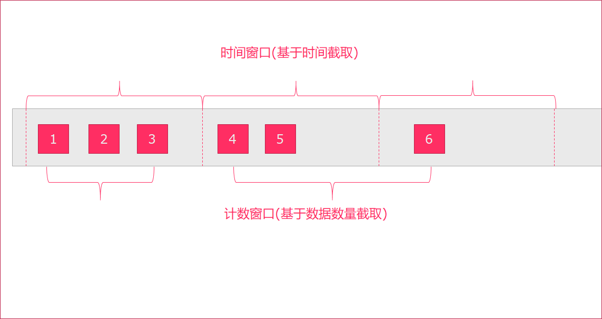

### 4.2. 时间窗口

我们先提出一个问题：统计经过某红绿灯的汽车数量之和？
假设在一个红绿灯处，我们每隔15秒统计一次通过此红绿灯的汽车数量，如下图：

可以把汽车的经过看成一个流，无穷的流，不断有汽车经过此红绿灯，因此无法统计总共的汽车数量。但是，我们可以换一种思路，每隔15秒，我们都将与上一次的结果进行sum操作（滑动聚合, 但是这个结果似乎还是无法回答我们的问题，根本原因在于流是无界的，我们不能限制流，但可以在有一个`有界`的范围内处理`无界`的流数据。

因此，我们需要换一个问题的提法：`每分钟经过某红绿灯的汽车数量之和？`
这个问题，就相当于一个定义了一个Window（窗口），window的界限是1分钟，且每分钟内的数据互不干扰，因此也可以称为翻滚（不重合）窗口，如下图：

第一分钟的数量为8，第二分钟是22，第三分钟是27。。。这样，1个小时内会有60个window。

再考虑一种情况，`每30秒统计一次过去1分钟的汽车数量之和`：

此时，window出现了重合。这样，1个小时内会有120个window。

#### 4.2.1. tumbling-time-window (翻滚窗口-无重叠数据)

按照`时间`来进行窗口划分,每次窗口的`滑动距离`等于窗口的长度,这样数据不会重复计算,我们参考上面的案例
代码如下:

```scala
object StreamingTumblingTimeWindow {
  def main(args: Array[String]): Unit = {
    //1.创建运行环境
    val env: StreamExecutionEnvironment = StreamExecutionEnvironment.getExecutionEnvironment
    //2.定义数据流来源
    val textStream = env.socketTextStream("node01", 9999)
    //3.转换数据格式，text->CarWc
    val data = textStream.map(line => {
      val array = line.split(",")
      WordCountCart(array(0).toInt, array(1).toInt)
    })
    //4.执行统计操作，每个sensorId一个tumbling窗口，窗口的大小为5秒
    //也就是说，每5秒钟统计一次，在这过去的5秒钟内，各个路口通过红绿灯汽车的数量。
    val keyByData: KeyedStream[WordCountCart, Int] = data.keyBy(line => line.sen)
    //无重叠数据，所以只需要给一个参数即可，每5秒钟统计一下各个路口通过红绿灯汽车的数量
    val result = keyByData.timeWindow(Time.seconds(5)).sum(1)
    //5、显示统计结果
    result.print()
    //6、触发流计算
    env.execute()
  }
}

/**
  * @param sen     哪个红绿灯
  * @param cardNum 多少辆车
  */
case class WordCountCart(sen: Int, cardNum: Int)
```

#### 4.2.2. sliding-time-window (滑动窗口-有重叠数据)

按照时间来进行窗口划分,每次窗口的滑动距离小于窗口的长度,这样数据就会有一部分重复计算,我们参考上面的案例


代码如下:

```scala
import org.apache.flink.streaming.api.scala.{KeyedStream, StreamExecutionEnvironment}
import org.apache.flink.streaming.api.windowing.time.Time
import org.apache.flink.streaming.api.scala._
/**
  * 有重叠数据
  */
object StreamingTimeSlidingWindow {
  def main(args: Array[String]): Unit = {
    //1.创建运行环境
    val env: StreamExecutionEnvironment = StreamExecutionEnvironment.getExecutionEnvironment
    //2.定义数据流来源
    val textStream = env.socketTextStream("node01", 9000)
    //3.转换数据格式，text->CarWc
    val data = textStream.map(line => {
      val array = line.split(",")
      WordCountCart(array(0).toInt, array(1).toInt)
    })
    //4.执行统计操作，每个sensorId一个tumbling窗口，窗口的大小为5秒
    //也就是说，每2秒钟统计一次，在这过去的10秒钟内，各个路口通过红绿灯汽车的数量。
    val keyByData: KeyedStream[WordCountCart, Int] = data.keyBy(line => line.sen)
    val result = keyByData.timeWindow(Time.seconds(10), Time.seconds(2)).sum(1)
    //5、显示统计结果
    result.print()
    //6、触发流计算
    env.execute()
  }
}
```

#### 4.2.3. 小结

1. 如果窗口计算时间 > 窗口时间，会出现数据丢失
2. 如果窗口计算时间 < 窗口时间，会出现数据重复计算
3. 如果窗口计算时间 = 窗口时间，数据不会被重复计算

窗口计算时间 > 窗口时间
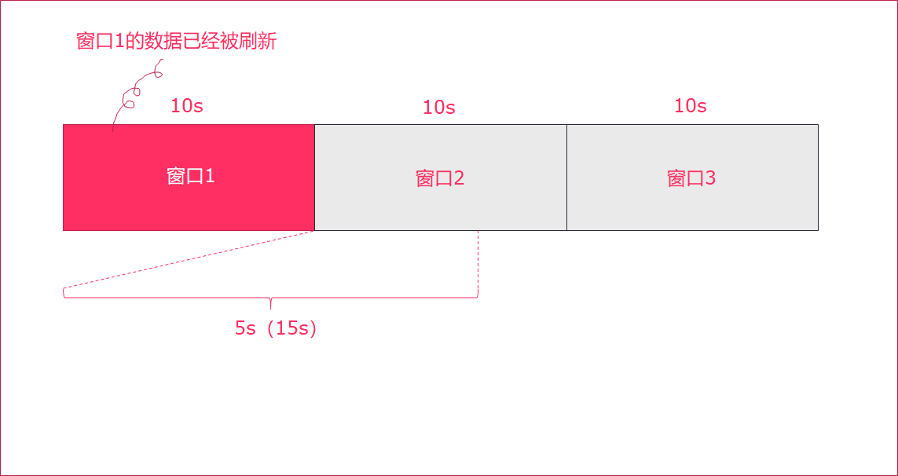
窗口计算时间 <  窗口时间

窗口计算时间 = 窗口时间


### 4.3. Count-Window

#### 4.3.1 tumbling-count-window (无重叠数据)

按照个数进行统计，比如：

每个路口分别统计，收到关于它的5条消息时,统计在最近5条消息中，各自路口通过的汽车数量

代码如下:

```scala
import org.apache.flink.streaming.api.scala.{KeyedStream, StreamExecutionEnvironment}
import org.apache.flink.streaming.api.scala._
/**
  * 无重叠数据
  */
object StreamingCountTumblingWindow {
  def main(args: Array[String]): Unit = {
    //1.创建运行环境
    val env: StreamExecutionEnvironment = StreamExecutionEnvironment.getExecutionEnvironment
    //2.定义数据流来源
    val textStream = env.socketTextStream("node01", 9999)
    //3.转换数据格式，text->CountCart
    val data = textStream.map(line => {
      val array = line.split(",")
      CountCart(array(0).toInt, array(1).toInt)
    })
    //4.执行统计操作，每个sensorId一个tumbling窗口，窗口的大小为5秒
    //按照key进行收集，对应的key出现的次数达到5次作为一个结果
    val keyByData: KeyedStream[CountCart, Int] = data.keyBy(line => line.sen)
    //相同的key出现三次才做一次sum聚合
    val result = keyByData.countWindow(3).sum(1)
    //5、显示统计结果
    result.print()
    //6、触发流计算
    env.execute()
  }
}
case class CountCart(sen:Int, cardNum:Int)
```

#### 4.3.2 sliding-count-window (有重叠数据)

同样也是窗口长度和滑动窗口的操作：窗口长度是5，滑动长度是3

```scala
import org.apache.flink.streaming.api.scala.{KeyedStream, StreamExecutionEnvironment}
import org.apache.flink.streaming.api.windowing.time.Time
import org.apache.flink.streaming.api.scala._
/**
  * 有重叠数据
  */
object StreamingCountSlidingWindow {
  def main(args: Array[String]): Unit = {
    //1.创建运行环境
    val env: StreamExecutionEnvironment = StreamExecutionEnvironment.getExecutionEnvironment
    //2.定义数据流来源
    val textStream = env.socketTextStream("node01", 9000)
    //3.转换数据格式，text->CarWc
    val data = textStream.map(line => {
      val array = line.split(",")
      CountCart(array(0).toInt, array(1).toInt)
    })
    //4.执行统计操作，每个sensorId一个sliding窗口，窗口大小3条数据,窗口滑动为3条数据
    //也就是说，每个路口分别统计，收到关于它的3条消息时统计在最近5条消息中，各自路口通过的汽车数量
    val keyByData: KeyedStream[CountCart, Int] = data.keyBy(line => line.sen)
    val result = keyByData.countWindow(5, 3).sum(1)
    //5、显示统计结果
    result.print()
    //6、触发流计算
    env.execute()
  }
}
```

### 4.4. Window apply

apply方法可以进行一些自定义处理，通过匿名内部类的方法来实现。当有一些复杂计算时使用。

用法

1. 实现`WindowFunction`类
2. 指定该类的泛型为`[输入数据类型, 输出数据类型, keyBy中使用分组字段的类型, 窗口类型]`

示例

使用apply方法来实现单词统计

步骤

1. 获取流处理运行环境
2. 构建socket流数据源，并指定IP地址和端口号
3. 对接收到的数据转换成单词元组
4. 使用`keyBy`进行分流（分组）
5. 使用`timeWinodw`指定窗口的长度（每3秒计算一次）
6. 实现一个WindowFunction匿名内部类
   - 在apply方法中实现聚合计算
   - 使用Collector.collect收集数据
7. 打印输出
8. 启动执行
9. 在Linux中，使用`nc -lk 端口号`监听端口，并发送单词

参考代码

```scala

import org.apache.flink.streaming.api.scala.{DataStream, StreamExecutionEnvironment}
import org.apache.flink.api.scala._
import org.apache.flink.streaming.api.scala.function.WindowFunction
import org.apache.flink.streaming.api.windowing.time.Time
import org.apache.flink.streaming.api.windowing.windows.TimeWindow
import org.apache.flink.util.Collector

object WindowApply {

  def main(args: Array[String]): Unit = {
    // 1. 获取流处理运行环境
    val env = StreamExecutionEnvironment.getExecutionEnvironment

    // 2. 构建socket流数据源，并指定IP地址和端口号
    val socketDataStream = env.socketTextStream("node01", 9999)

    // 3. 对接收到的数据转换成单词元组
    val wordcountDataStream: DataStream[(String, Int)] = socketDataStream.flatMap {
      text =>
        text.split(" ").map(_ -> 1)
    }

    // 4. 使用`keyBy`进行分流（分组）
    val groupedDataStream = wordcountDataStream.keyBy(_._1)

    // 5. 使用`timeWinodw`指定窗口的长度（每3秒计算一次）
    val windowedDataStream = groupedDataStream.timeWindow(Time.seconds(3))

    // 6. 实现一个WindowFunction匿名内部类
    val resultDataStream: DataStream[(String, Int)] = windowedDataStream.apply(new WindowFunction[(String, Int), (String, Int), String, TimeWindow] {

      //   - 在apply方法中实现聚合计算
      override def apply(key: String, window: TimeWindow, input: Iterable[(String, Int)], out: Collector[(String, Int)]): Unit = {
        val resultWordCount: (String, Int) = input.reduce {
          (wc1, wc2) =>
            (wc1._1, wc1._2 + wc2._2)
        }
        //   - 使用Collector.collect收集数据
        out.collect(resultWordCount)
      }
    })

    // 7. 打印输出
    resultDataStream.print()

    // 8. 启动执行
    env.execute("App")

  }
}

```

## 5. Flink的水印机制

### 5.1. Flink流处理时间方式

- EventTime[事件时间]
  事件发生的时间，例如：点击网站上的某个链接的时间
- IngestionTime[摄入时间]
  某个Flink节点的source operator接收到数据的时间，例如：某个source消费到kafka中的数据
- ProcessingTime[处理时间]
  某个Flink节点执行某个operation的时间，例如：timeWindow接收到数据的时间
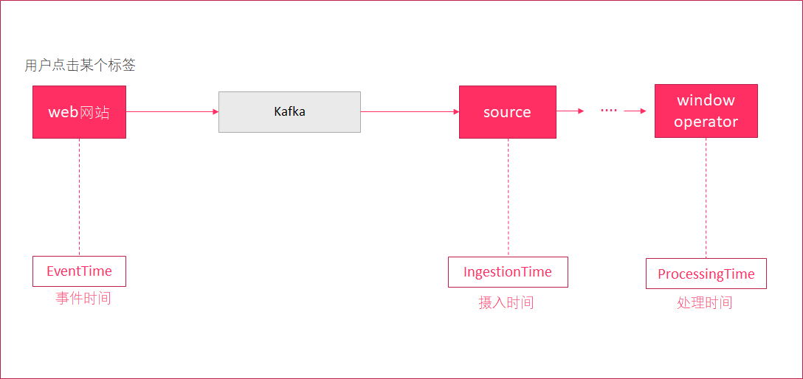

设置Flink流处理的时间类型（一般在生产环境中，都是使用EventTime来进行计算的）

```scala
// 设置为按照事件时间来进行计算
env.setStreamTimeCharacteristic(TimeCharacteristic.EventTime)
// 设置为按照处理时间来进行计算
env.setStreamTimeCharacteristic(TimeCharacteristic.ProcessingTime)
```

### 5.2. 水印机制产生的原因

在实际环境中，经常会出现，因为网络原因，数据有可能会`延迟`一会才到达Flink实时处理系统。
我们来设想一下下面这个场景:


1. 使用时间窗口来统计10分钟内的用户流量
2. 有一个时间窗口
    - 开始时间为：2017-03-19 10:00:00
    - 结束时间为：2017-03-19 10:10:00
3. 有一个数据，因为网络延迟
    - 事件发生的时间为：2017-03-19 10:`10`:00
    - 但进入到窗口的时间为：2017-03-19 10:10:`02`，延迟了2秒中
4. 时间窗口并没有将`59`这个数据计算进来，导致数据统计不正确

这种处理方式，根据消息进入到window时间，来进行计算。在网络有延迟的时候，会引起计算误差。

### 5.3. 使用水印解决网络延迟问题

水印（watermark）就是一个`时间戳`，Flink可以给数据流添加水印，可以理解为：收到一条消息后，额外给这个消息添加了一个时间字段，这就是添加水印。

- 水印并不会影响原有Eventtime
- 当数据流添加水印后，会按照水印时间来触发窗口计算
- 一般会设置水印时间，比Eventtime小几秒钟
- 当接收到的`水印时间 >= 窗口的endTime`，则触发计算


示例
编写代码, 计算5秒内，用户的订单总额
订单数据（订单ID——UUID、用户ID、时间戳、订单金额），要求`添加水印`来解决网络延迟问题。
步骤

1. 创建流处理运行环境
2. 设置处理时间为`EventTime`
3. 创建一个订单样例类`Order`，包含四个字段（订单ID、用户ID、订单金额、时间戳）
4. 创建一个自定义数据源
随机生成订单ID（UUID）
随机生成用户ID（0-2）
随机生成订单金额（0-100）
时间戳为当前系统时间
每隔1秒生成一个订单
5. 添加水印
允许延迟2秒
在获取水印方法中，打印水印时间、事件时间和当前系统时间
6. 按照用户进行分流
7. 设置5秒的时间窗口
8. 进行聚合计算
9. 打印结果数据
10. 启动执行流处理

参考代码

```scala
 import java.util.UUID
import java.util.concurrent.TimeUnit
import org.apache.commons.lang.time.FastDateFormat
import org.apache.flink.api.scala._
import org.apache.flink.streaming.api.TimeCharacteristic
import org.apache.flink.streaming.api.functions.AssignerWithPeriodicWatermarks
import org.apache.flink.streaming.api.functions.source.{RichSourceFunction, SourceFunction}
import org.apache.flink.streaming.api.scala.{DataStream, StreamExecutionEnvironment}
import org.apache.flink.streaming.api.watermark.Watermark
import org.apache.flink.streaming.api.windowing.time.Time

import scala.util.Random

object WaterMarkDemo {

  // 3. 创建一个订单样例类`Order`，包含四个字段（订单ID、用户ID、订单金额、时间戳）
  case class Order(orderId: String, userId: Int, money: Long, timestamp: Long)

  def main(args: Array[String]): Unit = {
    // 1. 创建流处理运行环境
    val env = StreamExecutionEnvironment.getExecutionEnvironment
    //   2. 设置处理时间为`EventTime`
    env.setStreamTimeCharacteristic(TimeCharacteristic.EventTime)
    // 4. 创建一个自定义数据源
    val orderDataStream: DataStream[Order] = env.addSource(new RichSourceFunction[Order] {
      var isRunning = true

      override def run(ctx: SourceFunction.SourceContext[Order]): Unit = {
        while (isRunning) {
          //   - 随机生成订单ID（UUID）
          // - 随机生成用户ID（0-2）
          // - 随机生成订单金额（0-100）
          // - 时间戳为当前系统时间
          // - 每隔1秒生成一个订单
          val order = Order(UUID.randomUUID().toString, Random.nextInt(3), Random.nextInt(101), new java.util.Date().getTime)
          ctx.collect(order)
          TimeUnit.SECONDS.sleep(1)
        }
      }

      override def cancel(): Unit = isRunning = false
    })
    // 5. 添加水印
    val watermarkDataStream = orderDataStream.assignTimestampsAndWatermarks(new AssignerWithPeriodicWatermarks[Order] {
      var currentTimestamp = 0L
      val delayTime = 2000

      override def getCurrentWatermark: Watermark = {
        //   - 允许延迟2秒
        // - 在获取水印方法中，打印水印时间、当前事件时间和当前系统时间
        val watermark = new Watermark(currentTimestamp - delayTime)
        val dateFormat = FastDateFormat.getInstance("HH:mm:ss")

        println(s"当前水印时间:${dateFormat.format(watermark.getTimestamp)}, 当前事件时间: ${dateFormat.format(currentTimestamp)}, 当前系统时间: ${dateFormat.format(System.currentTimeMillis())}")
        watermark
      }

      override def extractTimestamp(element: Order, previousElementTimestamp: Long): Long = {
        val timestamp = element.timestamp
        currentTimestamp = Math.max(currentTimestamp, timestamp)
        currentTimestamp
      }
    })
    // 6. 按照用户进行分流
    // 7. 设置5秒的时间窗口
    // 8. 进行聚合计算
    // 9. 打印结果数据
    // 10. 启动执行流处理
    watermarkDataStream.keyBy(_.userId)
      .timeWindow(Time.seconds(5))
      .reduce {
        (order1, order2) =>
          Order(order2.orderId, order2.userId, order1.money + order2.money, 0)
      }
      .print()
    env.execute("WarkMarkDemoJob")
  }
}
```

# 04-Flink高级

学习目标

- Flink的状态管理
  - keyed state
  - operator state
- Flink的CheckPoint
  - checkpoint的持久化方案
  - checkpoint持久化开发
- Flink SQL & Table API
  - DataSet/DataStream转Table
  - Table转DataSet/DataStream
  - SQL操作数据
  - TableAPI操作数据

## 1. Flink的状态管理

### 1.1. 什么是有状态的计算

官网对Flink的解释：**Stateful Computations over Data Streams**，这是说Flink是一个有`xA`的数据流计算框架。

**那什么是有状态的计算？**

计算任务的结果不仅仅依赖于输入，还依赖于它的当前状态，其实大多数的计算都是有状态的计算。

比如wordcount,计算单词的count,这是一个很常见的业务场景。count做为输出，在计算的过程中要不断的把输入累加到count上去，那么count就是一个state。

传统的流计算系统缺少对于程序状态的有效支持

- 状态数据的存储和访问；
- 状态数据的备份和恢复；
- 状态数据的划分和动态扩容。

在传统的批处理中，数据是划分为块分片去完成的，然后每一个Task去处理一个分片。当分片执行完成后，把输出聚合起来就是最终的结果。在这个过程当中，对于state的需求还是比较小的。

对于流计算而言，对State有非常高的要求，因为在流系统中输入是一个无限制的流，会运行很长一段时间，甚至运行几天或者几个月都不会停机。在这个过程当中，就需要将状态数据很好的管理起来。很不幸的是，在传统的流计算系统中，对状态管理支持并不是很完善。比如storm,没有任何程序状态的支持，一种可选的方案是storm+hbase这样的方式去实现，把这状态数据存放在Hbase中，计算的时候再次从Hbase读取状态数据，做更新在写入进去。这样就会有如下几个问题

- 流计算系统的任务和Hbase的数据存储有可能不在同一台机器上，导致性能会很差。这样经常会做远端的访问，走网络和存储；

- 备份和恢复是比较困难，因为Hbase是没有回滚的，要做到Exactly once 很困难。在分布式环境下，如果程序出现故障，只能重启Storm，那么Hbase的数据也就无法回滚到之前的状态。
  比如广告计费的这种场景，Storm+Hbase是是行不通的，出现的问题是钱可能就会多算，解决以上的办法是Storm+mysql，通过mysql的回滚解决一致性的问题。但是架构会变得非常复杂。性能也会很差，要commit确保数据的一致性。

- 对于storm而言状态数据的划分和动态扩容也是非常难做。
  一个很严重的问题是所有用户都会在strom上重复的做这些工作，比如搜索，广告都要在做一遍，由此限制了部门的业务发展。

Flink丰富的状态访问和高效的容错机制
我们前面写的WordCount的例子，没有包含`状态管理`。如果一个Task在处理过程中挂掉了，那么它在内存中的状态都会丢失，所有的数据都需要重新计算。 从容错和消息处理的语义上(at least once, exactly once)，Flink引入了`State`和`Checkpoint`

首先区分一下两个概念:

 State:
一般指一个具体的Task/Operator的状态，
State数据默认保存在Java的堆内存中
Checkpoint:
表示了一个Flink Job在一个特定时刻的一份全局状态快照，即包含了所有Task/Operator的状态
可以理解为Checkpoint是把State数据定时持久化存储了，
State可以被记录，在失败的情况下数据还可以恢复
Flink中有两种基本类型的State

- Keyed State
- Operator State

可以以两种形式存在：`原始状态`和`托管状态`

托管状态是由Flink框架管理的状态，如ValueState, ListState, MapState等。

而原始状态，由用户自行管理状态具体的数据结构，框架在做checkpoint的时候，使用byte[]来读写状态内容，对其内部数据结构一无所知。

通常在DataStream上的状态推荐使用托管的状态，当实现一个用户自定义的operator时，会使用到原始状态。

### 1.2. Keyed State

顾名思义，就是基于KeyedStream上的状态。这个状态是跟特定的key绑定的，对KeyedStream流上的每一个key，都对应一个state。

stream.keyBy(…)

保存state的数据结构

```text
`ValueState<T>`:即类型为T的`单值`状态。这个状态与对应的key绑定，是最简单的状态了。它可以通过`update`方法更新状态值，通过`value()`方法获取状态值
ListState<T>:即key上的状态值为一个列表。可以通过add方法往列表中附加值；也可以通过get()方法返回一个Iterable<T>来遍历状态值
ReducingState<T>:这种状态通过用户传入的reduceFunction，每次调用add方法添加值的时候，会调用reduceFunction，最后合并到一个单一的状态值
MapState<UK, UV>:即状态值为一个map。用户通过put或putAll方法添加元素
需要注意的是，以上所述的State对象，仅仅用于与状态进行交互（更新、删除、清空等），而真正的状态值，有可能是存在内存、磁盘、或者其他分布式存储系统中。相当于我们只是持有了这个状态的句柄
```

官网示例代码

```scala
import org.apache.flink.api.common.functions.RichFlatMapFunction
import org.apache.flink.api.common.state.{ValueState, ValueStateDescriptor}
import org.apache.flink.configuration.Configuration
import org.apache.flink.streaming.api.scala.StreamExecutionEnvironment
import org.apache.flink.api.scala._
import org.apache.flink.util.Collector

class CountWindowAverage extends RichFlatMapFunction[(Long, Long), (Long, Long)] {

  private var sum: ValueState[(Long, Long)] = _

  override def flatMap(input: (Long, Long), out: Collector[(Long, Long)]): Unit = {

    // access the state value
    val tmpCurrentSum = sum.value

    // If it hasn't been used before, it will be null
    val currentSum = if (tmpCurrentSum != null) {
      tmpCurrentSum
    } else {
      (0L, 0L)
    }

    // update the count
    val newSum = (currentSum._1 + 1, currentSum._2 + input._2)

    // update the state
    sum.update(newSum)

    // if the count reaches 2, emit the average and clear the state
    if (newSum._1 >= 2) {
      out.collect((input._1, newSum._2 / newSum._1))
      sum.clear()
    }
  }

  override def open(parameters: Configuration): Unit = {
    sum = getRuntimeContext.getState(
      new ValueStateDescriptor[(Long, Long)]("average", createTypeInformation[(Long, Long)])
    )
  }
}


object ExampleCountWindowAverage extends App {
  val env = StreamExecutionEnvironment.getExecutionEnvironment

  env.fromCollection(List(
    (1L, 3L),
    (1L, 5L),
    (1L, 7L),
    (1L, 4L),
    (1L, 2L)
  )).keyBy(_._1)
    .flatMap(new CountWindowAverage())
    .print()
  // the printed output will be (1,4) and (1,5)

  env.execute("ExampleManagedState")
}
```

### 1.3. Operator State

- 与Key无关的State，与Operator绑定的state，整个operator`只对应一个`state
- 保存state的数据结构
  - `ListState<T>`
- 举例来说，Flink中的Kafka Connector，就使用了operator state。它会在每个connector实例中，保存该实例中消费topic的所有(partition, offset)映射

官网案例
<https://ci.apache.org/projects/flink/flink-docs-release-1.6/dev/stream/state/state.html#using-managed-operator-state>

```scala
package com.itheima

import org.apache.flink.api.common.state.{ListState, ListStateDescriptor}
import org.apache.flink.api.common.typeinfo.{TypeHint, TypeInformation}
import org.apache.flink.runtime.state.{FunctionInitializationContext, FunctionSnapshotContext}
import org.apache.flink.streaming.api.checkpoint.CheckpointedFunction
import org.apache.flink.streaming.api.functions.sink.SinkFunction

import scala.collection.mutable.ListBuffer

/**
  * 带缓存的Sink
  *
  * SinkFunction : 自定义Sink的函数
  * CheckpointedFunction: 状态转换函数的核心接口
  * @param threshold    阈值
  */
class BufferingSink(threshold: Int = 0)
  extends SinkFunction[(String, Int)]
    with CheckpointedFunction {

  @transient
  private var checkpointedState: ListState[(String, Int)] = _

  // 缓存对象
  private val bufferedElements = ListBuffer[(String, Int)]()

  override def invoke(value: (String, Int)): Unit = {
    // 累加数据到bufferedElements
    bufferedElements += value

    // 如果bufferedElements累加的大小等于阈值,那么进行sink,并清除数据
    if (bufferedElements.size == threshold) {
      for (element <- bufferedElements) {
        // send it to the sink
      }
      bufferedElements.clear()
    }
  }

  /**
    * 快照State
    * @param context
    */
  override def snapshotState(context: FunctionSnapshotContext): Unit = {
    // 清理下历史State
    checkpointedState.clear()
    // 遍历缓存bufferedElements中的所有数据,会添加到ListState中
    for (element <- bufferedElements) {
      checkpointedState.add(element)
    }
  }

  /**
    * 初始化State
    * @param context
    */
  override def initializeState(context: FunctionInitializationContext): Unit = {
    // 创建ListStateDescriptor
    val descriptor = new ListStateDescriptor[(String, Int)](
      "buffered-elements",
      TypeInformation.of(new TypeHint[(String, Int)]() {})
    )

    // 获取ListState对象
    checkpointedState = context.getOperatorStateStore.getListState(descriptor)

    // 如果是错误恢复状态, 获取ListState对象的值,并且累加到bufferedElements
    if(context.isRestored) {
      for(element <- checkpointedState.get()) {
        bufferedElements += element
      }
    }
  }

}
```

## 2. Flink的容错

### 2.1. Checkpoint介绍

Checkpoint是Flink容错的核心机制。它可以定期地将各个Operator处理的数据进行快照存储（`Snapshot`）。如果Flink程序出现宕机，可以重新从这些快照中恢复数据。
每个需要Checkpoint的应用在启动时，Flink的JobManager为其创建一个 `CheckpointCoordinator`(检查点协调器)，CheckpointCoordinator全权负责本应用的快照制作。
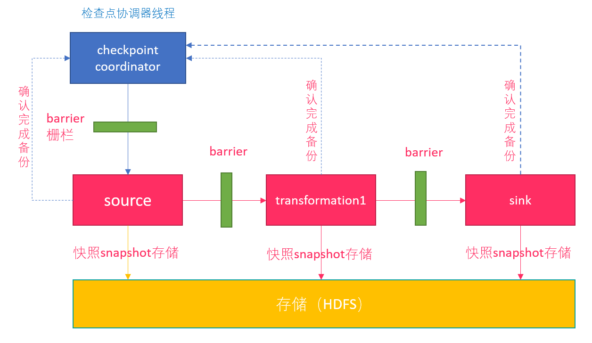
1.`CheckpointCoordinator`周期性的向该流应用的所有`Source`算子发送`Barrier`。
2.当某个Source算子收到一个barrier时，便`暂停`数据处理过程，然后将自己的当前状态制作成`快照`，并保存到指定的持久化存储中，最后向CheckpointCoordinator报告自己快照制作情况，同时向自身所有下游算子广播该Barrier，恢复数据处理
3. 下游算子收到Barrier之后，会暂停自己的数据处理过程，然后将自身的相关状态制作成快照，并保存到指定的持久化存储中，最后向CheckpointCoordinator报告自身快照情况，同时向自身所有下游算子广播该Barrier，恢复数据处理。
4. 每个算子按照步骤3不断制作快照并向下游广播，直到`最后Barrier`传递到`Sink算子`，快照制作完成。
5. 当CheckpointCoordinator收到所有算子的报告之后，认为该周期的快照制作成功; 否则，如果在规定的时间内没有收到所有算子的报告，则认为本周期快照制作失败
单流的Barrier
Flink 分布式快照的核心概念之一就是`数据栅栏（barrier）`。

- 这些 barrier 被插入到数据流中，作为数据流的一部分和数据一起向下流动。
- Barrier 不会干扰正常数据，`数据流严格有序`。Barrier 永远不会赶超通常的流记录，它会严格遵循顺序。
- 一个 barrier 把数据流分割成两部分：一部分进入到当前快照，另一部分进入下一个快照。
- 每一个 barrier 都带有快照 ID，并且 barrier 之前的数据都进入了此快照。
- Barrier 不会干扰数据流处理，所以非常轻量。
- 多个不同快照的多个 barrier 会在流中同时出现，即多个快照可能同时创建。

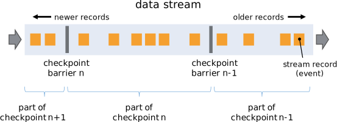

并行Barrier
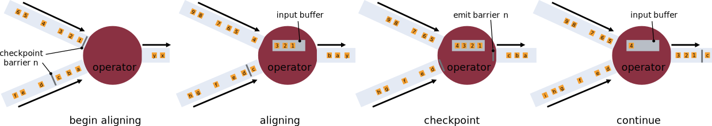
当Operator接收到`多个`输入的数据流时，需要在Snapshot Barrier中对数据流进行`排列对齐`：

1. Operator从一个incoming Stream接收到Snapshot Barrier n，然后`暂停`处理，直到其它的incoming Stream的Barrier n（否则属于2个Snapshot的记录就混在一起了）到达该Operator
2. 接收到Barrier n的Stream被临时搁置，来自这些Stream的记录不会被处理，而是被放在一个Buffer中。
3. 一旦最后一个Stream接收到Barrier n，Operator会emit所有暂存在Buffer中的记录，然后向Checkpoint Coordinator发送Snapshot n。
4. 继续处理来自多个Stream的记录

基于Stream Aligning操作能够实现Exactly Once语义，但是也会给流处理应用带来延迟，因为为了排列对齐Barrier，会暂时缓存一部分Stream的记录到Buffer中，尤其是在数据流并行度很高的场景下可能更加明显，通常以最迟对齐Barrier的一个Stream为处理Buffer中缓存记录的时刻点。在Flink中，提供了一个开关，选择是否使用Stream Aligning，如果关掉则Exactly Once会变成At least once。

### 2.2. Checkpoint持久化

目前，Checkpoint持久化存储可以使用如下三种:

- MemoryStateBackend
- FsStateBackend
- RocksDBStateBackend

#### 2.2.1. MemoryStateBackend

`MemoryStateBackend` 是将状态维护在 Java 堆上的一个内部状态后端。键值状态和窗口算子使用哈希表来存储数据（values）和定时器（timers）。当应用程序 checkpoint 时，此后端会在将状态发给 JobManager 之前快照下状态，JobManager 也将状态存储在 Java 堆上。默认情况下，MemoryStateBackend 配置成支持异步快照。异步快照可以避免阻塞数据流的处理，从而避免反压的发生。
使用 MemoryStateBackend 时的注意点：

- 默认情况下，每一个状态的大小限制为 5 MB。可以通过 MemoryStateBackend 的构造函数增加这个大小。
- 状态大小受到 akka 帧大小的限制，所以无论怎么调整状态大小配置，都不能大于 akka 的帧大小。
- 状态的总大小不能超过 JobManager 的内存。

何时使用 MemoryStateBackend：

- 本地开发或调试时建议使用 MemoryStateBackend，因为这种场景的状态大小的是有限的。
- MemoryStateBackend 最适合小状态的应用场景。例如 `Kafka consumer`，或者一次仅一记录的函数 （Map, FlatMap，或 Filter）。

#### 2.2.2. FsStateBackend

该持久化存储主要将快照数据保存到`文件系统`中，目前支持的文件系统主要是 `HDFS`和`本地文件`。如果使用HDFS，则初始化FsStateBackend时，需要传入以 `“hdfs://”`开头的路径(即: new FsStateBackend("hdfs:///hacluster/checkpoint"))， 如果使用本地文件，则需要传入以`“file://”`开头的路径(即:new FsStateBackend("file:///Data"))。在分布式情况下，不推荐使用本地文件。如果某个算子在节点A上失败，在节点B上恢复，使用本地文件时，在B上无法读取节点 A上的数据，导致状态恢复失败。
FsStateBackend适用的场景：

- 适用于处理大状态，长窗口，或大键值状态的有状态处理任务。

- 非常适合用于高可用方案。

#### 2.2.3. RocksDBStateBackend

RocksDBStateBackend 的配置也需要一个文件系统（类型，地址，路径），如下所示：

- “hdfs://namenode:9000/flink/checkpoints” 或
- “file:///flink/checkpoints”

RocksDB 是一种嵌入式的本地数据库。RocksDBStateBackend 将处理中的数据使用 RocksDB 存储在本地磁盘上。在 checkpoint 时，整个 RocksDB 数据库会被存储到配置的文件系统中，或者在超大状态作业时可以将增量的数据存储到配置的文件系统中。同时 Flink 会将极少的元数据存储在 JobManager 的内存中，或者在 Zookeeper 中（对于高可用的情况）。RocksDB 默认也是配置成异步快照的模式。

何时使用 RocksDBStateBackend：

- RocksDBStateBackend 最适合用于处理大状态，长窗口，或大键值状态的有状态处理任务。
- RocksDBStateBackend 非常适合用于高可用方案。
- RocksDBStateBackend 是目前唯一支持增量 checkpoint 的后端。增量 checkpoint 非常使用于超大状态的场景。

当使用 RocksDB 时，状态大小只受限于磁盘可用空间的大小。这也使得 RocksDBStateBackend 成为管理超大状态的最佳选择。使用 RocksDB 的权衡点在于所有的状态相关的操作都需要序列化（或反序列化）才能跨越 JNI 边界。与上面提到的堆上后端相比，这可能会影响应用程序的吞吐量。

如果用户使用自定义窗口(window)，不推荐用户使用RocksDBStateBackend。在自定义窗口中，状态以ListState的形式保存在StatBackend中，如果一个key值中有多 个value值，则RocksDB读取该种ListState非常缓慢，影响性能。用户可以根据应用的具体情况选择`FsStateBackend+HDFS`或`RocksStateBackend+HDFS`。

设置CheckPoint的代码如下:

```scala
val env = StreamExecutionEnvironment.getExecutionEnvironment
// start a checkpoint every 1000 ms
env.enableCheckpointing(1000)
// advanced options:
// 设置checkpoint的执行模式，最多执行一次或者至少执行一次
env.getCheckpointConfig.setCheckpointingMode(CheckpointingMode.EXACTLY_ONCE)
// 设置checkpoint的超时时间
env.getCheckpointConfig.setCheckpointTimeout(60000)
// 如果在制作快照过程中出现错误，是否让整体任务失败：true是  false不是
env.getCheckpointConfig.setFailOnCheckpointingErrors(false)
//设置同一时间有多少个checkpoint可以同时执行
env.getCheckpointConfig.setMaxConcurrentCheckpoints(1)
```

### 2.3. 修改State Backend

第一种：单任务调整
修改当前任务代码
env.setStateBackend(new FsStateBackend("hdfs://namenode:9000/flink/checkpoints"));
或者new MemoryStateBackend()
或者new RocksDBStateBackend(filebackend, true);*需要添加第三方依赖*
第二种：全局调整

修改flink-conf.yaml
state.backend: filesystem
state.checkpoints.dir: hdfs://namenode:9000/flink/checkpoints

注意：state.backend的值可以是下面几种：
jobmanager(MemoryStateBackend),
filesystem(FsStateBackend),
rocksdb(RocksDBStateBackend)

### 2.4. 案例

#### 2.4.1. 需求

假定用户需要每隔`1秒`钟需要统计`4秒`中窗口中`数据的量`，然后对统计的结果值进行`checkpoint`处理。
窗口的长度: 4s
窗口的滑动时间: 1s
求数据量的总数
checkpoint的支持

#### 2.4.2. 数据规划

使用自定义算子每秒钟产生大约10000条数据。
产生的数据为一个四元组(Long，String，String，Integer)—------(id,name,info,count)
数据经统计后，统计结果打印到终端输出
打印输出的结果为Long类型的数据

#### 2.4.3. 开发思路

source算子每隔1秒钟发送10000条数据，并注入到Window算子中。
window算子每隔1秒钟统计一次最近4秒钟内数据数量。
每隔1秒钟将统计结果打印到终端
每隔6秒钟触发一次checkpoint，然后将checkpoint的结果保存到HDFS或本地文件中。

#### 2.4.4. 开发步骤

开发自定义数据源

1. 自定义样例类(id: Long, name: String, info: String, count: Int)
2. 自定义数据源,继承RichSourceFunction
3. 实现run方法, 每秒钟向流中注入10000个样例类
开发自定义状态

1.继承Serializable
2.为总数count提供set和get方法

开发自定义Window和检查点

1. 继承WindowFunction
2. 重写apply方法,对窗口数据进行总数累加
3. 继承ListCheckpointed
4. 重写snapshotState,制作自定义快照
5. 重写restoreState,恢复自定义快照

开发主业务

1. 流处理环境
2. 开启checkpoint,间隔时间为6s
3. 设置checkpoint位置
4. 设置处理时间为事件时间
5. 添加数据源
6. 添加水印支持
7. keyby分组
8. 设置滑动窗口,窗口时间为4s
9. 指定自定义窗口
10. 打印结果
11. 执行任务

#### 2.4.5. 代码

```scala
package com.itheima

import java.util
import java.util.concurrent.TimeUnit

import org.apache.flink.api.java.tuple.Tuple
import org.apache.flink.runtime.state.filesystem.FsStateBackend
import org.apache.flink.streaming.api.functions.AssignerWithPeriodicWatermarks
import org.apache.flink.streaming.api.{CheckpointingMode, TimeCharacteristic}
import org.apache.flink.streaming.api.functions.source.RichSourceFunction
import org.apache.flink.streaming.api.functions.source.SourceFunction.SourceContext
import org.apache.flink.streaming.api.scala.{DataStream, KeyedStream, StreamExecutionEnvironment, WindowedStream}
import org.apache.flink.streaming.api.watermark.Watermark
import org.apache.flink.streaming.api.windowing.assigners.SlidingEventTimeWindows
import org.apache.flink.streaming.api.windowing.time.Time
import org.apache.flink.api.scala._
import org.apache.flink.streaming.api.checkpoint.ListCheckpointed
import org.apache.flink.streaming.api.scala.function.WindowFunction
import org.apache.flink.streaming.api.windowing.windows.TimeWindow
import org.apache.flink.util.Collector

//样例类-->发送数据形式
case class SEvent(id: Long, name: String, info: String, count: Int)

/**
  * 自定义数据源,继承RichSourceFunction
  * 实现run方法和cancel方法
  */
class SEventSourceWithChk extends RichSourceFunction[SEvent] {
  private var isRunning = true

  // 任务取消时调用
  override def cancel(): Unit = {
    isRunning = false
  }

  // source算子的逻辑，即:每秒钟向流图中注入10000个元组
  override def run(sourceContext: SourceContext[SEvent]): Unit = {
    while (isRunning) {
      for (i <- 0 until 10000) {
        sourceContext.collect(SEvent(1, "hello-" + i, "test-info", 1))
      }
      TimeUnit.SECONDS.sleep(1)
    }
  }
}

/**
  * 该段代码是流图定义代码，具体实现业务流程，另外，代码中窗口的触发时间使 用了event time。
  */
object FlinkEventTimeAPIChkMain {
  def main(args: Array[String]): Unit = {
    // 1. 流处理环境
    val env = StreamExecutionEnvironment.getExecutionEnvironment
    // 2. 开启checkpoint,间隔时间为6s
    env.enableCheckpointing(6000)
    // 3. 设置checkpoint位置
    //    env.setStateBackend(new FsStateBackend("hdfs://node01:9000/flink-checkpoint/checkpoint/"))
    env.setStateBackend(new FsStateBackend("file:///E:/dev_checkpoint/"))
    // 设置checkpoint模式, EXACTLY_ONCE为默认值,这句可以省略
    env.getCheckpointConfig.setCheckpointingMode(CheckpointingMode.EXACTLY_ONCE)
    // 4.设置处理时间为 事件时间
    env.setStreamTimeCharacteristic(TimeCharacteristic.EventTime)
    // 5. 添加数据源
    val source: DataStream[SEvent] = env.addSource(new SEventSourceWithChk)
    // 6. 添加水印支持
    val watermarkDataStream: DataStream[SEvent] = source.assignTimestampsAndWatermarks(new AssignerWithPeriodicWatermarks[SEvent] {
      // 设置watermark
      override def getCurrentWatermark: Watermark = {
        new Watermark(System.currentTimeMillis())
      }
      // 给每个元组打上时间戳
      override def extractTimestamp(t: SEvent, l: Long): Long = {
        System.currentTimeMillis()
      }
    })
    // 7. keyby分组
    val keyedStream: KeyedStream[SEvent, Tuple] = watermarkDataStream.keyBy("id")
    // 8. 设置滑动窗口,窗口时间为4s
    val windowedStream: WindowedStream[SEvent, Tuple, TimeWindow] = keyedStream.timeWindow(Time.seconds(4),Time.seconds(1))
    // 9. 指定自定义窗口
    val result: DataStream[Long] = windowedStream.apply(new WindowStatisticWithChk)
    // 10. 打印结果
    result.print()
    // 11. 执行任务
    env.execute()
  }
}

/**
  * 该数据在算子制作快照时用于保存到目前为止算子记录的数据条数。
  * 用户自定义状态
  */
class UDFState extends Serializable {
  private var count = 0L

  // 设置用户自定义状态
  def setState(s: Long) = count = s

  // 获取用户自定状态
  def getState = count
}

//
/**
  * 该段代码是window算子的代码，每当触发计算时统计窗口中元组数量。
  * 自定义Window,继承WindowFunction
  * WindowFunction[IN, OUT, KEY, W <: Window]
  * ListCheckpointed[UDFState]
  *
  */
class WindowStatisticWithChk extends WindowFunction[SEvent, Long, Tuple, TimeWindow] with ListCheckpointed[UDFState] {
  private var total = 0L


  /**
    * window算子的实现逻辑，即:统计window中元组的数量
    *
    * @param key    keyby的类型
    * @param window 窗口
    * @param input  输入类型
    * @param out    输出类型
    */
  override def apply(key: Tuple, window: TimeWindow, input: Iterable[SEvent], out: Collector[Long]): Unit = {
    var count = 0L
    for (event <- input) {
      count += 1L
    }
    total += count
    out.collect(count)
  }

  /**
    * 从自定义快照中恢复状态
    *
    * @param state
    */
  override def restoreState(state: java.util.List[UDFState]): Unit = {
    val udfState = state.get(0)
    total = udfState.getState
  }

  /**
    * 制作自定义状态快照
    *
    * @param checkpointId 唯一单调递增的数字
    * @param timestamp    master触发checkpoint的时间戳
    * @return
    */
  override def snapshotState(checkpointId: Long, timestamp: Long): java.util.List[UDFState] = {
    val udfList: java.util.ArrayList[UDFState] = new java.util.ArrayList[UDFState]
    val udfState = new UDFState
    udfState.setState(total)
    udfList.add(udfState)
    udfList
  }
}
```

## 3. Flink SQL开发

### 3.1. 什么是flink关系型API

当我们在使用flink做流式和批式任务计算的时候，往往会想到几个问题：

1. 需要熟悉两套API : DataStream/DataSet API，API有一定难度，开发人员无法集中精力到具体业务的开发
2. 需要有Java或Scala的开发经验
3. flink同时支持批任务与流任务，如何做到API层的统一

flink已经拥有了强大的DataStream/DataSetAPI，满足流计算和批计算中的各种场景需求，但是关于以上几个问题，我们还需要提供一种关系型的API来实现flink API层的流与批的统一，那么这就是flink的`Table API & SQL`。

首先Table API& SQL 是一种关系型API，用户可以像操作MySQL数据库表一样的操作数据，而不需要写Java代码完成flink function，更不需要手工的优化Java代码调优。另外，SQL作为一个非程序员可操作的语言，学习成本很低，如果一个系统提供SQL支持，将很容易被用户接受。

总结来说，关系型API的好处：

1. 关系型API是声明式的
2. 查询能够被有效的优化
3. 查询可以高效的执行
4. “Everybody” knows SQL

Table API& SQL 是流处理和批处理统一的API层，如下图。

- flink在runtime层是统一的，因为flink将批任务看做流的一种特例来执行
- 在API层，flink为批和流提供了两套API（DataSet和DataStream）
- Table API & SQL就统一了flink的API层，批数据上的查询会随着输入数据的结束而结束并生成DataSet，流数据的查询会一直运行并生成结果流。
- Table API & SQL做到了批与流上的查询具有同样的语法语义，因此不用改代码就能同时在批和流上执行。


**Table API的特点**
Table API和SQL都是Apache Flink中高等级的分析API，SQL所具备的特点Table API也都具有，如下：

- 声明式 - 用户只关心做什么，不用关心怎么做；
- 高性能 - 支持查询优化，可以获取最好的执行性能；
- 流批统一 - 相同的统计逻辑，既可以流模式运行，也可以批模式运行；
- 标准稳定 - 语义遵循SQL标准，语法语义明确，不易变动。

当然除了SQL的特性，因为Table API是在Flink中专门设计的，所以Table API还具有自身的特点：

- 表达方式的扩展性 - 在Flink中可以为Table API开发很多便捷性功能，如：Row.flatten(), map/flatMap 等
- 功能的扩展性 - 在Flink中可以为Table API扩展更多的功能，如：Iteration，flatAggregate 等新功能
- 编译检查 - Table API支持java和scala语言开发，支持IDE中进行编译检查。

Table API和SQL捆绑在flink-table Maven工件中。必须将以下依赖项添加到你的项目才能使用Table API和SQL：

```xml
<dependency>
    <groupId>org.apache.flink</groupId>
    <artifactId>flink-table_2.11</artifactId>
    <version>1.6.1</version>
</dependency>
```

另外，你需要为Flink的Scala批处理或流式API添加依赖项。对于批量查询，您需要添加：

```xml
<dependency>
    <groupId>org.apache.flink</groupId>
    <artifactId>flink-scala_2.11</artifactId>
    <version>1.6.1</version>
</dependency>
```

### 3.2. Table API和SQL程序的结构

Table API一般与DataSet或者DataStream紧密关联，可以通过一个DataSet或DataStream创建出一个Table，再用类似于filter, join, 或者 select关系型转化操作来转化为一个新的`Table`对象。最后将一个Table对象转回一个DataSet或DataStream。从内部实现上来说，所有应用于Table的转化操作都变成一棵逻辑表操作树，在Table对象被转化回DataSet或者DataStream之后，转化器会将逻辑表操作树转化为对等的DataSet或者DataStream操作符。
Flink的批处理和流处理的Table API和SQL程序遵循相同的模式；所以我们只需要使用一种来演示即可要想执行flink的SQL语句，首先需要获取SQL的执行环境：两种方式（batch和streaming）：

批处理:

```scala
val bEnv = ExecutionEnvironment.getExecutionEnvironment
// create a TableEnvironment for batch queries
val bTableEnv = TableEnvironment.getTableEnvironment(bEnv)
```

流处理:

```scala
val sEnv = StreamExecutionEnvironment.getExecutionEnvironment
// create a TableEnvironment for streaming queries
val sTableEnv = TableEnvironment.getTableEnvironment(sEnv)
```

通过`getTableEnvironment`可以获取`TableEnviromment`；这个TableEnviromment是Table API和SQL集成的核心概念。它负责：

- 在内部目录中注册一个表
- 注册外部目录
- 执行SQL查询
- 注册用户定义的（标量，表格或聚合）函数
- 转换DataStream或DataSet成Table
- 持有一个ExecutionEnvironment或一个参考StreamExecutionEnvironment

### 3.3. 在内部目录中注册一个表

TableEnvironment维护一个按名称注册的表的目录。有两种类型的表格，`输入`表格和`输出`表格。输入表可以在Table API和SQL查询中引用并提供输入数据。输出表可用于将表API或SQL查询的结果发送到外部系统输入表可以从各种来源注册：

- 现有Table对象，通常是表API或SQL查询的结果。
- TableSource，它访问外部数据，例如文件，数据库或消息传递系统。
- DataStream或DataSet来自DataStream或DataSet程序。

输出表可以使用注册TableSink。

#### 3.3.1. 注册一个表

```scala
// get a TableEnvironment
val tableEnv = TableEnvironment.getTableEnvironment(env)
// register the Table projTable as table "projectedX"
tableEnv.registerTable("projectedTable", projTable)
// Table is the result of a simple projection query
val projTable: Table = tableEnv.scan("projectedTable ").select(...)
```

#### 3.3.2. 注册一个TableSource

TableSource提供对存储在诸如数据库（MySQL，HBase等），具有特定编码（CSV，Apache [Parquet，Avro，ORC]，...）的文件的存储系统中的外部数据的访问或者消息传送系统（Apache Kafka，RabbitMQ，...）

```scala
// get a TableEnvironment
val tableEnv = TableEnvironment.getTableEnvironment(env)
// create a TableSource
val csvSource: TableSource = CsvTableSource.builder().path("./data/score.csv")...
// register the TableSource as table "CsvTable"
tableEnv.registerTableSource("CsvTable", csvSource)
```

#### 3.3.3. 注册一个TableSink

注册TableSink可用于将表API或SQL查询的结果发送到外部存储系统，如数据库，键值存储，消息队列或文件系统（使用不同的编码，例如CSV，Apache [Parquet ，Avro，ORC]，...）

```scala
// get a TableEnvironment
val tableEnv = TableEnvironment.getTableEnvironment(env)
// create a TableSink
val csvSink: TableSink = new CsvTableSink("/path/to/file", ...)
// define the field names and types
val fieldNames: Array[String] = Array("a", "b", "c")
val fieldTypes: Array[TypeInformation[_]] = Array(Types.INT, Types.STRING, Types.LONG)
// register the TableSink as table "CsvSinkTable"
tableEnv.registerTableSink("CsvSinkTable", fieldNames, fieldTypes, csvSink)
```

### 3.4. Table和DataStream和DataSet的集成

#### 3.4.1. 将DataStream或DataSet转换为Table

在上面的例子讲解中，直接使用的是：`registerTableSource`注册表

对于flink来说，还有更灵活的方式：比如直接注册DataStream或者DataSet转换为一张表。

然后DataStream或者DataSet就相当于表，这样可以继续使用SQL来操作流或者批次的数据

语法：

```scala
// get TableEnvironment
// registration of a DataSet is equivalent
val env = StreamExecutionEnvironment.getExecutionEnvironment
val tableEnv = TableEnvironment.getTableEnvironment(env)

val stream: DataStream[(Long, String)] = ...

// register the DataStream as Table "myTable" with fields "f0", "f1"
tableEnv.registerDataStream("myTable", stream)

```

示例

以`流`处理方式，加载下列数据，并注册为表，查询所有数据，写入到CSV文件中。

| id   | product | amount |
| ---- | ------- | ------ |
| 1    | beer    | 3      |
| 2    | diaper  | 4      |
| 3    | rubber  | 2      |

开发步骤

1. 获取流处理环境
2. 获取TableEnvironment
3. 加载本地集合
4. 根据数据注册表
5. 执行SQL
6. 写入CSV文件中
7. 执行任务

代码

```scala
import org.apache.flink.streaming.api.scala.{DataStream, StreamExecutionEnvironment}
import org.apache.flink.table.api.TableEnvironment
import org.apache.flink.api.scala._
import org.apache.flink.core.fs.FileSystem
import org.apache.flink.table.sinks.CsvTableSink

object DataSet_DataStreamToTable {
  def main(args: Array[String]): Unit = {

    // 1. 获取流处理环境
    val env = StreamExecutionEnvironment.getExecutionEnvironment
    // 2. 获取TableEnvironment
    val tableEnv = TableEnvironment.getTableEnvironment(env)
    // 3. 加载本地集合
    val orderA: DataStream[Order1] = env.fromCollection(Seq(
      Order1(1L, "beer", 3),
      Order1(1L, "diaper", 4),
      Order1(3L, "rubber", 2)))

    // 4. 根据数据注册表
    tableEnv.registerDataStream("OrderA", orderA)
    // 5. 执行SQL
    val result = tableEnv.sqlQuery("SELECT * FROM OrderA")
    // 6. 写入CSV文件中
    result.writeToSink(new CsvTableSink("./data/ccc", ",", 1, FileSystem.WriteMode.OVERWRITE))
    // 7. 执行任务
    env.execute()
  }
}

// 定义样例类
case class Order1(user: Long, product: String, amount: Int)

```

#### 3.4.2. 将Table转换为DataStream或DataSet

Table可以转换为DataStream或者DataSet，这样的话，自定义的DataStream或者DataSet程序就可以基于Table API或者SQL查询的结果来执行了。

当将一个Table转换为DataStream或者DataSet时，你需要指定生成的DataStream或者DataSet的数据类型，即需要转换表的行的数据类型，通常最方便的转换类型是Row，下面列表概述了不同选项的功能:

- Row：字段通过位置映射、可以是任意数量字段，支持空值，非类型安全访问
- POJO：字段通过名称(POJO字段作为Table字段时，必须命名)映射，可以是任意数量字段，支持空值，类型安全访问
- Case Class：字段通过位置映射，不支持空值，类型安全访问
- Tuple：字段通过位置映射，不得多于22(Scala)或者25(Java)个字段，不支持空值，类型安全访问
- Atomic Type：Table必须有一个字段，不支持空值，类型安全访问。

将Table转换为DataStream

流式查询的结果Table会被动态地更新，即每个新的记录到达输入流时结果就会发生变化。因此，转换此动态查询的DataStream需要对表的更新进行编码。

有两种模式可以将 Table转换为DataStream：

1：`Append Mode`：这种模式只适用于当动态表仅由INSERT更改修改时，即仅附加，之前发送的结果不会被更新。

2：`Retract Mode`：始终都可以使用此模式，它使用一个boolean标识来编码INSERT和DELETE更改。

语法格式：

```scala
// get TableEnvironment.
// registration of a DataSet is equivalent
// ge val tableEnv = TableEnvironment.getTableEnvironment(env)

// Table with two fields (String name, Integer age)
val table: Table = ...

// convert the Table into an append DataStream of Row
val dsRow: DataStream[Row] = tableEnv.toAppendStream[Row](table)

// convert the Table into an append DataStream of Tuple2[String, Int]
val dsTuple: DataStream[(String, Int)] = tableEnv.toAppendStream[(String, Int)](table)

// convert the Table into a retract DataStream of Row.
//   A retract stream of type X is a DataStream[(Boolean, X)].
//   The boolean field indicates the type of the change.
//   True is INSERT, false is DELETE.
val retractStream: DataStream[(Boolean, Row)] = tableEnv.toRetractStream[Row](table)
```

示例
使用Flink流式环境, 加载下列集合数据, 转换为Table, 并将Table转换为DataStream

```java
List(
      (1L, 1, "Hello"),
      (2L, 2, "Hello"),
      (6L, 6, "Hello"),
      (7L, 7, "Hello World"),
      (8L, 8, "Hello World"),
      (20L, 20, "Hello World"))
    )
```

开发步骤

1. 获取流处理环境
2. 设置并行度
3. 获取Table运行环境
4. 加载本地集合
5. 转换DataStream为Table
6. 将table转换为DataStream----将一个表附加到流上Append Mode
7. 将table转换为DataStream----Retract Mode true代表添加消息，false代表撤销消息
8. 打印输出
9. 执行任务

代码

```scala
import org.apache.flink.streaming.api.scala.{DataStream, StreamExecutionEnvironment}
import org.apache.flink.table.api.{Table, TableEnvironment}
import org.apache.flink.api.scala._
import org.apache.flink.core.fs.FileSystem
import org.apache.flink.table.sinks.CsvTableSink


object TableTODataStream {
  def main(args: Array[String]): Unit = {
    // 1. 获取流处理环境
    val env = StreamExecutionEnvironment.getExecutionEnvironment
    // 2. 设置并行度
    env.setParallelism(1)
    // 3. 获取Table运行环境
    val tEnv = TableEnvironment.getTableEnvironment(env)
    // 4. 加载本地集合
    val stream = env.fromCollection(
      List(
      (1L, 1, "Hello"),
      (2L, 2, "Hello"),
      (6L, 6, "Hello"),
      (7L, 7, "Hello World"),
      (8L, 8, "Hello World"),
      (20L, 20, "Hello World"))
    )
    // 5. 转换DataStream为Table
    val table: Table = tEnv.fromDataStream(stream)
    // 6. 将table转换为DataStream----将一个表附加到流上Append Mode
    val appendStream: DataStream[(Long, Int, String)] = tEnv.toAppendStream[(Long, Int, String)](table)
    // 7. 将table转换为DataStream----Retract Mode true代表添加消息，false代表撤销消息
    val retractStream: DataStream[(Boolean, (Long, Int, String))] = tEnv.toRetractStream[(Long, Int, String)](table)
    // 8. 打印输出
    appendStream.print()
    retractStream.print()
    // 9. 执行任务
    env.execute()
  }
}
```

将Table转换为DataSet

语法格式:

```scala
// get TableEnvironment
// registration of a DataSet is equivalent
val tableEnv = TableEnvironment.getTableEnvironment(env)
// Table with two fields (String name, Integer age)
val table: Table = ...
// convert the Table into a DataSet of Row
val dsRow: DataSet[Row] = tableEnv.toDataSet[Row](table)
// convert the Table into a DataSet of Tuple2[String, Int]
val dsTuple: DataSet[(String, Int)] = tableEnv.toDataSet[(String, Int)](table)
```

示例

使用Flink批处理环境, 加载下列集合数据, 转换为Table, 并将Table转换为DataSet

```java
List(
      (1L, 1, "Hello"),
      (2L, 2, "Hello"),
      (6L, 6, "Hello"),
      (7L, 7, "Hello World"),
      (8L, 8, "Hello World"),
      (20L, 20, "Hello World"))
    )
```

开发步骤

1. 获取批处理环境
2. 设置并行度
3. 获取Table运行环境
4. 加载本地集合
5. DataSet转换为Table
6. table转换为dataSet
7. 打印输出

```scala
package com.itheima

import org.apache.flink.api.scala.{DataSet, ExecutionEnvironment}
import org.apache.flink.api.scala._
import org.apache.flink.table.api.{Table, TableEnvironment}

object TableTODataSet{
  def main(args: Array[String]): Unit = {


    //1. 批处理环境
    val env = ExecutionEnvironment.getExecutionEnvironment
    //2. 设置并行度
    env.setParallelism(1)
    //3. 获取table运行环境
    val tableEnvironment = TableEnvironment.getTableEnvironment(env)
    //4. 加载本地集合
    val collection: DataSet[(Long, Int, String)] = env.fromCollection(List(
      (1L, 1, "Hello"),
      (2L, 2, "Hello"),
      (3L, 3, "Hello"),
      (7L, 7, "Hello World"),
      (8L, 8, "Hello World"),
      (20L, 20, "Hello World")))
    //5. DataSet转换为Table
    val table: Table = tableEnvironment.fromDataSet(collection)
    //6. table转换为dataSet
    val toDataSet: DataSet[(Long, Int, String)] = tableEnvironment.toDataSet[(Long, Int, String)](table)
    //7.打印数据
    toDataSet.print()
//    env.execute()
  }
}
```

### 3.5. 批处理案例1

------

示例

使用Flink SQL统计用户消费订单的总金额、最大金额、最小金额、订单总数。

| 订单id | 用户名   | 订单日期         | 消费基恩 |
| ------ | -------- | ---------------- | -------- |
| 1      | zhangsan | 2018-10-20 15:30 | 358.5    |

测试数据（订单ID、用户名、订单日期、订单金额）

```html
(1,"zhangsan","2018-10-20 15:30",358.5),
(2,"zhangsan","2018-10-20 16:30",131.5),
(3,"lisi","2018-10-20 16:30",127.5),
(4,"lisi","2018-10-20 16:30",328.5),
(5,"lisi","2018-10-20 16:30",432.5),
(6,"zhaoliu","2018-10-20 22:30",451.0),
(7,"zhaoliu","2018-10-20 22:30",362.0),
(8,"zhaoliu","2018-10-20 22:30",364.0),
(9,"zhaoliu","2018-10-20 22:30",341.0)
```

步骤

1. 获取一个批处理运行环境
2. 获取一个Table运行环境
3. 创建一个样例类`Order`用来映射数据（订单名、用户名、订单日期、订单金额）
4. 基于本地`Order`集合创建一个DataSet source
5. 使用Table运行环境将DataSet注册为一张表
6. 使用SQL语句来操作数据（统计用户消费订单的总金额、最大金额、最小金额、订单总数）
7. 使用TableEnv.toDataSet将Table转换为DataSet
8. 打印测试

参考代码

```scala
import org.apache.flink.table.api.{Table, TableEnvironment}
import org.apache.flink.api.scala._
import org.apache.flink.types.Row

object BatchFlinkSqlDemo {

  // 创建一个样例类Order用来映射数据（订单名、用户名、订单日期、订单金额）
  case class Order(id:Int, userName:String, createTime:String, money:Double)

  def main(args: Array[String]): Unit = {
    // 获取一个批处理运行环境
    val env = ExecutionEnvironment.getExecutionEnvironment

    // 获取一个Table运行环境
    val tableEnv = TableEnvironment.getTableEnvironment(env)

    // 基于本地Order集合创建一个DataSet source
    val orderDataSet = env.fromCollection(List(
      Order(1, "zhangsan", "2018-10-20 15:30", 358.5),
      Order(2, "zhangsan", "2018-10-20 16:30", 131.5),
      Order(3, "lisi", "2018-10-20 16:30", 127.5),
      Order(4, "lisi", "2018-10-20 16:30", 328.5),
      Order(5, "lisi", "2018-10-20 16:30", 432.5),
      Order(6, "zhaoliu", "2018-10-20 22:30", 451.0),
      Order(7, "zhaoliu", "2018-10-20 22:30", 362.0),
      Order(8, "zhaoliu", "2018-10-20 22:30", 364.0),
      Order(9, "zhaoliu", "2018-10-20 22:30", 341.0)
    ))

    // 使用Table运行环境将DataSet注册为一张表
    tableEnv.registerDataSet("t_order", orderDataSet)

    // 使用SQL语句来操作数据（统计用户消费订单的总金额、最大金额、最小金额、订单总数）
    val sql =
      """
        |select
        | userName,
        | sum(money) as totalMoney,
        | max(money) as maxMoney,
        | min(money) as minMoney,
        | count(1) as totalCount
        |from
        | t_order
        |group by
        | userName
      """.stripMargin

    val table: Table = tableEnv.sqlQuery(sql)
    // 打印输出的这个表格的定义（哪些列、列的类型）
    table.printSchema()

    // 使用TableEnv.toDataSet将Table转换为DataSet
    val resultDataSet: DataSet[Row] = tableEnv.toDataSet[Row](table)

    // 打印测试
    resultDataSet.print()
  }
}
```

### 3.6. 批处理案例2

示例

读取CSV文件,以table api的方式查询`name`为`张三`的数据

```text
1,张三,1,98
2,张三,2,77.5
3,张三,3,89
4,张三,4,65
5,张三,5,78
6,张三,6,70
7,李四,1,78
8,李四,2,58
9,李四,3,65
10,李四,4,78
```

步骤

1. 获取批处理运行环境
2. 获取Table运行环境
3. 加载外部CSV文件
4. 将外部数据构建成表
5. 使用table方式查询数据
6. 打印表结构
7. 将数据落地到新的CSV文件中
8. 执行任务

代码

```scala
import org.apache.flink.api.scala.ExecutionEnvironment
import org.apache.flink.core.fs.FileSystem
import org.apache.flink.table.api.{Table, TableEnvironment, Types}
import org.apache.flink.table.sinks.CsvTableSink
import org.apache.flink.table.sources.CsvTableSource

object BatchTableDemo {

  def main(args: Array[String]): Unit = {
    //创建batch执行环境
    val env = ExecutionEnvironment.getExecutionEnvironment
    //创建table环境用于batch查询
    val tableEnvironment = TableEnvironment.getTableEnvironment(env)
    //加载外部CSV数据
    val csvTableSource:CsvTableSource = CsvTableSource.builder()
      .path("./data/score.csv") //文件路径
      .field("id", Types.INT) //第一列数据
      .field("name", Types.STRING) //第二列数据
      .field("subjectId", Types.INT) //第三列数据
      .field("score", Types.DOUBLE) //第三列数据
      .fieldDelimiter(",") //列分隔符，默认是"，"
      .lineDelimiter("\n") //换行符
      .ignoreFirstLine() //忽略第一行
      .ignoreParseErrors() //忽略解析错误
      .build()
    //将外部数据构建成表
    tableEnvironment.registerTableSource("tableA", csvTableSource)

    //TODO 1：使用table方式查询数据
    val table: Table = tableEnvironment.scan("tableA").select("id , name , subjectId,score").filter("name == '张三'")
    table.printSchema()
    //将数据写出去
    table.writeToSink(new CsvTableSink("./data/table.csv", ",", 1, FileSystem.WriteMode.OVERWRITE))
    //TODO 2：使用sql方式
    //    val sqlResult = tableEnvironment.sqlQuery("select id,name,subjectId,score from tableA where name='张三'")
    //    //将数据写出去
    //    sqlResult.writeToSink(new CsvTableSink("./data/table.csv", ",", 1, FileSystem.WriteMode.OVERWRITE))
    env.execute()
  }
}

```

### 3.7. 流数据处理案例

流处理中也可以支持SQL。但是需要注意以下几点：

1. 要使用流处理的SQL，必须要添加水印时间
2. 使用`registerDataStream`注册表的时候，使用`'`来指定字段
3. 注册表的时候，必须要指定一个rowtime，否则无法在SQL中使用窗口
4. 必须要导入`import org.apache.flink.table.api.scala._`隐式参数
5. SQL中使用`tumble(时间列名, interval '时间' sencond)`来进行定义窗口

示例

使用Flink SQL来统计5秒内`用户的`订单总数、订单的最大金额、订单的最小金额。

相关SQL

```sql
select
 userId,
 count(1) as totalCount,
 max(money) as maxMoney,
 min(money) as minMoney
from
 t_order
group by
 tumble(createTime, interval '5' second),
 userId
```

步骤

1. 获取流处理运行环境

2. 获取Table运行环境

3. 设置处理时间为`EventTime`

4. 创建一个订单样例类`Order`，包含四个字段（订单ID、用户ID、订单金额、时间戳）

5. 创建一个自定义数据源

   - 使用for循环生成1000个订单

   - 随机生成订单ID（UUID）
   - 随机生成用户ID（0-2）
   - 随机生成订单金额（0-100）
   - 时间戳为当前系统时间
   - 每隔1秒生成一个订单

6. 添加水印，允许延迟2秒

7. 导入`import org.apache.flink.table.api.scala._`隐式参数

8. 使用`registerDataStream`注册表，并分别指定字段，还要指定rowtime字段

9. 编写SQL语句统计用户订单总数、最大金额、最小金额

   - 分组时要使用`tumble(时间列, interval '窗口时间' second)`来创建窗口

10. 使用`tableEnv.sqlQuery`执行sql语句

11. 将SQL的执行结果转换成DataStream再打印出来

12. 启动流处理程序

代码

```scala
import java.util.UUID
import java.util.concurrent.TimeUnit

import org.apache.commons.lang.time.FastDateFormat
import org.apache.flink.streaming.api.TimeCharacteristic
import org.apache.flink.streaming.api.functions.source.{RichSourceFunction, SourceFunction}
import org.apache.flink.streaming.api.scala.{DataStream, StreamExecutionEnvironment}
import org.apache.flink.table.api.{Table, TableEnvironment}
import org.apache.flink.api.scala._
import org.apache.flink.streaming.api.functions.AssignerWithPeriodicWatermarks
import org.apache.flink.streaming.api.watermark.Watermark
import org.apache.flink.table.api.scala._
import org.apache.flink.types.Row

import scala.util.Random

object StreamFlinkSqlDemo {
  // 创建一个订单样例类Order，包含四个字段（订单ID、用户ID、订单金额、时间戳）
  case class Order(id:String, userId:Int, money:Long, createTime:Long)

  def main(args: Array[String]): Unit = {
    // 获取流处理运行环境
    val env = StreamExecutionEnvironment.getExecutionEnvironment
    // 设置处理时间为EventTime
    env.setStreamTimeCharacteristic(TimeCharacteristic.EventTime)

    // 获取Table运行环境
    val tableEnv = TableEnvironment.getTableEnvironment(env)

    // 创建一个自定义数据源
    val orderDataStream = env.addSource(new RichSourceFunction[Order] {
      override def run(ctx: SourceFunction.SourceContext[Order]): Unit = {
        // 使用for循环生成1000个订单
        for(i <- 0 until 1000) {
          // 随机生成订单ID（UUID）
          val id = UUID.randomUUID().toString
          // 随机生成用户ID（0-2）
          val userId = Random.nextInt(3)
          // 随机生成订单金额（0-100）
          val money = Random.nextInt(101)
          // 时间戳为当前系统时间
          val timestamp = System.currentTimeMillis()

          // 收集数据
          ctx.collect(Order(id, userId, money, timestamp))
          // 每隔1秒生成一个订单
          TimeUnit.SECONDS.sleep(1)
        }
      }

      override def cancel(): Unit = ()
    })

    // 添加水印，允许延迟2秒
    val watermarkDataStream: DataStream[Order] = orderDataStream.assignTimestampsAndWatermarks(new AssignerWithPeriodicWatermarks[Order] {
      var currentTimestamp: Long = _
      // 允许延迟2秒
      val delayTime = 2000

      // 生成一个水印数据
      override def getCurrentWatermark: Watermark = {
        // 减去两秒中，表示让window窗口延迟两秒计算
        val watermark = new Watermark(currentTimestamp - delayTime)
        val formater = FastDateFormat.getInstance("HH:mm:ss")

        println(s"水印时间: ${formater.format(watermark.getTimestamp)}，事件时间：${formater.format(currentTimestamp)}, 系统时间：${formater.format(System.currentTimeMillis())}")
        watermark
      }

      // 表示从Order中获取对应的时间戳
      override def extractTimestamp(element: Order, previousElementTimestamp: Long): Long = {
        // 获取到Order订单事件的时间戳
        val timestamp = element.createTime
        // 表示时间轴不会往前推，不能因为某些数据延迟了，导致整个window数据得不到计算
        currentTimestamp = Math.max(currentTimestamp, timestamp)
        currentTimestamp
      }
    })

    // 使用registerDataStream注册表，并分别指定字段，还要指定rowtime字段
    // 导入import org.apache.flink.table.api.scala._隐式参数
    tableEnv.registerDataStream("t_order", watermarkDataStream, 'id, 'userId, 'money, 'createTime.rowtime)

    // 编写SQL语句统计用户订单总数、最大金额、最小金额
    // 分组时要使用tumble(时间列, interval '窗口时间' second)来创建窗口
    val sql =
      """
        |select
        | userId,
        | count(1) as totalCount,
        | max(money) as maxMoney,
        | min(money) as minMoney
        |from
        | t_order
        |group by
        | tumble(createTime, interval '5' second),
        | userId
      """.stripMargin

    // 使用tableEnv.sqlQuery执行sql语句
    val table: Table = tableEnv.sqlQuery(sql)
    table.printSchema()

    // 将SQL的执行结果转换成DataStream再打印出来
    tableEnv.toAppendStream[Row](table).print()

    // 启动流处理程序
    env.execute("StreamSQLApp")
  }
}
```

在SQL语句中，不要将名字取成SQL中的关键字，例如：timestamp。
