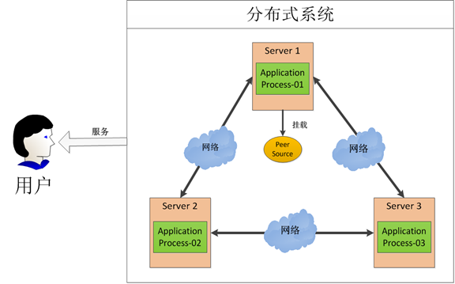
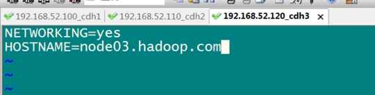
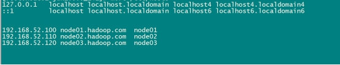
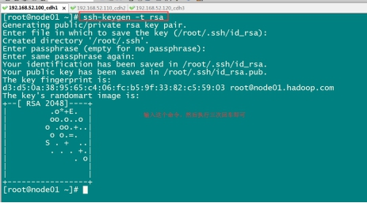
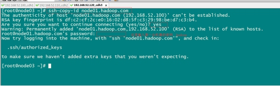
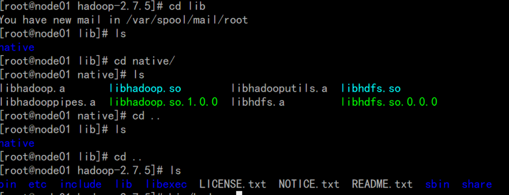
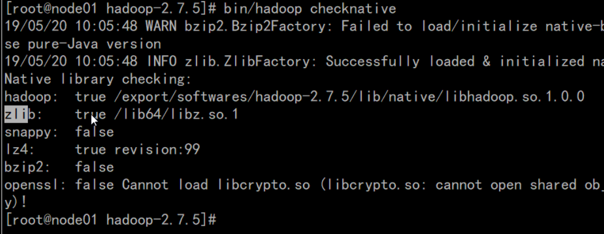

## Hadoop集群Linux环境搭建

### 3.1 集群规划

| IP              | 主机名 | 环境配置                              | 安装                                      |
| --------------- | ------ | ------------------------------------- | ----------------------------------------- |
| 192.168.174.100 | node01 | 关防火墙和selinux,host映射,时钟同步 | JDK,NameNode,ResourceManager,Zookeeper |
| 192.168.174.120 | node02 | 关防火墙和selinux,host映射,时钟同步 | JDK,DataNode,NodeManager,Zeekeeper     |
| 192.168.174.130 | node03 | 关防火墙和selinux,host映射,时钟同步 | JDK,DataNode,NodeManager,Zeekeeper     |

### 2:复制虚拟机

2.1 将虚拟机文件夹复制三份，并分别重命名, 并使用VM打开重命名

```shell
node01
node02
node03
```

 2.2分别设置三台虚拟机的内存

需要三台虚拟机,并且需要同时运行,所以总体上的占用为: $每台虚拟机内存 \times 3$
在分配的时候,需要在总内存大小的基础上,减去2G-4G作为系统内存,剩余的除以3,作为每台虚拟机的内存
每台机器的内存 = \left ( 总内存 - 4\right )\div 3$
建议4G 以上

3:虚拟机修改Mac和IP
3.2 :设置ip和Mac地址
每台虚拟机更改mac地址:

```shell
vim /etc/udev/rules.d/70-persistent-net.rules
#每台虚拟机更改IP地址:
 vim /etc/sysconfig/network-scripts/ifcfg-eth0`
#每台虚拟机修改对应主机名(重启后永久生效)
vi /ect/sysconfig/network
HOSTNAME=node01
#每台虚拟机设置ip和域名映射
vim /etc/hosts
```

3.3 inux系统重启

关机重启linux系统即可进行联网了
第二台第三台机器重复上述步骤，并设置IP网址为192.168.174.110，192.168.174.120

### 4:虚拟机关闭防火墙和SELinux

4.1 关闭防火墙
三台机器执行以下命令(root用户来执行)

```shell
service iptables stop   #关闭防火墙
chkconfig iptables off  #禁止开机启动
```

4.2 三台机器关闭selinux

什么是SELinux
SELinux是Linux的一种安全子系统
Linux中的权限管理是针对于文件的,而不是针对进程的,也就是说,如果root启动了某个进程,则这个进程可以操作任何一个文件
SELinux在Linux的文件权限之外,增加了对进程的限制,进程只能在进程允许的范围内操作资源
为什么要关闭SELinux
如果开启了SELinux,需要做非常复杂的配置,才能正常使用系统,在学习阶段,在非生产环境,一般不使用SELinux
SELinux的工作模式
`enforcing` 强制模式
`permissive` 宽容模式
`disable` 关闭

```shell
# 修改selinux的配置文件
vi /etc/selinux/config
```

#### 4.3 三台机器机器免密码登录

为什么要免密登录
Hadoop 节点众多,所以一般在主节点启动从节点,这个时候就需要程序自动在主节点登录到从节点中,如果不能免密就每次都要输入密码,非常麻烦
免密 SSH 登录的原理

  1. 需要先在 B节点 配置 A节点 的公钥
  2. A节点 请求 B节点 要求登录
  3. B节点 使用 A节点 的公钥,加密一段随机文本
  4. A节点 使用私钥解密,并发回给 B节点
  5. B节点 验证文本是否正确
第一步:三台机器生成公钥与私钥
在三台机器执行以下命令，生成公钥与私钥

```shell
ssh-keygen -t rsa
```

执行该命令之后，按下三个回车即可
第二步:拷贝公钥到同一台机器
三台机器将拷贝公钥到第一台机器
三台机器执行命令:

ssh-copy-id node01
第三步:复制第一台机器的认证到其他机器
将第一台机器的公钥拷贝到其他机器上
在第一天机器上面指向以下命令

```shell
scp /root/.ssh/authorized_keys node02:/root/.ssh
scp /root/.ssh/authorized_keys node03:/root/.ssh
```


#### 4.4三台机器时钟同步

为什么需要时间同步
因为很多分布式系统是有状态的,比如说存储一个数据,A节点 记录的时间是 1,B节点 记录的时间是 2,就会出问题

```shell
## 安装
yum install -y ntp
## 启动定时任务
crontab -e
##随后在输入界面键入
*/1 * * * * /usr/sbin/ntpdate ntp4.aliyun.com;
```

### 安装jdk

每台主机安装jdk

```shell
#查看自带的openjdk
[root@node01 hue]# rpm -qa | grep java
# 卸载系统自带的openjdk
[root@node01 hue]# rpm -e java-1.6.0-openjdk-1.6.0.41-1.13.13.1.el6_8.x86_64 tzdata-java-2016j-1.el6.noarch java-1.7.0-openjdk-1.7.0.131-2.6.9.0.el6_8.x86_64 --nodeps
#上传jdk并解压然后配置环境变量
#所有软件的安装路径
[root@node01 hue]# mkdir -p /export/servers
# 所有软件压缩包的存放路径
[root@node01 hue]# mkdir -p /export/softwares
# 上传jdk到/export/softwares路径下去，并解压
[root@node01 hue]# tar -zxvf jdk-8u141-linux-x64.tar.gz -C ../servers/
# 配置环境变量
[root@node01 hue]# vim /etc/profile
export JAVA_HOME=/export/servers/jdk1.8.0_141
export PATH=:$JAVA_HOME/bin:$PATH
# 修改完成之后记得
[root@node01 hue]# source /etc/profile
```

## Zookeeper

### 1 Zookeeper 的概述

* Zookeeper 是一个开源的分布式协调服务框架 ，主要用来解决分布式集群中应用系统的一致性问题和数据管理问题
Zookeeper 是 Google Chubby 思想的一个开源实现
Zookeeper 本质上是一个分布式文件系统,适合存放小文件,通过文件系统来实现分布式协调
  
  

### 2:Zookeeper的特点

* Zookeeper 本质上是一个分布式文件系统,适合存放小文件，也可以理解为一个数据库
* 在上图左侧,Zookeeper 中存储的其实是一个又一个 Znode,Znode 是 Zookeeper 中的节点
  * Znode 是有路径的,例如 `/data/host1`,`/data/host2`,这个路径也可以理解为是 Znode 的 Name
  * Znode 也可以携带数据,例如说某个 Znode 的路径是 `/data/host1`,其值是一个字符串 `"192.168.0.1"`
* 正因为 Znode 的特性,所以 Zookeeper 可以对外提供出一个类似于文件系统的试图,可以通过操作文件系统的方式操作 Zookeeper
  * 使用路径获取 Znode
  * 获取 Znode 携带的数据
  * 修改 Znode 携带的数据
  * 删除 Znode
  * 添加 Znode

3.Zookeeper的应用场景
3.1 数据发布/订阅
　　数据发布/订阅系统,需要发布者将数据发布到Zookeeper的节点上，供订阅者进行数据订阅，进而达到动态获取数据的目的，实现配置信息的集中式管理和数据的动态更新.
​     发布/订阅一般有两种设计模式:推模式和拉模式，服务端主动将数据更新发送给所有订阅的客户端称为推模式；客户端主动请求获取最新数据称为拉模式.
   Zookeeper采用了推拉相结合的模式，客户端向服务端注册自己需要关注的节点，一旦该节点数据发生变更，那么服务端就会向相应的客户端推送Watcher事件通知，客户端接收到此通知后，主动到服务端获取最新的数据.

 3.2 命名服务

　　命名服务是分步实现系统中较为常见的一类场景，分布式系统中，被命名的实体通常可以是集群中的机器、提供的服务地址或远程对象等，通过命名服务，客户端可以根据指定名字来获取资源的实体，在分布式环境中，上层应用仅仅需要一个全局唯一的名字.Zookeeper可以实现一套分布式全局唯一ID的分配机制.
　　通过调用Zookeeper节点创建的API接口就可以创建一个顺序节点，并且在API返回值中会返回这个节点的完整名字，利用此特性，可以生成全局ID，其步骤如下
　　1. 客户端根据任务类型，在指定类型的任务下通过调用接口创建一个顺序节点，如"job-".
　　2. 创建完成后，会返回一个完整的节点名，如"job-00000001".
　　3. 客户端拼接type类型和返回值后，就可以作为全局唯一ID了，如"type2-job-00000001".

 3.3 分布式协调/通知

　　Zookeeper中特有的Watcher注册于异步通知机制，能够很好地实现分布式环境下不同机器，甚至不同系统之间的协调与通知，从而实现对数据变更的实时处理.通常的做法是不同的客户端都对Zookeeper上的同一个数据节点进行Watcher注册，监听数据节点的变化(包括节点本身和子节点)，若数据节点发生变化，那么所有订阅的客户端都能够接收到相应的Watcher通知，并作出相应处理.
　　在绝大多数分布式系统中，系统机器间的通信无外乎心跳检测、工作进度汇报和系统调度.
　　① 心跳检测，不同机器间需要检测到彼此是否在正常运行，可以使用Zookeeper实现机器间的心跳检测，基于其临时节点特性(临时节点的生存周期是客户端会话，客户端若当即后，其临时节点自然不再存在)，可以让不同机器都在Zookeeper的一个指定节点下创建临时子节点，不同的机器之间可以根据这个临时子节点来判断对应的客户端机器是否存活.通过Zookeeper可以大大减少系统耦合.
　　② 工作进度汇报，通常任务被分发到不同机器后，需要实时地将自己的任务执行进度汇报给分发系统，可以在Zookeeper上选择一个节点，每个任务客户端都在这个节点下面创建临时子节点，这样不仅可以判断机器是否存活，同时各个机器可以将自己的任务执行进度写到该临时节点中去，以便中心系统能够实时获取任务的执行进度.
　　③ 系统调度，Zookeeper能够实现如下系统调度模式:分布式系统由控制台和一些客户端系统两部分构成，控制台的职责就是需要将一些指令信息发送给所有的客户端，以控制他们进行相应的业务逻辑，后台管理人员在控制台上做一些操作，实际上就是修改Zookeeper上某些节点的数据，Zookeeper可以把数据变更以时间通知的形式发送给订阅客户端.

3.4分布式锁

　　分布式锁用于控制分布式系统之间同步访问共享资源的一种方式，可以保证不同系统访问一个或一组资源时的一致性，主要分为排它锁和共享锁.
　　[排它锁又称为写锁或独占锁，若事务T1对数据对象O1加上了排它锁，那么在整个加锁期间，只允许事务T1对O1进行读取和更新操作，其他任何事务都不能再对这个数据对象进行任何类型的操作，直到T1释放了排它锁.
　① 获取锁，在需要获取排它锁时，所有客户端通过调用接口，在/exclusive_lock节点下创建临时子节点/exclusive_lock/lock.Zookeeper可以保证只有一个客户端能够创建成功，没有成功的客户端需要注册/exclusive_lock节点监听.
　② 释放锁，当获取锁的客户端宕机或者正常完成业务逻辑都会导致临时节点的删除，此时，所有在/exclusive_lock节点上注册监听的客户端都会收到通知，可以重新发起分布式锁获取.
共享锁又称为读锁，若事务T1对数据对象O1加上共享锁，那么当前事务只能对O1进行读取操作，其他事务也只能对这个数据对象加共享锁，直到该数据对象上的所有共享锁都被释放.在需要获取共享锁时，所有客户端都会到/shared_lock下面创建一个临时顺序节点

3.5 分布式队列

　 有一些时候，多个团队需要共同完成一个任务，比如，A团队将Hadoop集群计算的结果交给B团队继续计算，B完成了自己任务再交给C团队继续做.这就有点像业务系统的工作流一样，一环一环地传下 去.
   分布式环境下，我们同样需要一个类似单进程队列的组件，用来实现跨进程、跨主机、跨网络的数据共享和数据传递，这就是我们的分布式队列.

4.Zookeeper的架构

Zookeeper集群是一个基于主从架构的高可用集群

每个服务器承担如下三种角色中的一种

* Leader 一个Zookeeper集群同一时间只会有一个实际工作的Leader，它会发起并维护与各Follwer及Observer间的心跳.所有的写操作必须要通过Leader完成再由Leader将写操作广播给其它服务器.
* Follower 一个Zookeeper集群可能同时存在多个Follower，它会响应Leader的心跳.Follower可直接处理并返回客户端的读请求，同时会将写请求转发给Leader处理，并且负责在Leader处理写请求时对请求进行投票.
* Observer 角色与Follower类似，但是无投票权.
    [1558078642625](01-Hadoop-入门与安装/1558078642625.png)
5:Zookeeper的选举机制
 Leader选举是保证分布式数据一致性的关键所在.当Zookeeper集群中的一台服务器出现以下两种情况之一时，需要进入Leader选举.

5.1. 服务器启动时期的Leader选举

若进行Leader选举，则至少需要两台机器，这里选取3台机器组成的服务器集群为例.在集群初始化阶段，当有一台服务器Server1启动时，其单独无法进行和完成Leader选举，当第二台服务器Server2启动时，此时两台机器可以相互通信，每台机器都试图找到Leader，于是进入Leader选举过程.选举过程如下
(1)每个Server发出一个投票.由于是初始情况，Server1和Server2都会将自己作为Leader服务器来进行投票，每次投票会包含所推举的服务器的myid和ZXID，使用(myid,ZXID)来表示，此时Server1的投票为(1,0)，Server2的投票为(2,0)，然后各自将这个投票发给集群中其他机器.
(2)接受来自各个服务器的投票.集群的每个服务器收到投票后，首先判断该投票的有效性，如检查是否是本轮投票、是否来自LOOKING状态的服务器.
(3)处理投票.针对每一个投票，服务器都需要将别人的投票和自己的投票进行PK，PK规则如下
　　· 优先检查ZXID.ZXID比较大的服务器优先作为Leader.
　　· 如果ZXID相同，那么就比较myid.myid较大的服务器作为Leader服务器.
　　对于Server1而言，它的投票是(1,0)，接收Server2的投票为(2,0)，首先会比较两者的ZXID，均为0，再比较myid，此时Server2的myid最大，于是更新自己的投票为(2,0)，然后重新投票，对于Server2而言，其无须更新自己的投票，只是再次向集群中所有机器发出上一次投票信息即可.
(4)统计投票.每次投票后，服务器都会统计投票信息，判断是否已经有过半机器接受到相同的投票信息，对于Server1、Server2而言，都统计出集群中已经有两台机器接受了(2,0)的投票信息，此时便认为已经选出了Leader.
(5)改变服务器状态.一旦确定了Leader，每个服务器就会更新自己的状态，如果是Follower，那么就变更为FOLLOWING，如果是Leader，就变更为LEADING.

5.2.服务器运行时期的Leader选举

　　在Zookeeper运行期间，Leader与非Leader服务器各司其职，即便当有非Leader服务器宕机或新加入，此时也不会影响Leader，但是一旦Leader服务器挂了，那么整个集群将暂停对外服务，进入新一轮Leader选举，其过程和启动时期的Leader选举过程基本一致过程相同.

#### 6: Zookeeper安装

集群规划

| 服务器IP        | 主机名 | myid的值 |
| --------------- | ------ | -------- |
| 192.168.174.100 | node01 | 1        |
| 192.168.174.110 | node02 | 2        |
| 192.168.174.120 | node03 | 3        |

 第一步:下载zookeeeper的压缩包，下载网址如下
<http://archive.apache.org/dist/zookeeper/>
我们在这个网址下载我们使用的zk版本为3.4.9

```shell
#下载完成之后，上传到我们的linux的/export/softwares路径下准备进行安装
#第二步:解压
#解压zookeeper的压缩包到/export/servers路径下去，然后准备进行安装
[root@node01 ~]# cd /export/software
[root@node01 ~]# tar -zxvf zookeeper-3.4.9.tar.gz -C ../servers/
#第三步:修改配置文件
#第一台机器修改配置文件
[root@node01 ~]# cd /export/servers/zookeeper-3.4.9/conf/
[root@node01 ~]# cp zoo_sample.cfg zoo.cfg
[root@node01 ~]# mkdir -p /export/servers/zookeeper-3.4.9/zkdatas/
[root@node01 ~]# vim  zoo.cfg
dataDir=/export/servers/zookeeper-3.4.9/zkdatas
# 保留多少个快照
autopurge.snapRetainCount=3
# 日志多少小时清理一次
autopurge.purgeInterval=1
# 集群中服务器地址
server.1=node01:2888:3888
server.2=node02:2888:3888
server.3=node03:2888:3888
#第四步:添加myid配置
#在第一台机器的
#/export/servers/zookeeper-3.4.9/zkdatas /这个路径下创建一个文件，文件名为myid ,文件内容为1
[root@node01 ~]# echo 1 > /export/servers/zookeeper-3.4.9/zkdatas/myid`
#第五步:安装包分发并修改myid的值
#安装包分发到其他机器
#第一台机器上面执行以下两个命令
[root@node01 ~]# scp -r  /export/servers/zookeeper-3.4.9/ node02:/export/servers/
[root@node01 ~]# scp -r  /export/servers/zookeeper-3.4.9/ node03:/export/servers/
#第二台机器上修改myid的值为2
[root@node01 ~]# echo 2 > /export/servers/zookeeper-3.4.9/zkdatas/myid
# 第三台机器上修改myid的值为3
[root@node01 ~]# echo 3 > /export/servers/zookeeper-3.4.9/zkdatas/myid
#第六步:三台机器启动zookeeper服务
#三台机器启动zookeeper服务
#这个命令三台机器都要执行
[root@node01 ~]# /export/servers/zookeeper-3.4.9/bin/zkServer.sh start
查看启动状态
[root@node01 ~]# /export/servers/zookeeper-3.4.9/bin/zkServer.sh  status
```

#### 7 Zookeeper的Shell 客户端操作

| 命令                             | 说明                                          | 参数                                             |
| ---------------------- | ------------------------------ | -------------------- |
| `create [-s] [-e] path data acl` | 创建Znode                                     | -s 指定是顺序节点`<br>`-e 指定是临时节点           |
| `ls path [watch]`                | 列出Path下所有子Znode                         |                                                  |
| `get path [watch]`               | 获取Path对应的Znode的数据和属性               |                                                  |
| `ls2 path [watch]`               | 查看Path下所有子Znode以及子Znode的属性        |                                                  |
| `set path data [version]`        | 更新节点                                      | version 数据版本                                 |
| `delete path [version]`          | 删除节点,如果要删除的节点有子Znode则无法删除 | version 数据版本                                 |
| `rmr path`                       | 删除节点,如果有子Znode则递归删除             |                                                  |
| `setquota -n|-b val path`        | 修改Znode配额                                 | -n 设置子节点最大个数`<br>`-b 设置节点数据最大长度 |
| `history`                        | 列出历史记录                                  |                                                  |

```shell
#1:创建普通节点
[root@node01 ~]# create /app1 hello
#2: 创建顺序节点
[root@node01 ~]# create -s /app3 world
#3:创建临时节点
[root@node01 ~]# create -e /tempnode world
#4:创建顺序的临时节点
[root@node01 ~]# create -s -e /tempnode2 aaa
#5:获取节点数据
[root@node01 ~]# get /app1`
#6:修改节点数据
[root@node01 ~]# set /app1  xxx`
#7:删除节点
[root@node01 ~]# delete  /app1 #删除的节点不能有子节点
#rmr    /app1 递归删除
```

Znode 的特点

* 文件系统的核心是 `Znode`
* 如果想要选取一个 `Znode`,需要使用路径的形式,例如 `/test1/test11`
* Znode 本身并不是文件,也不是文件夹,Znode 因为具有一个类似于 Name 的路径,所以可以从逻辑上实现一个树状文件系统
* ZK 保证 Znode 访问的原子性,不会出现部分 ZK 节点更新成功,部分 ZK 节点更新失败的问题
* `Znode` 中数据是有大小限制的,最大只能为`1M`
* `Znode`是由三个部分构成
  * `stat`: 状态,Znode的权限信息,版本等
  * `data`: 数据,每个Znode都是可以携带数据的,无论是否有子节点
  * `children`: 子节点列表

Znode 的类型

* 每个`Znode`有两大特性,可以构成四种不同类型的`Znode`
  * 持久性
    * `持久` 客户端断开时,不会删除持有的Znode
    * `临时` 客户端断开时,删除所有持有的Znode,临时Znode不允许有子Znode
  * 顺序性
    * `有序` 创建的Znode有先后顺序,顺序就是在后面追加一个序列号,序列号是由父节点管理的自增
    * `无序` 创建的Znode没有先后顺序
* `Znode`的属性
  * `dataVersion` 数据版本,每次当`Znode`中的数据发生变化的时候,`dataVersion`都会自增一下
  * `cversion` 节点版本,每次当`Znode`的节点发生变化的时候,`cversion`都会自增
  * `aclVersion` `ACL(Access Control List)`的版本号,当`Znode`的权限信息发生变化的时候aclVersion会自增
  * `zxid` 事务ID
  * `ctime` 创建时间
  * `mtime` 最近一次更新的时间
  * `ephemeralOwner` 如果`Znode`为临时节点,`ephemeralOwner`表示与该节点关联的`SessionId`

通知机制

* 通知类似于数据库中的触发器,对某个Znode设置 `Watcher`,当Znode发生变化的时候,`WatchManager`会调用对应的`Watcher`
* 当Znode发生删除,修改,创建,子节点修改的时候,对应的`Watcher`会得到通知
* `Watcher`的特点
  * 一次性触发 一个 `Watcher` 只会被触发一次,如果需要继续监听,则需要再次添加 `Watcher`
  * 事件封装: `Watcher` 得到的事件是被封装过的,包括三个内容 `keeperState,eventType,path`

| KeeperState   | EventType        | 触发条件                 | 说明                               |
| ------------- | ---------------- | ------------------------ | ---------------------------------- |
|               | None             | 连接成功                 |                                    |
| SyncConnected | NodeCreated      | Znode被创建              | 此时处于连接状态                   |
| SyncConnected | NodeDeleted      | Znode被删除              | 此时处于连接状态                   |
| SyncConnected | NodeDataChanged  | Znode数据被改变          | 此时处于连接状态                   |
| SyncConnected | NodeChildChanged | Znode的子Znode数据被改变 | 此时处于连接状态                   |
| Disconnected  | None             | 客户端和服务端断开连接   | 此时客户端和服务器处于断开连接状态 |
| Expired       | None             | 会话超时                 | 会收到一个SessionExpiredException  |
| AuthFailed    | None             | 权限验证失败             | 会收到一个AuthFailedException      |

会话
在ZK中所有的客户端和服务器的交互都是在某一个`Session`中的,客户端和服务器创建一个连接的时候同时也会创建一个`Session`
`Session`会在不同的状态之间进行切换: `CONNECTING`,`CONNECTED`,`RECONNECTING`,`RECONNECTED`,`CLOSED`
ZK中的会话两端也需要进行心跳检测,服务端会检测如果超过超时时间没收到客户端的心跳,则会关闭连接,释放资源,关闭会话

## Hadoop介绍与安装

### Hadoop的介绍

1. Hadoop最早起源于Nutch.Nutch的设计目标是构建一个大型的全网搜索引擎，包括网页抓取、索引、查询等功能，但随着抓取网页数量的增加，遇到了严重的可扩展性问题——如何解决数十亿网页的存储和索引问题.
2. 2003年、2004年谷歌发表的两篇论文为该问题提供了可行的解决方案.
——分布式文件系统(GFS)，可用于处理海量网页的存储
——分布式计算框架MAPREDUCE，可用于处理海量网页的索引计算问题.
3. Nutch的开发人员完成了相应的开源实现HDFS和MAPREDUCE，并从Nutch中剥离成为独立项目HADOOP，到2008年1月，HADOOP成为Apache顶级项目.
狭义上来说，hadoop就是单独指代hadoop这个软件，
   HDFS   :分布式文件系统
   MapReduce : 分布式计算系统
广义上来说，hadoop指代大数据的一个生态圈，包括很多其他的软件

### hadoop的历史版本介绍

1.x版本系列:hadoop版本当中的第二代开源版本，主要修复0.x版本的一些bug等
2.x版本系列:架构产生重大变化，引入了yarn平台等许多新特性
3.x版本系列:  加入多namenoode新特性

#### hadoop三大公司发型版本介绍

免费开源版本apache:
<http://hadoop.apache.org/>
优点:拥有全世界的开源贡献者，代码更新迭代版本比较快，
缺点:版本的升级，版本的维护，版本的兼容性，版本的补丁都可能考虑不太周到，\
apache所有软件的下载地址(包括各种历史版本):
<http://archive.apache.org/dist/>
免费开源版本hortonWorks:
<https://hortonworks.com/>
hortonworks主要是雅虎主导Hadoop开发的副总裁，带领二十几个核心成员成立Hortonworks，核心产品软件HDP(ambari)，HDF免费开源，并且提供一整套的web管理界面，供我们可以通过web界面管理我们的集群状态，web管理界面软件HDF网址(<http://ambari.apache.org/>)
软件收费版本ClouderaManager:
<https://www.cloudera.com/>
cloudera主要是美国一家大数据公司在apache开源hadoop的版本上，通过自己公司内部的各种补丁，实现版本之间的稳定运行，大数据生态圈的各个版本的软件都提供了对应的版本，解决了版本的升级困难，版本兼容性等各种问题

#### hadoop的架构模型(1.x，2.x的各种架构模型介绍)

##### 1.x的版本架构模型介绍

文件系统核心模块:
NameNode:集群当中的主节点，管理元数据(文件的大小，文件的位置，文件的权限)，主要用于管理集群当中的各种数据
secondaryNameNode:主要能用于hadoop当中元数据信息的辅助管理
DataNode:集群当中的从节点，主要用于存储集群当中的各种数据
数据计算核心模块:
JobTracker:接收用户的计算请求任务，并分配任务给从节点
TaskTracker:负责执行主节点JobTracker分配的任务

##### 2、2.x的版本架构模型介绍

第一种:NameNode与ResourceManager单节点架构模型
文件系统核心模块:
NameNode:集群当中的主节点，主要用于管理集群当中的各种数据
secondaryNameNode:主要能用于hadoop当中元数据信息的辅助管理
DataNode:集群当中的从节点，主要用于存储集群当中的各种数据
数据计算核心模块:
ResourceManager:接收用户的计算请求任务，并负责集群的资源分配
NodeManager:负责执行主节点APPmaster分配的任务
第二种:NameNode单节点与ResourceManager高可用架构模型
文件系统核心模块:
NameNode:集群当中的主节点，主要用于管理集群当中的各种数据
secondaryNameNode:主要能用于hadoop当中元数据信息的辅助管理
DataNode:集群当中的从节点，主要用于存储集群当中的各种数据
数据计算核心模块:
ResourceManager:接收用户的计算请求任务，并负责集群的资源分配，以及计算任务的划分，通过zookeeper实现ResourceManager的高可用
NodeManager:负责执行主节点ResourceManager分配的任务

第三种:NameNode高可用与ResourceManager单节点架构模型
文件系统核心模块:
NameNode:集群当中的主节点，主要用于管理集群当中的各种数据，其中nameNode可以有两个，形成高可用状态
DataNode:集群当中的从节点，主要用于存储集群当中的各种数据
JournalNode:文件系统元数据信息管理
数据计算核心模块:
ResourceManager:接收用户的计算请求任务，并负责集群的资源分配，以及计算任务的划分
NodeManager:负责执行主节点ResourceManager分配的任务

第四种:NameNode与ResourceManager高可用架构模型

文件系统核心模块:
NameNode:集群当中的主节点，主要用于管理集群当中的各种数据，一般都是使用两个，实现HA高可用
JournalNode:元数据信息管理进程，一般都是奇数个
DataNode:从节点，用于数据的存储
数据计算核心模块:
ResourceManager:Yarn平台的主节点，主要用于接收各种任务，通过两个，构建成高可用
NodeManager:Yarn平台的从节点，主要用于处理ResourceManager分配的任务

### 4、appache版本hadoop重新编译

#### 4.1为什么要编译hadoop

由于appache给出的hadoop的安装包没有提供带C程序访问的接口,所以我们在使用本地库(本地库可以用来做压缩,以及支持C程序等等)的时候就会出问题,需要对Hadoop源码包进行重新编译.

#### 4.2编译环境的准备

4.2.1：准备linux环境
准备一台linux环境,内存4G或以上,硬盘40G或以上,我这里使用的是Centos6.9  64位的操作系统(注意：一定要使用64位的操作系统)
4.2.2：虚拟机联网,关闭防火墙,关闭selinux
关闭防火墙命令：

```shell
service  iptables   stop
chkconfig   iptables  off
```

关闭selinux
`vim /etc/selinux/config`
4.2.3：安装jdk1.7
注意hadoop-2.7.5 这个版本的编译,只能使用jdk1.7,如果使用jdk1.8那么就会报错
查看centos6.9自带的openjdk
`rpm -qa | grep java`
将所有这些openjdk全部卸载掉
`rpm -e java-1.6.0-openjdk-1.6.0.41-1.13.13.1.el6_8.x86_64 tzdata-java-2016j-1.el6.noarch java-1.7.0-openjdk-1.7.0.131-2.6.9.0.el6_8.x86_64`
注意：这里一定不要使用jdk1.8,亲测jdk1.8会出现错误
将我们jdk的安装包上传到/export/softwares(我这里使用的是jdk1.7.0_71这个版本)
解压我们的jdk压缩包
统一两个路径

```shell
mkdir -p /export/servers
mkdir -p /export/softwares
cd /export/softwares
tar -zxvf jdk-7u71-linux-x64.tar.gz -C ../servers/
```

配置环境变量
`vim /etc/profile`

```shell
export JAVA_HOME=/export/servers/jdk1.7.0_71
export PATH=:$JAVA_HOME/bin:$PATH
```

让修改立即生效
`source /etc/profile`

4.2.4：安装maven
这里使用maven3.x以上的版本应该都可以,不建议使用太高的版本,强烈建议使用3.0.5的版本即可
将maven的安装包上传到/export/softwares
然后解压maven的安装包到/export/servers

```shell
cd /export/softwares/
tar -zxvf apache-maven-3.0.5-bin.tar.gz -C ../servers/
```

配置maven的环境变量
`vim /etc/profile`

```shell
export MAVEN_HOME=/export/servers/apache-maven-3.0.5
export MAVEN_OPTS="-Xms4096m -Xmx4096m"
export PATH=:$MAVEN_HOME/bin:$PATH
```


让修改立即生效
`source /etc/profile`
解压maven的仓库
`tar -zxvf mvnrepository.tar.gz  -C /export/servers/`
修改maven的配置文件

```shell
cd  /export/servers/apache-maven-3.0.5/conf
vim settings.xml
```

指定我们本地仓库存放的路径

添加一个我们阿里云的镜像地址,会让我们下载jar包更快

```xml
 <mirror>
      <id>alimaven</id>
      <name>aliyun maven</name>
      <url>http://maven.aliyun.com/nexus/content/groups/public/</url>
      <mirrorOf>central</mirrorOf>
    </mirror>
```



4.2.5：安装findbugs

解压findbugs
`tar -zxvf findbugs-1.3.9.tar.gz -C ../servers/`
配置findbugs的环境变量

`vim /etc/profile`

```shell
export JAVA_HOME=/export/servers/jdk1.7.0_75
export PATH=:$JAVA_HOME/bin:$PATH
export MAVEN_HOME=/export/servers/apache-maven-3.0.5
export PATH=:$MAVEN_HOME/bin:$PATH
export FINDBUGS_HOME=/export/servers/findbugs-1.3.9
export PATH=:$FINDBUGS_HOME/bin:$PATH
```


让修改立即生效
 `source  /etc/profile`

 4.2.6：在线安装一些依赖包

```shell
yum install autoconf automake libtool cmake
yum install ncurses-devel
yum install openssl-devel
yum install lzo-devel zlib-devel gcc gcc-c++
```

bzip2压缩需要的依赖包

```shell
yum install -y  bzip2-devel
```

4.2.7：安装protobuf

解压protobuf并进行编译

```shell
cd  /export/softwares
tar -zxvf protobuf-2.5.0.tar.gz -C ../servers/
cd   /export/servers/protobuf-2.5.0
./configure
make && make install
```

4.2.8、安装snappy

```shell
cd /export/softwares/
tar -zxf snappy-1.1.1.tar.gz  -C ../servers/
cd ../servers/snappy-1.1.1/
./configure
make && make install
```

 4.2.9：编译hadoop源码

对源码进行编译

```shell
cd  /export/softwares
tar -zxvf hadoop-2.7.5-src.tar.gz  -C ../servers/
cd  /export/servers/hadoop-2.7.5
```

编译支持snappy压缩：
`mvn package -DskipTests -Pdist,native -Dtar -Drequire.snappy -e -X`
编译完成之后我们需要的压缩包就在下面这个路径里面

```shell
/export/servers/hadoop-2.7.5/hadoop-dist/target
```

### 5、Hadoop安装

集群规划

| 服务器IP          | 192.168.174.100 | 192.168.174.110 | 192.168.174.120 |
| ----------------- | --------------- | --------------- | --------------- |
| 主机名            | node01          | node02          | node03          |
| NameNode          | 是              | 否              | 否              |
| SecondaryNameNode | 是              | 否              | 否              |
| dataNode          | 是              | 是              | 是              |
| ResourceManager   | 是              | 否              | 否              |
| NodeManager       | 是              | 是              | 是              |

#### 第一步：上传apache hadoop包并解压

解压命令

```shell
[root@node01 softwares]# cd /export/softwares
#tar -zxvf hadoop-2.7.5.tar.gz -C ../servers/
[root@node01 softwares]# tar -zxvf hadoop-2.7.5.tar.gz -C /export/servers/
[root@node01 hadoop-2.7.5]# cd /export/servers/hadoop-2.7.5/bin/
```

查询与官方的的jar所有啥不同的地方
上传应该上传自己编译的hadoop-2.7.5.tar.gz

检测上传的jar 支挂那些算法

```shell
##  snappy 官方这个是不支持的,这个是编译后的
[root@node01 bin]# ./hadoop checknative
19/08/04 15:53:31 INFO bzip2.Bzip2Factory: Successfully loaded & initialized native-bzip2 library system-native
19/08/04 15:53:31 INFO zlib.ZlibFactory: Successfully loaded & initialized native-zlib library
Native library checking:
hadoop:  true /export/servers/hadoop-2.7.5/lib/native/libhadoop.so.1.0.0
zlib:    true /lib64/libz.so.1
snappy:  true /lib64/libsnappy.so.1
lz4:     true revision:99
bzip2:   true /lib64/libbz2.so.1
[root@node01 hadoop-2.7.5]# cd lib/native/
[root@node01 native]# ll
total 4652
-rw-r--r-- 1 root root 1313098 May 19 23:33 libhadoop.a
-rw-r--r-- 1 root root 1487276 May 19 23:33 libhadooppipes.a
lrwxrwxrwx 1 root root      18 May 19 23:33 libhadoop.so -> libhadoop.so.1.0.0
-rwxr-xr-x 1 root root  771103 May 19 23:33 libhadoop.so.1.0.0
-rw-r--r-- 1 root root  582056 May 19 23:33 libhadooputils.a
-rw-r--r-- 1 root root  364924 May 19 23:33 libhdfs.a
lrwxrwxrwx 1 root root      16 May 19 23:33 libhdfs.so -> libhdfs.so.0.0.0
-rwxr-xr-x 1 root root  229217 May 19 23:33 libhdfs.so.0.0.0
```



#### 第二步：修改配置文件

##### 修改core-site.xml

第一台机器执行以下命令

```shell
[root@node01 native]# cd  /export/servers/hadoop-2.7.5/etc/hadoop
[root@node01 hadoop]# vim core-site.xml
```

```xml
<configuration>
    <property>
        <name>fs.default.name</name>
        <value>hdfs://node01:8020</value>
    </property>
    <property>
        <name>hadoop.tmp.dir</name>
        <value>/export/servers/hadoop-2.7.5/hadoopDatas/tempDatas</value>
    </property>
    <!--  缓冲区大小,实际工作中根据服务器性能动态调整 -->
    <property>
        <name>io.file.buffer.size</name>
        <value>4096</value>
    </property>
    <!--  开启hdfs的垃圾桶机制,删除掉的数据可以从垃圾桶中回收,单位分钟 -->
    <property>
        <name>fs.trash.interval</name>
        <value>10080</value>
    </property>
</configuration>
```

##### 修改hdfs-site.xml

第一台机器执行以下命令

```shell
[root@node01 hadoop]# cd  /export/servers/hadoop-2.7.5/etc/hadoop
[root@node01 hadoop]# vim hdfs-site.xml
```

```xml
<configuration>
     <property>
            <name>dfs.namenode.secondary.http-address</name>
            <value>node01:50090</value>
    </property>
    <property>
        <name>dfs.namenode.http-address</name>
        <value>node01:50070</value>
    </property>
    <property>
        <name>dfs.namenode.name.dir</name>
        <value>file:///export/servers/hadoop-2.7.5/hadoopDatas/namenodeDatas,file:///export/servers/hadoop-2.7.5/hadoopDatas/namenodeDatas2</value>
    </property>
    <!--  定义dataNode数据存储的节点位置,实际工作中,一般先确定磁盘的挂载目录,然后多个目录用,进行分割  -->
    <property>
        <name>dfs.datanode.data.dir</name>
        <value>file:///export/servers/hadoop-2.7.5/hadoopDatas/datanodeDatas,file:///export/servers/hadoop-2.7.5/hadoopDatas/datanodeDatas2</value>
    </property>
    <property>
        <name>dfs.namenode.edits.dir</name>
        <value>file:///export/servers/hadoop-2.7.5/hadoopDatas/nn/edits</value>
    </property>
    <property>
        <name>dfs.namenode.checkpoint.dir</name>
        <value>file:///export/servers/hadoop-2.7.5/hadoopDatas/snn/name</value>
    </property>
    <property>
        <name>dfs.namenode.checkpoint.edits.dir</name>
        <value>file:///export/servers/hadoop-2.7.5/hadoopDatas/dfs/snn/edits</value>
    </property>
    <property>
        <name>dfs.replication</name>
        <value>3</value>
    </property>
    <property>
        <name>dfs.permissions</name>
        <value>false</value>
    </property>
    <property>
        <name>dfs.blocksize</name>
        <value>134217728</value>
    </property>
</configuration>
```

##### 修改hadoop-env.sh

第一台机器执行以下命令

```shell
[root@node01 hadoop]# cd  /export/servers/hadoop-2.7.5/etc/hadoop
##配置java路径
[root@node01 hadoop]# vim  hadoop-env.sh
```

```shell
export JAVA_HOME=/export/servers/jdk1.8.0_141
```

##### 修改mapred-site.xml

第一台机器执行以下命令

```shell
[root@node01 hadoop]# cd  /export/servers/hadoop-2.7.5/etc/hadoop
## 复一份
[root@node01 hadoop]# cp mapred-site.xml.template mapred-site.xml
[root@node01 hadoop]# vim  mapred-site.xml
```

```xml
<configuration>
    <property>
        <name>mapreduce.job.ubertask.enable</name>
        <value>true</value>
    </property>
    <property>
        <name>mapreduce.jobhistory.address</name>
        <value>node01:10020</value>
    </property>
    <property>
        <name>mapreduce.jobhistory.webapp.address</name>
        <value>node01:19888</value>
    </property>
</configuration>
```

##### 修改yarn-site.xml

第一台机器执行以下命令

```shell
cd  /export/servers/hadoop-2.7.5/etc/hadoop
vim  yarn-site.xml
```

```xml
<configuration>
    <property>
        <name>yarn.resourcemanager.hostname</name>
        <value>node01</value>
    </property>
    <property>
        <name>yarn.nodemanager.aux-services</name>
        <value>mapreduce_shuffle</value>
    </property>
    <property>
        <name>yarn.log-aggregation-enable</name>
        <value>true</value>
    </property>
    <property>
        <name>yarn.log-aggregation.retain-seconds</name>
        <value>604800</value>
    </property>
    <property>
        <name>yarn.nodemanager.resource.memory-mb</name>
        <value>20480</value>
    </property>
    <property>  
             <name>yarn.scheduler.minimum-allocation-mb</name>
             <value>2048</value>
    </property>
    <property>
        <name>yarn.nodemanager.vmem-pmem-ratio</name>
        <value>2.1</value>
    </property>
</configuration>
```

##### 修改mapred-env.sh

第一台机器执行以下命令

```shell
cd  /export/servers/hadoop-2.7.5/etc/hadoop
vim  mapred-env.sh
```

```shell
export JAVA_HOME=/export/servers/jdk1.8.0_141
```

##### 修改slaves

修改slaves文件,然后将安装包发送到其他机器,重新启动集群即可
第一台机器执行以下命令

```shell
cd  /export/servers/hadoop-2.7.5/etc/hadoop
vim slaves
```

```shell
node01
node02
node03
```

第一台机器执行以下命令

```shell
[root@node01 hadoop]# mkdir -p /export/servers/hadoop-2.7.5/hadoopDatas/tempDatas
[root@node01 hadoop]# mkdir -p /export/servers/hadoop-2.7.5/hadoopDatas/namenodeDatas
[root@node01 hadoop]# mkdir -p /export/servers/hadoop-2.7.5/hadoopDatas/namenodeDatas2
[root@node01 hadoop]# mkdir -p /export/servers/hadoop-2.7.5/hadoopDatas/datanodeDatas
[root@node01 hadoop]# mkdir -p /export/servers/hadoop-2.7.5/hadoopDatas/datanodeDatas2
[root@node01 hadoop]# mkdir -p /export/servers/hadoop-2.7.5/hadoopDatas/nn/edits
[root@node01 hadoop]# mkdir -p /export/servers/hadoop-2.7.5/hadoopDatas/snn/name
[root@node01 hadoop]# mkdir -p /export/servers/hadoop-2.7.5/hadoopDatas/dfs/snn/edits
```

安装包的分发
第一台机器执行以下命令

```shell
[root@node01 hadoop]# cd  /export/servers/
[root@node01 hadoop]# scp -r hadoop-2.7.5 node02:$PWD
[root@node01 hadoop]# scp -r hadoop-2.7.5 node03:$PWD
```

#### 第三步：配置hadoop的环境变量

三台机器都要进行配置hadoop的环境变量
三台机器执行以下命令

```shell
vim  /etc/profile
```

```shell
export HADOOP_HOME=/export/servers/hadoop-2.7.5
export PATH=:$HADOOP_HOME/bin:$HADOOP_HOME/sbin:$PATH
```

配置完成之后生效

```shell
[root@node01 hadoop]# source /etc/profile
```

#### 第四步：启动集群

要启动 Hadoop 集群,需要启动 HDFS 和 YARN 两个模块。
注意： 首次启动 HDFS 时,必须对其进行格式化操作。 本质上是一些清理和
准备工作,因为此时的 HDFS 在物理上还是不存在的。
hdfs namenode -format 或者 hadoop namenode –format
准备启动
第一台机器执行以下命令

```shell
[root@node01 hadoop]# cd  /export/servers/hadoop-2.7.5/
[root@node01 hadoop]# bin/hdfs namenode -format
[root@node01 hadoop]# sbin/start-dfs.sh
[root@node01 hadoop]# sbin/start-yarn.sh
[root@node01 hadoop]# sbin/mr-jobhistory-daemon.sh start historyserver
```

三个端口查看界面
<http://node01:50070/explorer.html#/>查看hdfs
<http://node01:8088/cluster>   查看yarn集群
<http://node01:19888/jobhistory>  
查看历史完成的任务

### 2:mysql的安装

任选一种mysql 安装成功即可

## 操作记录

### 192.168.34.100

```shell
[root@node01 ~]# hostname
node01
[root@node01 ~]# vim /etc/hosts
[root@node01 ~]# vim /etc/hosts
[root@node01 ~]# ping node01
[root@node01 ~]# ssh-keygen -t rsa
[root@node01 ~]# cd .ssh/
[root@node01 .ssh]# touch authorized_keys
[root@node01 .ssh]# ssh root@node01 cat /root/.ssh/id_rsa.pub >> authorized_keys
[root@node01 .ssh]# ssh root@node03 cat /root/.ssh/id_rsa.pub >> authorized_keys
[root@node01 .ssh]# scp authorized_keys root@node01:/root/.ssh/
[root@node01 .ssh]# scp authorized_keys root@node02:/root/.ssh/
[root@node01 .ssh]# cd ..
[root@node01 ~]# cd .ssh/
[root@node01 .ssh]# scp authorized_keys root@node03:/root/.ssh/
[root@node01 .ssh]# ssh root@node01
[root@node01 ~]# exit
[root@node01 .ssh]# ssh root@node02
[root@node01 .ssh]# ssh root@node02
[root@node01 .ssh]# exit
logout
Last login: Sat Aug  3 18:50:47 2019 from node01
[root@node01 ~]# cd .ssh/
[root@node01 .ssh]# touch authorized_keys
[root@node01 .ssh]# ssh root@node01 cat /root/.ssh/id_rsa.pub >> authorized_keys
[root@node01 .ssh]# ssh root@node02 cat /root/.ssh/id_rsa.pub >> authorized_keys 
[root@node01 .ssh]# ssh root@node03 cat /root/.ssh/id_rsa.pub >> authorized_keys 
[root@node01 .ssh]# scp authorized_keys root@node01:/root/.ssh/
[root@node01 .ssh]# scp authorized_keys root@node02:/root/.ssh/
[root@node01 .ssh]# scp authorized_keys root@node03:/root/.ssh/
[root@node01 .ssh]# ssh root@node01
Last login: Sat Aug  3 18:54:31 2019 from 192.168.34.31
[root@node01 ~]# exit
[root@node01 .ssh]# ssh root@node02
Last failed login: Sat Aug  3 18:54:04 CST 2019 from node01 on ssh:notty
There were 3 failed login attempts since the last successful login.
Last login: Sat Aug  3 18:52:44 2019 from node01
[root@node02 ~]# exit
logout
Connection to node02 closed.
[root@node01 .ssh]# ssh root@node03
Last login: Sat Aug  3 18:42:39 2019 from 192.168.34.31
[root@node03 ~]# exit
logout
Connection to node03 closed.
[root@node01 .ssh]# ssh root@node02
Last login: Sat Aug  3 18:59:22 2019 from node03
[root@node02 ~]# exit
logout
Connection to node02 closed.
[root@node01 .ssh]# ssh root@node03
Last login: Sat Aug  3 18:59:41 2019 from node03
[root@node03 ~]# exit
[root@node01 ~]# mkdir -p /export/softwares
[root@node01 ~]# mkdir -p /export/servers
[root@node01 ~]# env
[root@node01 ~]# cd /export/softwares/
[root@node01 softwares]# vim /etc/profile
[root@node01 softwares]# tar -zxvf jdk-8u141-linux-x64.tar.gz
[root@node01 softwares]# cat install_jdk.sh
#!/bin/bash
tar -zxvf /export/softwares/jdk-8u141-linux-x64.tar.gz -C /export/servers/
cd /export/servers/jdk1.8.0_141
home=`pwd`
echo $home
echo "export JAVA_HOME=${home}"  >> /etc/profile
echo "export PATH=:\$PATH:\$JAVA_HOME/bin" >> /etc/profile
source /etc/profile
for m in  2 3
do
scp -r /export/servers/jdk1.8.0_141 node0$m:/export/servers/
ssh node0$m "echo 'export JAVA_HOME=/export/servers/jdk1.8.0_141' >> /etc/profile; echo 'export PATH=:\$PATH:\$JAVA_HOME/bin' >> /etc/profile;source /etc/profile"
done
[root@node01 softwares]# source /etc/profile
[root@node01 softwares]# reboot
[root@node01 ~]# cd /export/
[root@node01 export]# cd softwares/
[root@node01 softwares]# chmod -x install_jdk.sh
[root@node01 softwares]# source /etc/profile
[root@node01 softwares]# java -version
java version "1.8.0_141"
Java(TM) SE Runtime Environment (build 1.8.0_141-b15)
Java HotSpot(TM) 64-Bit Server VM (build 25.141-b15, mixed mode)
[root@node01 softwares]# groupadd mysql
[root@node01 softwares]# groupadd mysql
[root@node01 softwares]# cd /export/software
[root@node01 softwares]# echo "unset MAILCHECK">> /etc/profile;
[root@node01 softwares]# source /etc/profile
[root@node01 softwares]# cd /export/softwares
[root@node01 softwares]# tar -zxvf zookeeper-3.4.9.tar.gz -C /export/servers/
[root@node01 softwares]# cd /export/servers/zookeeper-3.4.9/conf/
[root@node01 conf]# cp zoo_sample.cfg zoo.cfg
[root@node01 conf]# mkdir -p /export/servers/zookeeper-3.4.9/zkdatas/
[root@node01 conf]# vim zoo.cfg
[root@node01 conf]# vim zoo.cfg
[root@node01 conf]# cd /export/servers/zookeeper-3.4.9/zkdatas
[root@node01 zkdatas]# echo 1 > /export/servers/zookeeper-3.4.9/zkdatas/myid
[root@node01 zkdatas]# scp -r /export/servers/zookeeper-3.4.9/ node02:/export/servers/
[root@node01 zkdatas]# scp -r /export/servers/zookeeper-3.4.9/ node03:/export/servers/                                                                                        100%    2     0.0KB/s   00:00
[root@node01 zkdatas]# /export/servers/zookeeper-3.4.9/bin/zkServer.sh start
[root@node01 zkdatas]# /export/servers/zookeeper-3.4.9/bin/zkServer.sh status
[root@node01 zkdatas]# cd ..
[root@node01 zookeeper-3.4.9]# ll
[root@node01 zookeeper-3.4.9]# mkdir sbin
[root@node01 zookeeper-3.4.9]# ll
[root@node01 zookeeper-3.4.9]# cd sbin/
[root@node01 sbin]# vim startZKCloud.sh
[root@node01 sbin]# chmod 77 startZKCloud.sh
[root@node01 sbin]# vim shutdownZKCloud.sh
[root@node01 sbin]# vim shutdownZKCloud.sh
[root@node01 sbin]# vim shutdownZKCloud.sh
[root@node01 sbin]# vim shutdownZKCloud.sh
[root@node01 sbin]# chmod 777 shutdownZKCloud.sh
[root@node01 sbin]# ./shutdownZKCloud.sh
[root@node01 sbin]# cd ..
[root@node01 zookeeper-3.4.9]# cd bin/
[root@node01 bin]# ./zkServer.sh status
ZooKeeper JMX enabled by default
Using config: /export/servers/zookeeper-3.4.9/bin/../conf/zoo.cfg
Mode: follower
[root@node01 bin]# cd ..
[root@node01 zookeeper-3.4.9]# cd sbin/
[root@node01 sbin]# ./shutdownZKCloud.sh
[root@node01 sbin]# vim  startZKCloud.sh
[root@node01 sbin]# ./startZKCloud.sh
[root@node01 sbin]# vim shutdownZKCloud.sh
!/bin/sh
cd /export/servers/zookeeper-3.4.9/bin
echo "??zookeeper?...."
for host in node01 node02 node03
do
    ssh -q $host "source /etc/profile; /export/servers/zookeeper-3.4.9/bin/zkServer.sh stop"
done
echo "??zookeeper??..."
echo "????..."
for host in node01 node02 node03
do
    ssh -q $host "source /etc/profile; /export/servers/zookeeper-3.4.9/bin/zkServer.sh status"
done
[root@node01 sbin]# ./shutdownZKCloud.sh
```

### 192.168.34.110

```shell
Last login: Sat Aug  3 17:24:44 2019 from 192.168.34.31
[root@localhost ~]# ifconfig
[root@localhost ~]# ping www.baidu.com
[root@localhost ~]# vim /etc/hostname
[root@localhost ~]# reboot
Last login: Sat Aug  3 17:41:58 2019 from 192.168.34.31
[root@node02 ~]# hostname
node02
[root@node02 ~]# vim /etc/hosts
[root@node02 ~]# ssh-keygen -t rsa
[root@node02 ~]# ssh root@node03
[root@node03 ~]# ssh root@node01 cat /root/.ssh/id_rsa.pub >> authorized_keys
[root@node03 ~]# exit
logout
[root@node03 ~]# ssh root@node03
[root@node03 ~]# exit
logout
[root@node03 ~]# ssh root@node01
[root@node01 ~]# exit
logout
Connection to node01 closed.
[root@node03 ~]# ssh root@node03 cat /root/.ssh/id_rsa.pub >> authorized_keys
[root@node03 ~]# ssh root@node01
[root@node01 ~]# exit
logout
Connection to node01 closed.
[root@node03 ~]# ssh root@node03
[root@node03 ~]# exit
logout
Connection to node03 closed.
[root@node03 ~]# mysql -uroot -p123456
bash: mysql: command not found...
[root@node03 ~]# /usr/sbin/ntpdate ntp4.aliyun.com;
[root@node03 ~]# exit
logout
Connection to node03 closed.
[root@node02 ~]# /sbin/ifup ppp0
[root@node02 ~]# crontab -e
no crontab for root - using an empty one
"/tmp/crontab.yfC6oP" 1L, 47C written
crontab: installing new crontab
[root@node02 ~]# date
Sat Aug  3 19:04:59 CST 2019
[root@node02 ~]# mkdir -p /export/softwares
You have new mail in /var/spool/mail/root
[root@node02 ~]# mkdir -p /export/servers
[root@node02 ~]# vim /etc/profile
[root@node02 ~]# source /etc/profile
[root@node02 ~]# java -version
[root@node02 ~]# source /etc/profile
[root@node02 ~]# java -version
[root@node02 ~]# vim /etc/profile
[root@node02 ~]# source /etc/profile
You have new mail in /var/spool/mail/root
[root@node02 ~]# vim /etc/profile
Last login: Sat Aug  3 18:59:47 2019 from node01
[root@node02 ~]# java -version
bash: java: command not found...
You have new mail in /var/spool/mail/root
[root@node02 ~]# source /etc/profile
You have new mail in /var/spool/mail/root
[root@node02 ~]# java -version
java version "1.8.0_141"
Java(TM) SE Runtime Environment (build 1.8.0_141-b15)
Java HotSpot(TM) 64-Bit Server VM (build 25.141-b15, mixed mode)
[root@node02 ~]#  echo "unset MAILCHECK">> /etc/profile;
You have new mail in /var/spool/mail/root
[root@node02 ~]# source /etc/profile
[root@node02 ~]# echo 2 > /export/servers/zookeeper-3.4.9/zkdatas/myid
[root@node02 ~]# /export/servers/zookeeper-3.4.9/bin/zkServer.sh start
ZooKeeper JMX enabled by default
Using config: /export/servers/zookeeper-3.4.9/bin/../conf/zoo.cfg
Starting zookeeper ... STARTED
[root@node02 ~]# /export/servers/zookeeper-3.4.9/bin/zkServer.sh status
ZooKeeper JMX enabled by default
Using config: /export/servers/zookeeper-3.4.9/bin/../conf/zoo.cfg
Mode: follower

```

### 192.168.34.120

```shell
[root@localhost ~]# vim /etc/hostname
[root@localhost ~]# reboot
[root@node03 ~]# hostname
node03
[root@node03 ~]# vim /etc/hosts
[root@node03 ~]# ping node01
[root@node03 ~]# ssh-keygen -t rsa
[root@node03 ~]# ssh root@node01 cat /root/.ssh/id_rsa.pub >> authorized_keys
[root@node03 ~]# ssh root@node01
Last login: Sat Aug  3 18:58:03 2019 from node03
[root@node01 ~]# rxit
bash: rxit: command not found...
[root@node03 ~]# ssh root@node02
Connection to node02 closed.
[root@node03 ~]# ssh root@node01
Connection to node01 closed.
[root@node03 ~]# mkdir -p /export/softwares
[root@node03 ~]# mkdir -p /export/servers
[root@node03 ~]# vim /etc/profile
[root@node03 ~]# source /etc/profile
[root@node03 ~]# java -version
java version "1.8.0_211"
Java(TM) SE Runtime Environment (build 1.8.0_211-b12)
Java HotSpot(TM) 64-Bit Server VM (build 25.211-b12, mixed mode)
You have new mail in /var/spool/mail/root
[root@node03 ~]# reboot
[root@node03 ~]# java -version
[root@node03 ~]# source /etc/profile
You have new mail in /var/spool/mail/root
[root@node03 ~]# java -version
java version "1.8.0_141"
Java(TM) SE Runtime Environment (build 1.8.0_141-b15)
Java HotSpot(TM) 64-Bit Server VM (build 25.141-b15, mixed mode)
[root@node03 ~]# groupadd mysql
You have new mail in /var/spool/mail/root
[root@node03 ~]# useradd -g mysql -d /home/mysql mysql
[root@node03 ~]# mkdir /home/mysql/data
[root@node03 ~]# mkdir /home/mysql/log
[root@node03 ~]# cd /home/mysql
[root@node03 mysql]# touch /home/mysql/log/mariadb.log
[root@node03 mysql]# toych /home/mysql/log/mariadb.log
bash: toych: command not found...
You have new mail in /var/spool/mail/root
[root@node03 mysql]# touch /home/mysql/log/mariadb.log
[root@node03 mysql]# cd /home/mysql/log/
[root@node03 log]# ll
total 0
-rw-r--r-- 1 root root 0 Aug  3 19:44 mariadb.log
[root@node03 log]# cd /home/mysql
[root@node03 mysql]# tar -xzvf mysql-5.7.19-linux-glibc2.12-x86_64.tar.gz
[root@node03 mysql]# cd mysql-5.7.19-linux-glibc2.12-x86_64
[root@node03 mysql-5.7.19-linux-glibc2.12-x86_64]# mv * /home/mysql
[root@node03 mysql]# rm -rf mysql-5.7.19-linux-glibc2.12-x86_64
[root@node03 mysql]# vim support-files/mysql.server
[root@node03 mysql]# vim support-files/mysql.server
[root@node03 mysql]# vim support-files/mysql.server
[root@node03 mysql]# vim support-files/mysql.server
[root@node03 mysql]# pwd
/home/mysql
[root@node03 mysql]# vi support-files/mysql.server
[root@node03 mysql]# vi support-files/mysql.server
[root@node03 mysql]# vim support-files/mysql.server
[root@node03 mysql]# vim support-files/mysql.server
[root@node03 mysql]# vim /etc/my.cnf
[mysqld]
datadir=/var/lib/mysql
socket=/var/lib/mysql/mysql.sock
# Disabling symbolic-links is recommended to prevent assorted security risks
symbolic-links=0
# Settings user and group are ignored when systemd is used.
# If you need to run mysqld under a different user or group,
# customize your systemd unit file for mariadb according to the
# instructions in http://fedoraproject.org/wiki/Systemd

[mysqld_safe]
log-error=/var/log/mariadb/mariadb.log
pid-file=/var/run/mariadb/mariadb.pid
#
# include all files from the config directory
#
!includedir /etc/my.cnf.d
[root@node03 mysql]# cd /home/mysql
[root@node03 mysql]# chown -R mysql:mysql .
[root@node03 mysql]#
[root@node03 mysql]# ./bin/mysqld --user=mysql --basedir=/home/mysql --datadir=/home/mysql/data --initialize
 7%<pIPVpWl,b
[root@node03 mysql]# cp /home/mysql/support-files/mysql.server /etc/init.d/mysqld
[root@node03 mysql]# chmod 755 /etc/init.d/mysqld
[root@node03 mysql]# chkconfig --level 345 mysqld on
You have new mail in /var/spool/mail/root
[root@node03 mysql]# ./support-files/mysql.server start
Starting MySQL. SUCCESS!
[root@node03 mysql]# ./bin/mysqladmin -uroot -p'7%<pIPVpWl,b' password '123456'
mysqladmin: [Warning] Using a password on the command line interface can be insecure.
Warning: Since password will be sent to server in plain text, use ssl connection to ensure password safety.
[root@node03 mysql]# ln -s /home/mysql/bin/mysql /usr/bin/mysql
[root@node03 mysql]# mysql -uroot -p123456
mysql> grant all on *.* to 'root'@'%' identified by '123456';
Query OK, 0 rows affected, 1 warning (0.01 sec)
mysql> exit
[root@node03 mysql]# service mysqld restart
Shutting down MySQL.. SUCCESS!
Starting MySQL. SUCCESS!
[root@node03 mysql]# ifconfig
[root@node03 mysql]#  echo "unset MAILCHECK">> /etc/profile;
[root@node03 mysql]# source /etc/profile
[root@node03 mysql]# echo 3 > /export/servers/zookeeper-3.4.9/zkdatas/myid
[root@node03 mysql]# /export/servers/zookeeper-3.4.9/bin/zkServer.sh start
ZooKeeper JMX enabled by default
Using config: /export/servers/zookeeper-3.4.9/bin/../conf/zoo.cfg
Starting zookeeper ... STARTED
[root@node03 mysql]# /export/servers/zookeeper-3.4.9/bin/zkServer.sh status
ZooKeeper JMX enabled by default
Using config: /export/servers/zookeeper-3.4.9/bin/../conf/zoo.cfg
Mode: leader

```

## 脚本-shell

### shutdownZKCloud.sh

```shell
!/bin/sh
cd /export/servers/zookeeper-3.4.9/bin
echo "停止zookeeper中...."
for host in node01 node02 node03
do
    ssh -q $host "source /etc/profile; /export/servers/zookeeper-3.4.9/bin/zkServer.sh stop"
done
echo "停止zookeeper完成..."
echo "查询状态..."
sleep 2
for host in node01 node02 node03
do
echo $host
    ssh -q $host "source /etc/profile; /export/servers/zookeeper-3.4.9/bin/zkServer.sh status"
done
```

### startZKCloud.sh

```shell
!/bin/sh
cd /export/servers/zookeeper-3.4.9/bin
echo "启动zookeeper中...."
for host in node01 node02 node03
do
echo 正在启动:${host}节点
    ssh -q $host "source /etc/profile; /export/servers/zookeeper-3.4.9/bin/zkServer.sh start"
done
echo "启动zookeeper集群完成..."
echo "查询各个节点状态..."
sleep 5s
for host in node01 node02 node03
do
echo ${host}-zookeeper状态是:
    ssh -q $host "source /etc/profile; /export/servers/zookeeper-3.4.9/bin/zkServer.sh status"
done

```

### 安装JDK脚本-install_jdk.sh

```shell
#!/bin/bash
tar -zxvf /export/softwares/jdk-8u141-linux-x64.tar.gz -C /export/servers/
cd /export/servers/jdk1.8.0_141
home=`pwd`
echo $home
echo "export JAVA_HOME=${home}"  >> /etc/profile
echo "export PATH=:\$PATH:\$JAVA_HOME/bin" >> /etc/profile
source /etc/profile
for m in  2 3
do
scp -r /export/servers/jdk1.8.0_141 node0$m:/export/servers/
ssh node0$m "echo 'export JAVA_HOME=/export/servers/jdk1.8.0_141' >> /etc/profile; echo 'export PATH=:\$PATH:\$JAVA_HOME/bin' >> /etc/profile;source /etc/profile"
done
source /etc/profile

```

## 附：Linux的Shell编程

Shell 编程一般指 shell 脚本编程.
语法:
使用 vi 编辑器新建一个文件 hello.sh

```shell
#!/bin/bash
 echo "Hello World !"
```

执行:
方式1: sh    hello.sh
方式2:
chmod +x ./hello.sh   #使脚本具有执行权限
./hello.sh    #执行脚本

4.1变量:
局部变量

```shell
#!/bin/bash
str="hello"
echo ${str}world
```

环境变量
​echo $PATH
echo $HOME

4.2 特殊字符

| $#   | 传递到脚本的参数个数                                         |
| ---- | ------------------------------------------------------------ |
| $*   | 以一个单字符串显示所有向脚本传递的参数.                     |
| $$   | 脚本运行的当前进程 ID 号                                     |
| $!   | 后台运行的最后一个进程的 ID 号                               |
| $@   | 与$*相同，但是使用时加引号，并在引号中返回每个参数.         |
| $?   | 显示最后命令的退出状态. 0 表示没有错误，其他任何值表明有错误. |

```shell
#!/bin/bash
echo "第一个参数为: $1";
echo "参数个数为: $#";
echo "传递的参数作为一个字符串显示: $*";
```

执行: ./test.sh 1 2 3

 4.3 运算符

```shell
#!/bin/bash
a=1;
b=2;
echo `expr $a + $b`;
echo  $((a+b));
echo  $[a+b];
```

4.4 if语句

  ```shell
#!/bin/bash
read -p "please input your name:" NAME ## read命令用于从控制台读取输入数据
## printf '%s\n' $NAME
if [ $NAME = root ]
    then
        echo "hello ${NAME},welcome !"
    elif [ $NAME = xhchen ]
    then
        echo "hello ${NAME},welcome !"
    else
        echo "Get out Please!"
fi

  ```

4.5 for语句
方式1:

```shell
#!/bin/bash
for N in 1 2 3
do
    echo $N
done
```

方式2:

```shell
#!/bin/bash
for ((i = 0; i <= 5; i++))
 do
    echo "welcome $i times"
 done
```

4.6 函数

```shell
#!/bin/bash
funWithReturn(){
echo "这个函数会对输入的两个数字进行相加运算..."
echo "输入第一个数字: "
read aNum
echo "输入第二个数字: "
read anotherNum
echo "两个数字分别为 $aNum 和 $anotherNum !"
return $(($aNum+$anotherNum))
}
funWithReturn
echo "输入的两个数字之和为 $? !"
```

## Liux常用的命令

3.1 查找命令
grep命令 命令是一种强大的文本搜索工具
 格式: grep [option] pattern [file] 可使用 —help 查看更多参数. 使用实例:
 `ps -ef | grep sshd` 查找指定 ssh 服务进程
 `ps -ef | grep sshd | grep -v grep` 查找指定服务进程，排除 gerp 本身
`grep -n 'hello' a.txt`  从文件中查找关键词，并显示行号
find命令
find 命令在目录结构中搜索文件，并对搜索结果执行指定的操作.
使用实例:
`find . -name "*.log" -ls` 在当前目录查找以.log 结尾的文件， 并显示详细信息.
`find /root/ -perm 777` 查找/root/目录下权限为 777 的文件
`find . -size +100M` 查找当前目录大于 100M 的文件
Locate命令
locate 让使用者可以很快速的搜寻档案系统内是否有指定的档案.其方法
是先建立一个包括系统内所有档案名称及路径的数据库.之后当寻找时就只需查
询这个数据库( /var/lib/locatedb).
Linux 系统自动创建这个数据库， 默认每天自动更新一次，所以使用 locate
命令查不到最新变动过的文件.为了避免这种情况，可以在使用 locate 之前，
先使用 updatedb 命令，手动更新数据库.
yum -y install mlocate
使用实例:
locate /etc/sh
搜索 etc 目录下所有以 sh 开头的文件
locate pwd
查找和 pwd 相关的所有文件

3.2 用户管理命令
添加普通用户
useradd   hadoop    #   这个就表示我们创建了一个普通用户
passwd   hadoop    # 表示我们需要给hadoop这个普通用户分配一个密码,密
切换用户:
   su -  用户名
3.3 用户权限管理命令
`chmod 777 a.txt`                #表示给某个文件赋予所有人的所有权限
`chmod u-x a.txt`                   #取消a.txt文件，用户“执行”权限
`chmod g+x a.txt`              #添加a.txt文件，组“执行”权限
`chown -R hadoop:hadoop a.txt`  改变某个文件或者文件夹的所属的用户以及用户组
3.4 系统服务命令
`service  iptables status`  #查看防火墙状态
`service  iptables stop`  #关闭防火墙
`service --status-all` # 查看系统所有的后台服务进程
`service sshd status` # 查看指定的后台服务进程的状态
`service sshd stop`
`service sshd start`
`service sshd restart`
配置后台服务进程的开机自启或关闭
`chkconfig iptables on`  #配置防火墙开机开启
`chkconfig iptables off` #配置防火墙开机关闭
`chkconfig httpd on`   ## 让 httpd 服务开机自启
`chkconfig httpd off`   ## 让 httpd 服务开机不要自启


## 操作记录

### 192.168.34.100

```shell

[root@node01 softwares]# cd /export/softwares
[root@node01 softwares]# ll
total 400424
-rw-r--r-- 1 root root 201783982 Aug  3 21:15 hadoop-2.7.5.tar.gz
-rw-r--r-- 1 root root       534 Aug  3 10:07 install_jdk.sh
drwxr-xr-x 8   10  143       255 Jul 12  2017 jdk1.8.0_141
-rw-r--r-- 1 root root 185516505 Aug  3 10:08 jdk-8u141-linux-x64.tar.gz
-rw-r--r-- 1 root root  22724574 Aug  3 10:08 zookeeper-3.4.9.tar.gz
[root@node01 softwares]# tar -zxvf hadoop-2.7.5.tar.gz -C /export/servers/
[root@node01 softwares]# cd /export/servers/hadoop-2.7.5/
[root@node01 hadoop-2.7.5]# cd /export/servers/hadoop-2.7.5/bin/
[root@node01 bin]# ./hadoop checknative
19/08/04 15:53:31 INFO bzip2.Bzip2Factory: Successfully loaded & initialized native-bzip2 library system-native
19/08/04 15:53:31 INFO zlib.ZlibFactory: Successfully loaded & initialized native-zlib library
Native library checking:
hadoop:  true /export/servers/hadoop-2.7.5/lib/native/libhadoop.so.1.0.0
zlib:    true /lib64/libz.so.1
snappy:  true /lib64/libsnappy.so.1
lz4:     true revision:99
bzip2:   true /lib64/libbz2.so.1
openssl: false Cannot load libcrypto.so (libcrypto.so: cannot open shared object file: No such file or directory)!
[root@node01 bin]# cd ..
[root@node01 hadoop-2.7.5]# cd lib
[root@node01 lib]# cd native/
[root@node01 native]# ll
[root@node01 native]# cd  /export/servers/hadoop-2.7.5/etc/hadoop
[root@node01 hadoop]# cd  /export/servers/hadoop-2.7.5/etc/hadoop
[root@node01 hadoop]# cat core-site.xml
[root@node01 hadoop]# env

[root@node01 hadoop]# cat hadoop-env.sh
[root@node01 hadoop]# cp mapred-site.xml.template mapred-site.xml
[root@node01 hadoop]# cat mapred-site.xml
[root@node01 hadoop]# mkdir -p /export/servers/hadoop-2.7.5/hadoopDatas/tempDatas
[root@node01 hadoop]# mkdir -p /export/servers/hadoop-2.7.5/hadoopDatas/namenodeDatas
[root@node01 hadoop]# mkdir -p /export/servers/hadoop-2.7.5/hadoopDatas/namenodeDatas2
[root@node01 hadoop]# mkdir -p /export/servers/hadoop-2.7.5/hadoopDatas/datanodeDatas
[root@node01 hadoop]# mkdir -p /export/servers/hadoop-2.7.5/hadoopDatas/datanodeDatas2
[root@node01 hadoop]# mkdir -p /export/servers/hadoop-2.7.5/hadoopDatas/nn/edits
[root@node01 hadoop]# mkdir -p /export/servers/hadoop-2.7.5/hadoopDatas/snn/name
[root@node01 hadoop]# mkdir -p /export/servers/hadoop-2.7.5/hadoopDatas/dfs/snn/edits
[root@node01 hadoop]# cd  /export/servers/
[root@node01 servers]# scp -r hadoop-2.7.5 node02:$PWD
[root@node01 servers]# scp -r hadoop-2.7.5 node03:$PWD
[root@node01 servers]# vim  /etc/profile
[root@node01 servers]# source /etc/profile
[root@node01 servers]# cd  /export/servers/hadoop-2.7.5/
[root@node01 hadoop-2.7.5]# bin/hdfs namenode -format
[root@node01 hadoop-2.7.5]# sbin/start-dfs.sh
Starting namenodes on [node01]
node01: starting namenode, logging to /export/servers/hadoop-2.7.5/logs/hadoop-root-namenode-node01.out
node03: starting datanode, logging to /export/servers/hadoop-2.7.5/logs/hadoop-root-datanode-node03.out
node02: starting datanode, logging to /export/servers/hadoop-2.7.5/logs/hadoop-root-datanode-node02.out
node01: starting datanode, logging to /export/servers/hadoop-2.7.5/logs/hadoop-root-datanode-node01.out
Starting secondary namenodes [node01]
node01: starting secondarynamenode, logging to /export/servers/hadoop-2.7.5/logs/hadoop-root-secondarynamenode-node01.out
[root@node01 hadoop-2.7.5]# sbin/start-yarn.sh
starting yarn daemons
starting resourcemanager, logging to /export/servers/hadoop-2.7.5/logs/yarn-root-resourcemanager-node01.out
node03: starting nodemanager, logging to /export/servers/hadoop-2.7.5/logs/yarn-root-nodemanager-node03.out
node02: starting nodemanager, logging to /export/servers/hadoop-2.7.5/logs/yarn-root-nodemanager-node02.out
node01: starting nodemanager, logging to /export/servers/hadoop-2.7.5/logs/yarn-root-nodemanager-node01.out
[root@node01 hadoop-2.7.5]# sbin/mr-jobhistory-daemon.sh start historyserver
starting historyserver, logging to /export/servers/hadoop-2.7.5/logs/mapred-root-historyserver-node01.out
```

### 192.168.34.110

```shell
[root@node02 ~]# vim  /etc/profile
[root@node02 ~]# source /etc/profile
```

### 192.168.34.120

```shell
[root@node03 ~]# vim  /etc/profile
[root@node03 ~]# source /etc/profile
```

## JobHistory无法显示历史任务的解决方案.md

### 1:修改hadoop的mapred-site.xml文件

```shell
[root@node01 ~]# cd /export/servers/hadoop-2.7.5/etc/hadoop/
[root@node01 hadoop]# vim mapred-site.xml
```

在mapred-site.xml中添加以下内容

```xml

<property>
    <name>mapreduce.framework.name</name>
    <value>yarn</value>
</property>
```

### 2:将修改后的文件分发到另外两台主机

```shell
scp mapred-site.xml node02:$PWD
scp mapred-site.xml node03:$PWD
```

### 3:重启hadoop集群

```shell
[root@node01 hadoop-2.7.5]# sbin/stop-dfs.sh
Stopping namenodes on [node01]
node01: stopping namenode
node02: stopping datanode
node03: stopping datanode
node01: stopping datanode
Stopping secondary namenodes [node01]
node01: stopping secondarynamenode

[root@node01 hadoop-2.7.5]# sbin/stop-yarn.sh
stopping yarn daemons
stopping resourcemanager
node03: stopping nodemanager
node01: stopping nodemanager
node02: stopping nodemanager
no proxyserver to stop


[root@node01 hadoop-2.7.5]# sbin/start-dfs.sh
[root@node01 hadoop-2.7.5]# sbin/start-yarn.sh
```

### 4:重启JobHistoryServer服务

```shell
[root@node01 hadoop-2.7.5]# sbin/mr-jobhistory-daemon.sh  stop historyserver
no historyserver to stop
[root@node01 hadoop-2.7.5]# sbin/mr-jobhistory-daemon.sh  start historyserver
starting historyserver, logging to /export/servers/hadoop-2.7.5/logs/mapred-root-historyserver-node01.out
```

#### 5.测试

在集群上,执行一个MapReduce任务, 然后打开<http://node01:19888/jobhistory>页面查看
