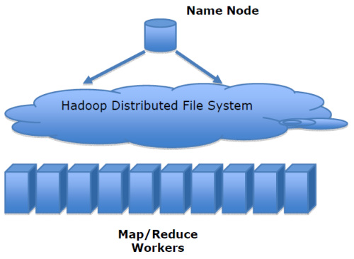
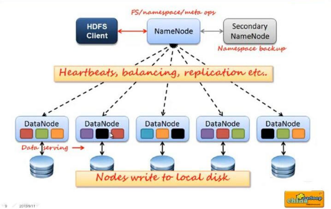
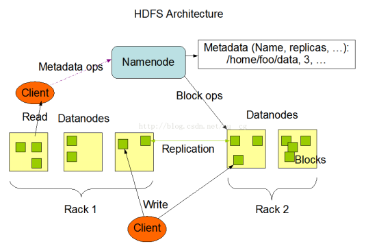
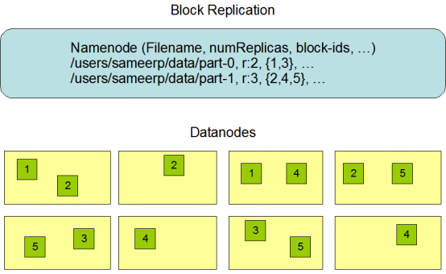
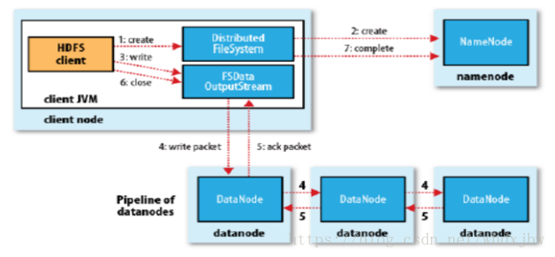
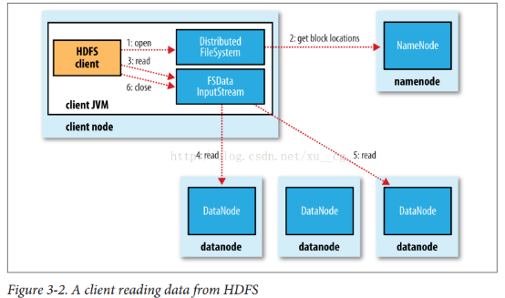
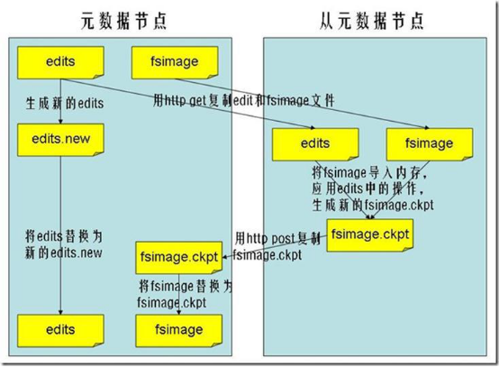

## 1. HDFS概述

### 1.1 介绍

在现代的企业环境中,单机容量往往无法存储大量数据,需要跨机器存储。统一管理分布在集群上的文件系统称为分布式文件系统。
​ HDFS（Hadoop Distributed File System）是 Apache Hadoop 项目的一个子项目.Hadoop非常适于存储大型数据(比如TB和PB),其就是使用HDFS作为存储系统.HDFS使用多台计算机存储文件,并且提供统一的访问接口,像是访问一个普通文件系统一样使用分布式文件系统.


### 1.2 历史

1. DougCutting在做Lucene的时候,需要编写一个爬虫服务,这个爬虫写的并不顺利,遇到了一些问题,诸如:如何存储大规模的数据,如何保证集群的可伸缩性,如何动态容错等
2. 2013年的时候,Google发布了三篇论文,被称作为三驾马车,其中有一篇叫做GFS,是描述了Google内部的一个叫做GFS的分布式大规模文件系统,具有强大的可伸缩性和容错性
3. DougCutting后来根据GFS的论文,创造了一个新的文件系统,叫做HDFS

## 2. HDFS应用场景

### 2.1 适合的应用场景

存储非常大的文件:这里非常大指的是几百M、G、或者TB级别,需要高吞吐量,对延时没有要求。
采用流式的数据访问方式:即一次写入、多次读取,数据集经常从数据源生成或者拷贝一次,然后在其上做很多分析工作 。
运行于商业硬件上:Hadoop不需要特别贵的机器,可运行于普通廉价机器,可以处节约成本
需要高容错性
为数据存储提供所需的扩展能力

### 2.2 不适合的应用场景

1）低延时的数据访问
  对延时要求在毫秒级别的应用,不适合采用HDFS。HDFS是为高吞吐数据传输设计的,因此可能牺牲延时
2）大量小文件
文件的元数据保存在NameNode的内存中,整个文件系统的文件数量会受限于NameNode的内存大小。
经验而言,一个文件/目录/文件块一般占有150字节的元数据内存空间。如果有100万个文件,每个文件占用1个文件块,则需要大约300M的内存。因此十亿级别的文件数量在现有商用机器上难以支持。
3）多方读写,需要任意的文件修改
HDFS采用追加（append-only）的方式写入数据。不支持文件任意offset的修改。不支持多个写入器（writer）

## 3. HDFS 的架构

 HDFS是一个`主/从（Mater/Slave）体系结构`,
HDFS由四部分组成,HDFS Client、NameNode、DataNode和Secondary NameNode。

1、Client:就是客户端。
文件切分。文件上传HDFS的时候,Client将文件切分成一个一个的Block,然后进行存储。
与NameNode交互,获取文件的位置信息。
与DataNode交互,读取或者写入数据。
Client提供一些命令来管理和访问HDFS,比如启动或者关闭HDFS。
2、NameNode:就是 master,它是一个主管、管理者。
管理HDFS的名称空间
管理数据块（Block）映射信息
配置副本策略
处理客户端读写请求。
3、DataNode:就是Slave。NameNode 下达命令,DataNode 执行实际的操作。
存储实际的数据块。
执行数据块的读/写操作。
4、Secondary NameNode:并非 NameNode 的热备。当NameNode 挂掉的时候,它并不能马上替换 NameNode 并提供服务。
辅助 NameNode,分担其工作量。
定期合并fsimage和fsedits,并推送给NameNode。
在紧急情况下,可辅助恢复NameNode。

## 4:NameNode和DataNode



### 4.1 NameNode作用

 NameNode在内存中保存着整个文件系统的名称空间和文件数据块的地址映射
整个HDFS可存储的文件数受限于NameNode的内存大小
 `1、NameNode元数据信息`
文件名,文件目录结构,文件属性(生成时间,副本数,权限)每个文件的块列表。
以及列表中的块与块所在的DataNode之间的地址映射关系
在内存中加载文件系统中每个文件和每个数据块的引用关系(文件、block、datanode之间的映射信息)
数据会定期保存到本地磁盘（fsImage文件和edits文件）
`2、NameNode文件操作`
NameNode负责文件元数据的操作
DataNode负责处理文件内容的读写请求,数据流不经过NameNode,会询问它跟那个DataNode联系
`3、NameNode副本`
文件数据块到底存放到哪些DataNode上,是由NameNode决定的,NN根据全局情况做出放置副本的决定
`4、NameNode心跳机制`
全权管理数据块的复制,周期性的接受心跳和块的状态报告信息（包含该DataNode上所有数据块的列表）
若接受到心跳信息,NameNode认为DataNode工作正常,如果在10分钟后还接受到不到DN的心跳,那么NameNode认为DataNode已经宕机 ,这时候NN准备要把DN上的数据块进行重新的复制。 块的状态报告包含了一个DN上所有数据块的列表,blocks report 每个1小时发送一次.

### 4.2 DataNode作用

提供真实文件数据的存储服务。
1、Data Node以数据块的形式存储HDFS文件
2、Data Node 响应HDFS 客户端读写请求
3、Data Node 周期性向NameNode汇报心跳信息
4、Data Node 周期性向NameNode汇报数据块信息
5、Data Node 周期性向NameNode汇报缓存数据块信息

## 5:HDFS的副本机制和机架感知

### 5.1 HDFS 文件副本机制

所有的文件都是以block块的方式存放在HDFS文件系统当中,作用如下

1. 一个文件有可能大于集群中任意一个磁盘,引入块机制,可以很好的解决这个问题
2. 使用块作为文件存储的逻辑单位可以简化存储子系统
3. 块非常适合用于数据备份进而提供数据容错能力

在Hadoop1当中,文件的block块默认大小是64M,hadoop2当中,文件的block块大小默认是128M,block块的大小可以通过hdfs-site.xml当中的配置文件进行指定

```xml
<property>
    <name>dfs.block.size</name>
    <value>块大小 以字节为单位</value>
</property>
```



### 5.2 机架感知

HDFS分布式文件系统的内部有一个副本存放策略:以默认的副本数=3为例:
1、第一个副本块存本机
2、第二个副本块存跟本机同机架内的其他服务器节点
3、第三个副本块存不同机架的一个服务器节点上

## 6、hdfs的命令行使用

`ls`

```shell
#格式: hdfs dfs-ls URI
#作用:类似于Linux的ls命令,显示文件列表
# 显示文件列表
[root@node01 ~]# hdfs dfs -ls /
Found 1 items
drwxrwx---   - root supergroup          0 2019-08-04 16:24 /tmp
```

`lsr`  

```shell
#格式:hdfs  dfs -lsr URI
#作用:在整个目录下递归执行ls,与UNIX中的ls-R类似
# 递归查询有那些文件，提示这个命令已过时，需要用到ls -R
[root@node01 ~]# hdfs dfs -lsr /
lsr: DEPRECATED: Please use 'ls -R' instead.
drwxrwx---   - root supergroup          0 2019-08-04 16:24 /tmp
drwxrwx---   - root supergroup          0 2019-08-04 16:24 /tmp/hadoop-yarn
drwxrwx---   - root supergroup          0 2019-08-04 16:24 /tmp/hadoop-yarn/staging
drwxrwx---   - root supergroup          0 2019-08-04 16:24 /tmp/hadoop-yarn/staging/history
drwxrwx---   - root supergroup          0 2019-08-04 16:24 /tmp/hadoop-yarn/staging/history/done
drwxrwxrwt   - root supergroup          0 2019-08-04 16:24 /tmp/hadoop-yarn/staging/history/done_intermediate
[root@node01 ~]# hdfs dfs -ls -R /
drwxrwx---   - root supergroup          0 2019-08-04 16:24 /tmp
drwxrwx---   - root supergroup          0 2019-08-04 16:24 /tmp/hadoop-yarn
drwxrwx---   - root supergroup          0 2019-08-04 16:24 /tmp/hadoop-yarn/staging
drwxrwx---   - root supergroup          0 2019-08-04 16:24 /tmp/hadoop-yarn/staging/history
drwxrwx---   - root supergroup          0 2019-08-04 16:24 /tmp/hadoop-yarn/staging/history/done
drwxrwxrwt   - root supergroup          0 2019-08-04 16:24 /tmp/hadoop-yarn/staging/history/done_intermediate
```

`mkdir`

```shell
#格式:hdfs  dfs -mkdir [-p] <paths>
#作用:以<paths>中的URI作为参数,创建目录。使用-p参数可以递归创建目录
# 新建一个test目录
[root@node01 ~]# hdfs dfs -mkdir /test
# 查询test 目录是否建成功
[root@node01 ~]# hdfs dfs -ls /
Found 2 items
drwxr-xr-x   - root supergroup          0 2019-08-06 13:16 /test
drwxrwx---   - root supergroup          0 2019-08-04 16:24 /tmp
# 递归新建一个目录
[root@node01 ~]# hdfs dfs -mkdir -p /test2/test3
# 查询递归生成的目录是否生成
[root@node01 ~]# hdfs dfs -ls /test2
Found 1 items
drwxr-xr-x   - root supergroup          0 2019-08-06 13:20 /test2/test3
```

`put`  

```shell
#格式 :hdfs dfs -put <localsrc >  ... <dst>
#作用:将单个的源文件src或者多个源文件srcs从本地文件系统拷贝到目标文件系统中（<dst>对应的路径）。也可以从标准输入中读取输入,写入目标文件系统中
# 将root下的zookeeper文件上传到hdfs中的test目录下
[root@node01 ~]# hdfs dfs -put /root/zookeeper.out /test
# 查询是否上传成功
[root@node01 ~]# hdfs dfs -ls /test
Found 1 items
-rw-r--r--   3 root supergroup      33449 2019-08-06 13:24 /test/zookeeper.out
```

`moveFromLocal`  

```shell
#格式:hdfs  dfs -moveFromLocal  <localsrc>   <dst>
#作用:和put命令类似,但是源文件localsrc拷贝之后自身被删除
#复制一份用于测试
[root@node01 ~]# cp zookeeper.out zookeeper.text
# 将zookeeper.text 上传到text中
[root@node01 ~]# hdfs dfs -moveFromLocal /root/zookeeper.text /test
[root@node01 ~]# hdfs dfs -ls -R /test
-rw-r--r--   3 root supergroup      33449 2019-08-06 13:24 /test/zookeeper.out
-rw-r--r--   3 root supergroup      33449 2019-08-06 13:30 /test/zookeeper.text
```

`get`

```shell
#格式   hdfs dfs  -get [-ignorecrc ]  [-crc]  <src> <localdst>
#作用:将文件拷贝到本地文件系统。 CRC 校验失败的文件通过-ignorecrc选项拷贝。 文件和CRC校验和可以通过-CRC选项拷贝
# 将hdfs中zookeeper.text 文件下载到/root中
[root@node01 ~]# hdfs dfs -get /test/zookeeper.text /root
# 查询是否下载成功
[root@node01 ~]# ll
total 84
-rw-------. 1 root root  2758 Jul  1 20:25 anaconda-ks.cfg
drwxr-xr-x. 2 root root     6 Jul  1 13:14 Desktop
drwxr-xr-x. 2 root root     6 Jul  1 13:14 Documents
drwxr-xr-x. 2 root root     6 Jul  1 13:14 Downloads
-rw-r--r--. 1 root root  2766 Jul  1 12:29 initial-setup-ks.cfg
drwxr-xr-x. 2 root root     6 Jul  1 13:14 Music
-rw-------. 1 root root  2049 Jul  1 20:25 original-ks.cfg
drwxr-xr-x. 2 root root     6 Jul  1 13:14 Pictures
drwxr-xr-x. 2 root root     6 Jul  1 13:14 Public
drwxr-xr-x. 2 root root     6 Jul  1 13:14 Templates
drwxr-xr-x. 2 root root     6 Jul  1 13:14 Videos
-rw-r--r--  1 root root 33673 Aug  6 13:37 zookeeper.out
-rw-r--r--  1 root root 33449 Aug  6 13:56 zookeeper.text
```

`mv`

```shell
#格式:hdfs  dfs -mv URI   <dest>
#作用:将hdfs上的文件从原路径移动到目标路径（移动之后文件删除）,该命令不能夸文件系统
# 先查询hdfs 中有那些文件
[root@node01 ~]# hdfs dfs -ls -R /
drwxr-xr-x   - root supergroup          0 2019-08-06 13:30 /test
-rw-r--r--   3 root supergroup      33449 2019-08-06 13:24 /test/zookeeper.out
-rw-r--r--   3 root supergroup      33449 2019-08-06 13:30 /test/zookeeper.text
drwxr-xr-x   - root supergroup          0 2019-08-06 13:20 /test2
drwxr-xr-x   - root supergroup          0 2019-08-06 13:20 /test2/test3
-rw-r--r--   3 root supergroup      33449 2019-08-06 13:27 /text
# 然把将/test/zookeeper.text 移动到 /test2 中
[root@node01 ~]# hdfs dfs -mv /test/zookeeper.text /test2
# 查询移动后的结果
[root@node01 ~]# hdfs dfs -ls -R /
drwxr-xr-x   - root supergroup          0 2019-08-06 13:58 /test
-rw-r--r--   3 root supergroup      33449 2019-08-06 13:24 /test/zookeeper.out
drwxr-xr-x   - root supergroup          0 2019-08-06 13:58 /test2
drwxr-xr-x   - root supergroup          0 2019-08-06 13:20 /test2/test3
-rw-r--r--   3 root supergroup      33449 2019-08-06 13:30 /test2/zookeeper.text
-rw-r--r--   3 root supergroup      33449 2019-08-06 13:27 /text

```

`rm`

```shell
#格式:hdfs dfs -rm [-r] 【-skipTrash】 URI 【URI 。。。】
#作用:   删除参数指定的文件,参数可以有多个。   此命令只删除文件和非空目录。
#如果指定-skipTrash选项,那么在回收站可用的情况下,该选项将跳过回收站而直接删除文件；
#否则,在回收站可用时,在HDFS Shell 中执行此命令,会将文件暂时放到回收站中。
[root@node01 ~]# hdfs dfs -ls -R /
drwxr-xr-x   - root supergroup          0 2019-08-06 13:58 /test
-rw-r--r--   3 root supergroup      33449 2019-08-06 13:24 /test/zookeeper.out
drwxr-xr-x   - root supergroup          0 2019-08-06 13:58 /test2
drwxr-xr-x   - root supergroup          0 2019-08-06 13:20 /test2/test3
-rw-r--r--   3 root supergroup      33449 2019-08-06 13:30 /test2/zookeeper.text
-rw-r--r--   3 root supergroup      33449 2019-08-06 13:27 /text
# 删除/text 文件 (删除文件之后，移动到hdfs的垃圾桶，七天之后自动删除)
[root@node01 ~]# hdfs dfs -rm /text
19/08/06 14:01:26 INFO fs.TrashPolicyDefault: Namenode trash configuration: Deletion interval = 10080 minutes, Emptier interval = 0 minutes.
19/08/06 14:01:26 INFO fs.TrashPolicyDefault: Moved: 'hdfs://node01:8020/text' to trash at: hdfs://node01:8020/user/root/.Trash/Current/text
Moved: 'hdfs://node01:8020/text' to trash at: hdfs://node01:8020/user/root/.Trash/Current
[root@node01 ~]# hdfs dfs -ls -R /
drwxr-xr-x   - root supergroup          0 2019-08-06 13:58 /test
-rw-r--r--   3 root supergroup      33449 2019-08-06 13:24 /test/zookeeper.out
drwxr-xr-x   - root supergroup          0 2019-08-06 13:58 /test2
drwxr-xr-x   - root supergroup          0 2019-08-06 13:20 /test2/test3
-rw-r--r--   3 root supergroup      33449 2019-08-06 13:30 /test2/zookeeper.text
drwx------   - root supergroup          0 2019-08-06 14:01 /user
drwx------   - root supergroup          0 2019-08-06 14:01 /user/root
drwx------   - root supergroup          0 2019-08-06 14:01 /user/root/.Trash
drwx------   - root supergroup          0 2019-08-06 14:01 /user/root/.Trash/Current
-rw-r--r--   3 root supergroup      33449 2019-08-06 13:27 /user/root/.Trash/Current/text
# 递归删除一个目录(删除之后移动到hdfs的垃圾桶)
[root@node01 ~]# hdfs dfs -rm -r /test2
19/08/06 14:04:38 INFO fs.TrashPolicyDefault: Namenode trash configuration: Deletion interval = 10080 minutes, Emptier interval = 0 minutes.
19/08/06 14:04:38 INFO fs.TrashPolicyDefault: Moved: 'hdfs://node01:8020/test2' to trash at: hdfs://node01:8020/user/root/.Trash/Current/test2
Moved: 'hdfs://node01:8020/test2' to trash at: hdfs://node01:8020/user/root/.Trash/Current
[root@node01 ~]# hdfs dfs -ls -R /
drwxr-xr-x   - root supergroup          0 2019-08-06 13:58 /test
-rw-r--r--   3 root supergroup      33449 2019-08-06 13:24 /test/zookeeper.out
drwx------   - root supergroup          0 2019-08-06 14:01 /user
drwx------   - root supergroup          0 2019-08-06 14:01 /user/root
drwx------   - root supergroup          0 2019-08-06 14:01 /user/root/.Trash
drwx------   - root supergroup          0 2019-08-06 14:04 /user/root/.Trash/Current
drwxr-xr-x   - root supergroup          0 2019-08-06 13:58 /user/root/.Trash/Current/test2
drwxr-xr-x   - root supergroup          0 2019-08-06 13:20 /user/root/.Trash/Current/test2/test3
-rw-r--r--   3 root supergroup      33449 2019-08-06 13:30 /user/root/.Trash/Current/test2/zookeeper.text
-rw-r--r--   3 root supergroup      33449 2019-08-06 13:27 /user/root/.Trash/Current/text
```

`cp`

```shell
#格式:     hdfs  dfs  -cp URI [URI ...] <dest>
#作用:将文件拷贝到目标路径中。如果<dest>  为目录的话,可以将多个文件拷贝到该目录下。
#-f
#选项将覆盖目标,如果它已经存在。
#-p
#选项将保留文件属性（时间戳、所有权、许可、ACL、XAttr）。
# 将一个目录文件拷贝到另一个目录中
hdfs dfs -cp /dir1/a.txt  /dir2/b.txt
```

`cat`  

```shell
#hdfs dfs  -cat  URI [uri  ...]
#作用:将参数所指示的文件内容输出到stdout
# 查看hdfs文件的内容
hdfs dfs  -cat /install.log
```

`chmod`  

```shell
#格式:hdfs   dfs  -chmod  [-R]  URI[URI  ...]
#作用:改变文件权限。如果使用  -R 选项,则对整个目录有效递归执行。使用这一命令的用户必须是文件的所属用户,或者超级用户。
# 修改hdfs文件或目录的权限(加-R)
hdfs dfs -chmod -R 777 /install.log
```

`chown`

```shell
#格式:hdfs   dfs  -chmod  [-R]  URI[URI  ...]
#作用:改变文件的所属用户和用户组。如果使用  -R 选项,则对整个目录有效递归执行。使用这一命令的用户必须是文件的所属用户,或者超级用户。
hdfs  dfs  -chown  -R hadoop:hadoop  /install.log
```

`appendToFile`

```shell
#格式: hdfs dfs -appendToFile <localsrc> ... <dst>
#作用:追加一个或者多个文件到hdfs指定文件中.也可以从命令行读取输入.
# 合并文件到某一个文件中
 hdfs dfs -appendToFile  a.xml b.xml  /big.xml
```

## 7hdfs的高级使用命令

### 7. 1、HDFS文件限额配置

 在多人共用HDFS的环境下,配置设置非常重要。特别是在Hadoop处理大量资料的环境,如果没有配额管理,很容易把所有的空间用完造成别人无法存取。Hdfs的配额设定是针对目录而不是针对账号,可以 让每个账号仅操作某一个目录,然后对目录设置配置。
​    hdfs文件的限额配置允许我们以文件个数,或者文件大小来限制我们在某个目录下上传的文件数量或者文件内容总量,以便达到我们类似百度网盘网盘等限制每个用户允许上传的最大的文件的量。

```shell
#查看配额信息
 hdfs dfs -count -q -h /user/root/dir1  
```

所谓的空间限额

#### 7.1.1、数量限额

```shell
# 创建hdfs文件夹
hdfs dfs  -mkdir -p /user/root/dir
# 给该文件夹下面设置最多上传两个文件,发现只能上传一个文件
hdfs dfsadmin -setQuota 2  dir
```

```shell
# 清除文件数量限制
hdfs dfsadmin -clrQuota /user/root/dir  
```

#### 7.1.2、空间大小限额

 在设置空间配额时,设置的空间至少是block_size * 3大小

```shell
# 限制空间大小4KB
hdfs dfsadmin -setSpaceQuota 4k /user/root/dir
hdfs dfs -put  /root/a.txt  /user/root/dir
```

生成任意大小文件的命令:

```shell
#生成2M的文件
dd if=/dev/zero of=1.txt  bs=1M count=2
```

清除空间配额限制

```shell
hdfs dfsadmin -clrSpaceQuota /user/root/dir
```

### 7.2、hdfs的安全模式

安全模式是hadoop的一种保护机制,用于保证集群中的数据块的安全性。当集群启动的时候,会首先进入安全模式。当系统处于安全模式时会检查数据块的完整性。
假设我们设置的副本数（即参数dfs.replication）是3,那么在datanode上就应该有3个副本存在,假设只存在2个副本,那么比例就是2/3=0.666。hdfs默认的副本率0.999。我们的副本率0.666明显小于0.999,因此系统会自动的复制副本到其他dataNode,使得副本率不小于0.999。如果系统中有5个副本,超过我们设定的3个副本,那么系统也会删除多于的2个副本。
在安全模式状态下,文件系统只接受读数据请求,而不接受删除、修改等变更请求。在,当整个系统达到安全标准时,HDFS自动离开安全模式。

`安全模式操作命令`

```shell
#查看安全模式状态
hdfs  dfsadmin  -safemode  get
#进入安全模式
hdfs  dfsadmin  -safemode  enter
#离开安全模式
hdfs  dfsadmin  -safemode  leave
```

## 8. HDFS基准测试

实际生产环境当中,hadoop的环境搭建完成之后,第一件事情就是进行压力测试,测试我们的集群的读取和写入速度,测试我们的网络带宽是否足够等一些基准测试

### 8.1 测试写入速度

`向HDFS文件系统中写入数据,10个文件,每个文件10MB,文件存放到/benchmarks/TestDFSIO中`

```shell
[root@node01 ~]# hadoop jar /export/servers/hadoop-2.7.5/share/hadoop/mapreduce/hadoop-mapreduce-client-jobclient-2.7.5.jar  TestDFSIO -write -nrFiles 10  -fileSize 10MB

19/08/06 14:14:35 INFO fs.TestDFSIO: ----- TestDFSIO ----- : write
19/08/06 14:14:35 INFO fs.TestDFSIO:             Date & time: Tue Aug 06 14:14:35 CST 2019
19/08/06 14:14:35 INFO fs.TestDFSIO:         Number of files: 10
19/08/06 14:14:35 INFO fs.TestDFSIO:  Total MBytes processed: 100
19/08/06 14:14:35 INFO fs.TestDFSIO:       Throughput mb/sec: 24.87
19/08/06 14:14:35 INFO fs.TestDFSIO:  Average IO rate mb/sec: 27.67
19/08/06 14:14:35 INFO fs.TestDFSIO:   IO rate std deviation: 9.44
19/08/06 14:14:35 INFO fs.TestDFSIO:      Test exec time sec: 8.02
19/08/06 14:14:35 INFO fs.TestDFSIO:
```

完成之后查看写入速度结果

```shell
#hdfs dfs -text  /benchmarks/TestDFSIO/io_write/part-00000
[root@node01 ~]# hdfs dfs -text  /benchmarks/TestDFSIO/io_write/part-00000
f:rate  276664.97
f:sqrate        8545210.0
l:size  104857600
l:tasks 10
l:time  4021
```

### 8.2 测试读取速度

测试hdfs的读取文件性能

在HDFS文件系统中读入10个文件,每个文件10M

```shell
[root@node01 ~]# hadoop jar /export/servers/hadoop-2.7.5/share/hadoop/mapreduce/hadoop-mapreduce-client-jobclient-2.7.5.jar  TestDFSIO -read -nrFiles 10 -fileSize 10MB
19/08/06 14:15:52 INFO fs.TestDFSIO: ----- TestDFSIO ----- : read
19/08/06 14:15:52 INFO fs.TestDFSIO:             Date & time: Tue Aug 06 14:15:52 CST 2019
19/08/06 14:15:52 INFO fs.TestDFSIO:         Number of files: 10
19/08/06 14:15:52 INFO fs.TestDFSIO:  Total MBytes processed: 100
19/08/06 14:15:52 INFO fs.TestDFSIO:       Throughput mb/sec: 395.26
19/08/06 14:15:52 INFO fs.TestDFSIO:  Average IO rate mb/sec: 460.06
19/08/06 14:15:52 INFO fs.TestDFSIO:   IO rate std deviation: 169.85
19/08/06 14:15:52 INFO fs.TestDFSIO:      Test exec time sec: 2.88
```

查看读取果

```shell
[root@node01 ~]# hdfs dfs -text /benchmarks/TestDFSIO/io_read/part-00000
f:rate  4600612.0
f:sqrate        2.40505728E9
l:size  104857600
l:tasks 10
l:time  253
```

### 8.3 清除测试数据

```shell
[root@node01 ~]# hadoop jar /export/servers/hadoop-2.7.5/share/hadoop/mapreduce/hadoop-mapreduce-client-jobclient-2.7.5.jar   TestDFSIO -clean
19/08/06 14:16:39 INFO fs.TestDFSIO: TestDFSIO.1.8
19/08/06 14:16:39 INFO fs.TestDFSIO: nrFiles = 1
19/08/06 14:16:39 INFO fs.TestDFSIO: nrBytes (MB) = 1.0
19/08/06 14:16:39 INFO fs.TestDFSIO: bufferSize = 1000000
19/08/06 14:16:39 INFO fs.TestDFSIO: baseDir = /benchmarks/TestDFSIO
19/08/06 14:16:41 INFO fs.TestDFSIO: Cleaning up test files
```

## 9.HDFS 文件写入过程

 

1. Client 发起文件上传请求,通过 RPC 与 NameNode 建立通讯,NameNode 检查目标文件是否已存在,父目录是否存在,返回是否可以上传
2. Client 请求第一个 block 该传输到哪些 DataNode 服务器上
3. NameNode 根据配置文件中指定的备份数量及机架感知原理进行文件分配,返回可用的 DataNode 的地址如:A,B,C
   - Hadoop 在设计时考虑到数据的安全与高效,数据文件默认在 HDFS 上存放三份,存储策略为本地一份,同机架内其它某一节点上一份,不同机架的某一节点上一份。
4. Client 请求 3 台 DataNode 中的一台 A 上传数据（本质上是一个 RPC 调用,建立 pipeline ）,A 收到请求会继续调用 B,然后 B 调用 C,将整个 pipeline 建立完成,后逐级返回 client
5. Client 开始往 A 上传第一个 block（先从磁盘读取数据放到一个本地内存缓存）,以 packet 为单位（默认64K）,A 收到一个 packet 就会传给 B,B 传给 C. A 每传一个 packet 会放入一个应答队列等待应答
6. 数据被分割成一个个 packet 数据包在 pipeline 上依次传输,在 pipeline 反方向上,逐个发送 ack（命令正确应答）,最终由 pipeline 中第一个 DataNode 节点 A 将 pipelineack 发送给 Client
7. 当一个 block 传输完成之后,Client 再次请求 NameNode 上传第二个 block 到服务 1

## 10.HDFS 文件读取过程



1. Client向NameNode发起RPC请求,来确定请求文件block所在的位置；
2. NameNode会视情况返回文件的部分或者全部block列表,对于每个block,NameNode 都会返回含有该 block 副本的 DataNode 地址；  这些返回的 DN 地址,会按照集群拓扑结构得出 DataNode 与客户端的距离,然后进行排序,排序两个规则:网络拓扑结构中距离 Client 近的排靠前；心跳机制中超时汇报的 DN 状态为 STALE,这样的排靠后；
3. Client 选取排序靠前的 DataNode 来读取 block,如果客户端本身就是DataNode,那么将从本地直接获取数据(短路读取特性)；
4. 底层上本质是建立 Socket Stream（FSDataInputStream）,重复的调用父类 DataInputStream 的 read 方法,直到这个块上的数据读取完毕；
5. 当读完列表的 block 后,若文件读取还没有结束,客户端会继续向NameNode 获取下一批的 block 列表；
6. 读取完一个 block 都会进行 checksum 验证,如果读取 DataNode 时出现错误,客户端会通知 NameNode,然后再从下一个拥有该 block 副本的DataNode 继续读。
7. read 方法是并行的读取 block 信息,不是一块一块的读取；NameNode 只是返回Client请求包含块的DataNode地址,并不是返回请求块的数据；
8. 最终读取来所有的 block 会合并成一个完整的最终文件。

## 11.HDFS 的元数据辅助管理

当 Hadoop 的集群当中,NameNode的所有元数据信息都保存在了 FsImage 与 Eidts 文件当中,这两个文件就记录了所有的数据的元数据信息,元数据信息的保存目录配置在了 `hdfs-site.xml` 当中

```xml
<property>
    <name>dfs.namenode.name.dir</name>
    <value>
        file:///export/servers/hadoop2.7.5/hadoopDatas/namenodeDatas,file:///export/servers/hadoop-2.7.5/hadoopDatas/namenodeDatas2
    </value>
</property>
<property>
     <name>dfs.namenode.edits.dir</name>
     <value>file:///export/servers/hadoop-2.7.5/hadoopDatas/nn/edits</value
</property>>
```

### 11.1 FsImage 和 Edits 详解

- `edits`
  - `edits` 存放了客户端最近一段时间的操作日志
  - 客户端对 HDFS 进行写文件时会首先被记录在 `edits` 文件中
  - `edits` 修改时元数据也会更新
- `fsimage`
  - NameNode 中关于元数据的镜像,一般称为检查点,`fsimage` 存放了一份比较完整的元数据信息
  - 因为 `fsimage` 是 NameNode 的完整的镜像,如果每次都加载到内存生成树状拓扑结构,这是非常耗内存和CPU,所以一般开始时对 NameNode 的操作都放在 edits 中
  - `fsimage` 内容包含了 NameNode 管理下的所有 DataNode 文件及文件 block 及 block 所在的 DataNode 的元数据信息.
  - 随着 `edits` 内容增大,就需要在一定时间点和 `fsimage` 合并

#### 11.2 fsimage 中的文件信息查看

使用命令 `hdfs  oiv`

```shell
[root@node01 namenodeDatas]# cd /export/servers/hadoop-2.7.5/hadoopDatas/namenodeDatas/current/
[root@node01 current]# hdfs oiv -i fsimage_0000000000000000019 -p XML -o hello.xml  
[root@node01 current]# ll
total 28
-rw-r--r-- 1 root root  730 Aug  6 12:28 fsimage_0000000000000000019
-rw-r--r-- 1 root root   62 Aug  6 12:28 fsimage_0000000000000000019.md5
-rw-r--r-- 1 root root 1053 Aug  6 13:28 fsimage_0000000000000000036
-rw-r--r-- 1 root root   62 Aug  6 13:28 fsimage_0000000000000000036.md5
-rw-r--r-- 1 root root 2430 Aug  6 14:20 hello.xml
-rw-r--r-- 1 root root    3 Aug  6 13:28 seen_txid
-rw-r--r-- 1 root root  206 Aug  4 16:23 VERSION
[root@node01 current]# cat hello.xml
```

#### 11.3. edits 中的文件信息查看

使用命令 `hdfs  oev`

```shell
[root@node01 current]# cd /export/servers/hadoop-2.7.5/hadoopDatas/nn/edits/current
[root@node01 current]# cd /export/servers/hadoop-2.7.5/hadoopDatas/nn/edits/current
[root@node01 current]# hdfs oev -i edits_0000000000000000018-0000000000000000019 -p  XML -o myhello.xml
[root@node01 current]# cat myhello.xml
```

#### 11.4 SecondaryNameNode 如何辅助管理 fsimage 与 edits 文件?

- SecondaryNameNode 定期合并 fsimage 和 edits,把 edits 控制在一个范围内
- 配置 SecondaryNameNode
  - SecondaryNameNode 在 `conf/masters` 中指定
  - 在 masters 指定的机器上,修改 `hdfs-site.xml`

    ```xml
    <property>
      <name>dfs.http.address</name>
      <value>host:50070</value>
    </property>
    ```

 修改 `core-site.xml`,这一步不做配置保持默认也可以

```xml
    <!-- 多久记录一次 HDFS 镜像,默认 1小时 -->
    <property>
      <name>fs.checkpoint.period</name>
      <value>3600</value>
    </property>
    <!-- 一次记录多大,默认 64M -->
    <property>
      <name>fs.checkpoint.size</name>
      <value>67108864</value>
    </property>
```



1. SecondaryNameNode 通知 NameNode 切换 editlog
2. SecondaryNameNode 从 NameNode 中获得 fsimage 和 editlog(通过http方式)
3. SecondaryNameNode 将 fsimage 载入内存,然后开始合并 editlog,合并之后成为新的 fsimage
4. SecondaryNameNode 将新的 fsimage 发回给 NameNode
5. NameNode 用新的 fsimage 替换旧的 fsimage

##### 特点

- 完成合并的是 SecondaryNameNode,会请求 NameNode 停止使用 edits,暂时将新写操作放入一个新的文件中 `edits.new`
- SecondaryNameNode 从 NameNode 中通过 Http GET 获得 edits,因为要和 fsimage 合并,所以也是通过 Http Get 的方式把 fsimage 加载到内存,然后逐一执行具体对文件系统的操作,与 fsimage 合并,生成新的 fsimage,然后通过 Http POST 的方式把 fsimage 发送给 NameNode. NameNode 从 SecondaryNameNode 获得了 fsimage 后会把原有的 fsimage 替换为新的 fsimage,把 edits.new 变成 edits. 同时会更新 fstime
- Hadoop 进入安全模式时需要管理员使用 dfsadmin 的 save namespace 来创建新的检查点
- SecondaryNameNode 在合并 edits 和 fsimage 时需要消耗的内存和 NameNode 差不多,所以一般把 NameNode 和 SecondaryNameNode 放在不同的机器上

Hadoop 核心-HDFS

## 1:HDFS 的 API 操作

### 1.1 配置Windows下Hadoop环境

在windows系统需要配置hadoop运行环境,否则直接运行代码会出现以下问题:

`缺少winutils.exe`

```shell
Could not locate executable null \bin\winutils.exe in the hadoop binaries
```

`缺少hadoop.dll`

```shell
Unable to load native-hadoop library for your platform… using builtin-Java classes where applicable  
```

步骤:
第一步：将hadoop2.7.5文件夹拷贝到一个没有中文没有空格的路径下面
第二步：在windows上面配置hadoop的环境变量： `HADOOP_HOME`,并将`%HADOOP_HOME%\bin`添加到path中
第三步：把hadoop2.7.5文件夹中bin目录下的hadoop.dll文件放到系统盘:C:\Windows\System32 目录
第四步：关闭windows重启

### 1.2 导入 Maven 依赖

```xml

     <dependencies>
        <dependency>
            <groupId>org.apache.hadoop</groupId>
            <artifactId>hadoop-common</artifactId>
            <version>2.7.5</version>
        </dependency>
        <dependency>
            <groupId>org.apache.hadoop</groupId>
            <artifactId>hadoop-client</artifactId>
            <version>2.7.5</version>
        </dependency>
        <dependency>
            <groupId>org.apache.hadoop</groupId>
            <artifactId>hadoop-hdfs</artifactId>
            <version>2.7.5</version>
        </dependency>
        <dependency>
            <groupId>org.apache.hadoop</groupId>
            <artifactId>hadoop-mapreduce-client-core</artifactId>
            <version>2.7.5</version>
        </dependency>
        <dependency>
            <groupId>junit</groupId>
            <artifactId>junit</artifactId>
            <version>RELEASE</version>
        </dependency>
    </dependencies>
    <build>
        <plugins>
            <plugin>
                <groupId>org.apache.maven.plugins</groupId>
                <artifactId>maven-compiler-plugin</artifactId>
                <version>3.1</version>
                <configuration>
                    <source>1.8</source>
                    <target>1.8</target>
                    <encoding>UTF-8</encoding>
                    <!--    <verbal>true</verbal>-->
                </configuration>
            </plugin>
            <plugin>
                <groupId>org.apache.maven.plugins</groupId>
                <artifactId>maven-shade-plugin</artifactId>
                <version>2.4.3</version>
                <executions>
                    <execution>
                        <phase>package</phase>
                        <goals>
                            <goal>shade</goal>
                        </goals>
                        <configuration>
                            <minimizeJar>true</minimizeJar>
                        </configuration>
                    </execution>
                </executions>
            </plugin>

        </plugins>
    </build>
```

### 1.3 使用url方式访问数据（了解）

```java
    /**
     * 从HDFS 中下载一个文件到本地
     * hdfs dfs -get 路径
     * @throws Exception
     */
@Test
public void demo1()throws  Exception{
    //第一步：注册hdfs 的url
    URL.setURLStreamHandlerFactory(new FsUrlStreamHandlerFactory());
    //获取文件输入流,注意文件路径
    InputStream inputStream  = new URL("hdfs://node01:8020/test/zookeeper.out").openStream();
    //获取文件输出流 下载到那个目录
    FileOutputStream outputStream = new FileOutputStream(new File("hello.txt"));
    //实现文件的拷贝
    IOUtils.copy(inputStream,outputStream);
    //关闭流
    IOUtils.closeQuietly(inputStream);
    IOUtils.closeQuietly(outputStream);
}
```

### 1.4 使用文件系统方式访问数据（掌握）

#### 1.4.1 涉及的主要类

在 Java 中操作 HDFS,主要涉及以下 Class:

`Configuration`
  该类的对象封转了客户端或者服务器的配置
`FileSystem`
  该类的对象是一个文件系统对象,可以用该对象的一些方法来对文件进行操作,通过 FileSystem 的静态方法 get 获得该对象

```java
 FileSystem fs = FileSystem.get(conf)
```

`get` 方法从 `conf` 中的一个参数 `fs.defaultFS` 的配置值判断具体是什么类型的文件系统
如果我们的代码中没有指定 `fs.defaultFS`,并且工程 ClassPath 下也没有给定相应的配置,`conf` 中的默认值就来自于 Hadoop 的 Jar 包中的 `core-default.xml`
默认值为 `file:///`,则获取的不是一个 DistributedFileSystem 的实例,而是一个本地文件系统的客户端对象

#### 1.4.2  获取 FileSystem 的几种方式

第一种方式

```java
@Test
public void getFileSystem1() throws IOException {
    //注意导包,需要导hadoop的包
    Configuration configuration = new Configuration();
    //指定我们使用的文件系统类型:
    configuration.set("fs.defaultFS","hdfs://node01:8020/");
    //获取指定的文件系统
    FileSystem fileSystem = FileSystem.get(configuration);
    System.out.println(fileSystem.toString());

}
```

* 第二种方式

```java
    /**
     * 第二种方式
     * @throws Exception
     */
    @Test
    public void getFileSystem2() throws Exception {
        FileSystem fileSystem = FileSystem.get(new URI("hdfs://node01:8082"), new Configuration());
        System.out.println("fileSystem:"+fileSystem);
    }
```

运行结果：

```text
fileSystem:DFS[DFSClient[clientName=DFSClient_NONMAPREDUCE_720883514_1, ugi=xhchen (auth:SIMPLE)]]
```

第三种方式

```java
   /**
     * 第三种方式
     *
     * @throws Exception
     */
    @Test
    public void getFileSystem3() throws Exception {
        Configuration configuration = new Configuration();
        configuration.set("fs.dafaultFS", "hdfs://node01:8082");
        FileSystem fileSystem = FileSystem.newInstance(configuration);
        System.out.println(fileSystem.toString());
    }
```

运行结果：

```text
org.apache.hadoop.fs.LocalFileSystem@3f56875e
```

第四种方式

```java
    /**
     * 获取的第四方式
     *
     * @throws Exception
     */
    @Test
    public void getFileSystem4() throws Exception {
        FileSystem fileSystem = FileSystem.newInstance(new URI("hdfs://node01:8082"), new Configuration());
        System.out.println(fileSystem.toString());
    }
```

运行结果：

```text
DFS[DFSClient[clientName=DFSClient_NONMAPREDUCE_740994128_1, ugi=xhchen (auth:SIMPLE)]]
```

#### 1.4.3  遍历 HDFS 中所有文件

* 使用 API 遍历

```java
/**
     * 遍历HDFs 中所有的文件
     *
     * @throws Exception
     */
    @Test
    public void listMyFiles() throws Exception {
        // 获取fileSystem类
        FileSystem fileSystem = FileSystem.get(new URI("hdfs://node01:8020"), new Configuration());
        //获取RemoteIterator 得到所有的文件或者文件夹，第一个参数指定遍历的路径，第二个参数表示是否要递归遍历
        RemoteIterator<LocatedFileStatus> locatedFileStatusRemoteIterator = fileSystem.listFiles(new Path("/"), true);
        while (locatedFileStatusRemoteIterator.hasNext()) {
            LocatedFileStatus next = locatedFileStatusRemoteIterator.next();
            System.out.println(next.getPath().toString());

        }
        fileSystem.close();
    }

```

运行结果：

```text
hdfs://node01:8020/test/zookeeper.out
hdfs://node01:8020/user/root/.Trash/Current/test2/zookeeper.text
hdfs://node01:8020/user/root/.Trash/Current/text
```

#### 1.4.4  HDFS 上创建文件夹

```java
    /**
     * HDFS 上创建文件夹
     * @throws Exception
     */
    @Test
    public void mkdirs() throws Exception {
        FileSystem fileSystem = FileSystem.get(new URI("hdfs://node01:8020"), new Configuration());
        boolean mkdirs = fileSystem.mkdirs(new Path("/hello/mydir/test"));
        System.out.println(mkdirs);
    }
```

运行结果：

```shell
[root@node01 ~]# hdfs dfs -ls -R /
drwxr-xr-x   - xhchen supergroup          0 2019-08-07 14:43 /hello
drwxr-xr-x   - xhchen supergroup          0 2019-08-07 14:43 /hello/mydir
drwxr-xr-x   - xhchen supergroup          0 2019-08-07 14:43 /hello/mydir/test
```

#### 1.4.4 下载文件

```java
  /**
     * 下载文件
     * @throws Exception
     */
    @Test
    public void getFileTolocal() throws Exception {
        FileSystem fileSystem = FileSystem.get(new URI("hdfs://node01:8020"), new Configuration());
        FSDataInputStream inputStream = fileSystem.open(new Path("/test/zookeeper.out"));
        FileOutputStream outputStream = new FileOutputStream(new File("zokkeeper.out"));
        IOUtils.copy(inputStream, outputStream);
        IOUtils.closeQuietly(inputStream);
        IOUtils.closeQuietly(outputStream);
        fileSystem.close();
    }
```

#### 1.4.5 HDFS 文件上传

```java
   /**
     * HDFS 文件上传
     * @throws Exception
     */
    @Test
    public void putData() throws Exception {
        FileSystem fileSystem = FileSystem.get(new URI("hdfs://node01:8020"), new Configuration());
        fileSystem.copyFromLocalFile(new Path("pom.xml"), new Path("/hello/mydir/test"));
        fileSystem.close();
    }
```

运行结果：

```shell
[root@node01 ~]# hdfs dfs -ls -R /hello/mydir/test
-rw-r--r--   3 xhchen supergroup       2498 2019-08-07 14:55 /hello/mydir/test/pom.xml
```

#### 1.4.6 hdfs访问权限控制

1. 停止hdfs集群,在node01机器上执行以下命令

```shell
[root@node01 hadoop-2.7.5]# cd /export/servers/hadoop-2.7.5/sbin/
[root@node01 sbin]# ./stop-dfs.sh
Stopping namenodes on [node01]
node01: stopping namenode
node01: stopping datanode
node02: stopping datanode
node03: stopping datanode
Stopping secondary namenodes [node01]
node01: stopping secondarynamenode
```

2.修改node01机器上的hdfs-site.xml当中的配置文件

```shell
[root@node01 sbin]# cd /export/servers/hadoop-2.7.5/etc/hadoop/
[root@node01 hadoop]# vim hdfs-site.xml
```

开启权限验证

```xml
<property>
    <name>dfs.permissions</name>
    <value>true</value>
</property>
```

3.修改完成之后配置文件发送到其他机器上面去

```shell
[root@node01 hadoop]# scp hdfs-site.xml node02:$pwd
hdfs-site.xml
[root@node01 hadoop]# scp hdfs-site.xml node03:$pwd
hdfs-site.xml
```

4.重启hdfs集群

```shell
[root@node01 hadoop]# cd /export/servers/hadoop-2.7.5/sbin/
[root@node01 sbin]# ./start-dfs.sh
[root@node01 sbin]# jps
18197 NodeManager
18470 JobHistoryServer
52264 Jps
51817 NameNode
12442 QuorumPeerMain
52106 SecondaryNameNode
51964 DataNode
18095 ResourceManager
```

5.随意上传一些文件到我们hadoop集群当中准备测试使用

```shell
[root@node01 sbin]# cd /export/servers/hadoop-2.7.5/etc/hadoop
[root@node01 hadoop]# hdfs dfs -mkdir /config
[root@node01 hadoop]# hdfs dfs -put *.xml /config
[root@node01 hadoop]# hdfs dfs -chmod 600 /config/core-site.xml
```

6.使用代码准备下载文件

```java
    /**
     * 权限测试下载
     * @throws Exception
     */
    @Test
    public void getConfig() throws Exception {
        FileSystem fileSystem = FileSystem.get(new URI("hdfs://node01:8020"), new Configuration());
        fileSystem.copyToLocalFile(new Path("/config/core-site.xml"), new Path("core-site.xml"));
        fileSystem.close();

    }
```

运行结果：

```text
org.apache.hadoop.security.AccessControlException: Permission denied: user=xhchen, access=READ, inode="/config/core-site.xml":root:supergroup:-rw-------
```

```shell
[root@node01 hadoop]# hdfs dfs -ls -R /
-rw-------   3 root   supergroup       1411 2019-08-07 15:15 /config/core-site.xml
```

#### 1.4.7 小文件合并

由于 Hadoop 擅长存储大文件,因为大文件的元数据信息比较少,如果 Hadoop 集群当中有大量的小文件,那么每个小文件都需要维护一份元数据信息,会大大的增加集群管理元数据的内存压力,所以在实际工作当中,如果有必要一定要将小文件合并成大文件进行一起处理
在我们的 HDFS 的 Shell 命令模式下,可以通过命令行将很多的 hdfs 文件合并成一个大文件下载到本地

```text
getmerge
使用方法：hadoop fs -getmerge <src> <localdst> [addnl]
接受一个源目录和一个目标文件作为输入，并且将源目录中所有的文件连接成本地目标文件。addnl是可选的，用于指定在每个文件结尾添加一个换行符。
```

```shell
[root@node01 hadoop]# cd /export/servers/
[root@node01 servers]# hdfs dfs -getmerge /config/*.xml ./hello.xml
[root@node01 servers]# ll
-rw-r--r--  1 root root  30160 Aug  7 15:27 hello.xml
```

既然可以在下载的时候将这些小文件合并成一个大文件一起下载,那么肯定就可以在上传的时候将小文件合并到一个大文件里面去


```java
 /**
     * 将本地文件上传到hdfs 系统中
     * @throws Exception
     */
    @Test
    public void mergeFile() throws Exception {
        //获取分布式系统
        FileSystem fileSystem = FileSystem.get(new URI("hdfs://node01:8020"), new Configuration(),"root");
        FSDataOutputStream outputStream = fileSystem.create(new Path("/bigfile.txt"));
        //获取本地文件系统
        LocalFileSystem local = FileSystem.getLocal(new Configuration());
        //通过本地文件系统获取文件列表，为一个集合
        FileStatus[] fileStatuses = local.listStatus(new Path("/Users/xhchen/Code/Hadoop/Hadoop04/src/test/java"));
        for (FileStatus fileStatus : fileStatuses) {
            FSDataInputStream inputStream = local.open(fileStatus.getPath());
            IOUtils.copy(inputStream, outputStream);
            IOUtils.closeQuietly(inputStream);
        }
        IOUtils.closeQuietly(outputStream);
        local.close();
        fileSystem.close();
    }
```

## 2：HDFS的高可用机制

### 2.1 HDFS高可用介绍

在Hadoop 中,NameNode 所处的位置是非常重要的,整个HDFS文件系统的元数据信息都由NameNode 来管理,NameNode的可用性直接决定了Hadoop 的可用性,一旦NameNode进程不能工作了,就会影响整个集群的正常使用.

在典型的HA集群中,两台独立的机器被配置为NameNode。在工作集群中,NameNode机器中的一个处于Active状态,另一个处于Standby状态。Active NameNode负责群集中的所有客户端操作,而Standby充当从服务器。Standby机器保持足够的状态以提供快速故障切换（如果需要）。


### 2.2 组件介绍

`ZKFailoverController`

是基于Zookeeper的故障转移控制器,它负责控制NameNode的主备切换,ZKFailoverController会监测NameNode的健康状态,当发现Active NameNode出现异常时会通过Zookeeper进行一次新的选举,完成Active和Standby状态的切换

`HealthMonitor`

周期性调用NameNode的HAServiceProtocol RPC接口（monitorHealth 和 getServiceStatus）,监控NameNode的健康状态并向ZKFailoverController反馈

`ActiveStandbyElector`

接收ZKFC的选举请求,通过Zookeeper自动完成主备选举,选举完成后回调ZKFailoverController的主备切换方法对NameNode进行Active和Standby状态的切换.

`DataNode`

NameNode包含了HDFS的元数据信息和数据块信息（blockmap）,其中数据块信息通过DataNode主动向Active NameNode和Standby NameNode上报

`共享存储系统`

共享存储系统负责存储HDFS的元数据（EditsLog）,Active NameNode（写入）和 Standby NameNode（读取）通过共享存储系统实现元数据同步,在主备切换过程中,新的Active NameNode必须确保元数据同步完成才能对外提供服务

## 3: Hadoop的联邦机制(Federation)

### 3.1背景概述

单NameNode的架构使得HDFS在集群扩展性和性能上都有潜在的问题,当集群大到一定程度后,NameNode进程使用的内存可能会达到上百G,NameNode成为了性能的瓶颈。因而提出了namenode水平扩展方案-- Federation。
Federation中文意思为联邦,联盟,是NameNode的Federation,也就是会有多个NameNode。多个NameNode的情况意味着有多个namespace(命名空间),区别于HA模式下的多NameNode,它们是拥有着同一个namespace。既然说到了NameNode的命名空间的概念,这里就看一下现有的HDFS数据管理架构,如下图所示:

从上图中,我们可以很明显地看出现有的HDFS数据管理,数据存储2层分层的结构.也就是说,所有关于存储数据的信息和管理是放在NameNode这边,而真实数据的存储则是在各个DataNode下.而这些隶属于同一个NameNode所管理的数据都是在同一个命名空间下的.而一个namespace对应一个block pool。Block Pool是同一个namespace下的block的集合.当然这是我们最常见的单个namespace的情况,也就是一个NameNode管理集群中所有元数据信息的时候.如果我们遇到了之前提到的NameNode内存使用过高的问题,这时候怎么办?元数据空间依然还是在不断增大,一味调高NameNode的jvm大小绝对不是一个持久的办法.这时候就诞生了HDFS Federation的机制.

### 3.2 Federation架构设计

HDFS Federation是解决namenode内存瓶颈问题的水平横向扩展方案。

Federation意味着在集群中将会有多个namenode/namespace。这些namenode之间是联合的,也就是说,他们之间相互独立且不需要互相协调,各自分工,管理自己的区域。分布式的datanode被用作通用的数据块存储存储设备。每个datanode要向集群中所有的namenode注册,且周期性地向所有namenode发送心跳和块报告,并执行来自所有namenode的命令。

Federation一个典型的例子就是上面提到的NameNode内存过高问题,我们完全可以将上面部分大的文件目录移到另外一个NameNode上做管理.更重要的一点在于,这些NameNode是共享集群中所有的DataNode的,它们还是在同一个集群内的。

这时候在DataNode上就不仅仅存储一个Block Pool下的数据了,而是多个(在DataNode的datadir所在目录里面查看BP-xx.xx.xx.xx打头的目录)。

概括起来：

多个NN共用一个集群里的存储资源,每个NN都可以单独对外提供服务。
每个NN都会定义一个存储池,有单独的id,每个DN都为所有存储池提供存储。
DN会按照存储池id向其对应的NN汇报块信息,同时,DN会向所有NN汇报本地存储可用资源情况。
HDFS Federation不足
HDFS Federation并没有完全解决单点故障问题。虽然namenode/namespace存在多个,但是从单个namenode/namespace看,仍然存在单点故障：如果某个namenode挂掉了,其管理的相应的文件便不可以访问。Federation中每个namenode仍然像之前HDFS上实现一样,配有一个secondary namenode,以便主namenode挂掉一下,用于还原元数据信息。

所以一般集群规模真的很大的时候,会采用HA+Federation的部署方案。也就是每个联合的namenodes都是ha的。

## 示例：hdfs_api_demo

### pom.xml

hdfs_api_demo/pom.xml

```xml
<?xml version="1.0" encoding="UTF-8"?>
<project xmlns="http://maven.apache.org/POM/4.0.0"
         xmlns:xsi="http://www.w3.org/2001/XMLSchema-instance"
         xsi:schemaLocation="http://maven.apache.org/POM/4.0.0 http://maven.apache.org/xsd/maven-4.0.0.xsd">
    <modelVersion>4.0.0</modelVersion>

    <groupId>cn.xhchen</groupId>
    <artifactId>day04_hdfs_api_demo</artifactId>
    <version>1.0-SNAPSHOT</version>
    <dependencies>
        <dependency>
            <groupId>org.apache.hadoop</groupId>
            <artifactId>hadoop-common</artifactId>
            <version>2.7.5</version>
        </dependency>
        <dependency>
            <groupId>org.apache.hadoop</groupId>
            <artifactId>hadoop-client</artifactId>
            <version>2.7.5</version>
        </dependency>
        <dependency>
            <groupId>org.apache.hadoop</groupId>
            <artifactId>hadoop-hdfs</artifactId>
            <version>2.7.5</version>
        </dependency>
        <dependency>
            <groupId>org.apache.hadoop</groupId>
            <artifactId>hadoop-mapreduce-client-core</artifactId>
            <version>2.7.5</version>
        </dependency>
        <dependency>
            <groupId>junit</groupId>
            <artifactId>junit</artifactId>
            <version>RELEASE</version>
        </dependency>
    </dependencies>
    <build>
        <plugins>
            <plugin>
                <groupId>org.apache.maven.plugins</groupId>
                <artifactId>maven-compiler-plugin</artifactId>
                <version>3.1</version>
                <configuration>
                    <source>1.8</source>
                    <target>1.8</target>
                    <encoding>UTF-8</encoding>
                    <!--    <verbal>true</verbal>-->
                </configuration>
            </plugin>
            <plugin>
                <groupId>org.apache.maven.plugins</groupId>
                <artifactId>maven-shade-plugin</artifactId>
                <version>2.4.3</version>
                <executions>
                    <execution>
                        <phase>package</phase>
                        <goals>
                            <goal>shade</goal>
                        </goals>
                        <configuration>
                            <minimizeJar>true</minimizeJar>
                        </configuration>
                    </execution>
                </executions>
            </plugin>

        </plugins>
    </build>
</project>
```

### TestDemo.java

hdfs_api_demo/src/test/java/TestDemo.java

```java
import org.apache.commons.io.IOUtils;
import org.apache.hadoop.fs.FsUrlStreamHandlerFactory;
import org.junit.Test;

import java.io.File;
import java.io.FileOutputStream;
import java.io.IOException;
import java.io.InputStream;
import java.net.URL;

public class TestDemo {

    @Test
    public void demo1()throws  Exception{
        //第一步：注册hdfs 的url
        URL.setURLStreamHandlerFactory(new FsUrlStreamHandlerFactory());
        //获取文件输入流
        InputStream inputStream  = new URL("hdfs://node01:8020/a.txt").openStream();
        //获取文件输出流
        FileOutputStream outputStream = new FileOutputStream(new File("D:\\hello.txt"));
        //实现文件的拷贝
        IOUtils.copy(inputStream,outputStream);

        //关闭流
        IOUtils.closeQuietly(inputStream);
        IOUtils.closeQuietly(outputStream);
    }
}
```

### log4j.properties

hdfs_api_demo/src/main/resources/log4j.properties

```properties
# Configure logging for testing: optionally with log file

#log4j.rootLogger=debug,appender
log4j.rootLogger=info,appender  
#log4j.rootLogger=error,appender

#\u8F93\u51FA\u5230\u63A7\u5236\u53F0
log4j.appender.appender=org.apache.log4j.ConsoleAppender  
#\u6837\u5F0F\u4E3ATTCCLayout
log4j.appender.appender.layout=org.apache.log4j.TTCCLayout
```

### HdfsApiDemo.java

hdfs_api_demo/src/main/java/cn/xhchen/hdfs_api/HdfsApiDemo.java

```java
package cn.xhchen.hdfs_api;

import org.apache.commons.io.IOUtils;
import org.apache.hadoop.conf.Configuration;
import org.apache.hadoop.fs.*;
import org.junit.Test;
import org.junit.experimental.theories.suppliers.TestedOn;

import java.io.File;
import java.io.FileOutputStream;
import java.io.IOException;
import java.io.InputStream;
import java.net.MalformedURLException;
import java.net.URI;
import java.net.URISyntaxException;
import java.net.URL;

public class HdfsApiDemo {

    /*
      小文件的合并
     */
    @Test
    public void mergeFile() throws URISyntaxException,IOException,InterruptedException {
        //1:获取FileSystem（分布式文件系统）
        FileSystem fileSystem = FileSystem.get(new URI("hdfs://node01:8020"),new Configuration(),"root");

        //2:获取hdfs大文件的输出流
        FSDataOutputStream outputStream = fileSystem.create(new Path("/big_txt.txt"));

        //3:获取一个本地文件系统
        LocalFileSystem localFileSystem = FileSystem.getLocal(new Configuration());

        //4:获取本地文件夹下所有文件的详情
        FileStatus[] fileStatuses = localFileSystem.listStatus(new Path("D:\\input"));

        //5:遍历每个文件,获取每个文件的输入流
        for (FileStatus fileStatus : fileStatuses) {
            FSDataInputStream inputStream = localFileSystem.open(fileStatus.getPath());

            //6:将小文件的数据复制到大文件
            IOUtils.copy(inputStream,outputStream);
            IOUtils.closeQuietly(inputStream);
        }

        //7:关闭流
        IOUtils.closeQuietly(outputStream);
        localFileSystem.close();
        fileSystem.close();
    }

    /*
     文件的上传
     */
    @Test
    public void uploadFile() throws URISyntaxException,IOException {
        //1:获取FileSystem
        FileSystem fileSystem = FileSystem.get(new URI("hdfs://node01:8020"),new Configuration());

        //2:调用方法,实现上传
        fileSystem.copyFromLocalFile(new Path("D://set.xml"),new Path("/"));

        //3:关闭FileSystem
        fileSystem.close();


    }


    /*
    实现文件的下载:方式2
     */
    @Test
    public void downloadFile2() throws URISyntaxException,IOException,InterruptedException {
        //1:获取FileSystem
        FileSystem fileSystem = FileSystem.get(new URI("hdfs://node01:8020"),new Configuration(),"root");
        //2:调用方法,实现文件的下载

        fileSystem.copyToLocalFile(new Path("/a.txt"),new Path("D://a4.txt"));

        //3:关闭FileSystem
        fileSystem.close();
    }

    /*
      实现文件的下载
     */
    @Test
    public void downloadFile() throws URISyntaxException,IOException {
        //1:获取FileSystem
        FileSystem fileSystem = FileSystem.get(new URI("hdfs://node01:8020"),new Configuration());

        //2:获取hdfs的输入流
        FSDataInputStream inputStream = fileSystem.open(new Path("/a.txt"));

        //3:获取本地路径的输出流
        FileOutputStream outputStream = new FileOutputStream("D://a.txt");

        //4:文件的拷贝
        IOUtils.copy(inputStream,outputStream);
        //5:关闭流
        IOUtils.closeQuietly(inputStream);
        IOUtils.closeQuietly(outputStream);
        fileSystem.close();
    }


    /*
        hdfs创建文件夹
     */
    @Test
    public void mkdirsTest() throws URISyntaxException,IOException {
        //1:获取FileSystem实例
        FileSystem fileSystem = FileSystem.get(new URI("hdfs://node01:8020"),new Configuration());

        //2:创建文件夹
        //boolean bl = fileSystem.mkdirs(new Path("/aaa/bbb/ccc"));
        fileSystem.create(new Path("/aaa/bbb/ccc/a.txt"));
        fileSystem.create(new Path("/aaa2/bbb/ccc/a.txt"));
        //System.out.println(bl);

        //3: 关闭FileSystem
        //fileSystem.close();

    }


    /*
     hdfs文件的遍历
     */
    @Test
    public void listFiles() throws URISyntaxException,IOException {
        //1:获取FileSystem实例
        FileSystem fileSystem = FileSystem.get(new URI("hdfs://node01:8020"),new Configuration());

        //2:调用方法listFiles 获取 /目录下所有的文件信息
        RemoteIterator<LocatedFileStatus> iterator = fileSystem.listFiles(new Path("/"),true);

        //3:遍历迭代器
        while (iterator.hasNext()){
            LocatedFileStatus fileStatus = iterator.next();

            //获取文件的绝对路径 : hdfs://node01:8020/xxx
            System.out.println(fileStatus.getPath() + "----" +fileStatus.getPath().getName());

            //文件的block信息
            BlockLocation[] blockLocations = fileStatus.getBlockLocations();
            System.out.println("block数:"+blockLocations.length);
        }
    }
    /*
    获取FileSystem；方式4
    */
    @Test
    public void getFileSystem4() throws URISyntaxException,IOException {
        FileSystem fileSystem = FileSystem.newInstance(new URI("hdfs://node01:8020"),new Configuration());

        System.out.println(fileSystem);

    }
    /*
    获取FileSystem；方式3
   */
    @Test
    public void getFileSystem3() throws IOException {
        Configuration configuration = new Configuration();
        //指定文件系统类型
        configuration.set("fs.defaultFS","hdfs://node01:8020");

        //获取指定的文件系统
        FileSystem fileSystem = FileSystem.newInstance(configuration);

        System.out.println(fileSystem);
    }
     /*
      获取FileSystem；方式2
     */
     @Test
     public void getFileSystem2() throws URISyntaxException,IOException {
         FileSystem fileSystem = FileSystem.get(new URI("hdfs://node01:8020"),new Configuration());

         System.out.println(fileSystem);
     }

    /*
      获取FileSystem；方式1
     */
    @Test
    public void getFileSystem1() throws IOException {
        //1:创建Configuration对象
        Configuration configuration = new Configuration();

        //2:设置文件系统的类型
        configuration.set("fs.defaultFS","hdfs://node01:8020");

        //3:获取指定的文件系统
        FileSystem fileSystem = FileSystem.get(configuration);

        //4:输出
        System.out.println(fileSystem);
    }

    @Test
    public void urlHdfs() throws IOException {

        //1:注册url
        URL.setURLStreamHandlerFactory( new FsUrlStreamHandlerFactory());
        //2:获取hdfs文件的输入流
        InputStream inputStream = new URL("hdfs://node01:8020/a.txt").openStream();

        //3:获取本地文件的输出流
        FileOutputStream outputStream = new FileOutputStream(new File("D:\\hello2.txt"));

        //4:实现文件的拷贝
        IOUtils.copy(inputStream,outputStream);

        //5:关流
        IOUtils.closeQuietly(inputStream);
        IOUtils.closeQuietly(outputStream);

    }
}
```
