数据仓库-Hive

## 1. 数据仓库

### 1.1. 基本概念

英文名称为Data Warehouse,可简写为DW或DWH。数据仓库的目的是构建面向分析的集成化数据环境,为企业提供决策支持（Decision Support）。
数据仓库是存数据的,企业的各种数据往里面存,主要目的是为了分析有效数据,后续会基于它产出供分析挖掘的数据,或者数据应用需要的数据,如企业的分析性报告和各类报表等。
可以理解为：`面向分析的存储系统`。

### 1.2. 主要特征

数据仓库是面向主题的（Subject-Oriented ）、集成的（Integrated）、非易失的（Non-Volatile）和时变的（Time-Variant ）数据集合,用以支持管理决策。

#### 1.2.1. 面向主题

 数据仓库是面向主题的,数据仓库通过一个个主题域将多个业务系统的数据加载到一起,为了各个主题（如：用户、订单、商品等）进行分析而建,操作型数据库是为了支撑各种业务而建立。

#### 1.2.2. 集成性

数据仓库会将不同源数据库中的数据汇总到一起,数据仓库中的综合数据不能从原有的数据库系统直接得到。因此在数据进入数据仓库之前,必然要经过统一与整合,这一步是数据仓库建设中最关键、最复杂的一步(ETL),要统一源数据中所有矛盾之处,如字段的同名异义、异名同义、单位不统一、字长不一致,等等。

#### 1.2.3. 非易失性

操作型数据库主要服务于日常的业务操作,使得数据库需要不断地对数据实时更新,以便迅速获得当前最新数据,不至于影响正常的业务运作。
在数据仓库中只要保存过去的业务数据,不需要每一笔业务都实时更新数据仓库,而是根据商业需要每隔一段时间把一批较新的数据导入数据仓库。
数据仓库的数据反映的是一段相当长的时间内历史数据的内容,是不同时点的数据库的集合,以及基于这些快照进行统计、综合和重组的导出数据。数据仓库中的数据一般仅执行查询操作,很少会有删除和更新。但是需定期加载和刷新数据。

#### 1.2.4. 时变性

数据仓库包含各种粒度的历史数据。数据仓库中的数据可能与某个特定日期、星期、月份、季度或者年份有关。数据仓库的目的是通过分析企业过去一段时间业务的经营状况,挖掘其中隐藏的模式。虽然数据仓库的用户不能修改数据,但并不是说数据仓库的数据是永远不变的。分析的结果只能反映过去的情况,当业务变化后,挖掘出的模式会失去时效性。因此数据仓库的数据需要定时更新,以适应决策的需要。

### 1.3. 数据库与数据仓库的区别

数据库与数据仓库的区别实际讲的是 `OLTP` 与 `OLAP` 的区别。
操作型处理,叫联机事务处理 OLTP（On-Line Transaction Processing,）,也可以称面向交易的处理系统,它是针对具体业务在数据库联机的日常操作,通常对少数记录进行查询、修改。用户较为关心操作的响应时间、数据的安全性、完整性和并发支持的用户数等问题。传统的数据库系统作为数据管理的主要手段,主要用于操作型处理。
分析型处理,叫联机分析处理 OLAP（On-Line Analytical Processing）一般针对某些主题的历史数据进行分析,支持 管理决策。
首先要明白,数据仓库的出现,并不是要取代数据库。

* 数据库是面向事务的设计,数据仓库是面向主题设计的。
* 数据库一般存储业务数据,数据仓库存储的一般是历史数据。
* 数据库设计是尽量避免冗余,一般针对某一业务应用进行设计,比如一张简单的User表,记录用户名、密码等简单数据即可,符合业务应用,但是不符合分析。数据仓库在设计是有意引入冗余,依照分析需求,分析维度、分析指标进行设计。
* 数据库是为捕获数据而设计,数据仓库是为分析数据而设计。

数据仓库,是在数据库已经大量存在的情况下,为了进一步挖掘数据资源、为了决策需要而产生的,它决不是所谓的“大型数据库”。

### 1.4. 数仓的分层架构

按照数据流入流出的过程,数据仓库架构可分为三层——源数据、数据仓库、数据应用。
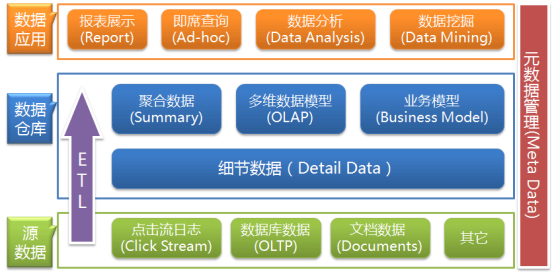
数据仓库的数据来源于不同的源数据,并提供多样的数据应用,数据自下而上流入数据仓库后向上层开放应用,而数据仓库只是中间集成化数据管理的一个平台。

* `源数据层（ODS）`：此层数据无任何更改,直接沿用外围系统数据结构和数据,不对外开放；为临时存储层,是接口数据的临时存储区域,为后一步的数据处理做准备。
* `数据仓库层（DW）`：也称为细节层,DW层的数据应该是一致的、准确的、干净的数据,即对源系统数据进行了清洗（去除了杂质）后的数据。
* `数据应用层（DA或APP）`：前端应用直接读取的数据源；根据报表、专题分析需求而计算生成的数据。

数据仓库从各数据源获取数据及在数据仓库内的数据转换和流动都可以认为是ETL（抽取Extra, 转化Transfer, 装载Load）的过程,ETL是数据仓库的流水线,也可以认为是数据仓库的血液,它维系着数据仓库中数据的新陈代谢,而数据仓库日常的管理和维护工作的大部分精力就是保持ETL的正常和稳定。

#### 为什么要对数据仓库分层

用空间换时间,通过大量的预处理来提升应用系统的用户体验（效率）,因此数据仓库会存在大量冗余的数据；不分层的话,如果源业务系统的业务规则发生变化将会影响整个数据清洗过程,工作量巨大。

通过数据分层管理可以简化数据清洗的过程,因为把原来一步的工作分到了多个步骤去完成,相当于把一个复杂的工作拆成了多个简单的工作,把一个大的黑盒变成了一个白盒,每一层的处理逻辑都相对简单和容易理解,这样我们比较容易保证每一个步骤的正确性,当数据发生错误的时候,往往我们只需要局部调整某个步骤即可。

### 1.5. 数仓的元数据管理

元数据（Meta Date）,主要记录数据仓库中模型的定义、各层级间的映射关系、监控数据仓库的数据状态及ETL的任务运行状态。一般会通过元数据资料库（Metadata Repository）来统一地存储和管理元数据,其主要目的是使数据仓库的设计、部署、操作和管理能达成协同和一致。
元数据是数据仓库管理系统的重要组成部分,元数据管理是企业级数据仓库中的关键组件,贯穿数据仓库构建的整个过程,直接影响着数据仓库的构建、使用和维护。

* 构建数据仓库的主要步骤之一是ETL。这时元数据将发挥重要的作用,它定义了源数据系统到数据仓库的映射、数据转换的规则、数据仓库的逻辑结构、数据更新的规则、数据导入历史记录以及装载周期等相关内容。数据抽取和转换的专家以及数据仓库管理员正是通过元数据高效地构建数据仓库。
* 用户在使用数据仓库时,通过元数据访问数据,明确数据项的含义以及定制报表。
* 数据仓库的规模及其复杂性离不开正确的元数据管理,包括增加或移除外部数据源,改变数据清洗方法,控制出错的查询以及安排备份等。

  

元数据可分为技术元数据和业务元数据。技术元数据为开发和管理数据仓库的IT 人员使用,它描述了与数据仓库开发、管理和维护相关的数据,包括数据源信息、数据转换描述、数据仓库模型、数据清洗与更新规则、数据映射和访问权限等。而业务元数据为管理层和业务分析人员服务,从业务角度描述数据,包括商务术语、数据仓库中有什么数据、数据的位置和数据的可用性等,帮助业务人员更好地理解数据仓库中哪些数据是可用的以及如何使用。
由上可见,元数据不仅定义了数据仓库中数据的模式、来源、抽取和转换规则等,而且是整个数据仓库系统运行的基础,元数据把数据仓库系统中各个松散的组件联系起来,组成了一个有机的整体。

## 2. Hive 的基本概念

### 2.1. Hive 简介

#### 什么是 Hive

Hive是基于Hadoop的一个数据仓库工具,可以将结构化的数据文件映射为一张数据库表,并提供类SQL查询功能。
其本质是将SQL转换为MapReduce的任务进行运算,底层由HDFS来提供数据的存储,说白了hive可以理解为一个将SQL转换为MapReduce的任务的工具,甚至更进一步可以说hive就是一个MapReduce的客户端

##### 为什么使用 Hive

* 采用类SQL语法去操作数据,提供快速开发的能力。
* 避免了去写MapReduce,减少开发人员的学习成本。
* 功能扩展很方便。

### 2.2. Hive 架构

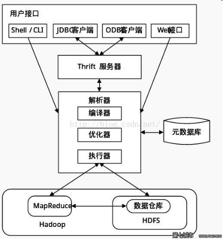

* 用户接口： 包括CLI、JDBC/ODBC、WebGUI。其中,CLI(command line interface)为shell命令行；JDBC/ODBC是Hive的JAVA实现,与传统数据库JDBC类似；WebGUI是通过浏览器访问Hive。
* 元数据存储： 通常是存储在关系数据库如mysql/derby中。Hive 将元数据存储在数据库中。Hive 中的元数据包括表的名字,表的列和分区及其属性,表的属性（是否为外部表等）,表的数据所在目录等。
* 解释器、编译器、优化器、执行器: 完成HQL 查询语句从词法分析、语法分析、编译、优化以及查询计划的生成。生成的查询计划存储在HDFS 中,并在随后有MapReduce 调用执行。

### 2.3. Hive 与 Hadoop 的关系

Hive利用HDFS存储数据,利用MapReduce查询分析数据
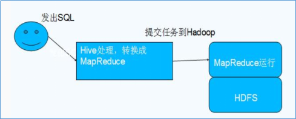

### 2.4. Hive与传统数据库对比

hive用于海量数据的离线数据分析
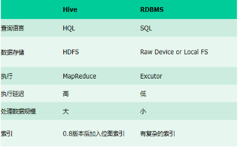
总结：hive具有sql数据库的外表,但应用场景完全不同,hive只适合用来做批量数据统计分析

### 2.5. Hive 的安装

这里我们选用hive的版本是2.1.1
下载地址为：
<http://archive.apache.org/dist/hive/hive-2.1.1/apache-hive-2.1.1-bin.tar.gz>
下载之后,将我们的安装包上传到第三台机器的/export/softwares目录下面去

#### 第一步：上传并解压安装包

将我们的hive的安装包上传到第三台服务器的/export/softwares路径下,然后进行解压

```shell
[root@node03 ~]# cd /export/softwares/
[root@node03 softwares]# tar -zxvf apache-hive-2.1.1-bin.tar.gz -C /export/servers/
tar -zxvf apache-hive-2.1.1-bin.tar.gz -C ../servers/
```

##### 第二步：安装mysql

第一步：在线安装mysql相关的软件包
 `yum  install  mysql  mysql-server  mysql-devel`
第二步：启动mysql的服务
`/etc/init.d/mysqld start`
第三步：通过mysql安装自带脚本进行设置
`/usr/bin/mysql_secure_installation`
第四步：进入mysql的客户端然后进行授权
 `grant all privileges on *.* to 'root'@'%' identified by '123456' with grant option;`
 `flush privileges;`

##### 第三步：修改hive的配置文件

修改hive-env.sh

```shell
[root@node03 servers]# cd /export/servers/apache-hive-2.1.1-bin/conf/
[root@node03 conf]# cp hive-env.sh.template hive-env.sh
[root@node03 conf]# vim hive-env.sh
HADOOP_HOME=/export/servers/hadoop-2.7.5
export HIVE_CONF_DIR=/export/servers/apache-hive-2.1.1-bin/conf
```

修改hive-site.xml

```shell
[root@node03 conf]# cd /export/servers/apache-hive-2.1.1-bin/conf/
[root@node03 conf]# vim hive-site.xml
vim hive-site.xml
```

```xml
<?xml version="1.0" encoding="UTF-8" standalone="no"?>
<?xml-stylesheet type="text/xsl" href="configuration.xsl"?>
<configuration>
<property>
      <name>javax.jdo.option.ConnectionUserName</name>
      <value>root</value>
  </property>
  <property>
      <name>javax.jdo.option.ConnectionPassword</name>
      <value>123456</value>
  </property>
  <property>
      <name>javax.jdo.option.ConnectionURL</name>
      <value>jdbc:mysql://node03:3306/hive?createDatabaseIfNotExist=true&amp;useSSL=false</value>
  </property>
  <property>
      <name>javax.jdo.option.ConnectionDriverName</name>
      <value>com.mysql.jdbc.Driver</value>
  </property>
  <property>
      <name>hive.metastore.schema.verification</name>
      <value>false</value>
  </property>
  <property>
    <name>datanucleus.schema.autoCreateAll</name>
    <value>true</value>
 </property>
 <property>
    <name>hive.server2.thrift.bind.host</name>
    <value>node03</value>
   </property>
</configuration>
```

##### 第四步：添加mysql的连接驱动包到hive的lib目录下

hive使用mysql作为元数据存储,必然需要连接mysql数据库,所以我们添加一个mysql的连接驱动包到hive的安装目录下,然后就可以准备启动hive了
将我们准备好的mysql-connector-java-5.1.38.jar  这个jar包直接上传到
`/export/servers/apache-hive-2.1.1-bin/lib`  这个目录下即可

```shell
[root@node03 lib]# cd /export/servers/apache-hive-2.1.1-bin/lib
# 上传mysql驱动包
[root@node03 lib]# ll
-rw-r--r-- 1 root root   983911 Aug  6 20:26 mysql-connector-java-5.1.38.jar
```

至此,hive的安装部署已经完成,接下来我们来看下hive的三种交互方式

##### 第五步：配置hive的环境变量

node03服务器执行以下命令配置hive的环境变量

```shell
[root@node03 lib]# sudo vim /etc/profile
export HIVE_HOME=/export/servers/apache-hive-2.1.1-bin
export PATH=:$HIVE_HOME/bin:$PATH
[root@node03 lib]# source /etc/profile
```

### 2.6. Hive 的交互方式

#### 第一种交互方式 `bin/hive`

```shell
[root@node03 lib]# cd /export/servers/apache-hive-2.1.1-bin/
[root@node03 apache-hive-2.1.1-bin]# bin/hive
```

创建一个数据库

```sql
hive> create database if not exists mytest;
OK
Time taken: 0.943 seconds
```

##### 第二种交互方式：`使用sql语句或者sql脚本进行交互`

不进入hive的客户端直接执行hive的hql语句

```shell
[root@node03 lib]# cd /export/servers/apache-hive-2.1.1-bin/
[root@node03 apache-hive-2.1.1-bin]# bin/hive -e "create database if not exists mytest2;"
properties Async: true
OK
Time taken: 1.294 seconds
```

或者我们可以将我们的hql语句写成一个sql脚本然后执行

```shell
[root@node03 servers]# cd /export/servers/
[root@node03 servers]# vim hive.sql
## 添加以下sql 语句
[root@node03 servers]# cat hive.sql
create database if not exists mytestsql;
use mytestsql;
create table stu(id int,name string);
```

通过hive -f   来执行我们的sql脚本

```shell
[root@node03 servers]# cd /export/servers/apache-hive-2.1.1-bin/
[root@node03 apache-hive-2.1.1-bin]# bin/hive -f /export/servers/hive.sql
properties Async: true
OK
Time taken: 1.523 seconds
OK
Time taken: 0.032 seconds
OK
Time taken: 0.772 seconds
```

## 3. Hive 的基本操作

### 3.1 数据库操作

#### 3.1.1 创建数据库

```sql
--创建数据库
hive> create database if not exists myhive;
OK
Time taken: 1.005 seconds
-- 查询数据库是否创建成功
hive> show databases;
OK
default
myhive
mytest
mytest2
mytestsql
Time taken: 0.256 seconds, Fetched: 5 row(s)
--切换到myhive 数据库
hive> use myhive;
OK
Time taken: 0.024 seconds
```

说明：hive的表存放位置模式是由hive-site.xml当中的一个属性指定的

```xml
<!--设置hive表存放在HDFS的路径-->
<name>hive.metastore.warehouse.dir</name>
<value>/user/hive/warehouse</value>
```

#### 3.1.2 创建数据库并指定位置

```sql
--创建数据名为myhive2并指定hdfs 中的路径
hive> create database myhive2 location '/myhive2';
OK
Time taken: 0.166 seconds
```

#### 3.1.3 设置数据库键值对信息

数据库可以有一些描述性的键值对信息,在创建时添加：

```sql
--创建数据库foo 并添加描述
hive> create database foo with dbproperties ('owner'='xhchen','date'='20190815');
OK
Time taken: 0.089 seconds
```

查看数据库的键值对信息：

```sql
--查看foo 这个数据库的描述信息
hive> describe database extended foo;
OK
--数据库名，存放路径，用户名，与描述信息
foo             hdfs://node01:8020/user/hive/warehouse/foo.db   root    USER    {date=20190815, owner=xhchen}
Time taken: 0.215 seconds, Fetched: 1 row(s)
```

修改数据库的键值对信息：

```sql
--修改数据库foo的描述信息
hive> alter database foo set dbproperties('owner'='xhchen2');
OK
Time taken: 0.047 seconds
--查看foo这个数据库的描述信息
hive> describe database extended foo;
OK
foo             hdfs://node01:8020/user/hive/warehouse/foo.db   root    USER    {date=20190815, owner=xhchen2}
Time taken: 0.045 seconds, Fetched: 1 row(s)
```

#### 3.1.4 查看数据库更多详细信息

```sql
--查看数据库myhive2的更多详细信息
hive> desc database extended myhive2;
OK
myhive2         hdfs://node01:8020/myhive2      root    USER
Time taken: 0.057 seconds, Fetched: 1 row(s)
```

#### 3.1.5 删除数据库

删除一个空数据库,如果数据库下面有数据表,那么就会报错

```sql
--删除数据库myhive2,删除会放到回收站，可通过移动的方式恢复，误删的数据
--出现在以下报错，需要重新初始化数据库
hive> drop database myhive2;
Moved: 'hdfs://node01:8020/myhive2' to trash at: hdfs://node01:8020/user/root/.Trash/Current
FAILED: Execution Error, return code 1 from org.apache.hadoop.hive.ql.exec.DDLTask. MetaException(message:Unable to clean up com.mysql.jdbc.exceptions.jdbc4.MySQLSyntaxErrorException: Table 'hive.TXN_COMPONENTS' doesn't exist
```

强制删除数据库,包含数据库下面的表一起删除

```sql
--强制删除myhive包括下面的表
hive> drop database myhive cascade;
Moved: 'hdfs://node01:8020/user/hive/warehouse/myhive.db' to trash at: hdfs://node01:8020/user/root/.Trash/Current
FAILED: Execution Error, return code 1 from org.apache.hadoop.hive.ql.exec.DDLTask. MetaException(message:Unable to clean up com.mysql.jdbc.exceptions.jdbc4.MySQLSyntaxErrorException: Table 'hive.TXN_COMPONENTS' doesn't exist
```

hive 删库报错问题
在 hive  bin 目录下执行下面这句话

```shell
## 先进入mysql 数据库，然后
[root@node03 conf]# mysql -u root -p123456
mysql> create database hive character set latin1;
Query OK, 1 row affected (0.00 sec)
## 然后再初始化数据库

[root@node03 bin]# cd /export/servers/apache-hive-2.1.1-bin/bin
[root@node03 bin]# ./schematool  -dbType mysql -initSchema
```

### 3.2 数据库表操作

#### 3.2.1  创建表的语法

```sql
-- external 外部表
-- table_name 表名
create [external] table [if not exists] table_name (
col_name data_type [comment '字段描述信息']
col_name data_type [comment '字段描述信息'])
[comment '表的描述信息']
[partitioned by (col_name data_type,...)]
[clustered by (col_name,col_name,...)]
[sorted by (col_name [asc|desc],...) into num_buckets buckets]
[row format row_format]
[storted as ....]
[location '指定表的路径']


--说明：
--1. create  table
--创建一个指定名字的表。如果相同名字的表已经存在,则抛出异常；用户可以用 IF NOT EXISTS 选项来忽略这个异常。
--2. external
--可以让用户创建一个外部表,在建表的同时指定一个指向实际数据的路径（LOCATION）,Hive 创建内部表时,会将数据移动到数据仓库指向的路径；若创建外部表,仅记录数据所在的路径,不对数据的位置做任何改变。在删除表的时候,内部表的元数据和数据会被一起删除,而外部表只删除元数据,不删除数据。
--3. comment
--表示注释,默认不能使用中文
--4. partitioned by  
--表示使用表分区,一个表可以拥有一个或者多个分区,每一个分区单独存在一个目录下 .
--5. clustered by
 -- 对于每一个表分文件, Hive可以进一步组织成桶,也就是说桶是更为细粒度的数据范围划分。Hive也是 针对某一列进行桶的组织。
--6. sorted by
 --  指定排序字段和排序规则
--7. row format
 -- ​指定表文件字段分隔符
--8. storted as指定表文件的存储格式,   常用格式:SEQUENCEFILE, TEXTFILE, RCFILE,如果文件数据是纯文本,可以使用 STORED AS TEXTFILE。如果数据需要压缩,使用 storted  as SEQUENCEFILE。
--9. location
  --指定表文件的存储路径
```

#### 3.2.2 内部表的操作

创建表时,如果没有使用external关键字,则该表是内部表（managed table）

Hive建表字段类型

| 分类     | 类型      | 描述                                           | 字面量示例                                                   |
| -------- | --------- | ---------------------------------------------- | ------------------------------------------------------------ |
| 原始类型 | BOOLEAN   | true/false                                     | TRUE                                                         |
|          | TINYINT   | 1字节的有符号整数, -128~127                    | 1Y                                                           |
|          | SMALLINT  | 2个字节的有符号整数,-32768~32767              | 1S                                                           |
|          | INT       | 4个字节的带符号整数                            | 1                                                            |
|          | BIGINT    | 8字节带符号整数                                | 1L                                                           |
|          | FLOAT     | 4字节单精度浮点数                              | 1.0                                                          |
|          | DOUBLE    | 8字节双精度浮点数                              | 1.0                                                          |
|          | DEICIMAL  | 任意精度的带符号小数                           | 1.0                                                          |
|          | STRING    | 字符串,变长                                   | “a”,’b’                                                      |
|          | VARCHAR   | 变长字符串                                     | “a”,’b’                                                      |
|          | CHAR      | 固定长度字符串                                 | “a”,’b’                                                      |
|          | BINARY    | 字节数组                                       | 无法表示                                                     |
|          | TIMESTAMP | 时间戳,毫秒值精度                             | 122327493795                                                 |
|          | DATE      | 日期                                           | ‘2016-03-29’                                                 |
|          | INTERVAL  | 时间频率间隔                                   |                                                              |
| 复杂类型 | ARRAY     | 有序的的同类型的集合                           | array(1,2)                                                   |
|          | MAP       | key-value,key必须为原始类型,value可以任意类型 | map(‘a’,1,’b’,2)                                             |
|          | STRUCT    | 字段集合,类型可以不同                          | struct(‘1’,1,1.0), named_stract(‘col1’,’1’,’col2’,1,’clo3’,1.0) |
|          | UNION     | 在有限取值范围内的一个值                       | create_union(1,’a’,63)                                       |

建表入门:

```sql
--if not exists 即如果不存在
-- 创建名为myhive的数据库，如果不存在即创建
hive> create database if not exists myhive;
-- 切换到myhive 数据库
hive> use myhive;
--创建一个表名为stu 的表，字段为id name
hive> create table stu(id int,name string);
--向stu表中插入数据
hive> insert into stu values (1,"zhangsan");  --插入数据
-- 查询stu 表中的所有数据
hive> select * from stu;
OK
1       zhangsan
Time taken: 0.136 seconds, Fetched: 1 row(s)
```

创建表并指定字段之间的分隔符

```sql
-- 创建setu2 表，并设置指定的分隔符
--row format delimited fields terminated by '\t'; 设置分割符
hive> create  table if not exists stu2(id int ,name string) row format delimited fields terminated by '\t';
OK
Time taken: 0.164 seconds
```

创建表并指定表文件的存放路径

```sql
--创建stu2 设置指定的分隔符，设置指定表文件的存储路径
--location '/user/stu2' 表示设置表文件存放在HDFS中的路径
hive> create  table if not exists stu2(id int ,name string) row format delimited fields terminated by '\t' location '/user/stu2';
OK
Time taken: 0.043 seconds
```

根据查询结果创建表

```sql
 -- 通过复制表结构和表内容创建新表
hive> create table stu3 as select * from stu2;

Query ID = root_20190815150746_e46265a4-55af-482c-aa5e-62f40631cd83
Total jobs = 3
Launching Job 1 out of 3
Number of reduce tasks is set to 0 since there's no reduce operator'
Job running in-process (local Hadoop)
2019-08-15 15:07:48,648 Stage-1 map = 0%,  reduce = 0%
Ended Job = job_local967683208_0002
Stage-4 is selected by condition resolver.
Stage-3 is filtered out by condition resolver.
Stage-5 is filtered out by condition resolver.
Moving data to directory hdfs://node01:8020/user/hive/warehouse/myhive.db/.hive-staging_hive_2019-08-15_15-07-46_237_3795814932091768255-1/-ext-10002
Moving data to directory hdfs://node01:8020/user/hive/warehouse/myhive.db/stu3
MapReduce Jobs Launched:
Stage-Stage-1:  HDFS Read: 0 HDFS Write: 0 SUCCESS
Total MapReduce CPU Time Spent: 0 msec
OK
Time taken: 2.638 seconds
```

根据已经存在的表结构创建表

```sql
-- 只复表结构，不复内容
hive> create table stu4 like stu2;
OK
Time taken: 0.104 seconds
```

查询表的详细信息

```sql
hive> desc formatted stu2;
```

. 删除表

```sql
hive> drop dable stu4;
```

#### 3.2.3 外部表的操作

先将测试数据上传到集群中，
外部表说明
外部表因为是指定其他的hdfs路径的数据加载到表当中来,所以hive表会认为自己不完全独占这份数据,所以删除hive表的时候,数据仍然存放在hdfs当中,不会删掉.
内部表和外部表的使用场景
每天将收集到的网站日志定期流入HDFS文本文件。在外部表（原始日志表）的基础上做大量的统计分析,用到的中间表、结果表使用内部表存储,数据通过SELECT+INSERT进入内部表。
操作案例
分别创建老师与学生表外部表,并向表中加载数据
创建老师表

```sql
--创建一张teacher 表，并设置分割符
jdbc:hive2://node03:10000> create external table teacher (t_id string,t_name string) row format delimited fields terminated by '\t';
```

创建学生表

```sql
-- 创建一张student表，并设置分割符
jdbc:hive2://node03:10000> create external table student (s_id string,s_name string,s_birth string , s_sex string ) row format delimited fields terminated by '\t';
```

加载数据-注意需要将测试数据上传上去

```shell
## 上传测试数据到服务器中
[root@node03 hivedatas]# cd /export/servers/hivedatas
[root@node03 hivedatas]# ll
total 30332
-rw-r--r-- 1 root root       39 Aug  6 20:25 course.csv
-rw-r--r-- 1 root root 19014879 Aug  6 20:26 log.data
-rw-r--r-- 1 root root      162 Aug  6 20:24 score.csv
-rw-r--r-- 1 root root 12018263 Aug  6 20:26 small_data
-rw-r--r-- 1 root root     2891 Aug  6 20:25 sql_prac.sql
-rw-r--r-- 1 root root      200 Aug  6 20:25 student.csv
-rw-r--r-- 1 root root       30 Aug  6 20:25 techer.csv
```

```sql
--加载数据local(本地) 数据到表student 中
0: jdbc:hive2://node03:10000> load data local inpath '/export/servers/hivedatas/student.csv' into table student;
No rows affected (1.104 seconds)
-- 查询student 表中所有数据
0: jdbc:hive2://node03:10000> select * from student;
+---------------+-----------------+------------------+----------------+--+
| student.s_id  | student.s_name  | student.s_birth  | student.s_sex  |
+---------------+-----------------+------------------+----------------+--+
| 01            | 赵雷              | 1990-01-01       | 男              |
| 02            | 钱电              | 1990-12-21       | 男              |
| 03            | 孙风              | 1990-05-20       | 男              |
| 04            | 李云              | 1990-08-06       | 男              |
| 05            | 周梅              | 1991-12-01       | 女              |
| 06            | 吴兰              | 1992-03-01       | 女              |
| 07            | 郑竹              | 1989-07-01       | 女              |
| 08            | 王菊              | 1990-01-20       | 女              |
+---------------+-----------------+------------------+----------------+--+
```

加载数据并覆盖已有数据

```sql
--加载local(本地)数据overwrite(覆盖)student表中的数据
0: jdbc:hive2://node03:10000> load data local inpath '/export/servers/hivedatas/student.csv' overwrite  into table student;
No rows affected (0.375 seconds)
```

从hdfs文件系统向表中加载数据（需要提前将数据上传到hdfs文件系统）

```shell

[root@node03 bin]# cd /export/servers/hivedatas/
[root@node03 hivedatas]# hdfs dfs -mkdir -p /hivedatas
## 上传本地文件techer.csv 到hdfs 的/hivedatas 目录中
[root@node03 hivedatas]# hdfs dfs -put techer.csv  /hivedatas
```

```sql
--以下是用hive命令
load data inpath '/hivedatas/techer.csv' into table teacher;
--加载HDFS中的数据到hive的teacher表中并初始化
0: jdbc:hive2://node03:10000> load data inpath '/hivedatas/techer.csv' into table teacher;
No rows affected (0.383 seconds)
-- 查询teacher所有的数据
0: jdbc:hive2://node03:10000> select * from teacher;
+---------------+-----------------+--+
| teacher.t_id  | teacher.t_name  |
+---------------+-----------------+--+
| 01            | 张三              |
| 02            | 李四              |
| 03            | 王五              |
+---------------+-----------------+--+
3 rows selected (0.157 seconds)
```

#### 3.2.4 分区表的操作

在大数据中,最常用的一种思想就是分治,我们可以把大的文件切割划分成一个个的小的文件,这样每次操作一个小的文件就会很容易了,同样的道理,在hive当中也是支持这种思想的,就是我们可以把大的数据,按照每月,或者天进行切分成一个个的小的文件,存放在不同的文件夹中.

[创建分区表语法

```sql
--创建表score ,
--设置partitioned(分区)--partitioned by (month string)
--设置分割符
0: jdbc:hive2://node03:10000> create table score(s_id string,c_id string, s_score int) partitioned by (month string) row format delimited fields terminated by '\t';
No rows affected (0.12 seconds)
-- 加载数据到分区表中
0: jdbc:hive2://node03:10000> load data local inpath '/export/servers/hivedatas/score.csv' into table score partition (month='201906');
No rows affected (0.723 seconds)

```

[加载数据到分区表中

```shell
## 查询HDFS 的表目录结构
[root@node03 ~]# hdfs dfs -ls -R /user/hive/warehouse/myhive.db/score
drwx------   - root supergroup          0 2019-08-16 16:22 /user/hive/warehouse/myhive.db/score/month=201906
-rwx------   3 root supergroup        162 2019-08-16 16:22 /user/hive/warehouse/myhive.db/score/month=201906/score.csv
```

[创建一个表带多个分区

```sql
--创建表score2 ,
--设置partitioned(分区)--partitioned by (year string,month string,day string)
--设置分割符
0: jdbc:hive2://node03:10000> create table score2 (s_id string,c_id string, s_score int) partitioned by (year string,month string,day string) row format delimited fields terminated by '\t';
No rows affected (0.105 seconds)
--加载数据到多分区表中
0: jdbc:hive2://node03:10000> load data local inpath '/export/servers/hivedatas/score.csv' into table score2 partition(year='2019',month='08',day='01');
No rows affected (0.512 seconds)
-- 查询score2的所有数据
0: jdbc:hive2://node03:10000> select * from score2;
+--------------+--------------+-----------------+--------------+---------------+-------------+--+
| score2.s_id  | score2.c_id  | score2.s_score  | score2.year  | score2.month  | score2.day  |
+--------------+--------------+-----------------+--------------+---------------+-------------+--+
| 01           | 01           | 80              | 2019         | 08            | 01          |
| 01           | 02           | 90              | 2019         | 08            | 01          |
| 01           | 03           | 99              | 2019         | 08            | 01          |
| 02           | 01           | 70              | 2019         | 08            | 01          |
| 02           | 02           | 60              | 2019         | 08            | 01          |
| 02           | 03           | 80              | 2019         | 08            | 01          |
| 03           | 01           | 80              | 2019         | 08            | 01          |
| 03           | 02           | 80              | 2019         | 08            | 01          |
| 03           | 03           | 80              | 2019         | 08            | 01          |
| 04           | 01           | 50              | 2019         | 08            | 01          |
| 04           | 02           | 30              | 2019         | 08            | 01          |
| 04           | 03           | 20              | 2019         | 08            | 01          |
| 05           | 01           | 76              | 2019         | 08            | 01          |
| 05           | 02           | 87              | 2019         | 08            | 01          |
| 06           | 01           | 31              | 2019         | 08            | 01          |
| 06           | 03           | 34              | 2019         | 08            | 01          |
| 07           | 02           | 89              | 2019         | 08            | 01          |
| 07           | 03           | 98              | 2019         | 08            | 01          |
+--------------+--------------+-----------------+--------------+---------------+-------------+--+
18 rows selected (0.255 seconds)
```

```sql
load data local inpath '/export/servers/hivedatas/score.csv' into table score2 partition(year='2019',month='08',day='01');
```

[多分区表联合查询(使用 `union all`)

```sql
--多分区表联合查询 用union all
0: jdbc:hive2://node03:10000> select * from score where month = '201906' union all select * from score where month = '201906';

+----------+----------+-------------+-----------+--+
| u1.s_id  | u1.c_id  | u1.s_score  | u1.month  |
+----------+----------+-------------+-----------+--+
| 01       | 01       | 80          | 201906    |
| 01       | 01       | 80          | 201906    |
| 01       | 02       | 90          | 201906    |
| 01       | 02       | 90          | 201906    |
| 01       | 03       | 99          | 201906    |
| 01       | 03       | 99          | 201906    |
| 02       | 01       | 70          | 201906    |
| 02       | 01       | 70          | 201906    |
| 02       | 02       | 60          | 201906    |
| 02       | 02       | 60          | 201906    |
| 02       | 03       | 80          | 201906    |
| 02       | 03       | 80          | 201906    |
| 03       | 01       | 80          | 201906    |
| 03       | 01       | 80          | 201906    |
| 03       | 02       | 80          | 201906    |
| 03       | 02       | 80          | 201906    |
| 03       | 03       | 80          | 201906    |
| 03       | 03       | 80          | 201906    |
| 04       | 01       | 50          | 201906    |
| 04       | 01       | 50          | 201906    |
| 04       | 02       | 30          | 201906    |
| 04       | 02       | 30          | 201906    |
| 04       | 03       | 20          | 201906    |
| 04       | 03       | 20          | 201906    |
| 05       | 01       | 76          | 201906    |
| 05       | 01       | 76          | 201906    |
| 05       | 02       | 87          | 201906    |
| 05       | 02       | 87          | 201906    |
| 06       | 01       | 31          | 201906    |
| 06       | 01       | 31          | 201906    |
| 06       | 03       | 34          | 201906    |
| 06       | 03       | 34          | 201906    |
| 07       | 02       | 89          | 201906    |
| 07       | 02       | 89          | 201906    |
| 07       | 03       | 98          | 201906    |
| 07       | 03       | 98          | 201906    |
+----------+----------+-------------+-----------+--+
36 rows selected (1.781 seconds)
```

```sql
-- 查看分区
0: jdbc:hive2://node03:10000> show partitions score;
+---------------+--+
|   partition   |
+---------------+--+
| month=201906  |
+---------------+--+
1 row selected (0.131 seconds)
```

```sql
--添加一个分区
0: jdbc:hive2://node03:10000> alter table score add partition(month='201805');
No rows affected (0.139 seconds)
-- 查看分区
0: jdbc:hive2://node03:10000> show partitions score;
+---------------+--+
|   partition   |
+---------------+--+
| month=201805  |
| month=201906  |
+---------------+--+

```

删除分区

```sql
--删除分区
0: jdbc:hive2://node03:10000> alter table score drop partition(month = '201805');
No rows affected (0.439 seconds)
--查看分区
0: jdbc:hive2://node03:10000> show partitions score;
+---------------+--+
|   partition   |
+---------------+--+
| month=201906  |
+---------------+--+
1 row selected (0.132 seconds)
```

#### 3.2.5 分区表综合练习

`需求描述`：

现在有一个文件score.csv文件,存放在集群的这个目录下/scoredatas/month=201806,这个文件每天都会生成,存放到对应的日期文件夹下面去,文件别人也需要公用,不能移动。需求,创建hive对应的表,并将数据加载到表中,进行数据统计分析,且删除表之后,数据不能删除

`数据准备`：

```shell
[root@node03 ~]# hdfs dfs -mkdir -p /scoredatas/month=201806
[root@node03 hivedatas]# cd /export/servers/hivedatas
[root@node03 hivedatas]# hdfs dfs -put score.csv /scoredatas/month=201806/
[root@node03 hivedatas]# hdfs dfs -ls -R /scoredatas/month=201806/
-rw-r--r--   3 root supergroup        162 2019-08-16 16:35 /scoredatas/month=201806/score.csv
```

`创建外部分区表,并指定文件数据存放目录`

```sql
--创建外部分区表,并指定文件数据存放目录
0: jdbc:hive2://node03:10000> create external table score4(s_id string, c_id string,s_score int) partitioned by (month string) row format delimited fields terminated by '\t' location '/scoredatas';
No rows affected (0.112 seconds)
-- 查询score4 表所有数据
0: jdbc:hive2://node03:10000> select * from score4;
+--------------+--------------+-----------------+---------------+--+
| score4.s_id  | score4.c_id  | score4.s_score  | score4.month  |
+--------------+--------------+-----------------+---------------+--+
+--------------+--------------+-----------------+---------------+--+
No rows selected (0.144 seconds)
--`进行表的修复`(建立表与数据文件之间的一个关系映射)
0: jdbc:hive2://node03:10000> msck  repair   table  score4;
No rows affected (0.239 seconds)
-- 查询score4 表所有数据
0: jdbc:hive2://node03:10000> select * from score4;
+--------------+--------------+-----------------+---------------+--+
| score4.s_id  | score4.c_id  | score4.s_score  | score4.month  |
+--------------+--------------+-----------------+---------------+--+
| 01           | 01           | 80              | 201806        |
| 01           | 02           | 90              | 201806        |
| 01           | 03           | 99              | 201806        |
| 02           | 01           | 70              | 201806        |
| 02           | 02           | 60              | 201806        |
| 02           | 03           | 80              | 201806        |
| 03           | 01           | 80              | 201806        |
| 03           | 02           | 80              | 201806        |
| 03           | 03           | 80              | 201806        |
| 04           | 01           | 50              | 201806        |
| 04           | 02           | 30              | 201806        |
| 04           | 03           | 20              | 201806        |
| 05           | 01           | 76              | 201806        |
| 05           | 02           | 87              | 201806        |
| 06           | 01           | 31              | 201806        |
| 06           | 03           | 34              | 201806        |
| 07           | 02           | 89              | 201806        |
| 07           | 03           | 98              | 201806        |
+--------------+--------------+-----------------+---------------+--+
18 rows selected (0.254 seconds)
```

#### 3.2.6 分桶表操作

 分桶,就是将数据按照指定的字段进行划分到多个文件当中去,分桶就是MapReduce中的分区.

`开启 Hive 的分桶功能`

```sql
--开启 Hive 的分桶功能，就是分区
0: jdbc:hive2://node03:10000> set hive.enforce.bucketing=true;
No rows affected (0.015 seconds)
--设置 Reduce 个数
0: jdbc:hive2://node03:10000> set mapreduce.job.reduces=3;
No rows affected (0.002 seconds)
--创建分桶表-clustered by(c_id) into 3 buckets

0: jdbc:hive2://node03:10000> create table course (c_id string,c_name string,t_id string) clustered by(c_id) into 3 buckets row format delimited fields terminated by '\t';
No rows affected (0.113 seconds)
```

桶表的数据加载,由于通标的数据加载通过hdfs  dfs  -put文件或者通过load  data均不好使,只能通过insert  overwrite
创建普通表,并通过insert  overwriter的方式将普通表的数据通过查询的方式加载到桶表当中去

`创建普通表`

```sql
--创建普通表
0: jdbc:hive2://node03:10000> create table course_common (c_id string,c_name string,t_id string) row format delimited fields terminated by '\t';
No rows affected (0.16 seconds)
```

`普通表中加载数据`

```sql
--普通表中加载数据
0: jdbc:hive2://node03:10000> load data local inpath '/export/servers/hivedatas/course.csv' into table course_common;
No rows affected (0.255 seconds)
--查询表中的数据
0: jdbc:hive2://node03:10000> select * from course_common;
+---------------------+-----------------------+---------------------+--+
| course_common.c_id  | course_common.c_name  | course_common.t_id  |
+---------------------+-----------------------+---------------------+--+
| 01                  | 语文                    | 02                  |
| 02                  | 数学                    | 01                  |
| 03                  | 英语                    | 03                  |
+---------------------+-----------------------+---------------------+--+
```

`通过insert  overwrite给桶表中加载数据`

```sql
--通过insert  overwrite给桶表中加载数据
0: jdbc:hive2://node03:10000> insert overwrite table course select * from course_common cluster by(c_id);
0: jdbc:hive2://node03:10000> desc course;
+-----------+------------+----------+--+
| col_name  | data_type  | comment  |
+-----------+------------+----------+--+
| c_id      | string     |          |
| c_name    | string     |          |
| t_id      | string     |          |
+-----------+------------+----------+--+
```

### 3.3 修改表结构

重命名格式:

```sql
alter  table  old_table_name  rename  to  new_table_name;
```

把表score4修改成score5

```sql
--重命名
0: jdbc:hive2://node03:10000> alter table score4 rename to score5;
No rows affected (0.088 seconds)
```

增加/修改列信息:
查询表结构

```sql
--查询表结构
0: jdbc:hive2://node03:10000> desc score5;
+--------------------------+-----------------------+-----------------------+--+
|         col_name         |       data_type       |        comment        |
+--------------------------+-----------------------+-----------------------+--+
| s_id                     | string                |                       |
| c_id                     | string                |                       |
| s_score                  | int                   |                       |
| month                    | string                |                       |
|                          | NULL                  | NULL                  |
| # Partition Information  | NULL                  | NULL                  |
| # col_name               | data_type             | comment               |
|                          | NULL                  | NULL                  |
| month                    | string                |                       |
+--------------------------+-----------------------+-----------------------+--+
9 rows selected (0.065 seconds)
```

添加列

```sql
--添加列
0: jdbc:hive2://node03:10000> alter table score5 add columns (mycol string, mysco int);
No rows affected (0.122 seconds)
0: jdbc:hive2://node03:10000> desc score5;
+--------------------------+-----------------------+-----------------------+--+
|         col_name         |       data_type       |        comment        |
+--------------------------+-----------------------+-----------------------+--+
| s_id                     | string                |                       |
| c_id                     | string                |                       |
| s_score                  | int                   |                       |
| mycol                    | string                |                       |
| mysco                    | int                   |                       |
| month                    | string                |                       |
|                          | NULL                  | NULL                  |
| # Partition Information  | NULL                  | NULL                  |
| # col_name               | data_type             | comment               |
|                          | NULL                  | NULL                  |
| month                    | string                |                       |
+--------------------------+-----------------------+-----------------------+--+
```

更新列

```sql
--更新列
0: jdbc:hive2://node03:10000> alter table score5 change column mysco mysconew int;
No rows affected (0.158 seconds)
0: jdbc:hive2://node03:10000> desc score5;
+--------------------------+-----------------------+-----------------------+--+
|         col_name         |       data_type       |        comment        |
+--------------------------+-----------------------+-----------------------+--+
| s_id                     | string                |                       |
| c_id                     | string                |                       |
| s_score                  | int                   |                       |
| mycol                    | string                |                       |
| mysconew                 | int                   |                       |
| month                    | string                |                       |
|                          | NULL                  | NULL                  |
| # Partition Information  | NULL                  | NULL                  |
| # col_name               | data_type             | comment               |
|                          | NULL                  | NULL                  |
| month                    | string                |                       |
+--------------------------+-----------------------+-----------------------+--+
```

删除表

```sql
0: jdbc:hive2://node03:10000> drop table score5;
No rows affected (1.562 seconds)
```

1.8. hive表中加载数据
直接向分区表中插入数据

```sql
--创建表score3
0: jdbc:hive2://node03:10000> create table score3 like score;
No rows affected (0.104 seconds)
--插入表partition（分割）
0: jdbc:hive2://node03:10000> insert into table score3 partition(month ='201807') values ('001','002','100');

No rows affected (2.268 seconds)

```

通过查询插入数据
通过load方式加载数据

```sql
0: jdbc:hive2://node03:10000> load data local inpath '/export/servers/hivedatas/score.csv' overwrite into table score partition(month='201806');
No rows affected (0.57 seconds)
0: jdbc:hive2://node03:10000> select * from score3;
+--------------+--------------+-----------------+---------------+--+
| score3.s_id  | score3.c_id  | score3.s_score  | score3.month  |
+--------------+--------------+-----------------+---------------+--+
| 001          | 002          | 100             | 201807        |
+--------------+--------------+-----------------+---------------+--+
```

通过查询方式加载数据

```sql
0: jdbc:hive2://node03:10000> create table score4 like score;
No rows affected (0.054 seconds)
0: jdbc:hive2://node03:10000> insert overwrite table score4 partition(month = '201806') select s_id,c_id,s_score from score;

No rows affected (2.175 seconds)
0: jdbc:hive2://node03:10000> select * from score4;
+--------------+--------------+-----------------+---------------+--+
| score4.s_id  | score4.c_id  | score4.s_score  | score4.month  |
+--------------+--------------+-----------------+---------------+--+
| 01           | 01           | 80              | 201806        |
| 01           | 02           | 90              | 201806        |
| 01           | 03           | 99              | 201806        |
| 02           | 01           | 70              | 201806        |
| 02           | 02           | 60              | 201806        |
| 02           | 03           | 80              | 201806        |
| 03           | 01           | 80              | 201806        |
| 03           | 02           | 80              | 201806        |
| 03           | 03           | 80              | 201806        |
| 04           | 01           | 50              | 201806        |
| 04           | 02           | 30              | 201806        |
| 04           | 03           | 20              | 201806        |
| 05           | 01           | 76              | 201806        |
| 05           | 02           | 87              | 201806        |
| 06           | 01           | 31              | 201806        |
| 06           | 03           | 34              | 201806        |
| 07           | 02           | 89              | 201806        |
| 07           | 03           | 98              | 201806        |
| 01           | 01           | 80              | 201806        |
| 01           | 02           | 90              | 201806        |
| 01           | 03           | 99              | 201806        |
| 02           | 01           | 70              | 201806        |
| 02           | 02           | 60              | 201806        |
| 02           | 03           | 80              | 201806        |
| 03           | 01           | 80              | 201806        |
| 03           | 02           | 80              | 201806        |
| 03           | 03           | 80              | 201806        |
| 04           | 01           | 50              | 201806        |
| 04           | 02           | 30              | 201806        |
| 04           | 03           | 20              | 201806        |
| 05           | 01           | 76              | 201806        |
| 05           | 02           | 87              | 201806        |
| 06           | 01           | 31              | 201806        |
| 06           | 03           | 34              | 201806        |
| 07           | 02           | 89              | 201806        |
| 07           | 03           | 98              | 201806        |
+--------------+--------------+-----------------+---------------+--+
36 rows selected (0.16 seconds)
```

## 4. Hive 查询语法

### 4.1. SELECT

```sql
SELECT [ALL | DISTINCT] select_expr, select_expr, ...
FROM table_reference
[WHERE where_condition]
[GROUP BY col_list [HAVING condition]]
[CLUSTER BY col_list
| [DISTRIBUTE BY col_list] [SORT BY| ORDER BY col_list]
]
[LIMIT number]
```

1. order by 会对输入做全局排序,因此只有一个reducer,会导致当输入规模较大时,需要较长的计算时间。
2. sort by不是全局排序,其在数据进入reducer前完成排序。因此,如果用sort by进行排序,并且设置mapred.reduce.tasks>1,则sort by只保证每个reducer的输出有序,不保证全局有序。
3. distribute by(字段)根据指定的字段将数据分到不同的reducer,且分发算法是hash散列。
4. cluster by(字段) 除了具有distribute by的功能外,还会对该字段进行排序.

因此,如果distribute 和sort字段是同一个时,此时,`cluster by = distribute by + sort by`

### 4.2. 查询语法

全表查询

```sql
0: jdbc:hive2://node03:10000> select * from score;
+-------------+-------------+----------------+--------------+--+
| score.s_id  | score.c_id  | score.s_score  | score.month  |
+-------------+-------------+----------------+--------------+--+
| 01          | 01          | 80             | 201806       |
| 01          | 02          | 90             | 201806       |
| 01          | 03          | 99             | 201806       |
| 02          | 01          | 70             | 201806       |
| 02          | 02          | 60             | 201806       |
+-------------+-------------+----------------+--------------+--+
```

选择特定列

```sql
0: jdbc:hive2://node03:10000> select s_id ,c_id from score;
+-------+-------+--+
| s_id  | c_id  |
+-------+-------+--+
| 01    | 01    |
| 01    | 02    |
| 01    | 03    |
+-------+-------+--+
```

列别名

1）重命名一个列。
2）便于计算。
3）紧跟列名,也可以在列名和别名之间加入关键字‘AS’

```sql
0: jdbc:hive2://node03:10000> select s_id as myid ,c_id from score;
+-------+-------+--+
| myid  | c_id  |
+-------+-------+--+
| 01    | 01    |
| 01    | 02    |
| 01    | 03    |
+-------+-------+--+
```

### 4.3. 常用函数

求总行数（count）

```sql
0: jdbc:hive2://node03:10000> select count(1) from score;

+-----+--+
| c0  |
+-----+--+
| 36  |
+-----+--+
```

求分数的最大值（max）

```sql
0: jdbc:hive2://node03:10000> select max(s_score) from score;

+-----+--+
| c0  |
+-----+--+
| 99  |
+-----+--+
```

求分数的最小值（min）

```sql
0: jdbc:hive2://node03:10000> select min(s_score) from score;
WARNING: Hive-on-MR is deprecated in Hive 2 and may not be available in the future versions. Consider using a different execution engine (i.e. spark, tez) or using Hive 1.X releases.
+-----+--+
| c0  |
+-----+--+
| 20  |
+-----+--+
```

求分数的总和（sum）

```sql
0: jdbc:hive2://node03:10000> select sum(s_score) from score;
WARNING: Hive-on-MR is deprecated in Hive 2 and may not be available in the future versions. Consider using a different execution engine (i.e. spark, tez) or using Hive 1.X releases.
+-------+--+
|  c0   |
+-------+--+
| 2468  |
+-------+--+
1 row selected (1.41 seconds)
```

求分数的平均值（avg）

```sql
0: jdbc:hive2://node03:10000> select avg(s_score) from score;
WARNING: Hive-on-MR is deprecated in Hive 2 and may not be available in the future versions. Consider using a different execution engine (i.e. spark, tez) or using Hive 1.X releases.
+--------------------+--+
|         c0         |
+--------------------+--+
| 68.55555555555556  |
+--------------------+--+
```

### 4.4. LIMIT语句

典型的查询会返回多行数据。LIMIT子句用于限制返回的行数。

```sql
0: jdbc:hive2://node03:10000> select * from score limit 3;
+-------------+-------------+----------------+--------------+--+
| score.s_id  | score.c_id  | score.s_score  | score.month  |
+-------------+-------------+----------------+--------------+--+
| 01          | 01          | 80             | 201806       |
| 01          | 02          | 90             | 201806       |
| 01          | 03          | 99             | 201806       |
+-------------+-------------+----------------+--------------+--+
3 rows selected (0.203 seconds)
```

### 4.5. WHERE语句

1. 使用WHERE 子句,将不满足条件的行过滤掉。
2. WHERE 子句紧随 FROM 子句。
3. 案例实操

查询出分数大于60的数据

```sql
0: jdbc:hive2://node03:10000> select * from score where s_score > 60;
+-------------+-------------+----------------+--------------+--+
| score.s_id  | score.c_id  | score.s_score  | score.month  |
+-------------+-------------+----------------+--------------+--+
| 01          | 01          | 80             | 201806       |
| 01          | 02          | 90             | 201806       |
| 01          | 03          | 99             | 201806       |
| 02          | 01          | 70             | 201806       |
| 02          | 03          | 80             | 201806       |
| 03          | 01          | 80             | 201806       |
| 03          | 02          | 80             | 201806       |
| 03          | 03          | 80             | 201806       |
| 05          | 01          | 76             | 201806       |
| 05          | 02          | 87             | 201806       |
| 07          | 02          | 89             | 201806       |
| 07          | 03          | 98             | 201806       |
| 01          | 01          | 80             | 201906       |
| 01          | 02          | 90             | 201906       |
| 01          | 03          | 99             | 201906       |
| 02          | 01          | 70             | 201906       |
| 02          | 03          | 80             | 201906       |
| 03          | 01          | 80             | 201906       |
| 03          | 02          | 80             | 201906       |
| 03          | 03          | 80             | 201906       |
| 05          | 01          | 76             | 201906       |
| 05          | 02          | 87             | 201906       |
| 07          | 02          | 89             | 201906       |
| 07          | 03          | 98             | 201906       |
+-------------+-------------+----------------+--------------+--+
24 rows selected (0.3 seconds)
```

比较运算符

| 操作符                  | 支持的数据类型 | 描述                                                         |
| ----------------------- | -------------- | ------------------------------------------------------------ |
| A=B                     | 基本数据类型   | 如果A等于B则返回TRUE,反之返回FALSE                          |
| A<=>B                   | 基本数据类型   | 如果A和B都为NULL,则返回TRUE,其他的和等号（=）操作符的结果一致,如果任一为NULL则结果为NULL |
| A<>B, A!=B              | 基本数据类型   | A或者B为NULL则返回NULL；如果A不等于B,则返回TRUE,反之返回FALSE |
| A<B                     | 基本数据类型   | A或者B为NULL,则返回NULL；如果A小于B,则返回TRUE,反之返回FALSE |
| A<=B                    | 基本数据类型   | A或者B为NULL,则返回NULL；如果A小于等于B,则返回TRUE,反之返回FALSE |
| A>B                     | 基本数据类型   | A或者B为NULL,则返回NULL；如果A大于B,则返回TRUE,反之返回FALSE |
| A>=B                    | 基本数据类型   | A或者B为NULL,则返回NULL；如果A大于等于B,则返回TRUE,反之返回FALSE |
| A [NOT] BETWEEN B AND C | 基本数据类型   | 如果A,B或者C任一为NULL,则结果为NULL。如果A的值大于等于B而且小于或等于C,则结果为TRUE,反之为FALSE。如果使用NOT关键字则可达到相反的效果。 |
| A IS NULL               | 所有数据类型   | 如果A等于NULL,则返回TRUE,反之返回FALSE                     |
| A IS NOT NULL           | 所有数据类型   | 如果A不等于NULL,则返回TRUE,反之返回FALSE                   |
| IN(数值1, 数值2)        | 所有数据类型   | 使用 IN运算显示列表中的值                                    |
| A [NOT] LIKE B          | STRING 类型    | B是一个SQL下的简单正则表达式,如果A与其匹配的话,则返回TRUE；反之返回FALSE。B的表达式说明如下：‘x%’表示A必须以字母‘x’开头,‘%x’表示A必须以字母’x’结尾,而‘%x%’表示A包含有字母’x’,可以位于开头,结尾或者字符串中间。如果使用NOT关键字则可达到相反的效果。 |
| A RLIKE B, A REGEXP B   | STRING         | 类型 B是一个正则表达式,如果A与其匹配,则返回TRUE；反之返回FALSE。匹配使用的是JDK中的正则表达式接口实现的,因为正则也依据其中的规则。例如,正则表达式必须和整个字符串A相匹配,而不是只需与其字符串匹配。 |

查询分数等于80的所有的数据

```sql
0: jdbc:hive2://node03:10000> select * from score where s_score = 80;
+-------------+-------------+----------------+--------------+--+
| score.s_id  | score.c_id  | score.s_score  | score.month  |
+-------------+-------------+----------------+--------------+--+
| 01          | 01          | 80             | 201806       |
| 02          | 03          | 80             | 201806       |
| 03          | 01          | 80             | 201806       |
| 03          | 02          | 80             | 201806       |
| 03          | 03          | 80             | 201806       |
| 01          | 01          | 80             | 201906       |
| 02          | 03          | 80             | 201906       |
| 03          | 01          | 80             | 201906       |
| 03          | 02          | 80             | 201906       |
| 03          | 03          | 80             | 201906       |
+-------------+-------------+----------------+--------------+--+
10 rows selected (0.143 seconds)
```

查询分数在80到100的所有数据

```sql
0: jdbc:hive2://node03:10000> select * from score where s_score between 80 and 100;
+-------------+-------------+----------------+--------------+--+
| score.s_id  | score.c_id  | score.s_score  | score.month  |
+-------------+-------------+----------------+--------------+--+
| 01          | 01          | 80             | 201806       |
| 01          | 02          | 90             | 201806       |
| 01          | 03          | 99             | 201806       |
| 02          | 03          | 80             | 201806       |
| 03          | 01          | 80             | 201806       |
| 03          | 02          | 80             | 201806       |
| 03          | 03          | 80             | 201806       |
| 05          | 02          | 87             | 201806       |
| 07          | 02          | 89             | 201806       |
| 07          | 03          | 98             | 201806       |
| 01          | 01          | 80             | 201906       |
| 01          | 02          | 90             | 201906       |
| 01          | 03          | 99             | 201906       |
| 02          | 03          | 80             | 201906       |
| 03          | 01          | 80             | 201906       |
| 03          | 02          | 80             | 201906       |
| 03          | 03          | 80             | 201906       |
| 05          | 02          | 87             | 201906       |
| 07          | 02          | 89             | 201906       |
| 07          | 03          | 98             | 201906       |
+-------------+-------------+----------------+--------------+--+
20 rows selected (0.139 seconds)
```

查询成绩为空的所有数据

```sql
0: jdbc:hive2://node03:10000> select * from score where s_score is null;
+-------------+-------------+----------------+--------------+--+
| score.s_id  | score.c_id  | score.s_score  | score.month  |
+-------------+-------------+----------------+--------------+--+
+-------------+-------------+----------------+--------------+--+
```

查询成绩是80和90的数据

```sql
0: jdbc:hive2://node03:10000> select * from score where s_score in(80,90);
+-------------+-------------+----------------+--------------+--+
| score.s_id  | score.c_id  | score.s_score  | score.month  |
+-------------+-------------+----------------+--------------+--+
| 01          | 01          | 80             | 201806       |
| 01          | 02          | 90             | 201806       |
| 02          | 03          | 80             | 201806       |
| 03          | 01          | 80             | 201806       |
| 03          | 02          | 80             | 201806       |
| 03          | 03          | 80             | 201806       |
| 01          | 01          | 80             | 201906       |
| 01          | 02          | 90             | 201906       |
| 02          | 03          | 80             | 201906       |
| 03          | 01          | 80             | 201906       |
| 03          | 02          | 80             | 201906       |
| 03          | 03          | 80             | 201906       |
+-------------+-------------+----------------+--------------+--+
12 rows selected (0.281 seconds)
```

### 4.6. LIKE 和 RLIKE

1. 使用LIKE运算选择类似的值
2. 选择条件可以包含字符或数字:

```text
% 代表零个或多个字符(任意个字符)。
_ 代表一个字符。
```

1. RLIKE子句是Hive中这个功能的一个扩展,其可以通过Java的正则表达式这个更强大的语言来指定匹配条件。

2. 案例实操

   1. 查找以8开头的所有成绩

```sql
0: jdbc:hive2://node03:10000>  select * from score where s_score like '8%';
+-------------+-------------+----------------+--------------+--+
| score.s_id  | score.c_id  | score.s_score  | score.month  |
+-------------+-------------+----------------+--------------+--+
| 01          | 01          | 80             | 201806       |
| 02          | 03          | 80             | 201806       |
| 03          | 01          | 80             | 201806       |
| 03          | 02          | 80             | 201806       |
| 03          | 03          | 80             | 201806       |
| 05          | 02          | 87             | 201806       |
| 07          | 02          | 89             | 201806       |
| 01          | 01          | 80             | 201906       |
| 02          | 03          | 80             | 201906       |
| 03          | 01          | 80             | 201906       |
| 03          | 02          | 80             | 201906       |
| 03          | 03          | 80             | 201906       |
| 05          | 02          | 87             | 201906       |
| 07          | 02          | 89             | 201906       |
+-------------+-------------+----------------+--------------+--+
14 rows selected (0.311 seconds)
```

   1. 查找第二个数值为9的所有成绩数据

```sql
   0: jdbc:hive2://node03:10000> select * from score where s_score like '_9%';
+-------------+-------------+----------------+--------------+--+
| score.s_id  | score.c_id  | score.s_score  | score.month  |
+-------------+-------------+----------------+--------------+--+
| 01          | 03          | 99             | 201806       |
| 07          | 02          | 89             | 201806       |
| 01          | 03          | 99             | 201906       |
| 07          | 02          | 89             | 201906       |
+-------------+-------------+----------------+--------------+--+
```

   1. 查找s_id中含1的数据

```sql
0: jdbc:hive2://node03:10000> select * from score where s_id rlike '[1]';  #  like '%1%';
+-------------+-------------+----------------+--------------+--+
| score.s_id  | score.c_id  | score.s_score  | score.month  |
+-------------+-------------+----------------+--------------+--+
| 01          | 01          | 80             | 201806       |
| 01          | 02          | 90             | 201806       |
| 01          | 03          | 99             | 201806       |
| 01          | 01          | 80             | 201906       |
| 01          | 02          | 90             | 201906       |
| 01          | 03          | 99             | 201906       |
+-------------+-------------+----------------+--------------+--+
6 rows selected (0.23 seconds)
```

### 4.7. 逻辑运算符

| 操作符 | 含义   |
| ------ | ------ |
| AND    | 逻辑并 |
| OR     | 逻辑或 |
| NOT    | 逻辑否 |

查询成绩大于80,并且s_id是01的数据

```sql
0: jdbc:hive2://node03:10000> select * from score where s_score >80 and s_id = '01';
+-------------+-------------+----------------+--------------+--+
| score.s_id  | score.c_id  | score.s_score  | score.month  |
+-------------+-------------+----------------+--------------+--+
| 01          | 02          | 90             | 201806       |
| 01          | 03          | 99             | 201806       |
| 01          | 02          | 90             | 201906       |
| 01          | 03          | 99             | 201906       |
+-------------+-------------+----------------+--------------+--+
4 rows selected (0.175 seconds)
```

查询成绩大于80,或者s_id  是01的数

```sql
0: jdbc:hive2://node03:10000> select * from score where s_score > 80 or s_id = '01';
+-------------+-------------+----------------+--------------+--+
| score.s_id  | score.c_id  | score.s_score  | score.month  |
+-------------+-------------+----------------+--------------+--+
| 01          | 01          | 80             | 201806       |
| 01          | 02          | 90             | 201806       |
| 01          | 03          | 99             | 201806       |
| 05          | 02          | 87             | 201806       |
| 07          | 02          | 89             | 201806       |
| 07          | 03          | 98             | 201806       |
| 01          | 01          | 80             | 201906       |
| 01          | 02          | 90             | 201906       |
| 01          | 03          | 99             | 201906       |
| 05          | 02          | 87             | 201906       |
| 07          | 02          | 89             | 201906       |
| 07          | 03          | 98             | 201906       |
+-------------+-------------+----------------+--------------+--+
12 rows selected (0.284 seconds)
```

查询s_id  不是 01和02的学生

```sql
0: jdbc:hive2://node03:10000> select * from score where s_id not in ('01','02');
+-------------+-------------+----------------+--------------+--+
| score.s_id  | score.c_id  | score.s_score  | score.month  |
+-------------+-------------+----------------+--------------+--+
| 03          | 01          | 80             | 201806       |
| 03          | 02          | 80             | 201806       |
| 03          | 03          | 80             | 201806       |
| 04          | 01          | 50             | 201806       |
| 04          | 02          | 30             | 201806       |
| 04          | 03          | 20             | 201806       |
| 05          | 01          | 76             | 201806       |
| 05          | 02          | 87             | 201806       |
| 06          | 01          | 31             | 201806       |
| 06          | 03          | 34             | 201806       |
| 07          | 02          | 89             | 201806       |
| 07          | 03          | 98             | 201806       |
| 03          | 01          | 80             | 201906       |
| 03          | 02          | 80             | 201906       |
| 03          | 03          | 80             | 201906       |
| 04          | 01          | 50             | 201906       |
| 04          | 02          | 30             | 201906       |
| 04          | 03          | 20             | 201906       |
| 05          | 01          | 76             | 201906       |
| 05          | 02          | 87             | 201906       |
| 06          | 01          | 31             | 201906       |
| 06          | 03          | 34             | 201906       |
| 07          | 02          | 89             | 201906       |
| 07          | 03          | 98             | 201906       |
+-------------+-------------+----------------+--------------+--+
24 rows selected (0.172 seconds)
```

### 4.8. 分组

#### GROUP BY 语句

GROUP BY语句通常会和聚合函数一起使用,按照一个或者多个列队结果进行分组,然后对每个组执行聚合操作。
案例实操：

计算每个学生的平均分数

```sql
0: jdbc:hive2://node03:10000> select s_id ,avg(s_score) from score group by s_id;
WARNING: Hive-on-MR is deprecated in Hive 2 and may not be available in the future versions. Consider using a different execution engine (i.e. spark, tez) or using Hive 1.X releases.
+-------+---------------------+--+
| s_id  |         c1          |
+-------+---------------------+--+
| 03    | 80.0                |
| 06    | 32.5                |
| 01    | 89.66666666666667   |
| 04    | 33.333333333333336  |
| 07    | 93.5                |
| 02    | 70.0                |
| 05    | 81.5                |
+-------+---------------------+--+
7 rows selected (1.6 seconds)
```

计算每个学生最高成绩

```sql
0: jdbc:hive2://node03:10000> select s_id ,max(s_score) from score group by s_id;
WARNING: Hive-on-MR is deprecated in Hive 2 and may not be available in the future versions. Consider using a different execution engine (i.e. spark, tez) or using Hive 1.X releases.
+-------+-----+--+
| s_id  | c1  |
+-------+-----+--+
| 03    | 80  |
| 06    | 34  |
| 01    | 99  |
| 04    | 50  |
| 07    | 98  |
| 02    | 80  |
| 05    | 87  |
+-------+-----+--+
7 rows selected (1.456 seconds)
```

#### HAVING 语句

1. having与where不同点

   1. where针对表中的列发挥作用,查询数据；having针对查询结果中的列发挥作用,筛选数据。
   2. where后面不能写分组函数,而having后面可以使用分组函数。
   3. having只用于group by分组统计语句。

2. 案例实操：

求每个学生的平均分数

```sql
   0: jdbc:hive2://node03:10000> select s_id ,avg(s_score) from score group by s_id;
WARNING: Hive-on-MR is deprecated in Hive 2 and may not be available in the future versions. Consider using a different execution engine (i.e. spark, tez) or using Hive 1.X releases.
+-------+---------------------+--+
| s_id  |         c1          |
+-------+---------------------+--+
| 03    | 80.0                |
| 06    | 32.5                |
| 01    | 89.66666666666667   |
| 04    | 33.333333333333336  |
| 07    | 93.5                |
| 02    | 70.0                |
| 05    | 81.5                |
+-------+---------------------+--+
7 rows selected (1.512 seconds)
```

求每个学生平均分数大于85的人

```sql
   0: jdbc:hive2://node03:10000> select s_id ,avg(s_score) avgscore from score group by s_id having avgscore > 85;
WARNING: Hive-on-MR is deprecated in Hive 2 and may not be available in the future versions. Consider using a different execution engine (i.e. spark, tez) or using Hive 1.X releases.
+-------+--------------------+--+
| s_id  |      avgscore      |
+-------+--------------------+--+
| 01    | 89.66666666666667  |
| 07    | 93.5               |
+-------+--------------------+--+
2 rows selected (1.521 seconds)
```

### 4.9. JOIN 语句

#### 4.9.1. 等值 JOIN

Hive支持通常的SQL JOIN语句,但是只支持等值连接,不支持非等值连接。
案例操作: 查询分数对应的姓名

```sql
0: jdbc:hive2://node03:10000> select s.s_id,s.s_score,stu.s_name,stu.s_birth  from score s  join student stu on s.s_id = stu.s_id;
2019-08-16 17:02:02     End of local task; Time Taken: 1.8 sec.
+---------+------------+-------------+--------------+--+
| s.s_id  | s.s_score  | stu.s_name  | stu.s_birth  |
+---------+------------+-------------+--------------+--+
| 01      | 80         | 赵雷          | 1990-01-01   |
| 01      | 90         | 赵雷          | 1990-01-01   |
| 01      | 99         | 赵雷          | 1990-01-01   |
| 02      | 70         | 钱电          | 1990-12-21   |
| 02      | 60         | 钱电          | 1990-12-21   |
| 02      | 80         | 钱电          | 1990-12-21   |
| 03      | 80         | 孙风          | 1990-05-20   |
| 03      | 80         | 孙风          | 1990-05-20   |
| 03      | 80         | 孙风          | 1990-05-20   |
| 04      | 50         | 李云          | 1990-08-06   |
| 04      | 30         | 李云          | 1990-08-06   |
| 04      | 20         | 李云          | 1990-08-06   |
| 05      | 76         | 周梅          | 1991-12-01   |
| 05      | 87         | 周梅          | 1991-12-01   |
| 06      | 31         | 吴兰          | 1992-03-01   |
| 06      | 34         | 吴兰          | 1992-03-01   |
| 07      | 89         | 郑竹          | 1989-07-01   |
| 07      | 98         | 郑竹          | 1989-07-01   |
| 01      | 80         | 赵雷          | 1990-01-01   |
| 01      | 90         | 赵雷          | 1990-01-01   |
| 01      | 99         | 赵雷          | 1990-01-01   |
| 02      | 70         | 钱电          | 1990-12-21   |
| 02      | 60         | 钱电          | 1990-12-21   |
| 02      | 80         | 钱电          | 1990-12-21   |
| 03      | 80         | 孙风          | 1990-05-20   |
| 03      | 80         | 孙风          | 1990-05-20   |
| 03      | 80         | 孙风          | 1990-05-20   |
| 04      | 50         | 李云          | 1990-08-06   |
| 04      | 30         | 李云          | 1990-08-06   |
| 04      | 20         | 李云          | 1990-08-06   |
| 05      | 76         | 周梅          | 1991-12-01   |
| 05      | 87         | 周梅          | 1991-12-01   |
| 06      | 31         | 吴兰          | 1992-03-01   |
| 06      | 34         | 吴兰          | 1992-03-01   |
| 07      | 89         | 郑竹          | 1989-07-01   |
| 07      | 98         | 郑竹          | 1989-07-01   |
+---------+------------+-------------+--------------+--+
36 rows selected (9.041 seconds)
```

#### 4.9.2. 表的别名

好处
使用别名可以简化查询。
使用表名前缀可以提高执行效率。

案例实操
合并老师与课程表

```sql
  0: jdbc:hive2://node03:10000> select * from teacher t join course c on t.t_id = c.t_id;
2019-08-16 17:06:04     End of local task; Time Taken: 1.695 sec.
+---------+-----------+---------+-----------+---------+--+
| t.t_id  | t.t_name  | c.c_id  | c.c_name  | c.t_id  |
+---------+-----------+---------+-----------+---------+--+
| 01      | 张三        | 02      | 数学        | 01      |
| 02      | 李四        | 01      | 语文        | 02      |
| 03      | 王五        | 03      | 英语        | 03      |
| 01      | 张三        | 02      | 数学        | 01      |
| 02      | 李四        | 01      | 语文        | 02      |
| 03      | 王五        | 03      | 英语        | 03      |
+---------+-----------+---------+-----------+---------+--+
6 rows selected (8.411 seconds)
```

#### 4.9.3. 内连接

内连接：只有进行连接的两个表中都存在与连接条件相匹配的数据才会被保留下来。

```sql
0: jdbc:hive2://node03:10000> select * from teacher t inner join course c on t.t_id = c.t_id;
2019-08-16 17:06:38     End of local task; Time Taken: 1.667 sec.
+---------+-----------+---------+-----------+---------+--+
| t.t_id  | t.t_name  | c.c_id  | c.c_name  | c.t_id  |
+---------+-----------+---------+-----------+---------+--+
| 01      | 张三        | 02      | 数学        | 01      |
| 02      | 李四        | 01      | 语文        | 02      |
| 03      | 王五        | 03      | 英语        | 03      |
| 01      | 张三        | 02      | 数学        | 01      |
| 02      | 李四        | 01      | 语文        | 02      |
| 03      | 王五        | 03      | 英语        | 03      |
+---------+-----------+---------+-----------+---------+--+
6 rows selected (8.196 seconds)
```

#### 4.9.4. 左外连接

左外连接：JOIN操作符左边表中符合WHERE子句的所有记录将会被返回。
查询老师对应的课程

```sql
0: jdbc:hive2://node03:10000> select * from teacher t left join course c on t.t_id = c.t_id;
2019-08-16 17:07:11     End of local task; Time Taken: 1.215 sec.
+---------+-----------+---------+-----------+---------+--+
| t.t_id  | t.t_name  | c.c_id  | c.c_name  | c.t_id  |
+---------+-----------+---------+-----------+---------+--+
| 01      | 张三        | 02      | 数学        | 01      |
| 02      | 李四        | 01      | 语文        | 02      |
| 03      | 王五        | 03      | 英语        | 03      |
| 01      | 张三        | 02      | 数学        | 01      |
| 02      | 李四        | 01      | 语文        | 02      |
| 03      | 王五        | 03      | 英语        | 03      |
+---------+-----------+---------+-----------+---------+--+
6 rows selected (7.687 seconds)
```

#### 4.9.5. 右外连接

右外连接：JOIN操作符右边表中符合WHERE子句的所有记录将会被返回。

```sql
0: jdbc:hive2://node03:10000> select * from teacher t right join course c on t.t_id = c.t_id;

2019-08-16 17:07:37     End of local task; Time Taken: 1.214 sec.
+---------+-----------+---------+-----------+---------+--+
| t.t_id  | t.t_name  | c.c_id  | c.c_name  | c.t_id  |
+---------+-----------+---------+-----------+---------+--+
| 03      | 王五        | 03      | 英语        | 03      |
| 03      | 王五        | 03      | 英语        | 03      |
| 02      | 李四        | 01      | 语文        | 02      |
| 02      | 李四        | 01      | 语文        | 02      |
| 01      | 张三        | 02      | 数学        | 01      |
| 01      | 张三        | 02      | 数学        | 01      |
+---------+-----------+---------+-----------+---------+--+
6 rows selected (7.576 seconds)
```

#### 4.9.6. 多表连接

注意：连接 n个表,至少需要n-1个连接条件。例如：连接三个表,至少需要两个连接条件。

多表连接查询,查询老师对应的课程,以及对应的分数,对应的学生

```sql
0: jdbc:hive2://node03:10000> select * from teacher t
. . . . . . . . . . . . . . > left join course c
. . . . . . . . . . . . . . > on t.t_id = c.t_id
. . . . . . . . . . . . . . > left join score s
. . . . . . . . . . . . . . > on s.c_id = c.c_id
. . . . . . . . . . . . . . > left join student stu
. . . . . . . . . . . . . . > on s.s_id = stu.s_id;
2019-08-16 17:08:16     End of local task; Time Taken: 1.295 sec.
+---------+-----------+---------+-----------+---------+---------+---------+------------+----------+-----------+-------------+--------------+------------+--+
| t.t_id  | t.t_name  | c.c_id  | c.c_name  | c.t_id  | s.s_id  | s.c_id  | s.s_score  | s.month  | stu.s_id  | stu.s_name  | stu.s_birth  | stu.s_sex  |
+---------+-----------+---------+-----------+---------+---------+---------+------------+----------+-----------+-------------+--------------+------------+--+
| 01      | 张三        | 02      | 数学        | 01      | 01      | 02      | 90         | 201806   | 01        | 赵雷          | 1990-01-01   | 男          |
| 01      | 张三        | 02      | 数学        | 01      | 02      | 02      | 60         | 201806   | 02        | 钱电          | 1990-12-21   | 男          |
| 01      | 张三        | 02      | 数学        | 01      | 03      | 02      | 80         | 201806   | 03        | 孙风          | 1990-05-20   | 男          |
| 01      | 张三        | 02      | 数学        | 01      | 04      | 02      | 30         | 201806   | 04        | 李云          | 1990-08-06   | 男          |
| 01      | 张三        | 02      | 数学        | 01      | 05      | 02      | 87         | 201806   | 05        | 周梅          | 1991-12-01   | 女          |
| 01      | 张三        | 02      | 数学        | 01      | 07      | 02      | 89         | 201806   | 07        | 郑竹          | 1989-07-01   | 女          |
| 01      | 张三        | 02      | 数学        | 01      | 01      | 02      | 90         | 201906   | 01        | 赵雷          | 1990-01-01   | 男          |
| 01      | 张三        | 02      | 数学        | 01      | 02      | 02      | 60         | 201906   | 02        | 钱电          | 1990-12-21   | 男          |
| 01      | 张三        | 02      | 数学        | 01      | 03      | 02      | 80         | 201906   | 03        | 孙风          | 1990-05-20   | 男          |
| 01      | 张三        | 02      | 数学        | 01      | 04      | 02      | 30         | 201906   | 04        | 李云          | 1990-08-06   | 男          |
| 01      | 张三        | 02      | 数学        | 01      | 05      | 02      | 87         | 201906   | 05        | 周梅          | 1991-12-01   | 女          |
| 01      | 张三        | 02      | 数学        | 01      | 07      | 02      | 89         | 201906   | 07        | 郑竹          | 1989-07-01   | 女          |
| 02      | 李四        | 01      | 语文        | 02      | 01      | 01      | 80         | 201806   | 01        | 赵雷          | 1990-01-01   | 男          |

+---------+-----------+---------+-----------+---------+---------+---------+------------+----------+-----------+-------------+--------------+------------+--+
72 rows selected (8.012 seconds)
```

大多数情况下,Hive会对每对JOIN连接对象启动一个MapReduce任务。本例中会首先启动一个MapReduce job对表techer和表course进行连接操作,然后会再启动一个MapReduce job将第一个MapReduce job的输出和表score;进行连接操作。

### 4.10. 排序

#### 4.10.1. 全局排序

Order By：全局排序,一个reduce

1. 使用 ORDER BY 子句排序
   ASC（ascend）: 升序（默认）
   DESC（descend）: 降序
2. ORDER BY 子句在SELECT语句的结尾。
3. 案例实操
   1. 查询学生的成绩,并按照分数降序排列

```sql
   0: jdbc:hive2://node03:10000> SELECT * FROM student s LEFT JOIN score sco ON s.s_id = sco.s_id ORDER BY sco.s_score DESC;
2019-08-16 17:09:19     End of local task; Time Taken: 1.207 sec.
+---------+-----------+-------------+----------+-----------+-----------+--------------+------------+--+
| s.s_id  | s.s_name  |  s.s_birth  | s.s_sex  | sco.s_id  | sco.c_id  | sco.s_score  | sco.month  |
+---------+-----------+-------------+----------+-----------+-----------+--------------+------------+--+
| 01      | 赵雷        | 1990-01-01  | 男        | 01        | 03        | 99           | 201906     |
| 01      | 赵雷        | 1990-01-01  | 男        | 01        | 03        | 99           | 201806     |
| 07      | 郑竹        | 1989-07-01  | 女        | 07        | 03        | 98           | 201806     |
| 07      | 郑竹        | 1989-07-01  | 女        | 07        | 03        | 98           | 201906     |
| 01      | 赵雷        | 1990-01-01  | 男        | 01        | 02        | 90           | 201806     |
| 01      | 赵雷        | 1990-01-01  | 男        | 01        | 02        | 90           | 201906     |
| 07      | 郑竹        | 1989-07-01  | 女        | 07        | 02        | 89           | 201906     |
| 07      | 郑竹        | 1989-07-01  | 女        | 07        | 02        | 89           | 201806     |
| 05      | 周梅        | 1991-12-01  | 女        | 05        | 02        | 87           | 201806     |
| 05      | 周梅        | 1991-12-01  | 女        | 05        | 02        | 87           | 201906     |
| 02      | 钱电        | 1990-12-21  | 男        | 02        | 03        | 80           | 201906     |
| 01      | 赵雷        | 1990-01-01  | 男        | 01        | 01        | 80           | 201906     |
| 02      | 钱电        | 1990-12-21  | 男        | 02        | 03        | 80           | 201806     |
| 01      | 赵雷        | 1990-01-01  | 男        | 01        | 01        | 80           | 201806     |
| 03      | 孙风        | 1990-05-20  | 男        | 03        | 03        | 80           | 201906     |
| 03      | 孙风        | 1990-05-20  | 男        | 03        | 02        | 80           | 201906     |
| 03      | 孙风        | 1990-05-20  | 男        | 03        | 01        | 80           | 201906     |
| 04      | 李云        | 1990-08-06  | 男        | 04        | 03        | 20           | 201806     |
| 04      | 李云        | 1990-08-06  | 男        | 04        | 03        | 20           | 201906     |
| 08      | 王菊        | 1990-01-20  | 女        | NULL      | NULL      | NULL         | NULL       |
+---------+-----------+-------------+----------+-----------+-----------+--------------+------------+--+
37 rows selected (7.58 seconds)
```

   1. 查询学生的成绩,并按照分数升序排列

```sql
0: jdbc:hive2://node03:10000> SELECT * FROM student s LEFT JOIN score sco ON s.s_id = sco.s_id ORDER BY sco.s_score asc;
2019-08-16 17:10:00     End of local task; Time Taken: 1.395 sec.
+---------+-----------+-------------+----------+-----------+-----------+--------------+------------+--+
| s.s_id  | s.s_name  |  s.s_birth  | s.s_sex  | sco.s_id  | sco.c_id  | sco.s_score  | sco.month  |
+---------+-----------+-------------+----------+-----------+-----------+--------------+------------+--+
| 08      | 王菊        | 1990-01-20  | 女        | NULL      | NULL      | NULL         | NULL       |
| 04      | 李云        | 1990-08-06  | 男        | 04        | 03        | 20           | 201906     |
| 04      | 李云        | 1990-08-06  | 男        | 04        | 03        | 20           | 201806     |
| 04      | 李云        | 1990-08-06  | 男        | 04        | 02        | 30           | 201806     |
| 04      | 李云        | 1990-08-06  | 男        | 04        | 02        | 30           | 201906     |
| 06      | 吴兰        | 1992-03-01  | 女        | 06        | 01        | 31           | 201906     |
| 06      | 吴兰        | 1992-03-01  | 女        | 06        | 01        | 31           | 201806     |
| 06      | 吴兰        | 1992-03-01  | 女        | 06        | 03        | 34           | 201906     |
| 06      | 吴兰        | 1992-03-01  | 女        | 06        | 03        | 34           | 201806     |
| 04      | 李云        | 1990-08-06  | 男        | 04        | 01        | 50           | 201806     |
| 04      | 李云        | 1990-08-06  | 男        | 04        | 01        | 50           | 201906     |
| 02      | 钱电        | 1990-12-21  | 男        | 02        | 02        | 60           | 201906     |
| 02      | 钱电        | 1990-12-21  | 男        | 02        | 02        | 60           | 201806     |
| 02      | 钱电        | 1990-12-21  | 男        | 02        | 01        | 70           | 201806     |
| 02      | 钱电        | 1990-12-21  | 男        | 02        | 01        | 70           | 201906     |
| 05      | 周梅        | 1991-12-01  | 女        | 05        | 01        | 76           | 201906     |
| 05      | 周梅        | 1991-12-01  | 女        | 05        | 01        | 76           | 201806     |
| 03      | 孙风        | 1990-05-20  | 男        | 03        | 01        | 80           | 201806     |

+---------+-----------+-------------+----------+-----------+-----------+--------------+------------+--+
37 rows selected (7.875 seconds)
```

#### 4.10.2. 按照别名排序

按照分数的平均值排序

```sql
0: jdbc:hive2://node03:10000> select s_id ,avg(s_score) avg from score group by s_id order by avg;
WARNING: Hive-on-MR is deprecated in Hive 2 and may not be available in the future versions. Consider using a different execution engine (i.e. spark, tez) or using Hive 1.X releases.
+-------+---------------------+--+
| s_id  |         avg         |
+-------+---------------------+--+
| 06    | 32.5                |
| 04    | 33.333333333333336  |
| 02    | 70.0                |
| 03    | 80.0                |
| 05    | 81.5                |
| 01    | 89.66666666666667   |
| 07    | 93.5                |
+-------+---------------------+--+
7 rows selected (2.56 seconds)
```

#### 4.10.3. 多个列排序

按照学生id和平均成绩进行排序

```sql
0: jdbc:hive2://node03:10000> select s_id ,avg(s_score) avg from score group by s_id order by s_id,avg;
WARNING: Hive-on-MR is deprecated in Hive 2 and may not be available in the future versions. Consider using a different execution engine (i.e. spark, tez) or using Hive 1.X releases.
+-------+---------------------+--+
| s_id  |         avg         |
+-------+---------------------+--+
| 01    | 89.66666666666667   |
| 02    | 70.0                |
| 03    | 80.0                |
| 04    | 33.333333333333336  |
| 05    | 81.5                |
| 06    | 32.5                |
| 07    | 93.5                |
+-------+---------------------+--+
7 rows selected (2.559 seconds)
```

#### 4.10.4. 每个MapReduce内部排序（Sort By）局部排序

Sort By：每个MapReduce内部进行排序,对全局结果集来说不是排序。

1. 设置reduce个数

```sql
--设置reduce个数
0: jdbc:hive2://node03:10000> set mapreduce.job.reduces=3;
No rows affected (0.003 seconds)
0: jdbc:hive2://node03:10000> set mapreduce.job.reduces;
+--------------------------+--+
|           set            |
+--------------------------+--+
| mapreduce.job.reduces=3  |
+--------------------------+--+
1 row selected (0.027 seconds)
```

1. 查看设置reduce个数

```sql
set mapreduce.job.reduces;
```

1. 查询成绩按照成绩降序排列

```sql
0: jdbc:hive2://node03:10000> select * from score sort by s_score;
WARNING: Hive-on-MR is deprecated in Hive 2 and may not be available in the future versions. Consider using a different execution engine (i.e. spark, tez) or using Hive 1.X releases.
+-------------+-------------+----------------+--------------+--+
| score.s_id  | score.c_id  | score.s_score  | score.month  |
+-------------+-------------+----------------+--------------+--+
| 04          | 03          | 20             | 201906       |
| 06          | 01          | 31             | 201806       |
| 06          | 03          | 34             | 201906       |
| 04          | 01          | 50             | 201806       |
| 02          | 02          | 60             | 201806       |
| 02          | 01          | 70             | 201906       |
| 03          | 02          | 80             | 201806       |
| 02          | 03          | 80             | 201806       |
| 03          | 01          | 80             | 201806       |
| 03          | 03          | 80             | 201806       |
| 03          | 01          | 80             | 201906       |
| 02          | 03          | 80             | 201906       |
| 01          | 01          | 80             | 201906       |
| 05          | 02          | 87             | 201906       |
| 07          | 03          | 98             | 201906       |
| 07          | 03          | 98             | 201806       |
| 04          | 03          | 20             | 201806       |
| 04          | 02          | 30             | 201806       |
| 04          | 02          | 30             | 201906       |
| 02          | 01          | 70             | 201806       |
| 03          | 02          | 80             | 201906       |
| 03          | 03          | 80             | 201906       |
| 05          | 02          | 87             | 201806       |
| 07          | 02          | 89             | 201906       |
| 07          | 02          | 89             | 201806       |
| 01          | 02          | 90             | 201906       |
| 01          | 02          | 90             | 201806       |
| 01          | 03          | 99             | 201806       |
| 06          | 01          | 31             | 201906       |
| 06          | 03          | 34             | 201806       |
| 04          | 01          | 50             | 201906       |
| 02          | 02          | 60             | 201906       |
| 05          | 01          | 76             | 201906       |
| 05          | 01          | 76             | 201806       |
| 01          | 01          | 80             | 201806       |
| 01          | 03          | 99             | 201906       |
+-------------+-------------+----------------+--------------+--+
36 rows selected (1.312 seconds)
```

1. 将查询结果导入到文件中（按照成绩降序排列）

```sql
0: jdbc:hive2://node03:10000> insert overwrite local directory '/export/servers/hivedatas/sort' select * from score sort by s_score;
WARNING: Hive-on-MR is deprecated in Hive 2 and may not be available in the future versions. Consider using a different execution engine (i.e. spark, tez) or using Hive 1.X releases.
No rows affected (1.335 seconds)
```

#### 4.10.5. 分区排序（DISTRIBUTE BY）

Distribute By：类似MR中partition,进行分区,结合sort by使用。
注意,Hive要求DISTRIBUTE BY语句要写在SORT BY语句之前。
对于distribute by进行测试,一定要分配多reduce进行处理,否则无法看到distribute by的效果。
案例实操：先按照学生id进行分区,再按照学生成绩进行排序。

1. 设置reduce的个数,将我们对应的s_id划分到对应的reduce当中去

```sql
0: jdbc:hive2://node03:10000> set mapreduce.job.reduces=7;
No rows affected (0.004 seconds)
```

1. 通过distribute by  进行数据的分区

```sql
0: jdbc:hive2://node03:10000> insert overwrite local directory '/export/servers/hivedatas/sort' select * from score distribute by s_id sort by s_score;
WARNING: Hive-on-MR is deprecated in Hive 2 and may not be available in the future versions. Consider using a different execution engine (i.e. spark, tez) or using Hive 1.X releases.
No rows affected (1.279 seconds)
```

#### 4.10.6. CLUSTER BY

当distribute by和sort by字段相同时,可以使用cluster by方式。
cluster by除了具有distribute by的功能外还兼具sort by的功能。但是排序只能是倒序排序,不能指定排序规则为ASC或者DESC。
以下两种写法等价

```sql
0: jdbc:hive2://node03:10000> select * from score cluster by s_id;
0: jdbc:hive2://node03:10000> select * from score distribute by s_id sort by s_id;
```

## 5.Hive Shell参数

### 5.1 Hive命令行

语法结构

```sql
bin/hive [-hiveconf x=y]* [<-i filename>]* [<-f filename>|<-e query-string>] [-S]
```

说明：

1、 `-i 从文件初始化HQL。`
2、 `-e从命令行执行指定的HQL`
3、 `-f 执行HQL脚本`
4、 `-v 输出执行的HQL语句到控制台`
5、 `-p <port> connect to Hive Server on port number`
6、 `-hiveconf x=y Use this to set hive/hadoop configuration variables.`  设置hive运行时候的参数配置

### 5.2 Hive参数配置方式

开发Hive应用时,不可避免地需要设定Hive的参数。设定Hive的参数可以调优HQL代码的执行效率,或帮助定位问题。

对于一般参数,有以下三种设定方式：

配置文件
命令行参数
参数声明

 `配置文件`：Hive的配置文件包括
用户自定义配置文件：`$HIVE_CONF_DIR/hive-site.xml`
默认配置文件：            `$HIVE_CONF_DIR/hive-default.xml`

  用户自定义配置会覆盖默认配置。

另外,Hive也会读入Hadoop的配置,因为Hive是作为Hadoop的客户端启动的,Hive的配置会覆盖Hadoop的配置。
配置文件的设定对本机启动的所有Hive进程都有效。
`命令行参数：`启动Hive（客户端或Server方式）时,可以在命令行添加-hiveconf param=value来设定参数,例如：

```sql
bin/hive -hiveconf hive.root.logger=INFO,console
```

 这一设定对本次启动的Session（对于Server方式启动,则是所有请求的Sessions）有效。
`参数声明`：可以在HQL中使用SET关键字设定参数,例如：

```sql
set mapred.reduce.tasks=100;
```

这一设定的作用域也是session级的。

上述三种设定方式的优先级依次递增。即参数声明覆盖命令行参数,命令行参数覆盖配置文件设定。注意某些系统级的参数,例如log4j相关的设定,必须用前两种方式设定,因为那些参数的读取在Session建立以前已经完成了。
参数声明  >   命令行参数   >  配置文件参数（hive）

## 6. Hive 函数

### 6.1. 内置函数

内容较多,见《Hive官方文档》

```text
https://cwiki.apache.org/confluence/display/Hive/LanguageManual+UDF
```

1. 查看系统自带的函数

```shell
   hive> show functions;
```

2.显示自带的函数的用法

```shell
   hive> desc function upper;
```

3.详细显示自带的函数的用法

```shell
   hive> desc function extended upper;
```

  4:常用内置函数

```sql
--字符串连接函数： concat
  select concat('abc','def’,'gh');
#带分隔符字符串连接函数： concat_ws
  select concat_ws(',','abc','def','gh');
#cast类型转换
  select cast(1.5 as int);
#get_json_object(json 解析函数,用来处理json,必须是json格式)
   select get_json_object('{"name":"jack","age":"20"}','$.name');
#URL解析函数
   select parse_url('http://facebook.com/path1/p.php?k1=v1&k2=v2#Ref1', 'HOST');
#explode：把map集合中每个键值对或数组中的每个元素都单独生成一行的形式

```

### 6.2. 自定义函数

#### 6.2.1 概述

1. Hive 自带了一些函数,比如：max/min等,当Hive提供的内置函数无法满足你的业务处理需要时,此时就可以考虑使用用户自定义函数(UDF).
2. 根据用户自定义函数类别分为以下三种：
   1. UDF（User-Defined-Function）
      一进一出  
   2. UDAF（User-Defined Aggregation Function）
      聚集函数,多进一出
     类似于：`count`/`max`/`min`
   3. UDTF（User-Defined Table-Generating Functions）
      一进多出
      如 `lateral` `view` `explore()`
3. 编程步骤：
   1. 继承org.apache.hadoop.hive.ql.UDF
   2. 需要实现evaluate函数；evaluate函数支持重载；
4. 注意事项
   1. UDF必须要有返回类型,可以返回null,但是返回类型不能为void；
   2. UDF中常用Text/LongWritable等类型,不推荐使用java类型；

#### 6.2.2 UDF 开发实例

##### Step 1 创建 Maven 工程

```xml
<dependencies>
    <!-- https://mvnrepository.com/artifact/org.apache.hive/hive-exec -->
    <dependency>
        <groupId>org.apache.hive</groupId>
        <artifactId>hive-exec</artifactId>
        <version>2.7.5</version>
    </dependency>
    <!-- https://mvnrepository.com/artifact/org.apache.hadoop/hadoop-common -->
    <dependency>
        <groupId>org.apache.hadoop</groupId>
        <artifactId>hadoop-common</artifactId>
        <version>2.7.5</version>
    </dependency>
</dependencies>

    <build>
        <plugins>
            <plugin>
                <groupId>org.apache.maven.plugins</groupId>
                <artifactId>maven-compiler-plugin</artifactId>
                <version>3.0</version>
                <configuration>
                    <source>1.8</source>
                    <target>1.8</target>
                    <encoding>UTF-8</encoding>
                </configuration>
            </plugin>
        </plugins>
    </build>
```

##### Step 2 开发 Java 类集成 UDF

```java
public class MyUDF  extends UDF{
    public Text evaluate(final Text str){
        String tmp_str = str.toString();
        if(str != null && !tmp_str.equals("")){
          String str_ret =   tmp_str.substring(0, 1).toUpperCase() + tmp_str.substring(1);
          return  new Text(str_ret);
        }
        return  new Text("");
    }
}

```

##### Step 3 项目打包,并上传到hive的lib目录下


##### Step 4 添加jar包

重命名我们的jar包名称

```shell
cd /export/servers/apache-hive-2.7.5-bin/lib
mv original-day_10_hive_udf-1.0-SNAPSHOT.jar my_upper.jar
```

hive的客户端添加我们的jar包

```shell
add jar /export/servers/apache-hive-2.7.5-bin/lib/my_upper.jar;
```

##### Step 5 设置函数与我们的自定义函数关联

```sql
create temporary function my_upper as 'cn.itcast.udf.ItcastUDF';
```

##### Step 6 使用自定义函数

```sql
select my_upper('abc');
```

## 7.hive的数据压缩

在实际工作当中,hive当中处理的数据,一般都需要经过压缩,前期我们在学习hadoop的时候,已经配置过hadoop的压缩,我们这里的hive也是一样的可以使用压缩来节省我们的MR处理的网络带宽

### 7.1 MR支持的压缩编码

| 压缩格式 | 工具  | 算法    | 文件扩展名 | 是否可切分 |
| -------- | ----- | ------- | ---------- | ---------- |
| DEFAULT  | 无    | DEFAULT | .deflate   | 否         |
| Gzip     | gzip  | DEFAULT | .gz        | 否         |
| bzip2    | bzip2 | bzip2   | .bz2       | 是         |
| LZO      | lzop  | LZO     | .lzo       | 否         |
| LZ4      | 无    | LZ4     | .lz4       | 否         |
| Snappy   | 无    | Snappy  | .snappy    | 否         |

为了支持多种压缩/解压缩算法,Hadoop引入了编码/解码器,如下表所示

| 压缩格式 | 对应的编码/解码器                          |
| -------- | ------------------------------------------ |
| DEFLATE  | org.apache.hadoop.io.compress.DefaultCodec |
| gzip     | org.apache.hadoop.io.compress.GzipCodec    |
| bzip2    | org.apache.hadoop.io.compress.BZip2Codec   |
| LZO      | com.hadoop.compression.lzo.LzopCodec       |
| LZ4      | org.apache.hadoop.io.compress.Lz4Codec     |
| Snappy   | org.apache.hadoop.io.compress.SnappyCodec  |

压缩性能的比较

| 压缩算法 | 原始文件大小 | 压缩文件大小 | 压缩速度 | 解压速度 |
| -------- | ------------ | ------------ | -------- | -------- |
| gzip     | 8.3GB        | 1.8GB        | 17.5MB/s | 58MB/s   |
| bzip2    | 8.3GB        | 1.1GB        | 2.4MB/s  | 9.5MB/s  |
| LZO      | 8.3GB        | 2.9GB        | 49.3MB/s | 74.6MB/s |

<http://google.github.io/snappy/>

On a single core of a Core i7 processor in 64-bit mode, Snappy compresses at about `250 MB/sec` or more and decompresses at about `500 MB/se`c or more.

### 7.2 压缩配置参数

要在Hadoop中启用压缩,可以配置如下参数（mapred-site.xml文件中）：

| 参数                                              | 默认值                                                       | 阶段        | 建议                                         |
| ------------------------------------------------- | ------------------------------------------------------------ | ----------- | -------------------------------------------- |
| io.compression.codecs   （在core-site.xml中配置） | org.apache.hadoop.io.compress.DefaultCodec, org.apache.hadoop.io.compress.GzipCodec, org.apache.hadoop.io.compress.BZip2Codec,org.apache.hadoop.io.compress.Lz4Codec | 输入压缩    | Hadoop使用文件扩展名判断是否支持某种编解码器 |
| mapreduce.map.output.compress                     | false                                                        | mapper输出  | 这个参数设为true启用压缩                     |
| mapreduce.map.output.compress.codec               | org.apache.hadoop.io.compress.DefaultCodec                   | mapper输出  | 使用LZO、LZ4或snappy编解码器在此阶段压缩数据 |
| mapreduce.output.fileoutputformat.compress        | false                                                        | reducer输出 | 这个参数设为true启用压缩                     |
| mapreduce.output.fileoutputformat.compress.codec  | org.apache.hadoop.io.compress. DefaultCodec                  | reducer输出 | 使用标准工具或者编解码器,如gzip和bzip2      |
| mapreduce.output.fileoutputformat.compress.type   | RECORD                                                       | reducer输出 | SequenceFile输出使用的压缩类型：NONE和BLOCK  |

### 7.3 开启Map输出阶段压缩

开启map输出阶段压缩可以减少job中map和Reduce task间数据传输量。具体配置如下：

案例实操：

1）开启hive中间传输数据压缩功能

```sql
set hive.exec.compress.intermediate=true;
```

2）开启mapreduce中map输出压缩功能

```sql
set mapreduce.map.output.compress=true;
```

3）设置mapreduce中map输出数据的压缩方式

```sql
set mapreduce.map.output.compress.codec= org.apache.hadoop.io.compress.SnappyCodec;
```

4）执行查询语句

```sql
select count(1) from score;
```

### 7.4 开启Reduce输出阶段压缩

当Hive将输出写入到表中时,输出内容同样可以进行压缩。属性hive.exec.compress.output控制着这个功能。用户可能需要保持默认设置文件中的默认值false,这样默认的输出就是非压缩的纯文本文件了。用户可以通过在查询语句或执行脚本中设置这个值为true,来开启输出结果压缩功能。

案例实操：

1）开启hive最终输出数据压缩功能

```sql
set hive.exec.compress.output=true;
```

2）开启mapreduce最终输出数据压缩

```sql
set mapreduce.output.fileoutputformat.compress=true;
```

3）设置mapreduce最终数据输出压缩方式

```sql
 set mapreduce.output.fileoutputformat.compress.codec = org.apache.hadoop.io.compress.SnappyCodec;
```

4）设置mapreduce最终数据输出压缩为块压缩

```sql
set mapreduce.output.fileoutputformat.compress.type=BLOCK;
```

5）测试一下输出结果是否是压缩文件

```java
insert overwrite local directory '/export/servers/snappy' select * from score distribute by s_id sort by s_id desc;
```

## 8.hive的数据存储格式

Hive支持的存储数的格式主要有：TEXTFILE（行式存储） 、SEQUENCEFILE(行式存储)、ORC（列式存储）、PARQUET（列式存储）。

### 8.1 列式存储和行式存储

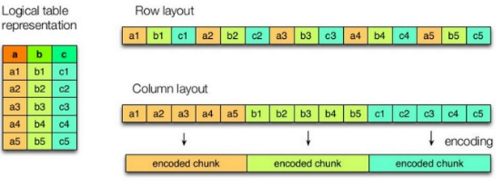

上图左边为逻辑表,右边第一个为行式存储,第二个为列式存储。

行存储的特点： 查询满足条件的一整行数据的时候,列存储则需要去每个聚集的字段找到对应的每个列的值,行存储只需要找到其中一个值,其余的值都在相邻地方,所以此时行存储查询的速度更快。

列存储的特点： 因为每个字段的数据聚集存储,在查询只需要少数几个字段的时候,能大大减少读取的数据量；每个字段的数据类型一定是相同的,列式存储可以针对性的设计更好的设计压缩算法。

`TEXTFILE和SEQUENCEFILE的存储格式都是基于行存储的；`

`ORC和PARQUET是基于列式存储的。`

### 8.2 常用数据存储格式

`TEXTFILE格式`

默认格式,数据不做压缩,磁盘开销大,数据解析开销大。可结合Gzip、Bzip2使用.

`ORC格式`

Orc (Optimized Row Columnar)是hive 0.11版里引入的新的存储格式。

可以看到每个Orc文件由1个或多个stripe组成,每个stripe250MB大小,每个Stripe里有三部分组成,分别是Index Data,Row Data,Stripe Footer：

indexData：某些列的索引数据
rowData :真正的数据存储
StripFooter：stripe的元数据信息

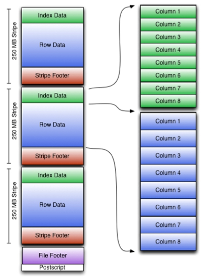

`PARQUET格式`

Parquet是面向分析型业务的列式存储格式,由Twitter和Cloudera合作开发,

Parquet文件是以二进制方式存储的,所以是不可以直接读取的,文件中包括该文件的数据和元数据,因此Parquet格式文件是自解析的。

通常情况下,在存储Parquet数据的时候会按照Block大小设置行组的大小,由于一般情况下每一个Mapper任务处理数据的最小单位是一个Block,这样可以把每一个行组由一个Mapper任务处理,增大任务执行并行度。Parquet文件的格式如下图所示。

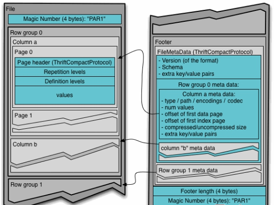

## 9. 文件存储格式与数据压缩结合

### 9.1 压缩比和查询速度对比

`1）TextFile`

（1）创建表,存储数据格式为TEXTFILE

```sql
create table log_text (
track_time string,
url string,
session_id string,
referer string,
ip string,
end_user_id string,
city_id string
)
ROW FORMAT DELIMITED FIELDS TERMINATED BY '\t'
STORED AS TEXTFILE ;
```

（2）向表中加载数据

```sql
load data local inpath '/export/servers/hivedatas/log.data' into table log_text ;
```

（3）查看表中数据大小

```sql
dfs -du -h /user/hive/warehouse/myhive.db/log_text;
```

`2）ORC`

（1）创建表,存储数据格式为ORC

```sql
create table log_orc(
track_time string,
url string,
session_id string,
referer string,
ip string,
end_user_id string,
city_id string
)
ROW FORMAT DELIMITED FIELDS TERMINATED BY '\t'
STORED AS orc ;
```

（2）向表中加载数据

```sql
insert into table log_orc select * from log_text ;
```

（3）查看表中数据大小

```sql
dfs -du -h /user/hive/warehouse/myhive.db/log_orc;
```

`3）Parquet`

（1）创建表,存储数据格式为parquet

```sql
create table log_parquet(
track_time string,
url string,
session_id string,
referer string,
ip string,
end_user_id string,
city_id string
)
ROW FORMAT DELIMITED FIELDS TERMINATED BY '\t'
STORED AS PARQUET ;
```

（2）向表中加载数据

```sql
insert into table log_parquet select * from log_text ;
```

（3）查看表中数据大小

```sql
dfs -du -h /user/hive/warehouse/myhive.db/log_parquet;
```

存储文件的压缩比总结：

ORC >  Parquet >  textFile

`4)存储文件的查询速度测试：`

1）TextFile
hive (default)> select count(*) from log_text;
Time taken: 21.54 seconds, Fetched: 1 row(s)
2）ORC
hive (default)> select count(*) from log_orc;
Time taken: 20.867 seconds, Fetched: 1 row(s)
3）Parquet
hive (default)> select count(*) from log_parquet;
Time taken: 22.922 seconds, Fetched: 1 row(s)
存储文件的查询速度总结：
ORC > TextFile > Parquet

### 9.2 ORC存储指定压缩方式

官网：<https://cwiki.apache.org/confluence/display/Hive/LanguageManual+ORC>

ORC存储方式的压缩：

| Key                      | Default    | Notes                                                        |
| ------------------------ | ---------- | ------------------------------------------------------------ |
| orc.compress             | `ZLIB`     | high level compression (one of NONE, ZLIB, SNAPPY)           |
| orc.compress.size        | 262,144    | number of bytes in each compression chunk                    |
| orc.stripe.size          | 67,108,864 | number of bytes in each stripe                               |
| orc.row.index.stride     | 10,000     | number of rows between index entries (must be >= 1000)       |
| orc.create.index         | true       | whether to create row indexes                                |
| orc.bloom.filter.columns | ""         | comma separated list of column names for which bloom filter should be created |
| orc.bloom.filter.fpp     | 0.05       | false positive probability for bloom filter (must >0.0 and <1.0) |

`1）创建一个非压缩的的ORC存储方式`

（1）建表语句

```sql
create table log_orc_none(
track_time string,
url string,
session_id string,
referer string,
ip string,
end_user_id string,
city_id string
)
ROW FORMAT DELIMITED FIELDS TERMINATED BY '\t'
STORED AS orc tblproperties ("orc.compress"="NONE");
```

（2）插入数据

```sql
insert into table log_orc_none select * from log_text ;
```

（3）查看插入后数据

```sql
dfs -du -h /user/hive/warehouse/myhive.db/log_orc_none;
```

`2）创建一个SNAPPY压缩的ORC存储方式`

（1）建表语句

```sql
create table log_orc_snappy(
track_time string,
url string,
session_id string,
referer string,
ip string,
end_user_id string,
city_id string
)
ROW FORMAT DELIMITED FIELDS TERMINATED BY '\t'
STORED AS orc tblproperties ("orc.compress"="SNAPPY");
```

（2）插入数据

```sql
insert into table log_orc_snappy select * from log_text ;
```

（3）查看插入后数据

```sql
dfs -du -h /user/hive/warehouse/myhive.db/log_orc_snappy ;
```

### 9.3 存储方式和压缩总结

在实际的项目开发当中,hive表的数据存储格式一般选择：orc或parquet。压缩方式一般选择snappy。

## 10.hive调优

### 10.1 Fetch抓取

Hive中对某些情况的查询可以不必使用MapReduce计算。例如：SELECT * FROM score;在这种情况下,Hive可以简单地读取score对应的存储目录下的文件,然后输出查询结果到控制台。通过设置hive.fetch.task.conversion参数,可以控制查询语句是否走MapReduce.

案例实操：

1）把hive.fetch.task.conversion设置成none,然后执行查询语句,都会执行mapreduce程序。

```sql
set hive.fetch.task.conversion=none;

select * from score;
select s_score from score;
select s_score from score limit 3;
```

2）把hive.fetch.task.conversion设置成more,然后执行查询语句,如下查询方式都不会执行mapreduce程序。

```sql
set hive.fetch.task.conversion=more;

select * from score;
select s_score from score;
select s_score from score limit 3;
```

### 10.2 本地模式

大多数的Hadoop Job是需要Hadoop提供的完整的可扩展性来处理大数据集的。不过,有时Hive的输入数据量是非常小的。在这种情况下,为查询触发执行任务时消耗可能会比实际job的执行时间要多的多。对于大多数这种情况,Hive可以通过本地模式在单台机器上处理所有的任务。对于小数据集,执行时间可以明显被缩短。

用户可以通过设置hive.exec.mode.local.auto的值为true,来让Hive在适当的时候自动启动这个优化。

案例实操：

1）开启本地模式,并执行查询语句

```sql
set hive.exec.mode.local.auto=true;
select * from score cluster by s_id;
```

2）关闭本地模式,并执行查询语句

```sql
set hive.exec.mode.local.auto=false;
select * from score cluster by s_id;
```

### 10.3 MapJoin

如果不指定MapJoin或者不符合MapJoin的条件,那么Hive解析器会在Reduce阶段完成join,容易发生数据倾斜。可以用MapJoin把小表全部加载到内存在map端进行join,避免reducer处理。

1）开启MapJoin参数设置：

（1）设置自动选择Mapjoin

```sql
set hive.auto.convert.join = true;
```

（2）大表小表的阈值设置（默认25M以下认为是小表）：

```sql
set hive.mapjoin.smalltable.filesize=25123456;
```

### 10.4 Group By

 默认情况下,Map阶段同一Key数据分发给一个reduce,当一个key数据过大时就倾斜了。并不是所有的聚合操作都需要在Reduce端完成,很多聚合操作都可以先在Map端进行部分聚合,最后在Reduce端得出最终结果。

开启Map端聚合参数设置

（1）是否在Map端进行聚合,默认为True

```sql
set hive.map.aggr = true;
```

（2）在Map端进行聚合操作的条目数目

```sql
 set hive.groupby.mapaggr.checkinterval = 100000;
```

（3）有数据倾斜的时候进行负载均衡（默认是false）

```sql
  set hive.groupby.skewindata = true;
```

 当选项设定为 true,生成的查询计划会有两个MR Job。

第一个MR Job中,Map的输出结果会随机分布到Reduce中,每个Reduce做部分聚合操作,并输出结果,这样处理的结果是相同的Group By Key有可能被分发到不同的Reduce中,从而达到负载均衡的目的；

第二个MR Job再根据预处理的数据结果按照Group By Key分布到Reduce中（这个过程可以保证相同的Group By Key被分布到同一个Reduce中）,最后完成最终的聚合操作。

### 10.5 Count(distinct)

数据量小的时候无所谓,数据量大的情况下,由于COUNT DISTINCT操作需要用一个Reduce Task来完成,这一个Reduce需要处理的数据量太大,就会导致整个Job很难完成,一般COUNT DISTINCT使用先GROUP BY再COUNT的方式替换：

```sql
select count(distinct s_id) from score;
select count(s_id) from (select id from score group by s_id) a;
```

虽然会多用一个Job来完成,但在数据量大的情况下,这个绝对是值得的。

### 10.6 笛卡尔积

尽量避免笛卡尔积,即避免join的时候不加on条件,或者无效的on条件,Hive只能使用1个reducer来完成笛卡尔积。

### 10.7 动态分区调整

往hive分区表中插入数据时,hive提供了一个动态分区功能,其可以基于查询参数的位置去推断分区的名称,从而建立分区。使用Hive的动态分区,需要进行相应的配置。

Hive的动态分区是以第一个表的分区规则,来对应第二个表的分区规则,将第一个表的所有分区,全部拷贝到第二个表中来,第二个表在加载数据的时候,不需要指定分区了,直接用第一个表的分区即可

#### 10.7.1 开启动态分区参数设置

（1）开启动态分区功能（默认true,开启）

```sql
set hive.exec.dynamic.partition=true;
```

（2）设置为非严格模式（动态分区的模式,默认strict,表示必须指定至少一个分区为静态分区,nonstrict模式表示允许所有的分区字段都可以使用动态分区。）

```sql
set hive.exec.dynamic.partition.mode=nonstrict;
```

（3）在所有执行MR的节点上,最大一共可以创建多少个动态分区。

```sql
set  hive.exec.max.dynamic.partitions=1000;
```

（4）在每个执行MR的节点上,最大可以创建多少个动态分区。该参数需要根据实际的数据来设定。

```sql
set hive.exec.max.dynamic.partitions.pernode=100
```

（5）整个MR Job中,最大可以创建多少个HDFS文件。

​在linux系统当中,每个linux用户最多可以开启1024个进程,每一个进程最多可以打开2048个文件,即持有2048个文件句柄,下面这个值越大,就可以打开文件句柄越大

```sql
set hive.exec.max.created.files=100000;
```

（6）当有空分区生成时,是否抛出异常。一般不需要设置。

```sql
set hive.error.on.empty.partition=false;
```

#### 10.7.2 案例操作

需求：将ori中的数据按照时间(如：20111231234568),插入到目标表ori_partitioned的相应分区中。

（1）准备数据原表

```sql
create table ori_partitioned(id bigint, time bigint, uid string, keyword string, url_rank int, click_num int, click_url string)
PARTITIONED BY (p_time bigint)
row format delimited fields terminated by '\t';

load data local inpath '/export/servers/hivedatas/small_data' into  table ori_partitioned partition (p_time='20111230000010');

load data local inpath '/export/servers/hivedatas/small_data' into  table ori_partitioned partition (p_time='20111230000011');
```

（2）创建目标分区表

```sql
create table ori_partitioned_target(id bigint, time bigint, uid string, keyword string, url_rank int, click_num int, click_url string) PARTITIONED BY (p_time STRING) row format delimited fields terminated by '\t'
```

（3）向目标分区表加载数据

如果按照之前介绍的往指定一个分区中Insert数据,那么这个需求很不容易实现。这时候就需要使用动态分区来实现。

```sql
INSERT overwrite TABLE ori_partitioned_target PARTITION (p_time)
SELECT id, time, uid, keyword, url_rank, click_num, click_url, p_time
FROM ori_partitioned;
```

注意：在SELECT子句的最后几个字段,必须对应前面PARTITION (p_time)中指定的分区字段,包括顺序。

(4)查看分区

```sql
show partitions ori_partitioned_target;
```

### 10.8 并行执行

Hive会将一个查询转化成一个或者多个阶段。这样的阶段可以是MapReduce阶段、抽样阶段、合并阶段、limit阶段。或者Hive执行过程中可能需要的其他阶段。默认情况下,Hive一次只会执行一个阶段。不过,某个特定的job可能包含众多的阶段,而这些阶段可能并非完全互相依赖的,也就是说有些阶段是可以并行执行的,这样可能使得整个job的执行时间缩短。不过,如果有更多的阶段可以并行执行,那么job可能就越快完成。

通过设置参数hive.exec.parallel值为true,就可以开启并发执行。不过,在共享集群中,需要注意下,如果job中并行阶段增多,那么集群利用率就会增加。

```sql
set hive.exec.parallel = true;
```

当然,得是在系统资源比较空闲的时候才有优势,否则,没资源,并行也起不来。

### 10.9 严格模式

Hive提供了一个严格模式,可以防止用户执行那些可能意向不到的不好的影响的查询。

​通过设置属性hive.mapred.mode值为默认是非严格模式nonstrict 。开启严格模式需要修改hive.mapred.mode值为strict,开启严格模式可以禁止3种类型的查询。

```sql
set hive.mapred.mode = strict; #开启严格模式
set hive.mapred.mode = nostrict; #开启非严格模式
```

1）`对于分区表,在where语句中必须含有分区字段作为过滤条件来限制范围,否则不允许执行`。换句话说,就是用户不允许扫描所有分区。进行这个限制的原因是,通常分区表都拥有非常大的数据集,而且数据增加迅速。没有进行分区限制的查询可能会消耗令人不可接受的巨大资源来处理这个表。

2）`对于使用了order by语句的查询,要求必须使用limit语句`。因为order by为了执行排序过程会将所有的结果数据分发到同一个Reducer中进行处理,强制要求用户增加这个LIMIT语句可以防止Reducer额外执行很长一段时间。

3）`限制笛卡尔积的查询`。对关系型数据库非常了解的用户可能期望在执行JOIN查询的时候不使用ON语句而是使用where语句,这样关系数据库的执行优化器就可以高效地将WHERE语句转化成那个ON语句。不幸的是,Hive并不会执行这种优化,因此,如果表足够大,那么这个查询就会出现不可控的情况。

### 10.10 JVM重用

JVM重用是Hadoop调优参数的内容,其对Hive的性能具有非常大的影响,特别是对于很难避免小文件的场景或task特别多的场景,这类场景大多数执行时间都很短。

Hadoop的默认配置通常是使用派生JVM来执行map和Reduce任务的。这时JVM的启动过程可能会造成相当大的开销,尤其是执行的job包含有成百上千task任务的情况。JVM重用可以使得JVM实例在同一个job中重新使用N次。N的值可以在Hadoop的mapred-site.xml文件中进行配置。通常在10-20之间,具体多少需要根据具体业务场景测试得出。

我们也可以在hive当中通过

```sql
set  mapred.job.reuse.jvm.num.tasks=10;
```

这个设置来设置我们的jvm重用

这个功能的缺点是,开启JVM重用将一直占用使用到的task插槽,以便进行重用,直到任务完成后才能释放。如果某个“不平衡的”job中有某几个reduce task执行的时间要比其他Reduce task消耗的时间多的多的话,那么保留的插槽就会一直空闲着却无法被其他的job使用,直到所有的task都结束了才会释放。

### 10.11 推测执行

在分布式集群环境下,因为程序Bug（包括Hadoop本身的bug）,负载不均衡或者资源分布不均等原因,会造成同一个作业的多个任务之间运行速度不一致,有些任务的运行速度可能明显慢于其他任务（比如一个作业的某个任务进度只有50%,而其他所有任务已经运行完毕）,则这些任务会拖慢作业的整体执行进度。为了避免这种情况发生,Hadoop采用了推测执行（Speculative Execution）机制`,它根据一定的法则推测出“拖后腿”的任务,并为这样的任务启动一个备份任务,让该任务与原始任务同时处理同一份数据,并最终选用最先成功运行完成任务的计算结果作为最终结果。`

设置开启推测执行参数：

```sql
set mapred.map.tasks.speculative.execution=true
set mapred.reduce.tasks.speculative.execution=true
set hive.mapred.reduce.tasks.speculative.execution=true;
```

关于调优这些推测执行变量,还很难给一个具体的建议。如果用户对于运行时的偏差非常敏感的话,那么可以将这些功能关闭掉。如果用户因为输入数据量很大而需要执行长时间的map或者Reduce task的话,那么启动推测执行造成的浪费是非常巨大大。

### HIVE 增加日志记录

```shell
## https://blog.csdn.net/lsr40/article/details/79422718
[root@node03 conf]# cp hive-log4j2.properties.template hive-log4j2.properties

```

## 操作记录

192.168.34.120-08月-15日-14时22.log

```shell
[root@node03 conf]# mysql -u root -p123456
mysql> show databases;
+--------------------+
| Database           |
+--------------------+
| information_schema |
| hive               |
| mysql              |
| performance_schema |
| sys                |
+--------------------+
5 rows in set (0.00 sec)
## 切换到hive 数据库
mysql> use hive;
Reading table information for completion of table and column names
You can turn off this feature to get a quicker startup with -A

Database changed
#显示当前数据库的编码格式
mysql> show variables like '%char%';
+--------------------------+-----------------------------+
| Variable_name            | Value                       |
+--------------------------+-----------------------------+
| character_set_client     | utf8                        |
| character_set_connection | utf8                        |
| character_set_database   | utf8                        |
| character_set_filesystem | binary                      |
| character_set_results    | utf8                        |
| character_set_server     | utf8                        |
| character_set_system     | utf8                        |
| character_sets_dir       | /home/mysql/share/charsets/ |
+--------------------------+-----------------------------+
8 rows in set (0.00 sec)
##
mysql> show tables;
+---------------------------+
| Tables_in_hive            |
+---------------------------+
| BUCKETING_COLS            |
| CDS                       |
| COLUMNS_V2                |
| COMPLETED_TXN_COMPONENTS  |
| DATABASE_PARAMS           |
| DBS                       |
| DB_PRIVS                  |
| FUNCS                     |
| FUNC_RU                   |
| GLOBAL_PRIVS              |
| IDXS                      |
| INDEX_PARAMS              |
| KEY_CONSTRAINTS           |
| NUCLEUS_TABLES            |
| PARTITIONS                |
| PARTITION_EVENTS          |
| PARTITION_KEYS            |
| PARTITION_KEY_VALS        |
| PARTITION_PARAMS          |
| PART_COL_PRIVS            |
| PART_COL_STATS            |
| PART_PRIVS                |
| ROLES                     |
| ROLE_MAP                  |
| SDS                       |
| SD_PARAMS                 |
| SEQUENCE_TABLE            |
| SERDES                    |
| SERDE_PARAMS              |
| SKEWED_COL_NAMES          |
| SKEWED_COL_VALUE_LOC_MAP  |
| SKEWED_STRING_LIST        |
| SKEWED_STRING_LIST_VALUES |
| SKEWED_VALUES             |
| SORT_COLS                 |
| TABLE_PARAMS              |
| TAB_COL_STATS             |
| TBLS                      |
| TBL_COL_PRIVS             |
| TBL_PRIVS                 |
| VERSION                   |
+---------------------------+
41 rows in set (0.00 sec)
mysql> show create table TBLS;
## 查询可以看出使用的编码是UTF-8
| Table | Create Table
| TBLS  | CREATE TABLE `TBLS` (
  `TBL_ID` bigint(20) NOT NULL,
  `CREATE_TIME` int(11) NOT NULL,
  `DB_ID` bigint(20) DEFAULT NULL,
  `LAST_ACCESS_TIME` int(11) NOT NULL,
  `OWNER` varchar(767) CHARACTER SET utf8 COLLATE utf8_bin DEFAULT NULL,
  `RETENTION` int(11) NOT NULL,
  `SD_ID` bigint(20) DEFAULT NULL,
  `TBL_NAME` varchar(128) CHARACTER SET utf8 COLLATE utf8_bin DEFAULT NULL,
  `TBL_TYPE` varchar(128) CHARACTER SET utf8 COLLATE utf8_bin DEFAULT NULL,
  `VIEW_EXPANDED_TEXT` text,
  `VIEW_ORIGINAL_TEXT` text,
  PRIMARY KEY (`TBL_ID`),
  UNIQUE KEY `UNIQUETABLE` (`TBL_NAME`,`DB_ID`),
  KEY `TBLS_N50` (`SD_ID`),
  KEY `TBLS_N49` (`DB_ID`),
  CONSTRAINT `TBLS_FK1` FOREIGN KEY (`DB_ID`) REFERENCES `DBS` (`DB_ID`),
  CONSTRAINT `TBLS_FK2` FOREIGN KEY (`SD_ID`) REFERENCES `SDS` (`SD_ID`)
) ENGINE=InnoDB DEFAULT CHARSET=utf8 |
1 row in set (0.00 sec)
## 查询本机有的数据库
mysql> show databases;
+--------------------+
| Database           |
+--------------------+
| information_schema |
| hive               |
| mysql              |
| performance_schema |
| sys                |
+--------------------+
5 rows in set (0.00 sec)
## 改变数据库编码
mysql> alter database hive character set latin1;
Query OK, 1 row affected (0.00 sec)

mysql> show create database hive;
+----------+-----------------------------------------------------------------+
| Database | Create Database                                                 |
+----------+-----------------------------------------------------------------+
| hive     | CREATE DATABASE `hive` /*!40100 DEFAULT CHARACTER SET latin1 */ |
+----------+-----------------------------------------------------------------+
1 row in set (0.00 sec)
## 查询数据库编码是否改过来
mysql> show variables like '%char%';
+--------------------------+-----------------------------+
| Variable_name            | Value                       |
+--------------------------+-----------------------------+
| character_set_client     | utf8                        |
| character_set_connection | utf8                        |
| character_set_database   | latin1                      |
| character_set_filesystem | binary                      |
| character_set_results    | utf8                        |
| character_set_server     | utf8                        |
| character_set_system     | utf8                        |
| character_sets_dir       | /home/mysql/share/charsets/ |
+--------------------------+-----------------------------+
8 rows in set (0.01 sec)
## 删除hive 数据库
mysql> drop database hive;
Query OK, 41 rows affected (0.10 sec)
mysql> show databases;
+--------------------+
| Database           |
+--------------------+
| information_schema |
| metastore          |
| mysql              |
| performance_schema |
| sys                |
+--------------------+
5 rows in set (0.00 sec)

mysql> create database hive character set latin1;
Query OK, 1 row affected (0.00 sec)


```

120

```shell
Last login: Thu Aug  8 15:11:29 2019 from 192.168.34.21
[root@node03 ~]# cd /export/softwares/
[root@node03 softwares]# rz -E
## 上传hive 安装包
[root@node03 softwares]# tar -zxvf apache-hive-2.1.1-bin.tar.gz -C /export/servers/
[root@node03 servers]# cd /export/servers/apache-hive-2.1.1-bin/conf/

[root@node03 conf]# cp hive-env.sh.template hive-env.sh
[root@node03 conf]# vim hive-env.sh
HADOOP_HOME=/export/servers/hadoop-2.7.5
export HIVE_CONF_DIR=/export/servers/apache-hive-2.1.1-bin/conf
[root@node03 conf]# cd /export/servers/apache-hive-2.1.1-bin/conf/

[root@node03 conf]# vim hive-site.xml
<?xml version="1.0" encoding="UTF-8" standalone="no"?>
<?xml-stylesheet type="text/xsl" href="configuration.xsl"?>
<configuration>
<property>
      <name>javax.jdo.option.ConnectionUserName</name>
      <value>root</value>
  </property>
  <property>
      <name>javax.jdo.option.ConnectionPassword</name>
      <value>123456</value>
  </property>
  <property>
      <name>javax.jdo.option.ConnectionURL</name>
      <value>jdbc:mysql://node03:3306/hive?createDatabaseIfNotExist=true&amp;useSSL=false</value>
  </property>
  <property>
      <name>javax.jdo.option.ConnectionDriverName</name>
      <value>com.mysql.jdbc.Driver</value>
  </property>
  <property>
      <name>hive.metastore.schema.verification</name>
      <value>false</value>
  </property>
  <property>
    <name>datanucleus.schema.autoCreateAll</name>
    <value>true</value>
 </property>
 <property>
    <name>hive.server2.thrift.bind.host</name>
    <value>node03</value>
   </property>
</configuration>
## 上传mysql 驱动包
[root@node03 lib]# cd /export/servers/apache-hive-2.1.1-bin/lib

[root@node03 lib]# sudo vim /etc/profile
export HIVE_HOME=/export/servers/apache-hive-2.1.1-bin
export PATH=:$HIVE_HOME/bin:$PATH
[root@node03 lib]# source /etc/profile
[root@node03 lib]# cd /export/servers/apache-hive-2.1.1-bin/
## 启动hive
[root@node03 apache-hive-2.1.1-bin]# bin/hive
which: no hbase in (:/export/servers/apache-hive-2.1.1-bin/bin::/export/servers/hadoop-2.7.5/bin:/export/servers/hadoop-2.7.5/sbin:::/export/servers/hadoop-2.7.5/bin:/export/servers/hadoop-2.7.5/sbin::/usr/local/sbin:/usr/local/bin:/usr/sbin:/usr/bin:/export/servers/jdk1.8.0_141/bin:/root/bin:/export/servers/jdk1.8.0_141/bin)
SLF4J: Class path contains multiple SLF4J bindings.
SLF4J: Found binding in [jar:file:/export/servers/apache-hive-2.1.1-bin/lib/log4j-slf4j-impl-2.4.1.jar!/org/slf4j/impl/StaticLoggerBinder.class]
SLF4J: Found binding in [jar:file:/export/servers/hadoop-2.7.5/share/hadoop/common/lib/slf4j-log4j12-1.7.10.jar!/org/slf4j/impl/StaticLoggerBinder.class]
SLF4J: See http://www.slf4j.org/codes.html#multiple_bindings for an explanation.
SLF4J: Actual binding is of type [org.apache.logging.slf4j.Log4jLoggerFactory]

Logging initialized using configuration in jar:file:/export/servers/apache-hive-2.1.1-bin/lib/hive-common-2.1.1.jar!/hive-log4j2.properties Async: true
Hive-on-MR is deprecated in Hive 2 and may not be available in the future versions. Consider using a different execution engine
## 创建一个库
hive> create database if not exists mytest;
OK
Time taken: 0.943 seconds
hive> exit
    > ;
## 建库的第二种方式
[root@node03 apache-hive-2.1.1-bin]# bin/hive -e "create database if not exists mytest2;"
hive-log4j2.properties Async: true
OK
Time taken: 1.294 seconds
[root@node03 apache-hive-2.1.1-bin]# cd /export/servers/
## 建库添加数据的第三种方法
[root@node03 servers]# vim hive.sql
[root@node03 servers]# cat hive.sql
create database if not exists mytestsql;
use mytestsql;
create table stu(id int,name string);
# 执行建库
[root@node03 servers]# cd /export/servers/apache-hive-2.1.1-bin/
[root@node03 apache-hive-2.1.1-bin]# bin/hive -f /export/servers/hive.sql
hive-log4j2.properties Async: true
OK
Time taken: 1.523 seconds
OK
Time taken: 0.032 seconds
OK
Time taken: 0.772 seconds
[root@node03 apache-hive-2.1.1-bin]# bin/hive
## 创建一个库
hive> create database if not exists myhive;
OK
Time taken: 1.005 seconds
## 显示所有的库
hive> show databases;
OK
default
myhive
mytest
mytest2
mytestsql
Time taken: 0.256 seconds, Fetched: 5 row(s)
# 切换到myhive 库中
hive> use myhive;
OK
Time taken: 0.024 seconds
# 创建一个myhive2库并指定路径，路径是在HDFS上的
hive> create database myhive2 location '/myhive2';
OK
Time taken: 0.166 seconds
##数据库可以有一些描述性的键值对信息,在创建时添加：
hive> create database foo with dbproperties ('owner'='xhchen','date'='20190815');
OK
Time taken: 0.089 seconds
hive> describe database extended foo;
OK
foo             hdfs://node01:8020/user/hive/warehouse/foo.db   root    USER    {date=20190815, owner=xhchen}
Time taken: 0.215 seconds, Fetched: 1 row(s)
## 修自以为是信息
hive> alter database foo set dbproperties('owner'='xhchen2');
OK
Time taken: 0.047 seconds
##
hive> describe database extended foo;
OK
foo             hdfs://node01:8020/user/hive/warehouse/foo.db   root    USER    {date=20190815, owner=xhchen2}
Time taken: 0.045 seconds, Fetched: 1 row(s)
hive> desc database extended myhive2;
OK
myhive2         hdfs://node01:8020/myhive2      root    USER
Time taken: 0.057 seconds, Fetched: 1 row(s)
## 删除指定的库 报错，解决方法看上面记录
hive> drop database myhive2;
Moved: 'hdfs://node01:8020/myhive2' to trash at: hdfs://node01:8020/user/root/.Trash/Current
FAILED: Execution Error, return code 1 from org.apache.hadoop.hive.ql.exec.DDLTask. MetaException(message:Unable to clean up com.mysql.jdbc.exceptions.jdbc4.MySQLSyntaxErrorException: Table 'hive.TXN_COMPONENTS' doesn't exist'
hive> show databases;
OK
default
foo
myhive
mytest
mytest2
mytestsql
Time taken: 0.035 seconds, Fetched: 6 row(s)
hive> drop database myhive cascade;
Moved: 'hdfs://node01:8020/user/hive/warehouse/myhive.db' to trash at: hdfs://node01:8020/user/root/.Trash/Current
FAILED: Execution Error, return code 1 from org.apache.hadoop.hive.ql.exec.DDLTask. MetaException(message:Unable to clean up com.mysql.jdbc.exceptions.jdbc4.MySQLSyntaxErrorException: Table 'hive.TXN_COMPONENTS' doesn't exist'
# 显示所有库，看库是否删除
hive> show databases;
OK
default
foo
mytest
mytest2
mytestsql
Time taken: 0.021 seconds, Fetched: 5 row(s)
##建库
hive> create database if not exists myhive;
OK
Time taken: 0.047 seconds
hive> use myhive;
OK
Time taken: 0.047 seconds
hive> create table stu(id int,name string);
OK
Time taken: 0.274 seconds
## 插入一条数据
hive> insert into stu values (1,"zhangsan");

hive> select * from stu;
OK
1       zhangsan
Time taken: 0.136 seconds, Fetched: 1 row(s)
## 指定分割符
hive> create  table if not exists stu2(id int ,name string) row format delimited fields terminated by '\t';
OK
Time taken: 0.164 seconds
## 指定分割符与路径
hive> create  table if not exists stu2(id int ,name string) row format delimited fields terminated by '\t' location '/user/stu2';
OK
Time taken: 0.043 seconds
#
hive> create table stu3 as select * from stu2;
#
hive> create  table if not exists stu2(id int ,name string) row format delimited fields terminated by '\t' location '/user/stu2';hive> insert into stu2 values (1,"zhangsan");
#
hive> create table stu4 like stu;
OK
Time taken: 0.104 seconds
hive> desc formatted stu;
OK
# col_name              data_type               comment

id                      int
name                    string

# Detailed Table Information
Database:               myhive
Owner:                  root
CreateTime:             Thu Aug 15 15:03:48 CST 2019
LastAccessTime:         UNKNOWN
Retention:              0
Location:               hdfs://node01:8020/user/hive/warehouse/myhive.db/stu
Table Type:             MANAGED_TABLE
Table Parameters:
        COLUMN_STATS_ACCURATE   {\"BASIC_STATS\":\"true\"}
        numFiles                1
        numRows                 1
        rawDataSize             10
        totalSize               11
        transient_lastDdlTime   1565852644

# Storage Information
SerDe Library:          org.apache.hadoop.hive.serde2.lazy.LazySimpleSerDe
InputFormat:            org.apache.hadoop.mapred.TextInputFormat
OutputFormat:           org.apache.hadoop.hive.ql.io.HiveIgnoreKeyTextOutputFormat
Compressed:             No
Num Buckets:            -1
Bucket Columns:         []
Sort Columns:           []
Storage Desc Params:
        serialization.format    1
Time taken: 1.278 seconds, Fetched: 31 row(s)

hive> desc formatted stu4;
OK
# col_name              data_type               comment

id                      int
name                    string

# Detailed Table Information
Database:               myhive
Owner:                  root
CreateTime:             Thu Aug 15 15:12:38 CST 2019
LastAccessTime:         UNKNOWN
Retention:              0
Location:               hdfs://node01:8020/user/hive/warehouse/myhive.db/stu4
Table Type:             MANAGED_TABLE
Table Parameters:
        COLUMN_STATS_ACCURATE   {\"BASIC_STATS\":\"true\"}
        numFiles                0
        numRows                 0
        rawDataSize             0
        totalSize               0
        transient_lastDdlTime   1565853158

# Storage Information
SerDe Library:          org.apache.hadoop.hive.serde2.lazy.LazySimpleSerDe
InputFormat:            org.apache.hadoop.mapred.TextInputFormat
OutputFormat:           org.apache.hadoop.hive.ql.io.HiveIgnoreKeyTextOutputFormat
Compressed:             No
Num Buckets:            -1
Bucket Columns:         []
Sort Columns:           []
Storage Desc Params:
        serialization.format    1
Time taken: 0.07 seconds, Fetched: 31 row(s)
hive> drop dable stu4;
NoViableAltException(26@[772:1: ddlStatement : ( createDatabaseStatement | switchDatabaseStatement | dropDatabaseStatement | createTableStatement | dropTableStatement | truncateTableStatement | alterStatement | descStatement | showStatement | metastoreCheck | createViewStatement | dropViewStatement | createFunctionStatement | createMacroStatement | createIndexStatement | dropIndexStatement | dropFunctionStatement | reloadFunctionStatement | dropMacroStatement | analyzeStatement | lockStatement | unlockStatement | lockDatabase | unlockDatabase | createRoleStatement | dropRoleStatement | ( grantPrivileges )=> grantPrivileges | ( revokePrivileges )=> revokePrivileges | showGrants | showRoleGrants | showRolePrincipals | showRoles | grantRole | revokeRole | setRole | showCurrentRole | abortTransactionStatement );])
        at org.antlr.runtime.DFA.noViableAlt(DFA.java:158)
        at org.antlr.runtime.DFA.predict(DFA.java:144)
        at org.apache.hadoop.hive.ql.parse.HiveParser.ddlStatement(HiveParser.java:2709)
        at org.apache.hadoop.hive.ql.parse.HiveParser.execStatement(HiveParser.java:1756)
        at org.apache.hadoop.hive.ql.parse.HiveParser.statement(HiveParser.java:1178)
        at org.apache.hadoop.hive.ql.parse.ParseDriver.parse(ParseDriver.java:204)
        at org.apache.hadoop.hive.ql.parse.ParseDriver.parse(ParseDriver.java:166)
        at org.apache.hadoop.hive.ql.Driver.compile(Driver.java:444)
        at org.apache.hadoop.hive.ql.Driver.compileInternal(Driver.java:1242)
        at org.apache.hadoop.hive.ql.Driver.runInternal(Driver.java:1384)
        at org.apache.hadoop.hive.ql.Driver.run(Driver.java:1171)
        at org.apache.hadoop.hive.ql.Driver.run(Driver.java:1161)
        at org.apache.hadoop.hive.cli.CliDriver.processLocalCmd(CliDriver.java:232)
        at org.apache.hadoop.hive.cli.CliDriver.processCmd(CliDriver.java:183)
        at org.apache.hadoop.hive.cli.CliDriver.processLine(CliDriver.java:399)
        at org.apache.hadoop.hive.cli.CliDriver.executeDriver(CliDriver.java:776)
        at org.apache.hadoop.hive.cli.CliDriver.run(CliDriver.java:714)
        at org.apache.hadoop.hive.cli.CliDriver.main(CliDriver.java:641)
        at sun.reflect.NativeMethodAccessorImpl.invoke0(Native Method)
        at sun.reflect.NativeMethodAccessorImpl.invoke(NativeMethodAccessorImpl.java:62)
        at sun.reflect.DelegatingMethodAccessorImpl.invoke(DelegatingMethodAccessorImpl.java:43)
        at java.lang.reflect.Method.invoke(Method.java:498)
        at org.apache.hadoop.util.RunJar.run(RunJar.java:221)
        at org.apache.hadoop.util.RunJar.main(RunJar.java:136)
FAILED: ParseException line 1:5 cannot recognize input near 'drop' 'dable' 'stu4' in ddl statement
hive> exit
    > ;
[root@node03 apache-hive-2.1.1-bin]# pwd
/export/servers/apache-hive-2.1.1-bin
[root@node03 apache-hive-2.1.1-bin]# cd /export/servers/apache-hive-2.1.1-bin
## 前台执行
[root@node03 apache-hive-2.1.1-bin]# bin/hive --service hiveserver2
## 后台执行
[root@node03 apache-hive-2.1.1-bin]# nohup bin/hive --service hiveserver2  > /dev/null 2>&1 &
[1] 124776
# 查询进程看是否运行
[root@node03 apache-hive-2.1.1-bin]# ps -ef |grep hive
root     124776 121445 33 15:27 pts/1    00:00:09 /export/servers/jdk1.8.0_141/bin/java -Xmx256m -Djava.net.preferIPv4Stack=true -Dhadoop.log.dir=/export/servers/hadoop-2.7.5/logs -Dhadoop.log.file=hadoop.log -Dhadoop.home.dir=/export/servers/hadoop-2.7.5 -Dhadoop.id.str=root -Dhadoop.root.logger=INFO,console -Djava.library.path=/export/servers/hadoop-2.7.5/lib/native -Dhadoop.policy.file=hadoop-policy.xml -Djava.net.preferIPv4Stack=true -Xmx512m -Dlog4j.configurationFile=hive-log4j2.properties -Djava.util.logging.config.file=/export/servers/apache-hive-2.1.1-bin/conf/parquet-logging.properties -Dhadoop.security.logger=INFO,NullAppender org.apache.hadoop.util.RunJar /export/servers/apache-hive-2.1.1-bin/lib/hive-service-2.1.1.jar org.apache.hive.service.server.HiveServer2
root     124885 121445  0 15:27 pts/1    00:00:00 grep --color=auto hive
## 启动heeline
[root@node03 apache-hive-2.1.1-bin]# bin/beeline
which: no hbase in (:/export/servers/apache-hive-2.1.1-bin/bin::/export/servers/hadoop-2.7.5/bin:/export/servers/hadoop-2.7.5/sbin:::/export/servers/hadoop-2.7.5/bin:/export/servers/hadoop-2.7.5/sbin::/usr/local/sbin:/usr/local/bin:/usr/sbin:/usr/bin:/export/servers/jdk1.8.0_141/bin:/root/bin:/export/servers/jdk1.8.0_141/bin)
Beeline version 2.1.1 by Apache Hive
## 输入联接
beeline> !connect jdbc:hive2://node03:10000
SLF4J: Class path contains multiple SLF4J bindings.
SLF4J: Found binding in [jar:file:/export/servers/apache-hive-2.1.1-bin/lib/log4j-slf4j-impl-2.4.1.jar!/org/slf4j/impl/StaticLoggerBinder.class]
SLF4J: Found binding in [jar:file:/export/servers/hadoop-2.7.5/share/hadoop/common/lib/slf4j-log4j12-1.7.10.jar!/org/slf4j/impl/StaticLoggerBinder.class]
SLF4J: See http://www.slf4j.org/codes.html#multiple_bindings for an explanation.
SLF4J: Actual binding is of type [org.apache.logging.slf4j.Log4jLoggerFactory]
Connecting to jdbc:hive2://node03:10000
## 输入用户名root
Enter username for jdbc:hive2://node03:10000: root
## 输入密码，任意字符
Enter password for jdbc:hive2://node03:10000:
Connected to: Apache Hive (version 2.1.1)
Driver: Hive JDBC (version 2.1.1)
19/08/15 15:29:30 [main]: WARN jdbc.HiveConnection: Request to set autoCommit to false; Hive does not support autoCommit=false.
Transaction isolation: TRANSACTION_REPEATABLE_READ
## 查询所有数据库
0: jdbc:hive2://node03:10000> show databases;
+----------------+--+
| database_name  |
+----------------+--+
| default        |
| foo            |
| myhive         |
| mytest         |
| mytest2        |
| mytestsql      |
+----------------+--+
6 rows selected (1.591 seconds)
# 删库测试，还是报错
0: jdbc:hive2://node03:10000> drop database mmytestsql;
Error: Error while compiling statement: FAILED: SemanticException [Error 10072]: Database does not exist: mmytestsql (state=42000,code=10072)
0: jdbc:hive2://node03:10000> drop database mytestsql;
Error: Error while processing statement: FAILED: Execution Error, return code 1 from org.apache.hadoop.hive.ql.exec.DDLTask. MetaException(message:Unable to clean up com.mysql.jdbc.exceptions.jdbc4.MySQLSyntaxErrorException: Table 'hive.TXN_COMPONENTS' doesn't exist'）

[root@node03 apache-hive-2.1.1-bin]# cd /export/servers/apache-hive-2.1.1-bin/bin

# 执行初始化命令
[root@node03 bin]# ./schematool  -dbType mysql -initSchema
which: no hbase in (:/export/servers/apache-hive-2.1.1-bin/bin::/export/servers/hadoop-2.7.5/bin:/export/servers/hadoop-2.7.5/sbin:::/export/servers/hadoop-2.7.5/bin:/export/servers/hadoop-2.7.5/sbin::/usr/local/sbin:/usr/local/bin:/usr/sbin:/usr/bin:/export/servers/jdk1.8.0_141/bin:/root/bin:/export/servers/jdk1.8.0_141/bin)
SLF4J: Class path contains multiple SLF4J bindings.
SLF4J: Found binding in [jar:file:/export/servers/apache-hive-2.1.1-bin/lib/log4j-slf4j-impl-2.4.1.jar!/org/slf4j/impl/StaticLoggerBinder.class]
SLF4J: Found binding in [jar:file:/export/servers/hadoop-2.7.5/share/hadoop/common/lib/slf4j-log4j12-1.7.10.jar!/org/slf4j/impl/StaticLoggerBinder.class]
SLF4J: See http://www.slf4j.org/codes.html#multiple_bindings for an explanation.
SLF4J: Actual binding is of type [org.apache.logging.slf4j.Log4jLoggerFactory]
Metastore connection URL:        jdbc:mysql://node03:3306/hive?createDatabaseIfNotExist=true&useSSL=false
Metastore Connection Driver :    com.mysql.jdbc.Driver
Metastore connection User:       root
Starting metastore schema initialization to 2.1.0
Initialization script hive-schema-2.1.0.mysql.sql
## 这里报错，无法初始化，后查询原因。是因数据库编码不对， 删除原有的hive 数据库重启建库，重新初始化
Error: Specified key was too long; max key length is 3072 bytes (state=42000,code=1071)
org.apache.hadoop.hive.metastore.HiveMetaException: Schema initialization FAILED! Metastore state would be inconsistent !!
Underlying cause: java.io.IOException : Schema script failed, errorcode 2
Use --verbose for detailed stacktrace.
*** schemaTool failed ***

# 先进入mysql 数据库，然后
[root@node03 conf]# mysql -u root -p123456
 create database hive character set latin1;
Query OK, 1 row affected (0.00 sec)


[root@node03 conf]# cd  /export/servers/apache-hive-2.1.1-bin/bin/
##重启初始化数据库
[root@node03 bin]# schematool -initSchema -dbType mysql
which: no hbase in (:/export/servers/apache-hive-2.1.1-bin/bin::/export/servers/hadoop-2.7.5/bin:/export/servers/hadoop-2.7.5/sbin:::/export/servers/hadoop-2.7.5/bin:/export/servers/hadoop-2.7.5/sbin::/usr/local/sbin:/usr/local/bin:/usr/sbin:/usr/bin:/export/servers/jdk1.8.0_141/bin:/root/bin:/export/servers/jdk1.8.0_141/bin)
SLF4J: Class path contains multiple SLF4J bindings.
SLF4J: Found binding in [jar:file:/export/servers/apache-hive-2.1.1-bin/lib/log4j-slf4j-impl-2.4.1.jar!/org/slf4j/impl/StaticLoggerBinder.class]
SLF4J: Found binding in [jar:file:/export/servers/hadoop-2.7.5/share/hadoop/common/lib/slf4j-log4j12-1.7.10.jar!/org/slf4j/impl/StaticLoggerBinder.class]
SLF4J: See http://www.slf4j.org/codes.html#multiple_bindings for an explanation.
SLF4J: Actual binding is of type [org.apache.logging.slf4j.Log4jLoggerFactory]
Metastore connection URL:        jdbc:mysql://node03:3306/hive?createDatabaseIfNotExist=true&useSSL=false
Metastore Connection Driver :    com.mysql.jdbc.Driver
Metastore connection User:       root
Starting metastore schema initialization to 2.1.0
Initialization script hive-schema-2.1.0.mysql.sql
Initialization script completed
schemaTool completed
## 测试删除库是否报错
[root@node03 bin]# beeline

0: jdbc:hive2://node03:10000> create database if not exists myhive2;
No rows affected (0.122 seconds)
0: jdbc:hive2://node03:10000> show databases;
+----------------+--+
| database_name  |
+----------------+--+
| myhive         |
| myhive2        |
+----------------+--+
2 rows selected (0.07 seconds)
## 删除库不报错，问题解决
0: jdbc:hive2://node03:10000> drop database myhive2;
No rows affected (0.115 seconds)
0: jdbc:hive2://node03:10000> show databases;
+----------------+--+
| database_name  |
+----------------+--+
| myhive         |
+----------------+--+
## 测试自带的删除命令
[root@node03 bin]# ./hive

hive> show databases;
OK
default
myhive
myhive3
Time taken: 0.021 seconds, Fetched: 3 row(s)
### 删除成功不报错
hive> drop database myhive3;
Moved: 'hdfs://node01:8020/user/hive/warehouse/myhive3.db' to trash at: hdfs://node01:8020/user/root/.Trash/Current
OK
Time taken: 0.365 seconds

```

### 使用beeline工具连接Hive

#### 第一步:修改hadoop的hdfs-site.xml文件

 在该文件中添加以下内容,开启HDFS的REST接口功能:

```shell
[root@node01 hadoop]# cd /export/servers/hadoop-2.7.5/etc/hadoop
[root@node01 hadoop]# vim hdfs-site.xml
```

```xml
<property>
    <name>dfs.webhdfs.enabled</name>
    <value>true</value>
</property>
```

#### 第二步:修改hadoop的core-site.xml文件

在文件中添加以下内容,设置代理用户:

```shell
[root@node01 hadoop]# cd /export/servers/hadoop-2.7.5/etc/hadoop
[root@node01 hadoop]# vim core-site.xml
```

```xml
<property>
    <name>hadoop.proxyuser.root.hosts</name>
    <value>*</value>
</property>
<property>
    <name>hadoop.proxyuser.root.groups</name>
    <value>*</value>
</property>
```

#### 第三步:重启Hadoop集群

```shell
[root@node01 hadoop]# scp hdfs-site.xml node02:$PWD
hdfs-site.xml                                                                                  100% 2487     2.4KB/s   00:00
[root@node01 hadoop]# scp hdfs-site.xml node03:$PWD
hdfs-site.xml                                                                                  100% 2487     2.4KB/s   00:00
[root@node01 hadoop]# scp core-site.xml node02:$PWD
core-site.xml                                                                                  100% 1590     1.6KB/s   00:00
[root@node01 hadoop]# scp core-site.xml node03:$PWD
core-site.xml  
[root@node01 hadoop-2.7.5]# cd /export/servers/hadoop-2.7.5/
[root@node01 hadoop-2.7.5]# sbin/stop-dfs.sh
Stopping namenodes on [node01]
node01: stopping namenode
node01: stopping datanode
node02: stopping datanode
node03: stopping datanode
Stopping secondary namenodes [node01]
node01: stopping secondarynamenode
[root@node01 hadoop-2.7.5]# sbin/stop-yarn.sh
stopping yarn daemons
stopping resourcemanager
node03: stopping nodemanager
node02: stopping nodemanager
node01: stopping nodemanager
no proxyserver to stop
[root@node01 hadoop-2.7.5]# sbin/start-dfs.sh
Starting namenodes on [node01]
node01: starting namenode, logging to /export/servers/hadoop-2.7.5/logs/hadoop-root-namenode-node01.out
node02: starting datanode, logging to /export/servers/hadoop-2.7.5/logs/hadoop-root-datanode-node02.out
node03: starting datanode, logging to /export/servers/hadoop-2.7.5/logs/hadoop-root-datanode-node03.out
node01: starting datanode, logging to /export/servers/hadoop-2.7.5/logs/hadoop-root-datanode-node01.out
Starting secondary namenodes [node01]
node01: starting secondarynamenode, logging to /export/servers/hadoop-2.7.5/logs/hadoop-root-secondarynamenode-node01.out
[root@node01 hadoop-2.7.5]# sbin/start-yarn.sh
starting yarn daemons
starting resourcemanager, logging to /export/servers/hadoop-2.7.5/logs/yarn-root-resourcemanager-node01.out
node03: starting nodemanager, logging to /export/servers/hadoop-2.7.5/logs/yarn-root-nodemanager-node03.out
node02: starting nodemanager, logging to /export/servers/hadoop-2.7.5/logs/yarn-root-nodemanager-node02.out
node01: starting nodemanager, logging to /export/servers/hadoop-2.7.5/logs/yarn-root-nodemanager-node01.out

```

#### 第四步:启动hiveserver2服务

`前台启动`

```shell
[root@node03 apache-hive-2.1.1-bin]# cd /export/servers/apache-hive-2.1.1-bin
[root@node03 apache-hive-2.1.1-bin]# bin/hive --service hiveserver2
```

`后台启动`

```shell
[root@node03 apache-hive-2.1.1-bin]# nohup bin/hive --service hiveserver2  > /dev/null 2>&1 &
## 查询是否启动
[root@node03 apache-hive-2.1.1-bin]# ps -ef |grep hive
```

#### 第五步:使用beeline连接hiveserver2

```shell
bin/beeline
beeline> !connect jdbc:hive2://node03:10000
[root@node03 apache-hive-2.1.1-bin]# bin/beeline
which: no hbase in (:/export/servers/apache-hive-2.1.1-bin/bin::/export/servers/hadoop-2.7.5/bin:/export/servers/hadoop-2.7.5/sbin:::/export/servers/hadoop-2.7.5/bin:/export/servers/hadoop-2.7.5/sbin::/usr/local/sbin:/usr/local/bin:/usr/sbin:/usr/bin:/export/servers/jdk1.8.0_141/bin:/root/bin:/export/servers/jdk1.8.0_141/bin)
Beeline version 2.1.1 by Apache Hive
## 输入链接地址
beeline> !connect jdbc:hive2://node03:10000
SLF4J: Class path contains multiple SLF4J bindings.
SLF4J: Found binding in [jar:file:/export/servers/apache-hive-2.1.1-bin/lib/log4j-slf4j-impl-2.4.1.jar!/org/slf4j/impl/StaticLoggerBinder.class]
SLF4J: Found binding in [jar:file:/export/servers/hadoop-2.7.5/share/hadoop/common/lib/slf4j-log4j12-1.7.10.jar!/org/slf4j/impl/StaticLoggerBinder.class]
SLF4J: See http://www.slf4j.org/codes.html#multiple_bindings for an explanation.
SLF4J: Actual binding is of type [org.apache.logging.slf4j.Log4jLoggerFactory]
Connecting to jdbc:hive2://node03:10000
## 用户名为root 密码任意.
Enter username for jdbc:hive2://node03:10000: root
Enter password for jdbc:hive2://node03:10000:
Connected to: Apache Hive (version 2.1.1)
Driver: Hive JDBC (version 2.1.1)
19/08/15 15:29:30 [main]: WARN jdbc.HiveConnection: Request to set autoCommit to false; Hive does not support autoCommit=false.
Transaction isolation: TRANSACTION_REPEATABLE_READ
0: jdbc:hive2://node03:10000>
```

输入用户名和密码,用户名必须为root,密码任意.

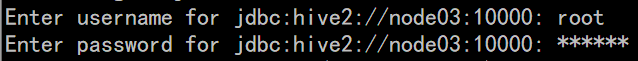

## 自动登陆beeline脚本

```shell
[root@node03 bin]# sudo yum install expect
[root@node03 bin]# vim he.exp
[root@node03 bin]# cat he.exp
#!/bin/expect
spawn beeline
set timeout 5
expect "beeline>"
send "!connect jdbc:hive2://node03:10000\r"
expect "Enter username for jdbc:hive2://node03:10000:"
send "root\r"
expect "Enter password for jdbc:hive2://node03:10000:"
send "123456\r"
interact

[root@node03 bin]#expect he.exp
```

## 示例

### hive_udf_demo

#### pom.xml

hive_udf_demo/pom.xml

```xml
<?xml version="1.0" encoding="UTF-8"?>
<project xmlns="http://maven.apache.org/POM/4.0.0"
         xmlns:xsi="http://www.w3.org/2001/XMLSchema-instance"
         xsi:schemaLocation="http://maven.apache.org/POM/4.0.0 http://maven.apache.org/xsd/maven-4.0.0.xsd">
    <modelVersion>4.0.0</modelVersion>

    <groupId>cn.itcast</groupId>
    <artifactId>day10_hive_udf_demo</artifactId>
    <version>1.0-SNAPSHOT</version>
    <packaging>jar</packaging>
    <dependencies>
        <!-- https://mvnrepository.com/artifact/org.apache.hive/hive-exec -->
        <dependency>
            <groupId>org.apache.hive</groupId>
            <artifactId>hive-exec</artifactId>
            <version>2.1.1</version>
        </dependency>
        <!-- https://mvnrepository.com/artifact/org.apache.hadoop/hadoop-common -->
        <dependency>
            <groupId>org.apache.hadoop</groupId>
            <artifactId>hadoop-common</artifactId>
            <version>2.7.5</version>
        </dependency>
    </dependencies>

    <build>
        <plugins>
            <plugin>
                <groupId>org.apache.maven.plugins</groupId>
                <artifactId>maven-compiler-plugin</artifactId>
                <version>3.0</version>
                <configuration>
                    <source>1.8</source>
                    <target>1.8</target>
                    <encoding>UTF-8</encoding>
                </configuration>
            </plugin>
        </plugins>
    </build>
</project>


```

### udf

#### MyUDF.java

hive_udf_demo/src/main/java/cn/itcast/udf/MyUDF.java

```java
package cn.itcast.udf;

import org.apache.hadoop.hive.ql.exec.UDF;
import org.apache.hadoop.io.Text;

public class MyUDF extends UDF {
    //模拟Hive的upper方法: 将字符串的第一个字符转为大写,而其他字符不变
    public Text evaluate(final  Text line){
        if(line.toString() != null && !line.toString().equals("")){
            String str = line.toString().substring(0, 1).toUpperCase()+line.toString().substring(1);

            return  new Text(str);
        }
        return  new Text("");
    }
}
```

## Hive之——自定义函数

关于Hive自定义函数UDF的相关信息，请参考博文《Hive之——自定义函数》
用户自定义聚合函数，用户提供的多个入参通过聚合计算(求和、求最大值、求最小值)得到一个聚合计算结果的函数。
问题：UDF也可以提供输入多个参数然后输出一个结果的运算，比如加法运算add(3，5)，add这个UDF需要实现UDF的evaluate方法,那么UDF和UDAF的实质分别究竟是什么？

Double evaluate(Double a, Double b)  
1.什么是UDAF
UDF只能实现一进一出的操作，如果需要实现多进一出，则需要实现UDAF。比如： Hive查询数据时，有些聚类函数在HQL没有自带，需要用户自定义实现； 用户自定义聚合函数: Sum, Average

2.实现UFAF的步骤
引入如下两下类

```java
import org.apache.hadoop.hive.ql.exec.UDAF ;
import org.apache.hadoop.hive.ql.exec.UDAFEvaluator  ;
```

函数类需要继承UDAF类，计算类Evaluator实现UDAFEvaluator接口
Evaluator需要实现UDAFEvaluator的init、iterate、terminatePartial、merge、terminate这几个函数。
       a）init函数实现接口UDAFEvaluator的init函数。
       b）iterate接收传入的参数，并进行内部的迭代。其返回类型为boolean。
       c）terminatePartial无参数，其为iterate函数遍历结束后，返回遍历得到的数据，terminatePartial类似于 hadoop的Combiner。
       d）merge接收terminatePartial的返回结果，进行数据merge操作，其返回类型为boolean。
       e）terminate返回最终的聚集函数结果。

3.实例
计算平均数

```java
package hive.udaf;

import org.apache.hadoop.hive.ql.exec.UDAF;
import org.apache.hadoop.hive.ql.exec.UDAFEvaluator;

public class Avg extends UDAF {
    public static class AvgState {
        private long mCount;
        private double mSum;

    }
    public static class AvgEvaluator implements UDAFEvaluator {
        AvgState state;
        public AvgEvaluator() {
            super();
            state = new AvgState();
            init();
        }
        /**
         * init函数类似于构造函数，用于UDAF的初始化
         */
        public void init() {
            state.mSum = 0;
            state.mCount = 0;
        }
        /**
         * iterate接收传入的参数，并进行内部的轮转。其返回类型为boolean * * @param o * @return
         */
        public boolean iterate(Double o) {
            if (o != null) {
                state.mSum += o;
                state.mCount++;
            }
            return true;
        }
        /**
         * terminatePartial无参数，其为iterate函数遍历结束后，返回轮转数据， * terminatePartial类似于hadoop的Combiner * * @return
         */
        public AvgState terminatePartial() {
            // combiner
            return state.mCount == 0 ? null : state;
        }
        /**
         * merge接收terminatePartial的返回结果，进行数据merge操作，其返回类型为boolean * * @param o * @return
         */
        public boolean merge(AvgState avgState) {
            if (avgState != null) {
                state.mCount += avgState.mCount;
                state.mSum += avgState.mSum;
            }
            return true;
        }
        /**
         * terminate返回最终的聚集函数结果 * * @return
         */
        public Double terminate() {
            return state.mCount == 0 ? null : Double.valueOf(state.mSum / state.mCount);
        }
    }
}
```

4.Hive中使用UDAF

将java文件编译成udaf_avg.jar
进入hive客户端添加jar包
`hive>add jar /home/hadoop/udaf_avg.jar`
创建临时函数
`hive>create temporary function udaf_avg 'hive.udaf.Avg'`
查询语句
`hive>select udaf_avg(people.age) from people`
销毁临时函数
`hive>drop temporary function udaf_avg`
5. 总结
通过上面的介绍，可以看到UDAF的用法与UDF的区别了，UDF虽然可以接收多个入参，但是参数个数是固定的(其实也可以不固定，只要evaluate方法的参数类型是变长参数即可，但是一般不这么用)，而UDAF的入参是元素个数不固定的集合，这个集合只要可遍历(使用Evaluator的iterate方法遍历)即可，上面的入参是people表的所有age列。
UDF是对只有单条记录的列进行的计算操作，而UDFA则是用户自定义的聚类函数，是基于表的所有记录进行的计算操作。

## 示例：IDEA通过JDBC联接HIVE

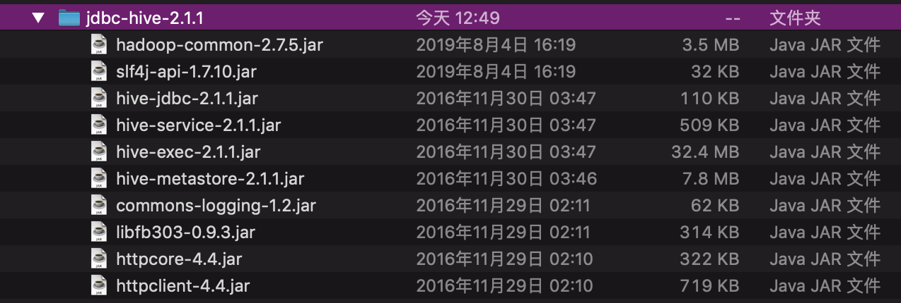
1.先将驱动压缩包解压到IDEA 安装目录
2.打开IDEA

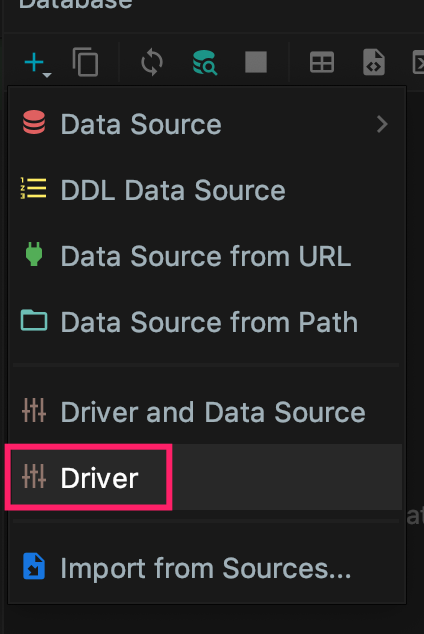
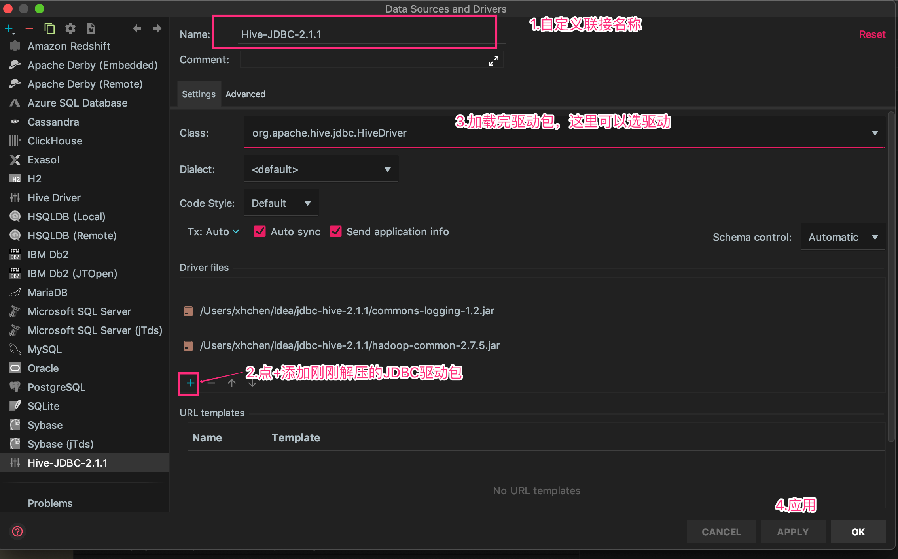

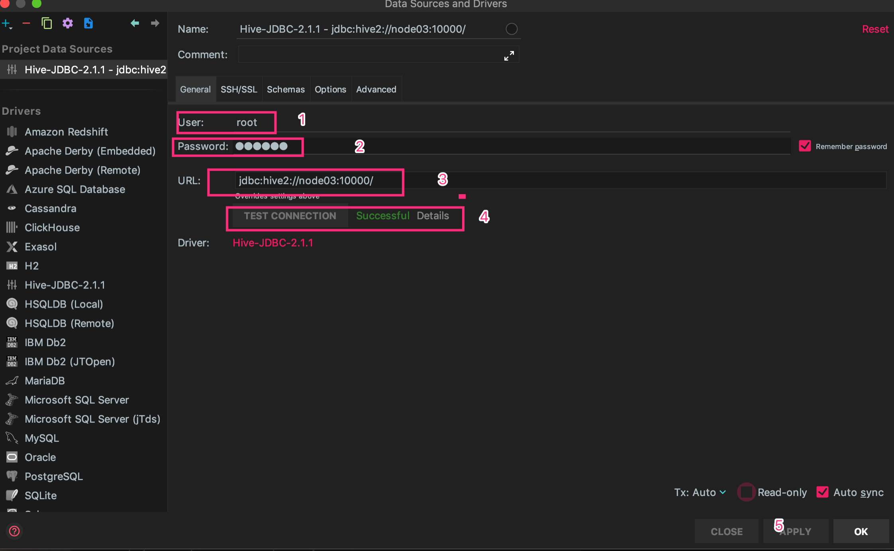

<jdbc:hive2://node03:10000/>

测试成功：

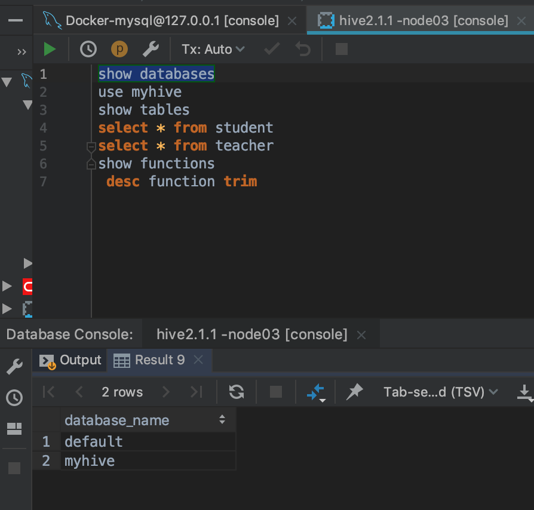

hive调优

hive调优
参数调优
    1、map阶段数据压缩
        set hive.exec.compress.intermediate=true
        set mapred.map.output.compression.codec= org.apache.hadoop.io.compress.SnappyCodec
        set mapred.map.output.compression.codec=com.hadoop.compression.lzo.LzoCodec;
    2、对最终生成的hive表数据压缩
        1、通过参数设置
            set hive.exec.compress.output=true
            set mapred.output.compression.codec=org.apache.hadoop.io.compress.SnappyCodec
        2、通过建表语句设置

```sql
            create table tablename (
             xxx,string
             xxx, bigint
            )
            ROW FORMAT DELTMITED FIELDS TERMINATED BY '\t'
            STORED AS orc tblproperties("orc.compress" = "SNAPPY")
```

3、分区(分区表相当于hive的索引，加快查询速度)
4、分桶(两个表join的时候，如果两个表在相同列上有分桶操作，会减少join数据量【要求两个表的桶数量要相同或成倍数】)
5、并行计算，stage不依赖的时候可以并行计算
        // 开启任务并行执行
        set hive.exec.parallel=true;
         // 同一个sql允许并行任务的最大线程数
        set hive.exec.parallel.thread.number=8;
 6、JVM重用
        JVM重用对hive的性能具有非常大的 影响，特别是对于很难避免小文件的场景或者task特别多的场景，这类场景大多数执行时间都很短。jvm的启动过程可能会造成相当大的开销，尤其是执行的job包含有成千上万个task任务的情况。
        set mapred.job.reuse.jvm.num.tasks=10;
7、调整reduce的个数
        第一种方法：根据数据量调整reduce个数  hive.exec.reducers.bytes.per.reducer 【设置每个reduce处理的数据量，默认256M】
        第二种方法: 直接设置reduce的个数  set mapred.reduce.tasks = number
8、推测执行
        mapred.map.tasks.speculative.execution
        mapred.reduce.tasks.speculative.execution
9、小文件合并
        set hive.merge.mapfiles = true                   ##在 map only 的任务结束时合并小文件
        set hive.merge.mapredfiles = false               ## true 时在 MapReduce 的任务结束时合并小文件
        set hive.merge.size.per.task = 256*1000*1000     ##合并文件的大小
        set mapred.max.split.size=256000000;             ##每个 Map 最大分割大小
        set mapred.min.split.size.per.node=1;            ##一个节点上 split 的最少值
        set hive.input.format=org.apache.hadoop.hive.ql.io.CombineHiveInputFormat;    ##执行Map前进行小文件合并
SQL调优
    1、where语句优化
        select m.cid,u.id from order m join customer u on( m.cid =u.id )where m.dt='20180808';
        可优化为
        select m.cid,u.id from （select * from order where dt='20180818'） m join customer u on( m.cid =u.id);
    2、union优化
        尽量不要使用union （union 去掉重复的记录）而是使用 union all 然后在用group by 去重
    3、count distinct优化
        不要使用count (distinct   cloumn) ,而要使用子查询实现count(distinct)
        select count(1) from (select id from tablename group by id) tmp;
    4、如果需要根据一张表的字段约束另一个张表，用in代替join
        select id,name from tb1  a join tb2 b on(a.id = b.id);
        可优化为
        select id,name from tb1 where id in(select id from tb2); in 要比join 快
    5、消灭子查询内的 group by 、 COUNT(DISTINCT)，MAX，MIN。 可以减少job的数量。
    6、join优化
        map端join
        set hive.auto.convert.join = true; 默认为true
        set hive.mapjoin.smalltable.filesize=25000000; 设置小表的阈值

7、本地模式
        当 Hive 查询处理的数据量比较小时，其实没有必要启动分布式模式去执行，因为以分布式方式执行就涉及到跨网络传输、多节点协调 等，并且消耗资源。这个时间可以只使用本地模式来执行 mapreduce job，只在一台机器上执行，速度会很快
        set hive.exec.mode.local.auto=true 是打开 hive 自动判断是否启动本地模式的开关，但是只 是打开这个参数并不能保证启动本地模式，要当 map 任务数不超过
            hive.exec.mode.local.auto.input.files.max 的个数并且 map 输入文件大小不超过
            hive.exec.mode.local.auto.inputbytes.max 所指定的大小时，才能启动本地模式。
